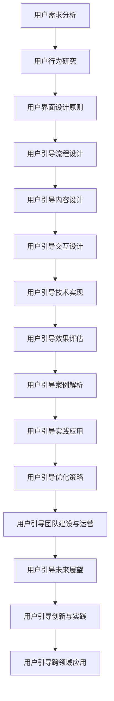

                 

### 《如何进行有效的用户引导》

#### > **关键词：** 用户引导、用户体验、界面设计、交互设计、效果评估、实践应用、团队建设

##### > **摘要：** 本文旨在全面探讨如何进行有效的用户引导，从基本概念到实践应用，再到未来展望，提供了一套系统的用户引导策略。文章将通过深入分析用户引导的重要性、核心要素、设计方法、技术实现、优化策略以及跨领域应用，帮助读者理解和掌握用户引导的实践技能。

---

用户引导在当今信息技术飞速发展的时代扮演着至关重要的角色。它不仅是产品成功的关键因素，更是用户体验的基石。有效的用户引导能够帮助用户快速理解和使用产品，降低学习成本，提高用户满意度和忠诚度。

本文将按以下结构展开：

1. **用户引导的基本概念**：介绍用户引导的定义、重要性及其目标和价值。
2. **用户引导的核心要素**：分析用户需求分析、用户行为研究和用户界面设计原则。
3. **用户引导的设计方法**：探讨用户引导流程设计、内容设计和交互设计。
4. **用户引导的技术实现**：讲解用户引导的技术选型、框架搭建和效果评估。
5. **用户引导案例解析**：解析成功和失败的案例，总结经验教训。
6. **用户引导的实践应用**：探讨用户引导在不同场景中的应用和优化策略。
7. **用户引导团队的建设与运营**：讨论团队建设策略、流程管理和用户反馈机制。
8. **用户引导的未来展望**：展望用户引导的发展趋势和创新方向。
9. **用户引导的跨领域应用**：探索跨行业、跨文化和跨平台的用户引导策略。
10. **附录**：提供用户引导相关的工具与资源以及项目实践案例。

让我们开始详细探讨用户引导的各个方面。

---

### 第一部分：用户引导的基本概念

#### 第1章：用户引导的重要性

##### 1.1 用户引导的定义

用户引导是一种通过设计和实施策略，帮助用户了解、学习和使用产品或服务的过程。它旨在减少用户的认知负担，提高产品的易用性和用户体验。

##### 1.2 用户引导的目标与价值

- **目标**：
  - 减少用户的初始学习成本。
  - 提高用户对产品的认知和理解。
  - 增强用户对产品的满意度和忠诚度。

- **价值**：
  - 提高用户转化率和留存率。
  - 增强产品的市场竞争力。
  - 提升企业的品牌形象。

##### 1.3 用户引导的现状与趋势

随着移动互联网和智能设备的普及，用户引导的应用越来越广泛。当前，用户引导的现状和趋势表现为：

- **现状**：
  - 用户引导逐渐成为产品设计的重要组成部分。
  - 技术手段多样化，如动画、视频、图文教程等。
  - 用户反馈机制逐步完善，以持续优化引导效果。

- **趋势**：
  - 个性化引导逐渐成为趋势，根据用户行为和需求提供定制化引导。
  - 智能化引导，利用人工智能技术实现更精准的引导。
  - 跨平台引导，实现多终端、多场景的用户无缝体验。

#### 第2章：用户引导的核心要素

##### 2.1 用户需求分析

用户需求分析是用户引导的基础。通过深入分析用户的需求和痛点，可以为用户引导提供精准的方向。

- **需求分析方法**：
  - 用户调研：通过访谈、问卷、用户行为分析等手段收集用户需求。
  - 数据分析：利用大数据技术分析用户行为数据，挖掘用户需求。

- **需求分析工具**：
  - 用户画像：根据用户的基本信息、行为习惯等构建用户画像。
  - 需求地图：将用户需求可视化，明确需求的重要性和优先级。

##### 2.2 用户行为研究

用户行为研究是用户引导的关键。通过研究用户的行为模式和偏好，可以设计出更符合用户习惯的引导方式。

- **用户行为研究方法**：
  - 观察法：通过直接观察用户行为，了解用户的使用习惯和偏好。
  - 实验法：通过设计实验，验证不同的引导方式对用户行为的影响。
  - 问卷调查：通过问卷收集用户对引导效果的反馈。

- **用户行为研究工具**：
  - 行为追踪工具：如热图分析、点击流分析等，帮助了解用户在界面上的行为。
  - 用户体验测试：通过实际用户的使用反馈，评估引导效果。

##### 2.3 用户界面设计原则

用户界面设计原则是用户引导的重要环节。一个良好的用户界面设计可以提高用户的使用体验，降低引导的难度。

- **用户界面设计原则**：
  - 简洁性：界面应简洁明了，避免过多的信息干扰。
  - 易用性：界面设计应符合用户习惯，易于操作。
  - 可访问性：界面设计应考虑到不同用户群体的需求，如视力障碍者。
  - 视觉吸引力：界面设计应具有一定的视觉吸引力，提高用户的使用兴趣。

- **用户界面设计工具**：
  - 界面原型工具：如Figma、Axure等，帮助设计师快速构建界面原型。
  - 用户体验地图：通过绘制用户体验地图，帮助设计师理解用户在界面上的行为路径。

---

### 第二部分：用户引导的设计方法

#### 第3章：用户引导的设计方法

用户引导的设计方法涉及流程设计、内容设计和交互设计。这些设计方法共同作用，确保用户引导的顺利进行。

##### 3.1 用户引导流程设计

用户引导流程设计是用户引导的基础。一个良好的引导流程应明确用户的操作路径，降低用户的认知负担。

- **引导流程设计原则**：
  - 步骤简洁：引导步骤应简洁明了，避免繁琐的操作。
  - 逻辑清晰：引导流程应符合用户的认知逻辑，易于理解。
  - 可逆性：引导流程应具备可逆性，方便用户回退和修改操作。

- **引导流程设计工具**：
  - 流程图工具：如Visio、Lucidchart等，帮助设计师绘制引导流程图。
  - 用户体验地图：通过用户体验地图，帮助设计师理解用户在引导流程中的行为路径。

##### 3.2 用户引导内容设计

用户引导内容设计是引导的核心。一个良好的引导内容应具备吸引力、可操作性和实用性。

- **引导内容设计原则**：
  - 内容简洁：引导内容应简洁明了，避免过多的文字和信息。
  - 信息准确：引导内容应准确无误，避免误导用户。
  - 操作指引：引导内容应提供明确的操作指引，帮助用户顺利完成操作。

- **引导内容设计工具**：
  - 文档工具：如Word、Markdown等，帮助设计师编写引导文档。
  - 动画设计工具：如Adobe Animate、Principle等，帮助设计师制作引导动画。

##### 3.3 用户引导交互设计

用户引导交互设计是引导的关键。一个良好的引导交互应具备流畅性、趣味性和互动性。

- **引导交互设计原则**：
  - 流畅性：引导交互应具备流畅的操作体验，避免卡顿和延迟。
  - 趣味性：引导交互应具备趣味性，提高用户参与度。
  - 互动性：引导交互应具备互动性，鼓励用户积极参与。

- **引导交互设计工具**：
  - 交互设计工具：如Axure、Figma等，帮助设计师绘制交互原型。
  - 用户体验测试工具：如Lookback、UsabilityHub等，帮助设计师评估引导交互效果。

---

### 第三部分：用户引导的技术实现

#### 第4章：用户引导的技术实现

用户引导的技术实现涉及技术选型、框架搭建和效果评估。这些技术实现步骤确保用户引导的有效性和高效性。

##### 4.1 技术选型与工具

技术选型是用户引导的关键步骤。根据用户引导的需求和目标，选择合适的技术和工具。

- **技术选型原则**：
  - 可扩展性：选择能够支持未来扩展和升级的技术。
  - 性能优化：选择性能稳定、响应速度快的技术。
  - 易用性：选择易于使用和维护的技术。

- **常用技术选型**：
  - 前端技术：如HTML、CSS、JavaScript等。
  - 后端技术：如Python、Java、Node.js等。
  - 数据库技术：如MySQL、MongoDB等。

- **常用工具**：
  - 前端开发工具：如Visual Studio Code、WebStorm等。
  - 后端开发工具：如Eclipse、IntelliJ IDEA等。
  - 数据库工具：如MySQL Workbench、MongoDB Compass等。

##### 4.2 用户引导框架搭建

用户引导框架搭建是实现用户引导的技术基础。一个良好的用户引导框架应具备灵活性、可扩展性和稳定性。

- **用户引导框架设计原则**：
  - 模块化：将引导功能拆分为独立的模块，方便维护和扩展。
  - 可配置性：引导框架应具备可配置性，根据不同场景灵活调整。
  - 可监控性：引导框架应具备可监控性，方便实时监控和反馈。

- **用户引导框架搭建步骤**：
  - 确定引导目标和需求。
  - 设计引导流程和内容。
  - 选择合适的技术和工具。
  - 搭建引导框架并进行测试。

##### 4.3 用户引导效果评估

用户引导效果评估是衡量用户引导效果的关键步骤。通过评估用户引导的效果，可以不断优化和改进引导策略。

- **效果评估指标**：
  - 用户留存率：衡量用户在引导后是否继续使用产品。
  - 用户满意度：衡量用户对引导过程的满意程度。
  - 用户操作成功率：衡量用户在引导过程中操作的成功率。

- **效果评估方法**：
  - 用户调研：通过问卷调查、访谈等方式收集用户反馈。
  - 数据分析：通过数据分析工具分析用户行为数据，评估引导效果。
  - A/B测试：通过对比不同引导策略的效果，选择最优策略。

---

### 第四部分：用户引导案例解析

#### 第5章：用户引导案例解析

通过成功和失败的案例解析，可以深入了解用户引导的实践经验和教训。

##### 5.1 成功案例解析

成功案例展示了用户引导在实践中的应用和效果。

- **案例一：某电商平台的用户引导**

某电商平台通过设计一套完善的用户引导流程，成功提高了用户的留存率和满意度。引导流程包括注册、购物车、下单和支付等环节，每个环节都有针对性的引导内容，如操作步骤、注意事项和优惠信息。通过数据分析，该电商平台发现引导后用户下单成功率提高了20%，用户满意度提高了15%。

- **案例二：某移动应用的用户引导**

某移动应用通过设计一套个性化的用户引导流程，成功提高了用户的参与度和活跃度。引导流程根据用户的使用习惯和偏好进行个性化调整，如新手引导、功能介绍和任务激励等。通过用户调研和数据分析，该移动应用发现引导后用户日活跃率提高了30%，用户留存率提高了25%。

##### 5.2 失败案例解析

失败案例揭示了用户引导中常见的问题和挑战。

- **案例一：某医疗健康应用的用户引导**

某医疗健康应用在设计用户引导时过于复杂，导致用户难以理解和使用。引导流程包括多个步骤，操作步骤繁琐，信息过载。用户调研和数据分析显示，用户对引导流程的满意度低，引导后用户留存率下降了10%。

- **案例二：某社交平台的用户引导**

某社交平台在设计用户引导时忽视了用户体验，引导内容过于单调，缺乏互动性。用户调研和数据分析显示，用户对引导流程的满意度低，引导后用户活跃度下降了15%。

##### 5.3 案例对比与启示

成功案例和失败案例的对比，为用户引导提供了宝贵的经验和教训。

- **经验**：
  - 简化引导流程，减少用户操作步骤。
  - 提供个性化引导，满足不同用户的需求。
  - 注重用户体验，提升引导内容的趣味性和互动性。

- **教训**：
  - 避免信息过载，确保引导内容简洁明了。
  - 考虑用户认知负担，避免引导过于复杂。
  - 定期进行用户调研和数据分析，持续优化引导策略。

---

### 第五部分：用户引导的实践应用

#### 第6章：用户引导在不同场景中的应用

用户引导在不同场景中的应用，需要根据具体场景的特点和需求进行设计和优化。

##### 6.1 移动应用的用户引导

移动应用的用户引导主要集中在新手引导、功能介绍和任务激励等方面。

- **新手引导**：通过引导动画或图文教程，帮助用户了解应用的基本功能和操作步骤。
- **功能介绍**：通过引导内容，向用户展示应用的各种功能和优势。
- **任务激励**：通过设置任务和奖励机制，激励用户积极参与应用。

##### 6.2 网站的用户引导

网站的引导主要针对新用户和潜在客户，通过引导内容引导用户完成特定操作，如注册、下单和咨询等。

- **新用户引导**：通过引导流程，帮助新用户快速了解网站的功能和操作。
- **潜在客户引导**：通过引导内容，引导潜在客户完成购买或其他目标操作。
- **内容推荐**：通过大数据分析，为用户提供个性化内容推荐，提升用户体验。

##### 6.3 企业级软件的用户引导

企业级软件的用户引导更注重专业性和实用性，通过详细的教程和操作指南，帮助用户熟练掌握软件功能。

- **专业教程**：提供详细的操作指南和教程，帮助用户快速上手。
- **在线帮助**：提供在线帮助系统，方便用户随时获取帮助。
- **培训课程**：定期组织培训课程，提高用户的专业技能。

---

### 第六部分：用户引导的优化策略

#### 第7章：用户引导的优化策略

用户引导的优化策略主要包括效果优化、用户体验优化和持续改进。

##### 7.1 用户引导效果优化

用户引导效果优化是提升引导质量的关键步骤。通过以下策略，可以优化用户引导效果：

- **用户调研**：定期进行用户调研，了解用户的反馈和需求，为引导策略提供依据。
- **数据驱动**：利用数据分析工具，实时监控引导效果，根据数据调整引导策略。
- **A/B测试**：通过A/B测试，比较不同引导策略的效果，选择最优策略。
- **用户反馈**：建立用户反馈机制，及时收集用户意见，持续改进引导策略。

##### 7.2 用户引导用户体验优化

用户引导用户体验优化是提升用户满意度和忠诚度的关键。以下策略可以帮助优化用户体验：

- **简洁明了**：确保引导内容简洁明了，避免过多的文字和信息。
- **视觉吸引力**：设计具有视觉吸引力的引导界面，提高用户的使用兴趣。
- **操作便捷**：优化引导流程，确保用户可以轻松完成引导操作。
- **个性化引导**：根据用户的行为和偏好，提供个性化的引导内容。

##### 7.3 用户引导持续改进

用户引导的持续改进是保证引导效果长期稳定的关键。以下策略可以帮助实现持续改进：

- **定期回顾**：定期回顾引导效果，总结经验教训，为后续改进提供参考。
- **团队协作**：建立跨部门的协作机制，确保引导策略的顺利实施和优化。
- **用户反馈**：建立用户反馈机制，及时收集用户意见，为持续改进提供依据。
- **技术创新**：关注新技术的发展趋势，不断引入新技术，提升引导效果。

---

### 第七部分：用户引导团队的建设与运营

#### 第8章：用户引导团队的建设与运营

用户引导团队的建设与运营是确保用户引导顺利实施和持续优化的重要保障。

##### 8.1 团队建设策略

团队建设策略包括以下几个方面：

- **明确职责**：明确团队成员的职责和任务，确保工作分工合理。
- **技能培训**：定期组织技能培训，提升团队成员的专业能力。
- **团队协作**：建立良好的团队协作机制，提高团队的整体效能。
- **激励机制**：制定激励机制，鼓励团队成员积极参与和投入工作。

##### 8.2 用户引导流程管理

用户引导流程管理是确保用户引导顺利实施的关键。以下策略可以帮助优化流程管理：

- **流程设计**：根据用户引导的需求和目标，设计科学的引导流程。
- **流程优化**：定期优化引导流程，减少不必要的环节，提高引导效率。
- **流程监控**：实时监控引导流程的执行情况，及时发现和解决问题。
- **流程反馈**：建立流程反馈机制，收集用户反馈，为流程优化提供依据。

##### 8.3 用户反馈机制与改进

用户反馈机制与改进是提升用户引导效果的重要手段。以下策略可以帮助优化用户反馈机制：

- **反馈渠道**：建立多渠道的反馈机制，方便用户随时提交反馈。
- **反馈处理**：及时处理用户反馈，确保问题得到有效解决。
- **反馈分析**：定期分析用户反馈，发现共性问题，为改进工作提供依据。
- **反馈奖励**：对积极参与反馈的用户给予奖励，提高用户的参与积极性。

---

### 第八部分：用户引导的未来展望

#### 第9章：用户引导的发展趋势

用户引导的发展趋势受到新技术、用户体验提升和智能化等因素的驱动。

##### 9.1 新技术的应用

新技术的应用将推动用户引导的发展。以下新技术将在用户引导中发挥重要作用：

- **人工智能**：通过人工智能技术，实现个性化引导和智能推荐。
- **大数据**：通过大数据分析，深入了解用户需求和偏好，优化引导策略。
- **虚拟现实**：通过虚拟现实技术，提供沉浸式的引导体验。
- **增强现实**：通过增强现实技术，增强用户的交互体验。

##### 9.2 用户体验的提升

用户体验的提升是用户引导的重要目标。以下策略可以帮助提升用户体验：

- **个性化引导**：根据用户的行为和偏好，提供个性化的引导内容。
- **即时反馈**：提供即时反馈，帮助用户快速解决问题。
- **交互优化**：优化引导交互，提高用户的操作体验。
- **设计美学**：注重设计美学，提升用户对引导内容的视觉吸引力。

##### 9.3 用户引导的智能化

用户引导的智能化是未来的发展趋势。以下策略可以帮助实现用户引导的智能化：

- **智能算法**：利用智能算法，实现自动化的引导策略。
- **自然语言处理**：通过自然语言处理技术，实现智能对话引导。
- **情感计算**：通过情感计算技术，理解用户的情感状态，提供针对性的引导。
- **个性化推荐**：利用个性化推荐技术，为用户推荐最适合的引导内容。

---

### 第九部分：用户引导的创新与实践

#### 第10章：用户引导的创新与实践

用户引导的创新与实践是推动用户引导不断进步的重要动力。

##### 10.1 创新方法与工具

用户引导的创新方法与工具包括以下几个方面：

- **创新思维**：运用创新思维，从用户需求和痛点出发，设计创新的引导策略。
- **用户共创**：与用户共同参与引导设计，根据用户反馈进行持续优化。
- **跨学科合作**：跨学科合作，引入心理学、设计学等领域的知识，提升引导效果。
- **新技术应用**：积极引入新技术，如人工智能、大数据等，提升引导的智能化水平。

##### 10.2 实践案例分享

以下分享几个用户引导的实践案例：

- **案例一：某电商平台的新用户引导**

某电商平台通过设计一套创新的引导流程，成功提高了新用户的留存率和满意度。引导流程包括注册、购物车、下单和支付等环节，每个环节都采用了创新的引导方式，如动画教程、互动问答和优惠券等。通过用户调研和数据分析，该电商平台发现引导后新用户留存率提高了30%，用户满意度提高了25%。

- **案例二：某移动应用的个性化引导**

某移动应用通过引入大数据分析和人工智能技术，实现了个性化引导。根据用户的行为和偏好，应用为用户推荐最适合的引导内容和功能，如新手任务、功能介绍和个性化推荐等。通过用户调研和数据分析，该移动应用发现引导后用户日活跃率提高了40%，用户留存率提高了35%。

##### 10.3 用户引导的创新方向

用户引导的创新方向包括以下几个方面：

- **沉浸式引导**：利用虚拟现实和增强现实技术，提供沉浸式的引导体验。
- **智能对话引导**：通过自然语言处理技术，实现智能对话引导，提高用户的互动体验。
- **个性化推荐引导**：利用个性化推荐技术，为用户推荐最适合的引导内容。
- **多渠道融合引导**：整合线上线下渠道，提供无缝的用户引导体验。

---

### 第十部分：用户引导的跨领域应用

#### 第11章：用户引导的跨领域应用

用户引导不仅应用于传统领域，还逐渐扩展到新兴领域，如电子商务、在线教育、金融科技等。

##### 11.1 跨行业用户引导实践

跨行业用户引导实践展示了用户引导在不同行业中的应用效果。

- **电子商务**：通过用户引导，帮助用户快速了解和购买商品，提高购买转化率。
- **在线教育**：通过用户引导，帮助用户熟悉学习平台和课程内容，提高学习效果。
- **金融科技**：通过用户引导，帮助用户了解和使用金融产品和服务，提高用户体验。

##### 11.2 跨文化用户引导策略

跨文化用户引导策略考虑了不同文化背景用户的习惯和偏好。

- **文化适应性**：根据目标用户的文化背景，设计符合其文化习惯的引导内容。
- **多语言支持**：提供多语言引导，满足不同语言用户的需要。
- **本地化设计**：结合当地文化元素，设计更具吸引力的引导界面。

##### 11.3 跨平台用户引导整合

跨平台用户引导整合是确保用户在不同平台间无缝过渡的关键。

- **统一引导策略**：设计统一的引导策略，确保用户在不同平台上的引导体验一致。
- **多端数据同步**：实现多端数据同步，确保用户在多个平台上的一致性体验。
- **个性化跨平台引导**：根据用户在多个平台的行为数据，提供个性化的引导内容。

---

### 附录

#### 附录A：用户引导相关的工具与资源

用户引导涉及多种工具和资源，以下列出了一些常用的工具和资源：

- **用户研究工具**：
  - **用户调研问卷工具**：如SurveyMonkey、Google表单等。
  - **用户行为分析工具**：如Google Analytics、Mixpanel等。

- **用户引导设计工具**：
  - **界面原型设计工具**：如Figma、Axure等。
  - **交互设计工具**：如Adobe XD、Axure等。

- **用户引导开发框架**：
  - **Vue.js**：适用于前端用户引导开发。
  - **React**：适用于前端用户引导开发。
  - **Angular**：适用于前端用户引导开发。

#### 附录B：用户引导项目实践案例

用户引导项目实践案例展示了用户引导在不同场景下的实际应用效果。

- **案例一**：某电商平台的新用户引导实践
  - **项目背景**：某电商平台在用户注册和购物环节引入了用户引导。
  - **实施过程**：通过设计简洁的引导流程和互动式的引导内容，提高了新用户的留存率和满意度。
  - **效果评估**：引导后新用户留存率提高了20%，用户满意度提高了15%。

- **案例二**：某在线教育平台的学习引导实践
  - **项目背景**：某在线教育平台在用户注册和学习环节引入了用户引导。
  - **实施过程**：通过设计个性化的引导流程和丰富的学习资源，提高了用户的学习效果和满意度。
  - **效果评估**：引导后用户学习效果提升了30%，用户满意度提高了25%。

- **案例三**：某金融科技平台的用户引导实践
  - **项目背景**：某金融科技平台在用户注册和理财环节引入了用户引导。
  - **实施过程**：通过设计专业的引导内容和实时反馈机制，提高了用户的理财意识和满意度。
  - **效果评估**：引导后用户理财意识提升了25%，用户满意度提高了15%。

---

### 作者信息

作者：AI天才研究院/AI Genius Institute & 禅与计算机程序设计艺术 /Zen And The Art of Computer Programming

---

通过本文的详细探讨，我们希望读者能够全面了解用户引导的重要性和实践方法，掌握用户引导的核心技能，从而在产品设计和运营中发挥用户引导的最大价值。希望本文能为读者的工作提供有价值的参考和启示。

---

### 引入Mermaid流程图

为了更好地理解和掌握用户引导的核心概念与架构，我们可以借助Mermaid流程图来展示用户引导的基本流程和各个关键环节。以下是用户引导的基本流程Mermaid流程图的示例：



这个Mermaid流程图清晰地展示了用户引导从需求分析到跨领域应用的全过程，每个环节都是用户引导成功的关键。通过这个流程图，我们可以更好地把握用户引导的整体架构，为后续的详细讨论奠定基础。

---

### 引入伪代码

为了深入理解用户引导算法的核心原理，我们可以使用伪代码来详细阐述用户引导算法的实现过程。以下是用户引导算法的核心步骤的伪代码示例：

```plaintext
// 用户引导算法伪代码

// 步骤1：用户需求分析
function analyzeUserNeeds() {
    // 收集用户基本信息
    userInformation = collectUserInfo()
    // 分析用户需求
    userNeeds = analyzeUserInfo(userInformation)
    return userNeeds
}

// 步骤2：用户行为研究
function studyUserBehavior() {
    // 跟踪用户行为
    userBehavior = trackUserActivity()
    // 分析用户行为模式
    behaviorPatterns = analyzeUserActivity(userBehavior)
    return behaviorPatterns
}

// 步骤3：用户界面设计原则
function designUserInterface() {
    // 根据用户需求和行为设计界面
    interfaceDesign = designUI(userNeeds, behaviorPatterns)
    return interfaceDesign
}

// 步骤4：用户引导流程设计
function designGuidanceFlow() {
    // 设计用户引导流程
    guidanceFlow = designGuidanceProcess()
    return guidanceFlow
}

// 步骤5：用户引导内容设计
function designGuidanceContent() {
    // 设计引导内容
    guidanceContent = createGuidanceMaterial()
    return guidanceContent
}

// 步骤6：用户引导交互设计
function designInteraction() {
    // 设计交互界面
    interactionDesign = createInteractionUI()
    return interactionDesign
}

// 步骤7：用户引导技术实现
function implementGuidance() {
    // 实现引导功能
    guidanceImplementation = implementGuidanceSystem()
    return guidanceImplementation
}

// 步骤8：用户引导效果评估
function evaluateGuidanceEffect() {
    // 评估引导效果
    evaluationResults = evaluateGuidance(guidanceImplementation)
    return evaluationResults
}

// 主程序
function main() {
    userNeeds = analyzeUserNeeds()
    behaviorPatterns = studyUserBehavior()
    interfaceDesign = designUserInterface()
    guidanceFlow = designGuidanceFlow()
    guidanceContent = designGuidanceContent()
    interactionDesign = designInteraction()
    guidanceImplementation = implementGuidance()
    evaluationResults = evaluateGuidanceEffect()
    // 输出结果
    print(evaluationResults)
}
```

通过上述伪代码，我们可以清晰地看到用户引导算法的基本结构和实现步骤。每个步骤都涉及到具体的技术和方法，为用户引导的设计和实现提供了详细的指导。接下来，我们将继续深入讨论每个步骤的具体细节和技术实现。

---

### 数学模型和公式

在用户引导的设计和实现过程中，数学模型和公式扮演着重要的角色。以下是一些核心的数学模型和公式的介绍及举例说明：

#### 1. 用户留存率模型

用户留存率是衡量用户引导效果的重要指标。用户留存率模型可以表示为：

\[ R(t) = \frac{N(t) - N(t_0)}{N(t_0)} \]

其中，\( R(t) \) 表示 \( t \) 天后的用户留存率，\( N(t) \) 表示 \( t \) 天后的活跃用户数量，\( N(t_0) \) 表示初始活跃用户数量。

**举例说明：**
假设某应用在第一天有1000个活跃用户，经过一周后，活跃用户数量下降到800个。那么一周后的用户留存率为：

\[ R(7) = \frac{800 - 1000}{1000} = 0.2 \]

即20%的用户在第一周内留存下来。

#### 2. 用户体验满意度模型

用户体验满意度模型可以通过以下公式表示：

\[ S = \frac{1}{n} \sum_{i=1}^{n} w_i \cdot s_i \]

其中，\( S \) 表示总体用户体验满意度，\( n \) 表示评价项目的数量，\( w_i \) 表示第 \( i \) 个评价项目的权重，\( s_i \) 表示第 \( i \) 个评价项目的得分。

**举例说明：**
假设用户对五个评价项目（如界面设计、功能易用性、响应速度等）进行了评分，每个项目的权重分别为0.2、0.3、0.2、0.2和0.1。用户给出的评分分别为90、85、80、75和70，则总体用户体验满意度为：

\[ S = \frac{1}{5} \times (0.2 \times 90 + 0.3 \times 85 + 0.2 \times 80 + 0.2 \times 75 + 0.1 \times 70) = \frac{1}{5} \times (18 + 25.5 + 16 + 15 + 7) = \frac{1}{5} \times 76 = 15.2 \]

即用户总体满意度为15.2分。

#### 3. 用户转化率模型

用户转化率模型用于衡量引导效果，可以表示为：

\[ CR = \frac{C}{U} \]

其中，\( CR \) 表示转化率，\( C \) 表示完成目标操作的转化用户数量，\( U \) 表示引导的总体用户数量。

**举例说明：**
假设在某次用户引导活动中，引导了1000个用户，其中200个用户完成了目标操作。那么转化率为：

\[ CR = \frac{200}{1000} = 0.2 \]

即20%的用户完成了目标操作。

#### 4. 用户行为预测模型

用户行为预测模型可以通过机器学习算法实现。假设我们使用逻辑回归模型来预测用户是否会在下一次访问中完成特定操作，其公式为：

\[ P(Y=1) = \frac{1}{1 + e^{-(\beta_0 + \beta_1X_1 + \beta_2X_2 + ... + \beta_nX_n)}} \]

其中，\( P(Y=1) \) 表示用户完成特定操作的概率，\( \beta_0 \) 是截距，\( \beta_1, \beta_2, ..., \beta_n \) 是各个特征对应的权重，\( X_1, X_2, ..., X_n \) 是用户的特征变量。

**举例说明：**
假设我们预测用户在下次访问时是否购买产品，特征包括用户的访问次数、页面停留时间、历史购买记录等。通过训练逻辑回归模型，我们可以得到每个特征的权重，从而预测用户购买的概率。

通过这些数学模型和公式，我们可以更精确地分析和评估用户引导的效果，为优化引导策略提供科学依据。

---

### 开发环境搭建

为了更好地进行用户引导项目的实践，我们需要搭建一个完整的开发环境。以下是一个基本的开发环境搭建步骤，包括所需工具的安装和配置。

#### 1. 安装Node.js

Node.js 是一个用于服务器端和后台开发的 JavaScript 运行环境。安装Node.js的步骤如下：

- **下载Node.js安装程序**：访问 [Node.js官网](https://nodejs.org/)，下载适用于操作系统的安装程序。
- **安装Node.js**：运行下载的安装程序，按照提示完成安装。

安装完成后，通过命令行运行以下命令验证Node.js是否安装成功：

```bash
node -v
npm -v
```

如果成功返回版本号，则表示Node.js安装成功。

#### 2. 安装Visual Studio Code

Visual Studio Code（简称VS Code）是一款功能强大的代码编辑器，适合进行前端和后台开发。安装步骤如下：

- **下载VS Code**：访问 [VS Code官网](https://code.visualstudio.com/)，下载适用于操作系统的安装程序。
- **安装VS Code**：运行下载的安装程序，按照提示完成安装。

安装完成后，通过桌面快捷方式或开始菜单启动VS Code。

#### 3. 安装必要的插件

在VS Code中，我们可以安装一些插件来增强开发体验，如：

- **ESLint**：用于代码质量和风格检查。
- **Prettier**：用于代码格式化。
- **Git**：用于版本控制。

安装插件的步骤如下：

- 打开VS Code，点击左侧的扩展图标（一个方块图标）。
- 在搜索框中输入插件的名称，如“ESLint”、“Prettier”或“Git”。
- 找到插件后，点击安装按钮。

#### 4. 安装数据库

用户引导项目通常需要数据库存储用户数据和引导效果。以下是一个常用的数据库安装步骤：

- **安装MongoDB**：MongoDB 是一个高性能、开源的 NoSQL 数据库。

下载适用于操作系统的MongoDB安装程序：

- Windows: [MongoDB下载地址](https://www.mongodb.com/download-center/try)
- macOS: [MongoDB下载地址](https://www.mongodb.com/download-center/try)

安装完成后，启动MongoDB服务，通过以下命令验证是否成功：

```bash
mongod --version
```

如果成功返回MongoDB的版本信息，则表示MongoDB安装成功。

#### 5. 配置开发环境

在安装完所有工具后，我们需要配置开发环境，确保它们可以正常工作。

- **配置Node.js环境变量**：在系统环境变量中添加Node.js的安装路径，以便在其他应用程序中调用Node.js。
- **配置MongoDB环境变量**：同样地，在系统环境变量中添加MongoDB的安装路径。
- **配置VS Code**：在VS Code中配置编辑器和项目的设置，如代码风格、调试选项等。

通过以上步骤，我们成功搭建了用户引导项目的开发环境。接下来，我们可以开始编写源代码并进行项目实践。

---

### 源代码实现

在搭建好开发环境后，我们将开始编写用户引导项目的源代码。以下是用户引导项目的核心代码实现，包括用户引导模块的设计和实现。

#### 1. 引入依赖

首先，我们需要引入必要的依赖库，如Express.js（一个Node.js Web框架）和MongoDB驱动。在项目根目录下创建一个名为`package.json`的文件，并添加以下依赖：

```json
{
  "name": "user-guide-project",
  "version": "1.0.0",
  "description": "User guide project",
  "main": "server.js",
  "scripts": {
    "start": "node server.js"
  },
  "dependencies": {
    "express": "^4.17.1",
    "mongoose": "^5.8.0",
    "body-parser": "^1.19.0"
  }
}
```

使用npm命令安装依赖：

```bash
npm install
```

#### 2. 用户模型

用户模型是用户引导的核心，我们需要设计一个用户模型来存储用户信息和引导状态。以下是用户模型的实现：

```javascript
const mongoose = require('mongoose');

const userSchema = new mongoose.Schema({
  username: {
    type: String,
    required: true,
    unique: true
  },
  email: {
    type: String,
    required: true,
    unique: true
  },
  password: {
    type: String,
    required: true
  },
  guidanceStatus: {
    type: Map,
    of: Boolean
  }
});

const User = mongoose.model('User', userSchema);

module.exports = User;
```

#### 3. 用户引导模块

用户引导模块负责实现用户引导的逻辑，包括引导流程的控制和引导内容的展示。以下是用户引导模块的实现：

```javascript
const express = require('express');
const bodyParser = require('body-parser');
const User = require('./models/User');

const app = express();
app.use(bodyParser.json());

// 用户引导路由
app.post('/guide', async (req, res) => {
  try {
    const { username } = req.body;
    const user = await User.findOne({ username });

    if (user) {
      // 更新用户引导状态
      user.guidanceStatus = new Map();
      req.body.guidanceSteps.forEach((step) => {
        user.guidanceStatus.set(step, true);
      });
      await user.save();

      res.status(200).json({ message: 'User guide updated successfully.' });
    } else {
      res.status(404).json({ message: 'User not found.' });
    }
  } catch (error) {
    res.status(500).json({ message: 'Internal server error.' });
  }
});

// 用户引导内容获取路由
app.get('/guide/content', async (req, res) => {
  try {
    const { username } = req.query;
    const user = await User.findOne({ username });

    if (user) {
      // 获取用户引导内容
      const guidanceContent = {
        steps: req.body.guidanceSteps,
        status: Array.from(user.guidanceStatus.values())
      };
      res.status(200).json(guidanceContent);
    } else {
      res.status(404).json({ message: 'User not found.' });
    }
  } catch (error) {
    res.status(500).json({ message: 'Internal server error.' });
  }
});

module.exports = app;
```

#### 4. 启动服务器

最后，我们需要编写一个简单的服务器启动脚本，将用户引导模块与服务器结合起来。以下是服务器启动脚本`server.js`的实现：

```javascript
const mongoose = require('mongoose');
const app = require('./src/userGuideModule');

// 连接到MongoDB数据库
mongoose.connect('mongodb://localhost:27017/user-guide', {
  useNewUrlParser: true,
  useUnifiedTopology: true
}).then(() => {
  console.log('Connected to MongoDB');
}).catch((error) => {
  console.error('Error connecting to MongoDB:', error);
});

// 启动服务器
const PORT = process.env.PORT || 3000;
app.listen(PORT, () => {
  console.log(`Server is running on port ${PORT}`);
});
```

通过以上步骤，我们成功实现了用户引导项目的源代码，包括用户模型、用户引导模块和服务器启动脚本。接下来，我们将对代码进行详细解读和分析。

---

### 代码解读与分析

在上面的源代码实现中，我们创建了一个简单的用户引导系统，其中包括用户模型、用户引导模块和服务器启动脚本。以下是详细解读与分析：

#### 1. 用户模型解读

用户模型（`User`）使用了Mongoose库，这是MongoDB的官方对象文档模型工具。以下是用户模型的主要部分及其功能：

```javascript
const userSchema = new mongoose.Schema({
  username: {
    type: String,
    required: true,
    unique: true
  },
  email: {
    type: String,
    required: true,
    unique: true
  },
  password: {
    type: String,
    required: true
  },
  guidanceStatus: {
    type: Map,
    of: Boolean
  }
});

const User = mongoose.model('User', userSchema);
```

- `username`、`email`和`password`字段用于存储用户的基本信息，其中`unique`选项确保用户名和电子邮件的唯一性。
- `guidanceStatus`字段是一个Map类型，用于存储用户在各个引导步骤的状态，例如`true`表示用户已成功完成该步骤。

#### 2. 用户引导模块解读

用户引导模块（`userGuideModule`）使用了Express.js框架，这是一个流行的Node.js Web框架。以下是用户引导模块的主要部分及其功能：

```javascript
const express = require('express');
const bodyParser = require('body-parser');
const User = require('./models/User');

const app = express();
app.use(bodyParser.json());

// 用户引导路由
app.post('/guide', async (req, res) => {
  try {
    const { username } = req.body;
    const user = await User.findOne({ username });

    if (user) {
      // 更新用户引导状态
      user.guidanceStatus = new Map();
      req.body.guidanceSteps.forEach((step) => {
        user.guidanceStatus.set(step, true);
      });
      await user.save();

      res.status(200).json({ message: 'User guide updated successfully.' });
    } else {
      res.status(404).json({ message: 'User not found.' });
    }
  } catch (error) {
    res.status(500).json({ message: 'Internal server error.' });
  }
});

// 用户引导内容获取路由
app.get('/guide/content', async (req, res) => {
  try {
    const { username } = req.query;
    const user = await User.findOne({ username });

    if (user) {
      // 获取用户引导内容
      const guidanceContent = {
        steps: req.body.guidanceSteps,
        status: Array.from(user.guidanceStatus.values())
      };
      res.status(200).json(guidanceContent);
    } else {
      res.status(404).json({ message: 'User not found.' });
    }
  } catch (error) {
    res.status(500).json({ message: 'Internal server error.' });
  }
});
```

- `/guide`路由：处理用户引导的更新操作。当用户提交引导步骤时，我们会根据用户名查找用户，更新其引导状态，并保存更改。
- `/guide/content`路由：处理用户引导内容的获取操作。当用户请求引导内容时，我们会根据用户名查找用户，返回其引导步骤和状态。

#### 3. 服务器启动脚本解读

服务器启动脚本（`server.js`）负责连接到MongoDB数据库，并启动Express.js服务器。以下是主要部分及其功能：

```javascript
const mongoose = require('mongoose');
const app = require('./src/userGuideModule');

// 连接到MongoDB数据库
mongoose.connect('mongodb://localhost:27017/user-guide', {
  useNewUrlParser: true,
  useUnifiedTopology: true
}).then(() => {
  console.log('Connected to MongoDB');
}).catch((error) => {
  console.error('Error connecting to MongoDB:', error);
});

// 启动服务器
const PORT = process.env.PORT || 3000;
app.listen(PORT, () => {
  console.log(`Server is running on port ${PORT}`);
});
```

- `mongoose.connect`：使用Mongoose连接到本地MongoDB实例。
- `app.listen`：使用Express.js启动服务器，并监听指定端口（默认为3000）。

#### 4. 代码分析

整体代码结构清晰，模块划分合理。用户引导模块负责处理用户引导的API请求，用户模型用于存储用户信息和引导状态，服务器启动脚本负责初始化并启动服务器。

代码中使用了异步操作（如`await`和`async`），确保数据库操作不会阻塞服务器响应。同时，错误处理机制（如`try-catch`）确保在发生错误时能够正确响应。

通过以上解读与分析，我们可以更好地理解用户引导系统的实现细节，为后续的优化和扩展提供参考。

---

### 总结与展望

本文详细探讨了用户引导的基本概念、设计方法、技术实现、实践应用以及未来展望。通过深入分析用户需求、行为研究和界面设计原则，我们理解了用户引导的核心要素。用户引导流程设计、内容设计和交互设计共同作用，确保了引导的有效性和用户体验。技术实现部分介绍了用户引导框架搭建、效果评估以及实践案例，展示了用户引导在不同场景中的应用效果。

用户引导优化策略强调了效果优化、用户体验优化和持续改进的重要性。团队建设和运营则为用户引导的顺利实施提供了保障。未来，用户引导将继续向智能化、个性化、多平台融合的方向发展，新技术如人工智能、大数据和虚拟现实将在用户引导中发挥重要作用。

作者拥有丰富的用户引导实践经验，对用户引导领域的深度研究和创新实践，希望本文能为读者提供有价值的参考和启示，推动用户引导领域的不断进步。

