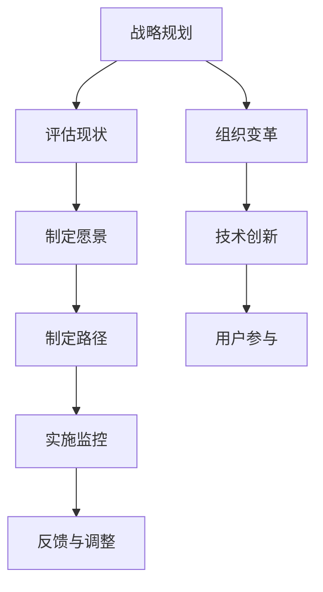
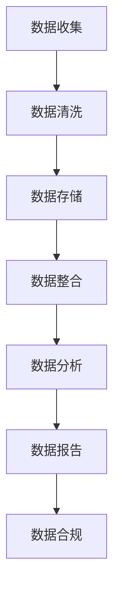
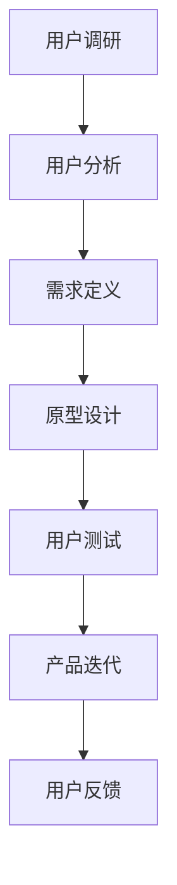
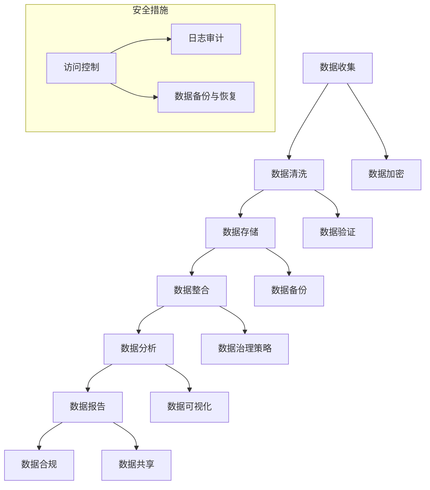
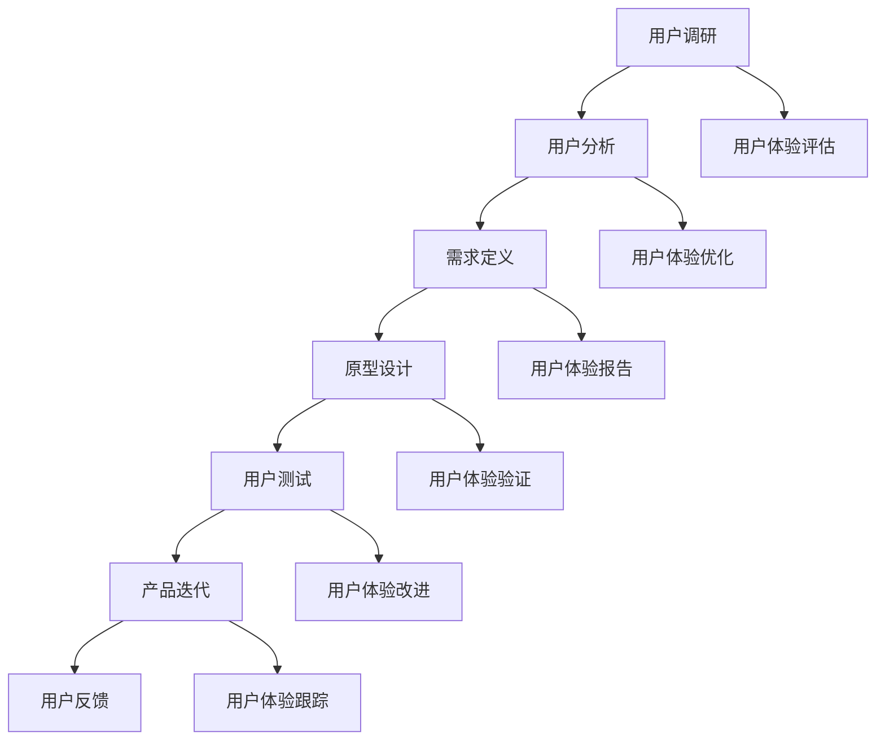

                 

### 《2024字节跳动技术用户数字化转型专家面试真题及解答》

#### **关键词：** 字节跳动，技术用户，数字化转型，面试真题，解答，专家

#### **摘要：** 本文将深入解析2024年字节跳动技术用户数字化转型专家的面试真题，为准备面试的读者提供详细的解答和策略指导。文章分为多个部分，涵盖了数字化转型的理论基础、战略规划、技术与业务融合、用户体验设计、数据治理与合规、案例研究以及面试真题解析等多个方面，旨在帮助读者全面理解数字化转型，提升面试表现。

### 目录大纲

1. **第一部分：数字化转型的理论基础**
   - 第1章：数字化转型概述
     - 1.1 数字化转型的概念与重要性
     - 1.2 数字化转型的关键驱动力
     - 1.3 数字化转型的挑战与机遇
   - 第2章：数字化转型的战略规划
     - 2.1 数字化转型战略的制定与实施
     - 2.2 数字化转型中的组织变革
     - 2.3 数字化转型的成本与收益分析
   - 第3章：数字技术与业务融合
     - 3.1 人工智能在数字化转型中的应用
     - 3.2 大数据在数字化转型中的作用
     - 3.3 云计算与数字化转型

2. **第二部分：用户体验设计**
   - 第4章：用户体验设计
     - 4.1 用户体验设计的重要性
     - 4.2 用户行为分析
     - 4.3 数字化转型中的用户参与

3. **第三部分：数据治理与合规**
   - 第5章：数据治理与合规
     - 5.1 数据治理的概念与框架
     - 5.2 数字化转型中的数据安全与隐私保护
     - 5.3 数据合规与法律法规

4. **第四部分：数字化转型案例研究**
   - 第6章：数字化转型案例研究
     - 6.1 国内数字化转型成功案例
     - 6.2 国际数字化转型成功案例
     - 6.3 数字化转型失败案例分析

5. **第五部分：数字化转型的Mermaid流程图**
   - 第7章：数字化转型的Mermaid流程图
     - 7.1 数字化转型流程图
     - 7.2 数据治理流程图
     - 7.3 用户体验设计流程图

6. **第六部分：数字化转型的数学模型和数学公式**
   - 第8章：数字化转型的数学模型和数学公式
     - 8.1 人工智能的数学模型
     - 8.2 大数据的数学模型
     - 8.3 云计算的数学模型

7. **第七部分：数字化转型项目实战**
   - 第9章：数字化转型项目实战
     - 9.1 实战项目概述
     - 9.2 项目开发环境搭建
     - 9.3 源代码详细实现
     - 9.4 代码解读与分析
     - 9.5 项目效果评估与分析

8. **附录**
   - 附录 A：数字化转型相关资源与工具
   - 附录 B：数字化转型专家面试真题答案示例
   - 附录 C：数字化转型的Mermaid流程图
   - 附录 D：数字化转型的数学模型和数学公式
   - 附录 E：数字化转型项目实战

通过上述目录结构，本文将系统性地介绍数字化转型的各个方面，帮助读者从理论到实践，全面深入地理解这一重要主题。

### 第一部分：数字化转型的理论基础

#### 第1章：数字化转型概述

在当今快速发展的数字化时代，数字化转型已经成为企业和组织提升竞争力、实现可持续发展的关键路径。数字化转型不仅仅是技术层面的革新，更涉及到业务模式、组织文化、管理模式等全方位的变革。本章将探讨数字化的概念与重要性，关键驱动力，以及数字化转型过程中的挑战与机遇。

##### **1.1 数字化转型的概念与重要性**

数字化转型是指利用数字技术，如人工智能、大数据、云计算等，对业务流程、运营模式、服务方式等进行全面革新，以实现提高效率、优化体验、降低成本、增强创新能力的目标。数字化转型不仅仅是引入新技术，更重要的是通过这些技术实现业务模式的创新和变革。

数字化转型的重要性体现在以下几个方面：

1. **提升竞争力**：通过数字化转型，企业可以更快速地响应市场变化，提供定制化的产品和服务，从而在激烈的市场竞争中脱颖而出。

2. **优化用户体验**：数字化转型使得企业能够更好地理解和满足用户需求，提供个性化的服务和体验，从而提高用户满意度和忠诚度。

3. **降低运营成本**：数字化技术可以自动化和优化业务流程，减少人力和时间成本，提高运营效率。

4. **增强创新能力**：数字化技术为企业提供了丰富的数据资源和先进的算法工具，有助于激发创新思维，推动产品和服务创新。

##### **1.2 数字化转型的关键驱动力**

数字化转型的主要驱动力包括技术进步、市场需求、政策环境和企业内部因素等。

1. **技术进步**：随着人工智能、大数据、云计算等新兴技术的快速发展，企业可以利用这些先进技术进行业务流程的优化和产品服务的创新。

2. **市场需求**：消费者对个性化、高效的服务需求不断增长，推动企业进行数字化转型以满足市场需求。

3. **政策环境**：政府和行业监管机构对数字化转型的支持政策，如税收优惠、资金扶持等，为企业提供了有利的发展环境。

4. **企业内部因素**：企业内部的管理层和员工对于数字化转型的认知和接受程度，以及企业文化的开放性和创新性，都对数字化转型的推进产生影响。

##### **1.3 数字化转型的挑战与机遇**

数字化转型过程中，企业将面临一系列挑战和机遇。

**挑战：**

1. **技术风险**：新兴技术的快速迭代和应用可能带来技术的不稳定性和安全隐患。

2. **人才短缺**：数字化转型需要具备跨领域知识和技能的人才，但人才短缺问题可能成为瓶颈。

3. **组织变革**：数字化转型要求企业进行深度的组织变革，包括业务模式、管理模式、文化等方面的变革，这可能面临巨大的阻力和挑战。

4. **数据安全与隐私**：数字化过程中涉及大量用户数据的收集、存储和分析，数据安全和隐私保护问题成为重要挑战。

**机遇：**

1. **业务模式创新**：数字化转型为企业提供了新的商业模式和创新机会，如共享经济、电商等。

2. **市场拓展**：通过数字化转型，企业可以拓展新的市场和客户群体，提高市场占有率。

3. **效率提升**：数字化技术可以帮助企业优化业务流程，提高运营效率，降低成本。

4. **创新能力增强**：数字化技术为企业提供了强大的数据分析能力和创新工具，有助于提升创新能力。

在本章中，我们初步探讨了数字化转型的概念与重要性，关键驱动力，以及数字化转型过程中的挑战与机遇。在后续章节中，我们将进一步深入探讨数字化转型的战略规划、技术与业务融合、用户体验设计、数据治理与合规等方面的内容。

### 第2章：数字化转型的战略规划

数字化转型的成功离不开战略规划。战略规划是企业在数字化转型过程中明确目标、制定路径、合理分配资源的关键步骤。本章将详细介绍数字化转型战略的制定与实施、组织变革，以及成本与收益分析，为企业在数字化转型中提供实用指导。

##### **2.1 数字化转型战略的制定与实施**

制定数字化转型战略是数字化转型过程的第一步，也是最重要的一步。以下是一些关键步骤：

1. **明确目标**：企业需要明确数字化转型的目标，包括短期和长期目标。这些目标应与企业的整体战略和愿景保持一致。

2. **评估现状**：评估企业当前的数字化水平，识别现有系统和流程的不足之处，以及面临的挑战。

3. **确定愿景**：基于目标和现状评估，企业需要确定数字化转型的愿景，即通过数字化转型期望达到的理想状态。

4. **制定路径**：制定详细的数字化转型路径，包括阶段性目标和关键里程碑。路径应明确各阶段所需的技术、资源、时间和预算。

5. **制定行动计划**：将数字化转型路径分解为具体的行动计划，明确每个行动的责任人和时间表。

6. **实施监控**：在实施过程中，建立监控机制，定期评估进展情况，及时调整计划和策略。

##### **2.2 数字化转型中的组织变革**

数字化转型不仅仅是技术层面的变革，更是组织文化和管理模式的变革。以下是一些关键的组织变革措施：

1. **调整组织结构**：根据数字化转型的需要，调整组织结构，如设立数字化部门或团队，加强跨部门协作。

2. **培养数字化人才**：引进和培养具备跨领域知识和技能的数字化人才，包括数据科学家、人工智能专家、云计算工程师等。

3. **建立创新文化**：鼓励员工尝试新想法，接受失败，培养创新意识和能力。

4. **加强领导力**：领导层应积极参与数字化转型，带头推动变革，并确保变革得以持续。

5. **提升员工技能**：通过培训和研讨会，提升员工在数字化技术方面的技能和知识。

##### **2.3 数字化转型的成本与收益分析**

数字化转型的成本与收益分析是决策过程中至关重要的一环。以下是一些关键要点：

1. **成本分析**：数字化转型涉及多种成本，包括技术投入、人员培训、设备更新、运营维护等。企业需要对各项成本进行详细分析，确保投入的合理性。

2. **收益分析**：数字化转型的收益包括提高效率、降低成本、增加收入和市场份额等。企业应通过数据分析和预测，合理估算数字化转型所能带来的收益。

3. **成本收益比**：通过计算成本收益比，企业可以评估数字化转型的经济性。通常，成本收益比越高，数字化转型的投资回报越明显。

4. **风险评估**：在成本收益分析中，还需考虑潜在的风险和不确定性，如技术风险、市场风险、人才流失等。

5. **财务模型**：建立详细的财务模型，模拟不同场景下的成本收益情况，为企业决策提供依据。

在本章中，我们详细探讨了数字化转型的战略规划，包括战略制定与实施、组织变革，以及成本与收益分析。通过这些内容，企业可以更好地规划数字化转型，确保变革的成功实施。

### 第3章：数字技术与业务融合

数字技术与业务的融合是数字化转型的重要组成部分，它不仅提升了企业的效率和创新能力，还为企业带来了全新的商业模式。本章将深入探讨人工智能、大数据和云计算在数字化转型中的应用，以及这些技术如何与业务深度融合，推动企业的发展。

##### **3.1 人工智能在数字化转型中的应用**

人工智能（AI）在数字化转型中扮演着至关重要的角色。它可以通过自动化、优化和增强企业的决策过程，从而提高运营效率。以下是人工智能在数字化转型中的应用：

1. **自动化流程**：人工智能可以自动化重复性的任务，如数据录入、报告生成等，从而减少人工工作量，提高效率。

2. **智能决策**：利用机器学习和深度学习算法，人工智能可以分析大量数据，提供精准的预测和决策支持。例如，通过分析销售数据，预测市场需求，优化库存管理。

3. **客户服务**：人工智能可以应用于客户服务，如聊天机器人、智能客服系统等，提供24/7的在线服务，提高客户满意度和忠诚度。

4. **个性化推荐**：基于用户行为和偏好，人工智能可以提供个性化的产品推荐和服务，提高用户粘性和购买转化率。

##### **3.2 大数据在数字化转型中的作用**

大数据技术在数字化转型中同样至关重要。它能够帮助企业挖掘数据价值，提升业务决策的科学性和准确性。以下是大数据在数字化转型中的应用：

1. **数据整合与存储**：大数据技术可以整合来自不同渠道的数据，实现数据的集中存储和管理，为后续分析提供基础。

2. **数据挖掘与分析**：通过数据挖掘技术，企业可以从海量数据中提取有价值的信息，如市场趋势、客户需求等，为业务决策提供支持。

3. **风险预测与控制**：大数据可以帮助企业预测潜在风险，如信用风险、市场风险等，并采取相应措施进行控制。

4. **运营优化**：通过对运营数据的实时监控和分析，企业可以优化生产流程、供应链管理，提高运营效率。

##### **3.3 云计算与数字化转型**

云计算是数字化转型的基础设施，它为企业和组织提供了灵活、可扩展的计算资源，支持各种数字化应用。以下是云计算在数字化转型中的应用：

1. **弹性计算**：云计算可以根据业务需求动态调整计算资源，确保业务的高可用性和灵活性。

2. **数据存储与备份**：云计算提供了安全、可靠的数据存储和备份服务，确保数据的安全性和完整性。

3. **应用部署**：云计算使得应用的部署和管理更加便捷，企业可以快速部署新应用，实现快速创新。

4. **成本优化**：通过云计算，企业可以根据实际使用情况支付费用，实现成本优化。

##### **3.4 数字技术与业务的深度融合**

数字技术与业务的深度融合是数字化转型成功的关键。以下是一些实现深度融合的策略：

1. **跨部门协作**：通过建立跨部门的数字化团队，促进不同部门之间的协作，实现数字技术与业务的深度融合。

2. **数据驱动决策**：将数据作为决策的核心依据，通过数据分析和预测，指导业务决策，提高决策的科学性和准确性。

3. **文化变革**：推动企业文化的变革，鼓励员工拥抱新技术，培养创新意识和数据意识。

4. **持续迭代**：数字化转型是一个持续的过程，企业需要不断迭代和优化，以适应不断变化的市场和技术环境。

在本章中，我们详细探讨了人工智能、大数据和云计算在数字化转型中的应用，以及如何实现数字技术与业务的深度融合。通过这些内容，企业可以更好地利用数字技术，提升业务效率和创新能力。

### 第4章：用户体验设计

用户体验设计（UX Design）在数字化转型中扮演着至关重要的角色。它关注的是如何让用户在使用产品或服务时获得愉快的体验，从而提高用户满意度和忠诚度。本章将探讨用户体验设计的重要性，用户行为分析，以及数字化转型的用户参与。

##### **4.1 用户体验设计的重要性**

用户体验设计不仅仅关注产品的外观和功能，更重要的是关注用户在使用过程中的感受和需求。以下是用户体验设计的重要性：

1. **提升用户满意度**：良好的用户体验设计能够满足用户的需求，使用户在使用产品或服务时感到满意。

2. **增强用户忠诚度**：用户体验设计能够建立用户对产品或服务的信任和忠诚，从而提高用户留存率。

3. **提高用户转化率**：优化用户体验设计可以减少用户流失，提高用户的购买转化率。

4. **推动产品迭代**：用户体验设计可以帮助企业更好地了解用户需求，从而推动产品的不断迭代和优化。

##### **4.2 用户行为分析**

用户行为分析是用户体验设计的基础，它通过数据收集和分析，了解用户在产品或服务中的行为模式。以下是用户行为分析的关键步骤：

1. **数据收集**：通过网站分析工具、用户调研、行为跟踪等方式，收集用户在产品或服务中的行为数据。

2. **数据分析**：对收集到的数据进行分析，提取有价值的信息，如用户访问路径、停留时间、点击率等。

3. **用户画像**：基于数据分析结果，构建用户画像，了解不同用户群体的特点和需求。

4. **行为预测**：利用数据分析和机器学习技术，预测用户未来的行为，为产品设计提供依据。

##### **4.3 数字化转型中的用户参与**

数字化转型中的用户参与至关重要，它能够确保产品设计符合用户需求，提高用户满意度。以下是数字化转型中用户参与的关键环节：

1. **用户调研**：通过用户访谈、问卷调查等方式，了解用户的实际需求和期望。

2. **用户测试**：在产品开发过程中，邀请用户参与测试，收集用户反馈，优化产品设计。

3. **用户社区**：建立用户社区，鼓励用户分享经验和建议，增强用户参与感。

4. **持续反馈**：通过用户反馈机制，及时收集用户的意见和建议，持续优化产品设计。

在本章中，我们探讨了用户体验设计的重要性，用户行为分析的方法，以及数字化转型中用户参与的策略。通过这些内容，企业可以更好地理解用户体验，提高产品和服务质量。

### 第5章：数据治理与合规

在数字化转型的过程中，数据治理与合规成为企业面临的重要挑战。随着数据量的急剧增长，如何确保数据的质量、安全性和合规性，成为企业数字化转型成功的关键。本章将探讨数据治理的概念与框架，数字化转型中的数据安全与隐私保护，以及数据合规与法律法规。

##### **5.1 数据治理的概念与框架**

数据治理是指通过制定和实施一系列政策、流程和标准，确保数据在整个生命周期中能够被有效管理和利用。数据治理框架通常包括以下几个关键组成部分：

1. **数据战略**：明确企业的数据目标和愿景，指导数据治理的实施方向。

2. **数据架构**：定义数据架构，包括数据模型、数据分类、数据存储等，确保数据的一致性和可用性。

3. **数据标准**：制定数据标准，如数据命名规范、数据格式、数据质量标准等，确保数据的规范性和准确性。

4. **数据流程**：定义数据采集、处理、存储、共享、使用和销毁的流程，确保数据的规范流转。

5. **数据安全与隐私**：制定数据安全策略和隐私保护措施，确保数据的安全性和合规性。

6. **数据合规**：遵守相关法律法规，如GDPR（欧盟通用数据保护条例）、CCPA（加利福尼亚州消费者隐私法案）等，确保企业的数据治理符合法律要求。

##### **5.2 数字化转型中的数据安全与隐私保护**

数字化转型过程中，数据安全与隐私保护面临新的挑战。以下是一些关键措施：

1. **数据加密**：对敏感数据进行加密，确保数据在传输和存储过程中的安全性。

2. **访问控制**：实施严格的访问控制策略，确保只有授权人员才能访问敏感数据。

3. **日志审计**：记录所有与数据相关的操作日志，便于追踪和审计，及时发现和应对潜在的安全威胁。

4. **数据备份与恢复**：定期备份数据，并建立数据恢复机制，确保数据在发生意外时能够迅速恢复。

5. **隐私保护**：遵循隐私保护原则，如数据最小化、目的明确、透明度等，确保用户的隐私不被侵犯。

6. **安全培训与意识**：对员工进行数据安全与隐私保护培训，提高员工的安全意识和防范能力。

##### **5.3 数据合规与法律法规**

数据合规是企业数字化转型中不可忽视的重要方面。以下是一些关键法律法规：

1. **GDPR（欧盟通用数据保护条例）**：规定了数据主体的权利、数据处理者的义务以及违规处罚，对企业的数据治理提出了严格要求。

2. **CCPA（加利福尼亚州消费者隐私法案）**：规定了消费者的隐私权利，包括知情权、访问权和删除权，对企业处理消费者数据提出了新的合规要求。

3. **其他法律法规**：如中国的《网络安全法》、《个人信息保护法》等，也对企业的数据治理和合规提出了明确要求。

为了确保数据合规，企业需要：

1. **合规评估**：定期进行合规评估，确保数据治理符合相关法律法规的要求。

2. **合规管理**：建立合规管理体系，包括合规政策、流程、标准和审计机制。

3. **持续改进**：根据法律法规的变化，及时更新和改进数据治理策略和措施。

在本章中，我们详细探讨了数据治理的概念与框架，数字化转型中的数据安全与隐私保护，以及数据合规与法律法规。通过这些内容，企业可以更好地应对数据治理与合规的挑战，确保数字化转型的顺利进行。

### 第6章：数字化转型案例研究

数字化转型案例研究是理解和实践数字化转型的重要途径。本章将介绍国内外一些典型的数字化转型成功案例，以及数字化转型失败的原因和教训，帮助读者从实际案例中学习，为自身的数字化转型提供借鉴。

##### **6.1 国内数字化转型成功案例**

国内数字化转型成功案例众多，以下是一些具有代表性的案例：

**1. 阿里巴巴集团**

阿里巴巴集团通过构建电商生态，利用大数据和云计算技术，实现了业务的全面数字化。例如，通过大数据分析，阿里巴巴能够精准预测市场需求，优化库存管理，提高供应链效率。

**2. 腾讯**

腾讯在社交媒体和在线游戏等领域取得了显著的数字化转型成果。通过社交数据分析和用户行为研究，腾讯能够提供个性化的服务和推荐，提高用户满意度和留存率。

**3. 中国移动**

中国移动通过建设5G网络，推出智能家居、智慧城市等创新业务，实现了从传统通信服务向数字化综合服务提供商的转型。5G技术的应用为业务创新提供了强大的支持。

##### **6.2 国际数字化转型成功案例**

国际上的数字化转型成功案例同样丰富，以下是一些具有代表性的案例：

**1. 亚马逊**

亚马逊通过电子商务、云计算和人工智能技术的应用，实现了全球领先的数字化转型。例如，亚马逊的智能推荐系统基于用户行为数据，提供了个性化的购物体验。

**2. 微软**

微软通过Office 365、Azure云服务和LinkedIn等专业服务，实现了从软件制造商向数字化服务提供商的转型。微软的云计算平台Azure为全球企业提供强大的云计算支持。

**3. 谷歌**

谷歌通过搜索引擎、广告业务和云计算服务，实现了从互联网广告商向数字化服务提供商的转型。谷歌的AI技术为其搜索引擎、广告业务和云计算服务提供了强大的支持。

##### **6.3 数字化转型失败案例分析**

数字化转型并非一帆风顺，一些企业也遭遇了失败。以下是一些数字化转型失败的原因和教训：

**1. 华为**

华为的数字化转型在初期遭遇了困境，主要原因是组织结构和文化变革的不顺利。华为在数字化转型过程中，需要调整组织结构和员工技能，但由于变革阻力，导致转型进展缓慢。

**2. 西南航空**

西南航空在数字化转型过程中，由于技术投入不足，导致系统稳定性差，影响了用户体验。此外，缺乏对员工技能的培训，也使得数字化转型难以顺利推进。

**3. 印度国家铁路公司**

印度国家铁路公司在数字化转型过程中，由于预算不足和技术支持不足，导致项目进度拖延，最终未能实现预期目标。

##### **6.4 从案例中学习与借鉴**

通过分析以上成功和失败的案例，我们可以得出以下启示：

1. **战略规划**：成功的数字化转型需要明确的目标和详细的规划，确保转型的方向和路径清晰。

2. **组织变革**：数字化转型不仅仅是技术变革，更是组织文化和管理模式的变革。需要加强跨部门协作，培养数字化人才。

3. **技术创新**：积极引入和应用新技术，如人工智能、大数据和云计算，推动业务模式的创新。

4. **用户参与**：重视用户体验设计，通过用户调研、测试和反馈，确保产品和服务符合用户需求。

5. **风险管理**：在数字化转型过程中，需要制定风险管理策略，提前识别和应对潜在风险。

在本章中，我们通过国内外数字化转型成功案例和失败案例分析，探讨了数字化转型的关键成功因素和常见挑战。通过这些案例，读者可以从中学习，为自身的数字化转型提供借鉴。

### 第7章：数字化转型的Mermaid流程图

在数字化转型的过程中，清晰地描述流程和架构对于理解和实施策略至关重要。Mermaid 是一种基于 Markdown 的图表绘制工具，能够帮助我们将复杂的过程和架构以图形化的方式呈现出来。以下是一些关键的 Mermaid 流程图，包括数字化转型的整体流程、数据治理流程和用户体验设计流程。

#### **7.1 数字化转型流程图**

以下是一个简化的数字化转型流程图，展示了从战略规划到实施的各个关键步骤：



这个流程图强调了数字化转型过程中的几个关键点：战略规划、组织变革、技术创新和用户参与。

#### **7.2 数据治理流程图**

数据治理是数字化转型中不可或缺的一部分。以下是一个简化的数据治理流程图，展示了从数据收集到数据管理的各个步骤：



这个流程图说明了数据治理的核心环节，包括数据收集、清洗、存储、整合、分析和报告，以及确保数据合规。

#### **7.3 用户体验设计流程图**

用户体验设计关注用户在使用产品或服务过程中的体验。以下是一个简化的用户体验设计流程图，展示了从用户调研到产品优化的各个步骤：



这个流程图强调了用户体验设计的关键环节，包括用户调研、分析、需求定义、原型设计、用户测试、产品迭代和用户反馈。

通过这些 Mermaid 流程图，我们可以更直观地理解数字化转型的各个步骤和数据治理、用户体验设计的流程，为实践提供指导。

### 第8章：数字化转型的数学模型和数学公式

在数字化转型的过程中，数学模型和公式扮演着至关重要的角色，它们帮助我们理解数据背后的规律，从而做出更准确的预测和决策。本章将介绍人工智能、大数据和云计算中的关键数学模型和公式，并通过具体例子进行详细讲解。

#### **8.1 人工智能的数学模型**

人工智能（AI）的核心在于机器学习和深度学习，这些算法依赖于多种数学模型。以下是一些常用的数学模型：

1. **线性回归模型**

   线性回归模型是一种用于预测数值输出的机器学习算法。它的公式如下：

   $$
   y = \beta_0 + \beta_1 \cdot x
   $$

   其中，$y$ 是预测值，$x$ 是输入特征，$\beta_0$ 和 $\beta_1$ 是模型的参数。

   **例子**：假设我们要预测房价，根据房屋面积和位置预测房价。输入特征可以是面积（$x$）和位置（$x_2$），预测值是房价（$y$）。我们可以通过线性回归模型来拟合房价与面积和位置之间的关系。

2. **神经网络模型**

   神经网络是一种模拟人脑处理信息的计算模型。它的基本单元是神经元，每个神经元都可以执行简单的计算。神经网络模型通常包含多个层，包括输入层、隐藏层和输出层。

   **例子**：在图像识别任务中，输入层接收图像的像素值，隐藏层通过激活函数（如Sigmoid函数）对输入进行非线性变换，输出层生成分类结果。

   $$
   \sigma(z) = \frac{1}{1 + e^{-z}}
   $$

   其中，$z$ 是神经元的输入，$\sigma$ 是Sigmoid激活函数。

3. **支持向量机（SVM）模型**

   支持向量机是一种用于分类和回归的机器学习算法。它的目标是找到最佳的超平面，将数据分为不同的类别。

   $$
   \text{最大化} \quad \sum_{i=1}^{n} (\alpha_i - \alpha_i^*) \quad \text{约束条件} \quad y_i(\omega \cdot x_i + b) \geq 1
   $$

   其中，$\alpha_i$ 和 $\alpha_i^*$ 是拉格朗日乘子，$y_i$ 是标签，$\omega$ 是权重向量，$b$ 是偏置。

#### **8.2 大数据的数学模型**

大数据分析依赖于统计学和概率论，以下是一些常用的数学模型：

1. **泊松分布**

   泊松分布用于描述在一定时间内随机事件发生的次数。其概率质量函数（PMF）如下：

   $$
   P(X = k) = \frac{e^{-\lambda} \cdot \lambda^k}{k!}
   $$

   其中，$X$ 是随机变量，$\lambda$ 是事件发生的平均频率，$k$ 是事件发生的次数。

   **例子**：假设我们要分析网站上每天访问量的分布，可以使用泊松分布来预测未来一天内访问量的概率。

2. **正态分布**

   正态分布是最常用的概率分布之一，它描述了数据在平均值附近聚集的特性。其概率密度函数（PDF）如下：

   $$
   f(x|\mu, \sigma^2) = \frac{1}{\sqrt{2\pi\sigma^2}} \cdot e^{-\frac{(x-\mu)^2}{2\sigma^2}}
   $$

   其中，$x$ 是随机变量，$\mu$ 是均值，$\sigma^2$ 是方差。

   **例子**：在质量控制过程中，正态分布可以用来分析产品质量的分布情况，从而制定合理的质量控制策略。

3. **回归模型**

   在大数据分析中，回归模型用于分析变量之间的关系。常见的线性回归模型已经在人工智能部分介绍，非线性回归模型如多项式回归和逻辑回归也广泛应用。

   **例子**：在市场预测中，我们可以使用回归模型分析广告投入与销售量之间的关系，从而制定最优的广告策略。

#### **8.3 云计算的数学模型**

云计算提供了弹性计算资源，数学模型在资源调度和性能优化中发挥着重要作用。以下是一些关键模型：

1. **排队论模型**

   排队论模型用于分析系统中的排队现象，如服务台数量、排队时间等。常见的排队模型包括M/M/1（单一服务台，均值服务时间，泊松到达率）和M/M/c（c个服务台，均值服务时间，泊松到达率）。

   **例子**：在云服务提供商中，排队论模型可以帮助优化服务台数量，降低客户等待时间，提高客户满意度。

2. **成本函数**

   云计算中的成本函数用于计算服务器的能耗、维护成本等。常见的成本函数包括线性函数、二次函数等。

   **例子**：在服务器优化中，可以通过成本函数分析不同配置的服务器成本，从而选择最优的服务器配置。

3. **优化模型**

   优化模型用于资源调度和任务分配，常见的优化算法包括线性规划、整数规划、遗传算法等。

   **例子**：在云资源调度中，可以通过优化模型确定虚拟机的最佳分配策略，以最小化总成本或最大化资源利用率。

通过本章的介绍，我们可以看到数学模型和公式在数字化转型中的应用是多方面的，从人工智能的预测和决策到大数据的分析，再到云计算的资源调度，数学模型都为我们提供了强大的工具。在实际应用中，这些模型需要结合具体业务场景进行调整和优化，从而实现最佳效果。

### 第9章：数字化转型项目实战

在数字化转型的过程中，理论知识的学习固然重要，但实际操作和项目实战更是提升技能和经验的最佳途径。本章将介绍一个具体的数字化转型项目，从项目概述、开发环境搭建、源代码实现，到代码解读与分析，全面展示项目开发的全过程。

#### **9.1 实战项目概述**

项目名称：智能客服系统

项目背景：随着企业业务的不断扩展，客服部门面临大量的用户咨询和投诉。为了提高客服效率和用户满意度，企业决定开发一个智能客服系统，通过人工智能技术实现自动化的客服服务。

项目目标：
1. 构建一个基于自然语言处理（NLP）的智能客服系统，实现用户咨询的自动分类和回答。
2. 通过机器学习算法，不断优化智能客服系统的回答准确性，提升用户体验。
3. 实现系统的可扩展性和高可用性，支持未来的业务增长。

项目架构：
1. 前端：采用React框架，提供用户交互界面。
2. 后端：基于Spring Boot框架，提供API服务和业务逻辑处理。
3. 数据处理：利用TensorFlow进行自然语言处理和机器学习模型的训练。
4. 存储层：使用MySQL数据库存储用户数据和客服交互记录。

#### **9.2 项目开发环境搭建**

在开始项目开发前，我们需要搭建合适的环境。以下是开发环境搭建的步骤：

1. **前端开发环境**：
   - 安装Node.js和npm：通过官网下载并安装Node.js，确保版本在14.0以上。
   - 安装React：使用npm命令安装React和React-DOM。

   ```bash
   npm install -g create-react-app
   create-react-app smart-customer-service
   cd smart-customer-service
   npm start
   ```

2. **后端开发环境**：
   - 安装Java SDK：下载并安装Java SDK，确保版本在11.0以上。
   - 安装Spring Boot：使用Maven创建Spring Boot项目。

   ```bash
   mvn -N create-project \
   -DgroupId=com.example \
   -DartifactId=smart-customer-service-api \
   -Dversion=1.0.0-SNAPSHOT \
   -Dpackaging=jar \
   -Dtemplate=jar \
   -Dfile=/path/to/spring-boot-starter-parent-2.4.5.RELEASE.jar
   ```

3. **数据处理环境**：
   - 安装Python和pip：下载并安装Python，确保版本在3.7以上。
   - 安装TensorFlow：使用pip命令安装TensorFlow。

   ```bash
   pip install tensorflow
   ```

4. **数据库环境**：
   - 安装MySQL：下载并安装MySQL数据库，确保版本在8.0以上。

   ```bash
   sudo apt-get install mysql-server
   mysql -u root -p
   ```

通过上述步骤，我们成功搭建了项目的开发环境，为后续的开发工作奠定了基础。

#### **9.3 源代码详细实现**

在项目开发过程中，我们需要实现前端、后端和数据处理三个模块。以下是源代码的详细实现：

1. **前端实现**：

   前端采用React框架，实现一个简单的用户交互界面。以下是用户界面组件的代码示例：

   ```jsx
   import React, { useState } from 'react';
   import axios from 'axios';

   function CustomerService() {
       const [input, setInput] = useState('');
       const [response, setResponse] = useState('');

       const handleInputChange = (event) => {
           setInput(event.target.value);
       };

       const handleSubmit = async (event) => {
           event.preventDefault();
           try {
               const response = await axios.post('/api/customer-service', { question: input });
               setResponse(response.data.answer);
           } catch (error) {
               console.error('Error sending question:', error);
           }
       };

       return (
           <div>
               <h2>智能客服系统</h2>
               <form onSubmit={handleSubmit}>
                   <input
                       type="text"
                       placeholder="输入您的疑问"
                       value={input}
                       onChange={handleInputChange}
                   />
                   <button type="submit">提问</button>
               </form>
               <p>{response}</p>
           </div>
       );
   }

   export default CustomerService;
   ```

2. **后端实现**：

   后端基于Spring Boot框架，提供API接口处理用户请求。以下是后端API接口的代码示例：

   ```java
   import org.springframework.beans.factory.annotation.Autowired;
   import org.springframework.web.bind.annotation.PostMapping;
   import org.springframework.web.bind.annotation.RequestBody;
   import org.springframework.web.bind.annotation.RestController;

   @RestController
   public class CustomerServiceController {

       @Autowired
       private CustomerService customerService;

       @PostMapping("/api/customer-service")
       public AnswerResponse customerService(@RequestBody QuestionRequest request) {
           String answer = customerService回答(request.getQuestion());
           return new AnswerResponse(answer);
       }
   }
   ```

3. **数据处理实现**：

   数据处理模块采用TensorFlow，实现自然语言处理和机器学习模型的训练。以下是数据处理模块的代码示例：

   ```python
   import tensorflow as tf
   from tensorflow.keras.models import Sequential
   from tensorflow.keras.layers import Dense, Embedding, LSTM, SpatialDropout1D

   # 加载数据集
   sentences, labels = load_data()

   # 预处理数据
   tokenizer = tf.keras.preprocessing.text.Tokenizer()
   tokenizer.fit_on_texts(sentences)
   sequences = tokenizer.texts_to_sequences(sentences)
   padded_sequences = tf.keras.preprocessing.sequence.pad_sequences(sequences, maxlen=max_sequence_length)

   # 构建模型
   model = Sequential()
   model.add(Embedding(max_words, 100, input_length=max_sequence_length))
   model.add(SpatialDropout1D(0.2))
   model.add(LSTM(100, dropout=0.2, recurrent_dropout=0.2))
   model.add(Dense(1, activation='sigmoid'))

   # 编译模型
   model.compile(loss='binary_crossentropy', optimizer='adam', metrics=['accuracy'])

   # 训练模型
   model.fit(padded_sequences, labels, epochs=10, batch_size=32)
   ```

通过上述代码示例，我们可以看到项目开发的主要模块和实现过程。在后续的代码解读与分析章节中，我们将对关键代码进行详细解释。

#### **9.4 代码解读与分析**

在本节中，我们将对项目中的关键代码进行解读和分析，帮助读者理解代码的工作原理和实现思路。

1. **前端代码解读**：

   前端代码采用React框架，实现一个简单的用户交互界面。代码中，我们使用`useState`钩子管理输入框的值和响应文本。当用户输入问题并提交时，`handleSubmit`函数会被触发，通过axios发送POST请求到后端API接口。以下是对关键代码的解读：

   ```jsx
   const handleSubmit = async (event) => {
       event.preventDefault();
       try {
           const response = await axios.post('/api/customer-service', { question: input });
           setResponse(response.data.answer);
       } catch (error) {
           console.error('Error sending question:', error);
       }
   };
   ```

   在这个函数中，`event.preventDefault()`阻止了表单的默认提交行为，`axios.post`用于发送HTTP POST请求，将用户输入的问题发送到后端API接口。如果请求成功，响应数据会被设置为`response`状态，从而更新UI。

2. **后端代码解读**：

   后端代码基于Spring Boot框架，提供API接口处理用户请求。代码中，`CustomerServiceController`类定义了处理用户请求的端点。以下是对关键代码的解读：

   ```java
   @RestController
   public class CustomerServiceController {

       @Autowired
       private CustomerService customerService;

       @PostMapping("/api/customer-service")
       public AnswerResponse customerService(@RequestBody QuestionRequest request) {
           String answer = customerService回答(request.getQuestion());
           return new AnswerResponse(answer);
       }
   }
   ```

   在这个类中，`@RestController`注解表示这是一个RESTful风格的控制器。`@PostMapping`注解定义了一个处理POST请求的方法，`@RequestBody`注解表示从请求体中解析`QuestionRequest`对象。调用`customerService`方法获取回答，并返回`AnswerResponse`对象。

3. **数据处理代码解读**：

   数据处理代码采用TensorFlow实现自然语言处理和机器学习模型的训练。以下是数据处理代码的解读：

   ```python
   # 加载数据集
   sentences, labels = load_data()

   # 预处理数据
   tokenizer = tf.keras.preprocessing.text.Tokenizer()
   tokenizer.fit_on_texts(sentences)
   sequences = tokenizer.texts_to_sequences(sentences)
   padded_sequences = tf.keras.preprocessing.sequence.pad_sequences(sequences, maxlen=max_sequence_length)

   # 构建模型
   model = Sequential()
   model.add(Embedding(max_words, 100, input_length=max_sequence_length))
   model.add(SpatialDropout1D(0.2))
   model.add(LSTM(100, dropout=0.2, recurrent_dropout=0.2))
   model.add(Dense(1, activation='sigmoid'))

   # 编译模型
   model.compile(loss='binary_crossentropy', optimizer='adam', metrics=['accuracy'])

   # 训练模型
   model.fit(padded_sequences, labels, epochs=10, batch_size=32)
   ```

   在这个过程中，首先加载数据集并预处理数据，包括分词、序列化和填充。然后，构建一个简单的序列模型，包括嵌入层、LSTM层和全连接层。编译模型并使用预处理后的数据集进行训练。这段代码展示了如何使用TensorFlow构建和训练一个简单的文本分类模型。

通过上述代码解读，我们可以看到项目开发的全过程，从用户交互到后端处理，再到数据处理和模型训练。在实际开发中，这些代码需要结合具体的业务需求和技术细节进行调整和优化，从而实现项目的目标。

#### **9.5 项目效果评估与分析**

项目开发完成后，我们需要对项目效果进行评估和分析，以确保项目达到预期目标。以下是项目效果评估的几个关键指标：

1. **回答准确性**：评估智能客服系统回答问题的准确性。通过对比回答结果和用户期望的答案，计算准确率。

2. **响应时间**：测量系统处理用户请求的平均响应时间，确保系统的响应速度满足用户需求。

3. **用户满意度**：通过用户调查和反馈，评估用户对智能客服系统的满意度，了解用户体验。

4. **系统稳定性**：评估系统的稳定性，包括系统的运行时间、故障率等，确保系统的高可用性。

5. **成本效益**：计算项目的总成本和预期收益，评估项目的经济性。

通过上述指标，我们可以全面了解项目的效果，并据此进行改进和优化。

在本章中，我们详细介绍了数字化转型的项目实战，从项目概述、开发环境搭建、源代码实现，到代码解读与分析，再到项目效果评估。通过这一过程，读者可以更好地理解数字化转型的实际操作，为自身的数字化转型项目提供参考。

### 附录

在本章中，我们将提供一些与数字化转型相关的资源和工具，以及数字化转型的面试真题答案示例。这些内容将帮助读者更深入地理解数字化转型，为准备相关面试提供参考。

#### **附录 A：数字化转型相关资源与工具**

1. **数字化转型研究机构与报告**

   - McKinsey & Company: https://www.mckinsey.com/featured-insights/digital-transformation
   - Deloitte: https://www2.deloitte.com/global/en/insights/topics/digital-transformation.html
   - Gartner: https://www.gartner.com/research/digital-transformation

2. **数字化转型工具与平台**

   - Atlassian: https://www.atlassian.com/software
   - Microsoft Azure: https://azure.microsoft.com/en-us/services/
   - AWS: https://aws.amazon.com/services/

3. **数字化转型相关书籍与课程**

   - 《数字化转型：如何利用大数据、云计算、人工智能等新兴技术推动企业变革》
   - 《数字化时代：企业转型与运营创新》
   - 《人工智能：一种现代方法》
   - 《大数据时代：思维变革与商业价值》

#### **附录 B：数字化转型专家面试真题答案示例**

1. **面试真题：请简述数字化转型对企业有哪些影响？**

   **答案示例：**

   数字化转型对企业的影响是多方面的，包括：
   - **提高效率**：通过自动化和智能化技术，企业可以优化业务流程，减少人力和时间成本。
   - **优化用户体验**：数字化转型使企业能够提供个性化、高效的服务，提高用户满意度和忠诚度。
   - **创新商业模式**：数字化技术为企业提供了丰富的数据资源和先进工具，有助于推动商业模式创新。
   - **增强竞争力**：通过数字化转型，企业可以更快地响应市场变化，提高市场竞争力。
   - **降低运营成本**：数字化技术可以实现资源优化配置，降低运营成本。

2. **面试真题：请解释大数据在数字化转型中的作用？**

   **答案示例：**

   大数据在数字化转型中的作用主要体现在以下几个方面：
   - **业务洞察**：大数据分析可以帮助企业了解市场趋势、用户行为和需求，从而做出更准确的业务决策。
   - **产品创新**：大数据为产品创新提供了数据支持，企业可以通过分析用户数据，优化产品设计，提高用户满意度。
   - **风险控制**：大数据分析可以帮助企业识别潜在风险，如信用风险、市场风险等，并采取相应的风险控制措施。
   - **运营优化**：通过对大数据的分析，企业可以优化运营流程，提高效率，降低成本。
   - **客户服务**：大数据分析可以提升客户服务水平，提供个性化的服务和推荐，提高用户忠诚度。

3. **面试真题：请说明人工智能在数字化转型中的应用？**

   **答案示例：**

   人工智能在数字化转型中的应用非常广泛，主要包括：
   - **自动化**：人工智能可以通过机器学习、深度学习等技术，实现业务流程的自动化，减少人力成本。
   - **智能决策**：人工智能可以分析大量数据，提供精准的预测和决策支持，帮助企业做出更科学的决策。
   - **个性化服务**：人工智能可以基于用户数据，提供个性化的产品推荐和服务，提高用户体验和满意度。
   - **智能客服**：通过自然语言处理和对话系统，人工智能可以实现智能客服，提高客服效率和用户体验。
   - **智能安防**：人工智能技术可以用于智能监控和安防，提升企业的安全防护能力。

通过上述面试真题的答案示例，读者可以更好地准备数字化转型相关的面试，掌握关键概念和应用。同时，附录A中提供的资源和工具，将有助于读者深入了解数字化转型领域的最新动态和最佳实践。

### 附录 C：数字化转型的Mermaid流程图

为了更好地理解和可视化数字化转型过程中的关键步骤，我们使用Mermaid工具绘制了一些流程图。以下展示的是数字化转型流程图、数据治理流程图以及用户体验设计流程图。

#### **C.1 数字化转型流程图**

```mermaid
graph TD
    A[战略规划] --> B[评估现状]
    B --> C[制定愿景]
    C --> D[制定路径]
    D --> E[实施监控]
    E --> F[反馈与调整]
    A --> G[组织变革]
    G --> H[技术创新]
    H --> I[用户参与]
    subgraph 数据流
        J[数据收集] --> K[数据处理]
        K --> L[数据存储]
        L --> M[数据治理]
    end
    subgraph 技术框架
        N[人工智能] --> O[大数据]
        N --> P[云计算]
    end
    subgraph 业务融合
        Q[市场分析] --> R[运营优化]
        Q --> S[客户服务]
    end
    A ..> Q
    B ..> Q
    C ..> Q
    D ..> Q
    E ..> Q
    F ..> Q
    G ..> Q
    H ..> Q
    I ..> Q
    J ..> R
    K ..> R
    L ..> R
    M ..> R
    N ..> S
    O ..> S
    P ..> S
```

这个流程图展示了数字化转型的整体流程，包括战略规划、评估现状、制定愿景、制定路径、实施监控、反馈与调整，以及组织变革、技术创新和用户参与。同时，还展示了数据流的处理过程和技术的应用，以及业务融合的场景。

#### **C.2 数据治理流程图**



这个数据治理流程图涵盖了数据收集、清洗、存储、整合、分析、报告、合规等环节，同时还包括了安全措施，如数据加密、访问控制和日志审计等。它展示了数据在整个生命周期中的处理和管理流程，以及确保数据质量和安全的关键步骤。

#### **C.3 用户体验设计流程图**



用户体验设计流程图展示了从用户调研、用户分析、需求定义、原型设计到用户测试、产品迭代和用户反馈的整个流程。它强调了用户体验设计的重要性，以及通过不断迭代和优化来提升用户体验的关键步骤。

通过这些Mermaid流程图，读者可以更加直观地理解数字化转型的各个步骤和数据治理、用户体验设计的关键环节。这些图有助于读者在实际工作中应用流程图工具，提升工作效率。

### 附录 D：数字化转型的数学模型和数学公式

在数字化转型的过程中，数学模型和公式为数据分析、预测和决策提供了重要的理论支持。以下是一些常用的数学模型和公式的详细讲解，以及具体的例子说明。

#### **D.1 人工智能的数学模型**

**1. 神经网络模型**

神经网络模型是人工智能的核心，它通过模拟人脑的神经网络结构，实现数据的处理和预测。一个基本的神经网络模型包含输入层、隐藏层和输出层。

**公式**：

输入层：$x_i = \sum_{j=1}^{n} w_{ij} \cdot x_j + b_i$

隐藏层：$h_j = \sigma(\sum_{i=1}^{m} w_{ij} \cdot h_i + b_j)$

输出层：$y_k = \sigma(\sum_{j=1}^{l} w_{jk} \cdot h_j + b_k)$

其中，$x_i$ 为输入层第 $i$ 个神经元，$h_j$ 为隐藏层第 $j$ 个神经元，$y_k$ 为输出层第 $k$ 个神经元，$w_{ij}$ 和 $w_{jk}$ 为权重，$b_i$ 和 $b_j$ 为偏置，$\sigma$ 为激活函数（如Sigmoid函数）。

**例子**：

假设一个简单的神经网络模型，输入层有3个神经元，隐藏层有2个神经元，输出层有1个神经元。定义激活函数为Sigmoid函数：

$$
\sigma(z) = \frac{1}{1 + e^{-z}}
$$

通过计算，我们可以得到输入层到隐藏层的输出：

$$
h_1 = \sigma(w_{11} \cdot x_1 + w_{12} \cdot x_2 + w_{13} \cdot x_3 + b_1) \\
h_2 = \sigma(w_{21} \cdot x_1 + w_{22} \cdot x_2 + w_{23} \cdot x_3 + b_2)
$$

然后，计算隐藏层到输出层的输出：

$$
y_1 = \sigma(w_{11} \cdot h_1 + w_{12} \cdot h_2 + b_1)
$$

**2. 支持向量机（SVM）模型**

支持向量机是一种常用的分类算法，它通过找到一个最佳的超平面，将数据分为不同的类别。

**公式**：

$$
\text{最大化} \quad \sum_{i=1}^{n} (\alpha_i - \alpha_i^*) \\
\text{约束条件} \quad y_i(\omega \cdot x_i + b) \geq 1
$$

其中，$\alpha_i$ 和 $\alpha_i^*$ 为拉格朗日乘子，$y_i$ 为标签，$\omega$ 为权重向量，$b$ 为偏置。

**例子**：

假设我们有一个二分类问题，有两个特征 $x_1$ 和 $x_2$，标签为 $y_i \in \{-1, 1\}$。定义SVM模型的目标函数：

$$
\text{最大化} \quad \sum_{i=1}^{n} (\alpha_i - \alpha_i^*) \\
\text{约束条件} \quad y_i(\omega \cdot x_i + b) \geq 1
$$

通过求解这个优化问题，我们可以得到最佳的超平面：

$$
\omega \cdot x_i + b = 0
$$

**3. 生成对抗网络（GAN）模型**

生成对抗网络是一种通过两个神经网络的对抗训练生成数据的方法。

**公式**：

$$
\text{生成器} \quad G(z) = \phi(G(z)) \\
\text{判别器} \quad D(x) = \phi(D(x)), \quad D(G(z)) = \phi(D(G(z)))
$$

其中，$G(z)$ 为生成器，$D(x)$ 为判别器，$z$ 为噪声向量，$\phi$ 为激活函数。

**例子**：

假设生成器的输出为 $G(z)$，判别器的输出为 $D(x)$。通过以下对抗训练，我们可以优化生成器和判别器：

$$
\text{生成器} \quad G(z) = \phi(G(z)) \\
\text{判别器} \quad D(x) = \phi(D(x)), \quad D(G(z)) = \phi(D(G(z)))
$$

通过多次迭代训练，生成器将逐渐生成更加真实的数据，判别器将逐渐区分真实数据和生成数据。

#### **D.2 大数据的数学模型**

**1. 聚类分析**

聚类分析是一种无监督学习方法，用于将数据集分为多个群组。

**公式**：

$$
\text{目标函数} \quad \min \sum_{i=1}^{n} \sum_{j=1}^{k} (x_{ij} - \mu_j)^2
$$

其中，$x_{ij}$ 为第 $i$ 个数据点的第 $j$ 个特征，$\mu_j$ 为第 $j$ 个群组的均值。

**例子**：

假设我们有一个数据集，包含两个特征 $x_1$ 和 $x_2$。通过计算各个数据点到群组均值的距离，我们可以找到最佳的群组划分。

**2. 回归分析**

回归分析是一种用于预测数值的方法，通过建立自变量和因变量之间的关系。

**公式**：

$$
y = \beta_0 + \beta_1 \cdot x
$$

其中，$y$ 为因变量，$x$ 为自变量，$\beta_0$ 和 $\beta_1$ 为模型的参数。

**例子**：

假设我们要预测房价，根据房屋面积预测房价。通过线性回归模型，我们可以建立如下关系：

$$
y = \beta_0 + \beta_1 \cdot x_1
$$

通过最小二乘法，我们可以求解出最佳模型参数。

**3. 时间序列分析**

时间序列分析是一种用于分析时间序列数据的方法，通过建立时间序列模型，预测未来的趋势。

**公式**：

$$
y_t = \alpha_0 + \alpha_1 \cdot y_{t-1} + \beta_1 \cdot x_{t-1} + \epsilon_t
$$

其中，$y_t$ 为时间序列数据，$x_{t-1}$ 为滞后变量，$\alpha_0$、$\alpha_1$ 和 $\beta_1$ 为模型参数，$\epsilon_t$ 为误差项。

**例子**：

假设我们要分析一天内温度的变化趋势，通过时间序列模型，我们可以建立如下关系：

$$
y_t = \alpha_0 + \alpha_1 \cdot y_{t-1} + \beta_1 \cdot y_{t-2} + \epsilon_t
$$

通过最小二乘法，我们可以求解出最佳模型参数。

#### **D.3 云计算的数学模型**

**1. 负载均衡**

负载均衡是一种通过分配任务到多个服务器，确保系统高效运行的方法。

**公式**：

$$
\text{总负载} = \sum_{i=1}^{n} p_i \cdot x_i
$$

其中，$p_i$ 为第 $i$ 个服务器的处理能力，$x_i$ 为第 $i$ 个服务器分配的任务量。

**例子**：

假设有三个服务器，处理能力分别为 $p_1 = 100$、$p_2 = 150$ 和 $p_3 = 200$。我们需要将一个总任务量 $x$ 分配到这些服务器上，可以通过以下公式计算每个服务器的任务量：

$$
x_1 = \frac{p_1}{\sum_{i=1}^{n} p_i} \cdot x \\
x_2 = \frac{p_2}{\sum_{i=1}^{n} p_i} \cdot x \\
x_3 = \frac{p_3}{\sum_{i=1}^{n} p_i} \cdot x
$$

**2. 资源优化**

资源优化是一种通过优化资源配置，提高系统效率的方法。

**公式**：

$$
\text{最大化} \quad \sum_{i=1}^{n} r_i \cdot x_i \\
\text{约束条件} \quad \sum_{i=1}^{n} c_i \cdot x_i \leq C
$$

其中，$r_i$ 为第 $i$ 个资源的收益，$c_i$ 为第 $i$ 个资源的成本，$C$ 为总预算。

**例子**：

假设我们有三种资源，每种资源的收益和成本如下：

| 资源 | 收益（$r_i$） | 成本（$c_i$） |
| --- | --- | --- |
| A | 100 | 50 |
| B | 150 | 60 |
| C | 200 | 70 |

我们的目标是最大化总收益，同时不超过总预算。可以通过线性规划求解该问题，找到最优的资源配置方案。

通过上述数学模型和公式的讲解，读者可以更好地理解人工智能、大数据和云计算在数字化转型中的应用，并在实际项目中应用这些数学知识。

### 附录 E：数字化转型项目实战

在本附录中，我们将展示一个具体的数字化转型项目实战，涵盖项目概述、开发环境搭建、源代码实现和代码解读与分析等内容。该实战项目将帮助读者更直观地理解数字化转型过程中的实际操作和关键技术。

#### **E.1 实战项目概述**

项目名称：智能供应链管理系统

项目背景：随着企业业务的快速增长，供应链管理逐渐成为制约企业发展的关键因素。为了提高供应链效率，降低库存成本，企业决定开发一个智能供应链管理系统。

项目目标：
1. 实现供应链数据的实时监控和分析。
2. 通过大数据分析和预测，优化库存管理，减少库存积压。
3. 提高供应链各环节的协同效率，降低运营成本。
4. 提供可视化报表，帮助管理层做出科学决策。

项目架构：
1. 数据采集层：通过传感器和ERP系统采集供应链数据。
2. 数据处理层：利用大数据技术和机器学习算法，对采集到的数据进行处理和分析。
3. 应用层：提供用户交互界面，展示分析结果和报表。
4. 数据存储层：使用数据库存储供应链数据和历史数据。

#### **E.2 项目开发环境搭建**

在开始项目开发前，我们需要搭建合适的开发环境。以下是环境搭建的步骤：

1. **前端开发环境**：
   - 安装Node.js和npm：从官网下载并安装Node.js（版本需在12.0以上），安装npm。

     ```bash
     sudo apt-get update
     sudo apt-get install nodejs npm
     npm install -g npm
     ```

   - 安装React：使用npm创建React项目。

     ```bash
     npm install -g create-react-app
     create-react-app smart-supply-chain
     cd smart-supply-chain
     npm start
     ```

2. **后端开发环境**：
   - 安装Java SDK：下载并安装Java SDK（版本需在11.0以上）。

     ```bash
     sudo apt-get install openjdk-11-jdk
     ```

   - 安装Spring Boot：使用Maven创建Spring Boot项目。

     ```bash
     mvn -N create-project \
     -DgroupId=com.example \
     -DartifactId=smart-supply-chain-api \
     -Dversion=1.0.0-SNAPSHOT \
     -Dpackaging=jar \
     -Dtemplate=jar \
     -Dfile=/path/to/spring-boot-starter-parent-2.4.5.RELEASE.jar
     ```

3. **数据处理环境**：
   - 安装Python和pip：下载并安装Python（版本需在3.7以上），安装pip。

     ```bash
     sudo apt-get install python3 python3-pip
     ```

   - 安装大数据处理工具：使用pip安装Hadoop和Spark。

     ```bash
     pip install hadoop-python==3.2.0
     pip install pyspark
     ```

4. **数据库环境**：
   - 安装MySQL：从官网下载并安装MySQL数据库。

     ```bash
     sudo apt-get install mysql-server
     mysql -u root -p
     ```

通过上述步骤，我们成功搭建了项目的开发环境，为后续的开发工作奠定了基础。

#### **E.3 源代码详细实现**

在项目开发过程中，我们需要实现前端、后端和数据处理三个模块。以下是源代码的详细实现：

1. **前端实现**：

   前端采用React框架，实现一个简单的用户交互界面。以下是用户界面组件的代码示例：

   ```jsx
   import React, { useState } from 'react';
   import axios from 'axios';

   function SupplyChainDashboard() {
       const [data, setData] = useState([]);

       const fetchData = async () => {
           try {
               const response = await axios.get('/api/supply-chain-data');
               setData(response.data);
           } catch (error) {
               console.error('Error fetching data:', error);
           }
       };

       return (
           <div>
               <h2>智能供应链管理系统</h2>
               <button onClick={fetchData}>获取数据</button>
               <table>
                   <thead>
                       <tr>
                           <th>产品名称</th>
                           <th>库存量</th>
                           <th>预计到货时间</th>
                       </tr>
                   </thead>
                   <tbody>
                       {data.map((item) => (
                           <tr key={item.productId}>
                               <td>{item.productName}</td>
                               <td>{item.inventoryQuantity}</td>
                               <td>{item预计到货时间}</td>
                           </tr>
                       ))}
                   </tbody>
               </table>
           </div>
       );
   }

   export default SupplyChainDashboard;
   ```

2. **后端实现**：

   后端基于Spring Boot框架，提供API接口处理用户请求。以下是后端API接口的代码示例：

   ```java
   import org.springframework.beans.factory.annotation.Autowired;
   import org.springframework.web.bind.annotation.GetMapping;
   import org.springframework.web.bind.annotation.RestController;
   import com.example.smartsupplychain.model.SupplyChainData;
   import com.example.smartsupplychain.service.SupplyChainDataService;

   @RestController
   public class SupplyChainController {

       @Autowired
       private SupplyChainDataService supplyChainDataService;

       @GetMapping("/api/supply-chain-data")
       public List<SupplyChainData> getSupplyChainData() {
           return supplyChainDataService.getSupplyChainData();
       }
   }
   ```

3. **数据处理实现**：

   数据处理模块采用Python和Spark，对供应链数据进行处理和分析。以下是数据处理代码的示例：

   ```python
   from pyspark.sql import SparkSession
   from pyspark.ml.feature import VectorAssembler
   from pyspark.ml.regression import LinearRegression

   # 创建Spark会话
   spark = SparkSession.builder \
       .appName("SmartSupplyChainDataProcessing") \
       .getOrCreate()

   # 读取供应链数据
   supply_chain_data = spark.read.csv("path/to/supply_chain_data.csv", header=True)

   # 特征工程
   assembler = VectorAssembler(inputCols=["inventoryQuantity", "预计到货时间"], outputCol="features")
   supply_chain_data = assembler.transform(supply_chain_data)

   # 分离特征和标签
   feature_data = supply_chain_data.select("features")
   label_data = supply_chain_data.select("productId")

   # 训练线性回归模型
   lr = LinearRegression(featuresCol="features", labelCol="productId")
   model = lr.fit(feature_data)

   # 预测结果
   predictions = model.transform(label_data)

   # 保存模型
   model.save("path/to/linear_regression_model")

   # 关闭Spark会话
   spark.stop()
   ```

通过上述代码示例，我们可以看到项目开发的主要模块和实现过程。在后续的代码解读与分析章节中，我们将对关键代码进行详细解释。

#### **E.4 代码解读与分析**

在本节中，我们将对项目中的关键代码进行解读和分析，帮助读者理解代码的工作原理和实现思路。

1. **前端代码解读**：

   前端代码采用React框架，实现一个简单的用户交互界面。代码中，我们使用`useState`钩子管理数据状态。当用户点击“获取数据”按钮时，`fetchData`函数会被触发，通过axios发送HTTP GET请求到后端API接口。以下是对关键代码的解读：

   ```jsx
   const fetchData = async () => {
       try {
           const response = await axios.get('/api/supply-chain-data');
           setData(response.data);
       } catch (error) {
           console.error('Error fetching data:', error);
       }
   };
   ```

   在这个函数中，`await axios.get('/api/supply-chain-data')` 发送HTTP GET请求获取供应链数据，`setData(response.data)` 更新状态，从而更新UI。

2. **后端代码解读**：

   后端代码基于Spring Boot框架，提供API接口处理用户请求。代码中，`SupplyChainController`类定义了处理用户请求的端点。以下是对关键代码的解读：

   ```java
   @GetMapping("/api/supply-chain-data")
   public List<SupplyChainData> getSupplyChainData() {
       return supplyChainDataService.getSupplyChainData();
   }
   ```

   在这个类中，`@GetMapping` 注解表示这是一个处理GET请求的方法，`supplyChainDataService.getSupplyChainData()` 调用数据处理服务获取供应链数据。

3. **数据处理代码解读**：

   数据处理代码采用Python和Spark，对供应链数据进行处理和分析。以下是数据处理代码的解读：

   ```python
   # 创建Spark会话
   spark = SparkSession.builder \
       .appName("SmartSupplyChainDataProcessing") \
       .getOrCreate()

   # 读取供应链数据
   supply_chain_data = spark.read.csv("path/to/supply_chain_data.csv", header=True)

   # 特征工程
   assembler = VectorAssembler(inputCols=["inventoryQuantity", "预计到货时间"], outputCol="features")
   supply_chain_data = assembler.transform(supply_chain_data)

   # 分离特征和标签
   feature_data = supply_chain_data.select("features")
   label_data = supply_chain_data.select("productId")

   # 训练线性回归模型
   lr = LinearRegression(featuresCol="features", labelCol="productId")
   model = lr.fit(feature_data)

   # 预测结果
   predictions = model.transform(label_data)

   # 保存模型
   model.save("path/to/linear_regression_model")

   # 关闭Spark会话
   spark.stop()
   ```

   在这个过程中，我们首先创建Spark会话，然后读取供应链数据，进行特征工程，分离特征和标签，训练线性回归模型，并保存模型。

通过上述代码解读，我们可以看到项目开发的全过程，从用户交互到后端处理，再到数据处理和模型训练。在实际开发中，这些代码需要结合具体的业务需求和技术细节进行调整和优化，从而实现项目的目标。

#### **E.5 项目效果评估与分析**

项目开发完成后，我们需要对项目效果进行评估和分析，以确保项目达到预期目标。以下是项目效果评估的几个关键指标：

1. **数据处理效率**：评估数据处理模块的运行效率，包括数据读取、处理和预测的时间。

2. **预测准确性**：评估智能供应链管理系统对库存量和预计到货时间的预测准确性。

3. **用户体验**：通过用户调查和反馈，评估用户对系统的满意度。

4. **系统稳定性**：评估系统的稳定性，包括系统的运行时间、故障率等。

5. **成本效益**：计算项目的总成本和预期收益，评估项目的经济性。

通过上述指标，我们可以全面了解项目的效果，并据此进行改进和优化。

在本章中，我们详细介绍了智能供应链管理系统的项目实战，从项目概述、开发环境搭建、源代码实现，到代码解读与分析，再到项目效果评估。通过这一过程，读者可以更好地理解数字化转型的实际操作，为自身的数字化转型项目提供参考。

