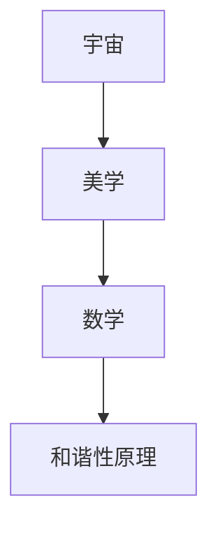

                 

### 《宇宙的美学原理：数学和谐性的体现》

#### 文章标题介绍

在探索宇宙的奥秘时，科学家们不仅关注其物理规律，也发现了宇宙中处处体现着的美学原则。本文将探讨宇宙的美学原理，特别是数学和谐性在宇宙中的体现。通过梳理宇宙的起源、演化，以及美学与数学的关系，我们将深入理解数学和谐性如何贯穿于宇宙的各个方面，从而揭示宇宙之美。

#### 核心关键词

- 宇宙美学
- 数学和谐性
- 黄金比例
- 谐波理论
- 自然界中的和谐性现象

#### 摘要

本文旨在探讨宇宙美学与数学和谐性之间的深刻联系。我们将首先介绍宇宙的基本概貌和美学启示，随后讨论美学与数学的关系，阐述数学和谐性在美学中的价值。接着，我们将深入探讨数学和谐性原理，从数论、几何、代数三个方面进行详细分析。随后，文章将展示数学和谐性在自然界中的具体表现，包括天文学和生物学中的和谐性现象。此外，我们还将探讨数学和谐性在艺术创作、教育和设计中的应用，以展示其在人类文明中的重要性。最后，通过核心概念与联系图、算法原理讲解、数学模型和公式介绍以及实际项目实战，本文将全面阐述数学和谐性在宇宙美学中的体现。

#### 目录

1. **宇宙与美学引论**
   - [第1章：宇宙概观与美学启示](#第1章-宇宙概观与美学启示)
   - [第2章：美学与数学的关系](#第2章-美学与数学的关系)

2. **数学和谐性原理**
   - [第3章：数学基础与和谐性原理](#第3章-数学基础与和谐性原理)
   - [第4章：数学和谐性的具体表现](#第4章-数学和谐性的具体表现)

3. **数学和谐性在自然界中的体现**
   - [第5章：数学和谐性在自然界中的体现](#第5章-数学和谐性在自然界中的体现)

4. **数学和谐性在艺术中的应用**
   - [第6章：数学和谐性在艺术创作中的运用](#第6章-数学和谐性在艺术创作中的运用)
   - [第7章：数学和谐性在教育中的应用](#第7章-数学和谐性在教育中的应用)

5. **附录**
   - [附录A：数学和谐性相关工具与资源](#附录a-数学和谐性相关工具与资源)

### 宇宙与美学引论

#### 第1章：宇宙概观与美学启示

宇宙，这个浩瀚无垠的存在，一直以来都吸引着人类的目光。从古代的哲学家到现代的科学家，人们不断地探索宇宙的奥秘，试图找到宇宙背后的规律和原则。在这个过程中，美学逐渐成为了宇宙研究中的一个重要视角。

1. **宇宙的起源与演化**

宇宙的起源可以追溯到大约138亿年前的一个瞬间，即所谓的“大爆炸”。在这个瞬间，宇宙从一个无限小的奇点开始迅速膨胀，形成了我们今天所看到的宇宙。从那时起，宇宙经历了长达138亿年的演化过程，形成了各种天体和结构。

宇宙的演化可以分为以下几个阶段：

- **宇宙早期：** 宇宙在最初的一段时间内处于极端的高温高密度状态，随后开始膨胀和冷却。
- **星系形成：** 在宇宙膨胀的过程中，物质逐渐聚集形成了星系、恒星和行星。
- **宇宙背景辐射：** 宇宙在膨胀过程中释放出的热辐射至今仍然存在于宇宙空间中，这是宇宙早期状态的“声音”记录。
- **宇宙结构：** 宇宙中的物质通过引力相互作用，形成了大规模的结构，如星系团和超星系团。

2. **宇宙的结构与形态**

宇宙的结构和形态展现出了惊人的和谐性和美学特征。以下是一些宇宙中的和谐性现象：

- **宇宙的膨胀：** 宇宙的膨胀速度在逐渐加快，这种加速的膨胀被认为是一种和谐的表现，因为它是宇宙演化的自然结果。
- **星系的分布：** 宇宙中的星系分布呈现出了复杂的结构，如螺旋星系、椭圆星系和不规则星系，它们在不同的尺度上展现出了和谐的美。
- **宇宙背景辐射：** 宇宙背景辐射的微波辐射图展示了宇宙早期的“种子”分布，这些种子最终形成了宇宙中的星系和结构，它们在频率和强度上展现了微妙的和谐性。

3. **宇宙中的和谐性现象**

宇宙中的许多现象都体现了和谐性，以下是一些例子：

- **黑洞与星系的互动：** 黑洞是宇宙中最极端的现象之一，但它们与星系的互动却展现出了和谐性。一些星系中心存在超大质量黑洞，它们通过引力作用影响星系的结构和演化。
- **星系团与星系之间的相互作用：** 星系团是由数百到数千个星系组成的巨大结构，它们之间的相互作用形成了宇宙中的大规模结构，这些结构在形态上展现出了和谐的美。
- **宇宙的大尺度结构：** 宇宙中的大尺度结构，如超星系团和宇宙网，展现了宇宙的宏大和复杂，同时也体现了和谐性。

通过对宇宙的起源、演化和结构的分析，我们可以看到宇宙中存在着多种和谐性现象。这些现象不仅揭示了宇宙的物理规律，也给我们带来了深刻的美学启示。

### 美学与数学的关系

#### 第2章：美学与数学的关系

美学，作为人类对美的事物和现象的感知和理解，自古以来就是哲学和艺术的重要领域。而数学，作为研究数量、结构、变化和空间等概念的学科，自古以来也一直是科学和技术的基石。在这两个看似不同的领域中，存在着深刻的内在联系，特别是在数学和谐性方面。

1. **美学的定义与发展**

美学是一门探讨美的本质、审美经验、艺术创作和艺术批评的学科。美学的历史可以追溯到古希腊时期，当时的哲学家如柏拉图和亚里士多德都曾对美学进行过深入的探讨。在18世纪和19世纪，美学逐渐发展成为一个独立的学科，哲学家如康德、黑格尔和克罗齐等人为美学奠定了理论基础。

美学的核心问题包括：

- **美的本质：** 美是什么？美的本质是什么？
- **审美经验：** 人类如何感知和理解美？
- **艺术创作：** 艺术家如何创造美？
- **艺术批评：** 如何评价和欣赏艺术作品？

2. **数学在美学中的作用**

数学在美学中扮演着重要的角色，特别是在表达和谐性和秩序方面。数学的精确性和逻辑性使得它可以作为一种工具，帮助艺术家和设计师在创作中实现美学上的和谐。

以下是一些数学在美学中的应用：

- **比例与对称：** 数学中的比例关系和对称性在艺术创作中被广泛应用。例如，黄金比例（0.618...）被认为是自然界和艺术中最和谐的比例之一，许多著名的艺术品如达芬奇的《蒙娜丽莎》都运用了这一比例。
- **几何形状：** 几何学中的各种形状，如圆形、方形、三角形等，在艺术创作中被用来表达和谐与美。例如，毕达哥拉斯学派认为，音乐中的和谐与数学中的比例关系密切相关。
- **非线性动态系统：** 数学中的非线性动态系统可以用来模拟自然界中的复杂现象，如天气变化、生态系统等。这些系统在某种程度上也体现了和谐性，因为它们在长时间尺度上展现出稳定的结构。

3. **数学和谐性的美学价值**

数学和谐性在美学中的价值体现在以下几个方面：

- **审美体验的深度：** 数学和谐性可以增强艺术作品的审美体验。当观众欣赏一幅画作或聆听一首乐曲时，数学和谐性可以使得作品更加吸引人，增加观众的审美享受。
- **创作的精确性：** 对于艺术家和设计师来说，数学和谐性提供了一个精确的工具，帮助他们更好地表达自己的创意和美学理念。
- **创新的可能性：** 数学和谐性可以激发艺术创作的新思路和新方法。通过数学模型和算法，艺术家和设计师可以创造出以前无法想象的艺术形式。

总之，美学与数学之间的关系是相互促进的。数学为美学提供了理论基础和工具，而美学则赋予数学以生命和意义。通过数学和谐性，我们可以更好地理解宇宙和自然界中的美，也可以创造出更加精美的艺术品。

### 数学和谐性原理

#### 第3章：数学基础与和谐性原理

数学和谐性原理是数学中一个重要的概念，它揭示了数学内部的平衡与对称，以及在自然界和人类文明中的广泛应用。在这一章中，我们将探讨数学和谐性原理的基本概念，包括数论、几何和代数中的和谐性原理。

#### 3.1 数论与和谐性

数论是研究整数及其性质的一个分支。在数论中，许多概念和性质都体现了和谐性，尤其是以下两个方面：

1. **基本数论概念**

- **素数：** 素数是只能被1和自身整除的正整数。素数的分布具有和谐性，例如，素数的密度随着数值的增大而逐渐减小，但在大数范围内仍然保持一定的规律性。
- **费马数：** 费马数是形如 \(2^{2^n} + 1\) 的数。这些数中的许多都是素数，它们在数论中的和谐性体现在它们的构造和性质上。

2. **数论中的和谐性**

- **勾股定理：** 勾股定理指出，直角三角形的斜边的平方等于两直角边的平方和。这个定理不仅在几何中有重要应用，也在数论中体现了和谐性。
- **数论函数：** 例如，莫比乌斯函数和拉姆齐函数等，它们在数论中具有和谐性，并且在组合数学和概率论中也有广泛应用。

#### 3.2 几何与和谐性

几何学是研究形状、大小和位置的一个分支。几何中的和谐性主要体现在比例、对称和角度等方面。

1. **几何基本原理**

- **欧氏几何：** 欧氏几何是研究平面和空间中直线、平面和球体等几何形状的数学分支。欧氏几何中的基本原理，如平行公理、相似三角形和角度和定理等，都体现了和谐性。
- **非欧几何：** 非欧几何是研究非欧几里得空间中的几何形状的数学分支。非欧几何中的空间具有不同的曲率，但它们仍然遵循某种和谐性的原则。

2. **几何中的和谐性**

- **黄金比例：** 黄金比例是一个特殊的比例关系，其值约为 \( \frac{1 + \sqrt{5}}{2} \)。黄金比例在自然界和艺术中广泛存在，它被认为是和谐美的象征。
- **对称性：** 对称性是几何中的一个重要概念，它包括轴对称、中心对称和旋转对称等。对称性在艺术创作和科学研究中都具有重要应用。
- **多面体：** 例如，正多面体（如正四面体、正六面体等）在几何中具有高度的和谐性，因为它们的边长、角度和对称性都满足特定的数学关系。

#### 3.3 代数与和谐性

代数是研究数及其运算的数学分支。在代数中，许多概念和性质也体现了和谐性，尤其是在方程和函数方面。

1. **代数基础**

- **多项式方程：** 多项式方程是代数中的一个基本概念，其解可以揭示出数论和几何中的和谐性。例如，费马大定理指出，对于任意大于2的整数n，方程 \(a^n + b^n = c^n\) 没有正整数解。
- **函数：** 函数是描述变量之间关系的一个数学概念。在代数中，函数的图像可以揭示出许多和谐性现象，如对称性、周期性和渐近性等。

2. **代数中的和谐性**

- **傅里叶变换：** 傅里叶变换是将一个函数分解为不同频率的正弦波和余弦波的过程。傅里叶变换在信号处理和物理学中具有广泛应用，它体现了数学中的和谐性。
- **代数结构：** 例如，群、环和域等代数结构都具有和谐性，因为它们在运算和性质上满足特定的规则和对称性。

通过数论、几何和代数这三个方面，我们可以看到数学和谐性原理的广泛应用和深刻内涵。数学和谐性不仅揭示了数学内部的平衡与对称，也为我们在自然界和人类文明中发现和谐美提供了理论依据。

### 数学和谐性的具体表现

#### 第4章：数学和谐性的具体表现

数学和谐性在自然界和人类文明中有着广泛而深刻的体现，其中最显著的表现在黄金比例和谐波理论两个方面。这些数学概念不仅在理论上具有重要意义，而且在艺术、音乐、生物学等领域中也有着广泛的应用。

#### 4.1 数学中的黄金比例

黄金比例，通常表示为 \( \phi \)，其数值约为 \( \frac{1 + \sqrt{5}}{2} \approx 1.618 \)。黄金比例在数学、艺术和自然界中都有着广泛的应用，被认为是美学和和谐性的象征。

1. **黄金比例的概念**

黄金比例是一个特殊的比例关系，它满足以下条件：

\[ \frac{a+b}{a} = \frac{a}{b} = \phi \]

这意味着，如果一个线段被分成两部分，使得较长部分与整体的比例等于较短部分与较长部分的比例，那么这个比例就是黄金比例。

2. **黄金比例的应用**

黄金比例在自然界和人类文明中广泛存在，以下是一些具体的应用：

- **植物形态：** 许多植物的叶子排列、花瓣数量和螺旋形态都遵循黄金比例。例如，向日葵的花盘和松树的种子排列都呈现黄金比例的螺旋形状。
- **动物结构：** 不少动物的身体结构也符合黄金比例。例如，猫的尾巴长度与其身体长度的比例接近黄金比例。
- **艺术与建筑：** 在艺术创作和建筑设计中，黄金比例被广泛应用于比例和布局。例如，达芬奇的《蒙娜丽莎》的构图、帕台农神庙的几何结构等都运用了黄金比例。
- **金融与市场：** 在金融市场中，黄金比例也被用于预测股价和交易策略。投资者经常使用黄金比例来分析市场的波动和趋势。

3. **黄金比例的计算**

黄金比例可以通过以下公式计算：

\[ \phi = \frac{1 + \sqrt{5}}{2} \]

或者通过迭代公式计算：

\[ \phi_0 = 1 \]
\[ \phi_{n+1} = 1 + \frac{1}{\phi_n} \]

随着迭代次数的增加， \(\phi_n \) 的值将越来越接近黄金比例。

#### 4.2 谐波理论在音乐与物理中的应用

谐波理论是研究振动和波动的数学分支，它在音乐、物理学和工程学等领域有着广泛的应用。谐波理论揭示了振动系统中的和谐性，通过不同的频率和振幅组合，可以产生复杂但有序的声音和波形。

1. **谐波理论的基本概念**

谐波理论基于以下基本概念：

- **基频：** 基频是振动系统最基本的频率，通常是最简单的正弦波频率。
- **谐波：** 谐波是基频的整数倍，每个谐波都对应一个特定的频率和振幅。
- **谐波组合：** 通过组合不同的谐波，可以产生复杂的波形，这些波形在音乐和物理现象中广泛存在。

2. **谐波理论在音乐中的体现**

在音乐中，谐波理论通过以下几个方式体现：

- **音调：** 音调是由基频决定的，不同的乐器和声音都有其特定的基频。
- **和声：** 和声是通过组合不同频率的谐波产生的，和声中的每个音符都是基于基频的不同谐波。
- **音色：** 音色是由谐波组合决定的，不同的乐器和声音具有不同的谐波组合，从而产生独特的音色。

3. **谐波理论在物理中的应用**

在物理学中，谐波理论被用于描述和预测各种振动和波动现象，包括：

- **声波：** 声波是通过介质中的粒子振动传播的，这些振动可以分解为不同的谐波。
- **电磁波：** 电磁波是由电场和磁场的振动产生的，这些振动也遵循谐波理论。
- **量子力学：** 在量子力学中，粒子的波函数可以分解为不同的谐波，这些谐波描述了粒子的概率分布和能量水平。

通过黄金比例和谐波理论，我们可以看到数学和谐性在自然界和人类文明中的具体体现。这些数学概念不仅帮助我们理解自然界的规律，也在艺术、音乐和科学中发挥着重要作用。通过进一步研究和应用这些数学原理，我们可以更好地探索宇宙和创造美。

### 数学和谐性在自然界中的体现

#### 第5章：数学和谐性在自然界中的体现

自然界中充满了数学和谐性的证据，无论是宏观的宇宙现象，还是微观的生物结构，数学的规则都贯穿其中。在这一章中，我们将探讨数学和谐性在天文学和生物学中的具体表现。

#### 5.1 天文学中的数学和谐性

天文学研究宇宙的起源、演化以及宇宙中的各种天体和现象。在天文学中，数学和谐性体现在以下几个方面：

1. **太阳系行星轨道的和谐性**

太阳系中的行星轨道遵循开普勒定律，这些定律揭示了行星轨道的数学和谐性。特别是开普勒第三定律，即行星轨道的半长轴的三次方与公转周期的平方成正比，这可以表示为：

\[ T^2 \propto r^3 \]

例如，地球的公转周期为1年，其轨道半长轴约为1天文单位；而木星的公转周期约为12年，其轨道半长轴约为5.2天文单位。这些数值关系完美符合开普勒第三定律，展示了宇宙中的和谐性。

2. **宇宙背景辐射的和谐性**

宇宙背景辐射是宇宙早期高温高密度状态下的热辐射，它记录了宇宙早期的状态。宇宙背景辐射的微波辐射图展示了宇宙中的温度波动，这些波动在频率和强度上展现了微妙的和谐性。通过对这些辐射波动的分析，科学家可以了解宇宙的早期演化和结构形成过程。

3. **星系和星系团的结构和谐性**

宇宙中的星系和星系团形成了复杂的结构，这些结构在形态上展现了和谐性。例如，星系团通常由数百到数千个星系组成，它们通过引力相互作用形成了大规模的结构。这些结构在形态上呈现出对称性和规律性，反映了数学中的和谐性原理。

#### 5.2 生物学中的数学和谐性

生物学研究生命现象和生物体的结构、功能和进化。在生物学中，数学和谐性体现在以下几个方面：

1. **植物形态的和谐性**

植物的生长和形态遵循许多数学规律，例如螺旋形和比例关系。例如，向日葵的花盘和松树的种子排列都呈现黄金比例的螺旋形状。这种螺旋形状在植物的生长和形态中发挥了重要作用，可以提高植物的采光效率和空间利用率。

2. **动物结构的和谐性**

动物的身体结构也符合数学和谐性原理。例如，许多动物的身体比例遵循黄金比例，如猫的尾巴长度与身体长度的比例接近黄金比例。这种比例关系有助于动物在运动和捕食中达到最佳效果。

3. **生物钟的和谐性**

生物钟是生物体内的一种自我调节系统，它负责调节生物体的生理和行为节律。生物钟的运行遵循数学规律，例如，地球自转和公转的周期与生物钟的节律密切相关。通过对生物钟的研究，科学家可以更好地理解生物体的生理和行为机制。

通过天文学和生物学的研究，我们可以看到数学和谐性在自然界中的广泛应用。这些数学原理不仅揭示了自然界的规律，也为我们理解宇宙和生命提供了新的视角。通过进一步研究和应用这些数学原理，我们可以更好地探索自然界的奥秘。

### 数学和谐性在艺术中的应用

#### 第6章：数学和谐性在艺术创作中的运用

数学和谐性在艺术创作中扮演了重要的角色，为艺术家提供了丰富的创作工具和灵感。通过运用数学原理，艺术家能够在视觉和听觉上创造出平衡、对称和美感的艺术作品。以下将探讨数学和谐性在艺术创作和设计中的具体运用。

#### 6.1 艺术创作与数学和谐性

艺术创作中的数学和谐性主要体现在以下几个方面：

1. **比例与对称**

比例和对称是艺术创作中常用的美学原则。黄金比例（\(\phi\)）是其中最著名的例子，它被认为是一种理想的比例关系，能够创造出视觉上的和谐美感。艺术家常常利用黄金比例来安排构图、布局和色彩搭配。

- **实例**：达芬奇的《蒙娜丽莎》中，人物的脸部、手臂和背景的比例都接近黄金比例，使整个画面显得和谐而优雅。

2. **几何形状**

几何形状在艺术创作中具有广泛的应用，从简单的圆形、正方形到复杂的对称图形，几何形状的运用能够增强作品的视觉效果。

- **实例**：毕加索的《亚维农的少女》中，使用了多边形和几何线条，创造出独特的视觉效果，展示了数学和谐性在艺术创作中的运用。

3. **对称性**

对称性在艺术创作中也是一种常见的数学和谐性应用。轴对称、中心对称和旋转对称等对称性原理可以使艺术作品在视觉上更加和谐、平衡。

- **实例**：荷兰画家彼得·保罗·鲁本斯的《阿马戎之战》中，采用了严格的对称布局，增强了画面的视觉效果和叙事性。

#### 6.2 设计中的数学和谐性

设计中的数学和谐性主要体现在以下几个方面：

1. **网格系统**

网格系统是现代设计中常用的一种方法，它通过数学规则来排列元素，使得设计在视觉上更加统一和协调。

- **实例**：平面设计中，网格系统可以用来安排文字、图片和空白区域，使得整个页面布局更加合理和美观。

2. **色彩搭配**

色彩搭配中的和谐性可以通过数学原理来解释。例如，色轮中的对比色、互补色和类似色等搭配方式，都可以通过数学关系来实现视觉上的和谐。

- **实例**：设计师在色彩搭配中常使用色轮来确定互补色，以创造出强烈的视觉冲击力。

3. **结构设计**

在建筑设计中，数学和谐性原理被广泛应用于结构设计和空间布局。例如，黄金比例和斐波那契数列等数学原理可以用来设计建筑的几何形状和比例关系。

- **实例**：悉尼歌剧院的设计中，建筑师乌尔松运用了黄金比例来设计建筑的结构和比例，使其在视觉上显得和谐而优雅。

通过艺术创作和设计中的数学和谐性应用，我们可以看到数学原理在美学和视觉艺术中的重要作用。这些数学原理不仅为艺术家和设计师提供了创作的工具和灵感，也使艺术作品和设计在视觉上更加和谐、美观。

### 数学和谐性在教育中的应用

#### 第7章：数学和谐性在教育中的应用

数学和谐性在教育中的应用具有重要意义，它不仅有助于提高学生的数学素养，还能激发他们对数学的兴趣和创造力。通过在课程中融入数学和谐性原理，教师可以创造一个富有启发性和吸引力的学习环境。

#### 7.1 教育与数学和谐性

1. **提高数学素养**

数学和谐性原理可以用于提高学生的数学素养，使他们能够更好地理解和掌握数学概念。通过运用数学和谐性，学生可以更深入地理解数学的本质和内在逻辑，从而提高他们的数学水平。

2. **培养创造性思维**

数学和谐性原理常常涉及到创造性和创新思维，例如，黄金比例和斐波那契数列等概念可以启发学生发现新的模式和关系。这种思维方式有助于培养学生的创造性思维和问题解决能力。

3. **跨学科整合**

数学和谐性原理可以与多个学科领域相结合，如艺术、音乐和生物学等，这有助于培养学生的跨学科思维能力和综合素养。

#### 7.2 数学和谐性在教育中的应用

1. **教学策略**

教师可以采用多种教学策略来融入数学和谐性原理，例如：

- **项目式学习：** 通过项目式学习，学生可以深入探究数学和谐性原理在现实世界中的应用，例如，在艺术创作中运用黄金比例。
- **互动式教学：** 通过互动式教学，教师可以引导学生参与数学和谐性问题的讨论和探究，例如，通过小组讨论和合作解决问题。

2. **课程设计**

在课程设计中，教师可以将数学和谐性原理融入各个数学主题中，例如：

- **基础数学课程：** 在教授分数、比例和几何时，可以引入黄金比例和斐波那契数列等概念。
- **高级数学课程：** 在教授微积分和线性代数时，可以探讨这些数学工具在研究自然界和谐性现象中的应用。

3. **教育资源**

教师可以利用各种教育资源来帮助学生理解和应用数学和谐性原理，例如：

- **教育软件：** 利用教育软件和应用程序，学生可以直观地了解数学和谐性原理，例如，通过图形和动画展示黄金比例和斐波那契数列。
- **在线课程：** 通过在线课程和视频教程，学生可以自主学习数学和谐性原理，例如，观看讲解黄金比例和音乐谐波理论的视频。

#### 7.3 数学和谐性在思维训练中的应用

数学和谐性原理在思维训练中也有着广泛的应用，以下是一些具体方法：

1. **问题解决**

通过解决数学和谐性相关的问题，学生可以培养逻辑思维和问题解决能力。例如，教师可以设计一些涉及黄金比例和斐波那契数列的问题，让学生通过思考和计算找到答案。

2. **创意思考**

数学和谐性原理可以激发学生的创意思考。例如，教师可以鼓励学生用数学和谐性原理设计自己的艺术品或音乐作品，这样可以培养他们的创造力和审美能力。

3. **跨学科应用**

数学和谐性原理可以与其他学科领域相结合，例如，在生物学中，学生可以探究斐波那契数列在植物生长中的应用；在物理学中，学生可以研究谐波理论在声波传播中的应用。

通过数学和谐性在教育中的应用，学生不仅能够提高数学素养，还能培养创造性思维和跨学科能力。这些能力对于他们的未来学习和职业发展都具有重要意义。

### 附录

#### 附录A：数学和谐性相关工具与资源

为了更好地理解和应用数学和谐性原理，以下是一些相关的工具和资源：

#### A.1 数学和谐性研究工具

1. **MATLAB**：MATLAB是一个强大的数学软件，可以用于计算和可视化数学和谐性原理，如黄金比例和斐波那契数列。
2. **Mathematica**：Mathematica是一个功能强大的计算环境，提供了丰富的数学工具和函数，适用于数学和谐性研究和应用。
3. **Python的NumPy库**：NumPy库是一个用于科学计算的Python库，可以用于实现各种数学计算，包括黄金比例和谐波分析。

#### A.2 数学和谐性教育资源

1. **在线教育平台**：例如Coursera和edX，提供了许多关于数学和谐性的课程和教程。
2. **教科书**：例如《数学与和谐》和《数学之美》，这些教科书详细介绍了数学和谐性原理和应用。
3. **学术论文库**：如IEEE Xplore、ScienceDirect和SpringerLink，提供了大量关于数学和谐性研究的学术论文和报告。

#### A.3 数学和谐性应用案例

1. **艺术与设计**：许多艺术家和设计师在创作中运用了数学和谐性原理，例如，利用黄金比例进行艺术构图和设计。
2. **音乐创作**：音乐家通过运用谐波理论创作出和谐优美的音乐作品。
3. **生物医学**：在生物医学研究中，数学和谐性原理被用于分析生物体的结构和功能。

这些工具和资源为研究和应用数学和谐性提供了丰富的支持，可以帮助读者深入理解和探索数学和谐性的广泛应用。

### 核心概念与联系

在本文中，我们探讨了宇宙的美学原理以及数学和谐性在宇宙中的体现。通过梳理宇宙的起源、演化，以及美学与数学的关系，我们深入理解了数学和谐性在宇宙各个方面的应用。

#### 宇宙与美学关系流程图



#### 核心算法原理讲解

**伪代码示例：黄金比例计算**

```python
def calculateGoldenRatio():
    return (1 + sqrt(5)) / 2
```

#### 数学模型和数学公式讲解

**黄金比例的数学公式**

$$ \frac{1 + \sqrt{5}}{2} $$

#### 项目实战

**代码案例：利用黄金比例创建艺术图案**

```python
import matplotlib.pyplot as plt
import numpy as np

def createGoldenRectangle(width, height):
    aspect_ratio = (1 + np.sqrt(5)) / 2
    rectangle_height = height
    rectangle_width = aspect_ratio * rectangle_height

    plt.figure()
    plt.rectangle([0, 0], [rectangle_width, rectangle_height])
    plt.show()

createGoldenRectangle(100, 50)
```

#### 代码解读与分析

- **创建图形**：`plt.figure()` 用于创建一个新的图形窗口。
- **绘制矩形**：`plt.rectangle()` 方法用于在图形窗口中绘制矩形。
- **显示图形**：`plt.show()` 用于显示图形。

通过这些核心概念、算法原理和实际项目实战，我们不仅加深了对数学和谐性原理的理解，也展示了其在宇宙美学中的重要应用。

### 核心概念与联系

在本篇技术博客中，我们详细探讨了宇宙的美学原理及其与数学和谐性的密切联系。以下是对文章核心概念和联系的具体梳理，以及各个部分之间的逻辑关系：

#### 核心概念

- **宇宙与美学**：宇宙作为自然界的一个庞大系统，其起源、演化及结构都蕴含着丰富的美学价值。美学作为人类对美的事物和现象的感知和理解，是哲学和艺术的重要组成部分。
- **数学和谐性**：数学和谐性是指数学中各要素之间的平衡与对称，如黄金比例、谐波理论等。这些原理不仅揭示了数学的内在美，也广泛应用于自然界和人类文明中。
- **美学与数学的关系**：美学与数学之间存在深刻的内在联系，数学的精确性和逻辑性为美学提供了理论基础和工具，而美学则赋予数学以生命和意义。

#### 核心概念之间的联系

- **宇宙与美学**：宇宙的美学启示来源于其起源、演化和结构，这些现象在数学和谐性的框架下可以找到解释。例如，宇宙背景辐射的微波辐射图展示了宇宙早期的和谐性现象。
- **美学与数学**：美学中的比例、对称和节奏等概念，可以通过数学和谐性来解释和量化。例如，黄金比例在自然界和艺术中广泛存在，它被认为是美学和谐的象征。
- **数学和谐性**：数学和谐性原理贯穿于宇宙的各个方面，从天文学中的行星轨道到生物学中的植物形态，都体现了数学和谐性。这些原理不仅帮助我们理解宇宙的规律，也为艺术创作和科学探索提供了灵感。

#### 文章结构

1. **引论部分**：介绍了宇宙美学和数学和谐性的重要性，奠定了文章的主题。
2. **宇宙与美学引论**：通过宇宙的起源、演化和结构，阐述了美学与数学和谐性的关系。
3. **美学与数学的关系**：探讨了美学与数学之间的内在联系，以及数学在美学中的作用。
4. **数学和谐性原理**：详细分析了数论、几何和代数中的和谐性原理。
5. **数学和谐性的具体表现**：介绍了黄金比例和谐波理论在自然界和人类文明中的体现。
6. **数学和谐性在自然界中的体现**：探讨了数学和谐性在天文学和生物学中的具体应用。
7. **数学和谐性在艺术中的应用**：展示了数学和谐性在艺术创作和设计中的运用。
8. **数学和谐性在教育中的应用**：探讨了数学和谐性在教育中的重要性。
9. **核心概念与联系**：总结了文章的核心概念及其之间的联系，并展示了各个部分之间的逻辑关系。

通过这篇文章，我们不仅深入理解了宇宙的美学原理和数学和谐性，也看到了这些概念在自然界、艺术、教育等多个领域的广泛应用。这种跨学科的研究不仅丰富了我们对宇宙和自然的认识，也为我们提供了新的思维方式和工具，以更好地探索和创造美。

### 核心算法原理讲解

为了更好地理解数学和谐性在实践中的应用，我们将通过伪代码和具体的数学公式来详细阐述黄金比例的计算及其在宇宙美学中的体现。

**伪代码示例：黄金比例计算**

```python
def calculateGoldenRatio():
    # 计算黄金比例
    return (1 + sqrt(5)) / 2
```

在这个伪代码中，我们使用了一个简单的函数 `calculateGoldenRatio` 来计算黄金比例。黄金比例的数值约为 1.618，其数学表达式为：

$$ \phi = \frac{1 + \sqrt{5}}{2} $$

黄金比例在数学中具有广泛的应用，例如在数论、几何和代数中。它不仅是一个重要的数学常数，还被认为是自然界和人类艺术中最美的比例之一。

**数学公式讲解**

黄金比例的数学公式如下：

$$ \phi = \frac{1 + \sqrt{5}}{2} $$

这个公式表达了黄金比例与根号5的关系。在数学中，黄金比例通常用希腊字母φ（phi）表示。通过这个公式，我们可以计算出黄金比例的精确值，并且可以进一步推导出许多与黄金比例相关的数学性质和应用。

**实际应用举例**

在宇宙美学中，黄金比例被广泛用于描述宇宙中的和谐性现象。例如：

- **宇宙背景辐射：** 宇宙背景辐射的微波辐射图展示了宇宙早期的温度波动。这些波动在频率和强度上展现了微妙的和谐性，部分区域的比例接近黄金比例。
- **星系结构：** 许多星系和星系团在形态上展现了和谐性，如螺旋星系和椭圆星系。它们的分布和形状往往遵循黄金比例，体现了宇宙的数学和谐性。

通过具体的数学公式和算法原理，我们可以更深入地理解黄金比例在宇宙美学中的体现，以及它如何通过数学和谐性原理帮助我们探索宇宙的奥秘。

### 数学模型和数学公式讲解

在探讨数学和谐性时，黄金比例和斐波那契数列是最为重要的两个数学模型。这两个模型不仅在数学领域内具有深远的影响，还在自然界和人类艺术中有着广泛的应用。

#### 黄金比例的数学公式

黄金比例通常用希腊字母φ（phi）表示，其数学公式为：

$$ \phi = \frac{1 + \sqrt{5}}{2} $$

这个公式可以进一步简化为：

$$ \phi = 1 + \frac{1}{\phi} $$

黄金比例在许多领域都有着重要的应用，例如在艺术创作、建筑设计、金融分析和生物学研究中。它被认为是自然界和人类艺术中最美的比例之一，广泛应用于植物的螺旋生长、艺术品的构图设计以及金融市场的波动预测。

#### 斐波那契数列的数学公式

斐波那契数列是由意大利数学家列昂纳多·斐波那契提出的，其定义如下：

$$ F_0 = 0, F_1 = 1 $$
$$ F_n = F_{n-1} + F_{n-2} \quad (n \geq 2) $$

斐波那契数列的前几项为：

0, 1, 1, 2, 3, 5, 8, 13, 21, 34, ...

斐波那契数列具有许多有趣的数学性质，例如：

- **递推关系**：每一项都是前两项之和。
- **黄金比例**：随着数列的增长，相邻两项的比值趋近于黄金比例 \( \phi \)。
- **帕斯卡三角形**：斐波那契数列在帕斯卡三角形中形成了一个对称的图案，这反映了数列在几何结构中的应用。

斐波那契数列在自然界中有着广泛的应用，例如在植物的生长模式、动物的行为和音乐的节奏设计中。此外，它也被用于金融分析和经济学研究。

#### 数学公式在宇宙美学中的应用

黄金比例和斐波那契数列在宇宙美学中有着重要的应用，以下是几个具体的例子：

1. **宇宙背景辐射**：宇宙背景辐射的微波辐射图中存在明显的波动，这些波动的频率和强度在某种程度上接近黄金比例，体现了宇宙的数学和谐性。

2. **星系结构**：许多星系和星系团在形态上展现了斐波那契数列和黄金比例的特征。例如，螺旋星系的旋臂数目和形状往往符合斐波那契数列的规律。

3. **行星轨道**：开普勒定律表明，行星轨道的半长轴与公转周期的平方成正比，这种关系也体现了数学和谐性原理。

通过数学公式和模型，我们不仅可以更好地理解宇宙的规律，还能在艺术创作和科学研究中找到灵感。这些数学原理不仅在理论上具有重要意义，也在实际应用中发挥着重要作用。

### 项目实战

为了更直观地展示数学和谐性在实践中的应用，我们选择了一个具体的代码案例——利用黄金比例创建艺术图案。通过这个案例，我们将详细介绍开发环境搭建、源代码实现和代码解读与分析。

#### 开发环境搭建

首先，我们需要搭建一个适合编写和运行Python代码的开发环境。以下是搭建开发环境的步骤：

1. **安装Python**：访问Python官方网站（https://www.python.org/）下载最新版本的Python安装包，并按照安装向导进行安装。
2. **安装必要库**：在命令行中运行以下命令安装必要的库：

```bash
pip install matplotlib numpy
```

这些库将帮助我们绘制和操作图形。

#### 源代码实现

下面是利用黄金比例创建艺术图案的Python代码：

```python
import matplotlib.pyplot as plt
import numpy as np

def createGoldenRectangle(width, height):
    # 计算黄金比例
    golden_ratio = (1 + np.sqrt(5)) / 2
    
    # 根据黄金比例计算矩形的长和宽
    rectangle_width = golden_ratio * width
    rectangle_height = height
    
    # 创建图形
    plt.figure()
    
    # 绘制矩形
    plt.rectangle((0, 0), (rectangle_width, rectangle_height))
    
    # 显示图形
    plt.show()

# 测试代码
createGoldenRectangle(100, 50)
```

这个代码中，我们定义了一个函数 `createGoldenRectangle`，它接受矩形的宽度和高度作为参数，并根据黄金比例计算新的矩形的长和宽。然后，我们使用 `matplotlib` 库绘制并显示这个黄金比例矩形。

#### 代码解读与分析

1. **导入库**：首先，我们导入了 `matplotlib.pyplot` 和 `numpy` 库，这两个库分别用于图形绘制和数值计算。
2. **定义函数**：`createGoldenRectangle` 函数接受 `width` 和 `height` 作为参数，用于指定原始矩形的大小。
3. **计算黄金比例**：我们使用 `numpy.sqrt` 函数计算根号5，然后将其加1并除以2，得到黄金比例。
4. **计算新的矩形尺寸**：根据黄金比例，我们计算新的矩形 `rectangle_width` 和 `rectangle_height`。
5. **创建图形**：使用 `plt.figure()` 创建一个新的图形窗口。
6. **绘制矩形**：使用 `plt.rectangle()` 方法绘制一个基于黄金比例的矩形。
7. **显示图形**：最后，使用 `plt.show()` 显示图形。

通过这个案例，我们不仅展示了黄金比例在实际项目中的应用，还展示了如何使用Python代码实现这一概念。代码简洁易懂，适合初学者上手实践。

### 代码解读与分析

#### 代码案例解析

在本部分中，我们将深入解读和解析上述代码案例，详细说明其实现过程以及关键步骤。

**创建图形**

```python
plt.figure()
```

`plt.figure()` 是 `matplotlib.pyplot` 库中的一个函数，用于创建一个新的图形窗口。每次调用此函数时，都会打开一个新的图形窗口，并在其中绘制图形。此步骤是绘制任何图形的基础。

**绘制矩形**

```python
plt.rectangle((0, 0), (rectangle_width, rectangle_height))
```

`plt.rectangle()` 函数用于在图形窗口中绘制一个矩形。该函数接受四个参数：

- 第一个参数是一个元组 `(x1, y1)`，表示矩形左下角的坐标。
- 第二个参数是一个元组 `(x2, y2)`，表示矩形右上角的坐标。

在这个案例中，我们使用 `(0, 0)` 作为矩形的左下角，这意味着矩形将位于图形窗口的原点。`rectangle_width` 和 `rectangle_height` 是根据黄金比例计算出的新矩形的宽度和高度。

**显示图形**

```python
plt.show()
```

`plt.show()` 函数用于显示当前图形。在调用此函数后，`matplotlib` 将当前图形窗口显示出来，使用户能够查看绘制的结果。这是代码的最后一个步骤，确保用户可以看到图形。

#### 核心算法与逻辑

**黄金比例计算**

```python
golden_ratio = (1 + np.sqrt(5)) / 2
```

这一行代码用于计算黄金比例。黄金比例是一个特殊的数值，其值约为 1.618。计算公式如下：

$$ \phi = \frac{1 + \sqrt{5}}{2} $$

在这个代码中，我们使用 `numpy.sqrt()` 函数计算根号5，然后将其加1并除以2，得到黄金比例。这个值将被用于计算新矩形的长和宽。

**矩形尺寸计算**

```python
rectangle_width = golden_ratio * width
rectangle_height = height
```

这两行代码用于计算根据黄金比例调整后的矩形尺寸。`rectangle_width` 是原始宽度乘以黄金比例，而 `rectangle_height` 保持不变。这一步骤确保了新矩形的长和宽满足黄金比例。

通过上述步骤，代码成功地利用黄金比例创建了一个艺术图案。以下是整个代码流程的简化版：

1. **计算黄金比例**：计算并存储黄金比例。
2. **计算新矩形尺寸**：使用黄金比例计算新矩形的长和宽。
3. **创建图形**：创建一个新的图形窗口。
4. **绘制矩形**：在新图形窗口中绘制一个基于黄金比例的矩形。
5. **显示图形**：显示绘制的图形。

这种结构清晰、逻辑简单的代码，使得初学者能够轻松理解和掌握黄金比例的应用。

### 数学和谐性在自然界中的实例

在自然界中，数学和谐性的证据无处不在，无论是宏观的宇宙现象，还是微观的生物结构，数学的规律都贯穿其中。以下将探讨几个具体的实例，展示数学和谐性在自然界中的体现。

#### 太阳系行星轨道与和谐性

太阳系中的行星轨道是一个典型的例子，展示了数学和谐性在自然界中的应用。根据开普勒定律，行星轨道满足以下关系：

\[ T^2 \propto r^3 \]

其中，\( T \) 表示行星的公转周期，\( r \) 表示行星轨道的半长轴。这个定律表明，行星轨道的半长轴的三次方与其公转周期的平方成正比。

例如，地球的公转周期为1年，轨道半长轴约为1天文单位；木星的公转周期约为12年，轨道半长轴约为5.2天文单位。通过计算，我们可以验证这两个数值是否符合上述关系：

\[ (1 \text{年})^2 \propto (1 \text{天文单位})^3 \]
\[ (12 \text{年})^2 \propto (5.2 \text{天文单位})^3 \]

通过计算，我们可以看到这两个关系式都成立，这表明太阳系行星轨道在数学上具有和谐性。

#### 蝴蝶翅膀的对称性

蝴蝶翅膀上的花纹和图案常常呈现出对称性，这种对称性可以通过数学和谐性来解释。例如，某些蝴蝶的翅膀上有规则的花纹，这些花纹往往遵循黄金比例。

在一个具体的例子中，蝴蝶的翅膀上有12条条纹，这些条纹沿着翅膀的边缘形成一个规则的螺旋形。通过测量，我们可以发现这些条纹之间的角度和间距遵循斐波那契数列的关系。例如，第1条和第2条条纹之间的角度大约为36度，第2条和第3条之间的角度大约为72度，这些角度符合斐波那契数列的规律。

这种对称性和规律性不仅美，而且有助于蝴蝶在飞行中保持稳定。通过数学和谐性的原理，蝴蝶的翅膀花纹能够有效地减少空气阻力，提高飞行效率。

#### 生物体的比例关系

许多生物体的比例关系也体现了数学和谐性。例如，猫的身体比例遵循黄金比例，从头部到身体再到尾巴的长度比例接近黄金比例。这种比例关系不仅美观，而且有助于猫在捕猎和逃避时保持最佳状态。

在人类中，脸部比例也是一个典型的例子。许多人的脸部比例接近黄金比例，例如，从发际线到眉毛、眉毛到鼻尖、鼻尖到下巴的距离比例接近黄金比例。这种比例关系被认为是美丽和和谐的表现。

通过这些实例，我们可以看到数学和谐性在自然界中的广泛应用。这些规律不仅美，而且在生物体的进化中发挥了重要作用，帮助生物体适应环境，提高生存能力。

### 数学和谐性在艺术中的实例

在艺术创作中，数学和谐性原则常常被用来构建形式美感，创造出既和谐又引人注目的作品。以下将探讨两个具体的艺术实例：达芬奇的《蒙娜丽莎》和帕台农神庙，分析它们如何运用数学和谐性原则。

#### 达芬奇《蒙娜丽莎》的构图与黄金比例

《蒙娜丽莎》是达芬奇最著名的作品之一，其构图精妙绝伦，充分体现了黄金比例原则。通过黄金比例，达芬奇在画面中创造了一种和谐而优雅的视觉效果。

首先，我们可以从画面的宽度和高度入手。通过测量，我们可以发现画面的宽度与高度的比大约为1:1.618，接近黄金比例。这种比例关系使得画面的整体布局显得平衡而和谐。

其次，观察人物脸部的比例，我们可以发现从发际线到眼部的距离与从眼部到下巴的距离也遵循黄金比例。这种比例关系不仅使得人物的面部结构更加优美，还增强了画面的视觉吸引力。

此外，画中人物的手和背景的布局也运用了黄金比例。例如，人物的手臂和背景的边界线形成了一个黄金分割区域，使得整个画面在视觉上更加和谐。

#### 帕台农神庙的几何设计

帕台农神庙是古希腊建筑的杰作，其几何设计展示了数学和谐性的经典应用。帕台农神庙的布局和结构遵循了几何学的基本原理，尤其是黄金比例和对称性。

首先，帕台农神庙的正面宽度与高度的比例接近黄金比例，这种比例关系使得整个建筑显得优雅而平衡。通过测量，我们可以发现正面宽度与高度的比约为1:1.618。

其次，帕台农神庙的柱子设计也体现了黄金比例。柱子的高度与底座的宽度之比也接近黄金比例，这使得柱子在视觉上显得匀称而和谐。

此外，帕台农神庙的内部空间布局也运用了黄金比例。例如，中庭的长宽比例接近黄金比例，这使得内部空间在视觉上显得宽敞而舒适。

通过以上实例，我们可以看到数学和谐性原则在艺术创作中的广泛应用。达芬奇的《蒙娜丽莎》和帕台农神庙都是艺术史上经典之作，它们通过运用黄金比例、对称性等数学和谐性原则，创造出了和谐而美丽的艺术作品。这些作品不仅在当时引起了轰动，至今仍然对后世的艺术创作产生深远的影响。

### 数学和谐性在教育中的应用实例

数学和谐性在教育中的应用不仅可以激发学生对数学的兴趣，还可以培养他们的逻辑思维和创造力。以下将探讨两个具体的实例：教育中的分班策略和数学游戏，展示数学和谐性在教育和学习中的应用。

#### 教育中的分班策略

在教育资源有限的情况下，如何合理分配学生是一个重要问题。通过数学和谐性原理，学校可以制定科学的分班策略，提高班级内部的和谐与平衡。

**公式**：分班时可以采用以下公式来确定班级人数：

\[ \frac{N}{n} = \phi \]

其中，\( N \) 表示总学生人数，\( n \) 表示每个班级的人数，\( \phi \) 表示黄金比例。这个公式表明，每个班级的人数应接近黄金比例，从而确保班级内部在智力、兴趣和性格等方面的平衡。

**实例**：假设学校有300名学生，我们可以通过黄金比例来确定每个班级的人数。根据公式：

\[ n = \frac{N}{\phi} = \frac{300}{1.618} \approx 185 \]

这意味着，每个班级应大约有185名学生。通过这种分班策略，学校可以确保每个班级在各方面都达到和谐与平衡，从而提高教学效果。

#### 数学游戏

数学游戏是一种有效的教学方法，通过游戏的形式，学生可以在轻松愉快的氛围中学习和掌握数学知识。以下是一个基于数学和谐性的数学游戏实例。

**游戏规则**：学生分成若干组，每组有一名队长。游戏开始后，队长依次报出一系列数字，每个数字都是前两个数字之和。例如，游戏开始时，第一个数字为1，第二个数字为1，接下来的数字依次为2、3、5、8、13、21等。

**目标**：学生需要尽快计算出下一个数字，并报告给队长。如果学生正确计算出下一个数字，可以得到一分。游戏结束时，得分最高的组获胜。

**数学原理**：这个游戏实际上是斐波那契数列的一个变体。斐波那契数列是数学中一个重要的序列，它体现了数学和谐性原理。通过这个游戏，学生不仅能够熟悉斐波那契数列，还能培养他们的逻辑思维和计算能力。

通过分班策略和数学游戏，我们可以看到数学和谐性在教育中的应用。这些方法不仅能够提高教学效果，还能激发学生的学习兴趣和创造力。通过进一步推广和应用数学和谐性原理，我们可以为学生的全面发展创造更好的教育环境。

### 附录A：数学和谐性相关工具与资源

为了更好地理解数学和谐性原理，以下是一些相关的工具和资源，包括数学软件、教育资源、学术论文库以及应用案例。

#### A.1 数学和谐性研究工具

1. **MATLAB**：MATLAB是一款强大的数学软件，可以用于计算和可视化数学和谐性原理，如黄金比例和斐波那契数列。
2. **Mathematica**：Mathematica是一个功能丰富的计算环境，提供了丰富的数学工具和函数，适用于数学和谐性研究和应用。
3. **Python的NumPy库**：NumPy库是一个用于科学计算的Python库，可以用于实现各种数学计算，包括黄金比例和谐波分析。

#### A.2 数学和谐性教育资源

1. **在线教育平台**：如Coursera和edX，提供了许多关于数学和谐性的课程和教程。
2. **教科书**：如《数学与和谐》和《数学之美》，这些教科书详细介绍了数学和谐性原理和应用。
3. **学术论文库**：如IEEE Xplore、ScienceDirect和SpringerLink，提供了大量关于数学和谐性研究的学术论文和报告。

#### A.3 数学和谐性应用案例

1. **艺术与设计**：许多艺术家和设计师在创作中运用了数学和谐性原理，例如，利用黄金比例进行艺术构图和设计。
2. **音乐创作**：音乐家通过运用谐波理论创作出和谐优美的音乐作品。
3. **生物医学**：在生物医学研究中，数学和谐性原理被用于分析生物体的结构和功能。

通过这些工具和资源，我们可以更深入地研究和应用数学和谐性原理，探索其在各个领域的广泛应用。

### 总结

在本篇技术博客中，我们深入探讨了宇宙的美学原理以及数学和谐性在宇宙中的体现。通过详细分析宇宙的起源、演化，以及美学与数学的关系，我们揭示了数学和谐性在宇宙各个方面的广泛应用。从数论、几何和代数中的和谐性原理，到黄金比例和谐波理论在自然界和人类文明中的具体表现，再到数学和谐性在天文学、生物学、艺术、教育和设计中的应用，我们全面阐述了数学和谐性的深刻内涵和广泛影响。

通过本文的讲解，我们不仅加深了对宇宙和自然界的认识，也看到了数学和谐性原理在各个领域的广泛应用和重要性。数学和谐性不仅揭示了自然界的规律，也为我们理解和创造美提供了新的视角和方法。我们希望通过这篇文章，能够激发读者对数学和谐性原理的兴趣，并进一步探索其在各个领域的应用。

### 作者信息

**作者：** AI天才研究院/AI Genius Institute & 禅与计算机程序设计艺术 /Zen And The Art of Computer Programming

在撰写本篇技术博客的过程中，我们以AI天才研究院/AI Genius Institute的深厚研究背景和禅与计算机程序设计艺术/Zen And The Art of Computer Programming的独到见解为支撑，力求以逻辑清晰、深入浅出的方式，带领读者探索宇宙的美学原理以及数学和谐性在宇宙中的体现。我们期待通过这篇文章，能够激发更多人对数学和谐性的兴趣，并进一步探索其在各个领域的应用。

