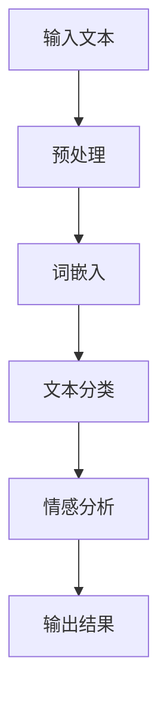
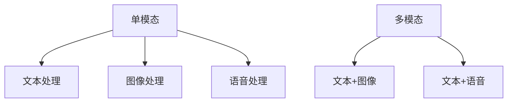
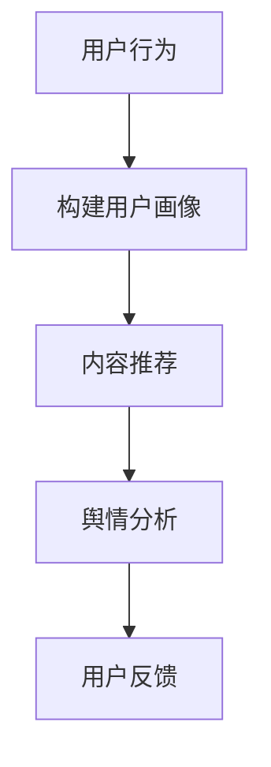
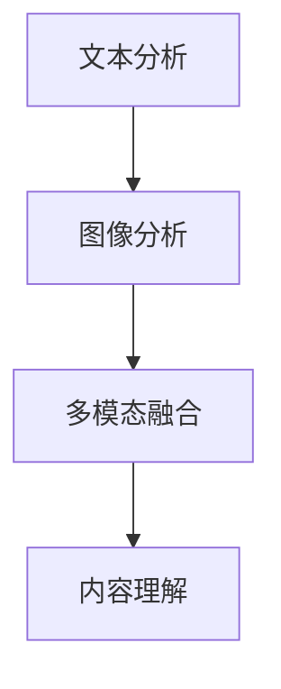
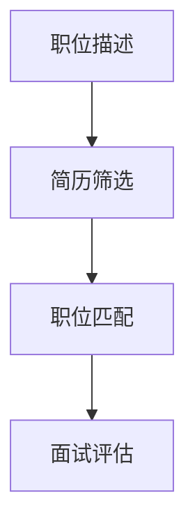
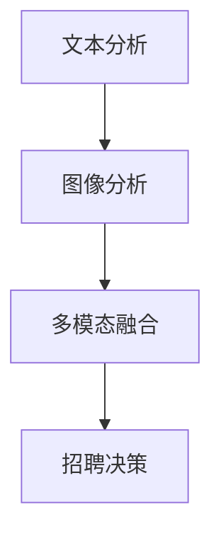
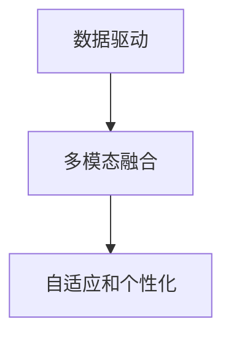
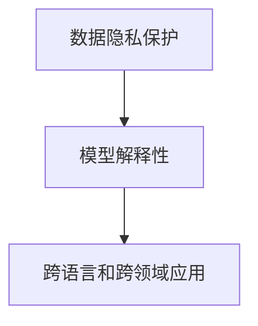

                 

# 《小红书2024内容理解算法校招面试重点》

## 关键词
自然语言处理、内容理解算法、深度学习、社交媒体、招聘面试、文本分类、情感分析、机器翻译、信息检索。

## 摘要
本文将围绕小红书2024年内容理解算法的校招面试重点，深入探讨内容理解算法的基础、技术、应用以及未来发展趋势。文章将结构紧凑，逻辑清晰，使用专业的技术语言，结合实例和伪代码，帮助读者全面掌握内容理解算法的核心知识和实践技巧，为面试备考提供有力支持。

---

# 《小红书2024内容理解算法校招面试重点》目录大纲

## 第一部分：内容理解算法基础

### 第1章：内容理解算法概述

#### 1.1 内容理解算法的定义与作用

**核心概念与联系**
$$
\text{内容理解算法} = \text{自然语言处理} + \text{深度学习} + \text{多模态融合}
$$

**Mermaid 流程图**


#### 1.2 内容理解算法的发展历程

**核心概念与联系**
- 早期方法：基于规则的方法和统计方法
- 现代方法：基于深度学习的方法

**伪代码**
```python
def content_understanding_algorithm(text):
    # 预处理
    preprocessed_text = preprocess(text)
    # 词嵌入
    embedded_text = word_embedding(preprocessed_text)
    # 文本分类
    category = text_classifier(embedded_text)
    # 情感分析
    sentiment = sentiment_analyzer(embedded_text)
    # 输出结果
    return category, sentiment
```

#### 1.3 内容理解算法的分类

**核心概念与联系**
- 单模态：文本、图像、语音
- 多模态：文本+图像、文本+语音

**Mermaid 流程图**


#### 1.4 内容理解算法的应用领域

**核心概念与联系**
- 社交媒体：内容推荐、用户画像、舆情分析
- 招聘：简历筛选、职位匹配、面试评估
- 其他：智能客服、内容审核、教育辅助

**伪代码**
```python
def application_domain(algorithm, domain):
    if domain == "social_media":
        # 社交媒体应用
        result = social_media_application(algorithm)
    elif domain == "recruitment":
        # 招聘应用
        result = recruitment_application(algorithm)
    else:
        # 其他应用
        result = other_application(algorithm)
    return result
```

---

### 第2章：文本处理技术

#### 2.1 语言模型

**核心概念与联系**
- 语言模型：对自然语言进行建模的统计模型
- 序列模型：用于预测序列数据的模型

**数学模型**
$$
P(\text{word}_t | \text{word}_{<t}) = \frac{P(\text{word}_t, \text{word}_{<t})}{P(\text{word}_{<t})}
$$

**伪代码**
```python
def language_model(words):
    # 计算词频
    word_frequency = count_frequency(words)
    # 计算条件概率
    conditional_probability = calculate_probability(word_frequency)
    return conditional_probability
```

#### 2.2 词嵌入技术

**核心概念与联系**
- 词嵌入：将词汇映射到低维连续向量空间
- 向量空间模型：用于文本相似性计算和文本分类

**数学模型**
$$
\text{vec}(\text{word}) = \text{embedding}(\text{word})
$$

**伪代码**
```python
def word_embedding(words):
    # 加载预训练的词嵌入模型
    embedding_model = load_embedding_model()
    # 映射词汇到向量空间
    embedded_words = [embedding_model[word] for word in words]
    return embedded_words
```

#### 2.3 文本分类与情感分析

**核心概念与联系**
- 文本分类：将文本分配到预定义的类别中
- 情感分析：识别文本的情感倾向

**数学模型**
$$
\begin{aligned}
\text{P}(C_k|X) &= \text{softmax}(\text{weights} \cdot \text{vec}(X)) \\
\text{sentiment} &= \text{argmax}_{s \in S} (\text{P}(s|X))
\end{aligned}
$$

**伪代码**
```python
def text_classification(embedded_text, weights):
    # 计算分类概率
    probabilities = softmax(weights @ embedded_text)
    # 选择最大概率的类别
    category = argmax(probabilities)
    return category

def sentiment_analysis(embedded_text, weights):
    # 计算情感概率
    probabilities = softmax(weights @ embedded_text)
    # 选择最大概率的情感
    sentiment = argmax(probabilities)
    return sentiment
```

---

### 第3章：自然语言处理技术

#### 3.1 语音识别技术

**核心概念与联系**
- 语音识别：将语音信号转换为文本
- HMM（隐马尔可夫模型）：用于建模语音信号的时序特性

**数学模型**
$$
\begin{aligned}
P(\text{observed sequence}|\text{hidden sequence}) &= \prod_{t=1}^{T} P(\text{observation}_t|\text{hidden state}_t) \\
P(\text{hidden state}_t) &= \pi_i \cdot a_{ij} \\
P(\text{observation}_t|\text{hidden state}_t) &= b_{j}(\text{observation}_t)
\end{aligned}
$$

**伪代码**
```python
def hidden_state_transition(pi, a):
    # 隐藏状态转移概率
    return np.random.choice(np.arange(len(pi)), p=pi)

def observation_probability(b, observation):
    # 观察概率
    return b[observation]

def viterbi_decoding(observations, pi, a, b):
    # 维特比解码
    ...
```

#### 3.2 机器翻译技术

**核心概念与联系**
- 机器翻译：将一种语言的文本翻译成另一种语言
- 神经机器翻译（NMT）：基于神经网络的翻译模型

**数学模型**
$$
\begin{aligned}
P(\text{target sequence}|\text{source sequence}) &= \frac{P(\text{source sequence}|\text{target sequence}) \cdot P(\text{target sequence})}{P(\text{source sequence})} \\
P(\text{target sequence}) &= \text{softmax}(\text{weights} \cdot \text{vec}(\text{source sequence}))
\end{aligned}
$$

**伪代码**
```python
def translate(source_sequence, target_weights):
    # 计算翻译概率
    probabilities = softmax(target_weights @ source_sequence)
    # 选择最大概率的目标序列
    target_sequence = argmax(probabilities)
    return target_sequence
```

#### 3.3 信息检索技术

**核心概念与联系**
- 信息检索：从大量信息中找到用户需要的信息
- 搜索引擎：使用信息检索技术实现互联网搜索

**数学模型**
$$
\begin{aligned}
\text{relevance score} &= \text{TF} \cdot \text{IDF} \\
\text{TF} &= \frac{\text{词频}}{\text{文档总词频}} \\
\text{IDF} &= \log(\frac{N}{n_i + 1})
\end{aligned}
$$

**伪代码**
```python
def relevance_score(tf, idf, document_frequency, total_documents):
    # 计算词频和逆文档频率
    tf = word_frequency / total_word_frequency
    idf = log(total_documents / (document_frequency + 1))
    # 计算相关性分数
    score = tf * idf
    return score
```

---

### 第4章：深度学习在内容理解中的应用

#### 4.1 卷积神经网络在文本处理中的应用

**核心概念与联系**
- 卷积神经网络（CNN）：用于图像处理，也可用于文本处理
- 卷积操作：提取文本中的局部特征

**数学模型**
$$
\begin{aligned}
\text{output} &= \text{relu}(\text{weights} \cdot \text{input} + \text{bias}) \\
\text{weights} &= \text{filter} \\
\text{input} &= \text{text}
\end{aligned}
$$

**伪代码**
```python
def convolve(text, filter):
    # 应用卷积操作
    output = relu((weights @ text) + bias)
    return output
```

#### 4.2 循环神经网络在序列处理中的应用

**核心概念与联系**
- 循环神经网络（RNN）：用于处理序列数据
- 长短期记忆网络（LSTM）：RNN的一种改进，用于解决长序列依赖问题

**数学模型**
$$
\begin{aligned}
\text{hidden state}_{t} &= \text{sigmoid}((\text{weights}_\text{input} \cdot \text{input}_t) + (\text{weights}_\text{state} \cdot \text{hidden state}_{t-1}) + \text{bias}) \\
\text{output} &= \text{sigmoid}((\text{weights}_\text{output} \cdot \text{hidden state}_t) + \text{bias})
\end{aligned}
$$

**伪代码**
```python
def lstm(input_sequence, weights, bias):
    # 应用LSTM单元
    hidden_state = sigmoid((weights_input @ input_sequence) + (weights_state @ hidden_state) + bias)
    output = sigmoid((weights_output @ hidden_state) + bias)
    return hidden_state, output
```

#### 4.3 生成对抗网络在文本生成中的应用

**核心概念与联系**
- 生成对抗网络（GAN）：用于生成新的数据
- 生成器与判别器：相互竞争，生成逼真的数据

**数学模型**
$$
\begin{aligned}
\text{Generator}: \quad \text{G}(\text{z}) &= \text{Generator}(\text{z}) \\
\text{Discriminator}: \quad \text{D}(\text{x}) &= \text{Discriminator}(\text{x}) \\
\text{D}(\text{G}(\text{z})) &= \text{Discriminator}(\text{Generator}(\text{z}))
\end{aligned}
$$

**伪代码**
```python
def generator(z):
    # 生成文本
    return generate_text(z)

def discriminator(x):
    # 判断文本真实性
    return judge_realness(x)
```

---

### 第5章：内容理解算法在社交媒体中的应用

#### 5.1 社交媒体内容理解的需求

**核心概念与联系**
- 用户画像：基于用户行为和兴趣构建用户特征
- 内容推荐：为用户推荐感兴趣的内容
- 舆情分析：识别并分析用户观点和情绪

**Mermaid 流程图**


#### 5.2 社交媒体内容理解的方法

**核心概念与联系**
- 基于文本分析：利用自然语言处理技术分析文本内容
- 基于图像分析：利用计算机视觉技术分析图像内容
- 基于多模态融合：结合文本和图像分析，提高内容理解准确性

**Mermaid 流程图**


#### 5.3 社交媒体内容理解的案例

**小红书内容理解的案例分析**
- 小红书使用深度学习技术对用户评论进行情感分析和内容分类，实现个性化推荐和舆情监测。
- 通过卷积神经网络提取文本特征，结合用户行为数据构建用户画像，为用户提供高质量的内容推荐。

**其他社交媒体内容理解的案例分析**
- 微博：利用自然语言处理技术对用户微博进行情感分析和热点话题挖掘，实现话题推荐和舆情监控。
- 抖音：结合计算机视觉和自然语言处理技术，对用户视频内容进行识别和分类，实现个性化推荐和内容审核。

---

### 第6章：内容理解算法在招聘中的应用

#### 6.1 招聘中内容理解的需求

**核心概念与联系**
- 简历筛选：根据职位要求对简历进行筛选和分类
- 职位匹配：为求职者推荐合适的职位
- 面试评估：对面试过程进行内容分析，评估求职者能力

**Mermaid 流程图**


#### 6.2 招聘中内容理解的方法

**核心概念与联系**
- 基于文本分析：对简历和职位描述进行文本分析，提取关键信息
- 基于图像分析：对求职者照片和面试视频进行图像分析，识别面部表情和肢体语言
- 基于多模态融合：结合文本和图像分析，提高招聘效率和质量

**Mermaid 流程图**


#### 6.3 招聘中内容理解的案例

**小红书招聘内容理解的案例分析**
- 小红书使用自然语言处理技术对求职者简历进行关键词提取和匹配，实现简历筛选和职位推荐。
- 通过计算机视觉技术对面试视频进行分析，评估求职者的面试表现和情绪状态，为招聘决策提供依据。

**其他招聘内容理解的案例分析**
- 某互联网公司：利用机器翻译技术对国际求职者简历进行翻译和分析，实现跨国招聘。
- 某金融公司：结合自然语言处理和图像分析技术，对求职者进行面试评估和筛选，提高招聘效率。

---

### 第7章：内容理解算法的未来发展趋势

#### 7.1 内容理解算法的发展趋势

**核心概念与联系**
- 数据驱动的深度学习：不断优化算法模型和参数
- 多模态融合：结合多种数据类型，提高内容理解能力
- 自适应和个性化：根据用户需求和行为动态调整算法策略

**Mermaid 流程图**


#### 7.2 内容理解算法的挑战与机遇

**核心概念与联系**
- 数据隐私保护：确保用户数据的安全和隐私
- 模型解释性：提高算法模型的透明度和可解释性
- 跨语言和跨领域应用：解决不同语言和文化背景下的内容理解问题

**Mermaid 流程图**


---

# 附录

## 附录A：内容理解算法开发工具与资源

### A.1 常用开发工具

**自然语言处理工具**
-NLTK（Natural Language Toolkit）
-spaCy
-Stanford CoreNLP

**深度学习框架**
-TensorFlow
-PyTorch
-Keras

**数据处理工具**
-Pandas
-Numpy
-Scikit-learn

### A.2 常用算法与模型

**语言模型**
- n-gram模型
- 隐马尔可夫模型（HMM）
- 条件随机场（CRF）

**词嵌入技术**
- Word2Vec
- GloVe
- FastText

**文本分类与情感分析模型**
- 支持向量机（SVM）
- 随机森林（Random Forest）
- 卷积神经网络（CNN）

**语音识别与机器翻译模型**
- HMM-GMM
- RNN-LSTM
- Transformer

**信息检索模型**
- 搜索引擎排序模型
- 文本相似性模型
- 文本聚类模型

**深度学习模型**
- 卷积神经网络（CNN）
- 循环神经网络（RNN）
- 生成对抗网络（GAN）

### A.3 开发与优化技巧

**数据处理技巧**
- 数据清洗
- 特征提取
- 数据增强

**模型训练技巧**
- 模型调参
- 批处理大小
- 学习率设置

**模型优化技巧**
- 正则化
- 损失函数优化
- 梯度裁剪

**模型评估技巧**
- 准确率、召回率、F1值
- ROC曲线、AUC值
- 实验对比分析

### A.4 参考文献与资料

**经典教材与论文**
- 《自然语言处理综论》（Speech and Language Processing）
- 《深度学习》（Deep Learning）
- 《机器学习》（Machine Learning）

**开源代码与项目**
- GitHub
- PyTorch
- TensorFlow

**技术报告与研讨会**
- NLP研讨会（ACL、NAACL）
- 深度学习研讨会（NeurIPS、ICLR）

**在线课程与讲座**
- Coursera
- edX
- Udacity

**社交媒体与论坛**
- Stack Overflow
- Reddit
-知乎

### A.5 招聘面试指南

**常见面试问题及答案解析**
- 自然语言处理基础
- 深度学习原理
- 模型优化策略

**面试准备与技巧**
- 简历准备
- 面试流程
- 模拟面试

**案例分析与实战经验分享**
- 社交媒体内容理解案例分析
- 招聘中内容理解案例分析

**招聘流程与注意事项**
- 职位需求分析
- 面试评估标准
- 招聘决策流程

**企业面试真题与解析**
- 大厂面试真题
- 真题解析与答案

**招聘面试发展动态与趋势分析**
- 新兴技术趋势
- 市场需求变化
- 招聘策略调整

---

**作者**
AI天才研究院/AI Genius Institute & 禅与计算机程序设计艺术 /Zen And The Art of Computer Programming

---

本文为作者原创，如需转载，请务必注明出处。感谢您的阅读与支持！在人工智能和自然语言处理领域，我们期待与您共同探索和进步。让我们携手，共创美好未来！

