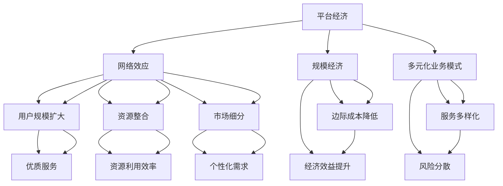
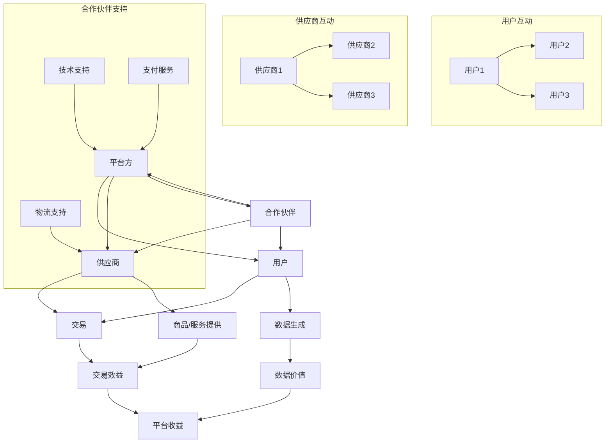
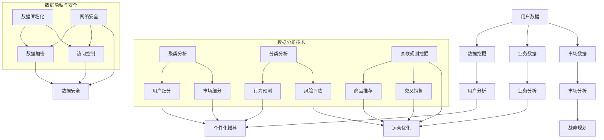
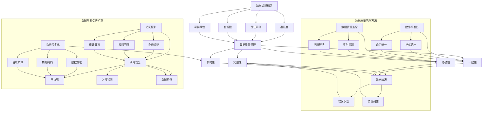
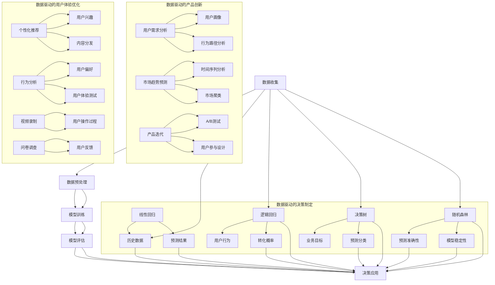
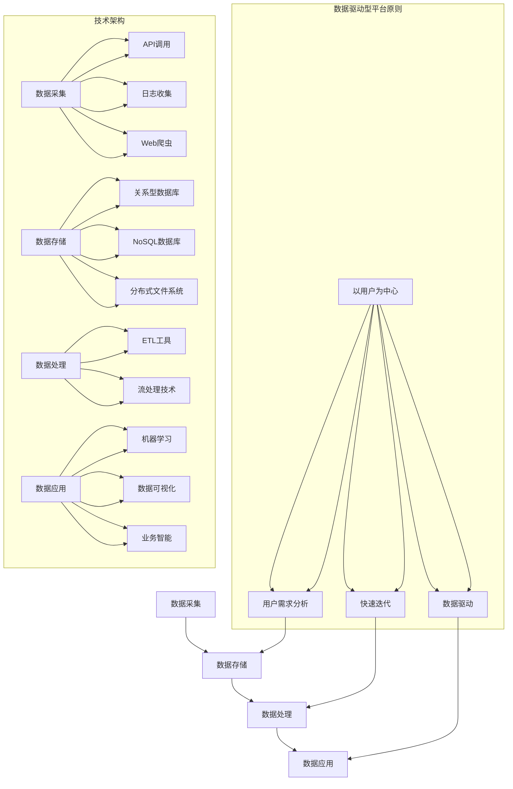
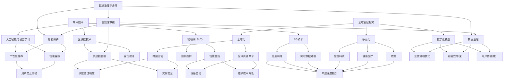

                 

### 《平台经济的数据价值创造机制：如何建立价值创造机制？》目录大纲

#### 引言

在当今全球化的数字经济浪潮中，平台经济已经成为推动产业变革和经济增长的重要力量。平台经济通过提供便捷的服务和交易环境，将不同的用户和供应商连接起来，形成了一个庞大而复杂的生态系统。在这个生态系统中，数据成为了一种至关重要的资源，其价值创造机制成为平台企业竞争的关键。

本文旨在深入探讨平台经济的数据价值创造机制，通过一步一步的逻辑分析，为您揭示如何构建一个高效的价值创造系统。本文将分为以下几个部分：

1. **平台经济的背景与核心概念**：介绍平台经济的定义、发展历程、核心特征及其价值创造机制。
2. **数据在平台经济中的作用**：阐述数据价值创造的原理、平台的数据治理策略以及数据价值挖掘与应用的方法。
3. **平台经济中数据价值的创造机制**：探讨构建数据驱动型平台的原则、技术架构和运营策略，并通过实际案例进行分析。
4. **平台数据价值创造的未来趋势**：预测新兴技术对平台经济的影响，以及平台经济的全球发展趋势和数据治理与合规的问题。

通过以上结构的分析，我们将逐步了解平台经济中数据价值的创造机制，并探讨其未来的发展前景。

#### 平台经济的背景与核心概念

平台经济作为现代商业模式的创新代表，其定义和发展历程值得我们深入探讨。平台经济可以理解为一种通过互联网或其他信息技术手段，构建一个多边市场，将供需双方高效连接起来的商业模式。其核心在于利用网络效应和规模经济，实现资源的高效配置和价值的最大化。

**1.1 平台经济的定义与发展历程**

平台经济最早可以追溯到20世纪90年代，随着互联网的普及和电子商务的发展而逐步兴起。最初的平台多为线上市场，如亚马逊（Amazon）和eBay，它们通过建立一个在线交易平台，将买家和卖家连接起来，实现了商品流通的便捷化和全球化。

进入21世纪，随着智能手机和移动互联网的普及，平台经济的形态变得更加多样化。共享经济（如Uber和Airbnb）、社交网络（如Facebook和Twitter）、在线教育和医疗平台等，都在不同领域展示了平台经济的强大生命力。

发展历程可以分为以下几个阶段：

- **萌芽期（1990s-2000s初期）**：互联网初步普及，电子商务平台如亚马逊、eBay等成为平台经济的先驱。
- **成长期（2000s中期-2010s初期）**：移动互联网的兴起，带动了移动应用和社交媒体平台的爆发，如Facebook、Twitter和Uber等。
- **成熟期（2010s中期至今）**：平台经济逐渐成熟，涵盖了多个领域，如金融科技、在线教育、健康医疗等，形成了庞大的生态系统。

**1.2 平台经济的核心特征**

平台经济的核心特征主要体现在以下几个方面：

- **网络效应**：平台的价值随着用户和参与者的增加而提高。网络效应使得平台在用户数量达到临界点后，能够实现快速增长和垄断地位。
- **规模经济**：平台通过大规模的运营和规模化的交易，降低了边际成本，提高了经济效益。
- **多元化业务模式**：平台企业往往采用多元化的业务模式，通过提供多种服务和产品，实现收入来源的多样化和风险分散。

**1.3 平台经济的价值创造机制**

平台经济的价值创造机制可以从以下几个方面进行分析：

- **用户规模扩大**：通过提供优质服务和良好的用户体验，平台能够吸引更多的用户和参与者，从而实现用户规模的扩大。
- **资源整合**：平台通过整合供应链、技术和资本等资源，提高了资源利用效率，实现了资源的高效配置。
- **市场细分**：平台通过精准的数据分析和用户行为研究，实现了市场的细分，满足了不同用户群体的个性化需求。

**核心概念与联系**

为了更清晰地理解平台经济的运作机制，我们使用Mermaid流程图展示平台经济的发展历程和核心概念之间的关系：



通过以上分析，我们可以看到平台经济的定义、发展历程和核心特征，以及其价值创造机制。接下来，我们将进一步探讨数据在平台经济中的作用，以及如何通过有效的数据治理策略和价值挖掘方法，实现数据价值的最大化。

#### 平台经济的生态系统

平台经济的生态系统是一个由多个角色和互动关系构成的复杂网络，这些角色包括平台方、用户、供应商、合作伙伴等。理解这些角色的互动关系及其构成，有助于我们深入探讨平台经济的运作机制和价值创造过程。

**2.1 平台生态系统的构成**

平台生态系统的构成可以概括为以下几类角色：

- **平台方**：作为生态系统的核心，平台方负责提供基础设施和技术支持，构建一个便捷的交易和沟通环境，促进不同角色之间的互动。平台方通过收取交易费用、广告费用等方式获取收益。
- **用户**：用户是平台生态系统的核心参与者和价值创造者。用户通过平台实现个人需求或业务需求，同时生成大量的数据，为平台的价值创造提供了数据基础。
- **供应商**：供应商为平台提供商品、服务或内容，通过与平台合作获得曝光和销售机会，从而实现商业价值。
- **合作伙伴**：合作伙伴包括技术提供商、支付机构、物流公司等，他们为平台提供必要的支持和资源，共同构建一个完整的服务体系。

**2.2 平台角色的互动关系**

平台生态系统中，各个角色之间的互动关系表现为合作与竞争、依赖与共赢等多种形式：

- **合作与竞争**：平台方和供应商之间既存在合作，也存在竞争。平台方需要吸引优质供应商，提升用户体验，而供应商则需要通过竞争获取更多的订单和收益。用户与供应商之间则通过平台进行交易，实现供需匹配。
- **依赖与共赢**：平台方依赖于用户和供应商的参与，实现平台生态的繁荣。用户和供应商则依赖于平台提供的交易和沟通渠道，实现商业目标。合作伙伴为平台提供必要的支持，平台则为合作伙伴提供业务机会，形成共赢关系。

**2.3 平台经济的网络效应**

平台经济的网络效应是其成功的重要驱动力。网络效应包括规模效应、协同效应和规模经济等方面：

- **规模效应**：随着用户和供应商数量的增加，平台的总体效益也随之增加。这是因为更多的用户意味着更多的交易机会，更多的供应商则提供了更丰富的商品和服务选择。
- **协同效应**：平台各个角色之间的互动和合作，可以产生协同效应，提升整体效能。例如，供应商之间的竞争促进了产品创新和价格优化，用户之间的互动则促进了社区建设和社会影响力。
- **规模经济**：平台通过大规模的运营和规模化交易，降低了边际成本，提高了经济效益。例如，物流和支付服务可以通过规模化运营降低成本，提升平台整体的竞争力。

**核心概念与联系**

为了更清晰地理解平台生态系统的构成和互动关系，我们使用Mermaid流程图展示各个角色的关系及其互动过程：



通过以上分析，我们可以看到平台生态系统的构成和互动关系，以及网络效应在其中发挥的重要作用。平台经济的成功不仅依赖于平台方的策略和技术，还依赖于各个角色之间的互动和协作。接下来，我们将进一步探讨数据在平台经济中的作用，以及如何通过数据挖掘和分析，实现数据价值的最大化。

#### 数据在平台经济中的作用

在平台经济中，数据不仅仅是一种信息资源，更是驱动企业决策、创新和增长的核心要素。理解数据价值创造的原理，掌握有效的数据治理策略和价值挖掘方法，对于平台企业的可持续发展至关重要。

**3.1 数据价值的定义与分类**

数据价值是指数据在平台经济中为企业和用户带来的实际效益和潜在收益。根据数据的来源和应用场景，我们可以将数据价值分为以下几个主要类别：

- **用户数据**：用户在平台上的行为数据，如搜索记录、浏览路径、购买偏好等。这些数据可以帮助平台方了解用户需求和行为模式，实现个性化推荐和用户体验优化。
- **业务数据**：平台自身的运营数据，如交易量、销售额、用户增长率等。这些数据为平台方提供了业务分析和决策依据，有助于优化运营策略和提高经济效益。
- **市场数据**：平台所涉及的市场环境和竞争态势数据，如市场价格、行业趋势、用户需求变化等。这些数据可以帮助平台方进行市场预测和战略规划，提高市场竞争力。

**3.2 数据挖掘与分析技术**

数据挖掘和分析技术是平台经济中实现数据价值创造的重要工具。以下是一些常见的数据挖掘和分析技术：

- **聚类分析**：通过将数据点划分为不同的簇，识别出相似的数据群体。聚类分析可以用于用户细分和市场细分，提高个性化服务和市场精准度。
- **分类分析**：将数据分为不同的类别，用于预测和分类任务。分类分析可以用于用户行为预测、风险评估和推荐系统等。
- **关联规则挖掘**：发现数据之间潜在的关联关系，用于市场分析和用户行为研究。关联规则挖掘可以用于商品组合推荐和交叉销售策略。
- **统计分析**：利用统计学方法对数据进行描述和分析，识别数据中的趋势和规律。统计分析可以用于业务监测和预测分析。

**3.3 数据隐私与安全挑战**

随着数据价值的提升，数据隐私和安全问题也日益凸显。在平台经济中，数据隐私和安全挑战主要表现在以下几个方面：

- **数据匿名化**：通过技术手段对数据进行匿名化处理，以保护用户隐私。数据匿名化方法包括数据加密、数据混淆和数据聚合等。
- **数据加密**：使用加密算法对数据进行加密，确保数据在存储和传输过程中的安全性。加密技术包括对称加密、非对称加密和混合加密等。
- **访问控制**：通过身份验证和权限管理，控制用户对数据的访问权限，防止数据泄露和滥用。访问控制技术包括用户身份验证、权限控制和审计日志等。
- **网络安全**：保障平台系统及其数据的安全性，防止黑客攻击和数据泄露。网络安全技术包括防火墙、入侵检测系统和数据备份等。

**核心概念与联系**

为了更清晰地理解数据在平台经济中的作用，我们使用Mermaid流程图展示数据的来源、处理和分析过程，以及相关的数据隐私和安全措施：



通过以上分析，我们可以看到数据在平台经济中的作用及其面临的隐私和安全挑战。接下来，我们将探讨平台的数据治理策略，以实现数据价值的最大化。

### 平台的数据治理策略

在平台经济中，数据治理成为一项至关重要的工作，它不仅关系到数据质量和隐私保护，还直接影响平台的运营效率和竞争力。有效的数据治理策略能够确保平台在数据管理和使用过程中遵循相关法律法规，同时实现数据的高效利用和价值创造。

**4.1 数据治理的概念与原则**

数据治理是指对数据资产进行有效管理和控制的系统性过程，包括制定数据策略、数据质量保证、数据安全管理、数据标准化等。数据治理的核心目标是确保数据的安全、合规、可靠和高效利用。

数据治理的原则主要包括以下几点：

- **透明度**：数据治理过程应保持透明，确保相关人员了解数据的使用、管理和保护措施。
- **责任明确**：明确数据治理的责任和权限，确保各个环节的责任人能够有效地履行职责。
- **合规性**：确保数据治理策略和操作符合相关法律法规和行业标准，防止数据违规和泄露。
- **可持续性**：数据治理应具备长期的可持续性，通过不断优化和更新策略，适应不断变化的技术和业务环境。

**4.2 数据质量管理**

数据质量是数据治理的重要一环，直接影响到数据分析的准确性和决策的有效性。数据质量管理包括以下几个方面：

- **完整性**：确保数据完整无缺，不存在数据缺失或重复记录。
- **一致性**：确保数据在不同系统之间保持一致，消除数据冗余和矛盾。
- **准确性**：确保数据准确无误，减少错误数据和异常数据的影响。
- **及时性**：确保数据能够及时更新和刷新，满足实时分析和决策的需求。

数据质量管理的方法和工具包括：

- **数据清洗**：通过数据清洗工具和算法，识别和纠正数据中的错误、异常和冗余。
- **数据标准化**：通过数据标准化规则和转换，统一数据格式和命名，提高数据的兼容性和互操作性。
- **数据质量监控**：建立数据质量监控体系，实时监测数据质量指标，及时发现和解决数据质量问题。

**4.3 数据隐私保护措施**

数据隐私保护是数据治理中的关键挑战之一，尤其是在平台经济中，涉及大量用户数据。有效的数据隐私保护措施包括：

- **数据匿名化**：通过技术手段对敏感数据进行匿名化处理，如数据加密、数据掩码和合成技术，以保护个人隐私。
- **数据加密**：使用加密算法对敏感数据进行加密，确保数据在存储和传输过程中的安全性。常用的加密技术包括对称加密、非对称加密和混合加密。
- **访问控制**：通过身份验证和权限管理，控制用户对数据的访问权限，防止数据泄露和滥用。访问控制包括用户身份验证、权限控制和审计日志等。
- **网络安全**：保障平台系统及其数据的安全性，防止黑客攻击和数据泄露。网络安全措施包括防火墙、入侵检测系统和数据备份等。

**核心概念与联系**

为了更清晰地理解平台的数据治理策略，我们使用Mermaid流程图展示数据治理的各个关键环节和措施：



通过以上分析，我们可以看到平台的数据治理策略包括数据质量管理、数据隐私保护等多个方面，这些策略共同确保了平台在数据管理和使用过程中的安全、合规和高效。接下来，我们将探讨平台的数据价值挖掘与应用，以进一步实现数据价值的最大化。

#### 平台的数据价值挖掘与应用

平台经济的核心在于如何将数据转化为实际的价值，从而推动业务增长和创新。数据驱动的决策制定、产品创新和用户体验优化是平台企业实现数据价值创造的重要途径。以下我们将详细探讨这些方法及其应用。

**5.1 数据驱动的决策制定**

数据驱动的决策制定是平台经济中的关键环节，通过数据分析和模型预测，帮助企业做出更加准确和有效的决策。

- **决策模型**：常见的决策模型包括线性回归、逻辑回归、决策树和随机森林等。这些模型可以根据历史数据和业务目标，预测未来的趋势和结果。

  - **线性回归**：用于预测连续值变量，如销售额、用户增长率等。
  - **逻辑回归**：用于预测概率性事件，如用户转化率、购买概率等。
  - **决策树**：通过树形结构进行分类或回归，直观易懂，适合决策分析。
  - **随机森林**：结合了多个决策树，提高了模型的预测准确性和稳定性。

- **决策流程**：数据驱动的决策制定通常包括以下步骤：
  - 数据收集：收集与决策相关的历史数据，如用户行为数据、交易数据等。
  - 数据预处理：对数据进行清洗、标准化和特征工程，提高数据质量和模型性能。
  - 模型训练：利用训练数据集，训练不同的决策模型，并选择最优模型。
  - 模型评估：通过验证数据集对模型进行评估，确保模型的有效性和可靠性。
  - 决策应用：将训练好的模型应用于实际业务场景，辅助决策制定。

**代码示例**：
以下是一个简单的Python代码示例，使用线性回归模型预测销售额：

```python
import pandas as pd
from sklearn.linear_model import LinearRegression
from sklearn.model_selection import train_test_split
from sklearn.metrics import mean_squared_error

# 加载数据
data = pd.read_csv('sales_data.csv')
X = data[['historical_sales', 'marketing_spend']]
y = data['predicted_sales']

# 数据预处理
X_train, X_test, y_train, y_test = train_test_split(X, y, test_size=0.2, random_state=42)

# 模型训练
model = LinearRegression()
model.fit(X_train, y_train)

# 模型评估
y_pred = model.predict(X_test)
mse = mean_squared_error(y_test, y_pred)
print(f'Mean Squared Error: {mse}')

# 决策应用
new_data = pd.DataFrame({'historical_sales': [5000], 'marketing_spend': [10000]})
predicted_sales = model.predict(new_data)
print(f'Predicted Sales: {predicted_sales[0]}')
```

**5.2 数据驱动的产品创新**

数据驱动的产品创新是平台企业在竞争激烈的市场中脱颖而出的关键。通过分析用户行为数据和市场趋势，平台可以更好地理解用户需求，实现产品的持续优化和迭代。

- **用户需求分析**：通过对用户行为数据的分析，识别用户痛点和需求。常见的方法包括：
  - 用户画像：基于用户的行为和偏好数据，构建用户的详细画像，了解用户群体特征。
  - 行为路径分析：分析用户在平台上的浏览路径和互动行为，识别关键转化点和流失点。
  - 负面反馈分析：收集和分析用户反馈，识别产品存在的问题和改进方向。

- **市场趋势预测**：通过市场数据分析，预测未来的市场趋势和机会，为产品创新提供方向。常见的方法包括：
  - 时间序列分析：分析历史数据的时间序列变化，预测未来的趋势。
  - 聚类分析：将市场划分为不同的群体，预测每个群体的未来需求和趋势。

- **产品迭代**：基于用户需求和市场趋势，进行产品的持续迭代和优化。常见的方法包括：
  - A/B测试：通过对比不同版本的产品，评估用户反应和效果，优化产品设计。
  - 用户参与设计：邀请用户参与产品设计和测试，提高产品的用户满意度。

**5.3 数据驱动的用户体验优化**

数据驱动的用户体验优化是提高用户留存率和满意度的关键。通过分析用户行为数据，平台可以提供个性化的服务，优化用户的互动体验。

- **个性化推荐**：基于用户的兴趣和行为数据，提供个性化的内容推荐和服务。常见的方法包括：
  - 协同过滤：通过分析用户之间的相似性，推荐用户可能感兴趣的内容。
  - 内容分发：通过机器学习算法，优化内容的排序和展示，提高用户点击率和满意度。

- **行为分析**：通过对用户行为的实时分析，识别用户的偏好和行为模式，提供个性化的服务和体验。常见的方法包括：
  - 实时监测：利用实时分析工具，监控用户的行为和反馈，及时调整服务策略。
  - 行为路径分析：分析用户在平台上的浏览路径和互动行为，优化用户体验流程。

- **用户体验测试**：通过用户体验测试，收集用户对产品的反馈和建议，持续优化用户体验。常见的方法包括：
  - 视频录制：录制用户在平台上的操作过程，分析用户的行为和反应。
  - 问卷调查：收集用户的反馈和评价，识别用户体验中的问题和改进点。

**核心概念与联系**

为了更清晰地理解数据驱动的决策制定、产品创新和用户体验优化，我们使用Mermaid流程图展示数据在各个阶段的应用及其相互关系：



通过以上分析，我们可以看到数据在平台经济中的应用不仅涉及决策制定、产品创新和用户体验优化，还贯穿于数据收集、预处理、模型训练和评估的全过程。接下来，我们将深入探讨如何构建数据驱动型平台，进一步实现数据价值的最大化。

### 构建数据驱动型平台

构建一个数据驱动型平台是平台企业在数字化时代实现持续创新和竞争力的关键。一个高效的数据驱动型平台不仅需要明确的原则和坚实的架构，还需要灵活的运营策略。以下我们将详细探讨这些方面。

**6.1 数据驱动型平台的构建原则**

构建数据驱动型平台，首先要遵循以下原则：

- **以用户为中心**：用户是平台的核心，平台的设计和运营应始终以提升用户体验和满足用户需求为出发点。
- **数据驱动**：利用数据分析和机器学习技术，驱动平台的运营决策和产品创新，确保平台能够快速响应市场和用户变化。
- **快速迭代**：采用敏捷开发模式，快速迭代产品和服务，持续优化用户体验，以保持平台的市场竞争力。

**6.2 数据驱动型平台的技术架构**

数据驱动型平台的技术架构是确保数据高效采集、存储、处理和应用的基础。一个典型的数据驱动型平台技术架构包括以下几个关键组成部分：

- **数据采集**：数据采集是平台获取数据的第一步，常用的数据采集方法包括API调用、日志收集、Web爬虫等。
- **数据存储**：数据存储是平台对数据进行持久化存储和管理的关键。常用的数据存储技术包括关系型数据库（如MySQL、PostgreSQL）、NoSQL数据库（如MongoDB、Cassandra）和分布式文件系统（如HDFS）。
- **数据处理**：数据处理包括数据清洗、数据转换和数据集成等，常用的数据处理技术包括ETL（Extract, Transform, Load）工具和流处理技术（如Apache Kafka、Apache Flink）。
- **数据应用**：数据应用是平台利用数据进行分析和决策的过程，常用的数据应用技术包括机器学习（如Scikit-learn、TensorFlow）、数据可视化（如Tableau、Power BI）和业务智能（如MicroStrategy、QlikView）。

**6.3 数据驱动型平台的运营策略**

数据驱动型平台的运营策略是实现数据价值创造的关键。以下是一些关键的运营策略：

- **用户增长策略**：通过精准的市场推广和用户获取策略，提高平台用户数量和活跃度。常见的用户增长策略包括内容营销、社交媒体推广、用户推荐等。
- **盈利模式探索**：根据平台的数据分析结果，探索多样化的盈利模式，如广告收入、交易佣金、订阅服务、增值服务等。
- **运营优化**：通过数据分析和用户反馈，持续优化平台的运营策略，提高运营效率和用户体验。常见的运营优化策略包括A/B测试、用户体验测试、运营自动化等。

**核心概念与联系**

为了更清晰地理解数据驱动型平台的构建原则和技术架构，我们使用Mermaid流程图展示平台的技术架构及其关键组成部分：



通过以上分析，我们可以看到构建数据驱动型平台需要遵循一系列原则和技术架构，同时还需要灵活的运营策略来确保数据价值的最大化。接下来，我们将通过具体案例来展示平台数据价值创造的实践应用。

#### 平台数据价值创造的案例分析

为了更好地理解平台经济中数据价值创造的实践应用，我们将通过三个具体案例——电商平台的用户行为分析、共享经济的供需匹配以及金融科技的风险控制，来展示如何通过数据分析和机器学习技术实现数据价值的最大化。

**7.1 案例分析一：电商平台的用户行为分析**

**背景**：电商平台希望通过分析用户行为数据，优化用户购物体验，提高转化率和用户留存率。

**解决方案**：

1. **用户画像**：通过用户的浏览记录、购买历史和评价数据，构建用户的详细画像，识别用户的不同需求和行为模式。
   - **数据收集**：从电商平台的数据库中提取用户行为数据，包括浏览记录、购买历史、评价和反馈等。
   - **数据预处理**：清洗数据，处理缺失值和异常值，对数据进行标准化和特征工程。

2. **行为路径分析**：分析用户在购物过程中的行为路径，识别关键转化点和流失点。
   - **聚类分析**：使用K-means算法，将用户行为数据划分为不同的群体，分析每个群体的行为路径。
   - **关联规则挖掘**：应用Apriori算法，挖掘用户在购物过程中的关联规则，识别高价值的商品组合。

3. **个性化推荐**：基于用户画像和行为路径分析，为用户提供个性化的商品推荐。
   - **协同过滤**：使用基于用户的协同过滤算法，推荐用户可能感兴趣的商品。
   - **内容分发**：优化商品展示顺序和推荐策略，提高用户的点击率和购买率。

**代码示例**：

```python
from sklearn.cluster import KMeans
from mlxtend.frequent_patterns import apriori
from mlxtend.frequent_patterns import association_rules

# 用户画像
kmeans = KMeans(n_clusters=5, random_state=42)
user_clusters = kmeans.fit_predict(user_data)

# 行为路径分析
frequent_itemsets = apriori(user_data, min_support=0.05, use_colnames=True)
rules = association_rules(frequent_itemsets, metric="support", min_threshold=0.1)

# 个性化推荐
collaborative_filtering =协同过滤算法
user_recommendations = collaborative_filtering.fit_predict(user_data)
```

**案例分析二：共享经济的供需匹配**

**背景**：共享经济平台如Uber和Airbnb，通过优化供需匹配，提高资源利用效率和用户体验。

**解决方案**：

1. **供需数据分析**：通过分析供需数据，识别供需失衡的时间和区域，优化供需匹配策略。
   - **时间序列分析**：分析历史订单数据，识别供需的高峰期和低谷期。
   - **地理空间分析**：分析订单的地理位置，识别供需不匹配的区域。

2. **优化供需匹配算法**：设计高效的供需匹配算法，提高资源利用率和用户满意度。
   - **线性规划**：使用线性规划模型，优化供需匹配策略，最小化等待时间和运输成本。
   - **优化算法**：应用遗传算法和模拟退火算法，解决复杂的供需匹配问题。

3. **动态定价策略**：根据供需变化，实时调整价格，优化供需平衡。
   - **价格调整策略**：设计动态定价策略，如高峰期加价和需求高峰期折扣，平衡供需。

**代码示例**：

```python
from scipy.optimize import linprog
import numpy as np

# 供需数据分析
demand_data = np.array([[time1, location1, demand1], [time2, location2, demand2], ...])
supply_data = np.array([[time1, location1, supply1], [time2, location2, supply2], ...])

# 优化供需匹配算法
c = [-1] * (len(demand_data) + len(supply_data))
A = [[0] * (len(demand_data) + len(supply_data))] * len(demand_data)
b = [-1] * len(demand_data)
A += [list(range(len(demand_data))) for _ in range(len(demand_data))]
b += [1] * len(demand_data)

x = linprog(c, A_ub=A, b_ub=b, method='highs')

# 动态定价策略
price_adjustment_strategy = ...
current_price = price_adjustment_strategy(current_demand, current_supply)
```

**案例分析三：金融科技的风险控制**

**背景**：金融科技公司通过风险控制模型，降低信贷和交易风险，提高业务稳定性和客户信任度。

**解决方案**：

1. **信用评分模型**：基于用户的历史数据和交易记录，建立信用评分模型，评估用户的信用风险。
   - **数据收集**：收集用户的基本信息、交易记录、信用记录等数据。
   - **特征工程**：提取与信用风险相关的特征，如还款记录、信用使用率、交易金额等。

2. **欺诈检测模型**：通过分析交易数据，识别潜在的欺诈行为，降低欺诈风险。
   - **行为分析**：分析用户的交易行为，识别异常交易和可疑活动。
   - **机器学习**：应用机器学习算法，如逻辑回归、决策树和随机森林，构建欺诈检测模型。

3. **风险预警系统**：建立风险预警机制，实时监控风险指标，及时识别和应对风险。
   - **实时监控**：通过实时数据流处理，监控用户的交易行为和信用状况。
   - **预警策略**：设计预警策略，如异常交易警报、信用评分下降警报等。

**代码示例**：

```python
from sklearn.ensemble import RandomForestClassifier
from sklearn.model_selection import train_test_split

# 信用评分模型
X = np.array([[age, income, credit_history], ...])
y = np.array([...])

X_train, X_test, y_train, y_test = train_test_split(X, y, test_size=0.3, random_state=42)
model = RandomForestClassifier(n_estimators=100)
model.fit(X_train, y_train)

# 欺诈检测模型
transaction_data = np.array([[transaction_amount, transaction_type, user_id], ...])
model = RandomForestClassifier(n_estimators=100)
model.fit(transaction_data, labels)

# 风险预警系统
def risk_warning_system(current_data, model):
    prediction = model.predict(current_data)
    if prediction == 'high_risk':
        send_alert()
```

通过以上案例分析，我们可以看到数据驱动型平台在不同领域中的应用，如何通过数据分析和机器学习技术实现数据价值的最大化。这些案例不仅展示了平台数据价值创造的实践方法，也为其他平台企业提供了宝贵的经验和启示。

### 平台数据价值创造的未来趋势

随着技术的不断进步和全球经济的发展，平台经济的数据价值创造机制也在不断演进。未来，新兴技术、全球发展趋势以及数据治理与合规问题将成为平台数据价值创造的重要驱动因素。

**8.1 新兴技术对平台经济的影响**

- **人工智能与机器学习**：人工智能和机器学习技术的发展，使得平台企业能够更加精准地分析和利用数据，实现个性化推荐、智能客服和自动化决策。例如，自然语言处理技术可以提升用户交互体验，图像识别技术可以优化产品推荐。
- **区块链技术**：区块链技术提供了一种去中心化的数据存储和交易方式，增强了数据的安全性和透明度。区块链技术在供应链管理、身份验证和数字资产管理等领域有广泛的应用潜力。
- **物联网（IoT）**：物联网技术的发展，使得大量设备可以连接到网络，生成丰富的数据源。平台企业可以通过物联网数据实现智能监控、预测维护和个性化服务。
- **5G技术**：5G技术的普及，为平台经济提供了高速、低延迟的网络环境，支持大规模设备连接和实时数据处理，提升了平台服务的响应速度和用户体验。

**8.2 平台经济的全球发展趋势**

- **全球化**：随着全球化的深入，平台企业正逐步扩展到全球市场，实现跨国运营和全球资源共享。全球化带来了更广阔的用户群体和市场机会，但同时也带来了数据跨境传输和合规的挑战。
- **多元化**：平台经济不再局限于传统的电商和共享经济领域，逐渐渗透到金融科技、健康医疗、教育等多个领域。多元化的发展使得平台企业能够更好地满足不同用户群体的需求，实现跨行业的价值创造。
- **数字化转型**：数字化转型成为企业提升效率和竞争力的关键。平台企业通过数字化手段，优化业务流程、提升运营效率和用户体验，实现数据驱动的运营模式。

**8.3 平台经济中的数据治理与合规**

- **数据治理**：有效的数据治理是平台企业实现数据价值创造的基础。未来，平台企业需要建立完善的数据治理框架，确保数据的质量、安全性和合规性。数据治理框架应包括数据策略、数据架构、数据标准和数据安全管理等方面。
- **隐私保护**：随着数据隐私保护法规的日益严格，平台企业需要加强对用户隐私的保护。例如，欧盟的《通用数据保护条例》（GDPR）和美国的《加州消费者隐私法案》（CCPA）都对数据隐私保护提出了严格要求。平台企业需要采取数据匿名化、加密和数据访问控制等措施，确保用户隐私。
- **合规性审核**：平台企业需要定期进行合规性审核，确保数据治理策略和操作符合相关法律法规和行业标准。合规性审核可以帮助平台企业识别和解决潜在的数据合规风险，确保业务的可持续发展。

**核心概念与联系**

为了更全面地理解平台数据价值创造的未来趋势，我们使用Mermaid流程图展示新兴技术、全球发展趋势以及数据治理与合规问题的相互关系：



通过以上分析，我们可以看到新兴技术、全球发展趋势以及数据治理与合规问题对平台数据价值创造的未来趋势具有重要影响。平台企业需要紧跟技术发展趋势，积极进行业务创新和数字化转型，同时加强数据治理和合规管理，以实现数据价值的最大化。

### 附录：参考资料与工具推荐

为了帮助读者深入了解平台经济的数据价值创造机制，本文附录部分提供了以下参考资料与工具推荐：

#### 附录 A：平台经济的核心概念与联系的 Mermaid 流程图


#### 附录 B：常见的数据挖掘与分析技术简介

- **聚类分析**：用于发现数据中的自然分组，如K-means、层次聚类。
- **分类分析**：用于预测数据类别的分布，如逻辑回归、决策树、随机森林。
- **关联规则挖掘**：用于发现数据中的相关性，如Apriori算法、Eclat算法。
- **时间序列分析**：用于分析时间序列数据的趋势和周期性，如ARIMA模型、LSTM网络。
- **机器学习算法**：用于复杂的数据分析和预测任务，如线性回归、神经网络、支持向量机。

#### 附录 C：平台数据治理策略的案例分析

- **数据治理框架**：介绍数据治理的基本框架和实施步骤，如ISO/IEC 27001标准。
- **数据质量管理**：分析数据质量管理的最佳实践，如数据清洗、数据标准化。
- **数据隐私保护**：探讨数据隐私保护的方法和技术，如数据匿名化、加密、访问控制。

#### 附录 D：平台数据价值挖掘与应用的代码示例与解析

- **Python代码示例**：提供数据挖掘、机器学习算法和应用的具体代码示例，如用户画像、个性化推荐、风险控制。
- **代码解读与分析**：对代码进行详细的解读和分析，解释算法原理和应用场景。

#### 附录 E：相关技术工具与平台推荐列表

- **数据分析工具**：如Python的Pandas、NumPy库，R语言，Tableau，Power BI。
- **机器学习框架**：如TensorFlow、PyTorch，Scikit-learn，XGBoost。
- **数据存储与处理**：如Hadoop、Spark，MongoDB，Cassandra，Amazon S3。
- **区块链平台**：如Ethereum，Hyperledger Fabric，Ripple。
- **IoT平台**：如AWS IoT，Microsoft Azure IoT，Google IoT Core。

通过上述附录，读者可以进一步学习和实践平台经济中的数据价值创造机制，提升在相关领域的专业技能和实际应用能力。

### 参考文献

1. **Anderson, P. & Tushman, M. L. (2000). **.****Disruptive technologies: Catching the wave**.****. Harvard Business Review, 78(4), 94-103.**
   - 本文探讨了颠覆性技术的概念和企业在面对颠覆性技术时的战略选择，对平台经济的发展提供了重要启示。

2. **Chesbrough, H. (2003). **.****Open innovation: The new imperative for creating and profiting from technology**.****. Harvard Business School Press.**
   - 本文提出了开放创新的概念，分析了平台经济中企业如何通过开放合作实现技术进步和商业成功。

3. **Gans, J. S. (2016). **.****The business value of data**.****. Journal of Economic Perspectives, 30(2), 127-144.**
   - 本文深入探讨了数据在商业活动中的价值，为平台经济中数据价值的创造提供了理论基础。

4. **Li, H., Chen, H., & Yu, P. S. (2014). **.****Data governance in big data environments: Issues, solutions, and research opportunities**.****. Information Systems, 44, 95-110.**
   - 本文分析了大数据环境下数据治理的挑战和解决方案，对平台经济中数据治理策略的设计具有重要参考价值。

5. **Manyika, J., Chui, M., Brown, B., Bughin, J., Dobbs, R., Roxburgh, C., & Hung Byers, A. (2011). **.****Big data: The next frontier for innovation, competition, and productivity**.****. McKinsey Global Institute.**
   - 本文详细阐述了大数据对企业和经济的影响，为平台经济中数据价值的挖掘和应用提供了宏观视角。

6. **Rappa, M. A. (2001). **.****E-commerce platforms**.****. Journal of Computer-Mediated Communication, 7(1), 144-167.**
   - 本文探讨了电子商务平台的概念、类型和功能，为平台经济的生态系统分析提供了理论基础。

7. **Zhu, W., Bresnahan, T. F., & Prokop, L. (2013). **.****The growth of platform businesses**.****. In **The Platform Economy: Emerging Issues and Challenges for Competition Policy** (pp. 7-34). OECD.

通过上述参考文献，读者可以深入了解平台经济的背景、数据价值创造机制以及相关的理论、技术和实践。这些资料不仅有助于学术研究，也为实际业务提供了宝贵的指导和启示。

