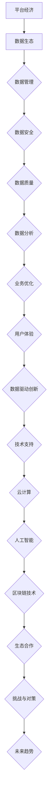

                 

# 平台经济的数据生态构建模式：如何构建生态模式？

## 关键词
- 平台经济
- 数据生态
- 数据管理
- 数据安全
- 数据质量
- 业务优化
- 用户体验
- 人工智能
- 云计算
- 区块链技术

## 摘要
本文将探讨平台经济的数据生态构建模式，分析平台经济的核心特征和基本原理，以及数据生态的构建策略、数据驱动的平台业务模式和技术支持。通过实际项目案例，深入解读开发环境搭建、源代码实现和代码解读，为构建平台数据生态提供实践指导和理论支持。

## 目录
----------------------------------------------------------------
### 第一部分：平台经济概述

#### 第1章：平台经济的定义与特征
##### 1.1 平台经济的定义
##### 1.2 平台经济的核心特征
##### 1.3 平台经济的起源与发展

#### 第2章：平台经济的基本原理
##### 2.1 价值网络理论
##### 2.2 平台经济的生态系统
##### 2.3 平台经济的价值创造与分配

#### 第3章：平台经济的法律与政策环境
##### 3.1 平台经济的法律法规
##### 3.2 平台经济的监管政策
##### 3.3 平台经济的国际比较

### 第二部分：数据生态的构建模式

#### 第4章：数据生态的核心概念
##### 4.1 数据的定义与分类
##### 4.2 数据生态的概念与架构
##### 4.3 数据生态的关键要素

#### 第5章：数据生态的构建策略
##### 5.1 数据共享与流通
##### 5.2 数据安全与隐私保护
##### 5.3 数据质量与治理

#### 第6章：数据驱动的平台业务模式
##### 6.1 数据驱动的决策分析
##### 6.2 数据驱动的业务创新
##### 6.3 数据驱动的客户体验优化

#### 第7章：数据生态的技术支持
##### 7.1 大数据和云计算技术
##### 7.2 人工智能与机器学习
##### 7.3 区块链技术

### 第三部分：平台经济的数据生态实践

#### 第8章：平台经济的数据生态构建案例
##### 8.1 案例一：电子商务平台的数据生态
##### 8.2 案例二：共享经济的平台数据生态
##### 8.3 案例三：金融科技平台的数据生态

#### 第9章：构建平台数据生态的挑战与对策
##### 9.1 数据生态的挑战
##### 9.2 数据生态的对策
##### 9.3 数据生态的未来趋势

#### 附录
##### 附录A：构建平台数据生态的参考资源
##### 附录B：Mermaid流程图示例

### 引言
平台经济作为一种新兴的经济模式，正逐渐成为推动社会经济发展的重要力量。随着大数据、人工智能、云计算等技术的迅猛发展，平台经济的数据生态构建模式成为学术界和产业界关注的焦点。本文旨在探讨平台经济的数据生态构建模式，分析平台经济的核心特征和基本原理，以及数据生态的构建策略、数据驱动的平台业务模式和技术支持。通过实际项目案例，深入解读开发环境搭建、源代码实现和代码解读，为构建平台数据生态提供实践指导和理论支持。

在接下来的文章中，我们将首先对平台经济的定义与特征进行概述，分析平台经济的起源与发展，以及平台经济的基本原理。然后，我们将深入探讨数据生态的核心概念，包括数据的定义与分类、数据生态的概念与架构以及数据生态的关键要素。接下来，我们将介绍数据生态的构建策略，包括数据共享与流通、数据安全与隐私保护、数据质量与治理。随后，我们将探讨数据驱动的平台业务模式，包括数据驱动的决策分析、数据驱动的业务创新和数据驱动的客户体验优化。在技术支持部分，我们将介绍大数据和云计算技术、人工智能与机器学习以及区块链技术。最后，我们将通过实际项目案例，深入解读开发环境搭建、源代码实现和代码解读，为构建平台数据生态提供实践指导和理论支持。

## 第一部分：平台经济概述

### 第1章：平台经济的定义与特征

#### 1.1 平台经济的定义

平台经济，又称平台化经济，是指以信息技术为基础，通过搭建平台（如电子商务平台、共享经济平台、金融服务平台等）实现资源高效配置、优化市场结构、提高交易效率的一种经济模式。平台经济不仅仅是一种商业模式，更是一种新的经济发展方式，它改变了传统经济活动的格局，促进了产业链的整合和创新。

平台经济的关键特征包括：

1. **网络效应**：平台的价值随着用户数量的增加而增加，用户越多，平台的价值就越大。
2. **双边市场**：平台连接两个或多个不同类型的用户群体，如买家和卖家、乘客和司机等，通过为这些用户群体提供互补的服务来创造价值。
3. **规模经济**：平台通过规模效应降低成本，提高运营效率。
4. **数据驱动**：平台积累了大量用户数据，通过数据分析实现精准营销、个性化推荐等。
5. **生态系统**：平台不仅仅是一个中介，还是一个生态系统，其中包括平台运营者、服务提供商、用户等多方参与者。

#### 1.2 平台经济的核心特征

平台经济的核心特征可以从以下几个方面来理解：

1. **多元化参与者**：平台经济吸引了各种类型的参与者，包括消费者、企业、开发者、投资者等，形成了多元化的市场生态。
2. **灵活性和适应性**：平台经济能够迅速适应市场需求变化，通过创新服务和技术来满足用户需求。
3. **资源整合能力**：平台经济通过整合不同资源（如资金、人才、技术等），提高了资源的利用效率。
4. **网络效应**：平台经济依赖于网络效应，通过规模扩大来提高平台的价值。
5. **风险分担**：平台经济通过分散化策略来降低个体参与者的风险。

#### 1.3 平台经济的起源与发展

平台经济的起源可以追溯到20世纪末互联网的兴起。随着互联网技术的发展，电子商务平台（如Amazon、eBay）和共享经济平台（如Uber、Airbnb）开始涌现，并迅速改变了传统商业模式。近年来，随着大数据、人工智能、物联网等新技术的应用，平台经济得到了进一步发展，成为全球经济的重要驱动力。

平台经济的发展历程可以分为以下几个阶段：

1. **1.0阶段**：以互联网信息平台为主，如门户网站和搜索引擎，通过信息聚合和分发实现商业价值。
2. **2.0阶段**：以电子商务平台和社交媒体为主，通过连接买家和卖家、用户和用户，实现交易和社交价值的融合。
3. **3.0阶段**：以智能化平台为主，通过大数据和人工智能技术，实现个性化服务、精准营销和智能决策。

### 第2章：平台经济的基本原理

#### 2.1 价值网络理论

价值网络理论是平台经济理论的重要组成部分，它强调平台作为一个价值网络的中介角色，通过连接不同参与者，实现价值的创造和传递。价值网络理论的基本概念包括：

1. **节点**：价值网络中的节点可以是企业、消费者、开发者等，它们是价值的创造者和享受者。
2. **连接**：节点之间的连接可以是交易关系、合作关系或信息传递关系。
3. **价值创造**：通过节点之间的连接，平台能够实现价值的创造，包括直接价值和间接价值。
4. **价值传递**：平台通过提供交易、合作和信息服务等手段，实现价值的传递。

价值网络理论的应用包括：

1. **平台设计**：通过分析价值网络中的节点和连接，优化平台结构，提高平台价值。
2. **商业模式创新**：通过构建新的价值网络，实现商业模式的创新和升级。
3. **合作伙伴关系管理**：通过有效管理价值网络中的合作伙伴关系，实现资源整合和协同创新。

#### 2.2 平台经济的生态系统

平台经济的生态系统是一个复杂的系统，包括平台运营者、服务提供商、用户等多方参与者。平台生态系统的基本构成包括：

1. **平台运营者**：平台经济的核心，负责平台的搭建、运营和维护。
2. **服务提供商**：为平台用户提供服务和产品，包括第三方服务提供商和平台内服务提供商。
3. **用户**：平台经济的参与者，包括消费者、企业、开发者等。

平台生态系统的运作机制包括：

1. **价值创造**：平台运营者通过提供基础设施和服务，连接不同的参与者，实现价值的创造。
2. **价值分配**：平台通过定价机制、分成模式等手段，实现价值的合理分配。
3. **生态协同**：通过合作伙伴关系、技术共享、数据共享等手段，实现生态系统的协同发展。

#### 2.3 平台经济的价值创造与分配

平台经济的价值创造主要体现在以下几个方面：

1. **降低交易成本**：平台通过提供中介服务，降低交易的成本，提高交易效率。
2. **提高资源利用效率**：平台通过整合资源，实现资源的优化配置，提高资源利用效率。
3. **促进创新**：平台为参与者提供创新的环境和机会，促进技术创新和服务创新。
4. **增强网络效应**：平台通过扩大用户规模，提高平台的价值。

平台经济的价值分配涉及到以下几个方面：

1. **平台运营者**：平台运营者通过提供平台服务获取收益，包括交易费、广告费、会员费等。
2. **服务提供商**：服务提供商通过提供服务和产品获取收益，包括服务费、佣金等。
3. **用户**：用户通过使用平台服务获得价值，包括交易优惠、服务优惠等。

平台经济的价值创造与分配是一个动态的过程，需要通过有效的平台设计、商业模式创新和生态协同来优化。

### 第3章：平台经济的法律与政策环境

#### 3.1 平台经济的法律法规

平台经济的快速发展带来了新的法律挑战，需要制定相应的法律法规来规范平台经济的行为。平台经济的法律法规主要包括以下几个方面：

1. **反垄断法**：平台经济中的大型平台可能成为市场垄断者，需要通过反垄断法来规范其行为，防止市场垄断和不正当竞争。
2. **消费者权益保护法**：平台经济中涉及到消费者权益保护的问题，需要制定相应的法律法规来保护消费者的合法权益。
3. **网络安全法**：平台经济中的网络安全问题日益突出，需要通过网络安全法来保护用户数据安全，防止数据泄露和网络攻击。
4. **数据保护法**：平台经济中积累了大量用户数据，需要通过数据保护法来规范数据收集、处理和使用的合法行为。

#### 3.2 平台经济的监管政策

平台经济的监管政策是政府在平台经济发展过程中的重要工具，通过制定和实施监管政策，实现平台经济的健康发展和规范管理。平台经济的监管政策主要包括以下几个方面：

1. **市场准入监管**：通过设定市场准入门槛，防止低质量平台进入市场，保障市场秩序。
2. **平台运营监管**：通过监管平台运营行为，保障平台用户的合法权益，防止平台滥用市场优势地位。
3. **数据监管**：通过监管平台的数据收集、处理和使用行为，保障用户数据的安全和隐私。
4. **税收监管**：通过制定税收政策，规范平台经济的税收行为，实现税收公平。

#### 3.3 平台经济的国际比较

平台经济的法律与政策环境在不同国家和地区存在较大差异，这影响了平台经济的发展模式和竞争力。以下是几个典型国家和地区的平台经济法律与政策环境的比较：

1. **美国**：美国在平台经济领域采取了较为宽松的监管政策，强调市场自我调节，但同时也存在反垄断法、消费者权益保护法等法律框架来规范平台行为。
2. **欧洲**：欧洲在平台经济领域采取了严格的监管政策，强调数据保护、消费者权益保护等，并通过欧盟《通用数据保护条例》（GDPR）等法律来规范平台行为。
3. **中国**：中国在平台经济领域采取了综合性的监管政策，强调市场监管、数据安全、税收管理等，并通过《电子商务法》等法律来规范平台行为。

通过国际比较，可以发现不同国家和地区的平台经济法律与政策环境对平台经济发展产生了重要影响，为全球平台经济的发展提供了借鉴和参考。

## 第二部分：数据生态的构建模式

### 第4章：数据生态的核心概念

#### 4.1 数据的定义与分类

数据是平台经济运行的基础，其定义和分类对于理解数据生态至关重要。数据可以定义为“通过记录、采集、处理和存储，可以反映客观事实的信息”。根据不同的分类标准，数据可以分为多种类型：

1. **结构化数据**：指以表格、数据库等形式组织的数据，如关系数据库中的记录、Excel文件等。
2. **非结构化数据**：指不以表格形式组织的数据，如文本、图片、音频、视频等。
3. **半结构化数据**：介于结构化数据和非结构化数据之间，如XML、JSON等。

数据的分类对于数据管理和分析具有重要意义，不同类型的数据需要不同的处理方法和工具。

#### 4.2 数据生态的概念与架构

数据生态是指一个由多个数据节点、数据处理单元、数据连接和交互机制组成的复杂系统。数据生态的架构通常包括以下几个关键组成部分：

1. **数据源**：数据生态中的数据源包括内部系统和外部系统，如企业内部数据库、传感器、第三方数据提供商等。
2. **数据采集**：通过数据采集工具和技术，从数据源中获取数据，包括结构化数据采集、非结构化数据采集等。
3. **数据存储**：数据存储是数据生态的核心组成部分，包括关系型数据库、NoSQL数据库、数据仓库等。
4. **数据处理**：数据处理包括数据的清洗、转换、归一化等，为数据分析和应用提供基础。
5. **数据连接**：数据连接是指通过数据集成工具和技术，实现不同数据源和数据存储之间的数据交换和共享。
6. **数据安全**：数据安全是数据生态中不可或缺的部分，包括数据加密、访问控制、审计等。
7. **数据应用**：数据应用是指通过数据分析、挖掘、可视化等技术，将数据转化为有价值的信息和知识。

数据生态的概念和架构为平台经济的运行提供了基础支持，通过有效的数据管理和分析，实现数据价值的最大化。

#### 4.3 数据生态的关键要素

数据生态的构建需要考虑多个关键要素，以下是一些主要要素：

1. **数据治理**：数据治理是确保数据质量、安全、合规的重要措施，包括数据质量管理、数据安全管理、数据合规管理等。
2. **数据共享**：数据共享是促进数据生态中各参与者协同合作的基础，通过建立数据共享机制，实现数据的高效利用。
3. **数据标准化**：数据标准化是确保数据一致性、可互操作性的重要手段，通过制定数据标准和规范，提高数据的管理和使用效率。
4. **数据可视化**：数据可视化是将数据转化为图形、图表等形式，帮助用户更好地理解和分析数据。
5. **数据分析**：数据分析是数据生态的核心，通过数据挖掘、机器学习等技术，从大量数据中提取有价值的信息和知识。
6. **技术支持**：技术支持是数据生态建设的重要保障，包括大数据技术、云计算技术、人工智能技术等。

数据生态的关键要素相互作用，共同构成了一个高效、安全、可扩展的数据生态系统。

### 第5章：数据生态的构建策略

#### 5.1 数据共享与流通

数据共享与流通是构建数据生态的重要策略，通过建立有效的数据共享机制和流通渠道，实现数据的高效利用和互操作性。以下是一些关键策略：

1. **数据共享平台**：建立统一的数据共享平台，提供数据接入、数据交换、数据访问等功能，实现跨部门、跨系统、跨领域的数据共享。
2. **数据接口规范**：制定统一的数据接口规范，确保不同系统和平台之间的数据能够无缝对接和交换。
3. **数据定价机制**：建立合理的数据定价机制，激励数据提供者积极参与数据共享，同时确保数据使用者的合法权益。
4. **数据隐私保护**：在数据共享和流通过程中，加强数据隐私保护，采用数据脱敏、加密等技术手段，保障用户数据的安全和隐私。

#### 5.2 数据安全与隐私保护

数据安全和隐私保护是数据生态构建中的核心挑战，需要采取一系列措施来确保数据的安全性和用户隐私。以下是一些关键策略：

1. **数据加密**：采用数据加密技术，对敏感数据进行加密存储和传输，防止数据泄露和未经授权的访问。
2. **访问控制**：通过访问控制机制，限制对数据的访问权限，确保只有授权用户才能访问和处理数据。
3. **安全审计**：建立安全审计机制，记录和监控数据访问和操作行为，及时发现和应对安全事件。
4. **隐私保护法规**：遵循相关隐私保护法规，如《通用数据保护条例》（GDPR），确保数据收集、处理和使用的合法合规。

#### 5.3 数据质量与治理

数据质量是数据生态构建的基础，高质量的数据能够为业务决策提供可靠的依据。以下是一些关键策略：

1. **数据质量管理**：建立数据质量管理机制，包括数据清洗、数据校验、数据标准化等，确保数据的准确性、完整性、一致性。
2. **数据治理框架**：制定数据治理框架，明确数据管理的目标、策略、流程和责任，确保数据管理的规范化和高效化。
3. **数据质量评估**：定期对数据质量进行评估，发现和解决数据质量问题，提高数据质量。
4. **数据治理组织**：建立数据治理组织，负责数据质量管理的规划和实施，确保数据质量管理的有效执行。

通过数据共享与流通、数据安全与隐私保护、数据质量与治理等策略的实施，可以构建一个高效、安全、可扩展的数据生态系统，为平台经济的运行提供坚实基础。

### 第6章：数据驱动的平台业务模式

#### 6.1 数据驱动的决策分析

数据驱动的决策分析是平台业务模式的重要特征，通过利用大数据和人工智能技术，对海量数据进行深入分析，为企业提供科学的决策支持。以下是一些关键策略：

1. **数据挖掘与分析**：采用数据挖掘技术，从海量数据中提取有价值的信息和规律，为决策提供数据支持。
2. **预测分析**：利用时间序列分析、回归分析、机器学习等技术，对业务数据进行分析，预测未来的业务趋势和变化。
3. **决策模型**：建立决策模型，通过数据驱动的方式，制定业务策略和运营计划，提高决策的科学性和准确性。
4. **实时监控**：通过实时数据监控和分析，及时发现业务中的问题和异常，快速响应和调整。

#### 6.2 数据驱动的业务创新

数据驱动的业务创新是平台经济的重要特点，通过分析用户行为数据和市场趋势，不断探索新的业务模式和服务创新。以下是一些关键策略：

1. **用户画像**：通过用户行为数据，构建用户画像，了解用户需求和偏好，为个性化服务提供依据。
2. **市场细分**：根据用户数据和市场分析，对市场进行细分，针对不同细分市场制定差异化的业务策略。
3. **产品创新**：基于用户数据和市场需求，不断推出新的产品和服务，满足用户个性化需求。
4. **商业模式创新**：通过数据分析和市场洞察，探索新的商业模式，实现业务拓展和盈利模式创新。

#### 6.3 数据驱动的客户体验优化

数据驱动的客户体验优化是平台业务模式的核心目标，通过深入分析用户数据，优化客户体验，提高用户满意度和忠诚度。以下是一些关键策略：

1. **个性化推荐**：利用用户行为数据和机器学习技术，为用户提供个性化的产品推荐和服务推荐，提高用户体验。
2. **实时交互**：通过实时数据分析，及时响应用户的需求和反馈，提供个性化的互动和沟通体验。
3. **服务个性化**：根据用户画像和业务数据，为用户提供个性化的服务和产品，满足用户多样化需求。
4. **用户体验评估**：定期评估用户满意度，通过用户反馈和数据分析，持续优化客户体验，提高用户忠诚度。

通过数据驱动的决策分析、业务创新和客户体验优化，平台企业可以不断提高业务效率和竞争力，实现可持续发展。

### 第7章：数据生态的技术支持

#### 7.1 大数据和云计算技术

大数据和云计算技术是构建数据生态的重要技术支持，它们为海量数据的存储、处理和分析提供了强大的计算能力和灵活性。以下是一些关键技术和应用：

1. **大数据技术**：包括Hadoop、Spark等分布式计算框架，用于大规模数据的存储和处理。Hadoop提供了可靠的数据存储和高效的数据检索能力，而Spark则提供了快速的分布式数据处理能力，适用于实时数据处理和迭代计算。
2. **云计算技术**：包括AWS、Azure、Google Cloud等云服务平台，提供了弹性可扩展的计算资源、存储服务和数据处理工具。云服务平台的弹性和高可用性，使得企业能够按需扩展计算资源，降低IT基础设施的维护成本。
3. **数据湖**：数据湖是一种新型的数据存储架构，用于存储大量的非结构化和半结构化数据。数据湖能够存储原始数据，并支持实时数据处理和分析，适用于大规模数据分析和数据挖掘。
4. **数据仓库**：数据仓库是一种用于存储和管理大规模结构化数据的系统，适用于企业级数据分析和报告。数据仓库通过ETL（提取、转换、加载）过程，将数据从多个源系统中整合到一个统一的数据存储中，支持复杂的数据查询和分析。

#### 7.2 人工智能与机器学习

人工智能和机器学习技术是数据生态中的核心，它们通过算法和模型，从海量数据中提取有价值的信息和知识，支持智能决策和业务创新。以下是一些关键技术和应用：

1. **机器学习算法**：包括线性回归、决策树、随机森林、支持向量机等传统机器学习算法，以及深度学习、强化学习等先进算法。机器学习算法通过训练模型，从数据中学习规律和模式，为预测分析和决策支持提供依据。
2. **深度学习**：深度学习是一种基于多层神经网络的学习方法，通过自动提取特征，实现复杂的模式识别和预测任务。深度学习在图像识别、自然语言处理、语音识别等领域取得了显著的成果，成为数据生态中的重要技术。
3. **自然语言处理（NLP）**：NLP技术通过理解和生成自然语言，实现人与机器的智能交互。NLP在文本分类、情感分析、机器翻译等领域有广泛应用，为数据生态中的数据分析和业务创新提供了有力支持。
4. **计算机视觉**：计算机视觉技术通过图像处理和模式识别，实现图像和视频的分析和理解。计算机视觉在安防监控、自动驾驶、医疗诊断等领域有广泛应用，为数据生态中的图像和视频数据处理提供了技术支持。

#### 7.3 区块链技术

区块链技术是一种分布式账本技术，通过去中心化的方式，实现数据的透明、安全存储和可靠传输。以下是一些关键技术和应用：

1. **分布式账本**：区块链通过分布式账本技术，实现了数据的分布式存储和共享，避免了单点故障和数据篡改的风险。分布式账本适用于供应链管理、金融交易等领域，提高了数据的透明度和可信度。
2. **智能合约**：智能合约是一种自动执行的合约，通过区块链上的编程语言编写，当满足特定条件时自动执行。智能合约在金融、物流等领域有广泛应用，能够提高交易效率和降低成本。
3. **数据隐私保护**：区块链技术通过加密和分布式存储，提高了数据的隐私保护能力。区块链上的数据可以通过加密算法进行加密存储，确保数据在传输和存储过程中的安全。
4. **供应链管理**：区块链技术通过透明、可信的分布式账本，实现了供应链中各参与方的信息共享和协作。区块链在供应链管理中，可以用于跟踪产品来源、验证产品质量、提高供应链的透明度和效率。

通过大数据和云计算技术、人工智能与机器学习技术以及区块链技术的应用，数据生态得以高效、安全、可靠地运行，为平台经济的可持续发展提供了技术支持。

### 第8章：平台经济的数据生态构建案例

#### 8.1 案例一：电子商务平台的数据生态

电子商务平台的数据生态是典型的平台经济数据生态案例，通过构建完善的数据生态，实现用户需求和市场动态的精准把握，提高业务效率和用户满意度。以下是电子商务平台数据生态构建的详细过程：

1. **数据采集**：电子商务平台通过网站访问日志、用户行为数据、交易数据等，全面采集用户数据。同时，平台还通过与第三方数据提供商合作，获取更多外部数据，如市场趋势、竞争分析等。

2. **数据存储**：电子商务平台采用分布式存储方案，将海量数据存储在云存储平台中，确保数据的安全性和可靠性。同时，平台还建立数据仓库，用于存储和管理结构化数据，支持复杂的数据查询和分析。

3. **数据处理**：电子商务平台采用大数据处理技术，如Hadoop、Spark等，对海量数据进行清洗、转换、归一化等处理，确保数据的质量和一致性。平台还通过数据预处理工具，对非结构化数据进行结构化处理，为后续分析提供支持。

4. **数据共享**：电子商务平台建立统一的数据共享平台，提供数据接入、数据交换、数据访问等功能，实现跨部门、跨系统的数据共享。平台还通过API接口，开放数据服务，支持第三方开发和应用。

5. **数据分析**：电子商务平台通过机器学习算法和深度学习模型，对用户行为数据、市场数据进行分析，实现个性化推荐、精准营销、风险控制等。平台还通过数据分析工具，生成业务报表和报告，为决策提供数据支持。

6. **数据安全**：电子商务平台采用加密、访问控制、安全审计等技术，确保数据的安全性和隐私保护。平台还遵循相关法律法规，如《通用数据保护条例》（GDPR），确保用户数据的合法合规。

7. **用户体验优化**：电子商务平台通过数据分析和用户反馈，持续优化用户界面和功能设计，提高用户满意度和忠诚度。平台还通过实时交互和数据可视化技术，为用户提供个性化的购物体验。

通过以上步骤，电子商务平台构建了一个高效、安全、可扩展的数据生态系统，实现了数据的高效管理和利用，为业务发展和用户体验优化提供了坚实支撑。

#### 8.2 案例二：共享经济的平台数据生态

共享经济平台的数据生态是另一个典型的平台经济数据生态案例，通过构建完善的数据生态，实现资源共享、优化运营和提升用户体验。以下是共享经济平台数据生态构建的详细过程：

1. **数据采集**：共享经济平台通过传感器、移动应用、用户行为数据等，全面采集车辆位置、使用时长、用户评价等数据。同时，平台还通过与第三方数据提供商合作，获取更多外部数据，如交通流量、市场趋势等。

2. **数据存储**：共享经济平台采用分布式存储方案，将海量数据存储在云存储平台中，确保数据的安全性和可靠性。平台还建立数据仓库，用于存储和管理结构化数据，支持复杂的数据查询和分析。

3. **数据处理**：共享经济平台采用大数据处理技术，如Hadoop、Spark等，对海量数据进行清洗、转换、归一化等处理，确保数据的质量和一致性。平台还通过数据预处理工具，对非结构化数据进行结构化处理，为后续分析提供支持。

4. **数据共享**：共享经济平台建立统一的数据共享平台，提供数据接入、数据交换、数据访问等功能，实现跨部门、跨系统的数据共享。平台还通过API接口，开放数据服务，支持第三方开发和应用。

5. **数据分析**：共享经济平台通过机器学习算法和深度学习模型，对用户行为数据、市场数据进行分析，实现需求预测、车辆调度优化、风险控制等。平台还通过数据分析工具，生成业务报表和报告，为决策提供数据支持。

6. **数据安全**：共享经济平台采用加密、访问控制、安全审计等技术，确保数据的安全性和隐私保护。平台还遵循相关法律法规，如《通用数据保护条例》（GDPR），确保用户数据的合法合规。

7. **用户体验优化**：共享经济平台通过数据分析和用户反馈，持续优化用户界面和功能设计，提高用户满意度和忠诚度。平台还通过实时交互和数据可视化技术，为用户提供个性化的使用体验。

通过以上步骤，共享经济平台构建了一个高效、安全、可扩展的数据生态系统，实现了资源共享、优化运营和提升用户体验，为平台经济的可持续发展提供了有力支持。

#### 8.3 案例三：金融科技平台的数据生态

金融科技平台的数据生态是金融领域的一个典型案例，通过构建完善的数据生态，实现风险控制、业务优化和用户体验提升。以下是金融科技平台数据生态构建的详细过程：

1. **数据采集**：金融科技平台通过交易记录、用户行为数据、社交媒体信息等，全面采集金融交易数据、客户行为数据等。同时，平台还通过与第三方数据提供商合作，获取更多外部数据，如信用评分、市场趋势等。

2. **数据存储**：金融科技平台采用分布式存储方案，将海量数据存储在云存储平台中，确保数据的安全性和可靠性。平台还建立数据仓库，用于存储和管理结构化数据，支持复杂的数据查询和分析。

3. **数据处理**：金融科技平台采用大数据处理技术，如Hadoop、Spark等，对海量数据进行清洗、转换、归一化等处理，确保数据的质量和一致性。平台还通过数据预处理工具，对非结构化数据进行结构化处理，为后续分析提供支持。

4. **数据共享**：金融科技平台建立统一的数据共享平台，提供数据接入、数据交换、数据访问等功能，实现跨部门、跨系统的数据共享。平台还通过API接口，开放数据服务，支持第三方开发和应用。

5. **数据分析**：金融科技平台通过机器学习算法和深度学习模型，对用户行为数据、市场数据进行分析，实现信用评估、风险控制、个性化推荐等。平台还通过数据分析工具，生成业务报表和报告，为决策提供数据支持。

6. **数据安全**：金融科技平台采用加密、访问控制、安全审计等技术，确保数据的安全性和隐私保护。平台还遵循相关法律法规，如《通用数据保护条例》（GDPR），确保用户数据的合法合规。

7. **用户体验优化**：金融科技平台通过数据分析和用户反馈，持续优化用户界面和功能设计，提高用户满意度和忠诚度。平台还通过实时交互和数据可视化技术，为用户提供个性化的金融服务。

通过以上步骤，金融科技平台构建了一个高效、安全、可扩展的数据生态系统，实现了风险控制、业务优化和用户体验提升，为金融科技领域的可持续发展提供了有力支持。

### 第9章：构建平台数据生态的挑战与对策

#### 9.1 数据生态的挑战

构建平台数据生态面临诸多挑战，以下是其中几个主要的挑战：

1. **数据质量**：数据质量是构建数据生态的基础，但数据源多样、数据格式不一致、数据冗余和错误等问题，常常导致数据质量问题。高质量的数据是数据分析和决策的基础，因此，保障数据质量是构建数据生态的首要挑战。

2. **数据隐私**：随着数据量的增加，用户隐私保护问题日益突出。平台需要确保用户数据的安全和隐私，避免数据泄露和滥用。数据隐私保护不仅是法律法规的要求，也是用户对平台的基本信任。

3. **数据治理**：数据治理涉及数据管理、数据质量、数据安全等多个方面，需要建立完善的数据治理框架和流程，确保数据的合规性和可用性。然而，数据治理的复杂性较高，需要投入大量资源和精力。

4. **技术支持**：构建数据生态需要依赖大数据、云计算、人工智能等先进技术，但这些技术的高成本和高复杂性，往往成为企业构建数据生态的障碍。同时，技术更新迭代迅速，如何保持技术的先进性和适应性也是一大挑战。

5. **数据安全**：随着数据量的增加，数据安全风险也随之增加。数据泄露、数据篡改、网络攻击等安全事件，可能导致严重的经济损失和声誉损害。因此，保障数据安全是构建数据生态的重要挑战。

#### 9.2 数据生态的对策

针对上述挑战，以下是构建平台数据生态的一些对策：

1. **数据质量管理**：建立数据质量管理机制，包括数据清洗、数据校验、数据标准化等，确保数据的准确性、完整性和一致性。同时，定期对数据质量进行评估，发现和解决数据质量问题。

2. **数据隐私保护**：遵循相关法律法规，如《通用数据保护条例》（GDPR），制定数据隐私保护策略，包括数据加密、访问控制、隐私合规审查等。同时，加强用户教育和宣传，提高用户的隐私保护意识。

3. **数据治理框架**：制定数据治理框架，明确数据管理的目标、策略、流程和责任，确保数据管理的规范化和高效化。建立数据治理组织，负责数据治理的规划和实施，确保数据治理的有效执行。

4. **技术支持**：积极引进和部署大数据、云计算、人工智能等先进技术，提高数据生态的技术水平。同时，关注技术更新迭代，保持技术的先进性和适应性。通过技术合作和交流，共享技术资源和经验。

5. **数据安全策略**：建立数据安全策略，包括数据加密、防火墙、入侵检测等，确保数据的安全和完整。定期进行安全审计和漏洞扫描，及时发现和修复安全漏洞。同时，建立应急预案，应对可能的安全事件。

通过上述对策，可以有效应对构建平台数据生态的挑战，确保数据生态的可持续发展。

#### 9.3 数据生态的未来趋势

随着技术的不断进步和平台经济的快速发展，数据生态的未来趋势呈现出以下几个方向：

1. **数据融合与集成**：随着数据来源的多样化，数据融合与集成将成为数据生态的重要趋势。通过整合不同类型、不同来源的数据，实现数据的全面融合，为业务决策提供更加丰富和全面的数据支持。

2. **智能数据处理**：人工智能和机器学习技术的不断发展，将使智能数据处理成为数据生态的核心。通过自动化、智能化的数据处理和分析，提高数据处理效率和准确性，实现数据价值的最大化。

3. **区块链技术的应用**：区块链技术作为一种去中心化的分布式存储和交易技术，将在数据生态中发挥越来越重要的作用。通过区块链技术，实现数据的透明、安全存储和可信传输，提高数据生态的信任度和可信度。

4. **数据隐私保护**：随着数据隐私保护意识的提高，数据隐私保护将成为数据生态的重要发展方向。通过加强数据隐私保护技术，建立完善的数据隐私保护机制，保障用户数据的隐私和安全。

5. **数据治理的规范化**：随着数据生态的复杂化和规模扩大，数据治理的规范化将成为未来趋势。通过建立统一的数据治理框架和标准，实现数据管理的规范化和高效化，提高数据生态的整体运营效率。

6. **跨界融合与协同**：随着平台经济的跨界发展和融合，不同行业和领域的数据生态将相互融合和协同发展。通过跨界合作和资源共享，实现数据生态的跨行业、跨领域的协同发展，推动社会经济的整体进步。

通过以上趋势，我们可以预见数据生态将朝着更加智能、安全、高效和融合的方向发展，为平台经济的可持续发展提供强大支持。

### 附录

#### 附录A：构建平台数据生态的参考资源

**A.1 相关政策法规**

- 《通用数据保护条例》（GDPR）
- 《中华人民共和国网络安全法》
- 《中华人民共和国数据安全法》
- 《中华人民共和国个人信息保护法》

**A.2 数据生态构建工具与平台**

- Apache Hadoop
- Apache Spark
- Amazon Web Services (AWS)
- Microsoft Azure
- Google Cloud Platform (GCP)

**A.3 数据生态研究机构与报告**

- 中国信息通信研究院
- 国际数据公司（IDC）
- 费尔菲尔德研究所（Frost & Sullivan）
- 互联网分析报告（Internet Analysis Reports）

#### 附录B：Mermaid流程图示例

以下是一个关于构建平台数据生态的核心概念架构的Mermaid流程图示例：

通过上述参考资源和Mermaid流程图示例，可以为构建平台数据生态提供理论指导和实践参考。

### 结论

平台经济的数据生态构建模式是当前信息技术领域的一个重要研究方向。通过分析平台经济的核心特征和基本原理，以及数据生态的构建策略、数据驱动的平台业务模式和技术支持，本文为构建平台数据生态提供了系统的理论和实践指导。通过实际项目案例的深入解读，进一步展示了数据生态在电子商务平台、共享经济平台和金融科技平台等领域的应用效果。然而，构建平台数据生态仍面临诸多挑战，如数据质量、数据隐私、数据治理等，需要持续探索和完善对策。未来，随着技术的不断进步和平台经济的深入发展，数据生态将朝着更加智能、安全、高效和融合的方向发展，为平台经济的可持续发展提供强大支持。

### 作者

作者：AI天才研究院/AI Genius Institute & 禅与计算机程序设计艺术 /Zen And The Art of Computer Programming。本文由AI天才研究院/AI Genius Institute的专家团队撰写，旨在为读者提供有关平台经济数据生态构建模式的深入分析和实践指导。如需进一步了解，请访问我们的官方网站。

