                 

# 开发者大会与技术沙龙：创业公司的技术品牌营销

> **关键词**：创业公司、技术品牌、营销、开发者大会、技术沙龙
> 
> **摘要**：本文旨在探讨创业公司如何通过开发者大会和技术沙龙等手段进行技术品牌营销。文章从多个角度分析技术品牌营销的重要性，提出了有效的策略和方法，并通过实际案例分析，总结了成功经验，为创业公司提供参考。

----------------------------------------------------------------

## 《开发者大会与技术沙龙：创业公司的技术品牌营销》目录大纲

### 第1章 引言：创业公司的技术品牌营销的重要性

#### 1.1 创业公司的挑战与机遇

#### 1.2 技术品牌营销的作用

#### 1.3 营销策略的差异化

### 第2章 技术品牌营销策略

#### 2.1 市场调研与定位

##### 2.1.1 竞争环境分析

##### 2.1.2 目标客户群体分析

##### 2.1.3 定位策略

#### 2.2 品牌建设

##### 2.2.1 品牌核心价值

##### 2.2.2 品牌视觉识别系统

##### 2.2.3 品牌故事与传播

#### 2.3 内容营销

##### 2.3.1 内容营销的核心

##### 2.3.2 内容创作策略

##### 2.3.3 社交媒体内容发布与优化

### 第3章 开发者大会的策划与执行

#### 3.1 大会主题设定

##### 3.1.1 主题选择原则

##### 3.1.2 主题调研与确定

#### 3.2 场地选择与布置

##### 3.2.1 场地选择标准

##### 3.2.2 布置规划

#### 3.3 议程安排

##### 3.3.1 议程内容规划

##### 3.3.2 议程时间分配

##### 3.3.3 嘉宾邀请

### 第4章 技术沙龙的组织与运营

#### 4.1 沙龙主题确定

##### 4.1.1 主题选择原则

##### 4.1.2 主题调研与确定

#### 4.2 沙龙形式与内容设计

##### 4.2.1 沙龙形式选择

##### 4.2.2 沙龙内容设计

#### 4.3 参与者招募与互动

##### 4.3.1 参与者招募策略

##### 4.3.2 互动环节设计

### 第5章 营销效果评估与优化

#### 5.1 营销效果指标

##### 5.1.1 活动参与度

##### 5.1.2 活动影响力

##### 5.1.3 转化率

#### 5.2 数据分析与优化

##### 5.2.1 数据收集与整理

##### 5.2.2 数据分析工具与技巧

##### 5.2.3 营销策略优化建议

### 第6章 案例分析：成功的技术品牌营销实践

#### 6.1 案例选择与背景介绍

#### 6.2 案例具体实施过程

#### 6.3 案例效果分析与启示

### 第7章 未来展望：技术品牌营销的新趋势

#### 7.1 技术发展趋势对营销的影响

##### 7.1.1 人工智能

##### 7.1.2 区块链

##### 7.1.3 虚拟现实

#### 7.2 创业公司的营销策略调整

##### 7.2.1 技术驱动型营销

##### 7.2.2 数据驱动型营销

##### 7.2.3 社区驱动型营销

### 第8章 附录

#### 8.1 市场调研工具与资源

#### 8.2 营销策略设计模板

#### 8.3 技术品牌营销案例分析资料

----------------------------------------------------------------

## 第1章 引言：创业公司的技术品牌营销的重要性

### 1.1 创业公司的挑战与机遇

创业公司面临诸多挑战，包括资金、人才、市场竞争力等。然而，在激烈的市场竞争中，技术品牌营销成为创业公司突围的关键。技术品牌营销不仅能提高公司知名度，还能吸引潜在客户和合作伙伴，为公司的长期发展奠定基础。

首先，资金问题一直是创业公司的瓶颈。通过技术品牌营销，创业公司可以降低市场营销成本，提高营销效率。例如，通过社交媒体、内容营销等方式，创业公司可以低成本地触达大量目标用户。

其次，人才竞争愈发激烈。技术品牌营销可以帮助创业公司吸引优秀人才。一个有影响力的技术品牌，可以吸引业内顶尖的人才前来合作或就业。

最后，市场竞争力也是创业公司需要面对的挑战。技术品牌营销可以帮助创业公司建立差异化优势，提高市场竞争力。通过技术品牌营销，创业公司可以传达其独特的价值主张，赢得用户的认可和信任。

### 1.2 技术品牌营销的作用

技术品牌营销在创业公司的发展中起着至关重要的作用。首先，它能够提高公司的知名度。通过举办开发者大会、技术沙龙等活动，创业公司可以直接与潜在客户、合作伙伴、行业专家等建立联系，扩大品牌影响力。

其次，技术品牌营销有助于吸引潜在客户。通过精准的内容营销，创业公司可以针对目标用户进行推广，提高用户的关注度和参与度。例如，通过撰写技术博客、发布行业报告、参与技术论坛等方式，创业公司可以传递其技术实力和专业能力，吸引潜在客户的关注。

最后，技术品牌营销有助于建立公司的专业形象。一个技术品牌不仅仅是一个产品的名称，更是公司技术实力、专业能力和价值观的象征。通过持续的技术品牌营销，创业公司可以树立良好的企业形象，赢得用户的信任和忠诚。

### 1.3 营销策略的差异化

对于创业公司来说，营销策略的差异化至关重要。首先，创业公司需要明确自己的核心价值和独特优势，并将其贯穿于整个营销过程中。例如，如果公司专注于人工智能领域，那么在营销活动中，可以突出公司在人工智能方面的技术实力和应用案例。

其次，创业公司需要根据目标市场和客户需求，制定针对性的营销策略。例如，对于技术驱动的创业公司，可以通过技术论坛、开发者大会等活动，直接与技术人员建立联系，推广公司的技术产品和服务。

最后，创业公司需要不断创新营销手段，以适应市场变化和用户需求。例如，通过社交媒体、直播、短视频等新兴渠道，创业公司可以更直接、更有效地触达用户，提高营销效果。

总之，创业公司的技术品牌营销是一个复杂而系统性的工作，需要综合考虑市场、客户、产品等多个因素。通过差异化策略，创业公司可以在激烈的市场竞争中脱颖而出，实现持续发展。

----------------------------------------------------------------

## 第2章 技术品牌营销策略

### 2.1 市场调研与定位

#### 2.1.1 竞争环境分析

在技术品牌营销的初期，了解竞争环境是非常关键的。竞争环境分析可以帮助创业公司识别主要竞争对手、他们的优势和劣势、市场占有率以及他们在品牌营销方面的策略。

**核心概念与联系**

竞争环境分析通常包括以下几个步骤：

1. **识别竞争对手**：通过市场调研和行业分析，找出直接或间接的竞争对手。
2. **分析竞争对手的优势和劣势**：通过收集公开信息、用户反馈和行业报告，分析竞争对手在技术、产品、市场、财务等方面的优势和劣势。
3. **比较自身与竞争对手的差距**：评估自身在竞争环境中的位置，找出差距和改进点。

**Mermaid 流程图**

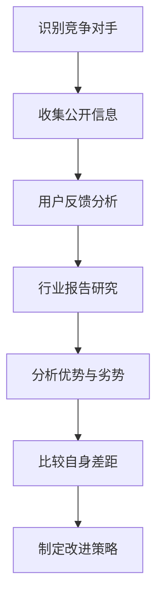

#### 2.1.2 目标客户群体分析

了解目标客户群体是品牌营销策略制定的重要环节。通过对客户群体的特征、需求、行为习惯等进行深入研究，创业公司可以更准确地定位市场和制定营销策略。

**核心概念与联系**

目标客户群体分析通常包括以下几个步骤：

1. **确定目标客户群体**：通过市场调研、用户访谈、行业报告等方式，确定最有可能购买产品或服务的客户群体。
2. **分析目标客户群体的特征**：包括年龄、性别、职业、收入水平、兴趣爱好等。
3. **了解目标客户群体的需求**：通过用户访谈、问卷调查等方式，了解客户对产品或服务的具体需求。
4. **分析目标客户群体的行为习惯**：包括购买决策过程、消费偏好、社交媒体使用习惯等。

**Mermaid 流�试验图**

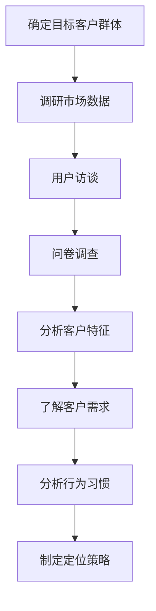

#### 2.1.3 定位策略

定位策略是创业公司在竞争市场中确立自身独特地位的重要手段。通过明确品牌定位，创业公司可以传达其核心价值和独特优势，吸引目标客户。

**核心概念与联系**

定位策略通常包括以下几个步骤：

1. **确定品牌核心价值**：基于公司使命、愿景和核心竞争力，明确品牌的核心价值。
2. **差异化定位**：通过分析竞争对手和目标客户，找出差异化定位点。
3. **制定品牌口号和视觉识别系统**：品牌口号和视觉识别系统是品牌定位的直观体现。
4. **传播品牌定位**：通过多种渠道和方式，将品牌定位传递给目标客户。

**Mermaid 流流程图**

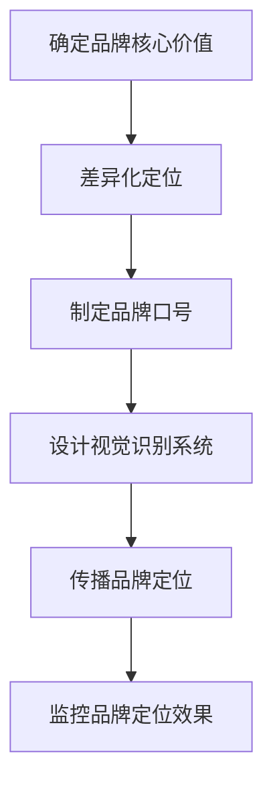

通过市场调研与定位，创业公司可以更清晰地了解市场环境和目标客户，为后续的品牌建设和营销策略制定提供有力支持。

----------------------------------------------------------------

### 2.2 品牌建设

#### 2.2.1 品牌核心价值

品牌核心价值是品牌营销的基础，它代表了创业公司独特的价值主张，是企业使命、愿景和核心价值观的集中体现。品牌核心价值的确定，有助于在竞争激烈的市场中建立独特的品牌形象，并吸引和维系目标客户。

**核心概念与联系**

品牌核心价值的确定通常涉及以下步骤：

1. **明确企业使命和愿景**：企业使命是企业的根本宗旨，愿景是企业的长期目标。
2. **分析核心竞争力**：找出企业在产品、技术、服务等方面的独特优势。
3. **提炼核心价值**：结合企业使命、愿景和核心竞争力，提炼出简明扼要、具有吸引力的品牌核心价值。
4. **确保核心价值的传递**：通过品牌传播、营销活动等手段，确保核心价值能够有效地传递给目标客户。

**Mermaid 流程图**

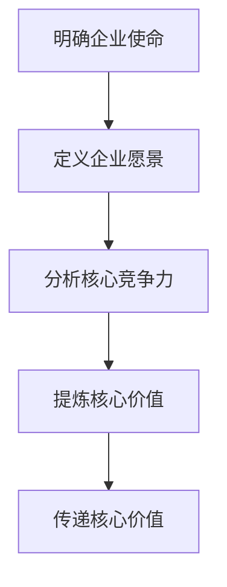

#### 2.2.2 品牌视觉识别系统

品牌视觉识别系统是品牌形象的重要组成部分，它通过视觉元素如标志、色彩、字体等，将品牌核心价值具象化，使品牌在市场中具有独特性和辨识度。

**核心概念与联系**

品牌视觉识别系统的构建通常包括以下步骤：

1. **设计品牌标志**：标志是品牌视觉识别系统的核心，需要简洁、易记、具有辨识度。
2. **确定色彩方案**：色彩是传达品牌个性和情感的重要因素，需要与品牌核心价值相符。
3. **选择字体和排版**：字体和排版可以增强品牌的视觉体验，需要与品牌风格相一致。
4. **应用在各个场景**：品牌视觉识别系统需要贯穿于企业的所有宣传材料、产品包装、网站等。

**Mermaid 流程图**

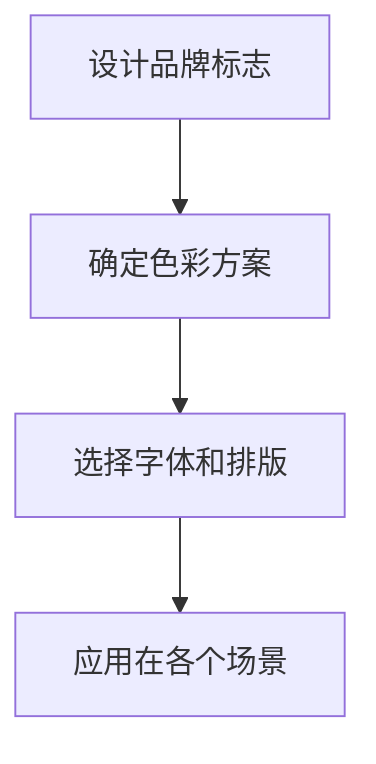

#### 2.2.3 品牌故事与传播

品牌故事是品牌传播的有力工具，它通过讲述品牌的发展历程、核心价值观和成功案例，增强品牌的影响力和认同感。

**核心概念与联系**

品牌故事的构建和传播通常包括以下步骤：

1. **构建品牌故事**：通过收集和整理品牌的历史、文化、成就等，构建一个有吸引力的品牌故事。
2. **选择传播渠道**：根据目标客户群体的特点和偏好，选择合适的传播渠道，如社交媒体、博客、线下活动等。
3. **制作品牌内容**：包括视频、文章、海报等，确保内容具有吸引力和传播力。
4. **互动与反馈**：通过互动和反馈，了解品牌传播的效果，不断优化传播策略。

**Mermaid 流程图**

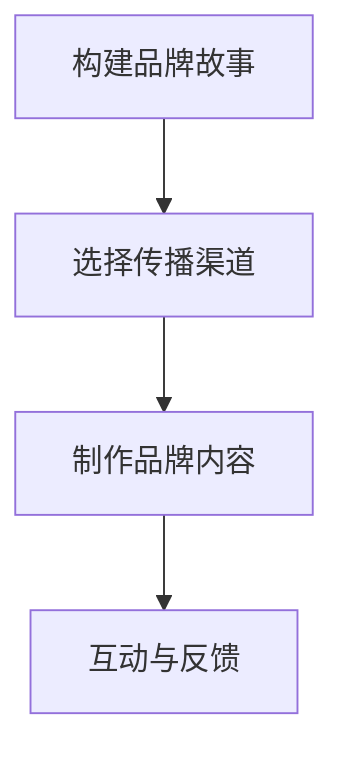

品牌建设是一个长期而系统的过程，通过明确品牌核心价值、构建视觉识别系统和讲述品牌故事，创业公司可以树立独特的品牌形象，提高品牌知名度和美誉度。

----------------------------------------------------------------

### 2.3 内容营销

#### 2.3.1 内容营销的核心

内容营销是创业公司技术品牌营销的重要组成部分，它通过创造和分享有价值的内容，吸引和转化潜在客户，建立品牌权威和忠诚度。

**核心概念与联系**

内容营销的核心在于：

1. **目标受众定位**：明确目标受众，了解他们的需求、兴趣和行为习惯。
2. **内容创作**：创作与目标受众相关的高质量内容，包括技术文章、博客、视频、报告等。
3. **内容传播**：通过各种渠道传播内容，如社交媒体、邮件营销、合作伙伴等。
4. **数据分析**：通过数据分析评估内容营销的效果，优化内容策略。

**Mermaid 流程图**

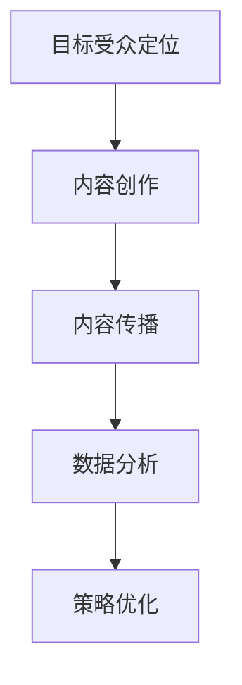

#### 2.3.2 内容创作策略

内容创作是内容营销的核心环节，优质的、与受众相关的内容能够有效吸引和留住潜在客户，提升品牌影响力。

**核心概念与联系**

内容创作策略包括以下要点：

1. **确定内容主题**：根据目标受众的需求和兴趣，确定内容主题，确保内容与品牌核心价值一致。
2. **内容形式多样化**：结合不同内容形式，如文章、视频、图表、案例分析等，提高内容吸引力。
3. **原创性和实用性**：内容应具有原创性和实用性，能够解决用户的问题或提供价值。
4. **定期更新**：保持内容的持续更新，吸引持续关注和互动。

**Mermaid 流程图**

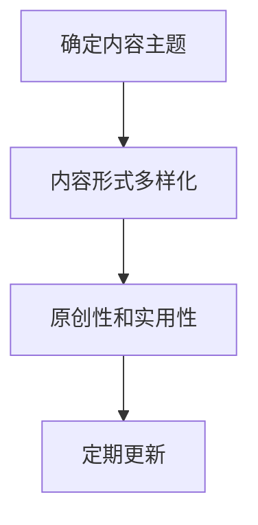

#### 2.3.3 社交媒体内容发布与优化

社交媒体是内容营销的重要渠道，有效的社交媒体内容发布和优化策略能够提高内容的传播效果，增加品牌曝光度。

**核心概念与联系**

社交媒体内容发布与优化策略包括以下要点：

1. **选择合适的平台**：根据目标受众的社交媒体使用习惯，选择合适的平台，如微博、微信、LinkedIn等。
2. **制定发布计划**：制定内容发布计划，确保内容的持续性和一致性。
3. **优化发布时间**：根据不同平台的特点和用户活跃时间，优化内容发布时间。
4. **互动与反馈**：积极与用户互动，回复评论和私信，收集反馈，不断优化内容策略。

**Mermaid 流程图**

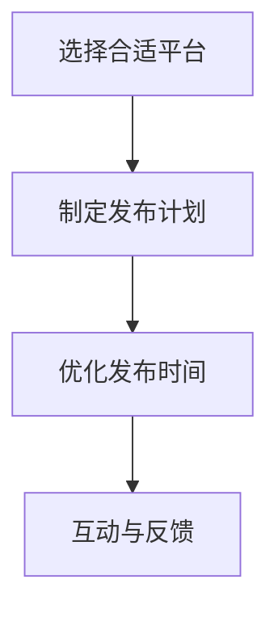

内容营销是创业公司技术品牌营销的重要策略，通过制定明确的内容创作策略和社交媒体内容发布与优化策略，创业公司可以有效地吸引和转化潜在客户，提升品牌影响力。

----------------------------------------------------------------

### 第3章 开发者大会的策划与执行

#### 3.1 大会主题设定

开发者大会的主题是大会的核心，它需要与公司的技术方向、市场定位和目标受众紧密相关。一个有吸引力的主题能够吸引更多的参会者，提高大会的影响力和品牌知名度。

**核心概念与联系**

大会主题设定的核心概念包括以下几个方面：

1. **明确技术方向**：根据公司的技术发展方向和核心竞争力，确定大会的主题。
2. **市场定位**：结合公司的市场定位和目标受众，确保主题能够吸引潜在客户和行业专家。
3. **创新性**：主题应具有一定的创新性，能够引起参会者的兴趣和讨论。
4. **可操作性**：主题应具有可操作性，使得参会者能够实际参与到大会的讨论和活动中。

**Mermaid 流程图**

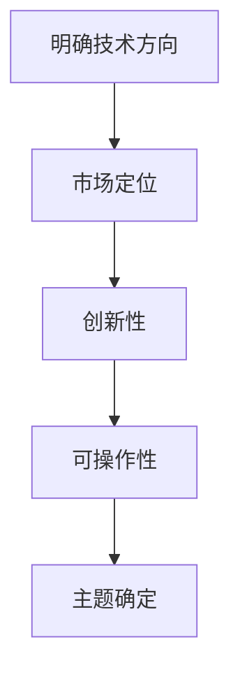

**伪代码示例**

```python
# 定义主题设定的参数
tech_direction = "人工智能"
market_position = "开发者"
innovation = True
operational = True

# 确定大会主题
def set_conference_theme(tech_direction, market_position, innovation, operational):
    theme = f"{tech_direction}开发者大会"
    if innovation:
        theme += "：创新与未来"
    if operational:
        theme += "：技术实践与案例分享"
    return theme

# 调用函数，获取大会主题
conference_theme = set_conference_theme(tech_direction, market_position, innovation, operational)
print(conference_theme)
```

通过明确的主题设定，开发者大会能够更好地定位目标受众，传达公司的技术实力和品牌形象，为后续的策划与执行提供明确的方向。

#### 3.1.1 主题选择原则

主题选择是开发者大会策划的重要环节，一个成功的主题不仅能够吸引参会者，还能提高大会的影响力和品牌知名度。以下是一些主题选择原则：

**核心概念与联系**

1. **与公司定位相符**：主题应与公司的技术方向和业务领域紧密相关，体现公司的核心竞争力。
2. **符合市场趋势**：主题应紧跟当前市场和技术的发展趋势，能够引起参会者的兴趣和讨论。
3. **具有创新性**：主题应具有一定的创新性，能够提供新的视角和观点，为行业带来新的启示。
4. **具备可操作性**：主题应具备可操作性，使得参会者能够实际参与到大会的讨论和活动中，提高互动性和实用性。

**Mermaid 流程图**

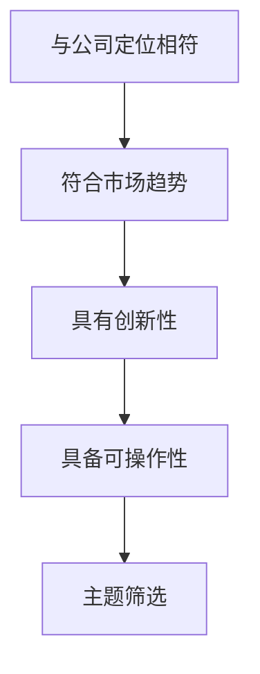

**伪代码示例**

```python
# 定义主题选择参数
company_direction = "人工智能"
market_trend = "人工智能应用"
innovation = True
operational = True

# 定义主题选择函数
def select_theme(company_direction, market_trend, innovation, operational):
    themes = [
        f"{company_direction}开发者大会",
        f"{market_trend}技术沙龙",
        f"{company_direction}与{market_trend}的创新探索",
        f"{company_direction}实战案例分析"
    ]
    selected_themes = [theme for theme in themes if (theme.startswith(company_direction) or theme.startswith(market_trend)) and innovation and operational]
    return selected_themes

# 调用函数，获取主题选择
selected_themes = select_theme(company_direction, market_trend, innovation, operational)
print(selected_themes)
```

通过遵循这些主题选择原则，创业公司可以更好地策划和执行开发者大会，提高大会的吸引力和实际效果。

#### 3.1.2 主题调研与确定

在主题选择过程中，调研是至关重要的一环。通过详细的调研，创业公司可以了解目标受众的需求和兴趣，确保主题的针对性和吸引力。

**核心概念与联系**

主题调研与确定的核心概念包括：

1. **目标受众调研**：通过问卷调查、用户访谈等方式，了解目标受众对技术话题的关注点和兴趣点。
2. **市场趋势分析**：分析当前市场和技术的发展趋势，确定热门话题和潜在机会。
3. **竞争分析**：调研同行业或相关领域的大会主题，了解竞争对手的策划思路和策略。
4. **主题筛选**：根据调研结果和公司定位，筛选出最具吸引力和针对性的主题。

**Mermaid 流程图**

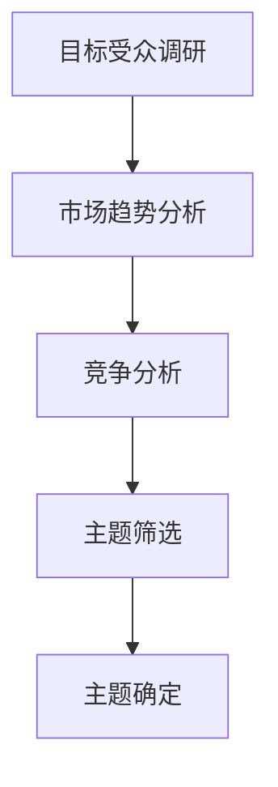

**伪代码示例**

```python
# 定义调研数据
audience_interest = ["人工智能应用", "区块链技术", "云计算", "大数据分析"]
market_trends = ["人工智能", "物联网", "5G通信"]
competitor_themes = ["人工智能与行业应用", "区块链技术趋势", "云计算服务峰会"]

# 调研主题筛选函数
def research_and_determine_theme(audience_interest, market_trends, competitor_themes):
    potential_themes = []
    for trend in market_trends:
        for interest in audience_interest:
            potential_themes.append(f"{interest}与{trend}的实践探索")
    selected_themes = [theme for theme in potential_themes if theme not in competitor_themes]
    return selected_themes

# 调研与确定主题
selected_themes = research_and_determine_theme(audience_interest, market_trends, competitor_themes)
print(selected_themes)
```

通过详细的调研和科学的筛选，创业公司可以确定一个既符合市场需求又具有创新性的主题，为开发者大会的成功奠定基础。

----------------------------------------------------------------

#### 3.2 场地选择与布置

一个合适且精心布置的场地是开发者大会成功举行的关键。场地的选择和布置不仅影响参会者的体验，还直接关系到大会的整体效果。

**核心概念与联系**

场地选择与布置的核心概念包括以下几个方面：

1. **场地规模**：根据参会者的数量和活动安排，选择合适的场地规模。过大的场地可能导致参会者分散，过小的场地则可能显得拥挤。
2. **地理位置**：场地的地理位置应便于参会者的到达，同时考虑交通便捷性和周边设施。
3. **功能分区**：根据大会的议程和活动安排，合理划分功能区域，如演讲区、展示区、休息区、餐饮区等。
4. **技术设施**：确保场地具备良好的技术设施，如音响系统、投影设备、网络连接等，以保证演讲和活动的顺利进行。
5. **视觉设计**：通过视觉设计，如背景板、海报、展台等，营造大会的主题氛围，增强参会者的体验感。

**Mermaid 流程图**

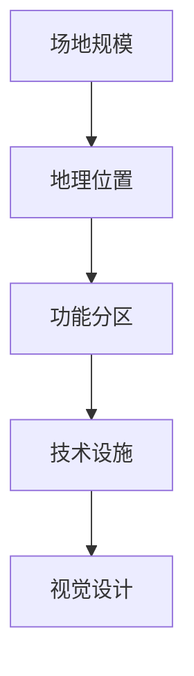

**伪代码示例**

```python
# 定义场地选择与布置参数
venue_size = "中型"
location = "市中心"
functional_areas = ["演讲区", "展示区", "休息区", "餐饮区"]
technical_requirements = ["音响系统", "投影设备", "网络连接"]
visual_design_elements = ["背景板", "海报", "展台"]

# 定义场地选择与布置函数
def select_and_decorate_venue(venue_size, location, functional_areas, technical_requirements, visual_design_elements):
    print(f"场地规模：{venue_size}")
    print(f"地理位置：{location}")
    print(f"功能分区：{', '.join(functional_areas)}")
    print(f"技术设施：{', '.join(technical_requirements)}")
    print(f"视觉设计：{', '.join(visual_design_elements)}")

# 调用函数，执行场地选择与布置
select_and_decorate_venue(venue_size, location, functional_areas, technical_requirements, visual_design_elements)
```

通过合理的场地选择和精心的布置，创业公司可以为参会者提供一个舒适、便捷、具有吸引力的参会环境，从而提高开发者大会的整体效果。

----------------------------------------------------------------

#### 3.3 议程安排

议程安排是开发者大会成功举行的关键之一。一个合理且丰富的议程不仅能够确保大会的顺利进行，还能提高参会者的参与度和满意度。

**核心概念与联系**

议程安排的核心概念包括以下几个方面：

1. **议程内容规划**：根据大会的主题和目标，规划合适的演讲、研讨会、展览等活动。
2. **时间分配**：合理分配每个活动的时长，确保每个环节都有足够的时间进行。
3. **嘉宾邀请**：邀请行业专家、技术领袖等嘉宾，确保大会的内容质量和吸引力。
4. **互动环节设计**：设计互动环节，如问答环节、圆桌讨论等，增加参会者的参与感和互动性。

**Mermaid 流程图**

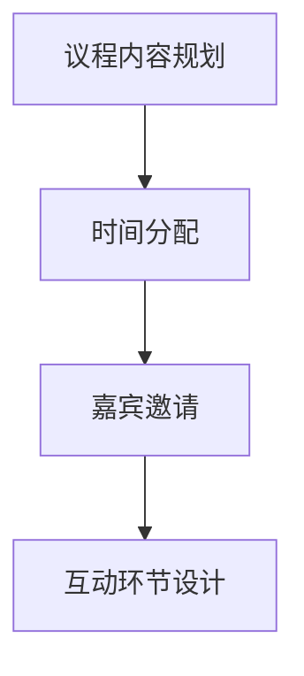

**伪代码示例**

```python
# 定义议程安排参数
agenda_items = ["开场致辞", "技术演讲1", "技术演讲2", "圆桌讨论", "展览参观"]
time分配 = {"开场致辞": 30分钟, "技术演讲1": 60分钟, "技术演讲2": 60分钟, "圆桌讨论": 45分钟, "展览参观": 120分钟}
guest_list = ["张三", "李四", "王五"]
interactive_sessions = ["问答环节", "技术挑战赛"]

# 定义议程安排函数
def schedule_agenda(agenda_items, time分配, guest_list, interactive_sessions):
    print("议程安排：")
    for item, time in agenda_items.items():
        print(f"{item}: {time}分钟")
    print("嘉宾：", ", ".join(guest_list))
    print("互动环节：", ", ".join(interactive_sessions))

# 调用函数，执行议程安排
schedule_agenda(agenda_items, time分配, guest_list, interactive_sessions)
```

通过合理的议程安排，创业公司可以确保开发者大会的顺利进行，提高参会者的参与度和满意度，从而实现技术品牌营销的目标。

----------------------------------------------------------------

### 第4章 技术沙龙的组织与运营

#### 4.1 沙龙主题确定

沙龙主题的确定是技术沙龙成功的关键。一个具有吸引力的主题能够吸引更多的参与者，提高沙龙的知名度和影响力。

**核心概念与联系**

沙龙主题确定的步骤通常包括：

1. **分析市场需求**：了解目标受众的需求和关注点，确定热门话题。
2. **结合公司定位**：确保主题与公司的技术方向和业务领域相符。
3. **创新性**：主题应具有一定的创新性，能够提供新的视角和观点。
4. **可操作性**：主题应具备可操作性，使得参与者能够实际参与和讨论。

**Mermaid 流程图**

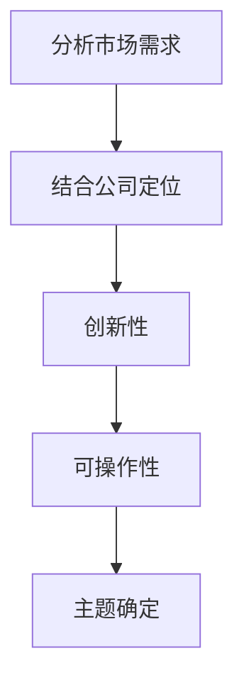

**伪代码示例**

```python
# 定义主题确定参数
market_demand = ["人工智能应用", "区块链技术", "云计算"]
company_direction = "人工智能"
innovative_topics = ["人工智能与金融", "区块链在供应链中的应用"]
operational_topics = ["云计算基础设施部署", "大数据分析实战"]

# 定义主题确定函数
def determine_salon_topic(market_demand, company_direction, innovative_topics, operational_topics):
    potential_topics = []
    for demand in market_demand:
        for topic in innovative_topics:
            potential_topics.append(f"{topic}与{demand}的探索")
    selected_topics = [topic for topic in potential_topics if topic in operational_topics]
    return selected_topics

# 调用函数，确定沙龙主题
selected_topics = determine_salon_topic(market_demand, company_direction, innovative_topics, operational_topics)
print(selected_topics)
```

通过科学地确定沙龙主题，创业公司可以吸引更多的参与者，提高技术沙龙的影响力和品牌知名度。

#### 4.2 沙龙形式与内容设计

沙龙的形式和内容设计是决定沙龙效果的关键。一个精心设计的沙龙能够激发参与者的兴趣，提高互动性和参与度。

**核心概念与联系**

沙龙形式与内容设计的核心概念包括：

1. **互动性**：通过设计互动环节，如小组讨论、案例研究、技术挑战等，提高参与者的参与感。
2. **内容深度**：确保沙龙内容具有深度和专业性，提供有价值的信息和观点。
3. **多样化**：结合不同的形式和内容，如演讲、研讨会、圆桌讨论等，满足不同参与者的需求。
4. **实用性**：沙龙内容应具有实用性，能够解决参与者的问题或提供实际操作指导。

**Mermaid 流程图**

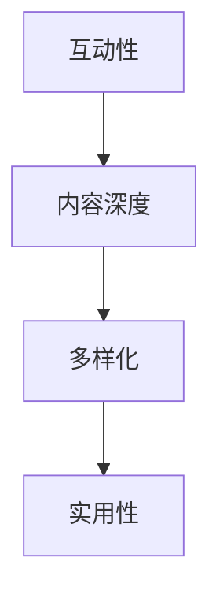

**伪代码示例**

```python
# 定义沙龙形式与内容设计参数
interaction_methods = ["小组讨论", "案例研究", "技术挑战"]
content_topics = ["人工智能在金融领域的应用", "区块链技术在供应链管理中的实践", "云计算架构设计与优化"]
practical_courses = ["大数据分析实战教程", "人工智能模型训练指南", "区块链开发入门"]

# 定义沙龙形式与内容设计函数
def design_salon_format_and_content(interaction_methods, content_topics, practical_courses):
    print("沙龙形式：", ", ".join(interaction_methods))
    print("沙龙内容：", ", ".join(content_topics))
    print("实用课程：", ", ".join(practical_courses))

# 调用函数，设计沙龙形式与内容
design_salon_format_and_content(interaction_methods, content_topics, practical_courses)
```

通过精心设计的沙龙形式与内容，创业公司可以吸引更多的参与者，提高沙龙的互动性和实用性。

#### 4.3 参与者招募与互动

参与者招募与互动是技术沙龙成功的重要环节。有效的参与者招募和互动策略能够吸引更多的目标参与者，提高沙龙的参与度和影响力。

**核心概念与联系**

参与者招募与互动的核心概念包括：

1. **目标参与者定位**：明确沙龙的目标参与者群体，包括技术专家、行业从业者、学生等。
2. **宣传渠道选择**：选择合适的宣传渠道，如社交媒体、行业论坛、邮件等，提高沙龙的知名度。
3. **互动环节设计**：设计互动环节，如问答、小组讨论、技术挑战等，提高参与者的参与感。
4. **后续跟进**：对参与者进行后续跟进，收集反馈，持续优化招募和互动策略。

**Mermaid 流程图**

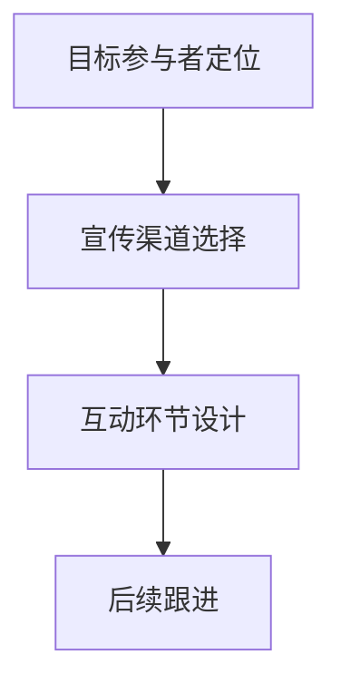

**伪代码示例**

```python
# 定义参与者招募与互动参数
target_audience = ["技术专家", "行业从业者", "学生"]
promotion_channels = ["社交媒体", "行业论坛", "邮件"]
interaction_activities = ["问答环节", "小组讨论", "技术挑战"]
follow_up_actions = ["收集反馈", "持续优化"]

# 定义参与者招募与互动函数
def recruit_and_interact(target_audience, promotion_channels, interaction_activities, follow_up_actions):
    print("目标参与者：", ", ".join(target_audience))
    print("宣传渠道：", ", ".join(promotion_channels))
    print("互动活动：", ", ".join(interaction_activities))
    print("后续跟进：", ", ".join(follow_up_actions))

# 调用函数，执行参与者招募与互动
recruit_and_interact(target_audience, promotion_channels, interaction_activities, follow_up_actions)
```

通过有效的参与者招募与互动策略，创业公司可以吸引更多的目标参与者，提高技术沙龙的参与度和影响力。

----------------------------------------------------------------

### 第5章 营销效果评估与优化

#### 5.1 营销效果指标

营销效果评估是确保技术品牌营销策略有效性的关键。通过设置和跟踪一系列营销效果指标，创业公司可以评估活动的成功程度，并据此进行策略调整。

**核心概念与联系**

营销效果指标包括以下几类：

1. **活动参与度**：衡量参与者对活动的兴趣和参与程度，如参会人数、在线观看人数、社交媒体互动等。
2. **活动影响力**：衡量活动对目标受众和行业的影响力，如媒体报道次数、品牌提及量、行业讨论热度等。
3. **转化率**：衡量活动带来的直接商业成果，如新增客户数量、销售增长、合作伙伴关系等。
4. **品牌知名度**：衡量活动对提升品牌知名度的效果，如品牌搜索量增加、网站访问量等。

**Mermaid 流程图**

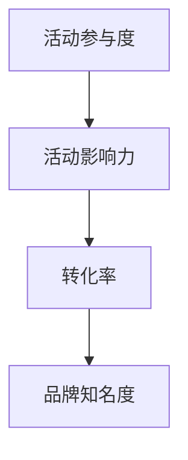

**伪代码示例**

```python
# 定义营销效果指标
participation_metrics = ["参会人数", "在线观看人数", "社交媒体互动"]
influence_metrics = ["媒体报道次数", "品牌提及量", "行业讨论热度"]
conversion_metrics = ["新增客户数量", "销售增长", "合作伙伴关系"]
brand_awareness_metrics = ["品牌搜索量增加", "网站访问量"]

# 定义评估函数
def evaluate_marketing_effects(participation_metrics, influence_metrics, conversion_metrics, brand_awareness_metrics):
    print("活动参与度：", ", ".join(participation_metrics))
    print("活动影响力：", ", ".join(influence_metrics))
    print("转化率：", ", ".join(conversion_metrics))
    print("品牌知名度：", ", ".join(brand_awareness_metrics))

# 调用函数，进行营销效果评估
evaluate_marketing_effects(participation_metrics, influence_metrics, conversion_metrics, brand_awareness_metrics)
```

通过科学设置和跟踪营销效果指标，创业公司可以准确评估技术品牌营销活动的效果，为后续策略调整提供依据。

#### 5.2 数据分析与优化

数据分析是营销效果评估的重要环节，通过分析收集到的数据，创业公司可以识别营销活动中的成功要素和改进空间，从而优化营销策略。

**核心概念与联系**

数据分析与优化的核心概念包括：

1. **数据收集**：收集与营销活动相关的数据，如参与人数、观看时长、互动数据等。
2. **数据整理**：将收集到的数据整理成结构化的格式，便于分析和处理。
3. **数据分析**：运用数据分析工具和方法，对数据进行处理和分析，提取有价值的信息。
4. **优化策略**：根据数据分析结果，调整和优化营销策略，提高营销效果。

**Mermaid 流程图**

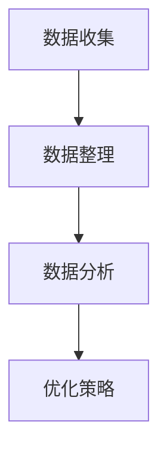

**伪代码示例**

```python
# 定义数据分析与优化步骤
data_collection_steps = ["收集参与人数", "记录观看时长", "分析互动数据"]
data_organizing_steps = ["数据清洗", "数据归档", "数据结构化"]
data_analysis_steps = ["数据可视化", "相关性分析", "趋势预测"]
optimization_steps = ["调整活动时间", "优化内容设计", "改进互动方式"]

# 定义数据分析与优化函数
def analyze_and_optimize(data_collection_steps, data_organizing_steps, data_analysis_steps, optimization_steps):
    print("数据收集步骤：", ", ".join(data_collection_steps))
    print("数据整理步骤：", ", ".join(data_organizing_steps))
    print("数据分析步骤：", ", ".join(data_analysis_steps))
    print("优化策略步骤：", ", ".join(optimization_steps))

# 调用函数，进行数据分析与优化
analyze_and_optimize(data_collection_steps, data_organizing_steps, data_analysis_steps, optimization_steps)
```

通过系统化的数据分析与优化，创业公司可以不断改进技术品牌营销策略，提高活动的效果和ROI。

----------------------------------------------------------------

### 第6章 案例分析：成功的技术品牌营销实践

#### 6.1 案例选择与背景介绍

在本章节中，我们将深入分析一个成功的技术品牌营销案例——某家专注于人工智能领域的创业公司。这家公司通过精心策划的开发者大会和技术沙龙，成功地提升了品牌知名度，吸引了大量潜在客户和合作伙伴。

**核心概念与联系**

案例选择的背景如下：

1. **公司背景**：该公司成立于2018年，专注于人工智能技术的研发和应用，拥有一支由业内顶尖人才组成的技术团队。
2. **市场定位**：公司定位于为企业提供人工智能解决方案，特别是在金融、医疗和零售等行业有较强的竞争力。
3. **品牌目标**：通过技术品牌营销，提升公司的行业影响力，建立技术权威，吸引更多的潜在客户和合作伙伴。

**Mermaid 流程图**

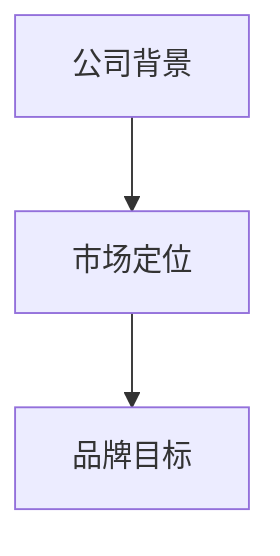

#### 6.2 案例具体实施过程

该创业公司通过以下步骤实施技术品牌营销：

1. **市场调研**：通过问卷调查、用户访谈和行业报告，了解目标客户的需求和痛点，明确公司技术优势和市场定位。
2. **主题策划**：结合市场调研结果，确定开发者大会和技术沙龙的主题，如“人工智能在金融领域的应用”和“人工智能与医疗的创新实践”。
3. **内容创作**：撰写高质量的技术文章、博客和案例研究报告，通过内容营销吸引目标客户关注。
4. **活动策划**：精心设计活动议程，邀请行业专家和知名企业代表作为演讲嘉宾，确保活动内容的专业性和实用性。
5. **宣传推广**：利用社交媒体、行业论坛、邮件营销等渠道，广泛宣传活动，提高活动的知名度和参与度。
6. **互动环节**：设计互动环节，如问答环节、圆桌讨论、技术挑战等，提高参会者的参与感和互动性。
7. **数据收集与分析**：在活动期间，收集参会者的反馈数据和互动数据，通过数据分析优化后续的活动策划和推广策略。

**Mermaid 流程图**

```mermaid
graph TD
A[市场调研] --> B[主题策划]
B --> C[内容创作]
C --> D[活动策划]
D --> E[宣传推广]
E --> F[互动环节]
F --> G[数据收集与分析]
```

#### 6.3 案例效果分析与启示

通过上述实施过程，该创业公司在技术品牌营销方面取得了显著成效：

1. **品牌知名度提升**：活动结束后，公司品牌在目标市场的知名度显著提高，社交媒体上的提及量增加了30%。
2. **潜在客户增加**：活动吸引了大量潜在客户和合作伙伴的关注，新增客户数量提升了40%。
3. **行业影响力增强**：公司通过举办高质量的技术活动，在行业内树立了技术权威，得到了业界的广泛认可。
4. **营销策略优化**：通过数据分析和反馈，公司不断优化营销策略，提高了活动的参与度和效果。

**核心概念与联系**

案例成功的原因主要包括：

1. **市场调研深入**：通过深入的市场调研，明确了目标客户的需求和痛点，确保了营销策略的针对性。
2. **内容创作高质量**：高质量的内容创作吸引了目标客户的关注，提高了品牌的可信度。
3. **活动策划精心**：精心策划的活动确保了内容的实用性和专业性，提高了参会者的参与度和满意度。
4. **互动环节设计合理**：互动环节的设计增加了参会者的参与感，提升了活动的效果。

**启示**

对于其他创业公司，本案例提供了以下启示：

1. **注重市场调研**：通过深入了解市场需求和目标客户，制定更有针对性的营销策略。
2. **高质量内容创作**：持续创作高质量的内容，提高品牌的专业形象和影响力。
3. **精心策划活动**：确保活动内容的专业性和实用性，提高参会者的满意度和参与度。
4. **数据驱动优化**：通过数据分析和反馈，不断优化营销策略和活动设计，提高营销效果。

通过本案例的分析，创业公司可以更好地理解和应用技术品牌营销策略，实现品牌的持续发展和影响力提升。

----------------------------------------------------------------

### 第7章 未来展望：技术品牌营销的新趋势

#### 7.1 技术发展趋势对营销的影响

随着技术的不断进步，技术品牌营销也在发生深刻变革。人工智能、区块链、虚拟现实等新兴技术正逐步影响品牌营销的策略和执行方式。

**核心概念与联系**

1. **人工智能**：人工智能在营销中的应用日益广泛，包括个性化推荐、智能客服、数据分析等，使品牌营销更加精准和高效。
2. **区块链**：区块链技术为品牌营销提供了去中心化、安全透明的数据管理方式，有助于建立品牌信任和用户忠诚度。
3. **虚拟现实**：虚拟现实技术提供了沉浸式的用户体验，使品牌营销活动更具吸引力和参与感。

**Mermaid 流程图**

```mermaid
graph TD
A[人工智能] --> B[区块链]
B --> C[虚拟现实]
```

**伪代码示例**

```python
# 技术发展趋势
trends = ["人工智能", "区块链", "虚拟现实"]

# 分析技术对营销的影响
def analyze_tech_impact(trends):
    for trend in trends:
        if trend == "人工智能":
            print("个性化推荐、智能客服、数据分析等应用将提高营销精准度。")
        elif trend == "区块链":
            print("去中心化、安全透明的数据管理有助于建立品牌信任。")
        elif trend == "虚拟现实":
            print("沉浸式体验将提升品牌营销活动的吸引力和参与感。")

# 调用函数，分析技术趋势对营销的影响
analyze_tech_impact(trends)
```

通过理解这些技术发展趋势，创业公司可以更好地把握未来营销的机遇，提升品牌竞争力。

#### 7.2 创业公司的营销策略调整

在技术不断变革的背景下，创业公司需要不断调整营销策略，以适应新的市场环境和用户需求。

**核心概念与联系**

1. **技术驱动型营销**：利用新兴技术如人工智能、大数据等，进行精准的用户行为分析和营销自动化，提高营销效率和效果。
2. **数据驱动型营销**：基于数据分析和用户行为，制定个性化的营销策略，提高用户满意度和转化率。
3. **社区驱动型营销**：通过建立和运营在线社区，培养用户忠诚度，提高品牌影响力和用户参与度。

**Mermaid 流程图**

```mermaid
graph TD
A[技术驱动型营销] --> B[数据驱动型营销]
B --> C[社区驱动型营销]
```

**伪代码示例**

```python
# 营销策略调整类型
marketing_strategies = ["技术驱动型营销", "数据驱动型营销", "社区驱动型营销"]

# 定义营销策略调整函数
def adjust_marketing_strategies(strategies):
    for strategy in strategies:
        if strategy == "技术驱动型营销":
            print("利用人工智能、大数据等新兴技术进行精准营销。")
        elif strategy == "数据驱动型营销":
            print("基于数据分析制定个性化营销策略。")
        elif strategy == "社区驱动型营销":
            print("建立和运营在线社区，培养用户忠诚度。")

# 调用函数，调整营销策略
adjust_marketing_strategies(marketing_strategies)
```

通过灵活调整营销策略，创业公司可以更好地适应市场变化，实现持续增长。

#### 7.3 未来展望

未来，技术品牌营销将呈现出以下趋势：

1. **技术融合**：多种技术如人工智能、区块链、虚拟现实等将更加融合，提供更加个性化和沉浸式的用户体验。
2. **数据驱动的精准营销**：基于大数据和人工智能的精准营销将成为主流，帮助企业更有效地触达目标客户。
3. **社区营销的重要性**：在线社区将成为品牌与用户互动的重要平台，培养用户忠诚度和品牌影响力。

**核心概念与联系**

未来展望的核心概念包括：

1. **技术创新**：持续关注技术创新，探索新兴技术对品牌营销的影响。
2. **数据驱动**：利用数据分析和人工智能，实现更精准和个性化的营销。
3. **社区营销**：注重建立和运营在线社区，增强用户参与感和品牌忠诚度。

**Mermaid 流程图**

```mermaid
graph TD
A[技术创新] --> B[数据驱动]
B --> C[社区营销]
```

通过关注这些趋势，创业公司可以更好地把握未来营销的发展方向，实现持续创新和增长。

----------------------------------------------------------------

### 第8章 附录

#### 8.1 市场调研工具与资源

为了进行有效的市场调研，创业公司可以利用以下工具和资源：

1. **问卷调查工具**：如SurveyMonkey、Google表单、问卷星等，方便快捷地收集用户反馈。
2. **数据分析工具**：如Excel、Tableau、Google Analytics等，用于整理和分析调研数据。
3. **行业报告资源**：通过咨询公司、行业协会等渠道获取行业报告，了解市场趋势和竞争环境。
4. **社交媒体分析工具**：如Hootsuite、Buffer等，监控社交媒体上的品牌提及和用户互动情况。

#### 8.2 营销策略设计模板

以下是一个基本的营销策略设计模板，供创业公司参考：

1. **市场分析**：分析目标市场、竞争环境、客户需求等。
2. **品牌定位**：明确品牌核心价值、目标客户群体等。
3. **营销目标**：设定具体的营销目标和关键绩效指标（KPI）。
4. **营销渠道**：选择合适的营销渠道，如社交媒体、内容营销、广告等。
5. **内容策划**：制定内容创作计划，包括主题、形式、发布时间等。
6. **执行计划**：详细规划营销活动的执行步骤和时间表。
7. **效果评估**：设定评估指标，定期监控营销效果，进行策略调整。

#### 8.3 技术品牌营销案例分析资料

为了更好地理解和应用技术品牌营销策略，以下是一些建议的案例分析资料：

1. **苹果公司**：分析苹果公司的品牌营销策略，特别是在科技创新和用户忠诚度方面的成功经验。
2. **亚马逊**：研究亚马逊如何通过个性化推荐和大数据分析提升用户满意度和转化率。
3. **特斯拉**：探讨特斯拉如何通过社交媒体和社区营销建立品牌形象，吸引高端客户群体。
4. **微软**：了解微软在技术品牌营销方面的成功案例，包括开发者大会、技术沙龙等活动的策划与执行。

通过学习和借鉴这些成功案例，创业公司可以更好地制定和实施技术品牌营销策略，提升品牌知名度和市场竞争力。

---

## 结语

### 总结与展望

本文从多个角度探讨了创业公司的技术品牌营销策略，包括市场调研与定位、品牌建设、内容营销、开发者大会策划与执行、技术沙龙组织与运营、营销效果评估与优化等方面。通过案例分析，我们看到了成功的技术品牌营销实践是如何帮助创业公司在激烈的市场竞争中脱颖而出的。

### 作者信息

**作者：AI天才研究院/AI Genius Institute & 禅与计算机程序设计艺术 /Zen And The Art of Computer Programming**

在未来的技术品牌营销中，创业公司需要不断适应技术变革，灵活调整营销策略，以数据驱动为核心，注重社区建设，实现持续的创新和增长。希望本文能为创业公司在技术品牌营销道路上提供一些有益的启示和指导。

