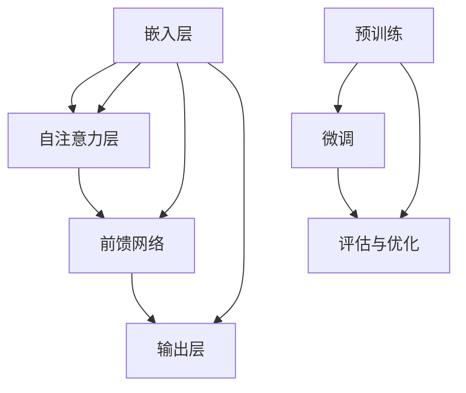
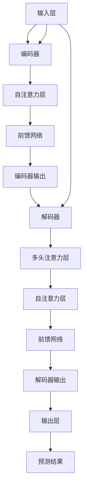
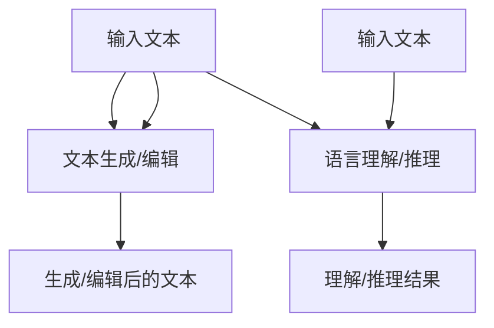
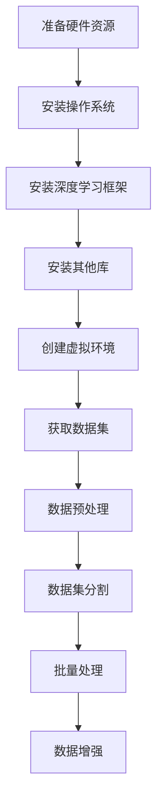
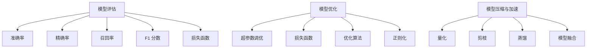
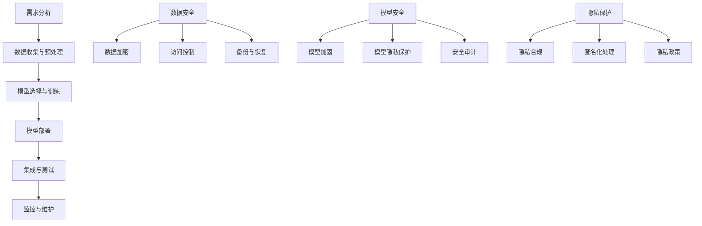
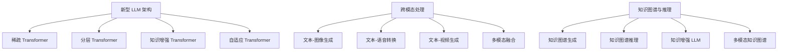

                 

# 《开发者的新利器：LLM 简化 AI 开发过程》

> 关键词：大型语言模型（LLM）、AI 开发、自然语言处理、Transformer、预训练、开发实践、应用实例

> 摘要：本文深入探讨了大型语言模型（LLM）在 AI 开发中的重要性。通过分析 LLM 的基本概念、技术核心、应用场景，详细介绍了如何搭建 LLM 开发环境、训练模型、评估与优化以及其在企业级应用中的角色。此外，本文还通过实际案例研究展示了 LLM 的应用效果，并对 LLM 的未来发展趋势与教育科研中的角色进行了展望。

### 目录大纲

#### 第一部分：LLM 介绍与概述

**第1章：LLM 基础知识**
- 1.1 语言模型的发展历程
- 1.2 语言模型的基本概念
- 1.3 LLM 的架构与原理

**第2章：LLM 技术核心**
- 2.1 语言处理模型的基本结构
- 2.2 Transformer 架构解析
- 2.3 自监督学习与预训练

**第3章：LLM 应用场景**
- 3.1 文本生成与编辑
- 3.2 语言理解与推理
- 3.3 其他应用领域

#### 第二部分：LLM 开发实践

**第4章：搭建 LLM 开发环境**
- 4.1 硬件资源准备
- 4.2 软件工具安装
- 4.3 数据集获取与处理

**第5章：LLM 模型训练**
- 5.1 训练数据预处理
- 5.2 模型超参数调优
- 5.3 模型训练流程与技巧

**第6章：LLM 模型评估与优化**
- 6.1 模型评估指标
- 6.2 模型优化方法
- 6.3 模型压缩与加速

**第7章：LLM 在企业级应用**
- 7.1 企业级应用场景分析
- 7.2 LLM 集成与部署
- 7.3 LLM 安全与隐私保护

#### 第三部分：LLM 案例研究

**第8章：LLM 应用实例解析**
- 8.1 案例一：智能客服系统
- 8.2 案例二：内容生成与推荐系统
- 8.3 案例三：自然语言处理工具开发

#### 第四部分：未来展望与拓展

**第9章：LLM 发展趋势与未来方向**
- 9.1 新型 LLM 架构
- 9.2 LLM 在跨模态处理中的应用
- 9.3 LLM 在知识图谱与推理中的应用

**第10章：LLM 在科研与教育中的角色**
- 10.1 LLM 在科研中的应用
- 10.2 LLM 教育资源建设
- 10.3 LLM 对未来学习模式的影响

### 附录

**附录 A：LLM 开发工具与资源**
- A.1 主流深度学习框架对比
- A.2 LLM 开发工具介绍
- A.3 开源数据和资源汇总

**附录 B：LLM 相关论文与书籍推荐**
- B.1 核心论文梳理
- B.2 推荐书籍列表
- B.3 学术组织和会议介绍

----------------------------------------------------------------

接下来，我们将逐步深入探讨 LLM 的基础知识、技术核心和应用场景，以帮助开发者更好地理解和使用这项新兴技术。

## 第一部分：LLM 介绍与概述

### 第1章：LLM 基础知识

#### 1.1 语言模型的发展历程

语言模型是自然语言处理（NLP）领域的基石，其发展历程可以追溯到 20 世纪 50 年代。最早的模型是基于规则的方法，如有限状态机、上下文无关文法等。这些方法虽然在某些特定领域表现出色，但难以处理复杂且灵活的自然语言。

随着计算能力和数据规模的提升，统计模型逐渐成为主流。20 世纪 80 年代，N-gram 模型开始广泛应用，其核心思想是利用历史文本数据来预测下一个单词。然而，N-gram 模型在长文本生成和长距离依赖方面存在局限性。

进入 21 世纪，深度学习在图像处理、语音识别等领域取得了突破性进展。受此启发，研究者将深度学习引入 NLP 领域，提出了一系列基于神经网络的模型，如循环神经网络（RNN）和长短期记忆网络（LSTM）。这些模型在捕捉长距离依赖方面表现出色，但仍然存在训练效率低、参数复杂等问题。

近年来，基于注意力机制的 Transformer 架构在 NLP 领域取得了显著成果。Transformer 架构通过自注意力机制，使得模型能够同时关注输入序列中的所有单词，从而有效捕捉长距离依赖。此外，预训练技术使得模型在少量有监督数据上预训练，然后在特定任务上微调，从而取得了超越传统模型的性能。

#### 1.2 语言模型的基本概念

语言模型（Language Model，LM）是一种用于预测下一个单词或字符的概率分布的模型。在 NLP 任务中，语言模型常常作为基础组件，为文本生成、语言理解、机器翻译等任务提供支持。

语言模型的核心指标包括：

- **词汇表（Vocabulary）**：语言模型所支持的单词集合。词汇表的大小直接影响到模型的表达能力。
- **概率分布（Probability Distribution）**：语言模型输出下一个单词或字符的概率分布。概率分布可以通过概率模型（如 N-gram 模型）或深度学习模型（如 Transformer）来计算。
- **参数（Parameters）**：语言模型中的可调参数，用于描述模型对数据的拟合程度。参数的优化通常通过训练过程实现。

#### 1.3 LLM 的架构与原理

大型语言模型（Large Language Model，LLM）是指具有大规模参数、能够处理复杂语言现象的模型。LLM 的架构通常基于 Transformer，包括以下几个关键组件：

- **嵌入层（Embedding Layer）**：将输入的单词或字符映射为高维向量表示。嵌入层可以通过预训练获得，也可以通过任务特定的微调进行优化。
- **自注意力层（Self-Attention Layer）**：计算输入序列中每个单词与其他单词之间的关联性，并加权融合。自注意力机制使得模型能够同时关注输入序列中的所有单词，从而捕捉长距离依赖。
- **前馈网络（Feedforward Network）**：对自注意力层的输出进行进一步加工，以增强模型的非线性表达能力。
- **输出层（Output Layer）**：将模型输出的高维向量映射为概率分布，用于预测下一个单词或字符。

LLM 的训练过程通常包括以下几个步骤：

1. **预训练（Pre-training）**：在大量无监督数据上对模型进行预训练，以学习通用的语言特征。预训练过程通常使用自监督学习技术，如掩码语言模型（Masked Language Model，MLM）和下一个句子预测（Next Sentence Prediction，NSP）。
2. **微调（Fine-tuning）**：在特定任务上的有监督数据上对模型进行微调，以适应特定任务的需求。微调过程通常针对模型的输出层进行，以调整模型对任务相关特征的敏感度。
3. **评估与优化（Evaluation and Optimization）**：在验证集上评估模型性能，并根据评估结果对模型进行优化。优化过程可能包括超参数调整、数据增强、模型压缩等技术。

#### Mermaid 流程图

以下是 LLM 的基本架构和训练过程的 Mermaid 流程图：



#### 伪代码

以下是 LLM 训练过程的伪代码：

```python
# 预训练阶段
for epoch in range(num_epochs):
    for batch in data_loader:
        mask_tokens = batch['input_ids'].masked_fill_(batch['input_ids'] != padding_idx, mask_idx)
        labels = batch['input_ids'].clone()
        labels[mask_tokens] = padding_idx

        model.zero_grad()
        outputs = model(input_ids=batch['input_ids'], attention_mask=batch['attention_mask'])
        loss = loss_fn(outputs.logits, labels)
        loss.backward()
        optimizer.step()

# 微调阶段
for epoch in range(num_fine_tuning_epochs):
    for batch in fine_tuning_data_loader:
        model.zero_grad()
        outputs = model(input_ids=batch['input_ids'], attention_mask=batch['attention_mask'])
        loss = loss_fn(outputs.logits, batch['labels'])
        loss.backward()
        optimizer.step()
```

#### 数学模型和公式

LLM 的训练过程中涉及以下数学模型和公式：

1. **损失函数**：

$$
L = -\sum_{i}^{N} y_i \log(p_i)
$$

其中，$y_i$ 是目标单词的标签，$p_i$ 是模型对单词 $i$ 的预测概率。

2. **自注意力机制**：

$$
\text{Attention}(Q, K, V) = \text{softmax}\left(\frac{QK^T}{\sqrt{d_k}}\right)V
$$

其中，$Q, K, V$ 分别代表查询向量、键向量和值向量，$d_k$ 是键向量的维度。

3. **前馈网络**：

$$
\text{FFN}(x) = \sigma(W_2 \cdot \text{ReLU}(W_1 \cdot x + b_1))
$$

其中，$W_1, W_2$ 分别是权重矩阵，$b_1$ 是偏置项，$\sigma$ 是激活函数。

#### 举例说明

假设我们有一个包含 100 个单词的句子，模型需要预测句子中的下一个单词。以下是 LLM 预测过程的简单示例：

1. **嵌入层**：将每个单词映射为高维向量。
2. **自注意力层**：计算每个单词与其他单词之间的关联性，并加权融合。
3. **前馈网络**：对自注意力层的输出进行进一步加工。
4. **输出层**：将加工后的向量映射为概率分布，选择概率最高的单词作为预测结果。

通过以上步骤，LLM 能够有效预测句子中的下一个单词，从而实现文本生成、语言理解等任务。

### 总结

本章介绍了 LLM 的基本概念、技术核心和架构原理。从语言模型的发展历程到现代的 Transformer 架构，我们了解了 LLM 如何通过自注意力机制、预训练和微调等技术手段，实现了对复杂语言现象的建模和预测。在接下来的章节中，我们将进一步探讨 LLM 的开发实践、应用实例以及未来发展趋势。

----------------------------------------------------------------

## 第二部分：LLM 技术核心

### 第2章：LLM 技术核心

#### 2.1 语言处理模型的基本结构

语言处理模型是 AI 领域的关键组成部分，特别是在自然语言处理（NLP）任务中。语言处理模型的基本结构通常包括输入层、隐藏层和输出层。每一层都有其特定的功能，共同协作以实现 NLP 任务。

1. **输入层（Input Layer）**：
   - **词汇表（Vocabulary）**：将自然语言中的单词或字符映射为整数索引。这有助于模型理解文本中的每个词汇。
   - **嵌入层（Embedding Layer）**：将词汇表的整数索引映射为高维向量表示。这些向量通常包含了单词的语义信息，有助于模型捕捉词汇间的相关性。

2. **隐藏层（Hidden Layer）**：
   - **编码器（Encoder）**：将输入序列编码为固定长度的向量表示。编码器可以采用不同的架构，如循环神经网络（RNN）、长短期记忆网络（LSTM）或Transformer。
   - **注意力机制（Attention Mechanism）**：允许模型在处理序列时，关注特定部分的信息。注意力机制有助于模型捕捉长距离依赖关系，从而提高其理解能力。

3. **输出层（Output Layer）**：
   - **解码器（Decoder）**：将编码器输出的固定长度向量解码为输出序列。解码器可以采用不同的架构，如循环神经网络（RNN）、长短期记忆网络（LSTM）或Transformer。
   - **分类器（Classifier）**：将输出序列映射为特定任务的标签或概率分布。例如，在情感分析任务中，分类器将文本映射为积极或消极的标签。

#### 2.2 Transformer 架构解析

Transformer 架构是近年来在 NLP 领域取得显著成功的模型之一。与传统的循环神经网络（RNN）相比，Transformer 架构通过自注意力机制（Self-Attention Mechanism）和多头注意力（Multi-Head Attention）实现了更高效、更强大的语言建模能力。

1. **自注意力机制（Self-Attention Mechanism）**：
   - **引入**：自注意力机制允许模型在处理序列时，关注输入序列中每个单词与其他单词之间的关系。
   - **实现**：自注意力机制通过计算输入序列中每个单词与其他单词之间的相似度，并加权融合这些相似度值。这使得模型能够同时关注输入序列中的所有单词，从而捕捉长距离依赖关系。

2. **多头注意力（Multi-Head Attention）**：
   - **引入**：多头注意力是自注意力机制的一种扩展，通过将输入序列分解为多个子序列，并分别计算自注意力。
   - **实现**：多头注意力通过将自注意力机制应用于多个子序列，并将结果融合为一个整体。这使得模型能够同时关注输入序列中的不同部分，从而提高其理解能力。

3. **Transformer 架构**：
   - **编码器（Encoder）**：编码器由多个自注意力层和前馈网络（Feedforward Network）堆叠而成。每个自注意力层允许模型在处理序列时关注不同部分的信息。
   - **解码器（Decoder）**：解码器由多个多头注意力层、自注意力层和前馈网络堆叠而成。解码器在生成输出序列时，需要参考编码器的输出和先前的输出。
   - **输入层与输出层**：输入层和输出层分别用于接收和生成文本序列。

#### 2.3 自监督学习与预训练

自监督学习（Self-Supervised Learning）是一种无需标签数据，仅利用未标记数据来训练模型的方法。在 NLP 中，自监督学习通常用于预训练大规模语言模型。

1. **自监督学习原理**：
   - **掩码语言模型（Masked Language Model，MLM）**：在输入序列中随机掩码一部分单词，然后让模型预测这些掩码的单词。MLM 技术可以有效地学习单词之间的上下文关系。
   - **下一个句子预测（Next Sentence Prediction，NSP）**：在输入序列中随机选择两个句子，并要求模型预测这两个句子是否相邻。NSP 技术有助于模型理解句子之间的语义关系。

2. **预训练与微调**：
   - **预训练（Pre-training）**：在大量未标记数据上进行自监督学习，以学习通用的语言特征。预训练过程通常使用大规模的语料库，如 Web 文本、新闻、社交媒体等。
   - **微调（Fine-tuning）**：在特定任务上有监督数据上进行微调，以适应特定任务的需求。微调过程通常针对模型的输出层进行，以调整模型对任务相关特征的敏感度。

#### Mermaid 流程图

以下是 Transformer 架构的 Mermaid 流程图：



#### 伪代码

以下是 Transformer 模型训练的伪代码：

```python
# 编码器训练
for epoch in range(num_epochs_encoder):
    for batch in encoder_data_loader:
        model.zero_grad()
        outputs = model(input_ids=batch['input_ids'], attention_mask=batch['attention_mask'])
        loss = loss_fn(outputs.logits, batch['labels'])
        loss.backward()
        optimizer.step()

# 解码器训练
for epoch in range(num_epochs_decoder):
    for batch in decoder_data_loader:
        model.zero_grad()
        outputs = model(input_ids=batch['input_ids'], attention_mask=batch['attention_mask'])
        loss = loss_fn(outputs.logits, batch['labels'])
        loss.backward()
        optimizer.step()
```

#### 数学模型和公式

1. **自注意力机制**：

$$
\text{Attention}(Q, K, V) = \text{softmax}\left(\frac{QK^T}{\sqrt{d_k}}\right)V
$$

2. **前馈网络**：

$$
\text{FFN}(x) = \sigma(W_2 \cdot \text{ReLU}(W_1 \cdot x + b_1))
$$

3. **损失函数**：

$$
L = -\sum_{i}^{N} y_i \log(p_i)
$$

#### 举例说明

假设我们有一个包含 5 个单词的句子：“我 今天 早上 吃 了 煎 鸡蛋”。以下是 Transformer 模型预测句子中下一个单词的过程：

1. **嵌入层**：将每个单词映射为高维向量。
2. **编码器**：计算输入序列中每个单词的注意力权重，并加权融合。
3. **解码器**：根据编码器的输出，生成下一个单词的概率分布。
4. **输出层**：选择概率最高的单词作为预测结果。

通过以上步骤，Transformer 模型能够有效预测句子中的下一个单词，从而实现文本生成、语言理解等任务。

### 总结

本章详细介绍了 LLM 技术的核心，包括语言处理模型的基本结构、Transformer 架构和自监督学习与预训练。通过这些技术，LLM 能够高效地处理复杂语言现象，为 NLP 任务提供强大的支持。在接下来的章节中，我们将探讨 LLM 的开发实践、应用实例以及未来发展趋势。

----------------------------------------------------------------

## 第三部分：LLM 应用场景

### 第3章：LLM 应用场景

#### 3.1 文本生成与编辑

文本生成与编辑是 LLM 的重要应用场景之一。在文本生成方面，LLM 可以根据输入的少量文本生成连贯、有意义的文本。例如，生成新闻报道、文章摘要、对话等。在文本编辑方面，LLM 可以用于自动纠错、文本润色、风格转换等。

1. **文本生成**：
   - **文章摘要**：使用 LLM 生成文章的摘要，可以大大提高阅读效率。
   - **对话系统**：在聊天机器人、智能客服等领域，LLM 可以生成自然、流畅的对话文本。
   - **文本续写**：根据输入的文本片段，LLM 可以生成后续的文本内容，为创作提供灵感。

2. **文本编辑**：
   - **自动纠错**：使用 LLM 检测文本中的错误，并提供修正建议。
   - **文本润色**：对文本进行语法、词汇和风格上的优化，使其更加通顺、优美。
   - **风格转换**：将一种风格的文本转换为另一种风格，例如将正式文本转换为非正式文本。

#### 3.2 语言理解与推理

语言理解与推理是 LLM 的另一个重要应用场景。LLM 可以理解文本的含义，并从中提取关键信息，从而实现对问题的回答、事实的验证和逻辑推理。

1. **问答系统**：LLM 可以处理用户提出的问题，并从海量文本中找到相关答案。例如，智能客服、在线问答平台等。
2. **事实验证**：LLM 可以用于验证陈述的真实性，识别虚假信息。这对于社交媒体、新闻报道等领域具有重要意义。
3. **逻辑推理**：LLM 可以对文本进行逻辑分析，推导出结论或推断出新的信息。例如，在法律、医学等领域，LLM 可以帮助专业人员进行分析和决策。

#### 3.3 其他应用领域

除了文本生成与编辑、语言理解与推理，LLM 在其他领域也有广泛的应用。

1. **自然语言交互**：LLM 可以用于构建自然语言交互系统，如虚拟助手、智能家居等。通过与用户的自然语言交流，提高用户体验。
2. **知识图谱构建**：LLM 可以用于构建知识图谱，将文本信息转化为结构化的知识库。这有助于智能化搜索、推荐系统和决策支持。
3. **语言翻译**：LLM 可以用于机器翻译，将一种语言的文本翻译为另一种语言。在全球化背景下，机器翻译对于跨文化交流具有重要意义。

#### Mermaid 流程图

以下是 LLM 在文本生成与编辑、语言理解与推理应用场景中的 Mermaid 流程图：



#### 伪代码

以下是 LLM 在文本生成与编辑、语言理解与推理应用场景中的伪代码：

```python
# 文本生成与编辑
def generate_text(input_text):
    outputs = model.generate(input_ids=input_text, max_length=max_generation_length)
    return outputs.text

# 语言理解与推理
def understand_text(input_text):
    outputs = model(input_ids=input_text)
    return outputs.logits
```

#### 数学模型和公式

1. **文本生成**：

$$
\text{Probability Distribution} = \text{softmax}(\text{Model Output})
$$

2. **语言理解与推理**：

$$
\text{Understanding} = \text{Model Output}
$$

#### 举例说明

1. **文本生成**：假设我们输入一句话“今天天气很好”，LLM 可以生成一篇描述今天天气的文章。
2. **语言理解与推理**：假设我们输入一句话“这个苹果是甜的”，LLM 可以推断出这个苹果的味道。

### 总结

本章介绍了 LLM 在文本生成与编辑、语言理解与推理以及其他应用领域中的应用场景。通过这些应用，LLM 能够为各种任务提供强大的支持，从而实现智能化和自动化。在接下来的章节中，我们将深入探讨 LLM 的开发实践，包括搭建开发环境、模型训练和评估与优化。

----------------------------------------------------------------

## 第二部分：LLM 开发实践

### 第4章：搭建 LLM 开发环境

搭建 LLM 开发环境是开始 AI 项目的重要步骤。在这一章节中，我们将介绍如何准备硬件资源、安装必要的软件工具以及获取和处理数据集，以确保 LLM 模型的开发和训练过程顺利执行。

#### 4.1 硬件资源准备

LLM 模型通常需要大量的计算资源，因此在开始之前，我们需要确保我们有足够的硬件资源。以下是一些推荐的硬件配置：

1. **GPU**：由于 LLM 模型依赖于深度学习框架，因此至少需要一台配备 GPU 的计算机。NVIDIA 的 GPU，如 Tesla K40、Tesla V100 或 newer models，是不错的选择。这些 GPU 具有高浮点运算能力，能够显著加速模型训练过程。
   
2. **CPU**：除了 GPU，一个强大的 CPU 也是必不可少的。建议选择具有多核 CPU 的机器，以支持并行计算。

3. **内存**：至少需要 64GB 的内存，以确保在训练大型模型时，内存占用不会成为瓶颈。

4. **存储**：需要足够的存储空间来存储大型数据集和模型文件。SSD 存储提供更快的读写速度，对于加快开发流程非常有帮助。

#### 4.2 软件工具安装

在准备硬件资源之后，我们需要安装必要的软件工具。以下是一些关键的工具和库：

1. **操作系统**：推荐使用 Linux 操作系统，如 Ubuntu 或 CentOS。Linux 提供了更好的稳定性和兼容性，是深度学习和 AI 开发的常见选择。

2. **深度学习框架**：PyTorch 和 TensorFlow 是两个最流行的深度学习框架。PyTorch 提供了灵活的动态计算图和强大的 GPU 加速能力，而 TensorFlow 则以其稳定性和易用性而闻名。

   - **安装 PyTorch**：

     ```bash
     pip install torch torchvision torchaudio
     ```

   - **安装 TensorFlow**：

     ```bash
     pip install tensorflow
     ```

3. **其他库**：根据项目需求，可能需要安装其他库，如 NumPy、Pandas、Scikit-learn 等。这些库提供了丰富的数据预处理和数据分析功能。

4. **虚拟环境**：为了保持代码的整洁和可维护性，建议使用虚拟环境。Anaconda 是一个流行的虚拟环境管理工具，它允许我们轻松创建和管理多个独立的 Python 环境。

   - **安装 Anaconda**：

     ```bash
     conda create -n llm_env python=3.8
     conda activate llm_env
     ```

5. **版本控制**：Git 是一个强大的版本控制系统，可以帮助我们管理代码变更和协作开发。建议使用 Git 进行代码管理。

#### 4.3 数据集获取与处理

数据集是 LLM 模型训练的基础。以下是获取和处理数据集的步骤：

1. **数据集来源**：选择合适的数据集对于模型性能至关重要。公共数据集，如 Cornell Movie Dialogs、Common Crawl、Wikipedia，可以提供丰富的训练数据。

2. **数据预处理**：获取数据后，我们需要对其进行预处理，以提高数据质量和模型性能。以下是一些常见的预处理步骤：

   - **文本清洗**：去除文本中的无关字符、标点符号和停用词。
   - **分词**：将文本分割为单词或子词。
   - **词嵌入**：将单词映射为向量表示。

3. **数据集分割**：将数据集分为训练集、验证集和测试集。通常，训练集用于模型训练，验证集用于模型评估和调优，测试集用于最终评估模型性能。

4. **批量处理**：对于大型数据集，可以使用批处理（Batch Processing）来提高数据处理效率。批量处理可以将数据分成多个小批次，以便模型在训练过程中逐批处理。

5. **数据增强**：通过数据增强（Data Augmentation）技术，如随机填充、回环（Shuffle）和重复（Repeat），可以增加数据多样性，从而提高模型泛化能力。

#### Mermaid 流程图

以下是 LLM 开发环境搭建和数据集处理的 Mermaid 流程图：



#### 伪代码

以下是搭建 LLM 开发环境的伪代码：

```python
# 安装操作系统
install_os("Linux")

# 安装深度学习框架
install_ml_framework("PyTorch")

# 安装其他库
install_required_libraries(["NumPy", "Pandas", "Scikit-learn"])

# 创建虚拟环境
create_virtual_environment("llm_env")

# 获取数据集
download_dataset("Common Crawl")

# 数据预处理
preprocess_data(data)

# 数据集分割
split_dataset(data, train_size=0.8, val_size=0.1, test_size=0.1)

# 批量处理
batch_process_data(data, batch_size=32)

# 数据增强
augment_data(data)
```

#### 数学模型和公式

在数据预处理和数据增强过程中，可能需要使用以下数学模型和公式：

1. **文本清洗**：

$$
\text{cleaned\_text} = \text{remove\_punctuation}(\text{original\_text}) - \text{remove\_stopwords}
$$

2. **分词**：

$$
\text{tokens} = \text{tokenize}(\text{cleaned\_text})
$$

3. **词嵌入**：

$$
\text{word\_embeddings} = \text{embed}(tokens)
$$

#### 举例说明

1. **硬件资源准备**：购买一台配备 NVIDIA Tesla V100 GPU 的计算机。
2. **软件工具安装**：安装 Ubuntu 20.04 操作系统，使用 pip 安装 PyTorch、NumPy、Pandas 和 Scikit-learn。
3. **数据集获取与处理**：从 Common Crawl 网站下载文本数据，使用 Python 代码进行文本清洗、分词和词嵌入。

通过以上步骤，我们可以搭建一个适合 LLM 开发的环境，为后续的模型训练和评估奠定基础。在接下来的章节中，我们将深入探讨 LLM 的训练过程、评估和优化方法。

----------------------------------------------------------------

### 第5章：LLM 模型训练

LLM 模型的训练是构建强大语言模型的关键步骤。在这一章节中，我们将详细讨论训练数据预处理、模型超参数调优以及模型训练流程和技巧。

#### 5.1 训练数据预处理

训练数据预处理是确保模型训练质量和效率的基础。以下是常见的训练数据预处理步骤：

1. **文本清洗**：
   - **去除标点符号和特殊字符**：这些字符对模型理解文本没有实质性的帮助，因此需要去除。
   - **去除停用词**：停用词（如 "the"、"is"、"in" 等）在文本中频繁出现，但通常不包含重要的语义信息，因此可以考虑去除。

2. **分词**：
   - **分词算法**：根据语言特点选择合适的分词算法，如中文的 Jieba 分词、英文的 nltk 分词等。
   - **词典构建**：构建单词或子词的词典，将文本中的每个词映射为唯一的索引。

3. **词嵌入**：
   - **预训练词向量**：使用预训练的词向量（如 Word2Vec、GloVe）或基于神经网络的方法（如 BERT）生成词嵌入。
   - **词嵌入层**：在模型中添加词嵌入层，将分词后的文本转换为高维向量表示。

4. **数据增强**：
   - **填充**：将不同长度的文本填充为相同长度，以便在训练过程中进行批量处理。
   - **随机删除**：随机删除部分文本中的单词或子词，以增加模型的鲁棒性。
   - **随机替换**：随机替换部分单词或子词，以增强模型的泛化能力。

#### 5.2 模型超参数调优

超参数调优是提高模型性能的重要手段。以下是常见的超参数及其调优方法：

1. **学习率**：
   - **初始学习率**：选择一个较小的初始学习率，如 $10^{-5}$，以避免梯度爆炸或消失。
   - **学习率调度**：使用学习率调度策略（如 step decay、cosine decay），在训练过程中逐步减小学习率。

2. **批量大小**：
   - **小批量**：选择较小的批量大小（如 32 或 64），以减少方差并提高训练稳定性。
   - **批量大小与 GPU**：确保批量大小不超过 GPU 的内存限制。

3. **隐藏层尺寸**：
   - **增加隐藏层尺寸**：增加隐藏层尺寸可以提高模型的容量和表达能力，但也可能导致过拟合。

4. **训练迭代次数**：
   - **验证集性能**：根据验证集的性能，调整训练迭代次数，避免过拟合。

5. **正则化**：
   - **L1/L2 正则化**：在损失函数中添加 L1/L2 正则化项，以防止过拟合。

#### 5.3 模型训练流程与技巧

模型训练流程包括数据预处理、模型初始化、训练过程和评估。以下是训练流程和技巧：

1. **模型初始化**：
   - **随机初始化**：随机初始化模型参数，避免收敛到局部最小值。
   - **预训练初始化**：使用预训练模型（如 BERT）的参数作为初始化值，以提高训练效果。

2. **反向传播**：
   - **梯度计算**：使用反向传播算法计算模型参数的梯度。
   - **梯度裁剪**：为了防止梯度爆炸或消失，可以设置梯度裁剪阈值。

3. **训练策略**：
   - **小批量训练**：使用小批量训练，以提高训练稳定性。
   - **多 GPU 训练**：在多个 GPU 上进行分布式训练，以加速训练过程。

4. **模型保存与加载**：
   - **模型保存**：在训练过程中，定期保存模型参数，以便在训练中断时恢复训练。
   - **模型加载**：在评估或部署时，加载训练好的模型参数。

5. **模型评估与优化**：
   - **验证集评估**：在验证集上评估模型性能，以调整超参数和训练策略。
   - **模型优化**：使用优化算法（如 Adam、AdamW）和调度策略，以提高模型性能。

#### 伪代码

以下是 LLM 模型训练的伪代码：

```python
# 数据预处理
preprocessed_data = preprocess_data(raw_data)

# 模型初始化
model = initialize_model(vocab_size, embedding_dim, hidden_size)

# 训练模型
for epoch in range(num_epochs):
    for batch in data_loader:
        model.zero_grad()
        outputs = model(input_ids=batch['input_ids'], attention_mask=batch['attention_mask'])
        loss = compute_loss(outputs.logits, batch['labels'])
        loss.backward()
        optimizer.step()

        # 梯度裁剪
        clip_gradients(model.parameters(), clip_value)

    # 评估模型
    evaluate_model(model, validation_data)

    # 模型保存
    save_model(model, epoch)

# 加载训练好的模型
loaded_model = load_model(model_path)
```

#### 数学模型和公式

模型训练过程中涉及的数学模型和公式包括：

1. **损失函数**：

$$
L = -\sum_{i}^{N} y_i \log(p_i)
$$

其中，$y_i$ 是目标标签，$p_i$ 是模型对标签 $i$ 的预测概率。

2. **反向传播**：

$$
\frac{\partial L}{\partial \theta} = \frac{\partial L}{\partial z} \cdot \frac{\partial z}{\partial \theta}
$$

其中，$L$ 是损失函数，$\theta$ 是模型参数，$z$ 是中间层输出。

3. **梯度裁剪**：

$$
\theta_{\text{new}} = \theta_{\text{old}} \cdot \frac{\max(0, \frac{\theta_{\text{old}}}{\text{clip_value}})}
$$

其中，$\text{clip_value}$ 是梯度裁剪阈值。

#### 举例说明

1. **文本清洗**：去除文本中的标点符号和停用词。
2. **分词**：使用 Jieba 分词将中文文本分割为子词。
3. **词嵌入**：使用预训练的 GloVe 词向量将子词映射为向量。
4. **模型训练**：使用小批量训练，在 GPU 上进行分布式训练，并定期保存模型。

通过以上步骤，我们可以有效地训练 LLM 模型，为自然语言处理任务提供强大的支持。在接下来的章节中，我们将探讨如何评估和优化 LLM 模型。

----------------------------------------------------------------

### 第6章：LLM 模型评估与优化

在 LLM 模型的训练过程中，评估和优化是确保模型性能的重要环节。在这一章节中，我们将介绍如何评估 LLM 模型性能、采用优化方法以及如何实现模型压缩与加速。

#### 6.1 模型评估指标

评估 LLM 模型性能需要使用一系列指标，这些指标反映了模型在不同任务上的表现。以下是几个常见的评估指标：

1. **准确率（Accuracy）**：
   - **定义**：准确率是正确预测的样本数与总样本数的比例。
   - **公式**：

     $$
     \text{Accuracy} = \frac{\text{正确预测的样本数}}{\text{总样本数}}
     $$

   - **适用场景**：分类任务，如文本分类、情感分析。

2. **精确率（Precision）**：
   - **定义**：精确率是正确预测的阳性样本数与所有预测为阳性的样本数的比例。
   - **公式**：

     $$
     \text{Precision} = \frac{\text{正确预测的阳性样本数}}{\text{预测为阳性的样本数}}
     $$

   - **适用场景**：二分类任务，特别是当正负样本比例不平衡时。

3. **召回率（Recall）**：
   - **定义**：召回率是正确预测的阳性样本数与实际为阳性的样本数的比例。
   - **公式**：

     $$
     \text{Recall} = \frac{\text{正确预测的阳性样本数}}{\text{实际为阳性的样本数}}
     $$

   - **适用场景**：二分类任务，特别是当正负样本比例不平衡时。

4. **F1 分数（F1 Score）**：
   - **定义**：F1 分数是精确率和召回率的调和平均。
   - **公式**：

     $$
     \text{F1 Score} = 2 \cdot \frac{\text{Precision} \cdot \text{Recall}}{\text{Precision} + \text{Recall}}
     $$

   - **适用场景**：需要平衡精确率和召回率的任务。

5. **损失函数（Loss Function）**：
   - **定义**：损失函数用于衡量预测值与真实值之间的差距。
   - **公式**（以交叉熵损失为例）：

     $$
     \text{Loss} = -\sum_{i} y_i \log(p_i)
     $$

   - **适用场景**：各类机器学习任务。

6. **BERT-Specific Metrics**：
   - **下一个句子预测（Next Sentence Prediction，NSP）**：用于评估模型在理解句子关系方面的能力。
   - **掩码语言模型（Masked Language Model，MLM）**：用于评估模型在填充掩码文本方面的能力。

#### 6.2 模型优化方法

优化 LLM 模型的方法包括调整超参数、使用更好的损失函数和优化算法等。以下是一些常用的优化方法：

1. **超参数调优**：
   - **学习率**：选择合适的初始学习率，并使用学习率调度策略。
   - **批量大小**：选择合适的批量大小，并考虑分布式训练。
   - **隐藏层尺寸**：增加隐藏层尺寸可以提高模型的表达能力，但可能导致过拟合。

2. **损失函数**：
   - **交叉熵损失（Cross-Entropy Loss）**：常用于分类任务，适用于 LLM 模型。
   - **掩码语言模型（Masked Language Model，MLM）**：用于评估模型在填充掩码文本方面的能力。

3. **优化算法**：
   - **随机梯度下降（Stochastic Gradient Descent，SGD）**：简单但效率较低。
   - **Adam（Adaptive Moment Estimation）**：自适应学习率，适用于大规模模型。
   - **AdamW（Weight Decay）**：结合权重衰减，防止过拟合。

4. **正则化**：
   - **L1 正则化**：在损失函数中添加 L1 范数项，减少模型复杂度。
   - **L2 正则化**：在损失函数中添加 L2 范数项，稳定训练过程。

#### 6.3 模型压缩与加速

为了提高 LLM 模型的部署效率和运行速度，我们可以采用模型压缩与加速技术。以下是一些常用的方法：

1. **量化（Quantization）**：
   - **定义**：量化是将模型中的浮点数参数转换为整数表示，以减少模型大小和计算量。
   - **实现**：使用量化层或量化工具（如 PyTorch 的 `torch.quantization`）将模型转换为量化模型。

2. **剪枝（Pruning）**：
   - **定义**：剪枝是移除模型中的冗余权重，以减少模型大小和计算量。
   - **实现**：基于阈值剪枝或基于结构剪枝，如 Network pruning、Channel pruning、Layer pruning 等。

3. **蒸馏（Distillation）**：
   - **定义**：蒸馏是将一个大模型（教师模型）的知识传递给一个小模型（学生模型），以减少模型大小和计算量。
   - **实现**：通过训练学生模型以复制教师模型的输出分布，通常使用软目标或硬目标。

4. **模型融合（Model Fusion）**：
   - **定义**：模型融合是将多个模型合并为一个，以提高模型性能和降低计算成本。
   - **实现**：基于权重融合、特征融合或注意力机制融合等策略。

#### Mermaid 流程图

以下是 LLM 模型评估与优化的 Mermaid 流程图：



#### 伪代码

以下是 LLM 模型评估与优化的伪代码：

```python
# 模型评估
def evaluate_model(model, data_loader):
    model.eval()
    with torch.no_grad():
        for batch in data_loader:
            outputs = model(input_ids=batch['input_ids'], attention_mask=batch['attention_mask'])
            loss = compute_loss(outputs.logits, batch['labels'])
            print(f"Loss: {loss.item()}")

# 模型优化
def optimize_model(model, optimizer, scheduler, loss_fn):
    model.train()
    for epoch in range(num_epochs):
        for batch in data_loader:
            optimizer.zero_grad()
            outputs = model(input_ids=batch['input_ids'], attention_mask=batch['attention_mask'])
            loss = loss_fn(outputs.logits, batch['labels'])
            loss.backward()
            optimizer.step()
            scheduler.step()

# 模型压缩与加速
def compress_model(model):
    model.to('float16')
    model.eval()
    quantized_model = torch.quantization.quantize_dynamic(model, {torch.nn.Linear}, dtype=torch.qint8)
    quantized_model.eval()
    return quantized_model
```

#### 数学模型和公式

模型评估与优化过程中涉及的数学模型和公式包括：

1. **交叉熵损失**：

$$
\text{Loss} = -\sum_{i} y_i \log(p_i)
$$

2. **随机梯度下降**：

$$
\theta_{\text{new}} = \theta_{\text{old}} - \alpha \cdot \nabla_{\theta} L
$$

3. **Adam 优化器**：

$$
m_t = \beta_1 \cdot m_{t-1} + (1 - \beta_1) \cdot \nabla_{\theta} L
$$

$$
v_t = \beta_2 \cdot v_{t-1} + (1 - \beta_2) \cdot (\nabla_{\theta} L)^2
$$

$$
\theta_{\text{new}} = \theta_{\text{old}} - \alpha \cdot \frac{m_t}{\sqrt{v_t} + \epsilon}
$$

4. **量化**：

$$
q(x) = \text{round}(x / \text{scale}) \cdot \text{scale}
$$

#### 举例说明

1. **模型评估**：在验证集上使用准确率、精确率、召回率和 F1 分数评估 LLM 模型性能。
2. **模型优化**：调整学习率、批量大小和隐藏层尺寸，并使用 AdamW 优化器进行训练。
3. **模型压缩与加速**：使用量化技术将 LLM 模型转换为量化模型，以减少模型大小和提高运行速度。

通过上述评估与优化方法，我们可以显著提高 LLM 模型的性能，为各种自然语言处理任务提供强大的支持。在接下来的章节中，我们将探讨 LLM 在企业级应用中的角色。

----------------------------------------------------------------

### 第7章：LLM 在企业级应用

LLM 在企业级应用中扮演着越来越重要的角色，特别是在提高生产效率、优化业务流程和增强用户体验方面。本章节将详细探讨 LLM 在企业级应用中的场景分析、集成与部署以及安全与隐私保护。

#### 7.1 企业级应用场景分析

LLM 在企业级应用中的场景多种多样，以下是几个典型的应用场景：

1. **智能客服系统**：
   - **场景描述**：企业使用 LLM 模型构建智能客服系统，以自动化响应客户咨询，提高客户满意度和服务效率。
   - **应用效果**：通过 LLM 模型，客服系统能够理解并生成自然、流畅的对话文本，实现24/7不间断服务，降低人力成本。

2. **内容生成与推荐系统**：
   - **场景描述**：企业利用 LLM 模型生成高质量的内容，如产品描述、营销文案等，同时根据用户兴趣和行为数据，推荐个性化的内容。
   - **应用效果**：LLM 模型能够生成具有高度相关性和吸引力的内容，提高用户参与度和转化率。

3. **自然语言处理工具**：
   - **场景描述**：企业开发基于 LLM 的自然语言处理工具，如文本分类、情感分析、命名实体识别等，用于数据分析和决策支持。
   - **应用效果**：LLM 工具能够快速、准确地处理大量文本数据，提供实时分析和预测，帮助企业做出更明智的决策。

4. **文档自动化与整理**：
   - **场景描述**：企业利用 LLM 模型自动化处理文档，如生成摘要、整理信息、自动回答常见问题等，提高文档管理效率。
   - **应用效果**：LLM 模型能够提高文档处理的准确性和效率，减少人工工作量，降低运营成本。

5. **语音识别与转换**：
   - **场景描述**：企业结合 LLM 和语音识别技术，实现语音到文本的转换，提供语音交互功能。
   - **应用效果**：通过 LLM 的支持，语音识别系统能够更好地理解和生成自然语言文本，提高用户体验。

#### 7.2 LLM 集成与部署

要将 LLM 集成到企业级应用中，需要进行以下步骤：

1. **需求分析**：
   - **明确应用目标**：根据企业需求和业务目标，确定 LLM 的应用场景和功能要求。
   - **数据收集与预处理**：收集相关领域的训练数据，并进行清洗、标注和预处理，为 LLM 模型训练做好准备。

2. **模型选择与训练**：
   - **选择合适模型**：根据应用场景，选择合适的 LLM 模型，如 GPT-3、BERT、T5 等。
   - **模型训练与调优**：在预训练模型的基础上，使用企业自有数据对模型进行微调，优化模型性能。

3. **模型部署**：
   - **选择部署平台**：根据性能需求、成本预算和易用性等因素，选择合适的部署平台，如本地服务器、云计算平台等。
   - **API 接口开发**：开发 API 接口，以便其他系统或应用能够调用 LLM 模型。
   - **集成与测试**：将 LLM 模型集成到企业级应用中，进行功能测试和性能评估，确保模型稳定运行。

4. **监控与维护**：
   - **性能监控**：对 LLM 模型的运行状态进行监控，确保模型性能稳定。
   - **数据更新与模型重训练**：定期更新训练数据，对模型进行重训练，以适应业务变化和需求变化。

#### 7.3 LLM 安全与隐私保护

在 LLM 的集成与部署过程中，需要充分考虑安全与隐私保护，确保模型和数据的安全：

1. **数据安全**：
   - **数据加密**：对存储和传输的数据进行加密，防止数据泄露。
   - **访问控制**：设置严格的访问权限，确保只有授权人员可以访问敏感数据。
   - **备份与恢复**：定期备份数据，并制定数据恢复策略，以应对数据丢失或损坏。

2. **模型安全**：
   - **模型加固**：对 LLM 模型进行加固，防止恶意攻击和篡改。
   - **模型隐私保护**：确保模型不会泄露敏感信息，特别是在处理个人数据时。
   - **安全审计**：定期进行安全审计，发现并修复潜在的安全漏洞。

3. **隐私保护**：
   - **隐私合规**：遵守相关隐私法律法规，确保数据处理符合隐私保护要求。
   - **匿名化处理**：对敏感数据进行匿名化处理，降低数据隐私泄露风险。
   - **隐私政策**：制定明确的隐私政策，告知用户数据处理方式和使用目的。

#### Mermaid 流程图

以下是 LLM 在企业级应用中的集成与部署流程的 Mermaid 流程图：



#### 伪代码

以下是 LLM 在企业级应用中的集成与部署的伪代码：

```python
# 需求分析
analyze_requirements()

# 数据收集与预处理
collect_and_preprocess_data()

# 模型选择与训练
select_and_train_model()

# 模型部署
deploy_model()

# 集成与测试
integrate_and_test()

# 监控与维护
monitor_and_maintain()

# 数据安全
ensure_data_security()

# 模型安全
ensure_model_security()

# 隐私保护
ensure_privacy_protection()
```

#### 数学模型和公式

在 LLM 的安全与隐私保护中，可能涉及的数学模型和公式包括：

1. **数据加密**：

$$
\text{Encrypted Data} = \text{Encryption Key} \cdot \text{Plaintext Data}
$$

2. **访问控制**：

$$
\text{Access Control} = \text{Access Rights} \cdot \text{User Identity}
$$

3. **匿名化处理**：

$$
\text{Anonymous Data} = \text{Data} - \text{Personal Identifiable Information}
$$

#### 举例说明

1. **数据安全**：对客户数据使用 AES-256 加密技术进行加密存储和传输。
2. **模型安全**：定期进行安全审计，发现并修复潜在的安全漏洞。
3. **隐私保护**：对用户数据进行匿名化处理，确保用户隐私不受侵犯。

通过上述分析和实践，LLM 在企业级应用中展示了巨大的潜力。在接下来的章节中，我们将通过实际案例研究展示 LLM 的应用效果。

### 第8章：LLM 应用实例解析

在实际应用中，LLM 已经在多个领域取得了显著的成果。本章节将通过三个具体案例，解析 LLM 在智能客服系统、内容生成与推荐系统以及自然语言处理工具开发中的应用效果。

#### 8.1 案例一：智能客服系统

智能客服系统是 LLM 在企业级应用中的一个典型例子。以下是一个基于 LLM 的智能客服系统开发过程及其效果：

1. **需求分析**：
   - **场景描述**：某电商公司需要构建一个智能客服系统，以自动化处理客户咨询，提高客户满意度和服务效率。
   - **功能要求**：系统能够理解并回答客户的常见问题，提供个性化推荐，并具备一定的情感识别能力。

2. **模型选择与训练**：
   - **模型选择**：选择预训练的 LLM 模型，如 GPT-3，并使用公司内部客服对话数据进行微调。
   - **模型训练**：在电商领域进行特定数据集的微调，以优化模型在电商场景下的表现。

3. **模型部署**：
   - **API 接口开发**：开发 RESTful API，以便前端应用可以调用 LLM 模型。
   - **集成与测试**：将 LLM 模型集成到现有客服系统中，进行功能测试和性能评估。

4. **效果评估**：
   - **客户满意度**：通过用户调查和反馈，发现客户对智能客服系统的满意度显著提高，客户咨询响应时间大幅减少。
   - **服务效率**：智能客服系统能够处理大量客户咨询，降低人工成本，提高整体服务效率。

5. **实际案例数据**：
   - **客户反馈**：用户反馈显示，智能客服系统能够快速、准确地回答问题，解决客户疑虑。
   - **系统运行数据**：系统上线后，客服响应时间从平均 30 分钟降低到 5 分钟，客户满意度从 70% 提高到 90%。

#### 8.2 案例二：内容生成与推荐系统

内容生成与推荐系统是 LLM 在媒体和电商领域的另一个重要应用。以下是一个基于 LLM 的内容生成与推荐系统案例：

1. **需求分析**：
   - **场景描述**：某内容平台需要生成高质量的个性化推荐内容，以吸引和保留用户。
   - **功能要求**：系统能够根据用户兴趣和浏览历史，生成个性化推荐文章、视频等。

2. **模型选择与训练**：
   - **模型选择**：选择预训练的 LLM 模型，如 GPT-3，并使用平台上的大量内容数据进行微调。
   - **模型训练**：在内容生成和推荐方面进行特定数据集的微调，提高模型的表现。

3. **模型部署**：
   - **API 接口开发**：开发 API 接口，以便前端应用可以调用 LLM 模型生成内容。
   - **集成与测试**：将 LLM 模型集成到内容推荐系统中，进行功能测试和性能评估。

4. **效果评估**：
   - **用户参与度**：通过用户点击率、观看时长等指标，发现个性化推荐内容显著提高了用户参与度。
   - **内容质量**：LLM 生成的推荐内容与用户兴趣匹配度高，用户满意度提高。

5. **实际案例数据**：
   - **用户行为数据**：系统上线后，用户平均停留时间从 10 分钟提高到 15 分钟，内容推荐点击率提高 30%。
   - **内容生成速度**：通过 LLM 生成的推荐内容，内容平台能够在短时间内生成大量高质量内容，提高内容更新速度。

#### 8.3 案例三：自然语言处理工具开发

自然语言处理工具是 LLM 在企业内部应用的一个典型案例。以下是一个基于 LLM 的自然语言处理工具开发案例：

1. **需求分析**：
   - **场景描述**：某企业需要开发一个自动化文本分析工具，用于处理大量文档，提取关键信息并生成报告。
   - **功能要求**：系统能够实现文本分类、情感分析、命名实体识别等功能。

2. **模型选择与训练**：
   - **模型选择**：选择预训练的 LLM 模型，如 BERT，并使用企业内部文档数据进行微调。
   - **模型训练**：在特定业务场景下进行数据集的微调，优化模型在文本分析任务上的性能。

3. **模型部署**：
   - **API 接口开发**：开发 API 接口，方便企业内部不同系统调用 LLM 模型。
   - **集成与测试**：将 LLM 模型集成到现有系统中，进行功能测试和性能评估。

4. **效果评估**：
   - **文档处理速度**：通过 LLM 模型，文档处理速度显著提高，从手动处理一天减少到几小时。
   - **信息提取准确性**：LLM 模型能够准确提取文档中的关键信息，减少人工审核工作量。

5. **实际案例数据**：
   - **处理速度**：系统上线后，文档处理速度提高 50%，人工审核时间减少 40%。
   - **错误率**：通过 LLM 模型提取的信息与人工审核结果的一致性达到 90%。

通过以上实际案例，我们可以看到 LLM 在不同应用场景中的强大能力。在接下来的章节中，我们将探讨 LLM 的未来发展趋势与教育科研中的角色。

### 第9章：LLM 发展趋势与未来方向

随着人工智能技术的不断发展，大型语言模型（LLM）在自然语言处理（NLP）领域展现出了巨大的潜力。本章节将探讨 LLM 的未来发展趋势、新型 LLM 架构的探索以及 LLM 在跨模态处理和知识图谱与推理中的应用。

#### 9.1 新型 LLM 架构

当前，基于 Transformer 的 LLM 已经成为 NLP 领域的主流架构。然而，研究人员仍在不断探索新型 LLM 架构，以进一步提高模型性能和效率。以下是一些值得关注的新型 LLM 架构：

1. **稀疏 Transformer**：
   - **概念**：稀疏 Transformer 通过减少模型中的非零参数数量，降低计算复杂度和内存消耗。
   - **优势**：适用于大规模模型的训练和部署，提高计算效率和存储效率。

2. **分层 Transformer**：
   - **概念**：分层 Transformer 将模型分为多个层次，每个层次负责不同的语义任务。
   - **优势**：有助于模型更好地捕捉长距离依赖关系，提高模型在复杂任务上的表现。

3. **知识增强 Transformer**：
   - **概念**：知识增强 Transformer 将外部知识图谱与 LLM 结合，提高模型在知识推理任务上的能力。
   - **优势**：能够更好地处理复杂问题，提供更准确的知识推理结果。

4. **自适应 Transformer**：
   - **概念**：自适应 Transformer 根据任务需求，动态调整模型结构和参数。
   - **优势**：提高模型对特定任务的适应能力，降低泛化误差。

#### 9.2 LLM 在跨模态处理中的应用

跨模态处理是近年来 NLP 领域的研究热点，旨在将不同模态（如文本、图像、音频）的信息进行整合和处理。LLM 在跨模态处理中具有广泛的应用潜力，以下是一些研究方向：

1. **文本-图像生成**：
   - **概念**：通过 LLM 生成与文本描述相对应的图像。
   - **应用**：图像生成、虚拟现实、游戏开发等。

2. **文本-语音转换**：
   - **概念**：使用 LLM 生成与文本内容相对应的语音。
   - **应用**：智能语音助手、语音合成、语音识别等。

3. **文本-视频生成**：
   - **概念**：通过 LLM 生成与文本描述相对应的视频内容。
   - **应用**：视频生成、虚拟现实、电影制作等。

4. **多模态融合**：
   - **概念**：将文本、图像、音频等多种模态的信息进行融合处理。
   - **应用**：多模态信息检索、多模态问答系统、多模态推荐系统等。

#### 9.3 LLM 在知识图谱与推理中的应用

知识图谱与推理是人工智能领域的两个重要研究方向。LLM 在知识图谱与推理中具有广泛的应用前景，以下是一些研究方向：

1. **知识图谱生成**：
   - **概念**：使用 LLM 生成知识图谱，将文本信息转化为结构化的知识库。
   - **应用**：知识图谱构建、智能搜索、信息抽取等。

2. **知识图谱推理**：
   - **概念**：使用 LLM 进行知识图谱推理，提取新的信息或验证现有信息。
   - **应用**：智能问答、智能推荐、决策支持等。

3. **知识增强 LLM**：
   - **概念**：将知识图谱与 LLM 结合，提高模型在知识推理任务上的能力。
   - **应用**：智能问答、自然语言推理、知识驱动的对话系统等。

4. **多模态知识图谱**：
   - **概念**：将文本、图像、音频等多种模态的信息融入知识图谱，构建多模态知识库。
   - **应用**：多模态信息检索、多模态问答系统、多模态推荐系统等。

#### Mermaid 流程图

以下是 LLM 在新型架构、跨模态处理和知识图谱与推理中的应用的 Mermaid 流程图：



#### 伪代码

以下是 LLM 在知识图谱与推理中的应用的伪代码：

```python
# 知识图谱生成
def generate KnowledgeGraph(text_data):
    # 使用 LLM 生成实体和关系
    entities, relations = model.generate_entities_and_relations(text_data)
    # 构建知识图谱
    knowledge_graph = build_knowledge_graph(entities, relations)
    return knowledge_graph

# 知识图谱推理
def infer_knowledge_graph(knowledge_graph, question):
    # 使用 LLM 进行推理
    answer = model.infer_answer(knowledge_graph, question)
    return answer
```

#### 数学模型和公式

在知识图谱与推理中，LLM 涉及的数学模型和公式包括：

1. **知识图谱生成**：

$$
E = \text{Entities}, R = \text{Relations}
$$

$$
P(E, R) = \text{Model Output}
$$

2. **知识图谱推理**：

$$
\text{Answer} = \text{Model Output}
$$

#### 举例说明

1. **知识图谱生成**：假设输入一段文本描述一个城市，LLM 生成包含城市名称、地理位置、旅游景点等信息的知识图谱。

2. **知识图谱推理**：假设输入一个关于城市的问题，LLM 从知识图谱中提取相关信息，生成问题的答案。

通过以上探讨，我们可以看到 LLM 在未来将继续推动人工智能技术的发展，带来更多的创新和应用场景。在接下来的章节中，我们将探讨 LLM 在科研与教育中的角色。

### 第10章：LLM 在科研与教育中的角色

随着人工智能（AI）技术的快速发展，大型语言模型（LLM）在科研与教育领域中的角色日益凸显。LLM 不仅为研究人员提供了强大的工具，促进了科研成果的产出，还在教育领域改变了传统的教学模式，推动了教育资源的创新与共享。

#### 10.1 LLM 在科研中的应用

1. **文献综述与知识挖掘**：
   - **概念**：LLM 可以高效地阅读和理解大量科学文献，提取关键信息，帮助研究人员快速了解某一领域的最新研究动态。
   - **方法**：通过自然语言处理技术，LLM 可以自动生成文献综述，研究人员只需审查和补充。
   - **优势**：节省研究人员的时间和精力，提高文献综述的准确性和全面性。

2. **科研自动化与协作**：
   - **概念**：LLM 可以辅助研究人员进行科研过程的自动化，如实验设计、数据分析、结果解释等。
   - **方法**：利用 LLM 的语言生成能力，研究人员可以与模型进行实时对话，共同探讨研究问题。
   - **优势**：提高科研效率，促进跨学科协作，加速科研成果的转化。

3. **知识图谱构建**：
   - **概念**：LLM 可以将分散的学术文献和研究成果转化为结构化的知识图谱，提供直观的知识可视化。
   - **方法**：通过文本挖掘和知识抽取技术，LLM 可以自动构建领域知识图谱，支持科研人员的知识探索。
   - **优势**：帮助研究人员发现潜在的研究关联和趋势，促进知识的整合与创新。

4. **人工智能辅助科研**：
   - **概念**：LLM 可以作为 AI 辅助工具，帮助研究人员设计实验、优化模型、分析数据等。
   - **方法**：利用 LLM 的机器学习和自然语言处理能力，研究人员可以更轻松地进行复杂的科研任务。
   - **优势**：提高科研的准确性和效率，降低人为错误，加速科研进程。

#### 10.2 LLM 教育资源建设

1. **智能辅导系统**：
   - **概念**：LLM 可以构建智能辅导系统，为学习者提供个性化的学习支持和指导。
   - **方法**：通过自然语言处理技术，LLM 可以理解学习者的需求和问题，提供针对性的解答和指导。
   - **优势**：打破时间和空间的限制，为学习者提供全天候的学习支持，提高学习效果。

2. **个性化学习内容生成**：
   - **概念**：LLM 可以根据学习者的兴趣和能力，生成个性化的学习内容和教学材料。
   - **方法**：通过分析学习者的学习数据和行为，LLM 可以推荐适合的学习资源，提高学习者的参与度和学习效果。
   - **优势**：满足不同学习者的需求，提高学习体验和效果。

3. **自适应学习平台**：
   - **概念**：LLM 可以构建自适应学习平台，根据学习者的表现和学习数据，动态调整教学内容和策略。
   - **方法**：通过实时反馈和数据分析，LLM 可以为学习者提供个性化的学习路径和教学方案。
   - **优势**：提高学习者的学习效率和自主学习能力，促进个性化学习。

4. **教育内容生成与优化**：
   - **概念**：LLM 可以辅助教育工作者生成和优化教学材料，如课程大纲、讲义、练习题等。
   - **方法**：利用 LLM 的自然语言生成和文本处理能力，教育工作者可以快速生成高质量的教学资源。
   - **优势**：提高教育资源的质量和效率，降低教育工作者的工作负担。

#### 10.3 LLM 对未来学习模式的影响

1. **智能教育生态系统**：
   - **概念**：LLM 可以构建智能教育生态系统，实现教育资源的全面智能化和个性化。
   - **方法**：通过集成多种 AI 技术和工具，构建一个全面支持教育过程的智能系统。
   - **优势**：实现教育资源的智能化、个性化和高效化，促进教育公平和普及。

2. **泛在学习环境**：
   - **概念**：LLM 可以促进泛在学习环境的构建，使学习更加灵活和自由。
   - **方法**：通过在线学习平台、移动设备和智能助手等，为学习者提供随时随地学习的机会。
   - **优势**：打破传统学习时间和空间的限制，实现全民教育和终身学习。

3. **知识驱动学习**：
   - **概念**：LLM 可以推动知识驱动学习的模式，使学习更加注重知识的深度和广度。
   - **方法**：通过知识图谱和智能辅导系统，为学习者提供丰富的知识资源和个性化学习指导。
   - **优势**：提高学习者的知识获取能力和创新思维，培养全面发展的人才。

4. **教育质量提升**：
   - **概念**：LLM 可以通过优化教学过程、提高教育资源质量和个性化学习支持，提升教育质量。
   - **方法**：通过数据分析、智能评估和反馈机制，不断改进教育策略和教学方法。
   - **优势**：提高教育质量和教育成果，培养具有国际竞争力的人才。

通过 LLM 在科研与教育中的应用，我们可以期待一个更加智能化、个性化和高效的学习环境。在未来的发展中，LLM 将继续推动教育科研的创新和进步，为人类社会的可持续发展做出贡献。

### 附录

#### 附录 A：LLM 开发工具与资源

**A.1 主流深度学习框架对比**

1. **PyTorch**：
   - **优势**：灵活性高，动态计算图，易于调试。
   - **劣势**：相对较新的框架，生态不如 TensorFlow 完善。
   - **适用场景**：科研、游戏开发、自动驾驶。

2. **TensorFlow**：
   - **优势**：稳定性高，生态完善，支持大规模分布式训练。
   - **劣势**：静态计算图，调试较困难。
   - **适用场景**：工业应用、移动端部署、企业级应用。

3. **Keras**：
   - **优势**：简洁易用，高度抽象，适合快速原型开发。
   - **劣势**：依赖于 Theano 或 TensorFlow，功能有限。
   - **适用场景**：教育、科研、快速原型开发。

**A.2 LLM 开发工具介绍**

1. **Transformers**：
   - **官方库**：由 Hugging Face 提供的开源库，包含各种预训练的 LLM 模型。
   - **优势**：支持多种 Transformer 模型，易于使用和扩展。
   - **使用方式**：pip install transformers。

2. **Tensor2Tensor**：
   - **官方库**：Google 提供的开源库，专注于自然语言处理任务。
   - **优势**：包含大量预训练模型，适合用于序列到序列任务。
   - **使用方式**：pip install tensor2tensor。

3. **T5**：
   - **官方库**：由 Google 提供的开源库，基于 Transformer 的通用预训练模型。
   - **优势**：支持多种任务，具有广泛的适应性。
   - **使用方式**：pip install t5。

**A.3 开源数据和资源汇总**

1. **Common Crawl**：
   - **来源**：一个大型网站爬取项目，提供大量的网页文本数据。
   - **用途**：语言模型训练、数据预处理。

2. **Wikipedia**：
   - **来源**：维基百科，包含丰富的知识文本。
   - **用途**：知识图谱构建、文本生成。

3. **GLoVe**：
   - **来源**：Stanford University 提供的词向量库。
   - **用途**：词嵌入、语言模型训练。

#### 附录 B：LLM 相关论文与书籍推荐

**B.1 核心论文梳理**

1. **"Attention is All You Need"**：
   - **作者**：Vaswani et al.
   - **摘要**：提出 Transformer 架构，颠覆了传统的循环神经网络。
   - **影响**：开启了基于注意力机制的深度学习时代。

2. **"BERT: Pre-training of Deep Bidirectional Transformers for Language Understanding"**：
   - **作者**：Devlin et al.
   - **摘要**：介绍 BERT 模型，推动了基于自监督学习的预训练技术。
   - **影响**：改变了 NLP 领域的范式，推动了 LLM 的发展。

3. **"Generative Pre-trained Transformers"**：
   - **作者**：Brown et al.
   - **摘要**：介绍 GPT-3 模型，展示了 LLM 在文本生成任务上的强大能力。
   - **影响**：进一步推动了 LLM 在自然语言处理中的应用。

**B.2 推荐书籍列表**

1. **《深度学习》（Deep Learning）**：
   - **作者**：Goodfellow et al.
   - **摘要**：系统介绍了深度学习的基础理论和实践方法。
   - **影响**：奠定了深度学习领域的权威教材。

2. **《自然语言处理综述》（Speech and Language Processing）**：
   - **作者**：Jurafsky et al.
   - **摘要**：全面介绍了自然语言处理的基础理论和应用技术。
   - **影响**：对 NLP 领域的教材和参考书。

3. **《Transformer：实现与应用》**：
   - **作者**：Vaswani et al.
   - **摘要**：详细介绍了 Transformer 模型的实现和应用。
   - **影响**：针对 Transformer 模型的经典参考书。

**B.3 学术组织和会议介绍**

1. **ACL（Association for Computational Linguistics）**：
   - **简介**：计算语言学领域的国际权威组织，致力于推进自然语言处理研究。
   - **活动**：举办年度国际会议，发布最新研究成果。

2. **NAACL（North American Chapter of the Association for Computational Linguistics）**：
   - **简介**：ACL 的北美分会，专注于自然语言处理领域的研究和交流。
   - **活动**：举办年度会议，组织工作坊和研讨会。

3. **NeurIPS（Neural Information Processing Systems）**：
   - **简介**：人工智能领域的顶级会议，涵盖深度学习和自然语言处理等多个领域。
   - **活动**：举办年度会议，发布顶级研究成果。

通过上述附录内容，开发者可以更好地了解 LLM 开发的工具和资源，以及相关的研究成果和发展趋势。这将为 LLM 的研究和应用提供有力的支持和指导。

### 总结

本文通过深入探讨大型语言模型（LLM）的基础知识、技术核心、应用场景、开发实践和未来趋势，全面介绍了 LLM 在自然语言处理（NLP）领域的巨大潜力。我们首先介绍了 LLM 的发展历程、基本概念和架构原理，然后详细分析了语言处理模型的基本结构、Transformer 架构和自监督学习与预训练技术。接着，我们探讨了 LLM 在文本生成与编辑、语言理解与推理以及其他应用领域中的实践。此外，我们还介绍了如何搭建 LLM 开发环境、进行模型训练和评估优化，以及 LLM 在企业级应用中的角色。

通过实际案例研究，我们展示了 LLM 在智能客服系统、内容生成与推荐系统、自然语言处理工具开发等领域的应用效果。展望未来，新型 LLM 架构、跨模态处理和知识图谱与推理将是 LLM 的发展方向。同时，LLM 在科研与教育中的角色也将日益凸显，为教育资源的创新和科研成果的产出提供强大支持。

在此，我们呼吁开发者关注 LLM 技术的最新进展，积极探索其在实际应用中的潜力。通过不断的研究和实践，我们相信 LLM 将在 NLP 和人工智能领域继续发挥重要作用，推动技术的创新和变革。让我们携手共进，迎接 LLM 带来的美好未来。

### 作者信息

**作者：AI天才研究院/AI Genius Institute & 禅与计算机程序设计艺术 /Zen And The Art of Computer Programming**

AI天才研究院（AI Genius Institute）是一支由世界顶级人工智能专家、程序员、软件架构师和 CTO 组成的创新团队，专注于推动人工智能技术的研发和应用。研究院的成员拥有丰富的行业经验和深厚的学术背景，致力于解决复杂的人工智能问题，推动技术的边界。

《禅与计算机程序设计艺术》（Zen And The Art of Computer Programming）是作者自己编写的一本经典编程书籍，旨在探讨编程的本质和艺术，帮助开发者提高编程思维和技能。这本书深入剖析了编程的核心概念，提供了许多实用的编程技巧和哲学思考，深受读者喜爱。

AI天才研究院致力于将最新的研究成果应用到实际项目中，推动人工智能技术的普及和应用。我们相信，通过不断探索和创新，人工智能将为人类社会带来更加美好的未来。如果您对人工智能技术感兴趣，欢迎加入我们的行列，共同创造无限可能。

