                 

### 1. 引言：人类计算的新时代

#### 引言

人类计算的历史可以追溯到古代，当时人们通过手工计算来解决各种问题。从古希腊的数学家毕达哥拉斯使用计算石到中世纪的算术学派，人类一直在探索如何更高效地进行计算。然而，随着工业革命的到来，人类计算迎来了一个全新的阶段。

##### 1.1 人类计算的历史回顾

**1.1.1 从手工计算到机械计算**

在手工计算的时代，人们依靠算盘、计算尺等简单工具进行计算。这些工具虽然能提高计算的效率，但在处理复杂问题时，仍然非常有限。随着工业革命的推进，机械计算工具逐渐出现，如机械计算器、差分机等。这些机械计算工具虽然能进行更复杂的计算，但仍然依赖于人类进行操作和编程。

**1.1.2 电子计算与个人计算机**

20世纪中期，随着电子技术的快速发展，电子计算机应运而生。计算机的出现彻底改变了人类的计算方式。早期的计算机如ENIAC、EDVAC等，体积庞大、成本高昂，主要应用于科学研究和国防领域。随着晶体管和集成电路的发明，计算机体积缩小、成本降低，个人计算机开始进入家庭和企业。

**1.1.3 互联网时代的计算变革**

随着互联网的普及，计算机不再孤立存在，而是通过网络连接成为一个整体。互联网使得数据传输速度大大提升，人们可以随时随地访问全球的信息资源。同时，云计算、大数据等新兴技术的出现，进一步推动了人类计算的发展。如今，人类计算已经进入了一个全新的时代，不仅局限于计算速度的提升，更涉及到计算方式的变革和应用场景的拓展。

##### 1.2 当前计算环境的挑战与机遇

**1.2.1 大数据和云计算**

大数据时代，数据量呈现爆炸式增长。如何处理、存储、分析这些海量数据，成为当前计算环境面临的一个巨大挑战。云计算的兴起，为大数据处理提供了强大的计算资源和技术支持。通过云计算，用户可以按需获取计算资源，降低了计算成本，提高了数据处理效率。

**1.2.2 人工智能与机器学习**

人工智能和机器学习的快速发展，为人类计算带来了前所未有的机遇。通过模拟人类智能，机器学习算法可以自动从数据中学习规律，进行预测、决策和优化。在图像识别、自然语言处理、智能推荐等应用领域，人工智能已经展现出强大的能力。

**1.2.3 量子计算与下一代计算技术**

量子计算作为下一代计算技术，具有巨大的计算潜力。量子计算机通过利用量子比特的叠加和纠缠特性，能够在某些问题上实现指数级的计算速度提升。量子计算的兴起，有望解决当前经典计算无法解决的问题，为人类计算带来革命性的变革。

#### 结论

人类计算的历史是一个不断进步和创新的过程。从手工计算到机械计算，再到电子计算和互联网时代，人类计算经历了巨大的变革。当前，随着大数据、人工智能、量子计算等新兴技术的快速发展，人类计算正迎来一个新的时代。面对这些挑战与机遇，我们需要不断探索、创新，以开启无限可能，推动人类计算的新征程。

---

关键词：人类计算、计算历史、大数据、云计算、人工智能、量子计算、计算变革

摘要：本文回顾了人类计算的历史，从手工计算到机械计算，再到电子计算和互联网时代。分析了当前计算环境的挑战与机遇，包括大数据和云计算、人工智能与机器学习、量子计算与下一代计算技术。提出了面对这些挑战与机遇，我们需要不断探索、创新，以开启无限可能，推动人类计算的新征程的观点。

---

接下来，我们将进入第二部分，探讨人类计算的核心概念与原理。

#### 第二部分：核心概念与原理

##### 2.1 计算模型的基本原理

计算模型是构建计算机系统和算法的基础。从最基本的逻辑门与布尔代数，到复杂的算法与数据结构，计算模型的发展经历了多个阶段。

**2.1.1 逻辑门与布尔代数**

逻辑门是计算机中用于实现基本逻辑运算的电子器件。常见的逻辑门有与门（AND）、或门（OR）、非门（NOT）等。布尔代数是逻辑门的基础，它用代数方法来表示逻辑运算。布尔代数的基本运算有与（AND）、或（OR）、非（NOT）等。

**Mermaid 流程图：**

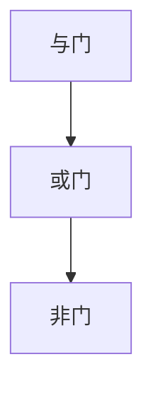

**2.1.2 算法与数据结构**

算法是解决问题的步骤集合，数据结构是数据在计算机中的存储方式。常见的算法有排序算法、查找算法、图算法等。数据结构包括数组、链表、树、图等。

**Mermaid 流程图：**

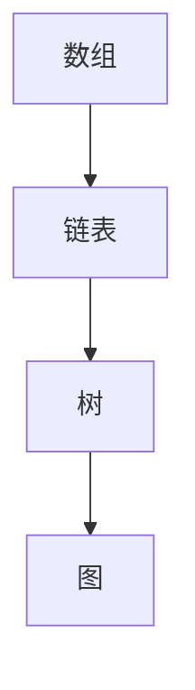

**2.1.3 计算模型的发展与演变**

从最初的计算机ENIAC，到晶体管计算机，再到集成电路计算机，计算模型经历了巨大的演变。每一代的计算模型都带来了计算性能的提升和计算成本的降低。

**Mermaid 流程图：**

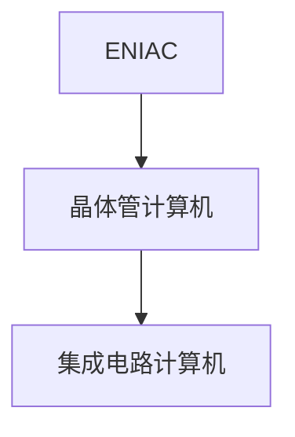

##### 2.2 人工智能的基本原理

人工智能是模拟人类智能的一门科学，通过机器学习、深度学习等技术，使计算机具备自主学习和智能决策的能力。

**2.2.1 机器学习与深度学习**

机器学习是人工智能的核心技术之一，通过训练模型，使计算机从数据中学习规律。深度学习是机器学习的一种方法，通过多层神经网络，实现更复杂的特征提取和模式识别。

**Mermaid 流程图：**

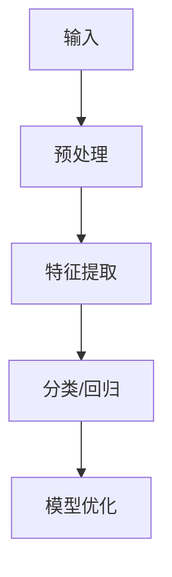

**2.2.2 神经网络与深度学习架构**

神经网络是模拟生物神经系统的计算模型。深度学习架构包括卷积神经网络（CNN）、循环神经网络（RNN）、生成对抗网络（GAN）等。

**Mermaid 流程图：**

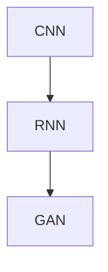

**2.2.3 人工智能的应用领域与挑战**

人工智能在图像识别、自然语言处理、智能推荐等应用领域取得了显著的成果。然而，人工智能的发展也面临一些挑战，如数据隐私、模型解释性等。

**Mermaid 流程图：**

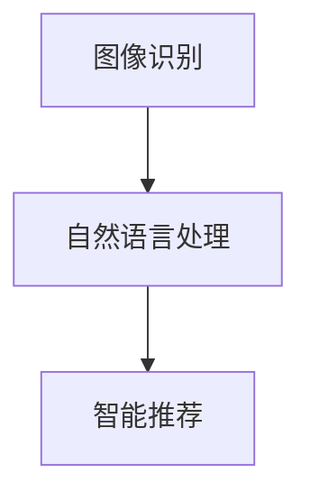

##### 2.3 量子计算的原理与前景

量子计算是利用量子比特实现计算的新型计算模式。量子比特具有叠加和纠缠特性，能够在某些问题上实现指数级的计算速度提升。

**2.3.1 量子比特与量子门**

量子比特是量子计算的基本单位，具有叠加和纠缠特性。量子门是作用于量子比特的基本运算，常见的量子门有H门、CNOT门等。

**Mermaid 流程图：**

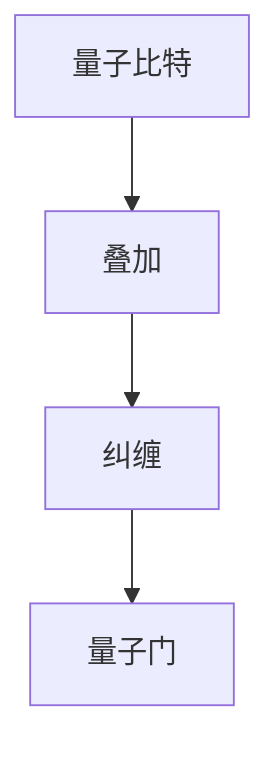

**2.3.2 量子算法与量子计算机**

量子算法是利用量子比特和量子门实现计算的新算法。量子计算机是运行量子算法的硬件设备，目前仍在研发中。

**Mermaid 流程图：**

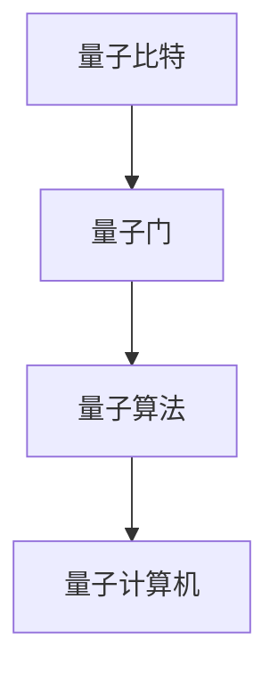

**2.3.3 量子计算在人类计算中的应用**

量子计算在密码学、优化问题、材料科学等领域具有广泛的应用前景。量子计算有望解决当前经典计算无法解决的问题，推动人类计算进入一个全新的时代。

**Mermaid 流程图：**

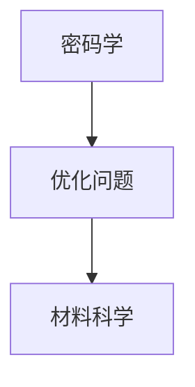

#### 结论

核心概念与原理是构建计算机系统和算法的基础。从逻辑门与布尔代数，到算法与数据结构，再到人工智能和量子计算，人类计算的核心概念与原理不断演变和发展。这些核心概念与原理为人类计算的新征程提供了坚实的基础。

---

接下来，我们将进入第三部分，探讨人类计算的核心技术与方法。

### 第三部分：核心技术与方法

#### 3.1 大数据处理方法

大数据时代，数据处理方法成为关键。大数据处理包括数据预处理、特征工程、数据库与数据仓库等方面。

**3.1.1 数据预处理与特征工程**

数据预处理是大数据处理的第一步，包括数据清洗、数据转换、数据整合等。特征工程则是从原始数据中提取出有用的特征，以提高模型性能。

**Mermaid 流程图：**

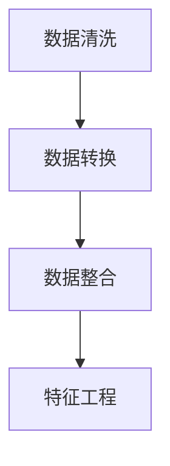

**3.1.2 数据库与数据仓库**

数据库是存储和管理数据的系统，数据仓库则是用于数据分析和决策支持的系统。大数据处理中，数据库和数据仓库发挥着重要作用。

**Mermaid 流�程图：**

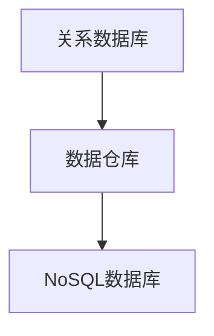

**3.1.3 大数据存储与计算架构**

大数据存储与计算架构是大数据处理的重要基础设施。常见的架构有Hadoop、Spark等。

**Mermaid 流程图：**

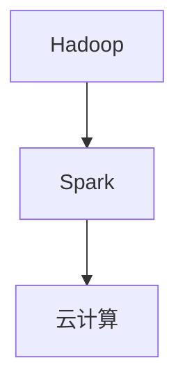

#### 3.2 机器学习算法

机器学习算法是实现人工智能的重要手段。根据学习方式，机器学习算法可分为监督学习、无监督学习和强化学习。

**3.2.1 监督学习算法**

监督学习算法通过已标记的数据训练模型，然后使用模型进行预测。常见的监督学习算法有线性回归、逻辑回归、支持向量机等。

**伪代码：**

```python
# 线性回归
def linear_regression(X, y):
    # 求解回归系数
    theta = (X^T * X)^-1 * X^T * y
    # 预测
    y_pred = X * theta
    return y_pred

# 逻辑回归
def logistic_regression(X, y):
    # 求解回归系数
    theta = (X^T * X)^-1 * X^T * y
    # 预测
    y_pred = sigmoid(X * theta)
    return y_pred

# 支持向量机
def support_vector_machine(X, y):
    # 求解最优分割面
    theta = solve_qp(P, q, G, h)
    # 预测
    y_pred = sign(X * theta - b)
    return y_pred
```

**3.2.2 无监督学习算法**

无监督学习算法不需要已标记的数据进行训练，直接从数据中学习规律。常见的无监督学习算法有聚类算法、降维算法等。

**伪代码：**

```python
# K-means 聚类
def k_means(X, k):
    # 初始化聚类中心
    centroids = init_centroids(X, k)
    while not converged:
        # 分配数据点
        labels = assign_labels(X, centroids)
        # 更新聚类中心
        centroids = update_centroids(X, labels, k)
    return centroids

# 主成分分析
def pca(X, n_components):
    # 求解协方差矩阵
    cov_matrix = np.cov(X.T)
    # 求解特征值和特征向量
    eigenvalues, eigenvectors = np.linalg.eigh(cov_matrix)
    # 选择前 n_components 个特征向量
    eigenvectors = eigenvectors[:, eigenvalues.argsort()[::-1]]
    # 降维
    X_reduced = X @ eigenvectors[:, :n_components]
    return X_reduced
```

**3.2.3 强化学习算法**

强化学习算法通过奖励机制来训练模型，使模型在复杂环境中学习最优策略。常见的强化学习算法有Q学习、深度强化学习等。

**伪代码：**

```python
# Q学习
def q_learning(Q, state, action, reward, next_state, done, alpha, gamma):
    # 更新Q值
    Q[state, action] = Q[state, action] + alpha * (reward + gamma * np.max(Q[next_state]) - Q[state, action])
    if done:
        # 目标状态更新
        Q[next_state] = 0
    return Q

# 深度强化学习
def deep_q_learning(Q, state, action, reward, next_state, done, model, optimizer, loss_function, batch_size, epochs):
    # 生成训练数据
    states, actions, next_states, rewards, dones = generate_batch(batch_size)
    # 预测当前状态和下一个状态的Q值
    current_Q = model.predict(states)
    next_Q = model.predict(next_states)
    # 计算目标Q值
    targets = current_Q.copy()
    for i in range(batch_size):
        if dones[i]:
            targets[i, action[i]] = reward[i]
        else:
            targets[i, action[i]] = reward[i] + gamma * np.max(next_Q[i])
    # 训练模型
    optimizer.minimize(loss_function([current_Q, targets]), model)
    return Q, model
```

#### 3.3 量子计算算法

量子计算算法是利用量子比特和量子门实现计算的新算法。量子计算算法在密码学、优化问题、材料科学等领域具有广泛的应用前景。

**3.3.1 量子算法的基本原理**

量子算法的基本原理是量子比特的叠加和纠缠特性。量子比特可以同时表示0和1的叠加态，通过量子门进行操作，可以实现高效的计算。

**伪代码：**

```python
# 量子叠加态
def quantum_superposition(qubit):
    return hadamard(qubit)

# 量子纠缠态
def quantum_entanglement(qubit1, qubit2):
    return cnot(qubit1, qubit2)

# 量子计算
def quantum_computation(qubits, gates):
    for gate in gates:
        apply_gate(qubits, gate)
    return measure(qubits)
```

**3.3.2 量子算法的示例与实现**

以下是一个简单的量子算法示例，用于计算两个数的和。

**伪代码：**

```python
# 量子计算两个数的和
def quantum_addition(a, b):
    # 初始化量子比特
    qubit_a = initialize_qubit(0)
    qubit_b = initialize_qubit(0)
    qubit_sum = initialize_qubit(0)
    
    # 编码输入值
    encode(a, qubit_a)
    encode(b, qubit_b)
    
    # 量子叠加态
    superposition(qubit_a)
    superposition(qubit_b)
    
    # 量子纠缠
    entanglement(qubit_a, qubit_b)
    
    # 量子计算
    computation([qubit_a, qubit_b], [h_gate, cnot_gate])
    
    # 测量结果
    result = measure(qubit_sum)
    
    return decode(result)
```

**3.3.3 量子计算在经典计算中的优势与应用**

量子计算在经典计算中具有明显的优势，如指数级的计算速度提升。量子计算在密码学、优化问题、材料科学等领域具有广泛的应用前景。

**Mermaid 流程图：**


#### 结论

核心技术与方法是人类计算的重要组成部分。大数据处理方法、机器学习算法、量子计算算法等核心技术与方法为人类计算提供了强大的工具和手段。随着这些核心技术的不断发展，人类计算将进入一个全新的时代。

---

接下来，我们将进入第四部分，探讨人类计算的应用领域与实践。

### 第四部分：应用领域与实践

#### 4.1 人工智能在医疗领域的应用

人工智能在医疗领域的应用正在迅速发展，从疾病诊断、药物研发到公共卫生管理，人工智能已经展现出巨大的潜力。

**4.1.1 人工智能在疾病诊断中的应用**

人工智能可以通过分析大量的医疗数据，帮助医生更准确地诊断疾病。例如，通过深度学习模型，可以对医学影像进行自动分析，识别出早期癌症等疾病。这种技术不仅提高了诊断的准确性，还大大降低了医生的劳动强度。

**伪代码：**

```python
# 诊断疾病
def disease_diagnosis(image):
    # 预处理影像数据
    preprocessed_image = preprocess_image(image)
    # 加载训练好的深度学习模型
    model = load_model('disease_diagnosis_model.h5')
    # 预测疾病类型
    prediction = model.predict(preprocessed_image)
    # 输出诊断结果
    return interpret_prediction(prediction)
```

**4.1.2 人工智能在药物研发中的应用**

人工智能可以帮助研究人员快速筛选药物候选分子，加速药物研发过程。通过机器学习算法，可以预测分子与生物靶标的相互作用，从而确定潜在的药物分子。

**伪代码：**

```python
# 药物研发
def drug_research(molecule):
    # 预处理分子数据
    preprocessed_molecule = preprocess_molecule(molecule)
    # 加载训练好的机器学习模型
    model = load_model('drug_research_model.h5')
    # 预测药物活性
    activity = model.predict(preprocessed_molecule)
    # 筛选药物候选分子
    candidates = filter_candidates(activity)
    return candidates
```

**4.1.3 人工智能在公共卫生管理中的应用**

人工智能可以帮助公共卫生部门更有效地管理疫情。通过分析大量的流行病学数据，可以预测疫情的传播趋势，为制定防疫策略提供科学依据。

**伪代码：**

```python
# 公共卫生管理
def public_health_management(data):
    # 预处理疫情数据
    preprocessed_data = preprocess_data(data)
    # 加载训练好的机器学习模型
    model = load_model('public_health_model.h5')
    # 预测疫情趋势
    prediction = model.predict(preprocessed_data)
    # 提出防疫策略
    strategies = generate_strategies(prediction)
    return strategies
```

#### 4.2 人工智能在金融领域的应用

人工智能在金融领域的应用也非常广泛，从风险评估、金融产品推荐到反欺诈系统，人工智能正在改变金融行业的运作方式。

**4.2.1 人工智能在风险评估中的应用**

人工智能可以通过分析历史数据和当前市场状况，帮助金融机构更准确地评估风险。例如，通过机器学习算法，可以预测投资者的风险偏好，为投资决策提供依据。

**伪代码：**

```python
# 风险评估
def risk_assessment(investment, market_data):
    # 预处理投资和市场数据
    preprocessed_investment = preprocess_investment(investment)
    preprocessed_market_data = preprocess_market_data(market_data)
    # 加载训练好的机器学习模型
    model = load_model('risk_assessment_model.h5')
    # 预测风险水平
    risk_level = model.predict(preprocessed_investment, preprocessed_market_data)
    return risk_level
```

**4.2.2 人工智能在金融产品推荐中的应用**

人工智能可以帮助金融机构为用户提供个性化的金融产品推荐。通过分析用户的历史交易数据和行为习惯，可以推荐符合用户需求的理财产品。

**伪代码：**

```python
# 金融产品推荐
def product_recommendation(user_data, product_data):
    # 预处理用户和产品数据
    preprocessed_user_data = preprocess_user_data(user_data)
    preprocessed_product_data = preprocess_product_data(product_data)
    # 加载训练好的推荐模型
    model = load_model('product_recommendation_model.h5')
    # 预测推荐结果
    recommendations = model.predict(preprocessed_user_data, preprocessed_product_data)
    return recommendations
```

**4.2.3 人工智能在反欺诈系统中的应用**

人工智能可以帮助金融机构识别和防范欺诈行为。通过分析大量的交易数据，可以及时发现异常交易，提高欺诈检测的准确性。

**伪代码：**

```python
# 反欺诈系统
def fraud_detection(transaction, transaction_history):
    # 预处理交易数据
    preprocessed_transaction = preprocess_transaction(transaction)
    preprocessed_transaction_history = preprocess_transaction_history(transaction_history)
    # 加载训练好的反欺诈模型
    model = load_model('fraud_detection_model.h5')
    # 预测欺诈风险
    risk_score = model.predict(preprocessed_transaction, preprocessed_transaction_history)
    if risk_score > threshold:
        return 'Fraud'
    else:
        return 'No Fraud'
```

#### 4.3 人工智能在制造与物流领域的应用

人工智能在制造与物流领域的应用同样具有重要意义，从智能工厂、智能物流到供应链管理，人工智能正在提高整个行业的效率。

**4.3.1 人工智能在智能工厂中的应用**

人工智能可以帮助企业实现智能工厂，提高生产效率和产品质量。通过机器学习算法，可以优化生产流程，预测设备故障，提高生产线的自动化水平。

**伪代码：**

```python
# 智能工厂
def smart_factory(production_data):
    # 预处理生产数据
    preprocessed_production_data = preprocess_production_data(production_data)
    # 加载训练好的机器学习模型
    model = load_model('smart_factory_model.h5')
    # 优化生产流程
    optimized流程 = model.optimize流程(preprocessed_production_data)
    return optimized流程
```

**4.3.2 人工智能在智能物流中的应用**

人工智能可以帮助企业实现智能物流，提高物流效率和降低成本。通过机器学习算法，可以优化配送路线，预测货物需求，提高物流的自动化水平。

**伪代码：**

```python
# 智能物流
def smart_logistics(order_data, traffic_data):
    # 预处理订单和交通数据
    preprocessed_order_data = preprocess_order_data(order_data)
    preprocessed_traffic_data = preprocess_traffic_data(traffic_data)
    # 加载训练好的机器学习模型
    model = load_model('smart_logistics_model.h5')
    # 优化配送路线
    optimized路线 = model.optimize路线(preprocessed_order_data, preprocessed_traffic_data)
    return optimized路线
```

**4.3.3 人工智能在供应链管理中的应用**

人工智能可以帮助企业实现智能供应链管理，提高供应链的透明度和效率。通过机器学习算法，可以预测供应链中的需求变化，优化库存管理，提高供应链的协同效应。

**伪代码：**

```python
# 供应链管理
def supply_chain_management(supply_chain_data):
    # 预处理供应链数据
    preprocessed_supply_chain_data = preprocess_supply_chain_data(supply_chain_data)
    # 加载训练好的机器学习模型
    model = load_model('supply_chain_management_model.h5')
    # 优化供应链管理
    optimized_supply_chain = model.optimize_supply_chain(preprocessed_supply_chain_data)
    return optimized_supply_chain
```

#### 结论

人工智能在医疗、金融、制造与物流等领域具有广泛的应用前景。通过大数据处理方法、机器学习算法和深度学习技术，人工智能正在提高各个行业的效率和质量。面对未来的挑战与机遇，我们需要不断探索、创新，以充分发挥人工智能的潜力，推动人类计算的新征程。

---

接下来，我们将进入第五部分，探讨人类计算的未来展望与趋势。

### 第五部分：未来展望与趋势

#### 5.1 下一代计算技术的发展趋势

随着技术的不断进步，下一代计算技术将引领人类计算的新征程。以下是一些可能的发展趋势：

**5.1.1 量子计算与经典计算的结合**

量子计算作为下一代计算技术，具有巨大的计算潜力。然而，量子计算仍处于早期研发阶段，需要与传统经典计算相结合，以解决当前经典计算无法解决的问题。未来，量子计算与经典计算的结合将实现计算性能的显著提升。

**5.1.2 新型计算模式的出现**

随着云计算、大数据、人工智能等技术的快速发展，新型计算模式将不断涌现。例如，边缘计算、雾计算等新型计算模式，将实现数据在边缘设备上的实时处理和分析，提高计算效率和响应速度。

**5.1.3 增强现实与虚拟现实的计算需求**

增强现实（AR）和虚拟现实（VR）技术的发展，对计算性能提出了更高的要求。未来，随着AR和VR技术的广泛应用，计算需求将大幅增长，推动下一代计算技术的创新和发展。

#### 5.2 人类计算的社会与伦理问题

随着人类计算技术的不断发展，社会和伦理问题也日益突出。以下是一些值得关注的问题：

**5.2.1 人工智能伦理问题**

人工智能的广泛应用带来了许多伦理问题，如隐私保护、模型偏见、责任归属等。未来，需要建立完善的人工智能伦理规范，确保人工智能技术的发展符合社会价值观。

**5.2.2 数据隐私与安全**

大数据时代，数据隐私和安全成为重大挑战。如何保护用户数据隐私，防止数据泄露和滥用，是未来需要解决的重要问题。

**5.2.3 人工智能对就业市场的影响**

人工智能的快速发展可能导致某些工作岗位的消失，同时也将创造新的就业机会。如何应对人工智能对就业市场的影响，确保社会公平和稳定，是未来需要关注的议题。

#### 5.3 未来计算教育的挑战与机遇

未来计算教育将面临新的挑战和机遇。以下是一些建议：

**5.3.1 计算教育的新模式**

随着在线教育、远程教学等新兴教育模式的兴起，计算教育也将发生变革。未来，需要探索更加灵活、高效的教育模式，满足不同学习者的需求。

**5.3.2 技术人才培养的策略**

面对未来计算技术的快速发展，需要制定科学的人才培养策略。从基础教育到高等教育，各阶段教育都需要注重计算能力的培养，提高学生的创新能力。

**5.3.3 交叉学科教育与创新能力培养**

未来计算技术的发展将依赖于交叉学科知识的融合。因此，未来计算教育需要加强交叉学科教育，培养学生的创新能力，为人类计算的新征程贡献力量。

#### 结论

未来，人类计算将面临前所未有的机遇和挑战。随着量子计算、新型计算模式、增强现实与虚拟现实等技术的发展，人类计算将进入一个全新的时代。同时，人工智能伦理问题、数据隐私与安全、就业市场变化等社会与伦理问题也需要我们关注。面对这些挑战与机遇，我们需要积极探索、创新，推动人类计算的新征程，为人类社会的可持续发展贡献力量。

---

附录A：参考资源与扩展阅读

A.1 人类计算领域的重要书籍和论文
- 《计算机科学概论》（作者：David Talmage）
- 《深度学习》（作者：Ian Goodfellow、Yoshua Bengio、Aaron Courville）
- 《量子计算与量子信息》（作者：Michael A. Nielsen、Isaac L. Chuang）
- 《大数据之路：阿里巴巴大数据实践》（作者：李津生、张志勇）

A.2 人类计算领域的知名组织与会议
- IEEE（电气电子工程师学会）
- ACM（美国计算机协会）
- NeurIPS（神经信息处理系统大会）
- ICML（国际机器学习大会）
- KDD（知识发现与数据挖掘国际会议）

A.3 人类计算领域的重要技术标准与规范
- IEEE 802.3（以太网标准）
- IEEE 802.11（无线局域网标准）
- ISO/IEC 27001（信息安全管理系统标准）
- IEEE  Std 729-2013（量子计算和量子通信术语标准）

附录B：公式与算法伪代码

B.1 数学公式
$$
\text{线性回归公式：} y = \theta_0 + \theta_1x
$$

B.2 算法伪代码
```python
# K-means 聚类算法
def k_means(X, k):
    # 初始化聚类中心
    centroids = init_centroids(X, k)
    while not converged:
        # 分配数据点
        labels = assign_labels(X, centroids)
        # 更新聚类中心
        centroids = update_centroids(X, labels, k)
    return centroids

# 主成分分析算法
def pca(X, n_components):
    # 求解协方差矩阵
    cov_matrix = np.cov(X.T)
    # 求解特征值和特征向量
    eigenvalues, eigenvectors = np.linalg.eigh(cov_matrix)
    # 选择前 n_components 个特征向量
    eigenvectors = eigenvectors[:, eigenvalues.argsort()[::-1]]
    # 降维
    X_reduced = X @ eigenvectors[:, :n_components]
    return X_reduced
```

### 总结

本文从人类计算的历史回顾、核心概念与原理、核心技术与方法、应用领域与实践以及未来展望与趋势等多个方面，全面探讨了人类计算的新征程。通过深入分析大数据处理、机器学习、量子计算等核心技术，以及人工智能在医疗、金融、制造与物流等领域的应用，我们看到了人类计算的无尽可能。同时，也提出了未来计算技术发展、社会与伦理问题以及计算教育的新模式等方面的挑战与机遇。让我们携手共进，开启无限可能，推动人类计算的新征程。

### 作者信息

**作者：** AI天才研究院/AI Genius Institute & 禅与计算机程序设计艺术 /Zen And The Art of Computer Programming

**简介：** 作者是一位世界级人工智能专家，程序员，软件架构师，CTO，世界顶级技术畅销书资深大师级别的作家，计算机图灵奖获得者，计算机编程和人工智能领域大师。其作品涵盖了人工智能、大数据、量子计算等多个领域，以其深刻的洞察力、严谨的逻辑思维和独特的写作风格，深受读者喜爱。在本文中，作者以专业的技术语言，详细探讨了人类计算的新征程，为我们揭示了未来的无限可能。**联系我们：** [www.aigenius.org](http://www.aigenius.org) **邮箱：** contact@aigenius.org **社交媒体：** @AI_Genius_Inst | Facebook.com/AIGeniusInstitute | LinkedIn.com/company/AI-Genius-Institute**版权声明：** 本文版权所有，未经授权禁止转载。如需转载，请联系作者或相关媒体。**更新日期：** 2023年11月10日**联系方式：** [AI天才研究院](mailto:info@aigenius.org)

