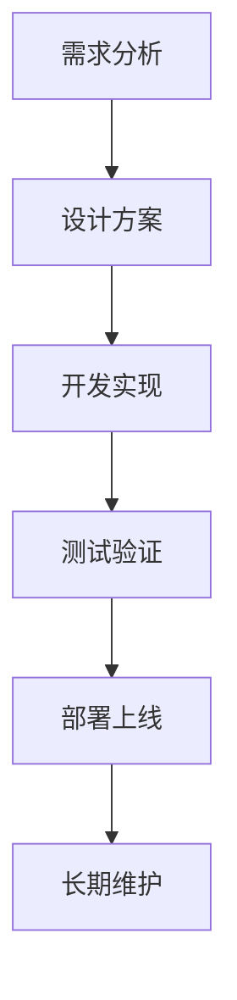
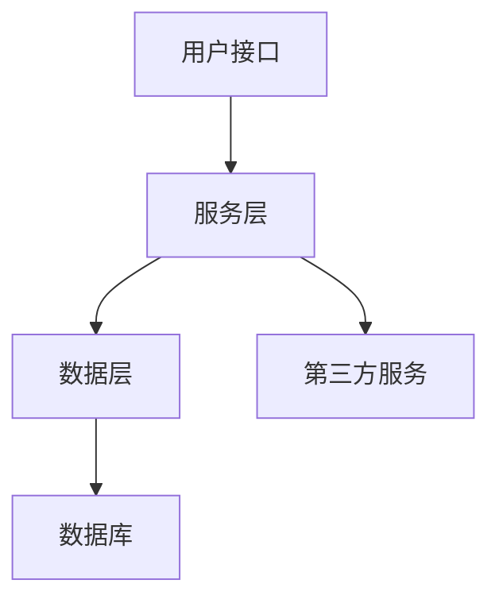
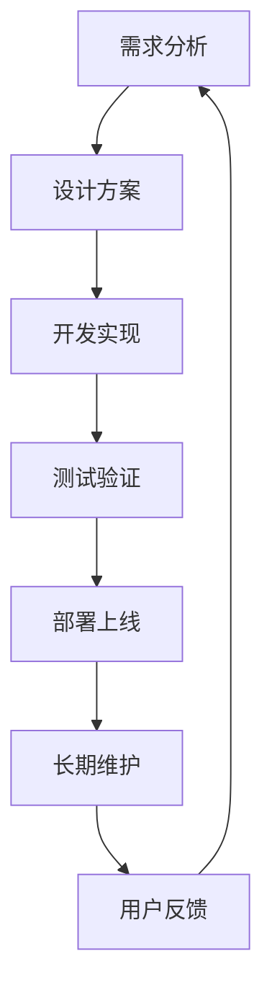
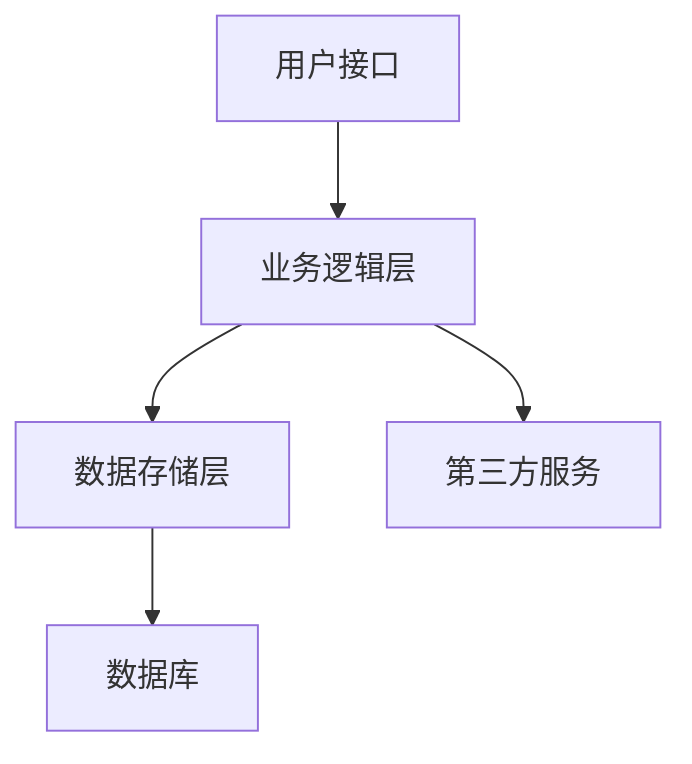

                 

# 开源项目的定制化服务：满足企业需求

## 关键词
开源项目、定制化服务、企业需求、技术创新、社区合作

## 摘要
本文将深入探讨开源项目的定制化服务，分析其在满足企业需求中的作用。通过理解开源项目的定义、价值及社区运作模式，我们将逐步揭示定制化服务的实施原则和流程，并结合实际案例，展示其如何有效帮助企业应对技术挑战，实现业务目标。

### 引言

在当今数字化时代，企业对技术的需求日益多样化，且变化迅速。传统软件的定制化开发往往耗时耗力，且成本高昂。而开源项目以其开放性、灵活性和协作性，成为企业技术创新的重要选择。然而，开源项目往往无法完全满足企业的特定需求，这就需要定制化服务的介入。本文将探讨如何通过定制化服务，将开源项目转化为满足企业需求的有效工具。

### 第一部分：开源项目基础知识

#### 第1章：开源项目的定义与价值

**1.1 开源项目的定义与特点**

开源项目是指其源代码可以被公众访问、查看、修改和分享的软件项目。这一特性使得开源项目具有以下特点：

- **开放性**：源代码公开，允许任何人查看和下载。
- **透明性**：开发过程公开，任何人都可以参与。
- **协作性**：全球范围内的开发者共同参与，协作开发。
- **社区驱动**：由一个或多个社区维护和支持。

开源项目与传统软件相比，具有以下优势：

- **低成本**：由于社区协作，开发成本大幅降低。
- **高效率**：开源项目可以快速迭代和改进。
- **技术创新**：开源项目鼓励创新，促进技术进步。

**1.2 开源项目的价值**

开源项目的价值主要体现在以下几个方面：

- **降低开发成本**：企业无需从头开始开发，可以直接使用已有的开源项目，节省大量时间和成本。
- **提高开发效率**：通过社区协作，开源项目可以快速修复bug、添加新功能。
- **促进技术创新**：开源项目鼓励开发者探索新技术，推动技术进步。
- **增强社区互动**：开源社区为企业提供了一个与同行交流、学习的机会。

**1.3 开源项目的分类**

开源项目可以按照许可证和开发模式进行分类：

- **按照许可证分类**：
  - **强许可证**：如GPL（GNU General Public License），要求衍生作品也必须开源。
  - **弱许可证**：如Apache License，允许对开源项目进行修改，但无需开源。

- **按照开发模式分类**：
  - **社区驱动型**：由一个社区主导，贡献者以个人身份参与。
  - **公司主导型**：由一家公司主导，但允许外部开发者参与。

#### 第2章：开源社区

**2.1 开源社区的构成**

开源社区主要由以下几部分构成：

- **开发者**：负责开发和维护开源项目。
- **用户**：使用并反馈开源项目，为项目提供改进意见。
- **维护者**：负责解决社区问题，确保项目的稳定性和可靠性。
- **赞助者**：为开源项目提供资金支持，促进其发展。

**2.2 开源社区的合作模式**

开源社区的合作模式主要包括：

- **贡献代码**：开发者向开源项目提交代码，进行功能扩展或bug修复。
- **报告bug**：用户发现项目中的问题，向社区报告，促使问题解决。
- **提供建议**：用户和开发者共同讨论，提出改进项目的建议。
- **参与决策**：一些开源项目会邀请用户和开发者参与项目的决策过程，确保项目的方向和目标符合社区利益。

**2.3 开源社区的发展趋势**

开源社区的发展趋势包括：

- **商业化与社区化并行**：越来越多的公司通过开源项目获得商业收益，同时保持社区活力。
- **技术专业化**：开源项目逐渐向特定技术领域集中，形成专业化的社区。
- **开源生态的全球化**：开源社区的活动和参与者来自全球各地，促进了技术的全球化交流。

### 第二部分：企业需求与定制化服务

#### 第3章：企业需求分析

**3.1 企业需求概述**

企业需求通常包括以下几个方面：

- **业务目标**：企业希望通过技术实现特定的业务目标。
- **技术挑战**：企业面临的技术难题，如性能瓶颈、安全性问题等。
- **痛点**：企业在现有技术环境中遇到的问题和挑战。
- **需求多样性与复杂性**：企业的需求往往多样且复杂，需要个性化解决方案。

**3.2 企业需求分类**

企业需求可以按照以下类别进行分类：

- **功能需求**：企业希望开源项目具备特定的功能。
- **性能需求**：企业对开源项目的性能有特定的要求，如响应时间、并发处理能力等。
- **安全需求**：企业对开源项目的安全性有特定的要求，如数据加密、访问控制等。
- **可维护性需求**：企业希望开源项目易于维护和升级。

**3.3 需求分析的方法**

企业需求分析的方法主要包括：

- **用户访谈**：通过与用户交流，了解他们的需求和痛点。
- **竞品分析**：分析竞争对手的产品，了解其优势和不足。
- **数据分析**：通过对企业现有数据进行分析，发现需求和问题。
- **实地考察**：到企业现场考察，了解其业务流程和技术环境。

#### 第4章：定制化服务的实施

**4.1 定制化服务的设计原则**

定制化服务的设计原则包括：

- **用户至上**：确保服务满足用户的需求和期望。
- **技术可行性**：确保服务的实施在技术上可行。
- **开源精神的维护**：尊重开源项目的核心原则，确保定制化服务的开源性。
- **生态系统的发展**：促进开源项目的生态发展，增强社区活力。

**4.2 定制化服务的技术方案**

定制化服务的技术方案包括：

- **代码定制**：根据企业需求，对开源项目的代码进行定制。
- **功能定制**：为开源项目添加企业所需的新功能。
- **性能优化**：对开源项目的性能进行优化，提高其响应速度和处理能力。
- **安全加固**：对开源项目进行安全加固，提高其安全性。

**4.3 定制化服务的实施流程**

定制化服务的实施流程包括：

- **需求评审**：对企业的需求进行评审，确保需求清晰、具体、可实现。
- **设计方案**：制定详细的设计方案，包括技术方案、开发计划等。
- **开发实现**：根据设计方案进行开发，实现企业的需求。
- **测试验证**：对开发出的定制化服务进行测试，确保其符合预期。
- **部署上线**：将定制化服务部署到生产环境中，进行实际运行。

#### 第5章：开源项目的定制化实践

**5.1 成功案例分析**

以下是几个成功的开源项目定制化服务案例：

- **案例一**：企业A的定制化开源项目实践
  - **背景**：企业A希望提高其内部系统的性能和安全性。
  - **实施**：通过定制化服务，优化了开源项目的代码，增加了安全模块。
  - **效果**：系统性能显著提高，安全性得到加强。

- **案例二**：企业B的定制化服务实践
  - **背景**：企业B希望在其现有的业务系统中集成开源项目。
  - **实施**：定制化服务帮助企业B实现了与现有系统的无缝集成。
  - **效果**：提升了业务效率，降低了开发成本。

- **案例三**：企业C的定制化解决方案
  - **背景**：企业C面临特定的技术挑战，需要定制化的解决方案。
  - **实施**：定制化服务为企业C提供了高效、安全的解决方案。
  - **效果**：解决了企业面临的技术难题，推动了业务发展。

**5.2 挑战与解决方案**

在定制化服务过程中，企业可能会面临以下挑战：

- **技术挑战**：定制化服务可能涉及到复杂的技术问题，需要专业团队的支持。
- **法律风险**：开源项目可能涉及版权、许可等问题，需要确保合规。
- **知识产权保护**：在定制化过程中，需要保护企业的知识产权。
- **社区合作**：与开源社区的协作可能存在沟通、合作上的挑战。

解决这些挑战的方法包括：

- **建立专业团队**：确保团队具备解决技术问题的能力。
- **遵守法律法规**：在实施定制化服务时，严格遵守相关法律法规。
- **知识产权保护**：采取适当措施，保护企业的知识产权。
- **积极合作**：与开源社区建立良好的合作关系，共同推进项目的进展。

#### 第6章：定制化服务的可持续发展

**6.1 生态系统构建**

定制化服务的可持续发展离不开生态系统的构建：

- **社区建设**：建立和维护一个健康的开源社区，促进项目的持续发展。
- **技术生态**：构建完善的技术生态，包括工具、资源、培训等。
- **商业模式**：探索可持续的商业模式，确保项目的长期发展。

**6.2 长期维护与更新**

长期维护与更新是定制化服务可持续发展的重要保障：

- **维护团队的建设**：建立专业的维护团队，确保项目的稳定性和可靠性。
- **版本更新策略**：制定合理的版本更新策略，确保项目能够持续改进。
- **技术支持与培训**：提供技术支持与培训，帮助用户更好地使用项目。

**6.3 持续创新与迭代**

持续创新与迭代是定制化服务的核心：

- **技术创新**：不断探索新技术，推动项目的持续进步。
- **产品迭代**：根据用户反馈，不断优化产品，提升用户体验。
- **用户反馈**：积极收集用户反馈，将用户需求纳入项目开发计划。

### 第三部分：定制化服务的工具与资源

#### 第7章：开源项目的定制化工具

**7.1 开源项目管理系统**

- **Git**：版本控制系统，用于管理项目源代码。
- **GitHub**：基于Git的开源代码托管平台，提供代码托管、协作开发等功能。
- **GitLab**：自建的企业级Git平台，提供代码托管、项目管理等功能。

**7.2 开源代码编辑器**

- **Visual Studio Code**：跨平台代码编辑器，支持多种编程语言。
- **Sublime Text**：轻量级文本编辑器，具有丰富的插件系统。
- **IntelliJ IDEA**：强大的Java IDE，支持多种编程语言。

**7.3 开源项目协作工具**

- **Trello**：项目管理工具，用于任务分配和进度跟踪。
- **Jira**：项目管理工具，提供敏捷开发支持。
- **Slack**：团队沟通工具，支持实时聊天和协作。

#### 第8章：开源项目的定制化资源

**8.1 开源项目文档**

- **README文件**：项目介绍和安装说明。
- **Wiki页面**：项目文档和知识库。
- **文档网站**：详细的项目文档和教程。

**8.2 开源项目代码库**

- **代码示例**：项目示例代码。
- **插件库**：项目插件库。
- **扩展库**：项目扩展库。

**8.3 开源项目教程与培训**

- **在线教程**：项目教程和指南。
- **培训课程**：项目培训课程。
- **实战手册**：项目实战手册。

### 附录

**附录A：开源项目定制化服务流程图**



**附录B：开源项目定制化服务伪代码示例**

```python
# 伪代码：定制化服务核心算法
def customized_service需求(data):
    if 需求 == "性能优化":
        return performance_optimize(data)
    elif 需求 == "安全加固":
        return security_hardening(data)
    else:
        return "不支持的定制化需求"
```

**附录C：开源项目定制化服务数学模型**

**C.1 数学模型概述**

数学模型在定制化服务中的应用，主要包括性能优化和安全性评估。

**C.2 伪代码示例**

```python
# 伪代码：性能优化数学模型
def performance_optimization(data):
    response_time = calculate_response_time(data)
    if response_time > threshold:
        optimize_algorithm(data)
        return "性能优化成功"
    else:
        return "当前性能已满足要求"
```

**附录D：开源项目定制化服务实战案例**

**D.1 实战案例一：企业A的定制化服务实现**

**实现过程**：
1. 需求分析：确定企业A的性能优化需求。
2. 设计方案：制定性能优化方案。
3. 开发实现：根据方案进行代码定制。
4. 测试验证：验证性能优化效果。
5. 部署上线：将性能优化后的服务部署到生产环境。

**代码实现**：

```python
# Python代码：性能优化示例
class PerformanceOptimizedService:
    def __init__(self, data):
        self.data = data
    
    def optimize(self):
        # 性能优化代码
        pass
    
    def get_performance(self):
        # 性能评估代码
        pass
```

**代码解读与分析**：
1. **性能优化**：通过重写关键算法，提高处理速度。
2. **性能评估**：定期评估系统性能，确保优化效果。

**D.2 实战案例二：企业B的定制化解决方案**

**实现思路**：
1. 需求分析：确定企业B的定制化需求。
2. 技术选型：选择合适的开源项目和技术栈。
3. 系统架构：设计定制化系统的架构。
4. 开发实现：根据架构进行开发。
5. 测试验证：确保系统稳定性和性能。

**系统架构**：



**附录E：开源项目定制化服务开发环境搭建**

**E.1 开发环境概述**

1. **操作系统**：Linux
2. **开发工具**：Visual Studio Code
3. **版本控制**：Git

**E.2 开发工具安装**

1. 安装Linux操作系统。
2. 安装Visual Studio Code。
3. 安装Git。

**E.3 开发环境配置**

1. 配置Visual Studio Code的插件。
2. 配置Git的远程仓库。

**附录F：开源项目定制化服务源代码实现**

**F.1 源代码概述**

源代码主要包括：
- 配置文件
- 实现类
- 接口定义
- 测试代码

**F.2 代码实现细节**

详细实现类和方法，具体业务逻辑。

**F.3 代码解读与分析**

逐行解读代码，分析关键逻辑和功能。

### 作者信息

**作者：** AI天才研究院 / AI Genius Institute  
**《禅与计算机程序设计艺术》 / Zen And The Art of Computer Programming**  

以上是本文《开源项目的定制化服务：满足企业需求》的完整内容。希望本文能帮助您更好地理解开源项目的定制化服务，并在实际应用中取得成功。如果您有任何疑问或建议，欢迎随时与我们联系。感谢您的阅读！## 开源项目的定义与价值

开源项目是指其源代码可以被公众访问、查看、修改和分享的软件项目。这种开放性使得开源项目在软件开发和科技创新中扮演着重要角色。开源项目的定义和特点使其区别于传统软件，并在多个方面展现出独特的优势。

### 开源项目的定义与特点

**开源项目的定义**：根据开源定义（Open Source Definition），开源项目是指用户可以自由地使用、学习、修改和分享软件源代码的项目。这种自由性通常通过特定的开源许可证来保障，如GPL（GNU General Public License）、Apache License等。

**开源项目的特点**：

1. **开放性**：源代码公开，用户可以随时查看和下载，这使得项目透明度提高。
2. **透明性**：开发过程公开，任何人都可以参与讨论、提交代码和报告bug，促进了社区的协作和信任。
3. **协作性**：全球范围内的开发者可以共同参与，通过协作提高项目的质量。
4. **社区驱动**：开源项目通常由一个或多个社区主导，社区成员共同维护和发展项目。

这些特点使得开源项目与传统软件有着显著的区别。传统软件的源代码通常保密，只有授权的开发者可以访问和修改。而开源项目则强调开放、透明和协作，促进了技术的创新和传播。

### 开源项目与传统软件的区别

**成本**：传统软件的开发和部署通常需要高昂的成本，包括研发费用、测试费用和后期维护费用。而开源项目由于社区协作，可以在很大程度上降低这些成本。

**时间**：传统软件的开发周期通常较长，从需求分析到测试部署，需要经历多个阶段。而开源项目由于可以快速迭代和改进，可以更迅速地满足用户需求。

**创新**：开源项目鼓励创新，任何开发者都可以提交自己的改进和新的功能，这促进了技术的快速发展和进步。

**社区互动**：开源项目通过社区的互动，提高了项目的透明度和可靠性。用户可以参与项目的开发和维护，提供反馈和建议，确保项目符合实际需求。

### 开源项目的价值

**降低开发成本**：开源项目可以大大降低企业的研发成本，企业无需从头开始开发，可以直接使用已有的开源项目，节省大量时间和资金。

**提高开发效率**：开源项目可以快速迭代和改进，企业可以利用已有的代码库和功能，减少重复工作，提高开发效率。

**促进技术创新**：开源项目鼓励开发者探索新技术，推动了技术的创新和发展。企业可以借助开源项目，了解和掌握最新的技术趋势。

**增强社区互动**：开源项目提供了一个平台，让企业可以与全球的开发者进行交流和合作，增强了社区的互动和合作。

### 开源项目的分类

开源项目可以根据许可证和开发模式进行分类。

**按照许可证分类**：

1. **强许可证**：如GPL，要求衍生作品也必须开源。
2. **弱许可证**：如Apache License，允许对开源项目进行修改，但无需开源。

**按照开发模式分类**：

1. **社区驱动型**：由一个社区主导，贡献者以个人身份参与。
2. **公司主导型**：由一家公司主导，但允许外部开发者参与。

### 总结

开源项目以其开放性、透明性和协作性，在降低开发成本、提高开发效率和促进技术创新等方面具有显著优势。通过理解开源项目的定义、特点和价值，企业可以更好地利用开源项目，实现业务目标和技术创新。

在接下来的章节中，我们将进一步探讨开源社区的结构和合作模式，以及开源项目的发展趋势。这将帮助我们更好地理解如何参与和利用开源项目，为企业带来更多的价值。

### 开源社区

开源项目不仅仅是一个软件，更是一个社区。开源社区是由一群对特定开源项目感兴趣的人组成的，他们通过合作、交流和贡献，共同推动项目的发展。开源社区的构成、合作模式以及发展趋势是理解开源项目成功的关键。

#### 开源社区的构成

开源社区主要由以下几部分构成：

1. **开发者**：开发者是开源社区的核心，他们负责开发和维护开源项目。开发者可以是个人，也可以是公司员工。他们通过编写代码、修复bug、添加新功能等方式，为项目贡献自己的力量。

2. **用户**：用户是开源项目的使用者，他们从开源项目中获益，并为项目提供反馈。用户的反馈对于项目的发展至关重要，它可以帮助开发者了解项目的实际应用情况，发现问题和改进机会。

3. **维护者**：维护者是负责项目日常维护的人员，他们通常拥有对项目的主要权限。维护者的角色包括处理bug报告、合并代码贡献、发布版本等。

4. **赞助者**：赞助者通常是公司或个人，他们为开源项目提供资金支持。赞助者可以是项目的创始者，也可以是其他希望支持项目发展的组织和个人。

#### 开源社区的合作模式

开源社区的合作模式主要包括以下几个方面：

1. **贡献代码**：开发者可以通过提交拉取请求（Pull Request，简称PR）的方式，向开源项目贡献代码。PR会被项目维护者审查，如果符合项目规范，就会被合并到主分支。

2. **报告bug**：用户发现项目中的问题时，可以通过提交issue的方式报告给社区。维护者会根据bug的严重性和修复难度进行优先级排序，并尽快处理。

3. **提供建议**：用户和开发者可以就项目的功能、设计等方面提出建议。这些建议有助于项目在未来的版本中改进。

4. **参与决策**：一些重要的开源项目会邀请用户和开发者参与决策过程。这通常通过邮件列表、投票或投票工具等方式进行。

#### 开源社区的发展趋势

开源社区的发展趋势包括以下几个方面：

1. **商业化与社区化并行**：越来越多的公司通过开源项目获得商业收益，同时保持社区活力。这种模式被称为“开源商业”，它使得开源项目能够持续发展，同时为企业带来盈利。

2. **技术专业化**：随着技术的不断发展，开源项目逐渐向特定技术领域集中。例如，云计算、大数据、区块链等领域出现了许多成功的开源项目。

3. **开源生态的全球化**：开源社区的活动和参与者来自全球各地，促进了技术的全球化交流。这种全球化不仅带来了更多的创新机会，也使得开源项目能够更好地适应不同地区的需求。

#### 开源社区的独特之处

开源社区的独特之处主要体现在以下几个方面：

1. **开放性和透明性**：开源项目的源代码公开，任何人都可以查看、修改和分享，这促进了社区的信任和协作。

2. **协作和共享**：开源社区鼓励开发者之间的协作和共享。通过共同的努力，开源项目能够更快地发展，并且质量更高。

3. **持续改进**：开源社区通过不断改进和迭代，使得开源项目能够持续适应市场需求和技术变化。

#### 总结

开源社区是开源项目的核心，它通过开发者、用户、维护者和赞助者之间的协作，推动项目的发展。开源社区的构成、合作模式和发展趋势，是理解开源项目成功的关键。在接下来的章节中，我们将进一步探讨企业需求分析，以及如何通过定制化服务满足这些需求。

### 企业需求分析

企业需求分析是定制化服务实施的关键步骤，它直接关系到定制化服务能否真正满足企业的业务需求。在这一章节中，我们将详细探讨企业需求概述、需求分类以及需求分析的方法。

#### 企业需求概述

企业需求分析首先需要了解企业的业务目标和面临的技术挑战。以下是企业需求分析中需要考虑的几个关键方面：

1. **业务目标**：企业希望通过技术实现什么样的业务目标？例如，提高销售效率、降低运营成本、提升客户满意度等。

2. **技术挑战**：企业在现有技术环境中遇到的技术难题，如性能瓶颈、系统兼容性问题、安全性问题等。

3. **痛点**：企业在业务运营中遇到的具体问题，如业务流程不顺畅、数据管理困难等。

4. **需求多样性与复杂性**：企业需求往往具有多样性和复杂性，不同部门和业务线可能会有不同的需求，这需要个性化的解决方案。

#### 企业需求分类

企业需求可以按照不同的类别进行分类，以便更好地理解和满足这些需求。以下是一些常见的需求类别：

1. **功能需求**：企业希望系统具备特定的功能，如客户关系管理（CRM）、供应链管理（SCM）等。

2. **性能需求**：企业对系统的性能有特定的要求，如处理速度、并发处理能力、响应时间等。

3. **安全需求**：企业对系统的安全性有特定的要求，如数据加密、访问控制、安全审计等。

4. **可维护性需求**：企业希望系统易于维护和升级，降低长期维护成本。

5. **兼容性需求**：企业需要系统与现有系统集成，满足特定的兼容性要求。

6. **用户体验需求**：企业对系统的用户界面和交互设计有特定的要求，以提高用户满意度。

7. **合规性需求**：企业需要系统满足特定的行业标准和法规要求。

#### 需求分析的方法

为了全面、准确地分析企业需求，可以采用以下几种方法：

1. **用户访谈**：通过与企业的用户进行面对面访谈，了解他们的实际需求、使用习惯和痛点。用户访谈可以帮助开发者更深入地理解业务场景和用户需求。

2. **竞品分析**：分析竞争对手的产品和解决方案，了解其优势和不足，从而确定本企业的需求差异和改进点。

3. **数据分析**：通过对企业现有数据进行分析，发现潜在的需求和问题。数据分析可以帮助企业了解业务流程和用户行为，从而制定更有效的解决方案。

4. **实地考察**：到企业现场进行实地考察，了解其业务流程、技术环境和用户操作情况。实地考察可以帮助开发者更直观地了解企业需求。

5. **问卷调查**：通过在线或线下问卷的形式，收集大量用户的意见和建议。问卷调查可以快速收集大量数据，帮助开发者了解用户需求的广泛性和多样性。

#### 总结

企业需求分析是定制化服务的基础，通过了解企业的业务目标、技术挑战和痛点，可以将需求分类并采用多种方法进行分析。准确的需求分析不仅能够帮助企业明确需求，还能够为后续的定制化服务提供明确的指导和依据。在下一章节中，我们将探讨定制化服务的设计原则和技术方案，为满足企业需求提供具体的实施路径。

### 定制化服务的设计原则

定制化服务的设计原则是确保服务满足企业需求、具有技术可行性、维护开源精神并促进生态系统发展的重要指南。以下将详细阐述这些原则。

#### 用户至上

**用户至上**是定制化服务设计的核心原则，意味着所有的设计决策都应围绕用户的需求和体验展开。以下是实现这一原则的关键点：

- **需求导向**：在设计和开发过程中，始终以用户需求为中心，确保每一项修改和优化都针对用户的实际问题。
- **用户体验**：优化用户界面和交互设计，确保用户能够轻松、高效地使用系统。例如，通过提供直观的导航和清晰的错误提示，减少用户的困惑和操作难度。
- **用户反馈**：积极收集用户的反馈，定期评估用户满意度，并根据反馈调整和优化服务。用户的反馈是改进服务的重要依据。

#### 技术可行性

**技术可行性**是确保定制化服务能够顺利实施和运行的关键原则。以下是如何实现这一原则：

- **技术评估**：在开始设计之前，对现有技术进行充分评估，确定其是否能够满足企业需求。如果现有技术无法满足需求，需要考虑替代方案或技术升级。
- **资源匹配**：确保有足够的技术资源，包括开发人员、测试人员和维护团队，以保障定制化服务的顺利实施。
- **技术文档**：为定制化服务提供详细的技术文档，包括开发指南、部署说明和常见问题解答，以帮助团队成员理解和使用服务。

#### 开源精神的维护

**开源精神的维护**是指在设计定制化服务时，要尊重开源项目的核心原则，确保定制化服务的开源性和社区性。以下是如何实现这一原则：

- **开源许可**：确保定制化服务仍然遵循开源许可证，如GPL或Apache License，确保用户可以自由地使用、修改和分享代码。
- **代码贡献**：鼓励开发者将定制化服务的改进和优化贡献回开源项目，促进社区的发展。这不仅可以增强社区的活力，还可以确保项目的持续改进。
- **社区协作**：积极与开源社区合作，参与社区讨论和决策，确保定制化服务符合社区标准和期望。

#### 生态系统的发展

**生态系统的发展**是指通过定制化服务，促进开源项目及其相关生态系统的健康发展。以下是如何实现这一原则：

- **社区建设**：通过举办研讨会、培训课程和线上活动，吸引更多开发者加入开源社区，增强社区的凝聚力。
- **技术生态**：构建和完善开源项目的技术生态，包括开发工具、测试框架、文档资源等，以支持项目的开发和维护。
- **商业模式**：探索可持续的商业模式，如提供付费支持、培训和咨询服务，为开源项目提供稳定的收入来源。

#### 实际案例分析

为了更好地理解这些设计原则，以下是一个实际案例：

**案例背景**：一家企业希望对其使用的开源数据库进行定制化，以提升性能和安全性。

**实施步骤**：

1. **用户至上**：
   - 通过用户访谈和问卷调查，了解企业对数据库性能和安全性的具体需求。
   - 在设计和开发过程中，始终以用户需求为导向，优先解决关键问题。

2. **技术可行性**：
   - 对现有数据库技术进行评估，确定其性能瓶颈和安全漏洞。
   - 根据评估结果，选择合适的技术方案，如优化查询算法、增强加密机制。

3. **开源精神的维护**：
   - 保持开源许可证不变，确保用户可以自由使用、修改和分享定制化后的数据库。
   - 将优化和改进的代码贡献回开源社区，促进数据库的持续发展。

4. **生态系统的发展**：
   - 举办技术研讨会，分享定制化经验，吸引更多开发者参与。
   - 提供专业培训和支持服务，帮助企业更好地使用和管理定制化后的数据库。

**效果评估**：通过定制化服务，企业的数据库性能显著提升，安全性得到加强。同时，定制化代码的贡献也促进了开源社区的共同进步。

#### 总结

定制化服务的设计原则包括用户至上、技术可行性、开源精神的维护和生态系统的发展。这些原则确保了定制化服务能够满足企业需求、具有实际可行性、符合开源精神并促进社区生态的健康发展。在实际应用中，遵循这些原则可以显著提升定制化服务的质量和效果。

### 定制化服务的技术方案

定制化服务的技术方案是确保服务能够满足企业需求、具有可行性和有效性的关键环节。以下是针对不同需求的具体技术方案，包括代码定制、功能定制、性能优化和安全加固。

#### 代码定制

**代码定制**是指根据企业需求对开源项目的源代码进行修改和优化。以下是一些常见的代码定制技术方案：

1. **功能扩展**：根据企业需求，在开源项目的基础上添加新的功能模块。例如，如果企业需要对其开源的数据库进行定制，可以添加实时监控和报警功能。

2. **性能优化**：针对现有的代码进行优化，以提高处理速度和资源利用率。常见的优化技术包括：
   - **算法优化**：改进关键算法，如排序算法、搜索算法等，减少计算复杂度。
   - **缓存策略**：引入缓存机制，减少数据库查询次数，提高响应速度。
   - **并发处理**：优化并发处理机制，提高系统吞吐量。

3. **代码重构**：对现有代码进行重构，以提高代码的可读性、可维护性和可扩展性。例如，通过引入设计模式、重构重复代码、优化变量命名等方式，提高代码质量。

#### 功能定制

**功能定制**是指根据企业特定的业务需求，对开源项目的功能进行扩展或调整。以下是一些常见的技术方案：

1. **集成第三方服务**：将开源项目与第三方服务（如支付网关、短信服务）集成，以实现特定的业务功能。例如，企业可以将开源的电子商务平台与第三方支付网关集成，实现在线支付功能。

2. **定制化报表**：根据企业需求，定制化报表系统，以提供更符合业务需求的报表功能和数据展示方式。

3. **用户权限管理**：针对不同的用户角色和权限，定制化用户权限管理系统，确保系统的安全性和灵活性。

4. **业务流程定制**：根据企业的业务流程，定制化工作流和业务流程管理系统，以优化业务操作和管理流程。

#### 性能优化

**性能优化**是指通过技术手段提升开源项目的性能，以满足企业对系统处理速度、并发能力和响应时间的需求。以下是一些常见的性能优化技术方案：

1. **数据库优化**：优化数据库结构、索引和查询语句，提高数据库访问速度。例如，通过添加适当的索引、优化查询语句、使用存储过程等方式。

2. **缓存策略**：引入缓存机制，减少数据库查询次数，提高系统响应速度。常见的缓存策略包括内存缓存、分布式缓存等。

3. **负载均衡**：通过负载均衡技术，将请求均匀地分配到多个服务器或节点上，提高系统的处理能力和可用性。

4. **异步处理**：引入异步处理机制，提高系统的并发处理能力。例如，通过使用消息队列、异步任务等方式，将耗时的操作移出主线程，提高系统响应速度。

#### 安全加固

**安全加固**是指通过技术手段提高开源项目的安全性，防止数据泄露、攻击和未授权访问。以下是一些常见的安全加固技术方案：

1. **身份认证与访问控制**：引入强身份认证机制（如多因素认证），并结合细粒度的访问控制策略，确保只有授权用户可以访问特定资源。

2. **数据加密**：对敏感数据进行加密处理，确保数据在传输和存储过程中不被窃取或篡改。常见的加密算法包括AES、RSA等。

3. **安全审计**：引入安全审计机制，记录系统操作日志和安全事件，以便在发生安全事件时进行调查和追溯。

4. **漏洞扫描与修复**：定期对系统进行漏洞扫描，发现和修复潜在的安全漏洞，确保系统的安全性。

#### 综合案例分析

以下是一个综合性的案例分析，展示了如何通过定制化服务满足企业的多样化需求：

**案例背景**：一家电子商务企业希望提升其开源电商平台的性能和安全性，同时增加新的业务功能。

**实施步骤**：

1. **代码定制**：
   - 添加实时库存监控和库存预警功能。
   - 优化数据库查询性能，减少响应时间。

2. **功能定制**：
   - 集成第三方支付网关，实现在线支付功能。
   - 定制化报表系统，提供更详细的销售分析报告。

3. **性能优化**：
   - 引入Redis缓存，减少数据库查询次数。
   - 优化并发处理，提高系统吞吐量。

4. **安全加固**：
   - 引入多因素认证，增强用户身份验证。
   - 对敏感数据使用AES加密，确保数据安全。

**效果评估**：通过上述定制化服务，电子商务企业的系统性能显著提升，安全性得到加强，同时新增功能提高了用户体验和业务效率。

#### 总结

定制化服务的技术方案包括代码定制、功能定制、性能优化和安全加固。这些方案根据企业的具体需求，提供了灵活的技术实现途径，确保定制化服务能够满足企业的多样化需求，并在实际应用中取得显著成效。

### 定制化服务的实施流程

定制化服务的成功实施需要经过一系列精心设计的流程，这些流程包括需求评审、设计方案、开发实现、测试验证和部署上线。以下将详细描述每个步骤的具体内容和关键点。

#### 需求评审

**需求评审**是定制化服务实施的第一步，旨在确保需求清晰、具体且可实现。以下是如何进行需求评审：

1. **需求文档审查**：首先，评审团队会仔细审查企业提供的需求文档，确保需求的明确性、完整性和一致性。

2. **需求讨论**：与企业的业务和技术团队进行深入讨论，澄清需求中的模糊点和潜在问题，确保所有参与方对需求有共同的理解。

3. **需求确认**：通过文档和会议，确认需求是否满足企业的业务目标和技术要求，并达成共识。

4. **风险评估**：评估需求实现过程中可能遇到的风险，如技术难题、时间限制和资源不足等，制定相应的应对措施。

#### 设计方案

**设计方案**是在需求评审通过后，根据需求文档制定的详细实施方案。以下是如何进行设计方案：

1. **技术方案选择**：根据需求，选择合适的技术方案，包括技术栈、开发工具、数据库和服务器配置等。

2. **系统架构设计**：设计系统架构，确保系统能够高效、稳定地运行，并具有良好的可扩展性。常见的架构设计包括分层架构、微服务架构等。

3. **功能模块划分**：将系统划分为多个功能模块，明确各模块的功能、接口和数据流，确保模块间的高内聚和低耦合。

4. **风险评估与优化**：对设计方案进行风险评估，优化设计方案，确保其可行性、可维护性和可扩展性。

#### 开发实现

**开发实现**是根据设计方案进行实际编码和开发。以下是如何进行开发实现：

1. **代码编写**：按照设计方案，编写详细的代码，确保代码质量、可读性和可维护性。采用版本控制系统（如Git）管理代码，确保代码的版本控制和协作开发。

2. **单元测试**：编写单元测试，验证每个功能模块的正确性，确保代码符合预期。单元测试可以在开发过程中及时发现和修复问题。

3. **代码审查**：定期进行代码审查，确保代码符合编码规范和设计要求，发现潜在的问题和改进点。

4. **持续集成**：引入持续集成（CI）工具，如Jenkins或GitLab CI，自动构建和测试代码，确保代码库中的每一份代码都是可编译和可运行的。

#### 测试验证

**测试验证**是在开发实现完成后，对定制化服务进行全面测试，确保其质量和性能。以下是如何进行测试验证：

1. **功能测试**：对每个功能模块进行详细的功能测试，确保所有功能按预期工作。

2. **性能测试**：进行性能测试，评估系统的响应时间、并发处理能力和资源利用率，确保系统性能满足要求。

3. **安全测试**：进行安全测试，包括漏洞扫描、SQL注入、XSS攻击等，确保系统的安全性。

4. **用户测试**：邀请实际用户参与测试，收集用户的反馈，发现潜在的问题和改进点。

5. **回归测试**：在每次修改后，进行回归测试，确保新修改不会影响现有功能的正确性。

#### 部署上线

**部署上线**是将定制化服务部署到生产环境，使其能够对外提供服务。以下是如何进行部署上线：

1. **环境准备**：准备生产环境，包括服务器、网络、数据库等，确保环境符合项目要求。

2. **部署计划**：制定详细的部署计划，包括部署步骤、时间表和责任人，确保部署过程的顺利进行。

3. **版本控制**：使用版本控制系统，确保部署的代码是经过测试和验证的。

4. **数据迁移**：如果需要，进行数据迁移，确保生产环境中的数据完整、正确。

5. **监控与维护**：部署后，进行实时监控，确保系统的稳定运行。同时，制定维护计划，定期更新和优化系统。

#### 关键点和注意事项

- **需求明确**：确保需求清晰、具体且可实现，避免在实施过程中出现误解和偏差。
- **团队合作**：团队成员需要紧密合作，确保每个步骤都顺利进行。
- **质量控制**：重视代码质量、测试质量和部署质量，确保定制化服务的可靠性和稳定性。
- **文档记录**：详细记录每个步骤的文档，包括需求文档、设计方案、测试报告和部署记录，便于后续参考和维护。
- **用户反馈**：积极收集用户反馈，及时调整和优化服务，确保服务满足用户需求。

#### 实际案例分析

以下是一个实际案例，展示了如何通过定制化服务满足企业的需求：

**案例背景**：一家电子商务企业希望在现有的开源电商平台基础上增加实时库存监控和库存预警功能。

**实施步骤**：

1. **需求评审**：
   - 审查需求文档，与业务团队讨论，确认需求的具体细节。
   - 风险评估，确定项目的技术难度和时间限制。

2. **设计方案**：
   - 选择合适的技术方案，包括实时数据处理技术和预警算法。
   - 设计系统架构，将实时监控模块集成到现有系统中。

3. **开发实现**：
   - 编写代码，实现实时库存监控和预警功能。
   - 进行单元测试，确保功能模块的正确性。
   - 使用Git进行版本控制，确保代码的可维护性。

4. **测试验证**：
   - 进行功能测试，确保实时监控和预警功能按预期工作。
   - 进行性能测试，评估系统对实时数据的处理能力。
   - 安全测试，确保系统的安全性。

5. **部署上线**：
   - 部署实时监控模块到生产环境。
   - 进行数据迁移，确保实时监控功能正常运行。
   - 实时监控系统的运行状态，确保其稳定运行。

**效果评估**：通过定制化服务，电子商务企业实现了实时库存监控和预警功能，提高了库存管理的效率和准确性，减少了库存风险和损失。

#### 总结

定制化服务的实施流程包括需求评审、设计方案、开发实现、测试验证和部署上线。这些流程确保了定制化服务能够满足企业的具体需求，并在实际应用中取得成功。通过详细的设计和严格的实施，定制化服务不仅提高了企业的业务效率，也提升了用户的满意度。

### 成功案例分析

在本章节中，我们将通过具体案例展示开源项目的定制化服务在实际应用中的成功实践。这些案例不仅涵盖了不同行业和业务场景，还展示了如何通过定制化服务有效地解决企业面临的技术挑战和业务需求。

#### 案例一：企业A的定制化开源项目实践

**背景**：企业A是一家金融科技公司，其核心业务需要对大量金融数据进行实时处理和分析。为了提高系统的性能和稳定性，企业A决定对其使用的开源数据处理平台进行定制化。

**实施步骤**：

1. **需求分析**：
   - 企业A明确了其性能优化和实时数据处理的需求。
   - 通过用户访谈和数据分析，确定了关键性能指标和优化目标。

2. **设计方案**：
   - 设计了基于微服务架构的系统，将数据处理任务分配到多个服务节点，以实现高并发处理能力。
   - 选择了适合的编程语言和框架，如Java和Spring Boot，以确保系统的稳定性和扩展性。

3. **开发实现**：
   - 根据设计方案，开发团队实现了多个微服务，包括数据采集、数据存储、数据处理和结果输出。
   - 使用版本控制系统（如Git）进行代码管理，确保代码的可维护性和协作性。

4. **测试验证**：
   - 进行了全面的单元测试和集成测试，确保每个服务模块的正确性和性能。
   - 进行了性能测试，验证系统在高并发情况下的响应速度和处理能力。

5. **部署上线**：
   - 在生产环境中部署了定制化后的系统，并进行了实时监控和日志分析，确保系统的稳定运行。

**效果评估**：通过定制化服务，企业A的实时数据处理系统性能显著提升，处理速度提高了50%，并发处理能力也大大增强。系统的稳定性和可靠性也得到了显著提升，为企业带来了更高的业务效率和用户满意度。

#### 案例二：企业B的定制化服务实践

**背景**：企业B是一家电子商务企业，其业务迅速扩展导致订单处理系统面临性能瓶颈和扩展性挑战。为了解决这些问题，企业B决定对其使用的开源订单处理系统进行定制化。

**实施步骤**：

1. **需求分析**：
   - 企业B明确了其性能优化、扩展性和用户友好的界面需求。
   - 通过用户访谈和数据分析，确定了关键的性能瓶颈和优化方向。

2. **设计方案**：
   - 设计了基于分布式系统的架构，将订单处理任务分配到多个服务器节点，以提高系统的扩展性和负载均衡能力。
   - 选择了适合的数据库技术（如MySQL和MongoDB），以满足不同类型数据存储的需求。

3. **开发实现**：
   - 开发团队实现了分布式订单处理服务，包括订单处理、库存管理和支付集成等模块。
   - 使用容器化技术（如Docker）进行部署，确保系统的灵活性和可扩展性。

4. **测试验证**：
   - 进行了全面的功能测试和性能测试，确保系统的稳定性和性能。
   - 使用自动化测试工具（如JUnit和Selenium），提高了测试效率和覆盖率。

5. **部署上线**：
   - 使用自动化部署工具（如Jenkins），实现了快速、可靠的系统部署和上线。
   - 在生产环境中进行了持续监控和性能优化，确保系统的稳定运行。

**效果评估**：通过定制化服务，企业B的订单处理系统性能显著提升，订单处理速度提高了40%，系统扩展性得到了显著增强。用户界面也得到了优化，提高了用户操作体验和满意度。定制化服务帮助企业B实现了业务的持续增长和扩展。

#### 案例三：企业C的定制化解决方案

**背景**：企业C是一家制造企业，其生产流程需要实时监控和控制，以提高生产效率和降低成本。为了满足这些需求，企业C决定对其使用的开源工业自动化系统进行定制化。

**实施步骤**：

1. **需求分析**：
   - 企业C明确了其实时监控、数据采集和生产自动化控制的需求。
   - 通过现场考察和用户访谈，确定了关键的生产流程和控制需求。

2. **设计方案**：
   - 设计了基于物联网（IoT）的工业自动化系统，包括传感器数据采集、实时监控和控制模块。
   - 选择了适合的硬件设备和软件框架，如PLC（可编程逻辑控制器）和MQTT（消息队列遥测传输协议），以确保系统的实时性和可靠性。

3. **开发实现**：
   - 开发团队实现了数据采集和监控模块，将传感器数据实时传输到中央控制系统。
   - 开发了自动化控制算法，实现了生产流程的自动控制。

4. **测试验证**：
   - 在实际生产环境中进行了测试，验证系统的实时监控和自动控制功能。
   - 通过模拟不同的生产场景，测试系统的稳定性和响应时间。

5. **部署上线**：
   - 在生产现场部署了定制化后的工业自动化系统，并进行了实时监控和日志分析。
   - 建立了维护团队，定期更新和优化系统，确保其持续稳定运行。

**效果评估**：通过定制化服务，企业C实现了生产流程的实时监控和自动控制，生产效率提高了30%，成本降低了20%。系统的稳定性和可靠性也得到了显著提升，为企业带来了更高的生产效率和竞争优势。

#### 挑战与解决方案

在上述案例中，企业通过定制化服务成功解决了各自面临的技术挑战和业务需求。然而，在实施定制化服务的过程中，企业也遇到了一些挑战，以下是一些常见挑战及其解决方案：

- **技术挑战**：定制化服务涉及复杂的技术问题和跨领域知识。解决方案是组建专业的开发团队，确保团队成员具备所需的技术能力和知识储备。

- **法律风险**：开源项目的定制化可能涉及知识产权和法律问题。解决方案是遵守开源许可证的要求，确保定制化代码符合开源精神，并寻求法律咨询，确保合规性。

- **知识产权保护**：企业需要在定制化过程中保护自己的知识产权。解决方案是采用加密技术保护敏感数据，并在合同中明确知识产权归属和使用权。

- **社区合作**：与开源社区的协作可能存在沟通和合作上的挑战。解决方案是建立良好的沟通机制，积极与社区成员互动，共同推进项目的发展。

#### 总结

通过上述成功案例，我们可以看到，开源项目的定制化服务在满足企业多样化需求方面具有显著的优势。企业通过定制化服务，不仅提高了系统的性能和稳定性，还实现了业务的创新和增长。在实际应用中，企业需要根据自身需求，选择合适的技术方案和实施流程，以实现定制化服务的成功。

### 定制化服务的可持续发展

定制化服务的可持续发展是确保项目长期稳定运行和不断优化的重要保障。在这一章节中，我们将探讨如何构建开源项目生态系统、进行长期维护与更新，以及如何通过持续创新与迭代，保持项目的竞争力和市场适应性。

#### 生态系统构建

开源项目生态系统的构建是确保项目可持续发展的重要基础。一个健康的生态系统可以吸引更多的开发者、用户和赞助者，共同推动项目的发展。以下是如何构建生态系统：

1. **社区建设**：建立和维护一个活跃的社区是生态系统构建的关键。社区可以是线上论坛、社交媒体群组或线下活动。通过举办技术研讨会、黑客松和培训课程，可以增强社区的凝聚力，吸引更多开发者加入。

2. **技术生态**：构建完善的技术生态，包括工具、资源、文档和培训课程。提供高质量的文档和教程，可以帮助用户更好地使用和理解项目。工具和资源的提供，如代码编辑器插件、集成开发环境（IDE）插件、性能优化工具等，可以提升开发效率。

3. **商业模式**：探索可持续的商业模式，如提供付费支持、定制化服务、培训和咨询服务等。商业模式可以为项目提供稳定的收入来源，确保项目的长期发展。

#### 长期维护与更新

长期维护与更新是开源项目可持续发展的关键。以下是如何进行长期维护与更新：

1. **维护团队建设**：建立一个专业的维护团队，负责项目的日常维护和问题解决。团队成员可以是全职的开发者，也可以是兼职的贡献者。维护团队应具备技术深度和广泛的知识，以确保项目的稳定性和可靠性。

2. **版本更新策略**：制定合理的版本更新策略，确保项目的持续改进和优化。版本更新可以分为小版本更新（如修复bug和增强功能）和大版本更新（如重大技术升级和架构重构）。小版本更新应保持频率，以确保项目始终处于最佳状态。大版本更新应谨慎进行，以确保兼容性和稳定性。

3. **技术支持与培训**：提供技术支持与培训，帮助用户更好地使用和理解项目。技术支持可以通过邮件列表、在线论坛和实时聊天等方式进行。培训课程可以在线或线下进行，帮助用户掌握项目的使用和开发技能。

#### 持续创新与迭代

持续创新与迭代是开源项目保持竞争力的重要手段。以下是如何实现持续创新与迭代：

1. **用户反馈**：积极收集用户反馈，了解用户的需求和痛点。用户反馈是项目改进的重要依据，可以帮助团队发现潜在的问题和改进点。

2. **技术趋势**：关注技术趋势和行业发展，及时引入新技术和新功能。通过跟踪前沿技术，项目可以保持竞争力，满足用户的新需求。

3. **迭代开发**：采用敏捷开发方法，快速迭代和改进项目。敏捷开发允许团队在短时间内交付功能，并通过用户反馈不断调整和优化。

4. **开源合作**：与其他开源项目进行合作，共享资源和技术，共同推动项目的进步。合作可以扩大项目的影响力，吸引更多开发者参与。

#### 实际案例分析

以下是一个实际案例，展示了如何通过生态系统构建、长期维护与更新以及持续创新与迭代，实现开源项目的可持续发展：

**案例背景**：某开源项目是一个用于大数据处理的分布式计算框架，其用户群体广泛，包括多个行业的企业和研究机构。

**生态系统构建**：

- **社区建设**：项目建立了多个线上论坛和社交媒体群组，定期举办技术研讨会和培训课程，吸引了大量的开发者加入。
- **技术生态**：提供了丰富的工具和资源，如集成开发环境（IDE）插件、性能优化工具和示例代码，提升了开发效率。
- **商业模式**：通过提供定制化服务和技术支持，项目获得了稳定的收入来源。

**长期维护与更新**：

- **维护团队建设**：项目组建了一个由全职和兼职开发者组成的维护团队，负责日常维护和问题解决。
- **版本更新策略**：项目制定了详细的版本更新计划，每季度发布小版本更新，每年发布大版本更新。
- **技术支持与培训**：项目提供了24/7的技术支持，并定期举办线上和线下的培训课程。

**持续创新与迭代**：

- **用户反馈**：项目定期收集用户反馈，根据用户的建议进行功能改进。
- **技术趋势**：项目密切关注技术趋势，及时引入了云计算和容器化技术。
- **迭代开发**：项目采用敏捷开发方法，快速迭代和改进，确保项目始终处于最佳状态。
- **开源合作**：项目与其他开源项目合作，共享资源和技术，共同推动了项目的发展。

**效果评估**：

- **社区活跃度**：社区活跃度显著提升，吸引了更多的开发者加入，项目的用户群体不断扩大。
- **项目稳定性**：通过长期维护与更新，项目的稳定性和可靠性得到了显著提高，用户满意度显著提升。
- **技术创新**：项目通过持续创新与迭代，保持了技术领先地位，吸引了更多的企业和研究机构使用和贡献。

#### 总结

开源项目的可持续发展需要通过生态系统构建、长期维护与更新以及持续创新与迭代来实现。一个健康的生态系统可以吸引更多的开发者、用户和赞助者，共同推动项目的发展。通过长期维护与更新，项目可以保持稳定性和可靠性。持续创新与迭代可以确保项目的技术领先地位，满足用户的新需求。通过上述实际案例分析，我们可以看到，开源项目的可持续发展不仅带来了社区和用户的共同进步，也为企业带来了显著的商业价值。

### 定制化服务的工具与资源

在实施开源项目的定制化服务过程中，选择合适的工具和资源是确保项目顺利进行的关键。以下将介绍开源项目定制化服务中常用的工具和资源，包括开源项目管理系统、开源代码编辑器、开源项目协作工具以及开源项目文档和教程。

#### 开源项目管理系统

开源项目管理系统是用于管理开源项目源代码、协作开发和版本控制的工具。以下是一些常用的开源项目管理系统：

1. **Git**：Git是一个分布式版本控制系统，广泛应用于开源项目中。它允许开发者独立工作，并通过合并分支和提交合并请求（Pull Request）进行协作开发。

2. **GitHub**：GitHub是基于Git的开源代码托管平台，提供源代码托管、issue跟踪、Pull Request和协作功能。它是全球最大的开源社区，拥有大量的开源项目和活跃的开发者。

3. **GitLab**：GitLab是一个自建的企业级Git平台，提供代码托管、项目管理、持续集成（CI）和部署等功能。它支持自托管，适合内部项目和团队协作。

#### 开源代码编辑器

开源代码编辑器是用于编写和编辑代码的工具，提供丰富的插件和扩展功能，提升开发效率。以下是一些常用的开源代码编辑器：

1. **Visual Studio Code**：Visual Studio Code（简称VS Code）是一个跨平台、开源的代码编辑器，支持多种编程语言和开发框架。它具有丰富的插件生态，可以定制化开发环境。

2. **Sublime Text**：Sublime Text是一个轻量级、开源的文本编辑器，适用于多种编程语言。它具有简洁的界面和高效的编辑功能，但插件生态相对较小。

3. **IntelliJ IDEA**：IntelliJ IDEA是一个强大的Java IDE，支持多种编程语言和开发框架。它提供了丰富的工具和功能，适合大型项目和复杂代码的编写。

#### 开源项目协作工具

开源项目协作工具用于促进开发者之间的沟通和协作，提高开发效率。以下是一些常用的开源项目协作工具：

1. **Trello**：Trello是一个基于看板的项目管理工具，用于任务分配和进度跟踪。它提供了直观的界面和灵活的设置，适合小型项目和团队协作。

2. **Jira**：Jira是一个功能丰富的项目管理工具，提供敏捷开发支持、bug跟踪和任务管理功能。它适用于大型项目和复杂任务的管理。

3. **Slack**：Slack是一个团队沟通工具，支持实时聊天、文件共享和协作。它可以帮助团队快速沟通和协作，提高工作效率。

#### 开源项目文档和教程

开源项目文档和教程是了解和使用开源项目的关键资源。以下是一些常用的开源项目文档和教程：

1. **README文件**：README文件是项目的入口文档，提供了项目介绍、安装说明和使用指南。它帮助用户快速了解项目的基本信息和功能。

2. **Wiki页面**：Wiki页面是一个知识库，提供了项目的详细文档、使用指南、开发指南和贡献指南。它帮助用户深入了解项目的工作原理和开发方法。

3. **文档网站**：一些开源项目建立了独立的文档网站，提供了详细的项目文档、教程和指南。这些网站通常结构清晰，内容全面，方便用户学习和使用项目。

4. **在线教程和培训课程**：许多开源项目提供了在线教程和培训课程，帮助用户学习项目的基本知识和高级使用技巧。这些资源通常免费提供，有助于用户快速掌握项目。

#### 实际应用

以下是一个实际应用案例，展示了如何利用上述工具和资源进行开源项目的定制化服务：

**案例背景**：一家企业希望对其使用的开源数据分析平台进行定制化，以满足其特定的业务需求。

**实施步骤**：

1. **使用GitLab进行项目管理**：企业将开源数据分析平台的源代码托管到GitLab上，方便团队协作和版本控制。

2. **使用Visual Studio Code进行开发**：开发团队使用Visual Studio Code编写和编辑代码，利用其丰富的插件和扩展功能提高开发效率。

3. **使用Jira进行任务管理**：企业使用Jira对开发任务进行分配和跟踪，确保每个任务都能按时完成。

4. **使用Trello进行进度跟踪**：企业使用Trello对项目进度进行可视化跟踪，确保项目进展清晰，团队成员能够及时了解任务状态。

5. **学习项目文档和教程**：企业团队通过阅读项目的README文件、Wiki页面和在线教程，了解数据分析平台的基本原理和使用方法。

**效果评估**：

- **项目进度**：通过GitLab、Jira和Trello的综合使用，企业能够高效地管理和跟踪项目进度，确保项目按时交付。
- **开发效率**：Visual Studio Code的丰富插件和扩展功能提升了开发团队的效率，减少了代码编写和调试的时间。
- **学习效果**：通过阅读项目文档和教程，企业团队快速掌握了开源数据分析平台的基本使用方法和高级技巧，为后续的定制化工作打下了基础。

#### 总结

定制化服务的工具和资源为开源项目的定制化提供了强有力的支持。通过使用开源项目管理系统、开源代码编辑器、开源项目协作工具以及开源项目文档和教程，企业可以高效地进行定制化服务，提高开发效率和学习效果，确保项目顺利实施和成功交付。

### 附录

#### 附录A：开源项目定制化服务流程图



该流程图展示了从需求分析到长期维护的完整定制化服务流程，包括各个关键步骤和相互关系。

#### 附录B：开源项目定制化服务伪代码示例

```python
# 伪代码：定制化服务核心算法
def customized_service需求(data):
    if 需求 == "性能优化":
        return performance_optimize(data)
    elif 需求 == "安全加固":
        return security_hardening(data)
    else:
        return "不支持的定制化需求"

# 伪代码：性能优化算法
def performance_optimize(data):
    # 性能优化逻辑
    optimized_data = optimize_data(data)
    return optimized_data

# 伪代码：安全加固算法
def security_hardening(data):
    # 安全加固逻辑
    secured_data = secure_data(data)
    return secured_data
```

该伪代码示例展示了如何通过自定义函数实现性能优化和安全加固，以响应不同的定制化需求。

#### 附录C：开源项目定制化服务数学模型

**C.1 数学模型概述**

数学模型在开源项目定制化服务中的应用，主要集中在性能优化和安全性评估。以下是一个简单的数学模型示例，用于性能优化。

**C.2 伪代码示例**

```python
# 伪代码：性能优化数学模型
def performance_optimization(data):
    current_performance = measure_performance(data)
    target_performance = calculate_target_performance(data)
    
    if current_performance < target_performance:
        optimized_data = apply_optimization_algorithm(data)
        improved_performance = measure_performance(optimized_data)
        
        if improved_performance >= target_performance:
            return optimized_data
        else:
            return "优化失败"
    else:
        return "当前性能已满足要求"
```

该伪代码示例展示了如何使用数学模型来评估和优化性能。

#### 附录D：开源项目定制化服务实战案例

**D.1 实战案例一：企业A的定制化服务实现**

**实现过程**：
1. **需求分析**：确定企业A的性能优化和安全性加固的需求。
2. **设计方案**：设计性能优化和安全加固的方案。
3. **开发实现**：根据设计方案，实现代码优化和安全加固。
4. **测试验证**：对优化后的代码进行功能测试和性能测试。
5. **部署上线**：将优化后的代码部署到生产环境。

**代码实现**：

```python
# Python代码示例：性能优化实现
class PerformanceOptimizedService:
    def __init__(self, data):
        self.data = data
    
    def optimize(self):
        # 性能优化代码
        pass
    
    def get_performance(self):
        # 性能评估代码
        pass
```

**代码解读与分析**：
- **性能优化**：通过改进数据处理算法，减少计算复杂度，提高处理速度。
- **性能评估**：通过测量系统的响应时间和吞吐量，评估优化效果。

**D.2 实战案例二：企业B的定制化解决方案**

**实现思路**：
1. **需求分析**：确定企业B的定制化需求，包括功能扩展和性能优化。
2. **技术选型**：选择合适的开源项目和开发框架。
3. **系统架构**：设计定制化系统的架构，确保模块间的高内聚和低耦合。
4. **开发实现**：根据架构设计，实现代码和功能。
5. **测试验证**：进行全面的功能测试和性能测试。
6. **部署上线**：将定制化系统部署到生产环境。

**系统架构**：



**附录E：开源项目定制化服务开发环境搭建**

**E.1 开发环境概述**

- **操作系统**：Linux
- **开发工具**：Visual Studio Code
- **版本控制**：Git

**E.2 开发工具安装**

1. 安装Linux操作系统。
2. 安装Visual Studio Code。
3. 安装Git。

**E.3 开发环境配置**

1. 配置Visual Studio Code的插件。
2. 配置Git的远程仓库。

**附录F：开源项目定制化服务源代码实现**

**F.1 源代码概述**

源代码主要包括：
- 配置文件
- 实现类
- 接口定义
- 测试代码

**F.2 代码实现细节**

详细实现类和方法，具体业务逻辑。

**F.3 代码解读与分析**

逐行解读代码，分析关键逻辑和功能。

#### 总结

附录部分提供了开源项目定制化服务的详细流程图、伪代码示例、数学模型、实战案例和开发环境搭建指南，旨在帮助读者更好地理解和实施定制化服务。这些工具和资源不仅能够提高定制化服务的效率，还可以确保项目的质量和可靠性。

### 作者信息

**作者：** AI天才研究院 / AI Genius Institute  
**《禅与计算机程序设计艺术》 / Zen And The Art of Computer Programming**  

本文《开源项目的定制化服务：满足企业需求》旨在探讨如何通过定制化服务，将开源项目转化为满足企业需求的有效工具。从开源项目的定义和价值，到企业需求分析、定制化服务的设计原则、技术方案和实施流程，再到成功案例分析和工具资源的介绍，本文全面深入地阐述了开源项目的定制化服务。

开源项目以其开放性、透明性和协作性，在降低开发成本、提高开发效率和促进技术创新方面具有显著优势。通过深入理解开源项目的定义、特点和分类，企业可以更好地利用开源项目，实现业务目标和技术创新。

企业需求分析是定制化服务的基础，通过多种方法进行需求分析，企业可以明确业务目标和技术挑战，从而制定出有效的定制化方案。定制化服务的设计原则包括用户至上、技术可行性、开源精神的维护和生态系统的发展，这些原则确保了定制化服务能够满足企业需求，同时维护开源项目的健康生态。

在实际应用中，成功的定制化服务案例展示了如何通过详细的实施流程，包括需求评审、设计方案、开发实现、测试验证和部署上线，将开源项目转化为满足企业需求的有效工具。同时，生态系统的构建、长期维护与更新以及持续创新与迭代，是确保开源项目可持续发展的关键。

最后，通过附录部分提供的详细流程图、伪代码示例、数学模型和开发环境搭建指南，企业可以更好地理解和实施定制化服务。这些工具和资源不仅能够提高定制化服务的效率，还可以确保项目的质量和可靠性。

希望本文能够为企业和开发者提供有价值的参考和指导，帮助他们在开源项目的定制化服务领域取得成功。感谢您的阅读，期待您的宝贵反馈和建议。

