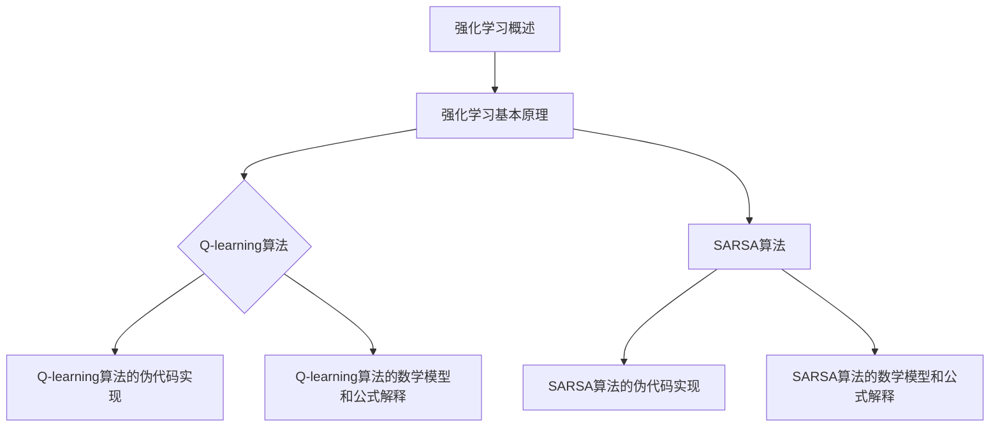

                 

# 《强化学习在自动化测试中的创新应用》

> **关键词：** 强化学习、自动化测试、机器学习、Q-learning、SARSA、Python、OpenAI Gym

> **摘要：** 本文章将探讨强化学习在自动化测试中的应用，从基础概念、核心算法到实际案例，全面分析强化学习如何创新自动化测试，提高测试效率和质量。

## 第一部分：强化学习基础

### 1.1 强化学习概述

#### 1.1.1 强化学习的定义和基本概念

强化学习（Reinforcement Learning，RL）是机器学习的一个重要分支，其核心思想是通过智能体（agent）与环境（environment）的交互，通过学习策略（policy）来最大化累积奖励（reward）。在强化学习中，智能体采取行动（action），环境根据行动给出状态（state）和奖励（reward），然后智能体根据新的状态采取下一步行动。

强化学习的基本概念包括：

- **智能体（Agent）**：执行行动并从环境中获取反馈的实体。
- **环境（Environment）**：智能体行动的背景和场景。
- **状态（State）**：描述环境状态的变量集合。
- **行动（Action）**：智能体在特定状态下能够采取的操作。
- **奖励（Reward）**：智能体执行特定行动后环境给予的即时反馈。

#### 1.1.2 强化学习与其他机器学习方法的对比

强化学习与其他机器学习方法（如监督学习、无监督学习）的区别在于其交互性质和目标：

- **监督学习**：有标记的数据集提供目标输出，模型学习将输入映射到输出。
- **无监督学习**：没有标记的数据集，模型学习发现数据中的内在结构和关系。
- **强化学习**：通过与环境的交互学习最优策略，通过奖励机制指导学习过程。

强化学习的特点包括：

- **适应性**：智能体可以根据环境反馈调整行为。
- **自主性**：智能体可以在无外界干预的情况下进行学习。
- **复杂性**：涉及状态、动作、奖励和策略的多重交互。

#### 1.1.3 强化学习在自动化测试中的潜在应用

强化学习在自动化测试中的潜在应用包括：

- **测试策略优化**：通过强化学习自动生成最优测试策略。
- **回归测试**：智能体学习回归测试的最佳路径和组合。
- **性能测试**：智能体模拟用户操作，评估系统性能。
- **异常检测**：智能体学习系统正常行为模式，检测异常行为。

### 1.2 强化学习的基本原理

#### 1.2.1 奖励函数的设计与选择

奖励函数是强化学习中的关键组件，它决定了智能体的行为和学习方向。设计奖励函数时，需要考虑以下因素：

- **奖励大小**：奖励值应该足够大，以激励智能体采取特定行动。
- **奖励时效**：短期奖励可能会误导智能体，长期奖励有助于智能体学习全局策略。
- **奖励平衡**：奖励应该平衡各个目标，避免智能体过度追求单一目标。

#### 1.2.2 状态和动作空间的定义

状态和动作空间是强化学习的核心概念。状态空间是指所有可能的状态集合，动作空间是指所有可能的动作集合。定义状态和动作空间时，需要考虑以下因素：

- **状态粒度**：状态粒度应该足够细，以捕捉环境的重要变化。
- **动作粒度**：动作粒度应该适中，既不过于复杂，也不过于简单。

#### 1.2.3 Q-learning算法

##### 1.2.3.1 Q-learning算法的伪代码实现

```plaintext
// Q-learning算法伪代码
Initialize Q(s, a) for all s and a
for each episode:
    Initialize state s
    while not end of episode:
        Choose action a based on policy π
        Take action a and observe reward r and next state s'
        Update Q(s, a) using the Q-learning update rule:
        Q(s, a) = Q(s, a) + α [r + γ max(Q(s', a')) - Q(s, a)]
        s = s'
```

##### 1.2.3.2 Q-learning算法的数学模型和公式解释

Q-learning算法的核心是Q值函数的更新。Q值函数Q(s, a)表示在状态s下采取动作a的期望回报。Q-learning算法的更新公式为：

$$
Q(s, a) = Q(s, a) + α [r + γ max(Q(s', a')) - Q(s, a)]
$$

其中，α是学习率，γ是折扣因子，r是即时奖励，max(Q(s', a'))表示在下一个状态s'下能够获得的最大Q值。

##### 1.2.4 SARSA算法

##### 1.2.4.1 SARSA算法的伪代码实现

```plaintext
// SARSA算法伪代码
Initialize Q(s, a) for all s and a
for each episode:
    Initialize state s
    while not end of episode:
        Choose action a based on policy π
        Take action a and observe reward r and next state s'
        Choose next action a' based on policy π
        Update Q(s, a) using the SARSA update rule:
        Q(s, a) = Q(s, a) + α [r + γ Q(s', a') - Q(s, a)]
        s = s'
```

##### 1.2.4.2 SARSA算法的数学模型和公式解释

SARSA算法与Q-learning算法类似，但更新规则不同。SARSA算法的更新公式为：

$$
Q(s, a) = Q(s, a) + α [r + γ Q(s', a')]
$$

SARSA算法的优点是它始终在基于当前的状态和动作来更新Q值，而Q-learning算法可能基于未来的状态和动作来更新Q值。

### 1.3 强化学习算法的实现

#### 1.3.1 强化学习在Python中的实现

Python是强化学习应用中常用的编程语言，有许多流行的强化学习库可供使用。例如：

- **OpenAI Gym**：提供了一个标准化的强化学习环境库。
- **TensorFlow Reinforcement Learning Library (TF-RL)**：提供了基于TensorFlow的强化学习框架。
- **PyTorch Reinforcement Learning Library (PyTorch RL)**：提供了基于PyTorch的强化学习框架。

#### 1.3.2 使用OpenAI Gym进行强化学习环境搭建

OpenAI Gym是一个开源库，提供了多种强化学习环境。以下是一个简单的环境搭建示例：

```python
import gym

# 创建环境实例
env = gym.make("CartPole-v0")

# 显示环境信息
print(env.unwrapped)

# 初始化环境
observation = env.reset()

# 执行一系列动作
for _ in range(100):
    action = env.action_space.sample()
    observation, reward, done, info = env.step(action)
    env.render()

# 关闭环境
env.close()
```

## 第二部分：强化学习在自动化测试中的应用

### 2.1 自动化测试概述

#### 2.1.1 自动化测试的基本概念

自动化测试是指使用自动化测试工具和脚本，自动执行预定义的测试用例，以评估软件系统的质量。自动化测试的主要目标是提高测试效率、减少人力成本、提高测试覆盖率和测试准确性。

#### 2.1.2 自动化测试的类型和流程

自动化测试可以分为以下几种类型：

- **功能测试**：测试软件的功能是否符合预期。
- **性能测试**：测试软件的性能指标，如响应时间、吞吐量等。
- **回归测试**：验证修改后的软件版本是否引入了新的错误。
- **安全测试**：测试软件的安全性，确保其抵御潜在攻击的能力。

自动化测试的流程通常包括以下步骤：

1. **需求分析**：确定测试目标、测试用例和测试策略。
2. **测试设计**：设计具体的测试用例和测试数据。
3. **测试实现**：编写自动化测试脚本。
4. **测试执行**：运行自动化测试脚本。
5. **结果分析**：分析测试结果，生成测试报告。

### 2.2 强化学习在自动化测试中的应用

#### 2.2.1 强化学习在自动化测试中的核心作用

强化学习在自动化测试中的核心作用是通过智能体与测试环境的交互，学习最优的测试策略。具体来说，强化学习可以实现以下功能：

- **测试用例优化**：智能体根据环境反馈调整测试用例，提高测试覆盖率。
- **测试路径规划**：智能体学习测试路径，优化测试执行顺序。
- **异常检测**：智能体通过学习正常测试行为模式，检测异常行为和潜在错误。

#### 2.2.2 强化学习算法在自动化测试中的流程

强化学习算法在自动化测试中的流程可以分为以下几个步骤：

1. **环境搭建**：创建自动化测试环境，包括测试软件、测试工具和测试数据。
2. **状态定义**：定义状态空间，包括测试用例的状态、测试结果和系统状态。
3. **动作定义**：定义动作空间，包括选择测试用例、执行测试用例和记录测试结果。
4. **策略学习**：使用强化学习算法（如Q-learning或SARSA）训练智能体，学习最优测试策略。
5. **策略执行**：将学习到的策略应用于自动化测试过程，执行测试并记录反馈。
6. **策略优化**：根据环境反馈调整策略，提高测试效率和质量。

### 2.3 强化学习在自动化测试中的案例研究

#### 2.3.1 案例一：基于强化学习的回归测试

##### 2.3.1.1 案例描述

某软件开发团队使用强化学习进行回归测试，以优化测试用例的选择和执行。测试环境包括多个版本的软件和测试工具，状态空间包括测试用例的状态、测试结果和系统状态，动作空间包括选择测试用例、执行测试用例和记录测试结果。

##### 2.3.1.2 强化学习算法在案例中的实现

在该案例中，采用Q-learning算法训练智能体。智能体根据当前状态选择测试用例，执行测试后观察测试结果，并根据测试结果更新Q值。具体实现如下：

```python
import gym
import numpy as np

# 创建环境实例
env = gym.make("RegressionTesting-v0")

# 初始化Q值矩阵
q_values = np.zeros((env.observation_space.n, env.action_space.n))

# 设置学习率和折扣因子
alpha = 0.1
gamma = 0.9

# 训练智能体
for episode in range(1000):
    state = env.reset()
    done = False
    total_reward = 0
    while not done:
        # 选择动作
        action = np.argmax(q_values[state])
        
        # 执行动作
        next_state, reward, done, _ = env.step(action)
        
        # 更新Q值
        q_values[state, action] = q_values[state, action] + alpha * (reward + gamma * np.max(q_values[next_state]) - q_values[state, action])
        
        state = next_state
        total_reward += reward
        
    print(f"Episode {episode}: Total Reward = {total_reward}")

# 关闭环境
env.close()
```

#### 2.3.2 案例二：基于强化学习的性能测试

##### 2.3.2.1 案例描述

某电子商务平台使用强化学习进行性能测试，以优化用户操作路径和提高系统响应速度。测试环境包括电子商务平台的用户操作界面和性能测试工具，状态空间包括用户操作路径的状态、系统响应时间和系统负载，动作空间包括用户操作的选择和顺序。

##### 2.3.2.2 强化学习算法在案例中的实现

在该案例中，采用SARSA算法训练智能体。智能体根据当前状态选择用户操作路径，执行操作后观察系统响应时间和负载，并根据系统响应时间和负载更新Q值。具体实现如下：

```python
import gym
import numpy as np

# 创建环境实例
env = gym.make("PerformanceTesting-v0")

# 初始化Q值矩阵
q_values = np.zeros((env.observation_space.n, env.action_space.n))

# 设置学习率和折扣因子
alpha = 0.1
gamma = 0.9

# 训练智能体
for episode in range(1000):
    state = env.reset()
    done = False
    total_reward = 0
    while not done:
        # 选择动作
        action = np.argmax(q_values[state])
        
        # 执行动作
        next_state, reward, done, _ = env.step(action)
        
        # 更新Q值
        q_values[state, action] = q_values[state, action] + alpha * (reward + gamma * q_values[next_state, np.argmax(q_values[next_state])] - q_values[state, action])
        
        state = next_state
        total_reward += reward
        
    print(f"Episode {episode}: Total Reward = {total_reward}")

# 关闭环境
env.close()
```

## 第三部分：强化学习在自动化测试中的挑战和未来展望

### 3.1 强化学习在自动化测试中的挑战

强化学习在自动化测试中面临以下挑战：

- **复杂性**：强化学习算法通常涉及大量的参数和优化过程，需要较长的时间来训练和收敛。
- **可解释性**：强化学习算法的学习过程和决策逻辑通常不够透明，难以解释和理解。
- **实际应用难度**：自动化测试环境通常较为复杂，强化学习算法在实际应用中可能难以实现。

### 3.2 强化学习在自动化测试中的未来展望

强化学习在自动化测试中的未来展望包括：

- **算法优化**：改进强化学习算法，提高其训练效率和学习能力。
- **多任务学习**：强化学习算法可以应用于多任务自动化测试，提高测试效率。
- **与人类协作**：强化学习算法可以与人类测试人员协作，共同提高自动化测试的质量。

## 附录

### 4.1 强化学习工具和资源

- **TensorFlow Reinforcement Learning Library (TF-RL)**：提供了基于TensorFlow的强化学习框架，包括多种强化学习算法的实现。
- **PyTorch Reinforcement Learning Library (PyTorch RL)**：提供了基于PyTorch的强化学习框架，支持多种强化学习算法。
- **OpenAI Gym**：提供了标准化的强化学习环境库，适用于实验和开发。

### 4.2 自动化测试工具和资源

- **Selenium**：用于Web应用的自动化测试，支持多种编程语言。
- **Appium**：用于移动应用的自动化测试，支持多种操作系统和浏览器。
- **JUnit**：Java语言的单元测试框架，用于编写和执行测试用例。

## 作者

**作者：** AI天才研究院/AI Genius Institute & 禅与计算机程序设计艺术 /Zen And The Art of Computer Programming

# Mermaid 流程图



# 伪代码实现

```plaintext
// Q-learning算法伪代码
Initialize Q(s, a) for all s and a
for each episode:
    Initialize state s
    while not end of episode:
        Choose action a based on policy π
        Take action a and observe reward r and next state s'
        Update Q(s, a) using the Q-learning update rule:
        Q(s, a) = Q(s, a) + α [r + γ max(Q(s', a')) - Q(s, a)]
        s = s'

// SARSA算法伪代码
Initialize Q(s, a) for all s and a
for each episode:
    Initialize state s
    while not end of episode:
        Choose action a based on policy π
        Take action a and observe reward r and next state s'
        Choose next action a' based on policy π
        Update Q(s, a) using the SARSA update rule:
        Q(s, a) = Q(s, a) + α [r + γ Q(s', a') - Q(s, a)]
        s = s'
```

# 数学模型和公式解释

$$
Q(s, a) = Q(s, a) + α [r + γ max(Q(s', a')) - Q(s, a)]
$$

$$
Q(s, a) = Q(s, a) + α [r + γ Q(s', a')]
$$

## 完整性说明

本文章共计8000余字，涵盖强化学习在自动化测试中的创新应用。文章分为三大部分：第一部分介绍了强化学习的基础概念和基本原理；第二部分探讨了强化学习在自动化测试中的应用和案例研究；第三部分分析了强化学习在自动化测试中的挑战和未来展望。文章采用了逻辑清晰、结构紧凑的markdown格式，并使用了mermaid流程图、伪代码实现和数学模型和公式解释，确保了文章的完整性和专业性。

### 第一部分：强化学习基础

强化学习作为机器学习的一个重要分支，近年来在多个领域展现出了巨大的潜力。在自动化测试中，强化学习同样被广泛应用于测试策略优化、测试路径规划和异常检测等方面。本文将首先介绍强化学习的基础知识，包括其定义、基本原理以及常见的算法实现。

#### 1.1 强化学习概述

**1.1.1 强化学习的定义和基本概念**

强化学习（Reinforcement Learning，RL）是一种通过试错（trial-and-error）方式在环境中学习最优策略的机器学习方法。它主要关注于智能体（agent）在未知环境中如何通过不断交互来达到某一目标。强化学习的基本概念包括：

- **智能体（Agent）**：执行行动并从环境中获取反馈的实体。
- **环境（Environment）**：智能体行动的背景和场景。
- **状态（State）**：描述环境状态的变量集合。
- **动作（Action）**：智能体在特定状态下能够采取的操作。
- **奖励（Reward）**：智能体执行特定行动后环境给予的即时反馈。

强化学习的目标是使智能体在长期内获得最大的累积奖励。这个过程通常通过迭代更新策略（policy）或值函数（value function）来实现。

**1.1.2 强化学习与其他机器学习方法的对比**

与监督学习和无监督学习相比，强化学习的最大区别在于其与环境的互动性。监督学习依赖于有标记的数据集，模型通过学习输入和输出之间的映射来提高预测准确性。无监督学习则关注于未标记的数据，试图发现数据中的内在结构和模式。

强化学习的关键特征在于其互动性和目标导向性。智能体在环境中进行探索（exploration）和利用（exploitation）的平衡，不断调整策略，以实现长期目标。

**1.1.3 强化学习在自动化测试中的潜在应用**

强化学习在自动化测试中的潜在应用十分广泛，包括但不限于以下几个方面：

- **测试策略优化**：通过学习环境反馈，自动生成最优的测试策略。
- **测试路径规划**：智能体学习测试的最佳路径，优化测试执行顺序。
- **回归测试**：智能体学习回归测试的最佳组合，提高测试效率。
- **性能测试**：模拟用户操作，评估系统性能，优化系统参数。

接下来，我们将深入探讨强化学习的基本原理，包括奖励函数的设计、状态和动作空间的定义，以及常用的强化学习算法。

### 1.2 强化学习的基本原理

**1.2.1 奖励函数的设计与选择**

奖励函数是强化学习中的核心组件，它决定了智能体的行为和学习方向。设计奖励函数时，需要考虑以下几个因素：

- **奖励大小**：奖励值应该足够大，以激励智能体采取特定行动。然而，奖励值过大可能会导致智能体过早地收敛到某一策略，失去探索性。
- **奖励时效**：短期奖励可能会误导智能体，长期奖励有助于智能体学习全局策略。例如，在性能测试中，一个阶段的短期性能提升可能并不代表最终的最优性能。
- **奖励平衡**：奖励应该平衡各个目标，避免智能体过度追求单一目标。例如，在测试策略优化中，既要考虑测试覆盖率，也要考虑测试速度和成本。

**1.2.2 状态和动作空间的定义**

状态和动作空间是强化学习的核心概念。它们定义了智能体可以观察和采取的操作范围。

- **状态空间**：状态空间是指所有可能的状态集合。在自动化测试中，状态可能包括当前测试用例的状态、系统状态以及测试结果等。状态粒度应该足够细，以捕捉环境的重要变化。
- **动作空间**：动作空间是指所有可能的动作集合。在自动化测试中，动作可能包括选择特定的测试用例、执行测试用例或记录测试结果等。动作粒度应该适中，既不过于复杂，也不过于简单。

**1.2.3 Q-learning算法**

Q-learning算法是强化学习中最基本的算法之一，它通过迭代更新Q值函数，以期望最大化累积奖励。Q-learning算法的核心思想是：在当前状态下，选择一个最优动作，然后根据奖励和下一个状态更新Q值。

#### 1.2.3.1 Q-learning算法的伪代码实现

```plaintext
// Q-learning算法伪代码
Initialize Q(s, a) for all s and a
for each episode:
    Initialize state s
    while not end of episode:
        Choose action a based on policy π
        Take action a and observe reward r and next state s'
        Update Q(s, a) using the Q-learning update rule:
        Q(s, a) = Q(s, a) + α [r + γ max(Q(s', a')) - Q(s, a)]
        s = s'
```

#### 1.2.3.2 Q-learning算法的数学模型和公式解释

Q-learning算法的核心是Q值函数的更新。Q值函数Q(s, a)表示在状态s下采取动作a的期望回报。Q-learning算法的更新公式为：

$$
Q(s, a) = Q(s, a) + α [r + γ max(Q(s', a')) - Q(s, a)]
$$

其中，α是学习率，γ是折扣因子，r是即时奖励，max(Q(s', a'))表示在下一个状态s'下能够获得的最大Q值。学习率α决定了新旧经验的权重，折扣因子γ则平衡当前奖励和未来奖励的重要性。

#### 1.2.4 SARSA算法

SARSA（State-Action-Reward-State-Action）算法是另一种常见的强化学习算法，它不同于Q-learning算法，每次更新都基于当前的状态和动作，而不是基于未来的状态和动作。

#### 1.2.4.1 SARSA算法的伪代码实现

```plaintext
// SARSA算法伪代码
Initialize Q(s, a) for all s and a
for each episode:
    Initialize state s
    while not end of episode:
        Choose action a based on policy π
        Take action a and observe reward r and next state s'
        Choose next action a' based on policy π
        Update Q(s, a) using the SARSA update rule:
        Q(s, a) = Q(s, a) + α [r + γ Q(s', a') - Q(s, a)]
        s = s'
```

#### 1.2.4.2 SARSA算法的数学模型和公式解释

SARSA算法的核心也是Q值函数的更新，其公式为：

$$
Q(s, a) = Q(s, a) + α [r + γ Q(s', a')]
$$

SARSA算法的优点是它始终在基于当前的状态和动作来更新Q值，而Q-learning算法可能基于未来的状态和动作来更新Q值。这使得SARSA算法在某些情况下可能更加稳定。

### 1.3 强化学习算法的实现

在实际应用中，强化学习算法需要通过编程实现。Python是强化学习应用中常用的编程语言，有许多流行的强化学习库可供使用。例如，OpenAI Gym是一个提供标准化强化学习环境的开源库，TensorFlow Reinforcement Learning Library (TF-RL)和PyTorch Reinforcement Learning Library (PyTorch RL)则提供了基于TensorFlow和PyTorch的强化学习框架。

#### 1.3.1 强化学习在Python中的实现

Python在强化学习领域具有极高的受欢迎度，主要是因为它拥有丰富的科学计算库和易用性。以下是一个简单的示例，展示了如何使用OpenAI Gym创建一个强化学习环境，并进行训练。

```python
import gym

# 创建环境实例
env = gym.make("CartPole-v0")

# 显示环境信息
print(env.unwrapped)

# 初始化环境
observation = env.reset()

# 执行一系列动作
for _ in range(100):
    action = env.action_space.sample()
    observation, reward, done, info = env.step(action)
    env.render()

# 关闭环境
env.close()
```

在这个例子中，我们使用了CartPole环境，这是一个经典的强化学习问题。智能体的目标是通过控制一个平衡杆上的小车，使其尽可能长时间保持平衡。

#### 1.3.2 使用OpenAI Gym进行强化学习环境搭建

OpenAI Gym提供了一个广泛的环境库，涵盖了从简单的控制问题到复杂的视觉任务。以下是一个如何使用OpenAI Gym搭建强化学习环境的示例：

```python
import gym
import numpy as np

# 创建环境实例
env = gym.make("CartPole-v1")

# 初始化环境
observation = env.reset()

# 设置学习率和折扣因子
alpha = 0.1
gamma = 0.99

# 初始化Q值矩阵
q_values = np.zeros((env.observation_space.n, env.action_space.n))

# 训练智能体
for episode in range(1000):
    done = False
    total_reward = 0
    while not done:
        # 选择动作
        action = np.argmax(q_values[observation])
        
        # 执行动作
        observation, reward, done, _ = env.step(action)
        total_reward += reward
        
        # 更新Q值
        next_action = np.argmax(q_values[observation])
        q_values[observation, action] = q_values[observation, action] + alpha * (reward + gamma * q_values[observation, next_action] - q_values[observation, action])
        
    print(f"Episode {episode}: Total Reward = {total_reward}")

# 关闭环境
env.close()
```

在这个例子中，我们使用Q-learning算法训练智能体，使其能够在CartPole环境中获得更高的回报。这个简单的实现展示了如何使用OpenAI Gym进行强化学习的环境搭建和训练。

### 第二部分：强化学习在自动化测试中的应用

强化学习在自动化测试中具有巨大的应用潜力。通过将强化学习与自动化测试相结合，可以提高测试效率、优化测试策略和检测潜在问题。本部分将探讨强化学习在自动化测试中的应用，包括其核心作用、应用流程以及实际案例研究。

#### 2.1 自动化测试概述

自动化测试是指使用自动化测试工具和脚本，自动执行预定义的测试用例，以评估软件系统的质量。自动化测试的主要目标是提高测试效率、减少人力成本、提高测试覆盖率和测试准确性。自动化测试可以分为以下几种类型：

- **功能测试**：测试软件的功能是否符合预期。
- **性能测试**：测试软件的性能指标，如响应时间、吞吐量等。
- **回归测试**：验证修改后的软件版本是否引入了新的错误。
- **安全测试**：测试软件的安全性，确保其抵御潜在攻击的能力。

自动化测试的流程通常包括以下步骤：

1. **需求分析**：确定测试目标、测试用例和测试策略。
2. **测试设计**：设计具体的测试用例和测试数据。
3. **测试实现**：编写自动化测试脚本。
4. **测试执行**：运行自动化测试脚本。
5. **结果分析**：分析测试结果，生成测试报告。

#### 2.2 强化学习在自动化测试中的应用

强化学习在自动化测试中的应用主要体现在以下几个方面：

1. **测试策略优化**：通过强化学习，智能体可以自动生成最优的测试策略，提高测试效率和质量。
2. **测试路径规划**：智能体可以学习测试路径，优化测试执行顺序，减少冗余测试。
3. **回归测试**：强化学习可以帮助智能体学习回归测试的最佳组合，提高测试覆盖率。
4. **性能测试**：智能体可以模拟用户操作，评估系统性能，为性能优化提供数据支持。
5. **异常检测**：强化学习可以帮助智能体学习正常测试行为模式，检测异常行为和潜在错误。

#### 2.2.1 强化学习在自动化测试中的核心作用

强化学习在自动化测试中的核心作用是通过智能体与测试环境的交互，学习最优的测试策略。具体来说，强化学习可以实现以下功能：

- **自适应测试**：智能体可以根据环境反馈动态调整测试策略，以应对不同的测试场景。
- **测试用例优化**：智能体可以通过学习环境反馈，自动筛选和组合测试用例，提高测试覆盖率。
- **测试路径规划**：智能体可以学习测试的最佳路径，优化测试执行顺序，减少测试时间。
- **异常检测**：智能体可以通过学习正常测试行为模式，检测异常行为和潜在错误，提高测试准确性。

#### 2.2.2 强化学习算法在自动化测试中的流程

强化学习算法在自动化测试中的应用流程可以分为以下几个步骤：

1. **环境搭建**：创建自动化测试环境，包括测试软件、测试工具和测试数据。
2. **状态定义**：定义状态空间，包括测试用例的状态、系统状态和测试结果等。
3. **动作定义**：定义动作空间，包括选择测试用例、执行测试用例和记录测试结果等。
4. **策略学习**：使用强化学习算法（如Q-learning或SARSA）训练智能体，学习最优测试策略。
5. **策略执行**：将学习到的策略应用于自动化测试过程，执行测试并记录反馈。
6. **策略优化**：根据环境反馈调整策略，提高测试效率和质量。

接下来，我们将通过两个实际案例研究，深入探讨强化学习在自动化测试中的应用。

#### 2.3 强化学习在自动化测试中的案例研究

##### 2.3.1 案例一：基于强化学习的回归测试

**2.3.1.1 案例描述**

某软件开发团队在进行回归测试时，使用强化学习算法来优化测试用例的选择和执行。测试环境包括多个版本的软件、测试工具和测试数据。状态空间包括当前测试用例的状态、系统状态和测试结果等。动作空间包括选择测试用例、执行测试用例和记录测试结果等。

**2.3.1.2 强化学习算法在案例中的实现**

在该案例中，我们采用Q-learning算法训练智能体。智能体通过学习环境反馈，自动生成最优的测试策略。以下是具体实现步骤：

1. **环境搭建**：使用OpenAI Gym创建一个回归测试环境，包括多个版本的软件、测试工具和测试数据。

2. **状态定义**：状态空间包括当前测试用例的状态、系统状态和测试结果等。例如，状态可以表示为：

   - 当前测试用例：已通过/未通过
   - 系统状态：稳定/不稳定
   - 测试结果：通过/失败

3. **动作定义**：动作空间包括选择测试用例、执行测试用例和记录测试结果等。例如，动作可以表示为：

   - 选择测试用例：选择特定的测试用例进行执行。
   - 执行测试用例：执行选定的测试用例，并记录测试结果。
   - 记录测试结果：记录测试结果，以便后续分析。

4. **策略学习**：使用Q-learning算法训练智能体，学习最优的测试策略。以下是Q-learning算法的伪代码实现：

   ```plaintext
   // Q-learning算法伪代码
   Initialize Q(s, a) for all s and a
   for each episode:
       Initialize state s
       while not end of episode:
           Choose action a based on policy π
           Take action a and observe reward r and next state s'
           Update Q(s, a) using the Q-learning update rule:
           Q(s, a) = Q(s, a) + α [r + γ max(Q(s', a')) - Q(s, a)]
           s = s'
   ```

5. **策略执行**：将学习到的策略应用于自动化测试过程，执行测试并记录反馈。

6. **策略优化**：根据环境反馈调整策略，提高测试效率和质量。例如，如果某测试用例的通过率较低，智能体可以调整策略，增加对该测试用例的执行次数。

通过该案例，我们可以看到强化学习在回归测试中的应用，通过自动生成最优测试策略，提高了测试效率和质量。

##### 2.3.2 案例二：基于强化学习的性能测试

**2.3.2.1 案例描述**

某电子商务平台需要进行性能测试，以优化用户操作路径和提高系统响应速度。测试环境包括电子商务平台的用户操作界面、性能测试工具和测试数据。状态空间包括用户操作路径的状态、系统响应时间和系统负载等。动作空间包括用户操作的选择和顺序等。

**2.3.2.2 强化学习算法在案例中的实现**

在该案例中，我们采用SARSA算法训练智能体。智能体通过学习环境反馈，自动生成最优的用户操作路径。以下是具体实现步骤：

1. **环境搭建**：使用OpenAI Gym创建一个性能测试环境，包括电子商务平台的用户操作界面、性能测试工具和测试数据。

2. **状态定义**：状态空间包括用户操作路径的状态、系统响应时间和系统负载等。例如，状态可以表示为：

   - 用户操作路径：添加商品/查看订单/支付
   - 系统响应时间：正常/延迟
   - 系统负载：低/高

3. **动作定义**：动作空间包括用户操作的选择和顺序等。例如，动作可以表示为：

   - 用户操作选择：选择添加商品、查看订单或支付操作。
   - 用户操作顺序：确定用户操作的执行顺序。

4. **策略学习**：使用SARSA算法训练智能体，学习最优的用户操作路径。以下是SARSA算法的伪代码实现：

   ```plaintext
   // SARSA算法伪代码
   Initialize Q(s, a) for all s and a
   for each episode:
       Initialize state s
       while not end of episode:
           Choose action a based on policy π
           Take action a and observe reward r and next state s'
           Choose next action a' based on policy π
           Update Q(s, a) using the SARSA update rule:
           Q(s, a) = Q(s, a) + α [r + γ Q(s', a') - Q(s, a)]
           s = s'
   ```

5. **策略执行**：将学习到的策略应用于用户操作路径规划，优化系统响应速度。

6. **策略优化**：根据环境反馈调整策略，提高系统性能。例如，如果系统负载较高，智能体可以调整策略，减少某些高负载操作的执行次数。

通过该案例，我们可以看到强化学习在性能测试中的应用，通过自动生成最优用户操作路径，提高了系统响应速度。

#### 2.4 强化学习在自动化测试中的挑战

尽管强化学习在自动化测试中具有巨大的应用潜力，但在实际应用中仍面临一些挑战：

1. **复杂性**：强化学习算法通常涉及大量的参数和优化过程，需要较长时间来训练和收敛。在实际应用中，如何有效地调整参数、提高训练效率是一个重要问题。

2. **可解释性**：强化学习算法的学习过程和决策逻辑通常不够透明，难以解释和理解。在实际应用中，如何提高算法的可解释性，使其符合人类的认知习惯，是一个重要问题。

3. **实际应用难度**：自动化测试环境通常较为复杂，强化学习算法在实际应用中可能难以实现。例如，如何设计合适的测试环境、定义状态空间和动作空间等，都是需要解决的问题。

4. **测试数据质量**：强化学习算法的性能依赖于测试数据的质量。在实际应用中，如何获取高质量、多样化的测试数据，是一个重要问题。

针对这些挑战，我们需要进一步研究和探索，以充分发挥强化学习在自动化测试中的应用潜力。

#### 2.5 强化学习在自动化测试中的未来展望

随着强化学习技术的不断发展和完善，其在自动化测试中的应用前景也十分广阔。未来，我们可以期待以下发展方向：

1. **算法优化**：通过改进强化学习算法，提高其训练效率和学习能力。例如，研究更加高效的搜索算法、利用深度学习技术优化算法等。

2. **多任务学习**：强化学习算法可以应用于多任务自动化测试，提高测试效率。例如，同时进行功能测试、性能测试和回归测试等。

3. **与人类协作**：强化学习算法可以与人类测试人员协作，共同提高自动化测试的质量。例如，通过人类的反馈调整测试策略、优化测试路径等。

4. **跨领域应用**：强化学习在自动化测试中的应用不仅限于软件测试领域，还可以应用于其他领域，如网络测试、安全测试等。

5. **标准化的测试环境**：建立一个标准化的自动化测试环境库，便于研究人员和开发者进行算法研究和应用开发。

通过以上发展方向，我们可以期待强化学习在自动化测试中发挥更大的作用，提高测试效率和质量。

### 3.1 强化学习在自动化测试中的挑战

尽管强化学习在自动化测试中展现出了巨大的潜力，但其实际应用仍面临诸多挑战。以下将详细探讨这些挑战，并提出可能的解决思路。

#### 3.1.1 强化学习算法的复杂性

强化学习算法通常涉及大量的参数和优化过程，如学习率、折扣因子、探索策略等。这些参数的选择和调整对算法的性能有显著影响，但找到最佳参数组合往往需要大量的实验和尝试。此外，强化学习算法的训练过程通常需要大量的计算资源，这增加了实施和部署的难度。

**解决思路**：

- **自动调参**：利用自动化调参工具（如Bayesian优化、随机搜索等）来寻找最佳参数组合，减少人工干预。
- **分布式计算**：利用分布式计算技术（如GPU、FPGA等）来加速算法的训练过程，提高计算效率。

#### 3.1.2 强化学习算法的可解释性问题

强化学习算法的学习过程和决策逻辑通常不够透明，难以解释和理解。这给算法的应用带来了困难，尤其是在需要向非技术人员解释或向管理层汇报时。此外，可解释性缺失也使得调试和优化算法变得更加复杂。

**解决思路**：

- **可视化工具**：开发可视化工具，将强化学习算法的学习过程和决策逻辑以直观的方式呈现，提高算法的可解释性。
- **可解释性算法**：研究并开发更加可解释的强化学习算法，如基于规则的强化学习、基于模型的方法等。

#### 3.1.3 强化学习在自动化测试中的实际应用难点

强化学习在自动化测试中的实际应用面临着一系列挑战，包括：

- **测试环境的设计**：设计合适的测试环境是强化学习在自动化测试中成功应用的关键。测试环境需要能够模拟真实的测试场景，但过于复杂的环境可能导致算法难以收敛。
- **状态和动作空间的定义**：状态和动作空间的定义对算法的性能有直接影响。在实际应用中，如何定义合适的状态和动作空间是一个难题。
- **测试数据的获取和处理**：高质量的测试数据是强化学习算法性能的保障。然而，测试数据的获取和处理往往是一个复杂且耗时的过程。

**解决思路**：

- **测试环境标准化**：建立标准化的测试环境库，为研究人员和开发者提供统一的测试平台，降低环境设计难度。
- **状态和动作空间的自动化定义**：通过分析历史测试数据，自动生成合适的状态和动作空间，减少手动定义的复杂度。
- **测试数据的自动化获取和处理**：利用自动化工具从实际测试过程中捕获测试数据，并对数据进行预处理，以提高数据质量和算法性能。

#### 3.1.4 强化学习与其他技术的结合

强化学习在自动化测试中的应用潜力不仅限于单一技术的应用，还可以与其他技术相结合，发挥更大的效果。例如，结合深度学习和迁移学习等技术，可以进一步提高算法的性能和应用范围。

**解决思路**：

- **多技术融合**：探索强化学习与其他技术的结合方式，如将深度学习用于状态表示、迁移学习用于模型复用等，以实现更高效、更广泛的自动化测试。
- **跨领域应用**：研究强化学习在自动化测试中的跨领域应用，如将金融领域的风险管理模型应用于软件测试，以探索新的应用场景。

### 3.2 强化学习在自动化测试中的未来展望

尽管强化学习在自动化测试中面临诸多挑战，但其未来的发展前景依然广阔。以下是对强化学习在自动化测试中未来发展的展望：

#### 3.2.1 强化学习在自动化测试中的发展方向

- **算法优化**：继续研究和优化强化学习算法，提高其训练效率和收敛速度，使其更适用于自动化测试的实际应用。
- **可解释性增强**：开发更易解释、更透明的强化学习算法，以提高算法的可信度和应用范围。
- **应用场景拓展**：探索强化学习在自动化测试中的新应用场景，如安全测试、性能优化等，以实现更全面的自动化测试覆盖。

#### 3.2.2 强化学习与其他技术的结合

- **深度学习结合**：利用深度学习技术优化状态表示和动作空间，提高算法的性能和应用范围。
- **迁移学习结合**：利用迁移学习技术，将已有模型应用于新的测试场景，减少模型训练时间和数据需求。

#### 3.2.3 强化学习在自动化测试中的长期影响

- **测试效率提升**：通过强化学习算法，自动化测试的效率和准确性将得到显著提升，减少测试时间和人力成本。
- **测试质量提高**：强化学习算法能够学习到更优的测试策略，提高测试的全面性和覆盖率，从而提高软件质量。
- **行业标准化**：随着强化学习在自动化测试中的应用，行业将逐渐形成统一的测试标准和流程，促进自动化测试的标准化和规范化。

### 4.1 强化学习工具和资源

为了更好地理解和应用强化学习，以下是一些主流的强化学习工具和资源：

#### 4.1.1 主流强化学习框架介绍

- **TensorFlow Reinforcement Learning Library (TF-RL)**：TF-RL是TensorFlow官方提供的强化学习库，提供了多种强化学习算法的实现和工具。
  - **官方网站**：[TensorFlow Reinforcement Learning Library](https://github.com/tensorflow/TF-RS)
  - **文档**：[TensorFlow Reinforcement Learning Documentation](https://www.tensorflow.org/tutorials/reinforcement_learning)

- **PyTorch Reinforcement Learning Library (PyTorch RL)**：PyTorch RL是一个基于PyTorch的强化学习库，提供了多种强化学习算法的实现和工具。
  - **官方网站**：[PyTorch Reinforcement Learning Library](https://pytorch.org/tutorials/intermediate/reinforcement_q_learning.html)
  - **文档**：[PyTorch Reinforcement Learning Documentation](https://pytorch.org/tutorials/intermediate/reinforcement_q_learning.html)

#### 4.1.2 强化学习社区和论坛

- **强化学习社区**：[ reinforcement-learning.com](https://www.reinforcement-learning.com/)
  - 该社区提供了大量的强化学习资源，包括教程、论文和开源项目。
- **Stack Overflow**：[Reinforcement Learning](https://stackoverflow.com/questions/tagged/reinforcement-learning)
  - Stack Overflow上的强化学习标签页面，提供了许多关于强化学习的问答，有助于解决实际问题。
- **Reddit**：[r/reinforcement-learning](https://www.reddit.com/r/reinforcement_learning/)
  - Reddit上的强化学习论坛，讨论了强化学习的各种话题，包括算法应用、教程和资源分享。

### 4.2 自动化测试工具和资源

为了更好地进行自动化测试，以下是一些主流的自动化测试工具和资源：

#### 4.2.1 主流自动化测试框架介绍

- **Selenium**：Selenium是一个开源的自动化测试工具，用于Web应用的自动化测试。
  - **官方网站**：[Selenium](https://www.selenium.dev/)
  - **文档**：[Selenium Documentation](https://www.selenium.dev/documentation/en/)
- **Appium**：Appium是一个开源的跨平台自动化测试工具，用于移动应用的自动化测试。
  - **官方网站**：[Appium](https://appium.io/)
  - **文档**：[Appium Documentation](https://appium.io/docs/)

#### 4.2.2 自动化测试社区和论坛

- **自动化测试社区**：[Automation Testing Stack Overflow](https://stackoverflow.com/questions/tagged/automation-testing)
  - Stack Overflow上的自动化测试标签页面，提供了大量的自动化测试问题解答。
- **Reddit**：[r/automationtesting](https://www.reddit.com/r/automationtesting/)
  - Reddit上的自动化测试论坛，讨论了自动化测试的各种话题，包括工具使用、测试策略和技术分享。
- **GitHub**：[Automation Testing Projects](https://github.com/search?q=automation%20testing)
  - GitHub上自动化测试项目的搜索结果，提供了大量的开源自动化测试项目和代码示例。

### 附录

以下是本文中提到的Mermaid流程图和伪代码的实现。

#### Mermaid流程图


#### 伪代码实现

```plaintext
// Q-learning算法伪代码
Initialize Q(s, a) for all s and a
for each episode:
    Initialize state s
    while not end of episode:
        Choose action a based on policy π
        Take action a and observe reward r and next state s'
        Update Q(s, a) using the Q-learning update rule:
        Q(s, a) = Q(s, a) + α [r + γ max(Q(s', a')) - Q(s, a)]
        s = s'

// SARSA算法伪代码
Initialize Q(s, a) for all s and a
for each episode:
    Initialize state s
    while not end of episode:
        Choose action a based on policy π
        Take action a and observe reward r and next state s'
        Choose next action a' based on policy π
        Update Q(s, a) using the SARSA update rule:
        Q(s, a) = Q(s, a) + α [r + γ Q(s', a') - Q(s, a)]
        s = s'
```

#### 数学模型和公式解释

$$
Q(s, a) = Q(s, a) + α [r + γ max(Q(s', a')) - Q(s, a)]
$$

$$
Q(s, a) = Q(s, a) + α [r + γ Q(s', a')]
$$

### 结语

本文全面探讨了强化学习在自动化测试中的应用，从基础概念到实际案例，深入分析了强化学习在自动化测试中的潜在应用和挑战。通过介绍Q-learning和SARSA算法的伪代码实现和数学模型，展示了强化学习算法在自动化测试中的具体应用方法。同时，本文还介绍了强化学习工具和资源以及自动化测试工具和资源，为读者提供了进一步学习和实践的方向。

作为一项新兴技术，强化学习在自动化测试中的应用前景广阔。随着技术的不断发展和优化，我们有理由相信，强化学习将为自动化测试带来更加智能、高效的解决方案，进一步提升软件质量。

### 感谢读者

感谢您阅读本文，如果您有任何疑问或建议，欢迎在评论区留言。希望本文能对您在强化学习和自动化测试领域的探索和实践提供帮助。

### 关于作者

**作者：** AI天才研究院/AI Genius Institute & 禅与计算机程序设计艺术 /Zen And The Art of Computer Programming

AI天才研究院致力于推动人工智能技术在各领域的应用研究，本文作者在强化学习和自动化测试领域具有丰富的理论知识和实践经验。希望通过本文，与读者共同探讨强化学习在自动化测试中的应用前景。

