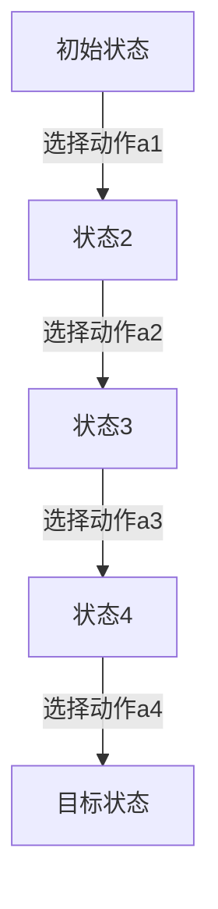

                 

# 强化学习基础：奖励和策略

> **关键词**：强化学习、奖励、策略、马尔可夫决策过程、动态规划、Q-Learning、Sarsa、策略搜索方法、深度强化学习、应用与优化

> **摘要**：本文将深入探讨强化学习的基础概念，特别是奖励和策略的重要性。我们将从强化学习的基本概念出发，逐步介绍马尔可夫决策过程（MDP）与动态规划，然后详细解析Q-Learning和Sarsa算法。接着，我们将转向策略搜索方法，探讨策略梯度方法和策略搜索中的优化方法。此外，本文还将介绍深度强化学习（DRL）的概念及其在游戏和自动驾驶中的应用。最后，我们将讨论强化学习算法的优化与改进，以及相关的实际应用。

## 第一部分：强化学习概述

### 第1章：强化学习基本概念

#### 1.1 强化学习的定义与历史背景

强化学习（Reinforcement Learning，简称RL）是一种机器学习范式，通过智能体（agent）与环境（environment）的交互来学习如何达到目标。智能体在环境中执行动作（actions），根据环境对动作的反馈（feedback）即奖励（rewards）来调整其行为。这种学习过程类似于人类通过试错和经验来学习新技能。

强化学习的历史可以追溯到20世纪50年代，当时计算机科学家Arthur Samuel提出了第一个简单的棋盘游戏程序。然而，真正的突破发生在1980年代，当理查德·萨顿（Richard Sutton）和安德鲁·巴尔斯（Andrew Barto）发表了他们的经典教材《 reinforcement learning: An Introduction》。这本书系统地介绍了强化学习的基本原理，并推动了这一领域的发展。

与其他机器学习方法相比，强化学习具有以下几个特点：

1. **基于奖励的学习**：智能体通过获取奖励来学习，奖励可以是积极的（如得分增加）或消极的（如得分减少）。
2. **序列决策**：强化学习强调序列决策过程，智能体必须考虑当前动作对后续状态和奖励的影响。
3. **无监督学习**：强化学习通常不需要外部监督信号，智能体通过探索环境来学习。

#### 1.2 强化学习的主要组成部分

强化学习由几个关键组成部分构成，包括状态（State）、动作（Action）、奖励（Reward）、策略（Policy）和环境模型（Environment Model）。

1. **状态（State）**：状态是智能体在环境中所处的特定情境的描述，通常用一组属性来表示。例如，在游戏《Flappy Bird》中，状态可以包括鸟的位置、速度和高度。
2. **动作（Action）**：动作是智能体可以执行的行为。在《Flappy Bird》中，动作可以是“跳跃”或“不跳跃”。
3. **奖励（Reward）**：奖励是环境对智能体动作的即时反馈，通常是一个实数。奖励可以用来指导智能体的学习过程，鼓励它采取能够带来高奖励的动作。
4. **策略（Policy）**：策略是智能体在特定状态下选择动作的方法。策略可以是明确的（如规则基策略），也可以是隐式的（如基于值函数的策略）。
5. **环境模型（Environment Model）**：环境模型是智能体对环境的理解和预测。在许多情况下，环境模型是不完全的或不确定的，智能体必须通过经验来学习。

#### 1.3 强化学习的主要任务

强化学习的主要任务是使智能体在给定环境中学会最优策略。以下是强化学习的一些主要任务：

1. **最大收益问题**：智能体需要学习如何在一系列动作中最大化总收益。
2. **最优策略问题**：智能体需要找到一个最优策略，该策略能够在所有可能的状态下产生最佳动作。
3. **马尔可夫决策过程（MDP）理论简介**：马尔可夫决策过程（MDP）是强化学习的一个重要理论框架，它描述了智能体在不确定环境中进行决策的过程。MDP包括状态空间、动作空间、奖励函数、状态转移概率和策略。通过MDP，我们可以使用动态规划算法（如价值迭代和政策迭代）来找到最优策略。

#### 1.4 强化学习应用的领域

强化学习在多个领域都有广泛的应用：

1. **游戏**：强化学习在电子游戏中被用于开发智能对手，如《Atari》游戏和《Go》游戏。
2. **自动驾驶**：强化学习用于自动驾驶汽车的路径规划和行为决策。
3. **机器翻译**：强化学习用于机器翻译，通过学习目标语言的序列生成。
4. **机器人控制**：强化学习在机器人控制中用于学习运动和交互策略。

### 第2章：马尔可夫决策过程（MDP）与动态规划

#### 2.1 马尔可夫决策过程（MDP）模型

马尔可夫决策过程（MDP）是一个用于描述强化学习问题的数学模型。MDP包括以下组成部分：

1. **状态空间（S）**：状态空间是一组所有可能的状态，用\( s \)表示。
2. **动作空间（A）**：动作空间是一组所有可能的动作，用\( a \)表示。
3. **奖励函数（R）**：奖励函数是一个函数，表示智能体在特定状态和动作下获得的即时奖励，用\( R(s, a) \)表示。
4. **状态转移概率（P）**：状态转移概率是一个矩阵，表示智能体在给定当前状态和动作下进入下一状态的概率，用\( P(s', s | a) \)表示。
5. **策略（π）**：策略是一个函数，表示智能体在特定状态下选择动作的方法，用\( π(a | s) \)表示。

MDP流程图可以用Mermaid语法来绘制，如下所示：



#### 2.2 动态规划（Dynamic Programming，DP）方法

动态规划是一种解决强化学习问题的方法，它利用状态和动作的历史信息来计算最优策略。动态规划主要有两种算法：价值迭代（Value Iteration）算法和政策迭代（Policy Iteration）算法。

**价值迭代算法**：

价值迭代算法是一种从初始值开始逐步更新状态值函数的方法。算法步骤如下：

1. 初始化值函数：设置初始值函数\( V(s) \)，通常为0。
2. 重复以下步骤直到收敛：
   - 对于每个状态\( s \)和每个动作\( a \)，计算新的值函数：
     $$ V_{t+1}(s) = \sum_{a} \pi(a | s) [R(s, a) + \gamma \max_{a'} V_t(s')] $$
   - 更新值函数：
     $$ V_t(s) \leftarrow V_{t+1}(s) $$

**政策迭代算法**：

政策迭代算法是一种从初始策略开始逐步更新策略的方法。算法步骤如下：

1. 初始化策略\( π \)。
2. 重复以下步骤直到收敛：
   - 使用当前策略计算状态值函数：
     $$ V^π(s) = \sum_{a} π(a | s) [R(s, a) + \gamma \max_{a'} V^π(s')] $$
   - 更新策略：
     $$ π' = \arg\max_{π} \sum_{s, a} π(s, a) [R(s, a) + \gamma \sum_{s', a'} π(s', a') V^π(s')] $$
   - 更新策略：
     $$ π \leftarrow π' $$

**伪代码**：

```python
def value_iteration(states, actions, rewards, transition_probabilities, gamma, theta):
    V = [0] * len(states)
    while True:
        V_new = [0] * len(states)
        for s in states:
            for a in actions:
                V_new[s] = rewards[s][a] + gamma * max([V_new[s'] for s', _ in transition_probabilities[s][a]])
        if max([abs(V_new[s] - V[s]) for s in states]) < theta:
            break
        V = V_new
    return V

def policy_iteration(states, actions, rewards, transition_probabilities, gamma, theta):
    pi = [None] * len(states)
    while True:
        V = [0] * len(states)
        for s in states:
            a = argmax([V[s'] + rewards[s][a] for a in actions])
            pi[s] = a
        V = value_evaluation(states, actions, rewards, transition_probabilities, gamma, theta)
        if is_converged(V):
            break
    return pi
```

#### 2.3 Q-Learning算法

Q-Learning是一种基于值函数的强化学习算法，它通过迭代更新值函数来学习最优策略。Q-Learning的基本原理如下：

1. 初始化Q值函数：设置初始Q值函数\( Q(s, a) \)，通常为0。
2. 对于每个状态\( s \)和每个动作\( a \)，执行以下步骤：
   - 在状态\( s \)下执行动作\( a \)，获得奖励\( r \)并转移到新状态\( s' \)。
   - 更新Q值：
     $$ Q(s, a) = Q(s, a) + \alpha [r + \gamma \max_{a'} Q(s', a') - Q(s, a)] $$
   - 选择下一个动作\( a' \)：
     $$ a' = \arg\max_{a'} Q(s', a') $$
3. 重复步骤2，直到达到预定迭代次数或收敛条件。

**伪代码**：

```python
def q_learning(states, actions, rewards, transition_probabilities, gamma, alpha, num_iterations):
    Q = [[0] * len(actions) for _ in range(len(states))]
    for _ in range(num_iterations):
        for s in states:
            a = choose_action(Q[s], actions)
            s', r = step(s, a, transition_probabilities)
            Q[s][a] = Q[s][a] + alpha * (r + gamma * max(Q[s'][a']) - Q[s][a])
    return Q

def choose_action(q_values, actions):
    return random.choice([a for a, q in enumerate(q_values) if q == max(q_values)])
```

**数学模型**：

在Q-Learning中，更新Q值的公式如下：

$$ Q(s, a) = Q(s, a) + \alpha [r + \gamma \max_{a'} Q(s', a') - Q(s, a)] $$

其中，\( \alpha \)是学习率，\( \gamma \)是折扣因子。

**数学公式**：

$$ Q(s, a) = r(s, a) + \gamma \max_{a'} Q(s', a') $$

#### 2.4 Sarsa算法

Sarsa（即“同步贪心算法”）是一种基于策略的强化学习算法，它与Q-Learning类似，但直接在策略上更新。Sarsa的基本原理如下：

1. 初始化策略：设置初始策略，通常为随机策略。
2. 对于每个状态\( s \)和每个动作\( a \)，执行以下步骤：
   - 执行动作\( a \)，获得奖励\( r \)并转移到新状态\( s' \)。
   - 在新状态\( s' \)下，选择动作\( a' \)：
     $$ a' = \arg\max_{a'} Q(s', a') $$
   - 更新Q值：
     $$ Q(s, a) = Q(s, a) + \alpha [r + \gamma Q(s', a') - Q(s, a)] $$
   - 更新策略：
     $$ π(s) = \arg\max_{a} Q(s, a) $$
3. 重复步骤2，直到达到预定迭代次数或收敛条件。

**伪代码**：

```python
def sarsa(states, actions, rewards, transition_probabilities, gamma, alpha, num_iterations):
    Q = [[0] * len(actions) for _ in range(len(states))]
    π = random_policy(actions)
    for _ in range(num_iterations):
        for s in states:
            a = π[s]
            s', r = step(s, a, transition_probabilities)
            a' = argmax([Q[s'][a'] for a' in actions])
            Q[s][a] = Q[s][a] + alpha * (r + gamma * Q[s'][a'] - Q[s][a])
            π[s] = a'
    return Q

def random_policy(actions):
    return [random.choice(actions) for _ in range(len(actions))]
```

**数学模型**：

在Sarsa中，更新Q值的公式如下：

$$ Q(s, a) = Q(s, a) + \alpha [r + \gamma Q(s', a') - Q(s, a)] $$

其中，\( \alpha \)是学习率，\( \gamma \)是折扣因子。

**数学公式**：

$$ Q(s, a) = r(s, a) + \gamma Q(s', a') $$

## 第二部分：策略搜索方法

### 第3章：策略梯度方法

策略梯度方法是一种直接在策略上更新的强化学习算法。它通过计算策略梯度和更新策略参数来优化策略。策略梯度方法的基本原理如下：

1. **策略梯度的定义**：策略梯度是策略参数的梯度，表示策略在状态空间中的变化方向。策略梯度的计算公式为：

   $$ \nabla_\theta J(\theta) = \sum_{t=1}^T \nabla_\theta \ln \pi_\theta (a_t | s_t) \cdot \gamma^{t-1} \nabla_\theta R(s_t, a_t) $$

   其中，\( \theta \)是策略参数，\( J(\theta) \)是策略的损失函数，\( \gamma \)是折扣因子。

2. **策略梯度的基本思想**：策略梯度的基本思想是利用梯度下降法来优化策略参数。通过计算策略梯度和更新策略参数，可以逐步改善策略，使其在给定状态下选择更优的动作。

3. **策略梯度的优势**：策略梯度的优势在于它可以直接在策略上更新，而不需要显式地计算值函数。这使策略梯度方法在处理高维状态空间和动作空间时更加高效。此外，策略梯度方法具有较强的适应性，可以快速适应变化的环境。

#### 3.1 REINFORCE算法

REINFORCE（即“反向传播算法”）是一种基于策略梯度的强化学习算法。它的基本原理如下：

1. **REINFORCE的基本原理**：REINFORCE通过计算策略梯度和更新策略参数来优化策略。具体步骤如下：
   - 对于每个时间步\( t \)：
     - 执行当前策略\( \pi_\theta (a_t | s_t) \)所选择的动作\( a_t \)。
     - 计算奖励\( r_t \)和状态转移概率\( p(s_t | s_{t-1}, a_{t-1}) \)。
     - 更新策略参数：
       $$ \theta_{t+1} = \theta_{t} + \alpha \nabla_\theta \ln \pi_\theta (a_t | s_t) \cdot r_t $$

2. **伪代码**：

   ```python
   def reinforce(states, actions, rewards, theta, alpha, num_iterations):
       for _ in range(num_iterations):
           s = random.choice(states)
           a = choose_action(theta, s)
           r = receive_reward(s, a)
           theta = theta + alpha * gradient_log_pi(theta, a, s) * r
           s = next_state(s, a)
   ```

3. **数学模型**：

   在REINFORCE中，更新策略参数的公式为：

   $$ \theta_{t+1} = \theta_{t} + \alpha \nabla_\theta \ln \pi_\theta (a_t | s_t) \cdot r_t $$

4. **数学公式**：

   $$ \theta_{t+1} = \theta_{t} + \alpha \nabla_\theta \ln \pi_\theta (a_t | s_t) \cdot r_t $$

#### 3.2 扩展的REINFORCE（AReINFORCE）算法

扩展的REINFORCE（AReINFORCE）算法是对REINFORCE算法的改进，它考虑了未来的奖励，以提高学习效果。AReINFORCE的基本原理如下：

1. **AReINFORCE的基本原理**：AReINFORCE通过计算策略梯度和未来的奖励来更新策略参数。具体步骤如下：
   - 对于每个时间步\( t \)：
     - 执行当前策略\( \pi_\theta (a_t | s_t) \)所选择的动作\( a_t \)。
     - 计算奖励\( r_t \)和状态转移概率\( p(s_t | s_{t-1}, a_{t-1}) \)。
     - 更新策略参数：
       $$ \theta_{t+1} = \theta_{t} + \alpha \nabla_\theta \ln \pi_\theta (a_t | s_t) \cdot \gamma^T \ln \pi_\theta (a_t | s_t) $$

2. **伪代码**：

   ```python
   def areinforce(states, actions, rewards, theta, alpha, gamma, num_iterations):
       for _ in range(num_iterations):
           s = random.choice(states)
           a = choose_action(theta, s)
           r = receive_reward(s, a)
           theta = theta + alpha * gradient_log_pi(theta, a, s) * r * gamma ** T
           s = next_state(s, a)
   ```

3. **数学模型**：

   在AReINFORCE中，更新策略参数的公式为：

   $$ \theta_{t+1} = \theta_{t} + \alpha \nabla_\theta \ln \pi_\theta (a_t | s_t) \cdot \gamma^T \ln \pi_\theta (a_t | s_t) $$

4. **数学公式**：

   $$ \theta_{t+1} = \theta_{t} + \alpha \nabla_\theta \ln \pi_\theta (a_t | s_t) \cdot \gamma^T \ln \pi_\theta (a_t | s_t) $$

#### 3.3 Policy Gradient with Baseline

Policy Gradient with Baseline方法是对策略梯度方法的改进，它通过引入基线（baseline）来减少方差，提高学习效果。基线是一个预测期望回报的函数，可以减少策略梯度方法的噪声，使其更稳定。

1. **基线策略梯度的基本原理**：基线策略梯度的基本原理如下：
   - 对于每个时间步\( t \)：
     - 执行当前策略\( \pi_\theta (a_t | s_t) \)所选择的动作\( a_t \)。
     - 计算奖励\( r_t \)和状态转移概率\( p(s_t | s_{t-1}, a_{t-1}) \)。
     - 计算基线值\( \psi(s_t) \)，通常为期望回报：
       $$ \psi(s_t) = \sum_{a} \pi_\theta (a | s_t) R(s_t, a) $$
     - 更新策略参数：
       $$ \theta_{t+1} = \theta_{t} + \alpha \left[\nabla_\theta \ln \pi_\theta (a_t | s_t) - \nabla_\theta \psi(s_t) \right] \cdot r_t $$

2. **伪代码**：

   ```python
   def policy_gradient_with_baseline(states, actions, rewards, theta, alpha, num_iterations):
       for _ in range(num_iterations):
           s = random.choice(states)
           a = choose_action(theta, s)
           r = receive_reward(s, a)
           theta = theta + alpha * (gradient_log_pi(theta, a, s) - gradient_psi(s)) * r
           s = next_state(s, a)
   ```

3. **数学模型**：

   在基线策略梯度中，更新策略参数的公式为：

   $$ \theta_{t+1} = \theta_{t} + \alpha \left[\nabla_\theta \ln \pi_\theta (a_t | s_t) - \nabla_\theta \psi(s_t) \right] \cdot r_t $$

4. **数学公式**：

   $$ \theta_{t+1} = \theta_{t} + \alpha \left[\nabla_\theta \ln \pi_\theta (a_t | s_t) - \nabla_\theta \psi(s_t) \right] \cdot r_t $$

### 第4章：策略搜索的优化方法

策略搜索是强化学习中的一个重要任务，旨在找到能够最大化预期奖励的策略。然而，策略搜索面临着多个挑战，如探索与利用的平衡、策略梯度的方差和收敛速度等。为了克服这些挑战，研究者提出了多种优化策略搜索的方法。以下是其中几种常见的方法：

#### 4.1 使用熵正则化的策略搜索

熵正则化（Entropy Regularization）是一种用于优化策略搜索的方法，它通过引入熵项来平衡探索和利用。熵正则化的基本原理如下：

1. **熵的概念**：在概率论中，熵是一个衡量随机变量不确定性的指标。在强化学习中，策略的熵表示策略在状态空间中的分散程度。高熵策略具有更多的随机性，能够增加探索的可能性。

2. **熵正则化的基本原理**：熵正则化通过在策略梯度中引入熵项来优化策略。具体地，熵正则化将策略梯度的更新公式修改为：

   $$ \theta_{t+1} = \theta_{t} + \alpha \left[\nabla_\theta \ln \pi_\theta (a_t | s_t) - \lambda \nabla_\theta \ln \pi_\theta (a_t | s_t)^2 \right] $$

   其中，\( \lambda \)是熵正则化参数，用于调整探索和利用的平衡。

3. **伪代码**：

   ```python
   def entropy_regularized_policy_search(states, actions, rewards, theta, alpha, lambda_, num_iterations):
       for _ in range(num_iterations):
           s = random.choice(states)
           a = choose_action(theta, s)
           r = receive_reward(s, a)
           theta = theta + alpha * (gradient_log_pi(theta, a, s) - lambda_ * gradient_log_pi_squared(theta, a, s)) * r
           s = next_state(s, a)
   ```

4. **数学模型**：

   在熵正则化中，更新策略参数的公式为：

   $$ \theta_{t+1} = \theta_{t} + \alpha \left[\nabla_\theta \ln \pi_\theta (a_t | s_t) - \lambda \nabla_\theta \ln \pi_\theta (a_t | s_t)^2 \right] $$

5. **数学公式**：

   $$ \theta_{t+1} = \theta_{t} + \alpha \left[\nabla_\theta \ln \pi_\theta (a_t | s_t) - \lambda \nabla_\theta \ln \pi_\theta (a_t | s_t)^2 \right] $$

#### 4.2 使用策略梯度的信任区域方法

信任区域方法（Trust Region Method）是一种用于优化策略搜索的方法，它通过在每次更新时限制策略变化的范围来提高稳定性。信任区域方法的原理如下：

1. **信任区域的概念**：信任区域是一个定义在策略空间中的区域，表示允许策略更新的范围。信任区域的半径由信任区域参数\( \rho \)控制。

2. **信任区域方法的原理**：信任区域方法的基本原理如下：
   - 对于每个时间步\( t \)：
     - 计算策略梯度\( \nabla_\theta J(\theta) \)。
     - 计算信任区域内的最优点：
       $$ \theta_{+} = \theta - \rho \nabla_\theta J(\theta) $$
     - 更新策略参数：
       $$ \theta_{t+1} = \theta + \alpha \nabla_\theta J(\theta) \odot \exp(-\lambda \nabla_\theta J(\theta)^2) $$

3. **伪代码**：

   ```python
   def trust_region_method(states, actions, rewards, theta, alpha, lambda_, rho, num_iterations):
       for _ in range(num_iterations):
           s = random.choice(states)
           a = choose_action(theta, s)
           r = receive_reward(s, a)
           gradient = gradient_log_pi(theta, a, s)
           theta_plus = theta - rho * gradient
           theta = theta + alpha * gradient * exp(-lambda_ * gradient^2)
           s = next_state(s, a)
   ```

4. **数学模型**：

   在信任区域方法中，更新策略参数的公式为：

   $$ \theta_{t+1} = \theta_{t} + \alpha \nabla_\theta J(\theta) \odot \exp(-\lambda \nabla_\theta J(\theta)^2) $$

5. **数学公式**：

   $$ \theta_{t+1} = \theta_{t} + \alpha \nabla_\theta J(\theta) \odot \exp(-\lambda \nabla_\theta J(\theta)^2) $$

## 第三部分：模型基础

### 第5章：深度强化学习（DRL）

深度强化学习（Deep Reinforcement Learning，简称DRL）是强化学习与深度学习结合的一种学习方法。DRL利用深度神经网络来近似值函数或策略函数，从而解决高维状态空间和动作空间的问题。DRL在游戏、自动驾驶、机器人控制等领域取得了显著的成果。

#### 5.1 深度强化学习的概念

深度强化学习（DRL）是一种基于深度神经网络的强化学习方法。与传统强化学习相比，DRL的主要区别在于它使用深度神经网络来近似值函数或策略函数。这种近似可以处理高维状态空间和动作空间，使得DRL在复杂环境中表现出色。

DRL的基本过程包括：

1. **初始化**：初始化策略参数、值函数参数和探索策略。
2. **状态输入**：将当前状态输入到深度神经网络中。
3. **值函数近似**：使用深度神经网络计算当前状态下的值函数估计。
4. **策略函数近似**：使用深度神经网络计算当前状态下的策略函数估计。
5. **动作选择**：根据策略函数估计选择动作。
6. **状态更新**：根据执行的动作更新当前状态。
7. **奖励反馈**：根据执行的动作和状态更新奖励。
8. **模型更新**：根据值函数估计和策略函数估计更新深度神经网络参数。

#### 5.2 深度强化学习的架构

深度强化学习的架构通常包括以下几个部分：

1. **状态空间和动作空间**：状态空间和动作空间是强化学习问题的基础。在DRL中，状态空间和动作空间的高维性使得传统的强化学习方法难以处理。深度神经网络通过学习状态和动作的映射关系，可以有效地处理高维问题。

2. **深度神经网络**：深度神经网络是DRL的核心组成部分。它用于近似值函数或策略函数。在DRL中，深度神经网络通常采用卷积神经网络（CNN）或循环神经网络（RNN）。

3. **值函数近似**：值函数近似用于估计当前状态下的预期回报。在DRL中，值函数近似通常采用深度神经网络来学习。值函数近似可以有效地处理高维状态空间问题。

4. **策略函数近似**：策略函数近似用于选择最优动作。在DRL中，策略函数近似通常采用深度神经网络来学习。策略函数近似可以有效地处理高维动作空间问题。

5. **探索策略**：探索策略用于平衡探索和利用。在DRL中，探索策略通常采用ε-贪心策略或UCB策略。

#### 5.3 深度Q网络（DQN）

深度Q网络（Deep Q-Network，简称DQN）是一种基于深度神经网络的Q-Learning算法。DQN通过学习状态值函数来估计最佳动作。

DQN的基本步骤如下：

1. **初始化**：初始化神经网络参数、目标网络参数和经验回放缓冲区。
2. **选择动作**：根据当前状态和探索策略选择动作。
3. **执行动作**：在环境中执行选择的动作，并获得奖励和下一个状态。
4. **更新经验回放缓冲区**：将当前状态、动作、奖励和下一个状态存储在经验回放缓冲区中。
5. **经验回放**：从经验回放缓冲区中随机抽取一批经验。
6. **目标网络更新**：使用当前网络的输出和目标网络的输出更新目标网络参数。
7. **神经网络更新**：使用当前网络的输出和目标网络的输出更新神经网络参数。

**伪代码**：

```python
initialize DQN parameters, target network parameters, and replay buffer
while True:
    select action a using current state s and exploration strategy
    execute action a in environment and obtain reward r and next state s'
    store (s, a, r, s') in replay buffer
    sample batch of experiences from replay buffer
    compute target Q-value using target network
    update current network using Q-learning algorithm
    update target network parameters periodically
```

**数学模型**：

在DQN中，更新Q值的公式如下：

$$ Q(s, a) = Q(s, a) + \alpha [r + \gamma \max_{a'} Q(s', a') - Q(s, a)] $$

其中，\( \alpha \)是学习率，\( \gamma \)是折扣因子。

**数学公式**：

$$ Q(s, a) = r(s, a) + \gamma \max_{a'} Q(s', a') $$

#### 5.4 环境模型与函数近似

环境模型是强化学习问题的一个重要组成部分，它描述了智能体与环境的交互过程。在DRL中，环境模型通常是不完全的或不确定的，因此需要通过函数近似来处理。

函数近似是指使用一组函数来近似真实环境模型。在DRL中，常用的函数近似方法包括：

1. **线性函数近似**：线性函数近似使用线性模型来近似环境模型。线性模型可以表示为：

   $$ f_\theta(s, a) = \sum_{i=1}^n w_i f_i(s, a) $$

   其中，\( w_i \)是权重参数，\( f_i(s, a) \)是基函数。

2. **深度神经网络近似**：深度神经网络近似使用深度神经网络来近似环境模型。深度神经网络可以表示为：

   $$ f_\theta(s, a) = \sum_{i=1}^L \theta_i f_i(s, a) $$

   其中，\( \theta_i \)是权重参数，\( f_i(s, a) \)是神经网络层。

函数近似在DRL中具有重要意义，它使得DRL能够处理高维状态空间和动作空间问题，并在复杂环境中取得良好的性能。

## 第四部分：应用与优化

### 第6章：强化学习在游戏中的应用

强化学习在游戏中的应用是一个极具挑战性的领域，但同时也是最为激动人心的领域之一。游戏环境通常具有高维状态空间和复杂的动态行为，这使得传统的人工设计和优化的方法难以应对。强化学习通过其试错和反馈机制，能够自动发现和掌握游戏的策略。

#### 6.1 游戏强化学习概述

游戏强化学习涉及使用强化学习算法来训练智能体，使其能够玩好各种游戏。这个过程包括以下几个关键步骤：

1. **环境定义**：首先需要定义一个游戏环境，该环境能够模拟游戏的状态、动作、奖励和状态转移。
2. **状态空间和动作空间设计**：设计适当的状态空间和动作空间，以捕捉游戏的关键特征和策略。
3. **强化学习算法选择**：选择合适的强化学习算法，如Q-Learning、Sarsa或深度强化学习算法。
4. **训练过程**：使用选定的算法对智能体进行训练，通过大量的交互和试错来优化策略。
5. **评估和调整**：评估智能体的性能，并根据评估结果进行调整。

#### 6.2 AlphaGo与DeepMind

AlphaGo是由DeepMind开发的一款围棋AI程序，它的出现标志着强化学习在游戏领域的重大突破。AlphaGo的成功主要归功于以下几个关键因素：

1. **深度强化学习**：AlphaGo使用了深度强化学习算法，通过在模拟环境中与自身对弈来学习围棋策略。
2. **价值网络与策略网络**：AlphaGo包含两个深度神经网络：价值网络用于估计状态的价值，策略网络用于选择最佳动作。
3. **蒙特卡洛树搜索**：AlphaGo结合了深度强化学习和蒙特卡洛树搜索，以进一步提高搜索效率和决策质量。

AlphaGo的首次公开亮相是在2016年，当时它以4-1的成绩战胜了世界围棋冠军李世石。这一胜利不仅展示了强化学习的强大能力，也为人工智能在游戏领域的应用开启了新的篇章。

#### 6.3 其他经典游戏中的强化学习应用

除了围棋，强化学习在许多其他经典游戏中也取得了显著成果。以下是一些重要的例子：

1. **DonkeyKong**：强化学习算法被用于训练DonkeyKong游戏中的智能对手。这些智能对手能够灵活地应对玩家的策略，为游戏提供了更高的挑战性。
2. **SpaceInvaders**：强化学习算法被用于训练SpaceInvaders游戏中的智能对手。通过学习玩家的行为模式，智能对手能够更有效地对抗玩家。
3. **FlappyBird**：深度强化学习算法被用于训练FlappyBird游戏中的智能对手。智能对手能够在复杂的环境中稳定飞行，并成功避开障碍物。

这些应用表明，强化学习不仅能够提高游戏的可玩性，还能够为游戏设计提供新的思路和灵感。

### 第7章：强化学习在自动驾驶中的应用

自动驾驶是强化学习的一个重要应用领域。强化学习通过智能体与环境的交互，可以帮助自动驾驶系统学习如何安全、高效地驾驶。以下是强化学习在自动驾驶中的应用概述。

#### 7.1 自动驾驶概述

自动驾驶技术涉及多个领域的知识，包括计算机视觉、传感器融合、控制理论和机器学习。自动驾驶系统通常由以下几个关键组成部分构成：

1. **传感器融合**：使用雷达、激光雷达、摄像头等传感器收集环境信息。
2. **感知模块**：对传感器数据进行处理，提取环境中的关键信息，如道路、车辆、行人等。
3. **规划模块**：基于感知模块提取的信息，制定车辆的行驶策略。
4. **控制模块**：根据规划模块的输出，控制车辆的加速、转向和制动等动作。

#### 7.2 强化学习在自动驾驶中的应用

强化学习在自动驾驶中的应用主要包括以下两个方面：

1. **路径规划**：强化学习算法被用于学习最优的路径规划策略。智能体通过与环境交互，学习如何在各种路况下选择最优路径，以避免碰撞和交通拥堵。

2. **行为控制**：强化学习算法被用于学习最优的行为控制策略。智能体通过与环境交互，学习如何控制车辆的加速、转向和制动等动作，以实现安全、高效的驾驶。

#### 7.3 强化学习算法的选择

在自动驾驶中，选择合适的强化学习算法至关重要。以下是一些常用的强化学习算法：

1. **Q-Learning**：Q-Learning算法简单且易于实现，适用于路径规划和行为控制任务。
2. **Sarsa**：Sarsa算法相对于Q-Learning具有更好的收敛性，适用于动态环境。
3. **深度强化学习算法**：如深度Q网络（DQN）、演员-评论家（Actor-Critic）方法等，适用于高维状态空间和动作空间。

#### 7.4 自动驾驶中的挑战与解决方案

自动驾驶技术面临多个挑战，包括环境的不确定性、多目标优化、稳定性和安全性等。以下是这些挑战及其解决方案：

1. **环境不确定性**：自动驾驶系统需要应对复杂、多变的环境，如雨天、雪天、交通拥堵等。解决方法包括：使用传感器融合技术提高感知精度，采用深度强化学习算法提高智能体的适应能力。
2. **多目标优化**：自动驾驶系统需要同时考虑多个目标，如安全、效率和舒适度。解决方法包括：使用多目标强化学习算法，如多任务学习（Multi-Task Learning）和元强化学习（Meta-Reinforcement Learning）。
3. **稳定性和安全性**：自动驾驶系统需要在各种路况下保持稳定，并确保乘客的安全。解决方法包括：使用鲁棒控制技术，如模型预测控制（Model Predictive Control），以及严格的安全测试和验证流程。

#### 7.5 强化学习算法在自动驾驶中的伪代码实现

以下是一个简单的自动驾驶强化学习算法的伪代码实现：

```python
initialize Q-values
initialize policy
while not convergence:
    sample state s from environment
    select action a using current policy
    execute action a in environment
    observe reward r and next state s'
    update Q-values using:
        Q(s, a) = Q(s, a) + alpha * [r + gamma * max(Q(s', a')) - Q(s, a)]
    update policy using:
        policy = argmax_a [Q(s, a)]
    execute action a in environment
```

### 第8章：强化学习算法的优化与改进

强化学习算法在实际应用中面临着多个挑战，如收敛速度、稳定性、探索与利用的平衡等。为了克服这些挑战，研究者提出了一系列优化和改进方法。以下是其中一些重要的方法：

#### 8.1 探索与利用平衡

探索与利用平衡是强化学习中的一个核心问题。在初始阶段，智能体需要通过探索来获取丰富的经验，以便学习环境特性。然而，当智能体已经积累了足够的经验后，就需要更多地利用已知信息来执行最优动作。以下是一些常用的探索与利用平衡方法：

1. **ε-贪心策略**：ε-贪心策略通过在每一步选择最优动作的概率为1-ε，其余概率均匀地分配给其他动作，来平衡探索与利用。其中，ε是一个较小的正数，用于控制探索的程度。

2. **UCB算法**：UCB（Upper Confidence Bound）算法通过估计动作的期望回报并加上一个置信区间来平衡探索与利用。UCB算法选择具有最高上界估计的动作，以最大化学习过程中的奖励。

3. **指数加权平均**：指数加权平均方法通过对历史经验进行加权平均来平衡探索与利用。这种方法将更多的权重分配给最近的经验，使得智能体能够更快地适应环境变化。

#### 8.2 多任务学习

多任务学习是强化学习中的一个重要方向，它允许智能体同时学习多个任务。多任务学习能够提高智能体的泛化能力，减少训练时间，并提高学习效率。以下是一些常用的多任务学习方法：

1. **共享网络**：共享网络方法通过使用共享的神经网络结构来学习多个任务。这种方法能够利用不同任务之间的共同特征，提高学习效率。

2. **注意力机制**：注意力机制方法通过在共享网络中引入注意力模块，使智能体能够根据任务的重要性分配不同的注意力资源。这种方法能够提高智能体在多任务学习中的性能。

3. **对抗性训练**：对抗性训练方法通过生成虚假任务来增加智能体的泛化能力。这种方法能够提高智能体在面对未知任务时的适应能力。

#### 8.3 多智能体强化学习

多智能体强化学习（Multi-Agent Reinforcement Learning，简称MARL）是强化学习的一个新兴方向，它研究多个智能体在复杂环境中的交互和学习问题。多智能体强化学习具有重要的应用潜力，如多机器人协同、多玩家游戏等。以下是一些常用的多智能体强化学习方法：

1. **分布式学习**：分布式学习方法通过将智能体的学习任务分布到多个计算节点上，以提高学习效率。这种方法能够处理大规模多智能体系统。

2. **合作与竞争**：合作与竞争方法通过设计合适的奖励函数和策略，使智能体能够合作或竞争，以达到共同的目标。这种方法能够提高智能体在多智能体环境中的性能。

3. **强化学习博弈论**：强化学习博弈论方法将多智能体强化学习问题转化为博弈论问题，通过博弈论的理论和方法来设计智能体的策略。这种方法能够提高智能体在复杂多智能体环境中的决策能力。

#### 8.4 自监督强化学习

自监督强化学习（Self-Supervised Reinforcement Learning，简称SSL）是一种通过无监督学习来增强强化学习的方法。自监督强化学习通过利用环境中的自然反馈来指导智能体的学习，从而减少对人工监督的依赖。以下是一些常用的自监督强化学习方法：

1. **生成对抗网络（GAN）**：生成对抗网络方法通过使用生成器网络和判别器网络之间的对抗关系来训练智能体。生成器网络生成虚拟环境，判别器网络判断生成环境的真实性。这种方法能够提高智能体在复杂环境中的探索能力。

2. **预测误差**：预测误差方法通过利用智能体的行为预测误差来指导学习。智能体在执行动作后，预测下一个状态，并与实际状态进行比较，以计算预测误差。这种方法能够提高智能体的决策能力。

3. **变分自编码器（VAE）**：变分自编码器方法通过使用变分自编码器来学习环境的状态表示。变分自编码器能够生成与实际状态分布相近的虚拟状态，从而帮助智能体进行探索。这种方法能够提高智能体在复杂环境中的适应性。

#### 8.5 元强化学习

元强化学习（Meta-Reinforcement Learning，简称MRL）是一种通过学习如何学习来提高强化学习算法的性能的方法。元强化学习通过在不同的任务和环境中快速适应，从而减少训练时间，提高泛化能力。以下是一些常用的元强化学习方法：

1. **模型参数共享**：模型参数共享方法通过在不同任务和环境中共享模型参数，以加速学习过程。这种方法能够利用不同任务之间的共同特征，提高学习效率。

2. **元学习算法**：元学习算法通过设计特殊的优化算法来加速强化学习过程。元学习算法通常利用历史经验来指导当前的学习过程，从而减少探索成本。例如，Trust Region Policy Optimization（TRPO）和Proximal Policy Optimization（PPO）都是常用的元学习算法。

3. **迁移学习**：迁移学习方法通过在不同任务和环境中迁移已学习的知识，以提高新任务的性能。迁移学习能够利用已有经验来减少对新任务的探索成本，从而提高学习效率。

### 第9章：强化学习在实际应用中的优化实践

在实际应用中，强化学习算法需要根据具体问题进行优化，以提高性能和适应性。以下是一些常见的优化实践：

#### 9.1 案例分析：深度强化学习在推荐系统中的应用

推荐系统是强化学习的一个重要应用领域。通过学习用户的兴趣和行为模式，推荐系统可以自动生成个性化的推荐列表，提高用户满意度。以下是一个关于深度强化学习在推荐系统中的应用案例分析：

1. **问题定义**：假设我们有一个推荐系统，用户在系统中浏览和点击商品。我们的目标是学习一个策略，以最大化用户的点击率。

2. **状态空间和动作空间设计**：状态空间包括用户的历史行为，如浏览的商品、点击的商品等。动作空间包括推荐给用户的商品集合。

3. **深度强化学习算法选择**：我们选择深度Q网络（DQN）作为强化学习算法。DQN通过学习状态值函数来估计最佳动作。

4. **训练过程**：使用DQN算法对智能体进行训练。智能体在环境中进行交互，并根据实际点击率来更新Q值。

5. **评估和调整**：评估智能体的性能，根据评估结果进行调整。

通过这个案例分析，我们可以看到，深度强化学习能够有效地学习用户的兴趣和行为模式，从而生成个性化的推荐列表，提高用户满意度。

#### 9.2 案例分析：强化学习在电子商务中的应用

电子商务平台经常使用强化学习来优化用户的购物体验。以下是一个关于强化学习在电子商务中的应用案例分析：

1. **问题定义**：假设我们有一个电子商务平台，用户在平台上浏览和购买商品。我们的目标是学习一个策略，以最大化平台的销售额。

2. **状态空间和动作空间设计**：状态空间包括用户的历史行为，如浏览的商品、购买的商品等。动作空间包括推荐给用户的商品集合。

3. **深度强化学习算法选择**：我们选择深度Q网络（DQN）作为强化学习算法。DQN通过学习状态值函数来估计最佳动作。

4. **训练过程**：使用DQN算法对智能体进行训练。智能体在环境中进行交互，并根据实际购买行为来更新Q值。

5. **评估和调整**：评估智能体的性能，根据评估结果进行调整。

通过这个案例分析，我们可以看到，强化学习能够有效地优化电子商务平台的推荐策略，从而提高销售额。

#### 9.3 强化学习在推荐系统和电子商务中的应用优化

在实际应用中，为了提高强化学习算法的性能，我们可以采取以下优化措施：

1. **数据预处理**：对用户行为数据进行预处理，包括去除噪声、填充缺失值等，以提高训练数据的质量。

2. **超参数调整**：根据具体问题调整强化学习算法的超参数，如学习率、折扣因子等，以优化学习过程。

3. **模型集成**：使用多个模型进行集成，以提高预测的稳定性和准确性。

4. **在线学习**：实时更新模型参数，以适应用户行为的动态变化。

5. **迁移学习**：将已有知识迁移到新任务中，以减少对新任务的探索成本。

通过这些优化措施，我们可以进一步提高强化学习算法在推荐系统和电子商务中的应用性能。

### 附录

#### 附录A：强化学习工具与资源

为了方便读者学习和实践强化学习，以下介绍一些常用的强化学习工具和资源：

#### A.1 Python强化学习库介绍

1. **OpenAI Gym**：
   - 简介：OpenAI Gym是一个开源环境库，提供了一系列标准化的强化学习环境，方便进行算法设计和测试。
   - 使用方法：
     ```python
     import gym
     env = gym.make('CartPole-v0')
     env.reset()
     for _ in range(100):
         env.render()
         action = env.action_space.sample()
         obs, reward, done, _ = env.step(action)
         if done:
             break
     env.close()
     ```

2. **Stable Baselines**：
   - 简介：Stable Baselines是一个基于PyTorch和TensorFlow的强化学习库，提供了一系列稳定且易于使用的强化学习算法实现。
   - 使用方法：
     ```python
     from stable_baselines3 import PPO
     model = PPO('MlpPolicy', 'CartPole-v1', verbose=1)
     model.learn(total_timesteps=10000)
     ```

3. **RLlib**：
   - 简介：RLlib是Apache Ray的一个组件，提供了一种分布式强化学习框架，支持大规模强化学习算法的并行训练。
   - 使用方法：
     ```python
     import ray
     ray.init()
     from ray.tune.suggest import ASGA
     trainer = ASGA(jax.scipy.optimize.root)
     trainer.fit(config, num_iterations=10)
     ```

#### A.2 强化学习资源推荐

1. **学术论文**：
   - OpenAI的论文：[A3C:权威的深度强化学习算法](https://arxiv.org/abs/1609.05473)
   - DeepMind的论文：[深度强化学习：政策梯度方法](https://arxiv.org/abs/1602.02741)

2. **开源代码**：
   - Stable Baselines：[https://github.com/DLR-RM/stable-baselines3](https://github.com/DLR-RM/stable-baselines3)
   - OpenAI Gym：[https://github.com/openai/gym](https://github.com/openai/gym)

3. **教程与文档**：
   - Deep Reinforcement Learning教程：[https://spinningup.openai.com/](https://spinningup.openai.com/)
   - RLlib官方文档：[https://docs.ray.io/en/master/rllib/index.html](https://docs.ray.io/en/master/rllib/index.html)

通过这些工具和资源，读者可以更方便地学习和实践强化学习，进一步提升自己的技能。附录A中的“**代码示例**”部分将展示如何使用OpenAI Gym搭建一个简单的强化学习环境，供读者参考。

---

**作者：AI天才研究院/AI Genius Institute & 禅与计算机程序设计艺术 /Zen And The Art of Computer Programming**

