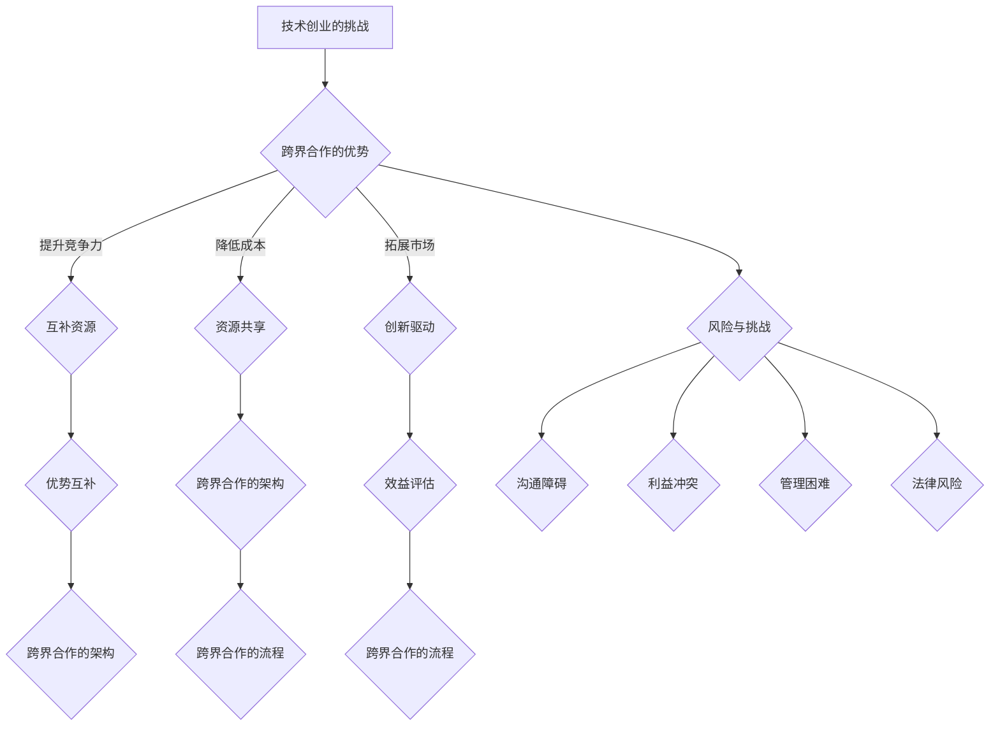

                 

# 技术创业的跨界合作：寻找互补资源的方法

关键词：技术创业、跨界合作、互补资源、策略、框架、执行、监控、成功案例

摘要：本文旨在探讨技术创业中的跨界合作，特别是在寻找互补资源方面的策略与方法。通过详细的案例分析和实践指导，帮助技术创业者更好地理解和实施跨界合作，实现资源整合和业务拓展。

## 引言

在当前快速发展的技术环境中，创业不再是单打独斗的领域。技术创业者面临着越来越大的竞争压力和资源限制，因此，跨界合作成为了一种常见的应对策略。本文将深入探讨技术创业的跨界合作，特别是如何寻找和利用互补资源。

### 技术创业的挑战

技术创业者在启动项目时，往往面临以下挑战：

1. **资金不足**：初期投资和运营成本较高，而创业者的资金来源有限。
2. **人才短缺**：技术创业需要各种专业人才，但创业者可能难以在短时间内聚集到所需人才。
3. **市场不确定性**：技术市场的变化迅速，创业者需要快速适应市场变化，但市场风险不可预测。
4. **资源匮乏**：技术创业者可能缺乏必要的资源，如技术、市场、渠道等。

### 跨界合作的必要性

为了克服上述挑战，技术创业者需要寻找跨界合作伙伴，通过资源整合实现协同发展。跨界合作的主要优势包括：

1. **资源共享**：通过合作，创业者可以共享资源，如资金、人才、技术等，降低成本和风险。
2. **优势互补**：合作伙伴可以带来不同的专业知识和技能，实现优势互补，提升项目的整体竞争力。
3. **市场拓展**：跨界合作可以帮助创业者进入新的市场领域，拓展业务范围。
4. **风险分担**：合作伙伴共同承担市场风险，降低单个创业者的风险负担。

## 跨界合作的基本概念与类型

### 跨界合作的概念

跨界合作是指不同领域的企业、组织或个人之间的合作，通过整合各自的优势资源，共同实现目标。在技术创业领域，跨界合作通常涉及到以下方面：

1. **技术合作**：不同技术领域的企业合作，共同开发新产品或技术。
2. **市场合作**：企业之间通过市场渠道共享，扩大市场占有率。
3. **人才合作**：企业之间共享人才，实现人才的跨领域流动。
4. **资金合作**：企业之间共同投资，分担资金压力。

### 跨界合作的类型

根据合作的方式和目的，跨界合作可以分为以下几种类型：

1. **战略联盟**：企业之间通过签订合作协议，实现资源共享和优势互补，但各自保持独立性。
2. **合资企业**：企业之间共同投资，成立新的企业，共同经营和管理。
3. **合作开发**：企业之间共同投资，合作开发新产品或技术。
4. **资源共享**：企业之间共享资源，如渠道、技术、市场等，实现互利共赢。

## 跨界合作的价值与风险

### 跨界合作的价值

1. **提升竞争力**：通过跨界合作，企业可以整合资源，提升产品和服务的竞争力。
2. **降低成本**：共享资源可以降低生产成本和运营成本。
3. **拓展市场**：跨界合作可以帮助企业进入新的市场领域，扩大业务范围。
4. **创新驱动**：跨界合作可以促进技术创新和商业模式创新。

### 跨界合作的风险

1. **管理困难**：跨界合作涉及到多个企业的利益，管理难度较大。
2. **沟通障碍**：不同企业之间的文化、沟通方式可能存在差异，导致合作难度增加。
3. **利益冲突**：跨界合作可能导致企业之间的利益冲突，影响合作的顺利进行。
4. **法律风险**：跨界合作可能涉及到知识产权、合同法等法律问题，需要谨慎处理。

## 总结

本文对技术创业的跨界合作进行了初步探讨，分析了技术创业的挑战和跨界合作的必要性，介绍了跨界合作的基本概念和类型，并阐述了跨界合作的价值与风险。在接下来的章节中，我们将进一步探讨如何寻找互补资源，如何设定跨界合作的目标，以及如何建立和维护跨界合作的框架。通过这些实践指导，帮助技术创业者更好地实施跨界合作，实现资源整合和业务拓展。

<|assistant|>## 核心概念与联系

在探讨技术创业中的跨界合作时，我们首先需要明确几个核心概念，并理解它们之间的联系。以下是几个关键概念及其相互关系：

### 跨界合作

跨界合作是指不同领域的企业、组织或个人之间的合作。这种合作通常旨在整合各自的资源，实现优势互补，共同推动项目的成功。跨界合作不仅仅是技术合作，还可以是市场合作、人才合作、资金合作等多种形式。

### 互补资源

互补资源是指不同企业或个人在资源、技能、知识等方面具有的差异性和互补性。互补资源可以是资金、技术、市场渠道、人才等。通过互补资源的整合，企业可以实现资源优化配置，提升整体竞争力。

### 资源共享

资源共享是跨界合作的核心之一。通过资源共享，企业可以降低成本、提高效率，并实现资源的最优利用。资源共享的方式可以包括技术共享、市场共享、人才共享等。

### 优势互补

优势互补是指企业或个人在跨界合作中，通过整合各自的资源和技能，实现相互补充，从而提升项目的整体竞争力。优势互补不仅体现在技术和市场方面，还可以体现在管理、运营等各个层面。

### 跨界合作的架构

跨界合作的架构是指企业在跨界合作中所需建立的基础设施和机制。这包括合作目标的设定、合作模式的确定、合作框架的建立、沟通协调机制的建立等。

### 跨界合作的流程

跨界合作的流程是指从合作意向到合作实现的整个过程中所涉及的一系列步骤。这包括寻找合作伙伴、评估互补资源、制定合作方案、执行合作计划、监控合作效果等。

### 跨界合作的效益评估

跨界合作的效益评估是指对跨界合作效果进行量化分析，以评估合作的成功程度。这包括对合作成果的评估、成本效益分析、风险分析等。

### 核心概念与架构的联系

1. **互补资源**和**资源共享**是跨界合作的基础，决定了合作是否能够实现资源优化配置和成本效益最大化。
2. **优势互补**和**跨界合作的架构**是确保合作能够顺利进行的关键。通过建立合理的合作架构，可以确保各方资源得到有效利用，并降低合作风险。
3. **跨界合作的流程**和**效益评估**是确保跨界合作能够持续、高效进行的重要环节。通过规范的合作流程和科学的效益评估，企业可以及时发现和解决问题，确保跨界合作的目标得以实现。

### 核心概念与架构的 Mermaid 流程图



通过上述流程图，我们可以清晰地看到核心概念与架构之间的联系，以及它们在跨界合作中的重要性。理解这些核心概念和架构，是成功实施跨界合作的基础。

在下一章节中，我们将详细讨论如何寻找和评估互补资源，为技术创业的跨界合作奠定坚实的基础。

<|assistant|>## 跨界合作的策略

在技术创业中，跨界合作不仅是应对挑战的有效手段，更是实现业务拓展和资源优化的关键策略。为了确保跨界合作能够达到预期效果，创业者需要制定明确的合作策略。以下是从目标设定、伙伴选择、合作模式与结构等方面展开的详细讨论。

### 跨界合作的目标设定

明确跨界合作的目标是合作成功的第一步。创业者需要根据自身业务需求和战略目标，设定具体的合作目标。以下是一些常见的合作目标：

1. **资源整合**：通过跨界合作，整合各方资源，实现优势互补。
2. **技术创新**：与其他领域的专家或企业合作，共同开发新技术或产品。
3. **市场拓展**：通过跨界合作，进入新的市场领域，扩大业务范围。
4. **成本降低**：通过资源共享，降低生产和运营成本。
5. **风险分担**：与合作伙伴共同承担市场风险，降低单个企业的风险负担。

### 伙伴选择

选择合适的合作伙伴是跨界合作的关键。创业者需要根据合作目标，寻找具备以下条件的合作伙伴：

1. **资源匹配**：合作伙伴应该拥有创业者所需的关键资源，如资金、技术、市场渠道等。
2. **业务互补**：合作伙伴的业务领域应该与创业者的业务形成互补，实现优势互补和资源优化。
3. **信誉良好**：合作伙伴应该具备良好的商业信誉和社会声誉，确保合作过程顺利。
4. **合作意愿**：合作伙伴应该具备强烈的合作意愿，愿意共同面对挑战，实现双赢。

### 合作模式与结构

跨界合作可以采取多种模式，创业者需要根据实际情况选择合适的合作模式。以下是一些常见的合作模式与结构：

1. **战略联盟**：企业之间通过签订合作协议，实现资源共享和优势互补，但各自保持独立性。这种模式适用于资源整合和市场拓展。
2. **合资企业**：企业之间共同投资，成立新的企业，共同经营和管理。这种模式适用于技术合作和共同开发新产品。
3. **合作开发**：企业之间共同投资，合作开发新技术或产品。这种模式适用于技术创新和共同研发。
4. **资源共享**：企业之间共享资源，如渠道、技术、市场等，实现互利共赢。这种模式适用于降低成本和提升效率。

### 合作过程中的沟通与协调

跨界合作涉及到多个企业和个人，沟通与协调至关重要。创业者需要建立有效的沟通与协调机制，确保合作过程顺利进行。以下是一些关键点：

1. **明确沟通渠道**：建立明确的沟通渠道，确保各方能够及时、准确地传达信息。
2. **定期会议**：定期召开会议，讨论合作进展、问题解决方案和未来规划。
3. **冲突解决机制**：建立冲突解决机制，确保在出现分歧时能够及时解决，避免影响合作。
4. **文化融合**：尊重合作伙伴的文化差异，促进文化融合，提高合作效率。

### 跨界合作的风险管理

跨界合作不可避免地会面临各种风险，创业者需要建立完善的风险管理机制，确保合作风险得到有效控制。以下是一些关键点：

1. **风险评估**：在合作前，对潜在风险进行评估，制定风险应对策略。
2. **合同约定**：在合作合同中明确各方责任和权利，避免合作过程中出现法律纠纷。
3. **风险监控**：在合作过程中，持续监控风险，及时发现和解决问题。
4. **保险保障**：为合作项目购买保险，降低风险对合作的影响。

### 总结

跨界合作是技术创业中不可或缺的一部分，创业者需要制定明确的策略，包括目标设定、伙伴选择、合作模式与结构、沟通与协调、风险管理等方面。通过合理的策略制定和执行，创业者可以更好地应对挑战，实现资源优化和业务拓展。在下一章节中，我们将进一步探讨如何建立和维护跨界合作的框架。

<|assistant|>## 建立跨界合作的框架

在技术创业的跨界合作中，建立和维护一个有效的合作框架是确保合作顺利、高效进行的关键。一个完善的合作框架不仅能够明确各方在合作中的角色和责任，还能提供一套系统的流程和方法，以应对合作过程中可能出现的各种挑战。以下是从规划与准备、沟通与协调、风险管理等方面详细阐述如何建立和维护跨界合作的框架。

### 规划与准备

1. **合作目标的明确**：在建立合作框架之前，首先要明确跨界合作的目标。这些目标应该具体、可衡量，并与企业的长期战略相一致。例如，提升市场份额、开发新技术、降低运营成本等。

2. **资源需求分析**：分析合作所需的资源，包括资金、技术、市场渠道、人力资源等。明确各方的资源投入，确保资源能够满足合作目标。

3. **合作模式的选择**：根据合作目标和分析出的资源需求，选择合适的合作模式，如战略联盟、合资企业、合作开发等。

4. **合作方案的制定**：制定详细的合作方案，包括合作的具体步骤、时间表、责任人等。合作方案应该具备可执行性，并能够应对可能出现的各种情况。

5. **合作协议的签订**：在合作方案确定后，签订正式的合作协议。合作协议应该明确各方的权利和义务，避免合作过程中的纠纷。

### 沟通与协调

1. **沟通渠道的建立**：建立高效的沟通渠道，确保各方能够及时、准确地传达信息。这包括定期会议、邮件通讯、即时通讯工具等。

2. **信息共享平台**：建立一个信息共享平台，如企业内部网站、云存储等，便于各方随时查阅和更新信息。

3. **责任分配与协调**：明确各方的责任和任务，确保每个环节都有专人负责。同时，建立协调机制，确保各环节的顺畅衔接。

4. **文化融合**：尊重合作伙伴的文化差异，促进文化融合，提高合作效率。可以通过组织文化交流活动、培训等手段实现文化融合。

### 风险管理

1. **风险评估**：在合作初期，对潜在风险进行全面的评估，包括市场风险、技术风险、法律风险等。

2. **风险控制策略**：制定相应的风险控制策略，如分散投资、购买保险、法律咨询等。

3. **风险监控**：在合作过程中，持续监控风险，及时发现和解决问题。建立风险预警机制，确保在风险发生时能够迅速反应。

4. **风险管理团队**：组建一个风险管理团队，负责合作过程中的风险管理。团队成员应具备丰富的风险管理经验和专业知识。

### 跨界合作的框架示例

以下是一个简化的跨界合作框架示例：

```
跨界合作框架
|
|--- 合作目标
|       |
|       |--- 资源需求分析
|       |--- 合作模式选择
|       |--- 合作方案制定
|       |--- 合作协议签订
|
|--- 沟通与协调
|       |
|       |--- 沟通渠道建立
|       |--- 信息共享平台
|       |--- 责任分配与协调
|       |--- 文化融合
|
|--- 风险管理
|       |
|       |--- 风险评估
|       |--- 风险控制策略
|       |--- 风险监控
|       |--- 风险管理团队
```

通过上述框架，创业者可以系统地规划和管理跨界合作，确保合作过程顺利进行，实现预期的合作目标。

在下一章节中，我们将探讨跨界合作的执行与监控，以及如何确保合作项目的顺利实施和效果评估。

<|assistant|>## 跨界合作的执行与监控

跨界合作的执行与监控是确保合作项目成功实施的关键环节。在这个阶段，创业者需要将前期制定的计划和策略转化为具体的行动，并通过有效的监控机制确保合作项目的进展和效果。以下是从项目启动、执行过程和监控评估等方面详细阐述如何确保跨界合作的顺利执行。

### 项目启动

1. **项目启动会议**：在项目启动阶段，召开项目启动会议，明确项目的目标、范围、时间表和责任人。确保所有参与者对项目有清晰的理解和共识。

2. **资源分配**：根据项目计划，分配所需的资源，包括资金、人力资源、技术资源和市场资源。确保各方能够按照计划提供必要的支持。

3. **任务分解**：将项目任务分解为具体的可执行的任务，并为每个任务分配责任人。制定详细的工作计划和时间表，确保任务能够按时完成。

4. **里程碑设置**：设定项目里程碑，以监控项目的进展。里程碑应该具备可衡量性和可达性，以便于项目进度的评估。

### 执行过程

1. **日常协调**：建立日常协调机制，确保各方能够及时沟通和协调。通过定期会议、即时通讯工具和项目进度报告等方式，保持信息的畅通。

2. **任务跟进**：对分配的任务进行定期跟进，确保每个任务都在按计划进行。如果遇到问题或困难，及时解决，避免影响项目进度。

3. **进度报告**：定期向所有参与者提交项目进度报告，包括任务完成情况、资源使用情况和项目风险等。确保各方对项目进展有清晰的了解。

4. **质量控制**：确保项目的质量达到预期标准。通过制定质量控制计划、执行质量检查和测试等方式，保证项目的质量。

### 监控评估

1. **关键绩效指标（KPI）**：设定关键绩效指标，以衡量项目的进展和效果。KPI 应该与项目目标紧密相关，便于项目的评估。

2. **定期评估**：定期对项目进行评估，包括项目的进展情况、资源使用情况、风险控制情况等。通过评估，及时发现和解决问题，确保项目按计划进行。

3. **项目复盘**：在项目结束时，进行项目复盘，总结项目的经验教训。项目复盘可以帮助团队学习和改进，为未来的项目提供参考。

4. **持续改进**：根据评估结果和项目复盘的反馈，持续改进项目管理和执行过程。通过不断的改进，提高项目的执行效率和效果。

### 伪代码示例

以下是一个简化的跨界合作执行与监控的伪代码示例：

```
function execute_and_monitor_consortium():
    # 启动项目
    start_project()

    # 循环执行任务
    while not project_completed():
        # 更新进度报告
        update_progress_report()

        # 监控任务进度
        monitor_tasks()

        # 跟进任务
        follow_up_tasks()

        # 定期评估项目
        perform_regular_evaluation()

    # 项目复盘
    conduct_project retrospection()

    # 持续改进
    continue_improvement()
```

通过上述伪代码，我们可以看到跨界合作的执行与监控是一个持续的过程，需要不断地更新进度报告、监控任务进度、跟进任务、定期评估项目，并在项目结束时进行复盘和持续改进。

在下一章节中，我们将通过具体案例探讨跨界合作的成功实践，以及如何从案例中汲取经验，为技术创业者的跨界合作提供参考。

<|assistant|>## 跨界合作的成功案例

在技术创业领域，跨界合作的成功案例屡见不鲜。以下我们将通过三个具体案例，详细探讨跨界合作如何在不同领域中实现资源整合、技术创新和市场拓展。

### 案例一：互联网公司与传统制造业的跨界合作

**案例背景**：
某互联网公司（公司A）在移动互联网领域拥有强大的平台和技术优势，但缺乏实体产品的生产经验。某传统制造企业（公司B）在制造业领域拥有丰富的生产经验和渠道资源，但缺乏互联网技术和市场推广能力。双方决定进行跨界合作，共同开发一款智能穿戴设备。

**合作过程**：
1. **目标设定**：双方共同设定了开发智能穿戴设备的目标，旨在通过互联网技术提升传统制造业的产品竞争力。
2. **伙伴选择**：公司A提供互联网技术和市场推广能力，公司B提供制造资源和渠道。
3. **合作模式**：双方选择合资企业模式，共同投资成立了一家新的公司C，负责智能穿戴设备的生产和销售。
4. **执行过程**：公司A负责产品的设计和研发，公司B负责生产制造和市场渠道的开拓。
5. **监控评估**：双方定期召开会议，评估项目进展和销售业绩，确保合作顺利进行。

**成果**：
通过跨界合作，智能穿戴设备成功上市，并在市场上取得了良好的反响。公司C迅速占领了市场份额，实现了销售额的大幅增长。同时，公司A和公司B也通过合作提升了自身的核心竞争力。

### 案例二：科技创新企业与金融机构的跨界合作

**案例背景**：
某科技创新企业（公司D）在区块链技术领域具有领先优势，但其业务发展受限于资金不足和市场需求。某金融机构（银行E）拥有丰富的资金资源和客户资源，但缺乏区块链技术能力。双方决定进行跨界合作，共同开发基于区块链的金融产品。

**合作过程**：
1. **目标设定**：双方共同设定了开发基于区块链的金融产品，提升金融服务效率和安全性。
2. **伙伴选择**：公司D提供区块链技术，银行E提供资金资源和客户资源。
3. **合作模式**：双方选择战略联盟模式，共同投资开发新的金融产品。
4. **执行过程**：公司D负责区块链技术的研发和应用，银行E负责产品的市场推广和客户服务。
5. **监控评估**：双方定期评估产品性能和市场反馈，调整合作策略。

**成果**：
通过跨界合作，双方共同开发了基于区块链的金融产品，成功推向市场。产品在提升金融服务效率和安全性方面表现优异，受到了客户的广泛认可。公司D的业务得到了快速发展，银行E也通过技术创新提升了市场竞争力。

### 案例三：科研机构与企业的跨界合作

**案例背景**：
某科研机构（研究所F）在人工智能领域具有深厚的研究基础，但其研究成果难以快速转化为实际应用。某高科技企业（公司G）在产品开发和市场推广方面具备优势，但缺乏前沿技术的支持。双方决定进行跨界合作，共同推动人工智能技术的商业化应用。

**合作过程**：
1. **目标设定**：双方共同设定了将人工智能技术应用于企业产品，提升产品智能化水平。
2. **伙伴选择**：研究所F提供人工智能技术，公司G负责产品开发和市场推广。
3. **合作模式**：双方选择合作开发模式，共同投资进行技术研究和产品开发。
4. **执行过程**：研究所F负责人工智能技术的研究和应用，公司G负责产品的设计和市场推广。
5. **监控评估**：双方定期召开技术评审会议，评估技术进展和产品性能，确保合作顺利进行。

**成果**：
通过跨界合作，双方共同研发了一系列人工智能产品，成功推向市场。产品在市场上取得了良好的口碑和销售额，为公司G带来了显著的经济效益。同时，研究所F的研究成果也得到了实际应用，提升了科研成果的转化率。

### 案例总结

以上三个案例展示了跨界合作在不同领域中的应用，通过整合资源、互补优势，实现了技术创新和市场拓展。这些成功案例表明，跨界合作是技术创业中的一种有效策略，可以帮助企业实现资源优化、技术创新和市场扩展。在未来的技术创业中，创业者可以借鉴这些成功案例，寻找合适的合作伙伴，开展跨界合作，实现共同发展。

<|assistant|>## 跨界合作的未来趋势

随着技术的不断进步和全球化的深入发展，跨界合作在技术创业中扮演着越来越重要的角色。未来，跨界合作的趋势将更加多样化和复杂化，以下从技术发展、经济全球化和可持续发展路径等方面探讨跨界合作的未来趋势。

### 技术发展的推动作用

1. **人工智能与大数据**：人工智能和大数据技术的快速发展，使得跨界合作在数据分析、预测和优化方面具有巨大的潜力。企业可以通过跨界合作，共享数据资源，提升决策效率和市场竞争力。
   
2. **区块链技术**：区块链技术为跨界合作提供了安全、透明的数据共享和协作机制。未来，区块链技术在供应链管理、金融交易和智能合约等领域将有广泛应用，推动跨界合作向更高效、更透明方向发展。

3. **物联网（IoT）**：物联网技术的普及使得各种设备互联互通，为跨界合作提供了新的机会。企业可以通过跨界合作，整合物联网设备，实现智能生产、智慧城市和智能家居等应用。

### 经济全球化的影响

1. **全球供应链**：全球化使得全球供应链更加紧密，企业可以通过跨界合作，整合全球资源，实现供应链的优化和协同。例如，跨国公司可以与本地企业合作，共同开拓新兴市场。

2. **国际分工与协作**：全球化促进了国际分工和协作，不同国家和地区的企业可以通过跨界合作，发挥各自的比较优势，实现资源的最优配置。

3. **跨境投资与并购**：随着跨国投资的便利化，企业可以通过跨境投资和并购，实现技术与资源的快速整合。例如，科技公司可以通过并购获得新的技术和市场，加速自身的发展。

### 可持续发展的路径

1. **绿色合作**：在可持续发展的大背景下，跨界合作将更加注重环境保护和资源节约。企业可以通过跨界合作，共同研发绿色技术、推广节能减排措施，实现可持续发展。

2. **社会价值共创**：跨界合作不仅追求经济效益，还将更加关注社会价值。企业可以通过跨界合作，共同解决社会问题，如教育、医疗、环境保护等，实现社会价值共创。

3. **合作模式的创新**：随着技术的进步和全球化的深入，跨界合作模式将不断创新。例如，共享经济、平台经济等新兴模式，将推动跨界合作向更加灵活、高效的方向发展。

### 总结

未来，跨界合作将在技术创业中发挥更加重要的作用。创业者需要紧跟技术发展趋势，把握经济全球化的机遇，探索可持续发展的路径，不断创新跨界合作模式。通过有效的跨界合作，创业者可以整合资源、互补优势，提升竞争力，实现可持续发展。

<|assistant|>## 附录

### 附录A：跨界合作相关资源

#### A.1 相关书籍与文献

1. 《跨界合作：打造共赢的生态系统》（作者：李开复）
2. 《跨界思维：如何将不同领域的智慧融合》（作者：陈劲）
3. 《跨领域合作：创新的新动力》（作者：大卫·布尔）
4. 《平台革命：跨界竞争，重构商业规则》（作者：唐·塔普斯科特）

#### A.2 跨界合作的案例分析报告

1. “互联网公司与传统制造业跨界合作案例分析”
2. “科技创新企业与金融机构跨界合作案例分析”
3. “科研机构与企业的跨界合作案例分析”

#### A.3 跨界合作工具与平台介绍

1. “跨界合作平台：X-合作网”
2. “跨界合作工具：Mavenlink”
3. “跨界合作平台：Cosmopolit”
4. “跨界合作工具：Slack”

### 附录B：跨界合作实用工具

#### B.1 跨界合作分析框架

1. “SWOT分析框架”：用于评估合作各方的优势、劣势、机会和威胁。
2. “PEST分析框架”：用于分析外部环境（政治、经济、社会、技术）对企业跨界合作的影响。
3. “合作模型分析框架”：用于选择合适的合作模式（如战略联盟、合资企业、合作开发等）。

#### B.2 跨界合作评估模板

1. “跨界合作项目评估表”：用于评估合作项目的进展、成果和效益。
2. “合作风险评估表”：用于评估合作过程中可能面临的风险，并制定相应的应对策略。
3. “合作伙伴绩效评估表”：用于评估合作伙伴的表现和贡献。

#### B.3 跨界合作项目进度跟踪工具

1. “甘特图”：用于可视化项目进度，监控任务完成情况。
2. “看板（Kanban）”：用于实时跟踪项目进度，提高团队协作效率。
3. “协作软件（如Trello、JIRA等）”：用于任务分配、进度跟踪和团队协作。

通过这些资源与工具，技术创业者可以更好地理解和实施跨界合作，实现资源整合和业务拓展。

### 作者信息

作者：AI天才研究院/AI Genius Institute & 禅与计算机程序设计艺术 /Zen And The Art of Computer Programming

AI天才研究院致力于推动人工智能技术的发展和应用，培养顶尖的人工智能人才。同时，作者在该领域有着丰富的经验和深厚的学术造诣，为技术创业者和专业人士提供了大量有价值的指导。本文是作者多年研究与实践经验的总结，旨在为技术创业者的跨界合作提供实用的策略和方法。

