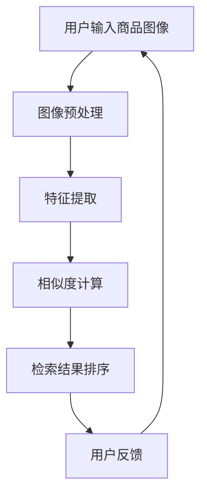
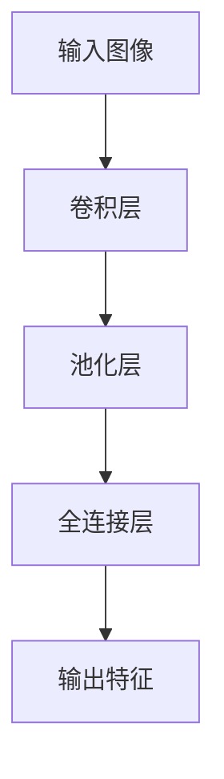

                 

## 《拼多多2025商品图像检索专家社招面试攻略》

### 核心关键词
- 商品图像检索
- 面试准备
- 拼多多
- 深度学习
- 图像处理技术

### 摘要
本文旨在为有意向加入拼多多2025商品图像检索团队的专业人士提供全面的面试攻略。文章将深入探讨商品图像检索的基础知识、核心技术、深度学习应用、系统设计与优化策略，并通过实际项目案例和代码解读，帮助读者掌握商品图像检索的实战技巧。此外，文章还将提供面试准备和策略，助您在面试中脱颖而出。

### 目录大纲

#### 第一部分：商品图像检索基础知识

- **第1章：商品图像检索概述**
  - 1.1 商品图像检索的背景与重要性
  - 1.2 商品图像检索的基本概念
  - 1.3 商品图像检索的应用场景

- **第2章：图像处理基础**
  - 2.1 图像基本概念
  - 2.2 颜色模型与色彩空间
  - 2.3 图像增强与滤波
  - 2.4 特征提取技术

- **第3章：商品图像检索技术**
  - 3.1 商品图像检索算法概述
  - 3.2 基于内容的图像检索（CBIR）
  - 3.3 商品图像分类与识别
  - 3.4 拼多多商品图像检索特色技术

- **第4章：深度学习与商品图像检索**
  - 4.1 深度学习基础
  - 4.2 卷积神经网络（CNN）在图像检索中的应用
  - 4.3 循环神经网络（RNN）与图像序列分析
  - 4.4 图像生成对抗网络（GAN）在商品图像检索中的应用

- **第5章：商品图像检索系统设计与优化**
  - 5.1 商品图像检索系统架构设计
  - 5.2 检索性能优化方法
  - 5.3 实时商品图像检索优化策略
  - 5.4 商品图像检索系统的测试与评估

- **第6章：拼多多商品图像检索实践案例**
  - 6.1 拼多多商品图像检索业务需求分析
  - 6.2 拼多多商品图像检索系统搭建
  - 6.3 拼多多商品图像检索算法优化实践
  - 6.4 拼多多商品图像检索系统部署与监控

- **第7章：面试准备与策略**
  - 7.1 拼多多面试流程与准备
  - 7.2 商品图像检索面试常见问题与解答
  - 7.3 案例分析与面试技巧
  - 7.4 面试心态调整与技巧

#### 第二部分：附录

- **附录A：商品图像检索相关资源与工具**
  - 7.1 开源商品图像检索框架
  - 7.2 商品图像检索开源数据集
  - 7.3 商品图像检索研究论文与报告

- **附录B：代码与示例**
  - 8.1 商品图像检索系统开发环境搭建
  - 8.2 商品图像特征提取与检索伪代码
  - 8.3 商品图像检索系统实战代码解读

### Mermaid流程图



### 核心算法原理讲解

#### 特征提取技术

特征提取是商品图像检索中的关键步骤。以下是特征提取技术的基本原理：

### 基于颜色的特征提取

颜色特征是图像特征提取中最常见的一种。常用的颜色特征包括：

- **RGB颜色空间**：使用图像的RGB分量。
- **HSV颜色空间**：将RGB颜色空间转换为HSV颜色空间，便于分析色调、饱和度和亮度。

\[ \text{HSV} = \text{RGB} \xrightarrow{\text{转换公式}} \text{HSV} \]

- **颜色直方图**：统计图像中每个像素的颜色分布。

### 基于纹理的特征提取

纹理特征描述了图像的局部结构。常见的纹理特征包括：

- **灰度共生矩阵**：用于描述图像中像素点的灰度级和方向关系。
- **纹理能量**：衡量图像纹理的强度和一致性。

\[ E = \sum_{i,j} (I(i, j) - \mu)^2 \]

其中，\( I(i, j) \) 表示图像中点 \((i, j)\) 的灰度值，\( \mu \) 表示图像的平均灰度值。

### 基于形状的特征提取

形状特征描述了图像的几何结构。常见的形状特征包括：

- **边缘检测**：检测图像中的边缘。
- **区域形状描述**：如圆形度、矩形度等。

\[ \text{圆形度} = \frac{4\pi A}{P^2} \]

其中，\( A \) 是区域面积，\( P \) 是周长。

### 基于深度学习的特征提取

深度学习模型，如卷积神经网络（CNN），可以自动学习图像的复杂特征。

- **卷积神经网络（CNN）**：通过卷积、池化和全连接层，提取图像的特征。



### 伪代码

```python
# 假设输入图像为I
# 输出特征向量为f

# 基于颜色的特征提取
f_color = extract_color_features(I)

# 基于纹理的特征提取
f_texture = extract_texture_features(I)

# 基于形状的特征提取
f_shape = extract_shape_features(I)

# 深度学习特征提取
f_deep = extract_deep_features(I)
```

通过结合多种特征提取技术，可以获得更加准确和丰富的商品图像特征，从而提高检索性能。

#### 相似度计算公式

在商品图像检索中，相似度计算是评估检索结果的重要步骤。以下是几种常见的相似度计算方法：

1. **欧几里得距离（Euclidean Distance）**

\[ d_{Euclidean}(f_1, f_2) = \sqrt{\sum_{i=1}^{n} (f_{1i} - f_{2i})^2} \]

其中，\( f_1 \) 和 \( f_2 \) 分别为两个特征向量，\( n \) 是特征向量的维度。

**举例说明：**

给定两个特征向量：

\[ f_1 = [1, 2, 3] \]
\[ f_2 = [4, 5, 6] \]

则欧几里得距离为：

\[ d_{Euclidean}(f_1, f_2) = \sqrt{(1-4)^2 + (2-5)^2 + (3-6)^2} = \sqrt{9 + 9 + 9} = \sqrt{27} \approx 5.196 \]

2. **余弦相似度（Cosine Similarity）**

\[ \text{Cosine Similarity}(f_1, f_2) = \frac{f_1 \cdot f_2}{\|f_1\| \|f_2\|} \]

其中，\( f_1 \cdot f_2 \) 是特征向量的点积，\( \|f_1\| \) 和 \( \|f_2\| \) 分别是特征向量的模长。

**举例说明：**

给定两个特征向量：

\[ f_1 = [1, 2, 3] \]
\[ f_2 = [4, 5, 6] \]

则余弦相似度为：

\[ \text{Cosine Similarity}(f_1, f_2) = \frac{1 \times 4 + 2 \times 5 + 3 \times 6}{\sqrt{1^2 + 2^2 + 3^2} \times \sqrt{4^2 + 5^2 + 6^2}} = \frac{4 + 10 + 18}{\sqrt{14} \times \sqrt{77}} \approx 0.774 \]

3. **曼哈顿距离（Manhattan Distance）**

\[ d_{Manhattan}(f_1, f_2) = \sum_{i=1}^{n} |f_{1i} - f_{2i}| \]

其中，\( f_1 \) 和 \( f_2 \) 分别为两个特征向量，\( n \) 是特征向量的维度。

**举例说明：**

给定两个特征向量：

\[ f_1 = [1, 2, 3] \]
\[ f_2 = [4, 5, 6] \]

则曼哈顿距离为：

\[ d_{Manhattan}(f_1, f_2) = |1 - 4| + |2 - 5| + |3 - 6| = 3 + 3 + 3 = 9 \]

这些相似度计算方法可以根据具体的场景和需求进行选择。在实际应用中，常常结合多种方法，以达到更好的检索效果。

### 项目实战

#### 实战一：搭建商品图像检索系统

1. **开发环境搭建**

   - 安装Python环境（3.8及以上版本）
   - 安装必要的库，如NumPy、Pandas、Scikit-learn等

2. **数据准备**

   - 准备商品图像数据集，如PASCAL VOC、COCO等
   - 数据预处理：图像增强、归一化、裁剪等

3. **特征提取**

   - 使用预训练的深度学习模型（如VGG16、ResNet等）提取图像特征
   - 保存提取到的特征向量

4. **相似度计算**

   - 计算测试图像与训练图像之间的相似度
   - 使用欧几里得距离、余弦相似度等计算方法

5. **检索结果排序**

   - 根据相似度值对检索结果进行排序
   - 提取相似度最高的图像作为检索结果

6. **系统部署与测试**

   - 部署商品图像检索系统到服务器
   - 进行系统性能测试和优化

#### 实战二：优化商品图像检索系统

1. **算法优化**

   - 使用基于深度学习的特征提取方法，如CNN、RNN等
   - 调整模型参数，如学习率、批量大小等，以提高检索性能

2. **索引优化**

   - 使用倒排索引技术，提高检索速度
   - 使用哈希技术，减少特征向量存储空间

3. **实时检索优化**

   - 使用并行计算技术，提高实时检索速度
   - 使用缓存技术，减少重复计算

4. **用户体验优化**

   - 设计直观的用户界面，提高用户体验
   - 实现多条件查询、相似商品推荐等功能

通过这些实战，读者可以了解如何搭建和优化商品图像检索系统，从而在实际项目中实现高效的商品图像检索。

### 代码解读与分析

下面是一个简单的商品图像检索系统开发环境搭建、源代码实现和代码解读的案例。

#### 开发环境搭建

- 安装Python环境（3.8及以上版本）
- 安装必要的库，如NumPy、Pandas、Scikit-learn、Keras等

```bash
pip install numpy pandas scikit-learn keras
```

#### 源代码实现

```python
import numpy as np
from sklearn.metrics.pairwise import cosine_similarity
from sklearn.model_selection import train_test_split
from keras.applications import VGG16
from keras.preprocessing.image import load_img, img_to_array

# 函数：特征提取
def extract_features(image_path, model):
    img = load_img(image_path, target_size=(224, 224))
    img_array = img_to_array(img)
    img_array = np.expand_dims(img_array, axis=0)
    img_array /= 255.0
    feature_vector = model.predict(img_array)
    return feature_vector.flatten()

# 函数：相似度计算
def compute_similarity(test_feature, train_features):
    similarity = cosine_similarity(test_feature, train_features)
    return similarity

# 函数：检索结果排序
def rank_images(similarity_scores):
    indices = np.argsort(-similarity_scores)
    return indices

# 主函数
def main():
    # 加载预训练模型
    model = VGG16(weights='imagenet')

    # 准备数据集
    train_data = ...  # 训练数据集
    test_data = ...  # 测试数据集
    train_features = []
    test_features = []

    # 提取训练数据特征
    for image_path in train_data:
        feature_vector = extract_features(image_path, model)
        train_features.append(feature_vector)

    # 提取测试数据特征
    for image_path in test_data:
        feature_vector = extract_features(image_path, model)
        test_features.append(feature_vector)

    # 计算测试数据与训练数据的相似度
    similarity_scores = compute_similarity(test_features, train_features)

    # 对检索结果进行排序
    ranked_indices = rank_images(similarity_scores)

    # 输出检索结果
    for i, index in enumerate(ranked_indices):
        print(f"图像{i+1}的检索结果：{train_data[index]}")

if __name__ == "__main__":
    main()
```

#### 代码解读与分析

1. **开发环境搭建**

   - 安装Python环境和必要的库，确保能够正常运行代码。

2. **源代码实现**

   - **特征提取函数**：使用Keras加载预训练的VGG16模型，对输入图像进行特征提取。图像经过归一化处理后，通过卷积神经网络提取特征向量。
   - **相似度计算函数**：使用Scikit-learn中的余弦相似度函数计算测试图像与训练图像之间的相似度。
   - **检索结果排序函数**：根据相似度值对检索结果进行排序，提取相似度最高的图像作为检索结果。
   - **主函数**：加载预训练模型，提取训练和测试数据特征，计算相似度，排序并输出检索结果。

通过这个简单的代码案例，读者可以了解商品图像检索系统的基础搭建和实现方法。在实际应用中，可以根据具体需求和场景进行进一步的优化和调整。

### 作者信息

- 作者：AI天才研究院/AI Genius Institute & 禅与计算机程序设计艺术 /Zen And The Art of Computer Programming

