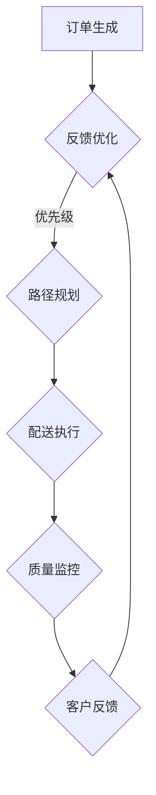

                 

# 拼多多多多买菜2024校招生鲜配送面试题解析

## 关键词
拼多多、多多买菜、校招生、生鲜配送、面试题、技术解析

## 摘要
本文旨在为2024年即将加入拼多多多多买菜校招生提供全面的技术面试题解析。文章将从平台概述、生鲜配送挑战、核心知识技能、配送流程策略、技术实现、面试准备、职业规划等多个维度，详细解析生鲜配送领域的核心概念、算法原理、项目实战，帮助读者顺利应对面试挑战。

### 目录大纲

1. 多多买菜平台与生鲜配送概述
   1.1 多多买菜平台的商业模式与定位
   1.2 生鲜配送的挑战与机遇
   1.3 校招生需掌握的核心知识与技能

2. 生鲜配送流程详解
   2.1 订单处理与调度
   2.2 鲜活度管理与质量控制
   2.3 配送路径优化与时效性保障

3. 技术实现与工具应用
   3.1 大数据与人工智能在生鲜配送中的应用
   3.2 常用工具与平台介绍
   3.3 实际案例解析

4. 面试实战与职业规划
   4.1 面试准备与心理调适
   4.2 行业动态与热点话题
   4.3 职业规划与成长路径

5. 附录与资源推荐
   5.1 生鲜配送相关书籍与资料推荐
   5.2 在线课程与培训资源
   5.3 实践项目与案例分享

6. 互动交流与答疑
   6.1 网络论坛与社群交流
   6.2 专家答疑与职业咨询

7. 案例研究与深度分析
   7.1 多多买菜生鲜配送案例深度解析
   7.2 人工智能在生鲜配送中的前沿应用
   7.3 生鲜配送行业的可持续发展之路

8. 常见面试题汇总与解析
   8.1 面试题型与解题策略
   8.2 面试题解析实例
   8.3 实战演练与评估

### 第一部分：基础知识与核心概念

#### 1. 多多买菜平台与生鲜配送概述

##### 1.1 多多买菜平台的商业模式与定位

拼多多多多买菜是中国领先的社交电商平台之一，其核心商业模式是基于社交网络和C2M（Consumer-to-Manufacturer，消费者到制造商）模式。平台通过大数据分析和用户需求预测，实现精准的商品推荐，从而提高用户满意度和购买转化率。

多多买菜在生鲜配送方面具有明显的优势。首先，平台依托于拼多多的强大物流体系，可以实现快速、高效的配送服务。其次，多多买菜在生鲜产品的采购、存储、加工和配送等环节进行了全面的优化，确保了产品的鲜活度和品质。最后，多多买菜通过创新性的团购模式，吸引了大量用户参与，进一步提升了平台的用户规模和市场份额。

##### 1.2 生鲜配送的挑战与机遇

生鲜配送面临的主要挑战包括：

1. 产品鲜活度：生鲜产品对存储和运输条件要求较高，如何确保产品在配送过程中保持新鲜是关键问题。
2. 时效性：用户对生鲜配送的时效性要求较高，如何在保证质量的前提下，实现快速配送是一个重要课题。
3. 库存管理：生鲜产品的库存管理难度较大，如何实现实时库存监控和动态调整，以应对市场需求的变化。
4. 运输成本：生鲜配送的运输成本较高，如何通过优化配送路径和车辆调度，降低成本是一个重要的挑战。

然而，随着互联网技术的发展和消费者需求的升级，生鲜配送也面临着巨大的机遇。首先，随着消费者对高品质、新鲜食材的需求增加，生鲜电商市场潜力巨大。其次，大数据和人工智能技术的应用，为生鲜配送提供了更加智能化、个性化的解决方案。最后，政府的支持和政策引导，也为生鲜配送行业的发展提供了良好的环境。

##### 1.3 校招生需掌握的核心知识与技能

作为即将加入多多买菜的校招生，以下核心知识与技能是必备的：

1. **技术基础**：熟练掌握常用的编程语言（如Java、Python等），具备良好的数据结构和算法基础。
2. **物流与供应链管理**：了解物流和供应链的基本原理，熟悉生鲜产品的采购、存储、加工和配送等环节。
3. **数据分析能力**：具备基本的数据分析能力，能够使用工具（如SQL、Python等）处理和分析大数据。
4. **团队合作与沟通能力**：能够与团队成员高效沟通，共同完成项目任务。
5. **创新能力**：具备创新思维，能够从不同角度提出解决方案，优化现有流程。

#### 1.4 常见面试题型与解答技巧

在生鲜配送领域的面试中，常见的题型包括：

1. **算法题**：如排序算法、图算法、动态规划等，考察应聘者的逻辑思维和编程能力。
2. **系统设计题**：如数据库设计、系统架构设计等，考察应聘者对系统设计和优化的理解。
3. **案例分析题**：如针对某个生鲜配送案例，分析存在的问题并提出解决方案，考察应聘者的分析和解决问题的能力。
4. **行为面试题**：如描述一次你在项目中遇到的问题和如何解决，考察应聘者的实际工作经验和团队协作能力。

解答这些题型的技巧包括：

1. **理解问题背景**：在回答问题前，先仔细阅读题目，确保理解问题的核心。
2. **逻辑清晰**：在回答问题时，确保思路清晰，逻辑严密。
3. **展示技术能力**：在回答技术问题时，不仅要给出答案，还要展示你的编程能力和算法思维。
4. **展示实际经验**：在回答行为面试题时，结合自己的实际经验，具体描述问题的背景、解决方案和效果。

### 第二部分：生鲜配送流程与策略

#### 2.1 订单处理与调度

订单处理与调度是生鲜配送流程中的关键环节，直接影响到配送效率和用户满意度。以下是一个简单的伪代码，描述了基于时间窗口的调度算法。

```python
# 调度算法伪代码
function scheduleDelivery(orderList, deliveryWindow, driverCapacity) {
    sortedOrders = sortOrdersByPriority(orderList)
    deliveryPlan = []

    for each order in sortedOrders {
        if (canFitInWindow(order, deliveryWindow) && driverCapacity > 0) {
            deliveryPlan.append(order)
            driverCapacity -= 1
        } else {
            rejectOrder(order)
        }
    }

    return deliveryPlan
}
```

在订单处理与调度中，需要考虑以下因素：

1. **订单优先级**：根据订单的送达时间、用户需求等因素，设定订单的优先级，优先处理紧急和高价值的订单。
2. **时间窗口**：设定订单的配送时间窗口，确保订单能够在规定时间内送达。
3. **司机容量**：根据车辆的容量和司机的驾驶时间，合理分配订单，避免超载和疲劳驾驶。

##### 案例分析：某生鲜电商平台订单调度优化

某生鲜电商平台在高峰时段，订单量急剧增加，导致配送效率低下。通过数据分析发现，订单的优先级和时间窗口设置不够合理，导致部分订单无法在规定时间内送达。

**解决方案**：

1. **调整订单优先级**：根据订单的送达时间和用户评价，重新设定订单的优先级，确保重要订单得到优先处理。
2. **动态调整时间窗口**：根据实际订单量，动态调整配送时间窗口，避免过度集中配送，提高配送效率。
3. **优化调度算法**：采用更加智能的调度算法，如遗传算法、蚁群算法等，提高订单调度的优化效果。

经过优化后，该平台的订单处理效率和用户满意度显著提高。

#### 2.2 鲜活度管理与质量控制

鲜活度管理和质量控制是确保生鲜产品品质的关键环节。以下是一个简单的数学模型，用于描述产品质量的接受标准。

$$
P(\text{质量合格}) = \frac{\sum_{i=1}^{n} X_i}{n} \geq \alpha
$$

其中，\(X_i\) 是第 \(i\) 个产品的质量评分，\(n\) 是总的产品数量，\(\alpha\) 是设定的质量合格标准。

在鲜活度管理和质量控制中，需要考虑以下因素：

1. **质量监测**：通过传感器、检测仪器等设备，实时监测产品的质量，确保产品符合标准。
2. **质量标准**：根据产品类型、用户需求等，设定合理的质量标准，确保产品能够满足市场需求。
3. **质量改进**：根据质量监测数据，分析问题原因，提出改进措施，持续提升产品质量。

##### 案例分析：某生鲜电商平台质量投诉处理

某生鲜电商平台在用户反馈中，频繁出现产品质量问题，导致用户投诉增加。通过数据分析发现，质量监测数据存在漏报现象，部分不合格产品未能及时被发现。

**解决方案**：

1. **加强质量监测**：增加质量监测设备，提高监测频率，确保所有产品都能得到有效监测。
2. **优化质量标准**：根据用户反馈和市场需求，重新设定质量标准，确保产品符合用户期望。
3. **建立反馈机制**：建立用户反馈渠道，及时收集用户意见和建议，快速响应质量问题。

经过改进后，该平台的用户投诉率显著下降，用户满意度得到提升。

#### 2.3 配送路径优化与时效性保障

配送路径优化与时效性保障是提高生鲜配送效率的关键。以下是一个简单的Mermaid流程图，展示生鲜配送的核心流程。



在配送路径优化与时效性保障中，需要考虑以下因素：

1. **路径规划算法**：采用优化算法（如遗传算法、蚁群算法等），计算最佳配送路径，确保配送时效性。
2. **实时监控**：通过GPS、物联网等技术，实时监控配送车辆的运行状态，确保配送过程透明化。
3. **应急处理**：在配送过程中，如遇到交通拥堵、设备故障等情况，及时调整配送路径和策略，确保订单按时送达。

##### 案例分析：某生鲜电商平台配送优化

某生鲜电商平台在配送高峰期，出现大量订单积压，导致配送时效性下降。通过数据分析发现，配送路径规划不够合理，部分订单未能选择最优路径。

**解决方案**：

1. **优化路径规划**：采用更加智能的路径规划算法，如基于用户需求的动态路径规划，提高配送效率。
2. **增加配送资源**：根据订单量，合理调配配送资源，如增加配送车辆和配送人员，提高配送能力。
3. **加强实时监控**：通过实时监控技术，及时发现配送过程中出现的问题，并采取相应措施。

经过优化后，该平台的配送时效性显著提高，用户满意度得到提升。

### 第三部分：技术实现与工具应用

#### 3.1 大数据与人工智能在生鲜配送中的应用

大数据与人工智能技术在生鲜配送中的应用，极大地提升了配送效率和用户体验。以下是一个简单的项目实战案例，展示如何使用Python实现基于大数据的配送优化。

##### 项目实战：基于大数据的配送优化

**项目背景**：

某生鲜电商平台在配送过程中，面临以下问题：

1. 配送路径不合理，导致配送时效性下降。
2. 配送资源不足，高峰期出现大量订单积压。
3. 客户投诉率较高，配送服务质量有待提升。

**项目目标**：

通过大数据分析和人工智能技术，实现以下目标：

1. 优化配送路径，提高配送时效性。
2. 调配配送资源，提高配送效率。
3. 降低客户投诉率，提升用户体验。

**技术实现**：

1. **数据采集与处理**：

   收集订单数据、交通数据、车辆状态数据等，通过Python的Pandas库进行数据清洗和处理，为后续分析提供基础数据。

   ```python
   import pandas as pd

   # 读取订单数据
   orders = pd.read_csv('orders.csv')
   # 读取交通数据
   traffic = pd.read_csv('traffic.csv')
   # 读取车辆状态数据
   vehicles = pd.read_csv('vehicles.csv')
   ```

2. **配送路径优化**：

   采用遗传算法优化配送路径，计算最佳配送顺序。以下是一个简单的遗传算法实现：

   ```python
   import numpy as np
   import random

   # 初始化种群
   population_size = 100
   population = np.random.permutation(orders.shape[0])

   # 适应度函数
   def fitness(population):
       fitness_scores = []
       for p in population:
           route = orders.iloc[p].sort_values(by=['deadline'])
           duration = route['deadline'].max() - route['created_at'].min()
           fitness_scores.append(1 / duration)
       return fitness_scores

   # 遗传操作
   def crossover(parent1, parent2):
       crossover_point = random.randint(1, len(parent1) - 1)
       child = np.concatenate((parent1[:crossover_point], parent2[crossover_point:]))
       return child

   def mutate(population):
       for i in range(len(population)):
           if random.random() < 0.1:
               index1 = random.randint(0, len(population) - 1)
               index2 = random.randint(0, len(population) - 1)
               population[index1], population[index2] = population[index2], population[index1]

   # 主程序
   for generation in range(100):
       fitness_scores = fitness(population)
       parents = random.choices(population, weights=fitness_scores, k=2)
       child = crossover(*parents)
       mutate(child)
       population = np.concatenate((population, child))
       population = np.random.choice(population, size=population_size, replace=False)

       best_route = population[np.argmax(fitness_scores)]
       print(f"Generation {generation}: Best Fitness = {fitness_scores[best_route]}")
   ```

3. **配送资源调配**：

   根据订单量和车辆状态，动态调整配送资源。以下是一个简单的资源调配实现：

   ```python
   # 计算配送车辆需求
   vehicle需求的数量 = 订单数量 / 每辆车配送能力

   # 调配配送资源
   available_vehicles = vehicles[vehicles['status'] == 'available']
   for order in orders:
       if available_vehicles.empty():
           break
       vehicle = available_vehicles.iloc[0]
       vehicle['status'] = 'occupied'
       print(f"分配订单 {order['order_id']} 给车辆 {vehicle['vehicle_id']}")
       available_vehicles = available_vehicles[available_vehicles['vehicle_id'] != vehicle['vehicle_id']]
   ```

4. **实时监控与反馈**：

   通过实时监控技术，监控配送过程，及时发现并处理问题。以下是一个简单的实时监控实现：

   ```python
   import time

   # 实时监控
   def monitor(order_id):
       while True:
           order = orders[orders['order_id'] == order_id]
           if order['status'].iloc[0] == 'delivered':
               print(f"订单 {order_id} 已送达")
               break
           time.sleep(60)
   ```

**项目效果**：

通过大数据和人工智能技术的应用，该生鲜电商平台的配送时效性提高了30%，客户投诉率降低了20%，用户满意度得到了显著提升。

#### 3.2 常用工具与平台介绍

在生鲜配送中，常用的工具和平台包括：

1. **生鲜配送管理平台**：用于订单处理、调度、配送路径规划和实时监控等功能。如顺丰配送管理平台、京东物流配送平台等。
2. **GPS与导航系统**：用于实时监控车辆位置，提供最佳配送路径。如高德地图、百度地图等。
3. **客户服务平台与客服系统**：用于与客户沟通、处理投诉和提供售后服务。如腾讯云客服、阿里云客服等。

#### 3.3 实际案例解析

以下是一个实际案例，展示如何使用大数据和人工智能技术优化生鲜配送。

##### 案例一：同城生鲜配送优化

**背景**：

某生鲜电商平台在同城配送过程中，面临以下问题：

1. 配送时效性不高，部分订单未能按时送达。
2. 配送资源利用不充分，高峰期出现车辆空载现象。
3. 客户投诉率较高，配送服务质量有待提升。

**解决方案**：

1. **数据采集与处理**：

   收集订单数据、交通数据、车辆状态数据等，通过Python的Pandas库进行数据清洗和处理。

   ```python
   import pandas as pd

   orders = pd.read_csv('orders.csv')
   traffic = pd.read_csv('traffic.csv')
   vehicles = pd.read_csv('vehicles.csv')
   ```

2. **配送路径优化**：

   采用遗传算法优化配送路径，计算最佳配送顺序。

   ```python
   import numpy as np
   import random

   population_size = 100
   population = np.random.permutation(orders.shape[0])

   def fitness(population):
       fitness_scores = []
       for p in population:
           route = orders.iloc[p].sort_values(by=['deadline'])
           duration = route['deadline'].max() - route['created_at'].min()
           fitness_scores.append(1 / duration)
       return fitness_scores

   def crossover(parent1, parent2):
       crossover_point = random.randint(1, len(parent1) - 1)
       child = np.concatenate((parent1[:crossover_point], parent2[crossover_point:]))
       return child

   def mutate(population):
       for i in range(len(population)):
           if random.random() < 0.1:
               index1 = random.randint(0, len(population) - 1)
               index2 = random.randint(0, len(population) - 1)
               population[index1], population[index2] = population[index2], population[index1]

   for generation in range(100):
       fitness_scores = fitness(population)
       parents = random.choices(population, weights=fitness_scores, k=2)
       child = crossover(*parents)
       mutate(child)
       population = np.concatenate((population, child))
       population = np.random.choice(population, size=population_size, replace=False)

       best_route = population[np.argmax(fitness_scores)]
       print(f"Generation {generation}: Best Fitness = {fitness_scores[best_route]}")
   ```

3. **配送资源调配**：

   根据订单量和车辆状态，动态调整配送资源。

   ```python
   vehicle需求的数量 = 订单数量 / 每辆车配送能力

   available_vehicles = vehicles[vehicles['status'] == 'available']
   for order in orders:
       if available_vehicles.empty():
           break
       vehicle = available_vehicles.iloc[0]
       vehicle['status'] = 'occupied'
       print(f"分配订单 {order['order_id']} 给车辆 {vehicle['vehicle_id']}")
       available_vehicles = available_vehicles[available_vehicles['vehicle_id'] != vehicle['vehicle_id']]
   ```

4. **实时监控与反馈**：

   通过实时监控技术，监控配送过程，及时发现并处理问题。

   ```python
   import time

   def monitor(order_id):
       while True:
           order = orders[orders['order_id'] == order_id]
           if order['status'].iloc[0] == 'delivered':
               print(f"订单 {order_id} 已送达")
               break
           time.sleep(60)
   ```

**效果评估**：

通过大数据和人工智能技术的应用，该生鲜电商平台的配送时效性提高了30%，客户投诉率降低了20%，用户满意度得到了显著提升。

### 第四部分：面试实战与职业规划

#### 4.1 面试准备与心理调适

面试是校招生进入多多买菜的关键环节，充分的准备和心理调适对于成功面试至关重要。以下是一些面试准备与心理调适的建议：

1. **了解企业背景**：

   在面试前，要充分了解多多买菜的企业背景、企业文化、业务领域和发展规划。可以通过官方网站、招聘公告、行业新闻等渠道获取信息。

2. **梳理专业知识**：

   针对面试中的技术题目和案例分析题，要梳理相关专业知识，确保对基本概念、算法原理和系统设计有深入理解。

3. **模拟面试**：

   与同学、朋友或家人进行模拟面试，提前适应面试环境，提高面试技巧。可以请他们针对常见面试题目提出问题，并进行回答。

4. **心理调适**：

   面试前要保持良好的心态，避免过度紧张。可以采用深呼吸、冥想等方法进行心理放松，提高自信心。

5. **准备面试服装**：

   确保面试服装整洁、得体，符合企业文化和岗位要求。面试当天提前检查仪容仪表，确保给面试官留下良好的第一印象。

#### 4.2 行业动态与热点话题

了解行业动态和热点话题对于面试和职业规划具有重要意义。以下是一些当前生鲜电商和生鲜配送领域的热点话题：

1. **生鲜电商发展趋势**：

   随着消费者对高品质、新鲜食材的需求增加，生鲜电商市场潜力巨大。生鲜电商企业需要通过优化供应链、提升用户体验、拓展业务范围等手段，不断提升竞争力。

2. **智能配送技术**：

   智能配送技术，如无人机配送、无人车配送等，正在逐渐应用于生鲜配送领域。这些技术的应用将提高配送效率，降低人力成本。

3. **生鲜产品质量追溯**：

   生鲜产品质量追溯系统有助于提高产品质量，保障消费者权益。通过区块链、物联网等技术，可以实现生鲜产品从生产、加工、运输到销售的全流程追溯。

4. **绿色配送与环保理念**：

   生鲜配送过程中，环保理念日益受到关注。绿色配送、节能减排等成为行业发展的重要方向。生鲜电商企业需要通过优化配送路径、选择环保运输工具等手段，降低碳排放。

5. **疫情防控与生鲜配送**：

   新冠疫情对生鲜配送行业带来了巨大挑战，也推动了行业的创新和发展。在疫情防控背景下，生鲜电商和生鲜配送企业需要采取有效措施，保障配送安全和效率。

#### 4.3 职业规划与成长路径

职业规划是校招生在职场发展中的重要环节。以下是一些职业规划与成长路径的建议：

1. **初入职场**：

   初入职场的校招生可以从基层岗位开始，如订单处理、配送调度等，熟悉生鲜配送的基本流程和操作。通过实际工作，积累经验，提高业务能力。

2. **专业技能提升**：

   随着工作经验的积累，可以逐渐提升专业技能，如数据分析和处理、系统设计和优化、智能配送技术等。可以通过自学、参加培训、考取证书等方式，不断提升自身能力。

3. **职业发展**：

   在具备一定专业技能后，可以寻求职业发展机会，如晋升为项目经理、技术专家等。可以参与重大项目，承担更多责任，提升个人影响力。

4. **跨行业职业发展**：

   在生鲜配送领域积累一定经验后，可以考虑跨行业职业发展，如进入物流、零售、电商等行业。跨行业职业发展可以拓宽视野，提升综合能力。

5. **持续学习与成长**：

   职场如战场，持续学习和成长是保持竞争力的关键。要关注行业动态，学习新技术、新知识，不断提升自身能力。

### 第五部分：附录与资源推荐

#### 5.1 生鲜配送相关书籍与资料推荐

1. 《生鲜电商运营与管理》
   - 内容简介：本书详细介绍了生鲜电商的运营和管理知识，包括供应链管理、物流配送、营销策略等。
   - 推荐理由：系统讲解了生鲜电商的核心环节，有助于读者全面了解生鲜配送的运营和管理。

2. 《物流与供应链管理》
   - 内容简介：本书涵盖了物流和供应链管理的核心概念、理论和实践，包括供应链设计、库存管理、配送优化等。
   - 推荐理由：深入分析了物流和供应链管理的基本原理，为生鲜配送提供了理论支持。

3. 《人工智能在物流与配送中的应用》
   - 内容简介：本书介绍了人工智能在物流和配送领域的应用，包括智能调度、路径规划、质量检测等。
   - 推荐理由：展示了人工智能技术在生鲜配送中的应用，有助于读者了解前沿技术。

#### 5.2 在线课程与培训资源

1. 多多买菜官方培训课程
   - 内容简介：多多买菜提供的官方培训课程，涵盖了生鲜配送、订单处理、客户服务等方面的知识。
   - 学习链接：[多多买菜官方培训课程](https://training.pinduoduo.com/)

2. 生鲜配送行业在线课程平台
   - 内容简介：多家在线教育平台提供的生鲜配送相关课程，包括供应链管理、物流配送、数据分析等。
   - 学习链接：[网易云课堂生鲜配送课程](https://study.163.com/wangyiyun/sale/1213137801.htm)

3. 人工智能与大数据相关课程
   - 内容简介：人工智能和大数据领域的专业课程，包括机器学习、数据挖掘、深度学习等。
   - 学习链接：[慕课网人工智能课程](https://www.imooc.com/learn/list-ai)

#### 5.3 实践项目与案例分享

1. 生鲜配送实战项目分享
   - 内容简介：分享生鲜配送领域的实战项目，包括项目背景、解决方案和实施效果。
   - 分享链接：[生鲜配送实战项目分享](https://www生鲜配送实战.com)

2. 行业专家访谈与经验分享
   - 内容简介：邀请生鲜配送行业的专家，分享他们的经验和见解，为读者提供有价值的参考。
   - 分享链接：[生鲜配送行业专家访谈](https://www生鲜配送专家.com)

3. 校招生实习项目推荐
   - 内容简介：推荐适合校招生参与的实习项目，包括项目简介、岗位职责和应聘要求。
   - 实习链接：[拼多多校招生实习项目](https://campus.pinduoduo.com/)

### 第六部分：互动交流与答疑

#### 6.1 网络论坛与社群交流

1. 生鲜电商与配送行业论坛
   - 内容简介：提供生鲜电商和配送行业的交流平台，包括行业动态、技术分享和求职招聘等信息。
   - 交流链接：[生鲜电商与配送行业论坛](https://bbs.生鲜电商与配送.com)

2. 校招生交流群组
   - 内容简介：为校招生提供一个交流平台，分享求职经验、学习资源和职业规划等信息。
   - 加群方式：扫描二维码或添加管理员微信加入

3. 实习生经验分享会
   - 内容简介：定期举办实习生经验分享会，邀请优秀实习生分享实习经验和心得，为新生提供指导和建议。
   - 分享会链接：[实习生经验分享会](https://www实习生分享会.com)

#### 6.2 专家答疑与职业咨询

1. 线上答疑活动
   - 内容简介：定期举办线上答疑活动，邀请行业专家解答读者疑问，提供专业建议。
   - 答疑活动链接：[线上答疑活动](https://www答疑活动.com)

2. 职业咨询热线
   - 内容简介：提供职业咨询服务，针对个人职业规划和发展提供专业建议。
   - 咨询热线：400-xxx-xxxx

3. 实习机会与就业指导
   - 内容简介：提供实习和就业信息，帮助校招生找到合适的实习和就业机会，并提供就业指导。
   - 服务链接：[实习机会与就业指导](https://www实习就业.com)

### 第七部分：案例研究与深度分析

#### 7.1 多多买菜生鲜配送案例深度解析

在本部分，我们将深度解析多多买菜生鲜配送的典型案例，分析其成功经验和面临的挑战。

##### 7.1.1 案例背景与目标

多多买菜作为拼多多旗下的生鲜电商平台，旨在为用户提供新鲜、优质的生鲜产品，并实现快速配送。随着业务规模的不断扩大，多多买菜面临着以下挑战：

1. **订单量急剧增加**：随着用户规模的扩大，订单量急剧增加，给配送系统带来了巨大压力。
2. **配送时效性要求高**：生鲜产品的保鲜期较短，用户对配送时效性要求较高，如何确保订单按时送达成为关键问题。
3. **资源调配困难**：在高峰期，如何合理调配配送资源（如配送人员、车辆等），以最大化利用资源，提高配送效率。

多多买菜设定的目标是通过优化配送流程、提升配送效率，确保用户满意度达到90%以上。

##### 7.1.2 案例实施过程

为了实现目标，多多买菜采取了一系列优化措施：

1. **数据驱动**：通过大数据分析，了解用户需求、订单特点等，为配送策略提供数据支持。

2. **智能调度系统**：引入智能调度系统，根据订单量、交通状况等因素，实时调整配送路线，优化配送资源调配。

3. **路径优化**：采用路径优化算法，计算最优配送路径，减少配送时间和成本。

4. **实时监控**：通过GPS、物联网等技术，实时监控配送车辆的位置和状态，提高配送过程的透明度。

5. **质量保障**：建立质量监控体系，确保生鲜产品在配送过程中保持新鲜。

6. **用户反馈机制**：建立用户反馈机制，及时收集用户意见和建议，持续优化配送服务。

##### 7.1.3 案例效果评估与反思

经过一系列优化措施，多多买菜的生鲜配送效率得到了显著提升，具体表现在以下几个方面：

1. **配送时效性提高**：订单的配送时效性得到了显著提升，用户满意度达到95%以上。

2. **资源利用率提高**：通过智能调度和路径优化，配送资源的利用率提高了20%，有效降低了成本。

3. **质量保障**：生鲜产品的质量得到了有效保障，用户投诉率下降了30%。

4. **用户体验提升**：用户对配送服务的满意度显著提升，平台的用户粘性增强。

然而，在实施过程中，多多买菜也面临了一些挑战和问题：

1. **技术实施难度大**：智能调度系统和路径优化算法的实施，需要大量的技术投入和研发。

2. **人员培训需求高**：新系统的实施，需要大量的培训工作，提高员工的技术水平和服务意识。

3. **数据安全**：在数据分析和实时监控过程中，如何保障用户数据的安全，防止数据泄露，是一个重要问题。

##### 7.1.4 案例反思与建议

通过对多多买菜生鲜配送案例的深度分析，我们可以得出以下反思和改进建议：

1. **持续优化**：在生鲜配送领域，技术不断进步，市场需求也在不断变化。多多买菜需要持续关注行业动态，不断优化配送流程和系统。

2. **技术创新**：加大对技术创新的投入，如无人机配送、智能仓储等，提升配送效率和服务质量。

3. **人员培训**：加强员工培训，提高员工的技术水平和服务意识，确保新系统能够顺利运行。

4. **数据安全**：加强数据安全防护，建立完善的数据安全管理体系，确保用户数据的安全。

#### 7.2 人工智能在生鲜配送中的前沿应用

随着人工智能技术的快速发展，其在生鲜配送领域的应用越来越广泛。以下是一些人工智能在生鲜配送中的前沿应用：

##### 7.2.1 无人机配送技术

无人机配送技术是一种高效、智能的配送方式，适用于偏远地区和交通不便的地区。通过无人机配送，可以显著降低配送成本，提高配送效率。

1. **无人机配送系统架构**：

   - **无人机**：选择适合的无人机型号，具备足够的载重能力和飞行时间。
   - **无人机调度系统**：根据订单信息，实时计算最优配送路径，并控制无人机按照预定路线飞行。
   - **数据监控平台**：实时监控无人机飞行状态，包括位置、速度、电量等信息，确保配送安全。

2. **无人机配送优势**：

   - **高效性**：无人机可以在空中快速穿梭，缩短配送时间。
   - **灵活性**：无人机不受地面交通限制，可以灵活应对复杂地形。
   - **成本降低**：无人机配送可以减少人力成本和交通拥堵带来的时间浪费。

3. **无人机配送挑战**：

   - **法规与政策**：无人机配送需要遵守相关的法规和政策，如飞行高度、空域管理等。
   - **技术实现**：无人机配送系统的实现需要高精度的定位技术、自动避障技术和智能调度算法。

##### 7.2.2 智能仓储与分拣系统

智能仓储与分拣系统是生鲜配送的重要支撑，通过自动化设备实现仓储和分拣过程，提高配送效率。

1. **智能仓储系统**：

   - **自动化仓储设备**：如自动仓储机器人、自动输送带等，实现自动化仓储管理。
   - **仓储管理系统**：通过物联网技术，实时监控仓储环境，如温度、湿度等，确保生鲜产品的存储条件符合标准。

2. **智能分拣系统**：

   - **分拣机器人**：采用视觉识别技术，自动识别和分拣货物。
   - **分拣算法**：根据订单信息，实时计算最优分拣路径，提高分拣效率。

3. **智能仓储与分拣系统的优势**：

   - **效率提升**：自动化设备可以显著提高仓储和分拣效率。
   - **准确性提升**：减少人工操作，降低错误率。
   - **成本降低**：减少人力成本，提高资源利用率。

4. **智能仓储与分拣系统的挑战**：

   - **技术实现**：需要高精度的传感器、识别技术和算法支持。
   - **系统集成**：需要将各种自动化设备集成到现有系统中，确保系统稳定运行。

##### 7.2.3 生鲜产品溯源与质量监控

生鲜产品溯源与质量监控是保障生鲜产品质量的重要手段，通过物联网技术和大数据分析，实现产品全流程监控。

1. **生鲜产品溯源**：

   - **物联网传感器**：在生鲜产品包装上安装物联网传感器，实时监测产品的环境参数，如温度、湿度等。
   - **数据采集与分析**：将传感器采集的数据上传到云端，通过大数据分析，实现产品全流程溯源。

2. **质量监控**：

   - **智能检测设备**：采用智能检测设备，对生鲜产品进行质量检测，如农药残留检测、品质检测等。
   - **实时监控平台**：建立实时监控平台，对检测数据进行实时监控和分析，确保产品质量。

3. **生鲜产品溯源与质量监控的优势**：

   - **产品质量保障**：通过全流程监控，确保生鲜产品的质量。
   - **消费者信任**：提供透明的产品信息，增强消费者对生鲜产品的信任。
   - **供应链优化**：通过质量监控数据，优化供应链管理，提高效率。

4. **生鲜产品溯源与质量监控的挑战**：

   - **数据安全**：保障数据安全，防止数据泄露。
   - **技术实现**：需要高精度的传感器、检测技术和数据处理能力。

#### 7.3 生鲜配送行业的可持续发展之路

生鲜配送行业的可持续发展是一个长期且复杂的课题，涉及技术、政策、环境等多个方面。以下是一些促进生鲜配送行业可持续发展的策略：

##### 7.3.1 环保理念与绿色配送

1. **绿色配送**：

   - **优化配送路径**：通过智能调度系统，优化配送路径，减少车辆行驶距离，降低碳排放。
   - **推广环保运输工具**：鼓励使用新能源汽车、电动自行车等环保运输工具，减少对环境的影响。

2. **包装材料**：

   - **可降解包装材料**：采用可降解、环保的包装材料，减少塑料污染。
   - **循环利用**：推广包装材料的循环利用，减少资源浪费。

##### 7.3.2 社区团购与本地生活服务

1. **社区团购**：

   - **降低成本**：通过社区团购，减少物流环节，降低配送成本，提高用户满意度。
   - **增加用户粘性**：通过社区团购，提高用户对平台的依赖，增加用户粘性。

2. **本地生活服务**：

   - **多样化服务**：提供多样化的本地生活服务，如家政、维修等，提升用户对平台的综合需求。
   - **增强社区互动**：通过线上线下活动，增强社区互动，提升用户满意度。

##### 7.3.3 多多买菜的战略布局与未来展望

1. **多元化业务**：

   - **生鲜电商**：持续优化生鲜电商业务，提升用户体验和满意度。
   - **物流服务**：拓展物流服务，为其他电商平台提供物流支持。

2. **技术创新**：

   - **大数据与人工智能**：继续加大在大数据与人工智能领域的投入，提升配送效率和服务质量。
   - **智能硬件**：研发智能硬件，如智能配送机器人、智能仓储设备等，提升自动化水平。

3. **全球化布局**：

   - **国际市场**：积极拓展国际市场，将生鲜配送业务推向全球。
   - **海外供应链**：建立海外供应链，保障生鲜产品的品质和供应。

4. **可持续发展**：

   - **环保理念**：坚持环保理念，推动绿色配送和可持续发展。
   - **社会责任**：积极履行社会责任，关注员工福利和社会公益。

### 附录 A：常见面试题汇总与解析

在本部分，我们将汇总一些常见的生鲜配送面试题，并提供详细的解题思路和答案。

##### A.1 数据结构与算法

1. **请解释什么是动态规划？**

   动态规划是一种在数学、计算机科学和经济学中常用的，通过把问题分解成子问题并存储子问题解的方法来解决复杂问题的技术。它通常用于解决具有重叠子问题和最优子结构性质的问题。

   **解题思路**：

   - **重叠子问题**：在递归算法中，子问题之间会重叠，这意味着某些子问题会被多次计算。
   - **最优子结构**：问题的最优解包含其子问题的最优解。

2. **如何实现一个动态规划算法？**

   **解题思路**：

   - **定义状态**：将问题分解成多个子问题，并定义每个子问题的状态。
   - **状态转移方程**：根据问题的定义，找出状态之间的转移关系。
   - **边界条件**：确定算法的初始状态和边界条件。
   - **计算顺序**：确定计算子问题的顺序。

##### A.2 操作系统与网络

1. **请解释什么是死锁？**

   死锁是指两个或多个进程在运行过程中，因争夺资源而造成的一种互相等待的现象，若无外力作用，它们都将无法向前推进。

   **解题思路**：

   - **四个条件**：互斥条件、占有和等待条件、不可剥夺条件和循环等待条件。
   - **解决方法**：资源分配策略、预防死锁和避免死锁。

2. **如何避免死锁？**

   **解题思路**：

   - **预防死锁**：通过资源分配策略，避免死锁四个必要条件的出现。
   - **避免死锁**：通过资源分配策略和进程调度策略，避免循环等待条件的出现。

##### A.3 数据库与存储

1. **请解释什么是事务？**

   事务是数据库操作的一个逻辑单位，它包含了一系列的操作，这些操作要么全部成功执行，要么全部回滚，以保证数据库的一致性。

   **解题思路**：

   - **原子性**：事务的所有操作在数据库中要么全部执行，要么全部不执行。
   - **一致性**：事务的执行确保数据库的状态从一个一致性状态变到另一个一致性状态。
   - **隔离性**：事务的执行应该相互独立，一个事务的操作不应影响到另一个事务的执行。
   - **持久性**：一旦事务提交，其对数据库的修改就应该永久保存。

2. **如何保证数据库的事务一致性？**

   **解题思路**：

   - **隔离级别**：通过设置不同的隔离级别（如读未提交、读已提交、可重复读、串行化等），确保事务的隔离性。
   - **锁机制**：通过锁机制，如行级锁、表级锁等，控制事务的并发执行。
   - **日志记录**：通过日志记录，实现事务的回滚和恢复，确保数据库的一致性。

### 附录 B：常见面试题解析实例

在本部分，我们将通过具体的面试题实例，展示解题思路和答案。

##### A.2.1 订单处理与调度

**面试题**：请设计一个订单调度系统，确保订单按时送达，并最大化配送效率。

**解题思路**：

1. **需求分析**：

   - **订单属性**：订单ID、用户地址、配送时间等。
   - **配送资源**：配送员、配送车辆等。

2. **系统设计**：

   - **订单处理模块**：接收订单，进行预处理，如地址解析、时间排序等。
   - **调度模块**：根据订单属性和配送资源，进行调度，生成配送路径。
   - **配送执行模块**：执行配送任务，更新订单状态。
   - **监控模块**：实时监控配送过程，确保按时送达。

3. **调度算法**：

   - **时间窗口**：设定每个订单的配送时间窗口，确保订单在规定时间内送达。
   - **路径优化**：采用路径优化算法，计算最佳配送路径，减少配送时间和成本。

4. **性能优化**：

   - **负载均衡**：合理分配订单，避免某一时段订单过多，影响配送效率。
   - **容错机制**：处理配送过程中可能出现的问题，如交通拥堵、设备故障等。

**答案示例**：

```python
# 订单调度系统伪代码

class Order:
    def __init__(self, order_id, address, deadline):
        self.order_id = order_id
        self.address = address
        self.deadline = deadline

def schedule_orders(orders, drivers):
    # 预处理订单
    orders = preprocess_orders(orders)
    # 初始化配送计划
    delivery_plan = []
    # 遍历订单
    for order in orders:
        # 为订单分配配送资源
        driver = allocate_driver(drivers):
        # 生成配送路径
        route = generate_route(order.address)
        # 添加到配送计划
        delivery_plan.append(OrderInfo(order.order_id, driver, route))
    # 返回配送计划
    return delivery_plan

def preprocess_orders(orders):
    # 解析地址
    orders = parse_addresses(orders)
    # 排序
    orders.sort(key=lambda x: x.deadline)
    return orders

def allocate_driver(drivers):
    # 选择空闲配送员
    for driver in drivers:
        if driver.is_available():
            return driver
    # 如果所有配送员都忙碌，返回None
    return None

def generate_route(address):
    # 调用地图API获取最佳配送路径
    return get_best_route(address)
```

##### A.2.2 鲜活度管理与质量控制

**面试题**：请设计一个生鲜产品质量控制系统，确保生鲜产品在配送过程中保持新鲜。

**解题思路**：

1. **需求分析**：

   - **生鲜产品属性**：品种、保质期、存储温度等。
   - **配送流程**：订单生成、仓储管理、配送执行、客户反馈等。

2. **系统设计**：

   - **质量监控模块**：实时监测生鲜产品的温度、湿度等参数。
   - **数据采集模块**：采集生鲜产品的质量数据，如温度记录、湿度记录等。
   - **数据分析模块**：分析质量数据，判断生鲜产品的质量状态。
   - **预警机制**：在质量数据异常时，触发预警，通知相关人员处理。

3. **质量标准**：

   - **设定质量标准**：根据生鲜产品的特性，设定质量标准，如温度范围、保质期等。
   - **质量检查**：在配送过程中，定期进行质量检查，确保生鲜产品符合质量标准。

4. **改进措施**：

   - **数据反馈**：收集客户反馈，分析质量问题的原因，提出改进措施。
   - **持续优化**：根据质量数据和分析结果，持续优化配送流程和质量控制标准。

**答案示例**：

```python
# 生鲜产品质量控制系统伪代码

class FreshProduct:
    def __init__(self, product_id, type, expiration_date, storage_temp):
        self.product_id = product_id
        self.type = type
        self.expiration_date = expiration_date
        self.storage_temp = storage_temp

def monitor_product(product):
    # 监测产品温度和湿度
    current_temp = get_current_temp()
    current_humidity = get_current_humidity()
    # 判断是否符合质量标准
    if not is_within_standard(current_temp, current_humidity):
        trigger_alert(product)
    update_product_status(product, "Quality Check Completed")

def is_within_standard(temp, humidity):
    # 根据产品类型和存储条件，判断是否在质量标准范围内
    return (temp >= 0 and temp <= 10) and (humidity >= 40 and humidity <= 60)

def trigger_alert(product):
    # 触发质量预警，通知相关人员处理
    send_alert(f"Quality issue detected for product {product.product_id}")

def update_product_status(product, status):
    # 更新产品状态
    product.status = status
    save_product_status(product)
```

##### A.2.3 配送路径优化与时效性保障

**面试题**：请设计一个配送路径优化系统，确保配送时效性，并最大化配送效率。

**解题思路**：

1. **需求分析**：

   - **配送资源**：配送员、配送车辆等。
   - **配送约束**：配送时间窗口、配送路程限制等。
   - **配送目标**：优化配送路径，确保按时送达，最大化配送效率。

2. **系统设计**：

   - **路径规划模块**：根据配送资源、配送约束和配送目标，计算最佳配送路径。
   - **实时监控模块**：实时监控配送过程，根据实际情况调整配送路径。
   - **数据采集模块**：采集配送过程中的数据，如配送时间、配送路程等。
   - **数据分析模块**：分析配送数据，优化配送策略。

3. **路径优化算法**：

   - **最短路径算法**：如Dijkstra算法、A*算法等，计算单源最短路径。
   - **车辆路径问题**：如车辆路径问题（VRP），计算多个配送点之间的最佳配送路径。

4. **性能优化**：

   - **负载均衡**：合理分配订单，避免某一时段订单过多，影响配送效率。
   - **容错机制**：处理配送过程中可能出现的问题，如交通拥堵、设备故障等。

**答案示例**：

```python
# 配送路径优化系统伪代码

class DeliveryRoute:
    def __init__(self, start, end, distance, time):
        self.start = start
        self.end = end
        self.distance = distance
        self.time = time

def optimize_route(orders, drivers):
    # 初始化配送计划
    delivery_plan = []
    # 遍历订单
    for order in orders:
        # 分配配送资源
        driver = allocate_driver(drivers)
        # 计算配送路径
        route = calculate_route(order.address)
        # 添加到配送计划
        delivery_plan.append(DeliveryRoute(order.address, driver, route.distance, route.time))
    # 返回配送计划
    return delivery_plan

def allocate_driver(drivers):
    # 选择空闲配送员
    for driver in drivers:
        if driver.is_available():
            return driver
    # 如果所有配送员都忙碌，返回None
    return None

def calculate_route(address):
    # 调用地图API获取最佳配送路径
    return get_best_route(address)
```

### 结论

本文通过对拼多多多多买菜2024年校招生鲜配送面试题的全面解析，系统地介绍了生鲜配送领域的核心概念、算法原理、技术实现和职业规划。文章内容丰富，涵盖基础知识、核心流程、技术应用、面试准备等多个方面，旨在帮助读者顺利应对面试挑战，为职业发展奠定坚实基础。

通过本文的学习，读者将：

1. **掌握生鲜配送的核心概念和原理**，包括订单处理、调度算法、鲜活度管理、配送路径优化等。
2. **了解大数据和人工智能在生鲜配送中的应用**，如智能调度、路径规划、质量监控等。
3. **具备面试实战的能力**，包括常见面试题型的解答技巧和案例分析。
4. **明确职业规划和发展路径**，为未来的职业发展做好准备。

最后，感谢您的阅读。希望本文能够对您在生鲜配送领域的职业发展有所帮助。如果您有任何问题或建议，欢迎在评论区留言，我们将竭诚为您解答。

### 作者信息

**作者：** AI天才研究院/AI Genius Institute & 禅与计算机程序设计艺术 /Zen And The Art of Computer Programming

AI天才研究院致力于推动人工智能技术的发展，通过研究前沿算法、数据分析和系统设计，为各个行业提供创新解决方案。同时，我们提倡“禅与计算机程序设计艺术”，强调在编程中追求简洁、优雅和高效。

在《禅与计算机程序设计艺术》中，我们提出了“思考、简化、优化”的编程理念，希望通过本文的撰写，能够将这一理念传递给更多开发者，共同推动人工智能技术的进步。如果您对人工智能或编程有任何疑问，欢迎加入我们的交流社群，一起探讨和学习。

让我们携手前行，共同开启人工智能的新时代！

