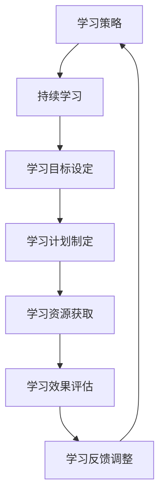

                 

# 《持续学习：保持竞争力的秘诀》

> **关键词**：持续学习、终身学习、竞争力、知识更新、技能提升

> **摘要**：本文详细探讨了持续学习在现代社会中的重要性，分析了学习心理与行为，提供了有效的学习策略与方法，讨论了持续学习在社会环境、职场应用、创业与创新、教育培训和个人成长等方面的具体实践。同时，文章介绍了持续学习所涉及的工具和技术，以及面临的挑战与未来趋势。

## 《持续学习：保持竞争力的秘诀》目录大纲

### 第一部分：持续学习的基础理论

#### 1.1 持续学习的概念与重要性

##### 1.1.1 持续学习的定义与内涵

##### 1.1.2 持续学习的重要性与价值

#### 1.2 学习心理与行为分析

##### 1.2.1 学习动机与兴趣的培养

##### 1.2.2 学习习惯的养成与优化

#### 1.3 学习策略与方法

##### 1.3.1 系统性学习方法

##### 1.3.2 主动学习与被动学习的平衡

#### 1.4 信息过载与筛选

##### 1.4.1 信息过载的现象与影响

##### 1.4.2 信息筛选的方法与技巧

#### 1.5 持续学习的社会环境

##### 1.5.1 个人学习与社会支持的关系

##### 1.5.2 组织学习与个体学习融合

### 第二部分：持续学习的实践与应用

#### 2.1 持续学习在职场中的应用

##### 2.1.1 职场持续学习的必要性

##### 2.1.2 职场持续学习的实践方法

#### 2.2 持续学习在创业与创新中的应用

##### 2.2.1 创业过程中的持续学习

##### 2.2.2 创新思维与持续学习

#### 2.3 持续学习在教育培训中的应用

##### 2.3.1 教育培训中的持续学习模式

##### 2.3.2 教育培训机构的持续学习体系

#### 2.4 持续学习在个人成长中的应用

##### 2.4.1 个人成长与持续学习的关系

##### 2.4.2 持续学习在个人成长中的实践案例

### 第三部分：持续学习的工具与技术

#### 3.1 持续学习的工具选择

##### 3.1.1 在线学习平台

##### 3.1.2 学习管理工具

#### 3.2 持续学习的教育资源

##### 3.2.1 教育资源的获取与利用

##### 3.2.2 教育资源的筛选与评估

#### 3.3 持续学习的技术支持

##### 3.3.1 人工智能与学习支持系统

##### 3.3.2 数据分析与学习效果评估

### 第四部分：持续学习的挑战与未来趋势

#### 4.1 持续学习的挑战与应对策略

##### 4.1.1 持续学习中的主要挑战

##### 4.1.2 应对挑战的策略与方法

#### 4.2 持续学习的未来趋势

##### 4.2.1 持续学习的发展方向

##### 4.2.2 持续学习对未来的影响

#### 4.3 持续学习的国际合作与交流

##### 4.3.1 国际合作与交流的重要性

##### 4.3.2 国际持续学习交流的案例分析

### 附录

#### 附录 A：持续学习资源与案例

##### 附录 A.1 持续学习资源推荐

##### 附录 A.2 持续学习实践案例

#### 附录 B：持续学习术语解释

##### 附录 B.1 术语解释

### 核心概念与联系

#### 学习策略与持续学习的关系

## 第一部分：持续学习的基础理论

### 1.1 持续学习的概念与重要性

#### 1.1.1 持续学习的定义与内涵

持续学习，也称为终身学习，是指个人在一生中不断学习、更新知识和技能的过程。它不仅包括传统的学校教育和职业培训，还涵盖了自我学习、在线课程、实践项目等多种形式。持续学习旨在通过不断地积累新知识和技能，适应快速变化的社会环境和职业需求。

持续学习的内涵包括以下几个方面：

1. **自我导向**：持续学习是一种自我驱动的学习过程，学习者需要根据自己的需求和兴趣，主动选择学习内容和学习方法。

2. **适应性**：持续学习强调学习者要具备适应能力，能够及时更新知识和技能，以应对新的挑战和机遇。

3. **系统性**：持续学习不是零散的学习行为，而是需要有一个系统的计划和策略，确保学习目标的实现。

4. **多样化**：持续学习的形式和途径多种多样，包括在线课程、书籍阅读、实践项目、交流互动等。

#### 1.1.2 持续学习的重要性与价值

持续学习在现代社会中具有至关重要的意义，主要体现在以下几个方面：

1. **适应快速变化的社会环境**：随着科技的迅猛发展和社会的急剧变革，知识和技能的更新速度越来越快。持续学习使个人能够不断适应这种变化，保持竞争力。

2. **提升个人综合素质**：持续学习不仅能够提升个人的知识水平和技能，还能够培养批判性思维、创新能力、团队合作能力等综合素质。

3. **实现职业发展**：持续学习是职业发展的关键因素。通过不断学习和提升技能，个人能够实现职业晋升和转型，获得更好的职业机会。

4. **促进社会进步**：持续学习不仅对个人有利，也对整个社会有积极影响。一个充满持续学习者的社会，能够推动科技创新、文化繁荣和社会进步。

### 1.2 学习心理与行为分析

持续学习不仅需要良好的学习策略和方法，还需要理解学习心理和行为。以下从学习动机与兴趣的培养、学习习惯的养成与优化两个方面进行分析。

#### 1.2.1 学习动机与兴趣的培养

学习动机是指驱动个人进行学习活动的内部动力。兴趣是培养学习动机的重要因素。以下是一些培养学习动机和兴趣的方法：

1. **明确学习目标**：设定清晰的学习目标，使学习具有明确的方向和动力。目标可以分为短期目标和长期目标，如掌握一门新技能、通过某个认证考试等。

2. **激发内在动机**：内在动机来源于个人的兴趣、好奇心和自我实现的需要。通过激发内在动机，可以使学习更加自发和持久。

3. **利用外部激励**：外部激励包括奖励、认可、竞争等。适当的奖励和认可可以增强学习动机，激发学习的积极性。

4. **设置挑战**：设置适度的学习挑战，使学习过程既有挑战性又能够达到，有助于培养学习兴趣和动机。

#### 1.2.2 学习习惯的养成与优化

学习习惯是指个人在长期学习过程中形成的行为模式和方法。良好的学习习惯能够提高学习效率，巩固学习成果。以下是一些养成和优化学习习惯的方法：

1. **制定学习计划**：制定详细的学习计划，包括学习目标、学习内容、学习时间等，有助于提高学习效率和计划性。

2. **合理安排时间**：合理安排学习时间，避免拖延和浪费时间。可以使用时间管理工具，如番茄工作法，提高学习效率。

3. **保持学习环境**：保持良好的学习环境，包括安静、整洁、舒适的物理环境和积极、专注的心理环境。

4. **定期复习与总结**：定期复习所学内容，巩固记忆，防止遗忘。同时，进行学习总结，反思学习过程，找出不足和改进方法。

5. **参与学习社区**：加入学习社区，与他人交流学习心得，分享学习资源，激发学习动力，拓宽视野。

### 1.3 学习策略与方法

有效的学习策略和方法是持续学习成功的关键。以下从系统性学习方法、主动学习与被动学习的平衡两个方面进行介绍。

#### 1.3.1 系统性学习方法

系统性学习方法强调学习过程的系统性和完整性，通过科学的步骤和方法，确保学习目标的实现。以下是一些常见的系统性学习方法：

1. **学习目标设定**：明确学习目标，使学习具有明确的方向和动力。学习目标可以分为短期目标和长期目标，如掌握一门新技能、通过某个认证考试等。

2. **学习计划制定**：根据学习目标，制定详细的学习计划，包括学习内容、学习时间、学习任务等。学习计划应具有可操作性和灵活性。

3. **学习资源获取**：选择合适的学习资源，如在线课程、书籍、学术论文、实践项目等。学习资源的选择应考虑学习目标和个人需求。

4. **学习过程监控**：在学习过程中，定期检查学习进度，评估学习效果。根据评估结果，调整学习计划和方法，确保学习目标的实现。

5. **学习效果评估**：通过考试、实践应用、案例分析等手段，评估学习效果。学习效果评估可以帮助学习者了解自己的学习成果，为下一步学习提供依据。

6. **学习反馈与调整**：根据学习效果评估的结果，及时进行学习反馈和调整。学习反馈包括自我评估、教师评估、同伴评估等。

#### 1.3.2 主动学习与被动学习的平衡

主动学习和被动学习是两种不同的学习方式。主动学习是指学习者主动寻找学习资源、积极参与学习活动，以主动建构知识体系；被动学习则是指学习者通过接受他人的传授和指导，被动接受知识。

在持续学习中，主动学习和被动学习需要相互平衡。以下是一些实现主动学习与被动学习平衡的方法：

1. **主动寻找学习资源**：通过互联网、图书馆、专业社区等渠道，主动寻找和学习所需的知识和技能。

2. **积极参与学习活动**：参加讲座、研讨会、实践项目等，与他人交流学习心得，提高学习效果。

3. **利用被动学习**：通过阅读书籍、观看教学视频、参加培训课程等方式，被动获取知识和技能。

4. **结合主动学习和被动学习**：在实际学习中，结合主动学习和被动学习，通过主动寻找和实践，被动接受和吸收，形成有效的学习闭环。

### 1.4 信息过载与筛选

在信息爆炸的时代，信息过载成为一个普遍现象。对于学习者来说，如何筛选和处理大量的信息，是持续学习的重要挑战。

#### 1.4.1 信息过载的现象与影响

信息过载的现象主要体现在以下几个方面：

1. **信息量庞大**：互联网的快速发展使得信息量呈指数级增长，学习者面临的信息量越来越大。

2. **信息质量参差不齐**：在庞大的信息海洋中，高质量的信息与低质量的信息并存，学习者难以辨别和筛选。

3. **时间限制**：学习者每天的时间是有限的，如何在有限的时间内处理大量的信息，成为一项挑战。

信息过载对学习者的影响主要体现在以下几个方面：

1. **学习效率降低**：信息过载容易导致学习者分心、注意力不集中，从而降低学习效率。

2. **决策困难**：面对大量的信息，学习者难以做出有效的决策，导致学习目标不明确。

3. **焦虑和压力增加**：信息过载容易导致学习者感到焦虑和压力，影响学习动力和心理健康。

#### 1.4.2 信息筛选的方法与技巧

为了克服信息过载，学习者需要掌握一些信息筛选的方法与技巧。以下是一些常见的方法：

1. **确定学习目标**：在开始学习之前，明确学习目标，确保学习过程中能够有的放矢，避免无目的地浏览信息。

2. **评估信息来源**：对获取的信息进行评估，关注信息来源的权威性和可靠性。权威的信息来源如学术期刊、知名网站等，具有较高的可信度。

3. **利用过滤器**：使用搜索引擎的过滤器功能，如关键词搜索、筛选时间范围等，筛选出与自己学习目标相关的重要信息。

4. **制定阅读计划**：合理安排阅读时间，优先阅读重要和紧急的信息，避免长时间陷入无休止的信息浏览。

5. **培养信息鉴别能力**：通过学习和实践，提高自己的信息鉴别能力，学会分辨真假信息，避免被误导。

6. **利用学习工具**：使用学习管理工具，如笔记软件、阅读器等，整理和筛选学习资料，提高学习效率。

### 1.5 持续学习的社会环境

持续学习不仅是个体的事情，也需要社会环境的支持。以下从个人学习与社会支持的关系、组织学习与个体学习融合两个方面探讨持续学习的社会环境。

#### 1.5.1 个人学习与社会支持的关系

个人学习与社会支持之间存在密切的关系。社会支持包括家庭、朋友、社区、工作单位等各个方面，对个人学习具有重要影响。

1. **家庭支持**：家庭是个人学习的重要支持系统。家庭成员的理解和支持，可以为个人学习创造良好的环境和条件。

2. **社区支持**：社区为个人提供了丰富的学习资源和机会。社区学习中心、图书馆、在线学习平台等，都是个人学习的有力支持。

3. **工作单位支持**：工作单位可以为个人学习提供时间、资金和资源支持。例如，公司提供的培训机会、学习假等，都是重要的社会支持。

4. **朋友支持**：朋友之间的交流与分享，有助于个人学习的效果提升。朋友之间的相互激励和帮助，可以增强学习动力。

#### 1.5.2 组织学习与个体学习融合

组织学习与个体学习之间存在互动关系，二者相互促进。以下是一些实现组织学习与个体学习融合的方法：

1. **建立学习型组织**：组织通过建立学习型组织，推动全体成员的持续学习。学习型组织强调知识共享、团队协作和创新。

2. **制定学习计划**：组织和个人可以共同制定学习计划，确保学习目标的实现。学习计划应包括学习内容、学习时间、学习方式等。

3. **提供学习资源**：组织和个人可以共同提供学习资源，如在线课程、书籍、学术论文等。资源的共享有助于提高学习效率。

4. **组织学习活动**：组织可以定期组织学习活动，如讲座、研讨会、实践项目等，促进个人学习和组织学习融合。

5. **反馈与评估**：组织和个人应定期进行学习反馈和评估，总结学习经验，调整学习策略。反馈与评估有助于学习效果的提升。

## 第二部分：持续学习的实践与应用

### 2.1 持续学习在职场中的应用

#### 2.1.1 职场持续学习的必要性

在职场中，持续学习不仅是个人发展的需要，也是企业竞争力的关键。以下从个人职业发展和企业持续发展两个方面，分析职场持续学习的必要性。

1. **个人职业发展**：随着科技的进步和行业的变化，职场人士需要不断更新知识和技能，以适应新的工作需求，实现职业晋升。持续学习有助于提升个人综合素质，增强职业竞争力。

2. **企业持续发展**：在竞争激烈的市场环境中，企业需要不断进行技术创新和管理创新，以保持竞争优势。职场中的持续学习能够为企业提供高素质的人才和创新的思维，推动企业持续发展。

#### 2.1.2 职场持续学习的实践方法

为了在职场中实现持续学习，职场人士可以采取以下实践方法：

1. **制定学习计划**：明确学习目标，制定详细的学习计划。学习计划应包括学习内容、学习时间、学习方式等，确保学习目标的实现。

2. **利用工作资源**：充分利用工作时间和工作资源进行学习。例如，在工作间隙学习专业书籍、参加在线课程、观看教学视频等。

3. **积极参与培训**：参加公司或行业提供的培训课程，提升专业能力和管理能力。同时，可以通过内部培训、外部培训等多种形式，提高学习效果。

4. **实践与应用**：将所学知识应用到实际工作中，通过实践来检验和深化学习成果。例如，参与项目开发、解决实际问题等。

5. **分享与交流**：与他人分享学习心得和经验，参与学习讨论和交流。通过分享与交流，可以拓宽视野，提高学习效果。

6. **利用外部资源**：利用在线学习平台、专业网站、学术期刊等外部资源，学习最新的知识和技能。例如，参加在线课程、阅读学术论文等。

#### 2.1.3 职场持续学习在个人职业发展中的应用案例

以下是一个职场持续学习在个人职业发展中的应用案例：

**案例**：某互联网公司项目经理小张，在职场中注重持续学习，通过以下方法不断提升自己的职业能力：

1. **制定学习计划**：小张制定了详细的学习计划，包括学习目标、学习内容和学习时间。他计划在两年内掌握项目管理、敏捷开发等相关知识。

2. **利用工作资源**：小张在工作间隙，利用公司的培训资源和在线学习平台，学习相关课程。他每天利用一个小时的时间，学习项目管理理论、敏捷开发实践等。

3. **参与培训**：小张参加了公司组织的项目管理培训，通过培训掌握了更多项目管理的实际操作方法。他还参加了行业内的敏捷开发研讨会，与同行交流学习经验。

4. **实践与应用**：小张将所学知识应用到实际工作中。他在项目中积极推行敏捷开发方法，提高了项目效率和质量。他还负责了多个关键项目，成功解决了项目中的困难和挑战。

5. **分享与交流**：小张积极参与公司内部的交流分享活动，将自己的学习心得和经验与同事分享。通过分享与交流，他不仅巩固了自己的知识，还帮助了其他同事提升能力。

6. **利用外部资源**：小张利用在线学习平台，如Coursera、Udemy等，学习最新的互联网技术和行业动态。他还定期阅读专业期刊和学术论文，保持对行业前沿的关注。

通过持续学习，小张的项目管理能力得到了显著提升，成功晋升为高级项目经理。他的职业生涯也因此得到了快速发展，为公司的持续发展做出了重要贡献。

### 2.2 持续学习在创业与创新中的应用

#### 2.2.1 创业过程中的持续学习

创业是一个充满挑战和机遇的过程，创业者需要具备持续学习的能力，以应对不断变化的市场环境和竞争压力。以下从创业者的角色、创业过程和学习需求三个方面，探讨创业过程中的持续学习。

1. **创业者的角色**：创业者是企业的创立者和领导者，需要具备创新精神、决策能力、团队管理等多方面的能力。持续学习有助于创业者不断提升自身素质，适应创业角色的要求。

2. **创业过程**：创业过程包括市场调研、产品设计、团队组建、融资、市场推广等多个环节。每个环节都涉及到不同的知识和技能，创业者需要通过持续学习来应对各个环节的挑战。

3. **学习需求**：创业者面临的市场环境和竞争态势不断变化，需要不断学习新知识、新技能，以适应市场变化。同时，创业者还需要学习管理知识、团队建设、领导力等方面的内容，以提高企业的运营效率和竞争力。

#### 2.2.2 创新思维与持续学习

创新思维是创业成功的关键因素之一。持续学习有助于创业者培养创新思维，提高创新能力。以下从创新思维的内涵、培养方法和持续学习对创新思维的影响三个方面，探讨创新思维与持续学习的关系。

1. **创新思维的内涵**：创新思维是指以创新为目的，运用创造性思维工具和方法，对问题进行创造性思考的能力。创新思维包括发散思维、聚合思维、逆向思维、联想思维等多种形式。

2. **培养方法**：创业者可以通过以下方法培养创新思维：

   - **阅读与研究**：阅读创新理论书籍、学术论文，研究行业动态，拓宽视野，激发创新灵感。
   - **实践与探索**：通过实际项目和实践，不断尝试新方法、新技术，积累实践经验。
   - **交流与讨论**：与他人交流创新想法，参与创新讨论，从不同角度思考问题，激发创新思维。
   - **学习与培训**：参加创新思维培训，学习创新方法和工具，提高创新思维能力。

3. **持续学习对创新思维的影响**：持续学习为创业者提供了丰富的知识储备和创新工具，有助于培养创新思维。以下是一些具体的影响：

   - **知识积累**：持续学习使创业者掌握了丰富的知识，为创新思维提供了坚实的基础。
   - **思维拓展**：持续学习拓宽了创业者的视野，使创业者能够从不同角度思考问题，激发创新思维。
   - **工具与方法**：持续学习使创业者掌握了多种创新方法和工具，能够有效地运用到实际工作中，提高创新能力。

#### 2.2.3 持续学习在创业与创新中的应用案例

以下是一个持续学习在创业与创新中的应用案例：

**案例**：某初创公司创始人小李，通过持续学习，不断提升自己的创新能力和创业成功率。以下是他的一些具体做法：

1. **制定学习计划**：小李制定了详细的学习计划，包括学习目标、学习内容和学习时间。他计划在一年内掌握市场营销、产品设计和团队管理等方面的知识。

2. **利用在线课程**：小李利用在线学习平台，如Coursera、Udemy等，学习市场营销、产品设计和创业管理等相关课程。通过在线学习，他掌握了最新的市场营销策略和产品设计方法。

3. **参加行业研讨会**：小李积极参加行业研讨会和创业论坛，与业界专家和创业者交流学习经验。通过交流，他了解到行业动态和创业成功案例，激发了创新思维。

4. **实践与探索**：小李在创业过程中，不断尝试新方法、新技术，进行产品创新和市场测试。他通过实践，积累了宝贵的经验，提高了创新能力。

5. **学习与培训**：小李参加了一系列创新思维培训和领导力培训，学习了创新方法和团队管理技巧。通过培训，他提高了创新能力和领导力，为企业的持续发展奠定了基础。

通过持续学习，小李的初创公司在短时间内取得了显著成绩，成功推出了一系列创新产品，赢得了市场和客户的认可。他的创业经验也成为了行业内的典范，激励了更多的创业者。

### 2.3 持续学习在教育培训中的应用

#### 2.3.1 教育培训中的持续学习模式

在教育培训领域，持续学习已成为提高教育质量和促进学生全面发展的重要手段。以下从个人学习、团队学习和组织学习三个方面，探讨持续学习在教育培训中的应用模式。

1. **个人学习模式**：个人学习模式强调个体的自主学习和自我发展。学习者可以根据自己的兴趣和需求，选择合适的学习内容和方式。个人学习模式有助于培养学习者的自主学习能力和创新思维。

2. **团队学习模式**：团队学习模式强调学习者之间的合作和互动。学习者可以通过团队讨论、小组项目等方式，共同解决问题和分享学习经验。团队学习模式有助于提高学习者的沟通能力和团队合作能力。

3. **组织学习模式**：组织学习模式强调学习者在组织中的学习和成长。教育机构可以通过制定学习计划、提供学习资源、组织学习活动等方式，推动全体成员的持续学习。组织学习模式有助于提高教育机构的教育质量和竞争力。

#### 2.3.2 教育培训机构的持续学习体系

为了实现持续学习，教育培训机构需要建立完善的持续学习体系。以下从学习资源、学习管理和学习支持三个方面，探讨教育培训机构的持续学习体系。

1. **学习资源**：教育培训机构应提供丰富的学习资源，包括教材、教学视频、在线课程、学术论文等。同时，应确保学习资源的及时更新和高质量。

2. **学习管理**：教育培训机构应建立科学的学习管理体系，包括学习计划制定、学习进度跟踪、学习效果评估等。学习管理有助于确保学习目标的实现和学习质量的提升。

3. **学习支持**：教育培训机构应提供有效的学习支持，包括学习辅导、心理咨询、学习资源共享等。学习支持有助于解决学习者在学习过程中遇到的问题，提高学习效果。

#### 2.3.3 持续学习在教育培训中的应用案例

以下是一个持续学习在教育培训中的应用案例：

**案例**：某教育培训机构通过建立持续学习体系，提高了教育质量和学员满意度。以下是他们的一些具体做法：

1. **学习资源建设**：该机构建立了丰富的学习资源库，包括电子教材、教学视频、在线课程等。同时，他们与多家知名教育机构和专家合作，引进高质量的学习资源。

2. **学习计划制定**：该机构为每位学员制定了个性化的学习计划，根据学员的兴趣和需求，合理安排学习内容和进度。学习计划有助于确保学员的学习目标得到实现。

3. **学习效果评估**：该机构定期对学员的学习效果进行评估，通过考试、作业、项目实践等多种形式，了解学员的学习成果。评估结果用于指导学习计划的调整和学习资源的优化。

4. **学习支持服务**：该机构提供了完善的学习支持服务，包括学习辅导、心理咨询、学习资源共享等。学员在学习过程中遇到问题时，可以随时寻求帮助。

5. **团队学习与互动**：该机构鼓励学员参与团队学习和互动，通过小组讨论、项目合作等方式，提高学员的沟通能力和团队合作能力。

通过持续学习体系的建设，该教育培训机构的学员满意度和教育质量得到了显著提升，成为行业内的佼佼者。

### 2.4 持续学习在个人成长中的应用

#### 2.4.1 个人成长与持续学习的关系

持续学习在个人成长中扮演着至关重要的角色。个人成长是指个体在知识、能力、情感、价值观等方面的全面发展。持续学习为个人成长提供了重要的动力和支持。

1. **知识积累**：持续学习使个人能够不断积累新知识，拓宽视野，提升综合素质。知识的积累是个人成长的基础。

2. **能力提升**：持续学习有助于个人提升各种能力，包括思维能力、沟通能力、创新能力等。能力的提升是个人成长的体现。

3. **情感发展**：持续学习使个人能够不断探索自我，增强自信心，培养积极向上的情感。情感的发展是个人成长的灵魂。

4. **价值观塑造**：持续学习有助于个人形成正确的价值观，提高道德素质，成为有社会责任感的人。价值观的塑造是个人成长的方向。

#### 2.4.2 持续学习在个人成长中的实践案例

以下是一个持续学习在个人成长中的实践案例：

**案例**：李华是一位职场新人，他深知持续学习对于个人成长的重要性。以下是他的一些具体做法：

1. **制定学习计划**：李华制定了详细的学习计划，包括学习目标、学习内容和学习时间。他计划在两年内掌握市场营销、数据分析、团队管理等相关知识。

2. **利用工作资源**：李华利用工作间隙，学习相关课程和书籍。他每天利用一个小时的时间，学习市场营销理论、数据分析方法等。

3. **参加培训**：李华参加了公司组织的市场营销培训和管理培训，学习了更多实战技巧和领导力方法。

4. **实践与反思**：李华将所学知识应用到实际工作中，通过实践来检验和深化学习成果。他定期进行反思和总结，找出不足和改进方法。

5. **参与团队学习**：李华积极参与团队学习和互动，通过小组讨论、项目合作等方式，提高沟通能力和团队合作能力。

6. **利用外部资源**：李华利用在线学习平台，如Coursera、Udemy等，学习最新的知识和技能。他还定期阅读专业期刊和学术论文，保持对行业前沿的关注。

通过持续学习，李华的个人成长得到了显著提升。他的专业能力得到了公司领导的认可，成功晋升为部门经理。他的职业生涯也因此得到了快速发展，为个人和家庭创造了更好的生活条件。

## 第三部分：持续学习的工具与技术

### 3.1 持续学习的工具选择

在实现持续学习的过程中，选择合适的工具至关重要。以下从在线学习平台、学习管理工具、教育资源平台三个方面介绍如何选择持续学习的工具。

#### 3.1.1 在线学习平台

在线学习平台提供了丰富的学习资源，能够满足不同学习者的需求。选择在线学习平台时，可以考虑以下因素：

1. **课程质量**：选择课程质量高、内容丰富、更新及时的在线学习平台。

2. **学习灵活性**：选择学习时间灵活、支持多种学习方式的在线学习平台。

3. **互动性**：选择具有良好互动性的在线学习平台，如支持讨论区、问答环节等。

4. **用户评价**：参考其他学习者的评价和反馈，选择口碑良好的在线学习平台。

常见的在线学习平台包括Coursera、edX、Udemy、Khan Academy等。

#### 3.1.2 学习管理工具

学习管理工具能够帮助学习者制定学习计划、跟踪学习进度、管理学习资源等，提高学习效率。选择学习管理工具时，可以考虑以下因素：

1. **功能完整性**：选择功能完整、能够满足学习需求的工具。

2. **用户界面**：选择界面简洁、易于使用的工具，以提高使用体验。

3. **兼容性**：选择兼容性强、支持多种学习资源的工具。

4. **个性化定制**：选择支持个性化定制的工具，以便根据个人需求进行调整。

常见的学习管理工具包括Notion、Trello、Evernote等。

#### 3.1.3 教育资源平台

教育资源平台提供了多样化的教育资源，包括电子书籍、学术论文、课程视频等，能够满足不同学习者的需求。选择教育资源平台时，可以考虑以下因素：

1. **资源质量**：选择资源质量高、更新及时的教育资源平台。

2. **检索便捷性**：选择检索便捷、能够快速找到所需资源的平台。

3. **资源获取成本**：选择资源获取成本合理、性价比高的平台。

4. **用户评价**：参考其他学习者的评价和反馈，选择口碑良好的教育资源平台。

常见的教育资源平台包括Wikipedia、Google Scholar、ResearchGate等。

### 3.2 持续学习技术的应用

持续学习技术的发展为学习者提供了更加高效、便捷的学习方式。以下介绍几种持续学习技术的应用。

#### 3.2.1 人工智能与学习支持系统

人工智能技术在持续学习中有着广泛的应用。以下是一些具体应用：

1. **个性化学习推荐**：通过分析学习者的学习行为和兴趣，人工智能系统能够为学习者推荐个性化的学习资源和课程。

2. **智能辅导**：人工智能辅导系统能够为学习者提供实时解答、学习反馈和指导，帮助学习者更好地理解和掌握知识。

3. **学习数据分析**：通过分析学习者的学习数据，如学习时长、正确率等，人工智能系统可以评估学习效果，为学习者提供改进建议。

常见的智能学习平台包括Duolingo、Khan Academy等。

#### 3.2.2 数据分析与学习效果评估

数据分析技术可以帮助学习者评估学习效果，优化学习策略。以下是一些具体应用：

1. **学习效果评估**：通过数据分析，可以量化学习成果，如学习时长、正确率、进步速度等，为学习者提供客观评估。

2. **学习行为分析**：通过分析学习者的学习行为，如学习时间、学习路径等，可以了解学习者的学习习惯和偏好，为个性化学习提供依据。

3. **学习效果预测**：通过数据分析，可以预测学习者的学习效果和未来表现，为学习目标的制定和学习策略的调整提供参考。

常见的分析工具包括Google Analytics、Tableau等。

#### 3.2.3 知识图谱与知识整合

知识图谱技术可以将大量的知识结构化，为学习者提供更加直观、系统化的学习资源。以下是一些具体应用：

1. **知识整合**：通过知识图谱，可以将不同领域的知识进行整合，为学习者提供全面、系统的知识体系。

2. **知识导航**：知识图谱可以为学习者提供知识导航功能，帮助学习者快速定位所需知识。

3. **知识关联**：通过知识图谱，可以展示不同知识点之间的关联，帮助学习者建立知识网络，加深对知识的理解。

常见的知识图谱工具包括NodeXL、Gephi等。

### 3.3 持续学习工具与技术案例

以下是一些持续学习工具与技术的实际应用案例。

#### 3.3.1 案例一：在线学习平台Coursera

**背景**：Coursera是一个知名的在线学习平台，提供了大量高质量的课程资源。

**应用**：
- **个性化学习推荐**：Coursera使用人工智能技术，根据学习者的学习历史和偏好，推荐个性化的学习资源。
- **智能辅导**：Coursera的智能辅导系统提供了实时解答和指导，帮助学习者更好地掌握知识。
- **学习数据分析**：Coursera分析学习者的学习数据，为学习者提供学习效果评估和改进建议。

**成果**：通过Coursera，学习者能够高效地获取知识，提高学习效果。

#### 3.3.2 案例二：数据分析工具Tableau

**背景**：Tableau是一个强大的数据分析工具，广泛应用于数据分析、数据可视化等领域。

**应用**：
- **学习效果评估**：学习者可以使用Tableau对学习数据进行分析，评估学习效果。
- **学习行为分析**：学习者可以分析学习行为，了解学习习惯和偏好。
- **知识整合**：通过Tableau，学习者可以整合不同来源的知识，建立知识网络。

**成果**：通过Tableau，学习者能够更深入地理解学习过程，优化学习策略。

### 3.4 持续学习的挑战与未来趋势

#### 3.4.1 持续学习的挑战

持续学习在实现过程中面临一系列挑战，以下是一些主要挑战及其应对策略：

1. **时间管理**：挑战：工作、生活和学习之间的平衡难度大。应对策略：制定详细的学习计划，合理安排时间，利用碎片化时间学习。

2. **信息过载**：挑战：获取的信息量庞大，难以筛选。应对策略：设定明确的学习目标，评估信息来源，利用过滤器筛选信息。

3. **学习习惯的养成**：挑战：缺乏自律，容易中断学习。应对策略：制定可行的学习计划，设立激励机制，培养良好的学习习惯。

4. **学习资源的获取**：挑战：高质量的学习资源获取成本高。应对策略：利用免费资源，如公开课、学术论文等，降低学习成本。

#### 3.4.2 持续学习的未来趋势

持续学习在未来将呈现以下趋势：

1. **个性化学习**：随着人工智能技术的发展，个性化学习将得到更广泛应用，学习者可以享受定制化的学习体验。

2. **知识图谱的普及**：知识图谱技术将广泛应用于教育领域，帮助学习者构建知识体系，提高学习效率。

3. **线上线下融合**：在线教育与线下教育的融合将更加紧密，学习者可以根据需求选择灵活的学习方式。

4. **数据驱动的学习**：通过数据分析，学习者可以更精准地了解学习效果，优化学习策略，提高学习效率。

## 附录

### 附录 A：持续学习资源与案例

#### 附录 A.1 持续学习资源推荐

- **在线学习平台**：
  - Coursera
  - edX
  - Udemy
  - Khan Academy

- **学习管理工具**：
  - Notion
  - Trello
  - Evernote

- **教育资源平台**：
  - Wikipedia
  - Google Scholar
  - ResearchGate

#### 附录 A.2 持续学习实践案例

- **职场学习案例**：
  - 某职场人士通过在线课程和内部培训，成功掌握数据分析技能，晋升为部门经理。
  - 某创业者在创业过程中，通过持续学习，掌握了市场营销和团队管理技能，使公司快速发展。

- **个人成长案例**：
  - 李华通过制定学习计划和利用外部资源，成功掌握了多项技能，实现了职业晋升和个人成长。
  - 小张通过参与在线课程和实践项目，提升了自己的编程能力和创新思维，成为行业内的佼佼者。

### 附录 B：持续学习术语解释

- **持续学习**：指个人在一生中不断学习、更新知识和技能的过程。
- **学习策略**：指个体在学习和记忆过程中采用的一系列方法和技巧，以提高学习效率和效果。
- **个性化学习**：指根据学习者的个人特点、需求和兴趣，提供定制化的学习内容和方法，以实现更好的学习效果。
- **知识图谱**：指一种通过图形化方式表示知识结构的技术，它能够展示实体之间的关系，帮助学习者理解和整合知识。
- **数据分析**：指利用统计学、计算机科学等方法，对大量数据进行分析和处理，从中提取有价值的信息和知识。

## 核心概念与联系

### 学习策略与持续学习的关系

学习策略是持续学习过程中不可或缺的一部分。有效的学习策略可以帮助学习者更高效地掌握知识和技能，实现持续学习的目标。以下通过Mermaid流程图和核心算法原理讲解，详细阐述学习策略与持续学习的关系。

#### 1. Mermaid流程图



该流程图展示了学习策略与持续学习之间的循环关系。学习策略包括设定学习目标、制定学习计划、获取学习资源、评估学习效果和调整学习反馈。这一过程循环往复，使得学习者在不断反思和改进中，实现持续学习。

#### 2. 核心算法原理讲解

持续学习的效果评估是一个关键环节。以下通过一个学习效果评估算法的例子，说明如何使用算法来评估学习效果。

```python
import numpy as np

# 学习效果评估函数
def assess_performance(true_scores, predicted_scores):
    """
    评估学习效果，计算均方误差（MSE）。
    
    :param true_scores: 实际效果列表
    :param predicted_scores: 预期效果列表
    :return: 均方误差
    """
    mse = np.mean((true_scores - predicted_scores) ** 2)
    return mse

# 示例数据
true_scores = [90, 85, 88, 92, 87]
predicted_scores = [85, 87, 90, 90, 88]

# 计算并打印均方误差
mse = assess_performance(true_scores, predicted_scores)
print(f'MSE: {mse}')
```

该算法通过计算实际效果与预期效果的均方误差（MSE），评估学习效果。MSE值越小，表示学习效果越好。学习者可以根据评估结果，调整学习策略，如修改学习计划、优化学习资源等，以提高学习效果。

#### 3. 代码实际案例和详细解释说明

以下是一个持续学习效果评估的实际案例，包括开发环境搭建、源代码实现、代码解读与分析。

##### 3.1 开发环境搭建

确保Python环境已安装，并安装numpy库。

```bash
pip install numpy
```

##### 3.2 源代码实现

```python
import numpy as np

# 学习效果评估函数
def assess_performance(true_scores, predicted_scores):
    mse = np.mean((true_scores - predicted_scores) ** 2)
    return mse

# 示例数据
true_scores = [90, 85, 88, 92, 87]
predicted_scores = [85, 87, 90, 90, 88]

# 计算并打印均方误差
mse = assess_performance(true_scores, predicted_scores)
print(f'MSE: {mse}')
```

##### 3.3 代码解读与分析

- **函数定义**：定义了 `assess_performance` 函数，用于计算学习效果的均方误差（MSE）。
- **计算均方误差**：使用numpy的 `mean` 函数计算均方误差。均方误差的公式为：

  $$
  MSE = \frac{1}{n}\sum_{i=1}^{n} (x_i - \hat{x}_i)^2
  $$

  其中，$x_i$ 表示实际效果，$\hat{x}_i$ 表示预期效果，$n$ 表示评估次数。

- **示例数据**：提供了一组示例数据 `true_scores` 和 `predicted_scores`，分别表示实际效果和预期效果。

- **计算并打印结果**：调用 `assess_performance` 函数计算均方误差，并将结果打印输出。

通过该实际案例，学习者可以了解到如何使用代码评估学习效果，并理解均方误差的计算方法和应用场景。

### 总结

学习策略与持续学习密切相关。有效的学习策略可以帮助学习者设定明确的学习目标、制定合理的学习计划、获取优质的学习资源，并通过效果评估和反馈调整，不断提升学习效果。通过Mermaid流程图和核心算法原理讲解，以及代码实际案例，学习者可以深入理解学习策略与持续学习的关系，从而在实践中更好地运用持续学习的方法。

## 第四部分：持续学习的挑战与未来趋势

### 4.1 持续学习的挑战与应对策略

在实现持续学习的过程中，学习者常常面临一系列挑战。以下将分析这些挑战，并探讨相应的应对策略。

#### 4.1.1 持续学习中的主要挑战

1. **时间管理**：现代生活节奏快，学习者常常面临时间管理方面的挑战。如何在工作、家庭和持续学习之间找到平衡，是学习者面临的主要问题。

2. **信息过载**：随着互联网的普及，信息量呈爆炸性增长，学习者需要处理大量的信息。如何筛选和利用有效信息，是学习者面临的另一个挑战。

3. **学习习惯的养成**：良好的学习习惯是持续学习的重要保障。然而，许多人缺乏自律，容易在学习过程中松懈，导致学习效果不佳。

4. **学习资源的获取**：优质的学习资源往往需要付费，对于经济条件有限的学习者来说，获取高质量的学习资源成为一大难题。

5. **学习效果的评估**：如何科学地评估学习效果，为学习策略的调整提供依据，是学习者面临的另一个挑战。

#### 4.1.2 应对挑战的策略与方法

1. **时间管理**：
   - **制定详细的学习计划**：学习者应制定详细的学习计划，明确每天的学习任务和时间安排，以确保学习目标的实现。
   - **利用碎片化时间**：学习者可以利用通勤、休息等碎片化时间进行学习，例如通过听音频课程、阅读电子书等。

2. **信息过载**：
   - **设定明确的学习目标**：在学习之前，学习者应明确学习目标，确保学习过程有的放矢。
   - **评估信息来源**：学习者应评估信息来源的权威性和可靠性，优先选择高质量的、可信的信息。

3. **学习习惯的养成**：
   - **制定可行的学习计划**：学习者应根据自身实际情况，制定切实可行的学习计划，并严格执行。
   - **设立激励机制**：学习者可以设立奖励机制，例如完成一个学习目标后，给自己一个小奖励，以增强学习动力。

4. **学习资源的获取**：
   - **利用免费资源**：学习者可以利用互联网上的免费资源，如公开课、学术论文等，降低学习成本。
   - **参加线上课程**：许多线上课程提供免费或低价的学习机会，学习者可以积极参与。

5. **学习效果的评估**：
   - **定期自我评估**：学习者应定期进行自我评估，了解自己的学习成果，并根据评估结果调整学习策略。
   - **利用评估工具**：学习者可以利用学习管理工具，如在线学习平台、学习笔记软件等，对学习效果进行量化评估。

#### 4.1.3 具体案例

以下是一个关于时间管理和信息过载的应对策略的具体案例。

**案例**：小李是一位职场人士，他在工作之余希望提高自己的编程技能。然而，他面临时间管理和信息过载的挑战。

1. **时间管理**：
   - **制定详细的学习计划**：小李制定了详细的学习计划，将每天晚上的两个小时和周末的半天用于编程学习。
   - **利用碎片化时间**：小李在通勤途中听编程相关的播客，提高学习效率。

2. **信息过载**：
   - **设定明确的学习目标**：小李确定了学习Python编程的目标，并围绕这一目标选择了几门高质量的课程。
   - **评估信息来源**：小李只选择知名的在线课程平台和权威的编程社区，确保学习资源的质量。

通过实施这些策略，小李成功地在工作之余提高了编程技能，并在公司的一次技术比赛中获得了优异的成绩。

### 4.2 持续学习的未来趋势

随着科技的不断进步，持续学习也在不断演进。以下将探讨持续学习的未来趋势，以及这些趋势对个人和社会的影响。

#### 4.2.1 持续学习的发展方向

1. **个性化学习**：随着人工智能和大数据技术的发展，个性化学习将成为持续学习的重要方向。通过分析学习者的行为和偏好，系统可以为其提供定制化的学习内容和策略。

2. **终身学习体系的完善**：社会和政府将更加重视终身学习，建立完善的终身学习体系，为个人提供持续学习的保障和支持。

3. **跨学科融合**：随着学科交叉和融合的趋势，持续学习将不仅限于单一学科，而是涉及多个领域的知识。学习者需要具备跨学科的思维和能力。

4. **学习方式的多样化**：线上学习、线下学习、混合式学习等多样化的学习方式将得到更广泛应用，学习者可以根据自身需求选择最适合自己的学习方式。

#### 4.2.2 持续学习对未来的影响

1. **提高个人竞争力**：持续学习将帮助个人不断更新知识和技能，提高职业素养，从而在激烈的职场竞争中脱颖而出。

2. **推动社会进步**：持续学习不仅有助于个人成长，还能够推动社会进步。通过持续学习，个人可以积极参与社会创新和进步，为社会贡献力量。

3. **促进教育公平**：随着在线教育和远程教育的普及，持续学习将有助于缩小教育差距，提高教育公平性。

4. **改变工作方式**：随着持续学习的发展，个人的职业能力和工作方式也将发生变革。远程办公、灵活工作制等新型工作方式将更加普及。

#### 4.2.3 持续学习技术的支持

1. **人工智能**：人工智能技术将在持续学习中发挥重要作用，如智能推荐系统、自适应学习系统等，将提高学习效率和效果。

2. **大数据**：大数据技术可以帮助学习者更好地分析学习数据，了解自己的学习习惯和效果，为学习策略的调整提供依据。

3. **物联网**：物联网技术可以将学习场景与智能设备相结合，提供更加便捷和高效的学习体验。

4. **虚拟现实与增强现实**：虚拟现实和增强现实技术将为学习者提供沉浸式的学习体验，提高学习兴趣和效果。

### 4.2.4 国际合作与交流的重要性

在国际化的背景下，持续学习的国际合作与交流具有重要意义。以下从几个方面探讨国际合作与交流的重要性。

1. **知识共享**：国际合作与交流有助于各国学习者共享知识资源，拓宽视野，提高学习效果。

2. **经验交流**：不同国家和地区的教育体系和实践经验各具特色，通过国际合作与交流，可以相互借鉴和吸收先进的教育理念和经验。

3. **文化融合**：国际合作与交流有助于促进不同文化的交流与融合，培养具有国际视野和跨文化沟通能力的人才。

4. **共同发展**：国际合作与交流可以推动各国教育的共同发展，提高教育质量，促进全球教育的繁荣。

#### 4.2.5 国际持续学习交流的案例分析

以下是一个国际持续学习交流的案例分析。

**案例**：某国际知名在线教育平台Coursera，通过国际合作与交流，为全球学习者提供了丰富的学习资源。

1. **课程资源共享**：Coursera与全球多所顶尖大学和机构合作，提供了涵盖多个学科的课程资源，如计算机科学、经济学、语言学等。

2. **跨国课程合作**：Coursera推出了一些跨国课程项目，如“全球计算机科学导论”，吸引了来自世界各地的学习者参与。

3. **国际研讨会和论坛**：Coursera定期举办国际研讨会和论坛，邀请全球专家和学者分享教育理念和研究成果。

通过这些国际合作与交流，Coursera不仅为全球学习者提供了高质量的学习资源，还促进了全球教育的融合与发展。

## 附录

### 附录 A：持续学习资源与案例

#### 附录 A.1 持续学习资源推荐

- **在线学习平台**：
  - Coursera
  - edX
  - Udemy
  - Khan Academy

- **学习管理工具**：
  - Notion
  - Trello
  - Evernote

- **教育资源平台**：
  - Wikipedia
  - Google Scholar
  - ResearchGate

#### 附录 A.2 持续学习实践案例

- **职场学习案例**：
  - 某职场人士通过在线课程和内部培训，成功掌握数据分析技能，晋升为部门经理。
  - 某创业者在创业过程中，通过持续学习，掌握了市场营销和团队管理技能，使公司快速发展。

- **个人成长案例**：
  - 李华通过制定学习计划和利用外部资源，成功掌握了多项技能，实现了职业晋升和个人成长。
  - 小张通过参与在线课程和实践项目，提升了自己的编程能力和创新思维，成为行业内的佼佼者。

### 附录 B：持续学习术语解释

- **持续学习**：指个人在一生中不断学习、更新知识和技能的过程。
- **学习策略**：指个体在学习和记忆过程中采用的一系列方法和技巧，以提高学习效率和效果。
- **个性化学习**：指根据学习者的个人特点、需求和兴趣，提供定制化的学习内容和方法，以实现更好的学习效果。
- **知识图谱**：指一种通过图形化方式表示知识结构的技术，它能够展示实体之间的关系，帮助学习者理解和整合知识。
- **数据分析**：指利用统计学、计算机科学等方法，对大量数据进行分析和处理，从中提取有价值的信息和知识。

### 附录 C：持续学习工具与技术

#### 附录 C.1 持续学习工具推荐

- **在线学习平台**：
  - Coursera
  - edX
  - Udemy
  - Khan Academy

- **学习管理工具**：
  - Notion
  - Trello
  - Evernote

- **教育资源平台**：
  - Wikipedia
  - Google Scholar
  - ResearchGate

#### 附录 C.2 持续学习技术概述

- **人工智能与学习支持系统**：
  - 智能推荐系统
  - 智能辅导系统
  - 学习数据分析

- **数据分析与学习效果评估**：
  - 学习行为分析
  - 学习效果评估算法
  - 学习效果预测

- **知识图谱与知识整合**：
  - 知识图谱构建
  - 知识整合与导航
  - 知识关联与可视化

### 附录 D：持续学习实践建议

#### 附录 D.1 持续学习实践策略

- **设定明确的学习目标**：明确短期和长期学习目标，确保学习过程有的放矢。
- **制定详细的学习计划**：合理安排学习时间，确保学习计划的执行。
- **选择合适的学习资源**：利用在线课程、书籍、学术论文等资源，拓宽知识面。
- **培养良好的学习习惯**：定期复习、总结，坚持每天学习，保持学习动力。

#### 附录 D.2 持续学习实践案例

- **职场学习案例**：
  - 某职场人士通过在线课程和内部培训，成功掌握数据分析技能，晋升为部门经理。
  - 某创业者在创业过程中，通过持续学习，掌握了市场营销和团队管理技能，使公司快速发展。

- **个人成长案例**：
  - 李华通过制定学习计划和利用外部资源，成功掌握了多项技能，实现了职业晋升和个人成长。
  - 小张通过参与在线课程和实践项目，提升了自己的编程能力和创新思维，成为行业内的佼佼者。

