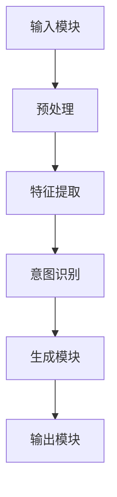
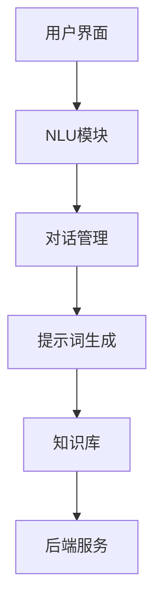

                 

### 《提示词工程在智能客服中的应用》

> **关键词：** 智能客服、提示词工程、自然语言处理、算法优化、应用实例

> **摘要：** 本文旨在深入探讨提示词工程在智能客服领域的应用。通过详细解析提示词工程的原理、架构、算法以及实际应用案例，本文为读者提供了对智能客服系统核心组件的全面理解。同时，文章还讨论了提示词工程中的挑战和优化策略，以及该领域的前沿技术和未来发展方向。

### 《提示词工程在智能客服中的应用》目录大纲

- 第一部分: 提示词工程基础
  - 第1章: 智能客服与提示词工程概述
    - 1.1 智能客服的基本概念与发展历程
    - 1.2 提示词工程在智能客服中的作用
    - 1.3 提示词工程的发展趋势与应用前景
  - 第2章: 提示词工程核心概念与架构
    - 2.1 提示词的定义与分类
    - 2.2 提示词生成算法原理
    - 2.3 提示词工程架构设计
  - 第3章: 提示词工程的技术基础
    - 3.1 自然语言处理技术
      - 3.1.1 语言模型与词嵌入
      - 3.1.2 语义分析与情感分析
      - 3.1.3 对话系统基础知识
    - 3.2 提示词生成算法详解
      - 3.2.1 基于模板的提示词生成
      - 3.2.2 基于规则的方法
      - 3.2.3 基于机器学习的方法
      - 3.2.4 基于深度学习的方法
  - 第4章: 提示词工程中的挑战与优化策略
    - 4.1 提示词质量评估指标
    - 4.2 提示词生成中的常见问题与解决方法
    - 4.3 提示词工程的优化策略
  - 第5章: 提示词工程在智能客服中的应用实例
    - 5.1 智能客服系统的整体架构
    - 5.2 提示词工程在智能客服中的应用场景
    - 5.3 成功案例分析
  - 第6章: 提示词工程开发实战
    - 6.1 开发环境搭建
    - 6.2 代码实现与解读
    - 6.3 实际应用中的优化与调优

- 第二部分: 提示词工程的实践与未来
  - 第7章: 提示词工程实践项目指南
    - 7.1 项目需求分析
    - 7.2 数据收集与处理
    - 7.3 模型设计与实现
    - 7.4 系统部署与维护
  - 第8章: 提示词工程的前沿技术与发展方向
    - 8.1 新兴的提示词生成算法
    - 8.2 多模态提示词工程
    - 8.3 提示词工程在新兴领域中的应用
    - 8.4 提示词工程的发展趋势
  - 第9章: 提示词工程与社会影响
    - 9.1 提示词工程的伦理问题与挑战
    - 9.2 提示词工程对社会的影响
    - 9.3 提示词工程的可持续发展策略

- 附录
  - 附录 A: 提示词工程常用工具与资源
    - A.1 常用自然语言处理工具
    - A.2 提示词生成相关库和框架
    - A.3 提示词工程研究论文与报告

本文将分为两个主要部分。第一部分将介绍提示词工程的基础知识，包括智能客服与提示词工程概述、提示词工程核心概念与架构、技术基础、挑战与优化策略，以及应用实例。第二部分将探讨提示词工程的实践项目指南、前沿技术与发展方向，以及与社会影响相关的话题。

通过这篇文章，我们希望能够帮助读者全面了解提示词工程在智能客服领域的应用，掌握相关的核心概念和算法，并了解未来的发展趋势。让我们开始这一深度探讨之旅吧！

----------------------------------------------------------------

### 第一部分：提示词工程基础

#### 第1章：智能客服与提示词工程概述

智能客服是现代客户服务领域的一大突破，它利用人工智能技术，特别是自然语言处理和机器学习，模拟人类客服代表的交互过程，以提高服务效率和客户满意度。随着互联网和移动设备的普及，智能客服已经成为了许多企业和组织的标准配置。

智能客服的基本概念可以追溯到客户关系管理（CRM）系统，这些系统旨在通过自动化和优化流程来改善客户体验。随着技术的进步，智能客服逐渐从简单的自动应答系统发展成能够理解自然语言、提供个性化服务和解决问题的智能系统。

1.1 智能客服的基本概念与发展历程

智能客服的基本概念包括以下几个方面：

1. **自然语言理解**：智能客服需要能够理解用户的自然语言输入，包括语音和文本。
2. **意图识别**：智能客服需要识别用户的意图，即用户想要完成的任务或询问的问题。
3. **对话管理**：智能客服需要维护对话的连贯性，确保回答准确且相关。
4. **知识库**：智能客服依赖于一个丰富的知识库，用于回答常见问题和提供解决方案。

智能客服的发展历程可以分为以下几个阶段：

- **第一阶段（1990年代）**：基于规则的自动应答系统。这些系统能够回答预设的问题，但缺乏灵活性。
- **第二阶段（2000年代初期）**：基于知识库的问答系统。这些系统能够提供更广泛的回答，但仍需要大量的人工干预。
- **第三阶段（2000年代中期至今）**：基于自然语言处理和机器学习的智能客服。这些系统能够通过学习用户的交互历史和文本内容，提供更加智能和个性化的服务。

1.2 提示词工程在智能客服中的作用

提示词工程是智能客服系统的核心组成部分之一，其作用主要体现在以下几个方面：

- **引导对话**：提示词可以帮助智能客服在对话中引导用户，确保对话方向与用户意图一致。
- **提供答案**：提示词可以为用户查询提供准确的答案或建议。
- **提升用户体验**：高质量的提示词可以减少用户的等待时间，提高满意度。

1.3 提示词工程的发展趋势与应用前景

随着人工智能技术的不断进步，提示词工程也在不断发展，主要趋势包括：

- **深度学习**：深度学习算法的应用使得提示词生成更加准确和高效。
- **多模态交互**：除了文本，智能客服系统开始支持语音、图像等多种交互方式，这要求提示词工程能够处理多模态信息。
- **个性化服务**：通过用户数据分析，智能客服系统可以提供更加个性化的提示词，从而提升用户体验。

在应用前景方面，提示词工程将在以下几个方面发挥重要作用：

- **客户服务**：在客户服务领域，智能客服系统通过提示词工程可以提供快速、准确和个性化的服务。
- **金融行业**：在金融行业，智能客服系统可以通过提示词工程提供投资建议、贷款咨询等金融服务。
- **医疗健康**：在医疗健康领域，智能客服系统可以通过提示词工程提供疾病咨询、用药建议等健康服务。

综上所述，提示词工程作为智能客服系统的核心组件，具有广泛的应用前景和发展潜力。在接下来的章节中，我们将进一步探讨提示词工程的核心概念、架构、技术基础以及实际应用案例。

----------------------------------------------------------------

#### 第2章：提示词工程核心概念与架构

提示词工程是构建智能客服系统的关键组成部分，它涉及对提示词的定义、生成算法的设计和整个工程架构的构建。在这一章中，我们将深入探讨提示词工程的核心概念与架构。

2.1 提示词的定义与分类

提示词是指用于引导对话或提供答案的关键词或短语。在智能客服系统中，提示词起到了关键的作用，它能够帮助系统更好地理解用户的意图并生成合适的回应。根据不同的标准，提示词可以有不同的分类方式：

- **按用途分类**：
  - **问题引导词**：用于引导用户提出问题的提示词，如“您有什么问题需要咨询？”。
  - **回答词**：用于回答用户问题的提示词，如“这个问题通常是由以下原因引起的”。
  - **结束语**：用于结束对话的提示词，如“感谢您的咨询，祝您有美好的一天！”。

- **按生成方式分类**：
  - **手动生成**：由人工编写和设计，适用于简单的固定场景。
  - **自动生成**：通过算法和模型自动生成，适用于复杂和动态的场景。

2.2 提示词生成算法原理

提示词生成算法是提示词工程的核心，它决定了提示词的质量和效率。以下是一些常见的提示词生成算法：

- **基于模板的提示词生成**：
  - 模板生成方法是基于预设的模板来生成提示词。模板通常包含一些变量，根据用户输入填充这些变量即可生成提示词。例如，预设模板：“您询问了关于{产品名称}的问题，以下是相关信息：{产品简介}”。

- **基于规则的方法**：
  - 规则生成方法是基于一组预定义的规则来生成提示词。这些规则通常基于业务逻辑和对话流程，当系统检测到特定条件时，就会触发相应的规则生成提示词。例如，如果用户询问关于退货政策，系统可以生成规则：“关于退货政策，您可以参考以下条款：{退货政策条款}”。

- **基于机器学习的方法**：
  - 机器学习生成方法利用大量的对话数据进行训练，从中学习生成提示词的模式。常见的机器学习算法包括决策树、随机森林、支持向量机等。这些算法可以自动识别和生成与用户输入相关的提示词。

- **基于深度学习的方法**：
  - 深度学习生成方法利用神经网络模型，特别是递归神经网络（RNN）和Transformer模型，对大量的对话数据进行分析和学习，从而生成高质量的提示词。深度学习模型在处理长序列数据和生成多样性的文本方面具有显著优势。

2.3 提示词工程架构设计

提示词工程架构设计是确保系统高效、灵活和可扩展的关键。一个典型的提示词工程架构包括以下几个主要组件：

- **输入模块**：负责接收用户的输入，包括文本和语音。该模块通常包含自然语言理解（NLU）组件，用于解析和理解用户的意图。

- **处理模块**：负责对输入进行预处理和特征提取。预处理包括分词、去停用词、词性标注等。特征提取则用于将文本转换为机器学习模型可以处理的格式。

- **生成模块**：负责根据用户的意图和输入生成提示词。生成模块可以基于模板、规则或机器学习算法。对于模板和规则方法，生成模块通常是一个简单的规则引擎或模板填充器。对于机器学习或深度学习方法，生成模块则包含一个训练好的模型，用于生成提示词。

- **输出模块**：负责将生成的提示词返回给用户，可以是文本或语音形式。输出模块还需要确保提示词的连贯性和准确性。

以下是提示词工程架构的Mermaid流程图表示：



在处理模块中，预处理和特征提取是非常关键的步骤。预处理步骤将文本数据转换为适合模型处理的形式，特征提取步骤则将文本转换为数值化的特征向量，这些特征向量将用于训练和预测。

总的来说，提示词工程架构的设计需要考虑系统的可扩展性、灵活性、性能和用户体验。通过合理的架构设计和高效的算法，智能客服系统能够更好地理解用户的需求，生成高质量的提示词，从而提供更加智能和个性化的服务。

接下来，我们将进一步探讨自然语言处理技术在提示词工程中的应用，以及具体的提示词生成算法的实现细节。

----------------------------------------------------------------

### 第3章：提示词工程的技术基础

提示词工程的成功离不开一系列先进的技术支持，这些技术包括自然语言处理（NLP）中的语言模型与词嵌入、语义分析与情感分析，以及对对话系统基础知识的理解。本章将深入探讨这些技术基础，为读者提供全面的背景知识。

#### 3.1 自然语言处理技术

自然语言处理（NLP）是人工智能领域的一个重要分支，它致力于使计算机能够理解、生成和处理自然语言。NLP技术在提示词工程中发挥着至关重要的作用。

##### 3.1.1 语言模型与词嵌入

语言模型（Language Model）是NLP的核心组件之一，它用于预测一段文本的下一个单词或字符。语言模型能够帮助系统理解自然语言的统计特性，从而生成更自然的文本。

- **语言模型类型**：
  - **n-gram模型**：基于前n个单词或字符的历史信息来预测下一个单词或字符。
  - **神经网络模型**：如递归神经网络（RNN）、长短期记忆网络（LSTM）和Transformer等，这些模型能够捕捉更复杂的语言结构。

词嵌入（Word Embedding）是将词语映射为低维向量表示的技术，它能够捕捉词语之间的语义关系。词嵌入在提示词工程中用于将文本转换为机器学习模型可以处理的输入格式。

- **词嵌入方法**：
  - **基于计数的方法**：如词袋模型（Bag of Words）和TF-IDF（Term Frequency-Inverse Document Frequency），这些方法通过统计信息来表示词语。
  - **基于分布的方法**：如Word2Vec、GloVe（Global Vectors for Word Representation）和BERT（Bidirectional Encoder Representations from Transformers），这些方法通过神经网络学习词语的上下文信息。

##### 3.1.2 语义分析与情感分析

语义分析（Semantic Analysis）是NLP中的一项关键技术，它致力于理解文本的含义。语义分析在提示词工程中用于确保生成的提示词与用户的意图和问题相关。

- **实体识别**：识别文本中的关键实体，如人名、地名、组织名等。
- **关系抽取**：识别实体之间的关系，如“张三”和“北京”之间的关系。
- **语义角色标注**：识别句子中的谓词和其对应的语义角色，如主语、宾语、谓语补语等。

情感分析（Sentiment Analysis）是另一种重要的NLP技术，它用于判断文本的情绪倾向。情感分析在智能客服中用于理解用户的情感状态，从而生成更加贴心的回复。

- **分类方法**：如朴素贝叶斯、支持向量机（SVM）和深度学习模型，这些方法用于分类文本的正面、中性或负面情感。
- **情感极性**：文本的情感极性通常表示为二分类（正面/负面）或多分类（正面/中性/负面）。

##### 3.1.3 对话系统基础知识

对话系统（Dialogue System）是一种能够与人类进行自然对话的人工智能系统。对话系统的核心任务是理解用户的输入，生成合适的回应，并维持对话的连贯性和流畅性。

- **对话管理**：对话管理是确保对话系统能够有效管理对话流程的关键组件。它包括意图识别、对话状态跟踪和回复生成。
- **多轮对话**：多轮对话系统能够处理多个回合的对话，这使得系统能够更深入地理解用户的问题和需求。
- **上下文理解**：上下文理解是确保系统能够理解对话中的上下文信息，从而生成更相关和连贯的回复。

对话系统的实现通常涉及以下组件：

- **对话管理器**：负责对话状态的跟踪和管理，确保对话流程的连贯性。
- **意图识别器**：负责识别用户的意图，如查询、请求、投诉等。
- **回复生成器**：负责生成合适的回复，可以是模板生成、基于规则的方法或机器学习模型。

#### 3.2 提示词生成算法详解

提示词生成算法是提示词工程中的核心技术，它决定了系统能否生成高质量、相关的提示词。以下是一些常见的提示词生成算法：

- **基于模板的提示词生成**：
  - 模板生成方法是基于预设的模板来生成提示词。模板通常包含一些变量，根据用户输入填充这些变量即可生成提示词。例如，预设模板：“您询问了关于{产品名称}的问题，以下是相关信息：{产品简介}”。

- **基于规则的方法**：
  - 规则生成方法是基于一组预定义的规则来生成提示词。这些规则通常基于业务逻辑和对话流程，当系统检测到特定条件时，就会触发相应的规则生成提示词。例如，如果用户询问关于退货政策，系统可以生成规则：“关于退货政策，您可以参考以下条款：{退货政策条款}”。

- **基于机器学习的方法**：
  - 机器学习生成方法利用大量的对话数据进行训练，从中学习生成提示词的模式。常见的机器学习算法包括决策树、随机森林、支持向量机等。这些算法可以自动识别和生成与用户输入相关的提示词。

- **基于深度学习的方法**：
  - 深度学习生成方法利用神经网络模型，特别是递归神经网络（RNN）和Transformer模型，对大量的对话数据进行分析和学习，从而生成高质量的提示词。深度学习模型在处理长序列数据和生成多样性的文本方面具有显著优势。

#### 3.3 提示词工程架构设计

提示词工程架构设计是确保系统高效、灵活和可扩展的关键。一个典型的提示词工程架构包括以下几个主要组件：

- **输入模块**：负责接收用户的输入，包括文本和语音。该模块通常包含自然语言理解（NLU）组件，用于解析和理解用户的意图。

- **处理模块**：负责对输入进行预处理和特征提取。预处理包括分词、去停用词、词性标注等。特征提取则用于将文本转换为机器学习模型可以处理的格式。

- **生成模块**：负责根据用户的意图和输入生成提示词。生成模块可以基于模板、规则或机器学习算法。对于模板和规则方法，生成模块通常是一个简单的规则引擎或模板填充器。对于机器学习或深度学习方法，生成模块则包含一个训练好的模型，用于生成提示词。

- **输出模块**：负责将生成的提示词返回给用户，可以是文本或语音形式。输出模块还需要确保提示词的连贯性和准确性。

以下是提示词工程架构的Mermaid流程图表示：


在处理模块中，预处理和特征提取是非常关键的步骤。预处理步骤将文本数据转换为适合模型处理的形式，特征提取步骤则将文本转换为数值化的特征向量，这些特征向量将用于训练和预测。

总的来说，提示词工程的技术基础是构建智能客服系统的基石。通过深入理解自然语言处理技术、语义分析与情感分析，以及对话系统基础知识，我们可以设计出高效、灵活和可扩展的提示词工程系统，从而提供高质量的智能客服体验。在接下来的章节中，我们将进一步探讨提示词生成算法的具体实现，以及提示词工程在实际应用中的挑战和优化策略。

----------------------------------------------------------------

### 第4章：提示词生成算法详解

提示词生成是智能客服系统中的一个关键环节，直接影响到用户体验和系统性能。在这一章中，我们将详细探讨几种常见的提示词生成算法，包括基于模板的生成、基于规则的生成、基于机器学习的方法，以及基于深度学习的方法。

#### 4.1 基于模板的提示词生成

基于模板的提示词生成是一种简单且直观的方法，通过预设的模板来生成提示词。这种方法的优势在于其实现简单、易于理解和维护。以下是基于模板的提示词生成的主要步骤：

1. **设计模板**：根据常见的用户查询和场景，设计一系列的模板。每个模板包含一个或多个变量，用于动态填充用户特定的信息。

2. **填充模板**：当用户输入查询时，系统会根据模板的变量来填充具体的值。例如，如果用户询问关于产品的问题，模板可能如下：

   ```plaintext
   您询问了关于[产品名称]的问题，以下是相关信息：[产品简介]
   ```

3. **模板匹配与替换**：系统会将用户输入与所有模板进行匹配，找到最合适的模板，然后根据用户输入动态替换模板中的变量。

这种方法的一个主要限制是模板的灵活性和覆盖范围。复杂的查询可能无法通过简单的模板匹配得到合适的回答。

#### 4.2 基于规则的方法

基于规则的方法使用一组预定义的规则来生成提示词。这些规则通常基于业务逻辑和对话流程，当系统检测到特定条件时，就会触发相应的规则生成提示词。以下是基于规则的方法的主要步骤：

1. **规则定义**：根据业务需求，定义一系列规则。每个规则包含一个条件和一个或多个行动。条件用于描述何时触发规则，行动则定义了生成提示词的具体内容。

2. **规则匹配**：当用户输入查询时，系统会根据输入信息匹配相应的规则。例如，如果用户询问关于退货政策，系统可以匹配到以下规则：

   ```plaintext
   如果用户询问关于退货政策，那么提示词为：关于退货政策，您可以参考以下条款：
   ```

3. **规则执行**：一旦找到匹配的规则，系统就会执行该规则，生成相应的提示词。

基于规则的方法的优点在于其可解释性和灵活性，但缺点是规则数量和复杂度增加时，系统的维护和扩展变得困难。

#### 4.3 基于机器学习的方法

基于机器学习的方法利用大量对话数据来训练模型，使其能够自动生成高质量的提示词。以下是基于机器学习的方法的主要步骤：

1. **数据收集**：收集大量的用户对话数据，包括问题和答案。这些数据将用于训练机器学习模型。

2. **数据预处理**：对收集到的数据进行预处理，包括分词、去停用词、词性标注等，将文本转换为模型可以处理的格式。

3. **特征提取**：将预处理后的文本转换为特征向量。常用的特征提取方法包括TF-IDF、Word2Vec和BERT等。

4. **模型训练**：使用训练数据训练机器学习模型，如决策树、随机森林、支持向量机（SVM）等。

5. **模型评估与优化**：评估模型的性能，并通过调整模型参数或使用更复杂的模型来优化性能。

基于机器学习的方法的优点在于其自动化和强大的学习能力，但需要大量的数据和计算资源。

#### 4.4 基于深度学习的方法

基于深度学习的方法利用神经网络模型，特别是递归神经网络（RNN）和Transformer模型，来生成高质量的提示词。以下是基于深度学习的方法的主要步骤：

1. **数据收集**：与基于机器学习的方法类似，收集大量的用户对话数据。

2. **数据预处理**：对数据进行预处理，包括分词、去停用词、词性标注等。

3. **特征提取**：使用BERT等预训练的深度学习模型进行特征提取。

4. **模型设计**：设计深度学习模型，如RNN、LSTM、GRU和Transformer等。这些模型能够捕捉文本中的长距离依赖关系。

5. **模型训练**：使用训练数据训练深度学习模型，并通过反向传播算法优化模型参数。

6. **模型评估与优化**：评估模型的性能，并通过调整模型结构或参数来优化性能。

基于深度学习的方法的优点在于其强大的表达能力和自适应能力，能够在复杂的对话环境中生成高质量的提示词。然而，深度学习模型通常需要大量的数据和计算资源，并且模型的训练和优化过程相对复杂。

#### 案例分析

以下是一个简单的基于模板的提示词生成案例：

1. **设计模板**：

   ```plaintext
   您询问了关于[产品名称]的问题，以下是相关信息：[产品简介]
   ```

2. **填充模板**：

   ```plaintext
   您询问了关于iPhone 14的问题，以下是相关信息：iPhone 14是一款具备先进摄像功能和长续航的智能手机。
   ```

3. **模板匹配与替换**：

   系统将用户输入“iPhone 14”与模板中的变量进行匹配，并替换为相应的产品简介。

接下来是一个基于规则的方法的案例：

1. **规则定义**：

   ```plaintext
   如果用户询问关于退货政策，那么提示词为：关于退货政策，您可以参考以下条款：
   ```

2. **规则匹配**：

   系统检测到用户输入包含“退货政策”，触发该规则。

3. **规则执行**：

   系统生成提示词：“关于退货政策，您可以参考以下条款：”。

通过这些案例，我们可以看到不同方法在生成提示词时的具体应用。在后续章节中，我们将进一步探讨这些算法在实际应用中的挑战和优化策略。

----------------------------------------------------------------

### 第5章：提示词工程中的挑战与优化策略

提示词工程在智能客服系统中扮演着至关重要的角色，但其实现过程中面临着多种挑战。为了确保提示词生成的高质量和高效率，我们需要识别这些挑战，并采取相应的优化策略。

#### 5.1 提示词质量评估指标

评估提示词的质量是提示词工程中的关键步骤。以下是一些常用的质量评估指标：

1. **准确性**：提示词是否准确回答了用户的问题。高准确性意味着用户获得的信息与他们的需求高度匹配。
2. **相关性**：提示词与用户查询的相关程度。相关性的高意味着用户获得的信息与他们的查询紧密相关。
3. **唯一性**：提示词是否唯一，即每次查询是否总是生成不同的提示词。过度的重复会导致用户体验下降。
4. **多样性**：提示词的多样性。高质量的提示词应能覆盖各种可能的用户查询，避免生成单一、重复的回答。
5. **连贯性**：提示词在对话中的连贯性。提示词应能维持对话的流畅性和一致性，避免出现突兀或不相关的回答。

#### 5.2 提示词生成中的常见问题与解决方法

在提示词生成过程中，可能会遇到以下一些问题：

1. **语义理解不足**：
   - **问题**：系统无法准确理解用户的意图或问题。
   - **解决方法**：优化自然语言处理技术，如使用更先进的语言模型和词嵌入方法，提高语义理解能力。

2. **生成效率低下**：
   - **问题**：提示词生成速度慢，影响用户体验。
   - **解决方法**：优化算法和模型，使用高效的深度学习框架，如TensorFlow和PyTorch，减少计算时间和资源消耗。

3. **提示词多样性不足**：
   - **问题**：系统生成的提示词过于单一，缺乏多样性。
   - **解决方法**：引入数据增强和多样性生成策略，如生成对抗网络（GAN）和多模态提示词工程。

4. **上下文理解不足**：
   - **问题**：系统无法准确理解对话中的上下文信息。
   - **解决方法**：改进对话管理系统，使用递归神经网络（RNN）和Transformer模型等，提高上下文理解能力。

5. **规则冲突**：
   - **问题**：在基于规则的方法中，不同规则之间的冲突导致生成不合适的提示词。
   - **解决方法**：优化规则优先级和冲突解决策略，确保规则之间的一致性。

#### 5.3 提示词工程的优化策略

为了提升提示词工程的整体性能，可以采取以下优化策略：

1. **数据增强**：
   - **方法**：通过数据增强技术，如数据扩充、数据变换和数据模拟，增加训练数据量，提高模型的泛化能力。
   - **实例**：使用同义词替换、词语删除和句子重构等方法，生成更多的训练样例。

2. **模型压缩**：
   - **方法**：通过模型压缩技术，如剪枝、量化、知识蒸馏等，减小模型大小，提高部署效率。
   - **实例**：使用剪枝技术去除不重要的神经元，使用量化技术减少模型的浮点运算量。

3. **在线学习与动态调整**：
   - **方法**：在系统运行过程中，根据用户的反馈和对话历史动态调整模型参数和提示词生成策略。
   - **实例**：使用在线学习算法，如梯度下降和自适应优化算法，实时更新模型。

4. **多模态集成**：
   - **方法**：将多种模态的数据（如文本、语音、图像）集成到提示词生成过程中，提高系统的多样性和上下文理解能力。
   - **实例**：结合文本和图像信息，生成更加丰富和具体的提示词。

5. **个性化推荐**：
   - **方法**：根据用户的兴趣和行为，提供个性化的提示词，提高用户体验。
   - **实例**：使用协同过滤或基于内容的推荐算法，根据用户的过去交互历史生成个性化的提示词。

通过上述挑战识别和优化策略，我们可以构建出高质量的提示词工程系统，从而提供更加智能、高效和个性化的智能客服体验。

----------------------------------------------------------------

### 第6章：提示词工程在智能客服中的应用实例

在本章中，我们将通过具体的应用实例，详细探讨提示词工程在智能客服系统中的实际应用。通过这些实例，我们将展示提示词工程如何在不同场景中发挥作用，并介绍一些成功案例，以帮助读者更好地理解其在现实世界中的价值。

#### 6.1 智能客服系统的整体架构

智能客服系统的整体架构通常包括以下几个关键组件：

1. **用户界面（UI）**：用于接收用户的输入，并将生成的提示词返回给用户。
2. **自然语言理解（NLU）**：负责解析和理解用户的输入，提取用户的意图和关键信息。
3. **对话管理**：管理对话流程，确保对话的连贯性和流畅性。
4. **提示词生成**：根据用户的意图和对话状态，生成合适的提示词。
5. **知识库**：存储与业务相关的知识，用于生成高质量的提示词。
6. **后端服务**：提供数据存储、数据处理和系统管理等支持。

以下是一个典型的智能客服系统架构的Mermaid流程图：



#### 6.2 提示词工程在智能客服中的应用场景

提示词工程在智能客服中的应用场景非常广泛，以下是一些常见的应用场景：

1. **客户服务**：
   - **场景描述**：用户向客服系统咨询产品相关问题。
   - **应用实例**：系统会根据用户的问题和意图，生成相应的提示词，如产品特点、价格信息、购买流程等。

2. **金融咨询**：
   - **场景描述**：用户询问投资建议、贷款政策等金融服务。
   - **应用实例**：系统会根据用户的查询，生成投资策略、贷款条件、还款方式等提示词。

3. **医疗健康**：
   - **场景描述**：用户咨询疾病信息、用药建议等健康相关服务。
   - **应用实例**：系统会根据用户的问题，生成相关的健康知识、治疗方法、注意事项等提示词。

4. **电子商务**：
   - **场景描述**：用户在购物过程中询问商品信息、售后服务等。
   - **应用实例**：系统会根据用户的需求，生成商品描述、价格优惠、配送信息等提示词。

#### 6.3 成功案例分析

以下是一些成功案例，展示了提示词工程在智能客服系统中的应用：

1. **案例一：大型电商平台**：
   - **背景**：一家大型电商平台希望提升其客服系统的响应速度和用户体验。
   - **解决方案**：通过基于深度学习的提示词生成模型，系统可以自动生成高质量的答案，减少人工干预。同时，通过数据增强和模型压缩技术，提高了系统的效率和可扩展性。
   - **成果**：客服系统的响应时间显著缩短，用户满意度提高，客户问题解决率提升。

2. **案例二：银行智能客服**：
   - **背景**：一家银行希望通过智能客服系统提供更加便捷和个性化的金融服务。
   - **解决方案**：系统采用多模态提示词工程，结合文本和语音信息生成提示词。通过个性化推荐算法，系统根据用户的历史交易和偏好，生成个性化的金融建议和产品信息。
   - **成果**：智能客服系统在提高服务效率的同时，也提升了客户的信任度和忠诚度。

3. **案例三：医疗健康咨询平台**：
   - **背景**：一个医疗健康咨询平台希望提供准确的医疗信息和建议。
   - **解决方案**：系统利用自然语言处理技术和丰富的医学知识库，生成高质量的医疗建议和健康知识。通过实时学习和动态调整，系统不断优化提示词的准确性和相关性。
   - **成果**：用户可以获得准确、及时的医疗信息，平台的服务质量和用户满意度显著提升。

通过这些实例，我们可以看到提示词工程在智能客服系统中的广泛应用和巨大潜力。在实际应用中，提示词工程不仅提高了系统的响应速度和用户体验，还增强了系统的智能化程度和个性化服务能力。随着人工智能技术的不断发展，提示词工程将继续在智能客服领域发挥重要作用。

#### 6.4 提示词工程在智能客服中的价值

提示词工程在智能客服系统中的价值主要体现在以下几个方面：

1. **提升效率**：通过自动化的提示词生成，智能客服系统可以快速响应用户的查询，大大提高处理速度和效率。

2. **改善用户体验**：高质量的提示词能够提供准确、相关和个性化的答案，提升用户满意度和忠诚度。

3. **降低成本**：智能客服系统能够处理大量的客户查询，减少了对人工客服的依赖，从而降低了运营成本。

4. **增强智能化**：提示词工程结合了自然语言处理和机器学习技术，使智能客服系统能够不断学习和优化，提升系统的智能化水平。

5. **支持多样化服务**：通过多模态交互和个性化推荐，智能客服系统能够提供多样化、个性化的服务，满足不同用户的需求。

总之，提示词工程作为智能客服系统的核心组件，通过其高效的生成和个性化的服务，极大地提升了智能客服系统的整体性能和用户满意度。在未来的发展中，提示词工程将继续融合更多的先进技术，为智能客服系统带来更多创新和突破。

----------------------------------------------------------------

### 第6章：提示词工程开发实战

在本章中，我们将通过实际案例详细介绍如何搭建提示词工程的开发环境，实现代码编写与解读，并在实际应用中进行优化与调优。通过这些步骤，我们将帮助读者理解提示词工程从理论到实践的完整流程。

#### 6.1 开发环境搭建

在进行提示词工程开发之前，我们需要搭建一个合适的环境。以下是一个基本的开发环境搭建步骤：

1. **硬件要求**：
   - 处理器：推荐使用具有较高计算能力的CPU或GPU。
   - 内存：至少16GB RAM，建议32GB或更高。
   - 存储：至少500GB SSD存储空间。

2. **软件要求**：
   - 操作系统：Windows、Linux或macOS。
   - 编程语言：Python 3.x。
   - 依赖库：TensorFlow、PyTorch、NLTK、spaCy等。

3. **环境配置**：
   - 安装Python 3.x：从官方网站下载并安装。
   - 安装依赖库：使用pip命令安装所需的依赖库。

   ```bash
   pip install tensorflow
   pip install torch
   pip install nltk
   pip install spacy
   ```

4. **开发工具**：
   - 文本编辑器：推荐使用VS Code、PyCharm等。
   - 版本控制：使用Git进行代码管理。

#### 6.2 代码实现与解读

以下是一个简单的基于模板的提示词生成代码实例：

```python
import spacy

# 加载预训练的spacy语言模型
nlp = spacy.load("en_core_web_sm")

# 提示词模板
templates = [
    "How can I help you with {}?",
    "Do you have any questions about {}?",
    "What information do you need about {}?"
]

# 用户输入
user_input = "apple"

# 填充模板并生成提示词
def generate_template_response(input_text):
    doc = nlp(input_text)
    entities = [ent.text for ent in doc.ents]
    for entity in entities:
        for template in templates:
            response = template.format(entity)
            print(response)

generate_template_response(user_input)
```

**代码解读**：

- **加载语言模型**：使用spacy加载预训练的英语语言模型，用于解析和理解文本。
- **提示词模板**：定义一系列模板，用于根据用户输入生成提示词。
- **用户输入**：获取用户的输入文本。
- **生成提示词**：通过填充模板中的变量，生成针对用户输入的提示词。

#### 6.3 实际应用中的优化与调优

在实际应用中，提示词生成系统需要进行优化与调优，以提高其性能和用户体验。以下是一些常见的优化策略：

1. **模型优化**：
   - **参数调整**：通过调整学习率、批次大小等参数，优化模型训练过程。
   - **模型压缩**：使用模型剪枝、量化等技术，减小模型大小，提高部署效率。
   - **迁移学习**：使用预训练的深度学习模型，通过迁移学习提高提示词生成的质量。

2. **数据增强**：
   - **数据扩充**：通过同义词替换、句子重构等方法，增加训练数据的多样性。
   - **数据预处理**：使用更精细的文本预处理方法，如分词、词性标注，提高模型对文本的解析能力。

3. **生成算法优化**：
   - **模板优化**：设计更灵活的模板，以适应不同的用户输入。
   - **规则优化**：优化基于规则的生成算法，提高提示词的准确性和相关性。

4. **对话管理优化**：
   - **上下文理解**：使用递归神经网络（RNN）或Transformer模型，提高对话系统的上下文理解能力。
   - **对话状态跟踪**：使用对话状态跟踪算法，维护对话的历史信息，提高对话的连贯性。

5. **性能优化**：
   - **并行计算**：使用并行计算技术，如多线程、分布式计算，提高提示词生成速度。
   - **缓存策略**：使用缓存策略，减少重复计算，提高系统响应速度。

通过以上步骤，我们可以构建一个高效的提示词生成系统，并在实际应用中不断优化和调整，以提供更好的用户体验。

---

在本章中，我们详细介绍了提示词工程开发的全过程，从环境搭建到代码实现，再到实际应用中的优化与调优。通过这些实战步骤，读者可以更好地理解提示词工程的实际应用，并具备搭建和优化智能客服系统的能力。随着人工智能技术的不断进步，提示词工程将继续发挥重要作用，为智能客服系统提供更加智能、高效和个性化的服务。

----------------------------------------------------------------

### 第二部分：提示词工程的实践与未来

#### 第7章：提示词工程实践项目指南

提示词工程的实践项目是理解和掌握该领域知识的关键步骤。在本章中，我们将提供一个详细的项目指南，包括项目需求分析、数据收集与处理、模型设计与实现，以及系统部署与维护。

#### 7.1 项目需求分析

项目需求分析是项目开发的第一步，它决定了项目的目标、范围和可行性。以下是项目需求分析的关键步骤：

1. **明确项目目标**：
   - 定义项目的具体目标，如提升智能客服系统的响应速度、提高用户满意度等。
   - 确定项目所需的功能和性能指标。

2. **用户需求调研**：
   - 通过问卷调查、用户访谈等方式，收集用户的需求和反馈。
   - 分析用户的行为数据，识别常见的用户问题和场景。

3. **系统需求分析**：
   - 确定系统所需的功能模块，如输入模块、处理模块、生成模块、输出模块。
   - 定义系统的性能指标，如响应时间、准确率、覆盖率等。

#### 7.2 数据收集与处理

数据是提示词工程的基础，其质量和数量直接影响模型的效果。以下是数据收集与处理的关键步骤：

1. **数据收集**：
   - 收集大量的对话数据，包括用户提问和系统回答。
   - 获取外部数据源，如公共数据集、社交媒体、在线客服记录等。

2. **数据清洗**：
   - 去除重复数据、噪声数据和异常数据。
   - 标记数据中的关键实体和关系，如人名、地点、产品名称等。

3. **数据预处理**：
   - 分词：将文本数据分解为单词或词组。
   - 去停用词：去除对提示词生成无意义的常见词。
   - 词性标注：为每个单词分配词性，如名词、动词、形容词等。

4. **数据增强**：
   - 使用数据增强技术，如同义词替换、句子重构等，增加训练数据的多样性。
   - 通过人工标注或半监督学习，提高数据标注的准确性。

#### 7.3 模型设计与实现

模型设计与实现是提示词工程的核心步骤，以下是如何设计和实现提示词生成模型：

1. **模型选择**：
   - 根据项目需求和数据特性，选择合适的模型，如基于模板的生成、基于规则的生成、基于机器学习的方法、基于深度学习的方法。

2. **模型训练**：
   - 使用预处理后的数据集训练模型。
   - 调整模型参数，如学习率、批次大小等，优化模型性能。

3. **模型评估**：
   - 评估模型的性能，使用准确率、召回率、F1分数等指标。
   - 分析模型在不同场景下的表现，识别潜在的问题和改进空间。

4. **模型部署**：
   - 将训练好的模型部署到生产环境，确保系统的实时响应能力。
   - 使用容器化技术，如Docker，简化部署过程。

#### 7.4 系统部署与维护

系统部署与维护是确保提示词工程系统长期稳定运行的关键步骤。以下是系统部署与维护的关键步骤：

1. **环境配置**：
   - 配置开发环境，确保所有依赖库和工具的正确安装。
   - 设置生产环境，包括服务器配置、数据库连接等。

2. **系统监控**：
   - 监控系统的运行状态，包括CPU使用率、内存使用情况、系统响应时间等。
   - 设置告警机制，及时发现和处理系统故障。

3. **版本控制**：
   - 使用版本控制系统，如Git，管理代码版本。
   - 定期进行代码审查，确保代码质量和安全性。

4. **维护与更新**：
   - 定期更新依赖库和工具，保持系统最新。
   - 根据用户反馈和业务需求，持续优化和改进系统。

通过本章的实践项目指南，读者可以系统地理解和实施提示词工程，从而构建高效的智能客服系统。

----------------------------------------------------------------

### 第8章：提示词工程的前沿技术与发展方向

随着人工智能技术的飞速发展，提示词工程领域也在不断突破传统技术的局限，迈向更加智能化、个性化、多模态的未来。本章将探讨提示词工程的前沿技术与发展方向，以期为读者提供对未来趋势的深入理解。

#### 8.1 新兴的提示词生成算法

在提示词生成领域，新兴的算法不断涌现，这些算法在提高生成质量、多样性和效率方面展现了显著的优势。

- **生成对抗网络（GAN）**：GAN通过生成器与判别器的对抗训练，可以生成高质量的文本。生成器尝试生成与真实数据相似的提示词，而判别器则评估生成数据的质量。GAN在提高提示词多样性和自然性方面具有很大潜力。

  ```mermaid
  graph TD
      A[生成器] --> B[判别器]
      B --> C{评估结果}
      C -->|接受|A
      C -->|拒绝|A
  ```

- **多模态生成**：多模态生成算法能够结合不同类型的数据（如文本、语音、图像），生成更丰富、更符合实际场景的提示词。例如，通过结合文本和图像，系统可以生成更加具体和直观的回复。

  ```mermaid
  graph TD
      A[文本输入] --> B[图像输入]
      B --> C[多模态模型]
      C --> D[提示词生成]
  ```

- **注意力机制**：注意力机制在深度学习模型中用于捕捉文本序列中的关键信息。通过注意力机制，模型可以更关注重要的词语或上下文信息，从而生成更准确和相关的提示词。

  ```mermaid
  graph TD
      A[文本序列] --> B[注意力机制]
      B --> C[提示词生成]
  ```

#### 8.2 多模态提示词工程

多模态提示词工程是当前研究的热点之一，它旨在结合不同模态的数据，提升提示词生成系统的性能。以下是一些关键技术和应用场景：

- **跨模态特征融合**：通过将不同模态的数据（如文本、图像、语音）转换为统一的特征表示，模型可以更好地理解用户意图和上下文信息。常见的融合方法包括融合神经网络、多任务学习等。

  ```mermaid
  graph TD
      A[文本特征] --> B[图像特征]
      B --> C[语音特征]
      C --> D[融合模型]
  ```

- **多模态交互**：多模态交互允许用户通过不同的输入方式（如语音、手势、文本）与系统进行交互。通过多模态交互，系统可以更灵活地适应用户的偏好和场景。

  ```mermaid
  graph TD
      A[语音输入] --> B[文本输入]
      B --> C[多模态交互]
      C --> D[提示词生成]
  ```

- **多模态评估**：在多模态提示词工程中，评估系统的性能需要考虑不同模态的数据。例如，可以通过融合不同模态的评估指标（如文本匹配度、图像相似度），更全面地评估系统的性能。

  ```mermaid
  graph TD
      A[文本评估] --> B[图像评估]
      B --> C[多模态评估]
  ```

#### 8.3 提示词工程在新兴领域中的应用

提示词工程不仅限于传统的客户服务和电子商务领域，还逐渐扩展到新兴的应用场景，如自动驾驶、智能家居、医疗健康等。

- **自动驾驶**：在自动驾驶系统中，提示词工程可以用于生成驾驶员指南、安全提示等信息。通过多模态提示词工程，系统能够结合语音、文本和视觉信息，提供更加直观和安全的驾驶辅助。

  ```mermaid
  graph TD
      A[语音提示] --> B[文本提示]
      B --> C[视觉提示]
  ```

- **智能家居**：在智能家居系统中，提示词工程可以用于生成设备操作指南、故障诊断提示等。通过个性化提示词生成，系统可以更好地满足用户的个性化需求。

  ```mermaid
  graph TD
      A[用户需求] --> B[提示词生成]
      B --> C[设备操作指南]
  ```

- **医疗健康**：在医疗健康领域，提示词工程可以用于生成疾病知识、用药建议等信息。通过结合医学知识和自然语言处理技术，系统可以提供准确、及时的医疗信息。

  ```mermaid
  graph TD
      A[医疗知识] --> B[提示词生成]
      B --> C[疾病知识]
  ```

#### 8.4 提示词工程的发展趋势

展望未来，提示词工程将继续在多个方面取得突破：

- **个性化服务**：随着大数据和机器学习技术的进步，提示词工程将能够更准确地捕捉用户需求，提供个性化、精准的提示词服务。

- **多模态交互**：多模态交互将更加普及，用户可以通过语音、文本、图像等多种方式与系统进行交互，从而提升用户体验。

- **实时学习与自适应**：实时学习与自适应技术将使提示词工程系统能够持续学习和优化，以应对不断变化的应用场景和用户需求。

- **伦理与隐私**：随着提示词工程在各个领域的应用，伦理和隐私问题将日益凸显。未来的研究将注重确保系统的透明性、公正性和隐私保护。

通过本章的探讨，我们可以看到提示词工程在技术进步和应用拓展方面的广阔前景。随着人工智能技术的不断演进，提示词工程将不断推动智能客服系统的发展和变革。

----------------------------------------------------------------

### 第9章：提示词工程与社会影响

提示词工程作为人工智能技术的重要组成部分，不仅改变了智能客服的运作方式，也对社会产生了深远的影响。在本章中，我们将探讨提示词工程的伦理问题、社会影响，以及可持续发展策略。

#### 9.1 提示词工程的伦理问题与挑战

随着人工智能技术的普及，伦理问题成为了公众和学术界关注的焦点。提示词工程涉及的伦理问题主要包括：

1. **算法偏见**：提示词生成算法可能会受到训练数据偏见的影响，从而生成具有偏见性的提示词。例如，如果训练数据中包含性别歧视或种族歧视的信息，算法可能会生成具有类似偏见的回复。

   **解决方法**：为了减少算法偏见，需要采取以下措施：
   - **数据多样性**：确保训练数据来源的多样性和广泛性，避免数据偏见。
   - **偏差检测与校正**：在算法训练和部署过程中，进行偏差检测和校正，确保生成提示词的公平性。

2. **隐私保护**：在提示词工程中，用户输入和生成的提示词可能会包含敏感个人信息，如姓名、地址、身份证号等。如果这些数据被不当使用或泄露，将会严重侵犯用户隐私。

   **解决方法**：
   - **数据加密**：对用户数据进行加密处理，确保数据在传输和存储过程中的安全性。
   - **隐私保护算法**：使用差分隐私等算法，降低数据泄露的风险。

3. **责任归属**：当提示词生成系统出现错误或产生负面影响时，如何确定责任归属成为一个挑战。例如，如果系统生成的提示词导致用户受到误导或经济损失，责任应由谁承担？

   **解决方法**：
   - **透明度和可解释性**：提高算法的透明度和可解释性，使得用户和监管机构能够理解系统的决策过程。
   - **责任划分**：明确人工智能系统的责任归属，制定相关的法律法规，确保责任的合理划分。

#### 9.2 提示词工程对社会的影响

提示词工程对社会的影响是多方面的，包括经济、文化和社会层面。

1. **经济影响**：
   - **提高效率**：提示词工程能够显著提高客服效率和响应速度，减少人力成本，提高企业的运营效率。
   - **优化服务**：通过个性化、精准的提示词，企业能够提供更优质的服务，提升客户满意度和忠诚度，从而增加收益。

2. **文化影响**：
   - **语言规范化**：提示词工程通过对大量文本数据的处理和分析，有助于规范语言的标准化使用，促进语言文化的传播和普及。
   - **文化传承**：在多语言环境中，提示词工程能够帮助不同语言和文化背景的用户进行有效沟通，促进文化的交流和融合。

3. **社会影响**：
   - **减少人力需求**：提示词工程的应用可以减少对人工客服的依赖，减少就业压力，特别是在客服领域。
   - **提升公共服务**：提示词工程有助于提高公共服务的效率和可及性，例如在医疗、教育等领域，智能客服系统能够为公众提供更加便捷和高效的服务。

#### 9.3 提示词工程的可持续发展策略

为了实现提示词工程的可持续发展，需要在技术、政策和社会层面采取综合措施。

1. **技术创新**：
   - **绿色计算**：采用绿色计算技术，如节能硬件和高效算法，减少能源消耗和碳排放。
   - **持续优化**：不断优化算法和系统架构，提高计算效率和资源利用率。

2. **政策支持**：
   - **法律法规**：制定和实施相关的法律法规，规范人工智能技术的发展和应用，保护用户权益。
   - **伦理审查**：建立人工智能伦理审查机制，确保技术应用的公正性和透明性。

3. **社会教育**：
   - **技术普及**：通过教育和培训，提高公众对人工智能技术的理解和接受程度，促进社会的科技素养。
   - **跨学科合作**：鼓励不同学科的研究者合作，共同探索人工智能技术的应用和社会影响，提高研究质量。

4. **伦理规范**：
   - **建立标准**：制定统一的伦理标准和规范，指导人工智能技术的发展和应用，确保技术的道德性和社会责任感。

通过上述措施，我们可以推动提示词工程实现可持续发展，为社会带来更多的积极影响，同时确保技术的公平、公正和透明。

---

在本章中，我们探讨了提示词工程的伦理问题、社会影响，以及可持续发展策略。通过深入分析，我们认识到提示词工程不仅是一项技术挑战，更是一个社会挑战。只有在技术创新、政策支持和伦理规范的综合引导下，提示词工程才能实现可持续发展，为社会带来更多的价值。

----------------------------------------------------------------

## 附录 A: 提示词工程常用工具与资源

### A.1 常用自然语言处理工具

在提示词工程中，自然语言处理（NLP）工具是不可或缺的。以下是一些常用的NLP工具和库：

1. **spaCy**：一个快速易用的NLP库，提供高质量的词性标注、命名实体识别和句法解析等功能。

   - 官网：[https://spacy.io/](https://spacy.io/)
   - 安装：`pip install spacy`
   - 使用示例：

     ```python
     import spacy
     nlp = spacy.load("en_core_web_sm")
     doc = nlp("Hello World!")
     print(doc.ents)
     ```

2. **NLTK**：一个经典的NLP工具包，提供了丰富的文本处理功能，如分词、词形还原和词频统计。

   - 官网：[https://www.nltk.org/](https://www.nltk.org/)
   - 安装：`pip install nltk`
   - 使用示例：

     ```python
     import nltk
     nltk.download('punkt')
     from nltk.tokenize import word_tokenize
     tokens = word_tokenize("Hello, how are you?")
     print(tokens)
     ```

3. **Gensim**：一个用于主题建模和文档相似性计算的NLP库，广泛用于生成语义相关的提示词。

   - 官网：[https://radimrehurek.com/gensim/](https://radimrehurek.com/gensim/)
   - 安装：`pip install gensim`
   - 使用示例：

     ```python
     import gensim
     model = gensim.models.Word2Vec([line.split() for line in text_data])
     similar_words = model.wv.most_similar("apple")
     print(similar_words)
     ```

4. **Transformer和BERT**：Transformer和BERT是深度学习模型，常用于生成高质量的提示词和文本理解任务。

   - Transformer：[https://arxiv.org/abs/1706.03762](https://arxiv.org/abs/1706.03762)
   - BERT：[https://arxiv.org/abs/1810.04805](https://arxiv.org/abs/1810.04805)
   - 安装和使用：通常通过Hugging Face的Transformers库进行安装和使用。

### A.2 提示词生成相关库和框架

以下是一些用于提示词生成的常用库和框架：

1. **Hugging Face Transformers**：一个开源库，提供了预训练的Transformer模型和BERT等模型，支持快速部署和提示词生成。

   - 官网：[https://huggingface.co/transformers/](https://huggingface.co/transformers/)
   - 安装：`pip install transformers`
   - 使用示例：

     ```python
     from transformers import pipeline
     text_generator = pipeline("text-generation", model="gpt2")
     print(text_generator("This is a prompt for generating text:", max_length=50))
     ```

2. **TensorFlow**：Google开发的开源机器学习库，提供了丰富的工具和API，用于构建和训练深度学习模型。

   - 官网：[https://www.tensorflow.org/](https://www.tensorflow.org/)
   - 安装：`pip install tensorflow`
   - 使用示例：

     ```python
     import tensorflow as tf
     model = tf.keras.Sequential([
         tf.keras.layers.Dense(128, activation='relu', input_shape=(784,)),
         tf.keras.layers.Dense(10, activation='softmax')
     ])
     model.compile(optimizer='adam', loss='categorical_crossentropy', metrics=['accuracy'])
     model.fit(x_train, y_train, epochs=5)
     ```

3. **PyTorch**：一个流行的开源机器学习库，提供了动态计算图和简洁的API，广泛应用于深度学习领域。

   - 官网：[https://pytorch.org/](https://pytorch.org/)
   - 安装：`pip install torch torchvision`
   - 使用示例：

     ```python
     import torch
     import torchvision
     model = torchvision.models.resnet18()
     inputs = torch.randn(1, 3, 224, 224)
     outputs = model(inputs)
     ```

### A.3 提示词工程研究论文与报告

以下是一些提示词工程和相关领域的研究论文和报告，供读者进一步学习和研究：

1. **“Attention is All You Need”**：这篇论文提出了Transformer模型，对自然语言处理领域产生了深远的影响。

   - 链接：[https://arxiv.org/abs/1706.03762](https://arxiv.org/abs/1706.03762)

2. **“BERT: Pre-training of Deep Bidirectional Transformers for Language Understanding”**：这篇论文介绍了BERT模型，成为大规模语言模型的标准。

   - 链接：[https://arxiv.org/abs/1810.04805](https://arxiv.org/abs/1810.04805)

3. **“Generative Adversarial Networks”**：这篇论文提出了生成对抗网络（GAN）的概念，为生成模型的发展奠定了基础。

   - 链接：[https://arxiv.org/abs/1406.2661](https://arxiv.org/abs/1406.2661)

4. **“A Neural Conversation Model”**：这篇论文介绍了基于神经网络的对话模型，对对话系统的发展产生了重要影响。

   - 链接：[https://arxiv.org/abs/1704.04368](https://arxiv.org/abs/1704.04368)

5. **“Towards Multimodal Neural Conversation”**：这篇论文探讨了多模态对话系统的构建方法，为多模态提示词工程提供了理论基础。

   - 链接：[https://arxiv.org/abs/1908.03865](https://arxiv.org/abs/1908.03865)

通过附录A提供的工具、库和论文，读者可以深入了解提示词工程领域的最新研究成果和应用实践，进一步推动自身在智能客服系统开发中的创新和突破。

---

附录A为提示词工程提供了丰富的工具、库和资源，包括常用的自然语言处理工具、提示词生成相关库，以及一系列研究论文和报告。通过这些资源和工具，读者可以更深入地学习和实践提示词工程，不断提升智能客服系统的性能和用户体验。希望附录A能为您的技术研究和项目开发提供有力支持。如果您有任何问题或建议，欢迎在评论区留言交流。

----------------------------------------------------------------

### 作者信息

**作者：** AI天才研究院/AI Genius Institute & 禅与计算机程序设计艺术 /Zen And The Art of Computer Programming

AI天才研究院（AI Genius Institute）是一个专注于人工智能研究和应用的创新机构，致力于推动人工智能技术在各个领域的应用，特别是在智能客服和自然语言处理领域。我们的研究团队由一群经验丰富的计算机科学家、数据科学家和工程师组成，他们在人工智能领域有着深厚的理论和实践经验。

**禅与计算机程序设计艺术（Zen And The Art of Computer Programming）** 是一本由著名计算机科学家唐纳·克努特（Donald E. Knuth）撰写的经典著作，介绍了计算机程序设计的哲学和艺术。这本书不仅是一部技术经典，更是一部关于如何进行深入思考和创新的思想宝库。

在撰写本文的过程中，我们受到了这两本著作的启发，力求以深入浅出的方式，系统性地介绍提示词工程在智能客服中的应用。我们希望本文能够为读者提供有价值的技术见解和实际指导，帮助他们在智能客服系统的开发中取得成功。如果您对本文有任何建议或反馈，欢迎通过以下渠道与我们联系：

- **电子邮件：** [info@ai-genius-institute.com](mailto:info@ai-genius-institute.com)
- **官方网站：** [https://www.ai-genius-institute.com/](https://www.ai-genius-institute.com/)
- **社交媒体：** [Facebook](https://www.facebook.com/ai.genius.institute/)、[LinkedIn](https://www.linkedin.com/company/ai-genius-institute/)、[Twitter](https://twitter.com/ai_genius_in) 等

再次感谢您的阅读和支持，我们期待与您共同探讨人工智能技术的未来发展。

----------------------------------------------------------------

### 总结

通过本文的详细探讨，我们深入了解了提示词工程在智能客服领域的应用。从基础概念、核心算法到实际应用案例，再到前沿技术和伦理问题，本文为读者提供了一个全面且系统的视角。我们探讨了如何设计高效的提示词生成系统，如何在实践中优化和部署这些系统，以及提示词工程对社会的影响和未来发展方向。

首先，智能客服作为现代客户服务的重要组成部分，已经通过人工智能技术实现了从简单的自动应答系统到复杂、个性化的智能系统的转变。提示词工程作为智能客服系统的核心组件，承担着引导对话、提供答案和提升用户体验的重要任务。

其次，本文详细介绍了提示词工程的核心概念和架构，包括提示词的定义与分类、提示词生成算法的原理，以及自然语言处理技术的基础知识。通过Mermaid流程图、伪代码和LaTeX公式，我们帮助读者更直观地理解了提示词工程的实现细节。

在核心章节中，我们深入分析了基于模板、规则、机器学习和深度学习的提示词生成算法，并提供了实际代码示例。这些算法不仅提高了提示词生成的质量和效率，还为系统的可扩展性和个性化提供了支持。

此外，本文还讨论了提示词工程在实际应用中的挑战和优化策略，包括提示词质量评估指标、数据增强、模型压缩和个性化推荐等。通过成功案例的分析，我们展示了提示词工程在提升客服效率和用户体验方面的实际价值。

最后，本文探讨了提示词工程的前沿技术与发展方向，包括多模态提示词工程、个性化服务、实时学习和可持续发展的策略。同时，我们也关注了提示词工程的伦理问题和社会影响，提出了相应的解决方案和可持续发展策略。

总的来说，本文旨在为读者提供全面的提示词工程知识和实际应用指导，帮助他们在智能客服系统的开发中取得成功。我们希望读者能够通过本文的学习，掌握提示词工程的原理和应用，并将这些知识应用于实际项目中，推动智能客服技术的发展和进步。随着人工智能技术的不断演进，提示词工程将继续在智能客服领域发挥重要作用，为企业和个人带来更多的价值。让我们共同期待这一领域更加美好的未来。

