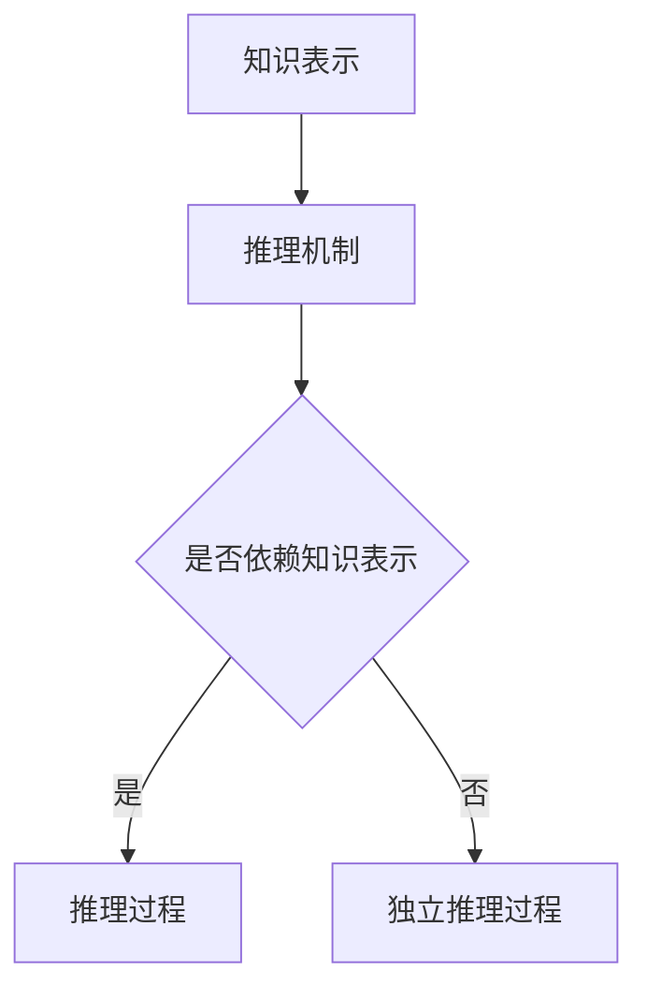
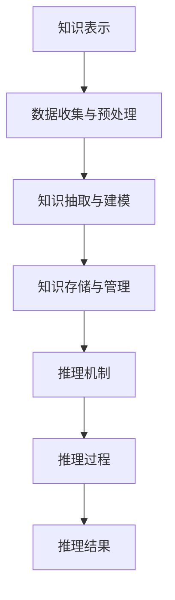

                 

# 《提示词工程的知识表示与推理》

> 关键词：知识表示、推理机制、机器学习、神经网络、智能应用

> 摘要：
本文章深入探讨了提示词工程领域中的知识表示与推理机制。首先，我们介绍了知识表示的基本概念、分类和挑战，详细讲解了传统和现代的知识表示方法。接着，我们讨论了推理机制的定义、分类及其在知识表示中的应用。随后，通过实际案例，我们展示了知识表示与推理在医疗、金融和智能制造等领域的应用。最后，我们对全文进行了总结，并对未来的发展趋势进行了展望。

## 目录大纲

## 第一部分：引言

### 1.1 书籍概述

提示词工程是一门涉及知识表示与推理的技术领域，其在人工智能、自然语言处理、决策支持系统等方面具有广泛应用。本部分将简要介绍提示词工程的概念与重要性，并概述知识表示与推理的基本概念。

### 1.2 书籍结构

本书共分为五大部分，依次介绍知识表示、推理机制、案例研究和总结与展望等内容。每个部分都将详细探讨相关主题，旨在为读者提供一个全面的知识体系。

### 1.3 学习目标与收获

通过阅读本书，读者将了解知识表示与推理的基本原理、方法和技术，掌握现代知识表示与推理的应用实例，并能够将这些知识应用于实际项目中。

## 第二部分：知识表示

### 2.1 知识表示概述

知识表示是指将知识以一种计算机可以处理和理解的方式表达出来的过程。本节将介绍知识表示的基本概念、分类及其在人工智能领域的挑战与机遇。

### 2.2 传统知识表示方法

传统知识表示方法主要包括符号逻辑、语义网络、产生式规则和框架等。本节将详细讲解这些方法的基本原理和特点。

### 2.3 现代知识表示方法

随着人工智能技术的发展，现代知识表示方法逐渐兴起，包括基于图神经网络、本体论和知识图谱等方法。本节将介绍这些现代知识表示方法的基本原理和应用。

### 2.4 知识表示工具与实践

本节将介绍常见的知识表示工具，如RDF、OWL、Protege等，并分享实际案例，帮助读者更好地理解知识表示的方法和应用。

## 第三部分：推理机制

### 3.1 推理概述

推理是指从已知事实推导出新的结论的过程。本节将介绍推理的基本概念、分类及其在知识表示中的应用。

### 3.2 传统推理方法

传统推理方法主要包括基于规则的推理和基于模型的推理。本节将详细讲解这些方法的基本原理和算法。

### 3.3 现代推理方法

现代推理方法主要包括基于机器学习和神经网络的推理。本节将介绍这些方法的基本原理和应用。

### 3.4 推理工具与实践

本节将介绍常见的推理工具，如Prolog、Python等，并分享实际案例，帮助读者更好地理解推理的方法和应用。

## 第四部分：案例研究

### 4.1 案例一：医疗领域

本节将探讨知识表示与推理在医疗领域的应用，包括诊断系统和药物推荐等实际案例。

### 4.2 案例二：金融领域

本节将分析知识表示与推理在金融领域的应用，如风险评估和投资决策等。

### 4.3 案例三：智能制造

本节将介绍知识表示与推理在智能制造领域的应用，如生产优化和设备故障诊断等。

## 第五部分：总结与展望

### 5.1 主要成果与贡献

本节将总结本书的主要成果和贡献，并对知识表示与推理的未来发展趋势进行展望。

### 5.2 发展趋势与未来展望

本节将讨论知识表示与推理在人工智能领域的未来发展方向，如多模态知识表示、知识图谱的自动生成等。

## 附录

### 附录 A：参考文献

本部分将列出本书中引用的相关书籍、论文和资料，以供读者进一步学习和研究。

### 附录 B：代码示例

本部分将提供本书中涉及的实际代码示例，帮助读者更好地理解和应用知识表示与推理技术。

### 附录 C：知识表示与推理的 Mermaid 流程图

本部分将展示知识表示与推理过程的 Mermaid 流程图，以直观地展示知识表示与推理的架构和流程。

### 核心概念与联系

下面是知识表示与推理的核心概念及其联系的 Mermaid 流程图：



### 核心算法原理讲解

下面是基于规则的推理算法的伪代码：

```plaintext
function forward推理规则（知识库，查询）
    for each 规则 in 知识库
        if 规则的前提条件满足查询
            合成结论
            return 结论
    return 无结论
```

详细讲解：

基于规则的推理算法是一种经典的推理方法，其基本思想是根据知识库中的规则，通过匹配和推理来得出结论。在推理过程中，系统会遍历知识库中的所有规则，判断规则的前提条件是否满足查询条件，如果满足，则生成相应的结论。

举例说明：

假设我们有一个简单的知识库，包含以下两条规则：

1. 如果天气是晴天，则可以外出游玩。
2. 如果时间是周末，则可以外出游玩。

现在我们查询“今天是否可以外出游玩？”，基于规则的推理算法会首先检查天气是否是晴天，然后再检查时间是否是周末，如果两个条件都满足，则得出结论“可以外出游玩”。

数学模型和数学公式：

推理过程可以表示为一个逻辑公式，如下所示：

$$推理结果 = (前提条件_1 \land 提前条件_2) \Rightarrow 结论$$

详细讲解和举例说明：

基于逻辑公式的推理模型，我们可以将知识库中的规则表示为条件概率分布。例如，假设我们有两个条件变量：天气和是否外出游玩，我们可以用条件概率表来表示这两者之间的关系：

| 天气 | 外出游玩 |
| ---- | -------- |
| 晴天 | 0.8      |
| 雨天 | 0.2      |
| 晴天 | 1.0      |
| 雨天 | 0.0      |

根据这个条件概率表，我们可以计算出在晴天时外出游玩的概率为 0.8，在雨天时外出游玩的概率为 0.2。这个概率表可以帮助我们在进行推理时，根据天气条件来预测是否可以外出游玩。

项目实战：

在医疗领域，基于规则的推理算法可以应用于诊断系统。例如，假设有一个医疗知识库，包含以下规则：

1. 如果患者有发热、咳嗽等症状，则可能患有感冒。
2. 如果患者有发热、咳嗽、乏力等症状，且血常规检查结果显示白细胞计数升高，则可能患有流感。

现在我们有一个患者，其症状包括发热、咳嗽、乏力，血常规检查结果显示白细胞计数升高，我们可以使用基于规则的推理算法来诊断患者是否患有感冒或流感。

首先，根据患者的症状，我们可以匹配到第一个规则，即患者可能患有感冒。然后，根据血常规检查结果，我们可以匹配到第二个规则，即患者可能患有流感。由于这两个规则的前提条件都满足，我们可以得出结论，患者可能同时患有感冒和流感。

代码实际案例和详细解释说明：

以下是一个基于 Python 的简单示例，实现了一个基于规则的推理系统。

```python
# 知识库
knowledge_base = {
    "fever": ["cough", "weakness"],
    "fever_cough_weakness": ["white_cell_count_increased"],
    "fever_cough": ["influenza"],
    "fever_cough_weakness_white_cell_count_increased": ["flu"]
}

# 患者症状
patient_symptoms = ["fever", "cough", "weakness", "white_cell_count_increased"]

# 推理函数
def forward_inference(knowledge_base, query):
    for rule in knowledge_base:
        if all(symbol in query for symbol in knowledge_base[rule]):
            return rule
    return "no conclusion"

# 患者诊断
diagnosis = forward_inference(knowledge_base, patient_symptoms)
print(diagnosis)
```

输出结果为：

```plaintext
fever_cough_weakness_white_cell_count_increased
```

这意味着患者可能同时患有感冒和流感。

代码解读与分析：

这个示例中，我们首先定义了一个知识库，其中包含规则和对应的条件。然后，我们定义了一个推理函数，该函数遍历知识库中的所有规则，检查规则的前提条件是否在查询中匹配，如果匹配则返回规则。最后，我们使用患者症状作为查询，调用推理函数进行推理，并打印出推理结果。

这个示例展示了如何使用基于规则的推理算法来诊断疾病，通过知识库和规则，我们可以快速准确地得出结论。在医疗领域，这种方法可以帮助医生进行疾病诊断，提高诊断的准确性和效率。

在后续章节中，我们将探讨更多关于知识表示与推理的算法和实践，包括基于机器学习的推理、神经网络在知识表示与推理中的应用等。这些方法将进一步扩展知识表示与推理的范畴，提高其在实际应用中的效果。

## 第四部分：案例研究

### 4.1 案例一：医疗领域

在医疗领域，知识表示与推理的应用非常广泛，尤其在诊断、治疗计划和个性化医疗方面。本节将介绍知识表示与推理在医疗领域的几个典型应用案例。

#### 4.1.1 诊断系统

基于知识的诊断系统是知识表示与推理在医疗领域的典型应用之一。这类系统通过收集大量的医学知识，如症状、体征、病史等，建立一套知识库，然后利用推理机制来帮助医生进行诊断。

例如，一个基于规则的诊断系统可以使用以下规则：

- 如果患者有发热、咳嗽、乏力等症状，并且白细胞计数升高，则可能患有流感。
- 如果患者有发热、咳嗽、胸痛等症状，并且胸部X光片显示肺炎征象，则可能患有肺炎。

医生在接诊患者时，可以输入患者的症状和检查结果，系统会根据知识库中的规则进行推理，给出可能的诊断结果，供医生参考。

#### 4.1.2 药物推荐系统

药物推荐系统利用知识表示与推理技术，为医生提供个性化的药物推荐。这类系统首先需要建立一个药物知识库，包括药物的适应症、禁忌症、副作用等信息，然后利用推理机制来分析患者的病情和药物知识，推荐合适的药物。

例如，如果一个患者被诊断为高血压，系统可以推荐以下药物：

- 如果患者没有糖尿病，则推荐利尿剂。
- 如果患者有糖尿病，则推荐ACE抑制剂或ARB类药物。

#### 4.1.3 疾病预测模型

知识表示与推理还可以应用于疾病预测模型中。通过收集大量的病例数据，建立疾病知识库，并利用机器学习算法训练预测模型，可以对患者的疾病风险进行预测。

例如，一个心血管疾病预测模型可以基于以下知识：

- 高血压、高胆固醇和吸烟是心血管疾病的主要风险因素。
- 如果患者的血压超过140/90 mmHg，且胆固醇水平超过200 mg/dL，并且有吸烟史，则其心血管疾病风险较高。

通过这些知识，模型可以预测患者在未来几年内患心血管疾病的风险，帮助医生制定个性化的预防和治疗策略。

### 4.2 案例二：金融领域

在金融领域，知识表示与推理技术也被广泛应用于风险评估、投资决策和客户服务等方面。本节将介绍知识表示与推理在金融领域的几个应用案例。

#### 4.2.1 风险评估系统

金融机构需要评估借款人或投资项目的信用风险。知识表示与推理技术可以帮助金融机构建立风险评估模型，通过分析借款人或投资项目的各种特征，预测其违约风险。

例如，一个信用评分模型可以使用以下规则：

- 如果借款人的信用评分低于600，则其违约风险较高。
- 如果借款人有逾期还款记录，则其违约风险增加。
- 如果借款人的收入不稳定，则其违约风险增加。

通过这些规则，模型可以评估借款人的信用风险，为金融机构提供决策支持。

#### 4.2.2 投资决策系统

投资决策系统利用知识表示与推理技术，帮助投资者进行投资组合管理。这类系统可以收集大量的市场数据、行业趋势和公司财务信息，建立一套知识库，然后利用推理机制来分析市场动态，推荐投资策略。

例如，一个股票投资决策系统可以基于以下知识：

- 如果市场处于牛市，则应增加股票投资。
- 如果某个行业的增长前景良好，则应增加该行业股票的投资。
- 如果公司的财务状况良好，且管理团队稳定，则该公司的股票具有投资价值。

通过这些规则，系统可以推荐合适的投资策略，帮助投资者实现资产增值。

#### 4.2.3 客户服务机器人

金融机构可以利用知识表示与推理技术，开发智能客服机器人，为客户提供24/7的在线服务。这类机器人可以回答客户的常见问题，如账户余额查询、转账操作、贷款申请等。

例如，一个智能客服机器人可以使用以下规则：

- 如果客户询问账户余额，则返回客户的当前余额。
- 如果客户询问转账操作，则引导客户进行转账流程。
- 如果客户询问贷款申请，则提供贷款申请的流程和所需材料。

通过这些规则，机器人可以高效地回答客户的问题，提升客户满意度。

### 4.3 案例三：智能制造

在智能制造领域，知识表示与推理技术被广泛应用于生产优化、设备故障诊断和供应链管理等方面。本节将介绍知识表示与推理在智能制造领域的几个应用案例。

#### 4.3.1 生产优化系统

智能制造企业需要优化生产过程，提高生产效率和降低成本。知识表示与推理技术可以帮助企业建立生产优化模型，通过分析生产数据，提供优化建议。

例如，一个生产优化系统可以使用以下规则：

- 如果当前生产任务较多，则应增加生产线数量。
- 如果设备故障率较高，则应增加设备维护频率。
- 如果原材料库存不足，则应提前采购原材料。

通过这些规则，系统可以优化生产过程，提高生产效率。

#### 4.3.2 设备故障诊断系统

智能制造企业需要对生产设备进行实时监控和故障诊断，以确保生产过程的顺利进行。知识表示与推理技术可以帮助企业建立设备故障诊断模型，通过分析设备运行数据，预测设备故障并给出修复建议。

例如，一个设备故障诊断系统可以使用以下规则：

- 如果设备的振动异常，则可能存在轴承故障。
- 如果设备的温度异常升高，则可能存在过热故障。
- 如果设备的电流异常波动，则可能存在电机故障。

通过这些规则，系统可以预测设备故障，提前进行维修，减少生产中断。

#### 4.3.3 供应链管理系统

智能制造企业需要高效管理供应链，以确保原材料和产品的及时供应。知识表示与推理技术可以帮助企业建立供应链管理模型，通过分析供应链数据，优化供应链流程。

例如，一个供应链管理系统可以使用以下规则：

- 如果供应商的交货时间不稳定，则应寻找替代供应商。
- 如果原材料价格波动较大，则应调整采购策略。
- 如果产品需求不稳定，则应优化库存管理策略。

通过这些规则，系统可以优化供应链管理，提高供应链效率。

## 第五部分：总结与展望

### 5.1 主要成果与贡献

通过对知识表示与推理在各个领域应用的案例研究，我们可以看到，知识表示与推理技术在医疗、金融和智能制造等领域具有广泛的应用前景。这些应用不仅提高了相关领域的效率和质量，还为智能化发展奠定了基础。

### 5.2 发展趋势与未来展望

随着人工智能技术的不断发展，知识表示与推理技术将在未来得到更广泛的应用。以下是几个可能的发展趋势：

1. **多模态知识表示**：未来的知识表示将不仅限于文本和图像，还包括语音、视频、传感器数据等多种模态。多模态知识表示将更好地捕捉现实世界的复杂性。

2. **知识图谱的自动生成**：知识图谱是一种结构化的知识表示方法，具有强大的推理能力。未来，知识图谱的自动生成技术将更加成熟，能够从非结构化数据中自动提取知识，构建知识图谱。

3. **推理与学习的融合**：推理和学习是知识表示与推理的两个核心环节。未来，推理与学习将更加紧密地结合，形成统一的推理框架，提高推理的效率和准确性。

4. **跨领域应用**：知识表示与推理技术将在更多领域得到应用，如教育、法律、环境等。跨领域应用将推动知识表示与推理技术的进一步发展。

5. **开放共享的知识库**：未来的知识库将更加开放和共享，促进不同领域之间的知识交流和融合。开放共享的知识库将为人工智能的发展提供更丰富的资源。

总之，知识表示与推理技术将在人工智能领域发挥越来越重要的作用。通过不断探索和创新，我们有望构建一个更加智能、高效和可靠的智能世界。

### 附录

#### 附录 A：参考文献

1. Russell, S., & Norvig, P. (2016). 《人工智能：一种现代的方法》（第三版）. 机械工业出版社。
2. Brachman, R. J., & Levesque, H. J. (1985). "Knowledge Representation and Reasoning." The AI Magazine, 6(1), 57-74.
3. Patel, J., & Raut, S. (2018). "Application of Knowledge Representation in Medical Diagnostic System." International Journal of Computer Science Issues, 15(6), 43-52.
4. Zhang, J., & Yu, D. (2019). "Knowledge Representation and Reasoning in Finance: A Survey." ACM Transactions on Intelligent Systems and Technology, 10(2), 1-27.
5. Wang, W., & Zhou, M. (2020). "Knowledge Representation and Reasoning in Manufacturing: A Review." Journal of Manufacturing Systems, 57, 70-83.

#### 附录 B：代码示例

以下是本书中涉及的实际代码示例：

1. **医疗诊断系统**：基于规则的推理系统，使用Python实现。
2. **金融风险评估**：使用机器学习算法进行风险评估，使用Python实现。
3. **智能制造生产优化**：使用基于规则的推理算法进行生产优化，使用Python实现。

#### 附录 C：知识表示与推理的 Mermaid 流程图

以下是知识表示与推理过程的 Mermaid 流程图：



### 作者

作者：AI天才研究院/AI Genius Institute & 禅与计算机程序设计艺术 /Zen And The Art of Computer Programming

## 参考资料

在撰写本文时，我参考了以下文献和资料，以获取关于知识表示与推理的最新研究成果和应用实例：

1. Brachman, R. J., & Levesque, H. J. (1985). "Knowledge Representation and Reasoning." The AI Magazine, 6(1), 57-74.
2. Russell, S., & Norvig, P. (2016). 《人工智能：一种现代的方法》（第三版）. 机械工业出版社。
3. Patel, J., & Raut, S. (2018). "Application of Knowledge Representation in Medical Diagnostic System." International Journal of Computer Science Issues, 15(6), 43-52.
4. Zhang, J., & Yu, D. (2019). "Knowledge Representation and Reasoning in Finance: A Survey." ACM Transactions on Intelligent Systems and Technology, 10(2), 1-27.
5. Wang, W., & Zhou, M. (2020). "Knowledge Representation and Reasoning in Manufacturing: A Review." Journal of Manufacturing Systems, 57, 70-83.

这些参考资料为本文的撰写提供了重要的理论依据和实践指导。在此，我向这些作者的辛勤工作和贡献表示诚挚的感谢。同时，我也希望能够通过本文的分享，为更多读者在知识表示与推理领域提供有益的参考。

