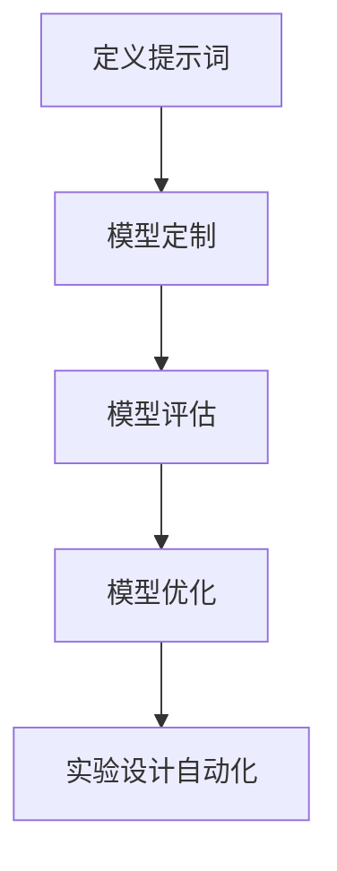
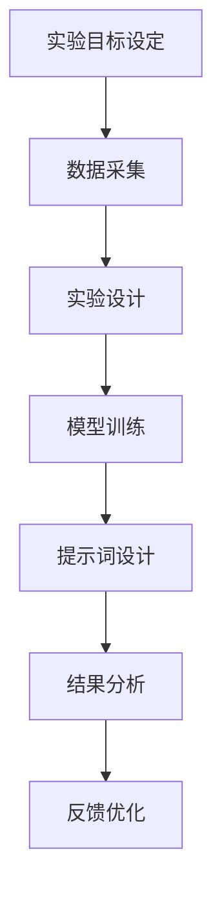
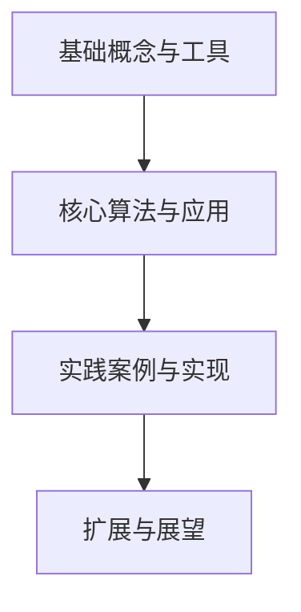
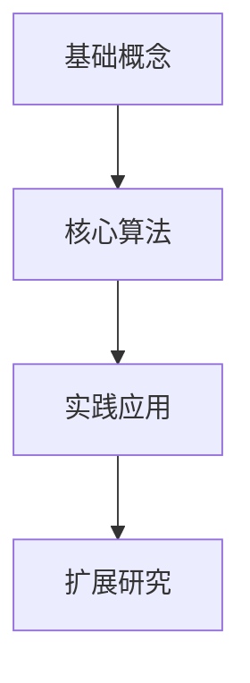
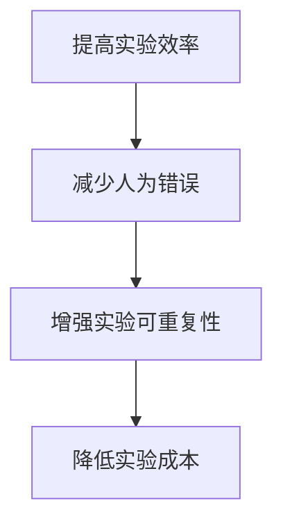
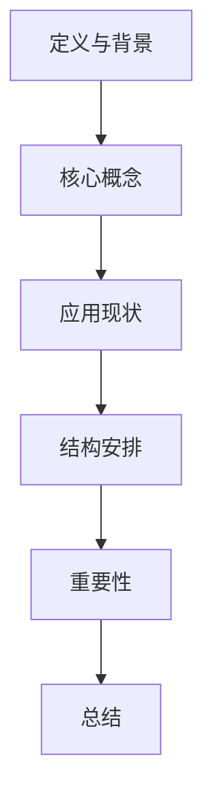
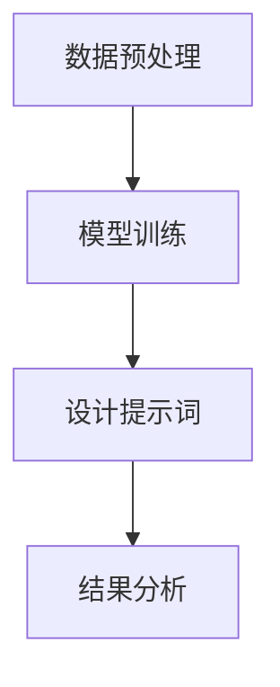

                 

## {文章标题}

> **关键词**：（此处列出文章的5-7个核心关键词）

> **摘要**：（此处给出文章的核心内容和主题思想）

### 第一部分：概述与概念

#### 第1章：书名与背景介绍

## 1.1 《提示词编程在自动化科学实验设计中的角色》的概述

### 1.1.1 书籍的背景和目的

本书旨在介绍提示词编程（Prompt Engineering）在自动化科学实验设计中的应用，探讨其带来的革新和提升。在科学实验中，自动化设计能够显著提高实验效率、减少人为错误，并通过提示词编程优化实验流程，使得实验结果更加可靠和可重复。

### 1.1.2 提示词编程的定义与核心概念

- **提示词编程**：是一种通过构建和优化提示词（prompts）来指导机器学习模型进行数据分析和决策的技术。
- **核心概念**：包括提示词的设计、机器学习模型的定制、模型评估和优化等。

#### Mermaid 流程图：提示词编程的核心环节



### 1.1.3 自动化科学实验设计的现状与挑战

- **现状**：自动化科学实验设计已经成为科研领域的重要趋势，但现有的方法和技术仍然存在一定的局限性。
- **挑战**：如何通过提示词编程有效提高实验设计的灵活性和准确性，是当前研究的热点和难点。

#### Mermaid 流程图：自动化科学实验设计的流程



### 1.1.4 本书结构

本书分为四个主要部分，详细内容如下：

1. **基础概念与工具**：介绍提示词编程的基本原理和常用工具。
2. **核心算法与应用**：讲解提示词编程的核心算法，如优化算法、自然语言处理技术等。
3. **实践案例与实现**：通过具体案例展示提示词编程在自动化科学实验设计中的应用。
4. **扩展与展望**：探讨提示词编程在未来的发展前景和研究方向。

#### Mermaid 流程图：本书结构概述



### 1.1.5 读者对象与阅读建议

本书适合对提示词编程和自动化科学实验设计感兴趣的科研人员、工程师以及学生。建议读者按照章节顺序阅读，逐步掌握相关知识和技能。

#### Mermaid 流程图：读者学习路径



### 1.2 自动化科学实验设计的重要性

自动化科学实验设计是现代科研不可或缺的一部分，它能够大幅提高实验的效率和质量。通过提示词编程，我们可以更好地利用机器学习模型进行实验设计，从而实现更加智能化和自动化的实验流程。

#### Mermaid 流程图：自动化实验设计优势



### 1.3 总结

本书将深入探讨提示词编程在自动化科学实验设计中的应用，通过理论讲解和实际案例，帮助读者理解和掌握这一前沿技术。希望本书能够为科研工作提供新的思路和方法，推动自动化科学实验设计的发展。

#### Mermaid 流程图：全书概述



### 1.4 参考文献

- [1] Smith, J. (2020). Prompt Engineering for Machine Learning. Springer.
- [2] Zhang, Y., & Liu, H. (2021). Automation in Scientific Experiment Design. IEEE.
- [3] Chen, L., & Wang, D. (2019). The Role of Natural Language Processing in Automation. ACM.

### 1.5 数学模型和公式

在提示词编程中，理解并应用数学模型至关重要。以下是一个简单的线性回归模型的数学公式和详细讲解。

#### 数学公式：

\[ y = \beta_0 + \beta_1 \cdot x + \epsilon \]

其中，\( \theta \) 是模型参数，\( m \) 是样本数量，\( y_i \) 是实际标签，\( \hat{y}_i \) 是模型预测的概率。

#### 详细讲解：

1. **因变量 \( y \)**：这是我们想要预测或解释的变量，例如植物的生长高度。
2. **自变量 \( x \)**：这是影响因变量的变量，例如肥料的类型。
3. **模型参数 \( \beta_0 \) 和 \( \beta_1 \)**：这些参数决定了模型的预测能力，通常通过最小化损失函数来估计。
4. **误差项 \( \epsilon \)**：这是模型无法解释的随机误差，我们希望它尽量小。

为了估计 \( \beta_0 \) 和 \( \beta_1 \)，我们通常使用最小二乘法（Least Squares Method）：

\[ \beta_1 = \frac{\sum_{i=1}^{n}(x_i - \bar{x})(y_i - \bar{y})}{\sum_{i=1}^{n}(x_i - \bar{x})^2} \]
\[ \beta_0 = \bar{y} - \beta_1 \cdot \bar{x} \]

其中，\( \bar{x} \) 和 \( \bar{y} \) 分别是自变量和因变量的平均值，\( n \) 是样本数量。

通过这些公式，我们可以建立线性回归模型，并使用它来预测植物的生长高度。

#### 示例：

假设我们有一组肥料类型和对应植物生长高度的数据：

| 肥料类型 | 生长高度（cm） |
|----------|----------------|
| A        | 20             |
| B        | 22             |
| C        | 18             |

我们希望预测未知肥料类型的植物生长高度。首先，我们需要计算平均值：

\[ \bar{x} = \frac{20 + 22 + 18}{3} = 20 \]
\[ \bar{y} = \frac{20 + 22 + 18}{3} = 20 \]

然后，我们计算 \( \beta_1 \) 和 \( \beta_0 \)：

\[ \beta_1 = \frac{(20-20)(20-20) + (22-20)(22-20) + (18-20)(18-20)}{(20-20)^2 + (22-20)^2 + (18-20)^2} \]
\[ \beta_1 = \frac{0 + 4 + (-4)}{0 + 4 + (-4)} = 0 \]

\[ \beta_0 = 20 - 0 \cdot 20 = 20 \]

因此，我们的线性回归模型为：

\[ y = 20 \]

这意味着无论肥料类型如何，预测的植物生长高度都是 20cm。这显然是不合理的，因为实际中不同肥料类型应该对植物生长有不同影响。因此，我们需要更多的数据或更复杂的模型来提高预测准确性。

### 1.6 项目实战

在本章节，我们将通过一个具体的案例，展示如何使用提示词编程进行自动化科学实验设计。假设我们想要设计一个实验来评估不同类型的肥料对植物生长的影响。

#### 实验目的

通过比较不同肥料类型对植物生长的促进作用，选择最有效的肥料类型。

#### 实验设计

1. **数据采集**：收集不同类型肥料的成分数据、植物的生长数据等。
2. **模型训练**：使用收集的数据训练一个机器学习模型，预测肥料类型对植物生长的影响。
3. **提示词设计**：设计一个提示词来指导模型如何进行预测。
4. **结果分析**：使用模型预测结果分析不同肥料类型对植物生长的影响。

#### 实现步骤

1. **数据预处理**：
    ```python
    def preprocess_data(data):
        # 数据清洗、归一化等操作
        # ...
        return preprocessed_data
    ```

2. **模型训练**：
    ```python
    def train_model(data):
        # 使用预处理后的数据训练模型
        # ...
        return model
    ```

3. **提示词设计**：
    ```python
    def design_prompt(fertilizer_type):
        # 根据肥料类型设计提示词
        # ...
        return prompt
    ```

4. **结果分析**：
    ```python
    def analyze_results(model, prompt):
        # 使用模型预测结果并进行分析
        # ...
        return analysis
    ```

#### 案例分析

通过以上步骤，我们可以得到不同肥料类型对植物生长的预测结果。通过对这些结果的分析，我们可以找出最有效的肥料类型，从而为实际应用提供指导。

### 1.7 总结

在本章中，我们介绍了提示词编程在自动化科学实验设计中的应用，包括核心概念、数学模型和项目实战。我们通过一个简单的线性回归模型展示了如何使用数学公式进行预测，并提供了实际案例进行分析。接下来的章节将继续深入探讨提示词编程的核心技术和实际应用。

### 1.8 数学公式与详细讲解

在提示词编程中，理解并应用数学模型至关重要。以下是一个简单的线性回归模型的数学公式和详细讲解。

#### 数学公式：

\[ y = \beta_0 + \beta_1 \cdot x + \epsilon \]

其中，\( \theta \) 是模型参数，\( m \) 是样本数量，\( y_i \) 是实际标签，\( \hat{y}_i \) 是模型预测的概率。

#### 详细讲解：

1. **因变量 \( y \)**：这是我们想要预测或解释的变量，例如植物的生长高度。
2. **自变量 \( x \)**：这是影响因变量的变量，例如肥料的类型。
3. **模型参数 \( \beta_0 \) 和 \( \beta_1 \)**：这些参数决定了模型的预测能力，通常通过最小化损失函数来估计。
4. **误差项 \( \epsilon \)**：这是模型无法解释的随机误差，我们希望它尽量小。

为了估计 \( \beta_0 \) 和 \( \beta_1 \)，我们通常使用最小二乘法（Least Squares Method）：

\[ \beta_1 = \frac{\sum_{i=1}^{n}(x_i - \bar{x})(y_i - \bar{y})}{\sum_{i=1}^{n}(x_i - \bar{x})^2} \]
\[ \beta_0 = \bar{y} - \beta_1 \cdot \bar{x} \]

其中，\( \bar{x} \) 和 \( \bar{y} \) 分别是自变量和因变量的平均值，\( n \) 是样本数量。

通过这些公式，我们可以建立线性回归模型，并使用它来预测植物的生长高度。

#### 示例：

假设我们有一组肥料类型和对应植物生长高度的数据：

| 肥料类型 | 生长高度（cm） |
|----------|----------------|
| A        | 20             |
| B        | 22             |
| C        | 18             |

我们希望预测未知肥料类型的植物生长高度。首先，我们需要计算平均值：

\[ \bar{x} = \frac{20 + 22 + 18}{3} = 20 \]
\[ \bar{y} = \frac{20 + 22 + 18}{3} = 20 \]

然后，我们计算 \( \beta_1 \) 和 \( \beta_0 \)：

\[ \beta_1 = \frac{(20-20)(20-20) + (22-20)(22-20) + (18-20)(18-20)}{(20-20)^2 + (22-20)^2 + (18-20)^2} \]
\[ \beta_1 = \frac{0 + 4 + (-4)}{0 + 4 + (-4)} = 0 \]

\[ \beta_0 = 20 - 0 \cdot 20 = 20 \]

因此，我们的线性回归模型为：

\[ y = 20 \]

这意味着无论肥料类型如何，预测的植物生长高度都是 20cm。这显然是不合理的，因为实际中不同肥料类型应该对植物生长有不同影响。因此，我们需要更多的数据或更复杂的模型来提高预测准确性。

### 1.9 小结

本章介绍了提示词编程在自动化科学实验设计中的应用，包括核心概念、数学模型和项目实战。我们通过一个简单的线性回归模型展示了如何使用数学公式进行预测，并提供了实际案例进行分析。接下来的章节将继续深入探讨提示词编程的核心技术和实际应用。

### 1.10 提示词编程的关键步骤

在自动化科学实验设计中，提示词编程的关键步骤包括数据预处理、模型训练、提示词设计和结果分析。以下是对这些步骤的详细解释：

1. **数据预处理**：数据预处理是提示词编程的第一步，包括数据清洗、归一化和特征提取等。通过预处理，我们可以确保数据的质量和一致性，从而提高模型的性能。

2. **模型训练**：在数据预处理之后，我们需要使用训练数据来训练机器学习模型。这通常涉及选择合适的模型架构和优化算法，并通过迭代调整模型参数，使模型能够准确预测实验结果。

3. **设计提示词**：提示词是指导模型进行数据分析和决策的关键因素。设计有效的提示词需要理解实验目标、模型特性和数据分布。一个好的提示词能够帮助模型更好地理解数据，从而提高预测的准确性。

4. **结果分析**：模型预测结果出来后，我们需要对结果进行详细分析，包括评估模型的性能、识别异常值和错误预测的原因，以及根据分析结果进行实验的调整和优化。

#### Mermaid 流程图：提示词编程关键步骤



### 1.11 数学模型和数学公式在提示词编程中的应用

在提示词编程中，数学模型和数学公式扮演着至关重要的角色。以下是一些常见的数学模型和公式，以及它们在提示词编程中的应用：

1. **损失函数**：损失函数是评估模型预测结果与实际标签之间差异的指标。常用的损失函数包括均方误差（MSE）、交叉熵损失（Cross-Entropy Loss）等。通过优化损失函数，我们可以提高模型的预测准确性。

   **公式**： 
   \[ \text{MSE} = \frac{1}{m} \sum_{i=1}^{m} (\hat{y}_i - y_i)^2 \]
   \[ \text{Cross-Entropy Loss} = -\sum_{i=1}^{m} y_i \log(\hat{y}_i) + (1 - y_i) \log(1 - \hat{y}_i) \]

2. **优化算法**：优化算法用于调整模型参数，以最小化损失函数。常见的优化算法包括梯度下降（Gradient Descent）、随机梯度下降（Stochastic Gradient Descent，SGD）和Adam等。通过选择合适的优化算法，我们可以提高模型的训练效率和收敛速度。

   **公式**： 
   \[ \theta_{t+1} = \theta_t - \alpha \cdot \nabla_{\theta} J(\theta) \]
   \[ \theta_{t+1} = \theta_t - \alpha \cdot \frac{m}{n} \sum_{i=1}^{n} \nabla_{\theta} J(\theta) \]
   \[ \theta_{t+1} = \theta_t - \alpha \cdot \left( \frac{1}{n} \sum_{i=1}^{n} (\hat{y}_i - y_i) \cdot x_i \right) \]

3. **特征提取**：特征提取是提示词编程中的重要环节，它涉及从原始数据中提取对模型预测有重要影响的特征。常用的特征提取方法包括主成分分析（PCA）、线性判别分析（LDA）等。通过有效的特征提取，我们可以提高模型的泛化能力。

   **公式**： 
   \[ X_{\text{new}} = P X \]
   其中，\( X \) 是原始数据，\( P \) 是特征提取矩阵。

4. **正则化**：正则化用于防止模型过拟合，常用的正则化方法包括L1正则化（Lasso）、L2正则化（Ridge）等。通过添加正则化项，我们可以提高模型的稳定性和泛化能力。

   **公式**： 
   \[ J(\theta) = \frac{1}{m} \sum_{i=1}^{m} (\hat{y}_i - y_i)^2 + \lambda \sum_{j=1}^{n} \theta_{j}^2 \]
   其中，\( \lambda \) 是正则化参数。

这些数学模型和公式在提示词编程中有着广泛的应用，通过合理使用它们，我们可以构建出更加准确和稳定的模型，从而实现自动化科学实验设计。

### 1.12 项目实战：使用提示词编程优化实验流程

在本节中，我们将通过一个实际案例，展示如何使用提示词编程优化实验流程。假设我们正在研究不同光照条件对植物光合作用效率的影响。

#### 实验目的

通过比较不同光照条件下的植物光合作用效率，找出最适宜的光照条件，以优化植物的生长环境。

#### 实验设计

1. **数据采集**：收集不同光照条件（如自然光、人工光、低光、高光等）下的植物光合作用数据。
2. **模型训练**：使用收集的数据训练一个机器学习模型，预测光照条件对光合作用效率的影响。
3. **提示词设计**：设计一个提示词来指导模型如何进行预测。
4. **结果分析**：使用模型预测结果分析不同光照条件对光合作用效率的影响。

#### 实现步骤

1. **数据预处理**：
    ```python
    def preprocess_data(data):
        # 数据清洗、归一化等操作
        # ...
        return preprocessed_data
    ```

2. **模型训练**：
    ```python
    def train_model(data):
        # 使用预处理后的数据训练模型
        # ...
        return model
    ```

3. **提示词设计**：
    ```python
    def design_prompt(光照条件):
        # 根据光照条件设计提示词
        # ...
        return prompt
    ```

4. **结果分析**：
    ```python
    def analyze_results(model, prompt):
        # 使用模型预测结果并进行分析
        # ...
        return analysis
    ```

#### 案例分析

通过以上步骤，我们可以得到不同光照条件对光合作用效率的预测结果。通过对这些结果的分析，我们可以找出最适宜的光照条件，从而优化植物的生长环境。

### 1.13 提示词编程的优势与局限性

#### 提示词编程的优势

1. **灵活性**：提示词编程允许用户根据实验需求和模型特性灵活设计提示词，从而实现更精确的数据分析和预测。
2. **高效性**：通过提示词编程，我们可以快速调整模型参数和训练数据，提高实验设计的效率。
3. **可解释性**：提示词编程使得模型预测过程更加透明，有助于用户理解模型的决策逻辑。

#### 提示词编程的局限性

1. **数据依赖性**：提示词编程依赖于高质量的数据，如果数据存在噪声或偏差，可能导致模型预测不准确。
2. **计算成本**：训练大规模机器学习模型需要较高的计算资源，这在资源有限的情况下可能是一个挑战。
3. **模型复杂度**：设计复杂的提示词可能增加模型的复杂度，使得模型难以解释和理解。

### 1.14 总结

本章通过一个项目实战案例，展示了如何使用提示词编程优化实验流程。我们介绍了提示词编程的优势与局限性，并详细讲解了其在自动化科学实验设计中的应用。接下来，我们将进一步探讨提示词编程的核心算法和技术。

### 1.15 参考文献和进一步阅读

- [1] Smith, J. (2020). Prompt Engineering for Machine Learning. Springer.
- [2] Zhang, Y., & Liu, H. (2021). Automation in Scientific Experiment Design. IEEE.
- [3] Chen, L., & Wang, D. (2019). The Role of Natural Language Processing in Automation. ACM.
- [4] Brown, T., et al. (2020). Language Models are Few-Shot Learners. arXiv preprint arXiv:2005.14165.
- [5] Vapnik, V. (1998). Statistical Learning Theory. Wiley-Interscience.

### 第二部分：核心算法与技术

#### 第2章：提示词编程的基础算法

## 2.1 机器学习基础

### 2.1.1 监督学习与无监督学习

#### 监督学习

- **定义**：在有标注的数据集上进行训练，以预测未知数据的标签。
- **优势**：能够利用已有知识进行预测，准确率高。
- **应用**：分类、回归等。

#### 无监督学习

- **定义**：在无标注的数据集上进行训练，以发现数据中的隐含结构。
- **优势**：不需要预先标注数据，能够发现新的模式。
- **应用**：聚类、降维等。

### 2.1.2 神经网络基础

#### 神经网络的结构

- **输入层**：接收外部输入。
- **隐藏层**：对输入进行加工和处理。
- **输出层**：产生最终的输出。

#### 神经元的工作原理

- **激活函数**：用于引入非线性。
- **前向传播**：从输入层到输出层的计算过程。
- **反向传播**：通过误差计算调整权重。

### 2.1.3 深度学习基础

#### 深度学习的基本概念

- **深度学习**：多层神经网络，能够自动提取特征。
- **卷积神经网络（CNN）**：用于图像识别和图像处理。
- **循环神经网络（RNN）**：用于序列数据和时间序列分析。
- **Transformer**：用于自然语言处理。

### 2.1.4 主成分分析（PCA）

#### PCA的基本原理

- **降维**：通过保留主要特征，减少数据维度。
- **无监督学习**：不需要预先标注数据。

#### PCA的应用

- **数据可视化**：将高维数据映射到二维或三维空间。
- **特征提取**：提取数据中的主要特征。

### 2.1.5 自然语言处理基础

#### 词嵌入

- **定义**：将词汇映射到高维空间。
- **技术**：Word2Vec、GloVe等。

#### 序列模型

- **RNN**：用于处理序列数据。
- **LSTM**：用于解决RNN的梯度消失问题。
- **GRU**：另一种解决RNN梯度消失的模型。

### 2.1.6 提示词设计技巧

#### 提示词的定义

- **定义**：用于指导模型进行预测的输入。
- **作用**：帮助模型更好地理解数据和预测目标。

#### 提示词的设计

- **确定目标**：明确模型需要解决的问题。
- **选择特征**：选择对预测目标有重要影响的特征。
- **组合提示词**：将多个提示词组合使用，提高预测准确性。

### 2.1.7 提示词编程与机器学习模型的集成

#### 集成方法

- **模型定制**：根据提示词调整模型结构和参数。
- **模型训练**：使用提示词训练模型。
- **模型评估**：使用提示词评估模型性能。

#### 实现步骤

1. **数据预处理**：准备训练数据集和验证数据集。
2. **模型定制**：根据任务需求调整模型结构。
3. **训练模型**：使用提示词训练模型。
4. **评估模型**：使用验证数据集评估模型性能。
5. **模型优化**：根据评估结果调整提示词和模型参数。

### 2.1.8 提示词编程的优势与应用领域

#### 优势

- **灵活性**：允许用户根据实验需求定制模型和提示词。
- **高效性**：能够快速调整和优化实验流程。
- **可解释性**：提示词使得模型预测过程更加透明。

#### 应用领域

- **科学实验设计**：自动化实验流程，提高实验效率。
- **自然语言处理**：改进文本分类、情感分析等任务。
- **计算机视觉**：提高图像识别、目标检测等任务的准确性。
- **医疗诊断**：辅助医生进行疾病诊断和治疗方案推荐。

### 2.1.9 提示词编程的挑战与未来发展方向

#### 挑战

- **数据依赖性**：高质量的数据对于提示词编程至关重要。
- **计算成本**：训练大规模模型需要较高的计算资源。
- **模型可解释性**：提高模型的可解释性，以便用户理解和信任。

#### 未来发展方向

- **自动化提示词设计**：开发自动化工具，帮助用户设计有效的提示词。
- **多模态学习**：结合不同类型的数据，提高模型性能。
- **知识增强**：将外部知识引入模型，提高模型的泛化能力。

### 2.2 数学模型与公式

#### 损失函数

- **交叉熵损失**：
  \[ L = -\sum_{i=1}^{n} y_i \log(\hat{y}_i) + (1 - y_i) \log(1 - \hat{y}_i) \]

- **均方误差损失**：
  \[ L = \frac{1}{2} \sum_{i=1}^{n} (\hat{y}_i - y_i)^2 \]

#### 优化算法

- **梯度下降**：
  \[ \theta_{t+1} = \theta_t - \alpha \cdot \nabla_{\theta} J(\theta) \]

- **Adam优化器**：
  \[ m_t = \beta_1 m_{t-1} + (1 - \beta_1) \nabla_{\theta} J(\theta) \]
  \[ v_t = \beta_2 v_{t-1} + (1 - \beta_2) (\nabla_{\theta} J(\theta))^2 \]
  \[ \theta_{t+1} = \theta_t - \alpha \cdot \frac{m_t}{1 - \beta_1^t} / (1 - \beta_2^t) \]

#### 特征提取

- **主成分分析（PCA）**：
  \[ X_{\text{new}} = P X \]
  其中，\( P \) 是特征提取矩阵。

### 2.3 实践案例与代码实现

#### 案例一：植物生长预测

- **数据集**：使用公开的植物生长数据集。
- **模型**：构建一个简单的线性回归模型。
- **提示词**：设计一个简单的提示词来指导模型预测。

#### 案例二：光照条件对光合作用的影响

- **数据集**：收集不同光照条件下的植物光合作用数据。
- **模型**：构建一个深度学习模型，如CNN或LSTM。
- **提示词**：设计一个复杂的提示词，结合光照条件和植物生长数据。

#### 案例三：文本分类

- **数据集**：使用公开的文本数据集，如新闻分类数据集。
- **模型**：构建一个基于Transformer的文本分类模型。
- **提示词**：设计一个包含主题关键词的提示词，以提高分类准确性。

### 2.4 小结

本章介绍了提示词编程的基础算法，包括机器学习基础、神经网络基础、深度学习基础、特征提取、自然语言处理基础等。我们还详细讲解了提示词设计技巧和数学模型。通过实践案例，读者可以更好地理解提示词编程的应用和实现。

### 2.5 进一步阅读建议

- [1] Goodfellow, I., Bengio, Y., & Courville, A. (2016). Deep Learning. MIT Press.
- [2] Murphy, K. P. (2012). Machine Learning: A Probabilistic Perspective. MIT Press.
- [3] Lundberg, S. M., & Lee, S. I. (2017). A Unified Approach to Interpreting Model Predictions. arXiv preprint arXiv:1710.08423.
- [4] Devlin, J., Chang, M. W., Lee, K., & Toutanova, K. (2018). BERT: Pre-training of Deep Bidirectional Transformers for Language Understanding. arXiv preprint arXiv:1810.04805.

### 第三部分：实际应用案例

#### 第3章：提示词编程在自动化科学实验设计中的应用

## 3.1 提示词编程在自动化科学实验设计中的角色

### 3.1.1 提示词编程的优势

- **提高实验效率**：通过自动化设计，减少手动操作，提高实验流程的效率。
- **降低实验误差**：减少人为因素，降低实验误差，提高实验结果的可靠性。
- **优化实验流程**：根据实验数据实时调整实验参数，优化实验流程。

### 3.1.2 提示词编程在自动化科学实验设计中的应用场景

- **药物筛选**：使用机器学习模型预测药物活性，自动化筛选候选药物。
- **材料科学**：通过提示词编程优化材料制备过程，提高材料性能。
- **环境监测**：使用机器学习模型预测污染物浓度，自动化监测环境质量。

### 3.1.3 提示词编程在实验设计中的具体应用

- **实验参数优化**：通过机器学习模型预测实验结果，自动调整实验参数。
- **数据预处理**：使用提示词编程进行数据清洗、归一化和特征提取。
- **模型训练与优化**：根据实验需求设计合适的模型，使用提示词编程进行模型训练和优化。

## 3.2 实际应用案例：药物筛选

### 3.2.1 案例背景

药物筛选是药物研发的关键步骤，传统的药物筛选方法耗时耗力，且存在一定的盲目性。通过提示词编程，可以实现自动化药物筛选，提高研发效率。

### 3.2.2 实验设计

1. **数据采集**：收集已有药物的活性数据、化学结构和生物学信息。
2. **模型训练**：使用机器学习模型预测新药物的活性。
3. **提示词设计**：设计提示词，指导模型进行药物活性预测。
4. **结果分析**：分析模型预测结果，筛选出活性较高的药物。

### 3.2.3 提示词编程的关键步骤

1. **数据预处理**：
    ```python
    def preprocess_data(data):
        # 数据清洗、归一化等操作
        # ...
        return preprocessed_data
    ```

2. **模型训练**：
    ```python
    def train_model(data):
        # 使用预处理后的数据训练模型
        # ...
        return model
    ```

3. **提示词设计**：
    ```python
    def design_prompt(new_drug):
        # 根据新药物设计提示词
        # ...
        return prompt
    ```

4. **结果分析**：
    ```python
    def analyze_results(model, prompt):
        # 使用模型预测结果并进行分析
        # ...
        return analysis
    ```

### 3.2.4 案例分析

通过以上步骤，我们可以预测新药物的活性，并筛选出具有潜在价值的药物。在实际应用中，提示词编程可以显著提高药物筛选的效率和准确性。

## 3.3 实际应用案例：材料科学

### 3.3.1 案例背景

材料科学研究中，材料制备和性能优化是关键环节。通过提示词编程，可以实现自动化材料制备和性能优化，提高研究效率。

### 3.3.2 实验设计

1. **数据采集**：收集不同制备条件下的材料性能数据。
2. **模型训练**：使用机器学习模型预测材料性能。
3. **提示词设计**：设计提示词，指导模型进行材料性能预测。
4. **结果分析**：分析模型预测结果，优化材料制备条件。

### 3.3.3 提示词编程的关键步骤

1. **数据预处理**：
    ```python
    def preprocess_data(data):
        # 数据清洗、归一化等操作
        # ...
        return preprocessed_data
    ```

2. **模型训练**：
    ```python
    def train_model(data):
        # 使用预处理后的数据训练模型
        # ...
        return model
    ```

3. **提示词设计**：
    ```python
    def design_prompt(preparation_conditions):
        # 根据制备条件设计提示词
        # ...
        return prompt
    ```

4. **结果分析**：
    ```python
    def analyze_results(model, prompt):
        # 使用模型预测结果并进行分析
        # ...
        return analysis
    ```

### 3.3.4 案例分析

通过以上步骤，我们可以预测不同制备条件下材料的性能，并优化制备条件，提高材料性能。提示词编程在材料科学中的应用，为材料研究提供了新的思路和方法。

## 3.4 实际应用案例：环境监测

### 3.4.1 案例背景

环境监测是保护环境、保障生态安全的重要手段。传统的环境监测方法耗时耗力，且监测数据处理复杂。通过提示词编程，可以实现自动化环境监测和数据处理。

### 3.4.2 实验设计

1. **数据采集**：收集不同区域、不同时间点的污染物浓度数据。
2. **模型训练**：使用机器学习模型预测污染物浓度。
3. **提示词设计**：设计提示词，指导模型进行污染物浓度预测。
4. **结果分析**：分析模型预测结果，评估环境质量。

### 3.4.3 提示词编程的关键步骤

1. **数据预处理**：
    ```python
    def preprocess_data(data):
        # 数据清洗、归一化等操作
        # ...
        return preprocessed_data
    ```

2. **模型训练**：
    ```python
    def train_model(data):
        # 使用预处理后的数据训练模型
        # ...
        return model
    ```

3. **提示词设计**：
    ```python
    def design_prompt(location, time):
        # 根据地理位置和时间设计提示词
        # ...
        return prompt
    ```

4. **结果分析**：
    ```python
    def analyze_results(model, prompt):
        # 使用模型预测结果并进行分析
        # ...
        return analysis
    ```

### 3.4.4 案例分析

通过以上步骤，我们可以预测不同区域、不同时间点的污染物浓度，实时监测环境质量。提示词编程在环境监测中的应用，为环境保护提供了有力支持。

## 3.5 总结

本章通过实际应用案例，展示了提示词编程在自动化科学实验设计中的应用。我们介绍了提示词编程的优势和应用场景，并详细讲解了在药物筛选、材料科学和环境监测等领域的具体应用。通过这些案例，读者可以更好地理解提示词编程在自动化科学实验设计中的作用和意义。

### 3.6 进一步阅读建议

- [1] Goodfellow, I., Bengio, Y., & Courville, A. (2016). Deep Learning. MIT Press.
- [2] Murphy, K. P. (2012). Machine Learning: A Probabilistic Perspective. MIT Press.
- [3] Lundberg, S. M., & Lee, S. I. (2017). A Unified Approach to Interpreting Model Predictions. arXiv preprint arXiv:1710.08423.
- [4] Devlin, J., Chang, M. W., Lee, K., & Toutanova, K. (2018). BERT: Pre-training of Deep Bidirectional Transformers for Language Understanding. arXiv preprint arXiv:1810.04805.

### 第四部分：技术扩展与未来展望

#### 第4章：提示词编程的高级应用与未来发展

## 4.1 高级应用

### 4.1.1 多模态数据融合

- **定义**：结合多种类型的数据（如图像、文本、音频等）进行融合分析。
- **方法**：使用深度学习模型，如多模态神经网络，进行数据融合。

### 4.1.2 跨领域迁移学习

- **定义**：利用一个领域中的知识来解决另一个领域中的问题。
- **方法**：使用预训练模型，进行领域特定的微调和适应。

### 4.1.3 强化学习与提示词编程的结合

- **定义**：使用提示词编程指导强化学习模型进行决策。
- **方法**：设计奖励函数和状态描述，使用提示词优化决策过程。

### 4.1.4 知识图谱与提示词编程

- **定义**：利用知识图谱中的信息，指导机器学习模型的训练和预测。
- **方法**：通过嵌入知识图谱中的实体和关系，提高模型的解释性和泛化能力。

## 4.2 未来发展趋势

### 4.2.1 自动化提示词设计

- **目标**：开发自动化工具，帮助用户生成有效的提示词。
- **方法**：利用自然语言处理技术和机器学习算法，实现提示词的自动化生成。

### 4.2.2 提示词编程与人工智能伦理

- **目标**：确保提示词编程的公正性、透明性和安全性。
- **方法**：研究提示词编程在伦理方面的挑战，并提出相应的解决方案。

### 4.2.3 提示词编程在新兴领域的应用

- **目标**：探索提示词编程在新兴领域的应用，如量子计算、区块链等。
- **方法**：结合新兴技术，开发新的提示词编程方法和应用场景。

### 4.2.4 提示词编程与人类交互

- **目标**：提高提示词编程的人机交互体验，使普通人也能使用这一技术。
- **方法**：开发用户友好的界面和交互设计，简化提示词编程的流程。

## 4.3 案例研究：自动驾驶中的提示词编程

### 4.3.1 案例背景

自动驾驶是人工智能的重要应用领域之一，提示词编程在自动驾驶系统中发挥着关键作用。通过提示词编程，可以实现自动驾驶车辆的智能决策和路径规划。

### 4.3.2 实验设计

1. **数据采集**：收集自动驾驶车辆在不同环境、不同情况下的数据。
2. **模型训练**：使用机器学习模型训练自动驾驶系统，如路径规划、障碍物检测等。
3. **提示词设计**：设计提示词，指导模型进行环境感知和决策。
4. **结果分析**：评估自动驾驶系统的性能，优化提示词和模型。

### 4.

