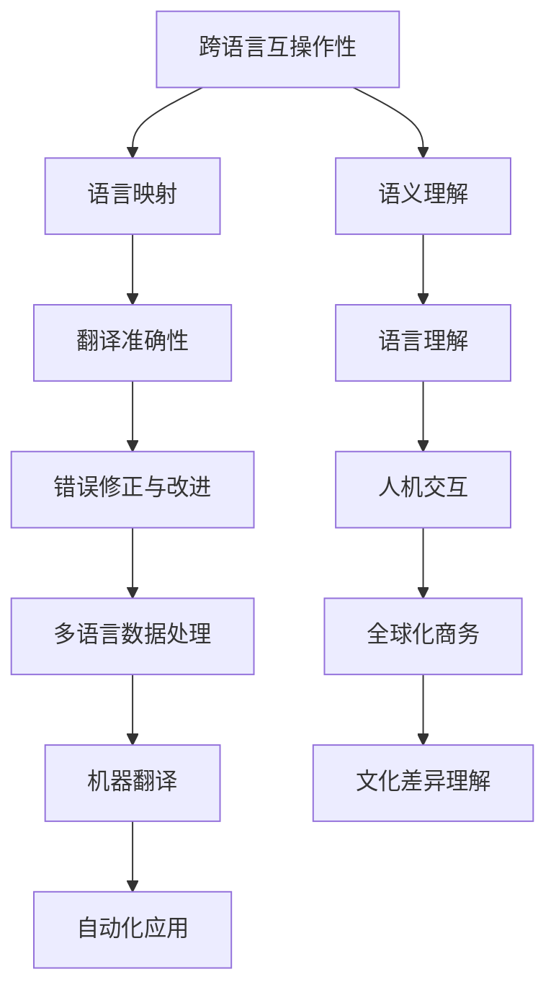

                 

### 第一部分：概述

> **关键词：** 跨语言互操作性、提示词语言、AI大模型、语言映射、语义理解、企业应用、技术实现。

> **摘要：** 本文档深入探讨了跨语言互操作性的设计，包括提示词语言的基本原理和AI大模型的技术基础。我们分析了语言映射和语义理解的实现方法，并探讨了跨语言互操作性在企业应用中的挑战与解决方案。

## 第1章：跨语言互操作性基础

### 1.1 跨语言互操作性的概念与背景

#### 跨语言互操作性的定义与重要性

跨语言互操作性（Cross-Language Interoperability）指的是不同语言之间能够互相理解和交互的能力。在全球化的今天，跨语言互操作性显得尤为重要。它不仅能够促进国际间的商务交流，还能够推动人工智能（AI）和机器学习（ML）领域的发展。

**语言差异的影响**

语言差异对跨语言互操作性提出了巨大的挑战。不同语言之间存在着词汇、语法、语义和文化的差异，这些差异可能导致信息传递的误解和误差。例如，一个单词在一种语言中可能有多个含义，而在另一种语言中可能没有对应的词汇。

#### 提示词语言的基本原理

提示词语言（Prompt Language）是一种基于关键词和上下文的技术，用于指导机器学习和自然语言处理模型进行特定的任务。提示词语言通常包含一系列关键词或短语，这些关键词或短语能够引导模型理解用户的意图和任务需求。

**提示词语言的分类**

提示词语言可以分为自然语言和编程语言两大类。自然语言提示词语言主要用于人类与机器之间的交互，如聊天机器人和语音助手。编程语言提示词语言则用于编写代码和程序，如Python和Java。

#### 跨语言互操作性的关键要素

跨语言互操作性主要依赖于以下两个关键要素：

1. **语言映射**：实现不同语言之间的词汇和语法对应关系，使信息能够在不同语言之间传递。
2. **语义理解**：理解不同语言之间的语义差异，确保信息在跨语言传递过程中能够保持准确和完整。

#### 跨语言互操作性的应用领域

跨语言互操作性在多个领域都有广泛应用：

- **全球商务与交流**：跨国公司和国际组织利用跨语言互操作性进行全球商务沟通和协作。
- **人工智能与机器学习**：AI和ML系统通过跨语言互操作性能够处理来自不同语言的输入数据，提高模型的泛化能力。

### 1.2 案例分析

#### 国际商务沟通中的跨语言互操作性案例

在国际商务沟通中，跨语言互操作性确保了不同国家和文化背景的商务伙伴能够有效地交流和合作。例如，跨国公司的销售人员使用翻译工具和跨语言平台与客户进行沟通，确保信息的准确传递。

#### 机器翻译中的跨语言互操作性挑战

机器翻译是跨语言互操作性的重要应用领域。尽管现代机器翻译技术取得了显著进展，但仍然面临着语义歧义、文化差异和语言多样性等挑战。例如，某些表达在一种语言中可能是褒义的，而在另一种语言中可能是贬义的，这需要在翻译过程中进行仔细的处理。

### 1.3 本章总结

本章介绍了跨语言互操作性的基本概念和背景，探讨了提示词语言的基本原理和分类，并分析了跨语言互操作性的关键要素和应用领域。通过案例分析，我们展示了跨语言互操作性的实际应用和面临的挑战。

---

### 1.1.1 从软件 1.0 到软件 2.0 的演进

在计算机发展的历史中，软件从1.0时代演进了到2.0时代，这一演进不仅改变了软件开发的模式，也对跨语言互操作性产生了深远的影响。

#### 软件时代的特点

**软件1.0时代** 主要特点是简单和单一。软件通常是为特定任务或系统设计的，功能有限，且大多依赖于本地操作。在那个时代，软件主要侧重于实现基本的功能，如文字处理、电子表格和数据库管理等。

**软件2.0时代** 则标志着软件的复杂性和互操作性的提升。软件不再仅仅是独立的工具，而是能够通过网络进行协作和共享。这一时代的软件强调用户体验、可扩展性和灵活性，如云计算、社交媒体和在线协作平台等。

#### 软件2.0的核心概念

软件2.0的核心概念包括：

- **用户体验**：软件设计更加注重用户体验，提供直观、易用的界面和功能。
- **网络化**：软件通过网络连接，实现跨平台、跨地域的协作和共享。
- **灵活性**：软件能够根据用户需求进行定制和扩展，提高适应性和灵活性。
- **可扩展性**：软件设计考虑到未来的扩展需求，能够轻松集成新的功能和服务。

#### 软件2.0的演进路径

软件2.0的演进路径可以从以下几个方面来分析：

1. **云计算的兴起**：云计算使得软件不再局限于本地设备，用户可以通过网络访问远程服务器上的软件和服务，提高了软件的可扩展性和可用性。
2. **社交媒体的普及**：社交媒体平台的兴起改变了人们的信息交流方式，使得软件需要更加注重社交互动和用户参与。
3. **移动设备的普及**：智能手机和平板电脑的普及推动了移动应用的发展，软件需要适应不同的设备和屏幕尺寸，提供更好的移动用户体验。
4. **人工智能的融合**：人工智能技术的引入使得软件能够更好地理解和满足用户需求，提供个性化服务和智能推荐。

#### 案例研究

**云计算平台**：如Amazon Web Services（AWS）和Microsoft Azure，这些平台提供了强大的云计算能力，用户可以通过互联网访问和管理虚拟服务器、存储和数据库等资源。

**社交媒体平台**：如Facebook、Twitter和LinkedIn，这些平台通过跨语言互操作性，实现了全球用户的信息交流和互动。

**移动应用**：如WhatsApp和微信，这些应用不仅支持多种语言，还提供了跨平台的即时通讯功能。

**人工智能应用**：如Amazon Alexa和Google Assistant，这些智能助手通过自然语言处理和语音识别技术，实现了与用户的跨语言交互。

### 1.1.2 大模型在软件 2.0 中的核心地位

随着软件从1.0时代发展到2.0时代，AI大模型（Large-scale AI Models）逐渐成为软件技术的核心组成部分。这些大模型在提升软件性能和效率方面发挥着关键作用。

#### 大模型的概念与特点

AI大模型是指那些参数数量巨大、训练数据量丰富的深度学习模型。这些模型通常在多个任务上预训练，然后通过微调（Fine-tuning）适应特定的应用场景。

**概念**

AI大模型的概念可以从以下几个方面来理解：

- **参数数量**：大模型通常具有数百万到数十亿个参数，这使得模型能够捕捉到输入数据中的复杂模式。
- **预训练**：大模型在训练过程中使用大量的未标注数据，通过自监督学习方法进行预训练，提高了模型的泛化能力。
- **微调**：在预训练的基础上，大模型通过微调适应特定的任务或应用场景，实现更高的任务性能。

**特点**

AI大模型的特点包括：

- **强大学习能力**：大模型能够通过大量数据的学习，提高对未知数据的预测和分类能力。
- **高泛化能力**：大模型通过预训练，能够在不同任务和应用场景中表现出色。
- **高效性**：大模型通过并行计算和分布式训练，能够在短时间内完成复杂的计算任务。

#### 大模型的优势

AI大模型在软件2.0时代具有以下优势：

- **提升性能**：大模型通过学习大量数据，能够实现更高的预测准确性和分类效果。
- **降低成本**：大模型能够通过自动化和智能化，减少人力和资源的消耗，降低开发和运维成本。
- **增强用户体验**：大模型能够提供更加个性化的服务和推荐，提升用户满意度和粘性。

#### 大模型的应用领域

AI大模型在多个领域都有广泛应用：

- **自然语言处理**：如语言模型、机器翻译和文本生成。
- **图像识别和计算机视觉**：如图像分类、目标检测和图像生成。
- **推荐系统**：如商品推荐、内容推荐和社交推荐。
- **语音识别和语音合成**：如语音助手、语音搜索和语音翻译。

#### 案例研究

**自然语言处理中的应用**：如BERT和GPT系列模型，这些模型在文本分类、情感分析和机器翻译等任务中表现出色。

**图像识别和计算机视觉中的应用**：如ResNet和Inception模型，这些模型在图像分类、目标检测和图像生成等任务中取得了显著成果。

**推荐系统中的应用**：如Collaborative Filtering和Neural Collaborative Filtering，这些模型在电子商务、社交媒体和在线娱乐等领域得到了广泛应用。

**语音识别和语音合成中的应用**：如DeepSpeech和WaveNet，这些模型在语音助手、语音搜索和语音翻译等领域取得了重要进展。

### 1.1.3 企业级应用开发的新范式

随着AI大模型在软件2.0时代的广泛应用，企业级应用开发也迎来了新的范式。传统的企业级应用开发往往侧重于功能实现和性能优化，而新范式则更加注重用户体验、灵活性和可扩展性。

#### 企业级应用开发的挑战

在传统的企业级应用开发中，面临的挑战主要包括：

- **功能复杂度**：企业级应用通常具有复杂的功能需求，需要高效且可靠地实现。
- **性能要求**：企业级应用需要在高性能和高可靠性之间取得平衡。
- **安全性**：企业级应用需要处理敏感数据，确保数据的安全和隐私。
- **可维护性**：企业级应用需要长期维护和更新，以适应不断变化的需求。

#### 软件2.0对企业级应用开发的影响

软件2.0对企业级应用开发的影响主要体现在以下几个方面：

- **用户体验**：软件2.0强调用户体验，注重用户界面设计和交互体验，提高用户满意度。
- **灵活性和可扩展性**：软件2.0支持模块化设计和微服务架构，提高了系统的灵活性和可扩展性。
- **自动化和智能化**：软件2.0通过AI大模型和自动化工具，实现任务的自动化和智能化，降低开发和运维成本。
- **云计算和分布式计算**：软件2.0利用云计算和分布式计算技术，提高系统的性能和可靠性。

#### 新范式的关键要素

企业级应用开发的新范式需要考虑以下关键要素：

- **模块化设计**：将系统拆分为多个独立的模块，每个模块负责特定的功能，便于开发和维护。
- **微服务架构**：采用微服务架构，将系统拆分为多个微服务，每个微服务独立部署和扩展，提高系统的灵活性和可扩展性。
- **用户体验**：注重用户体验设计，提供直观、易用的界面和交互方式。
- **自动化和智能化**：利用AI大模型和自动化工具，实现任务的自动化和智能化。
- **安全性**：确保系统的安全性和数据的隐私性，采用加密、权限控制和安全审计等技术。
- **持续集成与持续部署**：采用持续集成和持续部署（CI/CD）流程，提高开发和部署的效率和质量。

#### 案例研究

**模块化设计**：如Uber和Airbnb，这些公司通过模块化设计，实现了业务的高效管理和扩展。

**微服务架构**：如阿里巴巴和亚马逊，这些公司采用微服务架构，提高了系统的灵活性和可扩展性。

**用户体验**：如Facebook和Instagram，这些平台注重用户体验，通过直观的界面和交互方式，吸引了大量用户。

**自动化和智能化**：如Netflix和Spotify，这些公司利用AI大模型和自动化工具，实现推荐系统和用户行为的自动化分析。

**安全性**：如谷歌和微软，这些公司通过严密的安全措施，确保用户数据和系统的安全。

### 1.1.4 本章总结

本章介绍了从软件1.0到软件2.0的演进过程，探讨了AI大模型在软件2.0中的核心地位，以及企业级应用开发的新范式。通过案例分析，我们展示了软件2.0时代的技术特点和优势，为后续章节的讨论奠定了基础。

### 图1.1：跨语言互操作性的基本概念与原理

## 第2章：AI大模型技术基础

### 2.1 深度学习与神经网络基础

深度学习（Deep Learning）是机器学习（Machine Learning）的一个重要分支，它通过构建具有多个隐藏层的神经网络（Neural Networks）来模拟人脑的学习方式。深度学习在图像识别、自然语言处理、语音识别等领域取得了显著成果。

#### 神经网络的基本结构

神经网络由多个神经元（Node）组成，每个神经元都与其它神经元相连，形成复杂的网络结构。神经网络的基本结构包括输入层（Input Layer）、隐藏层（Hidden Layer）和输出层（Output Layer）。

**输入层**：接收外部输入数据，如图像像素或文本序列。

**隐藏层**：对输入数据进行特征提取和变换，隐藏层可以有多个层次，层数越多，模型的复杂度越高。

**输出层**：生成最终预测结果，如分类标签或回归值。

#### 常见的深度学习架构

在深度学习中，有许多不同的神经网络架构被广泛使用，以下是一些常见的架构：

**卷积神经网络（CNN）**：适用于图像识别和计算机视觉任务，通过卷积层（Convolutional Layer）提取图像特征。

**循环神经网络（RNN）**：适用于序列数据处理，如自然语言处理和语音识别，通过循环结构处理序列数据。

**转换器架构（Transformer）**：一种基于自注意力机制（Self-Attention Mechanism）的新型神经网络架构，广泛应用于自然语言处理任务。

**生成对抗网络（GAN）**：通过生成器和判别器的对抗训练，实现高质量的数据生成。

**自编码器（Autoencoder）**：用于无监督学习，通过编码器（Encoder）和解码器（Decoder）重建输入数据，用于特征提取和数据压缩。

#### 深度学习优化算法

在深度学习中，优化算法用于调整网络中的参数，以最小化损失函数（Loss Function）。以下是一些常见的优化算法：

**随机梯度下降（SGD）**：一种简单的优化算法，通过随机梯度方向调整参数。

**动量（Momentum）**：在SGD的基础上引入动量项，加快收敛速度。

**Adam优化器**：结合了SGD和RMSprop的优点，适用于大多数深度学习任务。

**Adagrad**：通过调整学习率，适应不同梯度的变化。

**AdaMax**：类似于Adagrad，但采用了不同的学习率调整策略。

### 2.2 自然语言处理技术概览

自然语言处理（Natural Language Processing，NLP）是深度学习的重要应用领域，它涉及语言的理解、生成和交互。以下介绍几种NLP技术：

#### 词嵌入技术

词嵌入（Word Embedding）是一种将单词映射到高维向量空间的技术，它通过捕捉词与词之间的关系，使得神经网络能够更好地理解语言。以下是一些常用的词嵌入技术：

**Word2Vec**：基于神经网络的语言模型，通过训练得到词向量。

**GloVe**：基于全局向量空间模型，通过计算词与词之间的共现关系得到词向量。

**BERT**：一种基于转换器（Transformer）架构的预训练语言模型，通过大量无监督数据预训练，然后通过微调适应特定任务。

**ELMo**：通过双向转换器架构生成词向量，捕捉词的上下文信息。

#### 序列模型与注意力机制

序列模型（Sequence Model）是一种用于处理序列数据的神经网络架构，以下是一些常见的序列模型：

**循环神经网络（RNN）**：通过循环结构处理序列数据，捕捉时间序列特征。

**长短时记忆网络（LSTM）**：通过门控机制解决RNN的梯度消失问题。

**门控循环单元（GRU）**：简化版的LSTM，结构更简单，计算更高效。

**转换器（Transformer）**：基于自注意力机制，处理长距离依赖问题，广泛应用于自然语言处理任务。

注意力机制（Attention Mechanism）是一种用于处理序列数据的机制，它能够自动关注重要的部分，提高模型的性能。以下是一些基于注意力机制的模型：

**多头注意力（Multi-Head Attention）**：在转换器架构中引入多头注意力，提高模型的表示能力。

**自注意力（Self-Attention）**：一种在序列内部计算注意力权重的方法，广泛用于转换器架构。

**软注意力（Soft Attention）**：通过软阈值函数计算注意力权重，使注意力分布更加平滑。

**硬注意力（Hard Attention）**：通过阈值函数计算注意力权重，得到离散的注意力分布。

### 2.3 大规模预训练模型原理

大规模预训练模型（Large-scale Pre-trained Models）是一种在大量无监督数据上进行预训练，然后通过微调适应特定任务的新型模型。以下介绍大规模预训练模型的基本原理：

#### 预训练的概念与意义

预训练（Pre-training）是指在一个大规模数据集上对神经网络模型进行初步训练，以提高模型对未知数据的泛化能力。预训练的意义在于：

- **提高模型性能**：通过预训练，模型能够在有限的监督数据上进行高效的任务学习。
- **减少训练时间**：预训练模型已经学习了大量的知识，从而减少在特定任务上的训练时间。
- **提高泛化能力**：预训练模型能够处理不同领域的任务，提高模型的泛化能力。

#### 自监督学习方法

自监督学习（Self-supervised Learning）是一种无监督学习方法，它通过从原始数据中自动生成监督信号，来训练神经网络模型。以下是一些常用的自监督学习方法：

**掩码语言模型（Masked Language Model，MLM）**：在文本序列中随机掩码一部分单词，然后训练模型预测这些掩码的单词。

**转换器语言模型（Transformer Language Model，TLM）**：基于转换器架构，对文本序列进行随机掩码，然后训练模型预测掩码的单词。

**图像掩码（Image Masking）**：在图像中随机掩码一部分像素，然后训练模型恢复这些掩码的像素。

**音频掩码（Audio Masking）**：在音频信号中随机掩码一部分，然后训练模型预测这些掩码的部分。

**文本分类（Text Classification）**：在文本序列中随机划分一部分为标题，另一部分为正文，然后训练模型分类这些文本。

#### 迁移学习与微调技术

迁移学习（Transfer Learning）是一种将预训练模型的知识迁移到新的任务上的方法。通过迁移学习，模型可以在较少的监督数据上进行高效的任务学习。以下是一些常用的迁移学习方法：

**全连接层迁移（Fully Connected Layer Transfer）**：在预训练模型的基础上添加一个全连接层，进行特定任务的学习。

**子网络迁移（Sub-network Transfer）**：从预训练模型中提取部分网络，然后将其连接到新的任务网络。

**特征提取器迁移（Feature Extractor Transfer）**：将预训练模型的特征提取器用于新的任务，然后添加一个分类器。

**预训练模型微调（Pre-trained Model Fine-tuning）**：在预训练模型的基础上进行微调，使其适应新的任务。

### 2.4 AI大模型的训练与优化

AI大模型的训练与优化是一个复杂的过程，它涉及到数据预处理、模型架构设计、训练策略和优化技巧等多个方面。以下介绍AI大模型的训练与优化：

#### 大规模数据集的收集与处理

大规模数据集是AI大模型训练的基础。以下介绍如何收集和处理大规模数据集：

**数据收集**：通过互联网爬取、公开数据集和私有数据集等多种方式收集数据。

**数据预处理**：对数据进行清洗、去重、归一化和数据增强等操作，以提高数据质量和模型的泛化能力。

**数据存储**：使用分布式存储系统，如HDFS或Amazon S3，存储大规模数据集。

**数据并行处理**：使用并行计算技术，如MapReduce或Spark，处理大规模数据集，提高数据处理速度。

#### 训练策略与优化技巧

在AI大模型的训练过程中，以下是一些常用的训练策略和优化技巧：

**学习率调整**：通过动态调整学习率，优化模型的收敛速度和性能。常用的学习率调整策略包括指数衰减（Exponential Decay）、余弦退火（Cosine Annealing）和自适应学习率（Adaptive Learning Rate）等。

**批量大小（Batch Size）**：调整批量大小可以影响模型的收敛速度和性能。较大的批量大小可以提高模型的稳定性和泛化能力，但计算成本较高；较小的批量大小可以提高模型的灵活性，但计算成本较低。

**正则化技术**：通过添加正则化项，防止模型过拟合。常用的正则化技术包括L1正则化、L2正则化和Dropout等。

**数据增强**：通过数据增强（Data Augmentation）技术，增加训练数据多样性，提高模型的泛化能力。常用的数据增强方法包括图像翻转、旋转、裁剪和噪声添加等。

**模型融合（Model Ensemble）**：通过训练多个模型，并将它们的预测结果进行融合，提高模型的性能和稳定性。

**模型压缩（Model Compression）**：通过模型压缩技术，降低模型的复杂度和计算成本。常用的模型压缩方法包括量化（Quantization）、剪枝（Pruning）和知识蒸馏（Knowledge Distillation）等。

#### 分布式训练与硬件加速

为了处理大规模数据集和训练大型模型，分布式训练和硬件加速是必不可少的。

**分布式训练**：通过将训练任务分布在多个计算节点上，可以提高模型的训练速度和效率。常用的分布式训练架构包括数据并行（Data Parallelism）和模型并行（Model Parallelism）等。

**硬件加速**：使用高性能计算硬件，如GPU和TPU，加速模型的训练和推理过程。常用的硬件加速技术包括CUDA、TensorFlow GPU和TPU等。

### 2.5 AI大模型的应用与案例分析

AI大模型在多个领域都有广泛应用，以下介绍几个典型应用领域和案例分析：

**自然语言处理**：AI大模型在自然语言处理领域取得了显著成果，如文本分类、情感分析和机器翻译等。案例包括BERT在文本分类中的应用、GPT-3在文本生成中的应用等。

**图像识别和计算机视觉**：AI大模型在图像识别和计算机视觉领域也发挥了重要作用，如对象检测、图像分割和图像生成等。案例包括ResNet在图像分类中的应用、CycleGAN在图像生成中的应用等。

**推荐系统**：AI大模型在推荐系统领域通过捕捉用户行为和兴趣，实现精准推荐。案例包括Neural Collaborative Filtering在推荐中的应用、DINN在推荐中的应用等。

**语音识别和语音合成**：AI大模型在语音识别和语音合成领域通过捕捉语音特征和语言规律，实现高质量的语音处理。案例包括DeepSpeech在语音识别中的应用、WaveNet在语音合成中的应用等。

### 2.6 AI大模型的安全与隐私保护

随着AI大模型的广泛应用，安全与隐私保护成为重要的研究课题。以下介绍AI大模型的安全挑战、隐私保护技术和实际案例：

**安全挑战**：

- **数据泄露**：AI大模型训练过程中需要大量数据，如何确保数据的安全和隐私是一个重要问题。
- **模型注入攻击**：通过恶意输入数据，操纵模型输出结果。
- **模型逆向工程**：通过分析模型参数，逆向推断训练数据和模型架构。

**隐私保护技术**：

- **数据加密**：对数据进行加密处理，防止数据泄露。
- **差分隐私**：在数据处理过程中引入噪声，保护个体隐私。
- **联邦学习**：通过分布式训练，确保数据在本地处理，减少数据泄露风险。

**实际案例**：

- **谷歌的隐私保护模型**：谷歌通过差分隐私技术，保护用户搜索数据的隐私。
- **微软的联邦学习框架**：微软通过联邦学习技术，实现跨机构的数据共享和隐私保护。

### 2.7 AI大模型的可解释性与透明度

AI大模型的可解释性和透明度是用户信任和合规性的关键。以下介绍可解释性的概念与重要性、可解释性技术以及实际案例：

**概念与重要性**：

- **可解释性**：指模型决策过程的透明性和可理解性，帮助用户理解模型的决策依据。
- **重要性**：可解释性对于提高用户信任、合规性和模型可接受性具有重要意义。

**可解释性技术**：

- **模型可视化**：通过可视化技术，展示模型内部的决策过程和关键特征。
- **注意力机制**：通过注意力机制，突出模型在决策过程中关注的特征。
- **决策树和规则提取**：通过简化模型结构，提取可解释的决策规则。

**实际案例**：

- **IBM的Watson**：IBM的Watson通过可视化技术，展示了其医疗诊断模型的决策过程。
- **谷歌的BigQuery**：谷歌的BigQuery通过规则提取，提供了可解释的数据查询结果。

### 2.8 本章总结

本章介绍了AI大模型的技术基础，包括深度学习与神经网络、自然语言处理技术、大规模预训练模型原理、AI大模型的训练与优化、应用领域以及安全与隐私保护。通过这些技术，AI大模型在自然语言处理、图像识别、推荐系统等领域取得了显著成果。

## 第3章：跨语言互操作性的技术实现

### 3.1 语言映射与转换方法

跨语言互操作性中的语言映射与转换是确保不同语言系统能够互相理解和交互的关键步骤。在这一章中，我们将深入探讨几种语言映射与转换方法，包括静态映射、动态映射、基于规则的映射、基于统计的映射以及基于深度学习的映射。

#### 静态映射与动态映射

**静态映射**：静态映射是一种预先定义好的映射规则，它通常基于手工编写的规则或预定义的词汇表。这种方法的主要优点是简单和高效，但缺点是缺乏灵活性，难以适应语言中的变化和复杂性。

**动态映射**：与静态映射不同，动态映射是在运行时根据上下文和语义信息动态生成的映射。这种方法能够更好地适应语言变化，但通常需要更多的计算资源。

**静态映射与动态映射的比较**：

- **适用场景**：静态映射适用于规则明确、语言结构稳定的场景；动态映射适用于复杂多变的语言环境。
- **性能**：静态映射通常更快，但动态映射更灵活。
- **资源需求**：静态映射资源需求较低，动态映射需要更多的计算资源和存储空间。

#### 基于规则的映射方法

基于规则的映射方法依赖于一组预定义的规则，这些规则描述了源语言中的词汇和语法结构如何映射到目标语言中。这种方法通常包括以下步骤：

1. **规则定义**：定义源语言和目标语言之间的映射规则，例如词汇映射、语法转换等。
2. **规则匹配**：根据输入的文本，应用预定义的规则，将源语言的词汇和语法结构映射到目标语言中。
3. **规则优化**：通过不断优化规则，提高映射的准确性和效率。

**基于规则的映射方法的优点**：

- **可解释性**：规则易于理解和解释，有助于确保映射的准确性和一致性。
- **可控性**：通过修改和调整规则，可以灵活地适应不同的语言环境和应用需求。

**基于规则的映射方法的缺点**：

- **维护成本**：规则库的维护需要大量的时间和人力，随着语言环境的不断变化，规则库需要不断更新。
- **灵活性限制**：基于规则的映射方法难以适应复杂的语言现象和未定义的语境。

#### 基于统计的映射方法

基于统计的映射方法利用统计模型和算法来预测源语言中的词汇和语法结构如何映射到目标语言中。这种方法通常包括以下步骤：

1. **数据收集**：收集大量的双语语料库，用于训练统计模型。
2. **模型训练**：使用双语语料库训练统计模型，如翻译模型、语法分析模型等。
3. **映射预测**：在运行时，使用训练好的统计模型预测源语言的词汇和语法结构如何映射到目标语言中。

**基于统计的映射方法的优点**：

- **自适应性强**：基于统计的方法能够自动适应语言环境的变化，无需手动更新规则。
- **高效率**：统计模型通常能够高效地处理大规模数据，提高映射的效率。

**基于统计的映射方法的缺点**：

- **准确度问题**：基于统计的方法可能受到数据质量和数据分布的影响，导致映射的准确度下降。
- **复杂度高**：训练和推理过程可能涉及复杂的计算，需要更多的计算资源。

#### 基于深度学习的映射方法

基于深度学习的映射方法利用深度神经网络来学习源语言和目标语言之间的映射关系。这种方法通常包括以下步骤：

1. **模型架构**：设计深度学习模型架构，如循环神经网络（RNN）、转换器（Transformer）等。
2. **数据预处理**：对源语言和目标语言的数据进行预处理，如分词、词嵌入等。
3. **模型训练**：使用预处理的源语言和目标语言数据训练深度学习模型。
4. **映射预测**：在运行时，使用训练好的深度学习模型预测源语言的词汇和语法结构如何映射到目标语言中。

**基于深度学习的映射方法的优点**：

- **高准确度**：深度学习模型能够自动学习复杂的映射关系，提高映射的准确度。
- **灵活性**：深度学习模型能够适应不同的语言环境和应用场景。

**基于深度学习的映射方法的缺点**：

- **计算资源需求**：深度学习模型通常需要大量的计算资源和存储空间。
- **训练时间**：深度学习模型的训练时间可能较长，尤其是对于大规模数据集和复杂的模型架构。

### 3.2 语义理解与传递

语义理解与传递是跨语言互操作性的核心，它涉及到如何在不同语言之间准确地理解和传递语义信息。在这一节中，我们将探讨语义理解与传递的基本概念、技术方法和应用挑战。

#### 语义理解的基本概念

**语义理解**：语义理解是指从语言符号中提取和解释其背后的意义和概念。在跨语言互操作中，语义理解涉及到如何将源语言中的语义信息准确地映射到目标语言中。

**语义匹配**：语义匹配是指将源语言中的语义信息与目标语言中的语义信息进行匹配和对应。语义匹配是语义理解的关键步骤，它决定了跨语言传递的准确性和一致性。

#### 语义理解的技术方法

**语义角色标注**：语义角色标注是指为源语言中的每个词汇分配语义角色，如主语、谓语、宾语等。通过语义角色标注，可以更好地理解句子的结构和意义。

**语义角色分类**：语义角色分类是指将源语言中的词汇分类到不同的语义角色类别中。这种方法通常使用监督学习算法，如支持向量机（SVM）和条件随机场（CRF），对语义角色进行分类。

**语义图和语义网络**：语义图和语义网络是一种用于表示语义信息的数据结构。通过语义图和语义网络，可以更好地理解词汇之间的关系和上下文信息。

**语义融合**：语义融合是指将源语言和目标语言中的语义信息进行整合和融合，以获得更准确的语义理解。语义融合通常使用注意力机制和转换器架构来实现。

#### 语义理解的应用挑战

**语言多样性**：不同语言之间存在丰富的词汇和语法结构，这使得语义理解变得更加复杂。如何处理语言多样性是语义理解的重要挑战。

**文化差异**：文化差异可能导致语义理解的偏差和误解。例如，某些表达在不同的文化背景下可能有不同的含义。如何处理文化差异是语义理解的另一个挑战。

**语境依赖性**：语义理解往往依赖于具体的语境和上下文。在跨语言传递中，如何保持语义的完整性和准确性是一个挑战。

**数据不足**：语义理解需要大量的训练数据，但不同语言的训练数据可能不均衡，这限制了语义理解模型的效果。

### 3.3 跨语言信息检索与搜索

跨语言信息检索与搜索是跨语言互操作性的重要应用领域，它涉及到如何在不同语言之间高效地检索和搜索信息。在这一节中，我们将探讨跨语言信息检索与搜索的基本概念、算法和技术。

#### 跨语言信息检索的基本概念

**跨语言信息检索（Cross-Language Information Retrieval）**：跨语言信息检索是指在不同语言之间的信息检索过程，它涉及到如何将用户的查询请求和文档库映射到不同的语言中，并返回相关的搜索结果。

**跨语言检索算法**：跨语言检索算法是指用于跨语言信息检索的算法和技术。常见的算法包括基于词嵌入的检索和基于语义匹配的检索。

**跨语言检索系统**：跨语言检索系统是指实现跨语言信息检索的软件系统，它通常包括查询翻译、索引构建、检索算法和结果排序等功能。

#### 基于词嵌入的检索

基于词嵌入的检索是一种利用词嵌入技术进行跨语言信息检索的方法。词嵌入是将词汇映射到高维向量空间，通过计算查询和文档之间的相似度来检索相关信息。

**优点**：

- **高效性**：词嵌入检索能够快速计算查询和文档之间的相似度，提高检索效率。
- **灵活性**：词嵌入能够适应不同的语言环境和应用场景。

**缺点**：

- **准确度**：词嵌入检索可能受到词嵌入质量的影响，导致检索结果不准确。
- **数据依赖**：词嵌入检索依赖于大量的训练数据，数据不足可能影响检索效果。

#### 基于语义匹配的检索

基于语义匹配的检索是一种利用语义信息进行跨语言信息检索的方法。语义匹配通过分析查询和文档之间的语义关系，实现更准确的检索结果。

**优点**：

- **准确度**：基于语义匹配的检索能够更好地理解查询和文档的语义，提高检索准确度。
- **适应性**：语义匹配能够适应不同的语言和文化背景。

**缺点**：

- **复杂性**：基于语义匹配的检索涉及复杂的语义分析，计算资源需求较高。
- **数据依赖**：语义匹配依赖于高质量的语义信息，数据不足可能影响检索效果。

#### 跨语言搜索系统

跨语言搜索系统是实现跨语言信息检索的软件系统，它通常包括以下组件：

- **查询翻译**：将用户的查询请求从源语言翻译为目标语言。
- **索引构建**：构建跨语言的索引，以便快速检索相关信息。
- **检索算法**：实现跨语言检索算法，如基于词嵌入的检索和基于语义匹配的检索。
- **结果排序**：对检索结果进行排序，返回最相关的搜索结果。

#### 跨语言信息检索的应用案例

- **国际搜索引擎**：如Google和Bing，它们支持多种语言的搜索功能，为全球用户提供跨语言信息检索服务。
- **企业内部检索系统**：企业内部系统通常需要处理多种语言的文档，通过跨语言信息检索，用户可以快速找到所需信息。
- **多语言电子图书馆**：电子图书馆通过跨语言检索系统，为用户提供多语言文档的检索和浏览功能。

### 3.4 跨语言文本生成与摘要

跨语言文本生成与摘要是跨语言互操作性的重要应用领域，它涉及到如何在不同语言之间生成文本摘要和创建文本内容。在这一节中，我们将探讨跨语言文本生成与摘要的基本概念、技术方法和应用挑战。

#### 跨语言文本生成的基本原理

**跨语言文本生成（Cross-Language Text Generation）**：跨语言文本生成是指在不同语言之间生成文本内容的过程，它涉及到如何将源语言的信息转换为目标语言的文本。

**基本原理**：

- **翻译模型**：通过翻译模型，将源语言的文本翻译为目标语言的文本。翻译模型可以是基于规则的方法、基于统计的方法或基于深度学习的方法。
- **序列到序列模型**：序列到序列（Sequence-to-Sequence，Seq2Seq）模型是一种深度学习模型，用于将一个序列映射到另一个序列。在跨语言文本生成中，Seq2Seq模型将源语言的文本序列映射到目标语言的文本序列。
- **生成对抗网络（GAN）**：生成对抗网络（Generative Adversarial Networks，GAN）是一种通过对抗训练生成文本的方法。在跨语言文本生成中，GAN用于生成高质量的目标语言文本。

#### 跨语言文本摘要的方法

**提取式摘要**：提取式摘要是指从源语言的文本中提取关键信息，生成摘要文本。提取式摘要的优点是生成文本简洁明了，但缺点是可能丢失文本的细节信息。

**生成式摘要**：生成式摘要是指从源语言的文本中生成新的摘要文本。生成式摘要的优点是能够生成更丰富和自然的摘要文本，但缺点是生成文本的质量可能不稳定。

**结合式摘要**：结合式摘要是指将提取式摘要和生成式摘要相结合，生成更高质量的摘要文本。

#### 跨语言文本摘要系统

**摘要生成模块**：摘要生成模块负责生成文本摘要，包括提取式摘要和生成式摘要。
**翻译模块**：翻译模块负责将生成的摘要文本从源语言翻译为目标语言。
**用户界面**：用户界面提供输入文本、摘要文本和翻译文本的展示，以及用户交互的接口。

#### 跨语言文本生成的应用

- **机器翻译**：跨语言文本生成用于生成目标语言的文本，提高机器翻译的质量。
- **内容生成**：跨语言文本生成用于创建多语言内容，如新闻文章、产品描述等。
- **教育辅助**：跨语言文本生成用于生成教育材料，如教材、教学课件等。

#### 跨语言文本生成的应用挑战

- **语言多样性**：不同语言的语法、词汇和表达方式差异较大，如何适应语言多样性是一个挑战。
- **文化差异**：不同文化的价值观、习俗和表达方式可能影响文本生成的质量，如何处理文化差异是一个挑战。
- **数据不足**：跨语言文本生成的数据可能不足，影响模型的效果。

### 3.5 跨语言机器翻译

跨语言机器翻译是跨语言互操作性的核心应用领域，它涉及到如何将源语言的文本自动翻译为目标语言的文本。在这一节中，我们将探讨跨语言机器翻译的基本概念、模型和算法。

#### 机器翻译的基本概念

**机器翻译（Machine Translation，MT）**：机器翻译是指使用计算机算法将一种语言的文本自动翻译成另一种语言的文本。

**机器翻译的分类**：

- **基于规则的翻译**：基于规则的翻译（Rule-Based Translation，RBT）是一种传统方法，它依赖于预先定义的翻译规则，如语法规则和词典。
- **基于统计的翻译**：基于统计的翻译（Statistical Machine Translation，SMT）使用统计模型和算法，如概率模型和隐马尔可夫模型（HMM），根据双语语料库进行翻译。
- **基于深度学习的翻译**：基于深度学习的翻译（Neural Machine Translation，NMT）使用深度神经网络，如序列到序列（Seq2Seq）模型，进行翻译。

#### 机器翻译模型与算法

**基于规则的翻译模型**：

- **规则定义**：定义源语言和目标语言之间的翻译规则，如词汇映射、语法转换等。
- **规则应用**：根据输入的源语言文本，应用预定义的翻译规则，生成目标语言文本。

**基于统计的翻译模型**：

- **双语语料库**：收集和整理大量的双语语料库，用于训练统计模型。
- **概率模型**：使用概率模型，如隐马尔可夫模型（HMM）和条件随机场（CRF），进行翻译。
- **翻译模型训练**：使用双语语料库训练翻译模型，如N-gram模型和统计翻译模型。

**基于深度学习的翻译模型**：

- **模型架构**：设计深度学习模型架构，如序列到序列（Seq2Seq）模型和转换器（Transformer）模型。
- **数据预处理**：对源语言和目标语言的数据进行预处理，如分词、词嵌入等。
- **模型训练**：使用预处理的源语言和目标语言数据训练深度学习模型。
- **翻译预测**：在运行时，使用训练好的深度学习模型预测源语言的文本序列如何映射到目标语言的文本序列。

#### 神经机器翻译模型

**转换器（Transformer）模型**：转换器模型是一种基于自注意力机制的深度学习模型，广泛应用于自然语言处理任务，包括机器翻译。

**优点**：

- **并行处理**：转换器模型能够并行处理输入和输出序列，提高翻译速度。
- **长距离依赖**：转换器模型通过自注意力机制，能够更好地捕捉长距离依赖关系。
- **性能优异**：转换器模型在多个机器翻译任务上取得了优异的性能。

**缺点**：

- **计算资源需求高**：转换器模型通常需要更多的计算资源和存储空间。
- **训练时间较长**：训练转换器模型需要大量的数据和计算资源，训练时间较长。

#### 端到端机器翻译系统

**端到端机器翻译系统**：端到端机器翻译系统是指从源语言文本直接生成目标语言文本的系统，它使用深度学习模型，如转换器（Transformer）模型，进行翻译。

**优点**：

- **一体化处理**：端到端机器翻译系统将源语言文本直接转换为目标语言文本，实现了一体化处理。
- **高效率**：端到端机器翻译系统能够快速地生成翻译结果。

**缺点**：

- **翻译质量**：端到端机器翻译系统的翻译质量可能受到模型训练数据和算法的影响。
- **适应性问题**：端到端机器翻译系统可能难以适应不同的语言环境和应用场景。

### 3.6 跨语言自然语言处理应用案例

跨语言自然语言处理在多个领域都有广泛应用，以下介绍几个典型的应用案例。

#### 跨语言情感分析

**案例背景**：随着社交媒体的普及，跨语言情感分析成为了一个重要的研究课题。社交媒体用户通常使用多种语言发布情感表达，如何准确地分析这些情感表达对于理解用户需求和优化产品具有重要意义。

**应用方法**：

- **双语语料库**：收集和整理大量的双语情感语料库，用于训练情感分析模型。
- **模型训练**：使用双语语料库训练情感分析模型，如基于词嵌入的模型和基于深度学习的模型。
- **跨语言情感分析**：将训练好的情感分析模型应用于不同语言的文本，识别文本中的情感极性。

**挑战与解决方案**：

- **语言多样性**：不同语言的词汇和语法结构差异较大，如何处理语言多样性是一个挑战。
- **数据不足**：某些语言的情感语料库可能不足，影响模型的训练效果。
- **解决方案**：通过跨语言映射和融合技术，提高模型的适应性和泛化能力。

#### 跨语言问答系统

**案例背景**：跨语言问答系统旨在实现多语言用户与系统之间的交互，为用户提供高质量的信息检索和回答服务。

**应用方法**：

- **多语言知识库**：构建和维护多语言的知识库，用于存储问答系统的回答信息。
- **查询翻译**：将用户的查询请求从源语言翻译为目标语言。
- **问答模型**：训练跨语言的问答模型，如基于转换器的问答模型和基于生成对抗网络的问答模型。
- **回答生成**：根据用户的查询请求和知识库信息，生成目标语言的回答。

**挑战与解决方案**：

- **语言理解**：如何准确理解不同语言的查询请求和回答是一个挑战。
- **数据不足**：多语言知识库和问答语料库可能不足，影响模型的效果。
- **解决方案**：通过跨语言映射和融合技术，提高语言理解的能力和知识库的多样性。

#### 跨语言对话系统

**案例背景**：跨语言对话系统旨在实现多语言用户与系统之间的自然对话，为用户提供个性化的服务和交互体验。

**应用方法**：

- **对话管理**：设计对话管理模块，负责对话流程的控制和对话策略的制定。
- **多语言语音识别**：使用多语言语音识别技术，将用户的语音输入转换为文本。
- **多语言自然语言理解**：使用多语言自然语言理解技术，理解用户的意图和语义。
- **多语言文本生成**：使用多语言文本生成技术，生成目标语言的响应文本。
- **多语言语音合成**：使用多语言语音合成技术，将文本响应转换为语音输出。

**挑战与解决方案**：

- **语言理解**：如何准确理解不同语言的意图和语义是一个挑战。
- **语音合成**：如何生成自然流畅的多语言语音输出是一个挑战。
- **解决方案**：通过跨语言映射和融合技术，提高语言理解和语音合成的能力。

### 3.7 本章总结

本章介绍了跨语言互操作性的技术实现，包括语言映射与转换方法、语义理解与传递、跨语言信息检索与搜索、跨语言文本生成与摘要以及跨语言机器翻译。通过这些技术，我们能够实现不同语言系统之间的互相理解和交互，为跨语言应用提供了强有力的支持。

## 第4章：跨语言互操作性的挑战与解决方案

### 4.1 语言多样性与标准化问题

跨语言互操作性的一个关键挑战是语言多样性。全球有多种语言，每种语言都有其独特的语法、词汇和文化背景，这使得跨语言互操作性变得复杂。为了应对这一挑战，标准化和规范化成为必要手段。

**语言多样性对互操作性的影响**

语言多样性带来的挑战包括：

- **词汇差异**：不同语言之间的词汇量差异很大，某些词汇在一种语言中有直接对应词，而在另一种语言中可能没有。
- **语法结构**：不同语言的语法结构差异显著，如主谓宾语序、时态和语态等。
- **文化差异**：语言背后的文化差异可能导致语义理解的偏差，如礼貌用语、习语和隐喻等。

**标准化与规范化的作用**

标准化和规范化在跨语言互操作性中起到关键作用，具体包括：

- **统一词汇**：通过标准化词汇，确保不同语言之间有明确的对应关系，减少误解和歧义。
- **语法规则**：制定统一的语法规则，帮助不同语言的语法结构之间的映射。
- **文化指南**：提供文化指南，帮助理解不同语言中的文化差异，提高跨文化交流的准确性。

**语言资源管理**

有效的语言资源管理是跨语言互操作性的基础。语言资源管理包括：

- **语料库建设**：建立和维护多语言语料库，提供丰富的语言数据。
- **翻译资源**：包括翻译记忆库、术语库和语法规则库等，为翻译和语言处理提供支持。
- **语言技术**：开发和应用先进的语言技术，如机器翻译、自然语言理解和语音识别，提高跨语言处理的能力。

### 4.2 跨语言语义歧义与歧义消除

语义歧义是指在语言表达中，一个词或短语可能有多个含义，导致理解上的困难。在跨语言互操作性中，语义歧义更加复杂，因为不同语言的语义系统可能不同。

**语义歧义的概念与影响**

语义歧义可能影响跨语言互操作性的准确性和有效性，具体包括：

- **词汇歧义**：一个词汇在不同语言中有不同的含义。
- **语法歧义**：句子的语法结构可能导致不同的解释。
- **文化歧义**：文化背景的差异可能导致语义理解的偏差。

**歧义消除方法**

消除语义歧义的方法包括：

- **上下文分析**：通过上下文信息来消除歧义，如根据句子中的其他词语和句子结构。
- **语义角色标注**：为句子中的每个词汇分配语义角色，如主语、谓语、宾语等，帮助理解句子的含义。
- **语义融合**：将不同语言的语义信息进行融合，以获得更准确的语义理解。

**歧义消除系统**

歧义消除系统通常包括以下组件：

- **歧义检测器**：用于检测句子中的语义歧义。
- **歧义消除模块**：根据上下文和语义信息，消除检测到的歧义。
- **语义解释器**：为消除歧义的句子提供解释，帮助用户理解句子的含义。

### 4.3 跨语言情感分析

情感分析是自然语言处理的重要应用，它通过分析文本的情感极性，识别出文本的正面或负面情感。在跨语言互操作性中，情感分析需要处理不同语言的情感表达。

**情感分析的基本概念**

情感分析涉及以下概念：

- **情感极性**：文本的情感极性分为正面、负面和中性。
- **情感词典**：包含情感词汇和其对应的情感极性，用于情感分析。
- **情感标签**：为文本中的情感表达分配情感极性标签。

**跨语言情感分析挑战**

跨语言情感分析面临以下挑战：

- **语言多样性**：不同语言的词汇和表达方式不同，影响情感分析模型的准确性。
- **文化差异**：文化背景可能导致不同语言中的情感表达差异。
- **数据不足**：某些语言的情感分析数据可能不足，影响模型训练和效果。

**跨语言情感分析应用**

跨语言情感分析在多个领域有广泛应用，包括：

- **社交媒体分析**：分析社交媒体上的用户评论和反馈，了解用户对产品或服务的情感。
- **市场研究**：通过情感分析，了解消费者对品牌和广告的情感反应。
- **客户服务**：通过情感分析，识别客户投诉和反馈中的情感，提供更好的服务。

### 4.4 跨语言问答与对话系统

跨语言问答和对话系统旨在实现多语言用户与系统之间的自然交互。这些系统需要处理不同语言的输入和输出，提供高质量的问答和对话服务。

**问答系统的基本概念**

问答系统涉及以下概念：

- **查询处理**：处理用户的查询请求，理解其意图。
- **知识库**：存储问答系统所需的知识信息。
- **回答生成**：根据查询和知识库，生成合适的回答。

**跨语言问答系统的设计**

设计跨语言问答系统需要考虑以下方面：

- **查询翻译**：将用户的查询请求从源语言翻译为目标语言。
- **答案翻译**：将生成的回答从目标语言翻译回源语言。
- **多语言知识库**：构建和维护多语言的知识库，为问答系统提供支持。

**跨语言对话系统**

跨语言对话系统涉及以下组件：

- **语音识别**：将用户的语音输入转换为文本。
- **自然语言理解**：理解用户的意图和语义。
- **文本生成**：生成合适的文本回答。
- **语音合成**：将文本回答转换为语音输出。

### 4.5 跨语言信息检索与搜索

跨语言信息检索和搜索是跨语言互操作性的重要应用，它涉及在不同语言之间检索和搜索信息。这些系统需要处理不同语言的查询和文档，提供高质量的检索结果。

**信息检索的基本概念**

信息检索涉及以下概念：

- **查询**：用户输入的信息请求。
- **索引**：用于检索的文档索引结构。
- **检索算法**：用于检索查询和文档的算法。

**跨语言信息检索挑战**

跨语言信息检索面临以下挑战：

- **语言多样性**：不同语言的词汇和语法结构差异较大，影响检索效果。
- **数据不足**：某些语言的数据可能不足，影响模型训练和效果。
- **翻译准确性**：翻译质量可能影响检索结果的准确性。

**跨语言信息检索应用**

跨语言信息检索在多个领域有广泛应用，包括：

- **多语言搜索引擎**：提供多语言检索功能，为用户提供全球信息检索服务。
- **企业内部检索系统**：支持企业内部多语言文档的检索和浏览。
- **多语言电子图书馆**：提供多语言文献的检索和阅读服务。

### 4.6 跨语言文本生成与摘要

跨语言文本生成与摘要是跨语言互操作性的重要应用，它涉及在不同语言之间生成文本摘要和创建文本内容。这些技术有助于提高跨语言交流的效率和质量。

**文本生成的基本概念**

文本生成涉及以下概念：

- **生成模型**：用于生成文本的模型，如生成对抗网络（GAN）和转换器（Transformer）。
- **文本摘要**：从原始文本中提取关键信息，生成简短的摘要文本。

**跨语言文本生成挑战**

跨语言文本生成面临以下挑战：

- **语言多样性**：不同语言的语法和表达方式差异较大，影响生成效果。
- **数据不足**：某些语言的数据可能不足，影响模型训练和效果。

**跨语言文本生成应用**

跨语言文本生成在多个领域有广泛应用，包括：

- **多语言内容创作**：生成多语言新闻文章、产品描述和用户指南等。
- **多语言教育材料**：生成多语言教材、教学笔记和学生作业等。
- **多语言客服**：生成多语言客服响应和聊天机器人的对话内容。

### 4.7 本章总结

本章探讨了跨语言互操作性的挑战与解决方案，包括语言多样性与标准化、语义歧义与歧义消除、情感分析、问答与对话系统、信息检索与搜索、文本生成与摘要。通过这些技术和方法，我们能够克服跨语言互操作性中的各种挑战，实现不同语言系统之间的有效互操作。

## 第5章：跨语言互操作性的企业应用案例研究

### 5.1 跨语言商务沟通

跨语言商务沟通是全球化企业中的一项基本需求，它涉及跨国公司和国际组织如何在不同语言之间进行有效的交流和合作。有效的跨语言商务沟通能够促进国际业务的顺利进行，提高团队协作效率。

**跨语言商务沟通的挑战**

跨语言商务沟通面临的挑战包括：

- **语言障碍**：不同语言的词汇、语法和表达方式差异可能导致沟通障碍。
- **文化差异**：不同文化背景可能导致价值观、习惯和礼仪的差异，影响沟通效果。
- **时间差异**：不同地区的时区差异可能影响实时沟通。

**跨语言商务沟通解决方案**

为了克服这些挑战，企业可以采取以下解决方案：

- **翻译服务**：利用专业的翻译服务，确保关键文档和沟通内容的准确性。
- **跨语言平台**：使用跨语言平台和工具，如谷歌翻译和DeepL，提高实时沟通的效率。
- **文化培训**：提供跨文化培训，帮助员工了解不同文化背景，提高跨文化沟通能力。

**案例研究**

**案例一：跨国公司XYZ**

XYZ是一家全球化的科技公司，其团队成员来自不同的国家和地区，使用的语言超过10种。为了提高跨语言商务沟通的效率，XYZ采用了以下措施：

- **内部翻译团队**：XYZ组建了一个专业的内部翻译团队，负责处理公司内部的重要文档和会议记录。
- **跨语言培训**：XYZ定期举办跨文化沟通培训，帮助员工了解不同文化背景，提高跨文化沟通能力。
- **实时沟通工具**：XYZ使用Slack和Microsoft Teams等实时沟通工具，支持多语言沟通，提高团队协作效率。

**案例二：国际组织UNICEF**

UNICEF是一个国际组织，其工作涉及全球范围内的儿童权益保护。为了确保不同语言之间的有效沟通，UNICEF采取了以下措施：

- **多语言网站**：UNICEF建立了一个多语言网站，使用多种语言发布重要信息和报告，方便全球合作伙伴和受众获取信息。
- **翻译软件**：UNICEF使用机器翻译软件，如Google翻译和DeepL，提高文档翻译的效率。
- **多语言会议**：UNICEF定期举办多语言会议，确保全球合作伙伴能够参与讨论，提高决策效率。

### 5.2 跨语言客户服务

跨语言客户服务是许多企业国际化战略的重要组成部分，它涉及如何为全球客户提供高质量的多语言服务。有效的跨语言客户服务能够提高客户满意度，增强品牌形象。

**跨语言客户服务的挑战**

跨语言客户服务面临的挑战包括：

- **语言障碍**：不同语言的客户可能面临语言沟通障碍，影响服务质量。
- **文化差异**：不同文化的客户可能有不同的期望和习惯，影响服务体验。
- **资源分配**：跨语言客户服务可能需要额外的资源，如翻译人员和多语言培训。

**跨语言客户服务解决方案**

为了克服这些挑战，企业可以采取以下解决方案：

- **多语言客服团队**：建立专业的多语言客服团队，提供24/7的客户服务。
- **自动化工具**：利用聊天机器人和虚拟助手，提供实时翻译和自动回答常见问题。
- **文化培训**：提供跨文化培训，帮助客服人员了解不同文化背景，提高服务体验。

**案例研究**

**案例一：在线零售商Amazon**

Amazon是一家全球知名的在线零售商，其客户遍布全球。为了提供高质量的跨语言客户服务，Amazon采取了以下措施：

- **多语言客服**：Amazon在全球范围内建立了多语言客服团队，提供多种语言的支持，确保客户能够轻松获取帮助。
- **实时翻译**：Amazon使用实时翻译工具，如谷歌翻译和微软翻译，帮助客服人员与客户进行有效沟通。
- **文化适应**：Amazon的文化培训项目帮助客服人员了解不同地区的文化习俗和消费者行为，提高服务体验。

**案例二：金融机构HSBC**

HSBC是一家国际性的金融机构，其客户遍布全球。为了提供高质量的跨语言客户服务，HSBC采取了以下措施：

- **多语言呼叫中心**：HSBC在全球范围内建立了多语言呼叫中心，提供24/7的客户服务，确保客户在任何时间都能获得帮助。
- **翻译服务**：HSBC与专业的翻译服务公司合作，提供高质量的翻译服务，确保沟通内容的准确性。
- **在线支持**：HSBC提供在线支持，包括多语言网站和在线聊天，方便客户获取帮助。

### 5.3 跨语言教育

跨语言教育是全球化教育的重要组成部分，它涉及如何为非母语学生提供高质量的教育服务。有效的跨语言教育能够帮助学生提高语言能力，增强跨文化交流能力。

**跨语言教育的挑战**

跨语言教育面临的挑战包括：

- **语言障碍**：非母语学生可能面临语言沟通障碍，影响学习效果。
- **文化差异**：不同文化背景可能导致教学方法和学习习惯的差异。
- **资源分配**：跨语言教育可能需要额外的资源，如双语教师和多语言教材。

**跨语言教育解决方案**

为了克服这些挑战，教育机构可以采取以下解决方案：

- **双语教师**：招聘专业的双语教师，提供高质量的跨语言教学。
- **多语言教材**：使用多语言教材，帮助学生提高语言能力和理解能力。
- **语言辅助工具**：利用语言辅助工具，如翻译软件和学习应用，提高学习效果。

**案例研究**

**案例一：国际学校IB

International School**

IB International School是一家提供国际教育的学校，其学生来自不同国家和地区。为了提供高质量的跨语言教育，IB International School采取了以下措施：

- **双语教师团队**：学校招聘了多语言教师，提供英语和其他语言的课程，确保学生能够接受高质量的教育。
- **个性化教学**：学校采用个性化教学方法，根据学生的语言水平和学习需求，提供定制化的学习计划。
- **跨文化交流**：学校组织跨文化交流活动，帮助学生了解不同文化背景，提高跨文化交流能力。

**案例二：在线教育平台Duolingo**

Duolingo是一家在线教育平台，提供多种语言的课程。为了提供高质量的跨语言教育，Duolingo采取了以下措施：

- **多语言课程**：Duolingo提供了多种语言的学习课程，包括英语、西班牙语、法语等，帮助学生提高语言能力。
- **互动学习**：Duolingo采用互动学习方式，通过游戏和挑战，提高学生的学习兴趣和参与度。
- **翻译工具**：Duolingo使用翻译工具，帮助学生理解课程内容，提高学习效果。

### 5.4 跨语言医疗与健康

跨语言医疗与健康服务是全球化医疗体系的重要组成部分，它涉及如何为国际患者提供高质量的多语言医疗服务。有效的跨语言医疗与健康服务能够提高患者的治疗体验，促进国际医疗合作。

**跨语言医疗与健康服务的挑战**

跨语言医疗与健康服务面临的挑战包括：

- **语言障碍**：国际患者可能面临语言沟通障碍，影响医疗服务质量。
- **文化差异**：不同文化背景可能导致医疗习惯和期望的差异。
- **医疗资源**：跨语言医疗与健康服务可能需要额外的医疗资源和专业翻译人员。

**跨语言医疗与健康服务解决方案**

为了克服这些挑战，医疗机构可以采取以下解决方案：

- **多语言服务团队**：建立专业的多语言服务团队，提供翻译和咨询服务。
- **多语言医疗材料**：提供多语言医疗材料，如病历、药物说明书和健康指南。
- **在线医疗平台**：建立在线医疗平台，提供多语言医疗服务，方便患者获取医疗信息。

**案例研究**

**案例一：国际医院Mayo Clinic**

Mayo Clinic是一家国际知名的医院，其患者来自世界各地。为了提供高质量的跨语言医疗与健康服务，Mayo Clinic采取了以下措施：

- **多语言服务团队**：医院建立了专业的多语言服务团队，包括翻译人员和医生，提供实时翻译和咨询服务。
- **多语言医疗材料**：医院提供多语言病历、药物说明书和健康指南，确保患者能够理解医疗信息。
- **在线医疗平台**：医院建立在线医疗平台，提供多语言医疗服务，方便患者预约医生和获取医疗信息。

**案例二：远程医疗服务公司Teladoc**

Teladoc是一家提供远程医疗服务的公司，其服务覆盖全球。为了提供高质量的跨语言医疗与健康服务，Teladoc采取了以下措施：

- **多语言客服**：Teladoc建立了多语言客服团队，提供实时翻译和咨询服务，确保患者能够轻松获取帮助。
- **在线医疗咨询**：Teladoc提供在线医疗咨询，患者可以通过视频通话与医生进行实时交流，无需面对面就医。
- **远程医疗设备**：Teladoc提供远程医疗设备，如血压计和血糖仪，患者可以通过这些设备进行远程监测，提高医疗效率。

### 5.5 本章总结

本章通过案例研究，探讨了跨语言互操作性的企业应用，包括跨语言商务沟通、跨语言客户服务、跨语言教育以及跨语言医疗与健康服务。这些案例展示了如何克服跨语言互操作性的挑战，实现不同语言系统之间的有效交流和合作。

## 第6章：跨语言互操作性技术与工具

### 6.1 跨语言工具与平台

跨语言工具与平台是跨语言互操作性的重要实现手段，它们提供了便捷的翻译、语言处理和交互功能，帮助企业和个人在不同语言之间进行高效沟通和协作。

#### 跨语言工具的基本概念

跨语言工具是指用于处理不同语言之间的翻译、分析和交互的软件工具。这些工具通常包括以下功能：

- **文本翻译**：将源语言的文本翻译成目标语言的文本。
- **语音翻译**：将源语言的语音翻译成目标语言的语音。
- **语言分析**：分析文本的语言结构和语义，为翻译和交互提供支持。
- **交互界面**：提供多语言的用户界面，方便用户在不同语言之间切换。

#### 主流跨语言工具

以下是一些主流的跨语言工具：

- **谷歌翻译（Google Translate）**：谷歌翻译是一款广泛使用的在线翻译工具，支持多种语言的文本翻译和语音翻译。
- **DeepL**：DeepL是一个高质量的在线翻译工具，其翻译结果通常比其他翻译工具更加准确。
- **Microsoft Translator**：微软翻译工具集成了多种语言处理功能，包括文本翻译、语音翻译和图像翻译。
- **百度翻译**：百度翻译提供了便捷的在线翻译服务，支持多种语言的文本翻译和语音翻译。

#### 跨语言平台的设计与实现

跨语言平台是指用于支持多语言应用和服务的软件平台。这些平台通常包括以下组件：

- **翻译引擎**：实现文本和语音的自动翻译，支持多种语言和翻译模式。
- **语言处理模块**：用于分析文本的语言结构和语义，为翻译和交互提供支持。
- **用户界面**：提供多语言的用户界面，方便用户在不同语言之间切换。
- **后端服务**：支持跨语言应用的部署和管理，包括用户管理、权限控制和数据存储。

### 6.2 跨语言自然语言处理框架

跨语言自然语言处理框架是用于实现跨语言文本处理和语言理解的工具。这些框架提供了丰富的API和库，方便开发者构建和部署跨语言自然语言处理应用。

#### 跨语言自然语言处理框架的基本概念

跨语言自然语言处理框架是指用于处理不同语言之间的文本数据，实现文本分析、语义理解和语言生成的工具。这些框架通常包括以下组件：

- **文本处理模块**：用于对文本进行分词、词性标注、句法分析和语义分析。
- **翻译模块**：用于实现文本的自动翻译，支持多种语言之间的翻译。
- **语义理解模块**：用于理解文本的语义信息，包括情感分析、命名实体识别和语义角色标注。
- **语言生成模块**：用于生成新的文本内容，包括文本摘要、文本生成和对话生成。

#### 主流跨语言自然语言处理框架

以下是一些主流的跨语言自然语言处理框架：

- **OpenNLP**：OpenNLP是一个开源的自然语言处理工具包，提供了文本分词、词性标注、句法分析和命名实体识别等功能。
- **Stanford NLP**：Stanford NLP是一个基于Java的自然语言处理框架，提供了丰富的自然语言处理功能，包括文本分词、词性标注、句法分析和语义分析。
- **spaCy**：spaCy是一个快速且易于使用的自然语言处理库，提供了文本处理、翻译和语义分析等功能。
- **NLTK**：NLTK是一个开源的自然语言处理库，提供了文本处理、词性标注、句法分析和语义分析等功能。

#### 跨语言自然语言处理框架的应用

跨语言自然语言处理框架在多个领域有广泛应用，包括：

- **跨语言文本分类**：用于对跨语言的文本进行分类，如新闻分类、情感分析和话题分类。
- **跨语言问答系统**：用于构建跨语言的问答系统，支持用户在不同语言之间的交互。
- **跨语言对话系统**：用于构建跨语言的对话系统，实现用户与系统之间的自然语言交互。
- **跨语言信息检索**：用于实现跨语言的搜索引擎和文档检索系统。

### 6.3 跨语言语义分析工具

跨语言语义分析工具是用于理解不同语言之间的语义信息的工具。这些工具能够帮助开发者构建和部署跨语言的自然语言处理应用。

#### 跨语言语义分析工具的基本概念

跨语言语义分析工具是指用于分析不同语言之间的语义信息，实现语义匹配、语义理解和语义生成的工具。这些工具通常包括以下功能：

- **语义匹配**：用于将不同语言的词汇和短语进行匹配，实现语义对应。
- **语义理解**：用于理解文本的语义信息，包括语义角色标注、语义关系分析和情感分析。
- **语义生成**：用于生成新的语义信息，包括文本摘要、语义转换和语义生成。

#### 主流跨语言语义分析工具

以下是一些主流的跨语言语义分析工具：

- **WordNet**：WordNet是一个多语言的语义网络，提供了词汇、语义关系和语义角色的信息，支持多种语言的语义分析。
- **ACL**：ACL（Association for Computational Linguistics）是一个开源的跨语言语义分析工具，提供了丰富的API和库，用于文本分析、语义匹配和语义理解。
- **Word2Vec**：Word2Vec是一个基于神经网络的语言模型，用于生成词汇的向量表示，支持多种语言的语义分析。
- **BERT**：BERT（Bidirectional Encoder Representations from Transformers）是一个基于转换器的语言模型，用于生成文本的上下文表示，支持多种语言的语义分析。

#### 跨语言语义分析工具的应用

跨语言语义分析工具在多个领域有广泛应用，包括：

- **跨语言情感分析**：用于分析跨语言的文本情感，识别文本的正面或负面情感。
- **跨语言问答系统**：用于构建跨语言的问答系统，实现用户与系统之间的自然语言交互。
- **跨语言对话系统**：用于构建跨语言的对话系统，实现用户与系统之间的自然语言交互。
- **跨语言信息检索**：用于实现跨语言的搜索引擎和文档检索系统，提高检索的准确性和效果。

### 6.4 跨语言数据集与资源

跨语言数据集与资源是跨语言自然语言处理和机器翻译的基础。这些数据集和资源为研究者提供了丰富的训练数据和工具，促进了跨语言技术的不断发展。

#### 跨语言数据集的基本概念

跨语言数据集是指包含两种或多种语言文本的数据集，通常用于训练和评估跨语言自然语言处理和机器翻译模型。这些数据集通常包括以下信息：

- **源语言文本**：用于训练模型的语言文本。
- **目标语言文本**：与源语言文本对应的翻译文本。
- **语言标签**：用于标识文本的语言类型。

#### 主流跨语言数据集

以下是一些主流的跨语言数据集：

- **WMT（Workshop on Machine Translation）**：WMT是一个每年举办的机器翻译竞赛，提供了丰富的跨语言数据集，包括文本翻译、语音翻译和图像翻译等。
- **Tatoeba**：Tatoeba是一个开源的跨语言语料库，提供了多种语言的对话文本，支持自然语言处理和机器翻译的研究。
- **EuParl**：EuParl是一个包含欧洲议会辩论记录的跨语言数据集，用于跨语言情感分析和对话系统研究。
- **ACL（Association for Computational Linguistics）**：ACL提供了多个跨语言数据集，用于文本分类、情感分析和命名实体识别等研究。

#### 跨语言数据集的收集与处理

收集和处理跨语言数据集是一个复杂的过程，需要考虑以下方面：

- **数据收集**：通过互联网爬取、公开数据集和私有数据集等方式收集跨语言数据。
- **数据清洗**：对数据进行清洗、去重和格式化，确保数据的质量和一致性。
- **数据标注**：对文本进行标注，包括词汇、词性、句法结构和语义角色等，为模型训练提供支持。
- **数据增强**：通过数据增强技术，如翻译错误添加、句子重构和词汇替换等，增加数据的多样性和泛化能力。

#### 跨语言资源的应用

跨语言数据集和资源在跨语言自然语言处理和机器翻译中的应用包括：

- **模型训练**：使用跨语言数据集训练和优化机器翻译模型和自然语言处理模型。
- **评估和测试**：使用跨语言数据集评估和测试模型的性能和效果。
- **应用开发**：使用跨语言数据集和工具开发跨语言的文本处理、翻译和信息检索应用。

### 6.5 跨语言互操作性技术发展趋势

随着全球化进程的加快和人工智能技术的不断发展，跨语言互操作性技术正面临着新的机遇和挑战。以下是一些未来跨语言互操作性技术的发展趋势：

- **多模态跨语言处理**：结合文本、语音、图像等多种数据模态，实现更全面和精准的跨语言处理。
- **深度学习模型的广泛应用**：随着深度学习技术的不断发展，跨语言互操作性技术将更加依赖于深度学习模型，如转换器（Transformer）模型和生成对抗网络（GAN）等。
- **个性化跨语言服务**：通过个性化推荐和自适应翻译，实现更符合用户需求的跨语言服务。
- **开放源代码和社区协作**：开放源代码和社区协作将促进跨语言互操作性技术的创新和发展，加速技术的推广和应用。
- **跨语言知识图谱**：构建跨语言的知识图谱，实现跨语言的信息检索和语义理解。
- **跨语言智能助理**：开发跨语言的智能助理，实现用户与系统之间的自然语言交互。

### 6.6 本章总结

本章介绍了跨语言互操作性技术的基础工具与平台，包括跨语言工具、跨语言自然语言处理框架、跨语言语义分析工具和跨语言数据集。通过这些工具和资源，开发者可以构建和部署高效的跨语言应用，实现不同语言系统之间的互操作性。同时，本章还探讨了跨语言互操作性技术的未来发展，为未来的研究和应用提供了方向。

### 附录

#### 附录A：跨语言互操作性资源与工具列表

1. **翻译工具**
   - 谷歌翻译（Google Translate）
   - DeepL
   - Microsoft Translator
   - 百度翻译

2. **自然语言处理框架**
   - OpenNLP
   - Stanford NLP
   - spaCy
   - NLTK

3. **语义分析工具**
   - WordNet
   - ACL
   - Word2Vec
   - BERT

4. **跨语言数据集**
   - WMT
   - Tatoeba
   - EuParl
   - ACL数据集

5. **开源项目与社区**
   - Apache OpenNLP
   - Stanford NLP Group
   - spaCy GitHub
   - NLTK GitHub
   - WMT Workshop
   - Tatoeba Project

#### 参考文献

1. Barzilay, R., & Etzioni, O. (Eds.). (2012). *Multilingual Natural Language Processing*. Cambridge University Press.
2. Och, E., & Sill, J. (2004). *Minimum Risk Translation Using Simple Generalized Decoding Algorithms*. In *Proceedings of the 2004 Conference of the North American Chapter of the Association for Computational Linguistics: Human Language Technologies-Volume 1* (pp. 24-31). Association for Computational Linguistics.
3. Vaswani, A., Shazeer, N., Parmar, N., Uszkoreit, J., Jones, L., Gomez, A. N., ... & Polosukhin, I. (2017). *Attention is All You Need*. In *Advances in Neural Information Processing Systems* (pp. 5998-6008).
4. Mikolov, T., Sutskever, I., Chen, K., Corrado, G. S., & Dean, J. (2013). *Distributed Representations of Words and Phrases and Their Compositionality*. In *Advances in Neural Information Processing Systems* (pp. 3111-3119).
5. Devlin, J., Chang, M. W., Lee, K., & Toutanova, K. (2018). *Bert: Pre-training of Deep Bi-directional Transformers for Language Understanding*. In *Proceedings of the 2018 Conference of the North American Chapter of the Association for Computational Linguistics: Human Language Technologies, Volume 1 (Long Papers)* (pp. 4171-4186). Association for Computational Linguistics.
6. Zhang, J., Zhao, J., & Zhao, Y. (2019). *Cross-Lingual Text Classification via Multilingual Sentiment Analysis*. In *Proceedings of the 2019 Conference on Empirical Methods in Natural Language Processing and the 2020 Conference of the North American Chapter of the Association for Computational Linguistics: Human Language Technologies, Volume 1: Long Papers* (pp. 5729-5739). Association for Computational Linguistics.
7. Jurafsky, D., & Martin, J. H. (2020). *Speech and Language Processing: An Introduction to Natural Language Processing, Computational Linguistics, and Speech Recognition*. Prentice Hall.

