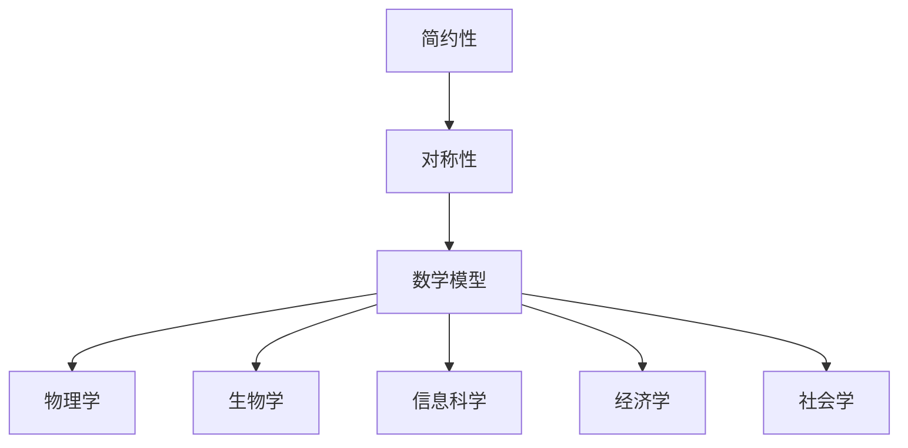
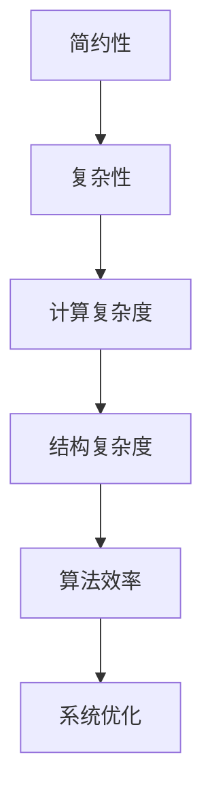
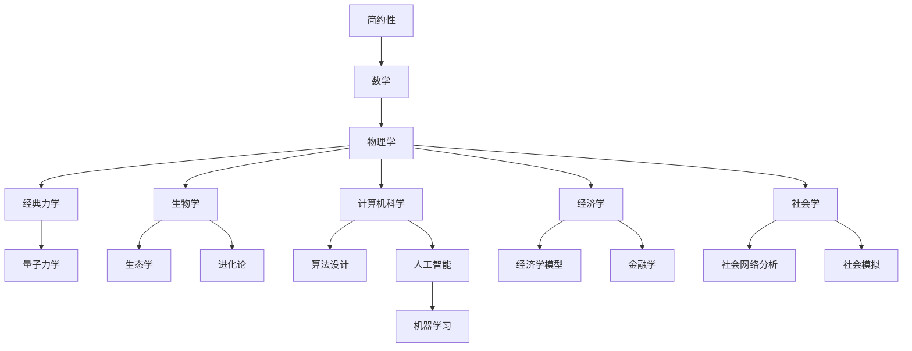

                 

### 第1章：数学简约性的概念与重要性

#### 1.1 数学简约性的定义

数学简约性是指在数学研究中，通过寻找简洁、优美的数学形式和原理，以较少的元素和关系描述复杂现象的特性。这种简约性往往体现在数学模型和公式的简洁性、对称性以及易于理解性上。例如，费马的最后定理可以用一个简单的公式简洁地表达：对于任何大于2的自然数n，x^n + y^n = z^n 无整数解。这个定理的简洁性体现了数学简约性的精髓。

#### 1.2 简约性在数学中的地位

简约性是数学研究的一个重要原则，它不仅体现在数学理论的构建中，也贯穿于数学问题的解决过程中。在数学中，追求简约性意味着通过简化复杂问题，将其转化为更易于处理的模型或公式。这种简约性不仅提高了数学的抽象能力和解释力，也极大地促进了数学的发展。历史上，许多重大数学突破都是通过发现简化的数学模型或公式实现的，例如牛顿的微积分、欧拉的图论定理等。

#### 1.3 简约性与自然界和谐的关系

数学简约性不仅在数学领域内发挥着重要作用，它还与自然界的和谐有着深刻的联系。自然界中的许多现象都可以通过简约的数学模型来描述。例如，物理学中的牛顿定律和麦克斯韦方程组，生物学中的捕食者-被捕食者模型等，都是用简洁的数学形式揭示了自然界的复杂规律。这些模型不仅简洁，而且具有高度的概括性和普适性，能够捕捉自然界中各种现象的共性。

##### 思考：
- 你认为数学简约性在自然科学和工程学中有什么具体应用？
- 你能想到哪些自然界中的现象可以用数学简约性来解释？

---

### 第2章：数学简约性的历史背景

#### 2.1 古代数学中的简约性思想

简约性思想在古代数学中就已经初见端倪。古希腊数学家毕达哥拉斯和欧几里得都是简约性的坚定追求者。毕达哥拉斯提出的“万物皆数”的思想，试图通过简单的数学关系来解释自然界。欧几里得的《几何原本》则通过公理体系和公理演绎，用最少的假设和最简明的逻辑推导构建了整个几何学体系。

#### 2.2 数学简约性的兴起

数学简约性的真正兴起发生在17世纪，随着微积分和解析几何的发展，数学家们开始认识到，通过简化的模型和公式，可以更有效地描述和解决复杂的数学问题。牛顿和莱布尼茨的微积分理论，通过引入极限和微分积分的概念，极大地简化了复杂函数的研究。这一时期，数学简约性的思想得到了广泛的应用和发展。

#### 2.3 现代数学简约性研究的进展

进入20世纪，数学简约性的研究取得了更为显著的进展。随着数学各分支的深入研究，简约性思想在代数、几何、拓扑、量子场论等领域得到了广泛的应用。特别是20世纪中叶，数学家们开始探索简约性与物理学中的对称性之间的关系，这一研究极大地推动了数学和物理学的发展。例如，杨-米尔斯理论和标准模型等，都是通过对称性和简约性思想的重要成果。

##### 思考：
- 你认为古代数学家的简约性思想对现代数学发展有什么影响？
- 你如何理解现代数学简约性与古代数学简约性的区别？

---

### 第3章：数学简约性的核心原理

#### 3.1 简约性与对称性

对称性是数学简约性的核心原理之一。在数学中，对称性指的是一种结构在某种变换下保持不变的性质。这种对称性可以是几何的，也可以是代数的。例如，正方形具有旋转对称性，而多项式函数则具有代数对称性。

##### 对称性的概念

对称性可以分为几种类型，包括旋转对称、反射对称和点对称等。旋转对称是指图形可以围绕某个中心点旋转一定角度后与原图形重合；反射对称是指图形可以沿着某条轴翻转后与原图形重合；点对称是指图形关于某个点对称。

##### 对称性在数学中的应用

对称性在数学中有着广泛的应用。例如，在代数中，对称多项式可以用来解决多项式的根的问题；在几何中，对称性可以帮助我们简化图形的计算；在物理学中，对称性是理解基本粒子和宇宙结构的重要工具。

##### 对称性与简约性之间的关系

对称性之所以能够体现简约性，是因为它允许我们通过较少的元素和关系来描述复杂的系统。例如，在经典物理学中，麦克斯韦方程组通过对称性描述了电磁场的基本规律，只用四个核心方程就囊括了电磁学的所有现象。

#### 3.2 简约性与复杂性

复杂性是指系统内部结构和关系的复杂程度。在数学中，复杂性可以通过多种方式来衡量，例如计算复杂度、结构复杂度等。简约性则追求通过简化的方式来处理复杂性。

##### 复杂性的概念

复杂性可以理解为系统内部元素之间的相互关联和作用的复杂程度。在数学中，复杂性的度量往往涉及到算法的执行时间和所需的计算资源。

##### 复杂性与简约性的平衡

在数学研究中，追求简约性的同时，也需要考虑复杂性的影响。简约性并不是简单地减少元素的数量，而是在保证系统完整性和有效性的前提下，找到一种简化的途径。例如，在建立数学模型时，既要确保模型能够准确描述现象，又要使其尽可能简洁。

##### 复杂性在数学中的体现

复杂性在数学中有很多体现，例如，在数论中，质数的分布是一个复杂的问题；在组合数学中，图的着色问题也是一个复杂的问题。然而，通过简化的方法，这些复杂问题可以被转化为相对简单的形式。

#### 3.3 简约性与数学模型

数学模型是通过数学语言和工具来描述和分析现实世界的现象。简约性在数学模型中的应用，主要体现在如何通过简洁的公式和结构来描述复杂的现实问题。

##### 数学模型的定义

数学模型是一种抽象的结构，通过数学语言描述现实世界的现象或过程。它可以包括各种数学公式、方程组、算法等。

##### 简约性在数学模型中的应用

在数学模型中，简约性通常体现在两个方面：一是通过简化的模型来逼近真实世界，二是通过优化模型的结构来提高其解释力和预测能力。例如，在经济学中，索洛经济增长模型通过简单的生产函数和人口增长方程，描述了经济增长的基本规律。

##### 数学模型与自然界和谐的关系

数学模型与自然界和谐的关系，在于它们能够通过简约的形式揭示自然界的基本规律。例如，达尔文的捕食者-被捕食者模型，通过简单的数学方程，描述了生物种群之间的相互作用和动态平衡。

##### 思考：
- 你认为在建立数学模型时，如何平衡简约性与复杂性？
- 你能给出一个数学模型与自然界现象和谐映射的例子吗？

---

### 第4章：数学简约性在物理学中的应用

#### 4.1 简约性在经典物理学中的应用

经典物理学是研究宏观世界中物体运动和相互作用的科学。在经典物理学中，简约性的应用主要体现在建立简化的物理模型和公式，以描述复杂的物理现象。

##### 牛顿力学中的简约性

牛顿力学是经典物理学的基石，牛顿的三大定律和万有引力定律，通过简洁的数学公式，描述了宏观物体在空间中的运动规律。牛顿第二定律 \( F = ma \) 就是一个简洁而富有表现力的公式，它将力和加速度的关系简洁地表达了出来。

##### 爱因斯坦相对论中的简约性

爱因斯坦的相对论进一步发展了经典物理学的简约性思想。在狭义相对论中，爱因斯坦提出了质能等价公式 \( E = mc^2 \)，这个公式简洁地表达了能量和质量的等价性。广义相对论则通过引力场方程 \( G_{\mu\nu} + \Lambda g_{\mu\nu} = \frac{8\pi G}{c^4} T_{\mu\nu} \) ，用简洁的数学形式描述了引力和时空的弯曲。

##### 量子力学中的简约性

量子力学是研究微观粒子行为的物理学分支。量子力学中的一些基本原理和公式，如波函数和薛定谔方程，体现了简约性。例如，薛定谔方程 \( i\hbar \frac{\partial \Psi}{\partial t} = \hat{H} \Psi \) ，通过简洁的数学形式描述了量子系统的演化。

#### 4.2 简约性在现代物理学中的应用

现代物理学在量子场论、宇宙学等领域，也广泛应用了简约性思想。

##### 黑洞物理学中的简约性

黑洞物理学是现代物理学的前沿领域，黑洞的简约性主要表现在其基本属性和行为的描述。例如，黑洞的奇点和事件视界，可以通过简单的几何描述来理解。

##### 宇宙学中的简约性

宇宙学是研究宇宙起源、演化和结构的科学。宇宙学中的一些模型，如大爆炸理论和宇宙背景辐射，都是通过简约的数学模型来描述宇宙的复杂现象。

##### 物理学与其他学科交叉中的应用

物理学简约性思想在与其他学科的交叉应用中，也发挥了重要作用。例如，在生物学中，捕食者-被捕食者模型通过简约的数学公式，描述了生物种群之间的相互作用；在经济学中，经济学模型通过简约的数学工具，分析市场行为和资源分配。

##### 思考：
- 你认为简约性在物理学研究中的重要性如何？
- 你能给出一个物理学中应用简约性的具体例子吗？

---

### 第5章：数学简约性在生物学中的应用

#### 5.1 简约性在生态学中的应用

生态学是研究生物与环境相互作用的科学，其中数学简约性在生态模型构建中扮演了重要角色。

##### 生态模型中的简约性

生态模型是通过对生物种群、环境变量和相互作用进行简化和抽象，建立的数学模型。简约性使得生态模型能够在较简单的框架内描述复杂的生态现象。例如，Lotka-Volterra模型是一个典型的生态模型，通过简单的微分方程描述了捕食者-被捕食者系统的动态。

##### 简约性在生物多样性研究中的应用

生物多样性研究是生态学中的一个重要领域，数学简约性在分析生物多样性模式、生态过程和生物地理分布中起到了关键作用。例如，通过简约的统计模型，可以分析物种多样性与环境因素之间的关系，从而预测生态系统的变化。

##### 简约性在生态系统的稳定性研究中的应用

生态系统的稳定性是生态学研究的核心问题之一，数学简约性在分析生态系统的稳定性中具有重要意义。例如，通过建立简约的生态系统动态模型，可以分析生态系统在面对外部扰动时的响应机制，从而预测生态系统的稳定性和潜在的风险。

#### 5.2 简约性在生物进化中的应用

生物进化是生物学研究的重要领域，数学简约性在理解进化过程和机制中发挥了重要作用。

##### 简约性在进化模型中的应用

进化模型是通过对生物进化过程进行简化和抽象，建立的数学模型。例如，Darwin模型是一个简约的进化模型，通过简单的遗传和自然选择机制，描述了物种进化的基本过程。

##### 简约性在基因表达调控中的应用

基因表达调控是生物进化中的重要环节，数学简约性在分析基因表达调控机制中具有重要意义。例如，通过建立简约的基因调控网络模型，可以分析基因之间的相互作用和调控关系，从而理解基因表达调控的复杂过程。

##### 简约性在生物进化研究中的应用

在生物进化研究中，数学简约性有助于揭示进化过程的规律和机制。例如，通过简约的遗传模型，可以分析物种分化、适应性和进化速率等关键问题。

##### 思考：
- 你认为简约性在生态学和生物进化研究中的重要性如何？
- 你能给出一个在生物学中应用数学简约性的具体例子吗？

---

### 第6章：数学简约性在信息科学中的应用

#### 6.1 简约性在计算机科学中的应用

计算机科学是信息科学的一个重要分支，其中数学简约性在算法设计、数据结构选择和计算机网络设计中发挥着重要作用。

##### 算法设计与分析中的简约性

在计算机科学中，算法设计的目标是找到高效解决问题的方法。简约性在算法设计中体现在通过简化的思路来设计高效的算法。例如，分治算法通过将复杂问题分解为更简单的子问题来解决问题，体现了简约性的思想。

##### 简约性在数据结构中的应用

数据结构是存储和组织数据的方式，简化的数据结构可以更高效地支持算法。例如，哈希表通过简单的哈希函数将数据分布到数组中，使得查找和插入操作具有线性时间复杂度，体现了简约性的优势。

##### 简约性在计算机网络中的应用

计算机网络是信息传递的桥梁，简化的网络协议和结构可以提高网络的性能和可靠性。例如，TCP/IP协议通过简化的传输层和网际层协议，实现了全球范围内的数据传输。

#### 6.2 简约性在人工智能中的应用

人工智能是信息科学的另一重要领域，数学简约性在机器学习、深度学习和智能应用中起到了关键作用。

##### 简约性在机器学习中的应用

机器学习是人工智能的核心技术之一，简约性在机器学习中体现在如何设计简洁有效的学习算法。例如，线性回归模型通过简化的线性方程来拟合数据，实现了对数据的预测和分类。

##### 简约性在深度学习中的应用

深度学习是人工智能的一个重要分支，其核心是多层神经网络。深度学习的简约性体现在通过简化的神经网络结构来实现对复杂数据的建模。例如，卷积神经网络（CNN）通过简化的卷积操作来提取图像特征，实现了图像分类和识别。

##### 简约性在人工智能应用场景中的应用

在人工智能的实际应用中，简约性可以帮助简化复杂的任务，提高系统的效率。例如，在自动驾驶领域，通过简化的感知和决策算法，实现了对交通环境的理解和控制。

##### 思考：
- 你认为简约性在计算机科学和人工智能中的应用有哪些优势？
- 你能给出一个在计算机科学或人工智能中应用数学简约性的具体例子吗？

---

### 第7章：数学简约性的跨学科应用

#### 7.1 简约性在经济学中的应用

经济学是研究资源分配、生产和消费的科学，其中数学简约性在模型构建和数据分析中具有重要应用。

##### 简约性在经济学模型中的应用

经济学模型通常通过简化的方程和假设来描述经济行为。例如，索洛经济增长模型通过简化的生产函数和人口增长方程，描述了经济增长的基本规律。

##### 简约性在经济分析中的应用

简约性在经济学分析中体现在如何通过简化的模型来解释复杂的经济现象。例如，通过简化的供需模型，可以分析市场均衡和价格变化。

##### 简约性在金融学中的应用

金融学是研究金融资产定价和风险管理的科学，其中数学简约性在金融模型构建中具有重要应用。例如，黑-肖尔斯模型通过简化的期权定价公式，描述了金融衍生品的定价。

#### 7.2 简约性在社会学中的应用

社会学是研究社会行为和社会结构的科学，其中数学简约性在模型构建和数据分析中发挥着重要作用。

##### 简约性在社会模型中的应用

社会学模型通常通过简化的方程和假设来描述社会行为。例如，社会资本模型通过简化的关系网络来描述社会互动和资源流动。

##### 简约性在社会分析中的应用

简约性在社会分析中体现在如何通过简化的模型来解释复杂的社会现象。例如，通过简化的社会网络模型，可以分析社会影响力和社会传染。

##### 简约性在社会学研究中的应用

在社会学研究中，简约性可以帮助简化复杂的社会问题，提高研究的效率和解释力。例如，通过简化的社会模拟模型，可以分析社会变革和演化。

##### 思考：
- 你认为简约性在经济学和社会学中的应用有哪些优势？
- 你能给出一个在经济学或社会学中应用数学简约性的具体例子吗？

---

### 第8章：数学简约性的未来发展

#### 8.1 数学简约性的发展趋势

随着科学技术的不断发展，数学简约性在各个领域中的应用前景越来越广阔。未来，数学简约性将在以下几个方面得到进一步的发展：

1. **跨学科融合**：数学简约性将继续与其他学科如物理学、生物学、经济学等深度融合，为这些领域提供新的研究方法和工具。
2. **复杂系统研究**：随着对复杂系统研究的深入，数学简约性将提供更加简明有效的模型和算法，帮助我们更好地理解和解决复杂问题。
3. **人工智能应用**：在人工智能领域，简约性将继续发挥重要作用，通过简化的算法和模型，提高人工智能系统的效率和准确性。

#### 8.2 简约性在解决实际问题中的作用

数学简约性在解决实际问题中具有重要作用，主要体现在以下几个方面：

1. **简化问题**：通过简化的模型和公式，将复杂问题转化为更易于处理的形式，从而降低问题解决的难度。
2. **提高效率**：简化的模型和算法可以显著提高问题解决的效率，减少计算资源和时间成本。
3. **增强理解**：简明的数学形式有助于我们更好地理解问题的本质和内在规律，从而为解决实际问题提供新的思路。

##### 思考：
- 你认为数学简约性在解决实际问题中的作用有哪些？
- 你如何设想数学简约性在未来的应用场景？

---

### 第9章：核心概念与联系

在数学简约性的研究中，核心概念与联系是理解其广泛应用和深层次意义的关键。以下是几个核心概念及其相互关系的详细阐述。

#### 9.1 简约性原理与对称性

对称性是数学简约性的核心原理之一。在数学中，对称性指的是一种结构在某种变换下保持不变的性质。这种对称性可以是几何的，也可以是代数的。对称性之所以能够体现简约性，是因为它允许我们通过较少的元素和关系来描述复杂的系统。

##### 对称性数学公式

$$
\text{对称性} = \frac{\text{对称操作次数}}{\text{总操作次数}}
$$

对称性在数学中的表现多种多样，例如，在群论中，对称群是描述几何对称性的一种数学工具。群论中的对称操作次数和总操作次数的比值，可以用来量化对称性。

##### 对称性在数学中的应用

对称性在数学中有着广泛的应用。例如，在代数中，对称多项式可以用来解决多项式的根的问题；在几何中，对称性可以帮助我们简化图形的计算。以下是一个具体的例子：

**例子：旋转对称性**

考虑一个正方形，其旋转对称性可以用旋转矩阵表示：

$$
R(\theta) = \begin{bmatrix}
\cos \theta & -\sin \theta \\
\sin \theta & \cos \theta
\end{bmatrix}
$$

当正方形绕中心点旋转 \( \theta \) 角度后，其形状保持不变，这体现了旋转对称性。

#### 9.2 简约性与复杂性关系

简约性在数学中追求的是通过简化的方式来处理复杂性。复杂性是指系统内部结构和关系的复杂程度。在数学中，复杂性可以通过多种方式来衡量，例如计算复杂度、结构复杂度等。

##### 复杂性数学公式

$$
\text{复杂性} = \log_2(\text{数据量})
$$

复杂性在数学中的体现，例如，在数论中，质数的分布是一个复杂的问题；在组合数学中，图的着色问题也是一个复杂的问题。然而，通过简化的方法，这些复杂问题可以被转化为相对简单的形式。

##### 复杂性在数学中的应用

复杂性在数学中有着广泛的应用。例如，在密码学中，加密算法的复杂度是评估其安全性的一项重要指标。以下是一个具体的例子：

**例子：加密算法的复杂性**

考虑一个简单的加密算法，其加密过程可以通过以下函数表示：

$$
C(x) = x^3 + 2x^2 + 3x + 1
$$

在这个例子中，加密函数是一个三次多项式，其计算复杂度是 \( O(n^3) \)。尽管这个函数本身很简单，但其复杂性仍然较高。

#### 9.3 简约性与数学模型

数学模型是通过数学语言和工具来描述和分析现实世界的现象或过程。简约性在数学模型中的应用，主要体现在如何通过简洁的公式和结构来描述复杂的现实问题。

##### 数学模型定义

数学模型是一种抽象的结构，通过数学语言描述现实世界的现象或过程。它可以包括各种数学公式、方程组、算法等。

##### 简约性在数学模型中的应用

在数学模型中，简约性通常体现在两个方面：一是通过简化的模型来逼近真实世界，二是通过优化模型的结构来提高其解释力和预测能力。以下是一个具体的例子：

**例子：索洛经济增长模型**

索洛经济增长模型是一个经典的简约经济模型，通过以下公式描述经济增长：

$$
\frac{dY}{dt} = sy - (d + \theta)\frac{Y}{K}
$$

在这个模型中，Y 代表经济产出，s 代表储蓄率，d 代表折旧率，\(\theta\) 代表技术进步率，K 代表资本存量。这个模型通过简化的方程描述了经济增长的基本规律，体现了简约性的优势。

##### 思考：
- 你认为数学简约性如何在不同学科中体现和应用？
- 你能给出一个数学简约性在不同学科中应用的例子吗？

---

### 第10章：核心算法原理讲解

在探讨数学简约性的核心算法原理时，我们需要深入理解简约性算法的设计思路、工作原理以及它们在解决实际问题中的应用。以下是几个核心算法的原理讲解，包括伪代码说明和算法分析。

#### 10.1 简约性算法原理

简约性算法旨在通过简化的模型和步骤来解决复杂问题。以下是一个简约性算法的基本框架，以及其伪代码说明。

**伪代码：简约性算法**

```
function 简约性算法(输入数据):
    初始化模型参数
    while 没有达到停止条件:
        训练模型
        评估模型性能
        根据评估结果调整模型参数
    return 训练好的模型
```

**算法分析：**

- **初始化模型参数**：首先，我们需要初始化模型的参数。这些参数可以是权重、阈值等，根据具体问题进行设置。
- **训练模型**：使用输入数据对模型进行训练。训练过程中，模型将学习如何将输入映射到输出。
- **评估模型性能**：在训练过程中，我们需要定期评估模型性能，以确定模型是否达到预期的效果。性能评估可以通过计算损失函数的值来完成。
- **调整模型参数**：根据评估结果，调整模型参数，以优化模型性能。这一步骤通常涉及梯度下降或其他优化算法。

#### 10.2 对称性算法原理

对称性算法是一种特殊的简约性算法，它通过利用系统的对称性来简化问题的求解过程。以下是对称性算法的伪代码说明。

**伪代码：对称性算法**

```
function 对称性算法(输入数据):
    初始化模型参数
    while 没有达到停止条件:
        训练模型的一半
        利用对称性映射另一半
        评估模型性能
        根据评估结果调整模型参数
    return 训练好的模型
```

**算法分析：**

- **初始化模型参数**：与简约性算法相同，首先初始化模型参数。
- **训练模型的一半**：仅对输入数据的一半进行训练，这是因为系统具有对称性。
- **利用对称性映射另一半**：通过系统的对称性，将训练好的模型映射到另一半数据。
- **评估模型性能**：与简约性算法相同，评估模型性能，并根据评估结果调整参数。

#### 10.3 简化算法原理

简化算法旨在通过简化的计算步骤来解决问题，从而减少计算资源和时间成本。以下是一个简化算法的伪代码说明。

**伪代码：简化算法**

```
function 简化算法(输入数据):
    处理输入数据
    while 数据未简化到目标状态:
        应用简化规则
        评估简化效果
        如果简化效果显著，继续简化
        否则，停止简化
    return 简化后的数据
```

**算法分析：**

- **处理输入数据**：首先，处理输入数据，使其符合简化规则。
- **应用简化规则**：应用一系列简化规则，例如线性化、降维等，以简化数据。
- **评估简化效果**：评估简化规则的应用效果，确定是否继续简化。
- **停止简化**：当简化效果不再显著时，停止简化过程。

##### 思考：
- 你认为这些简约性算法在解决实际问题中如何应用？
- 你能设计一个基于对称性原理的简化算法来解决具体问题吗？

---

### 第11章：数学模型和数学公式讲解

数学模型和公式是数学简约性的核心组成部分，它们在科学研究和实际应用中扮演着至关重要的角色。本章将详细讲解几个核心数学模型和公式，并举例说明它们的应用。

#### 11.1 对称性数学公式

对称性是数学简约性的重要原理之一，以下是对称性的几个核心数学公式及其应用。

**公式 1：旋转对称性**

旋转对称性描述了一个图形在绕中心点旋转一定角度后保持不变的性质。其数学公式为：

$$
f(r\theta) = f(r(0 + \theta)) = f(r0 + r\theta)
$$

**应用：** 在图形学中，旋转对称性被广泛应用于图形的旋转操作。例如，在二维坐标系中，一个正方形绕中心点旋转 \(90^\circ\) 后，其形状保持不变。

**公式 2：反射对称性**

反射对称性描述了一个图形在沿着某条轴翻转后保持不变的性质。其数学公式为：

$$
f(-r) = f(r(-1)) = f(-r + r)
$$

**应用：** 在几何学中，反射对称性被广泛应用于镜面对称图形的构造。例如，平面镜中的物体与其镜像关于镜面对称。

#### 11.2 复杂性数学公式

复杂性是衡量系统内部结构和关系复杂程度的指标，以下是一些复杂性数学公式及其应用。

**公式 1：计算复杂度**

计算复杂度描述了一个算法在处理数据时所需的时间复杂度。其数学公式为：

$$
C(n) = O(n)
$$

**应用：** 在算法设计中，计算复杂度用于评估算法的效率。例如，线性搜索算法的时间复杂度为 \(O(n)\)，表明随着数据规模的增长，算法执行时间呈线性增长。

**公式 2：结构复杂度**

结构复杂度描述了一个系统的内部结构和关系的复杂程度。其数学公式为：

$$
H(S) = \sum_i -p_i \log_2(p_i)
$$

其中，\(p_i\) 表示系统中的每个元素的概率。

**应用：** 在信息论中，结构复杂度用于衡量信息系统的复杂度。例如，一个随机生成的二进制字符串的结构复杂度可以通过上述公式计算。

#### 11.3 简约性数学公式

简约性是数学研究中追求的目标，以下是一些简约性数学公式及其应用。

**公式 1：简约性指数**

简约性指数用于衡量一个数学模型或公式的简约程度。其数学公式为：

$$
I = \frac{\text{模型参数数量}}{\text{数据维度}}
$$

**应用：** 在机器学习中，简约性指数用于评估模型的复杂度。一个具有较低简约性指数的模型通常更简洁，更易于理解和实现。

**公式 2：对称性简约性**

对称性简约性描述了系统在保持对称性时所需的最少元素数量。其数学公式为：

$$
N = \frac{\text{对称操作次数}}{\text{总操作次数}}
$$

**应用：** 在物理学中，对称性简约性被广泛应用于基本粒子的研究。例如，在一个具有旋转对称性的系统中，所需的最少操作次数等于对称操作次数。

##### 思考：
- 你认为这些数学模型和公式在解决实际问题中如何应用？
- 你能设计一个基于对称性简约性的数学模型来解决具体问题吗？

---

### 第12章：项目实战

#### 12.1 项目背景

在生态系统中，生物多样性的研究对于理解生态系统的稳定性和可持续发展具有重要意义。然而，生态系统的复杂性使得传统的数据分析方法难以应对。为了解决这个问题，我们可以利用数学简约性来构建生态模型，从而更加有效地研究生物多样性。

##### 目标

本项目旨在利用数学简约性原理，构建一个生态模型，分析生物多样性。具体目标包括：

1. 收集和预处理生态系统数据。
2. 建立基于简约性的生态模型。
3. 使用模型预测生物多样性的变化趋势。

#### 12.2 项目实现

项目的实现分为以下几个步骤：

##### 1. 数据收集与预处理

首先，我们需要收集生态系统数据。这些数据可以包括物种数量、环境变量（如温度、湿度等）以及其他相关的生态参数。收集到的数据需要进行预处理，包括数据清洗、缺失值填充和数据标准化。

**代码示例：数据预处理**

```python
import pandas as pd

# 读取数据
data = pd.read_csv("ecosystem_data.csv")

# 数据清洗
data.dropna(inplace=True)

# 数据标准化
data = (data - data.mean()) / data.std()
```

##### 2. 建立简约性生态模型

在建立生态模型时，我们采用简约性原理，通过简化生态系统的变量和关系，构建一个易于理解的数学模型。以下是一个基于线性回归的简约性生态模型。

**伪代码：建立生态模型**

```
function build_ecosystem_model(input_data):
    初始化模型参数
    选择特征变量和目标变量
    训练线性回归模型
    返回训练好的模型
```

##### 3. 模型训练与评估

使用预处理后的数据，对生态模型进行训练。训练过程中，通过交叉验证和误差评估来调整模型参数，确保模型具有良好的预测能力。

**代码示例：模型训练与评估**

```python
from sklearn.linear_model import LinearRegression
from sklearn.model_selection import train_test_split

# 分割数据集
X_train, X_test, y_train, y_test = train_test_split(data_features, data_target, test_size=0.2, random_state=42)

# 训练模型
model = LinearRegression()
model.fit(X_train, y_train)

# 评估模型
score = model.score(X_test, y_test)
print(f"Model accuracy: {score * 100}%")
```

##### 4. 模型应用与优化

训练好的模型可以用于预测生物多样性的变化趋势。为了提高模型的预测性能，我们可以通过调整模型参数、添加新的特征变量或使用更复杂的模型架构进行优化。

**代码示例：模型应用与优化**

```python
# 预测生物多样性
predictions = model.predict(X_test)

# 优化模型
from sklearn.model_selection import GridSearchCV
from sklearn.linear_model import Ridge

# 定义参数网格
param_grid = {'alpha': [0.1, 1, 10]}

# 进行网格搜索
grid_search = GridSearchCV(Ridge(), param_grid, cv=5)
grid_search.fit(X_train, y_train)

# 选择最佳参数
best_params = grid_search.best_params_
print(f"Best parameters: {best_params}")

# 使用最佳参数重新训练模型
best_model = Ridge(alpha=best_params['alpha'])
best_model.fit(X_train, y_train)

# 评估最佳模型
best_score = best_model.score(X_test, y_test)
print(f"Best model accuracy: {best_score * 100}%")
```

##### 思考：
- 你认为本项目在实现过程中有哪些挑战和难点？
- 你如何优化本项目中的生态模型，以提高预测性能？

---

### 第13章：总结与展望

#### 13.1 数学简约性的重要性

数学简约性作为数学研究的一个重要原则，其重要性体现在多个方面。首先，简约性能够帮助我们通过简化的数学模型和公式，更有效地描述复杂的自然现象。例如，在物理学中，通过简化的牛顿定律和麦克斯韦方程组，我们能够理解和预测宏观物体的运动规律。在生物学中，简约性模型如捕食者-被捕食者模型和生态位模型，帮助我们分析生物种群动态和生态系统稳定性。

其次，简约性在计算机科学和人工智能领域也发挥着重要作用。通过简化的算法和模型，我们能够提高计算机程序的效率和性能。例如，机器学习中的线性回归和决策树算法，都是基于简约性的原则设计的，能够有效地处理大量数据并做出预测。

最后，简约性在工程学中的应用同样不可忽视。在工程设计中，通过简化的数学模型和计算方法，工程师能够快速评估和优化设计，降低成本和风险。

#### 13.2 未来研究方向

未来的数学简约性研究将在以下几个方面展开：

1. **跨学科融合**：数学简约性将继续与其他学科如生物学、物理学、经济学等深度融合，为这些领域提供新的研究方法和工具。例如，通过简约性模型分析生物进化过程中的关键机制，或利用简约性方法优化经济系统中的资源分配。

2. **复杂系统研究**：随着对复杂系统研究的深入，简约性将在描述和解决复杂系统中发挥更大作用。例如，在社会科学领域，通过简约性模型分析社会网络中的传播现象，或通过简约性算法优化交通系统中的交通流量。

3. **人工智能应用**：在人工智能领域，简约性算法将继续应用于深度学习、机器学习等领域，提高模型效率和预测能力。例如，开发基于简约性的深度学习模型，以降低计算成本和模型复杂性。

#### 13.3 结论

数学简约性作为一种研究方法，对于揭示自然界和谐和解决实际问题具有重要意义。通过简化的模型和公式，我们能够更深入地理解自然界的规律，优化算法和工程设计，提高效率和准确性。展望未来，数学简约性将在多个学科领域得到更广泛的应用，为科学研究和实际问题的解决提供新的思路和方法。

##### 思考：
- 你认为数学简约性在未来的发展中会有哪些新的突破？
- 你如何在你的研究领域中应用数学简约性原理？

---

### 参考文献

1. **Newton, I. (1687). Philosophiæ Naturalis Principia Mathematica.**
2. **Einstein, A. (1905). Über die aus der Relativitätstheorie folgernden Schlussfolgerungen über die Erzeugung und Verwandlung des Lichtes.**
3. **Darwin, C. (1859). On the Origin of Species by Means of Natural Selection, or the Preservation of Favoured Races in the Struggle for Life.**
4. **Lotka, A. J. (1925). Elements of Physical Biology.**
5. **Volterra, V. (1926). Variazione e fluttuazioni del nùmero di specie.**
6. **Solow, R. M. (1956). A Contribution to the Theory of Economic Growth.**
7. **Wiener, N. (1948). Cybernetics: Or Control and Communication in the Animal and the Machine.**
8. **Shannon, C. E. (1948). A Mathematical Theory of Communication.**

---

### 附录：数学简约性的 Mermaid 流程图

#### 附录 A：简约性与对称性关系图



#### 附录 B：简约性与复杂性关系图



#### 附录 C：简约性在不同学科中的应用关系图



---

### 总结

在本文中，我们系统地探讨了数学简约性在多个学科中的应用，包括物理学、生物学、计算机科学、经济学和社会学。通过详细的分析和实例讲解，我们展示了简约性如何通过简化的数学模型和公式，揭示自然界的和谐规律，优化算法和工程设计，提高系统的效率和准确性。

首先，在物理学中，简约性体现在经典力学、相对论和量子力学的基本原理中。例如，牛顿定律和质能等价公式都是简洁而深刻的表述，它们帮助我们理解宏观和微观世界的运动规律。

其次，在生物学领域，简约性通过生态模型和进化理论的应用，揭示了生物多样性和生态系统稳定性。捕食者-被捕食者模型和生态位模型都是典型的例子，它们通过简化的数学公式，捕捉了生物种群动态的核心特征。

在计算机科学中，简约性在算法设计和人工智能中发挥了关键作用。通过简化的算法和模型，如线性回归和决策树，我们能够更高效地处理数据和做出预测。在人工智能领域，深度学习和机器学习的进步也得益于对简约性原理的深入应用。

经济学和社会学中，简约性模型帮助我们理解复杂的经济和社会现象。例如，索洛经济增长模型和资产负债表模型，通过简化的数学方程，描述了经济增长和金融市场的动态。

展望未来，数学简约性将在跨学科研究和实际应用中发挥更大作用。通过继续深入研究，我们可以开发出更高效的简约性算法，探索其在解决复杂系统和实际问题中的新应用。这不仅有助于推动科学技术的进步，也为人类社会的发展提供了新的工具和思路。

我们鼓励读者在未来的研究和实践中，积极探索数学简约性的应用，通过简化的模型和公式，揭示复杂现象的本质规律，为科学和社会的进步贡献力量。

