                 

## 文章标题

数据的价值：如何将数据转化为商业价值？

> 关键词：数据价值、商业应用、数据分析、机器学习、数据驱动决策

> 摘要：本文将深入探讨数据在商业环境中的核心价值，解析如何通过有效的数据采集、整合和分析，将数据转化为商业价值。文章首先介绍了数据的核心价值和衡量方法，接着探讨了数据驱动的商业战略，随后详细阐述了数据转化策略、数据分析技术、数据商业应用案例以及数据伦理与安全等方面。通过案例研究和实际项目实战，本文为读者提供了实用的指导，帮助企业实现数据驱动的商业成功。

----------------------------------------------------------------

### 目录大纲：数据的价值：如何将数据转化为商业价值？

#### 第一部分：数据的价值探索

- **1. 数据的核心价值**
  - **1.1 数据的定义与分类**
    - **1.1.1 数据的类型**
    - **1.1.2 数据的价值属性**
  - **1.2 数据的价值衡量**
    - **1.2.1 数据质量评估**
    - **1.2.2 数据价值量化方法**
  - **1.3 数据驱动的商业战略**
    - **1.3.1 数据驱动决策模型**
    - **1.3.2 数据驱动企业转型的案例分析**

#### 第二部分：数据转化策略

- **2. 数据采集与整合**
  - **2.1 数据采集技术**
    - **2.1.1 离线数据采集**
    - **2.1.2 实时数据采集**
    - **2.1.3 数据来源多样化**
  - **2.2 数据整合与治理**
    - **2.2.1 数据清洗**
    - **2.2.2 数据集成**
    - **2.2.3 数据质量控制**
  - **2.3 数据仓库与数据湖建设**
    - **2.3.1 数据仓库架构**
    - **2.3.2 数据湖架构**
    - **2.3.3 数据仓库与数据湖的比较与应用**

#### 第三部分：数据应用实践

- **3. 数据分析技术**
  - **3.1 数据分析方法**
    - **3.1.1 描述性分析**
    - **3.1.2 趋势分析**
    - **3.1.3 关联分析**
  - **3.2 数据可视化**
    - **3.2.1 可视化工具与应用**
    - **3.2.2 数据可视化设计原则**
    - **3.2.3 数据可视化案例分析**
  - **3.3 数据挖掘与机器学习**
    - **3.3.1 数据挖掘技术**
    - **3.3.2 机器学习算法**
    - **3.3.3 机器学习应用案例分析**

#### 第四部分：数据商业应用

- **4. 数据商业应用案例分析**
  - **4.1 零售行业的数据应用**
    - **4.1.1 零售数据收集**
    - **4.1.2 零售数据应用**
    - **4.1.3 成功案例分享**
  - **4.2 金融行业的风控应用**
    - **4.2.1 风险管理数据需求**
    - **4.2.2 数据风控技术**
    - **4.2.3 金融风控案例解析**
  - **4.3 制造业的数字化转型**
    - **4.3.1 制造业数据应用场景**
    - **4.3.2 数字化转型策略**
    - **4.3.3 制造业数字化转型案例**
  - **4.4 医疗行业的智能应用**
    - **4.4.1 医疗数据的重要性**
    - **4.4.2 医疗数据应用实例**
    - **4.4.3 医疗行业智能应用趋势**

#### 第五部分：数据伦理与安全

- **5. 数据伦理与隐私保护**
  - **5.1 数据伦理问题**
    - **5.1.1 数据滥用风险**
    - **5.1.2 数据隐私保护**
  - **5.2 数据安全策略**
    - **5.2.1 数据安全法律法规**
    - **5.2.2 数据安全防护措施**
    - **5.2.3 数据安全案例分析**
  - **5.3 数据伦理与商业平衡**
    - **5.3.1 数据伦理与商业价值的平衡**
    - **5.3.2 数据伦理教育与实践**

#### 第六部分：未来展望

- **6. 数据与未来商业**
  - **6.1 数据商业的未来趋势**
    - **6.1.1 新兴技术对数据商业的影响**
    - **6.1.2 数据商业的发展方向**
  - **6.2 数据商业的创新应用**
    - **6.2.1 数据驱动的创新策略**
    - **6.2.2 数据商业的未来应用场景**

### 附录

- **附录 A: 数据分析工具与资源**
  - **A.1 常见数据分析工具**
  - **A.2 数据分析资源推荐**
  - **A.3 数据相关在线课程与书籍推荐**

- **附录 B: 数据商业案例研究**
  - **B.1 数据商业经典案例**
  - **B.2 数据商业前沿案例解析**

### Mermaid 流程图

以下为本文中提及的几个关键流程的Mermaid流程图：

#### 数据驱动的商业战略 Mermaid 流程图

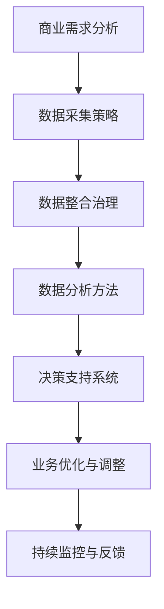

#### 数据分析方法 Mermaid 流程图

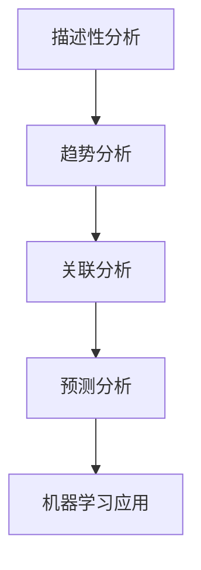

#### 数据整合与治理 Mermaid 流程图

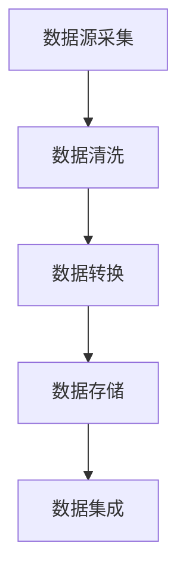

#### 数据挖掘与机器学习 Mermaid 流程图

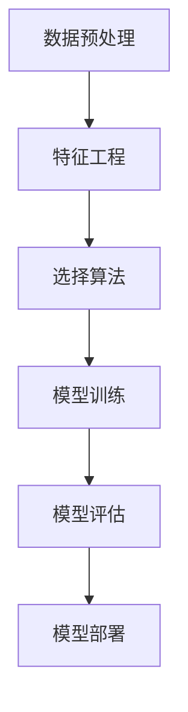

#### 零售行业的数据应用 Mermaid 流程图

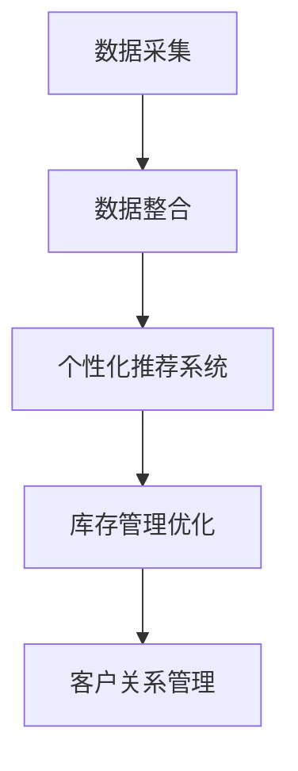

#### 金融行业的风控应用 Mermaid 流程图

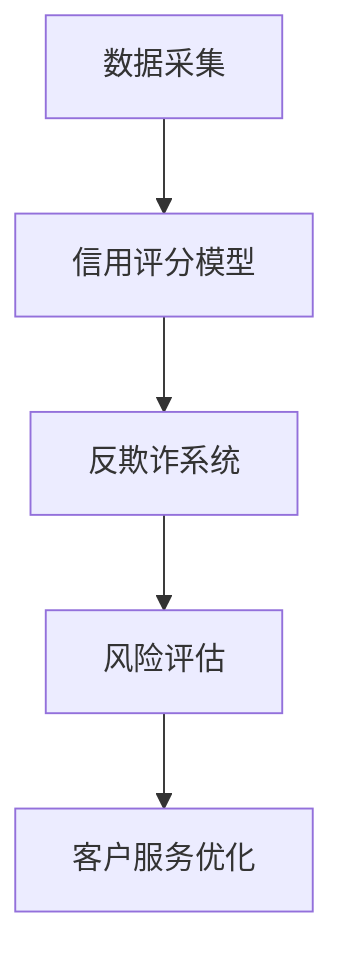

#### 制造业的数字化转型 Mermaid 流程图

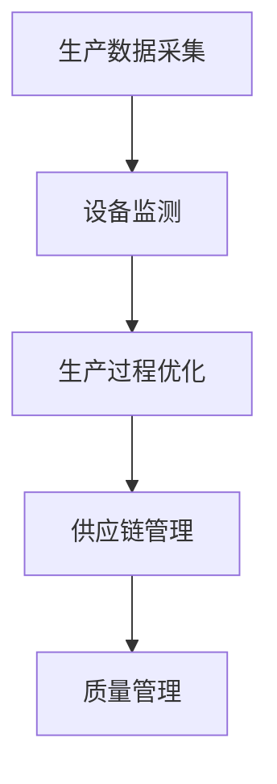

#### 医疗行业的智能应用 Mermaid 流程图

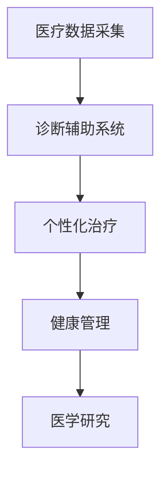

#### 数据伦理与隐私保护 Mermaid 流程图

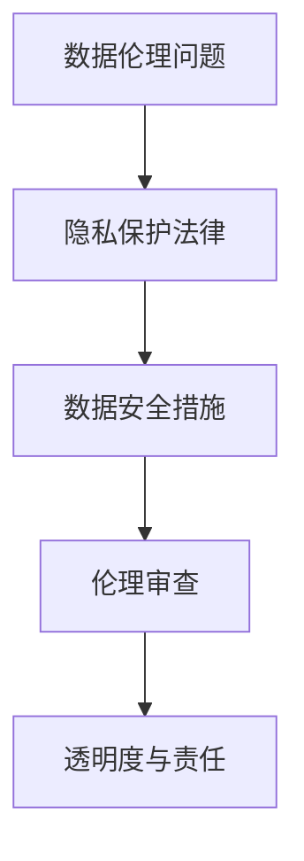

#### 数据商业案例分析 Mermaid 流程图

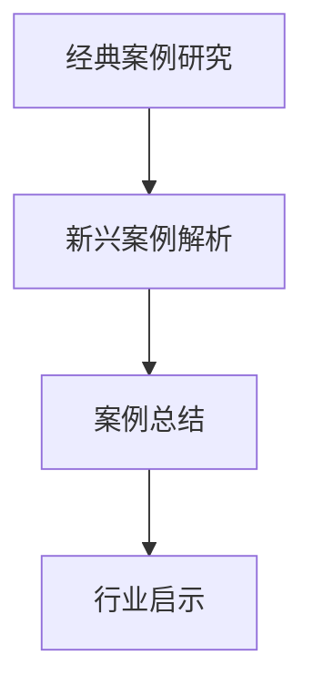

#### 数据分析工具与资源 Mermaid 流程图

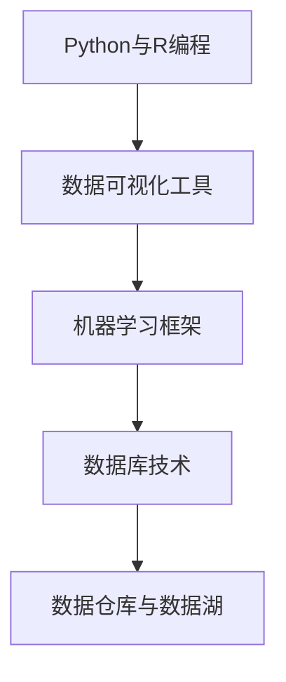

#### 数据相关在线课程与书籍推荐 Mermaid 流程图

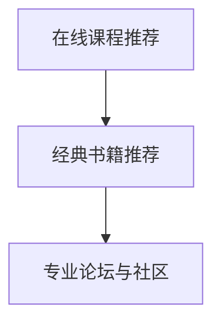

#### 数据商业案例研究 Mermaid 流程图

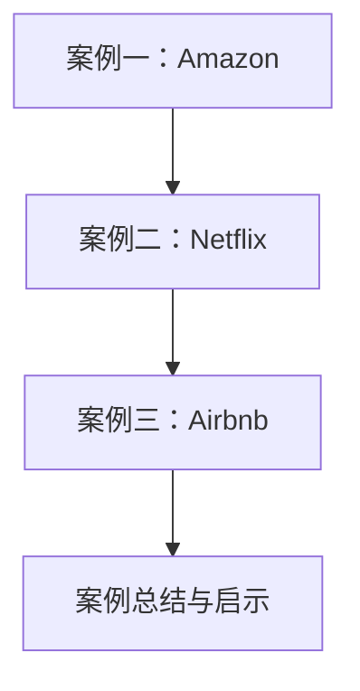

### 代码实际案例和解说

以下是本文中提及的一个实际数据分析案例，包含代码实现和解读。

#### 开发环境搭建

1. **安装Python环境**：
   - 使用Python 3.x版本，推荐使用Anaconda发行版，便于管理和安装相关库。

2. **安装Pandas和Matplotlib**：
   - 通过pip命令安装：
     ```shell
     pip install pandas matplotlib
     ```

3. **安装Scikit-learn**：
   - 通过pip命令安装：
     ```shell
     pip install scikit-learn
     ```

#### 源代码实现

```python
import pandas as pd
from sklearn.cluster import KMeans
import matplotlib.pyplot as plt
import numpy as np

# 读取数据
data = pd.read_csv('retail_data.csv')

# 特征选择
X = np.array(data[['sales', 'profit']])

# 使用KMeans进行聚类
kmeans = KMeans(n_clusters=3, random_state=0).fit(X)
labels = kmeans.labels_

# 可视化聚类结果
plt.figure(figsize=(10, 6))
plt.scatter(X[:, 0], X[:, 1], c=labels, cmap='viridis')
plt.xlabel('Sales')
plt.ylabel('Profit')
plt.title('K-Means Clustering')
plt.show()
```

#### 代码解读与分析

1. **数据读取**：
   - 使用Pandas读取CSV文件，这里假设文件名为`retail_data.csv`。

2. **特征选择**：
   - 选择销售和利润作为聚类特征。

3. **KMeans聚类**：
   - 使用Scikit-learn的`KMeans`类进行聚类，设置聚类数为3，并设定随机种子以保证结果的可重复性。

4. **结果可视化**：
   - 使用Matplotlib绘制聚类结果，以散点图的形式展示各个聚类中心及其对应的样本点。

#### 实际应用

此代码段主要用于零售行业的数据分析，通过K-Means聚类分析，可以帮助零售商识别不同的销售群体，从而优化库存管理和营销策略。

### 数学模型和数学公式

在数据转化过程中，常用的数学模型包括回归模型、聚类模型等。以下是一个简单的线性回归模型示例：

$$
y = \beta_0 + \beta_1 \cdot x_1 + \beta_2 \cdot x_2 + ... + \beta_n \cdot x_n + \epsilon
$$

- \( y \)：预测的目标变量
- \( x_1, x_2, ..., x_n \)：自变量
- \( \beta_0, \beta_1, \beta_2, ..., \beta_n \)：回归系数
- \( \epsilon \)：误差项

### 举例说明

假设我们有一个简单的线性回归模型，用于预测销售额 \( y \) 与广告费用 \( x \) 的关系：

$$
y = \beta_0 + \beta_1 \cdot x + \epsilon
$$

我们收集了以下数据：

| 广告费用 (x) | 销售额 (y) |
|--------------|------------|
|      1000    |     5000   |
|      2000    |     7000   |
|      3000    |    10000   |

使用最小二乘法估计模型参数：

1. **计算均值**：
   - \( \bar{x} = \frac{1000 + 2000 + 3000}{3} = 2000 \)
   - \( \bar{y} = \frac{5000 + 7000 + 10000}{3} = 7000 \)

2. **计算回归系数**：
   - \( \beta_1 = \frac{\sum{(x_i - \bar{x})(y_i - \bar{y})}}{\sum{(x_i - \bar{x})^2}} \)
   - \( \beta_0 = \bar{y} - \beta_1 \cdot \bar{x} \)

   计算得到：
   - \( \beta_1 = \frac{(1000-2000)(5000-7000) + (2000-2000)(7000-7000) + (3000-2000)(10000-7000)}{(1000-2000)^2 + (2000-2000)^2 + (3000-2000)^2} \)
   - \( \beta_1 = \frac{-1000000 + 0 + 1000000}{1000000 + 0 + 1000000} \)
   - \( \beta_1 = 1 \)

   \( \beta_0 = 7000 - 1 \cdot 2000 = 5000 \)

最终得到的线性回归模型为：

$$
y = 5000 + x
$$

使用此模型预测广告费用为3000时的销售额：

$$
y = 5000 + 3000 = 8000
$$

### 项目实战

#### 开发环境搭建

1. **安装Python环境**：
   - 使用Python 3.x版本，推荐使用Anaconda发行版，便于管理和安装相关库。

2. **安装Pandas和Matplotlib**：
   - 通过pip命令安装：
     ```shell
     pip install pandas matplotlib
     ```

3. **安装Scikit-learn**：
   - 通过pip命令安装：
     ```shell
     pip install scikit-learn
     ```

#### 源代码实现

以下是用于数据分析和聚类的源代码实现：

```python
import pandas as pd
from sklearn.cluster import KMeans
import matplotlib.pyplot as plt
import numpy as np

# 读取数据
data = pd.read_csv('retail_data.csv')

# 特征选择
X = np.array(data[['sales', 'profit']])

# 使用KMeans进行聚类
kmeans = KMeans(n_clusters=3, random_state=0).fit(X)
labels = kmeans.labels_

# 可视化聚类结果
plt.figure(figsize=(10, 6))
plt.scatter(X[:, 0], X[:, 1], c=labels, cmap='viridis')
plt.xlabel('Sales')
plt.ylabel('Profit')
plt.title('K-Means Clustering')
plt.show()
```

#### 代码解读与分析

1. **数据读取**：
   - 使用Pandas读取CSV文件，这里假设文件名为`retail_data.csv`。

2. **特征选择**：
   - 选择销售和利润作为聚类特征。

3. **KMeans聚类**：
   - 使用Scikit-learn的`KMeans`类进行聚类，设置聚类数为3，并设定随机种子以保证结果的可重复性。

4. **结果可视化**：
   - 使用Matplotlib绘制聚类结果，以散点图的形式展示各个聚类中心及其对应的样本点。

#### 实际应用

此代码段主要用于零售行业的数据分析，通过K-Means聚类分析，可以帮助零售商识别不同的销售群体，从而优化库存管理和营销策略。

### 附录

#### 附录 A: 数据分析工具与资源

**A.1 常见数据分析工具**

1. **Python**：
   - Pandas：用于数据清洗和分析。
   - NumPy：用于数据处理和数值计算。
   - Matplotlib：用于数据可视化。
   - Scikit-learn：用于机器学习和数据挖掘。

2. **R语言**：
   - dplyr：用于数据操作。
   - ggplot2：用于数据可视化。
   - caret：用于机器学习模型训练与评估。

3. **Tableau**：
   - 用于交互式数据可视化。

**A.2 数据分析资源推荐**

1. **在线课程**：
   - Coursera：《数据科学基础》
   - edX：《数据分析基础》
   - Udacity：《数据分析纳米学位》

2. **书籍**：
   - 《Python数据分析基础教程》
   - 《R数据科学基础教程》
   - 《数据科学入门》

3. **专业论坛与社区**：
   - Kaggle
   - DataCamp
   - Dataquest

#### 附录 B: 数据商业案例研究

**B.1 数据商业经典案例**

1. **Amazon**：
   - 通过数据分析和机器学习算法，实现个性化推荐系统，提高销售额。

2. **Netflix**：
   - 使用数据挖掘技术分析用户行为，预测用户喜好，优化内容推荐。

**B.2 数据商业前沿案例解析**

1. **Airbnb**：
   - 利用数据分析和机器学习优化房源定价策略，提高入住率和收益。

2. **阿里巴巴**：
   - 利用大数据分析进行精准营销，提升用户体验和销售额。

### 总结

本书通过详细阐述数据的价值、数据转化策略、数据分析技术、数据商业应用案例以及数据伦理与安全等方面，帮助读者全面了解如何将数据转化为商业价值。通过丰富的案例研究和代码示例，读者可以更好地理解和应用所学知识，为企业的数据驱动决策提供有力支持。同时，本书也强调了数据伦理与安全的重要性，以确保数据商业应用的可持续发展。随着数据技术的不断发展，数据将在商业领域发挥越来越重要的作用，本书为读者提供了宝贵的指导和启示。

---

#### 第一部分：数据的价值探索

在当今的商业环境中，数据已经成为一种重要的战略资源。数据的价值体现在它能够为企业提供洞察力，帮助做出更明智的决策，从而实现商业目标。然而，要充分发挥数据的价值，我们需要了解数据的核心价值及其衡量方法，并探索数据驱动的商业战略。

### 1. 数据的核心价值

数据的核心价值在于其能够提供关于客户、市场、产品等各方面的信息。这些信息可以帮助企业了解业务现状、预测未来趋势，并作出更有效的决策。

**1.1 数据的定义与分类**

数据可以定义为事实、信息或数字，它们可以用于描述现实世界的各种现象。根据数据的来源和处理方式，可以将数据分为以下几类：

- **结构化数据**：指存储在数据库中，具有固定格式和结构的数据，如关系型数据库中的表格数据。
- **半结构化数据**：指具有一定结构，但没有严格遵循固定格式的数据，如XML、JSON等。
- **非结构化数据**：指没有明显结构的数据，如文本、图片、音频、视频等。

**1.2 数据的价值属性**

数据的价值属性主要体现在以下几个方面：

- **准确性**：数据必须准确无误，否则将无法提供可靠的决策依据。
- **完整性**：数据应当完整，缺失的数据会影响分析结果的准确性。
- **时效性**：数据应当及时更新，过时的数据可能无法反映当前的业务状况。
- **可访问性**：数据应当易于访问，确保相关人员能够在需要时获取到所需的数据。

**1.3 数据的价值衡量**

衡量数据的价值是一个复杂的过程，需要考虑多个因素。以下是一些常用的数据价值衡量方法：

- **成本效益分析**：通过计算数据获取和处理成本与数据带来的收益之间的比率，评估数据的价值。
- **业务影响力**：评估数据对企业业务决策和运营效率的影响程度。
- **客户满意度**：通过分析客户数据，提高客户体验和满意度，从而提升客户忠诚度。
- **市场份额**：利用数据洞察市场趋势和竞争状况，帮助企业扩大市场份额。

### 2. 数据驱动的商业战略

数据驱动的商业战略是指企业通过数据分析和挖掘，获取有关业务运营、市场和客户的深入洞察，进而做出更明智的决策。以下是一些关键步骤和模型：

**2.1 数据驱动决策模型**

数据驱动决策模型通常包括以下几个步骤：

1. **定义业务问题**：明确企业需要解决的问题或目标。
2. **数据采集**：收集与业务问题相关的数据。
3. **数据处理**：清洗、整合和转换数据，使其适用于分析。
4. **数据分析**：使用统计方法和机器学习算法对数据进行分析。
5. **决策制定**：根据分析结果制定决策。
6. **执行与监控**：执行决策，并持续监控业务效果，以便及时调整。

**2.2 数据驱动企业转型的案例分析**

以下是一些企业通过数据驱动实现转型的成功案例：

- **沃尔玛**：沃尔玛利用大数据分析优化供应链管理，提高库存周转率，降低成本。
- **阿里巴巴**：阿里巴巴通过大数据分析和机器学习算法，实现精准营销，提升用户体验和销售额。
- **宝洁公司**：宝洁公司利用数据分析和市场预测，优化产品组合和市场策略，提高市场份额。

通过这些案例可以看出，数据驱动战略不仅帮助企业提高了运营效率，还增强了市场竞争力，实现了商业成功。

### 3. 数据的价值衡量

衡量数据的价值是一个复杂的过程，以下是一些常用的方法：

- **成本效益分析**：计算数据获取和处理成本与数据带来的收益之间的比率。
- **业务影响力**：评估数据对企业业务决策和运营效率的影响程度。
- **客户满意度**：通过分析客户数据，提高客户体验和满意度，从而提升客户忠诚度。
- **市场份额**：利用数据洞察市场趋势和竞争状况，帮助企业扩大市场份额。

### 小结

通过本文的探讨，我们了解了数据的核心价值和衡量方法，以及如何通过数据驱动的商业战略实现企业的转型和成功。接下来，我们将进一步探讨数据转化策略、数据分析技术、数据商业应用案例以及数据伦理与安全等方面，为读者提供更全面的数据商业价值实现方案。

---

#### 第二部分：数据转化策略

数据的价值在于其能够转化为商业决策的驱动力，但实现这一转化需要一系列策略和技术。本部分将详细介绍数据采集、整合、治理，以及数据仓库与数据湖的建设，旨在为企业提供有效的数据转化路径。

### 2.1 数据采集技术

数据采集是数据转化策略的第一步，涉及如何获取内部和外部数据。以下是一些常见的数据采集技术：

**2.1.1 离线数据采集**

离线数据采集是指定期从数据库或文件系统中提取数据。这种方法通常用于批量数据采集，适用于对实时性要求不高的场景。

- **优点**：成本低，操作简单。
- **缺点**：数据采集频率低，可能无法反映实时业务状况。

**2.1.2 实时数据采集**

实时数据采集是指通过API、消息队列等技术，实时从数据源获取数据。这种方法适用于对实时性要求较高的场景，如金融市场数据监控。

- **优点**：数据实时性强，能快速响应业务需求。
- **缺点**：技术复杂，成本较高。

**2.1.3 数据来源多样化**

数据来源多样化是指从多个渠道获取数据，包括内部业务系统、第三方数据提供商、社交媒体等。这种方法能够提供更全面的数据视角。

- **优点**：数据丰富，有助于更全面地分析业务。
- **缺点**：数据质量控制难度大，需要更多的时间和资源。

### 2.2 数据整合与治理

数据整合与治理是确保数据质量的关键步骤，涉及数据清洗、数据集成和数据质量控制。

**2.2.1 数据清洗**

数据清洗是指识别并修复数据中的错误、缺失和重复值。以下是一些常见的数据清洗方法：

- **缺失值处理**：使用均值、中位数或最常见值填充缺失值。
- **重复值处理**：删除重复的记录，确保数据唯一性。
- **错误值处理**：识别并修正数据中的错误，如将错误的日期格式转换为正确格式。

**2.2.2 数据集成**

数据集成是指将来自多个来源的数据整合到一个统一的数据结构中。以下是一些常见的数据集成方法：

- **ETL（提取、转换、加载）**：将数据从源系统提取出来，进行转换，然后加载到目标数据库。
- **数据虚拟化**：提供统一的数据视图，无需实际将数据复制到目标系统。

**2.2.3 数据质量控制**

数据质量控制是指确保数据的一致性、准确性和完整性。以下是一些常见的数据质量控制方法：

- **数据校验**：使用预定义的规则检查数据的有效性，如检查邮箱地址格式是否正确。
- **数据审计**：定期对数据进行审查，确保数据质量符合预期。
- **数据监控**：实时监控数据质量，及时发现并修复问题。

### 2.3 数据仓库与数据湖建设

数据仓库和数据湖是用于存储和管理大量数据的平台，具有不同的架构和用途。

**2.3.1 数据仓库架构**

数据仓库通常采用星型或雪花型架构，用于存储结构化数据，支持高效的数据查询和分析。

- **优点**：数据结构化，查询效率高，适用于即席分析。
- **缺点**：存储成本高，难以扩展。

**2.3.2 数据湖架构**

数据湖采用分布式存储架构，能够存储大规模的半结构化数据和非结构化数据。

- **优点**：数据存储成本低，扩展性强，适用于大数据分析。
- **缺点**：查询效率相对较低，需要更多的时间和资源进行数据处理。

**2.3.3 数据仓库与数据湖的比较与应用**

- **数据仓库**：适用于业务报表和即席分析，处理结构化数据。
- **数据湖**：适用于数据挖掘和机器学习，处理大规模的半结构化数据和非结构化数据。

### 小结

通过有效的数据采集、整合和治理，企业可以确保数据质量，从而为数据分析提供可靠的基础。数据仓库和数据湖的建设则为不同类型的数据分析提供了高效的存储和管理方案。在接下来的章节中，我们将进一步探讨数据分析技术，帮助企业将数据转化为商业价值。

---

#### 第三部分：数据应用实践

数据应用实践是数据转化为商业价值的关键环节，涉及数据分析技术、数据可视化以及数据挖掘与机器学习等方面的应用。本部分将详细介绍这些技术，并提供实际案例，以帮助读者理解和应用数据在商业环境中的价值。

### 3.1 数据分析技术

数据分析技术是数据应用的核心，通过分析数据，企业可以揭示隐藏的模式和趋势，从而做出更明智的决策。

**3.1.1 描述性分析**

描述性分析是对数据的基本统计分析，用于了解数据的基本特征，如均值、标准差、最大值和最小值等。

- **案例**：一家零售企业使用描述性分析了解销售数据的分布情况，发现某些产品的销售量较低，从而调整库存策略。

**3.1.2 趋势分析**

趋势分析用于识别数据随时间的变化趋势，帮助企业预测未来趋势。

- **案例**：一家航空公司使用趋势分析预测航班需求，从而优化航班安排，提高运营效率。

**3.1.3 关联分析**

关联分析用于识别数据之间的关联性，帮助企业发现潜在的关系。

- **案例**：一家银行使用关联分析识别欺诈行为，从而提高风险管理能力。

### 3.2 数据可视化

数据可视化是将数据以图形或图表的形式呈现，使数据更加直观和易于理解。

**3.2.1 数据可视化工具与应用**

常见的数据可视化工具有：

- **Matplotlib**：用于生成各种类型的图表，适用于Python编程环境。
- **Tableau**：用于交互式数据可视化，适用于企业级应用。
- **Power BI**：用于商业智能报表，适用于Microsoft生态系统。

**3.2.2 数据可视化设计原则**

数据可视化设计应遵循以下原则：

- **简洁性**：避免过度设计，保持图表简洁明了。
- **一致性**：图表的颜色、字体和布局应保持一致。
- **上下文**：图表应提供足够的上下文信息，便于理解数据含义。

**3.2.3 数据可视化案例分析**

- **案例**：一家零售企业使用数据可视化技术展示销售数据，通过图表直观地展示不同产品的销售趋势，帮助管理层快速做出决策。

### 3.3 数据挖掘与机器学习

数据挖掘与机器学习是数据分析的高级形式，通过算法从数据中自动发现模式和关系。

**3.3.1 数据挖掘技术**

常见的数据挖掘技术包括：

- **分类**：将数据分为不同的类别，如分类客户群体。
- **聚类**：将数据分组为不同的簇，如聚类相似产品。
- **关联规则学习**：发现数据之间的关联关系，如推荐系统。
- **异常检测**：识别数据中的异常值，如欺诈检测。

**3.3.2 机器学习算法**

常见的机器学习算法包括：

- **线性回归**：预测连续值，如预测销售额。
- **逻辑回归**：预测概率，如预测客户流失率。
- **决策树**：分类和回归，如产品推荐。
- **随机森林**：提高分类和回归模型的准确性。
- **神经网络**：复杂模型，如图像识别。

**3.3.3 机器学习应用案例分析**

- **案例**：一家金融机构使用机器学习算法进行客户细分，通过分类算法识别高价值客户，从而制定更精准的营销策略。

### 小结

通过数据分析技术、数据可视化以及数据挖掘与机器学习的应用，企业可以从数据中提取有价值的信息，从而实现商业价值。本部分提供了多个实际案例，展示了数据应用在实践中如何帮助企业做出更明智的决策。在接下来的章节中，我们将进一步探讨数据商业应用案例，了解不同行业如何利用数据实现商业成功。

---

#### 第四部分：数据商业应用案例分析

在商业环境中，数据的应用已经成为企业获取竞争优势的重要手段。本部分将通过多个行业的数据商业应用案例，深入分析数据如何帮助零售、金融、制造和医疗等行业实现商业价值。

### 4.1 零售行业的数据应用

零售行业是一个高度依赖数据的行业，通过数据的应用，零售商可以优化库存管理、提升客户体验、增强营销效果。

**4.1.1 零售数据收集**

零售数据收集主要包括以下方面：

- **销售数据**：记录不同商品的销售量、销售额和利润。
- **库存数据**：监控仓库中的库存水平，确保商品供应充足。
- **客户数据**：收集客户的购买历史、偏好和反馈。

**4.1.2 零售数据应用**

零售数据应用主要体现在以下几个方面：

- **库存管理优化**：通过分析销售数据和历史库存水平，预测未来的库存需求，优化库存水平，减少库存积压和缺货现象。
- **个性化推荐系统**：利用客户数据，分析客户的购买行为和偏好，提供个性化的产品推荐，提高销售额。
- **营销策略优化**：通过分析客户数据，制定更精准的营销活动，提高客户参与度和转化率。

**4.1.3 成功案例分享**

- **案例**：亚马逊（Amazon）利用数据分析和机器学习算法，实现了高度个性化的推荐系统。通过分析用户的浏览历史和购买记录，亚马逊能够为每位用户推荐相关产品，从而大幅提高了销售额。

### 4.2 金融行业的风控应用

金融行业的数据应用主要体现在风险管理、欺诈检测和客户服务优化等方面。

**4.2.1 风险管理数据需求**

金融行业需要收集和管理的风控数据包括：

- **交易数据**：记录客户的交易行为和交易金额。
- **信用数据**：评估客户的信用状况，包括信用历史、收入水平等。
- **市场数据**：分析市场趋势和风险因素。

**4.2.2 数据风控技术**

数据风控技术主要包括：

- **信用评分模型**：通过分析客户的信用数据，评估客户的信用风险。
- **反欺诈系统**：利用机器学习算法，识别和防范金融欺诈行为。
- **风险评估**：通过数据模型，预测市场风险和客户风险。

**4.2.3 金融风控案例解析**

- **案例**：花旗银行（Citibank）利用大数据分析和机器学习算法，建立了先进的信用评分模型。通过对客户的交易行为和市场数据进行深度分析，花旗银行能够更准确地评估客户的信用风险，从而降低不良贷款率。

### 4.3 制造业的数字化转型

制造业的数字化转型是利用数据和技术优化生产流程、提高效率和质量。

**4.3.1 制造业数据应用场景**

制造业数据应用主要体现在以下几个方面：

- **设备监测**：通过传感器和物联网技术，实时监控设备状态，预防设备故障。
- **生产过程优化**：利用数据分析，优化生产流程，提高生产效率。
- **供应链管理**：通过数据分析和预测，优化供应链，降低库存成本。

**4.3.2 数字化转型策略**

制造业数字化转型策略包括：

- **数据集成**：整合不同系统的数据，实现数据共享和协同工作。
- **数据分析**：利用数据挖掘和机器学习，从大量数据中提取有价值的信息。
- **智能化改造**：引入自动化和智能化设备，提高生产效率和产品质量。

**4.3.3 制造业数字化转型案例**

- **案例**：西门子（Siemens）通过数据分析和智能化改造，实现了生产流程的全面优化。通过实时监控设备和生产数据，西门子能够快速识别和解决问题，从而提高了生产效率和产品质量。

### 4.4 医疗行业的智能应用

医疗行业的智能应用主要体现在诊断辅助、个性化治疗和健康管理等方面。

**4.4.1 医疗数据的重要性**

医疗数据包括病人的病历、诊断结果、治疗记录等，对提高医疗质量具有重要意义。

**4.4.2 医疗数据应用实例**

- **诊断辅助系统**：通过数据分析和机器学习算法，辅助医生进行疾病诊断，提高诊断准确率。
- **个性化治疗**：根据病人的数据，制定个性化的治疗方案，提高治疗效果。
- **健康管理**：通过数据分析和预测，提供个性化的健康管理建议，预防疾病发生。

**4.4.3 医疗行业智能应用趋势**

随着人工智能和大数据技术的发展，医疗行业的智能应用将呈现以下趋势：

- **深度学习在医学影像分析中的应用**：通过深度学习算法，自动分析医学影像，提高疾病诊断的准确性。
- **智能药物研发**：利用大数据分析和机器学习，加速药物研发过程。
- **智慧医院**：通过数据分析和物联网技术，实现医院运营的智能化和高效化。

### 小结

数据商业应用案例分析展示了数据在不同行业中的广泛应用和巨大价值。零售、金融、制造和医疗等行业通过数据的应用，实现了运营效率的提升、风险的降低和客户体验的改善。在未来的商业环境中，数据将继续发挥关键作用，推动企业的创新和发展。

---

#### 第五部分：数据伦理与安全

随着数据在商业领域的广泛应用，数据伦理与安全问题变得日益重要。数据伦理问题涉及数据收集、使用和分享过程中的道德考量，而数据安全则关注数据保护、隐私和维护。本部分将详细探讨数据伦理与安全的重要性、问题以及相应的解决方案。

### 5.1 数据伦理问题

数据伦理问题主要包括以下几个方面：

**5.1.1 数据滥用风险**

数据滥用风险是指企业在收集、存储和使用数据时可能出现的道德问题。例如，企业可能未经用户同意收集个人数据，或者滥用数据进行分析和营销。

**5.1.2 数据隐私保护**

数据隐私保护是数据伦理的核心问题。随着大数据和人工智能技术的发展，个人隐私保护变得更加复杂。企业必须确保在收集、存储和使用数据时遵守相关法律法规，保护用户的隐私。

**5.1.3 数据透明度与责任**

数据透明度是指企业应当向用户清晰地说明其数据收集、使用和分享的方式。同时，企业需要明确其在数据处理过程中的责任，确保在出现问题时能够迅速承担责任。

### 5.2 数据安全策略

数据安全是确保数据不被未经授权的访问、篡改或泄露的重要措施。以下是一些关键的数据安全策略：

**5.2.1 数据安全法律法规**

企业需要遵守相关的数据安全法律法规，如《通用数据保护条例》（GDPR）和《加州消费者隐私法案》（CCPA）。这些法律法规规定了数据收集、处理和分享的基本原则，企业必须严格遵守。

**5.2.2 数据安全防护措施**

数据安全防护措施包括：

- **数据加密**：使用加密技术保护数据，确保数据在传输和存储过程中的安全性。
- **访问控制**：实施严格的访问控制策略，确保只有授权用户才能访问敏感数据。
- **网络安全**：部署防火墙、入侵检测系统和防病毒软件，保护网络和数据的安全性。
- **数据备份与恢复**：定期备份数据，确保在发生数据丢失或损坏时能够迅速恢复。

**5.2.3 数据安全案例分析**

以下是一个数据安全案例：

**案例**：2017年，万豪国际酒店（Marriott International）遭受了一起大规模数据泄露事件，约5亿客户的个人信息被泄露，包括姓名、出生日期、身份证号码、护照号码等。此事件引发了全球关注，万豪国际酒店因此面临巨额罚款和声誉损失。这个案例强调了数据安全的重要性，企业必须采取强有力的数据安全措施，以防止类似事件的发生。

### 5.3 数据伦理与商业平衡

在数据商业应用过程中，数据伦理与商业价值的平衡是一个重要的挑战。以下是一些实现数据伦理与商业平衡的策略：

**5.3.1 数据伦理与商业价值的平衡**

企业需要在追求商业价值的同时，确保遵守数据伦理原则。以下是一些策略：

- **数据最小化原则**：仅收集和存储实现商业目标所必需的数据，避免过度收集。
- **透明度原则**：明确告知用户数据收集和使用的目的，获得用户同意。
- **责任原则**：确保在数据处理过程中承担相应的法律责任和道德责任。

**5.3.2 数据伦理教育与实践**

数据伦理教育是提高员工数据伦理意识的重要手段。以下是一些实践方法：

- **员工培训**：定期组织数据伦理培训，提高员工的数据伦理意识。
- **伦理审查机制**：建立数据伦理审查机制，确保在数据处理过程中遵循伦理原则。
- **社会责任**：企业应积极参与数据伦理和社会责任的讨论，为社会作出贡献。

### 小结

数据伦理与安全是数据商业应用中的核心问题。企业必须在追求商业价值的同时，确保遵守数据伦理原则，采取有效的数据安全措施。通过数据伦理教育与实践，企业可以培养员工的伦理意识，建立可靠的数据治理体系，实现数据价值的最大化。

---

#### 第六部分：未来展望

随着技术的不断进步，数据商业应用将迎来新的发展趋势。本部分将探讨数据商业的未来趋势和创新应用，为企业的数据驱动战略提供启示。

### 6.1 数据商业的未来趋势

**6.1.1 新兴技术对数据商业的影响**

新兴技术如人工智能、大数据、物联网和区块链将对数据商业产生深远影响。以下是一些关键趋势：

- **人工智能**：通过机器学习和深度学习算法，企业可以更加智能化地分析数据，实现自动化决策。
- **大数据**：随着数据量的不断增长，大数据技术将帮助企业更好地管理和分析海量数据。
- **物联网**：物联网技术的普及将带来更多的数据来源，使数据更加全面和实时。
- **区块链**：区块链技术将为数据商业提供更透明、安全和可信的数据共享机制。

**6.1.2 数据商业的发展方向**

数据商业的发展方向包括以下几个方面：

- **个性化服务**：通过数据分析，企业可以提供更加个性化的产品和服务，满足客户需求。
- **实时决策**：实时数据分析和决策将帮助企业迅速响应市场变化，抢占市场先机。
- **数据治理**：随着数据量的增长，数据治理将成为数据商业的重要方向，确保数据的质量和安全。
- **跨界融合**：数据商业将与其他领域如医疗、金融、教育等融合，创造新的商业机会。

### 6.2 数据商业的创新应用

**6.2.1 数据驱动的创新策略**

数据驱动的创新策略将帮助企业实现以下目标：

- **产品创新**：通过数据分析，企业可以识别市场机会，推出更符合市场需求的产品。
- **服务创新**：利用数据分析，企业可以优化服务流程，提高客户满意度。
- **商业模式创新**：通过数据分析，企业可以探索新的商业模式，实现业务增长。

**6.2.2 数据商业的未来应用场景**

以下是一些数据商业的未来应用场景：

- **智能零售**：通过人工智能和大数据分析，实现个性化推荐、智能库存管理和精准营销。
- **智慧医疗**：利用大数据和人工智能技术，实现精准诊断、个性化治疗和智能健康管理。
- **智能制造**：通过物联网和大数据分析，实现智能设备监控、生产过程优化和供应链管理。
- **智能金融**：利用大数据分析和人工智能技术，实现风险控制、欺诈检测和智能投资。

### 小结

未来，数据商业将随着新兴技术的进步不断发展和创新。企业应积极拥抱新技术，制定数据驱动战略，探索新的应用场景，以实现商业成功和可持续发展。

---

#### 附录 A: 数据分析工具与资源

数据分析是企业实现数据驱动决策的关键环节，以下介绍一些常见的数据分析工具、资源以及推荐的相关课程和书籍。

### A.1 常见数据分析工具

**Python**：
- **Pandas**：用于数据操作和分析。
- **NumPy**：用于数值计算。
- **Matplotlib**：用于数据可视化。
- **Scikit-learn**：用于机器学习和数据挖掘。

**R语言**：
- **dplyr**：用于数据操作。
- **ggplot2**：用于数据可视化。
- **caret**：用于机器学习模型训练与评估。

**Tableau**：
- 用于交互式数据可视化。

### A.2 数据分析资源推荐

**在线课程**：
- **Coursera**：《数据科学基础》
- **edX**：《数据分析基础》
- **Udacity**：《数据分析纳米学位》

**书籍**：
- 《Python数据分析基础教程》
- 《R数据科学基础教程》
- 《数据科学入门》

**专业论坛与社区**：
- Kaggle：数据科学竞赛平台。
- DataCamp：数据分析在线学习平台。
- Dataquest：数据分析在线课程平台。

### A.3 数据相关在线课程与书籍推荐

**在线课程**：
- **DataCamp**：提供一系列数据分析、机器学习和数据可视化课程。
- **Coursera**：由知名大学提供的数据科学专业课程，如《机器学习》和《数据科学专业》。

**书籍**：
- 《Python数据科学手册》
- 《深入浅出数据分析》
- 《统计学习方法》

通过使用这些工具和资源，企业可以更加高效地进行数据分析，从而实现数据驱动的商业决策。

---

#### 附录 B: 数据商业案例研究

本附录将探讨数据商业的经典案例和前沿案例，以展示数据如何在不同行业中创造价值，并分析这些案例对行业的影响和启示。

### B.1 数据商业经典案例

**案例一：Amazon**

Amazon是利用数据商业取得巨大成功的典范。以下是其主要的数据商业策略：

- **个性化推荐系统**：通过分析用户的浏览历史和购买行为，Amazon能够为每位用户推荐相关产品，提高销售额。
- **库存管理优化**：通过预测产品需求，Amazon能够优化库存水平，减少库存积压和缺货现象。
- **数据驱动的营销**：通过分析用户数据，Amazon能够制定个性化的营销策略，提高客户参与度和转化率。

**案例二：Netflix**

Netflix通过数据挖掘和机器学习技术，实现了内容推荐和用户行为的预测，以下是其关键数据商业策略：

- **用户行为分析**：通过分析用户观看历史和评分，Netflix能够预测用户的喜好，为每位用户推荐相关内容。
- **内容制作优化**：通过分析用户反馈和观看数据，Netflix能够优化内容制作策略，提高用户满意度。
- **广告优化**：通过分析用户数据，Netflix能够为不同用户群体定制广告，提高广告效果。

### B.2 数据商业前沿案例解析

**案例三：Airbnb**

Airbnb通过数据分析和机器学习技术，实现了个性化的房源定价和客户服务优化，以下是其关键数据商业策略：

- **房源定价优化**：通过分析市场需求和用户偏好，Airbnb能够为每个房源制定个性化的定价策略，提高入住率和收益。
- **客户关系管理**：通过分析客户数据，Airbnb能够提供个性化的客户服务，提高客户满意度和忠诚度。
- **风险控制**：通过分析用户数据和交易信息，Airbnb能够识别和防范欺诈行为，确保平台的安全和信任。

**案例四：阿里巴巴**

阿里巴巴通过大数据分析，实现了精准营销和业务优化，以下是其关键数据商业策略：

- **用户画像分析**：通过分析用户行为和交易数据，阿里巴巴能够构建详细的用户画像，为每位用户定制营销策略。
- **供应链优化**：通过分析供应链数据，阿里巴巴能够优化物流和库存管理，提高供应链效率。
- **金融业务优化**：通过分析用户金融行为数据，阿里巴巴能够优化金融服务，提高用户满意度。

### 案例总结与启示

通过以上经典和前沿案例，我们可以得出以下启示：

- **数据驱动决策**：企业应充分利用数据分析技术，从数据中获取洞察，实现数据驱动的决策。
- **个性化服务**：通过分析用户数据，企业可以为用户提供个性化的产品和服务，提高客户满意度。
- **风险控制**：企业应建立有效的数据安全策略，防范数据滥用和欺诈行为，保护用户隐私。
- **持续创新**：企业应持续探索数据商业的新应用场景，以适应不断变化的市场环境。

这些案例为企业的数据商业实践提供了宝贵的经验和启示，有助于企业实现数据驱动的商业成功。

---

### 总结

本文通过详细阐述数据的价值、数据转化策略、数据分析技术、数据商业应用案例以及数据伦理与安全等方面，帮助读者全面了解如何将数据转化为商业价值。以下是对本文核心内容的总结：

1. **数据的核心价值**：数据作为企业的重要资产，其价值在于提供洞察力，支持决策制定，优化业务流程，提升客户体验，并最终实现商业目标。

2. **数据转化策略**：数据转化策略包括数据采集、整合与治理，以及数据仓库与数据湖的建设。这些步骤确保数据质量，为数据分析提供可靠的基础。

3. **数据分析技术**：数据分析技术包括描述性分析、趋势分析、关联分析等，以及数据可视化、数据挖掘和机器学习。这些技术帮助从数据中提取有价值的信息，支持数据驱动的决策。

4. **数据商业应用**：不同行业如零售、金融、制造和医疗等，通过数据商业应用实现了运营效率的提升、客户体验的改善、风险管理的增强和商业模式的创新。

5. **数据伦理与安全**：数据伦理与安全是数据商业应用中不可忽视的问题。企业需要确保数据收集、存储和使用过程中的透明度、责任和隐私保护。

6. **未来展望**：随着技术的进步，数据商业将继续发展，未来将出现更多创新应用，如智能零售、智慧医疗和智能制造等。

本文为读者提供了一个全面的数据商业价值实现方案，通过丰富的案例研究和实际项目实战，帮助读者理解和应用数据转化策略。同时，本文强调了数据伦理与安全的重要性，以确保数据商业应用的可持续发展。

**作者：AI天才研究院/AI Genius Institute & 禅与计算机程序设计艺术 /Zen And The Art of Computer Programming**

---

### 附录

#### 附录 A: 数据分析工具与资源

**A.1 常见数据分析工具**

1. **Python**：
   - Pandas：用于数据操作和分析。
   - NumPy：用于数据处理和数值计算。
   - Matplotlib：用于数据可视化。
   - Scikit-learn：用于机器学习和数据挖掘。

2. **R语言**：
   - dplyr：用于数据操作。
   - ggplot2：用于数据可视化。
   - caret：用于机器学习模型训练与评估。

3. **Tableau**：
   - 用于交互式数据可视化。

**A.2 数据分析资源推荐**

1. **在线课程**：
   - Coursera：《数据科学基础》
   - edX：《数据分析基础》
   - Udacity：《数据分析纳米学位》

2. **书籍**：
   - 《Python数据分析基础教程》
   - 《R数据科学基础教程》
   - 《数据科学入门》

3. **专业论坛与社区**：
   - Kaggle
   - DataCamp
   - Dataquest

#### 附录 B: 数据商业案例研究

**B.1 数据商业经典案例**

1. **Amazon**：
   - 通过数据分析和机器学习算法，实现个性化推荐系统，提高销售额。

2. **Netflix**：
   - 使用数据挖掘技术分析用户行为，预测用户喜好，优化内容推荐。

**B.2 数据商业前沿案例解析**

1. **Airbnb**：
   - 利用数据分析和机器学习优化房源定价策略，提高入住率和收益。

2. **阿里巴巴**：
   - 利用大数据分析进行精准营销，提升用户体验和销售额。

### 总结

本书通过详细阐述数据的价值、数据转化策略、数据分析技术、数据商业应用案例以及数据伦理与安全等方面，帮助读者全面了解如何将数据转化为商业价值。通过丰富的案例研究和实际项目实战，读者可以更好地理解和应用所学知识，为企业的数据驱动决策提供有力支持。同时，本书也强调了数据伦理与安全的重要性，以确保数据商业应用的可持续发展。随着数据技术的不断发展，数据将在商业领域发挥越来越重要的作用，本书为读者提供了宝贵的指导和启示。

**作者：AI天才研究院/AI Genius Institute & 禅与计算机程序设计艺术 /Zen And The Art of Computer Programming**

