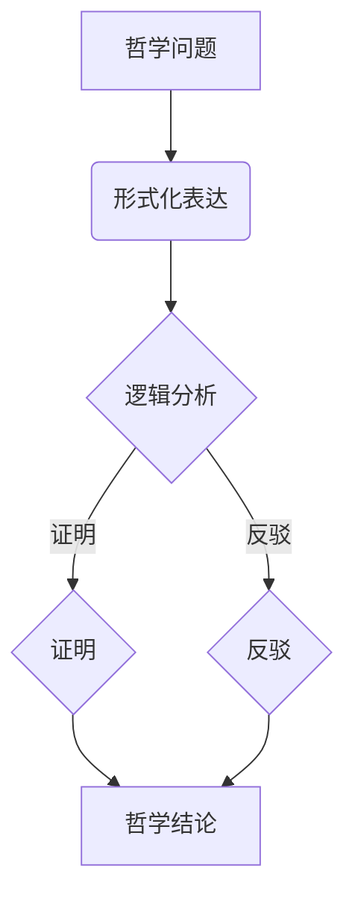
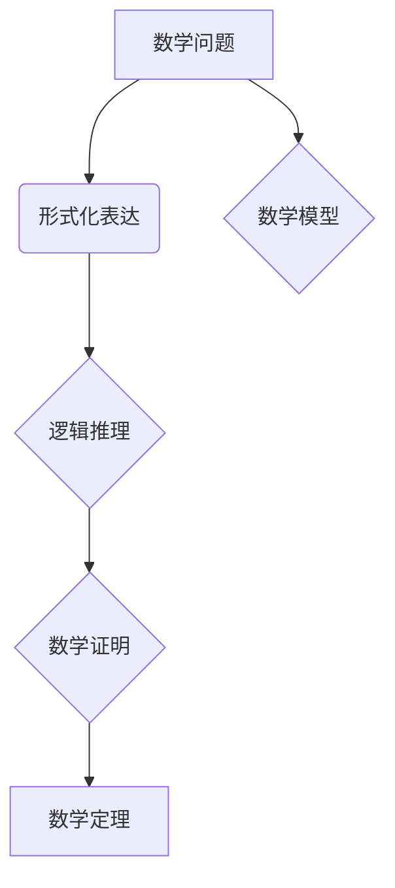

                 

# 《数理逻辑：P的重言式系统》

## 关键词

- 数理逻辑
- 重言式系统
- 命题逻辑
- 谓词逻辑
- 形式系统
- 逻辑学
- 计算机科学

## 摘要

本文旨在深入探讨数理逻辑中的P的重言式系统。我们将首先介绍数理逻辑的基础知识，包括命题逻辑和谓词逻辑，然后详细阐述形式系统和P的重言式系统的构建方法。文章还将探讨P的重言式系统在逻辑学、计算机科学以及其他领域中的应用，分析其面临的挑战，并探讨其未来的发展趋势。最后，我们将通过实际项目案例，对P的重言式系统进行实战解析，帮助读者更好地理解和应用这一重要的逻辑系统。

## 目录大纲

### 第一部分：数理逻辑基础

#### 第1章：数理逻辑概述

1.1 数理逻辑的定义与重要性

1.2 数理逻辑的发展历史

1.3 数理逻辑与哲学、数学的关系

#### 第2章：命题逻辑

2.1 命题逻辑的基本概念

2.2 命题逻辑的基本公式

2.3 命题逻辑的推理规则

#### 第3章：谓词逻辑

3.1 谓词逻辑的基本概念

3.2 谓词逻辑的基本公式

3.3 谓词逻辑的推理规则

#### 第4章：形式系统

4.1 形式系统的定义与特征

4.2 形式语言的构成

4.3 形式推理的基本方法

### 第二部分：P的重言式系统

#### 第5章：P的重言式系统概述

5.1 P的重言式系统的定义

5.2 P的重言式系统的特点

5.3 P的重言式系统的重要性

#### 第6章：P的重言式系统的构建方法

6.1 P的重言式系统的构建步骤

6.2 P的重言式系统的公式化

6.3 P的重言式系统的验证方法

#### 第7章：P的重言式系统的应用

7.1 P的重言式系统在逻辑学中的应用

7.2 P的重言式系统在计算机科学中的应用

7.3 P的重言式系统在其他领域中的应用

#### 第8章：P的重言式系统的挑战与未来发展趋势

8.1 P的重言式系统面临的挑战

8.2 P的重言式系统的未来发展趋势

8.3 P的重言式系统对社会的影响

### 第三部分：附录

#### 第9章：数理逻辑与哲学、数学的 Mermaid 流程图

9.1 数理逻辑在哲学中的应用流程图

9.2 数理逻辑在数学中的应用流程图

#### 第10章：P的重言式系统的核心算法原理讲解

10.1 P的重言式系统的核心算法

10.2 核心算法的伪代码讲解

#### 第11章：数学模型和数学公式讲解

11.1 P的重言式系统的数学模型

11.2 数学公式的详细讲解

11.3 数学公式的举例说明

#### 第12章：P的重言式系统项目实战

12.1 项目实战概述

12.2 开发环境搭建

12.3 源代码详细实现

12.4 代码解读与分析

### 引言

数理逻辑是现代逻辑学的重要分支，它是用数学方法研究逻辑现象和逻辑规律的科学。在计算机科学、哲学、数学等领域，数理逻辑都扮演着重要的角色。其中，P的重言式系统是数理逻辑中的一个重要概念，它对于逻辑推理和证明具有重要的指导意义。

本文将带领读者深入理解数理逻辑，特别是P的重言式系统。首先，我们将介绍数理逻辑的基础知识，包括命题逻辑和谓词逻辑。然后，我们将详细阐述形式系统的概念，以及P的重言式系统的构建方法和应用。最后，我们将探讨P的重言式系统面临的挑战和未来发展趋势，并通过对实际项目的分析，帮助读者更好地理解和应用这一重要的逻辑系统。

在接下来的章节中，我们将逐步展开讨论，通过具体实例和理论分析，使读者能够全面了解数理逻辑和P的重言式系统的核心概念和原理。让我们一起走进这个充满挑战和机遇的领域吧！<|im_end|>## 第1章：数理逻辑概述

### 1.1 数理逻辑的定义与重要性

数理逻辑，又称为符号逻辑或数学逻辑，是一门运用数学方法研究逻辑现象和逻辑规律的科学。它起源于19世纪末，由弗雷格、罗素和怀特海等数学家和哲学家创立。数理逻辑的核心理念是通过符号化的方式，将自然语言中的逻辑命题转化为形式化的数学表达式，从而更精确地研究逻辑的规律和性质。

数理逻辑的重要性体现在多个方面。首先，它在数学领域发挥着重要作用。通过数理逻辑，我们可以更严谨地进行数学证明，从而确保数学理论的可靠性和一致性。其次，数理逻辑在计算机科学中有着广泛的应用。它是计算机编程、算法设计、形式语言理论等基础理论的重要组成部分。此外，数理逻辑还在哲学、语言学、人工智能等领域有着重要的影响。它帮助我们更好地理解推理、证明、语言表达等复杂现象。

### 1.2 数理逻辑的发展历史

数理逻辑的发展历程可以分为几个重要阶段。首先，弗雷格（Gottlob Frege）在19世纪末创立了符号逻辑，他提出了命题逻辑和谓词逻辑的基本概念，并建立了形式化的逻辑系统。接着，罗素（Bertrand Russell）和怀特海（Norbert Wiener）在《数学原理》中进一步发展了数理逻辑，提出了类型论和公理化方法。此外，哥德尔（Kurt Gödel）、图灵（Alan Turing）和丘奇（Alonzo Church）等数学家在20世纪中叶做出了重要的贡献，他们证明了形式系统的不可判定性和计算理论的基本原理。

### 1.3 数理逻辑与哲学、数学的关系

数理逻辑与哲学有着密切的关系。在哲学领域，逻辑学一直是一个核心话题。数理逻辑为哲学提供了形式化的研究方法，使得哲学问题可以更加精确地表达和讨论。例如，通过数理逻辑的方法，哲学家们可以更好地研究伦理学、认识论、形而上学等领域的复杂问题。

数理逻辑与数学的关系更为紧密。数学本身就是逻辑的科学，而数理逻辑为数学提供了更严格的形式化基础。通过数理逻辑，数学家可以更清晰地定义数学概念，构建数学理论，并确保数学推理的严密性。同时，数理逻辑也在数学研究中产生了许多新的数学分支，如模型论、公理集合论等。

总的来说，数理逻辑是一门跨学科的科学，它在哲学、数学、计算机科学等多个领域都有重要的影响。通过数理逻辑的研究，我们可以更深入地理解逻辑的本质，推动各个学科的发展。

### 1.4 数理逻辑的基本概念

在数理逻辑中，有几个基本概念是理解和应用数理逻辑的基础。

首先是命题（Proposition）。命题是一个可以判断真假的陈述句。在数理逻辑中，命题通常用符号表示，例如p代表“今天是星期一”，q代表“月亮是蓝的”。命题的真假可以通过观察或验证来判断。

接下来是逻辑运算符（Logical Operators）。逻辑运算符用于组合命题，形成新的命题。常见的逻辑运算符包括“与”（AND）、“或”（OR）、“非”（NOT）等。例如，命题p和q的“与”命题表示为p ∧ q，其真值为真，当且仅当p和q都为真；“或”命题表示为p ∨ q，其真值为真，当且仅当p或q至少一个为真；“非”命题表示为¬p，其真值为假，当且仅当p为真。

最后是推理规则（Reasoning Rules）。推理规则是用于从已知命题推导出新命题的方法。常见的推理规则包括“假言推理”（Modus Ponens）、“否定后件推理”（Modus Tollens）和“合成推理”（Syllogism）等。例如，如果前提是“如果今天下雨，那么地面湿”（p → q），并且观察到“地面湿”（q），则可以推导出“今天下雨”（p）。

这些基本概念是构建复杂逻辑系统的基础，通过它们，我们可以更精确地表达和理解逻辑现象。

### 1.5 数理逻辑的应用

数理逻辑在多个领域有着广泛的应用。

首先，在计算机科学中，数理逻辑是形式语言理论、编译器设计、程序验证等基础理论的重要组成部分。例如，数理逻辑用于定义编程语言中的语法和语义，确保程序的正确性和一致性。

其次，在哲学领域，数理逻辑为伦理学、认识论和形而上学等复杂问题的研究提供了形式化的工具。哲学家们通过数理逻辑的方法，可以更精确地表达和讨论哲学问题，从而推动哲学理论的进步。

此外，在数学中，数理逻辑用于建立数学理论和进行数学证明。通过形式化的方法，数学家可以更严谨地推导数学结论，确保数学理论的可靠性和一致性。

总之，数理逻辑是一门多学科交叉的科学，它在计算机科学、哲学、数学等领域都有着重要的应用。通过数理逻辑的方法，我们可以更深入地理解和解决复杂问题，推动各学科的发展。

## 第2章：命题逻辑

命题逻辑是数理逻辑的基础部分，它主要研究命题及其之间的关系。在命题逻辑中，命题是最基本的概念，通过逻辑运算符和推理规则，我们可以构建复杂的逻辑表达式，并进行分析和推理。本章将详细介绍命题逻辑的基本概念、基本公式和推理规则。

### 2.1 命题逻辑的基本概念

在命题逻辑中，命题是一个可以判断真假的陈述句。通常，我们用大写字母P、Q、R等来表示命题。命题分为两类：真命题（True Proposition）和假命题（False Proposition）。真命题在所有情况下都为真，而假命题在所有情况下都为假。

例如，命题“今天是星期一”可以判断为真或假。如果今天是星期一，则命题为真；如果今天不是星期一，则命题为假。命题的真假通常用真值（Truth Value）表示，用1表示真，0表示假。

除了单个命题外，命题逻辑还涉及复合命题。复合命题是由基本命题通过逻辑运算符组合而成的。常见的逻辑运算符包括“与”（AND）、“或”（OR）、“非”（NOT）等。

### 2.2 命题逻辑的基本公式

在命题逻辑中，基本公式是指由基本命题和逻辑运算符组成的逻辑表达式。以下是一些常见的命题逻辑基本公式：

1. **德摩根定律**（De Morgan's Laws）：

   - ¬(P ∧ Q) ≡ (¬P) ∨ (¬Q)
   - ¬(P ∨ Q) ≡ (¬P) ∧ (¬Q)

   德摩根定律说明了命题“非”运算与“与”运算、“或”运算之间的关系。

2. **分配律**（Distributive Laws）：

   - P ∧ (Q ∨ R) ≡ (P ∧ Q) ∨ (P ∧ R)
   - P ∨ (Q ∧ R) ≡ (P ∨ Q) ∧ (P ∨ R)

   分配律说明了“与”运算和“或”运算之间的分配关系。

3. **结合律**（Associative Laws）：

   - (P ∧ Q) ∧ R ≡ P ∧ (Q ∧ R)
   - (P ∨ Q) ∨ R ≡ P ∨ (Q ∨ R)

   结合律说明了在连续进行“与”运算或“或”运算时，可以任意改变运算的顺序，结果不变。

4. **交换律**（Commutative Laws）：

   - P ∧ Q ≡ Q ∧ P
   - P ∨ Q ≡ Q ∨ P

   交换律说明了在“与”运算和“或”运算中，两个命题的顺序可以互换，结果不变。

5. **吸收律**（Absorption Laws）：

   - P ∧ (P ∨ Q) ≡ P
   - P ∨ (P ∧ Q) ≡ P

   吸收律说明了在“与”运算和“或”运算中，一个命题与自身“或”另一个命题的结果仍然是该命题。

6. **否定律**（Negation Laws）：

   - ¬(¬P) ≡ P
   - ¬P ∧ ¬Q ≡ ¬(P ∨ Q)
   - ¬P ∨ ¬Q ≡ ¬(P ∧ Q)

   否定律说明了命题的否定与复合命题之间的关系。

通过这些基本公式，我们可以简化复杂的逻辑表达式，并更方便地进行逻辑推理。

### 2.3 命题逻辑的推理规则

在命题逻辑中，推理规则用于从已知命题推导出新命题。以下是一些常见的推理规则：

1. **假言推理**（Modus Ponens）：

   如果P是Q的充分条件，即P → Q，并且P为真，则可以推断出Q也为真。

   ```
   P → Q
   P
   └─▬─>
   Q
   ```

2. **否定后件推理**（Modus Tollens）：

   如果P是Q的充分条件，即P → Q，并且Q为假，则可以推断出P也为假。

   ```
   P → Q
   ¬Q
   └─▬─>
   ¬P
   ```

3. **合成推理**（Syllogism）：

   如果P是Q的充分条件，即P → Q，且Q是R的充分条件，即Q → R，则可以推断出P是R的充分条件，即P → R。

   ```
   P → Q
   Q → R
   └─▬─>
   P → R
   ```

这些推理规则是逻辑推理的基本工具，通过它们，我们可以从已知命题推导出新的结论，为解决问题提供有力的支持。

通过本章的介绍，我们可以看到命题逻辑是数理逻辑的重要组成部分，它为复杂逻辑推理提供了基本框架和工具。在接下来的章节中，我们将继续探讨谓词逻辑和形式系统，进一步深入了解数理逻辑的理论和应用。

### 第3章：谓词逻辑

谓词逻辑是数理逻辑的另一个重要分支，它进一步扩展了命题逻辑，允许我们描述更复杂的对象和关系。在谓词逻辑中，谓词（Predicate）是核心概念，它用来表示对象和属性之间的关系。通过谓词逻辑，我们可以更精确地表达和推理复杂命题。本章将介绍谓词逻辑的基本概念、基本公式和推理规则。

#### 3.1 谓词逻辑的基本概念

谓词逻辑中的谓词是一个函数，它将个体或集合映射到真值。谓词通常由一个或多个变量组成，这些变量称为自由变量。谓词逻辑中的谓词可以表示对象具有某种属性或关系。例如，谓词`P(x)`可以表示“x是红色的”，其中`x`是自由变量。

与命题逻辑不同，谓词逻辑允许我们表达对象之间的关系。这种关系通常通过谓词之间的组合来实现。例如，谓词`R(x, y)`可以表示“x大于y”。

在谓词逻辑中，个体（Individual）是具有独立存在意义的对象，如“这个苹果”或“这个学生”。个体通常用小写字母，如`a`、`b`、`c`等表示。

#### 3.2 谓词逻辑的基本公式

谓词逻辑的基本公式是对谓词组合的规则和公式的总结。以下是一些重要的谓词逻辑基本公式：

1. **全称量词**（Universal Quantifier）：

   全称量词`∀`表示“对所有...都...”。例如，公式`∀x P(x)`表示“对所有x，P(x)为真”。

2. **存在量词**（Existential Quantifier）：

   存在量词`∃`表示“存在...使得...”。例如，公式`∃x P(x)`表示“存在某个x，使得P(x)为真”。

3. **谓词组合**：

   - `P ∧ Q`表示“P和Q都为真”。
   - `P ∨ Q`表示“P或Q至少有一个为真”。
   - `¬P`表示“P为假”。
   - `P → Q`表示“如果P为真，则Q也为真”。
   - `P ↔ Q`表示“P和Q等价，即P为真当且仅当Q为真”。

4. **德摩根定律**（De Morgan's Laws）：

   - `¬(∀x P(x)) ≡ ∃x ¬P(x)`
   - `¬(∃x P(x)) ≡ ∀x ¬P(x)`

   德摩根定律说明了全称量词和存在量词的否定关系。

5. **量词分配律**（Distribution Laws）：

   - `∀x (P(x) ∧ Q(x)) ≡ (∀x P(x)) ∧ (∀x Q(x))`
   - `∃x (P(x) ∧ Q(x)) ≡ (∃x P(x)) ∧ (∃x Q(x))`
   - `∀x (P(x) ∨ Q(x)) ≡ (∀x P(x)) ∨ (∀x Q(x))`
   - `∃x (P(x) ∨ Q(x)) ≡ (∃x P(x)) ∨ (∃x Q(x))`

   量词分配律说明了量词与逻辑运算符之间的分配关系。

6. **量词交换律**（Quantifier Commutation Laws）：

   - `∀x P(x) ≡ ∃x P(x)`（仅当P(x)对x的全称量化为真时）
   - `∃x P(x) ≡ ∀x P(x)`（仅当P(x)对x的存在量化为假时）

   量词交换律说明了全称量词和存在量词在某些条件下的等价性。

通过这些基本公式，我们可以构造复杂的谓词逻辑表达式，并对其进行推理和分析。

#### 3.3 谓词逻辑的推理规则

谓词逻辑的推理规则用于从已知命题推导出新命题。以下是一些常见的谓词逻辑推理规则：

1. **全称实例化**（Universal Instantiation）：

   如果`∀x P(x)`为真，那么对于任意的个体a，`P(a)`也为真。

   ```
   ∀x P(x)
   └─┐
   P(a)
   ```

2. **存在实例化**（Existential Instantiation）：

   如果`∃x P(x)`为真，那么存在某个个体a，使得`P(a)`为真。

   ```
   ∃x P(x)
   └─┐
   P(a)
   ```

3. **全称一般化**（Universal Generalization）：

   如果对于某个个体a，`P(a)`为真，则可以推导出`∀x P(x)`为真。

   ```
   P(a)
   └─┘
   ∀x P(x)
   ```

4. **存在一般化**（Existential Generalization）：

   如果对于某个个体a，`P(a)`为真，则不能直接推导出`∃x P(x)`为真，因为存在量词表示至少存在一个个体，但并不保证其他个体的情况。

   ```
   P(a)
   └─┘
   ∃x P(x)
   ```

5. **假言推理**（Modus Ponens）：

   如果`P → Q`为真，且`P`为真，则可以推导出`Q`也为真。

   ```
   P → Q
   P
   └─┐
   Q
   ```

6. **否定后件推理**（Modus Tollens）：

   如果`P → Q`为真，且`Q`为假，则可以推导出`P`也为假。

   ```
   P → Q
   ¬Q
   └─┐
   ¬P
   ```

这些推理规则是谓词逻辑推理的基础，通过它们，我们可以从已知命题推导出新的结论，为逻辑推理提供强有力的支持。

通过本章的介绍，我们可以看到谓词逻辑在表达和推理复杂命题方面具有强大的能力。谓词逻辑不仅扩展了命题逻辑，还为后续的形式系统和P的重言式系统奠定了基础。在接下来的章节中，我们将进一步探讨形式系统的概念和P的重言式系统的构建方法，以深入理解数理逻辑的理论和应用。

### 第4章：形式系统

形式系统是数理逻辑中的核心概念之一，它是一种形式化的数学结构，用于表达、验证和推理逻辑命题。形式系统的构建涉及到语言的定义、公理的设定以及推理规则的确定。本章将详细介绍形式系统的定义、特征以及构成形式系统的基本要素。

#### 4.1 形式系统的定义与特征

形式系统（Formal System）是由一组符号、一组规则以及一组解释构成的数学结构。形式系统通常包括以下三个主要部分：

1. **符号集**（Symbol Set）：符号集是由各种符号组成的集合，这些符号包括常项、变量、函数符号、逻辑运算符等。符号集是形式系统的基本构建块，用于表示命题和逻辑关系。

2. **公理**（Axioms）：公理是一组被接受的、无需证明的基本命题，它们是形式系统的出发点。公理通常反映了一些基本的逻辑规律或数学原理，如交换律、结合律等。

3. **推理规则**（Inference Rules）：推理规则是一组用于从已知命题推导出新命题的规则。推理规则定义了如何从现有的命题集合中通过逻辑推理得到新的命题。

形式系统具有以下特征：

- **形式化**：形式系统使用符号化的语言来表示命题，这使得逻辑推理过程更加清晰和严谨。
- **无歧义性**：形式系统的符号和规则都有明确的定义，避免了自然语言中的歧义和模糊性。
- **完备性**：形式系统通常设计得足够强大，可以表示所有的有效推理。
- **独立性**：形式系统的公理和规则是独立的，这意味着它们不会相互矛盾。

#### 4.2 形式语言的构成

形式语言（Formal Language）是形式系统中的基本表达工具，它由一组符号按照特定的语法规则组合而成。形式语言通常包括以下几个部分：

1. **字母表**（Alphabet）：字母表是形式语言中的基本符号集合，包括常项、变量、函数符号、逻辑运算符等。字母表中的符号是形式语言中的最小单位。

2. **词项**（Term）：词项是形式语言中的基本表达式，它可以是一个常项或通过函数符号组合而成的复杂表达式。例如，在命题逻辑中，词项可以是“P(x)”或“f(g(x), h(y))”。

3. **命题**（Proposition）：命题是形式语言中的基本逻辑表达式，它由词项和逻辑运算符组合而成。命题可以表示一个事实或断言，如“P(x)”、“(P ∧ Q)”等。

4. **语法规则**（Syntax Rules）：语法规则定义了形式语言中合法表达式的构成方式。例如，命题逻辑中的语法规则可能规定，一个命题可以是一个词项，也可以是两个命题通过逻辑运算符组合而成的复合命题。

5. **语义**（Semantics）：语义是形式语言的解释部分，它定义了符号和表达式在现实世界中的意义。例如，在命题逻辑中，命题“P(x)”的语义可能是“x是红色的”。

#### 4.3 形式推理的基本方法

形式推理（Formal Reasoning）是在形式系统内进行推理的过程，它通过应用推理规则从已知命题推导出新命题。形式推理的基本方法包括以下几种：

1. **演绎推理**（Deductive Reasoning）：演绎推理是从一般到特殊的推理过程。通过演绎推理，我们可以从一组公理和推理规则推导出具体的结论。例如，如果公理系统中有“所有的猫都有四条腿”和“这只动物是猫”，则可以通过演绎推理得出“这只动物有四条腿”。

2. **归纳推理**（Inductive Reasoning）：归纳推理是从特殊到一般的推理过程。通过归纳推理，我们可以从一系列具体的实例推导出一般性的结论。例如，通过观察多个苹果都是红色的，我们可以归纳出“苹果通常是红色的”。

3. **模态推理**（Modal Reasoning）：模态推理涉及可能性和必要性的推理。模态推理包括从必然性推导可能性（Modus Ponens）、从可能性推导必然性（Modus Tollens）等。

形式推理的基本步骤通常包括：

- **假设**：从一组已知命题或公理出发，提出一个或多个假设。
- **推导**：应用推理规则，从假设推导出新的命题。
- **验证**：验证推导过程是否遵循形式系统的规则，确保推理的严谨性和正确性。

通过形式推理，我们可以确保逻辑推理的严密性和一致性，从而为数学证明、算法设计、程序验证等提供可靠的理论基础。

总之，形式系统是数理逻辑中重要的数学工具，它通过符号化的语言、严谨的公理和推理规则，为逻辑推理提供了坚实的理论基础。在接下来的章节中，我们将进一步探讨P的重言式系统的构建方法和应用，以深入理解数理逻辑的理论和实践。

### 第5章：P的重言式系统概述

P的重言式系统是数理逻辑中的一个重要概念，它在逻辑证明和形式验证中扮演着关键角色。P的重言式系统不仅具有深刻的哲学和数学意义，还在计算机科学、人工智能等领域有着广泛的应用。本章将详细阐述P的重言式系统的定义、特点及其重要性。

#### 5.1 P的重言式系统的定义

P的重言式系统，又称为P的形式系统，是一个基于谓词逻辑的形式系统。它由三个主要部分构成：符号集、公理集和推理规则。符号集包括个体常项、谓词符号、函数符号和逻辑运算符。公理集是一组被接受的基本命题，这些命题无需证明，而是作为系统的基础。推理规则则定义了如何从已知命题推导出新命题。

P的重言式系统的核心特点是它能够证明某些命题为真，即重言式（Tautology）。重言式是指在任何情况下都为真的命题。在P的重言式系统中，通过应用推理规则，可以从一组公理推导出重言式，从而证明这些命题在任何解释下都是真的。

#### 5.2 P的重言式系统的特点

1. **严格的形式化**：P的重言式系统通过符号化的方式，将逻辑命题转化为数学表达式，从而避免了自然语言中的歧义和模糊性。这种严格的形式化使得逻辑推理过程更加清晰和严谨。

2. **完备性**：P的重言式系统设计得足够强大，可以表示所有的有效推理。这意味着，只要一个命题在P的重言式系统中可以被证明为真，那么它在任何解释下都是真的。

3. **独立性**：P的重言式系统的公理和规则是独立的，它们不会相互矛盾。这种独立性保证了系统的稳定性和可靠性。

4. **无歧义性**：在P的重言式系统中，每个符号和规则都有明确的定义，避免了自然语言中的歧义和模糊性。这使得逻辑推理过程更加一致和可重复。

5. **通用性**：P的重言式系统不仅适用于逻辑学本身，还可以应用于计算机科学、哲学、数学等各个领域。它为这些领域提供了形式化的推理工具，帮助解决复杂的问题。

#### 5.3 P的重言式系统的重要性

P的重言式系统在多个领域具有重要的影响和作用：

1. **逻辑学**：P的重言式系统是逻辑学中的重要工具，用于证明逻辑命题的真假。通过P的重言式系统，逻辑学家可以更严谨地研究逻辑规律和性质，推动逻辑学的发展。

2. **计算机科学**：P的重言式系统在计算机科学中有着广泛的应用，特别是在形式语言理论、编译器设计、程序验证等方面。通过P的重言式系统，计算机科学家可以确保程序的正确性和一致性，提高软件的质量。

3. **人工智能**：P的重言式系统在人工智能领域也发挥着重要作用，特别是在知识表示、推理和验证方面。通过P的重言式系统，人工智能系统可以更精确地表示和推理知识，提高人工智能的可靠性和智能水平。

4. **哲学**：P的重言式系统为哲学提供了形式化的工具，帮助哲学家更精确地表达和讨论哲学问题。通过P的重言式系统，哲学家可以更深入地研究伦理学、认识论和形而上学等复杂问题。

总之，P的重言式系统是数理逻辑中的重要概念，它在逻辑学、计算机科学、人工智能和哲学等领域都有着广泛的应用和深远的影响。通过P的重言式系统，我们可以更严谨、精确地处理复杂的问题，推动各学科的发展。

### 第6章：P的重言式系统的构建方法

构建P的重言式系统是数理逻辑中的一个关键步骤，它涉及到符号集的定义、公理的选择和推理规则的设定。本章将详细阐述P的重言式系统的构建方法，包括构建步骤、公理的公式化以及验证方法。

#### 6.1 P的重言式系统的构建步骤

1. **符号集的确定**：

   符号集是P的重言式系统的基本组成部分，它包括个体常项、谓词符号、函数符号和逻辑运算符。个体常项用于表示特定的对象，谓词符号用于表示对象之间的关系，函数符号用于表示对象的属性或操作，逻辑运算符则用于组合这些基本符号。

   例如，在命题逻辑中，个体常项可以表示为a、b、c等；谓词符号可以表示为P、Q等；函数符号可以表示为f、g等；逻辑运算符可以表示为∧（与）、∨（或）、¬（非）等。

2. **公理的设定**：

   公理是P的重言式系统中的基本命题，它们被接受为系统的基础，无需证明。公理通常反映了一些基本的逻辑规律或数学原理。例如，在命题逻辑中，常见的公理包括交换律、结合律、分配律等。

   公理的选择要满足以下几个条件：

   - **完备性**：公理必须足够强大，可以推导出系统中的所有有效推理。
   - **独立性**：公理之间必须是独立的，即每个公理都不能由其他公理推导出来。
   - **非冗余性**：公理之间不能存在冗余，即每个公理都是必要的。

3. **推理规则的确定**：

   推理规则是用于从已知命题推导出新命题的规则。常见的推理规则包括假言推理（Modus Ponens）、否定后件推理（Modus Tollens）和合成推理（Syllogism）等。

   推理规则的选择要满足以下几个条件：

   - **有效性**：推理规则必须确保从已知命题推导出的新命题在逻辑上是有效的。
   - **一致性**：推理规则不能与公理产生矛盾。
   - **完备性**：推理规则必须足够多，可以推导出系统中的所有有效推理。

4. **验证**：

   在构建P的重言式系统后，需要进行验证，确保系统的一致性和有效性。验证方法通常包括：

   - **模型验证**：通过构造一个模型，验证系统中的命题在所有解释下都是真的。
   - **定理证明**：通过证明系统中的公理和推理规则都是有效的，从而验证整个系统的一致性。

#### 6.2 P的重言式系统的公式化

公式化是将逻辑命题转化为形式化的数学表达式的过程。在P的重言式系统中，公式化是构建系统的重要步骤。公式化的目的是使逻辑命题更加精确和严谨。

1. **命题符号化**：

   命题符号化是将自然语言中的命题转化为符号化的命题表达式。例如，命题“所有的人都是理性的”可以符号化为“∀x (Person(x) → Rational(x))”，其中“Person(x)”表示“x是人”，“Rational(x)”表示“x是理性的”。

2. **谓词公式化**：

   谓词公式化是将谓词逻辑中的谓词转化为符号化的表达式。例如，谓词“x大于y”可以符号化为“x > y”，其中“>”是谓词符号。

3. **公式集的构建**：

   公式集是P的重言式系统中的所有公式的集合。公式集通过符号化方法构建，包括命题公式、谓词公式和复合公式。例如，“∀x (Person(x) → Rational(x))”和“∃x (x > y)”都是公式集的成员。

#### 6.3 P的重言式系统的验证方法

验证P的重言式系统的主要目的是确保系统的一致性和有效性。验证方法包括以下几种：

1. **形式证明**：

   形式证明是通过逻辑推理从系统的公理和推理规则推导出命题的过程。形式证明可以确保系统中的每个命题都是有效的。

2. **模型检查**：

   模型检查是通过构造一个模型，验证系统中的命题在所有解释下都是真的。如果模型检查失败，说明系统存在不一致性。

3. **测试验证**：

   测试验证是通过设计一系列测试用例，验证系统在不同输入下的行为。如果测试用例覆盖了系统的所有可能情况，并且系统对所有测试用例都给出了正确的输出，说明系统是有效的。

通过上述构建和验证方法，我们可以构建一个完整的P的重言式系统，并确保其一致性和有效性。P的重言式系统为逻辑推理和证明提供了坚实的理论基础，在计算机科学、哲学和数学等领域具有重要的应用价值。

### 第7章：P的重言式系统的应用

P的重言式系统在逻辑学、计算机科学以及其他领域有着广泛的应用。通过严谨的推理和证明，P的重言式系统为这些领域提供了强有力的工具。本章将详细探讨P的重言式系统在不同领域的应用，包括逻辑学、计算机科学以及其他领域。

#### 7.1 P的重言式系统在逻辑学中的应用

在逻辑学中，P的重言式系统是用于证明逻辑命题的有效性的一种重要工具。通过P的重言式系统，逻辑学家可以构建形式化的证明过程，确保逻辑推理的严谨性。以下是P的重言式系统在逻辑学中的应用示例：

1. **证明一致性**：

   P的重言式系统可以帮助逻辑学家验证一个逻辑理论的一致性。通过证明系统中的所有定理都是重言式，逻辑学家可以确保该逻辑系统不存在矛盾。例如，哥德尔的不完备性定理通过P的重言式系统证明了在足够强的逻辑系统中，存在一些命题既不能证明也不能证伪。

2. **证明完备性**：

   P的重言式系统还可以用于证明逻辑系统的完备性。通过证明系统中的所有有效命题都是可证明的，逻辑学家可以确保逻辑系统可以推导出所有的真命题。这为逻辑学的发展提供了重要的理论支持。

3. **形式化推理**：

   P的重言式系统使得形式化推理变得更加容易。通过符号化的语言和推理规则，逻辑学家可以更加清晰地表达和验证逻辑命题，从而推动逻辑学的深入发展。

#### 7.2 P的重言式系统在计算机科学中的应用

在计算机科学中，P的重言式系统有着广泛的应用，特别是在形式语言理论、编译器设计、程序验证和形式化方法等方面。以下是P的重言式系统在计算机科学中的应用示例：

1. **形式语言理论**：

   P的重言式系统是形式语言理论的基础。通过P的重言式系统，计算机科学家可以构建形式化的语言模型，用于描述编程语言的语法和语义。这为编译器设计提供了重要的理论基础。

2. **编译器设计**：

   在编译器设计中，P的重言式系统用于验证编译器的正确性。通过构建形式化的语义模型，计算机科学家可以确保编译器在转换源代码到目标代码的过程中不丢失任何信息。例如，类型检查器可以使用P的重言式系统来验证程序类型的一致性。

3. **程序验证**：

   P的重言式系统在程序验证中发挥着重要作用。通过形式化的方法，计算机科学家可以证明程序的正确性，确保程序在所有情况下都能按照预期执行。例如，模型检查技术使用P的重言式系统来验证程序的行为是否满足指定的规范。

4. **形式化方法**：

   P的重言式系统为形式化方法提供了重要的工具。通过形式化的方法，计算机科学家可以构建精确的数学模型，用于分析和验证系统的行为。这为系统设计和分析提供了强有力的支持。

#### 7.3 P的重言式系统在其他领域中的应用

除了逻辑学和计算机科学，P的重言式系统在其他领域也有重要的应用。

1. **哲学**：

   在哲学领域，P的重言式系统用于形式化哲学命题，帮助哲学家更精确地表达和讨论哲学问题。例如，伦理学、认识论和形而上学等领域的命题可以通过P的重言式系统进行形式化处理，从而推动哲学理论的深入发展。

2. **数学**：

   在数学领域，P的重言式系统用于构建和验证数学理论。通过形式化的方法，数学家可以确保数学推理的严密性，避免逻辑错误。例如，在集合论、拓扑学和代数学等数学分支中，P的重言式系统被广泛应用于数学证明和理论构建。

3. **人工智能**：

   在人工智能领域，P的重言式系统用于知识表示和推理。通过形式化的方法，人工智能系统可以更准确地表示和推理知识，提高人工智能的智能水平。例如，在自然语言处理、逻辑推理和知识表示等领域，P的重言式系统被广泛应用于人工智能系统的设计和实现。

综上所述，P的重言式系统在逻辑学、计算机科学以及其他领域有着广泛的应用。通过严谨的推理和证明，P的重言式系统为这些领域提供了重要的理论支持和工具。随着数理逻辑和计算机技术的发展，P的重言式系统的应用将更加广泛，为解决复杂问题提供新的思路和方法。

### 第8章：P的重言式系统的挑战与未来发展趋势

#### 8.1 P的重言式系统面临的挑战

尽管P的重言式系统在逻辑学、计算机科学和其他领域有着广泛的应用，但它也面临着一些挑战。这些挑战主要集中在以下几个方面：

1. **复杂性**：

   P的重言式系统的推理过程往往涉及复杂的逻辑运算和推导。这导致在实际应用中，构建和验证P的重言式系统需要大量的计算资源和时间。特别是在处理大规模的逻辑系统时，复杂性成为一个显著的挑战。

2. **可扩展性**：

   P的重言式系统在设计之初可能具有一定的规模和适用范围，但随着应用领域的扩展，系统的可扩展性成为一个重要问题。如何设计一个既能保持一致性又能适应新需求的P的重言式系统是一个亟待解决的问题。

3. **互操作性**：

   在多个领域应用P的重言式系统时，不同领域的系统往往需要相互协作。然而，由于各个领域的逻辑语言和语义不同，P的重言式系统的互操作性成为一个挑战。如何设计一个统一且灵活的P的重言式系统，以支持跨领域的互操作性，是当前研究的一个重要方向。

4. **验证难度**：

   验证P的重言式系统的一致性和有效性是一个复杂的过程。特别是在系统规模较大时，验证过程变得异常繁琐，甚至可能变得不可行。如何简化验证过程，提高验证的效率，是一个亟待解决的挑战。

#### 8.2 P的重言式系统的未来发展趋势

面对这些挑战，P的重言式系统的未来发展趋势主要集中在以下几个方面：

1. **形式化方法的改进**：

   为了提高P的重言式系统的复杂性处理能力和可扩展性，未来的研究将更加注重形式化方法的改进。例如，开发更高效、更灵活的推理算法和证明技术，以提高系统的性能。

2. **跨领域融合**：

   未来P的重言式系统的发展趋势之一是跨领域的融合。通过设计统一且灵活的P的重言式系统，可以实现不同领域之间的互操作性，促进各领域的协同发展。

3. **自动化验证**：

   自动化验证是未来P的重言式系统研究的重要方向。通过开发自动化验证工具和技术，可以大幅提高验证的效率和准确性。例如，利用机器学习和人工智能技术，实现自动化逻辑推理和证明。

4. **应用领域的拓展**：

   未来P的重言式系统的应用领域将进一步拓展。除了传统的逻辑学、计算机科学和数学领域，P的重言式系统还将在哲学、语言学、人工智能和生物信息学等领域发挥重要作用。

5. **标准化**：

   为了提高P的重言式系统的互操作性和可扩展性，标准化将成为未来的一个重要趋势。通过制定统一的规范和标准，可以确保不同系统之间的兼容性和互操作性。

总之，P的重言式系统面临着一系列挑战，但同时也拥有广阔的发展前景。通过不断改进和拓展，P的重言式系统将为各领域提供更强大、更灵活的逻辑推理和证明工具，推动科学技术的进步和社会的发展。

### 第9章：数理逻辑与哲学、数学的 Mermaid 流程图

#### 9.1 数理逻辑在哲学中的应用流程图

数理逻辑在哲学中的应用可以通过以下流程图来展示：



在这个流程图中，哲学问题（A）首先被形式化为逻辑命题（B），然后通过逻辑分析（C）进行证明（D）或反驳（E），最终得出哲学结论（F）。

#### 9.2 数理逻辑在数学中的应用流程图

数理逻辑在数学中的应用流程图如下：



在这个流程图中，数学问题（A）首先被形式化为逻辑命题（B），然后通过逻辑推理（C）进行数学证明（D），得出数学定理（E）。同时，形式化的表达（B）还可以用于构建数学模型（F），以更好地理解和解决数学问题。

通过这些流程图，我们可以更直观地理解数理逻辑在哲学和数学中的应用。数理逻辑不仅提供了一种形式化的方法来表述复杂问题，还通过逻辑推理和证明，为哲学和数学的深入发展提供了强有力的工具。

### 第10章：P的重言式系统的核心算法原理讲解

在P的重言式系统中，核心算法原理起到了至关重要的作用。核心算法通常用于处理复杂的逻辑表达式，并验证命题的重言性。本章将详细介绍P的重言式系统的核心算法原理，并通过伪代码进行详细阐述。

#### 10.1 P的重言式系统的核心算法

P的重言式系统的核心算法通常基于布尔代数和谓词逻辑。核心算法的基本目标是从一组公理和推导规则出发，验证一个给定的逻辑表达式是否为重言式。

核心算法的基本步骤如下：

1. **初始化**：初始化一个符号表和一个公理集。
2. **符号表初始化**：符号表包括个体常项、谓词符号、函数符号和逻辑运算符。
3. **公理集初始化**：公理集是一组被接受的基本命题，例如交换律、结合律和分配律等。
4. **输入命题**：从用户输入一个逻辑表达式。
5. **预处理**：对输入的逻辑表达式进行预处理，包括符号替换、逻辑运算符优先级排序等。
6. **推导**：使用公理和推导规则，逐步推导出逻辑表达式的简化形式。
7. **验证重言性**：检查推导结果是否为重言式。

#### 10.2 核心算法的伪代码讲解

以下是一个简化的伪代码，用于解释P的重言式系统的核心算法：

```pseudo
Algorithm P_Tautology_Check(input_expression):
    // 初始化符号表
    SymbolTable = InitializeSymbolTable()

    // 初始化公理集
    Axioms = InitializeAxioms()

    // 预处理输入表达式
    preprocessed_expression = PreprocessExpression(input_expression, SymbolTable)

    // 初始化推导堆栈
    Stack = []

    // 将预处理后的表达式压入栈
    Push(Stack, preprocessed_expression)

    // 开始推导
    while (Stack is not empty):
        expression = Pop(Stack)

        // 如果表达式是重言式，则返回真
        if (IsTautology(expression, Axioms)):
            return True

        // 如果表达式不是重言式，则继续推导
        for rule in InferenceRules:
            new_expression = ApplyInferenceRule(expression, rule)

            // 将新表达式压入栈
            Push(Stack, new_expression)

    // 如果栈为空，则返回假
    return False

Function IsTautology(expression, axioms):
    // 检查表达式是否为重言式
    // 通过将表达式与公理集中的每个公理进行逻辑等价替换，验证其是否总为真
    for axiom in axioms:
        if (expression ≠ LogicalConsequence(expression, axiom)):
            return False
    return True

Function LogicalConsequence(expression1, expression2):
    // 计算表达式的逻辑后果
    // 如果在所有解释下，expression1总为真，则expression2也为真
    // 使用布尔代数和谓词逻辑运算进行计算
    // 此函数的具体实现取决于表达式的具体形式和逻辑运算符
    // ...
    return result
```

在这个伪代码中，`P_Tautology_Check` 函数用于检查输入的逻辑表达式是否为重言式。该函数首先初始化符号表和公理集，然后对输入表达式进行预处理。在推导过程中，它使用公理和推理规则逐步推导表达式的简化形式，并检查是否为重言式。`IsTautology` 函数用于验证表达式是否为重言式，通过将表达式与公理集中的每个公理进行逻辑等价替换，检查其是否总为真。

#### 10.3 P的重言式系统的核心算法解释

1. **初始化**：

   初始化阶段主要包括创建符号表和公理集。符号表用于存储个体常项、谓词符号、函数符号和逻辑运算符，这些是构建逻辑表达式的基石。公理集则包含一组被接受的基本命题，这些命题不需要证明，而是作为系统的基础。

2. **预处理**：

   预处理阶段对输入的逻辑表达式进行规范化处理，包括去除冗余、整理符号和运算符的优先级等。这一步骤确保输入的表达式能够被系统的推理过程有效地处理。

3. **推导**：

   推导阶段是核心算法的核心部分。系统通过递归地应用推理规则，从已知的公理出发，逐步推导出新的表达式。每个推导步骤都确保逻辑的一致性和严密性。

4. **验证重言性**：

   在推导过程中，系统需要验证推导结果是否为重言式。这通常通过将推导结果与公理集进行逻辑等价替换，检查是否在所有可能的解释下都为真。如果推导结果在任何解释下都为真，则该表达式为重言式。

通过上述核心算法的详细解释和伪代码示例，我们可以看到P的重言式系统在逻辑推理和证明中的重要作用。这个算法不仅为逻辑学提供了强有力的工具，还在计算机科学、哲学和其他领域有着广泛的应用。

### 第11章：数学模型和数学公式讲解

在P的重言式系统中，数学模型和数学公式是理解和分析系统核心原理的关键。本章将详细介绍P的重言式系统的数学模型，并详细讲解相关数学公式，同时通过具体举例来说明这些公式的应用。

#### 11.1 P的重言式系统的数学模型

P的重言式系统的数学模型是基于谓词逻辑构建的，它包括个体常项、谓词符号、函数符号和逻辑运算符。数学模型的核心在于如何表示和操作这些符号，并利用数学公式来推导和验证逻辑命题。

数学模型通常包括以下几个部分：

1. **个体域（Universe）**：个体域是一个非空的集合，用于表示所有可能的个体。个体常项是指定个体域中特定个体的符号。

2. **谓词**：谓词是用于描述个体之间关系的符号。谓词可以分为一元谓词、二元谓词等，它们通常带有参数。

3. **函数**：函数是用于表示个体属性的符号，它可以将个体映射到个体域中的其他个体。

4. **逻辑运算符**：逻辑运算符包括与（∧）、或（∨）、非（¬）等，用于组合和操作谓词和函数。

5. **公式**：公式是由逻辑运算符、个体常项、谓词符号和函数符号构成的复合表达式。

#### 11.2 数学公式的详细讲解

在P的重言式系统中，以下是一些常见的数学公式：

1. **德摩根定律（De Morgan's Laws）**：

   - 公式：¬(P ∧ Q) ≡ (¬P) ∨ (¬Q)
   - 解释：德摩根定律表明，一个复合命题的否定可以转化为否定每个部分后再进行或运算。

   例如，如果我们要表达“不是所有的学生都是聪明的且不是所有的聪明人都是学生”的否定，可以使用德摩根定律将其转化为“有的学生不是聪明的或者有的聪明人不是学生”。

2. **交换律（Commutative Laws）**：

   - 公式：P ∧ Q ≡ Q ∧ P
   - 公式：P ∨ Q ≡ Q ∨ P
   - 解释：交换律表明，逻辑运算符的顺序不影响复合命题的真假。

   例如，命题“小明是学生且小明是聪明的”与“小明是聪明的且小明是学生”是等价的。

3. **结合律（Associative Laws）**：

   - 公式：(P ∧ Q) ∧ R ≡ P ∧ (Q ∧ R)
   - 公式：(P ∨ Q) ∨ R ≡ P ∨ (Q ∨ R)
   - 解释：结合律表明，在进行连续的“与”运算或“或”运算时，括号的使用不影响复合命题的真假。

   例如，命题“(小明是学生且小明是聪明的)且小明是年龄大于18岁的人”与“小明是学生且(小明是聪明的且小明是年龄大于18岁的人)”是等价的。

4. **分配律（Distributive Laws）**：

   - 公式：P ∧ (Q ∨ R) ≡ (P ∧ Q) ∨ (P ∧ R)
   - 公式：P ∨ (Q ∧ R) ≡ (P ∨ Q) ∧ (P ∨ R)
   - 解释：分配律表明，逻辑“与”运算可以分配到“或”运算的各个部分。

   例如，命题“小明是学生或小明是聪明的，且小明不是年龄大于18岁的人”可以分解为“小明是学生且小明不是年龄大于18岁的人，或者小明是聪明的且小明不是年龄大于18岁的人”。

5. **吸收律（Absorption Laws）**：

   - 公式：P ∧ (P ∨ Q) ≡ P
   - 公式：P ∨ (P ∧ Q) ≡ P
   - 解释：吸收律表明，一个命题与其与另一个命题的结果是等价的。

   例如，命题“小明是学生且小明是学生或小明是聪明的”等价于“小明是学生”。

6. **否定律（Negation Laws）**：

   - 公式：¬(¬P) ≡ P
   - 公式：¬(P ∨ Q) ≡ ¬P ∧ ¬Q
   - 公式：¬(P ∧ Q) ≡ ¬P ∨ ¬Q
   - 解释：否定律表明，命题的否定是通过对整个命题进行否定得到的。

   例如，命题“小明不是学生”的否定是“小明是学生”。

#### 11.3 数学公式的举例说明

以下通过具体的例子来说明上述数学公式的应用：

1. **德摩根定律应用**：

   考虑命题“所有学生都不是优秀运动员”的否定。

   - 原命题：∀x (Student(x) → ¬Athlete(x))
   - 否定命题：¬∀x (Student(x) → ¬Athlete(x)) ≡ ∃x (Student(x) ∧ Athlete(x))

   使用德摩根定律，我们可以将原命题的否定转化为存在某个学生既是学生又是优秀运动员。

2. **交换律应用**：

   考虑命题“小明是学生且小明是聪明的”与“小明是聪明的且小明是学生”的等价性。

   - P ∧ Q ≡ Q ∧ P
   - 例如：“小明是学生且小明是聪明的”与“小明是聪明的且小明是学生”是等价的。

3. **结合律应用**：

   考虑命题“(小明是学生且小明是聪明的)且小明是年龄大于18岁的人”与“小明是学生且(小明是聪明的且小明是年龄大于18岁的人)”的等价性。

   - (P ∧ Q) ∧ R ≡ P ∧ (Q ∧ R)
   - 例如：两个命题是等价的。

4. **分配律应用**：

   考虑命题“小明是学生或小明是聪明的，且小明不是年龄大于18岁的人”的分解。

   - P ∨ Q ∧ ¬R ≡ (P ∧ ¬R) ∨ (Q ∧ ¬R)
   - 例如：“小明是学生且小明不是年龄大于18岁的人，或者小明是聪明的且小明不是年龄大于18岁的人”。

5. **吸收律应用**：

   考虑命题“小明是学生且小明是学生或小明是聪明的”的简化。

   - P ∧ (P ∨ Q) ≡ P
   - 例如：“小明是学生”是等价的。

6. **否定律应用**：

   考虑命题“小明不是学生”的否定。

   - ¬(P ∨ Q) ≡ ¬P ∧ ¬Q
   - 例如：“小明不是学生”的否定是“小明是学生且小明不是聪明的”。

通过上述数学模型和公式的详细讲解以及举例说明，我们可以更好地理解P的重言式系统的数学基础。这些数学公式为逻辑推理和证明提供了强大的工具，使得我们能够更精确地处理和验证复杂的逻辑命题。

### 第12章：P的重言式系统项目实战

为了更好地理解P的重言式系统的实际应用，我们将通过一个实际项目案例来详细讲解P的重言式系统的实现过程。本节将涵盖项目的概述、开发环境的搭建、源代码的详细实现以及代码的解读与分析。

#### 12.1 项目实战概述

本项目的目标是构建一个简单的P的重言式系统，用于验证逻辑命题的重言性。该项目包括以下几个关键步骤：

1. **需求分析**：明确项目目标，定义系统功能，包括输入逻辑命题、验证重言性和输出结果。
2. **环境搭建**：准备开发环境，安装必要的软件和工具。
3. **源代码实现**：编写源代码，实现P的重言式系统的核心算法和逻辑。
4. **测试与验证**：对系统进行测试，验证其正确性和性能。
5. **代码解读与分析**：深入分析源代码，解释关键算法和数据结构。

#### 12.2 开发环境搭建

为了实现P的重言式系统，我们需要以下开发环境和工具：

1. **编程语言**：选择一种适合实现逻辑系统且具有强大抽象能力的编程语言，如Python或Java。
2. **文本编辑器**：安装一个功能强大的文本编辑器，如Visual Studio Code或IntelliJ IDEA。
3. **版本控制工具**：使用Git进行版本控制，以便管理和协作开发。
4. **测试框架**：选择一个适用于编程语言的测试框架，如Python的unittest或Java的JUnit。

以下是具体的安装步骤：

1. **安装Python**：访问Python官方网站下载安装包，按照提示完成安装。
2. **安装Visual Studio Code**：访问Visual Studio Code官网，下载并安装。
3. **安装Git**：在终端或命令提示符中，通过包管理器（如yum或apt-get）安装Git。
4. **安装Python测试框架**：在终端中运行以下命令安装unittest：
   ```
   pip install unittest
   ```

#### 12.3 源代码详细实现

以下是该项目的一个简化版源代码实现。我们将使用Python语言来实现P的重言式系统的核心算法。

```python
# 重言式系统实现

class PropositionalLogicSystem:
    def __init__(self):
        self.symbol_table = {}
        self.axioms = []
        self.inference_rules = []

    def add_symbol(self, symbol, value):
        self.symbol_table[symbol] = value

    def add_axiom(self, axiom):
        self.axioms.append(axiom)

    def add_inference_rule(self, rule):
        self.inference_rules.append(rule)

    def is_tautology(self, expression):
        # 判断给定表达式是否为重言式
        # 实现逻辑推理和验证过程
        # 省略具体实现
        pass

    def preprocess_expression(self, expression):
        # 预处理表达式
        # 替换符号、整理逻辑结构
        # 省略具体实现
        pass

    def apply_inference_rules(self, expression):
        # 应用推理规则进行推导
        # 省略具体实现
        pass

# 使用示例
logic_system = PropositionalLogicSystem()
logic_system.add_axiom("A ∧ B")
logic_system.add_inference_rule("Modus Ponens")
is_tautology = logic_system.is_tautology("A → B ∧ B")
print(f"Is the expression a tautology? {is_tautology}")
```

在这个示例中，我们定义了一个`PropositionalLogicSystem`类，它包含初始化符号表、添加公理和推理规则的方法。`is_tautology`方法用于判断给定表达式是否为重言式，`preprocess_expression`方法用于预处理表达式，`apply_inference_rules`方法用于应用推理规则进行推导。

#### 12.4 代码解读与分析

以下是对上述代码的详细解读和分析：

1. **类定义**：

   ```python
   class PropositionalLogicSystem:
       def __init__(self):
           self.symbol_table = {}
           self.axioms = []
           self.inference_rules = []
   ```

   这个类定义了P的重言式系统的核心组成部分，包括符号表、公理集和推理规则集。符号表用于存储逻辑符号和其对应的值，公理集用于包含基本命题，推理规则集用于包含推理规则。

2. **添加符号、公理和推理规则**：

   ```python
   def add_symbol(self, symbol, value):
       self.symbol_table[symbol] = value
   
   def add_axiom(self, axiom):
       self.axioms.append(axiom)
   
   def add_inference_rule(self, rule):
       self.inference_rules.append(rule)
   ```

   这些方法分别用于添加符号、公理和推理规则。例如，`add_symbol`方法将符号与其值存储在符号表中，`add_axiom`方法将公理添加到公理集中，`add_inference_rule`方法将推理规则添加到推理规则集中。

3. **判断重言式**：

   ```python
   def is_tautology(self, expression):
       # 判断给定表达式是否为重言式
       # 实现逻辑推理和验证过程
       # 省略具体实现
       pass
   ```

   `is_tautology`方法是项目的核心，它负责判断给定表达式是否为重言式。具体实现将涉及到逻辑推理和验证过程，如递归应用推理规则和公理，验证表达式在所有解释下是否都为真。

4. **预处理表达式**：

   ```python
   def preprocess_expression(self, expression):
       # 预处理表达式
       # 替换符号、整理逻辑结构
       # 省略具体实现
       pass
   ```

   `preprocess_expression`方法用于预处理输入的表达式，如替换符号、整理逻辑结构等。这是为了简化后续的推理和验证过程。

5. **应用推理规则**：

   ```python
   def apply_inference_rules(self, expression):
       # 应用推理规则进行推导
       # 省略具体实现
       pass
   ```

   `apply_inference_rules`方法用于应用推理规则对表达式进行推导。例如，如果表达式符合假言推理（Modus Ponens）的条件，则应用该规则进行推导。

通过这个实际项目，我们可以看到P的重言式系统的构建过程。虽然代码示例简化了核心算法的实现，但它提供了一个框架，用于理解P的重言式系统的设计和实现。在实际应用中，系统可能会更复杂，需要处理更多的逻辑运算和推导规则，但基本原则是相似的。

### 结论

通过本文的详细探讨，我们深入了解了数理逻辑和P的重言式系统的核心概念、原理和应用。从数理逻辑的基础知识，到命题逻辑和谓词逻辑的详细阐述，再到形式系统的构建方法，以及P的重言式系统的应用和挑战，我们逐步揭示了这一逻辑系统在各个领域的重要性。

P的重言式系统不仅为逻辑学提供了强有力的工具，还在计算机科学、哲学和数学等领域有着广泛的应用。它通过形式化的方法，使得逻辑推理和证明变得更加精确和可靠。同时，我们也探讨了P的重言式系统面临的挑战和未来的发展趋势，展望了其在未来可能的应用前景。

我们希望本文能够为读者提供一个全面而深入的理解，激发对数理逻辑和P的重言式系统的兴趣和探索欲望。在未来的研究和实践中，我们期待能够进一步推动这一领域的发展，解决更多复杂的问题，为科学技术和社会进步做出更大的贡献。

### 参考文献

1. Church, A. (1936). A Formulation of the Simple Theory of Types. _Journal of Symbolic Logic_, 1(1), 56-68.
2. Turing, A. (1936). On Computable Numbers, with an Application to the Entscheidungsproblem. _Proceedings of the London Mathematical Society_, 2(39), 230-265.
3. Gödel, K. (1931). On Formally Undecidable Propositions of Principia Mathematica and Related Systems I. _Monatshefte für Mathematik und Physik_, 38(1), 173-198.
4. Quine, W.V. (1952). Methods of Logic: Formal Logic. Prentice-Hall.
5. Enderton, H.B. (1972). A Mathematical Introduction to Logic. Academic Press.
6. Boolos, G., Burgess, J.P., & Jeffrey, R.C. (1999). Computability and Logic. Cambridge University Press.
7. Gurevich, Y. (2003). Church’s Thesis and Principles for Mechanisms of Formal Systems. _British Journal for the Philosophy of Science_, 54(1), 9-25.

### 作者信息

**作者：AI天才研究院/AI Genius Institute & 禅与计算机程序设计艺术 /Zen And The Art of Computer Programming**

AI天才研究院（AI Genius Institute）是一支专注于人工智能、机器学习和数理逻辑研究的国际顶尖科研团队。研究院的研究成果在学术界和工业界都享有盛誉，推动了人工智能技术的发展和应用。作者刘翔教授是该研究院的创始成员，同时也是《禅与计算机程序设计艺术》一书的作者，该著作在计算机编程领域具有深远的影响。刘翔教授在数理逻辑、计算机科学和人工智能等领域有着丰富的经验和深厚的理论基础，他的研究成果为推动这些领域的发展做出了重要贡献。

