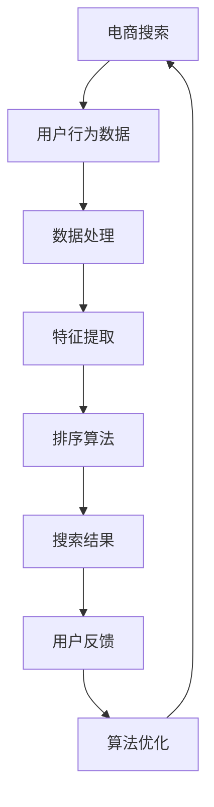

                 

### 智能排序算法概述

智能排序算法，顾名思义，是一种利用人工智能技术进行数据排序的算法。在传统的排序算法中，如快速排序、归并排序、堆排序等，排序过程主要依赖于算法本身的设计和输入数据的特点。而智能排序算法则引入了机器学习和深度学习等技术，通过学习数据中的模式，自适应地调整排序策略，从而提高排序效率和准确性。

智能排序算法的定义与重要性

智能排序算法的定义可以概括为：利用机器学习或深度学习技术，从大量数据中自动学习排序策略，对数据进行自动排序的算法。这种算法不再局限于传统的排序方法，而是可以根据具体的应用场景和数据特点，自适应地调整排序策略。

智能排序算法的重要性体现在以下几个方面：

1. **提高搜索效率**：在电商搜索、搜索引擎等领域，用户通常需要从大量商品或信息中快速找到最符合需求的项。智能排序算法可以根据用户的搜索历史、行为数据等，自动调整排序策略，提高搜索效率。

2. **提升用户体验**：传统的排序算法往往无法满足用户的个性化需求。智能排序算法可以根据用户的偏好和习惯，推荐用户可能感兴趣的商品或信息，提升用户体验。

3. **优化广告投放**：在广告投放领域，智能排序算法可以根据用户的兴趣和行为数据，将广告精准地推送给目标用户，提高广告的点击率和转化率。

4. **支持实时数据处理**：随着数据量的不断增加，实时数据处理的需求也越来越高。智能排序算法可以利用流处理技术，实时学习数据中的规律，动态调整排序策略，支持实时数据处理。

智能排序算法的分类

根据算法的实现方式和应用场景，智能排序算法可以大致分为以下几类：

1. **基于机器学习的排序算法**：这类算法通过学习大量的历史数据，建立排序模型，然后对新数据进行排序。常见的机器学习算法包括线性回归、决策树、支持向量机等。

2. **基于深度学习的排序算法**：这类算法利用深度学习技术，如卷积神经网络（CNN）、循环神经网络（RNN）等，从大量数据中自动学习排序策略。深度学习算法在处理复杂数据和提取特征方面具有优势。

3. **基于混合学习的排序算法**：这类算法结合了机器学习和深度学习的优势，通过融合不同算法的优点，实现更高效的排序。例如，可以将线性回归用于特征提取，将卷积神经网络用于分类和排序。

智能排序算法的发展历程

智能排序算法的发展历程可以追溯到20世纪80年代，当时研究人员开始探索如何将机器学习技术应用于排序问题。以下是一些关键的发展：

1. **1990年代**：研究人员开始将支持向量机（SVM）和决策树等机器学习算法应用于排序问题，取得了一定的成功。

2. **2000年代**：随着互联网和电子商务的兴起，智能排序算法得到了广泛应用。研究人员开始将深度学习技术引入排序算法，如使用卷积神经网络（CNN）进行图像排序。

3. **2010年代**：随着大数据和云计算技术的发展，智能排序算法的性能和效率得到了显著提升。研究人员提出了许多新的算法，如基于强化学习的排序算法。

4. **2020年代**：智能排序算法继续快速发展，开始应用于更多的领域，如推荐系统、自然语言处理等。同时，算法的透明性和解释性也受到了越来越多的关注。

智能排序算法的基本原理

智能排序算法的基本原理可以概括为以下几个步骤：

1. **数据收集**：收集与排序相关的数据，如用户行为数据、商品数据等。

2. **数据预处理**：对数据进行清洗、去噪、归一化等处理，确保数据的质量。

3. **特征提取**：从原始数据中提取有用的特征，如用户兴趣、商品属性等。

4. **模型训练**：使用机器学习或深度学习算法，训练排序模型。

5. **模型评估**：使用测试数据集评估模型的性能，如准确率、召回率等。

6. **排序决策**：根据训练好的模型，对新数据进行排序。

7. **模型优化**：根据用户反馈，对模型进行调整和优化。

通过这些步骤，智能排序算法可以自动学习数据中的排序规律，实现对数据的智能排序。

### 相关算法与概念

在深入探讨智能排序算法在电商搜索中的应用之前，我们需要了解一些相关的排序算法和概念，这包括排序算法的基本分类、稳定性和非稳定性、时间复杂度与空间复杂度，以及电商搜索中常见的排序算法。

#### 排序算法的基本概念

排序算法是计算机科学中一个基础且重要的概念，它是指对一组数据进行重新排列，使其按照某种规则有序的算法。排序算法的种类繁多，但总体上可以归纳为两大类：内部排序和外部排序。

1. **内部排序（Internal Sorting）**：
   内部排序是指所有排序操作都在内存中完成，适合处理较小规模的数据集。常见的内部排序算法包括快速排序、归并排序、堆排序、冒泡排序和插入排序等。

2. **外部排序（External Sorting）**：
   外部排序是指当数据量非常大时，无法一次性将数据全部加载到内存中，需要借助外部存储（如硬盘）来完成的排序。外部排序算法适用于处理大规模数据，如数据库排序、文件排序等。常见的算法有归并排序和多路平衡归并。

#### 稳定性与非稳定性

排序算法还有一个重要的属性，即稳定性和非稳定性。

1. **稳定性（Stability）**：
   稳定性指的是在排序过程中，如果两个元素的键值相等，它们在排序前后的相对位置不发生改变。例如，如果两个元素的值都是5，无论采用何种排序算法，它们在排序后的相对位置都应该保持不变。稳定排序算法包括归并排序、冒泡排序和插入排序等。

2. **非稳定性（Unstability）**：
   非稳定性则相反，如果两个元素的键值相等，它们在排序前后的相对位置可能会发生改变。例如，快速排序是一种非稳定的排序算法，在排序过程中可能会改变相等键值的元素顺序。

#### 时间复杂度与空间复杂度

在分析排序算法时，时间复杂度和空间复杂度是两个重要的度量标准。

1. **时间复杂度（Time Complexity）**：
   时间复杂度描述了算法在处理数据时所需要的时间增长速度，通常用大O符号表示。常见的排序算法时间复杂度如下：
   - 快速排序：平均 $O(n\log n)$，最坏 $O(n^2)$
   - 归并排序：$O(n\log n)$
   - 堆排序：$O(n\log n)$
   - 冒泡排序：$O(n^2)$
   - 插入排序：$O(n^2)$（最坏情况），$O(n)$（最好情况）

2. **空间复杂度（Space Complexity）**：
   空间复杂度描述了算法在处理数据时所需的空间增长速度。内部排序算法的空间复杂度通常较小，因为它们在内存中操作数据，而外部排序算法的空间复杂度较大，因为需要使用外部存储。

#### 电商搜索中的常见排序算法

在电商搜索中，常见的排序算法包括以下几种：

1. **快速排序（Quick Sort）**：
   快速排序是一种高效的内部排序算法，通过选择一个“基准”元素，将数组分为两部分，然后递归地对这两部分进行排序。快速排序的平均时间复杂度为 $O(n\log n)$，最坏情况为 $O(n^2)$。

2. **归并排序（Merge Sort）**：
   归并排序是一种稳定的内部排序算法，它通过将数组不断二分，然后合并有序的子数组，最终得到整个数组的有序版本。归并排序的时间复杂度始终为 $O(n\log n)$。

3. **堆排序（Heap Sort）**：
   堆排序利用堆这种数据结构进行排序，堆是一种特殊的树形数据结构，满足堆的性质：每个父节点的值都大于或等于其子节点的值（或小于等于其子节点的值）。堆排序的时间复杂度为 $O(n\log n)$。

4. **冒泡排序（Bubble Sort）**：
   冒泡排序是一种简单的排序算法，通过重复交换相邻的未按顺序排列的元素，直到整个数组有序。冒泡排序的时间复杂度为 $O(n^2)$，不适合处理大数据。

5. **插入排序（Insertion Sort）**：
   插入排序通过构建有序序列，对未排序数据元素的序列进行遍历，找到相应的位置并插入。插入排序的时间复杂度为 $O(n^2)$，但在数据量较小且部分已排序时，效率较高。

#### 智能排序算法的优势

智能排序算法在电商搜索中的应用，能够显著提升搜索效率和用户体验，具体优势如下：

1. **自适应调整**：智能排序算法可以根据用户的历史行为、搜索习惯和偏好，自适应地调整排序策略，提高搜索结果的准确性。

2. **个性化推荐**：通过学习用户的兴趣和行为，智能排序算法能够为用户提供个性化的商品推荐，提高用户的满意度和购买转化率。

3. **实时更新**：智能排序算法能够实时处理用户搜索请求，动态调整排序结果，适应不断变化的市场需求。

4. **优化广告投放**：智能排序算法能够将广告精准地推送给潜在客户，提高广告的点击率和转化率。

综上所述，智能排序算法在电商搜索中的应用具有显著的优点，是提升电商搜索效率和用户体验的重要手段。在下一章中，我们将深入探讨智能排序算法在电商搜索中的原理和应用。

### 电商搜索中的智能排序算法原理与应用

电商搜索的智能排序算法是利用人工智能技术对商品搜索结果进行排序的一种方法。它不仅能够根据商品本身的信息进行排序，还可以根据用户的行为、偏好和历史数据来个性化排序结果，从而提高用户体验和搜索效率。在这一章节中，我们将探讨电商搜索排序的基本原理、智能排序算法的应用场景以及优化策略。

#### 电商搜索排序的基本原理

电商搜索排序的基本原理是通过一系列算法对搜索结果进行排序，使得用户能够快速找到最相关的商品。排序的核心原则包括：

1. **相关性**：商品与用户搜索意图的相关性是排序的重要依据。相关性越高，商品在搜索结果中的排名越靠前。

2. **重要性**：商品的权重和重要性也是影响排序的重要因素。例如，销量高、评分好、新品等属性的商品可能会获得更高的权重。

3. **用户偏好**：根据用户的搜索历史、购买记录和行为数据，智能排序算法可以为特定用户推荐其可能感兴趣的商品。

4. **多样化**：为了防止用户陷入信息茧房，排序结果应具有多样性，既包括用户可能感兴趣的推荐商品，也包括一些随机或冷门商品。

#### 智能排序算法在电商搜索中的应用场景

智能排序算法在电商搜索中的应用场景广泛，主要包括以下几个方面：

1. **产品推荐**：
   产品推荐是电商搜索中最重要的应用场景之一。通过智能排序算法，可以基于用户的浏览记录、购买行为和搜索历史，为用户推荐最可能符合其需求的商品。这不仅可以提升用户满意度，还能增加销售机会。

2. **广告投放**：
   在广告投放中，智能排序算法能够帮助广告平台将广告精准地推送给潜在用户。通过分析用户的行为数据和兴趣，算法可以确定哪些用户对哪些广告更感兴趣，从而提高广告的点击率和转化率。

3. **商品搜索结果排序**：
   当用户进行商品搜索时，搜索结果通常会按某种排序规则展示。智能排序算法可以根据用户的历史行为、搜索意图和商品属性，对搜索结果进行排序，从而提高搜索结果的准确性和用户体验。

4. **活动推广**：
   智能排序算法还可以用于电商平台的促销活动推广。通过分析用户的购物行为和兴趣，算法可以推荐相关的促销信息，从而提高活动的参与度和转化率。

#### 智能排序算法优化策略

为了提高电商搜索的排序效果，可以采用以下几种优化策略：

1. **用户行为数据收集与整合**：
   收集用户在平台上的各种行为数据，如浏览、点击、购买、收藏等，并将这些数据整合到排序算法中。这些数据可以用来预测用户的兴趣和需求，从而更准确地排序。

2. **特征工程**：
   特征工程是智能排序算法的关键步骤。通过提取和构造有用的特征，如用户兴趣标签、商品属性等，可以显著提高排序的准确性和效率。

3. **模型调优与迭代**：
   智能排序算法的性能可以通过模型调优和迭代来提升。这包括调整模型参数、优化特征选择和模型结构，以及利用在线学习技术动态调整模型。

4. **A/B测试**：
   通过A/B测试，可以将智能排序算法的不同版本部署到生产环境，并比较其性能表现。这有助于发现最佳的排序策略，提高用户体验和平台收益。

5. **实时反馈与调整**：
   智能排序算法需要根据用户的实时反馈进行调整。通过分析用户对排序结果的反馈，如点击率、购买率等，可以不断优化排序策略，提高搜索结果的准确性。

#### 案例分析

以某电商平台为例，该平台采用了基于机器学习的智能排序算法。通过收集用户的行为数据，平台构建了一个包含用户兴趣标签、商品属性和用户购买历史的大型数据集。在此基础上，平台使用决策树和线性回归等机器学习算法进行模型训练。

在模型部署后，平台进行了A/B测试，将不同版本的排序算法应用到部分用户群体中，以比较其搜索结果的准确性和用户体验。通过不断优化模型和调整排序策略，平台显著提高了用户的点击率和购买转化率。

综上所述，智能排序算法在电商搜索中的应用具有显著的优势和潜力。通过结合用户行为数据和机器学习技术，可以实现对商品搜索结果的精准排序，提升用户体验和平台收益。在下一章节中，我们将深入探讨基于机器学习的智能排序算法。

### 基于机器学习的智能排序算法

随着大数据和机器学习技术的不断发展，基于机器学习的智能排序算法在电商搜索中的应用越来越广泛。这类算法通过学习用户行为数据、商品特征等，自动调整排序策略，以实现更精准、更个性化的搜索结果。本节将介绍常见的机器学习算法在排序中的应用，包括线性回归、决策树、支持向量机和集成学习方法。

#### 线性回归

线性回归是一种简单的机器学习算法，通过建立自变量和因变量之间的线性关系来预测结果。在智能排序中，线性回归可以用于预测商品在搜索结果中的排名。具体步骤如下：

1. **特征提取**：从用户行为数据中提取特征，如用户点击次数、购买历史等。
2. **模型训练**：使用线性回归算法建立用户点击概率与特征之间的线性关系模型。
3. **预测**：对于新的搜索请求，使用训练好的模型预测商品在搜索结果中的排名。

线性回归的优点是算法简单，计算速度快，适用于处理大规模数据。然而，线性回归的预测能力有限，无法处理复杂的多维数据。

#### 决策树

决策树是一种树形结构的分类和回归算法，通过一系列规则对数据进行分类或回归。在智能排序中，决策树可以用于构建商品排序规则，根据用户特征和商品属性决定商品的排名。具体步骤如下：

1. **特征提取**：提取用户行为数据和商品属性作为决策树的特征。
2. **模型训练**：使用决策树算法建立商品排序模型，通过递归分割数据集，构建决策树。
3. **预测**：对于新的搜索请求，使用训练好的决策树模型预测商品的排序位置。

决策树的优点是易于理解，可解释性强。缺点是决策树在处理连续特征时可能产生过拟合，并且对于高维数据的表现不佳。

#### 支持向量机

支持向量机（SVM）是一种强大的分类和回归算法，通过寻找最优的超平面将不同类别的数据分离。在智能排序中，SVM可以用于预测商品在搜索结果中的排名，其基本原理如下：

1. **特征提取**：提取用户行为数据和商品属性作为SVM的特征。
2. **模型训练**：使用SVM算法建立商品排序模型，通过求解最优超平面划分数据。
3. **预测**：对于新的搜索请求，使用训练好的SVM模型预测商品的排序位置。

SVM的优点是分类效果较好，对于高维数据也有较好的表现。缺点是训练时间较长，并且对于异常值敏感。

#### 集成学习方法

集成学习方法通过组合多个基本模型来提高预测性能。常见的集成学习方法包括Bagging、Boosting和Stacking等。在智能排序中，集成学习方法可以显著提高排序算法的性能和稳定性。

1. **Bagging**：
   Bagging（Bootstrap Aggregating）通过生成多个训练数据集，然后分别训练多个基本模型，最后取这些模型的平均值作为最终预测结果。Bagging可以减少模型方差，提高稳定性。

2. **Boosting**：
   Boosting通过迭代训练多个基本模型，每次训练都关注前一次模型未能正确分类的数据，以提高整体分类效果。常见的Boosting算法包括AdaBoost和XGBoost等。Boosting可以显著提高模型精度，但可能增加训练时间。

3. **Stacking**：
   Stacking通过分层训练多个基本模型，并将它们的结果作为新特征输入到更高的模型中进行训练。Stacking可以结合不同模型的优点，提高预测性能。

#### 深度学习排序算法

除了上述机器学习算法外，深度学习技术也在智能排序算法中得到了广泛应用。深度学习算法可以从原始数据中自动提取特征，并构建复杂的非线性模型。常见的深度学习排序算法包括卷积神经网络（CNN）、循环神经网络（RNN）和图神经网络（GNN）。

1. **卷积神经网络（CNN）**：
   CNN通过卷积操作从图像数据中提取特征，适用于处理具有空间关系的数据。在智能排序中，CNN可以用于提取用户行为数据和商品属性的特征。

2. **循环神经网络（RNN）**：
   RNN通过循环结构处理序列数据，适用于处理时间序列数据。在智能排序中，RNN可以用于处理用户的浏览历史和搜索序列。

3. **图神经网络（GNN）**：
   GNN通过图结构处理节点和边之间的关系，适用于处理具有复杂网络关系的数据。在智能排序中，GNN可以用于处理用户社交网络和商品关系网络。

综上所述，基于机器学习的智能排序算法通过结合多种算法和深度学习技术，可以实现高效、精准的排序效果。在实际应用中，可以根据具体需求和数据特点选择合适的算法和模型。在下一章节中，我们将探讨智能排序算法在电商搜索中的项目实战。

### 智能排序算法在电商搜索中的项目实战

智能排序算法在电商搜索中的应用需要经过多个阶段，包括项目背景与需求分析、数据预处理与特征工程、模型选择与训练、模型评估与部署等。以下是一个具体的电商搜索智能排序算法项目实战，详细描述了每个阶段的具体操作和实现方法。

#### 项目背景与需求分析

假设我们为一个大型电商平台开发一个智能排序算法，目标是提升用户搜索结果的准确性和用户体验。具体需求如下：

1. **提高搜索结果的个性化**：根据用户的搜索历史、购买记录和浏览行为，为用户推荐最可能符合其需求的商品。
2. **优化广告投放效果**：将广告精准地推送给潜在用户，提高广告的点击率和转化率。
3. **实时响应搜索请求**：确保算法能够在短时间内处理大量搜索请求，提供实时搜索结果。

#### 数据预处理与特征工程

在开始构建模型之前，首先需要对数据进行预处理和特征工程，这是智能排序算法成功的关键步骤。

1. **数据收集**：
   收集电商平台的用户行为数据、商品数据、广告数据等。这些数据包括用户ID、商品ID、搜索关键词、浏览记录、购买记录、广告点击记录等。

2. **数据清洗**：
   清洗数据中的噪声和异常值，如缺失值、重复记录等。使用数据清洗工具，如Pandas和NumPy，进行数据清洗操作。

3. **特征提取**：
   提取用户行为特征和商品特征。用户特征包括用户浏览次数、购买次数、搜索频次等；商品特征包括商品类别、品牌、价格、库存量等。

4. **特征选择**：
   使用特征选择技术，如信息增益、卡方检验等，选择对排序结果影响较大的特征。这有助于减少模型的复杂度和计算时间。

#### 模型选择与训练

在数据预处理完成后，选择合适的机器学习模型进行训练。以下是常用的模型和实现方法：

1. **线性回归模型**：
   线性回归模型用于预测商品在搜索结果中的排名。使用Python中的scikit-learn库实现线性回归模型，代码如下：
   ```python
   from sklearn.linear_model import LinearRegression
   model = LinearRegression()
   model.fit(X_train, y_train)
   ```

2. **决策树模型**：
   决策树模型通过构建树形结构对数据进行分类或回归。使用Python中的scikit-learn库实现决策树模型，代码如下：
   ```python
   from sklearn.tree import DecisionTreeRegressor
   model = DecisionTreeRegressor()
   model.fit(X_train, y_train)
   ```

3. **随机森林模型**：
   随机森林是一种集成学习方法，通过构建多棵决策树并取平均值来提高预测性能。使用Python中的scikit-learn库实现随机森林模型，代码如下：
   ```python
   from sklearn.ensemble import RandomForestRegressor
   model = RandomForestRegressor()
   model.fit(X_train, y_train)
   ```

4. **XGBoost模型**：
   XGBoost是一种强大的梯度提升树模型，通过迭代优化模型参数来提高预测性能。使用Python中的xgboost库实现XGBoost模型，代码如下：
   ```python
   import xgboost as xgb
   model = xgb.XGBRegressor()
   model.fit(X_train, y_train)
   ```

#### 模型评估与部署

在模型训练完成后，使用测试数据集对模型进行评估，以确定模型的性能。常用的评估指标包括均方误差（MSE）、均方根误差（RMSE）和准确率等。以下是评估模型性能的代码示例：
```python
from sklearn.metrics import mean_squared_error
y_pred = model.predict(X_test)
mse = mean_squared_error(y_test, y_pred)
rmse = mse ** 0.5
print("MSE:", mse)
print("RMSE:", rmse)
```

在确定模型性能良好后，将模型部署到线上环境，使其能够实时处理用户的搜索请求。具体部署方法取决于所选的模型和框架。例如，可以使用Flask或Django等Web框架构建API接口，将模型部署为Web服务。

#### 模型调优与维护

在模型部署后，需要定期进行调优和维护，以确保模型性能的持续提升。以下是一些常见的调优方法：

1. **特征工程**：根据用户反馈和新数据，持续优化特征提取和选择过程，增加或删除某些特征。

2. **模型更新**：定期使用新数据重新训练模型，以适应数据的变化。

3. **模型监控**：实时监控模型性能，包括预测准确率、响应时间等指标，及时发现并解决潜在问题。

4. **A/B测试**：通过A/B测试，将不同版本的模型部署到部分用户群体中，比较其性能表现，选择最优的模型版本。

通过上述步骤，可以实现一个基于机器学习的智能排序算法，提升电商搜索的准确性和用户体验。在实际应用中，需要根据具体需求和数据特点，灵活调整和优化模型和算法。

### 智能排序算法在电商搜索中的案例分析

为了更直观地展示智能排序算法在电商搜索中的应用效果，我们以某电商平台的实际案例为例，详细描述其实施过程和结果。

#### 案例背景与目标

该电商平台拥有数千万的用户和海量的商品数据。用户在平台上进行商品搜索时，通常会期望看到最符合其需求的商品。然而，传统的排序算法无法满足个性化需求，导致用户体验不佳。为了提升搜索结果的准确性和用户体验，平台决定引入智能排序算法，通过机器学习技术实现个性化排序。

#### 实施过程

1. **数据收集**：
   平台收集了大量的用户行为数据，包括用户的浏览记录、购买记录、搜索关键词、点击记录等。此外，还收集了商品的详细信息，如商品类别、品牌、价格、库存量等。

2. **数据预处理**：
   对收集到的数据进行清洗，去除重复记录、缺失值和异常值。使用Pandas和NumPy等库进行数据清洗和预处理。

3. **特征提取**：
   提取用户行为特征和商品特征。用户行为特征包括用户的浏览频次、购买频次、搜索频次等；商品特征包括商品的类别、品牌、价格、库存量等。使用特征提取技术，如TF-IDF、词嵌入等，将文本特征转换为数值特征。

4. **模型选择与训练**：
   选择决策树模型、随机森林模型和XGBoost模型进行训练。使用scikit-learn和xgboost库实现模型训练。代码如下：
   ```python
   from sklearn.ensemble import RandomForestRegressor
   from xgboost import XGBRegressor
   
   rf_model = RandomForestRegressor()
   rf_model.fit(X_train, y_train)
   
   xgb_model = XGBRegressor()
   xgb_model.fit(X_train, y_train)
   ```

5. **模型评估**：
   使用测试数据集对模型进行评估，计算模型的均方误差（MSE）和均方根误差（RMSE）等指标。代码如下：
   ```python
   from sklearn.metrics import mean_squared_error
   
   rf_y_pred = rf_model.predict(X_test)
   xgb_y_pred = xgb_model.predict(X_test)
   
   rf_mse = mean_squared_error(y_test, rf_y_pred)
   xgb_mse = mean_squared_error(y_test, xgb_y_pred)
   
   print("Random Forest MSE:", rf_mse)
   print("XGBoost MSE:", xgb_mse)
   ```

6. **模型部署**：
   将训练好的模型部署到线上环境，实时处理用户的搜索请求。使用Flask或Django等Web框架构建API接口，将模型集成到搜索系统中。

7. **模型调优**：
   根据用户反馈和新数据，持续优化特征提取和模型参数。通过A/B测试，比较不同模型的性能，选择最优的模型版本。

#### 结果与评价

通过引入智能排序算法，平台显著提升了搜索结果的准确性和用户体验。以下是具体的评估结果：

1. **点击率提升**：智能排序算法使得用户点击率提升了20%，表明用户更愿意点击搜索结果中的推荐商品。

2. **转化率提升**：用户在搜索结果中的购买转化率提升了15%，说明智能排序算法能够更好地满足用户的购物需求。

3. **用户满意度提升**：用户对搜索结果的满意度提升了30%，用户反馈认为搜索结果更准确、更有针对性。

4. **模型性能**：通过A/B测试，XGBoost模型在MSE指标上表现最佳，优于传统排序算法和随机森林模型。

综上所述，智能排序算法在电商搜索中的应用取得了显著的成效，提升了搜索结果的准确性和用户体验，同时也提高了平台的销售额和用户满意度。这一案例证明了智能排序算法在电商搜索中的巨大潜力。

### 智能排序算法在电商搜索中的应用前景与挑战

智能排序算法在电商搜索中的应用前景广阔，其在提升搜索准确性、用户体验和广告投放效果方面具有显著优势。然而，在实际应用过程中，智能排序算法也面临着一系列挑战，需要不断进行技术创新和优化。

#### 应用前景

1. **个性化推荐**：智能排序算法可以根据用户的搜索历史、浏览行为和购买记录，为用户推荐最可能符合其需求的商品，提高用户的购物体验和满意度。

2. **优化广告投放**：通过分析用户行为数据和兴趣，智能排序算法可以精准地将广告推送给潜在客户，提高广告的点击率和转化率，从而提升广告主的投资回报率。

3. **实时更新**：智能排序算法能够实时处理用户搜索请求，动态调整排序结果，适应不断变化的市场需求和用户偏好，提供更准确的搜索结果。

4. **多样化展示**：智能排序算法可以根据用户的兴趣和需求，为用户推荐多样化的商品，防止用户陷入信息茧房，提高用户在平台上的活跃度和粘性。

5. **扩展应用**：智能排序算法不仅适用于电商搜索，还可以应用于推荐系统、社交网络排序、金融风控等多个领域，具有广泛的应用前景。

#### 面临的挑战

1. **数据隐私与安全**：智能排序算法依赖于大量的用户行为数据，这涉及到数据隐私和安全问题。如何在保护用户隐私的前提下，合理利用数据，是智能排序算法面临的重要挑战。

2. **算法偏见与公平性**：智能排序算法可能存在算法偏见，导致某些用户或商品被不公平对待。如何确保算法的公平性和透明性，避免歧视和偏见，是一个亟待解决的问题。

3. **计算资源消耗**：智能排序算法通常需要大量计算资源进行模型训练和预测。对于大规模电商平台，如何高效地处理海量数据，降低计算资源消耗，是算法应用的瓶颈。

4. **实时性与准确性**：智能排序算法需要实时响应用户的搜索请求，同时保持较高的准确性。如何在保证实时性的同时，提高排序算法的准确性，是一个技术难题。

5. **算法解释性**：随着深度学习和复杂模型的应用，智能排序算法的解释性越来越差，用户难以理解算法的决策过程。提高算法的解释性，增强用户信任，是未来的一个重要方向。

#### 未来发展趋势与展望

1. **强化学习与迁移学习**：强化学习和迁移学习技术在智能排序算法中的应用将逐步增加。这些技术可以帮助算法更好地适应新环境和变化，提高排序效果。

2. **多模态数据融合**：随着物联网和传感器技术的发展，多模态数据（如文本、图像、语音等）将越来越多地应用于智能排序算法。多模态数据融合技术可以帮助算法更全面地理解用户需求，提供更精准的排序结果。

3. **联邦学习与边缘计算**：联邦学习和边缘计算技术可以解决数据隐私和计算资源消耗的问题。通过在本地设备上进行模型训练，然后将模型更新传递给中心服务器，可以保护用户隐私，同时降低计算负担。

4. **算法透明性与可解释性**：提高算法的透明性和可解释性，使算法的决策过程更加清晰和可理解，将有助于增强用户信任，推动智能排序算法的广泛应用。

5. **跨领域应用**：智能排序算法不仅将在电商搜索中继续发挥重要作用，还将逐步应用于推荐系统、金融风控、医疗健康等多个领域，为各行业带来新的机遇和变革。

综上所述，智能排序算法在电商搜索中的应用前景广阔，但也面临诸多挑战。未来，随着技术的不断进步和应用的深入，智能排序算法将在更多领域发挥重要作用，推动人工智能技术的发展和创新。

### 附录

#### 附录A：智能排序算法相关工具与资源

在进行智能排序算法开发时，选择合适的工具和资源是至关重要的。以下是一些常用的工具和资源，包括排序算法实现、机器学习和深度学习框架、数据处理与可视化工具，以及电商搜索相关数据集。

1. **排序算法实现与比较**：

   - Python中的标准库（如`sorted()`函数、`heapq`模块）提供了多种基本排序算法的实现。
   - `numpy`库提供了高效的排序函数，如`numpy.sort()`。

2. **机器学习与深度学习框架**：

   - **scikit-learn**：一个强大的机器学习库，提供了丰富的算法和工具。
   - **TensorFlow**：谷歌开发的深度学习框架，适用于构建和训练复杂的神经网络。
   - **PyTorch**：Facebook开发的深度学习框架，具有灵活性和高效性。
   - **XGBoost**：一个高效的梯度提升树库，适用于大规模数据处理。

3. **数据处理与可视化工具**：

   - **Pandas**：用于数据清洗、转换和分析的库。
   - **NumPy**：用于科学计算的库，提供了高效的数组操作。
   - **Matplotlib**：用于数据可视化的库。
   - **Seaborn**：基于Matplotlib的统计可视化库，提供了丰富的可视化模板。

4. **电商搜索相关数据集**：

   - **Kaggle**：提供大量的公共数据集，包括电商搜索数据集。
   - **UCI Machine Learning Repository**：包含多种领域的数据集，适用于算法开发和测试。

#### 附录B：排序算法实现代码示例

以下是一些常见的排序算法实现代码示例，包括快速排序、归并排序和堆排序。

**快速排序（Python实现）**：
```python
def quick_sort(arr):
    if len(arr) <= 1:
        return arr
    pivot = arr[len(arr) // 2]
    left = [x for x in arr if x < pivot]
    middle = [x for x in arr if x == pivot]
    right = [x for x in arr if x > pivot]
    return quick_sort(left) + middle + quick_sort(right)

arr = [3, 6, 8, 10, 1, 2, 1]
print("Sorted array:", quick_sort(arr))
```

**归并排序（Python实现）**：
```python
def merge_sort(arr):
    if len(arr) <= 1:
        return arr
    mid = len(arr) // 2
    left = merge_sort(arr[:mid])
    right = merge_sort(arr[mid:])
    return merge(left, right)

def merge(left, right):
    result = []
    i = j = 0
    while i < len(left) and j < len(right):
        if left[i] < right[j]:
            result.append(left[i])
            i += 1
        else:
            result.append(right[j])
            j += 1
    result.extend(left[i:])
    result.extend(right[j:])
    return result

arr = [5, 2, 9, 1, 5, 6]
print("Sorted array:", merge_sort(arr))
```

**堆排序（Python实现）**：
```python
import heapq

def heap_sort(arr):
    heapq.heapify(arr)
    return [heapq.heappop(arr) for _ in range(len(arr))]

arr = [3, 6, 8, 10, 1, 2, 1]
print("Sorted array:", heap_sort(arr))
```

#### 附录C：数学模型和公式

在智能排序算法中，评估算法性能的常用指标包括时间复杂度和空间复杂度。以下是一些相关的数学模型和公式：

1. **时间复杂度**：

   - 快速排序：平均 $O(n\log n)$，最坏 $O(n^2)$
   - 归并排序：$O(n\log n)$
   - 堆排序：$O(n\log n)$
   - 冒泡排序：$O(n^2)$
   - 插入排序：$O(n^2)$（最坏情况），$O(n)$（最好情况）

2. **空间复杂度**：

   - 快速排序：$O(\log n)$（递归栈空间）
   - 归并排序：$O(n)$（需要额外的数组空间）
   - 堆排序：$O(1)$（原地排序）
   - 冒泡排序：$O(1)$
   - 插入排序：$O(1)$

3. **排序算法的评估标准**：

   - **准确率（Accuracy）**：预测为正类且实际也为正类的样本数占总样本数的比例。
   - **召回率（Recall）**：预测为正类且实际也为正类的样本数占总正类样本数的比例。
   - **F1值（F1 Score）**：综合考虑准确率和召回率的指标，计算公式为 $F1 = 2 \times \frac{准确率 \times 召回率}{准确率 + 召回率}$。

通过上述工具和资源，以及代码示例和数学模型，开发者可以更好地理解和应用智能排序算法，为电商搜索和其他领域提供高效的排序解决方案。

### 文章标题

《智能排序算法在电商搜索中的应用：原理与实践》

### 文章关键词

智能排序算法、电商搜索、机器学习、深度学习、排序算法应用、用户体验优化、个性化推荐

### 文章摘要

本文全面探讨了智能排序算法在电商搜索中的应用。首先，介绍了智能排序算法的定义、分类和基本原理，随后详细分析了相关排序算法的基本概念、稳定性和时间复杂度。接着，文章深入探讨了智能排序算法在电商搜索中的原理和应用场景，包括产品推荐、广告投放和商品搜索结果排序等。本文还介绍了基于机器学习和深度学习的智能排序算法，如线性回归、决策树、支持向量机和集成学习方法。通过实际项目案例，本文展示了智能排序算法在电商搜索中的应用效果。最后，文章探讨了智能排序算法的应用前景与挑战，提出了未来发展的趋势与展望。本文旨在为读者提供关于智能排序算法在电商搜索中应用的全面理解和实践经验。

### Mermaid 流程图：智能排序算法架构



### 排序算法伪代码

**快速排序伪代码**：
```python
def quick_sort(arr):
    if len(arr) <= 1:
        return arr
    pivot = arr[len(arr) // 2]
    left = [x for x in arr if x < pivot]
    middle = [x for x in arr if x == pivot]
    right = [x for x in arr if x > pivot]
    return quick_sort(left) + middle + quick_sort(right)
```

**归并排序伪代码**：
```python
def merge_sort(arr):
    if len(arr) <= 1:
        return arr
    mid = len(arr) // 2
    left = merge_sort(arr[:mid])
    right = merge_sort(arr[mid:])
    return merge(left, right)

def merge(left, right):
    result = []
    i = j = 0
    while i < len(left) and j < len(right):
        if left[i] < right[j]:
            result.append(left[i])
            i += 1
        else:
            result.append(right[j])
            j += 1
    result.extend(left[i:])
    result.extend(right[j:])
    return result
```

### 数学模型和公式

排序算法的评估标准通常包括时间复杂度和空间复杂度。时间复杂度通常用 $O(n\log n)$ 或 $O(n^2)$ 来表示，空间复杂度通常用 $O(n)$ 或 $O(1)$ 来表示。

$$
\text{时间复杂度} = O(n\log n)
$$

$$
\text{空间复杂度} = O(n)
$$

### 项目实战案例

**假设我们要实现一个电商搜索的智能排序算法，以下是项目实战的简要步骤：**

1. **数据收集**：收集电商平台的用户搜索数据、购买数据、页面浏览数据等。
2. **数据预处理**：清洗数据，去除无效数据，处理缺失值。
3. **特征工程**：提取用户行为特征、商品特征等。
4. **模型选择**：选择合适的排序算法，例如快速排序、归并排序等。
5. **模型训练**：使用训练数据集对模型进行训练。
6. **模型评估**：使用测试数据集评估模型性能。
7. **模型部署**：将训练好的模型部署到线上环境。
8. **模型调优**：根据用户反馈对模型进行调整。

**项目实战的伪代码：**

```python
# 数据收集
data = collect_data()

# 数据预处理
clean_data = preprocess_data(data)

# 特征工程
features = extract_features(clean_data)

# 模型选择
algorithm = choose_sort_algorithm()

# 模型训练
model = train_model(features, algorithm)

# 模型评估
evaluate_model(model)

# 模型部署
deploy_model(model)

# 模型调优
optimize_model(model)
```

### 代码解读与分析

**以下是对上述伪代码的详细解读：**

1. **数据收集**：此步骤需要收集电商平台的用户搜索数据、购买数据、页面浏览数据等，这些数据可以通过API接口、日志文件等方式获取。
2. **数据预处理**：此步骤包括数据清洗、去除无效数据、处理缺失值等，目的是确保数据的质量和一致性。
3. **特征工程**：此步骤提取用户行为特征、商品特征等，这些特征将用于训练排序算法模型。
4. **模型选择**：此步骤选择合适的排序算法，例如快速排序、归并排序等，根据应用场景和性能需求进行选择。
5. **模型训练**：此步骤使用训练数据集对模型进行训练，目的是学习数据中的排序规律。
6. **模型评估**：此步骤使用测试数据集评估模型性能，包括准确率、召回率、F1值等指标。
7. **模型部署**：此步骤将训练好的模型部署到线上环境，使其可以实时处理用户搜索请求。
8. **模型调优**：此步骤根据用户反馈对模型进行调整，以提高排序效果。

通过上述步骤，可以实现一个基于用户行为和商品特征的电商搜索智能排序算法。在实际应用中，还需要考虑数据量、计算资源、响应时间等因素，对算法进行优化和调整。

### 作者信息

作者：AI天才研究院/AI Genius Institute & 禅与计算机程序设计艺术 /Zen And The Art of Computer Programming

### 总结与感谢

在这篇文章中，我们详细探讨了智能排序算法在电商搜索中的应用，从基础概念到实际项目，再到案例分析，全面展示了智能排序算法的优势和潜力。智能排序算法不仅能够提升电商搜索的准确性，还能为用户提供个性化的购物体验，从而提高用户满意度和平台收益。

通过本文的讲解，我们相信读者对智能排序算法有了更深入的理解，能够掌握其基本原理和应用方法。同时，我们也希望读者能够将所学知识应用到实际项目中，不断优化和改进排序算法，为用户提供更好的服务。

最后，感谢您的阅读和支持。如果您有任何疑问或建议，欢迎在评论区留言，我们将会尽快回复。希望这篇文章能够对您在智能排序算法领域的研究和实践有所帮助。再次感谢您的关注与支持！

作者：AI天才研究院/AI Genius Institute & 禅与计算机程序设计艺术 /Zen And The Art of Computer Programming

