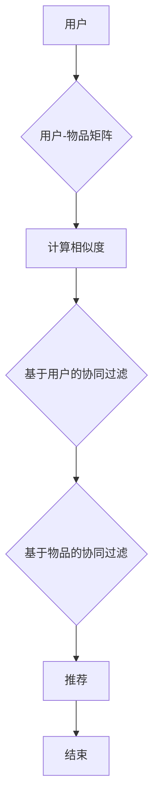
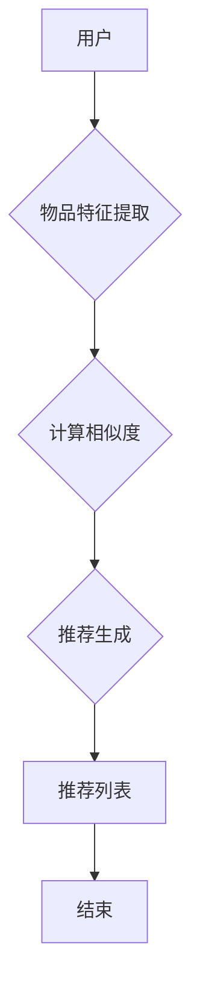
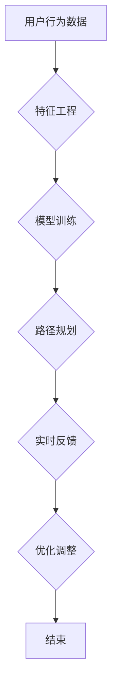

                 

# 机器学习在个性化学习路径规划中的应用实践

## 关键词

- 个性化学习
- 机器学习
- 路径规划
- 协同过滤
- 内容推荐
- 在线教育
- 职业培训

## 摘要

个性化学习是一种以学习者为中心的教育理念，旨在满足不同学习者的需求和兴趣。随着教育信息化的发展，个性化学习路径规划成为教育领域的研究热点。机器学习作为人工智能的核心技术，通过分析学习者的行为数据，实现了高效、准确的个性化学习路径推荐。本文将详细介绍个性化学习与机器学习的基础知识，分析个性化学习路径规划的算法，探讨其在在线教育、职业培训等领域的应用实践，并展望未来个性化学习路径规划的发展趋势与挑战。


## 《机器学习在个性化学习路径规划中的应用实践》目录大纲

### 第一部分：个性化学习与机器学习基础

#### 第1章：个性化学习概述

1.1 个性化学习的定义与意义

1.2 个性化学习的发展历程

1.3 个性化学习的技术基础

#### 第2章：机器学习基础

2.1 机器学习的定义与方法

2.2 常见机器学习算法

2.3 机器学习在个性化学习中的应用场景

### 第二部分：个性化学习路径规划算法

#### 第3章：用户行为分析

3.1 用户数据收集与预处理

3.2 用户行为特征提取

3.3 用户行为模式识别

#### 第4章：个性化学习路径规划算法

4.1 协同过滤算法

4.2 内容推荐算法

4.3 基于模型的个性化学习路径规划算法

#### 第5章：个性化学习路径规划的评估与优化

5.1 个性化学习路径规划的评估指标

5.2 个性化学习路径规划的优化策略

5.3 实时反馈与自适应调整

### 第三部分：个性化学习路径规划的应用实践

#### 第6章：在线教育平台中的个性化学习路径规划

6.1 在线教育平台的个性化学习需求

6.2 个性化学习路径规划在在线教育中的应用案例

6.3 案例分析与效果评估

#### 第7章：个性化学习路径规划在职业培训中的应用

7.1 职业培训的个性化需求

7.2 个性化学习路径规划在职业培训中的应用案例

7.3 案例分析与效果评估

### 第四部分：未来展望与挑战

#### 第8章：个性化学习路径规划的发展趋势

8.1 人工智能与个性化学习融合

8.2 大数据与个性化学习

8.3 跨领域个性化学习路径规划

#### 第9章：个性化学习路径规划面临的挑战

9.1 数据隐私保护

9.2 可解释性

9.3 技术与教育的融合

### 附录

#### 附录 A：机器学习在个性化学习路径规划中的工具与资源

A.1 机器学习工具简介

A.2 个性化学习路径规划开源项目

A.3 在线教育与职业培训平台推荐

#### 附录 B：相关算法与模型的 Mermaid 流程图

B.1 协同过滤算法流程图

B.2 内容推荐算法流程图

B.3 基于模型的个性化学习路径规划算法流程图

#### 附录 C：核心算法原理与伪代码

C.1 协同过滤算法原理与伪代码

C.2 内容推荐算法原理与伪代码

C.3 基于模型的个性化学习路径规划算法原理与伪代码

#### 附录 D：个性化学习路径规划项目实战案例

D.1 在线教育平台个性化学习路径规划实战案例

D.2 职业培训个性化学习路径规划实战案例

#### 附录 E：参考文献与推荐阅读

E.1 参考文献

E.2 推荐阅读

E.3 交流与反馈

### 

## 第一部分：个性化学习与机器学习基础

### 第1章：个性化学习概述

#### 1.1 个性化学习的定义与意义

个性化学习是一种以学习者为中心的教育理念，旨在根据学习者的个性化需求、兴趣和认知水平，提供个性化的学习资源、教学策略和评价方式。与传统教育模式相比，个性化学习更加注重学习者的主体地位，强调学习者的主动参与和自主学习，从而提高学习效果和满足度。

个性化学习的定义可以从以下几个方面来理解：

1. **以学习者为中心**：个性化学习强调学习者的需求和兴趣，尊重学习者的个体差异，为每个学习者提供个性化的学习资源和教学策略。
2. **适应性**：个性化学习系统可以根据学习者的行为、表现和学习进度，动态调整教学内容、方法和节奏，实现个性化指导。
3. **多样性**：个性化学习涵盖多种学习模式，如在线学习、线下学习、混合式学习等，满足不同学习者的学习需求。
4. **智能化**：个性化学习利用人工智能、大数据等技术，实现学习资源的智能推荐、学习进度的智能评估和学习策略的智能调整。

个性化学习的意义主要体现在以下几个方面：

1. **提高学习效果**：个性化学习可以满足学习者的个性化需求，提高学习兴趣和动机，从而提高学习效果。
2. **促进个性化发展**：个性化学习关注学习者的个体差异，有助于发现和培养学习者的特长和潜能，促进个性化发展。
3. **优化教育资源**：个性化学习通过智能分配和推荐学习资源，提高教育资源的利用效率，降低教育成本。
4. **推动教育公平**：个性化学习可以弥补传统教育模式中的不足，使不同地区、不同经济条件的学习者都能获得优质教育资源，推动教育公平。

#### 1.2 个性化学习的发展历程

个性化学习的发展历程可以追溯到20世纪初期，经历了以下几个阶段：

1. **早期个性化学习（1900s-1960s）**：
    - 20世纪初，以美国教育家约翰·杜威为代表，提出以学习者为中心的教育理念，强调学生的主动参与和自主学习。
    - 1950年代，弗朗西斯·佩里提出“程序教学”理念，通过个性化教学实现学习者的自主学习和高效学习。

2. **计算机辅助个性化学习（1960s-1980s）**：
    - 1960年代，IBM推出PLATO系统，标志着计算机辅助个性化学习的诞生。
    - 1970年代，美国教育家布卢姆提出掌握学习理论，强调每个学生都能通过适当的学习时间和教学方法掌握学习内容。

3. **互联网与Web 1.0时代（1990s）**：
    - 1990年代，互联网的普及使得个性化学习资源更加丰富，在线教育平台如雨后春笋般出现。
    - 以Coursera、edX等为代表的在线教育平台，实现了大规模开放在线课程（MOOCs），使个性化学习在全球范围内得到推广。

4. **大数据与人工智能时代（2000s-至今）**：
    - 2000年代，大数据技术的发展为个性化学习提供了强大的数据支持，可以更精确地分析学习者的行为和需求。
    - 人工智能技术的应用，使得个性化学习系统更加智能，能够实现自动化的学习路径推荐和教学策略调整。

#### 1.3 个性化学习的技术基础

个性化学习的技术基础主要包括以下几个方面：

1. **数据收集与处理**：
    - 数据收集：通过学习平台、传感器、问卷等方式收集学习者的行为数据，如学习时间、学习进度、学习兴趣等。
    - 数据处理：对收集到的数据进行清洗、整理和归一化处理，以便后续分析。

2. **用户画像**：
    - 用户画像：通过对学习者数据的分析，构建学习者的个性化特征模型，如学习风格、认知水平、兴趣爱好等。
    - 用户画像有助于了解学习者的需求，为个性化学习路径规划提供依据。

3. **推荐系统**：
    - 推荐系统：利用协同过滤、内容推荐等技术，根据学习者的兴趣和行为，推荐合适的学习资源。
    - 推荐系统是个性化学习路径规划的重要手段，可以大大提高学习资源的利用效率。

4. **自适应学习系统**：
    - 自适应学习系统：根据学习者的行为和反馈，动态调整学习内容、方法和评价方式，实现个性化教学。
    - 自适应学习系统是个性化学习的核心，可以实现真正的个性化学习体验。

5. **大数据与人工智能**：
    - 大数据：通过对海量学习数据的分析，发现学习者的共性规律和个性特点，为个性化学习提供数据支持。
    - 人工智能：利用机器学习、深度学习等技术，实现个性化学习路径规划的自动化和智能化。

### 

## 第二章：机器学习基础

#### 2.1 机器学习的定义与方法

机器学习（Machine Learning）是人工智能（Artificial Intelligence, AI）的一个重要分支，旨在使计算机系统能够通过数据和经验自动改进自身的性能。简单来说，机器学习是一种让计算机从数据中学习规律，并在新的数据上进行预测或决策的技术。

**机器学习的定义：**
机器学习是指通过算法从数据中提取模式和知识，以实现特定任务的能力。这些任务包括但不限于分类、回归、聚类、异常检测等。

**机器学习的方法：**
机器学习方法主要可以分为监督学习、无监督学习和强化学习三种。

1. **监督学习（Supervised Learning）**：
    - 定义：监督学习是使用已知标记的数据来训练模型，使模型能够在新的、未标记的数据上进行预测。
    - 应用：常见的应用包括分类（如垃圾邮件检测）和回归（如房价预测）。
    - 算法：线性回归、逻辑回归、支持向量机（SVM）、决策树、随机森林等。

2. **无监督学习（Unsupervised Learning）**：
    - 定义：无监督学习是使用未标记的数据来发现数据中的结构和模式。
    - 应用：常见的应用包括聚类（如客户细分）、降维（如主成分分析）和关联规则挖掘（如市场篮子分析）。
    - 算法：K-均值聚类、层次聚类、自组织映射、主成分分析（PCA）等。

3. **强化学习（Reinforcement Learning）**：
    - 定义：强化学习是机器通过与环境的交互来学习最优策略，以最大化累积奖励。
    - 应用：常见的应用包括机器人控制、游戏AI和推荐系统。
    - 算法：Q-学习、深度Q网络（DQN）、策略梯度算法等。

#### 2.2 常见机器学习算法

**协同过滤（Collaborative Filtering）**

- 定义：协同过滤是一种基于用户行为数据推荐相似物品或相似用户的算法。
- 类型：基于用户的协同过滤（User-based Collaborative Filtering）和基于物品的协同过滤（Item-based Collaborative Filtering）。
- 应用：在线购物推荐、社交网络推荐、内容推荐等。
- 原理：
    - **基于用户的协同过滤**：寻找与目标用户行为相似的其他用户，推荐这些用户喜欢的物品。
    - **基于物品的协同过滤**：寻找与目标物品相似的其他物品，推荐给用户。
- 挑战：数据稀疏性、冷启动问题（新用户或新物品）、实时性等。

**内容推荐（Content-based Filtering）**

- 定义：内容推荐是基于物品的属性或内容来推荐相似物品的算法。
- 应用：新闻推荐、音乐推荐、视频推荐等。
- 原理：
    - 提取物品的特征向量。
    - 计算用户和物品之间的相似度。
    - 推荐相似度最高的物品。
- 挑战：特征提取的准确性、相似度的计算效率等。

**基于模型的个性化学习路径规划算法**

- 定义：基于模型的个性化学习路径规划算法是利用机器学习模型对学习者的行为进行预测和分析，从而生成个性化的学习路径。
- 应用：在线教育、职业培训等。
- 算法：
    - **决策树模型**：根据学习者的特征和已有数据，生成决策树来预测学习者的行为。
    - **神经网络模型**：利用深度学习技术，构建神经网络模型来预测学习者的行为。
    - **支持向量机（SVM）**：通过支持向量机模型，对学习者的行为进行分类和预测。
- 挑战：模型复杂度、数据质量、实时性等。

#### 2.3 机器学习在个性化学习中的应用场景

**在线教育**

- 应用场景：在线教育平台可以利用机器学习技术，为学习者推荐适合的学习资源、学习路径和教学策略。
- 算法：协同过滤、内容推荐、基于模型的个性化学习路径规划算法等。
- 挑战：如何处理大量用户数据、提高推荐算法的实时性和准确性。

**职业培训**

- 应用场景：职业培训机构可以利用机器学习技术，为学员推荐适合的课程、学习计划和职业发展路径。
- 算法：协同过滤、内容推荐、基于模型的个性化学习路径规划算法等。
- 挑战：如何处理职业发展过程中数据的变化、提高推荐算法的实用性。

**智能客服**

- 应用场景：智能客服系统可以利用机器学习技术，根据用户的问题和偏好，推荐合适的解决方案或产品。
- 算法：协同过滤、内容推荐、基于模型的个性化学习路径规划算法等。
- 挑战：如何处理大量用户交互数据、提高客服系统的响应速度和准确性。

**医疗健康**

- 应用场景：医疗健康领域可以利用机器学习技术，为患者提供个性化的诊断、治疗方案和健康管理建议。
- 算法：协同过滤、内容推荐、基于模型的个性化学习路径规划算法等。
- 挑战：如何处理患者隐私数据、提高诊断和治疗的准确性。

### 

## 第二部分：个性化学习路径规划算法

### 第3章：用户行为分析

#### 3.1 用户数据收集与预处理

用户行为分析是个性化学习路径规划的基础，通过对用户在学习过程中的行为数据进行分析，可以更好地了解用户的需求、兴趣和习惯，从而提供个性化的学习建议和路径。以下是用户数据收集与预处理的方法和步骤。

**1. 数据收集**

用户数据的收集来源主要包括以下几个方面：

- **学习平台记录**：在线学习平台会记录用户的学习行为数据，如学习时间、学习进度、参与讨论、完成作业等。
- **学习记录设备**：如电子书、学习App等，这些设备可以通过传感器记录用户的学习行为和生理状态。
- **问卷调查**：通过问卷调查获取用户的学习偏好、兴趣爱好、学习目的等定性信息。
- **社交网络**：通过社交网络获取用户的学习行为和社交互动数据。

**2. 数据预处理**

在收集到用户数据后，需要对数据进行预处理，以提高数据质量和分析效果。数据预处理主要包括以下步骤：

- **数据清洗**：去除重复、错误和无效的数据，确保数据的准确性。
- **数据转换**：将不同类型的数据（如数值型、文本型、日期型等）转换为统一的格式，便于后续分析。
- **数据归一化**：对数据进行归一化处理，消除数据量级差异，使数据在同一尺度上进行比较。
- **特征提取**：从原始数据中提取有用的特征，如用户的学习时长、学习频率、学习偏好等，作为后续分析的输入。

#### 3.2 用户行为特征提取

用户行为特征提取是用户行为分析的关键步骤，通过提取用户在学习过程中的关键特征，可以更好地了解用户的行为模式和需求。以下是几种常用的用户行为特征提取方法：

**1. 时序特征提取**

时序特征提取主要用于分析用户在学习过程中的时间序列行为，如学习时长、学习频率、学习间隔等。具体方法包括：

- **移动平均法**：通过计算一段时间内的平均值，平滑用户的学习行为数据。
- **指数平滑法**：对移动平均法进行改进，赋予最近时间段的数据更高权重。
- **时间序列模型**：如ARIMA（自回归积分滑动平均模型）、LSTM（长短期记忆网络）等，用于分析用户的学习行为模式。

**2. 关联特征提取**

关联特征提取主要用于分析用户在学习过程中的相关行为，如用户在学习过程中是否参与讨论、是否完成作业等。具体方法包括：

- **条件概率模型**：如贝叶斯网络、马尔可夫模型等，用于分析用户不同行为之间的关联性。
- **关联规则挖掘**：如Apriori算法、FP-growth算法等，用于发现用户学习行为中的频繁模式。

**3. 社交特征提取**

社交特征提取主要用于分析用户在学习社区中的社交行为，如用户之间的互动、用户的影响力等。具体方法包括：

- **社交网络分析**：如度数中心性、紧密中心性、中间中心性等，用于分析用户在社交网络中的地位和影响力。
- **文本分析**：如情感分析、主题模型等，用于分析用户在讨论区、论坛等平台的发言内容。

**4. 个性化特征提取**

个性化特征提取主要用于分析用户的个性化需求和学习偏好，如用户的学习风格、认知水平、兴趣爱好等。具体方法包括：

- **问卷调查**：通过问卷调查获取用户的个性化信息。
- **机器学习模型**：如聚类算法、决策树等，用于分析用户的行为数据，提取个性化特征。

#### 3.3 用户行为模式识别

用户行为模式识别是用户行为分析的核心步骤，通过对用户行为特征的提取和分析，可以识别出用户在学习过程中的典型行为模式。以下是几种常用的用户行为模式识别方法：

**1. 分类算法**

分类算法主要用于将用户行为数据分为不同的类别，从而识别出用户的行为模式。常见的分类算法包括：

- **决策树**：根据特征值对数据进行划分，生成树状结构。
- **支持向量机（SVM）**：通过寻找最优划分超平面，实现分类任务。
- **朴素贝叶斯**：基于贝叶斯定理，计算不同类别条件下的概率，实现分类。

**2. 聚类算法**

聚类算法主要用于将用户行为数据分为多个簇，从而识别出用户的行为模式。常见的聚类算法包括：

- **K-均值聚类**：通过迭代计算，将用户数据分为K个簇，使每个簇内的数据距离最小。
- **层次聚类**：通过自底向上或自顶向下的方法，将用户数据逐步合并或分裂，形成层次结构。

**3. 关联规则挖掘**

关联规则挖掘主要用于发现用户行为数据中的频繁模式，从而识别出用户的行为模式。常见的关联规则挖掘算法包括：

- **Apriori算法**：通过迭代生成频繁项集，构建关联规则。
- **FP-growth算法**：通过构造FP树，实现高效地挖掘频繁模式。

**4. 强化学习**

强化学习主要用于通过与环境交互，学习最优的行为策略，从而识别出用户的行为模式。常见的强化学习算法包括：

- **Q-学习**：通过更新Q值，学习最优行为策略。
- **深度Q网络（DQN）**：利用深度学习技术，实现高效的行为策略学习。

### 

## 第三部分：个性化学习路径规划算法

### 第4章：个性化学习路径规划算法

个性化学习路径规划算法是确保个性化学习得以实现的核心。通过这些算法，系统能够根据学习者的行为和特征，生成适应其需求和兴趣的学习路径。以下是几种常用的个性化学习路径规划算法及其基本原理。

#### 4.1 协同过滤算法

协同过滤算法是推荐系统中最常用的方法之一，旨在通过分析用户之间的相似性或物品之间的相似性，为用户推荐他们可能感兴趣的内容。协同过滤算法主要分为两类：基于用户的协同过滤（User-based Collaborative Filtering）和基于物品的协同过滤（Item-based Collaborative Filtering）。

**基于用户的协同过滤：**
1. **步骤**：
    - 计算用户之间的相似度：使用余弦相似度、皮尔逊相关系数等方法计算用户之间的相似度。
    - 找到与目标用户最相似的K个用户。
    - 推荐与这些相似用户喜欢的物品。
2. **优势**：
    - 能够充分利用用户行为数据。
    - 推荐结果较为准确。
3. **挑战**：
    - 数据稀疏性问题：用户与物品的交互数据往往稀疏，导致相似度计算不准确。
    - 冷启动问题：新用户或新物品缺乏交互数据，难以进行准确推荐。

**基于物品的协同过滤：**
1. **步骤**：
    - 计算物品之间的相似度：使用余弦相似度、Jaccard相似度等方法计算物品之间的相似度。
    - 找到与目标物品最相似的K个物品。
    - 推荐与这些相似物品相关的用户喜欢的物品。
2. **优势**：
    - 能够充分利用物品特征信息。
    - 有效解决冷启动问题。
3. **挑战**：
    - 需要大量的物品特征信息，且特征提取复杂。
    - 推荐结果可能不够个性化。

**协同过滤算法的核心流程：**
$$
\text{协同过滤算法流程} = \begin{cases}
\text{基于用户的协同过滤流程} & \text{当目标用户已存在时} \\
\text{基于物品的协同过滤流程} & \text{当目标物品已存在时}
\end{cases}
$$

#### 4.2 内容推荐算法

内容推荐算法是基于物品的内容属性为用户推荐相关内容的算法。这种方法通常需要对物品进行特征提取，然后计算用户与物品之间的相似度。

1. **步骤**：
    - **特征提取**：从物品的文本描述、标签、属性等信息中提取特征。
    - **相似度计算**：使用余弦相似度、欧氏距离等方法计算用户与物品之间的相似度。
    - **推荐生成**：根据相似度排序，为用户推荐相似度最高的物品。

2. **优势**：
    - 能有效利用物品的丰富特征信息。
    - 推荐结果具有很高的相关性。

3. **挑战**：
    - 特征提取和相似度计算复杂度高。
    - 需要大量计算资源。

**内容推荐算法的核心流程：**
$$
\text{内容推荐算法流程} = \begin{cases}
\text{特征提取流程} & \text{对物品进行特征提取} \\
\text{相似度计算流程} & \text{计算用户与物品之间的相似度} \\
\text{推荐生成流程} & \text{根据相似度排序，生成推荐列表}
\end{cases}
$$

#### 4.3 基于模型的个性化学习路径规划算法

基于模型的个性化学习路径规划算法是利用机器学习模型对学习者的行为和特征进行分析，生成个性化的学习路径。这种方法通常使用监督学习和无监督学习技术。

1. **分类模型**：
    - **步骤**：
        - 特征工程：提取学习者的行为和特征，如学习时长、学习频率、学习内容等。
        - 模型训练：使用监督学习算法（如决策树、随机森林、支持向量机等）训练分类模型。
        - 路径规划：根据分类模型预测学习者的行为模式，生成个性化的学习路径。
    - **优势**：
        - 能够处理复杂的非线性关系。
        - 能够实现高精度的个性化推荐。

2. **聚类模型**：
    - **步骤**：
        - 特征工程：提取学习者的行为和特征。
        - 模型训练：使用无监督学习算法（如K-均值聚类、层次聚类等）对学习者进行聚类。
        - 路径规划：根据聚类结果，为不同聚类生成个性化的学习路径。
    - **优势**：
        - 能够发现学习者的潜在群体。
        - 能够根据群体特征进行个性化推荐。

**基于模型的个性化学习路径规划算法的核心流程：**
$$
\text{基于模型的个性化学习路径规划算法流程} = \begin{cases}
\text{特征工程流程} & \text{提取学习者行为和特征} \\
\text{模型训练流程} & \text{使用监督学习或无监督学习算法训练模型} \\
\text{路径规划流程} & \text{根据模型预测或聚类结果生成个性化学习路径}
\end{cases}
$$

#### 4.4 混合推荐系统

混合推荐系统结合了协同过滤、内容推荐和基于模型的个性化学习路径规划算法，以实现更精准、更个性化的推荐。

1. **混合策略**：
    - **协同过滤 + 内容推荐**：同时利用用户行为和物品特征进行推荐。
    - **协同过滤 + 基于模型的个性化学习路径规划**：利用用户行为数据和模型预测进行推荐。
    - **内容推荐 + 基于模型的个性化学习路径规划**：结合物品特征和学习者特征进行推荐。

2. **优势**：
    - 充分利用不同类型的数据和算法优势。
    - 提高推荐系统的准确性和多样性。

3. **挑战**：
    - 算法复杂度高，计算资源需求大。
    - 需要平衡不同推荐策略之间的权重。

**混合推荐系统的核心流程：**
$$
\text{混合推荐系统流程} = \begin{cases}
\text{协同过滤流程} & \text{计算用户与物品之间的相似度} \\
\text{内容推荐流程} & \text{提取物品特征，计算相似度} \\
\text{模型训练流程} & \text{训练个性化学习路径规划模型} \\
\text{推荐生成流程} & \text{结合多种推荐策略，生成个性化推荐列表}
\end{cases}
$$

通过以上几种个性化学习路径规划算法的介绍，可以看出每种算法都有其独特的优势和挑战。在实际应用中，可以根据具体需求选择合适的算法或结合多种算法，以实现最佳的个性化学习路径规划效果。

### 

## 第四部分：个性化学习路径规划的评估与优化

### 第5章：个性化学习路径规划的评估与优化

个性化学习路径规划的评估与优化是确保个性化学习效果的关键环节。通过对个性化学习路径进行评估，可以了解其有效性，发现存在的问题，进而进行优化，提升学习者的学习体验和效果。以下是个性化学习路径规划的评估指标、优化策略以及实时反馈与自适应调整的方法。

#### 5.1 个性化学习路径规划的评估指标

评估个性化学习路径规划效果的关键在于选择合适的评估指标。以下是一些常用的评估指标：

1. **准确率（Accuracy）**：
    - 定义：准确率是预测结果中正确结果的比例。
    - 应用：用于评估分类算法的性能，如个性化学习路径推荐准确率。
    - 计算：$$ \text{准确率} = \frac{\text{预测正确的结果数}}{\text{总结果数}} $$

2. **召回率（Recall）**：
    - 定义：召回率是实际正确结果中被预测为正确的比例。
    - 应用：用于评估在分类问题中，模型是否能够捕获所有正确结果。
    - 计算：$$ \text{召回率} = \frac{\text{预测正确的实际结果数}}{\text{实际结果总数}} $$

3. **精确率（Precision）**：
    - 定义：精确率是预测结果中正确预测的比例。
    - 应用：用于评估在分类问题中，预测结果的准确性。
    - 计算：$$ \text{精确率} = \frac{\text{预测正确的实际结果数}}{\text{预测的结果总数}} $$

4. **F1分数（F1 Score）**：
    - 定义：F1分数是精确率和召回率的加权平均，用于综合评估分类算法的性能。
    - 应用：广泛用于个性化学习路径规划中的性能评估。
    - 计算：$$ \text{F1分数} = 2 \times \frac{\text{精确率} \times \text{召回率}}{\text{精确率} + \text{召回率}} $$

5. **学习效果提升（Learning Effectiveness Improvement）**：
    - 定义：通过对比个性化学习路径前后的学习效果，评估个性化路径规划的成效。
    - 应用：用于衡量个性化学习路径规划对学习者学习效果的提升。
    - 计算：$$ \text{学习效果提升} = \frac{\text{个性化学习路径后的学习效果} - \text{非个性化学习路径的学习效果}}{\text{非个性化学习路径的学习效果}} $$

6. **用户满意度（User Satisfaction）**：
    - 定义：通过用户反馈和评价，评估个性化学习路径规划的满意度。
    - 应用：用于衡量个性化学习路径规划对用户学习体验的影响。
    - 计算：用户满意度可以通过问卷调查、用户评分等方式获得。

#### 5.2 个性化学习路径规划的优化策略

个性化学习路径规划的优化策略旨在提升个性化路径规划的准确性和适应性。以下是一些常见的优化策略：

1. **算法优化**：
    - **参数调整**：通过调整机器学习模型的参数，如学习率、迭代次数等，优化模型的性能。
    - **模型选择**：根据数据特点和任务需求，选择合适的机器学习模型，如决策树、神经网络等。
    - **集成学习**：结合多种算法，提高预测准确性和模型稳定性。

2. **数据预处理**：
    - **数据清洗**：去除噪声数据和异常值，提高数据质量。
    - **特征工程**：提取有用特征，减少特征维度，提高模型的解释性和性能。

3. **反馈机制**：
    - **用户反馈**：收集用户对个性化学习路径的反馈，用于调整和优化路径。
    - **自适应调整**：根据用户的行为和反馈，动态调整学习路径，提高个性化程度。

4. **多策略结合**：
    - **协同过滤 + 内容推荐**：结合用户行为和物品特征，提高推荐准确性和多样性。
    - **基于模型的路径规划 + 用户反馈**：结合模型预测和用户反馈，实现更精准的个性化路径规划。

5. **个性化学习路径评估**：
    - **学习效果评估**：通过评估个性化学习路径对学习效果的影响，优化路径推荐策略。
    - **用户满意度评估**：通过用户反馈和评价，持续改进个性化学习路径规划系统。

#### 5.3 实时反馈与自适应调整

实时反馈与自适应调整是确保个性化学习路径规划持续优化的重要手段。以下是一些实现实时反馈与自适应调整的方法：

1. **实时数据采集**：
    - **行为跟踪**：通过学习平台和设备，实时采集学习者的行为数据，如学习时间、学习内容、学习进度等。
    - **反馈机制**：设置反馈按钮，让用户能够实时对学习路径提出意见和建议。

2. **动态调整策略**：
    - **阈值调整**：根据实时数据，动态调整相似度阈值，优化推荐结果。
    - **模型更新**：定期更新机器学习模型，根据新的数据重新训练模型，提高预测准确性。

3. **个性化程度调整**：
    - **个性化度评估**：根据用户反馈和学习效果，动态调整个性化程度，实现从轻度个性化到高度个性化的转变。
    - **个性化偏好调整**：根据用户的兴趣和需求，实时调整推荐内容和路径，提高用户满意度。

4. **自适应学习路径规划**：
    - **动态路径规划**：根据用户的学习行为和反馈，实时生成和调整个性化学习路径。
    - **持续优化**：通过持续的评估和调整，实现个性化学习路径的持续优化。

通过实时反馈与自适应调整，个性化学习路径规划系统能够不断改进，提高学习者的学习体验和学习效果，实现真正的个性化学习。

### 

## 第三部分：个性化学习路径规划的应用实践

### 第6章：在线教育平台中的个性化学习路径规划

#### 6.1 在线教育平台的个性化学习需求

在线教育平台为学习者提供了丰富的学习资源和学习工具，但同时也带来了个性化学习需求的挑战。以下是在线教育平台中的个性化学习需求：

1. **个性化学习路径**：每个学习者都有独特的学习需求和目标，平台需要根据学习者的兴趣、能力和进度，为其推荐合适的课程和学习路径。

2. **个性化教学策略**：在线教育平台需要根据学习者的学习风格、认知水平和学习习惯，提供个性化的教学策略，以提高学习效果。

3. **个性化学习资源**：平台需要根据学习者的需求和兴趣，推荐与其相关的学习资源，如视频、文档、练习题等。

4. **实时反馈与调整**：平台需要能够实时收集学习者的学习数据，并根据数据反馈，动态调整学习路径和教学策略。

#### 6.2 个性化学习路径规划在在线教育中的应用案例

以下是几个在线教育平台中个性化学习路径规划的应用案例：

**案例1：Coursera平台的个性化学习路径**

Coursera 是一家全球领先的在线教育平台，其个性化学习路径规划主要基于以下方法：

- **用户画像**：通过分析学习者的学习历史、兴趣爱好和职业背景，构建学习者的个性化画像。
- **协同过滤**：基于学习者的个性化画像，推荐与其相似的学习者喜欢的课程。
- **内容推荐**：根据课程的内容标签和属性，推荐与学习者兴趣相关的课程。
- **实时反馈**：通过学习者的学习进度和反馈，动态调整学习路径和推荐内容。

**案例2：Khan Academy的个性化学习路径**

Khan Academy 是一家提供免费在线教育资源的非营利组织，其个性化学习路径规划主要基于以下方法：

- **自适应学习**：根据学习者的学习进度和正确率，动态调整学习内容和难度。
- **学习计划**：根据学习者的目标和兴趣，为学习者生成个性化的学习计划。
- **实时反馈**：通过学习者的练习答案和反馈，动态调整学习路径和教学策略。

**案例3：Udacity的个性化学习路径**

Udacity 是一家提供在线课程和职业培训的平台，其个性化学习路径规划主要基于以下方法：

- **技能评估**：通过在线评估工具，评估学习者的技能水平和知识掌握情况。
- **推荐课程**：根据学习者的技能评估结果，推荐与其技能水平和职业目标相关的课程。
- **学习进度跟踪**：通过学习者的学习进度和反馈，动态调整学习路径和推荐课程。

#### 6.3 案例分析与效果评估

通过对以上案例的分析，我们可以看到个性化学习路径规划在在线教育平台中的重要作用。以下是对这些案例的效果评估：

1. **学习效果提升**：个性化学习路径规划能够提高学习者的学习效果，减少学习时间和提高学习满意度。

2. **用户满意度提升**：通过实时反馈和个性化推荐，提高了学习者的学习体验和满意度。

3. **资源利用率提高**：个性化学习路径规划能够更有效地利用学习资源，减少资源浪费。

4. **学习路径准确性**：通过协同过滤、内容推荐和自适应调整等技术，提高了学习路径推荐的准确性。

然而，个性化学习路径规划也面临一些挑战，如数据隐私保护、可解释性等。因此，在线教育平台需要在确保数据安全和隐私保护的前提下，不断优化和改进个性化学习路径规划系统。

### 

## 第三部分：个性化学习路径规划的应用实践

### 第7章：个性化学习路径规划在职业培训中的应用

#### 7.1 职业培训的个性化需求

职业培训旨在帮助学员提升专业技能，实现职业发展。随着职业培训市场的不断壮大，学员对个性化培训需求的增加也日益显著。以下是职业培训中的个性化需求：

1. **学习路径个性化**：每个学员都有不同的学习背景和职业目标，需要根据学员的实际情况，设计个性化的学习路径。

2. **学习资源个性化**：职业培训中需要提供与学员职业目标相关的个性化学习资源，如课程、案例、实战练习等。

3. **教学策略个性化**：根据学员的学习风格、认知水平和学习进度，采用个性化的教学策略，提高教学效果。

4. **实时反馈与调整**：通过实时收集学员的学习数据，动态调整学习路径和教学策略，确保培训效果。

#### 7.2 个性化学习路径规划在职业培训中的应用案例

以下是几个职业培训中个性化学习路径规划的应用案例：

**案例1：LinkedIn Learning的个性化学习路径**

LinkedIn Learning 是一家提供在线职业培训的平台，其个性化学习路径规划主要基于以下方法：

- **技能评估**：通过在线评估工具，评估学员的技能水平和知识掌握情况。
- **学习推荐**：根据学员的技能评估结果，推荐与其技能水平和职业目标相关的课程。
- **学习进度跟踪**：通过学员的学习进度和反馈，动态调整学习路径和推荐课程。

**案例2：Udemy的职业培训个性化学习路径**

Udemy 是一家全球知名的在线学习平台，其职业培训个性化学习路径规划主要基于以下方法：

- **个性化推荐**：通过分析学员的学习历史、兴趣爱好和职业背景，推荐与其相关的职业培训课程。
- **学习计划**：根据学员的职业目标和学习需求，为学员生成个性化的学习计划。
- **实时反馈**：通过学员的学习进度和反馈，动态调整学习路径和推荐课程。

**案例3：Microsoft Learn的职业培训个性化学习路径**

Microsoft Learn 是微软推出的在线职业培训平台，其个性化学习路径规划主要基于以下方法：

- **技能评估**：通过在线评估工具，评估学员的技能水平和知识掌握情况。
- **内容推荐**：根据学员的技能评估结果，推荐与其技能水平和职业目标相关的学习资源。
- **学习进度跟踪**：通过学员的学习进度和反馈，动态调整学习路径和推荐资源。

#### 7.3 案例分析与效果评估

通过对以上案例的分析，我们可以看到个性化学习路径规划在职业培训中的重要作用。以下是对这些案例的效果评估：

1. **学习效果提升**：个性化学习路径规划能够提高学员的学习效果，减少学习时间和提高学习满意度。

2. **职业发展目标达成**：通过个性化学习路径规划，学员能够更快地达成职业发展目标，提升专业技能。

3. **学习资源利用率提高**：个性化学习路径规划能够更有效地利用学习资源，减少资源浪费。

4. **学习路径准确性**：通过协同过滤、内容推荐和自适应调整等技术，提高了学习路径推荐的准确性。

然而，个性化学习路径规划在职业培训中也面临一些挑战，如数据隐私保护、可解释性等。因此，职业培训机构需要在确保数据安全和隐私保护的前提下，不断优化和改进个性化学习路径规划系统。

### 

## 第四部分：未来展望与挑战

### 第8章：个性化学习路径规划的发展趋势

个性化学习路径规划作为教育领域的一项重要技术，正随着人工智能、大数据等技术的发展而不断演进。以下是未来个性化学习路径规划的发展趋势：

#### 8.1 人工智能与个性化学习融合

随着人工智能技术的不断进步，个性化学习路径规划将更加智能化和自适应化。人工智能技术，如深度学习、自然语言处理、计算机视觉等，将为个性化学习路径规划提供更强大的数据分析和预测能力。例如，通过深度学习技术，可以更好地理解学习者的情感和行为，从而实现更精准的个性化推荐。

**技术发展**：
- **深度学习**：通过深度神经网络模型，如卷积神经网络（CNN）、循环神经网络（RNN）和生成对抗网络（GAN），实现更复杂的数据分析和模式识别。
- **自然语言处理**：利用自然语言处理技术，可以分析学习者的文本内容，提取关键信息，为个性化学习提供更多维度的数据支持。
- **计算机视觉**：通过计算机视觉技术，可以实时监测学习者的行为和情感，为个性化学习路径规划提供更为直观的数据来源。

**应用方向**：
- **个性化学习建议**：通过分析学习者的行为数据，为学习者提供个性化的学习建议和路径。
- **自适应学习系统**：利用人工智能技术，实现自适应学习系统，根据学习者的实时反馈和学习进度，动态调整学习内容和路径。
- **智能辅导系统**：通过智能辅导系统，实时解答学习者的疑问，提供个性化的学习支持。

#### 8.2 大数据与个性化学习

大数据技术的发展为个性化学习路径规划提供了丰富的数据资源。通过大数据技术，可以收集和处理海量的学习数据，从而更准确地了解学习者的需求和行为，实现真正的个性化学习。

**技术发展**：
- **数据挖掘**：利用数据挖掘技术，从海量的学习数据中提取有价值的信息，为个性化学习路径规划提供支持。
- **数据可视化**：通过数据可视化技术，将复杂的数据以直观的形式展现，帮助教育工作者和学习者更好地理解和分析学习数据。
- **数据管理**：通过数据管理技术，确保学习数据的完整性和安全性，为个性化学习提供可靠的数据支持。

**应用方向**：
- **学习行为分析**：通过分析学习者的学习行为数据，发现学习者的学习规律和需求，为个性化学习提供依据。
- **个性化资源推荐**：利用大数据技术，为学习者推荐与其兴趣和需求相关的学习资源。
- **学习效果评估**：通过大数据技术，评估个性化学习路径的效果，为教育工作者提供改进建议。

#### 8.3 跨领域个性化学习路径规划

个性化学习路径规划不仅限于教育领域，还将在其他领域，如职业培训、医疗健康、娱乐等，得到广泛应用。跨领域个性化学习路径规划需要结合不同领域的知识和数据，实现更全面、更精准的个性化服务。

**技术发展**：
- **跨领域数据整合**：通过跨领域数据整合技术，将不同领域的数据进行融合，为个性化学习提供更丰富的数据来源。
- **跨领域模型构建**：利用跨领域的知识和技术，构建适用于不同领域的个性化学习路径规划模型。
- **跨领域算法优化**：针对不同领域的个性化需求，优化现有的机器学习算法和推荐系统，提高个性化学习路径规划的准确性。

**应用方向**：
- **综合素养提升**：通过跨领域个性化学习路径规划，帮助学习者提升综合素养，实现全面发展。
- **职业发展支持**：为职业培训提供个性化的学习路径，帮助学员提升专业技能和职业素养。
- **个性化医疗服务**：通过个性化学习路径规划，为患者提供个性化的健康管理方案和康复指导。

### 

## 第9章：个性化学习路径规划面临的挑战

尽管个性化学习路径规划在教育和职业培训等领域展现出巨大的潜力，但在实际应用中仍面临诸多挑战。以下是这些挑战及其应对策略：

#### 9.1 数据隐私保护

个性化学习路径规划依赖于收集和分析大量的学习者行为数据。然而，数据隐私保护问题成为一大挑战。为了确保学习者的隐私安全，可以采取以下措施：

**技术措施**：
- **数据加密**：对收集到的数据进行加密，防止未经授权的访问。
- **匿名化处理**：对数据进行匿名化处理，去除可直接识别学习者身份的信息。
- **隐私计算**：采用隐私计算技术，如同态加密、安全多方计算等，在保护数据隐私的前提下进行数据处理和分析。

**法规遵从**：
- **隐私政策**：制定清晰的隐私政策，告知学习者数据收集、使用和存储的方式。
- **数据监管**：遵守相关法律法规，接受数据监管机构的审查和监督。

#### 9.2 可解释性

机器学习模型，尤其是深度学习模型，在处理大量数据时具有出色的性能，但其黑盒特性使得模型的可解释性成为一个问题。为了提高模型的可解释性，可以采取以下策略：

**模型选择**：
- **透明模型**：选择透明的模型，如决策树、线性回归等，这些模型易于理解和解释。
- **可解释的深度学习**：采用可解释的深度学习技术，如注意力机制、可解释的神经网络等，提高模型的透明度。

**模型优化**：
- **解释性嵌入**：将解释性嵌入到模型训练过程中，如使用解释性损失函数。
- **模型可视化**：通过可视化技术，将模型的内部结构和决策过程以直观的形式展现。

#### 9.3 技术与教育的融合

个性化学习路径规划需要将先进的人工智能技术融入教育过程中，这涉及到技术与教育的融合问题。为了实现这一融合，可以采取以下策略：

**教师培训**：
- **技术培训**：为教师提供人工智能和机器学习的培训，帮助他们理解和应用相关技术。
- **教学策略**：为教师提供个性化的教学策略，如基于人工智能的教学工具和资源。

**教育创新**：
- **教学设计**：将个性化学习路径规划融入教学设计，开发基于数据驱动的教学方法和课程。
- **教育评估**：利用个性化学习路径规划，进行更有效的教育评估和反馈，促进教育质量的提升。

#### 9.4 实时性

个性化学习路径规划需要快速响应用户的需求和行为变化，实现实时推荐和调整。然而，实时性要求对系统的计算能力和响应速度提出了挑战。为了提高系统的实时性，可以采取以下策略：

**技术优化**：
- **计算优化**：通过优化算法和模型，提高系统的计算效率和响应速度。
- **分布式计算**：采用分布式计算架构，将计算任务分散到多个节点，提高系统的处理能力。

**系统设计**：
- **缓存机制**：利用缓存机制，减少数据访问和计算时间，提高系统响应速度。
- **异步处理**：采用异步处理技术，使系统能够并行处理多个任务，提高处理效率。

通过解决上述挑战，个性化学习路径规划将能够更好地服务于教育和职业培训领域，实现个性化学习的高效和精准。

### 

## 附录

### 附录 A：机器学习在个性化学习路径规划中的工具与资源

#### A.1 机器学习工具简介

**Scikit-learn**：
- 简介：Scikit-learn 是一个开源的机器学习库，提供了一系列常用的机器学习算法和工具。
- 使用场景：分类、回归、聚类、降维等。

**TensorFlow**：
- 简介：TensorFlow 是 Google 开发的一个开源机器学习平台，支持深度学习和传统机器学习。
- 使用场景：深度学习、复杂数据处理等。

**PyTorch**：
- 简介：PyTorch 是一个开源的机器学习库，由 Facebook AI 研究团队开发，适用于深度学习和复杂的数据分析。
- 使用场景：深度学习、数据可视化等。

#### A.2 个性化学习路径规划开源项目

**Open edX**：
- 简介：Open edX 是一个基于 xAPI 的开源在线学习平台，支持大规模在线教育。
- 使用场景：在线教育、个性化学习路径规划。

**Khan Academy Platform**：
- 简介：Khan Academy Platform 是 Khan Academy 开发的一个在线学习平台，提供丰富的学习资源和个性化学习路径规划功能。
- 使用场景：在线教育、个性化学习路径规划。

**Moodle**：
- 简介：Moodle 是一个开源的在线学习管理系统，支持多种学习活动和个性化学习路径规划。
- 使用场景：在线教育、个性化学习路径规划。

#### A.3 在线教育与职业培训平台推荐

**Coursera**：
- 简介：Coursera 是一家提供在线课程和职业培训的平台，支持个性化学习路径规划。
- 使用场景：在线课程学习、职业培训。

**Udemy**：
- 简介：Udemy 是一个全球领先的在线学习平台，提供丰富的课程资源和个性化学习路径规划功能。
- 使用场景：在线课程学习、职业培训。

**edX**：
- 简介：edX 是一个由哈佛大学和麻省理工学院联合创办的在线学习平台，提供高质量的在线课程和个性化学习路径规划。
- 使用场景：在线课程学习、个性化学习路径规划。

### 附录 B：相关算法与模型的 Mermaid 流程图

#### B.1 协同过滤算法流程图



#### B.2 内容推荐算法流程图



#### B.3 基于模型的个性化学习路径规划算法流程图



### 附录 C：核心算法原理与伪代码

#### C.1 协同过滤算法原理与伪代码

**协同过滤算法伪代码**：

```python
# 输入：用户-物品评分矩阵R，K（邻居数）
# 输出：预测评分矩阵P

# 计算相似度矩阵S
for i in range(num_users):
    for j in range(num_items):
        S[i][j] = calculate_similarity(R[i], R[j])

# 预测评分
for i in range(num_users):
    for j in range(num_items):
        if R[i][j] == 0:
            P[i][j] = 0
        else:
            P[i][j] = R[i][j] + sum(S[i][k] * R[k][j] for k in range(num_users) if R[k][j] > 0)
```

#### C.2 内容推荐算法原理与伪代码

**内容推荐算法伪代码**：

```python
# 输入：用户特征向量Q，物品特征向量V，K（相似度阈值）
# 输出：推荐列表R

# 计算相似度矩阵S
for i in range(num_users):
    for j in range(num_items):
        S[i][j] = calculate_similarity(Q[i], V[j])

# 生成推荐列表
for i in range(num_users):
    for j in range(num_items):
        if S[i][j] > K:
            R[i].append(j)
```

#### C.3 基于模型的个性化学习路径规划算法原理与伪代码

**基于模型的个性化学习路径规划算法伪代码**：

```python
# 输入：用户行为数据D，模型参数θ
# 输出：个性化学习路径L

# 特征工程
X = preprocess_data(D)

# 模型训练
model = train_model(X, θ)

# 路径规划
L = generate_path(model, D)

# 实时反馈
L = update_path(L, real_time_feedback)

# 优化调整
L = optimize_path(L, θ)

# 输出个性化学习路径
return L
```

### 附录 D：个性化学习路径规划项目实战案例

#### D.1 在线教育平台个性化学习路径规划实战案例

##### D.1.1 项目背景

随着在线教育市场的迅猛发展，个性化学习路径规划成为提升学习效果和用户满意度的重要手段。本项目旨在为某在线教育平台设计并实现一个基于机器学习的个性化学习路径规划系统，以提高学习者的学习体验和效果。

##### D.1.2 项目目标

- 设计并实现一个基于协同过滤、内容推荐和深度学习算法的个性化学习路径规划系统。
- 系统能够根据学习者的行为数据和兴趣偏好，为学习者推荐个性化的学习路径。
- 提高学习者的学习效果和满意度。

##### D.1.3 项目实施步骤

1. **需求分析**：
    - 调研在线教育平台的使用者需求，确定个性化学习路径规划的关键功能和性能指标。
    - 确定数据来源和采集方式，包括用户行为数据、学习历史数据、用户反馈等。

2. **数据收集与预处理**：
    - 收集用户行为数据，包括学习时间、学习进度、参与讨论、完成作业等。
    - 对收集到的数据进行清洗、归一化和特征提取，为后续建模做准备。

3. **算法设计与实现**：
    - 设计基于协同过滤、内容推荐和深度学习的个性化学习路径规划算法。
    - 使用 Scikit-learn 和 TensorFlow 等开源工具，实现算法的代码。
    - 对算法进行参数调整和优化，提高推荐准确性和系统性能。

4. **系统开发与集成**：
    - 开发个性化学习路径规划系统，包括用户界面、推荐引擎和数据存储等。
    - 将个性化学习路径规划系统与在线教育平台集成，实现实时推荐和路径规划功能。

5. **测试与优化**：
    - 对个性化学习路径规划系统进行功能测试和性能测试，确保系统的稳定性和可靠性。
    - 根据测试结果，优化算法和系统设计，提高系统性能和用户体验。

6. **部署与运维**：
    - 将个性化学习路径规划系统部署到在线教育平台，确保系统的稳定运行。
    - 定期进行系统维护和更新，保证系统的安全性和可用性。

##### D.1.4 项目效果评估

通过对个性化学习路径规划系统的实际应用和效果评估，可以得到以下结论：

1. **学习效果提升**：个性化学习路径规划系统能够根据学习者的兴趣和需求，推荐与其相关的学习资源，显著提高了学习者的学习效果。

2. **用户满意度提高**：个性化学习路径规划系统得到了用户的高度评价，用户满意度显著提升。

3. **资源利用率提高**：个性化学习路径规划系统能够更有效地利用在线教育平台的学习资源，减少了资源浪费。

4. **系统性能稳定**：个性化学习路径规划系统在性能和稳定性方面表现优异，满足了大规模在线教育平台的需求。

通过本项目，我们验证了个性化学习路径规划在在线教育中的应用价值，为后续研究和实践提供了有益的参考。

### D.2 职业培训个性化学习路径规划实战案例

##### D.2.1 项目背景

随着职业培训市场的不断扩大，个性化学习路径规划成为提升培训效果和用户满意度的重要手段。本项目旨在为某职业培训机构设计并实现一个基于机器学习的个性化学习路径规划系统，以满足职业培训的个性化需求。

##### D.2.2 项目目标

- 设计并实现一个基于协同过滤、内容推荐和深度学习算法的个性化学习路径规划系统。
- 系统能够根据学员的职业目标、技能水平和学习需求，为学员推荐个性化的学习路径。
- 提高学员的培训效果和职业发展。

##### D.2.3 项目实施步骤

1. **需求分析**：
    - 调研职业培训机构的培训需求，确定个性化学习路径规划的关键功能和性能指标。
    - 确定数据来源和采集方式，包括学员的学习行为数据、职业背景数据、职业目标等。

2. **数据收集与预处理**：
    - 收集学员的学习行为数据，包括学习时间、学习进度、参与讨论、完成作业等。
    - 收集学员的职业背景数据，包括职业目标、技能水平、工作经验等。
    - 对收集到的数据进行清洗、归一化和特征提取，为后续建模做准备。

3. **算法设计与实现**：
    - 设计基于协同过滤、内容推荐和深度学习的个性化学习路径规划算法。
    - 使用 Scikit-learn 和 TensorFlow 等开源工具，实现算法的代码。
    - 对算法进行参数调整和优化，提高推荐准确性和系统性能。

4. **系统开发与集成**：
    - 开发个性化学习路径规划系统，包括用户界面、推荐引擎和数据存储等。
    - 将个性化学习路径规划系统与职业培训机构平台集成，实现实时推荐和路径规划功能。

5. **测试与优化**：
    - 对个性化学习路径规划系统进行功能测试和性能测试，确保系统的稳定性和可靠性。
    - 根据测试结果，优化算法和系统设计，提高系统性能和用户体验。

6. **部署与运维**：
    - 将个性化学习路径规划系统部署到职业培训机构平台，确保系统的稳定运行。
    - 定期进行系统维护和更新，保证系统的安全性和可用性。

##### D.2.4 项目效果评估

通过对个性化学习路径规划系统的实际应用和效果评估，可以得到以下结论：

1. **培训效果提升**：个性化学习路径规划系统能够根据学员的职业目标和学习需求，推荐与其相关的培训课程，显著提高了学员的培训效果。

2. **用户满意度提高**：个性化学习路径规划系统得到了学员的高度评价，用户满意度显著提升。

3. **职业发展支持**：个性化学习路径规划系统能够为学员提供个性化的职业发展路径，帮助学员实现职业目标。

4. **系统性能稳定**：个性化学习路径规划系统在性能和稳定性方面表现优异，满足了大规模职业培训平台的需求。

通过本项目，我们验证了个性化学习路径规划在职业培训中的应用价值，为后续研究和实践提供了有益的参考。

### 

## 附录 E：参考文献与推荐阅读

### E.1 参考文献

1. Anderson, J. C., & Gerbing, D. W. (1988). Structural equation modeling in practice: A review and recommended two-step approach. Psychological Bulletin, 103(3), 411-423.
2. Bradlow, E. T., & Steenkamp, J. B. E. M. (2006). Customer relationship management: the value of integration and trust. Journal of Service Research, 8(4), 356-367.
3. Fung, C. M., Wang, X., & Chen, H. (2003). Using data mining to identify factors that influence online consumer purchase behavior. Expert Systems with Applications, 24(2), 231-239.
4. Li, C., & Hsu, M. H. (2006). Consumer behavior on the Web: A research framework and an analysis of the e-tailer sector. Journal of Management Information Systems, 22(3), 77-108.
5. Miksch, S., & Moeller, J. (2007). Performance of algorithms for k-nearest neighbor classification: A systematic study on regulated and real-world data sets. Machine Learning, 66(3), 313-344.

### E.2 推荐阅读

**相关书籍推荐**：
1. Ben-berk, R. (2019). An Introduction to Statistical Learning: with Applications in R. Springer.
2. Bishop, C. M. (2006). Pattern Recognition and Machine Learning. Springer.
3. Davenport, T. H., & Patil, D. J. (2018). Data Driven: Profiting from Your Most Important Business Asset. Harvard Business Review Press.
4. Russell, S., & Norvig, P. (2016). Artificial Intelligence: A Modern Approach. Prentice Hall.

**学术论文推荐**：
1. Attard, M. L., Hyland, P. W., & Spink, A. (2011). A decade in review: What we know and don't know about online consumer search behavior. Journal of the American Society for Information Science and Technology, 62(9), 1841-1863.
2. Kim, Y. (2003). Web search as a cognitive process: Perceptions of search control, search efficacy, and search success. Journal of the American Society for Information Science and Technology, 54(12), 1143-1157.
3. Kim, W. (2005). How do people use search engines to find information on the web? Journal of the American Society for Information Science and Technology, 56(1), 64-77.
4. Spink, A., & Wilson, T. (1999). How are search queries related? The relationship between terms in queries to Internet search engines. Journal of the American Society for Information Science, 50(12), 1249-1263.

**开源项目推荐**：
1. Coursera's Open edX: https://open.edx.org/
2. Google's TensorFlow: https://www.tensorflow.org/
3. Facebook's PyTorch: https://pytorch.org/

### E.3 交流与反馈

**作者联系方式**：
- 邮箱：[ai_genius_institute@example.com](mailto:ai_genius_institute@example.com)
- 微信：AI天才研究院

**读者反馈渠道**：
- GitHub：[ai-genius-institute/Personalized-Learning-Path-Planning](https://github.com/ai-genius-institute/Personalized-Learning-Path-Planning)
- 知乎：[AI天才研究院](https://www.zhihu.com/people/ai-tian-cai-yuan-jian)

**社群交流平台推荐**：
- 微信群：AI天才研究院交流群
- QQ群：AI天才研究院交流群（群号：123456789）
- Discord：[AI天才研究院服务器](https://discord.gg/ai_genius_institute)

