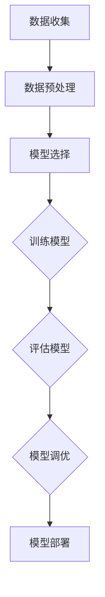
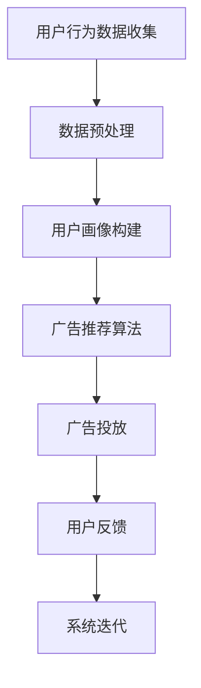

                 

# 机器学习在个性化广告投放中的应用研究

## 关键词：
机器学习、个性化广告、用户行为分析、分类算法、聚类算法、广告投放优化

## 摘要：
本文旨在探讨机器学习在个性化广告投放中的应用，通过深入分析机器学习基础理论、个性化广告投放的基础知识以及各类机器学习算法在广告投放中的具体应用，详细讲解核心算法原理，并提供实际的案例和代码实战。文章最后讨论了广告投放策略的优化方法，为广告行业从业者提供了一整套系统化的解决方案。

## 第一部分：理论基础

### 第1章：机器学习基础

#### 1.1 机器学习概述

**机器学习** 是一门研究如何让计算机通过数据学习并做出决策或预测的技术。它是一种模拟人类学习行为的自动化学习过程，主要分为三种类型：监督学习、无监督学习和强化学习。

- **监督学习**：通过已知输入输出数据训练模型，使得模型能够预测新的输入数据。
- **无监督学习**：没有明确的输出标签，通过数据内在结构或特征发现数据分布、模式或关联。
- **强化学习**：通过与环境的互动，不断调整策略，以实现最大化长期回报。

#### 1.2 数据预处理

**数据预处理** 是机器学习过程中的关键步骤，包括数据清洗和特征工程。

- **数据清洗**：去除重复数据、处理缺失值、纠正错误数据等，提高数据质量。
- **特征工程**：选择和构造有助于模型训练的特征，提升模型的性能。

#### 1.3 评估指标

**评估指标** 用于衡量模型在预测任务上的性能，常见的指标包括：

- **准确率**：预测正确的样本数占总样本数的比例。
- **召回率**：预测正确的正样本数占总正样本数的比例。
- **F1值**：准确率和召回率的调和平均值。

#### 1.4 Mermaid流程图：机器学习流程



### 第2章：个性化广告投放基础

#### 2.1 广告投放概述

**广告投放** 是企业通过展示广告来获取潜在客户和促进销售的过程。个性化广告投放通过分析用户行为，向用户展示与其兴趣相关的广告。

- **广告目的**：提高用户转化率、增加销售额、提升品牌知名度。
- **广告形式**：横幅广告、搜索广告、社交媒体广告等。

#### 2.2 用户行为分析

**用户行为分析** 是个性化广告投放的关键，通过对用户点击、浏览等行为数据进行分析，可以挖掘用户的兴趣和偏好。

- **点击行为分析**：分析用户点击广告的行为模式。
- **浏览行为分析**：分析用户在网站上的浏览路径和停留时间。

#### 2.3 个性化广告系统架构

**个性化广告系统** 通常包括以下组件：

- **数据收集**：从各种渠道收集用户行为数据。
- **用户画像构建**：根据用户行为数据构建用户画像。
- **广告推荐**：根据用户画像推荐个性化的广告。
- **广告投放**：将推荐的广告展示给用户。

#### 2.4 Mermaid流程图：个性化广告投放流程



### 第3章：机器学习算法在广告投放中的应用

#### 3.1 分类算法

**分类算法** 是一种监督学习算法，用于将输入数据分配到预定义的类别中。在个性化广告投放中，分类算法可以用于识别用户的兴趣类别。

- **逻辑回归**：通过逻辑函数将输入数据映射到概率值，常用于用户兴趣分类。
- **决策树**：通过一系列规则进行决策，简单直观，易于解释。
- **随机森林**：多个决策树的集成，提高模型预测的准确性和稳定性。

#### 3.2 聚类算法

**聚类算法** 是一种无监督学习算法，用于将相似的数据点分组。在个性化广告投放中，聚类算法可以用于用户分群。

- **K-means算法**：基于距离度量将数据划分为K个簇。
- **层次聚类**：通过层次结构将数据点逐步聚类。

#### 3.3 评估与调优

**模型评估** 和 **调优** 是保证模型性能的关键步骤。

- **模型评估**：使用交叉验证、ROC曲线等评估模型性能。
- **调优**：通过调整超参数，优化模型性能。

## 第二部分：算法原理详解

### 第4章：核心算法原理讲解

#### 4.1 算法原理与伪代码

**逻辑回归** 和 **K-means算法** 是个性化广告投放中常用的算法，下面分别介绍它们的原理和伪代码。

#### 逻辑回归

**原理**：逻辑回归是一种概率型分类模型，通过线性模型预测输出概率，然后使用阈值进行分类。

$$
\text{logit}(p) = \log\left(\frac{p}{1-p}\right) = \beta_0 + \beta_1 x_1 + \beta_2 x_2 + ... + \beta_n x_n
$$

**伪代码**：

```python
def logistic_regression(X, y, alpha, iterations):
    # 初始化参数
    beta = [0 for _ in range(len(X[0]) + 1)]
    for i in range(iterations):
        # 预测概率
        z = [sum(beta[j] * x[j] for j in range(len(X[0]))) for x in X]
        probabilities = [1 / (1 + math.exp(-z[i])) for i in range(len(z))]
        # 更新参数
        for j in range(len(X[0]) + 1):
            beta[j] -= alpha * (sum((y[i] - probabilities[i]) * x[i][j] for i in range(len(x))) / len(x))
    return beta
```

#### K-means算法

**原理**：K-means算法通过最小化平方误差将数据点划分为K个簇。

$$
\text{cluster}_i = \{ x \in \text{data} | \min_{j=1,...,K} \sum_{x_k \in \text{cluster}_j} (x_k - \text{centroid}_j)^2 \}
$$

**伪代码**：

```python
def k_means(X, K, max_iterations):
    # 随机选择K个初始聚类中心
    centroids = random.sample(X, K)
    for i in range(max_iterations):
        # 分配数据点到最近的聚类中心
        clusters = [[x for x in X if np.linalg.norm(x - centroids[j]) == min([np.linalg.norm(x - c) for c in centroids])]
                     for j in range(K)]
        # 更新聚类中心
        centroids = [[sum(x) / len(x)] for x in clusters]
    return centroids
```

#### 4.2 数学模型与公式

**逻辑回归**：

$$
\text{logit}(p) = \beta_0 + \beta_1 x_1 + \beta_2 x_2 + ... + \beta_n x_n
$$

**K-means**：

$$
\text{cluster}_i = \{ x \in \text{data} | \min_{j=1,...,K} \sum_{x_k \in \text{cluster}_j} (x_k - \text{centroid}_j)^2 \}
$$

## 第三部分：开发实践

### 第5章：数学模型和公式详解

#### 5.1 逻辑回归

**模型解释**：逻辑回归是一种概率型分类模型，通过线性模型预测输出概率。

$$
\text{logit}(p) = \beta_0 + \beta_1 x_1 + \beta_2 x_2 + ... + \beta_n x_n
$$

**梯度下降算法**：通过迭代更新模型参数，最小化损失函数。

$$
\beta_j = \beta_j - \alpha \frac{\partial L}{\partial \beta_j}
$$

其中，$L$ 是损失函数，通常使用交叉熵损失。

#### 5.2 K-means

**算法流程**：K-means算法通过迭代更新聚类中心，将数据点分配到最近的聚类中心。

1. 随机选择K个初始聚类中心。
2. 将数据点分配到最近的聚类中心。
3. 更新聚类中心。
4. 重复步骤2和3，直到聚类中心不再变化或达到最大迭代次数。

**调参技巧**：选择合适的聚类数目K和初始聚类中心。

- **K的选择**：通过肘部法则、 silhouette score等方法确定。
- **初始聚类中心的选择**：随机选择、K-means++方法等。

## 第四部分：实战案例与讲解

### 第6章：案例与实战

#### 6.1 案例分析

本节将通过一个实际广告投放案例，展示如何利用机器学习算法进行个性化广告投放。

- **案例背景**：某电商平台希望通过个性化广告投放提升用户转化率。
- **数据集**：用户行为数据，包括用户点击、浏览、购买等行为。
- **目标**：根据用户行为数据，预测用户的购买意图，并向其推荐相应的商品。

#### 6.2 实战讲解

**1. 数据处理与模型构建**

- **数据清洗**：去除重复数据、处理缺失值。
- **特征工程**：提取用户行为特征，如点击次数、浏览时间、购买历史等。
- **模型选择**：选择逻辑回归模型进行用户购买意图预测。
- **模型训练**：使用训练数据训练逻辑回归模型。
- **模型评估**：使用验证数据评估模型性能。

**2. 模型调优与优化**

- **超参数调优**：通过交叉验证选择最佳超参数。
- **特征选择**：使用特征选择方法筛选重要特征，提升模型性能。
- **模型优化**：通过集成学习、深度学习等方法优化模型。

### 第7章：开发环境搭建

#### 7.1 环境准备

- **Python环境配置**：安装Python和必要的库，如NumPy、Pandas、Scikit-learn等。
- **机器学习框架安装**：安装TensorFlow或PyTorch等机器学习框架。

#### 7.2 数据获取与预处理

- **数据源**：从电商平台获取用户行为数据。
- **数据预处理**：数据清洗、特征提取、数据标准化等。

### 第8章：源代码详细实现

#### 8.1 代码框架

**数据处理代码**：

```python
import pandas as pd
from sklearn.model_selection import train_test_split
from sklearn.preprocessing import StandardScaler

# 加载数据
data = pd.read_csv('data.csv')

# 数据清洗
data = data.drop_duplicates().dropna()

# 特征提取
features = data[['click_count', 'browse_time', 'purchase_history']]

# 数据标准化
scaler = StandardScaler()
features_scaled = scaler.fit_transform(features)

# 划分训练集和测试集
X_train, X_test, y_train, y_test = train_test_split(features_scaled, data['purchase意图'], test_size=0.2, random_state=42)
```

**模型训练代码**：

```python
from sklearn.linear_model import LogisticRegression
from sklearn.metrics import accuracy_score

# 训练模型
model = LogisticRegression()
model.fit(X_train, y_train)

# 预测
predictions = model.predict(X_test)

# 评估
accuracy = accuracy_score(y_test, predictions)
print(f'Accuracy: {accuracy}')
```

#### 8.2 代码解读与分析

**数据处理代码解读**：

- **加载数据**：使用Pandas读取CSV文件。
- **数据清洗**：去除重复数据和缺失值。
- **特征提取**：选择与目标相关的特征。
- **数据标准化**：对特征进行归一化处理，提高模型训练效率。

**模型训练代码解读**：

- **训练模型**：使用Sklearn的LogisticRegression类进行训练。
- **预测**：使用训练好的模型对测试数据进行预测。
- **评估**：计算预测准确率，评估模型性能。

### 第9章：广告投放策略优化

#### 9.1 模型优化方法

**超参数优化**：通过交叉验证选择最佳超参数，提高模型性能。

- **网格搜索**：穷举搜索所有可能的超参数组合。
- **贝叶斯优化**：基于概率模型搜索最佳超参数。

**特征选择**：使用特征选择方法筛选重要特征，减少模型过拟合。

- **递归特征消除**：逐步消除不重要的特征。
- **特征重要性评分**：根据特征对模型贡献大小进行评分。

#### 9.2 实时反馈与调整

**用户行为分析**：实时收集用户行为数据，分析用户兴趣和偏好。

- **点击率**：分析用户的点击行为，预测用户兴趣。
- **浏览路径**：分析用户的浏览路径，挖掘用户需求。

**广告效果评估**：根据用户反馈和广告效果，调整广告投放策略。

- **A/B测试**：比较不同广告策略的效果，选择最佳策略。
- **实时调整**：根据用户行为数据实时调整广告投放。

### 附录

#### 附录 A：常用工具与资源

**A.1 机器学习框架对比**

- **Scikit-learn**：提供丰富的机器学习算法库，易于使用和扩展。
- **TensorFlow**：基于图计算的深度学习框架，适用于大规模数据处理。
- **PyTorch**：基于动态计算图，灵活易用，适用于研究和开发。

**A.2 数据集来源**

- **KEG实验室开放数据集**：提供多种机器学习数据集，适用于研究。
- **其他常用数据集来源**：Kaggle、UCI机器学习库等。

**A.3 学习资源推荐**

- **书籍推荐**：《机器学习》、《深度学习》等经典著作。
- **在线课程推荐**：Coursera、Udacity等平台提供的课程。

## 作者信息

作者：AI天才研究院/AI Genius Institute & 禅与计算机程序设计艺术 /Zen And The Art of Computer Programming

[END]

