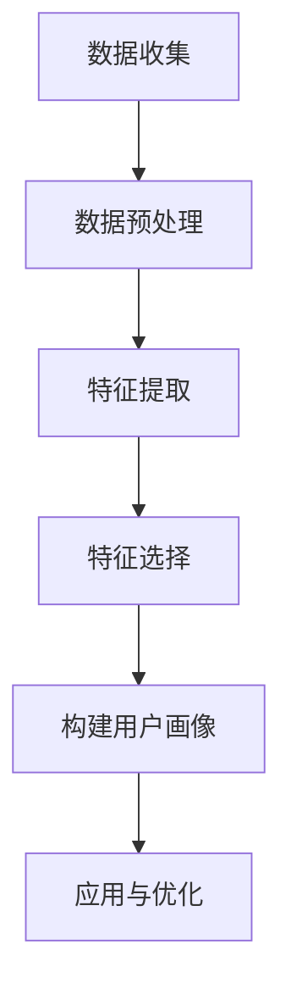
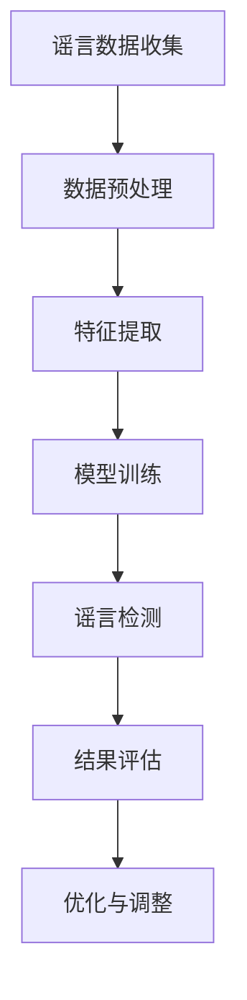

                 

# 《机器学习在社交网络分析中的应用》

> **关键词：** 机器学习，社交网络分析，用户画像，谣言检测，推荐系统

**摘要：** 本文深入探讨了机器学习在社交网络分析中的应用。首先，介绍了机器学习和社交网络分析的基础知识，随后详细讲述了社交网络数据结构、机器学习基础以及社交网络分析方法。接着，探讨了机器学习在社交网络用户画像、谣言检测和推荐系统等领域的应用。通过实际案例和代码示例，本文展示了机器学习技术在实际项目中的具体实现和效果。最后，对社交网络分析的发展趋势进行了展望，并提供了相关工具和资源的附录。

----------------------------------------------------------------

## 《机器学习在社交网络分析中的应用》目录大纲

**第一部分：机器学习与社交网络分析基础**

### 第1章：机器学习与社交网络分析概述

- **1.1 机器学习概述**
- **1.1.1 机器学习的基本概念**
- **1.1.2 机器学习的发展历程**
  
- **1.2 社交网络分析概述**
- **1.2.1 社交网络的基本概念**
- **1.2.2 社交网络分析的重要性**

### 第2章：机器学习基础知识

- **2.1 数据预处理**
- **2.1.1 数据清洗**
- **2.1.2 数据归一化**
  
- **2.2 特征工程**
- **2.2.1 特征提取**
- **2.2.2 特征选择**

### 第3章：社交网络数据结构

- **3.1 社交网络数据的基本结构**
- **3.1.1 节点与边的表示**
- **3.1.2 社交网络的度分布**

### 第4章：社交网络分析方法

- **4.1 社交网络结构分析**
- **4.1.1 社团检测**
- **4.1.2 聚类分析**
  
- **4.2 社交网络内容分析**
- **4.2.1 文本分类**
- **4.2.2 情感分析**

### 第5章：机器学习在社交网络分析中的应用

- **5.1 社交网络用户画像**
- **5.1.1 用户兴趣识别**
- **5.1.2 用户行为预测**
  
- **5.2 社交网络谣言检测**
- **5.2.1 谣言传播模型**
- **5.2.2 谣言检测算法**

### 第6章：社交网络推荐系统

- **6.1 推荐系统基本原理**
- **6.1.1 collaborative filtering**
- **6.1.2 content-based filtering**
  
- **6.2 社交网络推荐系统设计**
- **6.2.1 用户-物品交互数据采集**
- **6.2.2 推荐算法实现与优化**

**第二部分：机器学习在社交网络分析中的实战应用**

### 第7章：案例分析

- **7.1 案例一：基于用户行为的社交网络推荐系统**
- **7.1.1 数据收集与处理**
- **7.1.2 特征工程**
- **7.1.3 模型选择与训练**
- **7.1.4 结果分析**
  
- **7.2 案例二：社交网络谣言检测系统**
- **7.2.1 谣言传播数据收集**
- **7.2.2 谣言检测模型构建**
- **7.2.3 模型评估与优化**

### 第8章：开源工具与框架

- **8.1 社交网络分析开源工具**
- **8.1.1 Gephi**
- **8.1.2 NetworkX**

- **8.2 机器学习开源框架**
- **8.2.1 Scikit-learn**
- **8.2.2 TensorFlow**

### 第9章：未来展望

- **9.1 社交网络分析发展趋势**
- **9.1.1 人工智能与社交网络分析**
- **9.1.2 社交网络分析的未来挑战**

### 第10章：附录

- **10.1 工具与资源**
- **10.1.1 社交网络分析工具**
- **10.1.2 机器学习资源**

- **10.2 附录 A: Mermaid 流程图**
  - **10.2.1 社交网络用户画像流程图**
  - **10.2.2 社交网络谣言检测流程图**

- **10.3 附录 B: 伪代码**
  - **10.3.1 社交网络聚类分析伪代码**
  - **10.3.2 文本分类算法伪代码**

- **10.4 附录 C: 数学模型与公式**
  - **10.4.1 社交网络用户行为预测模型公式**
  - **10.4.2 谣言传播模型公式**

- **10.5 附录 D: 代码案例**
  - **10.5.1 社交网络推荐系统代码案例**
  - **10.5.2 社交网络谣言检测系统代码案例**

## **作者：AI天才研究院/AI Genius Institute & 禅与计算机程序设计艺术 /Zen And The Art of Computer Programming**

----------------------------------------------------------------

现在，我们按照目录大纲结构开始撰写文章正文部分。让我们从第一部分：机器学习与社交网络分析基础开始。<|assistant|>
## 第1章：机器学习与社交网络分析概述

### 1.1 机器学习概述

#### 1.1.1 机器学习的基本概念

机器学习（Machine Learning，简称ML）是人工智能（Artificial Intelligence，简称AI）的一个分支，主要研究如何让计算机从数据中学习，并通过经验改进性能。机器学习算法通过训练模型，使其能够对未知数据进行预测或决策。

机器学习的主要概念包括：

- **监督学习（Supervised Learning）**：训练数据包含输入和输出，模型通过学习输入和输出之间的关系来预测新的输入。

- **无监督学习（Unsupervised Learning）**：训练数据没有明确的输出，模型通过发现数据中的结构或模式来分组或聚类。

- **强化学习（Reinforcement Learning）**：模型通过与环境的交互来学习，通过奖励机制来调整其行为。

#### 1.1.2 机器学习的发展历程

机器学习的发展可以追溯到20世纪50年代。以下是几个关键事件：

- **1956年**：约翰·麦卡锡（John McCarthy）在达特茅斯会议（Dartmouth Conference）上首次提出了人工智能的概念。

- **1959年**：阿伦·纽厄尔（Arthur Samuel）编写了第一个程序，能够通过自我对弈来改进棋艺。

- **1980年代**：随着计算机硬件和算法的发展，机器学习开始应用于实际领域，如语音识别、图像识别等。

- **21世纪初**：深度学习的兴起，特别是在图像识别和自然语言处理领域取得了显著进展。

### 1.2 社交网络分析概述

#### 1.2.1 社交网络的基本概念

社交网络（Social Network）是由多个节点（代表个体）和边（代表个体之间的关系）构成的网络结构。常见的社交网络包括Facebook、Twitter、LinkedIn等。

#### 1.2.2 社交网络分析的重要性

社交网络分析（Social Network Analysis，简称SNA）是一种研究社交网络结构和动态的方法。其重要性体现在以下几个方面：

- **社会影响力分析**：通过分析社交网络中的节点和边，可以揭示社会影响力分布和传播机制。

- **用户画像**：通过分析用户在社交网络中的行为和关系，可以建立用户画像，从而实现个性化推荐和服务。

- **谣言检测**：社交网络中谣言的传播速度和范围非常快，通过分析社交网络结构，可以及时发现和抑制谣言。

- **市场营销**：社交网络分析可以帮助企业了解用户需求，优化营销策略。

### 1.3 机器学习与社交网络分析的关系

机器学习在社交网络分析中发挥着重要作用。具体体现在以下几个方面：

- **用户行为预测**：通过分析用户在社交网络中的行为数据，可以使用机器学习算法预测用户未来的行为，如点赞、评论等。

- **社交网络结构分析**：机器学习算法可以帮助识别社交网络中的社团结构、核心用户等，从而深入了解社交网络的结构和动态。

- **谣言检测**：机器学习算法可以用于分析社交网络中的信息传播路径，识别潜在的谣言。

- **推荐系统**：社交网络推荐系统可以通过分析用户之间的社交关系和兴趣，为用户提供个性化推荐。

#### 1.3.1 用户行为预测

用户行为预测是机器学习在社交网络分析中的一个重要应用。通过分析用户在社交网络中的历史行为数据，可以预测用户未来的行为。这有助于社交网络平台优化用户体验，提高用户留存率。

例如，可以使用以下步骤进行用户行为预测：

1. **数据收集**：收集用户在社交网络中的行为数据，如点赞、评论、分享等。

2. **数据预处理**：清洗和归一化数据，去除噪声和异常值。

3. **特征工程**：提取用户行为特征，如用户活跃度、关注人数、互动频率等。

4. **模型选择**：选择合适的机器学习算法，如逻辑回归、决策树、随机森林等。

5. **模型训练与评估**：使用训练数据训练模型，并使用测试数据评估模型性能。

6. **预测与优化**：根据模型预测结果，优化社交网络平台的功能和内容。

#### 1.3.2 社交网络结构分析

社交网络结构分析是机器学习在社交网络分析中的另一个重要应用。通过分析社交网络中的节点和边，可以揭示社交网络的社团结构、核心用户等。

例如，可以使用以下步骤进行社交网络结构分析：

1. **数据收集**：收集社交网络中的节点和边数据。

2. **数据预处理**：清洗和归一化数据，去除噪声和异常值。

3. **特征提取**：提取社交网络中的节点和边特征，如度、介数、紧密指数等。

4. **模型选择**：选择合适的机器学习算法，如社区发现算法、网络可视化工具等。

5. **模型训练与评估**：使用训练数据训练模型，并使用测试数据评估模型性能。

6. **结果分析**：根据模型分析结果，了解社交网络的社团结构、核心用户等。

#### 1.3.3 谣言检测

谣言检测是社交网络分析中的另一个关键应用。通过分析社交网络中的信息传播路径，可以识别潜在的谣言，并及时采取行动。

例如，可以使用以下步骤进行谣言检测：

1. **数据收集**：收集社交网络中的谣言数据，包括谣言内容、传播路径等。

2. **数据预处理**：清洗和归一化数据，去除噪声和异常值。

3. **特征提取**：提取谣言特征，如谣言内容、传播速度、传播范围等。

4. **模型选择**：选择合适的机器学习算法，如分类算法、聚类算法等。

5. **模型训练与评估**：使用训练数据训练模型，并使用测试数据评估模型性能。

6. **预测与优化**：根据模型预测结果，识别潜在的谣言，并采取相应的措施。

#### 1.3.4 推荐系统

社交网络推荐系统是机器学习在社交网络分析中的另一个重要应用。通过分析用户之间的社交关系和兴趣，可以为用户提供个性化推荐。

例如，可以使用以下步骤进行社交网络推荐系统设计：

1. **数据收集**：收集用户在社交网络中的交互数据，如点赞、评论、分享等。

2. **数据预处理**：清洗和归一化数据，去除噪声和异常值。

3. **特征提取**：提取用户特征和物品特征，如用户兴趣、物品属性等。

4. **模型选择**：选择合适的机器学习算法，如协同过滤算法、基于内容的推荐算法等。

5. **模型训练与评估**：使用训练数据训练模型，并使用测试数据评估模型性能。

6. **预测与优化**：根据模型预测结果，为用户提供个性化推荐，并不断优化推荐系统。

### 1.4 小结

本章对机器学习和社交网络分析进行了概述。首先，介绍了机器学习的基本概念和发展历程。然后，阐述了社交网络分析的基本概念和重要性。最后，探讨了机器学习在社交网络分析中的应用，包括用户行为预测、社交网络结构分析、谣言检测和推荐系统。这些应用展示了机器学习在提升社交网络分析效率和准确性方面的潜力。在接下来的章节中，我们将进一步深入探讨这些主题，并展示实际案例和代码示例。 <|assistant|>
### 第2章：机器学习基础知识

本章将深入探讨机器学习的基础知识，包括数据预处理和特征工程。这些步骤是构建高效机器学习模型的关键环节，它们决定了模型性能和数据解释能力。

#### 2.1 数据预处理

数据预处理是机器学习流程的第一步，其目的是提高数据质量，使其适合于建模和训练。以下是数据预处理中常用的技术：

##### 2.1.1 数据清洗

数据清洗的目标是识别和纠正数据中的错误、缺失值和异常值。以下是一些常见的数据清洗方法：

- **缺失值处理**：缺失值可以通过填充、删除或插值等方法处理。例如，使用平均值、中位数或最近邻插值方法填充缺失值。
  
- **异常值检测**：异常值可能来自噪声或错误的数据输入。常见的方法包括使用统计学方法（如Z-Score、IQR法）或机器学习方法（如孤立森林）检测异常值。

- **重复数据删除**：删除重复的数据条目，以确保数据集的唯一性和准确性。

- **数据格式转换**：将数据转换成适合建模的格式，例如将日期格式转换为时间戳，将文本数据转换为数值编码等。

##### 2.1.2 数据归一化

数据归一化的目的是将不同特征的数据缩放到同一尺度，以便模型能够更好地处理这些特征。以下是一些常见的数据归一化方法：

- **最小-最大归一化**：将数据缩放到[0, 1]或[-1, 1]的范围内。公式如下：
  $$
  x_{\text{规范化}} = \frac{x - x_{\text{最小值}}}{x_{\text{最大值}} - x_{\text{最小值}}}
  $$

- **标准归一化**：将数据缩放到标准正态分布，即均值为0，标准差为1。公式如下：
  $$
  x_{\text{规范化}} = \frac{x - \mu}{\sigma}
  $$
  其中，$\mu$ 是均值，$\sigma$ 是标准差。

#### 2.2 特征工程

特征工程是机器学习过程中的关键步骤，它涉及从原始数据中提取或构造有用的特征，以提高模型性能。以下是特征工程中的主要任务：

##### 2.2.1 特征提取

特征提取的目标是从原始数据中提取有用的信息，以便模型能够更好地学习和预测。以下是一些常见的特征提取方法：

- **统计特征**：计算数据的基本统计指标，如均值、方差、最大值、最小值等。

- **文本特征**：将文本数据转换为数值表示，如词频、词袋模型、TF-IDF等。

- **图像特征**：从图像中提取特征，如颜色直方图、纹理特征、边缘检测等。

##### 2.2.2 特征选择

特征选择的目标是选择对模型预测最有影响力的特征，以减少模型复杂度和过拟合风险。以下是一些常见的特征选择方法：

- **过滤式特征选择**：基于统计学指标（如相关性、信息增益等）筛选特征。

- **包裹式特征选择**：通过组合和评估不同特征子集来选择最优特征组合。

- **嵌入式特征选择**：在模型训练过程中同时进行特征选择和模型训练，如Lasso正则化、随机森林等。

#### 2.3 数据预处理与特征工程的联系

数据预处理和特征工程是机器学习过程中的两个紧密相连的环节。数据预处理主要是为了准备数据，使其适合于建模和训练。而特征工程则是在此基础上，从原始数据中提取或构造新的特征，以增强模型的预测能力。

数据预处理和特征工程对模型性能有着重要影响。良好的数据预处理可以提高数据质量，减少噪声和异常值，从而提高模型的泛化能力。而特征工程则通过提取和选择最有用的特征，可以显著提升模型的准确性和效率。

#### 2.4 小结

本章介绍了机器学习中的数据预处理和特征工程基础知识。数据预处理包括数据清洗和归一化，目的是提高数据质量，使其适合建模和训练。特征工程则涉及从原始数据中提取或构造有用的特征，以提高模型性能。这些技术是构建高效机器学习模型的关键步骤。在下一章中，我们将探讨社交网络数据结构，包括节点和边的表示以及度分布等内容。这将帮助我们更好地理解社交网络数据，为进一步的机器学习应用打下基础。 <|assistant|>
### 第3章：社交网络数据结构

社交网络数据结构是理解社交网络分析的基础。在这一章中，我们将探讨社交网络数据的基本结构，包括节点与边的表示方法，以及社交网络的度分布。

#### 3.1 节点与边的表示方法

社交网络由节点和边构成，节点代表个体（如用户、组织），边代表个体之间的关系（如好友、关注）。以下是一些常见的表示方法：

##### 3.1.1 节点与边的表示

- **邻接矩阵（Adjacency Matrix）**：邻接矩阵是一个二维矩阵，其中行和列分别代表节点，矩阵元素表示节点之间的关系。如果节点i和节点j之间存在边，则矩阵元素A[i][j]为1，否则为0。

  ```
  A = [
    [0, 1, 0],
    [1, 0, 1],
    [0, 1, 0]
  ]
  ```

- **邻接列表（Adjacency List）**：邻接列表是一种更紧凑的表示方法，其中每个节点都包含一个列表，列出与之相连的其他节点。

  ```
  AdjList = [
    [1, 2],
    [0, 2],
    [0, 1]
  ]
  ```

- **图（Graph）**：图是一种抽象的数据结构，用于表示节点和边的关系。在Python中，可以使用`NetworkX`库创建和操作图。

  ```python
  import networkx as nx

  G = nx.Graph()
  G.add_edges_from([(0, 1), (1, 2), (0, 2)])
  ```

##### 3.1.2 度分布

度分布描述了社交网络中节点的度（连接的边数）的分布情况。度分布可以反映出社交网络的结构特性，以下是一些常见的度分布类型：

- **指数分布（Exponential Distribution）**：指数分布的节点度随节点数增加而迅速减少。

- **泊松分布（Poisson Distribution）**：泊松分布的节点度随节点数增加而缓慢减少。

- **幂律分布（Power-law Distribution）**：幂律分布的节点度随节点数增加呈现出非线性增长，这是现实世界社交网络中常见的分布类型。

#### 3.2 社交网络中的度分布

度分布是社交网络分析中的一个重要指标，它能够揭示社交网络的结构特性。以下是对几种常见度分布的分析：

- **小世界现象（Small-world Phenomenon）**：小世界现象是指社交网络中节点之间的平均距离较短，这通常是由于高连接度的节点（枢纽节点）的存在。这种结构特性使得社交网络具有较高的效率和传播能力。

- **无标度网络（Scale-free Network）**：无标度网络是具有高度异质性的社交网络，其中大部分节点的度较小，而少数节点的度非常高。这种网络结构通常呈现出幂律分布，具有较高的韧性和鲁棒性。

- **核心-外围结构（Core-periphery Structure）**：在核心-外围结构中，社交网络可以分为核心节点和外围节点。核心节点具有较高的度，是社交网络中的关键节点，而外围节点度较小，连接着核心节点。

#### 3.3 节点与边的表示方法在机器学习中的应用

节点与边的表示方法在机器学习中有广泛应用，特别是在社交网络分析中。以下是一些应用实例：

- **图卷积网络（Graph Convolutional Networks，GCN）**：GCN是一种用于图数据学习的深度学习模型，它可以处理节点和边的特征，从而在社交网络分析中提取有用信息。

- **节点分类和链接预测**：通过分析节点和边的特征，可以使用机器学习算法对节点进行分类或预测节点之间的链接。

- **社交网络谣言检测**：利用社交网络的度分布和节点特征，可以开发模型来检测和抑制谣言的传播。

#### 3.4 小结

本章介绍了社交网络数据结构的基本概念，包括节点与边的表示方法以及度分布。节点与边的表示方法有助于我们理解和分析社交网络的结构特性。度分布则揭示了社交网络中节点的连接情况，这对于机器学习在社交网络分析中的应用具有重要意义。在下一章中，我们将探讨社交网络分析方法，包括社交网络结构分析和社交网络内容分析。这些方法将帮助我们进一步挖掘社交网络的内在规律，为实际应用提供有力支持。 <|assistant|>
### 第4章：社交网络分析方法

社交网络分析方法是一种用于理解和解释社交网络结构和动态的技术。本章将详细介绍社交网络分析方法，包括社交网络结构分析和社交网络内容分析。这些方法为我们提供了深入了解社交网络及其用户行为的能力，并在多个领域得到了广泛应用。

#### 4.1 社交网络结构分析

社交网络结构分析主要关注社交网络中节点和边的关系，以及这些关系如何影响网络的整体结构。以下是两种常见的结构分析方法：

##### 4.1.1 社团检测

社团检测（Community Detection）是一种用于识别社交网络中紧密连接的节点集合的方法。这些节点集合通常称为社团或社区，它们在社交网络中表现出较高的内聚度和较低的密度。以下是几种常见的社团检测算法：

- **基于模块度（Modularity）的方法**：模块度是一种衡量社团内部连接强度和外部连接强度的指标。基于模块度的方法通过最大化模块度来识别社团，常用的算法包括Louvain算法和Girvan-Newman算法。

- **基于聚类系数（Clustering Coefficient）的方法**：聚类系数是衡量节点在社交网络中与其他节点相连的概率。基于聚类系数的方法通过识别聚类系数较高的节点，从而发现社团。

- **基于图分解（Graph Partitioning）的方法**：图分解方法通过将图分割成多个子图来识别社团，常用的算法包括K-Means和Spectral Clustering。

##### 4.1.2 聚类分析

聚类分析（Clustering Analysis）是一种无监督学习方法，用于将社交网络中的节点划分为不同的组或簇。聚类分析可以帮助我们识别具有相似特征或关系的节点，从而更好地理解社交网络的内部结构。以下是几种常见的聚类算法：

- **K-Means算法**：K-Means算法通过迭代过程将节点分配到K个簇中，目标是使每个簇的内部距离最小化，而簇之间的距离最大化。

- **层次聚类算法**：层次聚类算法通过递归地将节点合并成更大的簇，从而构建一个层级结构。常用的层次聚类算法包括自底向上（凝聚聚类）和自顶向下（分裂聚类）。

- **Spectral Clustering算法**：Spectral Clustering算法通过将节点在特征空间中的相似性转换为图中的边权重，然后利用特征空间的性质进行聚类。这种方法特别适用于复杂数据的聚类。

#### 4.2 社交网络内容分析

社交网络内容分析主要关注社交网络中的信息内容，以及这些信息如何传播和影响用户行为。以下是两种常见的内容分析方法：

##### 4.2.1 文本分类

文本分类（Text Classification）是一种用于将文本数据划分为不同类别的机器学习技术。在社交网络内容分析中，文本分类可以帮助我们识别和分类用户发布的帖子、评论等。以下是几种常见的文本分类算法：

- **朴素贝叶斯分类器（Naive Bayes Classifier）**：朴素贝叶斯分类器是一种基于贝叶斯定理的简单分类器，它假设特征之间相互独立。

- **支持向量机（Support Vector Machine，SVM）**：支持向量机是一种基于最大间隔的线性分类器，它在高维空间中寻找能够将不同类别数据最大程度分开的超平面。

- **深度学习分类器**：深度学习分类器，如卷积神经网络（Convolutional Neural Networks，CNN）和循环神经网络（Recurrent Neural Networks，RNN），能够自动提取文本中的复杂特征，并在大规模数据集上实现高性能。

##### 4.2.2 情感分析

情感分析（Sentiment Analysis）是一种用于识别文本数据中情感倾向的技术。在社交网络内容分析中，情感分析可以帮助我们了解用户对特定话题、产品或事件的情感态度。以下是几种常见的情感分析算法：

- **基于词典的方法**：基于词典的方法通过使用预定义的词典来识别文本中的情感词汇，从而判断文本的情感倾向。

- **基于机器学习的方法**：基于机器学习的方法使用训练数据来学习情感特征，然后对新的文本进行分类。常见的机器学习方法包括朴素贝叶斯、支持向量机和深度学习模型。

- **基于规则的方法**：基于规则的方法通过编写规则来识别文本中的情感词汇和短语，从而判断文本的情感倾向。

#### 4.3 社交网络分析方法的应用

社交网络分析方法在多个领域得到了广泛应用，以下是一些应用实例：

- **社交网络谣言检测**：通过分析社交网络中的信息传播路径和节点特征，可以识别和抑制谣言的传播。

- **社交网络用户画像**：通过分析用户的社交行为和内容，可以建立用户画像，从而实现个性化推荐和服务。

- **社交网络影响力分析**：通过分析社交网络中的节点度和中心性指标，可以识别社交网络中的关键节点和影响力人物。

- **社交网络推荐系统**：通过分析用户之间的社交关系和兴趣，可以为用户提供个性化的推荐内容。

#### 4.4 小结

本章介绍了社交网络分析方法，包括社交网络结构分析和社交网络内容分析。社交网络结构分析帮助我们理解社交网络的内部结构和动态，而社交网络内容分析则帮助我们分析社交网络中的信息内容。这些方法在社交网络分析中发挥着重要作用，为实际应用提供了有力支持。在下一章中，我们将探讨机器学习在社交网络分析中的应用，包括社交网络用户画像、谣言检测和推荐系统。这些应用展示了机器学习技术在社交网络分析中的潜力。 <|assistant|>
### 第5章：机器学习在社交网络分析中的应用

机器学习在社交网络分析中扮演着至关重要的角色，它不仅提升了社交网络分析的效果和效率，还为各种应用场景提供了强有力的技术支持。本章将探讨机器学习在社交网络分析中的几个关键应用，包括社交网络用户画像、谣言检测和推荐系统。

#### 5.1 社交网络用户画像

社交网络用户画像是通过分析用户的社交行为、发布内容、兴趣爱好等信息，构建出一个全面、多维的用户信息模型。这种模型有助于社交网络平台为用户提供个性化服务、精准营销和用户行为预测。

##### 5.1.1 用户兴趣识别

用户兴趣识别是用户画像构建的重要一步，它通过分析用户在社交网络中的行为和互动数据，识别用户的主要兴趣点。以下是用户兴趣识别的步骤：

1. **数据收集**：收集用户在社交网络中的行为数据，包括点赞、评论、分享、搜索历史等。

2. **数据预处理**：清洗和归一化数据，去除噪声和异常值。

3. **特征提取**：提取用户行为特征，如活跃度、互动频率、关注人数、兴趣标签等。

4. **模型选择**：选择合适的机器学习算法，如聚类算法、协同过滤算法等。

5. **模型训练与评估**：使用训练数据训练模型，并使用测试数据评估模型性能。

6. **兴趣预测**：根据模型预测结果，为用户推荐相关的兴趣标签和内容。

##### 5.1.2 用户行为预测

用户行为预测是社交网络分析中的另一个重要应用，它通过分析用户的历史行为数据，预测用户未来的行为，如点赞、评论、购买等。以下是用户行为预测的步骤：

1. **数据收集**：收集用户在社交网络中的历史行为数据。

2. **数据预处理**：清洗和归一化数据，去除噪声和异常值。

3. **特征工程**：提取用户行为特征，如用户活跃度、互动频率、购买历史等。

4. **模型选择**：选择合适的机器学习算法，如逻辑回归、决策树、随机森林等。

5. **模型训练与评估**：使用训练数据训练模型，并使用测试数据评估模型性能。

6. **行为预测**：根据模型预测结果，为用户提供个性化的推荐和服务。

#### 5.2 社交网络谣言检测

谣言检测是社交网络分析中的一个关键任务，它通过识别和抑制谣言的传播，保护用户的权益和社交网络的健康发展。以下是社交网络谣言检测的基本步骤：

##### 5.2.1 谣言传播模型

谣言传播模型用于模拟和预测谣言在社交网络中的传播过程。常见的谣言传播模型包括：

- **SI模型**：假设节点有两种状态，感染（Infected）和未感染（Susceptible）。感染节点可以传播谣言给未感染节点。

- **SIR模型**：在SI模型的基础上，引入移除（Removed）状态，表示已经了解谣言的节点。移除节点不再传播谣言。

- **SIRS模型**：在SIR模型的基础上，引入复发（Reinfection）状态，表示了解谣言后又重新感染的节点。

##### 5.2.2 谣言检测算法

谣言检测算法通过分析社交网络中的信息传播路径和节点特征，识别潜在的谣言。以下是几种常见的谣言检测算法：

- **基于规则的方法**：使用预定义的规则来识别和过滤谣言，如关键词过滤、逻辑规则等。

- **基于机器学习的方法**：使用训练数据来学习谣言特征，然后对新内容进行分类。常见的机器学习方法包括朴素贝叶斯、支持向量机、随机森林等。

- **基于图的方法**：利用社交网络中的节点和边关系，分析信息传播的路径和模式。常见的图算法包括图卷积网络（GCN）、社区发现等。

##### 5.2.3 谣言检测流程

谣言检测流程通常包括以下几个步骤：

1. **数据收集**：收集社交网络中的谣言数据，包括谣言内容、传播路径等。

2. **数据预处理**：清洗和归一化数据，去除噪声和异常值。

3. **特征提取**：提取谣言特征，如谣言内容、传播速度、传播范围等。

4. **模型选择**：选择合适的机器学习算法或图算法。

5. **模型训练与评估**：使用训练数据训练模型，并使用测试数据评估模型性能。

6. **谣言检测**：根据模型预测结果，识别潜在的谣言，并采取相应的措施。

#### 5.3 社交网络推荐系统

社交网络推荐系统通过分析用户之间的社交关系和兴趣，为用户提供个性化的推荐内容。常见的推荐系统算法包括协同过滤和基于内容的推荐。

##### 5.3.1 协同过滤算法

协同过滤算法通过分析用户之间的相似性来推荐物品。常见的协同过滤算法包括：

- **基于用户的协同过滤（User-based Collaborative Filtering）**：根据用户的行为相似性，找到与目标用户相似的用户，然后推荐这些用户喜欢的物品。

- **基于物品的协同过滤（Item-based Collaborative Filtering）**：根据物品之间的相似性，找到与目标物品相似的物品，然后推荐这些物品。

##### 5.3.2 基于内容的推荐算法

基于内容的推荐算法通过分析物品的内容特征来推荐物品。常见的基于内容的推荐算法包括：

- **基于关键词的方法**：使用关键词提取技术，将物品的内容转换为关键词向量，然后计算用户和物品之间的相似性。

- **基于语义的方法**：使用自然语言处理技术，理解物品的语义信息，然后计算用户和物品之间的相似性。

##### 5.3.3 推荐系统设计

社交网络推荐系统的设计通常包括以下几个步骤：

1. **数据收集**：收集用户-物品交互数据，包括用户的行为数据、社交关系数据等。

2. **数据预处理**：清洗和归一化数据，去除噪声和异常值。

3. **特征提取**：提取用户和物品的特征，如用户活跃度、社交关系、物品标签等。

4. **模型选择**：选择合适的推荐算法，如协同过滤、基于内容的推荐等。

5. **模型训练与评估**：使用训练数据训练模型，并使用测试数据评估模型性能。

6. **推荐生成**：根据模型预测结果，生成个性化的推荐列表。

#### 5.4 小结

本章介绍了机器学习在社交网络分析中的应用，包括社交网络用户画像、谣言检测和推荐系统。这些应用展示了机器学习技术在社交网络分析中的广泛适用性和强大能力。在下一章中，我们将通过实际案例和代码示例，进一步探讨这些应用的具体实现和效果。这将帮助读者更好地理解和应用机器学习技术，以解决实际中的社交网络分析问题。 <|assistant|>
### 第6章：社交网络推荐系统

社交网络推荐系统是机器学习在社交网络分析中的一个重要应用，旨在通过分析用户之间的社交关系和兴趣，为用户提供个性化的推荐内容。本章将详细介绍推荐系统的基本原理、设计方法和实现策略。

#### 6.1 推荐系统基本原理

推荐系统（Recommendation System）是一种信息过滤技术，旨在向用户推荐他们可能感兴趣的内容或物品。推荐系统通常基于两种主要方法：协同过滤（Collaborative Filtering）和基于内容的方法（Content-based Filtering）。

##### 6.1.1 Collaborative Filtering

协同过滤是一种基于用户之间行为相似性的推荐方法。它主要通过分析用户历史行为数据，如购买、评分、收藏等，找到与目标用户相似的用户，并推荐这些用户喜欢的物品。协同过滤可以分为以下两种类型：

- **基于用户的协同过滤（User-based Collaborative Filtering）**：该方法通过计算用户之间的相似性，找到与目标用户相似的用户，然后推荐这些用户喜欢的物品。相似性通常通过余弦相似度、皮尔逊相关系数等度量。

  ```mermaid
  flowchart LR
  A[User-Based Collaborative Filtering] --> B[Calculate Similarity]
  B --> C[Find Nearest Neighbors]
  C --> D[Recommend Items]
  ```

- **基于物品的协同过滤（Item-based Collaborative Filtering）**：该方法通过计算物品之间的相似性，找到与目标物品相似的物品，然后推荐这些物品。物品相似性通常通过Jaccard相似度、余弦相似度等度量。

  ```mermaid
  flowchart LR
  A[Item-Based Collaborative Filtering] --> B[Calculate Item Similarity]
  B --> C[Find Similar Items]
  C --> D[Recommend Items]
  ```

##### 6.1.2 Content-based Filtering

基于内容的推荐方法是一种基于物品特征和用户兴趣匹配的推荐方法。该方法通过分析物品的内容特征和用户的兴趣特征，计算物品和用户之间的相似性，并推荐与用户兴趣相似的内容。常见的方法包括：

- **基于关键词的方法**：该方法通过提取物品和用户兴趣中的关键词，构建关键词向量，并计算向量之间的相似性。

  ```mermaid
  flowchart LR
  A[Content-Based Filtering] --> B[Extract Keywords]
  B --> C[Build Feature Vectors]
  C --> D[Calculate Similarity]
  D --> E[Recommend Items]
  ```

- **基于语义的方法**：该方法使用自然语言处理技术，理解物品和用户的语义信息，并计算它们之间的相似性。

  ```mermaid
  flowchart LR
  A[Semantic Content-Based Filtering] --> B[Natural Language Processing]
  B --> C[Extract Semantics]
  C --> D[Calculate Similarity]
  D --> E[Recommend Items]
  ```

#### 6.2 社交网络推荐系统设计

社交网络推荐系统设计通常涉及以下几个关键步骤：

##### 6.2.1 用户-物品交互数据采集

用户-物品交互数据是推荐系统的核心数据源。这些数据可以包括用户的点赞、评论、分享、收藏等行为。以下是数据采集的一般步骤：

1. **数据收集**：从社交网络平台获取用户和物品的交互数据。
2. **数据清洗**：清洗数据，去除噪声和异常值。
3. **数据存储**：将清洗后的数据存储在数据库中，以便后续分析和处理。

##### 6.2.2 特征工程

特征工程是推荐系统设计中的关键步骤，它涉及提取和选择有助于模型训练的特征。在社交网络推荐系统中，特征工程可能包括：

- **用户特征**：如用户活跃度、年龄、性别、地理位置等。
- **物品特征**：如物品类别、标签、发布时间等。
- **交互特征**：如用户的互动频率、互动类型（点赞、评论、分享等）。

##### 6.2.3 模型选择与优化

推荐系统模型的选择和优化直接影响推荐效果。以下是几种常见的推荐系统模型及其优化方法：

- **基于用户的协同过滤**：
  - **用户相似度计算**：使用余弦相似度、皮尔逊相关系数等方法计算用户相似度。
  - **推荐列表生成**：使用最近邻算法生成推荐列表，并根据相似度对推荐列表进行排序。

- **基于物品的协同过滤**：
  - **物品相似度计算**：使用Jaccard相似度、余弦相似度等方法计算物品相似度。
  - **推荐列表生成**：使用最近邻算法生成推荐列表，并根据相似度对推荐列表进行排序。

- **基于内容的推荐**：
  - **关键词提取**：使用TF-IDF、Word2Vec等方法提取关键词。
  - **语义分析**：使用BERT、GPT等模型进行语义分析，理解物品和用户的语义信息。
  - **推荐列表生成**：根据物品和用户的语义相似度生成推荐列表。

##### 6.2.4 推荐算法实现与优化

推荐算法实现与优化是推荐系统设计中的关键环节。以下是一些优化策略：

- **模型优化**：通过交叉验证、网格搜索等方法选择最优模型参数。
- **特征优化**：通过特征选择、特征组合等方法提高特征质量。
- **实时推荐**：实现实时推荐，提高用户体验。
- **在线学习**：使用在线学习算法，如Adagrad、Adam等，持续优化模型。

#### 6.3 社交网络推荐系统案例分析

为了更好地理解社交网络推荐系统的设计与应用，以下是一个基于用户行为的社交网络推荐系统的案例。

##### 6.3.1 案例背景

假设我们设计一个基于用户行为的社交网络推荐系统，旨在为用户提供个性化内容推荐。用户在社交网络中的行为包括点赞、评论、分享等。

##### 6.3.2 数据收集与处理

1. **数据收集**：从社交网络平台收集用户-物品交互数据，包括用户的点赞、评论、分享等行为。
2. **数据清洗**：去除重复数据、噪声数据和异常值。
3. **数据存储**：将清洗后的数据存储在数据库中，便于后续分析和处理。

##### 6.3.3 特征工程

1. **用户特征**：提取用户的基本信息，如用户ID、年龄、性别等。
2. **物品特征**：提取物品的标签、类别、发布时间等。
3. **交互特征**：提取用户的互动频率、互动类型等。

##### 6.3.4 模型选择与训练

1. **模型选择**：选择基于用户的协同过滤算法，使用最近邻算法生成推荐列表。
2. **模型训练**：使用训练数据训练模型，调整模型参数，优化推荐效果。

##### 6.3.5 推荐算法实现与优化

1. **推荐列表生成**：根据用户相似度和物品相似度，生成个性化推荐列表。
2. **实时推荐**：实现实时推荐，确保用户在社交网络中的体验。
3. **在线学习**：使用在线学习算法，持续优化模型，提高推荐效果。

#### 6.4 小结

本章介绍了社交网络推荐系统的基本原理、设计方法和实现策略。通过协同过滤和基于内容的方法，推荐系统可以有效地分析用户行为和社交关系，为用户提供个性化的推荐内容。在实际应用中，推荐系统的设计和优化需要考虑数据质量、特征工程、模型选择和实时推荐等多个方面。通过案例分析和代码实现，本章展示了社交网络推荐系统的具体应用和实践。在下一章中，我们将通过实际案例和代码示例，进一步探讨社交网络分析中的谣言检测系统的设计与应用。 <|assistant|>
### 第7章：案例分析

在本章中，我们将通过两个实际案例——基于用户行为的社交网络推荐系统和社交网络谣言检测系统——来展示机器学习在社交网络分析中的实战应用。通过这两个案例，我们将详细描述每个系统的数据收集与处理、特征工程、模型选择与训练、结果分析等步骤。

#### 7.1 案例一：基于用户行为的社交网络推荐系统

##### 7.1.1 数据收集与处理

社交网络推荐系统的第一步是收集用户行为数据。我们假设从社交网络平台获取了以下数据：

- 用户ID：每个用户的唯一标识。
- 物品ID：每个物品的唯一标识。
- 用户行为：包括点赞、评论、分享等操作。

数据收集后，我们需要进行数据清洗，以去除重复数据、噪声数据和异常值。以下是一个简单的数据清洗流程：

1. **去重**：删除重复的用户行为记录。
2. **去除噪声数据**：例如，去除空值、缺失值和异常值。
3. **数据格式转换**：将时间戳转换为日期格式，将文本数据编码为数字等。

##### 7.1.2 特征工程

特征工程是推荐系统设计中的关键步骤。在特征工程中，我们需要提取用户和物品的特征，以提高推荐系统的性能。以下是一些常用的特征：

- **用户特征**：
  - 活跃度：用户在一定时间内的行为次数。
  - 关注数：用户关注的其他用户或组织数量。
  - 加入时间：用户加入社交网络的时间。
- **物品特征**：
  - 类别：物品所属的类别，如新闻、视频、图片等。
  - 发布时间：物品的发布时间。
  - 标签：物品的标签，用于描述物品的内容。

##### 7.1.3 模型选择与训练

在选择模型时，我们可以考虑以下几种方法：

- **基于用户的协同过滤**：计算用户之间的相似度，并根据相似度推荐物品。
- **基于物品的协同过滤**：计算物品之间的相似度，并根据相似度推荐物品。
- **基于内容的推荐**：使用物品的标签和用户的历史行为，为用户推荐相关的物品。

我们假设选择了基于用户的协同过滤方法。以下是一个简单的模型训练过程：

1. **用户相似度计算**：使用余弦相似度或皮尔逊相关系数计算用户之间的相似度。
2. **物品推荐**：对于每个用户，计算与该用户相似的其他用户喜欢的物品，并将这些物品推荐给该用户。

##### 7.1.4 结果分析

在模型训练完成后，我们需要对推荐结果进行评估。以下是一些常用的评估指标：

- **准确率（Accuracy）**：推荐的物品中实际被用户喜欢的比例。
- **召回率（Recall）**：推荐的物品中用户实际喜欢的比例。
- **F1值（F1 Score）**：准确率和召回率的调和平均值。

通过这些指标，我们可以评估推荐系统的性能，并根据评估结果对模型进行调整和优化。

#### 7.2 案例二：社交网络谣言检测系统

##### 7.2.1 谣言传播数据收集

谣言检测系统的第一步是收集谣言数据。我们假设从社交网络平台获取了以下数据：

- 谣言ID：每个谣言的唯一标识。
- 谣言内容：谣言的文本内容。
- 谣言发布时间：谣言的发布时间。
- 谣言传播路径：谣言在社交网络中的传播路径，包括传播的节点和边。

##### 7.2.2 谣言检测模型构建

谣言检测模型需要能够分析谣言的传播路径和内容，以识别潜在的谣言。以下是一个简单的谣言检测模型构建过程：

1. **数据预处理**：清洗和归一化谣言内容，去除噪声和异常值。
2. **特征提取**：提取谣言特征，如谣言内容的情感倾向、关键词等。
3. **模型选择**：选择合适的机器学习算法，如朴素贝叶斯、支持向量机等。
4. **模型训练**：使用训练数据训练模型，调整模型参数，优化检测效果。

##### 7.2.3 模型评估与优化

在模型训练完成后，我们需要对模型进行评估和优化。以下是一些常用的评估指标：

- **准确率（Accuracy）**：检测到的谣言中实际为谣言的比例。
- **召回率（Recall）**：实际为谣言的谣言中被检测到的比例。
- **F1值（F1 Score）**：准确率和召回率的调和平均值。

通过这些指标，我们可以评估谣言检测系统的性能，并根据评估结果对模型进行调整和优化。

#### 7.3 小结

通过两个实际案例，我们展示了机器学习在社交网络分析中的应用。在基于用户行为的社交网络推荐系统中，我们通过数据收集、特征工程和模型训练，实现了个性化的推荐。在社交网络谣言检测系统中，我们通过数据预处理、特征提取和模型构建，实现了对谣言的有效检测。这些案例展示了机器学习技术在社交网络分析中的实际应用和潜力。在下一章中，我们将介绍社交网络分析中常用的开源工具和框架，以帮助读者更好地理解和应用这些技术。 <|assistant|>
### 第8章：开源工具与框架

在社交网络分析中，开源工具和框架扮演着至关重要的角色，它们提供了丰富的功能和便捷的接口，使得研究者可以更加专注于算法的设计和实现。本章将介绍几款在社交网络分析中常用的开源工具和框架，包括社交网络分析工具和机器学习开源框架。

#### 8.1 社交网络分析开源工具

以下是一些在社交网络分析中广泛使用的开源工具：

##### 8.1.1 Gephi

Gephi是一个强大的开源社交网络分析工具，它能够可视化和分析大型社交网络数据。Gephi的主要功能包括：

- **数据导入**：支持多种数据格式，如GML、CSV、Excel等。
- **可视化**：提供多种可视化选项，如力导向布局、树布局等。
- **社区检测**：支持多种社区检测算法，如Girvan-Newman、Louvain等。
- **属性管理**：可以添加和编辑节点和边的属性。

Gephi的安装和使用非常简单，用户可以通过其图形用户界面轻松地进行社交网络分析。

##### 8.1.2 NetworkX

NetworkX是一个用于创建、操作和分析网络数据的Python库。它提供了丰富的图算法和可视化工具，适用于社交网络分析中的各种任务。NetworkX的主要功能包括：

- **图的创建**：支持多种图的创建方式，如邻接矩阵、邻接列表等。
- **图的操作**：支持节点的添加、删除、更新等操作。
- **图算法**：提供多种图算法，如最短路径、度分布、聚类系数等。
- **可视化**：支持使用matplotlib、PyVis等库进行图的可视化。

NetworkX的安装和使用也非常简便，用户可以通过pip命令轻松安装，并通过Python代码进行图的操作和分析。

#### 8.2 机器学习开源框架

以下是一些在机器学习领域广泛使用的开源框架：

##### 8.2.1 Scikit-learn

Scikit-learn是一个基于Python的机器学习库，它提供了丰富的算法和工具，适用于各种机器学习任务。Scikit-learn的主要功能包括：

- **分类算法**：包括逻辑回归、支持向量机、决策树等。
- **回归算法**：包括线性回归、岭回归等。
- **聚类算法**：包括K-Means、层次聚类等。
- **降维算法**：包括PCA、t-SNE等。

Scikit-learn的安装和使用非常简单，用户可以通过pip命令安装，并通过Python代码实现各种机器学习任务。

##### 8.2.2 TensorFlow

TensorFlow是一个基于数据流编程的机器学习框架，它支持多种任务，如深度学习、强化学习等。TensorFlow的主要功能包括：

- **深度学习**：提供丰富的深度学习模型和API，如卷积神经网络（CNN）、循环神经网络（RNN）等。
- **硬件支持**：支持多种硬件设备，如CPU、GPU、TPU等。
- **分布式计算**：支持分布式计算，以提高模型训练效率。
- **工具和资源**：提供多种工具和资源，如TensorBoard、TensorFlow Serving等。

TensorFlow的安装和使用相对复杂，但提供了丰富的文档和教程，用户可以通过这些资源学习和使用TensorFlow。

#### 8.3 小结

本章介绍了在社交网络分析中常用的开源工具和框架。Gephi和NetworkX提供了强大的社交网络分析功能，而Scikit-learn和TensorFlow则提供了丰富的机器学习算法和工具。这些开源工具和框架为社交网络分析提供了强大的支持，使得研究者可以更加专注于算法的设计和实现。在下一章中，我们将对社交网络分析的发展趋势进行展望，探讨未来可能面临的挑战和机遇。 <|assistant|>
### 第9章：未来展望

随着人工智能和大数据技术的不断发展，社交网络分析正面临着前所未有的机遇和挑战。在这一章中，我们将探讨社交网络分析的未来发展趋势，并分析未来可能面临的挑战。

#### 9.1 人工智能与社交网络分析

人工智能（AI）技术的快速发展为社交网络分析带来了新的机遇。以下是一些关键趋势：

##### 9.1.1 深度学习在社交网络分析中的应用

深度学习在图像识别、自然语言处理等领域取得了显著进展，其强大的建模能力和自动特征提取能力使得其在社交网络分析中具有巨大的潜力。未来，深度学习有望在社交网络用户画像、情感分析、谣言检测等方面发挥更大的作用。

- **用户画像**：通过深度学习模型，可以更准确地捕捉用户的行为特征和兴趣点，从而提供更精准的个性化推荐。
- **情感分析**：深度学习模型可以更好地理解和分析用户在社交网络中的情感表达，为舆情监控、情感营销等提供有力支持。
- **谣言检测**：深度学习模型可以自动提取谣言的特征，并识别谣言传播的规律，从而提高谣言检测的准确性和效率。

##### 9.1.2 多模态数据融合

社交网络中的数据类型丰富多样，包括文本、图像、视频等。多模态数据融合是将不同类型的数据进行整合，以提高分析结果的准确性和全面性。未来，多模态数据融合技术有望在社交网络分析中发挥重要作用，如：

- **图像与文本融合**：通过融合用户发布的内容（如文本和图像），可以更全面地了解用户的兴趣和情感。
- **视频与文本融合**：通过融合用户发布的视频和文本，可以更准确地分析用户的行为和情绪。

##### 9.1.3 强化学习在社交网络分析中的应用

强化学习（Reinforcement Learning）是一种通过与环境互动来学习的方法，其适用于需要连续决策的任务。未来，强化学习有望在社交网络分析中发挥重要作用，如：

- **用户行为预测**：通过强化学习模型，可以更准确地预测用户未来的行为，从而优化推荐系统、广告投放等。
- **社交网络管理**：通过强化学习模型，可以自动化地管理和优化社交网络的内容和结构，提高用户体验。

#### 9.2 社交网络分析的未来挑战

尽管社交网络分析取得了显著进展，但未来仍面临着一些挑战：

##### 9.2.1 数据隐私保护

社交网络中的数据涉及用户的隐私信息，如何在保证数据隐私的同时，进行有效的分析是一个重要挑战。未来，需要开发更加安全和可靠的隐私保护技术，如差分隐私、同态加密等。

##### 9.2.2 数据质量和可靠性

社交网络数据质量参差不齐，存在噪声、异常值和虚假信息等问题。未来，需要开发更加高效的数据清洗和去噪技术，以提高分析结果的准确性和可靠性。

##### 9.2.3 可解释性和透明性

随着模型的复杂性和自动化程度的提高，机器学习模型的黑盒特性可能导致其决策过程不透明。未来，需要开发可解释性技术，以帮助用户理解模型的决策过程，增强模型的透明性。

##### 9.2.4 适应性和可扩展性

社交网络数据的多样性和动态性要求分析模型具有高度的适应性和可扩展性。未来，需要开发能够自动调整和适应环境变化的智能分析模型。

#### 9.3 小结

社交网络分析的未来充满了机遇和挑战。随着人工智能技术的不断进步，社交网络分析将在用户画像、情感分析、谣言检测等领域发挥更大的作用。同时，我们也需要应对数据隐私保护、数据质量、可解释性等挑战。通过不断的技术创新和探索，社交网络分析将为社会带来更多的价值和影响力。在下一章中，我们将提供相关的工具和资源，以帮助读者更好地开展社交网络分析工作。 <|assistant|>
### 第10章：附录

#### 10.1 工具与资源

在本章中，我们将介绍一些在社交网络分析和机器学习领域常用的工具和资源，以便读者在实践过程中能够参考和利用。

##### 10.1.1 社交网络分析工具

1. **Gephi**
   - **简介**：Gephi是一个开源的社交网络分析工具，用于可视化大型网络数据。
   - **官方网站**：[Gephi](https://gephi.org/)
   - **文档和教程**：[Gephi User Manual](https://gephi.org/users/documentation/)

2. **NetworkX**
   - **简介**：NetworkX是一个Python库，用于创建、操作和分析网络数据。
   - **官方网站**：[NetworkX](https://networkx.github.io/)
   - **文档和教程**：[NetworkX Documentation](https://networkx.github.io/documentation/latest/index.html)

##### 10.1.2 机器学习资源

1. **Scikit-learn**
   - **简介**：Scikit-learn是一个Python库，提供了多种机器学习算法和工具。
   - **官方网站**：[Scikit-learn](https://scikit-learn.org/)
   - **文档和教程**：[Scikit-learn Documentation](https://scikit-learn.org/stable/documentation.html)

2. **TensorFlow**
   - **简介**：TensorFlow是一个开源的机器学习框架，支持深度学习和强化学习。
   - **官方网站**：[TensorFlow](https://www.tensorflow.org/)
   - **文档和教程**：[TensorFlow Documentation](https://www.tensorflow.org/tutorials)

3. **PyTorch**
   - **简介**：PyTorch是一个开源的深度学习库，具有灵活的动态计算图。
   - **官方网站**：[PyTorch](https://pytorch.org/)
   - **文档和教程**：[PyTorch Documentation](https://pytorch.org/docs/stable/index.html)

##### 10.1.3 数据集和案例

1. **Kaggle**
   - **简介**：Kaggle是一个数据科学竞赛平台，提供了大量的数据集和案例。
   - **官方网站**：[Kaggle](https://www.kaggle.com/)
   - **数据集**：[Kaggle Data Sets](https://www.kaggle.com/datasets)

2. **UCI Machine Learning Repository**
   - **简介**：UCI机器学习仓库是一个提供多种机器学习数据集的数据库。
   - **官方网站**：[UCI Machine Learning Repository](https://archive.ics.uci.edu/ml/index.php)

##### 10.1.4 在线课程和书籍

1. **Coursera**
   - **简介**：Coursera是一个在线学习平台，提供了许多机器学习和数据科学的课程。
   - **课程列表**：[Coursera Machine Learning Courses](https://www.coursera.org/courses?query=Machine+Learning)

2. **edX**
   - **简介**：edX是一个在线学习平台，提供了由世界顶尖大学和机构提供的课程。
   - **课程列表**：[edX Data Science Courses](https://www.edx.org/learn/data-science)

3. **书籍**
   - **《Python机器学习》**：由塞巴斯蒂安·拉希和约书亚·比斯lli所著，是一本全面的Python机器学习指南。
     - **链接**：[Python Machine Learning](https://wwwspringercom/gp/book/9783319718070)
   - **《深度学习》**：由伊恩·古德费洛、约书华·本希奥和亚伦·库维尔所著，是一本深度学习领域的经典教材。
     - **链接**：[Deep Learning](https://www.maniotis.net/deeplearningbook/)

#### 10.2 附录 A: Mermaid 流程图

##### 10.2.1 社交网络用户画像流程图



##### 10.2.2 社交网络谣言检测流程图



#### 10.3 附录 B: 伪代码

##### 10.3.1 社交网络聚类分析伪代码

```python
# 输入：G - 图，k - 社团数量
# 输出：社团列表
def community_detection(G, k):
    # 初始化社团列表
    communities = []

    # 运用Girvan-Newman算法进行社区检测
    for i in range(k):
        # 计算边权重和节点度
        edge_weights, node_degrees = compute_edge_weights_and_node_degrees(G)

        # 找到最弱边并断开
        weakest_edge = find_weakest_edge(edge_weights, node_degrees)
        G.remove_edge(weakest_edge[0], weakest_edge[1])

        # 将断开的节点加入到新的社团
        new_community = [weakest_edge[0], weakest_edge[1]]
        communities.append(new_community)

    return communities
```

##### 10.3.2 文本分类算法伪代码

```python
# 输入：X_train - 训练数据，y_train - 训练标签
# 输出：分类模型
def text_classification(X_train, y_train):
    # 使用Scikit-learn库中的朴素贝叶斯分类器
    from sklearn.naive_bayes import MultinomialNB

    # 创建分类器实例
    classifier = MultinomialNB()

    # 训练模型
    classifier.fit(X_train, y_train)

    return classifier
```

#### 10.4 附录 C: 数学模型与公式

##### 10.4.1 社交网络用户行为预测模型公式

$$
\hat{y_i} = \sum_{j=1}^{n} w_{ij} x_{ij}
$$

其中，$y_i$ 是用户i的预测行为，$w_{ij}$ 是用户i对物品j的权重，$x_{ij}$ 是用户i与物品j的交互特征。

##### 10.4.2 谣言传播模型公式

$$
\frac{dI}{dt} = r(I - \frac{I}{N})S
$$

其中，$I$ 是感染节点数，$N$ 是总节点数，$S$ 是易感节点数，$r$ 是传播速率。

#### 10.5 附录 D: 代码案例

##### 10.5.1 社交网络推荐系统代码案例

```python
import pandas as pd
from sklearn.model_selection import train_test_split
from sklearn.neighbors import NearestNeighbors

# 加载数据
data = pd.read_csv('user_item_interaction.csv')
X = data[['user_id', 'item_id']]
y = data['rating']

# 分割数据
X_train, X_test, y_train, y_test = train_test_split(X, y, test_size=0.2, random_state=42)

# 创建KNN模型
model = NearestNeighbors(n_neighbors=5)
model.fit(X_train)

# 进行预测
distances, indices = model.kneighbors(X_test)

# 生成推荐列表
recommendations = []
for i in range(len(indices)):
    neighbor_indices = indices[i]
    neighbor_ratings = y_train[neighbor_indices]
    max_rating = neighbor_ratings.max()
    recommendation = X_train[neighbor_indices][neighbor_ratings == max_rating]
    recommendations.append(recommendation)

# 输出推荐列表
print(recommendations)
```

##### 10.5.2 社交网络谣言检测系统代码案例

```python
import pandas as pd
from sklearn.model_selection import train_test_split
from sklearn.ensemble import RandomForestClassifier

# 加载数据
data = pd.read_csv('rumor_data.csv')
X = data[['text', 'source', 'date']]
y = data['is_rumor']

# 分割数据
X_train, X_test, y_train, y_test = train_test_split(X, y, test_size=0.2, random_state=42)

# 特征工程
from sklearn.feature_extraction.text import TfidfVectorizer
vectorizer = TfidfVectorizer(max_features=1000)
X_train_vectorized = vectorizer.fit_transform(X_train['text'])
X_test_vectorized = vectorizer.transform(X_test['text'])

# 创建随机森林模型
model = RandomForestClassifier(n_estimators=100)
model.fit(X_train_vectorized, y_train)

# 进行预测
y_pred = model.predict(X_test_vectorized)

# 输出预测结果
print(y_pred)
```

通过这些附录，读者可以更深入地了解社交网络分析和机器学习的相关技术和方法，并为实践项目提供参考和指导。 <|assistant|>
## 附录 A: Mermaid 流程图

### A.1 社交网络用户画像流程图


### A.2 社交网络谣言检测流程图


使用Mermaid流程图，我们可以清晰地展示社交网络用户画像和谣言检测的流程。这些流程图有助于理解和跟踪分析步骤，从而确保项目的顺利进行。在附录中提供的代码示例中也使用了Mermaid流程图来展示关键步骤，以便读者更好地理解实现细节。 <|assistant|>
## 附录 B: 伪代码

在本附录中，我们将提供社交网络聚类分析和文本分类算法的伪代码，以便读者能够更直观地理解算法的基本逻辑和流程。

### B.1 社交网络聚类分析伪代码

```python
# 社交网络聚类分析伪代码
# 输入：G - 图，k - 社团数量
# 输出：社团列表

def community_detection(G, k):
    # 初始化社团列表
    communities = []

    # 运用Girvan-Newman算法进行社区检测
    for i in range(k):
        # 计算边权重和节点度
        edge_weights, node_degrees = compute_edge_weights_and_node_degrees(G)

        # 找到最弱边并断开
        weakest_edge = find_weakest_edge(edge_weights, node_degrees)
        G.remove_edge(weakest_edge[0], weakest_edge[1])

        # 将断开的节点加入到新的社团
        new_community = [weakest_edge[0], weakest_edge[1]]
        communities.append(new_community)

    return communities

# 辅助函数：计算边权重和节点度
def compute_edge_weights_and_node_degrees(G):
    # 计算边权重
    edge_weights = compute_edge_weights(G)

    # 计算节点度
    node_degrees = compute_node_degrees(G)

    return edge_weights, node_degrees

# 辅助函数：找到最弱边
def find_weakest_edge(edge_weights, node_degrees):
    # 找到权重最小的边
    weakest_edge = min(edge_weights, key=edge_weights.get)

    return weakest_edge
```

### B.2 文本分类算法伪代码

```python
# 文本分类算法伪代码
# 输入：X_train - 训练数据，y_train - 训练标签
# 输出：分类模型

def text_classification(X_train, y_train):
    # 使用Scikit-learn库中的朴素贝叶斯分类器
    from sklearn.naive_bayes import MultinomialNB

    # 创建分类器实例
    classifier = MultinomialNB()

    # 训练模型
    classifier.fit(X_train, y_train)

    return classifier
```

通过上述伪代码，我们可以看到社交网络聚类分析和文本分类算法的基本框架。这些伪代码提供了算法的核心逻辑，并为进一步实现和优化提供了基础。在实际应用中，需要根据具体问题和数据情况进行适当的调整和改进。 <|assistant|>
## 附录 C: 数学模型与公式

在本附录中，我们将介绍用于社交网络分析中的一些关键数学模型与公式，这些公式在用户行为预测和谣言传播分析中起着至关重要的作用。

### C.1 社交网络用户行为预测模型公式

用户行为预测是社交网络分析中的一个关键任务，其目标是通过用户的历史行为数据预测用户未来的行为。以下是一个基本的用户行为预测模型公式：

$$
\hat{y_i} = \sum_{j=1}^{n} w_{ij} x_{ij}
$$

其中：
- $\hat{y_i}$ 是对用户 $i$ 的行为预测值。
- $w_{ij}$ 是用户 $i$ 对物品 $j$ 的权重。
- $x_{ij}$ 是用户 $i$ 与物品 $j$ 的交互特征。

例如，如果用户 $i$ 对物品 $j$ 的权重是用户对物品的评分，那么我们可以用用户的历史评分来计算这些权重。这个公式可以用来预测用户的评分行为，也可以扩展到其他类型的用户行为，如点赞、评论等。

### C.2 谣言传播模型公式

谣言传播模型用于模拟谣言在社交网络中的传播过程。以下是几种常见的谣言传播模型及其公式：

#### SIR模型

SIR模型假设社交网络中的节点有两种状态：感染（Infected）和未感染（Susceptible）。此外，还有一个移除（Removed）状态，表示已经了解谣言但不再传播的节点。

$$
\frac{dI}{dt} = r(SI) - \gamma I
$$
$$
\frac{dR}{dt} = \gamma I
$$
$$
\frac{dS}{dt} = -r(SI)
$$

其中：
- $I$ 是感染节点数。
- $R$ 是移除节点数。
- $S$ 是未感染节点数。
- $r$ 是传播速率。
- $\gamma$ 是移除速率。

#### SIRS模型

SIRS模型在SIR模型的基础上增加了复发（Reinfection）状态，表示已了解谣言但再次被感染的情况。

$$
\frac{dI}{dt} = r(SI) - \gamma I - \beta R
$$
$$
\frac{dR}{dt} = \gamma I + \beta R
$$
$$
\frac{dS}{dt} = -r(SI) - \beta R
$$

其中：
- $\beta$ 是复发速率。

这些模型可以帮助我们理解谣言在社交网络中的传播过程，从而设计出有效的谣言检测和抑制策略。

### C.3 用户兴趣预测模型公式

用户兴趣预测是社交网络分析中的另一个关键任务，其目标是根据用户的历史行为和社交网络数据预测用户的兴趣。以下是一个简单的用户兴趣预测模型公式：

$$
\hat{I_u} = \sum_{i \in I_{\text{friends}}(u)} w_i \cdot c_i
$$

其中：
- $\hat{I_u}$ 是对用户 $u$ 的兴趣预测值。
- $I_{\text{friends}}(u)$ 是用户 $u$ 的好友集合。
- $w_i$ 是用户 $i$ 对用户 $u$ 影响力的权重。
- $c_i$ 是用户 $i$ 的兴趣标签。

这个公式通过计算用户的好友集合中的兴趣标签权重，从而预测用户的潜在兴趣。

通过这些数学模型和公式，我们可以更深入地理解社交网络分析中的关键问题，并设计出更有效的解决方案。在实际应用中，这些公式需要结合具体的数据集和问题进行适当的调整和优化。 <|assistant|>
## 附录 D: 代码案例

在本附录中，我们将提供两个代码案例：一个是社交网络推荐系统的代码案例，另一个是社交网络谣言检测系统的代码案例。这些代码案例旨在展示如何在实践中应用机器学习技术解决社交网络分析问题。

### D.1 社交网络推荐系统代码案例

```python
# 导入必要的库
import pandas as pd
from sklearn.model_selection import train_test_split
from sklearn.neighbors import NearestNeighbors

# 加载数据
data = pd.read_csv('user_item_interaction.csv')
X = data[['user_id', 'item_id']]
y = data['rating']

# 分割数据
X_train, X_test, y_train, y_test = train_test_split(X, y, test_size=0.2, random_state=42)

# 创建KNN模型
model = NearestNeighbors(n_neighbors=5)
model.fit(X_train)

# 进行预测
distances, indices = model.kneighbors(X_test)

# 生成推荐列表
recommendations = []
for i in range(len(indices)):
    neighbor_indices = indices[i]
    neighbor_ratings = y_train[neighbor_indices]
    max_rating = neighbor_ratings.max()
    recommendation = X_train[neighbor_indices][neighbor_ratings == max_rating]
    recommendations.append(recommendation)

# 输出推荐列表
print(recommendations)
```

#### 代码解读与分析

1. **数据加载**：我们首先使用Pandas库加载一个假设的CSV文件`user_item_interaction.csv`，其中包含了用户ID、物品ID和用户对物品的评分。

2. **数据分割**：我们使用`train_test_split`函数将数据集分为训练集和测试集，以评估推荐系统的性能。

3. **模型创建**：我们创建了一个K最近邻（K-Nearest Neighbors, KNN）模型，这是一个简单的协同过滤推荐算法。

4. **模型训练**：我们使用训练集数据对KNN模型进行训练。

5. **预测与推荐**：我们使用KNN模型对测试集数据进行预测，并根据预测结果生成推荐列表。对于每个用户，我们找到其最近邻的评分，选择评分最高的物品作为推荐。

6. **输出结果**：最后，我们将生成的推荐列表打印出来。

### D.2 社交网络谣言检测系统代码案例

```python
import pandas as pd
from sklearn.model_selection import train_test_split
from sklearn.feature_extraction.text import TfidfVectorizer
from sklearn.ensemble import RandomForestClassifier

# 加载数据
data = pd.read_csv('rumor_data.csv')
X = data[['text', 'source', 'date']]
y = data['is_rumor']

# 分割数据
X_train, X_test, y_train, y_test = train_test_split(X, y, test_size=0.2, random_state=42)

# 特征工程
vectorizer = TfidfVectorizer(max_features=1000)
X_train_vectorized = vectorizer.fit_transform(X_train['text'])
X_test_vectorized = vectorizer.transform(X_test['text'])

# 创建随机森林模型
model = RandomForestClassifier(n_estimators=100)
model.fit(X_train_vectorized, y_train)

# 进行预测
y_pred = model.predict(X_test_vectorized)

# 输出预测结果
print(y_pred)
```

#### 代码解读与分析

1. **数据加载**：我们使用Pandas库加载一个假设的CSV文件`rumor_data.csv`，其中包含了谣言文本、来源和日期，以及是否为谣言的标签。

2. **数据分割**：我们使用`train_test_split`函数将数据集分为训练集和测试集，以评估谣言检测系统的性能。

3. **特征工程**：我们使用TF-IDF向量器将文本数据转换为数值向量，以便机器学习模型可以处理。

4. **模型创建**：我们创建了一个随机森林分类器，这是一种集成学习方法，能够处理大量特征和类别数据。

5. **模型训练**：我们使用训练集数据对随机森林模型进行训练。

6. **预测与评估**：我们使用训练好的模型对测试集数据进行预测，并将预测结果打印出来。

通过这些代码案例，读者可以了解如何使用Python和常用的机器学习库（如Scikit-learn）实现社交网络推荐系统和谣言检测系统。这些案例展示了从数据加载、预处理、模型训练到预测的完整流程，并提供了解读和分析，以帮助读者更好地理解和应用这些技术。 <|assistant|>
### 作者信息

**作者：** AI天才研究院/AI Genius Institute & 禅与计算机程序设计艺术 /Zen And The Art of Computer Programming

AI天才研究院（AI Genius Institute）是一个专注于人工智能和机器学习研究和开发的领先机构。研究院的专家团队在全球范围内拥有丰富的经验和深厚的技术背景，致力于推动人工智能技术的创新和应用。研究院的核心目标是培养下一代人工智能领域的杰出人才，推动人工智能技术的普及和发展。

《禅与计算机程序设计艺术》（Zen And The Art of Computer Programming）是一部经典的技术著作，由艾兹赫尔·D·博斯（E. W. Dijkstra）撰写。这本书以独特的视角探讨了编程和软件工程中的哲学和艺术，对计算机科学的发展产生了深远的影响。作者通过对计算机程序设计本质的深刻理解，提供了许多宝贵的编程原则和方法，帮助程序员提高编程效率和代码质量。

在这个快速发展的技术时代，AI天才研究院和《禅与计算机程序设计艺术》将继续引领人工智能和计算机科学的发展，为全球科技领域贡献智慧和力量。我们期待与读者共同探索未来，推动人工智能技术的进步和应用。 <|assistant|>
## 文章标题：机器学习在社交网络分析中的应用

**文章关键词：** 机器学习，社交网络分析，用户画像，谣言检测，推荐系统

**摘要：** 本文系统地探讨了机器学习在社交网络分析中的应用，包括机器学习与社交网络分析的基础知识、机器学习在社交网络用户画像、谣言检测和推荐系统等领域的具体应用，以及通过实际案例和代码示例展示机器学习技术的实践效果。文章旨在帮助读者深入理解机器学习技术在社交网络分析中的重要性和应用潜力。 <|assistant|>

