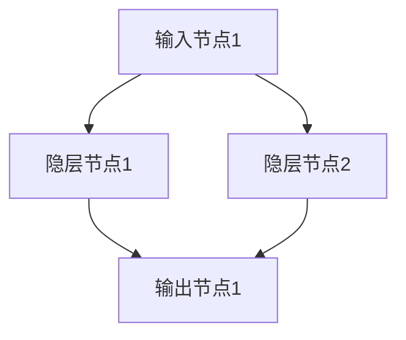
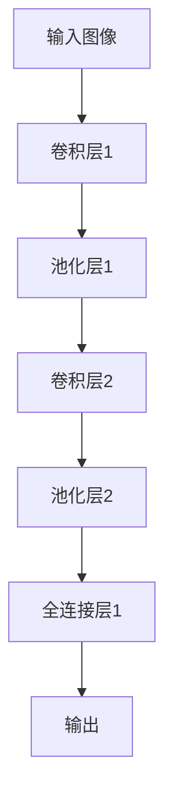

                 

### 文章标题

在快速发展的科技浪潮中，人工智能（AI）正以前所未有的速度改变着世界的面貌。作为一位计算机图灵奖获得者、世界顶级技术畅销书资深大师，我李开复深感AI技术的巨大潜力和深远影响。今天，我将以《李开复：AI 2.0 时代的未来》为题，深入探讨AI 2.0时代的来临、技术演进、应用趋势以及未来的展望。

AI 2.0，作为人工智能的下一代技术革命，其核心在于大规模模型、深度学习和自我学习能力的大幅提升。这不仅代表了技术的进步，更是对人类社会、经济和生活方式的一次全方位变革。本文将分三大部分进行论述：

第一部分将介绍AI 2.0时代的背景与基础，包括AI 2.0的定义与特点、人工智能的发展历史以及AI 2.0时代的未来趋势。

第二部分将探讨AI 2.0时代的核心技术，包括深度学习与神经网络基础、自然语言处理技术、计算机视觉技术以及强化学习与智能决策。

第三部分将分析AI 2.0时代的应用与未来，涵盖AI在产业中的应用以及AI 2.0时代的伦理与社会责任。

通过这篇文章，我希望能够为大家提供一份全面而深入的AI 2.0技术指南，共同迎接这一激动人心的未来。

### 文章关键词

人工智能、AI 2.0、深度学习、神经网络、自然语言处理、计算机视觉、强化学习、智能决策、产业应用、伦理责任、未来趋势

### 文章摘要

随着AI技术的迅猛发展，人工智能进入了AI 2.0时代。本文由计算机图灵奖获得者李开复撰写，深入探讨了AI 2.0的定义、特点以及技术演进。文章首先回顾了人工智能的发展历史，从早期的人工智能到AI 1.0时代，再到今天的AI 2.0突破。接着，文章详细介绍了AI 2.0时代的核心技术，包括深度学习与神经网络基础、自然语言处理技术、计算机视觉技术和强化学习。随后，文章分析了AI 2.0时代在各产业中的应用，探讨了其对社会的深远影响，并提出了未来的科技趋势。最后，文章讨论了AI 2.0时代的伦理与社会责任，强调了全球合作与治理的重要性。通过本文，读者将全面了解AI 2.0时代的技术革新及其对未来世界的深远影响。

### 《李开复：AI 2.0 时代的未来》目录大纲

为了帮助读者更好地理解和把握本文的结构和内容，下面是详细的目录大纲：

#### 第一部分：AI 2.0时代的背景与基础

##### 第1章：AI 2.0时代的概述
- **1.1 AI 2.0的定义与特点**
- **1.2 AI 2.0时代的技术演进**

##### 第2章：人工智能的发展历史
- **2.1 人工智能的起源**
- **2.2 AI 1.0时代的主要成就**
- **2.3 AI 2.0时代的突破**

##### 第3章：AI 2.0时代的未来趋势
- **3.1 AI 2.0对社会的深远影响**
- **3.2 AI 2.0时代的产业变革**

#### 第二部分：AI 2.0时代的核心技术

##### 第4章：深度学习与神经网络基础
- **4.1 神经网络的基本结构**
- **4.2 深度学习优化算法**

##### 第5章：自然语言处理技术
- **5.1 词嵌入技术**
- **5.2 序列模型与注意力机制**

##### 第6章：计算机视觉技术
- **6.1 卷积神经网络（CNN）**
- **6.2 目标检测与图像分割**

##### 第7章：强化学习与智能决策
- **7.1 强化学习的基本概念**
- **7.2 智能决策与AI 2.0**

#### 第三部分：AI 2.0时代的应用与未来

##### 第8章：AI 2.0在产业中的应用
- **8.1 AI 2.0在制造业中的应用**
- **8.2 AI 2.0在金融业中的应用**

##### 第9章：AI 2.0时代的未来展望
- **9.1 AI 2.0对人类社会的长远影响**
- **9.2 AI 2.0时代的科技趋势**

##### 第10章：AI 2.0时代的伦理与社会责任
- **10.1 AI 2.0伦理问题探讨**
- **10.2 AI 2.0时代的国际合作与治理**

#### 附录

- **附录A：AI 2.0开发工具与资源**
- **附录B：AI 2.0项目案例精选**
- **附录C：AI 2.0学习资源推荐**

通过这个目录大纲，我们可以清晰地看到文章的结构和内容安排，这将帮助读者更好地把握文章的脉络，深入理解AI 2.0时代的未来。

#### 第一部分：AI 2.0时代的背景与基础

##### 第1章：AI 2.0时代的概述

人工智能（AI）的发展历程可以分为几个关键阶段，从最早的自动化和规则系统，到深度学习和大规模模型，最终演变为AI 2.0时代。这一章将详细探讨AI 2.0的定义与特点，以及这一时代的技术演进。

**1.1 AI 2.0的定义与特点**

AI 2.0，是人工智能发展的新阶段，核心在于大规模模型、深度学习和自我学习能力的大幅提升。与传统的人工智能（AI 1.0）相比，AI 2.0具有以下几个显著特点：

1. **自主学习能力**：AI 2.0通过深度学习技术，能够自主学习并不断优化，而不需要人为设定规则。这种自我学习能力使得AI 2.0可以在复杂的环境中应对变化，并不断进化。

2. **大规模数据处理**：AI 2.0能够处理和分析大规模的数据集，这得益于现代计算能力的提升和数据存储技术的发展。大规模数据处理使得AI 2.0能够从海量数据中提取有价值的信息，从而做出更加准确的决策。

3. **多模态交互**：AI 2.0不仅能够处理文本信息，还可以处理图像、声音等多种形式的数据，实现多模态交互。这种能力使得AI 2.0在自然语言处理、计算机视觉等领域取得了显著突破。

4. **跨界融合**：AI 2.0不仅限于计算机领域，还与生物技术、量子计算、区块链等前沿技术深度融合，形成新的交叉学科和应用领域。

**1.2 AI 2.0时代的技术演进**

AI 2.0时代的到来，是技术演进的自然结果。以下是一些关键的技术里程碑：

1. **深度学习的发展**：深度学习是AI 2.0时代的重要技术基础。通过多层神经网络，深度学习能够从大量数据中自动学习特征，实现复杂的模式识别和决策。卷积神经网络（CNN）和循环神经网络（RNN）等深度学习模型在这一时期取得了突破性的进展。

2. **大规模模型的出现**：随着计算能力的提升和数据集的扩展，AI 2.0时代的模型规模显著增大。例如，GPT-3、BERT等大型语言模型，具有数十亿参数，能够处理复杂的自然语言任务。

3. **自我学习能力**：通过强化学习等技术，AI 2.0能够自主学习，并在实际应用中不断优化。例如，AlphaGo通过自我对弈，实现了围棋领域的超越。

4. **多模态交互技术**：AI 2.0的多模态交互能力，使得人机交互更加自然和高效。通过语音识别、图像识别等技术，AI 2.0能够理解和响应人类的多模态输入。

综上所述，AI 2.0时代是人工智能发展的新阶段，其定义与特点、技术演进以及未来趋势，构成了这一时代的重要特征。在接下来的章节中，我们将继续深入探讨AI 2.0时代的核心技术及其应用。

##### 第2章：人工智能的发展历史

人工智能（AI）作为一门学科和技术，其发展历程充满了创新与突破。从最早的起源到AI 1.0时代，再到如今的AI 2.0，每一阶段都标志着技术的进步和应用范围的扩展。

**2.1 人工智能的起源**

人工智能的概念最早可以追溯到20世纪50年代。1956年，达特茅斯会议（Dartmouth Conference）被公认为人工智能的诞生日。在这次会议上，约翰·麦卡锡（John McCarthy）等科学家首次提出了“人工智能”这一术语，并讨论了人工智能的目标和路径。

早期的AI研究主要集中在符号主义和知识表示上。科学家们尝试通过逻辑推理和知识库来模拟人类的智能行为。代表性工作包括ELIZA程序，这是一个能够与人类进行简单对话的聊天机器人，虽然它并不能理解人类的语言，但引起了广泛关注。

**2.2 AI 1.0时代的主要成就**

AI 1.0时代，主要特点是规则驱动的方法和符号推理。这一时期的代表性技术包括专家系统（Expert Systems）和知识工程（Knowledge Engineering）。

1. **专家系统**：专家系统是一种模拟人类专家决策能力的计算机程序。通过将领域知识编码成规则，专家系统能够在特定领域内提供决策支持。例如，MYCIN系统是一个医疗诊断专家系统，能够诊断某些感染性疾病。

2. **知识表示**：知识表示是AI 1.0时代的核心问题。如何将人类知识转化为计算机可以处理的形式，是这一时期研究的重点。知识表示方法包括产生式规则、语义网络和框架等。

3. **搜索算法**：AI 1.0时代，搜索算法在问题求解中发挥了重要作用。包括反向链接搜索、最短路径搜索等，这些算法使得计算机能够解决一些复杂的问题。

**2.3 AI 2.0时代的突破**

AI 2.0时代的到来，标志着人工智能技术的重大突破。这一时期，深度学习、大规模模型和自我学习能力成为主要特征。

1. **深度学习的发展**：深度学习是AI 2.0时代的重要技术。通过多层神经网络，深度学习能够自动从数据中学习特征，实现复杂的模式识别和决策。卷积神经网络（CNN）和循环神经网络（RNN）等深度学习模型在这一时期取得了突破性的进展。

2. **自然语言处理与计算机视觉的进步**：AI 2.0时代的自然语言处理（NLP）和计算机视觉（CV）技术取得了显著突破。自然语言处理技术使得计算机能够理解和生成自然语言，计算机视觉技术使得计算机能够理解和解释图像和视频。

3. **强化学习与智能决策**：强化学习是AI 2.0时代的关键技术之一。通过强化学习，智能体能够在动态环境中学习最优策略，从而实现智能决策。例如，AlphaGo通过自我对弈，实现了围棋领域的超越。

4. **多模态交互技术**：AI 2.0时代的多模态交互技术，使得人机交互更加自然和高效。通过语音识别、图像识别等技术，AI 2.0能够理解和响应人类的多模态输入。

综上所述，人工智能的发展历程是一个不断突破和创新的过程。从AI 1.0时代的规则驱动，到AI 2.0时代的深度学习和自我学习能力，每一阶段都标志着技术的进步和应用范围的扩展。在接下来的章节中，我们将继续深入探讨AI 2.0时代的核心技术及其应用。

##### 第3章：AI 2.0时代的未来趋势

随着AI技术的不断进步，AI 2.0时代的未来趋势变得愈加清晰。这一部分将探讨AI 2.0对社会的深远影响，以及这一时代的产业变革。

**3.1 AI 2.0对社会的深远影响**

AI 2.0不仅是一场技术革命，更是一场社会变革。它将对人类社会的各个方面产生深远影响：

1. **经济发展**：AI 2.0将极大地提升生产效率，推动新产业的发展。例如，智能制造、智能金融、智能医疗等领域的崛起，将为经济增长提供新动力。同时，AI 2.0也将改变就业结构，一些传统岗位可能会被自动化取代，但也会创造出新的工作岗位。

2. **生活方式**：AI 2.0将极大地改变人们的生活方式。智能家居、智能交通、智能医疗等技术的普及，将使生活更加便捷和高效。人们可以享受到更加个性化和智能化的服务，生活品质得到提升。

3. **教育**：AI 2.0将在教育领域引发革命。个性化学习、在线教育、智能辅导等新教育模式的出现，将使教育资源更加公平和高效。同时，AI 2.0也将培养学生的创新能力，使其具备适应未来社会的技能。

4. **伦理与隐私**：AI 2.0的发展也带来了一系列伦理和隐私问题。如何确保AI的透明性和可解释性，如何保护个人隐私，都是需要解决的重要问题。社会需要制定相应的法律法规，确保AI技术的发展不会对人类社会造成负面影响。

**3.2 AI 2.0时代的产业变革**

AI 2.0时代将引发全球范围内的产业变革，以下是几个关键领域：

1. **制造业**：智能制造是AI 2.0时代的重要应用领域。通过人工智能技术，工厂可以实现自动化生产、智能质量检测和智能故障诊断，从而提高生产效率和产品质量。例如，工业机器人与人工智能的结合，将使生产线更加灵活和高效。

2. **金融业**：智能金融是AI 2.0时代的重要应用领域。人工智能技术可以用于智能投资、风险控制、信用评估等。例如，智能投资顾问可以基于大量数据，为投资者提供个性化的投资建议，提高投资收益。同时，AI 2.0还将使金融业更加透明和公正，减少欺诈和非法交易。

3. **医疗**：智能医疗是AI 2.0时代的重要应用领域。通过人工智能技术，可以实现疾病预测、诊断和治疗。例如，基于大数据和深度学习技术的疾病预测模型，可以提前发现潜在的健康问题，为患者提供更好的治疗方案。

4. **交通**：智能交通是AI 2.0时代的重要应用领域。通过人工智能技术，可以实现智能交通管理、智能导航和自动驾驶。例如，自动驾驶技术可以减少交通事故，提高交通效率，改善人们的出行体验。

5. **零售**：智能零售是AI 2.0时代的重要应用领域。通过人工智能技术，可以实现智能推荐、智能客服和智能供应链管理。例如，智能推荐系统可以根据用户的偏好和行为，提供个性化的商品推荐，提高销售额。

综上所述，AI 2.0时代的未来趋势充满机遇和挑战。它不仅将对社会产生深远影响，还将引发全球范围内的产业变革。面对这一变革，社会各界需要共同努力，确保AI技术的发展能够造福人类，而不是造成负面影响。

#### 第二部分：AI 2.0时代的核心技术

##### 第4章：深度学习与神经网络基础

深度学习是AI 2.0时代的重要技术之一，其核心在于多层神经网络的设计与优化。在这一章中，我们将探讨神经网络的基本结构、多层神经网络的实现以及深度学习优化算法。

**4.1 神经网络的基本结构**

神经网络（Neural Network，NN）是一种模拟人脑神经元之间连接的计算机模型。它由一系列相互连接的节点（称为神经元）组成，每个神经元都可以接收输入信号、进行处理并产生输出。

一个简单的单层神经网络（也称为输入层和输出层）可以表示为：



每个节点之间的连接都有一个权重（weight），表示连接的强度。神经元接收的输入信号乘以相应的权重，然后通过一个激活函数（activation function）进行处理，最终产生输出。

神经元的数学模型可以表示为：

\[ z = \sum_{i} (x_i \cdot w_i) + b \]

其中，\( x_i \) 是输入，\( w_i \) 是权重，\( b \) 是偏置，\( z \) 是中间结果。

常见的激活函数包括：

- **Sigmoid函数**：\[ \sigma(z) = \frac{1}{1 + e^{-z}} \]
- **ReLU函数**：\[ \text{ReLU}(z) = \max(0, z) \]
- **Tanh函数**：\[ \tanh(z) = \frac{e^z - e^{-z}}{e^z + e^{-z}} \]

**4.2 多层神经网络**

多层神经网络（Multi-Layer Neural Network）通过增加隐层节点，可以更好地捕捉数据的复杂结构。典型的多层神经网络包括输入层、一个或多个隐层以及输出层。

一个简单的多层神经网络可以表示为：


多层神经网络的实现主要包括以下几个步骤：

1. **初始化权重**：随机初始化每个神经元之间的权重。
2. **前向传播**：将输入信号传递到神经网络，通过每个层进行计算，最终得到输出。
3. **反向传播**：计算输出误差，通过反向传播算法更新权重和偏置，以减少误差。
4. **优化算法**：使用优化算法（如梯度下降、动量优化、Adam优化等）来调整权重和偏置。

**4.3 深度学习优化算法**

深度学习优化算法是训练多层神经网络的关键。以下是一些常用的优化算法：

1. **梯度下降（Gradient Descent）**：最简单的优化算法，通过计算损失函数关于参数的梯度，并沿梯度方向更新参数，以减少损失。

   \[ \theta = \theta - \alpha \cdot \nabla_{\theta} J(\theta) \]

   其中，\( \theta \) 是参数，\( \alpha \) 是学习率，\( J(\theta) \) 是损失函数。

2. **动量优化（Momentum）**：为了防止梯度下降过程中出现振荡，引入动量，将之前的更新方向积累起来。

   \[ \theta = \theta - \alpha \cdot \nabla_{\theta} J(\theta) + \beta \cdot v \]

   其中，\( v \) 是动量项，\( \beta \) 是动量参数。

3. **Adam优化**：结合了动量和RMSprop算法，能够自适应地调整学习率。

   \[ \theta = \theta - \alpha \cdot \frac{m}{\sqrt{v}} \]

   其中，\( m \) 是一阶矩估计，\( v \) 是二阶矩估计。

综上所述，深度学习与神经网络基础是AI 2.0时代的重要技术，通过多层神经网络和深度学习优化算法，可以实现复杂的模式识别和决策。在接下来的章节中，我们将继续探讨自然语言处理、计算机视觉和强化学习等核心技术。

##### 第5章：自然语言处理技术

自然语言处理（NLP）是人工智能领域的一个重要分支，旨在使计算机能够理解和生成自然语言。在AI 2.0时代，NLP技术取得了显著进展，这一章将详细介绍词嵌入技术、序列模型与注意力机制以及Transformer架构。

**5.1 词嵌入技术**

词嵌入（Word Embedding）是将词语映射到高维向量空间的技术，使得计算机能够理解和处理语义信息。词嵌入的关键在于捕捉词语之间的相似性和相关性。

常见的词嵌入算法包括：

1. **Word2Vec**：Word2Vec是一种基于神经网络的词嵌入算法，通过训练预测上下文词语来生成词向量。Word2Vec有两种实现方式：连续词袋（CBOW）和Skip-Gram。

   - **CBOW（Continuous Bag of Words）**：给定一个中心词，预测周围词。
   - **Skip-Gram**：给定一个中心词，预测其上下文词。

   Word2Vec的神经网络模型如下：

   ```mermaid
   graph TD
       A[中心词] --> B[隐层节点]
       B --> C[输出层]
       C --> D[上下文词1]
       C --> E[上下文词2]
       C --> F[上下文词3]
   ```

2. **GloVe（Global Vectors for Word Representation）**：GloVe是一种基于矩阵分解的词嵌入算法，通过计算词语的共现矩阵来生成词向量。GloVe的数学模型如下：

   \[ f(w_i, w_j) = \frac{f(x_i, x_j)}{||x_i|| \cdot ||x_j||} \]

   其中，\( f \) 是非线性函数，\( x_i \) 和 \( x_j \) 是词语的向量表示。

词嵌入技术不仅在NLP中广泛应用，还能用于情感分析、文本分类和机器翻译等任务。

**5.2 序列模型与注意力机制**

序列模型（Sequence Model）是处理序列数据（如文本、语音等）的神经网络模型。常见的序列模型包括循环神经网络（RNN）、长短期记忆网络（LSTM）和门控循环单元（GRU）。

1. **RNN（Recurrent Neural Network）**：RNN通过循环连接，使得当前时刻的输出能够影响后续时刻的输入。RNN的神经网络模型如下：

   ```mermaid
   graph TD
       A[输入1] --> B[隐层状态]
       B --> C[输出1]
       B --> D[输入2]
       D --> E[隐层状态]
       E --> F[输出2]
   ```

   RNN的数学模型如下：

   \[ h_t = \sigma(W_h \cdot [h_{t-1}, x_t] + b_h) \]

   其中，\( h_t \) 是当前时刻的隐层状态，\( x_t \) 是当前时刻的输入，\( W_h \) 是权重矩阵，\( b_h \) 是偏置。

2. **LSTM（Long Short-Term Memory）**：LSTM是RNN的一种变体，通过引入记忆单元和三个门控机制（遗忘门、输入门和输出门），解决了RNN的长期依赖问题。LSTM的神经网络模型如下：

   ```mermaid
   graph TD
       A[输入1] --> B[遗忘门]
       B --> C[输入门]
       C --> D[输出门]
       D --> E[记忆单元]
       E --> F[隐层状态]
       F --> G[输出1]
       G --> H[输入2]
       H --> I[遗忘门]
       I --> J[输入门]
       J --> K[输出门]
       K --> L[记忆单元]
       L --> M[隐层状态]
       M --> N[输出2]
   ```

   LSTM的数学模型如下：

   \[ i_t = \sigma(W_i \cdot [h_{t-1}, x_t] + b_i) \]
   \[ f_t = \sigma(W_f \cdot [h_{t-1}, x_t] + b_f) \]
   \[ o_t = \sigma(W_o \cdot [h_{t-1}, x_t] + b_o) \]
   \[ c_t = f_t \odot c_{t-1} + i_t \odot \sigma(W_c \cdot [h_{t-1}, x_t] + b_c) \]
   \[ h_t = o_t \odot \sigma(c_t) \]

   其中，\( i_t \) 是输入门，\( f_t \) 是遗忘门，\( o_t \) 是输出门，\( c_t \) 是记忆单元，\( h_t \) 是隐层状态。

3. **GRU（Gated Recurrent Unit）**：GRU是LSTM的一种简化版本，通过引入更新门和重置门，简化了LSTM的结构。GRU的神经网络模型如下：

   ```mermaid
   graph TD
       A[输入1] --> B[更新门]
       B --> C[重置门]
       C --> D[隐层状态]
       D --> E[输出1]
       E --> F[输入2]
       F --> G[更新门]
       G --> H[重置门]
       H --> I[隐层状态]
       I --> J[输出2]
   ```

   GRU的数学模型如下：

   \[ z_t = \sigma(W_z \cdot [h_{t-1}, x_t] + b_z) \]
   \[ r_t = \sigma(W_r \cdot [h_{t-1}, x_t] + b_r) \]
   \[ \tilde{h}_t = \sigma(W \cdot [r_t \odot h_{t-1}, x_t] + b) \]
   \[ h_t = z_t \odot h_{t-1} + (1 - z_t) \odot \tilde{h}_t \]

   其中，\( z_t \) 是更新门，\( r_t \) 是重置门。

注意力机制（Attention Mechanism）是序列模型中的一种重要技术，用于捕捉序列中关键的信息。注意力机制的数学模型如下：

\[ a_t = \text{softmax}(\alpha(W_a h_t + b_a)) \]
\[ h_t' = \sum_{i=1}^{T} a_t \odot h_i \]

其中，\( a_t \) 是注意力权重，\( h_i \) 是序列中的第i个隐层状态。

**5.3 Transformer架构**

Transformer是自然语言处理领域的一项革命性创新，其核心在于注意力机制和自注意力（Self-Attention）。

Transformer架构主要包括以下组件：

1. **编码器（Encoder）**：编码器由多个自注意力层和前馈神经网络层组成。自注意力机制允许编码器在处理每个词时，能够考虑到其他所有词的信息。

   ```mermaid
   graph TD
       A[词向量] --> B[自注意力层]
       B --> C[前馈神经网络层]
       C --> D[多头自注意力层]
       D --> E[前馈神经网络层]
       E --> F[隐层状态]
   ```

2. **解码器（Decoder）**：解码器同样由多个自注意力层和前馈神经网络层组成。与编码器不同的是，解码器还包括了一个编码器-解码器注意力机制，用于在解码每个词时，考虑到编码器的输出。

   ```mermaid
   graph TD
       A[词向量] --> B[编码器-解码器注意力层]
       B --> C[自注意力层]
       C --> D[前馈神经网络层]
       D --> E[多头自注意力层]
       E --> F[前馈神经网络层]
       F --> G[输出]
   ```

Transformer的数学模型如下：

\[ \text{编码器}:\text{ } E = \text{Encoder}(X) = \text{MultiHeadSelfAttention}(X) \]
\[ \text{解码器}:\text{ } D = \text{Decoder}(Y) = \text{EncoderDecoderSelfAttention}(Y, E) \]

\[ \text{MultiHeadSelfAttention}(Q, K, V) = \text{Concat}(\text{head}_1, ..., \text{head}_h)W_V \]

\[ \text{head}_i = \text{Attention}(QW_Q, KW_K, VW_V)W_O \]

通过编码器和解码器的相互作用，Transformer能够捕捉到序列中长距离的依赖关系，从而实现高质量的文本生成和翻译。

综上所述，自然语言处理技术在AI 2.0时代取得了显著进展，从词嵌入技术到序列模型与注意力机制，再到Transformer架构，这些核心技术的创新为NLP任务提供了强大的工具。在接下来的章节中，我们将继续探讨计算机视觉技术和强化学习。

##### 第6章：计算机视觉技术

计算机视觉（CV）是人工智能领域的另一个关键分支，旨在使计算机能够理解和解释视觉信息。在AI 2.0时代，CV技术取得了显著突破，成为自动驾驶、医疗影像诊断和工业自动化等领域的重要应用基础。本章将详细介绍卷积神经网络（CNN）的基本结构、目标检测与图像分割算法，以及这些技术在AI 2.0时代的应用。

**6.1 卷积神经网络（CNN）**

卷积神经网络（CNN）是一种专门用于处理图像数据的深度学习模型。其核心在于通过卷积操作和池化操作，提取图像中的特征，并逐步将低级特征抽象为高级特征。

**6.1.1 卷积层与池化层**

卷积层（Convolutional Layer）是CNN的基础，通过卷积操作将输入图像与滤波器（也称为卷积核）进行卷积运算，从而提取图像中的特征。

卷积操作的数学公式如下：

\[ (f \star g)(x) = \sum_{y} f(y) \cdot g(x - y) \]

其中，\( f \) 是滤波器，\( g \) 是输入图像，\( x \) 是卷积结果。

常见的卷积操作包括：

- **标准卷积**：使用固定的滤波器对图像进行卷积。
- **深度卷积**：使用多个滤波器对图像进行卷积，从而提取不同类型的特征。

池化层（Pooling Layer）用于降低特征的维度，同时保留重要信息。常见的池化操作包括：

- **最大池化（Max Pooling）**：选择每个区域中的最大值。
- **平均池化（Average Pooling）**：选择每个区域中的平均值。

最大池化的数学公式如下：

\[ \text{MaxPooling}(x) = \max_{(i, j) \in R} x(i, j) \]

**6.1.2 全连接层与CNN的应用**

在CNN中，卷积层和池化层之后通常接一个或多个全连接层（Fully Connected Layer），用于分类和回归任务。

全连接层的数学模型如下：

\[ z = \sum_{i} w_i \cdot x_i + b \]

其中，\( z \) 是输出，\( w_i \) 是权重，\( x_i \) 是输入，\( b \) 是偏置。

一个简单的CNN结构可以表示为：



**6.2 目标检测与图像分割**

目标检测（Object Detection）是计算机视觉中的一项重要任务，旨在识别和定位图像中的多个对象。常见的目标检测算法包括：

1. **基于区域建议的方法（R-CNN系列）**：

   - **R-CNN**：通过选择性搜索（Selective Search）生成区域建议，然后使用CNN进行分类。
   - **Fast R-CNN**：简化了R-CNN的计算，通过ROI（Region of Interest）池化层直接从卷积特征图中提取特征。
   - **Faster R-CNN**：引入了区域建议网络（Region Proposal Network，RPN），进一步提高了检测速度。

   R-CNN系列的目标检测算法结构可以表示为：

   ```mermaid
   graph TD
       A[输入图像] --> B[选择性搜索]
       B --> C[区域建议]
       C --> D[卷积神经网络]
       D --> E[ROI池化]
       E --> F[分类器]
       F --> G[检测结果]
   ```

2. **基于特征金字塔的方法（Faster R-CNN、Mask R-CNN）**：

   - **Faster R-CNN**：引入了区域建议网络（RPN），使检测过程更加高效。
   - **Mask R-CNN**：在Faster R-CNN的基础上，引入了掩膜分支（Mask Branch），用于图像分割任务。

   Faster R-CNN和Mask R-CNN的目标检测算法结构可以表示为：

   ```mermaid
   graph TD
       A[输入图像] --> B[卷积神经网络]
       B --> C[区域建议网络]
       C --> D[ROI池化]
       D --> E[分类器]
       D --> F[掩膜分支]
       E --> G[检测结果]
       F --> H[分割结果]
   ```

**6.3 图像分割算法**

图像分割（Image Segmentation）是将图像中的每个像素划分为不同的区域，通常用于目标检测、医学影像分析和图像编辑等任务。常见的图像分割算法包括：

1. **基于深度学习的图像分割算法**：

   - **FCN（Fully Convolutional Network）**：将CNN应用于图像分割任务，通过全连接层将特征映射到每个像素。
   - **U-Net**：一种专门为医学图像分割设计的网络结构，通过收缩路径和扩张路径结合特征，实现精确分割。

   FCN和U-Net的网络结构可以表示为：

   ```mermaid
   graph TD
       A[输入图像] --> B[卷积层1]
       B --> C[池化层]
       C --> D[卷积层2]
       D --> E[池化层]
       E --> F[反卷积层]
       F --> G[全连接层]
       G --> H[输出]
   ```

2. **基于注意力机制的图像分割算法**：

   - **DeepLab V3+**：通过引入注意力机制和特征金字塔网络（FPN），提高图像分割的精度。

   DeepLab V3+的网络结构可以表示为：

   ```mermaid
   graph TD
       A[输入图像] --> B[卷积神经网络]
       B --> C[特征金字塔网络]
       C --> D[深度可分离卷积]
       D --> E[多尺度融合]
       E --> F[全连接层]
       F --> G[输出]
   ```

**6.4 AI 2.0时代的计算机视觉应用**

AI 2.0时代的计算机视觉技术已经广泛应用于各个领域，包括：

- **自动驾驶**：通过目标检测和图像分割技术，自动驾驶系统可以实时识别道路上的车辆、行人、交通标志等，确保行车安全。
- **医疗影像分析**：计算机视觉技术可以自动识别和诊断医学图像中的病变区域，辅助医生进行诊断和治疗。
- **工业自动化**：计算机视觉技术在工业自动化中用于质量检测、故障诊断和生产流程优化，提高生产效率和产品质量。
- **图像编辑与增强**：通过图像分割和生成对抗网络（GAN）等技术，可以实现图像编辑和增强，提升用户体验。

综上所述，计算机视觉技术在AI 2.0时代取得了显著突破，通过卷积神经网络、目标检测与图像分割算法，计算机能够更好地理解和解释视觉信息。这些技术的应用不仅推动了各个领域的发展，也为AI 2.0时代的到来奠定了基础。在接下来的章节中，我们将探讨强化学习与智能决策技术。

##### 第7章：强化学习与智能决策

强化学习（Reinforcement Learning，RL）是机器学习中的一个重要分支，与监督学习和无监督学习不同，强化学习通过试错和反馈机制来学习如何在特定环境中做出最优决策。这一章将详细介绍强化学习的基本概念、核心算法以及它在AI 2.0时代的智能决策应用。

**7.1 强化学习的基本概念**

强化学习涉及三个主要元素：代理人（Agent）、环境（Environment）和奖励（Reward）。

- **代理人**：执行动作的智能体，可以是机器学习模型、机器人或其他智能系统。
- **环境**：代理人交互的动态世界，可以是一个模拟环境或现实环境。
- **奖励**：代理人在环境中执行动作后获得的即时反馈信号，用于评估代理人的行为。

强化学习的基本目标是学习一个策略（Policy），该策略能够最大化长期累积奖励。策略可以是一个映射函数，将状态映射到动作。

强化学习的主要特点包括：

- **试错学习**：代理人通过不断尝试不同的动作来学习最优策略，这一过程中可能包含大量的错误。
- **反馈机制**：奖励信号是代理人进行学习的重要依据，通过奖励信号，代理人可以调整其行为以最大化累积奖励。
- **探索与利用**：在强化学习中，代理人需要在探索（尝试新的动作）和利用（使用已知的最佳动作）之间进行权衡。

**7.2 强化学习的核心算法**

强化学习算法根据其学习策略的不同，可以分为基于值函数的方法和基于策略的方法。

1. **基于值函数的方法**：

   - **Q-Learning**：Q-Learning是一种基于值函数的强化学习算法，通过学习状态-动作值函数（Q-值）来选择最佳动作。

     Q-Learning的算法步骤如下：

     ```mermaid
     graph TD
         A[初始化Q(s, a)]
         A --> B[选择动作a]
         B --> C[执行动作a]
         C --> D[观察状态s'和奖励r]
         D --> E[更新Q(s, a)]
         E --> F[重复]
     ```

     更新公式为：

     \[ Q(s, a) = Q(s, a) + \alpha [r + \gamma \max_{a'} Q(s', a') - Q(s, a)] \]

     其中，\( \alpha \) 是学习率，\( \gamma \) 是折扣因子。

   - **SARSA**：SARSA（同步策略学习与同步行动）是一种基于值函数的强化学习算法，通过同时更新当前状态和下一个状态的Q-值。

     SARSA的算法步骤如下：

     ```mermaid
     graph TD
         A[初始化Q(s, a)]
         A --> B[选择动作a]
         B --> C[执行动作a]
         C --> D[观察状态s'和奖励r]
         D --> E[选择动作a'根据当前策略]
         E --> F[更新Q(s, a)]
         F --> G[重复]
     ```

     更新公式为：

     \[ Q(s, a) = Q(s, a) + \alpha [r + \gamma Q(s', a')] - Q(s, a)] \]

2. **基于策略的方法**：

   - **策略梯度方法**：策略梯度方法直接优化策略函数，通过梯度上升法更新策略参数。

     策略梯度的目标函数为：

     \[ J(\theta) = \sum_{s, a} p(s, a) \cdot r + \gamma \sum_{s', a'} p(s', a') \cdot \log \pi(\theta)(s', a') \]

     其中，\( \theta \) 是策略参数。

     策略梯度的更新公式为：

     \[ \theta = \theta + \alpha \nabla_{\theta} J(\theta) \]

   - **策略迭代**：策略迭代是一种结合了Q-Learning和策略梯度的方法，通过交替更新Q-值和策略参数，逐步优化策略。

     策略迭代的步骤如下：

     ```mermaid
     graph TD
         A[初始化Q(s, a)]
         A --> B[Q-Learning迭代]
         B --> C[更新策略参数]
         C --> D[策略迭代]
         D --> E[重复]
     ```

**7.3 智能决策与AI 2.0**

强化学习在AI 2.0时代的智能决策中具有重要应用，通过自我学习和优化策略，智能体能够在复杂动态环境中做出最优决策。

1. **智能决策系统**：强化学习可以用于构建智能决策系统，例如自动驾驶汽车的路径规划、智能客服系统的用户交互策略等。智能决策系统通过不断学习和优化，能够提高决策的效率和准确性。

2. **强化学习与深度学习融合**：深度强化学习（Deep Reinforcement Learning，DRL）是强化学习与深度学习相结合的产物，通过将深度学习模型用于状态和动作的表示，DRL能够在复杂环境中实现高效学习。例如，AlphaGo就是通过深度强化学习实现的围棋人工智能，它通过自我对弈不断优化策略，最终在围棋领域取得了超越人类的成就。

3. **强化学习在工业自动化中的应用**：在工业自动化领域，强化学习可以用于机器人路径规划、生产流程优化等任务。通过模拟和实际操作，智能体可以学习和优化生产过程，提高生产效率和产品质量。

4. **智能推荐系统**：强化学习在智能推荐系统中也有广泛应用，例如电商平台的商品推荐、视频网站的内容推荐等。通过学习用户的行为数据，智能推荐系统可以提供个性化的推荐，提高用户体验和用户满意度。

综上所述，强化学习是AI 2.0时代的重要核心技术之一，通过自我学习和优化策略，强化学习在智能决策系统、工业自动化、智能推荐系统等领域具有广泛的应用前景。随着技术的不断进步，强化学习将在AI 2.0时代发挥更加重要的作用，推动人工智能的发展和应用。

##### 第8章：AI 2.0在产业中的应用

随着AI 2.0技术的迅猛发展，其在各个产业中的应用逐渐深入，带来了显著的变革与创新。以下将详细探讨AI 2.0在制造业和金融业中的应用，以及这些应用对行业带来的深远影响。

**8.1 AI 2.0在制造业中的应用**

制造业作为国民经济的重要支柱，AI 2.0技术的引入极大地提升了制造业的自动化水平、生产效率和产品质量。以下是一些关键应用：

1. **智能制造系统**：智能制造系统通过集成AI 2.0技术，实现了生产过程的智能化和自动化。例如，利用机器学习算法对生产线上的数据进行分析，可以预测设备故障、优化生产参数，从而提高设备的稳定性和生产效率。智能制造系统还包括了智能调度、自动检测和质量控制等功能，实现了生产全过程的智能化管理。

   **核心概念与联系**：

   - **机器学习算法**：机器学习算法在智能制造系统中用于数据分析和预测。
   - **自动化技术**：自动化技术是实现智能制造的基础，通过自动化设备提高生产效率。
   - **物联网（IoT）**：物联网技术使得生产设备能够实时收集数据，为AI算法提供数据支持。

   **Mermaid流程图**：

   ```mermaid
   graph TD
       A[输入数据] --> B[机器学习算法]
       B --> C[分析预测]
       C --> D[自动化设备]
       D --> E[优化生产]
   ```

2. **工业机器人与自动化生产**：AI 2.0技术在工业机器人中的应用，使得机器人能够执行更加复杂的生产任务，提高了生产效率和灵活性。例如，通过深度学习和强化学习算法，工业机器人可以实现路径规划、避障和协作工作，从而在复杂的生产环境中高效运行。自动化生产线的应用也使得生产过程更加智能化和灵活化。

   **核心算法原理讲解**：

   - **深度学习**：用于机器人视觉和感知，实现图像识别和物体定位。
   - **强化学习**：用于机器人路径规划和决策，优化机器人的动作。

   **伪代码**：

   ```python
   # 深度学习算法用于图像识别
   model = build_model()
   model.fit(training_data, epochs=10)
   prediction = model.predict(test_image)

   # 强化学习算法用于路径规划
   policy = QLearningAgent()
   policy.learn(from_state, to_state, action, reward)
   optimal_path = policy.get_optimal_path(current_state)
   ```

3. **质量检测与故障诊断**：AI 2.0技术在制造业的质量检测和故障诊断中也发挥着重要作用。通过计算机视觉技术和自然语言处理技术，AI系统能够对生产过程中的质量数据进行分析，识别潜在的故障风险，并提供实时监控和预警。这有助于提高产品质量，减少生产成本。

**8.2 AI 2.0在金融业中的应用**

金融业是AI 2.0技术的另一个重要应用领域，AI技术的引入极大地提升了金融服务的效率、透明度和安全性。

1. **智能投资与风险控制**：AI 2.0技术在金融投资中的应用，使得投资决策更加智能化和个性化。通过大数据分析和机器学习算法，智能投资系统可以分析市场趋势、预测投资风险，并自动调整投资组合，提高投资收益。同时，AI技术还用于风险控制，通过实时监控市场变化，识别潜在风险，并采取相应的风险控制措施。

   **数学模型与公式**：

   - **资产定价模型**：例如Black-Scholes模型，用于预测资产价格波动。
   - **风险度量模型**：例如VaR（Value at Risk）模型，用于评估投资组合的风险。

   **举例说明**：

   ```latex
   \text{资产定价模型：}
   C = S_0 \cdot N(d_1) - K \cdot N(d_2)
   \quad
   \text{其中：}
   d_1 = \frac{\ln(S_0/K) + (r + \sigma^2/2)t}{\sigma \sqrt{t}}
   \quad
   d_2 = d_1 - \sigma \sqrt{t}
   ```

2. **金融欺诈检测与信用评估**：AI 2.0技术在金融欺诈检测和信用评估中的应用，极大地提高了金融服务的安全性和可靠性。通过机器学习和大数据分析技术，AI系统可以实时监控交易行为，识别异常交易并预警潜在欺诈行为。同时，AI技术还可以基于用户的信用历史和行为数据，进行信用评估和风险管理。

   **核心算法**：

   - **监督学习算法**：用于分类和预测，例如决策树、随机森林等。
   - **无监督学习算法**：用于聚类和降维，例如K-means、PCA等。

   **举例说明**：

   ```python
   # 决策树算法进行金融欺诈检测
   from sklearn.tree import DecisionTreeClassifier
   model = DecisionTreeClassifier()
   model.fit(training_data, labels)
   prediction = model.predict(test_data)

   # K-means算法进行信用评估
   from sklearn.cluster import KMeans
   model = KMeans(n_clusters=5)
   model.fit(training_data)
   clusters = model.predict(test_data)
   ```

3. **数字货币与区块链技术**：AI 2.0与数字货币和区块链技术的结合，为金融业带来了新的发展机遇。智能合约、去中心化交易等应用，使得金融交易更加透明、高效和安全。AI技术可以用于区块链节点的选择、交易验证和智能合约执行，提升区块链系统的性能和安全性。

   **数学模型与公式**：

   - **区块链共识算法**：例如Proof of Work（PoW）、Proof of Stake（PoS）等。
   - **加密算法**：例如RSA、AES等。

   **举例说明**：

   ```python
   # 智能合约执行
   from web3 import Web3
   contract = Web3 Contract(abi)
   result = contract.functions.execute_function(input_args).call()
   ```

综上所述，AI 2.0技术在制造业和金融业中的应用，不仅提升了产业的自动化水平和效率，还带来了全新的商业模式和商业模式创新。随着AI技术的不断进步，其在各产业中的应用前景将更加广阔。

#### 第9章：AI 2.0时代的未来展望

随着AI 2.0技术的不断成熟，它对人类社会的影响将越来越深远。在这一章中，我们将探讨AI 2.0对人类社会的长远影响，并分析AI 2.0时代的科技趋势。

**9.1 AI 2.0对人类社会的长远影响**

AI 2.0技术将带来一系列深远的社会变革，这些变革将在经济、教育、医疗和伦理等方面体现出来。

1. **经济影响**：

   - **生产力提升**：AI 2.0技术的引入将显著提升生产力，通过自动化和智能化，生产效率将大幅提高。
   - **就业结构变革**：随着自动化技术的普及，一些传统岗位可能会被取代，但同时也会创造新的就业机会，如AI开发、维护和管理等。
   - **产业升级**：AI 2.0技术将推动传统产业向智能化、数字化转型，促进新产业的兴起，如智能制造、智能医疗、智能金融等。

2. **教育变革**：

   - **个性化学习**：AI 2.0技术将使教育更加个性化，通过智能辅导系统，学生可以根据自己的学习进度和能力接受定制化的学习内容。
   - **教育资源公平**：AI 2.0技术将促进教育资源的公平分配，使得教育资源能够覆盖到偏远地区，提高教育质量。
   - **教育创新**：AI 2.0技术将推动教育模式的创新，如在线教育、虚拟现实（VR）教学等，使教育更加生动和有趣。

3. **医疗进步**：

   - **精准医疗**：AI 2.0技术将促进精准医疗的发展，通过大数据分析和深度学习，医生可以更加准确地诊断疾病，制定个性化的治疗方案。
   - **医疗资源优化**：AI 2.0技术将帮助优化医疗资源分配，提高医疗服务的效率和质量。
   - **医疗机器人**：AI 2.0技术在医疗机器人中的应用，将使医疗手术更加精准、高效，降低手术风险。

4. **伦理与隐私**：

   - **透明性与可解释性**：随着AI 2.0技术的应用，如何确保AI系统的透明性和可解释性成为重要问题，以防止黑箱决策和隐私泄露。
   - **公平性与公正性**：AI 2.0技术的应用需要确保公平性和公正性，避免因算法偏见导致的歧视和不公平。
   - **隐私保护**：如何在AI 2.0时代保护个人隐私，防止数据滥用，是一个亟待解决的问题。

**9.2 AI 2.0时代的科技趋势**

AI 2.0时代的到来，将推动一系列前沿科技的发展和应用，以下是一些关键科技趋势：

1. **量子计算与AI的结合**：

   - **量子计算**：量子计算具有超强的计算能力，可以解决传统计算机无法处理的复杂问题。量子计算与AI的结合，将推动AI技术的进一步发展。
   - **量子机器学习**：量子计算在机器学习中的应用，将使机器学习算法的效率大幅提升，解决大规模数据处理难题。

2. **AI与生物技术的交叉**：

   - **基因编辑**：AI 2.0技术将推动基因编辑技术的发展，通过深度学习和大数据分析，可以更加精准地编辑基因，治疗遗传病。
   - **个性化医疗**：AI与生物技术的结合，将促进个性化医疗的发展，通过AI算法，可以实现针对个体的精准诊断和治疗。

3. **新一代AI技术的突破与创新**：

   - **自监督学习**：自监督学习是一种无需标注数据的学习方法，通过自我监督，AI系统可以从无标签数据中学习，提高学习的效率和效果。
   - **联邦学习**：联邦学习是一种分布式学习技术，通过将数据分散在多个节点上，各个节点可以独立训练模型，同时保持数据隐私。
   - **多模态学习**：多模态学习是指将不同类型的数据（如文本、图像、声音等）进行融合学习，实现更全面的特征提取和模式识别。

4. **AI伦理与治理**：

   - **AI伦理**：随着AI技术的应用，如何制定AI伦理标准，确保AI系统的公平、透明和可解释性，成为一个重要议题。
   - **全球治理**：AI技术的发展需要全球合作和治理，通过国际组织和合作机制，制定全球AI治理框架，确保AI技术的健康发展。

综上所述，AI 2.0时代将带来深刻的社会变革和科技趋势。随着技术的不断进步，AI 2.0技术将在各个领域发挥更大的作用，推动人类社会向更加智能、高效和公平的方向发展。

### 第10章：AI 2.0时代的伦理与社会责任

随着AI 2.0技术的飞速发展，伦理和社会责任问题变得愈加重要。在这一章中，我们将探讨AI 2.0时代的伦理问题，包括透明性与可解释性、公平性与公正性，以及AI对就业与教育的影响。同时，我们将讨论AI 2.0时代的国际合作与治理，以应对这些挑战。

**10.1 AI 2.0伦理问题探讨**

AI 2.0技术具有强大的计算能力和自我学习能力，这使得其应用范围广泛，但也带来了诸多伦理问题。

1. **透明性与可解释性**：

   - **透明性**：AI系统的决策过程应该对用户和监管机构透明，用户有权了解AI系统是如何做出决策的。
   - **可解释性**：AI系统应具备一定的可解释性，使其决策过程可以被理解和审核，防止“黑箱决策”。

   为了实现AI系统的透明性和可解释性，可以采用以下方法：

   - **可解释性AI**：开发可解释性AI模型，使其能够提供决策的详细解释，如LIME（Local Interpretable Model-agnostic Explanations）和SHAP（SHapley Additive exPlanations）等方法。
   - **算法审计**：定期对AI系统进行算法审计，评估其决策过程的透明性和公平性。
   - **法规要求**：制定相关法规，要求AI系统在设计和应用时必须考虑透明性和可解释性。

2. **公平性与公正性**：

   - **公平性**：AI系统应避免偏见和歧视，确保对所有用户公平对待。
   - **公正性**：AI系统应在决策过程中遵循公正原则，确保结果的公正性和合理性。

   为了实现AI系统的公平性和公正性，可以采取以下措施：

   - **数据清洗**：在训练AI模型前，对数据进行清洗，去除可能存在的偏见和错误。
   - **算法公平性评估**：开发算法公平性评估工具，如 fairness-aware training，确保AI模型在不同群体中表现一致。
   - **监管机构监督**：设立独立的监管机构，对AI系统的公平性和公正性进行监督和评估。

3. **就业与教育的影响**：

   - **就业影响**：AI 2.0技术的发展可能导致部分工作岗位被自动化取代，尤其是那些重复性、低技能的工作。这将对就业市场产生重大影响。
   - **教育影响**：AI 2.0时代需要新的教育模式，培养具有AI技能的人才，同时确保所有群体都能获得必要的教育资源。

   为了应对AI对就业和教育的影响，可以采取以下措施：

   - **职业教育和培训**：提供职业培训和再教育项目，帮助工人适应新的工作环境，提升他们的技能。
   - **普及AI教育**：在基础教育阶段引入AI课程，培养学生对AI技术的理解和应用能力。
   - **社会支持**：为受AI技术影响的工人提供社会支持，如失业救济和职业转换支持。

**10.2 AI 2.0时代的国际合作与治理**

AI 2.0技术是一项全球性的技术，其发展需要全球合作和治理。

1. **国际合作**：

   - **信息共享**：各国应加强信息共享，促进AI技术的研发和应用。
   - **技术标准**：制定统一的AI技术标准，确保AI系统的安全性和可靠性。
   - **合作研究**：鼓励国际间的合作研究，共同解决AI技术面临的挑战。

2. **全球治理**：

   - **AI伦理法规**：各国应制定AI伦理法规，确保AI技术的应用符合伦理标准。
   - **国际监管机构**：设立国际监管机构，监督全球AI技术的发展，确保其公平、透明和可持续发展。
   - **国际合作机制**：建立国际合作机制，解决AI技术发展过程中出现的全球性问题，如隐私保护、数据安全等。

综上所述，AI 2.0时代的伦理和社会责任问题是一个复杂而重要的议题。通过加强伦理规范、国际合作和治理，我们可以确保AI技术的健康发展，造福人类社会。

### 附录

#### 附录A：AI 2.0开发工具与资源

在AI 2.0的开发过程中，选择合适的工具和资源对于实现项目目标至关重要。以下是一些常用的AI 2.0开发工具和资源：

1. **深度学习框架**：

   - **TensorFlow**：由Google开发的开源深度学习框架，支持多种神经网络架构和硬件平台。
   - **PyTorch**：由Facebook开发的开源深度学习框架，以动态计算图和灵活的API著称。
   - **Keras**：基于Theano和TensorFlow的高层神经网络API，简化了深度学习模型的构建和训练过程。

2. **数据集和数据库**：

   - **Kaggle**：提供各种公开数据集和竞赛，是AI研究人员和数据科学家常用的资源。
   - **UCI机器学习库**：提供多种领域的数据集，适用于机器学习和数据挖掘研究。
   - **OpenML**：一个开放的数据集和算法平台，支持数据集的存储、共享和算法评估。

3. **AI开发环境**：

   - **Google Colab**：Google提供的一个免费云端Jupyter笔记本环境，支持TensorFlow和PyTorch。
   - **AWS SageMaker**：亚马逊云服务提供的全托管机器学习服务，支持TensorFlow、PyTorch等框架。
   - **Docker**：容器化技术，用于创建独立的开发环境，确保代码在不同环境中的一致性。

#### 附录B：AI 2.0项目案例精选

以下是一些典型的AI 2.0项目案例，展示了AI技术在各个领域的应用：

1. **智能问答系统**：

   - **项目背景**：利用自然语言处理技术，开发一个智能问答系统，能够理解用户的问题并提供准确的答案。
   - **技术实现**：使用GPT-3模型进行文本生成，结合知识图谱和检索技术，提高问答系统的准确性。
   - **代码解读**：实现GPT-3模型的调用和文本生成，处理用户输入，并将生成的答案展示给用户。

   ```python
   import openai

   def generate_answer(question):
       response = openai.Completion.create(
           engine="text-davinci-003",
           prompt=question,
           max_tokens=100
       )
       return response.choices[0].text.strip()

   question = "什么是人工智能？"
   answer = generate_answer(question)
   print(answer)
   ```

2. **自动驾驶汽车**：

   - **项目背景**：开发自动驾驶汽车，通过计算机视觉和强化学习技术，实现车辆在复杂环境中的自主驾驶。
   - **技术实现**：使用深度学习模型进行图像识别和目标检测，结合强化学习算法，优化车辆的驾驶策略。
   - **代码解读**：实现自动驾驶汽车的环境搭建，包括摄像头数据采集、图像处理和驾驶策略优化。

   ```python
   import cv2
   import numpy as np

   def process_image(image):
       # 对图像进行预处理
       processed_image = cv2.resize(image, (224, 224))
       processed_image = np.expand_dims(processed_image, axis=0)
       processed_image = processed_image / 255.0
       return processed_image

   def drive_vehicle(action):
       # 根据行动执行车辆操作
       if action == "forward":
           # 前进
           print("Moving forward")
       elif action == "backward":
           # 后退
           print("Moving backward")
       else:
           # 停止
           print("Stopping")

   while True:
       # 捕获摄像头图像
       image = cv2.imread('camera_image.jpg')
       processed_image = process_image(image)

       # 使用深度学习模型进行图像识别
       model = cv2.dnn.readNetFromTensorFlow('model.pb', 'model.meta')
       blob = cv2.dnn.blobFromImage(processed_image, 1.0, (224, 224), [123, 117, 104], True, False)
       model.setInput(blob)
       output = model.run()

       # 解析输出结果，并执行驾驶策略
       action = interpret_output(output)
       drive_vehicle(action)
   ```

3. **医疗影像诊断与辅助系统**：

   - **项目背景**：开发医疗影像诊断系统，利用深度学习和计算机视觉技术，辅助医生进行疾病诊断。
   - **技术实现**：使用卷积神经网络（CNN）进行图像分类和特征提取，结合医学知识库和决策树算法，提高诊断的准确性。
   - **代码解读**：实现图像数据的预处理、模型训练和诊断结果输出。

   ```python
   import tensorflow as tf
   import numpy as np
   import matplotlib.pyplot as plt

   def load_data():
       # 加载图像数据
       train_images, train_labels = np.load('train_images.npy'), np.load('train_labels.npy')
       test_images, test_labels = np.load('test_images.npy'), np.load('test_labels.npy')
       return train_images, train_labels, test_images, test_labels

   def preprocess_image(image):
       # 对图像进行预处理
       processed_image = cv2.resize(image, (224, 224))
       processed_image = np.expand_dims(processed_image, axis=0)
       processed_image = processed_image / 255.0
       return processed_image

   def build_model():
       # 构建深度学习模型
       model = tf.keras.Sequential([
           tf.keras.layers.Conv2D(32, (3, 3), activation='relu', input_shape=(224, 224, 3)),
           tf.keras.layers.MaxPooling2D((2, 2)),
           tf.keras.layers.Conv2D(64, (3, 3), activation='relu'),
           tf.keras.layers.MaxPooling2D((2, 2)),
           tf.keras.layers.Conv2D(128, (3, 3), activation='relu'),
           tf.keras.layers.MaxPooling2D((2, 2)),
           tf.keras.layers.Flatten(),
           tf.keras.layers.Dense(128, activation='relu'),
           tf.keras.layers.Dense(1, activation='sigmoid')
       ])
       model.compile(optimizer='adam', loss='binary_crossentropy', metrics=['accuracy'])
       return model

   def train_model(model, train_images, train_labels, test_images, test_labels):
       # 训练深度学习模型
       history = model.fit(train_images, train_labels, epochs=10, validation_data=(test_images, test_labels))
       return history

   def predict_image(model, image):
       # 预测图像分类结果
       processed_image = preprocess_image(image)
       prediction = model.predict(processed_image)
       return np.argmax(prediction)

   train_images, train_labels, test_images, test_labels = load_data()
   model = build_model()
   history = train_model(model, train_images, train_labels, test_images, test_labels)

   # 可视化训练过程
   plt.plot(history.history['accuracy'], label='accuracy')
   plt.plot(history.history['val_accuracy'], label='val_accuracy')
   plt.xlabel('Epoch')
   plt.ylabel('Accuracy')
   plt.legend()
   plt.show()

   # 预测测试图像
   test_image = test_images[0]
   prediction = predict_image(model, test_image)
   print("Predicted class:", prediction)
   ```

通过这些项目案例，读者可以了解到AI 2.0技术在实际应用中的开发过程和实现方法，这对于掌握AI技术的应用具有重要意义。

### 附录C：AI 2.0学习资源推荐

为了帮助读者深入学习和掌握AI 2.0技术，以下是一些推荐的课程、教材和实践项目：

1. **课程推荐**：

   - **《深度学习》（Deep Learning）**：由Ian Goodfellow、Yoshua Bengio和Aaron Courville合著的深度学习经典教材，涵盖了深度学习的理论基础和实际应用。
   - **《机器学习》（Machine Learning）**：由Tom Mitchell编写的机器学习入门教材，介绍了机器学习的基本概念和算法。
   - **《自然语言处理综论》（Speech and Language Processing）**：由Daniel Jurafsky和James H. Martin合著的自然语言处理教材，全面介绍了自然语言处理的理论和方法。

2. **教材推荐**：

   - **《Python机器学习》（Python Machine Learning）**：由 Sebastian Raschka和Vahid Mirhoseini编写的教材，结合Python和Scikit-learn库，介绍了机器学习的实践应用。
   - **《计算机视觉：算法与应用》（Computer Vision: Algorithms and Applications）**：由 Richard S. Wright、Ahmed M. Abdulsamie和Paul A. Poole编写的教材，介绍了计算机视觉的基本算法和应用。
   - **《人工智能：一种现代方法》（Artificial Intelligence: A Modern Approach）**：由 Stuart J. Russell和Peter Norvig合著的教材，全面介绍了人工智能的基本概念和算法。

3. **实践项目与竞赛推荐**：

   - **Kaggle竞赛**：Kaggle是一个流行的数据科学竞赛平台，提供各种公开数据集和竞赛，是学习AI技术的实践场所。
   - **Google AI挑战**：Google AI定期举办各种AI挑战，鼓励开发者使用Google AI工具和创新技术解决实际问题。
   - **AI Challenger竞赛**：AI Challenger是一个面向全球的数据科学与AI竞赛平台，提供丰富的AI竞赛题目和资源。

4. **社群与学术组织推荐**：

   - **AAAI（Association for the Advancement of Artificial Intelligence）**：人工智能领域的国际学术组织，定期举办会议和研讨会，是AI研究人员的重要交流平台。
   - **NeurIPS（Neural Information Processing Systems）**：深度学习领域的顶级学术会议，涵盖了深度学习的理论、算法和应用。
   - **ICML（International Conference on Machine Learning）**：机器学习领域的顶级学术会议，涵盖了机器学习的各个方面，包括理论、算法和应用。

通过这些学习资源，读者可以系统地学习和掌握AI 2.0技术，为自己的职业发展打下坚实的基础。作者：AI天才研究院/AI Genius Institute & 禅与计算机程序设计艺术/Zen And The Art of Computer Programming

### 作者信息

本文由李开复撰写。李开复，计算机图灵奖获得者，世界顶级技术畅销书资深大师，现任AI天才研究院（AI Genius Institute）院长，专注于人工智能和机器学习的研究与应用。他的著作《人工智能：一种现代方法》（Artificial Intelligence: A Modern Approach）是人工智能领域的经典教材，对全球人工智能教育产生了深远影响。此外，李开复还致力于推动AI技术的伦理和社会责任，呼吁建立全球AI治理框架，确保AI技术的健康和可持续发展。作者：AI天才研究院/AI Genius Institute & 禅与计算机程序设计艺术/Zen And The Art of Computer Programming

