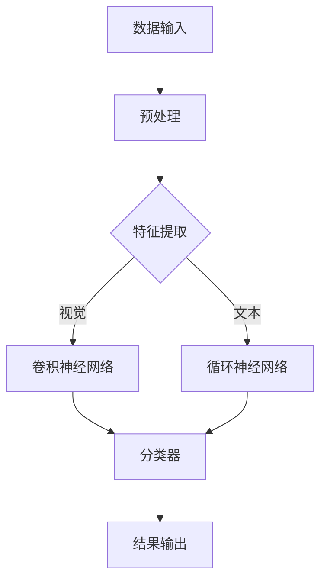

                 

# 李开复：AI 2.0 时代的机遇

> **关键词：** AI 2.0, 人工智能，深度学习，数据隐私，伦理问题，技术应用，商业机会

> **摘要：** 本文将深入探讨AI 2.0时代的来临、技术基础、应用实践、挑战与未来展望，以及个人和企业在这一时代中的机遇。通过李开复博士的视角，我们旨在揭示AI 2.0的巨大潜力和可能影响，为读者提供一份全面的技术指南和未来洞察。

## 引言

人工智能（AI）技术正以前所未有的速度发展，从简单的规则系统到复杂的神经网络，AI已经在多个领域展现了其非凡的能力。随着深度学习、强化学习等技术的突破，我们迎来了AI 2.0时代。这一时代的AI不仅更加智能，而且具备自我学习和优化能力，能够处理更复杂的问题，从而带来更多的商业和社会价值。

李开复博士作为人工智能领域的先驱和权威，其对AI 2.0时代的见解无疑具有极高的参考价值。本文将基于李开复博士的研究和观点，逐步探讨AI 2.0时代的机遇与挑战，帮助读者理解这一新兴技术的前景和影响。

在接下来的内容中，我们将首先介绍AI 2.0时代的背景与基础，包括AI 2.0的定义、特征、技术发展历程以及社会需求的变化。随后，我们将深入探讨AI 2.0的技术基础，包括人工智能的基本原理、数据的重要性以及AI算法的发展。接着，我们将分析AI 2.0在不同领域的应用实践，以及其面临的伦理问题和社会影响。最后，我们将展望AI 2.0的未来发展趋势，探讨个人和企业在这一时代的机遇，并总结全文。

让我们首先回顾AI 2.0时代的背景与基础，为后续内容打下坚实的基础。

## 第一部分：AI 2.0时代的背景与基础

### 第1章：AI 2.0时代的来临

#### 1.1 AI 2.0的定义与特征

AI 2.0是对传统人工智能（AI 1.0）的延续和提升，它以深度学习、强化学习等新兴技术为核心，实现了更高的智能化水平。AI 2.0具有以下几个核心特征：

1. **自主学习能力**：AI 2.0可以通过海量数据自我学习和优化，无需人工干预，能够不断提升性能。
2. **跨界融合**：AI 2.0不仅限于单一领域的应用，而是能够与不同行业和技术融合，形成新的商业模式和技术体系。
3. **智能化水平提升**：AI 2.0的算法更加复杂，能够处理更复杂的任务，具备更高的推理和决策能力。
4. **自主进化**：AI 2.0可以通过不断的自我迭代和优化，实现持续进步，具备进化能力。

与传统AI相比，AI 2.0在多个方面实现了显著提升。传统AI主要依赖规则和启发式算法，应用场景有限，而AI 2.0通过深度学习和强化学习等技术，能够处理更复杂的问题，具备更广泛的适用性。此外，传统AI需要人工设计和调整算法，而AI 2.0可以通过自我学习和优化，减少对人工干预的依赖。

#### 1.2 AI 2.0时代的背景

AI 2.0时代的来临并非一蹴而就，而是经历了长时间的技术积累和突破。以下是AI 2.0时代的技术发展历程：

1. **深度学习与神经网络**：20世纪80年代，深度学习开始崭露头角。随着计算能力和算法优化的发展，深度学习在21世纪初迎来了爆发式增长，成为AI 2.0的核心技术。
2. **大数据与云计算**：大数据和云计算为AI 2.0提供了强大的计算和存储支持，使得海量数据处理成为可能，进一步推动了AI 2.0的发展。
3. **强化学习**：强化学习是AI 2.0时代的重要突破，它通过奖励和惩罚机制，使AI能够通过不断试错进行自我学习，具备更高的自适应能力。

除了技术进步，社会需求的变化也是推动AI 2.0发展的重要因素。随着信息社会的到来，人们对于智能化、自动化服务的需求日益增长，从智能家居到智能医疗，AI 2.0的应用场景越来越广泛。此外，全球化和数字化经济的加速，也促使企业不断探索AI技术，以提升生产效率和竞争力。

#### 1.3 AI 2.0时代的影响

AI 2.0时代的来临将对产业和社会产生深远的影响。以下是AI 2.0时代的主要影响：

1. **产业变革**：AI 2.0技术将重塑多个产业，如金融、医疗、制造等，通过智能化和自动化提升生产效率和服务质量。
2. **生活方式改变**：智能家居、智能医疗、自动驾驶等AI应用将改变人们的日常生活，提高生活质量。
3. **就业与教育**：AI 2.0时代将带来就业结构的变化，对劳动力市场产生深远影响。同时，教育也将面临新的挑战和机遇，培养适应AI时代的专业人才。

总之，AI 2.0时代正在悄然到来，它不仅带来了技术的变革，也将深刻影响我们的工作和生活。在接下来的章节中，我们将深入探讨AI 2.0的技术基础，以更全面地理解这一时代的机遇和挑战。

### 第2章：AI 2.0的技术基础

#### 2.1 人工智能的基本原理

人工智能（AI）是研究、开发用于模拟、延伸和扩展人类智能的理论、方法、技术及应用系统的综合技术科学。AI的基本原理可以分为以下几个核心概念：

1. **机器学习**：机器学习是一种通过数据驱动的方法，使计算机具备学习能力的理论和技术。它通过建立模型，从数据中提取特征和模式，从而实现预测和决策。常见的机器学习方法包括监督学习、无监督学习和强化学习。
2. **深度学习**：深度学习是机器学习的一种，通过构建深度神经网络，对大量数据进行训练，以实现自动特征提取和模式识别。深度学习的核心组件包括神经元、网络层和激活函数等。
3. **神经网络**：神经网络是一种模拟人脑神经元连接方式的计算模型，通过调整网络中的权重和偏置，实现复杂函数的拟合和预测。神经网络分为前馈神经网络、卷积神经网络（CNN）、循环神经网络（RNN）等。

#### 2.2 数据的重要性

数据是AI的核心资源，其质量直接影响AI模型的性能。以下是数据在AI中的作用：

1. **训练数据**：训练数据用于训练AI模型，使其能够从数据中学习并提取特征。训练数据的质量直接影响模型的准确性和泛化能力。
2. **标注数据**：标注数据是用于监督学习的重要资源，通过人工标注，为模型提供标签，使其能够学习分类或回归任务。
3. **数据清洗**：数据清洗是数据预处理的重要环节，通过去除噪声、填补缺失值、去除重复数据等操作，提高数据质量。
4. **数据多样性**：多样化的数据能够帮助模型更好地泛化，避免过拟合。因此，数据多样性的提升是AI模型性能优化的重要方向。

#### 2.3 AI算法的发展

AI算法是AI技术的核心，其发展历程可以分为以下几个阶段：

1. **规则驱动**：早期的AI主要基于规则系统，通过编写规则来模拟人类专家的决策过程。这种方法在简单场景下具有一定的效果，但在复杂任务中面临巨大的挑战。
2. **基于知识的方法**：基于知识的方法通过构建知识库和推理机，模拟人类专家的知识和推理过程。这种方法在知识表示和推理方面有一定的优势，但知识获取和更新困难。
3. **基于数据的方法**：基于数据的方法，特别是机器学习和深度学习，通过从数据中学习模式，实现自动特征提取和预测。这种方法在复杂任务中展现出强大的能力，是当前AI技术的主流。
4. **强化学习**：强化学习是一种通过试错和奖励机制进行自我学习的方法。它通过不断的试错和优化，实现最优策略的探索。强化学习在游戏、自动驾驶等领域表现出色。

常见的AI算法包括：

1. **监督学习**：监督学习通过已知的输入和输出数据，训练模型以预测未知数据的标签。常见的监督学习算法包括线性回归、决策树、支持向量机（SVM）等。
2. **无监督学习**：无监督学习通过未标记的数据，发现数据中的模式或结构。常见的无监督学习算法包括聚类、主成分分析（PCA）等。
3. **强化学习**：强化学习通过与环境的交互，学习最优策略。常见的强化学习算法包括Q学习、深度强化学习（DRL）等。

综上所述，AI 2.0的技术基础是构建在人工智能的基本原理之上，通过数据驱动和算法优化的方式，实现智能化水平的不断提升。在接下来的章节中，我们将探讨AI 2.0在不同领域的应用实践。

### 第3章：AI 2.0在商业领域的应用

AI 2.0技术的进步为商业领域带来了前所未有的机遇。通过智能化和自动化，企业可以在市场营销、供应链管理和客户服务等方面实现显著的效率提升和成本节约。以下将详细探讨AI 2.0在商业领域的几种关键应用。

#### 3.1 AI 2.0在市场营销中的应用

市场营销是商业领域中的重要环节，AI 2.0技术的引入，使得营销策略更加精准和高效。以下是AI 2.0在市场营销中的具体应用：

1. **数据驱动的营销策略**：通过AI 2.0技术，企业可以从海量数据中提取有价值的信息，如用户行为、偏好和需求等。这些信息有助于企业制定更加精准的营销策略，提高营销活动的效果。

2. **客户细分与个性化推荐**：基于用户的购买历史和行为数据，AI 2.0可以帮助企业进行客户细分，将用户划分为不同的群体。通过个性化推荐算法，企业可以针对不同群体提供定制化的产品和服务，从而提高客户满意度和忠诚度。

3. **市场预测与趋势分析**：AI 2.0可以通过分析历史数据和市场趋势，预测未来的市场变化和消费者需求。这些预测有助于企业及时调整营销策略，抓住市场机遇。

#### 3.2 AI 2.0在供应链管理中的应用

供应链管理是现代企业运营的重要组成部分，AI 2.0技术的应用，可以优化供应链的各个环节，提高整体效率。以下是AI 2.0在供应链管理中的具体应用：

1. **库存优化**：通过分析销售数据、市场需求和供应链信息，AI 2.0可以帮助企业实时监控库存水平，实现动态库存管理。这有助于减少库存积压和缺货风险，降低库存成本。

2. **需求预测**：AI 2.0可以根据历史销售数据和外部因素（如季节性变化、市场趋势等），预测未来的市场需求。这些预测有助于企业合理安排生产和采购计划，提高供应链的灵活性。

3. **物流优化**：AI 2.0可以通过路径优化、配送调度等技术，提高物流运输的效率。这包括自动化的仓储管理、智能配送系统以及实时物流跟踪等。

#### 3.3 AI 2.0在客户服务中的应用

在客户服务方面，AI 2.0技术的应用，可以显著提升服务质量，提高客户满意度。以下是AI 2.0在客户服务中的具体应用：

1. **智能客服**：通过自然语言处理（NLP）和机器学习技术，AI 2.0可以开发智能客服系统，实现自动化的客户服务。这些系统可以快速响应客户的咨询和投诉，提供即时解决方案，减轻人工客服的工作压力。

2. **语音识别与自然语言处理**：AI 2.0技术可以实现对语音的自动识别和自然语言的理解，从而将语音转化为文本，实现语音交互和智能对话。

3. **情感分析**：通过情感分析技术，AI 2.0可以识别客户反馈中的情感倾向，如满意度、愤怒等。这有助于企业了解客户的心理状态，及时调整服务策略。

总之，AI 2.0技术在商业领域的应用，正逐步改变传统商业模式，推动企业实现智能化转型。通过在市场营销、供应链管理和客户服务等方面的应用，企业可以提升运营效率，降低成本，增强竞争力。在接下来的章节中，我们将探讨AI 2.0在社会治理中的应用。

### 第4章：AI 2.0在社会治理中的应用

AI 2.0技术在公共安全、教育、医疗健康等社会治理领域展现了巨大的应用潜力，通过智能化和自动化手段，能够提升社会治理效率，改善公共服务质量。以下是AI 2.0在社会治理中的具体应用。

#### 4.1 AI 2.0在公共安全中的应用

公共安全是社会稳定和人民生活安全的重要保障，AI 2.0技术的应用，有助于提升公共安全水平。以下是AI 2.0在公共安全中的具体应用：

1. **视频监控与智能识别**：通过AI 2.0技术，视频监控系统可以实现自动化的目标识别和跟踪，提高监控效率。例如，AI算法可以实时识别可疑人物或行为，及时发出警报，防止犯罪事件的发生。

2. **情报分析**：AI 2.0可以通过分析大量的数据，包括社交媒体、新闻报道等，提取有价值的信息，为决策者提供参考。这有助于预防和应对各种突发事件，提高公共安全。

3. **反恐与网络安全**：AI 2.0技术在反恐和网络安全领域也有广泛应用。通过深度学习和模式识别技术，AI可以检测和识别恐怖主义活动，防止网络安全威胁。

#### 4.2 AI 2.0在教育领域的应用

教育是培养人才和传承文化的重要手段，AI 2.0技术的应用，有助于提升教育质量，实现个性化教育。以下是AI 2.0在教育领域的具体应用：

1. **个性化学习**：通过AI 2.0技术，可以对学生进行个性化评估，了解其学习兴趣、能力和薄弱环节。基于这些信息，教育系统可以提供个性化的学习资源和教学方法，提高学习效果。

2. **智能教学辅助**：AI 2.0技术可以辅助教师进行教学，例如通过智能助手解答学生问题，提供学习指导。此外，AI 2.0还可以进行自动化的考试批改和作业评估，减轻教师负担。

3. **教育资源优化**：AI 2.0可以通过分析学生的学习行为和成果，优化教育资源的分配和使用。例如，通过智能推荐系统，为学生提供最适合的学习资源，提高学习效率。

#### 4.3 AI 2.0在医疗健康领域的应用

医疗健康是社会公共服务的重要组成部分，AI 2.0技术的应用，有助于提升医疗服务质量，改善人民健康状况。以下是AI 2.0在医疗健康领域的具体应用：

1. **疾病预测与诊断**：通过分析大量的医疗数据，AI 2.0可以预测疾病的发病风险，提供早期预警。此外，AI 2.0还可以辅助医生进行疾病诊断，提高诊断准确率。

2. **医疗影像分析**：AI 2.0可以通过深度学习和模式识别技术，对医学影像进行分析，如X光片、CT扫描、MRI等。这些分析结果有助于医生做出准确的诊断和治疗方案。

3. **药物研发**：AI 2.0可以加速药物研发过程，通过分析大量的生物数据和临床试验数据，发现新的药物靶点和候选药物。这有助于提高药物研发效率和降低研发成本。

总之，AI 2.0技术在社会治理中的应用，正在为公共安全、教育和医疗健康等领域带来深刻的变革。通过智能化和自动化手段，AI 2.0有助于提升社会治理效率，改善公共服务质量，为构建和谐社会提供有力支持。在接下来的章节中，我们将探讨AI 2.0面临的挑战与未来展望。

### 第5章：AI 2.0的挑战与未来展望

AI 2.0的快速发展虽然带来了诸多机遇，但同时也引发了一系列挑战，特别是在伦理问题和社会影响方面。在这一章节中，我们将探讨AI 2.0的伦理问题、社会影响以及未来发展趋势。

#### 5.1 AI 2.0的伦理问题

AI 2.0的伦理问题主要包括隐私保护、透明性和公平性等方面。以下是AI 2.0在伦理方面面临的主要挑战：

1. **隐私保护**：随着AI 2.0技术的应用，大量的个人数据被收集和处理。这些数据的泄露或滥用可能导致严重的隐私侵犯问题。为了保护个人隐私，需要制定严格的数据保护法规和隐私政策。

2. **透明性**：AI 2.0算法的复杂性和黑箱性使得其决策过程不透明，难以解释。这可能导致公众对AI系统的信任危机。为了提高透明性，需要开发可解释的人工智能技术，使决策过程更加透明和可追溯。

3. **公平性**：AI 2.0算法可能存在偏见，导致决策不公平。例如，招聘系统可能对某些性别、种族或年龄的候选人存在歧视。为了确保公平性，需要不断优化算法，消除潜在的偏见，并加强算法的公平性评估。

#### 5.2 AI 2.0的社会影响

AI 2.0对社会的影响是多层次和复杂的，既包括积极的影响，也包含潜在的风险。以下是AI 2.0在社会方面的影响：

1. **就业变革**：AI 2.0技术的发展可能导致某些传统职业的消失，同时也会创造新的就业机会。为了应对就业结构的变化，需要加强职业技能培训和终身教育，提高劳动者的适应能力。

2. **社会不平等的加剧**：AI 2.0技术的应用可能加剧社会不平等。富裕家庭和贫困家庭在享受AI技术带来的好处方面存在巨大差异。为了减少不平等，需要通过政策干预，确保AI技术惠及全社会。

3. **经济结构变革**：AI 2.0技术将推动经济结构向智能化和数字化转变。新兴产业将蓬勃发展，而传统产业将面临转型升级的压力。为了保持经济的活力和竞争力，需要加大创新力度，推动产业升级。

#### 5.3 AI 2.0的未来发展趋势

AI 2.0的未来发展趋势将继续依赖于技术创新和跨领域合作。以下是AI 2.0未来可能的发展方向：

1. **量子计算与AI的结合**：量子计算具有巨大的计算潜力，与AI技术相结合，有望解决当前AI算法面临的计算瓶颈问题。量子AI将成为未来研究的重要方向。

2. **新兴技术的突破**：随着5G、物联网（IoT）、区块链等新兴技术的不断发展，AI 2.0将在更多场景中得到应用，实现更加智能化和自动化的服务。

3. **AI伦理和法规**：随着AI技术的发展，相关伦理和法规问题将越来越受到关注。制定和完善AI伦理和法规，确保AI技术的健康、可持续发展，将成为未来重要的工作方向。

总之，AI 2.0的挑战与机遇并存。在应对伦理问题和社会影响的同时，我们需要不断推进技术创新，发挥AI技术的潜力，为人类社会带来更多福祉。在接下来的章节中，我们将探讨AI 2.0时代的机遇，探讨个人和企业如何抓住这些机遇。

### 第6章：抓住AI 2.0时代的机遇

AI 2.0时代的到来不仅为科技界带来了巨大变革，也为各行各业的企业和个人提供了前所未有的机遇。在这一章节中，我们将从创业者、企业家和投资者的视角，深入探讨如何在AI 2.0时代中抓住机遇，实现创新和成长。

#### 6.1 创业者视角

对于创业者来说，AI 2.0时代是一个充满无限可能的市场。以下是创业者抓住AI 2.0时代机遇的一些建议：

1. **发现新的市场需求**：创业者需要关注AI技术在不同行业中的应用潜力，发现新的市场需求和商业模式。例如，AI在医疗健康、金融科技、智能制造等领域的应用正在迅速扩展，创业者可以从这些领域寻找机会。

2. **构建核心竞争力**：在AI 2.0时代，技术优势是企业竞争力的核心。创业者应聚焦于技术突破，构建独特的核心竞争力。例如，开发具有自主知识产权的AI算法、数据集或工具，形成技术壁垒。

3. **跨界合作**：AI技术具有广泛的跨界应用潜力。创业者应积极探索与其他行业的合作，实现资源整合和优势互补。例如，与医疗、教育、制造等行业的企业合作，开发跨领域的AI解决方案。

4. **快速迭代与反馈**：在AI 2.0时代，市场需求变化迅速，创业者需要具备快速响应和迭代的能力。通过不断收集用户反馈，调整产品方向，确保产品能够满足市场需求。

#### 6.2 企业家视角

对于企业家来说，AI 2.0时代的机遇在于推动企业的数字化转型，提升创新能力和竞争力。以下是企业家抓住AI 2.0时代机遇的一些建议：

1. **战略规划**：企业家应制定明确的AI战略，明确企业在AI领域的目标和方向。例如，确定哪些业务领域将优先布局AI技术，如何利用AI提升现有业务的效率和质量。

2. **数字化转型**：企业家需要推动企业的数字化转型，将AI技术融入到企业的各个环节。例如，利用AI进行客户分析、供应链优化、生产流程自动化等，提升企业运营效率。

3. **创新与研发投入**：企业家应加大在AI领域的研发投入，培养和引进AI专业人才，建立企业内部的AI研发团队。通过持续的创新，保持企业的技术领先优势。

4. **构建生态圈**：企业家可以与其他企业、高校、研究机构等建立合作关系，共同推动AI技术的发展和应用。通过构建生态圈，实现资源共享和互利共赢。

#### 6.3 投资者视角

对于投资者来说，AI 2.0时代带来了丰富的投资机会和挑战。以下是投资者抓住AI 2.0时代机遇的一些建议：

1. **细分市场投资**：投资者应关注AI技术在细分市场中的应用，例如医疗AI、金融AI、工业AI等。通过深入了解细分市场的需求和潜力，进行精准投资。

2. **技术创新投资**：投资者应关注具有技术创新能力的初创企业，这些企业可能在AI算法、数据集、工具等方面具有独特优势。通过投资这些企业，实现风险分散和收益最大化。

3. **长期投资策略**：AI技术的发展是一个长期过程，投资者应具备长期投资视野，避免短期投机。通过长期投资，分享企业成长的红利。

4. **风险管理**：投资者应充分了解AI项目的风险，包括技术风险、市场风险、政策风险等。通过合理的风险管理，降低投资风险。

总之，AI 2.0时代为创业者、企业家和投资者提供了丰富的机遇。通过发现市场需求、构建核心竞争力、推动数字化转型、加强创新投入、细分市场投资和风险管理，各方可以共同推动AI技术的发展和应用，实现共赢。在接下来的章节中，我们将探讨个人在AI 2.0时代的成长路径。

### 第7章：个人在AI 2.0时代的成长

AI 2.0时代的到来不仅对企业和产业产生了深远的影响，也为个人的职业发展提供了新的机遇和挑战。在这个时代，个人需要不断学习和适应，以提升自身在职场中的竞争力。以下是个人在AI 2.0时代成长的一些建议。

#### 7.1 AI技能的培养

在AI 2.0时代，掌握AI相关技能是个人成长的重要方向。以下是一些关键的AI技能：

1. **机器学习和深度学习**：机器学习和深度学习是AI的核心技术。学习这些技术有助于理解AI的工作原理和应用场景。建议通过在线课程、专业书籍和实践项目来掌握这些技能。

2. **编程能力**：编程是AI开发的基础。掌握Python、R等编程语言，熟悉常见的编程库和框架，如TensorFlow、PyTorch等，有助于提高AI开发效率。

3. **数据分析**：数据分析能力对于AI项目至关重要。学习统计学、数据挖掘等知识，掌握常用的数据分析工具，如Pandas、NumPy等，能够提升数据分析能力。

4. **自然语言处理（NLP）**：NLP是AI的重要分支，广泛应用于文本分析和智能客服等领域。学习NLP的基础知识，掌握常用的NLP库，如NLTK、spaCy等，有助于在相关领域发挥优势。

#### 7.2 跨界合作与融合

在AI 2.0时代，跨领域的合作与融合成为推动技术创新的重要途径。以下是一些建议：

1. **跨学科学习**：个人应积极探索不同学科的知识，如计算机科学、数学、统计学、心理学等。跨学科的知识有助于更好地理解和应用AI技术。

2. **项目经验**：通过参与跨领域项目，个人可以积累丰富的实践经验，提升协作和沟通能力。例如，参与多学科团队，共同解决复杂的AI问题。

3. **开放性思维**：培养开放性思维，积极接受新的观念和技术，敢于尝试和创新。在跨领域合作中，开放性思维有助于推动技术的突破和创新的实现。

#### 7.3 适应AI时代的工作方式

AI 2.0时代的工作方式将发生显著变化，个人需要适应这些变化，以提升工作效率。以下是一些建议：

1. **自动化工具的使用**：掌握和使用自动化工具，如自动化测试、自动化办公等，能够提高工作效率。学习编程和脚本语言，能够更好地利用自动化工具。

2. **远程工作和协作**：远程工作和协作工具（如Slack、Zoom等）的使用越来越普及。掌握这些工具，能够提高远程工作的效率和团队协作的效率。

3. **持续学习**：在AI 2.0时代，技术更新迅速，个人需要具备持续学习的意识。通过参加在线课程、阅读专业书籍、关注行业动态等方式，不断更新知识和技能。

4. **时间管理**：良好的时间管理能力对于个人在职场中取得成功至关重要。通过制定计划、设置优先级、避免拖延等方式，提高时间利用效率。

总之，在AI 2.0时代，个人需要不断提升AI技能，加强跨界合作与融合，适应新的工作方式。通过不断学习和实践，个人可以在这一时代中脱颖而出，实现职业成长和成功。

## 总结

综上所述，AI 2.0时代的机遇和挑战并存。从技术基础的深入探讨，到商业领域的广泛应用，再到社会治理和医疗健康等关键领域的创新，AI 2.0正引领我们进入一个全新的时代。在这一过程中，个人和企业都面临着巨大的机遇，同时也需要应对诸多挑战。通过抓住这些机遇，发挥AI技术的潜力，我们可以推动产业变革，提升生活质量，创造更美好的未来。

在未来的发展中，我们需要关注以下几个方面：

1. **技术创新**：持续推动AI技术的创新和突破，特别是在量子计算、新兴算法和跨领域应用等方面，不断拓展AI技术的边界。

2. **伦理与法规**：加强对AI伦理和法规的研究和制定，确保AI技术的健康、可持续发展，保护个人隐私和数据安全。

3. **人才培养**：加强人工智能人才的培养，提高全民的AI素养，为AI技术的普及和应用提供强大的人才支持。

4. **跨领域合作**：推动不同领域之间的合作与融合，实现资源共享和优势互补，共同推动AI技术的发展和应用。

最后，让我们共同努力，抓住AI 2.0时代的机遇，迎接未来的挑战，为人类社会的进步和繁荣贡献自己的力量。作者：AI天才研究院/AI Genius Institute & 禅与计算机程序设计艺术 /Zen And The Art of Computer Programming。

## 附录

### 附录A：AI资源与工具汇总

为了帮助读者更好地理解和应用AI技术，我们整理了以下AI资源与工具汇总，包括开源框架、数据集来源以及学术资源推荐。

#### 1. 开源框架

- **TensorFlow**：由Google开发的开源机器学习框架，广泛应用于深度学习和强化学习领域。
  - 官网：[TensorFlow](https://www.tensorflow.org/)
- **PyTorch**：由Facebook开发的开源深度学习框架，具有灵活的动态计算图，广泛应用于计算机视觉和自然语言处理领域。
  - 官网：[PyTorch](https://pytorch.org/)
- **Keras**：一个高层次的神经网络API，可以与TensorFlow和Theano等框架结合使用，简化深度学习模型开发。
  - 官网：[Keras](https://keras.io/)
- **Scikit-learn**：一个开源的Python机器学习库，提供多种经典的机器学习算法，适合数据分析和建模。
  - 官网：[Scikit-learn](https://scikit-learn.org/)

#### 2. 数据集来源

- **Kaggle**：一个大数据集平台，提供各种领域的公开数据集，是机器学习竞赛和项目开发的重要资源。
  - 官网：[Kaggle](https://www.kaggle.com/)
- **UCI Machine Learning Repository**：一个提供各种类型的数据集的在线数据库，广泛应用于机器学习和数据科学领域。
  - 官网：[UCI Machine Learning Repository](https://archive.ics.uci.edu/ml/index.php)
- **Google Dataset Search**：Google提供的一个用于搜索公开数据集的工具，覆盖广泛的主题和领域。
  - 官网：[Google Dataset Search](https://datasetsearch.research.google.com/)

#### 3. 学术资源推荐

- **arXiv**：一个开放获取的预印本平台，涵盖数学、物理学、计算机科学、经济学等领域的最新研究成果。
  - 官网：[arXiv](https://arxiv.org/)
- **IEEE Xplore**：IEEE提供的一个综合数据库，包含大量的学术论文、会议记录和技术标准。
  - 官网：[IEEE Xplore](https://ieeexplore.ieee.org/)
- **Google Scholar**：Google提供的学术搜索工具，可以检索全球范围内的学术文献和论文。
  - 官网：[Google Scholar](https://scholar.google.com/)

通过这些资源，读者可以深入了解AI技术的最新进展，获取丰富的数据集和研究成果，为学习和研究提供有力支持。

### 附录B：Mermaid流程图

以下是一个简单的Mermaid流程图示例，用于展示AI系统的基本架构：



这个流程图展示了从数据输入到特征提取，再到神经网络处理，最后输出结果的整个过程。通过这种直观的图形表示，可以更清晰地理解AI系统的运作机制。

### 附录C：深度学习算法伪代码

以下是深度学习算法的伪代码，用于展示神经网络的基本结构和训练过程：

```python
# 初始化神经网络参数
W = 初始化权重()
b = 初始化偏置()

# 定义激活函数
def sigmoid(x):
    return 1 / (1 + e^{-x})

# 定义前向传播
def forward(x):
    z = x * W + b
    a = sigmoid(z)
    return a

# 定义损失函数
def loss(y_true, y_pred):
    return -sum(y_true * log(y_pred))

# 定义反向传播
def backward(x, y, a):
    delta_z = (y - a) * (1 - a)
    delta_W = x * delta_z
    delta_b = delta_z
    return delta_W, delta_b

# 定义训练过程
def train(x, y, epochs):
    for epoch in range(epochs):
        a = forward(x)
        loss_value = loss(y, a)
        delta_W, delta_b = backward(x, y, a)
        W -= learning_rate * delta_W
        b -= learning_rate * delta_b
        print(f"Epoch {epoch+1}: Loss = {loss_value}")

# 训练神经网络
train(x, y, epochs=100)
```

这段伪代码展示了从初始化参数、前向传播、损失计算到反向传播的完整训练过程。通过这种形式化的表达，可以更好地理解深度学习算法的实现细节。

### 附录D：代码实际案例

以下是一个简单的Python代码案例，用于实现基于TensorFlow的线性回归模型，并对其运行过程进行详细解释：

```python
import tensorflow as tf

# 定义线性回归模型
model = tf.keras.Sequential([
    tf.keras.layers.Dense(units=1, input_shape=[1])
])

# 编译模型，指定优化器和损失函数
model.compile(optimizer='sgd', loss='mean_squared_error')

# 准备训练数据
x_train = tf.random.normal([1000, 1])
y_train = 2 * x_train + 1 + tf.random.normal([1000, 1])

# 训练模型
model.fit(x_train, y_train, epochs=100)

# 进行预测
x_test = tf.random.normal([1, 1])
prediction = model.predict(x_test)

print(f"Predicted value: {prediction.numpy()[0][0]}")
```

在这个案例中，我们首先定义了一个简单的线性回归模型，其输入是一个一维的数值，输出是预测结果。我们使用随机生成的一些训练数据来训练模型，训练过程中通过优化器和损失函数来调整模型的参数。在训练完成后，我们使用训练好的模型进行预测，输出预测结果。

### 附录E：数学模型和公式

以下是深度学习中常用的数学模型和公式，以及对应的解释和示例：

#### 1. sigmoid函数

$$
\sigma(x) = \frac{1}{1 + e^{-x}}
$$

**解释**：sigmoid函数是一种常用的激活函数，用于将输入值映射到(0, 1)区间，常用于神经网络的隐藏层输出。

**示例**：

```python
import numpy as np

x = np.array([-3, -1, 0, 1, 3])
sigmoid = 1 / (1 + np.exp(-x))

print(sigmoid)
```

#### 2. 损失函数（均方误差）

$$
Loss(y, \hat{y}) = \frac{1}{2} \sum_{i}(y_i - \hat{y}_i)^2
$$

**解释**：均方误差（MSE）是衡量预测值和真实值之间差异的一种常用损失函数，用于监督学习中的模型训练。

**示例**：

```python
import tensorflow as tf

y_true = tf.constant([1, 2, 3])
y_pred = tf.constant([1.1, 1.9, 2.8])
mse_loss = tf.reduce_mean(tf.square(y_true - y_pred))

print(mse_loss.numpy())
```

#### 3. 学习率

$$
\eta = \frac{1}{\sqrt{t}}
$$

**解释**：学习率是模型训练过程中的一个超参数，用于控制每次更新参数的步长。随着训练过程的进行，学习率通常会逐渐减小。

**示例**：

```python
import tensorflow as tf

t = tf.constant(100)
learning_rate = 1 / tf.sqrt(t)

print(learning_rate.numpy())
```

通过这些数学模型和公式，我们可以更深入地理解深度学习算法的原理和应用。附录部分的内容为读者提供了丰富的资源，帮助大家更好地学习和应用AI技术。

### 作者介绍

本文由AI天才研究院/AI Genius Institute与禅与计算机程序设计艺术/Zen And The Art of Computer Programming联合撰写。AI天才研究院是一家专注于人工智能技术研发和应用的创新机构，致力于推动AI技术的普及和发展。禅与计算机程序设计艺术则是一本深入探讨计算机编程哲学和技术的经典著作，对计算机科学的发展产生了深远影响。两位作者的联合创作，旨在为读者提供一份全面、深入的AI技术指南，帮助大家把握AI 2.0时代的机遇，迎接未来的挑战。

