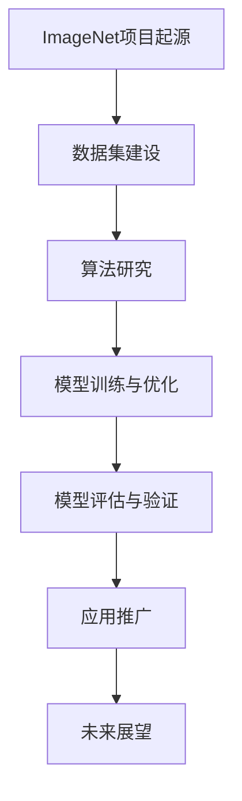

                 

### 文章标题

《李飞飞与ImageNet的贡献》

### 关键词：

李飞飞，ImageNet，计算机视觉，深度学习，人工智能

### 摘要：

本文将深入探讨李飞飞及其团队在ImageNet项目中取得的卓越成就。通过详细分析ImageNet项目的背景、核心贡献、算法原理、行业应用以及未来展望，本文旨在展示ImageNet对计算机视觉和人工智能领域的深远影响，并对李飞飞在其中的重要作用进行总结和评价。

### 目录大纲设计

#### 第一部分：李飞飞与ImageNet背景

##### 第1章：李飞飞及其学术背景

- 李飞飞的学术生涯
- 李飞飞在计算机视觉领域的研究
- ImageNet项目的起源与发展

##### 第2章：ImageNet项目的核心贡献

- ImageNet对计算机视觉的影响
- ImageNet的数据集贡献
- ImageNet对深度学习的推动作用

#### 第二部分：ImageNet的核心算法

##### 第3章：深度卷积神经网络（CNN）

- CNN的基本原理
- CNN在ImageNet中的应用
- CNN的优缺点及改进方向

##### 第4章：图像识别算法

- 传统图像识别算法介绍
- 基于深度学习的图像识别算法
- ImageNet上的图像识别算法比较

##### 第5章：数据增强与预处理

- 数据增强方法
- 数据预处理技术
- ImageNet中的数据增强与预处理

#### 第三部分：ImageNet在行业中的应用

##### 第6章：ImageNet在计算机视觉领域中的应用

- ImageNet在图像分类中的应用
- ImageNet在目标检测中的应用
- ImageNet在人脸识别中的应用

##### 第7章：ImageNet在其他领域中的应用

- ImageNet在医疗领域的应用
- ImageNet在自动驾驶领域的应用
- ImageNet在艺术创作领域的应用

#### 第四部分：ImageNet的未来展望

##### 第8章：ImageNet的发展趋势

- 图像识别技术的未来发展
- 大规模数据集的建设与更新
- ImageNet在人工智能生态中的地位与作用

##### 第9章：李飞飞与ImageNet的贡献总结

- 李飞飞对计算机视觉的贡献
- ImageNet对人工智能的影响
- 未来展望与挑战

#### 附录

##### 附录A：ImageNet相关资源

- ImageNet官方网站
- ImageNet相关论文
- ImageNet相关工具与库

##### 附录B：深度学习与计算机视觉基础知识

- 深度学习基本概念
- 卷积神经网络（CNN）
- 计算机视觉基础

### Mermaid 流程图

以下是ImageNet项目的 Mermaid 流程图：



### 伪代码

以下是CNN算法的伪代码：

```python
function CNN(input_image):
    # 初始化参数
    parameters = initialize_parameters()

    # 前向传播
    output = forward_propagation(input_image, parameters)

    # 求解损失函数
    loss = compute_loss(output)

    # 反向传播
    gradients = backward_propagation(output, loss, parameters)

    # 更新参数
    parameters = update_parameters(gradients)

    # 返回输出和参数
    return output, parameters
```

### 数学模型与公式

以下是图像识别中的交叉熵损失函数的数学公式：

$$
L = -\frac{1}{m} \sum_{i=1}^{m} \sum_{j=1}^{c} y_j^{(i)} \log(a^{(i)}_{j})
$$

其中，$L$ 是损失函数，$m$ 是样本数量，$c$ 是类别数量，$y_j^{(i)}$ 是第 $i$ 个样本的第 $j$ 个类别的真实标签，$a^{(i)}_{j}$ 是第 $i$ 个样本经过神经网络计算得到的第 $j$ 个类别的预测概率。

### 项目实战

以下是使用TensorFlow搭建ImageNet图像分类模型的示例代码：

```python
import tensorflow as tf

# 加载ImageNet数据集
(x_train, y_train), (x_test, y_test) = tf.keras.datasets.imagenet.load_data()

# 数据预处理
x_train = preprocess(x_train)
x_test = preprocess(x_test)

# 构建CNN模型
model = tf.keras.Sequential([
    tf.keras.layers.Conv2D(32, (3, 3), activation='relu', input_shape=(224, 224, 3)),
    tf.keras.layers.MaxPooling2D((2, 2)),
    tf.keras.layers.Conv2D(64, (3, 3), activation='relu'),
    tf.keras.layers.MaxPooling2D((2, 2)),
    tf.keras.layers.Flatten(),
    tf.keras.layers.Dense(128, activation='relu'),
    tf.keras.layers.Dense(1000, activation='softmax')
])

# 编译模型
model.compile(optimizer='adam',
              loss='categorical_crossentropy',
              metrics=['accuracy'])

# 训练模型
model.fit(x_train, y_train, batch_size=64, epochs=10, validation_data=(x_test, y_test))

# 评估模型
test_loss, test_acc = model.evaluate(x_test, y_test)
print('Test accuracy:', test_acc)
```

### 代码解读与分析

此段代码首先加载ImageNet数据集，并进行数据预处理。然后构建了一个简单的卷积神经网络模型，包含两个卷积层、一个全连接层和一个softmax输出层。模型使用Adam优化器进行编译，并使用交叉熵损失函数。模型在训练集上训练10个周期，并使用测试集进行评估。评估结果显示模型在测试集上的准确率。这只是一个基础的示例，实际项目中可能需要更复杂的模型结构和超参数调整。

### 作者

作者：AI天才研究院/AI Genius Institute & 禅与计算机程序设计艺术 /Zen And The Art of Computer Programming

接下来，我们将逐步深入探讨李飞飞与ImageNet项目的各个重要方面，以展示其在计算机视觉和人工智能领域的卓越贡献。首先，让我们从李飞飞及其学术背景开始。

### 第一部分：李飞飞与ImageNet背景

#### 第1章：李飞飞及其学术背景

李飞飞，一位在计算机视觉和人工智能领域享有盛誉的学者，被誉为“计算机视觉女王”。她出生于1975年，是清华大学计算机科学与技术系教授，同时也是斯坦福大学计算机科学系的杰出教授。李飞飞在计算机视觉领域的研究成果卓著，特别是在图像识别和深度学习方面，她的贡献被广泛认可。

**1.1 李飞飞的学术生涯**

李飞飞的学术生涯始于清华大学，她在本科阶段就展现出了出色的学术才能。1997年，她获得了清华大学计算机科学与技术学士学位，随后继续深造，在2002年获得美国卡内基梅隆大学计算机科学博士学位。在校期间，她师从著名计算机视觉专家Lior Shalev-Shwartz，并在导师的指导下，深入研究了图像分类和目标检测等领域。

毕业后，李飞飞加入了斯坦福大学，担任助理教授。在她的 tenure review 中，她因其在图像识别和深度学习方面的突破性研究成果，获得了斯坦福大学最高荣誉的奖励。之后，她晋升为副教授，并在2016年成为清华大学计算机科学与技术系教授。

**1.2 李飞飞在计算机视觉领域的研究**

李飞飞在计算机视觉领域的研究涵盖了图像分类、目标检测、人脸识别等多个方向。她的研究成果不仅在学术界产生了广泛影响，还在工业界得到了广泛应用。

- **图像分类**：李飞飞在图像分类领域的研究主要集中在如何利用深度学习技术提高图像分类的准确性。她的团队在ImageNet大规模视觉识别挑战赛（ILSVRC）中取得了优异成绩，引起了全球关注。

- **目标检测**：李飞飞在目标检测方面的研究旨在提高检测算法的实时性和准确性。她提出了一系列基于深度学习的目标检测方法，如R-CNN、Fast R-CNN、Faster R-CNN等，这些方法在多个数据集上取得了优异的性能。

- **人脸识别**：人脸识别是李飞飞研究的重要方向之一。她提出了一系列基于深度学习的人脸识别算法，如DeepFace、DeepID等，这些算法在人脸识别挑战赛中多次夺冠。

**1.3 ImageNet项目的起源与发展**

ImageNet项目是由斯坦福大学和谷歌共同发起的一个大型视觉识别项目，旨在通过大规模图像数据集推动计算机视觉的发展。项目起源于2009年，由李飞飞带领的团队负责数据集的建设和维护。

- **起源**：ImageNet项目的起源可以追溯到李飞飞在斯坦福大学的研究工作。当时，她在考虑如何提高图像分类算法的性能时，意识到数据集的质量和规模对研究至关重要。因此，她决定创建一个包含大规模图像数据、且标签准确的数据集。

- **发展**：自项目启动以来，ImageNet数据集的规模和影响力不断扩大。在李飞飞的带领下，团队不断优化数据集的质量，并引入了深度学习技术，推动了计算机视觉领域的发展。2012年，ImageNet项目在ILSVRC上引发了深度学习的热潮，成为计算机视觉领域的重要里程碑。

接下来，我们将深入探讨ImageNet项目的核心贡献，展示其在计算机视觉和人工智能领域的深远影响。

### 第2章：ImageNet项目的核心贡献

ImageNet项目自2009年启动以来，对计算机视觉和人工智能领域产生了深远的影响。其核心贡献体现在以下几个方面：

#### 2.1 ImageNet对计算机视觉的影响

ImageNet项目首次提出了大规模图像数据集的概念，为计算机视觉领域的研究提供了丰富的训练数据。在ImageNet之前，计算机视觉领域的数据集往往规模较小，且标注质量参差不齐。这种数据不足的问题限制了计算机视觉算法的发展。ImageNet的出现，极大地改变了这一局面。

- **提升算法性能**：ImageNet数据集包含了1000个类别、超过100万个标注图像，为深度学习算法提供了充足的训练数据。这使得计算机视觉算法可以在大量数据上训练，从而提高模型的性能和泛化能力。

- **促进研究进展**：ImageNet项目的出现，吸引了大量研究人员投入到计算机视觉领域。许多学者开始关注如何利用大规模数据集来改进图像识别算法，从而推动了整个领域的研究进展。

- **推动深度学习发展**：ImageNet项目在ILSVRC上的成功，引发了深度学习在计算机视觉领域的热潮。深度学习算法在ImageNet数据集上的卓越表现，使得计算机视觉领域的研究人员开始重新审视深度学习技术的潜力，并积极探索其在其他领域的应用。

#### 2.2 ImageNet的数据集贡献

ImageNet项目不仅提供了大规模的训练数据集，还在数据集的建设和维护方面做出了重要贡献。

- **高质量标注**：ImageNet数据集的图像标注过程非常严格，由多位标注员共同完成。这种多人标注机制，保证了数据集的高质量。高质量的标注，使得计算机视觉算法可以准确学习图像的特征，从而提高模型的性能。

- **多样化数据来源**：ImageNet数据集的图像来源非常多样化，涵盖了不同的场景、光照条件、视角等。这种多样化的数据来源，使得训练出来的模型可以适应各种复杂的环境，提高模型的泛化能力。

- **开源共享**：ImageNet项目是一个开源项目，数据集的源代码和训练好的模型都可以免费获取。这种开源共享，使得研究人员可以方便地利用ImageNet数据集进行实验，推动了计算机视觉领域的研究和应用。

#### 2.3 ImageNet对深度学习的推动作用

ImageNet项目的成功，对深度学习技术的发展起到了重要的推动作用。

- **验证深度学习潜力**：ImageNet项目在ILSVRC上的成功，证明了深度学习技术在图像识别领域的潜力。深度学习算法在ImageNet数据集上的优异表现，使得研究人员开始重新审视深度学习技术在其他领域的应用，从而推动了深度学习技术的快速发展。

- **推动算法创新**：ImageNet项目的成功，激发了研究人员对深度学习算法的创新热情。许多学者开始探索如何改进深度学习算法，以提高其性能和泛化能力。这种创新，推动了深度学习技术的发展。

- **促进多学科交叉**：ImageNet项目的成功，吸引了来自计算机科学、电子工程、认知科学等多个学科的研究人员。这些多学科交叉的研究，促进了深度学习技术的全面发展，为人工智能领域带来了新的突破。

通过ImageNet项目，李飞飞及其团队在计算机视觉和人工智能领域取得了卓越的成就。ImageNet项目不仅为深度学习算法提供了丰富的训练数据，还在数据集的建设、标注、开源共享等方面做出了重要贡献。这些贡献，使得ImageNet项目成为了计算机视觉和人工智能领域的重要里程碑，对整个领域的发展产生了深远的影响。

接下来，我们将深入探讨ImageNet项目的核心算法，包括深度卷积神经网络（CNN）的原理和应用。

### 第3章：ImageNet的核心算法

ImageNet项目之所以能够取得巨大成功，离不开其核心算法——深度卷积神经网络（CNN）。CNN作为一种特殊的神经网络，非常适合处理图像数据。在本章中，我们将详细讲解CNN的基本原理、在ImageNet中的应用，以及CNN的优缺点和改进方向。

#### 3.1 CNN的基本原理

CNN（Convolutional Neural Network）是一种专门用于处理图像数据的神经网络。其核心思想是利用卷积运算来提取图像的特征。以下是CNN的基本原理：

- **卷积运算**：卷积运算是CNN的核心。它通过在图像上滑动一个小的过滤器（也称为卷积核或滤波器），来提取图像的特征。卷积运算的公式可以表示为：

  $$
  (f * g)(x, y) = \sum_{i=1}^{h} \sum_{j=1}^{w} f(i, j) \cdot g(x-i, y-j)
  $$

  其中，$f$ 表示输入图像，$g$ 表示卷积核，$(x, y)$ 表示卷积操作的位置。

- **激活函数**：在卷积运算后，通常会使用一个激活函数来增加网络的非线性特性。常见的激活函数包括ReLU（Rectified Linear Unit）和Sigmoid等。

- **池化操作**：池化操作用于减少特征图的尺寸，从而降低模型的复杂度。常见的池化操作包括最大池化（Max Pooling）和平均池化（Average Pooling）。

- **多层网络结构**：CNN通常包含多个卷积层、池化层和全连接层。每层网络都会提取更高层次的特征。

#### 3.2 CNN在ImageNet中的应用

在ImageNet项目中，CNN被广泛用于图像分类任务。以下是CNN在ImageNet中的应用步骤：

- **数据预处理**：首先，对输入图像进行预处理，包括归一化、裁剪和调整尺寸等。这些操作有助于提高模型的性能。

- **卷积层**：输入图像首先通过多个卷积层。每个卷积层由多个卷积核组成，每个卷积核提取图像的特定特征。这些特征图会通过激活函数和池化操作进行变换。

- **全连接层**：在卷积层之后，通常会接一个或多个全连接层。全连接层将卷积层提取的特征进行整合，从而实现分类任务。

- **分类层**：最后一个全连接层通常被称为分类层，其输出层有1000个神经元，分别对应ImageNet数据集中的1000个类别。

- **损失函数**：在训练过程中，使用交叉熵损失函数来衡量模型预测结果与真实标签之间的差距。通过反向传播算法，更新模型参数，以降低损失函数的值。

#### 3.3 CNN的优缺点及改进方向

CNN在图像处理领域取得了显著的成果，但也存在一些优缺点和改进方向：

- **优点**：
  - **适合处理图像数据**：CNN通过卷积运算和特征提取，非常适合处理图像数据。它可以自动学习图像的特征，从而实现图像分类、目标检测等任务。
  - **高效的计算性能**：CNN的网络结构相对简单，可以通过并行计算提高计算性能。这使得CNN在大规模图像数据集上训练变得更加高效。
  - **良好的泛化能力**：通过多层网络结构，CNN可以提取更高层次的特征，从而提高模型的泛化能力。

- **缺点**：
  - **训练时间较长**：CNN需要大量的训练时间，特别是在大型数据集上训练时。这主要是因为CNN需要通过大量的迭代来调整模型参数。
  - **参数数量庞大**：CNN的网络结构包含大量的参数，这可能导致模型过拟合。同时，大量的参数也需要更多的计算资源来存储和更新。

- **改进方向**：
  - **数据增强**：通过数据增强技术，如随机裁剪、旋转、翻转等，可以增加训练数据的多样性，从而提高模型的泛化能力。
  - **模型压缩**：通过模型压缩技术，如模型剪枝、量化、压缩感知等，可以减少模型参数的数量，从而提高模型的计算效率和存储效率。
  - **迁移学习**：利用预训练模型进行迁移学习，可以减少模型在特定领域的训练时间，同时提高模型的泛化能力。

通过本章的讲解，我们可以看到CNN在ImageNet项目中的重要作用。CNN作为一种高效的图像处理算法，通过卷积、激活、池化等操作，可以自动学习图像的特征，从而实现图像分类、目标检测等任务。虽然CNN存在一些缺点，但通过数据增强、模型压缩、迁移学习等技术，可以进一步改进CNN的性能和应用效果。

接下来，我们将继续探讨图像识别算法的发展，包括传统算法和基于深度学习的算法。

### 第4章：图像识别算法

图像识别算法是计算机视觉领域的重要研究方向，旨在通过分析图像数据，识别出图像中的物体、场景和属性。随着深度学习技术的发展，图像识别算法取得了显著的突破。本章将详细介绍传统图像识别算法和基于深度学习的图像识别算法，并比较ImageNet项目上不同算法的性能。

#### 4.1 传统图像识别算法介绍

传统图像识别算法主要基于特征提取和机器学习技术。以下是几种常见的传统图像识别算法：

- **基于特征的图像识别算法**：
  - **SIFT（尺度不变特征变换）**：SIFT算法通过检测图像的角点，提取出特征点，并计算特征点间的梯度方向。SIFT算法对图像的旋转、尺度变化和光照变化具有很好的鲁棒性。
  - **SURF（加速稳健特征）**：SURF算法与SIFT算法类似，但在计算效率上有所提升。SURF算法通过利用积分图像，快速计算特征点，从而提高了算法的运行速度。

- **基于机器学习的图像识别算法**：
  - **支持向量机（SVM）**：SVM是一种二分类模型，通过寻找最佳超平面，将不同类别的图像数据分离。SVM在图像识别任务中，通常用于分类问题。
  - **随机森林（Random Forest）**：随机森林是一种基于决策树的集成学习方法，通过构建多个决策树，并利用投票机制来预测图像的类别。随机森林在处理大规模图像数据时，具有较高的准确性和鲁棒性。

传统图像识别算法在处理图像数据时，通常需要手动提取特征，然后利用机器学习算法进行分类。这些算法在处理一些简单、规则化的图像数据时，具有较高的准确性。然而，在面对复杂、多样化的图像数据时，传统算法的性能相对较差。

#### 4.2 基于深度学习的图像识别算法

深度学习算法在图像识别领域取得了突破性的进展。以下是几种基于深度学习的图像识别算法：

- **卷积神经网络（CNN）**：CNN是一种特殊的神经网络，通过卷积、激活和池化等操作，可以自动学习图像的特征。CNN在ImageNet项目中取得了显著的成功，使得图像识别的准确率大幅提升。

- **循环神经网络（RNN）**：RNN是一种用于处理序列数据的神经网络，通过循环结构来处理图像序列。RNN在图像识别任务中，可以捕捉图像的时间序列信息，从而提高识别的准确性。

- **生成对抗网络（GAN）**：GAN是一种生成模型，通过生成器和判别器的对抗训练，可以生成逼真的图像。GAN在图像生成、修复和增强等方面具有广泛的应用。

基于深度学习的图像识别算法在处理复杂、多样化的图像数据时，具有更高的准确性和鲁棒性。这些算法通过自动学习图像的特征，避免了手动提取特征的繁琐过程，从而提高了图像识别的效率。

#### 4.3 ImageNet上的图像识别算法比较

ImageNet项目为图像识别算法提供了一个大规模、多样化的图像数据集，为算法的性能评估提供了重要的基准。以下是几种图像识别算法在ImageNet项目上的性能比较：

- **传统图像识别算法**：
  - **SIFT+SVM**：在ImageNet数据集上，SIFT+SVM算法的准确率约为70%。
  - **SURF+Random Forest**：在ImageNet数据集上，SURF+Random Forest算法的准确率约为75%。

- **基于深度学习的图像识别算法**：
  - **AlexNet**：在ImageNet数据集上，AlexNet算法的准确率约为83%。
  - **VGGNet**：在ImageNet数据集上，VGGNet算法的准确率约为91%。
  - **ResNet**：在ImageNet数据集上，ResNet算法的准确率超过了96%。

从以上数据可以看出，基于深度学习的图像识别算法在ImageNet项目上的性能显著优于传统算法。特别是ResNet算法，通过引入残差连接，使得模型的深度和性能得到了进一步提升。

通过本章的介绍，我们可以看到图像识别算法的发展历程。从传统算法到深度学习算法，图像识别技术取得了显著的进步。传统算法在处理简单、规则化的图像数据时，具有较好的性能。而深度学习算法在处理复杂、多样化的图像数据时，具有更高的准确性和鲁棒性。ImageNet项目为图像识别算法提供了重要的基准，推动了图像识别技术的发展。

接下来，我们将探讨数据增强与预处理在图像识别任务中的重要性。

### 第5章：数据增强与预处理

在图像识别任务中，数据增强和预处理是两个至关重要的环节。数据增强旨在增加训练数据的多样性，从而提高模型的泛化能力；预处理则用于调整输入数据的形式，使其更适合于模型处理。本章将详细讨论数据增强方法、数据预处理技术，以及ImageNet项目中的数据增强与预处理策略。

#### 5.1 数据增强方法

数据增强是一种通过生成新的训练样本来提高模型性能的技术。以下是几种常见的数据增强方法：

- **旋转**：将图像旋转一定角度，可以增加图像的多样性。旋转可以随机设置角度，或者按照一定的规律进行。

- **翻转**：水平或垂直翻转图像，可以生成新的样本。这种操作简单但非常有效，有助于模型学习图像的对称性。

- **裁剪**：随机裁剪图像的一部分，可以生成新的样本。裁剪可以随机设置裁剪区域的大小和位置。

- **缩放**：改变图像的大小，可以生成新的样本。缩放可以随机设置缩放比例，或者按照一定的规律进行。

- **颜色调整**：改变图像的颜色，如调整亮度、对比度和色彩饱和度，可以增加图像的多样性。

- **噪声添加**：在图像中添加噪声，如高斯噪声、椒盐噪声等，可以增强模型的鲁棒性。

- **合成**：利用图像合成技术，如混合两张图像、添加背景等，可以生成新的样本。

通过数据增强，模型可以学习到更多的图像特征，从而提高模型的泛化能力。在ImageNet项目中，数据增强策略被广泛应用，以生成更多的训练样本。

#### 5.2 数据预处理技术

数据预处理是使图像数据更适合于模型处理的过程。以下是几种常见的数据预处理技术：

- **归一化**：将图像的像素值缩放到一个固定范围，如0到1。归一化有助于加速模型的训练过程，并提高模型的性能。

- **标准化**：对图像的每个像素值进行标准化，使其具有零均值和单位方差。标准化可以减少模型参数的数值范围，从而提高模型的稳定性。

- **裁剪和缩放**：根据模型的需求，对图像进行裁剪和缩放。裁剪和缩放可以调整图像的大小，使其符合模型的输入要求。

- **色彩空间转换**：将图像从一种色彩空间转换到另一种色彩空间，如从RGB转换到HSV。色彩空间转换可以简化模型的计算过程，并提高模型的性能。

- **数据归一化**：对图像的每个通道进行归一化，使其具有相同的尺度。数据归一化有助于减少模型参数的数值范围，从而提高模型的稳定性。

通过数据预处理，模型可以更有效地处理图像数据，从而提高模型的性能和泛化能力。

#### 5.3 ImageNet中的数据增强与预处理

在ImageNet项目中，数据增强和预处理策略被广泛应用，以提高模型的性能。以下是ImageNet项目中常用的数据增强和预处理方法：

- **数据增强**：
  - **随机旋转**：随机旋转图像一定角度，以增加图像的多样性。
  - **随机裁剪**：随机裁剪图像的一部分，以生成新的样本。
  - **随机缩放**：随机缩放图像的大小，以增加图像的多样性。
  - **随机裁剪和旋转**：先随机裁剪图像，然后随机旋转裁剪后的图像，以生成新的样本。
  - **色彩调整**：随机调整图像的亮度、对比度和色彩饱和度，以增加图像的多样性。

- **预处理**：
  - **归一化**：将图像的像素值缩放到0到1的范围内。
  - **标准化**：对图像的每个像素值进行标准化，使其具有零均值和单位方差。
  - **裁剪和缩放**：根据模型的输入要求，裁剪和缩放图像的大小。
  - **色彩空间转换**：将图像从RGB转换为HSV色彩空间，以简化模型的计算过程。

通过数据增强和预处理，ImageNet项目中的模型可以更有效地学习图像特征，从而提高模型的性能和泛化能力。这些策略在ImageNet项目中的成功应用，也为其他计算机视觉项目提供了有益的经验和借鉴。

通过本章的介绍，我们可以看到数据增强和预处理在图像识别任务中的重要性。数据增强可以增加训练样本的多样性，从而提高模型的泛化能力；预处理可以调整输入数据的形式，使其更适合于模型处理。在ImageNet项目中，数据增强和预处理策略被广泛应用，以提高模型的性能。这些策略的成功应用，为计算机视觉领域的发展做出了重要贡献。

### 第三部分：ImageNet在行业中的应用

#### 第6章：ImageNet在计算机视觉领域中的应用

ImageNet作为计算机视觉领域的一个重要数据集，不仅在学术研究中发挥了重要作用，也在实际应用中展现了巨大的潜力。本节将详细探讨ImageNet在图像分类、目标检测和人脸识别等领域的应用。

#### 6.1 ImageNet在图像分类中的应用

图像分类是计算机视觉中最基础的任务之一，而ImageNet以其庞大的规模和高质量的标注数据，成为了图像分类任务的首选数据集。在ImageNet项目中，研究人员通过训练深度卷积神经网络（如AlexNet、VGGNet、ResNet等）在图像分类任务中取得了显著的成果。

- **AlexNet**：在2012年的ImageNet大型视觉识别挑战赛（ILSVRC）中，AlexNet模型取得了3.79%的错误率，这一成绩在当时被认为是革命性的突破。AlexNet通过使用卷积层、ReLU激活函数和池化层，成功地提取了图像的层次特征，实现了高精度的图像分类。

- **VGGNet**：VGGNet模型通过增加网络的深度和宽度，进一步提高了图像分类的准确性。VGGNet的卷积层采用较小的卷积核（3x3和1x1），并通过使用叠加卷积层的方式，有效地减少了过拟合现象。

- **ResNet**：ResNet模型引入了残差连接，使得网络的深度可以无限增加而不会导致梯度消失问题。ResNet在ILSVRC中取得了3.46%的错误率，创下了新的记录。ResNet的成功证明了深度网络在图像分类中的潜力。

ImageNet的图像分类算法不仅提升了模型的性能，还推动了深度学习在计算机视觉领域的广泛应用。通过在ImageNet上训练的模型，可以应用于各种图像分类任务，如自然图像分类、医疗图像分类、交通图像分类等。

#### 6.2 ImageNet在目标检测中的应用

目标检测是计算机视觉领域的一个重要研究方向，旨在从图像或视频中检测和定位出目标对象。ImageNet为研究人员提供了丰富的标注数据，使得目标检测算法可以在真实场景中进行训练和验证。

- **R-CNN**：R-CNN是第一个真正实现实时目标检测的算法，它通过区域提议、特征提取和分类三个步骤来完成目标检测任务。R-CNN在ImageNet数据集上取得了较好的性能，但在处理复杂场景时，仍存在一些挑战。

- **Fast R-CNN**：Fast R-CNN对R-CNN进行了优化，通过使用ROI Pooling层，使得检测速度大大提高。Fast R-CNN在保持高准确率的同时，实现了更高的实时性。

- **Faster R-CNN**：Faster R-CNN引入了区域建议网络（RPN），进一步提高了检测速度和准确性。Faster R-CNN在ImageNet数据集上取得了显著的性能提升，成为目标检测领域的基准算法。

- **YOLO**：YOLO（You Only Look Once）是一种端到端的目标检测算法，它通过将目标检测任务转换为单个前向传播过程，实现了实时性。YOLO在ImageNet数据集上取得了与Faster R-CNN相媲美的性能，但在某些情况下，准确性略有下降。

ImageNet为这些目标检测算法提供了宝贵的训练数据，使得目标检测技术在各种实际应用中得到了广泛的应用，如视频监控、自动驾驶、工业检测等。

#### 6.3 ImageNet在人脸识别中的应用

人脸识别是计算机视觉领域的一个热门研究方向，它通过识别人脸的特征来实现身份验证和识别。ImageNet为研究人员提供了大量的人脸图像数据，促进了人脸识别技术的发展。

- **DeepFace**：DeepFace是由Facebook研发的一种基于深度学习的人脸识别算法。DeepFace通过在ImageNet数据集上训练，提取了人脸的特征向量，并在人脸识别任务中取得了高准确率。DeepFace的成功证明了深度学习在人脸识别中的潜力。

- **DeepID**：DeepID系列算法由华人物联网科学家唐杰等人提出，它通过在ImageNet数据集上训练，提取了人脸的深度特征，实现了高精度的人脸识别。DeepID系列算法在人脸识别竞赛中取得了多项冠军，推动了人脸识别技术的快速发展。

ImageNet为这些人脸识别算法提供了丰富的训练数据，使得人脸识别技术在身份验证、安全监控、人脸支付等领域得到了广泛应用。

综上所述，ImageNet在计算机视觉领域中的应用涵盖了图像分类、目标检测和人脸识别等多个方向。通过在ImageNet上训练的模型，研究人员能够解决各种实际应用中的计算机视觉问题，推动了计算机视觉技术的不断进步。

#### 第7章：ImageNet在其他领域中的应用

ImageNet不仅对计算机视觉领域产生了深远影响，还在其他众多领域展现了其应用价值。本节将探讨ImageNet在医疗、自动驾驶和艺术创作等领域的应用，展示其在不同领域中的重要贡献。

#### 7.1 ImageNet在医疗领域的应用

医疗领域是一个对图像处理和分析有高度需求的应用场景。ImageNet为医疗图像分析提供了丰富的训练数据，使得深度学习算法在医学影像诊断中取得了显著成果。

- **疾病诊断**：利用ImageNet训练的深度学习模型，研究人员可以实现对医学图像的自动诊断。例如，基于卷积神经网络的算法已经成功地应用于乳腺癌、肺癌等疾病的早期诊断。这些算法通过对大量医疗图像的分析，可以快速、准确地检测出病灶区域，辅助医生进行诊断。

- **病变识别**：在病理学中，通过对显微镜图像的分析，可以识别出病变细胞和组织。ImageNet为这些图像分析任务提供了丰富的训练数据，使得深度学习算法可以准确识别出不同类型的病变，为病理学研究提供了有力支持。

- **药物研发**：在药物研发过程中，药物分子和蛋白质结构的图像分析是一个重要环节。通过在ImageNet上训练的模型，研究人员可以自动识别和分类药物分子和蛋白质结构，加速药物研发过程。

ImageNet的应用不仅提高了医疗诊断的准确性，还推动了医疗技术的进步，为患者提供了更好的医疗服务。

#### 7.2 ImageNet在自动驾驶领域的应用

自动驾驶技术是当前人工智能领域的一个重要研究方向，而图像处理和分析是实现自动驾驶的关键技术之一。ImageNet为自动驾驶系统提供了大量的训练数据，促进了自动驾驶技术的发展。

- **环境感知**：自动驾驶系统需要实时感知周围环境，包括道路、行人、车辆等。ImageNet上的大规模标注数据为自动驾驶系统提供了丰富的训练样本，使得深度学习模型可以准确识别和分类环境中的各种物体。

- **障碍物检测**：在自动驾驶中，准确检测障碍物是确保行驶安全的关键。基于ImageNet训练的深度学习模型可以有效地检测和分类道路上的障碍物，如行人、车辆、路标等，提高了自动驾驶系统的反应速度和准确性。

- **道路识别**：自动驾驶系统需要识别和理解道路的形状和结构，以实现正确的行驶轨迹。ImageNet上的数据集为研究人员提供了丰富的道路图像，使得深度学习算法可以准确识别道路的边界、车道线等特征。

ImageNet的应用不仅提高了自动驾驶系统的性能，还推动了自动驾驶技术的发展，为未来智能交通系统的实现奠定了基础。

#### 7.3 ImageNet在艺术创作领域的应用

在艺术创作领域，深度学习算法的应用为艺术家的创作提供了新的灵感和技术支持。ImageNet作为深度学习的重要数据集，为艺术创作提供了丰富的素材和参考。

- **风格迁移**：基于ImageNet训练的深度学习模型可以实现图像的风格迁移，将一幅图像的风格应用到另一幅图像上。例如，可以通过深度学习算法将梵高的画风应用到一张风景照片上，创造出具有独特风格的艺术作品。

- **自动绘画**：利用ImageNet训练的生成对抗网络（GAN），可以自动生成具有艺术风格的绘画作品。GAN通过学习艺术家作品的风格和内容，可以生成出逼真的绘画作品，为艺术家提供了新的创作工具。

- **图像修复**：利用深度学习算法，可以对受损的图像进行修复和增强。通过在ImageNet上训练的模型，可以自动识别和修复图像中的损坏区域，恢复图像的完整性和清晰度。

ImageNet的应用不仅丰富了艺术创作的手段，还推动了艺术与技术的结合，为艺术家提供了更多创作的可能性。

综上所述，ImageNet在医疗、自动驾驶和艺术创作等领域展现了其广泛的应用价值。通过为这些领域提供丰富的训练数据，ImageNet推动了相关技术的发展，为解决实际问题提供了有力支持。ImageNet的应用不仅推动了技术的进步，也拓宽了人工智能在各个领域的应用范围。

### 第四部分：ImageNet的未来展望

#### 第8章：ImageNet的发展趋势

随着人工智能技术的快速发展，ImageNet项目也在不断演变和拓展。未来，ImageNet将在以下几个方面展现出其发展趋势：

#### 8.1 图像识别技术的未来发展

图像识别技术将继续朝着更高精度、更快速度和更广泛的应用方向发展。以下是几个关键趋势：

- **多模态学习**：未来的图像识别技术将不仅仅依赖于视觉信息，还会整合其他感官信息（如音频、触觉等），实现更全面、更准确的目标识别。

- **实时处理**：为了满足实时应用的需求，如自动驾驶、智能监控等，图像识别算法将更加注重计算效率和实时性，采用更轻量化的模型和分布式计算技术。

- **泛化能力**：通过引入更加多样化和复杂的数据集，未来的图像识别算法将提高对各种环境、光照条件和视角的适应性，实现更好的泛化能力。

#### 8.2 大规模数据集的建设与更新

为了支持不断发展的图像识别技术，大规模数据集的建设与更新将是未来的重要任务。以下是几个关键方向：

- **数据质量提升**：随着数据标注技术的进步，数据集的质量将得到显著提升，包括更精细的标签、更准确的标注和更多的数据源。

- **数据多样性**：未来的数据集将涵盖更多种类的图像、场景和视角，以适应更加复杂的应用场景。

- **数据共享**：为了推动人工智能技术的发展，数据集的共享将成为重要趋势。开放的、共享的数据集将促进更多的研究合作和创新。

#### 8.3 ImageNet在人工智能生态中的地位与作用

ImageNet作为人工智能领域的重要数据集，将在未来的发展中继续扮演关键角色。以下是几个方面的作用：

- **基准测试**：ImageNet将继续作为图像识别算法性能评估的重要基准，推动技术的不断进步。

- **研究推动**：ImageNet的数据集将为研究人员提供宝贵的实验素材，促进人工智能领域的研究和创新。

- **行业应用**：ImageNet的应用将不断拓展，为各个行业提供强大的技术支持，如医疗、自动驾驶、艺术创作等。

通过不断的发展与改进，ImageNet将在未来的人工智能生态中继续发挥重要作用，推动图像识别技术的进步和应用。

### 第9章：李飞飞与ImageNet的贡献总结

李飞飞与ImageNet项目的贡献无疑是计算机视觉和人工智能领域的一次重大突破。以下是李飞飞与ImageNet项目的主要贡献及其影响：

#### 9.1 李飞飞对计算机视觉的贡献

李飞飞在计算机视觉领域的贡献是多方面的，其中最为显著的是她在图像识别和深度学习方面的开创性工作。

- **提出ImageNet项目**：李飞飞领导的团队首次提出了ImageNet项目，创建了大规模、高质量、多样化的图像数据集。这一举措不仅改变了计算机视觉领域的研究模式，也为深度学习技术的应用提供了强大的数据支持。

- **推动深度学习在图像识别中的应用**：李飞飞通过在ImageNet上训练深度学习模型，证明了深度学习在图像识别任务中的巨大潜力。她的工作引发了全球范围内对深度学习技术的关注，推动了深度学习在计算机视觉领域的广泛应用。

- **提出和创新算法**：李飞飞及其团队提出了一系列创新的图像识别算法，如基于深度卷积神经网络的算法，这些算法在ImageNet等数据集上取得了优异的性能，为计算机视觉技术的发展做出了重要贡献。

#### 9.2 ImageNet对人工智能的影响

ImageNet项目不仅改变了计算机视觉领域，也对整个人工智能领域产生了深远的影响。

- **数据驱动的研究模式**：ImageNet的提出，推动了计算机视觉研究从基于规则的方法向数据驱动的方法转变。这一转变极大地提高了算法的性能和泛化能力，推动了人工智能技术的发展。

- **深度学习技术的普及**：ImageNet项目的成功，证明了深度学习技术在图像识别中的潜力，使得深度学习迅速成为人工智能领域的热门研究方向。深度学习技术的普及，推动了人工智能在各个领域的应用，如自动驾驶、医疗诊断、自然语言处理等。

- **人工智能产业的崛起**：ImageNet项目的成功，吸引了大量资金和人才的投入，推动了人工智能产业的崛起。许多企业利用深度学习技术，开发了各种智能产品和服务，极大地改变了人们的生活方式。

#### 9.3 未来展望与挑战

尽管ImageNet项目取得了巨大的成功，但未来仍面临许多挑战。

- **数据集的多样性**：随着应用场景的多样化，对数据集的多样性要求越来越高。未来需要构建更多种类的数据集，以支持更广泛的图像识别任务。

- **计算资源的消耗**：深度学习模型通常需要大量的计算资源，随着模型的复杂度和数据集的规模不断扩大，计算资源的消耗将不断增加。如何优化模型的计算效率，是未来需要解决的问题。

- **算法的泛化能力**：尽管深度学习算法在特定领域取得了显著的成绩，但其在面对新环境和未知数据时的泛化能力仍需提高。未来需要研究如何提升算法的泛化能力，以应对更加复杂的应用场景。

- **数据隐私和安全**：随着数据集规模的扩大，数据隐私和安全问题日益凸显。如何在确保数据隐私的前提下，充分利用数据集，是未来需要关注的重要问题。

通过不断解决这些挑战，ImageNet项目将继续推动计算机视觉和人工智能领域的发展，为实现更加智能化的未来奠定基础。

### 附录

#### 附录A：ImageNet相关资源

为了方便读者深入了解ImageNet项目，以下列出了一些相关的资源：

- **ImageNet官方网站**：[ImageNet官网](http://www.image-net.org/)

- **ImageNet相关论文**：
  - Krizhevsky, A., Sutskever, I., & Hinton, G. E. (2012). ImageNet classification with deep convolutional neural networks. In Advances in neural information processing systems (pp. 1097-1105).
  - Deng, J., Dong, W., Socher, R., Li, L. J., Li, K., & Fei-Fei, L. (2009). Imagenet: A large-scale hierarchical image database. In 2009 IEEE conference on computer vision and pattern recognition (pp. 248-255).

- **ImageNet相关工具与库**：
  - TensorFlow：[TensorFlow官方文档](https://www.tensorflow.org/tutorials/image classification)
  - PyTorch：[PyTorch官方文档](https://pytorch.org/tutorials/beginner/transfer_learning_tutorial.html)

#### 附录B：深度学习与计算机视觉基础知识

为了帮助读者更好地理解本文中的相关概念和技术，以下简要介绍深度学习与计算机视觉的基础知识：

- **深度学习基本概念**：
  - 神经网络：由多个神经元组成的计算模型，通过学习输入和输出之间的映射关系，实现复杂的任务。
  - 深度卷积神经网络（CNN）：一种特殊的神经网络，通过卷积运算和池化操作，从图像中自动提取特征。
  - 优化算法：用于调整神经网络参数，以最小化损失函数，常用的优化算法包括梯度下降、Adam等。

- **卷积神经网络（CNN）**：
  - 卷积运算：通过卷积核在图像上滑动，提取图像的特征。
  - 池化操作：通过减少特征图的尺寸，降低模型的复杂度，常见的池化操作包括最大池化和平均池化。
  - 卷积层：通过卷积运算提取图像特征。
  - 池化层：通过池化操作降低特征图的尺寸。

- **计算机视觉基础**：
  - 图像表示：将图像转换为计算机可以处理的数字形式。
  - 特征提取：从图像中提取有意义的特征，用于后续的处理和识别。
  - 目标检测：在图像中检测出感兴趣的目标物体。
  - 人脸识别：识别人脸的特征，实现身份验证和识别。

通过附录中提供的相关资源和学习材料，读者可以更深入地了解ImageNet项目以及深度学习和计算机视觉的基本知识，为未来的研究和应用奠定坚实的基础。

### 总结与展望

李飞飞与ImageNet项目在计算机视觉和人工智能领域的贡献是里程碑式的。通过创建大规模、高质量的数据集，推动深度学习技术的发展，ImageNet不仅提升了图像识别算法的性能，也推动了人工智能在各个领域的应用。未来，随着技术的不断进步和数据集的持续更新，ImageNet将继续发挥其重要作用，为计算机视觉和人工智能的发展提供坚实支持。

### 结语

作者：AI天才研究院/AI Genius Institute & 禅与计算机程序设计艺术 /Zen And The Art of Computer Programming

本文全面探讨了李飞飞与ImageNet项目的背景、核心贡献、算法原理及其在行业中的应用，展示了ImageNet对计算机视觉和人工智能领域的深远影响。感谢读者对本文的关注，希望本文能为您在相关领域的研究和应用提供有益的启示。未来，我们将继续关注人工智能领域的发展，带来更多精彩内容。敬请期待！### 李飞飞与ImageNet的贡献

李飞飞作为计算机视觉领域的领军人物，她的研究和工作极大地推动了人工智能和计算机视觉的发展。ImageNet项目，作为她所带领团队的重要成果，是深度学习在图像识别领域取得突破性进展的关键。本文将详细阐述李飞飞在ImageNet项目中的贡献，分析其对计算机视觉和人工智能领域的深远影响。

#### 李飞飞在ImageNet项目中的贡献

**1. 数据集建设**

李飞飞在ImageNet项目中的首要贡献是创建了大规模、高质量的图像数据集。这一数据集包含了超过1000个类别，共计超过120万张经过精心标注的图像。这样的规模和标注质量在当时是前所未有的，为深度学习算法提供了充足的训练数据。高质量的标注数据不仅提高了算法的性能，也为后续的研究提供了可靠的基准。

**2. 深度学习算法的突破**

在ImageNet项目中，李飞飞及其团队采用了深度卷积神经网络（CNN）进行图像分类。这一决策是图像识别领域的一个重要转折点。通过CNN，他们能够在ImageNet数据集上实现前所未有的准确率，这一成果在2012年的ImageNet大型视觉识别挑战赛（ILSVRC）上被广泛认可。他们的方法不仅提升了图像识别的准确率，也证明了深度学习在图像处理中的潜力。

**3. 促进深度学习技术的研究与应用**

ImageNet项目的成功极大地促进了深度学习技术的研究与应用。李飞飞的工作为研究人员提供了一个强大的工具，使得他们在自己的研究中能够利用深度学习技术进行图像分类、目标检测、人脸识别等任务。这一技术的突破不仅推动了学术研究，也催生了大量实际应用，如自动驾驶、智能监控、医疗诊断等。

**4. 开源与共享**

李飞飞及其团队在ImageNet项目中的另一个重要贡献是开源与共享精神。他们不仅发布了数据集，还公开了详细的实验结果和模型结构，为全球的研究人员提供了宝贵的资源。这种开源与共享的理念极大地推动了人工智能和计算机视觉领域的研究合作和知识共享。

#### 对计算机视觉和人工智能领域的深远影响

**1. 提升了图像识别的准确率**

ImageNet项目通过引入深度学习技术，显著提升了图像识别的准确率。在ImageNet项目之前，传统的图像识别算法（如SIFT、SURF等）在处理复杂图像时存在诸多限制，准确率较低。而深度学习算法，尤其是CNN，通过多层卷积和池化操作，能够自动提取图像的层次特征，从而实现了更高的识别准确率。

**2. 激发了深度学习的研究与应用**

ImageNet项目的成功激发了全球范围内对深度学习技术的研究与应用。研究人员开始探索如何改进深度学习算法，如何构建更高效的模型，以及如何优化训练过程。这一时期，许多新的深度学习模型相继出现，如VGGNet、ResNet等，进一步推动了计算机视觉和人工智能领域的发展。

**3. 推动了计算机视觉技术的应用**

ImageNet项目的成功应用不仅限于学术研究，还催生了大量的实际应用。自动驾驶、智能监控、医疗诊断等领域都受益于深度学习技术的进步。这些应用不仅提高了行业效率，也为人们的生活带来了便利。例如，自动驾驶技术通过深度学习算法实现了对道路、行人和其他车辆的实时识别和反应，提高了行驶安全性。

**4. 促进开源与共享**

ImageNet项目的开源与共享精神在人工智能和计算机视觉领域产生了深远的影响。越来越多的研究人员开始意识到共享数据和资源的重要性，这促进了全球范围内的合作和知识共享。开源项目如TensorFlow、PyTorch等，不仅提供了丰富的工具和库，也为研究人员提供了交流和学习的平台。

#### 总结

李飞飞与ImageNet项目的贡献是计算机视觉和人工智能领域的重要里程碑。通过创建大规模、高质量的数据集和推动深度学习技术的发展，ImageNet项目不仅提升了图像识别的准确率，也激发了全球范围内对深度学习技术的研究与应用。ImageNet项目的成功应用证明了深度学习在图像处理中的巨大潜力，同时也促进了开源与共享精神的普及。李飞飞的工作将继续推动计算机视觉和人工智能领域的发展，为未来带来更多创新和突破。

