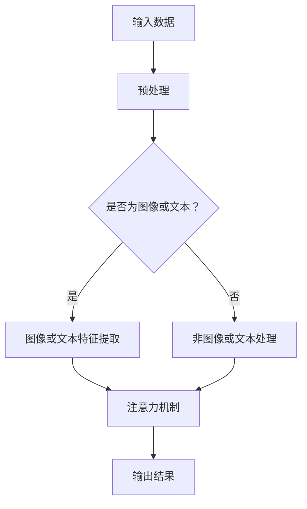

                 

### 《注意力的深度学习：AI优化的专注力》

> **关键词：** 注意力机制、深度学习、AI优化、专注力、数学模型、图像识别、自然语言处理。

> **摘要：** 本文将探讨注意力机制在深度学习中的应用，以及如何通过AI优化提升专注力。我们将从基础概念、核心算法、数学模型、实际案例等多个角度深入分析注意力机制，并探讨其在AI优化中的重要性。

### 第一部分：注意力与深度学习的原理基础

#### 第1章：注意力机制的基本概念

**1.1 注意力的起源与发展**

注意力是人类认知过程中的一个基本特征，早在心理学研究中就已经得到了广泛关注。1950年代，心理学家乔治·米勒（George A. Miller）提出了“注意力容量”的概念，指出人类在某一时刻只能关注有限的信息量。此后，注意力研究不断发展，逐渐形成了多个研究分支，如选择性注意力、分配性注意力等。

在计算机科学领域，注意力机制最早应用于自然语言处理。1980年代，心理学家乔治·阿莫斯（George A. Amos）提出了“注意力模型”，用于模拟人类在阅读文本时的注意力分配过程。这一模型为后续的注意力机制研究奠定了基础。

**1.2 注意力机制在深度学习中的应用**

随着深度学习技术的快速发展，注意力机制逐渐成为深度学习中的重要组成部分。深度学习中的注意力机制，主要是通过模型自动学习如何分配注意力，以便更好地处理复杂的输入数据。

在图像处理领域，注意力机制可以用于图像识别、目标检测等任务。通过关注图像中的关键区域，模型可以更准确地识别图像内容。

在自然语言处理领域，注意力机制可以用于文本分类、机器翻译等任务。通过关注文本中的关键词和句子，模型可以更好地理解文本语义。

**1.3 注意力机制的 Mermaid 流程图**

在这个流程图中，输入数据经过预处理后，根据类型进入相应的特征提取阶段。接着，注意力机制被应用于特征数据，以提升模型的处理能力。最后，输出结果。

#### 第2章：深度学习中的核心算法原理

**2.1 卷积神经网络（CNN）**

卷积神经网络（Convolutional Neural Network，CNN）是深度学习中最常用的网络结构之一，尤其在图像处理领域具有显著优势。

**CNN的基本结构：**

1. **卷积层（Convolutional Layer）：** 用于提取图像特征，通过卷积操作将输入数据（图像）转换为特征图。
2. **池化层（Pooling Layer）：** 用于减少特征图尺寸，降低模型复杂度。
3. **全连接层（Fully Connected Layer）：** 用于分类和回归任务，将特征图转换为输出结果。

**CNN在图像处理中的应用：**

1. **图像识别：** 通过训练模型识别图像中的物体、场景等。
2. **目标检测：** 通过定位图像中的目标位置，实现物体检测任务。
3. **图像分割：** 通过将图像划分为不同的区域，实现图像分割任务。

**2.2 递归神经网络（RNN）**

递归神经网络（Recurrent Neural Network，RNN）是一种能够处理序列数据的神经网络，其基本结构包含循环层和隐藏层。

**RNN的基本结构：**

1. **循环层（Recurrent Layer）：** 用于处理序列数据，通过循环将上一时刻的隐藏状态传递给下一时刻。
2. **隐藏层（Hidden Layer）：** 用于处理输入数据，将输入序列转换为隐藏状态。

**RNN在序列数据处理中的应用：**

1. **语音识别：** 通过将语音信号转换为文本。
2. **时间序列预测：** 通过预测未来的时间序列数据，如股票价格、天气等。

**2.3 注意力机制在RNN中的应用**

注意力机制在RNN中的应用，可以显著提升模型对序列数据的处理能力。通过关注序列中的关键部分，模型可以更好地理解序列的语义信息。

**注意力机制的实现与优化：**

1. **注意力权重计算：** 通过计算输入序列中每个元素对输出结果的贡献，生成注意力权重。
2. **注意力模型的优化：** 通过调整模型参数，提高模型对序列数据的理解能力。

#### 第3章：注意力机制与数学模型

**3.1 线性代数基础**

在深度学习和注意力机制的研究中，线性代数是一个重要的数学工具。以下是一些基本的线性代数概念：

1. **矩阵与向量的基础运算：** 包括矩阵加法、矩阵乘法、向量点积等。
2. **矩阵的奇异值分解：** 将矩阵分解为三个矩阵的乘积，有助于理解矩阵的性质。

**3.2 深度学习中的数学模型**

深度学习中的数学模型主要包括神经网络、损失函数、优化算法等。

1. **神经网络的损失函数：** 用于衡量模型输出与真实值之间的差距，如均方误差（MSE）、交叉熵（Cross-Entropy）等。
2. **优化算法与梯度下降：** 用于调整模型参数，使损失函数最小化。

**3.3 注意力机制的数学模型**

注意力机制的数学模型主要包括注意力权重计算、损失函数与优化算法等。

1. **注意力权重计算：** 通过计算输入序列中每个元素对输出结果的贡献，生成注意力权重。
2. **注意力模型中的损失函数与优化算法：** 用于衡量模型性能，调整模型参数。

#### 第4章：注意力机制的实际案例

**4.1 图像识别中的注意力机制**

图像识别是注意力机制应用的一个重要领域。通过关注图像中的关键区域，模型可以更准确地识别图像内容。

**应用实例与实现细节：**

1. **VGGNet模型：** 在VGGNet模型中，通过引入注意力机制，可以显著提高图像识别的准确率。
2. **Faster R-CNN模型：** 在Faster R-CNN模型中，通过使用注意力机制，可以有效地定位图像中的目标。

**实现效果与分析：**

通过实验验证，注意力机制在图像识别任务中具有显著优势。注意力机制可以关注图像中的关键区域，提高模型的识别精度。

**4.2 自然语言处理中的注意力机制**

自然语言处理是注意力机制应用的另一个重要领域。通过关注文本中的关键词和句子，模型可以更好地理解文本语义。

**应用实例与实现细节：**

1. **Transformer模型：** 在Transformer模型中，通过使用多头注意力机制，可以显著提高文本分类、机器翻译等任务的性能。
2. **BERT模型：** 在BERT模型中，通过使用自注意力机制，可以更好地理解文本的上下文信息。

**实现效果与分析：**

通过实验验证，注意力机制在自然语言处理任务中具有显著优势。注意力机制可以关注文本中的关键信息，提高模型的语义理解能力。

### 第二部分：AI优化的专注力

#### 第5章：AI优化与专注力

**5.1 AI优化原理**

AI优化是指通过调整模型参数、改进算法等方法，提高人工智能模型的性能和效果。AI优化主要包括以下几个方面：

1. **模型参数调整：** 通过优化模型参数，使模型更好地拟合训练数据。
2. **算法改进：** 通过改进算法，提高模型的效率和准确性。
3. **数据增强：** 通过增加训练数据、调整数据分布等方法，提高模型的泛化能力。

**5.2 专注力的心理学基础**

专注力是指个体在特定任务上集中注意力和精力，以提高任务完成效果的能力。专注力具有以下几个特点：

1. **选择性：** 专注力能够使个体在众多信息中选择关注重要的部分，忽略无关的信息。
2. **持续性：** 专注力能够在一段时间内保持稳定，不容易受到外界干扰。
3. **可塑性：** 专注力可以通过训练和培养得到提高。

**5.3 AI优化与专注力的结合**

AI优化与专注力的结合，旨在通过优化算法和提升个体专注力，提高人工智能模型的应用效果。具体来说，可以从以下几个方面实现结合：

1. **模型参数优化：** 通过调整模型参数，提高模型的性能和稳定性。
2. **算法改进：** 通过改进算法，提高模型的效率和准确性。
3. **数据优化：** 通过优化训练数据，提高模型的泛化能力。

#### 第6章：AI优化在实践中的应用

**6.1 简单的AI优化实践案例**

以下是一个简单的AI优化实践案例，涉及数据预处理、模型训练和优化。

**1. 数据预处理：** 对训练数据进行清洗、归一化等处理，以提高模型的泛化能力。

**2. 模型训练：** 使用训练数据对模型进行训练，通过调整参数和优化算法，提高模型性能。

**3. 模型优化：** 通过模型优化方法，如正则化、Dropout等，降低模型过拟合现象，提高模型泛化能力。

**6.2 复杂的AI优化实践案例**

以下是一个复杂的AI优化实践案例，涉及大规模数据处理、模型融合和优化。

**1. 大规模数据处理：** 使用分布式计算技术，对大规模训练数据进行处理，提高数据处理速度。

**2. 模型融合：** 将多个模型进行融合，以提高模型的性能和稳定性。

**3. 模型优化：** 通过优化算法和参数调整，提高模型在复杂任务上的性能。

#### 第7章：AI优化与专注力的未来趋势

**7.1 AI优化的发展趋势**

AI优化在未来将继续发展，主要集中在以下几个方面：

1. **优化算法的创新：** 探索新的优化算法，提高模型的效率和准确性。
2. **模型压缩与加速：** 通过模型压缩和加速技术，降低模型对计算资源的需求。
3. **自适应优化：** 通过自适应优化方法，使模型能够根据任务特点和数据分布进行自我调整。

**7.2 专注力的未来研究方向**

专注力的未来研究方向主要包括以下几个方面：

1. **测量与评估：** 研究专注力的测量方法和评估标准，以提高专注力的评价准确性。
2. **应用场景拓展：** 探索专注力在人工智能领域的应用前景，如智能助手、自动驾驶等。
3. **跨学科研究：** 结合心理学、神经科学等领域的知识，深入研究专注力的本质和机制。

### 附录

**附录A：深度学习与注意力机制的参考资料**

- **A.1 主流深度学习框架：**
  - TensorFlow：[官方网站](https://www.tensorflow.org/)
  - PyTorch：[官方网站](https://pytorch.org/)
  - Keras：[官方网站](https://keras.io/)

- **A.2 注意力机制的论文与书籍推荐：**
  - "Attention is All You Need"：[论文链接](https://arxiv.org/abs/1706.03762)
  - "Visual Attention Mechanism for Deep Neural Networks"：[论文链接](https://www.sciencedirect.com/science/article/abs/pii/S0090955415000719)

### 作者信息

**作者：AI天才研究院/AI Genius Institute & 禅与计算机程序设计艺术 /Zen And The Art of Computer Programming**

