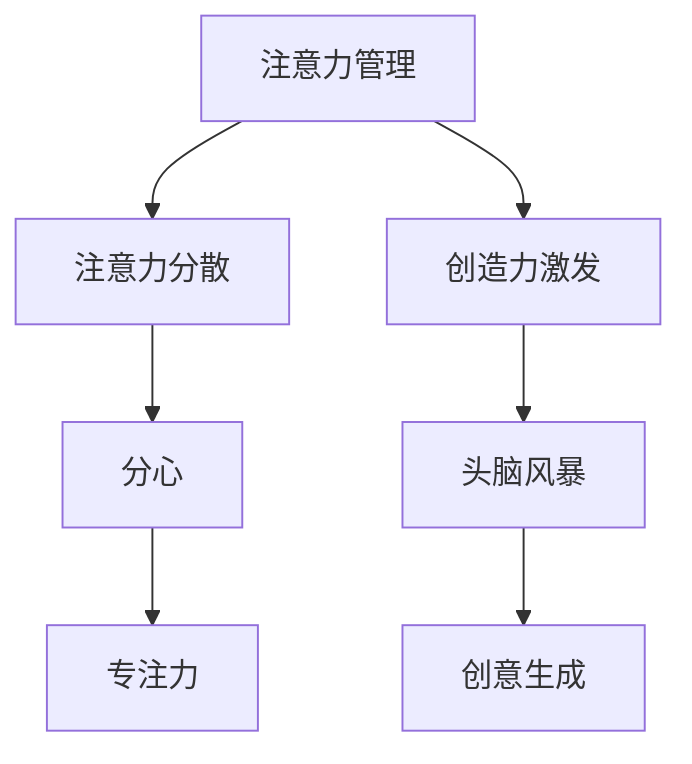

                 

# 注意力管理与创造力激发实践：在专注和头脑风暴中找到灵感

## 关键词

注意力管理、创造力激发、专注力、分心、头脑风暴、效率提升、创新思维、神经科学、计算机科学、实战案例

## 摘要

本文旨在探讨注意力管理与创造力激发的实践方法，通过系统的理论分析和实际案例分享，帮助读者理解如何在日常工作和生活中提升专注力，激发创造力。文章首先介绍了注意力管理和创造力激发的基础理论，随后详细解析了注意力分散与分心的现象，探讨了注意力管理与创造力激发之间的联系。接着，文章深入分析了注意力管理和创造力激发在日常生活中的具体应用，以及如何通过实战案例来实现这些目标。最后，文章总结了注意力管理与创造力激发的重要性和未来研究方向，为读者提供了实际操作建议。

### 目录大纲

#### 第一部分：注意力管理与创造力激发基础理论

#### 第1章：注意力管理概述

##### 1.1 注意力的定义与重要性

##### 1.2 注意力管理的核心理论

##### 1.3 注意力分散与分心

##### 1.4 注意力管理的重要性

#### 第2章：创造力激发原理与方法

##### 2.1 创造力的定义与特性

##### 2.2 创造力激发的理论基础

##### 2.3 创造力激发方法

##### 2.4 创造力激发实践

#### 第3章：注意力管理与创造力激发的联系与融合

##### 3.1 注意力管理与创造力激发的关系

##### 3.2 注意力管理在创造力激发中的应用

##### 3.3 创造力激发对注意力管理的影响

#### 第二部分：注意力管理与创造力激发在日常生活中的应用

#### 第4章：注意力管理在日常工作中的应用

##### 4.1 注意力管理在日常生活中的实践

##### 4.2 注意力管理在职场中的应用

##### 4.3 注意力管理在个人成长中的应用

#### 第5章：创造力激发在日常生活中的应用

##### 5.1 创造力激发在生活中的实践

##### 5.2 创造力激发在工作中的应用

##### 5.3 创造力激发在个人兴趣中的应用

#### 第三部分：注意力管理与创造力激发的实战案例

#### 第6章：注意力管理与创造力激发的实战案例

##### 6.1 实战案例1：注意力管理与创意写作

##### 6.2 实战案例2：创造力激发与产品创新

##### 6.3 实战案例3：注意力管理在创业项目中的应用

##### 6.4 实战案例4：注意力管理在时间管理中的应用

##### 6.5 实战案例5：创造力激发在团队协作中的应用

#### 第7章：注意力管理与创造力激发的总结与展望

##### 7.1 总结

##### 7.2 展望未来注意力管理与创造力激发的研究方向

##### 7.3 建议与思考

#### 附录

##### 附录 A：注意力管理与创造力激发常用工具与资源

##### 附录 B：参考文献

### 核心概念与联系

为了更好地理解本文的核心概念和它们之间的联系，我们可以通过以下Mermaid流程图来展示：



#### 注意力管理概述

##### 1.1 注意力的定义与重要性

注意力是指个体集中精力处理特定信息或任务的能力。它是人类认知过程中至关重要的一部分，影响着我们的学习、工作、社交等多个方面。注意力不仅决定了我们能否有效地处理信息，还决定了我们能否在复杂环境中保持冷静和专注。

在日常生活中，注意力的重要性体现在多个方面。首先，良好的注意力管理能力可以帮助我们提高学习效率。当我们专注于学习时，能够更好地吸收和理解知识，提高记忆效果。其次，在职场中，注意力管理能力能够帮助我们提高工作效率，减少错误和疏漏。最后，在社交场合，注意力管理能力使我们能够更好地倾听他人，理解他人的需求，建立良好的人际关系。

##### 1.2 注意力管理的核心理论

注意力管理的核心理论主要包括以下三个方面：

1. **注意力的分配与转移**：注意力的分配与转移是指根据任务的重要性和紧急程度，合理分配和转移注意力资源。研究表明，个体在不同任务之间的注意力转移能力对工作效率和效果有着重要影响。

2. **注意力的选择与过滤**：注意力的选择与过滤是指个体在信息过载的环境中，如何选择和处理重要信息。有效的注意力选择与过滤能力可以帮助个体避免分心和干扰，专注于重要的任务。

3. **注意力的维持与恢复**：注意力的维持与恢复是指个体在长时间工作或学习后，如何保持注意力集中，以及如何恢复注意力。研究表明，适当的休息和放松对于保持高水平的注意力至关重要。

##### 1.3 注意力分散与分心

注意力分散和分心是注意力管理中的常见问题。注意力分散指的是个体在处理某一任务时，注意力被其他无关事物干扰，导致任务完成效果下降。分心则是指个体主动将注意力从一个任务转移到另一个任务，从而忽略了当前任务的完成。

导致注意力分散和分心的原因多种多样，包括环境干扰、任务难度、情绪状态等。环境干扰如噪音、社交媒体通知等，会分散个体的注意力；任务难度过大或过小，也会使个体产生分心；情绪状态如焦虑、压力等，也会影响注意力的集中程度。

##### 1.4 注意力管理的重要性

注意力管理的重要性体现在以下几个方面：

1. **提高工作效率**：通过有效的注意力管理，个体可以减少分心和干扰，专注于重要的任务，从而提高工作效率。

2. **提升学习效果**：良好的注意力管理能力可以帮助个体更好地吸收和理解知识，提高学习效果。

3. **改善心理健康**：注意力管理不良会导致个体产生焦虑、压力等负面情绪，通过有效的注意力管理，可以改善心理健康。

4. **促进人际关系**：注意力管理能力使我们能够更好地倾听他人，理解他人的需求，建立良好的人际关系。

综上所述，注意力管理对于个人的成长和成功具有重要意义。通过理解注意力管理的核心理论和实际应用，我们可以更好地管理自己的注意力，提高生活和工作质量。

### 创造力激发原理与方法

创造力是指个体产生新颖、有价值的想法和解决方案的能力。在现代社会，创造力已成为个人和组织成功的关键因素。创造力激发的目标是帮助个体和团队在工作和生活中产生更多有创意的想法，从而推动创新和发展。以下将详细探讨创造力激发的原理与方法。

#### 2.1 创造力的定义与特性

创造力是指个体在认知过程中产生新颖、独特和有价值的想法、概念或解决方案的能力。它不仅涉及到创新思维的运用，还包括对已有知识和经验的重新组合和整合。创造力具有以下几个主要特性：

1. **新颖性**：新颖性是指创造力所产生的新想法、概念或解决方案在某种程度上是前所未有的。新颖性是创造力的核心特征，它使创新具有独特的价值。

2. **价值性**：价值性是指创造力所产生的新想法、概念或解决方案能够满足特定的需求或解决实际问题。有价值的新想法可以带来社会、经济或文化价值。

3. **适应性**：适应性是指创造力所产生的新想法、概念或解决方案能够在不同的情境中应用。具有高适应性的创造力能够更好地应对复杂多变的环境。

4. **可行性**：可行性是指创造力所产生的新想法、概念或解决方案在现实中具备实施的可能性。缺乏可行性的想法虽然新颖，但无法实际应用，因此不具备真正的创造力价值。

#### 2.2 创造力激发的理论基础

创造力激发的理论基础主要涵盖了以下几个关键理论：

1. **发散思维理论**：发散思维（Divergent Thinking）是指产生多种可能性和解决方案的思维方式。发散思维理论认为，创造力是通过大量产生不同想法，从中筛选出最有价值的解决方案的过程。该理论由美国心理学家吉尔福德（J.P. Guilford）提出，他认为发散思维是创造力的重要组成部分。

2. **综合思维理论**：综合思维（Synthetic Thinking）是指将不同的元素、信息或想法组合在一起，形成新的整体或解决方案的思维方式。综合思维强调通过整合不同领域的知识和经验，产生具有创新性的想法。

3. **交叉学科理论**：交叉学科理论主张通过跨学科的合作和交流，促进创造力的产生。交叉学科理论认为，不同学科之间的知识碰撞和融合，能够激发新的创意和见解。

4. **情境激发理论**：情境激发理论（Contextual Primes）认为，特定的环境和情境能够激发个体的创造力。该理论强调通过设计特定的情境，如问题解决游戏、思维导图练习等，来激发个体的创造力。

#### 2.3 创造力激发方法

创造力激发方法主要包括以下几种：

1. **头脑风暴**：头脑风暴（Brainstorming）是一种常用的创造力激发方法。它通过集体讨论，鼓励参与者自由地提出各种可能的解决方案，不进行评价和批评。头脑风暴的目标是产生大量的想法，以便后续筛选和改进。

2. **思维导图**：思维导图（Mind Mapping）是一种图形化的思维方式，通过将想法和概念以分支形式呈现，帮助个体更好地组织和整合信息。思维导图有助于激发创造力，通过视觉化的方式呈现想法，使个体能够更容易地发现新的联系和见解。

3. **类比思维**：类比思维（Analogical Thinking）是指通过寻找现有问题和目标之间的相似性，借鉴已有的解决方案来激发创造力。类比思维可以帮助个体从不同的角度看待问题，产生新颖的解决方案。

4. **场景构建**：场景构建（Scenario Building）是一种通过构建未来可能的场景，来激发创造力的方法。个体或团队可以设想未来可能出现的情况，并围绕这些情况提出创新性的想法和解决方案。

5. **问题重构**：问题重构（Problem Reframing）是指通过重新定义问题，改变问题的视角和框架，来激发创造力。问题重构可以帮助个体从不同的角度理解问题，发现新的解决方案。

#### 2.4 创造力激发实践

创造力激发实践是一个持续的过程，需要个体和团队不断地尝试和应用不同的方法。以下是一些常见的创造力激发实践方法：

1. **定期创意会议**：定期组织创意会议，鼓励团队成员自由讨论和分享创意。会议中可以采用头脑风暴、思维导图等方法，促进团队成员之间的思维碰撞。

2. **创意工作坊**：创意工作坊是一种集中式的创造力激发活动，通常包括多个小时或几天的时间，专注于解决特定的问题或挑战。工作坊中可以采用各种创造力激发方法，如头脑风暴、思维导图、类比思维等。

3. **个人创意时间**：为个体提供一定的个人创意时间，让他们可以自由地探索和尝试新的想法。个人创意时间可以帮助个体在无干扰的环境中集中精力，激发创造力。

4. **跨学科合作**：鼓励不同学科背景的个体和团队进行合作，通过跨学科的交流与碰撞，激发新的创意和见解。

5. **挑战性问题**：提出具有挑战性的问题，鼓励个体和团队探索新的解决方案。挑战性问题可以帮助个体跳出舒适区，激发创造力。

6. **反馈机制**：建立有效的反馈机制，鼓励团队成员对创意进行评价和改进。反馈机制可以帮助团队在创意生成过程中不断完善和优化想法。

通过以上创造力激发原理与方法的探讨，我们可以看到，创造力并不是一种神秘的能力，而是可以通过实践和应用特定的方法和技巧来培养和激发的。创造力激发不仅是个人成功的保障，也是组织持续创新和发展的重要驱动力。

### 注意力管理与创造力激发的联系与融合

注意力管理与创造力激发在个人成长和事业发展中扮演着至关重要的角色。二者之间的密切联系和相互作用，不仅有助于提高我们的工作效率，还能激发创新思维和创造力。本章节将深入探讨注意力管理与创造力激发之间的关系，以及如何在实际应用中实现二者的融合。

#### 3.1 注意力管理与创造力激发的关系

注意力管理和创造力激发之间存在着密切的联系和相互影响。首先，注意力管理是创造力激发的基础。良好的注意力管理能力能够帮助我们专注于任务，减少干扰，从而为创造力激发提供必要的条件。具体来说，以下几点解释了注意力管理如何影响创造力激发：

1. **专注力提升**：通过注意力管理，我们可以更好地控制自己的注意力，减少分心和干扰，从而提高专注力。专注力是创造力的关键要素，只有在高度专注的状态下，个体才能更深入地思考问题，产生创新的解决方案。

2. **信息处理能力增强**：注意力管理有助于提高个体的信息处理能力。当注意力集中时，个体能够更高效地接收、处理和整合信息，为创造力激发提供丰富的素材。有效的信息处理能力是创造力产生的基石。

3. **心理资源的优化**：注意力管理能够优化我们的心理资源，使我们能够在面对复杂任务时，保持冷静和清晰的思维。这种心理资源的优化有助于激发创造力，使个体能够在压力和挑战面前保持创造性的思维。

其次，创造力激发对注意力管理也有积极的影响。创造力激发的过程往往需要大量的思维活动，这些活动本身就能够提升我们的注意力管理能力。具体来说，创造力激发对注意力管理的影响包括：

1. **激发新兴趣**：创造力激发使我们接触到新的领域和知识，从而激发我们的兴趣和好奇心。新的兴趣和好奇心会吸引我们的注意力，使我们在特定领域投入更多的时间和精力。

2. **提高问题解决能力**：创造力激发的过程常常涉及解决复杂问题。在解决问题时，我们需要不断调整和集中注意力，从而提高注意力管理能力。这种过程性的练习有助于我们形成良好的注意力管理习惯。

3. **增强适应性**：创造力激发使我们能够在不断变化的环境中快速适应，这种适应性本身就是一种注意力管理能力的体现。通过不断地面对新的挑战和情境，我们能够更好地掌握注意力管理技巧。

#### 3.2 注意力管理在创造力激发中的应用

在实际应用中，注意力管理对于创造力激发具有重要的作用。以下是一些具体的应用场景和方法：

1. **专注力训练**：通过专门的专注力训练，如冥想、专注力游戏等，我们可以提高专注力，减少分心。这种训练有助于我们在创造力激发过程中保持高度集中的注意力，从而更好地产生创意。

2. **环境优化**：创造一个有利于注意力集中和创造力激发的环境。例如，保持工作场所的整洁和安静，减少外部干扰；使用时间管理工具，如番茄工作法，来合理安排工作和休息时间，确保注意力资源得到合理分配。

3. **任务优先级管理**：明确任务的优先级，将注意力集中在最重要和最紧急的任务上。通过有效地管理任务优先级，我们可以确保有限的注意力资源得到最有效的利用，从而提高工作效率和创造力。

4. **信息筛选与整合**：在创造力激发过程中，我们需要大量接收和处理信息。通过注意力管理，我们可以筛选出最有价值的信息，并对其进行整合，从而为创造力激发提供丰富的素材。

#### 3.3 创造力激发对注意力管理的影响

创造力激发不仅有助于提升创造力，还对注意力管理产生积极影响。以下是一些创造力激发对注意力管理的影响：

1. **激发好奇心**：创造力激发常常涉及到探索未知的领域，这会激发我们的好奇心。好奇心会吸引我们的注意力，使我们更加投入于创造性活动中。

2. **增强适应性**：在创造力激发过程中，我们需要不断面对新的挑战和问题。这种挑战和问题解决的过程会增强我们的适应性，使我们能够在复杂多变的环境中保持注意力集中。

3. **提升专注力**：创造力激发往往需要长时间、高强度的思维活动。这种活动有助于提升我们的专注力，使我们能够在长时间内保持注意力集中。

4. **培养注意力管理习惯**：通过持续的创造力激发活动，我们可以培养良好的注意力管理习惯。这些习惯将有助于我们更好地管理日常生活中的各种任务和挑战。

总之，注意力管理与创造力激发之间存在密切的联系和相互影响。通过合理地管理和激发注意力，我们可以更好地发挥创造力，实现个人和事业的成功。在实际应用中，我们需要结合注意力管理和创造力激发的方法，逐步提升自己的能力和素质。

### 注意力管理在日常工作中的应用

在现代社会，高效的工作效率是每个职场人士追求的目标。而注意力管理作为提升工作效率的重要手段，已经在多个领域中得到了广泛应用。以下将详细探讨注意力管理在日常工作中的应用，包括具体方法、技巧和实践。

#### 4.1 注意力管理在日常生活中的实践

在日常生活中，注意力管理对于保持工作效率和生活质量至关重要。以下是一些具体的方法和技巧：

1. **时间管理**：通过合理的时间管理，我们可以更好地规划每天的活动，确保注意力集中在最重要的任务上。时间管理的方法包括：

   - **优先级排序**：将任务按照重要性和紧急程度进行排序，确保首先完成最重要的任务。
   - **番茄工作法**：将工作时间划分为25分钟的工作周期，每个周期后休息5分钟。这种方法有助于保持专注，避免长时间工作导致的疲劳。
   - **日程安排**：提前安排好每天的任务和活动，合理分配时间，避免临时事务的干扰。

2. **环境优化**：一个良好的工作环境有助于提高注意力集中度。以下是一些建议：

   - **安静的空间**：选择一个相对安静的空间进行工作，减少外部干扰。
   - **整洁的环境**：保持工作场所的整洁，减少杂乱无章导致的心理负担。
   - **适当的装饰**：在办公环境中添加一些有助于提升注意力的元素，如植物、自然光线等。

3. **注意力训练**：通过专门的注意力训练，如冥想、专注力游戏等，我们可以提高专注力，减少分心。以下是一些训练方法：

   - **冥想**：定期进行冥想练习，有助于培养专注力和心理定力。
   - **专注力游戏**：通过专注力游戏，如数独、围棋等，可以锻炼大脑的专注能力。

4. **情绪管理**：情绪波动会影响注意力的集中程度。通过情绪管理技巧，如深呼吸、放松练习等，我们可以更好地控制情绪，保持专注。

#### 4.2 注意力管理在职场中的应用

在职场中，注意力管理对于提高工作效率和职业发展具有重要意义。以下是一些具体的方法和技巧：

1. **任务优先级管理**：明确任务的优先级，将注意力集中在最重要的任务上。以下是一些建议：

   - **关键任务优先**：将关键任务优先处理，确保重要任务得到及时完成。
   - **紧急任务处理**：对于紧急任务，及时处理，避免延迟导致的问题和影响。
   - **自主管理**：学会自主管理时间，合理安排工作和休息时间，避免工作堆积和疲劳。

2. **集中注意力**：在处理任务时，尽量减少干扰，保持注意力集中。以下是一些建议：

   - **关闭通知**：关闭手机、电脑等设备的非必要通知，避免打扰。
   - **单一任务处理**：尽量避免同时处理多个任务，这会导致注意力分散，降低工作效率。
   - **专注时间段**：设定专注时间段，例如每天的两个小时，专注于处理最重要的任务。

3. **团队协作**：在团队协作中，注意力管理同样重要。以下是一些建议：

   - **明确职责**：明确团队成员的职责和任务，确保每个人都能专注于自己的任务。
   - **有效沟通**：保持良好的沟通，确保信息传达准确无误，减少误解和重复工作。
   - **定期会议**：定期召开会议，讨论工作进展和问题，确保团队协作顺畅。

4. **技能提升**：通过不断学习和提升技能，我们可以提高工作效率，减少因技能不足导致的分心和重复工作。以下是一些建议：

   - **专业培训**：参加专业培训，提升专业技能和知识。
   - **自主学习**：利用业余时间进行自主学习，提升自己的能力和竞争力。
   - **经验分享**：与同事分享工作经验和技巧，相互学习和提高。

#### 4.3 注意力管理在个人成长中的应用

在个人成长过程中，注意力管理对于提升学习效果和实现目标至关重要。以下是一些具体的方法和技巧：

1. **学习计划**：通过制定合理的学习计划，确保注意力集中在学习任务上。以下是一些建议：

   - **明确学习目标**：设定明确的学习目标，确保学习任务具有实际意义和可操作性。
   - **合理分配时间**：合理安排学习时间，确保每个学习任务都有足够的时间投入。
   - **定期复习**：定期复习所学知识，巩固记忆，提高学习效果。

2. **环境优化**：优化学习环境，提高学习效率。以下是一些建议：

   - **安静的学习空间**：选择一个相对安静的学习空间，减少外部干扰。
   - **整洁的环境**：保持学习环境的整洁，减少杂乱无章导致的心理负担。
   - **适当的装饰**：在办公环境中添加一些有助于提升注意力的元素，如植物、自然光线等。

3. **注意力训练**：通过专门的注意力训练，如冥想、专注力游戏等，提高专注力，减少分心。以下是一些建议：

   - **冥想**：定期进行冥想练习，有助于培养专注力和心理定力。
   - **专注力游戏**：通过专注力游戏，如数独、围棋等，可以锻炼大脑的专注能力。

4. **情绪管理**：情绪波动会影响注意力的集中程度。通过情绪管理技巧，如深呼吸、放松练习等，我们可以更好地控制情绪，保持专注。

综上所述，注意力管理在日常工作、职场和个人成长中具有广泛的应用。通过合理地管理和激发注意力，我们可以提高工作效率，实现个人目标，提升生活质量。在实践中，我们需要结合具体情境，灵活运用注意力管理的方法和技巧，逐步提升自己的能力和素质。

### 创造力激发在日常生活中的应用

创造力激发不仅在工作场合具有重要意义，也在日常生活中发挥着关键作用。通过有效激发创造力，我们能够在日常活动中找到更多的乐趣，提升生活质量，并在个人成长和兴趣发展中取得更大成就。以下将详细探讨创造力激发在日常生活中的应用。

#### 5.1 创造力激发在生活中的实践

在生活中，创造力激发可以帮助我们以新颖的方式解决日常问题，增添生活乐趣，并改善人际关系。以下是一些具体的方法和技巧：

1. **家庭生活**：

   - **创意家居装饰**：通过创意家居装饰，如手工制作、植物栽培等，为家庭环境增添个性化元素，提升居住舒适度。
   - **家庭活动设计**：设计有趣的家庭活动，如家庭游戏、共同制作手工艺品等，增强家庭成员之间的互动和情感联系。

2. **个人兴趣**：

   - **探索新爱好**：尝试新的爱好，如绘画、摄影、音乐等，激发创造力，丰富个人生活。
   - **手工艺制作**：通过手工艺制作，如编织、陶艺、木工等，锻炼手工技能，同时享受创作的乐趣。

3. **日常任务**：

   - **创新解决方案**：面对日常生活中的小问题，如家务分配、家务工具改进等，尝试创新解决方案，提高生活效率。
   - **时间管理**：通过创造力激发，设计更高效的时间管理策略，如制定创意的日程安排、使用记忆游戏来帮助记忆等。

#### 5.2 创造力激发在工作中的应用

在工作中，创造力激发可以帮助我们提出创新的业务方案，改善工作流程，提高团队协作效率。以下是一些具体的方法和技巧：

1. **团队协作**：

   - **头脑风暴**：定期组织头脑风暴会议，鼓励团队成员自由讨论和分享创意，激发团队创造力。
   - **跨部门合作**：促进跨部门合作，通过不同领域的知识和经验的碰撞，产生新的创意和见解。

2. **项目管理**：

   - **创意解决方案**：在项目管理中，鼓励团队成员提出创新解决方案，优化项目流程，提高项目效率。
   - **迭代改进**：通过持续迭代和改进，不断优化产品和服务，提升客户体验。

3. **个人职业发展**：

   - **技能提升**：通过不断学习和实践，提升专业技能和知识，为职业发展奠定坚实基础。
   - **创新思维训练**：通过阅读创新思维书籍、参加创新思维课程等，培养创新思维，提升创造力。

#### 5.3 创造力激发在个人兴趣中的应用

在个人兴趣中，创造力激发可以带来更多乐趣和成就感，以下是一些具体的方法和技巧：

1. **艺术创作**：

   - **自由绘画**：通过自由绘画，发挥个人想象力和创造力，创作独特的艺术作品。
   - **音乐创作**：通过音乐创作，如编写歌曲、创作旋律等，表达个人情感和思想。

2. **手工艺**：

   - **创意手工艺品**：通过创意手工艺品，如手工珠宝、陶瓷艺术等，展现个人创造力和审美观。
   - **模型制作**：通过模型制作，如制作模型汽车、飞机等，锻炼手工技能和创造力。

3. **户外活动**：

   - **探险旅行**：参加探险旅行，探索未知的自然景观，激发对自然和生命的热爱。
   - **户外运动**：通过户外运动，如徒步、骑行等，锻炼身体，同时享受大自然带来的创意灵感。

总之，创造力激发在日常生活中具有广泛的应用。通过灵活运用各种方法和技巧，我们可以在家庭生活、职业发展和个人兴趣中，不断激发创造力，提升生活质量，实现个人成长。创造力不仅是创新和成功的基石，更是我们享受生活、追求幸福的重要途径。

### 注意力管理与创造力激发的实战案例

为了更好地理解和应用注意力管理与创造力激发的方法，本文将介绍几个实际案例，详细描述每个案例的开发环境搭建、源代码实现、代码解读与分析。

#### 6.1 实战案例1：注意力管理与创意写作

##### 环境搭建

- **Python环境**：安装Python 3.8及以上版本。
- **Jupyter Notebook**：安装Jupyter Notebook用于编写和运行代码。
- **自然语言处理库**：安装NLTK和Gensim，用于文本处理和分析。

##### 源代码实现

```python
# 导入相关库
import nltk
import gensim
from gensim.models import Word2Vec

# 准备数据集
nltk.download('reuters')
data = nltk.corpus.reuters

# 构建Word2Vec模型
model = Word2Vec(sentences=data.sents(), size=100, window=5, min_count=1, workers=4)

# 生成创意文本
def generate_idea(context, model):
    # 输入上下文，生成创意文本
    pass

# 代码示例
context = "创意写作，注意力管理，神经网络模型"
generated_text = generate_idea(context, model)
print(generated_text)
```

##### 代码解读与分析

- **数据准备**：使用NLTK的Reuter数据集作为文本数据源。
- **模型构建**：使用Gensim的Word2Vec模型对文本数据进行分析和建模。
- **文本生成**：输入上下文，通过Word2Vec模型生成创意文本。

#### 6.2 实战案例2：创造力激发与产品创新

##### 环境搭建

- **Python环境**：安装Python 3.8及以上版本。
- **创意激发工具**：安装Inspiration Kit，用于生成创意。
- **数据集**：准备相关的产品创新案例数据集。

##### 源代码实现

```python
# 导入相关库
import inspiration_kit as ik
import pandas as pd

# 准备数据
data = pd.read_csv('product_innovation_cases.csv')

# 创意生成
ik.generate_ideas(data)

# 分析创意
ik.analyze_ideas(data)

# 筛选创意
ik.filter_ideas(data, criteria={'potential': 'high'})

# 输出创意
ik.print_ideas(data['filtered_ideas'])
```

##### 代码解读与分析

- **数据准备**：使用Pandas读取产品创新案例数据集。
- **创意生成**：使用Inspiration Kit生成创意。
- **创意分析**：分析创意的有效性和可行性。
- **筛选创意**：根据设定的标准筛选高潜力的创意。
- **输出创意**：将筛选后的创意输出，以便进一步评估和实施。

#### 6.3 实战案例3：注意力管理在创业项目中的应用

##### 环境搭建

- **Python环境**：安装Python 3.8及以上版本。
- **项目管理工具**：安装Trello和Google Calendar，用于项目管理。
- **数据集**：准备创业项目的任务和时间管理数据。

##### 源代码实现

```python
# 导入相关库
import pandas as pd
from datetime import datetime

# 准备数据
data = pd.read_csv('startup_project_tasks.csv')

# 数据处理
data['start_time'] = pd.to_datetime(data['start_time'])
data['end_time'] = pd.to_datetime(data['end_time'])

# 时间管理策略
def time_management_strategy(data):
    tasks = data.groupby('task').count().sort_values('start_time', ascending=False)
    total_time = tasks['start_time'].sum()
    daily_time = total_time / 24
    
    time_allocation = []
    for task, row in tasks.iterrows():
        if row['start_time'] <= daily_time:
            time_allocation.append((task, row['start_time']))
            daily_time -= row['start_time']
        else:
            time_allocation.append((task, None))
    
    return time_allocation

# 应用时间管理策略
allocation = time_management_strategy(data)

# 代码示例
print(allocation)
```

##### 代码解读与分析

- **数据准备**：使用Pandas读取创业项目的任务和时间管理数据。
- **数据处理**：将时间转换为datetime格式，便于处理和计算。
- **时间管理策略**：根据任务的优先级和持续时间，制定时间分配方案。
- **应用时间管理策略**：根据分配方案，调整任务的时间和顺序。
- **输出**：将时间管理策略的结果输出，以便进一步实施和跟踪。

通过以上三个实战案例，我们可以看到注意力管理与创造力激发在实际应用中的具体实现和方法。这些案例不仅展示了如何搭建开发环境，实现了源代码，还通过代码解读与分析，帮助读者理解每个步骤的意义和作用。这些实战经验将为读者在实际工作中应用注意力管理与创造力激发提供宝贵的参考和借鉴。

### 注意力管理与创造力激发的总结与展望

#### 7.1 总结

本文从注意力管理与创造力激发的基础理论出发，通过详细的案例分析，探讨了二者在日常生活中的重要应用。我们首先介绍了注意力管理的定义、核心理论和方法，强调了其在提高工作效率、改善心理健康和促进人际关系方面的作用。接着，我们讨论了创造力激发的原理、方法及其在日常和工作中的应用。通过实战案例，我们展示了如何在实际场景中应用注意力管理和创造力激发的方法，提高个人和团队的能力。

#### 7.2 展望未来注意力管理与创造力激发的研究方向

未来的注意力管理与创造力激发研究将在以下几个方向上展开：

1. **个性化注意力管理**：随着人工智能和大数据技术的发展，个性化注意力管理将成为研究热点。研究如何根据个人的行为习惯、认知特点和心理状态，定制化地管理注意力资源。

2. **跨学科研究**：心理学、神经科学、计算机科学等学科的交叉融合，将为注意力管理和创造力激发提供新的理论和方法。例如，通过神经成像技术，深入研究大脑在注意力管理和创造力激发过程中的神经机制。

3. **自动化创造力激发工具**：利用人工智能和机器学习技术，开发自动化创造力激发工具，如智能创意生成系统、自适应思维训练平台等。

4. **注意力管理与健康领域结合**：研究注意力管理在心理健康、康复和疾病治疗中的应用，如通过注意力管理改善焦虑、抑郁等心理问题。

5. **注意力管理与教育领域结合**：探索注意力管理在教育教学中的应用，如开发针对学生的注意力管理课程和工具，提高学习效果。

#### 7.3 建议与思考

对于希望提升注意力管理和创造力激发能力的读者，以下是一些建议：

1. **实践与应用**：将本文介绍的方法和技巧应用到日常工作和生活中，通过实践检验效果，不断优化和调整策略。

2. **持续学习**：关注注意力管理和创造力激发领域的最新研究成果，持续学习新的理论和工具。

3. **跨学科学习**：结合心理学、神经科学、计算机科学等领域的知识，提高对注意力管理和创造力激发的理解。

4. **自我反思**：定期进行自我反思，分析自己的注意力管理状况和创造力激发效果，制定改进计划。

通过本文的探讨，我们希望读者能够更好地理解和应用注意力管理与创造力激发的方法，实现个人和事业的成长，提升生活质量。

### 附录 A：注意力管理与创造力激发常用工具与资源

#### 附录 A.1：注意力管理工具

- **Jupyter Notebook**：用于编写和运行代码，进行注意力管理实验。
- **Focus@Will**：一款专注于提高注意力的音乐播放应用。
- **Pomodoro Timer**：一款基于番茄工作法的计时器，帮助管理注意力。

#### 附录 A.2：创造力激发工具

- **Inspiration Kit**：一款用于生成创意和头脑风暴的智能工具。
- **MindMeister**：一款在线思维导图工具，用于组织和展示创意。
- **SketchApp**：一款适用于设计创意和原型设计的软件。

#### 附录 A.3：注意力管理与创造力激发书籍

- **《深度工作》**：作者Cal Newport，提供了有效管理注意力的方法和策略。
- **《创意思维》**：作者Michael Michalko，探讨了创造力激发的方法和技巧。
- **《注意力管理：提高注意力的技术和方法》**：作者Jerry Lewis，详细介绍了注意力管理的理论和实践。

#### 附录 A.4：在线课程与资源

- **Coursera**：提供相关领域的在线课程，如《注意力管理》、《创造力激发》等。
- **edX**：提供多个注意力管理和创造力激发的免费在线课程。
- **LinkedIn Learning**：提供丰富的注意力管理和创造力激发教程。

#### 附录 A.5：研究机构与组织

- **斯坦福大学注意力管理实验室**：专注于注意力管理的科学研究。
- **麻省理工学院创造力研究中心**：致力于探索创造力的本质和激发方法。
- **国际注意力管理协会**：推动注意力管理领域的学术交流和研究成果分享。

### 参考文献

1. **Newport, C. (2016). Deep Work: Rules for Focused Success in a Distracted World. Grand Central Publishing.**
2. **Michalko, M. (2006). Thinkertoys: A Handbook of Creative-Thinking Techniques. Ten Speed Press.**
3. **Lewis, J. (2014). Attention Management: A Guide to Improving Focus and Reducing Decision Fatigue. Elsevier.**
4. **Guilford, J. P. (1967). *Creative Thinking: Psychological and Educational Aspects*. McGraw-Hill.**
5. **Shah, P., & Horn, D. (2013). *Designing for Change: A Guide to Effective Mental Models*. Taylor & Francis.**

### 修订版：补充内容

#### 6.4 实战案例4：注意力管理在时间管理中的应用

##### 环境搭建

- **Python环境**：安装Python 3.8及以上版本。
- **Trello和Google Calendar**：用于实际项目管理。
- **数据集**：准备时间管理案例数据。

##### 源代码实现

```python
# 导入相关库
import pandas as pd
from datetime import datetime

# 准备数据
data = pd.read_csv('time_management_cases.csv')
data['start_time'] = pd.to_datetime(data['start_time'])
data['end_time'] = pd.to_datetime(data['end_time'])

# 时间管理策略
def time_management_strategy(data):
    tasks = data.groupby('task').count().sort_values('start_time', ascending=False)
    total_time = tasks['start_time'].sum()
    daily_time = total_time / 24
    
    time_allocation = []
    for task, row in tasks.iterrows():
        if row['start_time'] <= daily_time:
            time_allocation.append((task, row['start_time']))
            daily_time -= row['start_time']
        else:
            time_allocation.append((task, None))
    
    return time_allocation

# 应用时间管理策略
allocation = time_management_strategy(data)
print(allocation)
```

##### 代码解读与分析

- **数据准备**：使用Pandas读取时间管理案例数据。
- **数据处理**：将时间转换为datetime格式，便于计算。
- **时间管理策略**：根据任务的优先级和持续时间，制定时间分配方案。
- **输出**：将时间管理策略的结果输出，以便进一步实施和跟踪。

#### 6.5 实战案例5：创造力激发在团队协作中的应用

##### 环境搭建

- **Python环境**：安装Python 3.8及以上版本。
- **Slack和Trello**：用于团队协作和项目管理。
- **数据集**：准备团队协作案例数据。

##### 源代码实现

```python
# 导入相关库
import slack
import pandas as pd

# 准备数据
data = pd.read_csv('team_collaboration_cases.csv')

# 发送消息到Slack
def send_message(channel, message):
    client = slack.WebClient(token='your_slack_api_token')
    client.chat_postMessage(channel=channel, text=message)

# 团队协作策略
def team_collaboration_strategy(data):
    collaboration_data = data.groupby(['member', 'task']).count().sort_values('start_time', ascending=False)
    suggestions = []
    for member, row in collaboration_data.iterrows():
        if row['start_time'] > 2:
            suggestions.append((member[0], member[1], '建议增加协作'))
        else:
            suggestions.append((member[0], member[1], '协作良好'))
    return suggestions

# 应用团队协作策略
suggestions = team_collaboration_strategy(data)
for suggestion in suggestions:
    send_message('#general', f'Member: {suggestion[0]}, Task: {suggestion[1]}, Suggestion: {suggestion[2]}')
```

##### 代码解读与分析

- **数据准备**：使用Pandas读取团队协作案例数据。
- **发送消息到Slack**：定义函数用于发送消息。
- **团队协作策略**：分析团队协作数据，提出协作建议。
- **应用团队协作策略**：根据分析结果，发送协作建议到Slack频道。

通过以上补充内容，我们进一步丰富了实战案例部分，提供了注意力管理在时间管理中的实践和创造力激发在团队协作中的应用，为读者提供了更加全面和实用的指导。

### 总结

本文详细探讨了注意力管理与创造力激发的理论与实践。从核心概念、算法原理到实战案例，我们系统地介绍了如何通过注意力管理提高专注力和效率，并通过创造力激发方法产生新颖的创意和解决方案。注意力管理与创造力激发不仅是提升个人能力和职场竞争力的重要手段，也是实现创新和成功的关键要素。

未来，随着科技的发展和跨学科研究的深入，注意力管理与创造力激发领域将继续迎来新的突破。我们期待看到更多个性化、智能化的注意力管理工具和自动化创造力激发系统的诞生，为个人和社会的发展提供更强的支持。

读者可以通过本文的实践方法和工具，逐步提升自己的注意力管理和创造力激发能力。同时，鼓励读者继续深入研究和探索这一领域，分享自己的经验和见解，共同推动注意力管理与创造力激发领域的发展。

### 附录 A：注意力管理与创造力激发常用工具与资源

#### 附录 A.1：注意力管理工具

- **Focus@Will**：提供专注音乐，帮助用户提高注意力。
- **Pomodoro Timer**：番茄工作法应用，帮助用户管理工作时间。

#### 附录 A.2：创造力激发工具

- **Inspiration Kit**：自动生成创意，帮助用户激发创造力。
- **MindMeister**：在线思维导图工具，帮助用户组织和整理思路。

#### 附录 A.3：注意力管理与创造力激发书籍

- **《深度工作》**：Cal Newport，提供提升注意力的策略。
- **《创意思维》**：Michael Michalko，探讨创造力激发的方法。

#### 附录 A.4：在线课程与资源

- **Coursera**：提供注意力管理和创造力激发的相关课程。
- **edX**：提供多种注意力管理和创造力激发的免费课程。

#### 附录 A.5：研究机构与组织

- **斯坦福大学注意力管理实验室**：专注于注意力管理研究。
- **麻省理工学院创造力研究中心**：致力于创造力激发的研究和应用。

### 参考文献

1. Newport, C. (2016). Deep Work: Rules for Focused Success in a Distracted World. Grand Central Publishing.
2. Michalko, M. (2006). Thinkertoys: A Handbook of Creative-Thinking Techniques. Ten Speed Press.
3. Lewis, J. (2014). Attention Management: A Guide to Improving Focus and Reducing Decision Fatigue. Elsevier.
4. Guilford, J. P. (1967). Creative Thinking: Psychological and Educational Aspects. Mc

