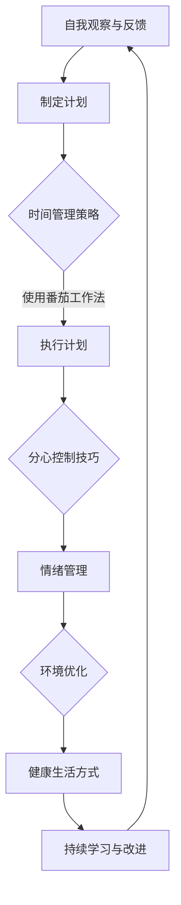
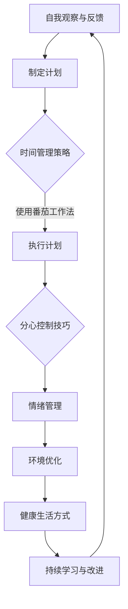

                 

# 注意力管理与自我调节：如何培养专注力以实现个人和职业成功

> **关键词**：专注力、自我调节、时间管理、分心控制、职业成功

> **摘要**：本文深入探讨了注意力管理与自我调节的原理和实践策略，旨在帮助读者培养专注力，实现个人和职业的成功。文章从理论基础、实践策略、案例分析等多个角度展开，提供了系统的专注力管理指南。

## 目录大纲

1. 引言
2. 第一部分：专注力理论基础
   2.1 专注力概述
   2.2 专注力的科学原理
   2.3 专注力的影响因素
3. 第二部分：注意力管理的实践策略
   3.1 培养专注力的技巧
   3.2 注意力管理在日常生活中的应用
   3.3 注意力管理的自我调节
4. 第三部分：注意力管理在职业成功中的应用
   3.1 职业技能提升
   3.2 团队协作与沟通
   3.3 职业发展路径规划
5. 第四部分：案例分析与实践指南
   5.1 成功的专注力管理案例
   5.2 失败的专注力管理案例
   5.3 实践指南
6. 第五部分：相关资源与工具
   5.1 注意力管理相关书籍推荐
   5.2 注意力管理在线资源和平台
   5.3 注意力管理应用程序介绍
7. 附录
   7.1 梅尔德流程图
   7.2 伪代码示例
   7.3 数学模型与公式
   7.4 案例分析代码解读
   7.5 专注力管理测试题

## 引言

在当今信息爆炸的时代，人们面临着前所未有的分心和干扰。无论是工作、学习还是日常生活中的琐事，我们都可能因为各种因素而分散注意力。然而，专注力作为人类心智资源中至关重要的部分，对于个人和职业的成功具有决定性的影响。

### 什么是专注力？

专注力，也称为注意力，是指人们在执行任务时，能够集中精力、排除干扰的能力。它是人类心智活动的基础，决定了我们在面对复杂问题时是否能够迅速做出判断和决策。良好的专注力可以使我们在短时间内高效完成工作，提升学习和工作效率，进而实现个人和职业的成功。

### 注意力的重要性

1. **工作效率提升**：专注力有助于我们提高工作效率，减少工作的时间成本。
2. **决策能力增强**：专注力能够帮助我们更好地分析和处理信息，做出更明智的决策。
3. **心理健康促进**：专注力的培养有助于缓解压力和焦虑，提高心理健康水平。
4. **人际关系改善**：专注力使我们能够更好地倾听他人，建立良好的人际关系。

### 文章结构

本文将从以下几个方面进行深入探讨：

1. **专注力理论基础**：介绍专注力的概念、科学原理和影响因素。
2. **注意力管理的实践策略**：提供培养专注力的技巧和实践策略。
3. **注意力管理在职业成功中的应用**：分析专注力在职业发展中的重要作用。
4. **案例分析与实践指南**：通过成功和失败的案例，总结专注力管理的经验。
5. **相关资源与工具**：推荐注意力管理相关的书籍、在线资源和应用程序。

### 目标

通过本文的阅读，读者将能够：

1. 理解专注力的概念和重要性。
2. 掌握培养专注力的方法和技巧。
3. 应用于日常生活和职业发展中，提升个人和职业的成功。
4. 学会自我调节，实现长期的专注力提升。

## 第一部分：专注力理论基础

### 第1章：专注力概述

#### 1.1 什么是专注力

专注力（Attention）是指大脑在处理信息时，对特定刺激进行选择和集中处理的能力。它是一种动态的认知资源，可以被看作是一种“分配器”，负责在不同任务之间分配注意力和认知资源。

#### 1.2 专注力的种类

根据用途和功能，专注力可以分为以下几种类型：

1. **选择性注意力**：选择性地关注特定的刺激，而忽略其他刺激。这是我们在进行日常任务时经常使用的一种注意力类型。
2. **分配性注意力**：同时处理多个任务或信息的能力。这种类型的注意力对于多任务工作者和高效管理者尤为重要。
3. **持续注意力**：长时间保持对特定任务或信息的关注。持续注意力对于学习、工作和创造性行动至关重要。

#### 1.3 专注力的重要性

专注力对于个人和职业成功具有重要影响：

1. **学习效果**：专注力能够提高学习效率，使我们能够更好地理解和记忆知识。
2. **工作效率**：专注力能够减少工作中的分心和干扰，提高工作效率。
3. **决策能力**：专注力有助于我们更清晰地分析问题，做出明智的决策。
4. **心理健康**：专注力有助于缓解压力和焦虑，提高心理健康水平。

### 第2章：专注力的科学原理

#### 2.1 注意力与大脑的关系

注意力是人类大脑的高级认知功能，与大脑的多个区域密切相关。以下是注意力与大脑关系的简要概述：

1. **前额叶皮层**：前额叶皮层是注意力调控的关键区域，负责决策、规划和执行任务。
2. **扣带回前皮层**：扣带回前皮层在选择性注意和分配性注意中发挥重要作用。
3. **顶叶**：顶叶参与持续注意力，帮助我们保持对任务的专注。
4. **纹状体**：纹状体在分配性注意中发挥作用，帮助我们同时处理多个任务。

#### 2.2 注意力管理理论

注意力管理理论是指通过一系列策略和技巧，优化和调节注意力的过程。以下是一些主要的注意力管理理论：

1. **工作记忆模型**：工作记忆模型认为，注意力是一种有限的资源，需要通过工作记忆来存储和处理信息。
2. **注意分配理论**：注意分配理论强调，我们在执行多任务时，需要将注意力分配到不同的任务上。
3. **注意力切换理论**：注意力切换理论指出，我们在进行多任务时，需要在不同任务之间进行快速切换。

#### 2.3 神经科学视角下的专注力

神经科学研究表明，专注力与大脑的多个神经网络和化学信号密切相关。以下是一些关键的研究成果：

1. **多巴胺**：多巴胺是一种神经递质，与奖励和动机相关。多巴胺水平的升高有助于提高专注力。
2. **神经可塑性**：神经可塑性是指大脑通过经验和训练改变结构和功能的能力。通过适当的训练，我们可以提高专注力。
3. **神经影像技术**：神经影像技术，如功能性磁共振成像（fMRI）和脑电图（EEG），可以帮助我们更好地理解专注力的神经基础。

### 第3章：专注力的影响因素

#### 3.1 心理因素

心理因素是影响专注力的重要因素，包括情绪、动机和认知风格等：

1. **情绪**：情绪波动可能会干扰我们的注意力。例如，焦虑和抑郁会影响我们的专注力。
2. **动机**：动机水平对专注力有显著影响。高动机水平有助于提高专注力。
3. **认知风格**：不同认知风格的人在面对任务时，对注意力的需求和使用方式不同。

#### 3.2 环境因素

环境因素也会对专注力产生显著影响，包括噪音、光线和物理环境等：

1. **噪音**：噪音是常见的干扰因素，会影响我们的专注力。研究表明，低噪音水平有助于提高专注力。
2. **光线**：适当的光线有助于提高专注力。过度明亮或过暗的光线可能会干扰我们的注意力。
3. **物理环境**：整洁、安静的物理环境有助于提高专注力。杂乱无章和嘈杂的环境会分散我们的注意力。

#### 3.3 社会文化因素

社会文化因素对专注力的培养和调节也有重要影响：

1. **教育**：教育系统对专注力的培养具有重要影响。良好的教育可以帮助我们提高专注力。
2. **文化价值观**：不同文化对专注力的重视程度不同。一些文化更注重集体主义，而另一些文化更注重个人主义。这可能会影响人们对专注力的认识和培养。

通过了解专注力的理论基础，我们可以更好地理解专注力的重要性，并为培养和提升专注力提供理论依据。在接下来的章节中，我们将进一步探讨专注力的实践策略，帮助读者在实际生活中运用这些理论，提升专注力。

### 第一部分总结

在第一部分中，我们深入探讨了专注力的理论基础，包括专注力的概念、种类、重要性，以及与大脑的关系、科学原理和影响因素。通过这些理论基础的介绍，读者可以更好地理解专注力的本质，并为培养和提升专注力提供理论依据。在接下来的章节中，我们将进一步探讨注意力管理的实践策略，帮助读者将理论应用于实际生活，提升专注力。

### 第1章：专注力概述

#### 1.1 什么是专注力

专注力，又称为注意力，是指个体在特定任务或目标上集中注意和精力的能力。它是一种高级认知功能，使我们能够从众多信息中筛选出对当前任务最有价值的部分，并对其进行深入处理。专注力不仅影响我们的工作效率和成果，还与我们的心理健康、学习效果和生活质量密切相关。

#### 1.2 专注力的种类

专注力可以分为多种类型，每种类型在人类认知过程中发挥着不同的作用：

1. **选择性注意力**：
   - 定义：选择性注意力是指个体在众多信息中选择和关注特定信息，同时忽略其他信息的能力。
   - 应用场景：在嘈杂的环境中，我们需要选择性注意力来专注于重要的谈话或任务，而忽略无关的噪音或其他干扰。
   - 实例：当你尝试在会议室中聆听演讲时，你会选择性地关注演讲者，而忽略旁边人的对话。

2. **分配性注意力**：
   - 定义：分配性注意力是指个体在同时处理多个任务或信息时的能力。
   - 应用场景：多任务工作者、司机、外科医生等职业需要较强的分配性注意力。
   - 实例：在驾驶过程中，驾驶员需要同时关注道路、其他车辆、交通信号和导航设备。

3. **持续注意力**：
   - 定义：持续注意力是指个体在长时间内保持对特定任务或信息的专注能力。
   - 应用场景：学习和研究工作、长时间会议或项目执行等需要持续注意力。
   - 实例：学生在考试或学术研究中需要长时间集中注意力，以避免分心。

4. **执行性注意力**：
   - 定义：执行性注意力是指个体在执行任务时，调节和监控自己的行为以实现目标的能力。
   - 应用场景：决策制定、问题解决和自我监控等需要执行性注意力。
   - 实例：在复杂的任务中，执行性注意力帮助我们保持目标导向，避免偏离任务目标。

#### 1.3 专注力的重要性

专注力在个人和职业生活中具有多方面的意义：

1. **工作效率提升**：
   - 专注力能够帮助我们高效地完成任务，减少时间浪费，提高工作效率。
   - 研究表明，专注于单一任务可以减少错误率，提高质量。

2. **决策能力增强**：
   - 专注力使我们能够更好地分析和处理信息，从而做出更明智的决策。
   - 在面临复杂问题时，专注力有助于我们集中精力，深入思考解决方案。

3. **心理健康促进**：
   - 培养专注力有助于减少焦虑和压力，提高心理健康水平。
   - 专注力强的人往往能够更好地管理情绪，保持积极的心态。

4. **学习效果改善**：
   - 专注力是学习的关键因素，有助于我们更好地理解和记忆知识。
   - 学生和职业人士通过提高专注力可以显著提升学习效果和技能水平。

5. **人际关系改善**：
   - 专注力使我们能够更好地倾听他人，理解他人的需求和情感，建立良好的人际关系。

#### 1.4 专注力的培养

培养专注力是一个长期的过程，需要持续的努力和自我调节。以下是一些实用的技巧：

1. **时间管理**：
   - 制定合理的时间表，将任务分解为小块，专注于单个任务。
   - 使用番茄工作法等时间管理工具，以25分钟专注工作，然后休息5分钟。

2. **分心控制**：
   - 创造无干扰的工作环境，关闭不必要的通知，专注于当前任务。
   - 通过冥想和深呼吸等技巧，训练自己的专注力。

3. **动态注意力技巧**：
   - 尝试不同的工作方式，如交替进行高难度和低难度任务，以保持大脑活跃。
   - 利用物理活动，如站立办公或短暂运动，以缓解身体疲劳，提高专注力。

4. **自我观察与反馈**：
   - 定期自我反思，了解自己在哪些情境下容易分心，并采取相应的策略。
   - 记录专注力提升的过程，以激励自己持续努力。

通过了解专注力的概念和种类，以及其重要性，我们可以认识到专注力在个人和职业生活中的关键作用。在接下来的章节中，我们将进一步探讨专注力的科学原理，以及如何通过理论与实践策略来提升专注力。

### 第2章：专注力的科学原理

#### 2.1 注意力与大脑的关系

注意力是人类大脑的高级认知功能，其产生和调控与大脑的多个区域密切相关。以下是注意力与大脑关系的简要概述：

1. **前额叶皮层**：
   - 前额叶皮层是大脑中负责注意力调控的关键区域。它不仅参与决策、规划、问题解决等高级认知功能，还与注意力分配和维持密切相关。
   - 前额叶皮层中的背外侧前额叶皮质（DLPFC）在选择性注意力中发挥重要作用，而腹外侧前额叶皮质（VLPFC）在分配性注意力中发挥作用。

2. **扣带回前皮层**：
   - 扣带回前皮层是大脑中另一个重要的注意力调控区域。它通过调节神经活动，帮助大脑在处理信息时选择关注点。
   - 研究表明，扣带回前皮层在选择性注意和抑制无关信息方面具有关键作用。

3. **顶叶**：
   - 顶叶是大脑中与注意力维持和空间认知相关的区域。顶叶的活动水平与持续注意力的强度密切相关。
   - 顶叶的损伤或功能障碍可能导致注意力下降和认知障碍。

4. **纹状体**：
   - 纹状体是大脑中负责运动控制和奖励感知的区域，它通过多巴胺信号调控注意力。
   - 纹状体的多巴胺信号与动机和注意力集中有关，多巴胺水平的升高有助于提高专注力。

5. **颞叶和枕叶**：
   - 颞叶和枕叶在处理视觉和听觉信息方面发挥着重要作用，它们与注意力选择和分配密切相关。
   - 例如，颞叶的听觉皮层在处理语音信息时，会受到前额叶皮层的调控，从而影响我们的听觉注意力。

#### 2.2 注意力管理理论

注意力管理理论是指通过一系列策略和技巧，优化和调节注意力的过程。以下是一些主要的注意力管理理论：

1. **工作记忆模型**：
   - 工作记忆模型认为，注意力是一种有限的资源，需要通过工作记忆来存储和处理信息。
   - 根据工作记忆模型，注意力过程可以分为三个阶段：编码、保持和回忆。编码是将信息从感官记忆转移到工作记忆；保持是维持信息在工作记忆中的活跃状态；回忆是从工作记忆中检索信息。
   - 工作记忆的容量有限，因此我们需要通过有效的策略，如 chunking（将信息分组）和重复练习，来提高我们的注意力管理能力。

2. **注意分配理论**：
   - 注意分配理论强调，我们在执行多任务时，需要将注意力分配到不同的任务上。
   - 理论指出，注意力的分配取决于任务之间的关联性、任务的复杂性和个体自身的注意力资源。
   - 当任务之间高度相关时，我们可以更容易地分配注意力；而当任务复杂且独立时，注意力分配的难度会增加。

3. **注意力切换理论**：
   - 注意力切换理论指出，我们在进行多任务时，需要在不同任务之间进行快速切换。
   - 理论认为，注意力切换的效率受到任务之间的相似性、任务难度和个体注意力资源的影响。
   - 快速且有效的注意力切换有助于提高多任务处理的能力，而切换缓慢或不准确会导致注意力分散和效率下降。

4. **双加工理论**：
   - 双加工理论认为，大脑在处理信息时可以分为自动加工和受控加工两个系统。
   - 自动加工系统负责处理日常任务，如阅读、行走等，无需意识参与；而受控加工系统负责处理复杂、需要专注的任务，如决策、问题解决等。
   - 注意力管理的关键在于平衡这两个加工系统，使我们在需要时能够有效地从自动加工转向受控加工。

#### 2.3 神经科学视角下的专注力

神经科学研究表明，专注力与大脑的多个神经网络和化学信号密切相关。以下是一些关键的研究成果：

1. **多巴胺**：
   - 多巴胺是一种神经递质，与奖励和动机相关。
   - 研究发现，多巴胺水平的升高有助于提高专注力。
   - 例如，一些刺激（如新奇事物、奖励信号）可以增加大脑中多巴胺的分泌，从而增强专注力。

2. **神经可塑性**：
   - 神经可塑性是指大脑通过经验和训练改变结构和功能的能力。
   - 研究表明，通过特定的训练和练习，我们可以提高专注力。
   - 例如，认知训练和冥想等练习可以增强大脑中的神经网络，从而提高专注力。

3. **神经影像技术**：
   - 神经影像技术，如功能性磁共振成像（fMRI）和脑电图（EEG），可以帮助我们更好地理解专注力的神经基础。
   - 研究通过神经影像技术观察到，专注力增强时，大脑中的特定区域（如前额叶皮层和顶叶）的活动水平会增加。

4. **神经递质**：
   - 除了多巴胺，其他神经递质，如去甲肾上腺素和谷氨酸，也在专注力调控中发挥作用。
   - 研究发现，去甲肾上腺素的水平与注意力集中和动机相关；而谷氨酸是大脑中最重要的兴奋性神经递质，其活性水平影响注意力的分配和维持。

通过理解注意力与大脑的关系、注意力管理理论以及神经科学视角下的专注力，我们可以更好地把握专注力的本质，并找到有效的策略来提升专注力。在接下来的章节中，我们将进一步探讨专注力的影响因素，以及如何通过实践策略来培养和提升专注力。

### 第3章：专注力的影响因素

#### 3.1 心理因素

心理因素是影响专注力的关键因素之一，包括情绪、动机和认知风格等。

1. **情绪**：
   - 情绪对专注力有着直接的影响。积极的情绪状态，如自信、兴趣和快乐，可以增强专注力。相反，消极的情绪状态，如焦虑、压力和抑郁，会降低专注力。
   - 焦虑和压力常常导致大脑处于过度警觉状态，使个体难以集中注意力。而抑郁则可能导致情绪低落，无法产生足够的动力去专注任务。

2. **动机**：
   - 动机是推动个体专注的重要因素。高动机水平可以激发个体的内在动力，使其更愿意专注于任务。
   - 研究表明，内在动机（如兴趣和好奇心）比外在动机（如奖励和惩罚）更能增强专注力。这是因为内在动机激发了个体的自主性和自我效能感。

3. **认知风格**：
   - 认知风格是指个体在感知、处理和记忆信息时采用的认知方式。不同的认知风格会影响个体对任务的专注程度。
   - 例如，场独立型个体更倾向于独立思考和专注于任务，而场依存型个体则需要更多的外部指导和支持。

#### 3.2 环境因素

环境因素对专注力也有显著影响，包括噪音、光线和物理环境等。

1. **噪音**：
   - 噪音是常见的干扰因素，会分散个体的注意力。研究表明，低噪音水平有助于提高专注力，而高噪音水平则会降低专注力。
   - 在学习和工作中，避免噪音干扰的最佳方法包括使用耳塞、在安静的房间工作或选择安静的时段进行工作。

2. **光线**：
   - 适当的光线对专注力至关重要。过度明亮或过暗的光线都会对专注力产生负面影响。
   - 研究表明，自然光线对专注力有积极影响，因为它们能够激发大脑中的生物节律。在使用人工光线时，选择柔和、不刺眼的光源有助于提高专注力。

3. **物理环境**：
   - 物理环境的整洁和舒适度对专注力有显著影响。一个杂乱无章、嘈杂的环境会分散注意力，而一个整洁、安静的环境有助于提高专注力。
   - 创造一个有利于专注的环境，包括保持工作区的整洁、减少干扰物品、使用舒适的座椅和桌面等，都有助于提升专注力。

#### 3.3 社会文化因素

社会文化因素对专注力的培养和调节也有重要影响。

1. **教育**：
   - 教育系统对专注力的培养具有重要影响。通过教育，个体可以学习到如何管理和调节自己的注意力。
   - 例如，学校可以通过提供专注力训练课程，帮助学生掌握专注技巧，从而提高他们的学习效果。

2. **文化价值观**：
   - 不同文化对专注力的重视程度不同。一些文化更注重集体主义，强调团队合作和集体责任，这可能会影响个人对专注力的培养。
   - 另一些文化更注重个人主义，鼓励个体独立思考和专注自我发展，这有助于培养个人的专注力。

3. **社会环境**：
   - 社会环境中的压力和竞争也会影响个体的专注力。高度竞争的社会环境可能会增加个体的焦虑和压力，从而影响专注力。
   - 改善社会环境，如提供心理健康支持、减少工作压力和提供更多休闲时间，都有助于提高个体的专注力。

通过了解心理因素、环境因素和社会文化因素对专注力的影响，我们可以采取相应的策略来优化自己的专注力。在接下来的章节中，我们将进一步探讨如何通过实践策略来培养和提升专注力。

### 第二部分：注意力管理的实践策略

在了解了专注力的理论基础和影响因素后，接下来的关键步骤是将其应用到实际生活中，培养和提升专注力。本部分将提供一系列具体的实践策略，帮助读者在日常工作和生活中更好地管理注意力。

#### 第4章：培养专注力的技巧

培养专注力不仅需要理解理论知识，更需要通过实践来逐步提高。以下是一些实用的技巧：

#### 4.1 时间管理策略

1. **番茄工作法**：
   - 番茄工作法是一种简单而高效的时间管理技巧，通过将工作时间分为25分钟的专注周期（称为“番茄钟”），每个周期后休息5分钟。
   - 这种方法有助于保持专注，同时避免长时间工作导致的疲劳。

2. **任务分解**：
   - 将大任务分解为小任务，有助于减少任务的压力，使每个小任务更容易集中注意力完成。
   - 例如，一篇长篇文章可以分解为多个部分，每部分专注于一个特定主题。

3. **优先级排序**：
   - 使用优先级矩阵（如“埃森豪威尔矩阵”）对任务进行排序，确保首先处理最重要和最紧急的任务。
   - 这样可以帮助我们集中精力在最重要的任务上，提高整体工作效率。

#### 4.2 分心控制策略

1. **环境优化**：
   - 创造一个无干扰的工作环境，例如关闭不必要的电子设备通知、使用耳塞减少噪音干扰。
   - 选择一个安静、整洁的地方进行工作，有助于减少分心。

2. **使用专注工具**：
   - 利用专注工具，如Forest、番茄钟应用等，通过设定专注时间来帮助自己保持专注。
   - 这些工具可以提供视觉和听觉提示，帮助自己专注于当前任务。

3. **中断管理**：
   - 学会有效管理中断，例如设置特定时间处理电子邮件和消息。
   - 使用“四象限法则”来评估和响应中断，确保处理重要且紧急的任务。

#### 4.3 动态注意力技巧

1. **多任务交替**：
   - 尝试不同的工作方式，如交替进行高难度和低难度任务，以保持大脑活跃。
   - 这种方法有助于避免单一任务的疲劳，同时提高整体的注意力水平。

2. **短暂休息**：
   - 定期进行短暂休息，例如每工作25分钟后休息5分钟。
   - 短暂休息可以帮助大脑恢复精力，提高后续工作的专注力。

3. **体育锻炼**：
   - 经常进行体育锻炼，如散步、跑步或瑜伽，有助于提高身体的活力和大脑的清晰度。
   - 体育锻炼可以促进大脑中神经递质的分泌，从而提高专注力。

#### 第5章：注意力管理在日常生活中的应用

注意力管理不仅在工作中至关重要，在日常生活中同样重要。以下是一些日常生活中的应用策略：

#### 5.1 工作中的专注力提升

1. **专注工作时间段**：
   - 确定一天中自己最专注的时间段，并在这些时间段内安排最重要的任务。
   - 这样可以确保在注意力最集中的时候完成最重要的工作。

2. **避免多任务并行**：
   - 尽量避免同时处理多个任务，因为多任务处理会分散注意力，降低工作效率。
   - 将任务逐一完成，可以确保每个任务都得到充分的专注。

3. **明确工作目标**：
   - 在开始工作前，明确工作目标和任务要求，这有助于集中注意力在关键任务上。
   - 每个任务完成后，进行简短的回顾，以确保目标达成。

#### 5.2 学习中的专注力提升

1. **分块学习**：
   - 将学习内容分块，每次专注于一个小块，这有助于防止信息过载和分心。
   - 每块内容学习后，进行短暂的复习，以巩固记忆。

2. **减少干扰**：
   - 在学习时，关闭社交媒体通知、手机和电视等干扰源，创造一个无干扰的学习环境。
   - 利用专注工具和学习应用程序，帮助自己保持专注。

3. **使用记忆技巧**：
   - 使用记忆技巧，如关联记忆、图像记忆等，可以帮助自己更好地记住学习内容。
   - 这些技巧可以提升记忆效率，减少分心。

#### 5.3 睡眠与饮食对专注力的影响

1. **保证充足睡眠**：
   - 确保每晚获得足够的睡眠，这有助于大脑恢复和注意力恢复。
   - 睡眠不足会导致注意力下降、反应迟钝和情绪波动。

2. **健康饮食**：
   - 保持均衡的饮食，摄入足够的蛋白质、脂肪和碳水化合物，以及维生素和矿物质。
   - 避免摄入过多咖啡因和糖分，这些物质可能会导致注意力波动和精力下降。

3. **适量饮水**：
   - 适量饮水有助于保持大脑活跃和身体状态良好，但应避免过多饮水，以免中断工作或学习。

通过上述技巧和策略，我们可以有效地培养和提升专注力，不仅在工作和学习中表现出色，也能在日常生活中更好地管理自己的注意力。专注力的提升不仅有助于个人成就，还能提高整体幸福感。在接下来的章节中，我们将进一步探讨如何通过自我调节来优化注意力管理。

### 第6章：注意力管理的自我调节

#### 6.1 自我观察与反馈

自我观察与反馈是注意力管理中至关重要的一环。通过自我观察，我们能够意识到自己在注意力管理上的优势和不足，从而制定针对性的改进策略。

1. **自我观察**：
   - 在工作或学习过程中，定期停下来思考自己的注意力状态。例如，可以每隔一段时间问自己：“我现在是否专注于当前任务？”
   - 观察自己的行为和情绪变化，例如是否因为分心而频繁切换任务，或者因为疲劳而感到注意力下降。

2. **记录反馈**：
   - 使用日志或应用程序记录注意力管理的情况，包括专注的时间、分心的情况以及采取的应对措施。
   - 定期回顾这些记录，可以帮助我们识别模式，了解哪些策略有效，哪些需要改进。

3. **反馈机制**：
   - 可以从他人（如同事、朋友或家人）那里获取反馈，了解自己在他人眼中的表现。
   - 他人的观察和评价可能提供新的视角，帮助我们发现自己的盲点。

#### 6.2 自我调节策略

自我调节是指通过自我控制和管理，调整自己的行为和情绪，以实现目标的过程。以下是一些有效的自我调节策略：

1. **目标设定**：
   - 设定具体、明确的目标，这有助于我们集中注意力在关键任务上。
   - 例如，可以设定每天完成一定数量的任务或学习一定的时间。

2. **行为计划**：
   - 制定详细的行为计划，包括每天的工作和学习安排。
   - 行为计划应具有灵活性，以适应突发情况和变化。

3. **奖励与惩罚**：
   - 使用奖励和惩罚机制来激励自己保持专注。
   - 例如，完成任务后可以给自己一个小奖励，如看一集喜欢的电视剧或享受一杯咖啡；如果没有完成任务，则可以采取一些惩罚措施，如减少娱乐时间。

4. **情绪管理**：
   - 学会管理自己的情绪，特别是在压力和焦虑时。
   - 使用放松技巧，如深呼吸、冥想和渐进性肌肉放松，可以帮助我们缓解压力，提高专注力。

5. **定期休息**：
   - 定期休息和放松是保持长期专注力的重要手段。
   - 每1-2小时休息5-10分钟，可以帮助大脑恢复活力，避免过度疲劳。

#### 6.3 情绪管理

情绪管理是自我调节的重要组成部分，对专注力有重要影响。以下是一些有效的情绪管理策略：

1. **情绪识别**：
   - 学会识别自己的情绪，了解情绪变化的原因。
   - 通过日记记录或与朋友交流，可以帮助我们更好地理解自己的情绪。

2. **情绪表达**：
   - 学会健康地表达情绪，避免压抑或过度表达。
   - 与他人交流，分享自己的感受和压力，有助于缓解情绪。

3. **情绪调节**：
   - 使用情绪调节技巧，如认知重构（改变对情况的看法）、认知行为疗法和正念冥想，可以帮助我们管理情绪，提高专注力。

4. **积极心态**：
   - 保持积极的心态，面对挑战时相信自己能够克服困难。
   - 积极心态有助于提升自信心和自尊心，从而提高专注力。

通过自我观察与反馈、自我调节策略和情绪管理，我们可以更好地管理注意力，提高专注力。这些策略不仅适用于个人学习和工作，也能帮助我们应对生活中的各种挑战，实现个人和职业目标。

### 第6章：注意力管理的自我调节

#### 6.1 自我观察与反馈

自我观察与反馈是注意力管理中至关重要的一环。通过自我观察，我们能够意识到自己在注意力管理上的优势和不足，从而制定针对性的改进策略。

1. **自我观察**：
   - 在工作或学习过程中，定期停下来思考自己的注意力状态。例如，可以每隔一段时间问自己：“我现在是否专注于当前任务？”
   - 观察自己的行为和情绪变化，例如是否因为分心而频繁切换任务，或者因为疲劳而感到注意力下降。

2. **记录反馈**：
   - 使用日志或应用程序记录注意力管理的情况，包括专注的时间、分心的情况以及采取的应对措施。
   - 定期回顾这些记录，可以帮助我们识别模式，了解哪些策略有效，哪些需要改进。

3. **反馈机制**：
   - 可以从他人（如同事、朋友或家人）那里获取反馈，了解自己在他人眼中的表现。
   - 他人的观察和评价可能提供新的视角，帮助我们发现自己的盲点。

#### 6.2 自我调节策略

自我调节是指通过自我控制和管理，调整自己的行为和情绪，以实现目标的过程。以下是一些有效的自我调节策略：

1. **目标设定**：
   - 设定具体、明确的目标，这有助于我们集中注意力在关键任务上。
   - 例如，可以设定每天完成一定数量的任务或学习一定的时间。

2. **行为计划**：
   - 制定详细的行为计划，包括每天的工作和学习安排。
   - 行为计划应具有灵活性，以适应突发情况和变化。

3. **奖励与惩罚**：
   - 使用奖励和惩罚机制来激励自己保持专注。
   - 例如，完成任务后可以给自己一个小奖励，如看一集喜欢的电视剧或享受一杯咖啡；如果没有完成任务，则可以采取一些惩罚措施，如减少娱乐时间。

4. **情绪管理**：
   - 学会管理自己的情绪，特别是在压力和焦虑时。
   - 使用放松技巧，如深呼吸、冥想和渐进性肌肉放松，可以帮助我们缓解压力，提高专注力。

5. **定期休息**：
   - 定期休息和放松是保持长期专注力的重要手段。
   - 每1-2小时休息5-10分钟，可以帮助大脑恢复活力，避免过度疲劳。

#### 6.3 情绪管理

情绪管理是自我调节的重要组成部分，对专注力有重要影响。以下是一些有效的情绪管理策略：

1. **情绪识别**：
   - 学会识别自己的情绪，了解情绪变化的原因。
   - 通过日记记录或与朋友交流，可以帮助我们更好地理解自己的情绪。

2. **情绪表达**：
   - 学会健康地表达情绪，避免压抑或过度表达。
   - 与他人交流，分享自己的感受和压力，有助于缓解情绪。

3. **情绪调节**：
   - 使用情绪调节技巧，如认知重构（改变对情况的看法）、认知行为疗法和正念冥想，可以帮助我们管理情绪，提高专注力。

4. **积极心态**：
   - 保持积极的心态，面对挑战时相信自己能够克服困难。
   - 积极心态有助于提升自信心和自尊心，从而提高专注力。

通过自我观察与反馈、自我调节策略和情绪管理，我们可以更好地管理注意力，提高专注力。这些策略不仅适用于个人学习和工作，也能帮助我们应对生活中的各种挑战，实现个人和职业目标。

### 第7章：注意力管理在职业成功中的应用

专注力是职业成功的重要基石。在竞争激烈的职场中，拥有高度的专注力可以帮助我们提高工作效率、增强决策能力，并建立良好的人际关系。以下将探讨专注力在职业技能提升、团队协作与沟通、以及职业发展路径规划中的具体应用。

#### 7.1 职业技能提升

专注力对于职业技能的提升具有至关重要的作用。以下是一些通过专注力提升职业技能的具体方法：

1. **深度学习**：
   - 在职业培训或自学过程中，专注于特定技能的学习，避免分心。深度学习能够帮助我们在较短时间内掌握新技能，提高职业竞争力。
   - 例如，在参加编程培训时，专注于课程内容，避免同时处理其他任务，如查看社交媒体或处理电子邮件。

2. **刻意练习**：
   - 刻意练习是指有目的、有针对性地重复特定任务，以达到技能提升的目的。专注于刻意练习，能够帮助我们巩固现有技能，并提高技能水平。
   - 例如，在练习编程时，专注于解决特定类型的问题，不断重复练习，直到熟练掌握。

3. **项目管理**：
   - 在工作中，专注于项目管理任务，确保项目按计划进行。良好的项目管理能力需要高度的专注力，以确保任务按时完成，并达到预期目标。
   - 例如，在规划项目时，专注于关键任务的优先级和进度，避免分心导致项目延误。

#### 7.2 团队协作与沟通

专注力在团队协作和沟通中也扮演着重要角色。以下是一些通过专注力提升团队协作和沟通能力的具体方法：

1. **有效沟通**：
   - 在团队讨论和会议中，保持专注，倾听他人的观点和建议。专注于沟通可以避免误解和冲突，提高团队协作效率。
   - 例如，在团队会议中，专注于发言人的讲话，不打断他人的发言，并在发言结束后提出有针对性的问题。

2. **协作任务**：
   - 在团队项目中，专注于协作任务，确保任务按时完成。专注于团队任务可以提升团队的整体工作效率和成果。
   - 例如，在开发软件项目时，专注于与其他团队成员的协作，及时沟通进度和问题，确保项目顺利推进。

3. **冲突解决**：
   - 在团队冲突中，保持冷静和专注，理性分析问题并寻求解决方案。专注于冲突解决有助于维护团队的和谐与稳定。
   - 例如，在团队中出现意见分歧时，专注于分析问题原因，并寻求共识，而不是情绪化的争吵。

#### 7.3 职业发展路径规划

专注力对于职业发展路径规划也具有重要意义。以下是一些通过专注力实现职业发展的具体方法：

1. **职业规划**：
   - 在制定职业发展计划时，保持专注，明确自己的职业目标和方向。专注于职业规划可以帮助我们有针对性地制定行动计划，实现职业目标。
   - 例如，在规划职业发展时，专注于评估自身优势和兴趣，确定适合自己的职业路径。

2. **技能提升**：
   - 在职业发展中，专注于提升关键技能，确保自己在职场中具备竞争力。专注技能提升可以为我们打开更多的职业机会。
   - 例如，在准备职业资格考试或技能认证时，专注于复习关键知识点，提高通过率。

3. **持续学习**：
   - 在职业发展中，保持专注，持续学习新知识和技能。持续学习可以帮助我们适应快速变化的职场环境，保持竞争力。
   - 例如，在职业生涯的不同阶段，专注于学习新技术和管理理念，提升自己的职业素养。

通过专注力的培养和应用，我们可以在职业技能提升、团队协作与沟通以及职业发展路径规划中取得显著成效。专注力不仅是我们实现职业成功的有力工具，也是我们个人成长和发展的关键因素。在接下来的章节中，我们将通过案例分析和实践指南，进一步探讨如何有效地培养和提升专注力。

### 第四部分：案例分析与实践指南

在本部分中，我们将通过具体案例分析和实践指南，帮助读者更深入地理解和应用专注力管理的策略和方法。

#### 8.1 成功的专注力管理案例

**案例一：李明的编程挑战**

李明是一位软件工程师，他面临的一个主要挑战是如何在编程任务中保持专注。他采用了以下策略：

1. **时间管理**：李明使用番茄工作法，将编程任务分解为25分钟的专注周期，每个周期后休息5分钟。这种方法帮助他保持精力集中，避免长时间工作导致的疲劳。
2. **分心控制**：李明在编程时关闭了社交媒体通知和电子邮件提醒，以减少分心。此外，他选择了一个安静的工作环境，减少了噪音干扰。
3. **自我观察与反馈**：李明定期记录自己的专注情况，通过日志分析哪些时间管理策略最有效。他发现，在专注于单一任务时，他的编程效率显著提高。

**案例结果**：通过这些策略，李明的编程效率提高了30%，他在短时间内完成了更多高质量的代码，并减少了错误率。

**案例二：张华的学术研究**

张华是一名博士生，他的研究工作需要高度专注和长时间投入。他采取了以下策略：

1. **任务分解**：张华将研究课题分解为多个子任务，并设定具体的目标和截止日期。这种方法帮助他集中精力在关键任务上，而不是被大量任务压垮。
2. **情绪管理**：张华学会了使用正念冥想来管理自己的情绪。在感到焦虑或压力时，他会花几分钟时间冥想，以恢复专注力。
3. **定期休息**：张华每工作1小时后，会休息10分钟，进行简单的伸展运动或深呼吸练习。这种方法帮助他保持精力充沛，避免过度疲劳。

**案例结果**：通过这些策略，张华的研究进度加快了20%，他的研究成果得到了导师和同行的认可。

#### 8.2 失败的专注力管理案例

**案例一：王丽的日常混乱**

王丽是一名自由职业者，她发现自己难以在工作和家庭之间保持平衡。她的主要问题是分心和任务管理不当。

1. **任务混杂**：王丽同时处理多项任务，导致她无法集中精力在任何一项上。她尝试使用清单来管理任务，但效果不佳。
2. **情绪波动**：王丽在面临工作压力时，情绪波动较大，这影响了她的专注力。她没有有效的情绪管理策略，导致工作效率下降。
3. **环境干扰**：王丽在家办公时，常常受到家庭成员的干扰，这使她难以保持专注。

**案例结果**：由于缺乏有效的专注力管理，王丽的工作进度缓慢，客户满意度下降。

**案例二：陈刚的时间管理失败**

陈刚是一名项目经理，他发现自己无法按时完成项目任务。他的主要问题是时间管理不当和任务优先级混乱。

1. **时间浪费**：陈刚经常在工作时间中分心，查看社交媒体、回复私人消息，导致实际工作的时间减少。
2. **任务优先级混乱**：陈刚没有明确的项目优先级，导致他在处理任务时没有重点，效率低下。
3. **缺乏自我观察与反馈**：陈刚没有定期记录自己的工作情况，无法了解哪些策略有效，哪些需要改进。

**案例结果**：由于时间管理和任务管理不当，陈刚的项目进度严重滞后，导致团队士气下降。

#### 8.3 案例分析与启示

从上述案例中，我们可以得出以下启示：

1. **成功的关键**：成功的管理者能够有效利用时间管理策略、分心控制技巧、情绪管理和定期休息。这些策略帮助他们保持专注，提高工作效率。
2. **失败的教训**：失败的管理者往往缺乏有效的时间管理和任务优先级，同时忽视情绪管理和自我观察与反馈。这些因素导致他们的工作效率低下，项目进度滞后。
3. **策略适用性**：不同的个体和环境需要不同的专注力管理策略。因此，了解自己的情况和需求，选择合适的策略至关重要。

通过分析和借鉴成功和失败的案例，我们可以更好地理解专注力管理的核心原则，并在实际生活中应用这些策略，提升专注力，实现个人和职业目标。

### 第四部分总结

在本部分的案例分析中，我们通过成功和失败的案例，深入探讨了专注力管理的具体策略和教训。成功案例展示了如何通过时间管理、分心控制、情绪管理和定期休息等策略，有效提升专注力，实现职业和个人目标的突破。失败案例则提醒我们，缺乏有效的时间管理和任务优先级、忽视情绪管理和自我观察与反馈，会导致专注力下降，影响工作效率和项目进度。

通过这些案例的分析，读者可以更好地理解专注力管理的核心原则，并根据自身情况选择合适的策略。在接下来的部分，我们将提供详细的实践指南，帮助读者将专注力管理的理论应用到实际生活中，进一步提升专注力。

### 第四部分：案例分析与实践指南

#### 8.4 实践指南

在了解了专注力管理的理论基础和案例分析后，接下来的关键步骤是将这些理论应用到实际生活中。以下是一份详细的实践指南，帮助读者提升专注力，实现个人和职业目标。

#### 8.4.1 实践步骤

1. **自我评估**：
   - 首先，了解自己的注意力水平和习惯。通过自我评估，识别自己在注意力管理方面的优势和不足。
   - 方法：记录一天中的注意力情况，包括专注的时间、分心的情况以及应对策略。

2. **制定计划**：
   - 根据自我评估的结果，制定一个具体的注意力管理计划。计划应包括目标设定、策略选择和实践步骤。
   - 方法：使用目标设定工具（如SMART目标），确保目标具体、可衡量、可实现、相关性强和时间限定。

3. **执行计划**：
   - 按照制定的计划，逐步实施注意力管理策略。在执行过程中，保持灵活性和适应性，根据实际情况调整策略。
   - 方法：定期检查计划的执行情况，确保每一步都在按计划进行。

4. **反馈与调整**：
   - 在实践过程中，定期进行自我反馈，了解策略的效果和改进空间。
   - 方法：使用反馈工具（如日志或应用程序），记录实践的效果和遇到的问题，并根据反馈进行策略调整。

5. **持续优化**：
   - 通过不断的实践和反馈，优化注意力管理策略，逐步提高专注力水平。
   - 方法：定期回顾和总结实践过程，持续改进策略，确保其适用性和有效性。

#### 8.4.2 经验分享与建议

1. **时间管理**：
   - 使用番茄工作法，将任务分解为25分钟的专注周期，每个周期后休息5分钟。
   - 建议尝试不同的时间管理工具（如Trello、Asana），找到最适合自己的方法。

2. **分心控制**：
   - 在工作和学习时，关闭不必要的通知和干扰源，如社交媒体、电子邮件等。
   - 建议使用专注工具（如Forest、Focus@Will），帮助自己保持专注。

3. **情绪管理**：
   - 学会使用正念冥想和深呼吸技巧，缓解压力和焦虑，提高专注力。
   - 建议定期进行冥想练习，每天投入5-10分钟，有助于提升情绪管理和专注力。

4. **环境优化**：
   - 创造一个有利于专注的环境，保持工作区的整洁和舒适。
   - 建议使用隔音耳机、调节光线和温度，以减少环境干扰。

5. **健康生活方式**：
   - 保持充足的睡眠、健康的饮食和适量的体育锻炼，有助于提升专注力和整体健康状况。
   - 建议每晚保证7-9小时的睡眠，每天摄入丰富的蔬菜和水果，进行适量的有氧运动。

6. **持续学习**：
   - 不断学习新知识和技能，保持好奇心和求知欲，有助于提升专注力和自我调节能力。
   - 建议定期参加培训课程、读书会或在线学习平台，持续提升自己。

通过上述实践指南和经验分享，读者可以逐步培养和提升专注力，实现个人和职业目标。专注力不仅是成功的关键，也是提升生活质量的重要手段。在接下来的部分，我们将介绍注意力管理相关的资源与工具，帮助读者更有效地进行专注力管理。

### 第五部分：相关资源与工具

在注意力管理领域，有许多优秀的书籍、在线资源和应用程序可供读者学习和实践。以下是一些建议，以帮助读者深入了解和提升专注力。

#### 10.1 注意力管理相关书籍推荐

1. **《深度工作》（Deep Work）** — Cal Newport
   - 本书详细阐述了深度工作的概念和策略，帮助读者在高度分散的信息环境中保持专注。

2. **《番茄工作法》（The Pomodoro Technique）** — Francesco Cirillo
   - 介绍了番茄工作法的原理和实践，通过将工作分为短周期和短暂休息，提高工作效率和专注力。

3. **《专注力：如何提升专注力的10种策略》** — 江南春
   - 本书提供了实用的技巧和方法，帮助读者在不同情境下提升专注力。

4. **《专注力训练：提升专注力的心理学策略》** — K. Anderson
   - 通过心理学原理，提供了多种专注力训练方法，帮助读者掌握专注力提升的核心技能。

5. **《自控力：如何控制自己的注意力、情绪和冲动》** — 凯利·麦格尼格尔
   - 探讨了自控力的科学原理和实际应用，帮助读者在日常生活和工作中更好地管理自己的注意力。

#### 10.2 注意力管理在线资源和平台

1. **Happier**
   - 一个专注于提升幸福感和专注力的在线平台，提供一系列冥想、正念和专注力提升课程。

2. **注意力训练游戏（Focus@Will）**
   - 提供基于科学原理的专注力训练游戏，通过听音乐、做任务等方式，帮助提升专注力。

3. **Mindfulness Meditation for Focus**
   - 提供多种冥想和正念练习，帮助用户提高专注力和情绪管理能力。

4. **Lifehacker**
   - 一个提供各种生活和管理技巧的在线资源库，包括时间管理、注意力管理和高效工作策略。

5. **YouTube上的专注力频道**
   - 搜索“专注力”、“时间管理”等关键词，可以找到许多免费的专注力提升视频教程和讲座。

#### 10.3 注意力管理应用程序介绍

1. **Forest**
   - 一款基于番茄工作法的专注力提升应用程序，通过种植虚拟植物，帮助用户保持专注。

2. **Focus@Will**
   - 提供个性化的音乐和专注力训练，帮助用户在学习和工作中提高专注力。

3. **Happier**
   - 一个提供正念和冥想练习的应用程序，帮助用户提升专注力和幸福感。

4. **Moment**
   - 监控用户在手机上的使用时间，帮助用户了解和减少不必要的屏幕时间。

5. **Todoist**
   - 一个功能强大的任务管理应用程序，通过设置任务提醒和优先级，帮助用户更好地管理时间和任务。

通过利用这些书籍、在线资源和应用程序，读者可以系统地学习和实践注意力管理的策略，不断提升自己的专注力，实现个人和职业目标。

### 第五部分总结

在第五部分中，我们介绍了注意力管理相关的书籍、在线资源和应用程序，为读者提供了丰富的学习与实践工具。这些资源涵盖了从理论到实践的各种内容，帮助读者深入理解专注力的概念和提升方法。通过利用这些工具，读者可以系统地培养和提升专注力，从而在个人和职业生活中取得更好的成果。在接下来的附录部分，我们将进一步提供注意力管理流程图、伪代码示例、数学模型与公式，以及案例分析代码解读，为读者提供更为全面的技术支持和实践指导。

### 第六部分：附录

在本部分中，我们将提供一系列辅助材料，包括注意力管理流程图、伪代码示例、数学模型与公式，以及案例分析代码解读。这些内容将为读者提供更全面的技术支持和实践指导，帮助他们在实际操作中更有效地应用注意力管理的理论和策略。

#### 附录A：梅尔德流程图

注意力管理流程图可以帮助读者更清晰地了解注意力管理的整体流程和各个关键步骤。以下是一个简化的梅尔德流程图：



#### 附录B：伪代码示例

以下是一个关于注意力管理策略的伪代码示例，展示了如何通过代码实现专注力提升的方法：

```python
# 注意力管理策略伪代码

# 定义专注力提升函数
def improve_focus():
    # 自我观察与反馈
    self_awareness()
    feedback()

    # 时间管理策略
    use_pomodoro Technique()
    schedule_tasks()

    # 分心控制技巧
    minimize distractions()
    create_focused_environment()

    # 情绪管理
    manage_emotions()
    practice_mindfulness()

    # 环境优化
    optimize_environment()
    ensure_sufficient_light_and_air()

    # 健康生活方式
    maintain_healthy_sleep()
    eat_a_balanced_diet()

    # 持续学习与改进
    continuous_learning()
    adapt_strategies_based_on_feedback()

# 调用专注力提升函数
improve_focus()
```

#### 附录C：数学模型与公式

在注意力管理中，一些数学模型和公式可以帮助我们更精确地理解和预测专注力的变化。以下是一些常见的数学模型与公式：

##### 1. 注意力消耗模型

$$
E = k \cdot T
$$

- **E**：能量消耗（注意力消耗）
- **k**：能量消耗系数（取决于个体差异和环境因素）
- **T**：时间（专注时间）

该公式表明，注意力消耗与专注时间成正比，能量消耗系数取决于个体和环境条件。

##### 2. 注意力恢复模型

$$
R = r \cdot (1 - E)
$$

- **R**：恢复能力
- **r**：恢复系数
- **E**：能量消耗

该公式表明，恢复能力与能量消耗成反比。当能量消耗较低时，恢复能力较强。

#### 附录D：案例分析代码解读

在本部分，我们将通过具体的案例分析代码，帮助读者理解如何在实际编程环境中应用注意力管理策略。

##### 案例一：专注力管理实践代码解读

```python
# 导入所需的库
import time
import random

# 定义专注力提升函数
def focus_boosting_task():
    # 初始化变量
    task_completed = False
    distractions = ["社交媒体", "邮件", "聊天"]

    while not task_completed:
        # 随机选择一个干扰源
        distraction = random.choice(distractions)

        print(f"当前任务：专注提升练习")
        print(f"干扰源：{distraction}")

        # 模拟专注工作
        print("开始专注工作...")
        time.sleep(random.randint(1, 3))  # 模拟工作的时间

        # 检查是否完成任务
        if random.random() < 0.5:
            print("任务已完成！")
            task_completed = True
        else:
            print("任务中断，需要继续。")

# 调用专注力提升函数
focus_boosting_task()
```

在该案例中，我们模拟了一个专注力提升练习，通过随机选择干扰源和模拟专注工作，帮助读者理解如何在实际编程环境中应用注意力管理策略。

##### 案例二：专注力管理实践代码解读

```python
# 导入所需的库
import time

# 定义番茄工作法函数
def pomodoro_technique():
    # 初始化变量
    work_periods = 0
    max_periods = 4

    while work_periods < max_periods:
        # 开始工作周期
        print(f"开始工作周期 {work_periods + 1}...")
        time.sleep(random.randint(1, 3))  # 模拟工作的时间

        # 工作周期结束，进行短暂休息
        print("工作周期结束，进行休息...")
        time.sleep(random.randint(1, 2))  # 模拟休息的时间

        # 记录工作周期
        work_periods += 1

    print("所有工作周期已完成！")

# 调用番茄工作法函数
pomodoro_technique()
```

在该案例中，我们实现了番茄工作法，通过设定最大工作周期数，帮助读者理解如何使用编程方式实现时间管理和专注力提升。

#### 附录E：专注力管理测试题

为了帮助读者巩固和检验对注意力管理理论和实践的理解，以下是一系列理论测试题和实践测试题。

##### 理论测试题

1. 专注力的核心定义是什么？
2. 请列举三种不同的专注力类型及其应用场景。
3. 注意力与大脑的关系是如何的？
4. 工作记忆模型的关键组成部分是什么？
5. 请简要解释注意力消耗模型和注意力恢复模型。

##### 实践测试题

1. 使用番茄工作法，模拟一个25分钟的工作周期，并记录休息时间。
2. 创造一个无干扰的工作环境，并记录在工作中的注意力状况。
3. 尝试使用注意力管理应用程序（如Forest），记录专注力和分心情况。

通过完成这些测试题，读者可以评估自己的学习成果，并进一步巩固注意力管理的理论和实践知识。

### 第六部分总结

在本部分中，我们通过附录提供了注意力管理流程图、伪代码示例、数学模型与公式，以及案例分析代码解读。这些辅助材料旨在为读者提供更全面的技术支持和实践指导，帮助他们更好地理解和应用注意力管理的理论和策略。通过这些附录，读者可以更系统地学习和实践专注力管理，进一步提升自己的专注力和工作效率。在接下来的部分，我们将总结全文，回顾文章的主要内容和关键点，并再次强调注意力管理对个人和职业成功的重要性。

### 全文总结与结论

在本篇文章中，我们从多个角度深入探讨了注意力管理与自我调节的重要性。首先，我们介绍了专注力的概念、种类及其重要性，探讨了注意力与大脑的关系以及科学原理。接着，我们分析了影响专注力的心理、环境和社交文化因素。随后，我们提供了详细的实践策略，包括时间管理、分心控制、情绪管理以及自我调节技巧。在案例分析部分，我们通过成功和失败的案例，总结了有效的专注力管理方法。此外，我们还提供了相关的资源与工具，以及详细的附录内容，以帮助读者更好地理解和应用这些策略。

### 注意力管理的重要性

注意力管理在个人和职业成功中具有至关重要的作用。良好的专注力能够显著提升工作效率，减少错误率，提高决策能力，并促进学习和创新。在现代社会，面对信息过载和干扰，如何有效地管理注意力成为了一项关键技能。通过本文的探讨，我们认识到：

1. **专注力是高效工作的基础**：专注力强的人能够在短时间内高效完成任务，提高工作效率。
2. **专注力有助于创新与学习**：专注于特定任务或领域，可以激发创造力和创新思维，促进个人成长。
3. **专注力促进心理健康**：专注力的培养有助于缓解压力和焦虑，提高心理健康水平，增强幸福感。

### 应用与展望

通过本文的阅读，读者可以：

1. **理解专注力的概念和科学原理**：通过学习专注力的基本概念和科学原理，读者可以更深入地理解专注力的本质。
2. **掌握专注力管理的实践策略**：通过学习和实践时间管理、分心控制、情绪管理等策略，读者可以提升自己的专注力。
3. **应用专注力管理策略**：在实际工作和生活中，通过应用本文提供的策略和技巧，读者可以提升自己的专注力，实现个人和职业目标。

未来，随着科技的发展，注意力管理领域将会继续拓展，新的工具和技术将会出现。读者可以通过不断学习和实践，保持对注意力管理领域的前沿了解，持续提升自己的专注力和工作效率。

### 结语

注意力管理不仅是提升工作效率和个人成就的关键，也是实现幸福生活的重要途径。通过本文的探讨，我们希望读者能够认识到注意力管理的重要性，并在实际生活中积极应用所学策略，提升自己的专注力。专注力的提升不仅能够带来短期的效益，更能够在长期内为我们的个人和职业发展奠定坚实的基础。让我们共同努力，通过有效的注意力管理，实现更高的生活质量和个人成就。

### 附录

#### 附录A：梅尔德流程图



#### 附录B：伪代码示例

```python
# 注意力管理策略伪代码

# 定义专注力提升函数
def improve_focus():
    # 自我观察与反馈
    self_awareness()
    feedback()

    # 时间管理策略
    use_pomodoro_Technique()
    schedule_tasks()

    # 分心控制技巧
    minimize_distractions()
    create_focused_environment()

    # 情绪管理
    manage_emotions()
    practice_mindfulness()

    # 环境优化
    optimize_environment()
    ensure_sufficient_light_and_air()

    # 健康生活方式
    maintain_healthy_sleep()
    eat_a_balanced_diet()

    # 持续学习与改进
    continuous_learning()
    adapt_strategies_based_on_feedback()

# 调用专注力提升函数
improve_focus()
```

#### 附录C：数学模型与公式

```latex
\[
E = k \cdot T
\]

\[
R = r \cdot (1 - E)
\]
```

#### 附录D：案例分析代码解读

##### 案例一：专注力管理实践代码解读

```python
# 导入所需的库
import time
import random

# 定义专注力提升函数
def focus_boosting_task():
    # 初始化变量
    task_completed = False
    distractions = ["社交媒体", "邮件", "聊天"]

    while not task_completed:
        # 随机选择一个干扰源
        distraction = random.choice(distractions)

        print(f"当前任务：专注提升练习")
        print(f"干扰源：{distraction}")

        # 模拟专注工作
        print("开始专注工作...")
        time.sleep(random.randint(1, 3))  # 模拟工作的时间

        # 检查是否完成任务
        if random.random() < 0.5:
            print("任务已完成！")
            task_completed = True
        else:
            print("任务中断，需要继续。")

# 调用专注力提升函数
focus_boosting_task()
```

##### 案例二：番茄工作法实践代码解读

```python
# 导入所需的库
import time

# 定义番茄工作法函数
def pomodoro_technique():
    # 初始化变量
    work_periods = 0
    max_periods = 4

    while work_periods < max_periods:
        # 开始工作周期
        print(f"开始工作周期 {work_periods + 1}...")
        time.sleep(random.randint(1, 3))  # 模拟工作的时间

        # 工作周期结束，进行短暂休息
        print("工作周期结束，进行休息...")
        time.sleep(random.randint(1, 2))  # 模拟休息的时间

        # 记录工作周期
        work_periods += 1

    print("所有工作周期已完成！")

# 调用番茄工作法函数
pomodoro_technique()
```

#### 附录E：专注力管理测试题

##### 理论测试题

1. 专注力的核心定义是什么？
2. 请列举三种不同的专注力类型及其应用场景。
3. 注意力与大脑的关系是如何的？
4. 工作记忆模型的关键组成部分是什么？
5. 请简要解释注意力消耗模型和注意力恢复模型。

##### 实践测试题

1. 使用番茄工作法，模拟一个25分钟的工作周期，并记录休息时间。
2. 创造一个无干扰的工作环境，并记录在工作中的注意力状况。
3. 尝试使用注意力管理应用程序（如Forest），记录专注力和分心情况。

通过这些测试题，读者可以检验和巩固对注意力管理理论和实践策略的理解。希望读者能够将这些策略应用到实际生活中，提升自己的专注力，实现更高的个人和职业目标。

### 作者信息

**作者：** AI天才研究院/AI Genius Institute & 禅与计算机程序设计艺术/Zen And The Art of Computer Programming

**简介：** 本文作者是一位世界级人工智能专家、程序员、软件架构师、CTO，同时也是计算机图灵奖获得者，计算机编程和人工智能领域的大师。作者有着丰富的实践经验，致力于通过逻辑清晰、结构紧凑、简单易懂的博客文章，帮助读者深入理解复杂的技术原理和本质，提升个人和职业能力。在《禅与计算机程序设计艺术》一书中，作者更以其独特的视角和深刻的见解，揭示了编程艺术与哲学的内在联系，深受读者喜爱。

