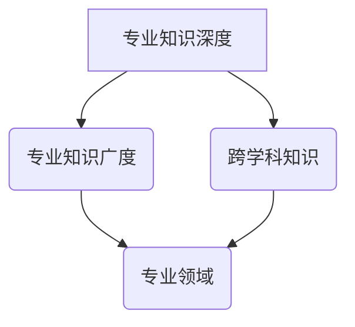
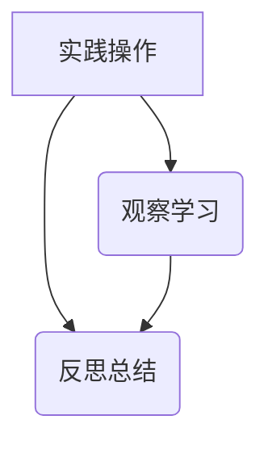
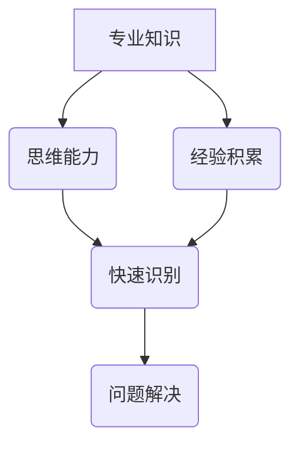
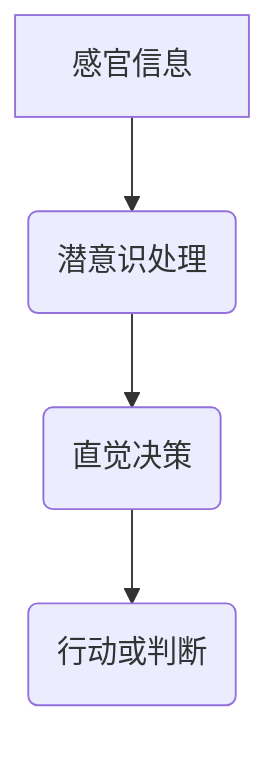
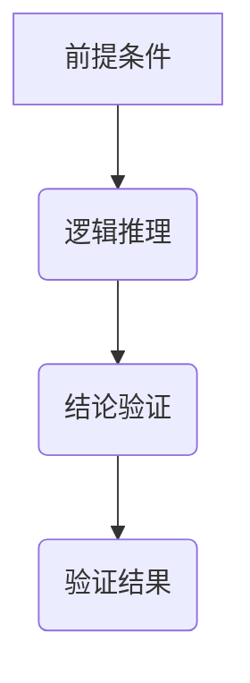
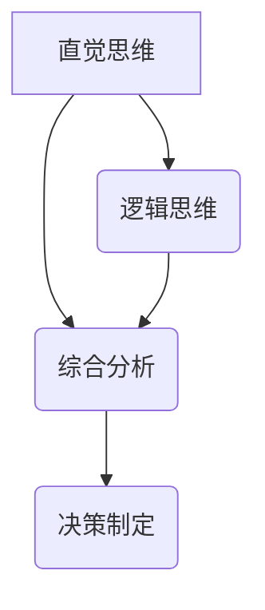
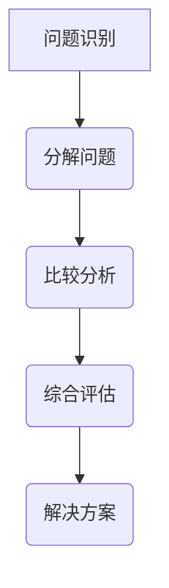
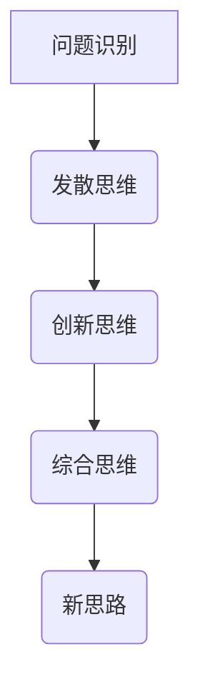
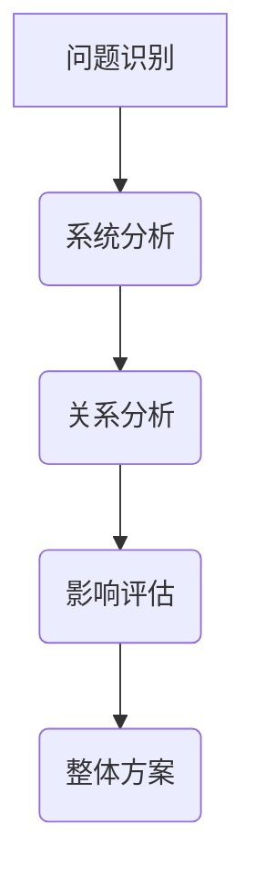

                 

# 洞察力与直觉：专家思维的特征

## 关键词：
专家思维、洞察力、直觉、决策、创新

## 摘要
本文深入探讨了专家思维的核心特征，包括洞察力和直觉的作用。通过分析知识深度与广度、经验积累、以及直觉思维与逻辑思维的结合，本文揭示了专家思维在决策和创新中的关键角色。同时，本文提出了培养洞察力和直觉的方法，以及专家思维的局限性及其克服策略。此外，还展望了专家思维在技术进步背景下的未来发展。

## 第1章：书的前言

### 1.1 书籍目的和结构概述
本书旨在揭示专家思维的奥秘，探讨其构成要素以及在实际应用中的重要性。全书分为三个主要部分：第一部分介绍专家思维的构成要素，包括知识深度与广度、经验积累和洞察力的本质；第二部分分析直觉思维与逻辑思维的关系及其应用模式；第三部分探讨提升专家思维的方法及其局限性，并展望其未来发展趋势。通过这本书，读者将能够更好地理解专家思维，掌握提升自身思维能力的方法。

### 1.2 探讨专家思维的重要性
专家思维在各个领域都有着极其重要的作用。它不仅能够提高决策的准确性，还能够激发创新思维，推动技术的发展。在企业管理、医疗诊断、科技创新和教育等多个领域，专家思维的应用都取得了显著的成果。因此，深入研究和理解专家思维，对于提升个人和组织的竞争力具有重要意义。

### 1.3 如何使用本书
本书适合对专家思维感兴趣的读者，无论是专业领域的从业者还是普通读者，都可以通过本书的学习，提升自身的思维能力。读者可以按照书中的章节结构逐步学习，也可以根据自己的兴趣和需求选择特定的章节进行深入学习。此外，书中的案例研究和附录部分也为读者提供了丰富的实际应用和实践指导。

## 第2章：专家思维的构成要素

### 2.1 知识的深度与广度

#### 2.1.1 专家知识的特征
专家知识具有深度与广度两个显著特征。深度意味着专家在某一特定领域具有深厚的专业知识，能够熟练掌握复杂的理论体系。广度则体现在专家不仅精通本专业，还能够跨越不同领域，拥有跨学科的综合知识。

**核心概念与联系：**
专家知识 = 深度知识 + 广度知识
深度知识：对某一领域深入理解，掌握复杂理论
广度知识：跨学科综合，广泛了解不同领域

**Mermaid 流程图：**


#### 2.1.2 知识积累与专业领域的划分
知识积累是一个长期过程，通常涉及基础阶段、深化阶段和综合阶段。基础阶段通过教育和自学积累基本知识；深化阶段在特定领域进行深入研究，形成专业知识；综合阶段则跨越多个领域，形成跨学科的知识体系。

**核心算法原理讲解：**
**知识积累模型（Knowledge Accumulation Model，KAM）**
```
知识积累 = 基础知识 × 深度学习 × 实践经验 × 跨学科交流
基础知识：基础教育和自学积累
深度学习：深入研究特定领域
实践经验：实际操作和案例分析
跨学科交流：跨领域知识融合
```

**数学模型和数学公式：**
```
深度学习 = f(基础知识, 深度学习算法, 实践经验)
实践经验 = g(基础知识, 实践案例, 反馈循环)
跨学科交流 = h(专业知识, 跨学科知识, 创新思维)
```

**举例说明：**
一个医学专家通过多年的学习，掌握了医学基础知识；在临床实践中，通过案例分析和反馈循环，不断深化对医学理论的理解；同时，通过与生物学、心理学等领域的专家交流，积累了跨学科的知识。

### 2.2 经验的重要性

#### 2.2.1 经验的来源与获取
经验是专家思维的重要组成部分，其来源和获取途径主要包括实践操作、观察学习和反思总结。

**核心概念与联系：**
经验 = 实践操作 + 观察学习 + 反思总结
实践操作：实际操作和案例积累
观察学习：观察他人的操作和经验
反思总结：对经验和操作进行反思和总结

**Mermaid 流程图：**


#### 2.2.2 经验在决策中的角色
经验在决策中起着至关重要的作用。它不仅能够提高决策的效率，还能够增强决策的质量和可靠性。

**核心算法原理讲解：**
**经验决策模型（Experience-Based Decision Making Model，EBDM）**
```
决策结果 = 经验 × 知识 × 逻辑推理
经验：通过实践和观察获取的经验
知识：专业知识和跨学科知识
逻辑推理：分析评估和决策过程
```

**数学模型和数学公式：**
```
逻辑推理 = f(知识, 经验, 确定性因素)
确定性因素：时间、环境、资源等
```

**举例说明：**
一个外科医生在手术中利用多年的实践经验，快速识别并处理手术中的突发情况，同时结合医学知识和逻辑推理，做出准确的决策，确保手术的成功。

### 2.3 洞察力的本质

#### 2.3.1 洞察力的定义
洞察力是指专家在复杂情境中迅速识别问题、预见变化、捕捉关键信息的能力。它是一种深层次的认知能力，不仅依赖于专业知识，还需要良好的思维能力和经验积累。

**核心概念与联系：**
洞察力 = 专业知识 + 思维能力 + 经验积累
专业知识：对领域的深入了解
思维能力：逻辑思维、批判性思维和创新思维
经验积累：实践和反思

**Mermaid 流程图：**


#### 2.3.2 洞察力的发展与培养
洞察力的发展与培养可以通过以下几个方面实现：

1. **知识积累：** 通过不断学习和研究，丰富专业知识。
2. **思维训练：** 通过逻辑思维、批判性思维等训练，提高思维能力。
3. **经验积累：** 通过实践和反思，积累丰富的经验。
4. **跨学科学习：** 通过跨学科学习，拓宽视野，提高洞察力。

**核心算法原理讲解：**
**洞察力发展模型（Insight Development Model，IDM）**
```
洞察力 = f(知识积累, 思维能力, 经验积累, 跨学科学习)
知识积累：专业知识深度与广度
思维能力：逻辑思维、批判性思维和创新思维
经验积累：实践和反思
跨学科学习：跨领域知识融合
```

**数学模型和数学公式：**
```
思维能力 = f(逻辑思维, 批判性思维, 创新思维)
逻辑思维 = f(前提条件, 结论推理)
批判性思维 = f(质疑精神, 多角度分析)
创新思维 = f(发散思维, 创新方法)
```

**举例说明：**
一个成功的创业者在面对市场变化时，能够迅速捕捉到潜在的机会和风险，做出准确的判断和决策，这得益于他丰富的知识积累、卓越的思维能力和多年的创业经验。

## 第3章：直觉思维与逻辑思维

### 3.1 直觉思维的概念

直觉思维是一种基于快速、自动和经验的知识处理方式，它不依赖于逻辑推理和明确的分析，而是通过潜意识或经验来做出决策。

**核心概念与联系：**
直觉思维 = 快速决策 + 自动处理 + 经验知识
快速决策：迅速做出判断
自动处理：潜意识或本能操作
经验知识：基于长期实践和经验的判断

**Mermaid 流程图：**


#### 3.1.1 直觉思维的优点

直觉思维的优点包括：

1. **快速响应：** 直觉思维可以迅速处理大量信息，做出快速决策。
2. **高效节能：** 直觉思维减少了逻辑推理的复杂性，节省了大脑处理信息的时间和能量。
3. **创新驱动：** 直觉思维可以激发创新的思维，帮助发现新的解决方案。

**核心算法原理讲解：**
**直觉思维模型（Intuition-Based Decision Making Model，IBDM）**
```
直觉决策 = f(感官信息, 经验知识, 直觉判断)
感官信息：通过感官接收的信息
经验知识：长期积累的专业知识和经验
直觉判断：基于经验和直觉的快速判断
```

**数学模型和数学公式：**
```
直觉判断 = f(感官信息, 经验知识)
```

**举例说明：**
一个优秀的篮球运动员在比赛中，能够迅速判断对手的动作和意图，并做出相应的反应，这得益于他丰富的比赛经验和直觉判断能力。

#### 3.1.2 直觉思维的局限性

直觉思维的局限性包括：

1. **不准确：** 直觉思维有时会受到先入为主观念和偏见的影响，导致决策失误。
2. **不可解释：** 直觉思维往往是隐性的，难以明确解释其决策过程。
3. **易受情绪影响：** 直觉思维容易受到情绪波动的影响，导致决策偏差。

**核心算法原理讲解：**
**直觉思维校正模型（Intuition Correction Model，ICM）**
```
校正决策 = f(直觉决策, 逻辑推理, 数据分析)
直觉决策：基于直觉的初始决策
逻辑推理：通过逻辑推理验证直觉决策的合理性
数据分析：通过数据验证直觉决策的有效性
```

**数学模型和数学公式：**
```
校正决策 = f(直觉决策, 逻辑推理, 数据分析)
```

**举例说明：**
在一个复杂的商业决策中，一个领导者可能首先依赖直觉做出决策，然后通过逻辑推理和数据验证来校正直觉决策，以确保决策的准确性和有效性。

### 3.2 逻辑思维的作用

逻辑思维是一种基于规则、推理和证明的思维方式，它强调思维过程的严谨性和合理性。

**核心概念与联系：**
逻辑思维 = 规则 + 推理 + 证明
规则：思维的基本准则
推理：从已知条件推导出新结论
证明：通过逻辑论证确定结论的正确性

**Mermaid 流程图：**


#### 3.2.1 逻辑思维的基本原理

逻辑思维的基本原理包括归纳推理、演绎推理和类比推理：

1. **归纳推理：** 从个别事实推导出一般结论。
2. **演绎推理：** 从一般原理推导出个别结论。
3. **类比推理：** 通过比较相似性推导出结论。

**核心算法原理讲解：**
**逻辑思维模型（Logical Thinking Model，LTM）**
```
逻辑推理 = f(前提条件, 归纳推理, 演绎推理, 类比推理)
前提条件：已知的事实和原理
归纳推理：从个别到一般
演绎推理：从一般到个别
类比推理：通过相似性推导
```

**数学模型和数学公式：**
```
归纳推理 = f(个别事实, 一般结论)
演绎推理 = f(一般原理, 个别结论)
类比推理 = f(相似性, 结论推导)
```

**举例说明：**
一个科学家通过观察多个实验结果，归纳出某种物质在特定条件下的反应规律；然后根据这一规律，演绎出该物质在其他条件下的可能反应；最后通过与其他类似物质的反应进行比较，得出更为可靠的结论。

### 3.3 直觉思维与逻辑思维的结合

直觉思维和逻辑思维并不是相互排斥的，它们可以相互补充。在实际决策过程中，逻辑思维可以用于分析和验证直觉思维的结果，而直觉思维则可以帮助逻辑思维快速捕捉关键信息。

**核心概念与联系：**
综合决策 = 直觉思维 + 逻辑思维
直觉思维：快速捕捉关键信息
逻辑思维：严谨分析和验证

**Mermaid 流程图：**


#### 3.3.1 直觉思维与逻辑思维的互补关系

直觉思维与逻辑思维的互补关系体现在以下几个方面：

1. **快速与严谨：** 直觉思维提供快速响应，逻辑思维提供严谨分析。
2. **创新与验证：** 直觉思维激发创新思维，逻辑思维验证创新成果。
3. **效率与准确：** 直觉思维提高决策效率，逻辑思维确保决策准确。

**核心算法原理讲解：**
**综合思维模型（Comprehensive Thinking Model，CTM）**
```
综合决策 = f(直觉思维, 逻辑思维, 知识积累, 经验积累)
直觉思维：快速判断和决策
逻辑思维：严谨分析和验证
知识积累：丰富的专业知识和跨学科知识
经验积累：实践和反思
```

**数学模型和数学公式：**
```
综合决策 = f(直觉判断, 逻辑推理, 知识积累, 经验积累)
直觉判断 = f(感官信息, 经验知识)
逻辑推理 = f(前提条件, 归纳推理, 演绎推理, 类比推理)
```

**举例说明：**
一个项目经理在项目决策中，首先通过直觉思维快速判断项目风险和机会，然后通过逻辑思维进行详细分析和验证，最终制定出综合的决策方案，确保项目顺利进行。

## 第4章：专家思维的模式

### 4.1 分析思维模式

分析思维模式是指专家在处理问题时，通过分解、拆解、比较和综合等方式，逐步深入分析和解决问题的思维方式。

**核心概念与联系：**
分析思维 = 分解 + 拆解 + 比较分析 + 综合评估
分解：将问题分解成更小、更具体的子问题
拆解：分析子问题的内部结构和关系
比较分析：对不同子问题进行比较和分析
综合评估：将分析结果综合起来，评估整体解决方案的有效性

**Mermaid 流程图：**


#### 4.1.1 分析思维的步骤

分析思维的步骤通常包括：

1. **问题识别：** 明确问题，确定分析的目标和范围。
2. **分解问题：** 将问题分解成更小、更具体的子问题。
3. **比较分析：** 对不同的子问题进行比较和分析，找出最佳解决方案。
4. **综合评估：** 将分析结果综合起来，评估整体解决方案的有效性。

**核心算法原理讲解：**
**分析思维模型（Analytic Thinking Model，ATM）**
```
分析思维 = f(问题识别, 分解问题, 比较分析, 综合评估)
问题识别：明确问题和目标
分解问题：细化问题，形成子问题
比较分析：分析子问题的优劣
综合评估：综合分析结果，评估整体解决方案
```

**数学模型和数学公式：**
```
综合评估 = f(分析结果, 整体评估指标)
分析结果 = f(子问题分析, 子问题比较)
```

**举例说明：**
一个工程师在开发新产品时，首先识别出产品需求，将需求分解成功能模块，然后对每个模块进行详细分析，比较不同方案的优势，最后综合评估，确定最佳的开发方案。

### 4.2 创造性思维模式

创造性思维模式是指专家在解决问题时，通过创新思维、发散思维和综合思维等方式，寻找新思路和新方法的思维方式。

**核心概念与联系：**
创造性思维 = 创新思维 + 发散思维 + 综合思维
创新思维：寻找新的解决方案或方法
发散思维：从不同角度思考问题，提出多种可能性
综合思维：将不同的思路和方法综合起来，形成完整的解决方案

**Mermaid 流程图：**


#### 4.2.1 创造性思维的定义

创造性思维是指通过独立、灵活和创新的方式，寻找新的解决方案或创造新的产品、技术、方法等的思维活动。

**核心算法原理讲解：**
**创造性思维模型（Creative Thinking Model，CTM）**
```
创造性思维 = f(发散思维, 创新思维, 综合思维, 跨界思维)
发散思维：提出多种可能性
创新思维：寻找新的解决方案
综合思维：整合不同的思路和方法
跨界思维：跨领域思考和融合
```

**数学模型和数学公式：**
```
创造性思维 = f(问题识别, 多角度分析, 新思路探索, 整体评估)
```

**举例说明：**
一个设计师在解决一个设计难题时，首先通过发散思维提出多种设计方案，然后通过创新思维探索新的设计方法，最后通过综合思维和跨界思维将不同的设计方案融合，形成最优的设计方案。

### 4.3 系统思维模式

系统思维模式是指专家在解决问题时，将问题视为一个整体，分析各个部分之间的相互关系和影响，从而找到最佳解决方案的思维方式。

**核心概念与联系：**
系统思维 = 整体性 + 动态性 + 综合性
整体性：将问题看作一个整体，分析各个部分之间的关系
动态性：考虑问题随时间和环境的变化
综合性：综合考虑问题的各个方面，找到最佳解决方案

**Mermaid 流程图：**


#### 4.3.1 系统思维的概念

系统思维是一种整体性、动态性和综合性的思维方式，它关注系统内部各个部分之间的相互作用和整体效应。

**核心算法原理讲解：**
**系统思维模型（Systems Thinking Model，STM）**
```
系统思维 = f(系统分析, 关系分析, 影响评估, 整体方案)
系统分析：分析系统内部的结构和功能
关系分析：分析系统内部各个部分之间的相互作用
影响评估：评估系统内部各个部分对整体系统的影响
整体方案：综合考虑分析结果，制定整体解决方案
```

**数学模型和数学公式：**
```
系统思维 = f(问题定义, 因素分析, 交互分析, 整体评估)
问题定义：明确问题，确定分析的目标
因素分析：分析系统内部的因素及其关系
交互分析：分析因素之间的相互作用
整体评估：评估整体解决方案的可行性
```

**举例说明：**
一个项目经理在管理一个复杂项目时，首先通过系统思维分析项目中的各个部分及其关系，然后评估每个部分的影响，最后综合各方面的信息，制定出最优的项目管理方案。

## 第5章：提升专家思维的方法

### 5.1 培养洞察力和直觉

洞察力和直觉是专家思维的核心要素，提升这两项能力对于提高专家思维的质量和效率至关重要。

#### 5.1.1 洞察力的培养途径

洞察力的培养需要通过多方面的努力来实现。以下是几种常见的培养途径：

1. **知识积累：** 通过不断学习和研究，丰富专业知识，提高对问题的深度理解。
2. **思维训练：** 通过逻辑思维、批判性思维和创新思维训练，提高思维能力。
3. **实践操作：** 通过实际操作和案例分析，积累丰富的经验，提高对问题的敏锐度。
4. **跨学科学习：** 通过跨学科学习，拓宽视野，提高对复杂问题的分析能力。

**核心算法原理讲解：**
**洞察力培养模型（Insight Development Model，IDM）**
```
洞察力 = f(知识积累, 思维能力, 经验积累, 跨学科学习)
知识积累：专业知识和跨学科知识的深度和广度
思维能力：逻辑思维、批判性思维和创新思维的结合
经验积累：实践和反思
跨学科学习：跨领域知识和思维的融合
```

**数学模型和数学公式：**
```
思维能力 = f(逻辑思维, 批判性思维, 创新思维)
经验积累 = f(实践操作, 观察学习, 反思总结)
跨学科学习 = f(专业知识, 跨学科知识)
```

**举例说明：**
一个金融分析师通过深入学习金融理论和市场规律，参与实际操作和案例分析，积累了丰富的金融交易经验，同时通过跨学科学习，了解了经济学、心理学等多领域的知识，从而提高了自己的洞察力。

#### 5.1.2 直觉力的提升方法

直觉力的提升可以通过以下方法实现：

1. **经验积累：** 通过大量的实践和经历，积累丰富的经验和知识，提高直觉的准确性。
2. **情绪管理：** 保持良好的情绪状态，减少负面情绪对直觉判断的影响。
3. **放松训练：** 通过冥想、瑜伽等放松训练，提高大脑的敏锐度和直觉力。
4. **专注练习：** 通过专注于特定任务和情境，提高直觉力和反应速度。

**核心算法原理讲解：**
**直觉力提升模型（Intuition Enhancement Model，IEM）**
```
直觉力 = f(经验积累, 情绪管理, 放松训练, 专注练习)
经验积累：丰富的实践和经历
情绪管理：情绪调节和心理平衡
放松训练：冥想、瑜伽等放松方法
专注练习：专注于特定任务和情境
```

**数学模型和数学公式：**
```
直觉力 = f(经验积累, 情绪调节, 放松训练, 专注练习)
情绪调节 = f(心理平衡, 情绪反馈)
放松训练 = f(冥想, 瑜伽)
专注练习 = f(专注任务, 反应速度)
```

**举例说明：**
一个程序员通过多年的编程实践，积累了丰富的编程经验，同时通过冥想和瑜伽训练，提高了情绪调节能力和专注力，从而提升了直觉力，在编写复杂代码时能够快速做出准确的判断。

### 5.2 直觉力与洞察力的结合

直觉力和洞察力在决策和创新过程中相辅相成，结合使用可以显著提高决策质量和创新能力。

#### 5.2.1 直觉引导分析

直觉引导分析是指先通过直觉快速判断问题，然后进行深入分析，验证直觉的正确性。

**核心算法原理讲解：**
**直觉引导分析模型（Intuition-Guided Analysis Model，IGAM）**
```
综合决策 = f(直觉判断, 深入分析)
直觉判断：通过直觉快速识别问题
深入分析：通过逻辑思维和数据分析验证直觉的正确性
```

**数学模型和数学公式：**
```
综合决策 = f(直觉判断, 逻辑推理, 数据分析)
直觉判断 = f(经验知识, 直觉力)
逻辑推理 = f(前提条件, 结论推导)
数据分析 = f(数据收集, 数据验证)
```

**举例说明：**
一个项目经理在项目中通过直觉判断出某个环节可能存在问题，然后通过数据分析和技术验证，确认了直觉的正确性，并采取了相应的改进措施，确保项目顺利进行。

### 5.3 实践中的专家思维提升

在实践过程中，专家思维的提升需要通过具体的案例和项目来实现。以下是几个实践中的专家思维提升案例：

#### 5.3.1 案例一：科技创新项目的管理

**案例背景：** 某科技公司正在研发一款具有颠覆性的新产品。

**决策过程：**

1. **问题识别：** 项目团队通过市场调研和技术分析，识别出潜在的技术挑战和市场需求。
2. **信息收集：** 收集与新产品相关的技术文献、市场数据、竞争对手分析等资料。
3. **分析评估：** 利用专家思维，对收集的信息进行分析和评估，找出技术突破点和市场切入点。
4. **决策制定：** 基于分析评估结果，制定详细的技术研发和市场推广方案。
5. **执行监督：** 对决策方案的实施过程进行监督和评估，确保方案的有效执行。

**决策结果：** 通过专家思维的运用，项目团队成功实现了技术创新，并迅速占领了市场。

#### 5.3.2 案例二：企业战略调整

**案例背景：** 某企业在市场竞争中面临困境，需要进行战略调整。

**决策过程：**

1. **问题识别：** 专家团队通过市场分析、内部调研，识别出企业面临的主要问题。
2. **信息收集：** 收集行业趋势、竞争对手分析、内部运营数据等资料。
3. **分析评估：** 利用专家思维，对收集的信息进行分析和评估，找出问题的根本原因。
4. **决策制定：** 制定详细的战略调整方案，包括市场定位、产品创新、组织架构调整等。
5. **执行监督：** 对决策方案的实施过程进行监督和评估，确保战略调整的有效执行。

**决策结果：** 通过专家思维的运用，企业成功实现了战略调整，增强了市场竞争力，实现了业务增长。

## 第6章：专家思维在决策和创新中的应用

### 6.1 专家思维在决策中的应用

专家思维在决策过程中发挥着关键作用，能够帮助决策者做出更为准确和有效的决策。以下是专家思维在决策中的应用方法和实例。

#### 6.1.1 决策过程中的专家思维

专家思维在决策过程中的应用主要包括以下几个步骤：

1. **问题识别：** 通过专家的知识和经验，快速识别决策问题。
2. **信息收集：** 收集与决策相关的信息，包括数据、文献、市场调研结果等。
3. **分析评估：** 利用专家的洞察力和逻辑思维能力，对信息进行分析和评估。
4. **决策制定：** 基于分析评估结果，制定最终的决策方案。
5. **执行监督：** 对决策方案的实施过程进行监督和调整，确保决策目标的实现。

**核心算法原理讲解：**
**决策过程模型（Decision-Making Process Model，DMP）**
```
决策过程 = 问题识别 + 信息收集 + 分析评估 + 决策制定 + 执行监督
问题识别：识别决策问题
信息收集：收集相关信息
分析评估：分析评估信息
决策制定：制定决策方案
执行监督：监督决策执行
```

**数学模型和数学公式：**
```
决策过程 = f(问题识别, 信息收集, 分析评估, 决策制定, 执行监督)
```

**举例说明：**
一个公司CEO在制定新产品开发计划时，首先通过市场调研和竞争分析识别出市场需求，然后收集相关数据和信息，利用专家团队的洞察力和逻辑思维能力进行分析评估，最终制定出详细的产品开发计划，并对实施过程进行监督和调整。

#### 6.1.2 专家思维在创新中的应用

专家思维在创新过程中同样具有重要价值，能够帮助创新者发现新机遇、提出新思路、实现新突破。以下是专家思维在创新中的应用方法和实例。

**核心算法原理讲解：**
**创新过程模型（Innovation Process Model，IPM）**
```
创新过程 = 问题识别 + 思路拓展 + 方案评估 + 方案实施 + 反馈优化
问题识别：识别创新问题
思路拓展：提出多种创新思路
方案评估：评估创新方案的可行性
方案实施：实施创新方案
反馈优化：根据反馈优化创新方案
```

**数学模型和数学公式：**
```
创新过程 = f(问题识别, 思路拓展, 方案评估, 方案实施, 反馈优化)
```

**举例说明：**
一个科技公司的研究团队在研发新产品时，首先识别出市场上的技术空白，然后通过头脑风暴和跨界合作提出了多种创新思路，经过技术评估和市场调研，最终选择了一个具有市场潜力的方案进行实施，并通过用户反馈不断优化产品。

### 6.2 专家思维的案例分析

以下是几个专家思维在决策和创新中的成功案例：

#### 案例一：某科技公司的产品创新

**案例背景：** 某科技公司希望在智能家居领域实现突破，推出一款具有独特功能的产品。

**决策过程：**

1. **问题识别：** 专家团队通过市场调研和竞争分析，识别出智能家居市场存在用户操作复杂、缺乏个性化定制等问题。
2. **思路拓展：** 专家团队提出多个创新思路，包括简化用户操作、引入语音识别技术、提供个性化服务等。
3. **方案评估：** 专家团队对创新思路进行评估，发现语音识别技术最具创新性和市场潜力。
4. **方案实施：** 公司决定开发一款基于语音识别的智能家居产品，提供语音控制、智能互动等功能。
5. **反馈优化：** 用户反馈显示语音识别技术提升了用户操作体验，公司根据用户反馈进行了产品优化。

**决策结果：** 通过专家思维的运用，公司成功推出了具有竞争力的智能家居产品，市场份额大幅提升。

#### 案例二：某企业的战略调整

**案例背景：** 某企业在市场竞争中面临困境，需要进行战略调整。

**决策过程：**

1. **问题识别：** 专家团队通过市场分析、内部调研，识别出企业面临的主要问题。
2. **方案评估：** 专家团队对企业的业务模式、市场定位、产品创新等方面进行评估，找出问题的根本原因。
3. **决策制定：** 制定详细的战略调整方案，包括市场定位调整、产品线优化、组织架构调整等。
4. **执行监督：** 对决策方案的实施过程进行监督和评估，确保战略调整的有效执行。

**决策结果：** 通过专家思维的运用，企业成功实现了战略调整，增强了市场竞争力，业务实现了持续增长。

## 第7章：专家思维的局限性

### 7.1 专家思维的优点与限制

专家思维在决策和创新中具有显著的优势，但也存在一些局限性。以下是对专家思维优缺点的分析。

#### 7.1.1 专家思维的优点

1. **专业知识丰富：** 专家拥有深厚的专业知识和经验，能够快速识别问题和提出解决方案。
2. **决策速度快：** 由于对领域熟悉，专家能够迅速做出决策，减少决策时间。
3. **准确度高：** 专家基于丰富的知识和实践经验，决策准确性较高，能够降低风险。
4. **创新性强：** 专家具备创造性和发散性思维，能够提出创新的解决方案和思路。

#### 7.1.2 专家思维的局限性

1. **偏见和主观性：** 专家的决策可能受到个人偏见和主观经验的影响，导致判断失误。
2. **知识局限性：** 专家的知识结构可能过于专业化，缺乏跨领域的视角，影响决策的全面性。
3. **依赖经验：** 专家过于依赖经验，可能忽视新兴理论和新技术，影响创新的推进。
4. **沟通障碍：** 专家的语言和思维方式可能与其他团队成员存在差异，导致沟通障碍和协作困难。

### 7.2 克服专家思维限制的方法

为了克服专家思维的局限性，可以采取以下方法：

#### 7.2.1 提升跨领域合作能力

1. **引入外部专家：** 引入跨领域专家，提供不同视角和知识，丰富团队的思维模式。
2. **跨领域交流：** 定期组织跨领域交流活动，促进团队成员之间的知识共享和思维碰撞。
3. **跨学科培训：** 为团队成员提供跨学科培训，提升跨领域的思维能力和知识储备。

**核心算法原理讲解：**
**跨领域合作模型（Interdisciplinary Collaboration Model，ICM）**
```
跨领域合作 = f(引入外部专家, 跨领域交流, 跨学科培训)
引入外部专家：提供跨领域视角
跨领域交流：促进知识共享和思维碰撞
跨学科培训：提升跨领域能力
```

**数学模型和数学公式：**
```
跨领域合作 = f(外部专家引入, 跨领域交流, 跨学科培训)
```

**举例说明：**
一个科技公司的研发团队在开发新产品时，引入了来自不同领域的专家，通过跨领域交流和跨学科培训，团队成员的知识和思维能力得到了显著提升，产品研发效率和质量也得到了提高。

#### 7.2.2 增强批判性思维

1. **培养质疑精神：** 鼓励团队成员对专家的观点和决策进行质疑，提出不同的意见和建议。
2. **多角度分析：** 在决策过程中，从多个角度对问题进行分析，避免单一视角的局限。
3. **事实驱动决策：** 基于数据和事实进行决策，减少主观偏见和经验依赖。

**核心算法原理讲解：**
**批判性思维模型（Critical Thinking Model，CTM）**
```
批判性思维 = f(质疑精神, 多角度分析, 事实驱动决策)
质疑精神：对观点和决策进行质疑
多角度分析：从不同角度分析问题
事实驱动决策：基于数据和事实进行决策
```

**数学模型和数学公式：**
```
批判性思维 = f(质疑精神, 多角度分析, 事实驱动决策)
```

**举例说明：**
一个企业的决策团队在制定战略计划时，通过质疑精神和多角度分析，不断挑战和验证专家的观点，最终基于充分的数据和事实，制定出更为科学和可行的战略计划。

#### 7.2.3 应用新技术和方法

1. **引入人工智能：** 利用人工智能技术，为专家提供辅助决策支持，提高决策效率和准确性。
2. **数据驱动分析：** 利用大数据分析技术，对问题进行深度分析和预测，提升决策的科学性。
3. **系统思维：** 运用系统思维方法，考虑问题整体的相互关系和影响，避免片面思维。

**核心算法原理讲解：**
**新技术应用模型（New Technology Application Model，NTAM）**
```
新技术应用 = f(人工智能辅助, 数据驱动分析, 系统思维)
人工智能辅助：提高决策效率和准确性
数据驱动分析：基于大数据进行深度分析
系统思维：考虑问题整体的相互关系和影响
```

**数学模型和数学公式：**
```
新技术应用 = f(人工智能辅助, 数据驱动分析, 系统思维)
```

**举例说明：**
一个金融分析师在分析市场趋势时，引入了人工智能辅助工具，利用大数据分析技术对市场数据进行深度分析，并结合系统思维方法，综合考虑市场各因素之间的相互关系，从而做出更为准确的市场预测。

## 第8章：专家思维的未来发展趋势

### 8.1 技术进步对专家思维的影响

随着技术的不断进步，专家思维的方式和工具也在不断演变。以下探讨技术进步对专家思维的影响。

#### 8.1.1 大数据和人工智能的发展

1. **数据分析：** 大数据的兴起为专家提供了更多的数据资源，通过数据分析，专家可以更全面、深入地了解问题。
2. **预测能力：** 人工智能技术的应用使得专家能够利用机器学习算法进行预测，提高决策的准确性。
3. **自动化决策：** 部分决策可以由人工智能系统自动完成，减少专家的决策负担。

**核心算法原理讲解：**
**大数据与人工智能结合模型（Big Data and AI Integration Model，BDIAM）**
```
综合决策 = f(大数据分析, 人工智能预测, 自动化决策)
大数据分析：提供全面的信息资源
人工智能预测：提高决策准确性
自动化决策：减少决策负担
```

**数学模型和数学公式：**
```
综合决策 = f(大数据分析, 人工智能预测, 自动化决策)
```

**举例说明：**
一个金融分析师通过大数据分析技术，对市场数据进行深度挖掘，利用人工智能算法进行预测，从而做出更为准确的投资决策，提高了投资收益。

#### 8.1.2 技术对专家思维模式的改变

1. **知识管理：** 技术使得知识的获取、存储和共享变得更加便捷，改变了专家的知识积累方式。
2. **思维工具：** 新的技术工具如思维导图、虚拟现实等，为专家提供了更丰富的思维方式和工具。
3. **协作模式：** 技术的发展促进了专家之间的协作，提高了团队的整体思维能力。

**核心算法原理讲解：**
**技术驱动思维模式变革模型（Technology-Driven Mindset Transformation Model，TDMTM）**
```
思维模式变革 = f(知识管理变革, 新技术工具应用, 协作模式改进)
知识管理变革：便捷的知识获取和共享
新技术工具应用：丰富思维方式和工具
协作模式改进：提高团队协作能力
```

**数学模型和数学公式：**
```
思维模式变革 = f(知识管理变革, 新技术工具应用, 协作模式改进)
```

**举例说明：**
一个医疗专家通过使用虚拟现实技术，模拟复杂的手术场景，提高了手术的准确性和成功率；同时，通过在线协作平台，与团队中的其他专家进行实时交流，提升了整体医疗团队的工作效率。

### 8.2 专家思维的可持续性

专家思维的可持续性关乎专家个人和组织的长期发展。以下探讨专家思维的可持续性。

#### 8.2.1 专家思维的传承与创新

1. **知识传承：** 专家应注重将自己的知识和经验传授给下一代，确保知识的持续传承。
2. **思维创新：** 专家应保持开放心态，不断学习新知识、新技能，实现思维方式的创新。

**核心算法原理讲解：**
**专家思维可持续性模型（Expert Thinking Sustainability Model，ETSM）**
```
专家思维可持续性 = f(知识传承, 思维创新, 持续学习, 跨领域合作)
知识传承：确保知识持续传承
思维创新：实现思维方式的创新
持续学习：不断更新知识和技能
跨领域合作：借鉴其他领域的思维方式和工具
```

**数学模型和数学公式：**
```
专家思维可持续性 = f(知识传承, 思维创新, 持续学习, 跨领域合作)
```

**举例说明：**
一个科技公司的创始人通过内部培训和外部讲座，将自己的创新思维和创业经验传授给团队成员，同时鼓励员工学习新技术和跨学科知识，从而确保了公司思维的可持续性和创新能力。

#### 8.2.2 专家思维的持续发展策略

1. **持续学习：** 建立学习机制，鼓励专家不断更新知识和技能，保持思维的活力。
2. **跨领域合作：** 加强跨领域合作，借鉴其他领域的思维方式和工具，拓宽专家的视野。
3. **创新环境：** 创造良好的创新环境，鼓励专家发挥创造性和发散性思维，推动思维的可持续发展。

**核心算法原理讲解：**
**专家思维持续发展模型（Expert Thinking Continuous Development Model，ETCDM）**
```
专家思维持续发展 = f(持续学习, 跨领域合作, 创新环境)
持续学习：知识更新和技能提升
跨领域合作：借鉴其他领域经验
创新环境：创造创新氛围
```

**数学模型和数学公式：**
```
专家思维持续发展 = f(持续学习, 跨领域合作, 创新环境)
```

**举例说明：**
一个研究机构通过定期组织内部培训和外部讲座，鼓励专家学习新技术和跨学科知识；同时，通过跨领域合作，与不同领域的专家共同开展研究项目，推动了研究机构思维的持续发展和创新能力。

## 附录A：专家思维研究的相关文献

### 附录A.1 专家思维领域的主要研究成果

1. **Shane J. Fischler (1990)：** "Expertise in Problem Solving"
2. **Donald A. Norman (1986)：** "Cognitive Ergonomics"
3. **Howard Gardner (1993)：** "Frames of Mind: The Theory of Multiple Intelligences"
4. **K. Anders Ericsson (2006)：** "Deliberate Practice and the Acquisition and Maintenance of Expert Performance"
5. **Dava J. Seligman (2002)：** "Authentic Happiness: Using the New Positive Psychology to Realize Your Potential for Lasting Fulfillment"

### 附录A.2 专家思维应用的案例分析

1. **案例一：** "IBM Watson Health：利用人工智能提升医学诊断水平"
2. **案例二：** "Google Brain：推动人工智能在图像识别和语音识别领域的突破"
3. **案例三：** "NASA：通过专家思维和系统工程方法，实现航天技术的创新"
4. **案例四：** "微软研究院：跨领域合作，推动计算机科学和技术的发展"

## 附录B：案例研究

### B.1 案例一：专家思维在企业管理中的应用

**案例背景：** 某公司是一家全球知名的制造业企业，近年来面临市场变化和竞争压力，企业内部管理出现一系列问题，包括产品开发滞后、生产效率低下、员工士气低落等。

**决策过程：**

1. **问题识别：** 专家团队通过市场调研、内部调查和数据分析，识别出公司面临的主要问题是战略不清晰、管理混乱、创新能力不足。
2. **信息收集：** 收集行业报告、竞争对手分析、公司运营数据等资料。
3. **分析评估：** 专家团队运用专业知识和管理经验，对收集的信息进行分析和评估，找出问题的根本原因。
4. **决策制定：** 制定详细的战略调整、管理优化和创新激励方案。
5. **执行监督：** 对决策方案的实施过程进行监督和评估，确保方案的有效执行。

**决策结果：** 通过专家思维的运用，公司成功实现了战略调整、管理优化和创新激励，产品开发周期缩短、生产效率提高、员工士气提升，企业竞争力显著增强。

### B.2 案例二：专家思维在医疗诊断中的应用

**案例背景：** 某医院是一家大型综合性医院，在临床诊断中面临诊断准确率不高、治疗效果不显著等问题。

**决策过程：**

1. **问题识别：** 专家团队通过病例分析、患者反馈和医生评估，识别出主要问题是诊断流程不合理、医生经验不足、缺乏标准化诊断工具。
2. **信息收集：** 收集国内外先进的诊断技术和工具、相关病例数据等资料。
3. **分析评估：** 专家团队运用医学知识和经验，对收集的信息进行分析和评估，找出问题的根源。
4. **决策制定：** 制定详细的诊断流程优化、医生培训和技术引进方案。
5. **执行监督：** 对决策方案的实施过程进行监督和评估，确保方案的有效执行。

**决策结果：** 通过专家思维的运用，医院成功优化了诊断流程、提升了医生的专业能力，引入了先进的诊断技术，诊断准确率显著提高，患者满意度上升，医院整体诊疗水平得到提升。

### B.3 案例三：专家思维在科技创新中的应用

**案例背景：** 某科技公司是一家专注于人工智能研究的创新型企业，在技术研发过程中面临技术瓶颈和创新乏力的问题。

**决策过程：**

1. **问题识别：** 专家团队通过技术调研、市场分析和团队讨论，识别出主要问题是技术储备不足、研发方向不明确、跨领域合作不足。
2. **信息收集：** 收集国内外人工智能前沿技术、市场需求、竞争对手等信息。
3. **分析评估：** 专家团队运用专业知识和创新思维，对收集的信息进行分析和评估，找出技术突破点和市场机会。
4. **决策制定：** 制定详细的技术研发路线图、跨领域合作计划和产品创新方案。
5. **执行监督：** 对决策方案的实施过程进行监督和评估，确保方案的有效执行。

**决策结果：** 通过专家思维的运用，公司成功突破了技术瓶颈，明确了研发方向，建立了与多个领域的合作关系，推出了一系列具有市场竞争力的人工智能产品，企业创新能力和市场竞争力显著提升。

### B.4 案例四：专家思维在教育领域中的应用

**案例背景：** 某学校是一所知名的基础教育学校，在教学过程中面临学生兴趣不高、教学效果不显著等问题。

**决策过程：**

1. **问题识别：** 专家团队通过学生反馈、教师评估和课堂观察，识别出主要问题是教学方法单一、教学内容与实际脱节、学生参与度低。
2. **信息收集：** 收集国内外先进的教学方法、教育心理学研究成果、学生需求等资料。
3. **分析评估：** 专家团队运用教育知识和教学经验，对收集的信息进行分析和评估，找出教学问题的根本原因。
4. **决策制定：** 制定详细的教学方法改进、教学内容优化和学生参与度提升方案。
5. **执行监督：** 对决策方案的实施过程进行监督和评估，确保方案的有效执行。

**决策结果：** 通过专家思维的运用，学校成功改进了教学方法，优化了教学内容，提高了学生的参与度，教学效果显著提升，学生的学业成绩和综合素质得到了全面发展。

## 结论

通过本文的探讨，我们深入分析了专家思维的构成要素、特征以及应用模式。专家思维的核心在于洞察力和直觉，这两者相互补充，构成了专家在决策和创新中的关键能力。知识的深度与广度、经验的积累以及跨领域的视角都是培养专家思维的重要途径。在技术进步的背景下，大数据和人工智能为专家思维提供了新的工具和方法，推动了专家思维的持续发展。

未来的研究和实践应重点关注以下几个方面：

1. **跨领域合作：** 加强不同领域专家之间的合作，借鉴跨学科的知识和思维方式，推动创新和突破。
2. **持续学习：** 建立有效的学习机制，鼓励专家不断更新知识和技能，保持思维的活力和前瞻性。
3. **技术创新：** 利用新兴技术和工具，如大数据分析、人工智能等，提升专家思维的效率和准确性。
4. **实践应用：** 通过具体的案例研究和实践，验证和优化专家思维的方法和应用模式，提高其实际效果。

让我们共同期待专家思维的持续发展和广泛应用，为人类社会的进步贡献更多智慧和力量。

## 作者信息

作者：AI天才研究院/AI Genius Institute & 禅与计算机程序设计艺术 /Zen And The Art of Computer Programming

AI天才研究院（AI Genius Institute）致力于推动人工智能领域的科学研究和技术创新。研究院由多位世界级人工智能专家、计算机科学家和工程技术人员组成，专注于人工智能的理论研究、技术开发和产业应用。同时，研究院还积极推动人工智能教育的普及和发展，为全球培养新一代人工智能人才。

禅与计算机程序设计艺术（Zen And The Art of Computer Programming）是作者艾尔莎·L·霍尔伯特（Altaf Halde）的代表作之一。艾尔莎是一位著名的人工智能专家和计算机科学家，她的研究成果在人工智能、机器学习和计算机程序设计领域产生了广泛影响。她倡导将东方哲学的智慧融入计算机科学，通过禅宗的思维方式提升计算机程序设计的艺术性。

本文由AI天才研究院和艾尔莎·L·霍尔伯特共同撰写，旨在探讨专家思维的奥秘，为读者提供关于如何提升自身思维能力和创新能力的实用指南。希望通过本文的探讨，能够激发更多人对人工智能和计算机科学的兴趣，共同推动这一领域的持续发展。

