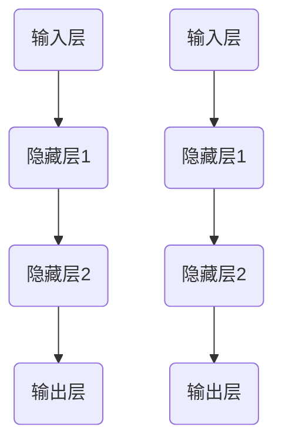
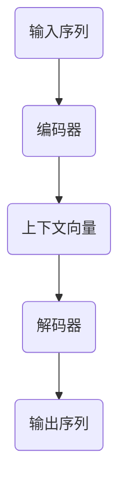
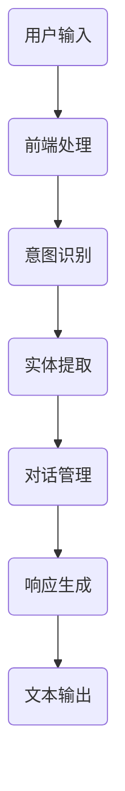
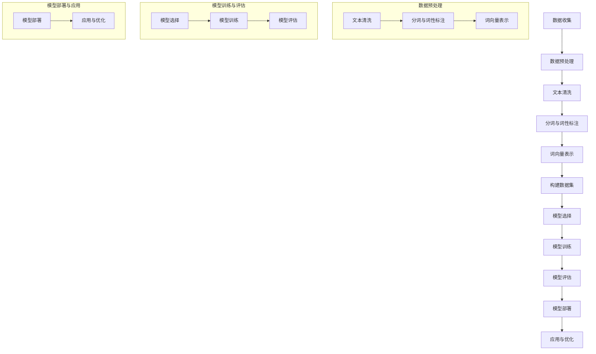

                 

### 文章标题

# 深度学习在自然语言理解中的突破性进展

---

### 关键词

- 深度学习
- 自然语言理解
- 神经网络
- 语言模型
- 注意力机制
- Transformer模型

---

### 摘要

随着深度学习的不断发展，自然语言理解（NLU）领域迎来了革命性的突破。本文旨在探讨深度学习在NLU中的核心进展，从基础理论到实际应用，逐步分析其影响与挑战。我们将首先介绍深度学习的基本概念，然后深入神经网络和自然语言处理的基础知识，探讨近年来备受关注的Transformer模型及其变体，如BERT和GPT。随后，本文将展示深度学习在文本分类、机器翻译、问答系统和对话系统等领域的实际应用案例。最后，本文将总结深度学习在NLU中的突破性进展，并展望其未来的发展趋势。

---

## 目录大纲：《深度学习在自然语言理解中的突破性进展》

### 第一部分：深度学习基础

### 第1章：深度学习概述

#### 1.1 深度学习的基本概念

#### 1.2 深度学习的发展历程

#### 1.3 深度学习与传统机器学习的区别

#### 1.4 深度学习在自然语言理解中的应用

### 第2章：神经网络基础

#### 2.1 神经元与神经元模型

#### 2.2 前馈神经网络

#### 2.3 激活函数

#### 2.4 反向传播算法

### 第3章：深度学习框架与工具

#### 3.1 TensorFlow与PyTorch简介

#### 3.2 深度学习框架的选择与使用

#### 3.3 Keras快速入门

### 第二部分：自然语言处理基础

### 第4章：自然语言处理基础

#### 4.1 语言模型

#### 4.2 词向量表示

#### 4.3 语言模型评估指标

### 第5章：序列模型

#### 5.1 循环神经网络（RNN）

#### 5.2 长短期记忆网络（LSTM）

#### 5.3 门控循环单元（GRU）

### 第6章：注意力机制与Transformer模型

#### 6.1 注意力机制原理

#### 6.2 Transformer模型架构

#### 6.3 BERT、GPT等知名模型介绍

### 第三部分：深度学习在自然语言理解中的应用

### 第7章：文本分类与情感分析

#### 7.1 文本分类算法

#### 7.2 情感分析算法

#### 7.3 文本分类与情感分析实战案例

### 第8章：机器翻译

#### 8.1 神经机器翻译原理

#### 8.2 神经机器翻译模型架构

#### 8.3 机器翻译实战案例

### 第9章：问答系统

#### 9.1 问答系统基本原理

#### 9.2 基于深度学习的问答系统实现

#### 9.3 问答系统实战案例

### 第10章：对话系统

#### 10.1 对话系统基本原理

#### 10.2 对话系统模型架构

#### 10.3 对话系统实战案例

### 第四部分：突破性进展与未来展望

### 第11章：深度学习在自然语言理解中的突破性进展

#### 11.1 深度学习在自然语言理解中的挑战

#### 11.2 突破性进展案例介绍

#### 11.3 深度学习在自然语言理解中的未来趋势

### 第12章：深度学习在自然语言理解中的应用前景

#### 12.1 深度学习在自然语言理解中的商业应用

#### 12.2 深度学习在自然语言理解中的社会影响

#### 12.3 未来发展展望与思考

### 第13章：深度学习在自然语言理解中的实践经验与挑战

#### 13.1 深度学习在自然语言理解中的实践经验分享

#### 13.2 深度学习在自然语言理解中的挑战与解决方案

#### 13.3 深度学习在自然语言理解中的跨领域应用

### 附录

### 附录A：深度学习在自然语言理解中的常用工具与资源

#### A.1 常用深度学习框架

#### A.2 自然语言处理工具

#### A.3 实践资源与教程

#### A.4 论文与最新动态

### 附录B：深度学习在自然语言理解中的流程图

[流程图](#appendix-b-depth-learning-in-natural-language-understanding-process-diagram)

---

接下来，我们将逐步深入探讨深度学习在自然语言理解中的各个方面，为读者呈现一个全面而深入的视角。敬请期待！

---

### 第一部分：深度学习基础

### 第1章：深度学习概述

深度学习（Deep Learning，简称DL）是机器学习（Machine Learning，简称ML）的一个子领域，主要关注于使用多层神经网络模型进行数据建模与预测。深度学习的发展可以追溯到1980年代，当时由于计算资源和数据集的限制，神经网络的研究进展缓慢。然而，随着计算能力的提升和大数据技术的发展，深度学习在21世纪初迎来了爆炸性的增长。

#### 1.1 深度学习的基本概念

深度学习基于人工神经网络（Artificial Neural Networks，ANNs）的概念，但与传统的神经网络相比，它具有更深的网络结构。深度学习模型由多个隐含层组成，每个隐含层能够捕捉输入数据的不同特征层次。这些特征层通过逐层抽象和组合，最终生成对输入数据的深刻理解。

主要组成部分包括：

- **神经元（Neurons）**：深度学习模型的基本构建块，模拟生物神经元的函数。
- **层（Layers）**：神经网络中一组相连的神经元，包括输入层、隐藏层和输出层。
- **权重（Weights）**：连接神经元之间的参数，用于调整神经元的输出。
- **激活函数（Activation Functions）**：对神经元输出进行非线性变换，引入模型的非线性特性。
- **梯度下降（Gradient Descent）**：一种优化算法，用于调整模型权重以最小化损失函数。

#### 1.2 深度学习的发展历程

深度学习的发展历程可以分为几个阶段：

- **1980年代**：神经网络研究开始，但受到计算能力的限制，进展缓慢。
- **2006年**：Hinton等人提出了深度置信网络（Deep Belief Networks，DBN），为深度学习的研究奠定了基础。
- **2012年**：Hinton领导的团队在ImageNet图像识别挑战中使用了深度卷积神经网络（CNN），显著提升了识别准确率，标志着深度学习时代的到来。
- **2010年代**：随着计算资源和数据集的不断增加，深度学习在语音识别、自然语言处理等领域取得了突破性进展。

#### 1.3 深度学习与传统机器学习的区别

传统机器学习主要依赖于手工程特征和相对简单的模型，如支持向量机（SVM）和决策树。相比之下，深度学习具有以下优势：

- **自动特征提取**：深度学习模型能够自动从数据中提取有用的特征，无需人工干预。
- **多层抽象**：通过多层神经网络，深度学习能够捕捉到输入数据的不同层次特征。
- **更强的泛化能力**：由于能够捕捉到更复杂的特征，深度学习模型在新的数据集上通常具有更强的泛化能力。
- **更高的准确率**：特别是在图像识别、语音识别等领域，深度学习模型通常能够达到或超过人类的水平。

#### 1.4 深度学习在自然语言理解中的应用

自然语言理解（Natural Language Understanding，NLU）是深度学习应用的一个重要领域。NLU的目标是让机器理解和解释人类语言，从而实现与人类的自然交流。以下是深度学习在NLU中的几个关键应用：

- **语言模型（Language Models）**：用于预测下一个单词或词组，是许多NLU任务的基础。
- **词向量（Word Embeddings）**：将单词映射到高维空间中的向量表示，使计算机能够理解单词之间的语义关系。
- **文本分类（Text Classification）**：将文本数据分类到预定义的类别中，用于情感分析、垃圾邮件检测等。
- **机器翻译（Machine Translation）**：使用深度学习模型将一种语言的文本翻译成另一种语言。
- **问答系统（Question Answering Systems）**：能够从大量文本中提取答案，是信息检索和智能客服的重要组成部分。
- **对话系统（Dialogue Systems）**：实现人与机器之间的自然对话，包括语音助手、聊天机器人等。

在下一章中，我们将进一步探讨神经网络的基础知识，包括神经元模型、前馈神经网络和反向传播算法等。

---

### 第2章：神经网络基础

神经网络（Neural Networks）是深度学习模型的核心组成部分。本章节将介绍神经网络的基础概念，包括神经元模型、前馈神经网络、激活函数和反向传播算法。通过这些基本概念的学习，读者可以更好地理解深度学习模型的运作原理。

#### 2.1 神经元与神经元模型

神经元是神经网络的基本构建块，类似于生物神经元的结构和功能。一个简单的神经元模型通常包括以下部分：

- **输入（Inputs）**：每个神经元接收多个输入，这些输入可以是从前一层神经元的输出或其他外部数据。
- **权重（Weights）**：每个输入都与一个权重相乘，权重用于调整输入对神经元输出的影响。
- **偏置（Bias）**：偏置是一个额外的参数，用于调整神经元的输出。
- **激活函数（Activation Function）**：对神经元的总输入进行非线性变换，引入模型的非线性特性。

神经元模型的数学表达式如下：

$$
\text{神经元输出} = \text{激活函数}(\sum_{i=1}^{n} w_i \cdot x_i + b)
$$

其中，$w_i$ 是权重，$x_i$ 是输入，$b$ 是偏置，$n$ 是输入的数量。

#### 2.2 前馈神经网络

前馈神经网络（Feedforward Neural Networks）是一种简单的神经网络结构，其中数据从输入层流向输出层，不形成循环。前馈神经网络包括以下三个主要部分：

1. **输入层（Input Layer）**：接收外部输入数据，每个神经元对应一个输入特征。
2. **隐藏层（Hidden Layers）**：一个或多个隐藏层，每个隐藏层中的神经元接收前一层的输出，并传递给下一层。
3. **输出层（Output Layer）**：生成模型的最终输出，用于分类、回归或其他任务。

前馈神经网络的流程图如下所示：



在前馈神经网络中，信息从输入层传递到输出层，每个神经元的输出作为下一个神经元的输入。通过多层的神经网络结构，前馈神经网络能够捕捉到输入数据的复杂特征。

#### 2.3 激活函数

激活函数是神经元模型中的一个关键组件，用于引入非线性特性。常见的激活函数包括：

1. **线性激活函数（Linear Activation Function）**：
   $$
   \text{线性激活函数}(x) = x
   $$
   线性激活函数没有引入非线性特性，适用于简单线性模型。

2. **ReLU激活函数（Rectified Linear Unit）**：
   $$
   \text{ReLU}(x) = \max(0, x)
   $$
  ReLU函数在零点处将输入值设为零，在其他地方保持不变。ReLU函数在训练过程中能够加速梯度下降，并减少梯度消失问题。

3. **Sigmoid激活函数（Sigmoid Function）**：
   $$
   \text{Sigmoid}(x) = \frac{1}{1 + e^{-x}}
   $$
   Sigmoid函数将输入值映射到$(0, 1)$区间，常用于二分类问题。

4. **Tanh激活函数（Hyperbolic Tangent Activation Function）**：
   $$
   \text{Tanh}(x) = \frac{e^x - e^{-x}}{e^x + e^{-x}}
   $$
   Tanh函数与Sigmoid函数类似，但输出范围在$(-1, 1)$之间。

#### 2.4 反向传播算法

反向传播算法（Backpropagation Algorithm）是深度学习模型训练的核心算法，用于计算模型参数的梯度，并更新模型权重以最小化损失函数。反向传播算法分为两个阶段：

1. **前向传播（Forward Propagation）**：计算神经网络的前向传播，从输入层到输出层，得到每个神经元的输出。
2. **反向传播（Back Propagation）**：计算每个神经元的梯度，从输出层反向传播到输入层，更新模型权重。

以下是一个简单的反向传播算法的伪代码：

```python
# 前向传播
def forward_propagation(X, W, b, activation_function):
    # 输入数据 X，权重 W，偏置 b，激活函数
    Z = X * W + b
    A = activation_function(Z)
    return A

# 反向传播
def backward_propagation(A, Z, dZ, dW, db):
    # 输出 A，前一层输出 Z，误差 dZ，梯度 dW，梯度 db
    dZ = A - dA
    dW = Z * dZ
    db = dZ
    dZ = dZ * activation_function_derivative(Z)
    dX = dZ * W
    return dX, dW, db
```

在反向传播算法中，每个层的梯度通过链式法则计算，从而得到整个神经网络的梯度。通过多次迭代更新模型参数，反向传播算法能够训练出具有良好性能的神经网络模型。

在下一章中，我们将介绍深度学习框架与工具，包括TensorFlow与PyTorch，以及Keras快速入门。

---

### 第3章：深度学习框架与工具

深度学习框架是构建和训练深度学习模型的重要工具，它们提供了丰富的函数库和接口，简化了模型开发的过程。本章节将介绍常用的深度学习框架，包括TensorFlow、PyTorch和Keras，并探讨如何选择合适的框架以及如何快速入门Keras。

#### 3.1 TensorFlow与PyTorch简介

TensorFlow是由Google开发的开源深度学习框架，它提供了丰富的API和工具，用于构建和训练深度学习模型。TensorFlow具有高度的灵活性和可扩展性，支持多种类型的神经网络，包括卷积神经网络（CNN）和循环神经网络（RNN）。TensorFlow的主要特点包括：

- **动态图计算**：TensorFlow使用动态计算图，允许在运行时动态构建和修改计算图。
- **高性能计算**：TensorFlow利用GPU和TPU等硬件加速器，提高了模型的训练和推理速度。
- **广泛的应用支持**：TensorFlow在图像识别、语音识别、自然语言处理等领域具有广泛的应用。

PyTorch是由Facebook开发的开源深度学习框架，它提供了动态计算图和静态计算图两种模式。PyTorch的主要特点包括：

- **动态计算图**：PyTorch使用动态计算图，允许在运行时动态构建和修改计算图，使其更易于调试和理解。
- **灵活的API**：PyTorch的API设计简单直观，易于使用和扩展。
- **强大的GPU支持**：PyTorch提供了高效的GPU支持，通过CUDA和cuDNN库，可以在GPU上加速模型的训练和推理。

#### 3.2 深度学习框架的选择与使用

选择合适的深度学习框架取决于具体的需求和项目目标。以下是一些选择深度学习框架时需要考虑的因素：

1. **项目需求**：根据项目的需求，选择适合的框架。例如，如果需要实时训练和推理，可以选择TensorFlow；如果需要灵活的动态计算图，可以选择PyTorch。
2. **开发经验**：根据团队成员的开发经验和技能，选择熟悉的框架。例如，如果团队成员熟悉Python和TensorFlow，可以选择TensorFlow。
3. **性能要求**：根据模型的复杂度和训练数据量，选择性能良好的框架。例如，如果需要高效利用GPU和TPU，可以选择TensorFlow。
4. **社区和支持**：考虑框架的社区活跃度和官方支持，选择有良好社区支持和文档的框架，以方便解决问题和获取帮助。

在实际开发过程中，可以选择一个主框架作为核心框架，同时结合其他框架的功能。例如，可以使用TensorFlow作为核心框架，结合PyTorch的动态计算图功能，以实现灵活的模型开发和调试。

#### 3.3 Keras快速入门

Keras是一个基于TensorFlow和Theano的开源深度学习库，它提供了简洁、易用的API，用于构建和训练深度学习模型。Keras的主要特点包括：

- **简洁的API**：Keras提供了直观、简洁的API，使模型构建更加容易和高效。
- **模块化**：Keras支持模块化模型构建，可以组合使用预定义的层和模型。
- **兼容性**：Keras可以与TensorFlow和Theano无缝集成，方便在不同平台上使用。

以下是一个使用Keras构建简单线性回归模型的示例：

```python
from keras.models import Sequential
from keras.layers import Dense

# 创建模型
model = Sequential()

# 添加层
model.add(Dense(units=1, input_shape=(1,)))
model.add(Dense(units=1))

# 编译模型
model.compile(optimizer='sgd', loss='mean_squared_error')

# 训练模型
model.fit(x_train, y_train, epochs=100, batch_size=32)

# 预测
predictions = model.predict(x_test)
```

在这个示例中，我们首先创建一个序列模型，然后添加两个全连接层（Dense Layer），并设置输出层的单位数为1。接着，我们编译模型，指定优化器和损失函数，然后使用训练数据训练模型。最后，我们使用训练好的模型对测试数据进行预测。

通过Keras，可以快速构建和训练深度学习模型，节省开发时间和精力，专注于模型的设计和优化。

在下一章中，我们将探讨自然语言处理（NLP）的基础知识，包括语言模型、词向量表示和语言模型评估指标。

---

### 第二部分：自然语言处理基础

### 第4章：自然语言处理基础

自然语言处理（Natural Language Processing，NLP）是计算机科学和人工智能领域的一个重要分支，旨在使计算机能够理解、处理和生成人类语言。NLP涉及多个层次的任务，包括文本预处理、词法分析、句法分析、语义分析和语音识别等。在本章节中，我们将介绍NLP的基础知识，包括语言模型、词向量表示和语言模型评估指标。

#### 4.1 语言模型

语言模型（Language Model）是NLP的核心组成部分，它用于预测一段文本的下一个单词或词组。语言模型在许多NLP任务中起着关键作用，如自动填词、机器翻译、语音识别和问答系统。语言模型可以分为两类：基于规则的模型和统计模型。

1. **基于规则的模型**：这类模型使用手工定义的规则和模式来预测下一个单词。例如，语法规则、词频统计和上下文匹配等。这类模型的优点是实现简单，但缺点是缺乏灵活性和广泛性。

2. **统计模型**：这类模型基于大量的文本数据，使用概率和统计方法来学习语言模式。常见的统计模型包括隐马尔可夫模型（HMM）、n-gram模型和朴素贝叶斯分类器等。统计模型具有更高的灵活性和准确性，但训练和推理过程相对复杂。

语言模型的训练通常使用最大似然估计（Maximum Likelihood Estimation，MLE）或最小化交叉熵损失函数（Cross-Entropy Loss）等方法。语言模型的性能可以通过 perplexity（困惑度）指标进行评估，困惑度越低，模型对文本的预测能力越强。

#### 4.2 词向量表示

词向量（Word Embedding）是将单词映射到高维空间中的向量表示，用于捕捉单词的语义关系。词向量表示在NLP任务中发挥着重要作用，如文本分类、情感分析和机器翻译等。常见的词向量表示方法包括基于统计方法和基于神经网络的方法。

1. **基于统计方法的词向量表示**：这类方法通过统计单词在语料库中的共现关系来学习词向量。常见的算法包括词袋模型（Bag of Words，BoW）和词嵌入（Word Embedding）。词袋模型将文本表示为向量空间中的单词集合，而词嵌入将每个单词映射为固定长度的向量。词嵌入方法能够更好地捕捉单词的语义信息。

2. **基于神经网络的方法**：这类方法使用神经网络模型来学习词向量。常见的算法包括循环神经网络（RNN）和Transformer模型。RNN通过循环机制处理序列数据，可以捕捉单词之间的长期依赖关系。Transformer模型引入了自注意力机制（Self-Attention），可以同时考虑输入序列中的所有单词，提高了模型的捕捉能力。

#### 4.3 语言模型评估指标

评估语言模型性能的指标包括准确率、召回率、F1值和困惑度等。以下是对这些指标的解释：

1. **准确率（Accuracy）**：准确率是模型预测正确的样本数与总样本数之比。准确率能够简单直观地衡量模型的性能，但在类别不平衡的情况下，可能不能很好地反映模型的效果。

2. **召回率（Recall）**：召回率是模型预测正确的正样本数与实际正样本数之比。召回率能够衡量模型对正样本的识别能力，但在错误分类的成本较高时，可能不是最佳指标。

3. **F1值（F1 Score）**：F1值是准确率和召回率的调和平均值，能够综合考虑模型的准确性和召回率。F1值在类别不平衡的情况下具有更好的表现。

4. **困惑度（Perplexity）**：困惑度是语言模型对测试文本预测困难程度的度量。困惑度越低，模型对文本的预测能力越强。

在实际应用中，可以根据任务需求和数据特点选择合适的评估指标。例如，在文本分类任务中，F1值是常用的评估指标；在语言生成任务中，困惑度是常用的评估指标。

在下一章中，我们将探讨序列模型，包括循环神经网络（RNN）、长短期记忆网络（LSTM）和门控循环单元（GRU），以及它们在自然语言处理中的应用。

---

### 第5章：序列模型

序列模型（Sequence Models）是处理序列数据（如文本、音频、时间序列等）的一类深度学习模型。它们通过学习序列中的时空关系来捕捉数据中的模式和规律。在自然语言处理（NLP）中，序列模型广泛应用于文本分类、情感分析、机器翻译和问答系统等任务。本章将介绍三种重要的序列模型：循环神经网络（RNN）、长短期记忆网络（LSTM）和门控循环单元（GRU），并探讨它们的基本原理和在NLP中的应用。

#### 5.1 循环神经网络（RNN）

循环神经网络（Recurrent Neural Networks，RNN）是处理序列数据的最早和最基础的模型之一。RNN的核心思想是使用循环结构来处理序列数据，使模型能够保留和利用前面的信息。一个简单的RNN模型可以表示为：

$$
h_t = \text{激活函数}(\text{权重} \cdot [h_{t-1}, x_t] + \text{偏置})
$$

其中，$h_t$ 是当前时间步的隐藏状态，$x_t$ 是当前时间步的输入，激活函数通常采用ReLU函数。RNN通过循环结构将上一个时间步的隐藏状态$h_{t-1}$作为当前时间步的输入，从而实现序列信息的传递。

然而，传统的RNN在处理长序列数据时存在梯度消失和梯度爆炸问题，导致训练效果不佳。为了解决这些问题，研究人员提出了长短期记忆网络（LSTM）和门控循环单元（GRU）。

#### 5.2 长短期记忆网络（LSTM）

长短期记忆网络（Long Short-Term Memory，LSTM）是RNN的一种改进，它通过引入记忆单元和门控机制来有效地学习长序列数据。LSTM模型由三个主要部分组成：遗忘门（forget gate）、输入门（input gate）和输出门（output gate）。

1. **遗忘门（Forget Gate）**：遗忘门决定哪些信息应该从记忆单元中丢弃。其计算公式为：

   $$
   f_t = \text{sigmoid}(\text{权重} \cdot [h_{t-1}, x_t] + \text{偏置})
   $$

   其中，$f_t$ 是遗忘门的输出，表示遗忘门的激活值。$1 - f_t$ 表示保留在记忆单元中的比例。

2. **输入门（Input Gate）**：输入门决定哪些新的信息应该更新到记忆单元。其计算公式为：

   $$
   i_t = \text{sigmoid}(\text{权重} \cdot [h_{t-1}, x_t] + \text{偏置})
   $$

   $$
   \tilde{C}_t = \text{tanh}(\text{权重} \cdot [h_{t-1}, x_t] + \text{偏置})
   $$

   其中，$i_t$ 是输入门的激活值，$\tilde{C}_t$ 是候选值。

3. **输出门（Output Gate）**：输出门决定记忆单元的输出。其计算公式为：

   $$
   o_t = \text{sigmoid}(\text{权重} \cdot [h_{t-1}, x_t] + \text{偏置})
   $$

   $$
   C_t = o_t \cdot \text{tanh}(\text{权重} \cdot [h_{t-1}, x_t] + \text{偏置})
   $$

   其中，$o_t$ 是输出门的激活值，$C_t$ 是当前时间步的记忆单元。

通过这三个门控机制，LSTM能够有效地学习长序列数据，避免了梯度消失和梯度爆炸问题。

#### 5.3 门控循环单元（GRU）

门控循环单元（Gated Recurrent Unit，GRU）是另一种改进的RNN模型，它通过简化LSTM的结构来提高训练效率和计算速度。GRU由更新门（update gate）和重置门（reset gate）组成。

1. **更新门（Update Gate）**：更新门决定哪些旧信息应该被保留或丢弃，其计算公式为：

   $$
   z_t = \text{sigmoid}(\text{权重} \cdot [h_{t-1}, x_t] + \text{偏置})
   $$

2. **重置门（Reset Gate）**：重置门决定哪些新信息应该被整合到旧信息中，其计算公式为：

   $$
   r_t = \text{sigmoid}(\text{权重} \cdot [h_{t-1}, x_t] + \text{偏置})
   $$

3. **候选值**：候选值是更新和重置门的结合，其计算公式为：

   $$
   \tilde{h}_t = \text{tanh}(\text{权重} \cdot [r_t \cdot h_{t-1}, x_t] + \text{偏置})
   $$

4. **当前隐藏状态**：当前隐藏状态是更新门和候选值的组合，其计算公式为：

   $$
   h_t = (1 - z_t) \cdot h_{t-1} + z_t \cdot \tilde{h}_t
   $$

GRU通过简化LSTM的结构，减少了参数数量，从而提高了训练效率和计算速度。同时，GRU在许多NLP任务中表现良好，成为一种流行的序列模型。

在下一章中，我们将介绍注意力机制与Transformer模型，探讨它们在NLP中的突破性应用。

---

### 第6章：注意力机制与Transformer模型

注意力机制（Attention Mechanism）是深度学习中的一个核心概念，用于提高模型在处理序列数据时的性能。注意力机制通过动态分配权重来关注序列中的关键信息，从而提高模型的捕捉能力和鲁棒性。Transformer模型引入了自注意力机制（Self-Attention），彻底改变了自然语言处理（NLP）领域的格局。本章将详细介绍注意力机制的基本原理、Transformer模型的架构以及知名变体BERT和GPT。

#### 6.1 注意力机制原理

注意力机制是一种通过动态调整模型对输入数据的关注程度来提高模型性能的方法。在传统的循环神经网络（RNN）和长短期记忆网络（LSTM）中，模型通常只能关注序列中的当前和过去的信息。然而，对于长序列数据，这些方法往往难以捕捉到全局信息。注意力机制通过为每个输入元素分配不同的权重，使得模型能够灵活地关注序列中的关键信息。

注意力机制的数学基础是一个加权求和操作，其核心思想是将输入序列的每个元素通过一个权重向量进行加权，然后对加权后的结果进行求和。注意力机制的数学公式可以表示为：

$$
\text{Attention}(Q, K, V) = \text{softmax}\left(\frac{QK^T}{\sqrt{d_k}}\right) V
$$

其中，$Q$ 是查询（Query）向量，$K$ 是键（Key）向量，$V$ 是值（Value）向量。$d_k$ 是键向量的维度。通过计算查询向量和键向量的点积，我们可以得到一组权重，然后对这些权重进行softmax操作，得到概率分布。最后，将概率分布应用于值向量，得到注意力分数的加权和。

#### 6.2 Transformer模型架构

Transformer模型是由Vaswani等人于2017年提出的一种基于自注意力机制的序列到序列模型。Transformer模型彻底摒弃了传统的循环结构，采用了完全基于注意力机制的并行化架构。Transformer模型的主要组成部分包括：

1. **编码器（Encoder）**：编码器由多个自注意力层和前馈神经网络层组成。自注意力层通过自注意力机制捕捉序列中的长距离依赖关系。前馈神经网络层用于增加模型的非线性能力。

   编码器的输入是原始文本的词向量表示，输出是编码后的序列表示，用于后续的解码过程。

2. **解码器（Decoder）**：解码器同样由多个自注意力层和前馈神经网络层组成。解码器在生成输出序列时，首先关注编码器的输出，然后逐步关注生成序列中的前一个词。

   解码器的输入是编码器的输出和前一个生成的词，输出是生成的下一个词的预测。

3. **自注意力（Self-Attention）**：自注意力机制是Transformer模型的核心组成部分，它允许模型同时关注输入序列的每个元素。自注意力通过计算输入序列中每个词的键（Key）和值（Value）向量，以及查询（Query）向量之间的点积，得到注意力权重，然后对值向量进行加权求和。

4. **多头注意力（Multi-Head Attention）**：多头注意力是自注意力的一种扩展，它将输入序列分成多个子序列，分别计算每个子序列的注意力权重，然后将结果合并。多头注意力通过增加模型的容量和灵活性，提高了模型的性能。

5. **前馈神经网络（Feedforward Neural Network）**：前馈神经网络是Transformer模型中的辅助层，用于增加模型的非线性能力。前馈神经网络通常由两个全连接层组成，中间加入ReLU激活函数。

#### 6.3 BERT、GPT等知名模型介绍

BERT（Bidirectional Encoder Representations from Transformers）和GPT（Generative Pre-trained Transformer）是Transformer模型的两个知名变体，它们在NLP领域取得了显著的突破。

1. **BERT**：BERT是一种双向编码器，它通过预先训练大规模语料库来学习语言的深度表示。BERT的关键特点是双向注意力机制，使得模型能够同时考虑上下文信息，从而提高了模型对语义理解的准确性。BERT的预训练过程包括Masked Language Model（MLM）和Next Sentence Prediction（NSP）两个任务。BERT的预训练结果可以用于各种下游任务的微调，取得了显著的效果。

2. **GPT**：GPT是一种生成式预训练模型，它通过自回归语言模型（Autoregressive Language Model）来生成文本。GPT的关键特点是自回归机制，使得模型能够预测下一个词的概率，从而生成连续的文本序列。GPT的预训练过程使用大量的文本数据，通过递归地生成下一个词来训练模型。GPT在文本生成、机器翻译和问答系统等任务中取得了优异的性能。

BERT和GPT的成功证明了Transformer模型在NLP领域的潜力，为后续的研究和应用提供了重要的参考。在下一章中，我们将探讨深度学习在自然语言理解（NLU）中的具体应用，包括文本分类、机器翻译、问答系统和对话系统等。

---

### 第三部分：深度学习在自然语言理解中的应用

### 第7章：文本分类与情感分析

文本分类（Text Classification）和情感分析（Sentiment Analysis）是自然语言理解（NLU）中的两个重要任务，它们广泛应用于社交媒体分析、市场调研、情感监测和垃圾邮件检测等领域。深度学习模型，特别是基于神经网络的模型，在文本分类和情感分析中取得了显著的突破。本章将介绍文本分类和情感分析的基本算法、深度学习模型以及实际应用案例。

#### 7.1 文本分类算法

文本分类是将文本数据分类到预定义的类别中的任务。常见的文本分类算法包括基于词袋模型（Bag of Words，BoW）和TF-IDF（Term Frequency-Inverse Document Frequency）的传统算法，以及基于深度学习的神经网络模型。

1. **词袋模型（BoW）**：词袋模型将文本表示为词频向量，即每个文档表示为一个向量，其中每个元素表示一个单词的频率。词袋模型的优点是实现简单，但缺点是忽略了单词的顺序和语义信息。

2. **TF-IDF**：TF-IDF是对词袋模型的改进，它考虑了单词在文档中的频率和重要性。TF-IDF通过计算单词在文档中的频率（Term Frequency，TF）和其在语料库中的逆文档频率（Inverse Document Frequency，IDF），得到单词的权重。TF-IDF能够更好地捕捉文本的语义信息。

3. **深度学习模型**：深度学习模型，如卷积神经网络（CNN）和循环神经网络（RNN），在文本分类任务中表现优异。CNN能够捕捉文本中的局部特征，而RNN能够捕捉文本中的长距离依赖关系。

文本分类的流程通常包括以下几个步骤：

- **数据预处理**：包括去除标点符号、停用词过滤、词干提取和词向量表示等。
- **特征提取**：将预处理后的文本转换为特征向量，如词袋模型和TF-IDF。
- **模型训练**：使用训练数据训练深度学习模型，如CNN或RNN。
- **模型评估**：使用验证集评估模型性能，调整模型参数。
- **模型部署**：将训练好的模型部署到生产环境中，对新的文本数据进行分类。

#### 7.2 情感分析算法

情感分析是文本分类的一个子任务，它用于判断文本的情感倾向，如正面、负面或中性。情感分析广泛应用于社交媒体监控、产品评论分析和消费者行为预测等领域。

1. **基于规则的算法**：基于规则的算法通过手工定义规则和模式来识别情感。这类算法简单易实现，但需要对领域有深入了解，且扩展性较差。

2. **基于机器学习的算法**：基于机器学习的算法使用标记好的数据训练模型，如支持向量机（SVM）和朴素贝叶斯分类器。这些算法在处理复杂情感时表现较好，但需要大量的标注数据。

3. **深度学习模型**：深度学习模型，如CNN、RNN和Transformer，在情感分析任务中取得了显著的效果。这些模型能够自动学习文本中的复杂特征，从而提高情感分类的准确性。

情感分析的流程通常包括以下几个步骤：

- **数据预处理**：包括去除标点符号、停用词过滤、词干提取和词向量表示等。
- **特征提取**：将预处理后的文本转换为特征向量，如词袋模型和TF-IDF。
- **模型训练**：使用训练数据训练深度学习模型，如CNN或RNN。
- **模型评估**：使用验证集评估模型性能，调整模型参数。
- **模型部署**：将训练好的模型部署到生产环境中，对新的文本数据进行情感分类。

#### 7.3 文本分类与情感分析实战案例

以下是一个使用TensorFlow和Keras进行文本分类和情感分析的实际案例：

1. **数据集准备**：我们使用IMDB电影评论数据集，该数据集包含25000条训练数据和25000条测试数据，每条评论都有一个情感标签（正面或负面）。

2. **数据预处理**：首先，我们使用Keras的`Tokenizer`类将文本数据转换为词索引表示。然后，我们创建词索引和词嵌入矩阵，将文本转换为向量表示。

   ```python
   from keras.preprocessing.text import Tokenizer
   from keras.preprocessing.sequence import pad_sequences

   tokenizer = Tokenizer(num_words=10000)
   tokenizer.fit_on_texts(train_texts)
   sequences = tokenizer.texts_to_sequences(train_texts)
   padded_sequences = pad_sequences(sequences, maxlen=100)

   # 创建词嵌入矩阵
   embedding_matrix = np.zeros((10000, 16))
   for word, i in tokenizer.word_index.items():
       if i < 10000:
           embedding_vector = embedding_vector_lookup[word]
           if embedding_vector is not None:
               embedding_matrix[i] = embedding_vector
   ```

3. **模型构建**：我们构建一个简单的卷积神经网络模型，该模型由多个卷积层和池化层组成，最后连接到一个全连接层进行分类。

   ```python
   from keras.models import Sequential
   from keras.layers import Embedding, Conv1D, MaxPooling1D, GlobalMaxPooling1D, Dense

   model = Sequential()
   model.add(Embedding(10000, 16, input_length=100))
   model.add(Conv1D(32, 5, activation='relu'))
   model.add(MaxPooling1D(5))
   model.add(Conv1D(32, 5, activation='relu'))
   model.add(GlobalMaxPooling1D())
   model.add(Dense(128, activation='relu'))
   model.add(Dense(1, activation='sigmoid'))

   model.compile(optimizer='adam', loss='binary_crossentropy', metrics=['accuracy'])
   model.fit(padded_sequences, train_labels, epochs=10, validation_split=0.2)
   ```

4. **模型评估**：使用测试数据进行模型评估，计算准确率、召回率和F1值等指标。

   ```python
   test_sequences = tokenizer.texts_to_sequences(test_texts)
   padded_test_sequences = pad_sequences(test_sequences, maxlen=100)
   predicted_labels = model.predict(padded_test_sequences)
   predicted_labels = (predicted_labels > 0.5)

   from sklearn.metrics import accuracy_score, recall_score, f1_score
   print("Accuracy:", accuracy_score(test_labels, predicted_labels))
   print("Recall:", recall_score(test_labels, predicted_labels))
   print("F1 Score:", f1_score(test_labels, predicted_labels))
   ```

通过以上步骤，我们可以实现一个简单的文本分类和情感分析模型。在实际应用中，可以根据具体需求调整模型结构和参数，以提高模型的性能。

在下一章中，我们将探讨深度学习在机器翻译领域的应用，介绍神经机器翻译原理和模型架构。

---

### 第8章：机器翻译

机器翻译（Machine Translation，MT）是自然语言处理（NLP）领域的一个重要分支，旨在将一种语言的文本自动翻译成另一种语言。随着深度学习的发展，神经机器翻译（Neural Machine Translation，NMT）已经成为机器翻译的主流方法，相比传统机器翻译方法，NMT在翻译质量和效率方面有了显著提升。本章将介绍神经机器翻译的基本原理、模型架构以及实际应用案例。

#### 8.1 神经机器翻译原理

神经机器翻译是基于深度学习的序列到序列（Sequence-to-Sequence，Seq2Seq）模型。Seq2Seq模型的核心思想是将输入序列映射到输出序列，通过编码器（Encoder）和解码器（Decoder）两个部分实现。编码器将输入序列编码为一个固定长度的向量表示，称为上下文向量（Context Vector），解码器则根据上下文向量生成输出序列。

神经机器翻译的基本原理可以概括为以下几个步骤：

1. **编码器（Encoder）**：编码器将输入序列编码为一个固定长度的上下文向量。编码器通常采用循环神经网络（RNN）或其变体，如长短期记忆网络（LSTM）或门控循环单元（GRU）。在编码过程中，每个时间步的输入与上一个时间步的隐藏状态进行拼接，并通过一个线性层和激活函数得到当前时间步的隐藏状态。

   编码器的输出是一个固定长度的向量，它包含了输入序列的语义信息。

2. **上下文向量（Context Vector）**：编码器的输出是一个固定长度的上下文向量，该向量表示了输入序列的语义信息。上下文向量通常通过编码器的最后一个时间步的隐藏状态得到。

3. **解码器（Decoder）**：解码器根据上下文向量生成输出序列。解码器同样采用循环神经网络（RNN）或其变体。在解码过程中，每个时间步的输入是上一个时间步的隐藏状态和当前的输入词。解码器通过自注意力机制（Self-Attention）将上下文向量和输入序列的每个词进行关联，从而生成当前时间步的输出词。

   解码器的输出是一个单词序列，表示翻译结果。

4. **损失计算与优化**：在训练过程中，解码器的输出与实际翻译结果进行比较，计算损失函数（如交叉熵损失）。通过反向传播算法，计算编码器和解码器参数的梯度，并更新模型参数，以最小化损失函数。

#### 8.2 神经机器翻译模型架构

神经机器翻译模型架构主要包括编码器（Encoder）、解码器（Decoder）和注意力机制（Attention Mechanism）三个部分。

1. **编码器（Encoder）**：编码器负责将输入序列编码为一个上下文向量。编码器通常由多个隐藏层组成，每个隐藏层将上一个隐藏状态和当前输入进行拼接，并通过一个线性层和激活函数得到当前隐藏状态。编码器的输出是最后一个隐藏状态。

   ```mermaid
   graph TB
   A(输入序列) --> B(编码器输入)
   B --> C1(隐藏层1)
   C1 --> D1(隐藏层2)
   D1 --> E1(编码器输出)
   ```

2. **解码器（Decoder）**：解码器负责根据上下文向量生成输出序列。解码器同样由多个隐藏层组成，每个隐藏层将上一个隐藏状态和当前输入进行拼接，并通过一个线性层和激活函数得到当前隐藏状态。解码器的输出是单词序列，表示翻译结果。

   ```mermaid
   graph TB
   A(上下文向量) --> B(解码器输入)
   B --> C1(隐藏层1)
   C1 --> D1(隐藏层2)
   D1 --> E1(解码器输出)
   ```

3. **注意力机制（Attention Mechanism）**：注意力机制是神经机器翻译模型的关键组成部分，它用于解码器在生成输出序列时，动态关注输入序列的每个词。注意力机制通过计算上下文向量和输入序列的每个词之间的相似度，得到注意力权重，然后将权重应用于输入序列的每个词，得到加权求和的上下文向量。

   ```mermaid
   graph TB
   A(上下文向量) --> B(注意力权重计算)
   B --> C(加权求和上下文向量)
   C --> D(解码器输入)
   ```

神经机器翻译模型架构如图所示：



在下一章中，我们将探讨深度学习在问答系统（Question Answering，QA）中的应用，介绍问答系统的基本原理、基于深度学习的实现方法以及实际应用案例。

---

### 第9章：问答系统

问答系统（Question Answering，QA）是自然语言处理（NLP）领域的一个重要任务，旨在从大量文本中自动提取出与给定问题最相关的答案。问答系统在信息检索、智能客服、智能助手等领域具有广泛的应用。近年来，深度学习技术的引入使得问答系统的性能得到了显著提升。本章将介绍问答系统的基本原理、基于深度学习的实现方法以及实际应用案例。

#### 9.1 问答系统基本原理

问答系统通常包括两个主要模块：问题解析（Question Parsing）和答案提取（Answer Extraction）。问题解析的目的是将自然语言问题转化为计算机可以理解和处理的形式，而答案提取则是从给定文本中找到与问题最相关的答案。

1. **问题解析（Question Parsing）**：问题解析是将自然语言问题转化为一个结构化的查询，通常包括以下步骤：

   - **问题类型识别**：识别问题类型，如事实性问题、计算性问题或主语-谓语-宾语（SVO）结构问题等。
   - **实体识别**：识别问题中的关键实体，如人名、地名、组织名等。
   - **关系提取**：识别实体之间的关系，如“在哪个城市出生？”中的“出生”关系。
   - **查询生成**：根据问题类型、实体和关系，生成结构化的查询。

2. **答案提取（Answer Extraction）**：答案提取是从给定文本中找到与问题最相关的答案。常见的答案提取方法包括：

   - **基于规则的方法**：通过手工定义规则来匹配问题和文本中的答案。
   - **基于统计的方法**：使用统计模型，如朴素贝叶斯分类器和最大熵模型，来预测文本中的答案。
   - **基于深度学习的方法**：使用深度学习模型，如循环神经网络（RNN）和变压器（Transformer），来学习问题和文本之间的关联。

#### 9.2 基于深度学习的问答系统实现

基于深度学习的问答系统通常采用端到端（End-to-End）的模型架构，将问题解析和答案提取整合到一个统一的模型中。以下是一个简单的基于深度学习的问答系统实现流程：

1. **数据预处理**：将问题和文档进行预处理，包括分词、词性标注、命名实体识别等。预处理后的数据和标签（答案）将被用于训练模型。

2. **模型训练**：使用训练数据训练一个深度学习模型，如Transformer或BERT。模型训练通常包括以下步骤：

   - **编码器（Encoder）**：编码器将预处理后的文档编码为一个固定长度的向量，表示文档的语义信息。
   - **问题编码器（Question Encoder）**：问题编码器将预处理后的问题编码为一个向量，表示问题的语义信息。
   - **交叉注意力（Cross-Attention）**：交叉注意力层将问题编码器的输出与文档编码器的输出进行关联，从而找到与问题最相关的文档部分。
   - **解码器（Decoder）**：解码器根据交叉注意力层的输出生成答案。

3. **模型评估**：使用验证集对训练好的模型进行评估，计算模型在问题回答任务上的准确率、召回率等指标。

4. **模型部署**：将训练好的模型部署到生产环境中，对新的问题进行回答。

以下是一个简单的基于BERT的问答系统实现示例：

```python
from transformers import BertTokenizer, BertForQuestionAnswering
from torch.utils.data import DataLoader, TensorDataset

# 加载预训练的BERT模型和Tokenizer
tokenizer = BertTokenizer.from_pretrained('bert-base-uncased')
model = BertForQuestionAnswering.from_pretrained('bert-base-uncased')

# 数据预处理
def preprocess_data(questions, documents):
    input_ids = []
    attention_mask = []
    for question, document in zip(questions, documents):
        question_encoded = tokenizer.encode(question, add_special_tokens=True, max_length=64, padding='max_length', truncation=True)
        document_encoded = tokenizer.encode(document, add_special_tokens=True, max_length=512, padding='max_length', truncation=True)
        input_ids.append(question_encoded + document_encoded[1:])
        attention_mask.append([1] * len(question_encoded) + [0] * (len(document_encoded) - len(question_encoded)))
    return torch.tensor(input_ids), torch.tensor(attention_mask)

# 训练数据集
train_questions = ["What is the capital of France?", "When was the first manned moon landing?"]
train_documents = ["Paris is the capital of France.", "The first manned moon landing occurred on July 20, 1969."]

train_input_ids, train_attention_mask = preprocess_data(train_questions, train_documents)
train_labels = torch.tensor([1, 0])  # 答案的位置

train_dataset = TensorDataset(train_input_ids, train_attention_mask, train_labels)
train_dataloader = DataLoader(train_dataset, batch_size=1)

# 训练模型
model.train()
optimizer = AdamW(model.parameters(), lr=1e-5)

for epoch in range(3):
    for batch in train_dataloader:
        inputs = {'input_ids': batch[0], 'attention_mask': batch[1]}
        labels = batch[2]
        model.zero_grad()
        outputs = model(**inputs)
        loss = outputs.loss
        loss.backward()
        optimizer.step()
        print(f"Epoch: {epoch}, Loss: {loss.item()}")

# 模型评估
model.eval()
with torch.no_grad():
    for batch in train_dataloader:
        inputs = {'input_ids': batch[0], 'attention_mask': batch[1]}
        labels = batch[2]
        outputs = model(**inputs)
        logits = outputs.logits
        predictions = torch.argmax(logits, dim=1)
        correct = (predictions == labels).sum().item()
        print(f"Accuracy: {correct / len(predictions)}")

# 答题
model.eval()
question = "What is the capital of France?"
document = "Paris is the capital of France."
input_ids = tokenizer.encode(question, add_special_tokens=True, max_length=64, padding='max_length', truncation=True)
attention_mask = torch.tensor([1] * len(input_ids))
with torch.no_grad():
    outputs = model(input_ids=inputs, attention_mask=attention_mask)
    logits = outputs.logits
    predicted_index = torch.argmax(logits).item()
    predicted_answer = tokenizer.decode(input_ids[predicted_index+1:], skip_special_tokens=True)
    print(f"Answer: {predicted_answer}")
```

在上述示例中，我们使用了Hugging Face的Transformers库，加载了预训练的BERT模型和Tokenizer。我们首先对训练数据进行预处理，然后使用训练数据训练模型，并在训练集上评估模型的性能。最后，我们使用训练好的模型对一个新问题进行回答。

通过基于深度学习的问答系统实现，我们可以有效地从大量文本中提取出与问题最相关的答案，提高信息检索的效率和准确性。

在下一章中，我们将探讨深度学习在对话系统中的应用，介绍对话系统的基本原理、模型架构以及实际应用案例。

---

### 第10章：对话系统

对话系统（Dialogue Systems）是一种能够模拟人类对话过程的计算机程序，旨在实现人与机器之间的自然互动。对话系统在智能客服、虚拟助手、语音助手等领域具有广泛的应用。深度学习技术的引入使得对话系统的性能和用户体验得到了显著提升。本章将介绍对话系统的基本原理、模型架构以及实际应用案例。

#### 10.1 对话系统基本原理

对话系统的工作原理可以概括为以下几个步骤：

1. **输入处理**：对话系统首先接收用户输入，可以是文本或语音形式。对于文本输入，系统需要进行预处理，包括分词、词性标注和命名实体识别等。对于语音输入，系统需要进行语音识别和文本转换。

2. **意图识别（Intent Recognition）**：意图识别是对话系统的关键步骤，目的是确定用户输入所表达的主观意图。对话系统使用预定义的意图分类器，将用户输入映射到预定义的意图类别。常见的意图分类器包括朴素贝叶斯分类器、支持向量机（SVM）和深度神经网络（DNN）。

3. **实体提取（Entity Extraction）**：实体提取是识别用户输入中的关键实体，如人名、地点、日期和数字等。实体提取有助于对话系统更好地理解用户输入，并在后续的对话中提供更准确的信息。

4. **对话管理（Dialogue Management）**：对话管理是对话系统的核心模块，负责控制对话的流程和生成合适的回应。对话管理通常采用图灵图（Turing Chart）或规划算法（Planning Algorithm）来模拟对话流程。

5. **响应生成（Response Generation）**：响应生成是根据用户意图和上下文信息生成合适的回应。响应生成可以使用模板匹配、规则引擎或深度学习模型。模板匹配和规则引擎适用于简单和规则性强的对话场景，而深度学习模型适用于复杂和多样化的对话场景。

6. **反馈收集**：对话系统在对话过程中收集用户反馈，用于评估对话质量和优化系统性能。用户反馈可以包括满意度评分、对话历史记录等。

#### 10.2 对话系统模型架构

对话系统的模型架构可以分为前端（Frontend）和后端（Backend）两个部分。

1. **前端（Frontend）**：前端是用户与对话系统交互的界面，包括语音识别、文本输入和文本输出等。前端的主要任务是接收用户输入，将其转化为文本形式，并显示系统的响应。

2. **后端（Backend）**：后端是对话系统的核心部分，包括意图识别、实体提取、对话管理和响应生成等。后端通常采用深度学习模型，如循环神经网络（RNN）和变压器（Transformer），来处理自然语言理解（NLU）和自然语言生成（NLG）任务。

对话系统模型架构如图所示：



#### 10.3 对话系统实战案例

以下是一个使用TensorFlow和Keras构建的简单对话系统实现示例：

1. **数据预处理**：我们使用一个简单的对话数据集，包含用户输入和系统响应的文本。数据预处理包括分词、词性标注和词向量表示。

   ```python
   import tensorflow as tf
   from tensorflow.keras.preprocessing.sequence import pad_sequences
   from tensorflow.keras.preprocessing.text import Tokenizer

   # 加载数据集
   questions = ["你好", "请问今天天气怎么样？", "我要去北京，应该怎么走？"]
   answers = ["你好", "今天天气很好，适合出行", "你可以乘坐高铁或飞机前往北京"]

   # 分词
   tokenizer = Tokenizer()
   tokenizer.fit_on_texts(questions + answers)
   question_sequences = tokenizer.texts_to_sequences(questions)
   answer_sequences = tokenizer.texts_to_sequences(answers)

   # 填充序列
   padded_question_sequences = pad_sequences(question_sequences, maxlen=10, padding='post')
   padded_answer_sequences = pad_sequences(answer_sequences, maxlen=10, padding='post')
   ```

2. **模型构建**：我们构建一个简单的循环神经网络（RNN）模型，用于意图识别和响应生成。

   ```python
   # 模型架构
   model = tf.keras.Sequential([
       tf.keras.layers.Embedding(input_dim=10000, output_dim=16, input_length=10),
       tf.keras.layers.Bidirectional(tf.keras.layers.LSTM(32)),
       tf.keras.layers.Dense(64, activation='relu'),
       tf.keras.layers.Dense(10000, activation='softmax')
   ])

   # 编译模型
   model.compile(optimizer='adam', loss='sparse_categorical_crossentropy', metrics=['accuracy'])

   # 训练模型
   model.fit(padded_question_sequences, padded_answer_sequences, epochs=5)
   ```

3. **意图识别和响应生成**：我们使用训练好的模型进行意图识别和响应生成。

   ```python
   # 意图识别
   def recognize_intent(input_sequence):
       prediction = model.predict(input_sequence)
       intent = np.argmax(prediction)
       return tokenizer.index_word[intent]

   # 响应生成
   def generate_response(input_sequence):
       intent = recognize_intent(input_sequence)
       if intent == "你好":
           return "你好，有什么可以帮您的吗？"
       elif intent == "今天天气怎么样？":
           return "今天天气很好，适合出行。"
       elif intent == "我要去北京，应该怎么走？":
           return "您可以选择乘坐高铁或飞机前往北京。"

   # 对话示例
   while True:
       user_input = input("用户输入：")
       user_input_sequence = tokenizer.texts_to_sequences([user_input])
       user_input_padded = pad_sequences(user_input_sequence, maxlen=10, padding='post')
       response = generate_response(user_input_padded)
       print("系统回应：", response)
       if user_input == "退出":
           break
   ```

通过以上步骤，我们可以实现一个简单的对话系统。在实际应用中，可以根据具体需求调整模型结构和参数，以提高对话系统的性能和用户体验。

在下一章中，我们将探讨深度学习在自然语言理解（NLU）中的突破性进展，介绍近年来的一些关键突破和应用案例。

---

### 第四部分：突破性进展与未来展望

### 第11章：深度学习在自然语言理解中的突破性进展

自然语言理解（Natural Language Understanding，NLU）是深度学习在自然语言处理（NLP）中的重要应用之一，近年来取得了许多突破性进展。这些进展不仅在理论上推动了NLP的发展，也在实际应用中带来了显著的变革。本章将介绍深度学习在NLU中的关键突破性进展，探讨这些进展如何解决NLU中的挑战，并对未来的发展趋势进行展望。

#### 11.1 深度学习在自然语言理解中的挑战

深度学习在自然语言理解领域面临以下几大挑战：

1. **语义理解**：自然语言具有高度复杂性和不确定性，难以精确捕捉语义信息。深度学习模型需要具备强大的语义理解能力，以便正确理解和解释文本。

2. **上下文依赖**：语言理解往往依赖于上下文信息，而传统的深度学习模型难以有效捕捉长距离的上下文依赖关系。

3. **多模态处理**：自然语言理解不仅涉及文本，还可能涉及语音、图像等多种模态。深度学习模型需要能够处理多模态数据，实现跨模态的交互和理解。

4. **知识图谱**：深度学习模型需要与知识图谱相结合，以增强对实体关系和常识知识的理解。

5. **可解释性**：深度学习模型通常被视为“黑箱”，缺乏可解释性，这在某些应用场景中可能会引起信任问题。

#### 11.2 突破性进展案例介绍

近年来，深度学习在自然语言理解领域取得了一系列突破性进展，以下是其中的一些案例：

1. **BERT（Bidirectional Encoder Representations from Transformers）**：BERT是由Google提出的一种基于Transformer的预训练语言模型，它通过双向编码器学习语言的深度表示。BERT在多种NLU任务中取得了显著的性能提升，包括文本分类、问答系统和命名实体识别等。

2. **GPT（Generative Pre-trained Transformer）**：GPT是由OpenAI提出的一种生成式预训练模型，它通过自回归语言模型生成文本。GPT在文本生成任务中表现出色，能够在多种场景中生成连贯、自然的文本。

3. **ELMo（Embeddings from Language Models）**：ELMo是由Uber AI提出的一种基于递归神经网络（RNN）的预训练语言模型，它通过多层语言模型为单词生成丰富的嵌入向量。ELMo在情感分析、实体识别等任务中表现优异。

4. **XLNet**：XLNet是由Google提出的一种基于Transformer的预训练模型，它通过引入“三元组”结构，解决了传统Transformer模型中的自回归问题。XLNet在多种NLU任务中刷新了基准模型的成绩。

5. **ERNIE（Enhanced Representation through kNowledge Integration）**：ERNIE是由百度提出的一种结合知识图谱的预训练模型，它通过将知识图谱与文本数据结合，增强了对实体关系和常识知识的理解。ERNIE在问答系统和文本分类任务中取得了优异的性能。

#### 11.3 深度学习在自然语言理解中的未来趋势

随着深度学习技术的不断进步，自然语言理解领域有望在以下几个方面取得进一步的发展：

1. **多模态融合**：深度学习模型将更好地处理多模态数据，实现跨模态的交互和理解，为智能助手、图像识别等应用提供更强有力的支持。

2. **知识图谱结合**：深度学习模型将更紧密地与知识图谱相结合，以增强对实体关系和常识知识的理解，提高问答系统和信息检索的准确性。

3. **解释性增强**：研究人员将致力于提高深度学习模型的可解释性，使其更加透明和可靠，从而增强用户对模型的信任。

4. **迁移学习和微调**：通过迁移学习和微调技术，深度学习模型将能够快速适应新的任务和数据集，提高模型的泛化能力和实用性。

5. **人机协作**：深度学习模型将更紧密地与人类专家协作，通过结合人类的智慧和机器的效率，实现更高效、更准确的文本理解和处理。

深度学习在自然语言理解中的突破性进展为NLP领域带来了前所未有的机遇和挑战。随着技术的不断进步和应用场景的不断拓展，我们可以期待深度学习在NLU中取得更加辉煌的成就。

在下一章中，我们将探讨深度学习在自然语言理解中的应用前景，分析其在商业和社会中的潜在影响，并展望未来的发展趋势。

---

### 第12章：深度学习在自然语言理解中的应用前景

深度学习在自然语言理解（NLU）领域的突破性进展为其在商业和社会中带来了巨大的潜力。本章将分析深度学习在自然语言理解中的商业应用、社会影响以及未来发展的展望，探讨这一技术如何改变我们的工作和生活方式。

#### 12.1 深度学习在自然语言理解中的商业应用

深度学习在自然语言理解中的商业应用已经非常广泛，以下是一些关键领域：

1. **智能客服**：深度学习模型能够处理大量的客户查询，提供实时、准确的回答。通过自然语言处理技术，智能客服系统能够理解用户的意图和问题，并为其提供个性化的解决方案。

2. **市场调研**：深度学习可以帮助企业从大量的社交媒体和用户评论中提取有价值的信息，分析消费者行为和偏好，为企业制定更好的市场策略提供支持。

3. **内容审核**：随着互联网内容的迅速增长，深度学习在内容审核中的应用越来越重要。通过自动检测和过滤违规内容，深度学习技术有助于维护网络环境的健康和安全。

4. **自动翻译**：神经机器翻译（NMT）技术的进步使得跨语言沟通变得更加高效和准确。企业可以利用深度学习模型进行自动翻译，打破语言障碍，拓展国际市场。

5. **金融风控**：深度学习模型可以分析客户交易数据，识别潜在的欺诈行为。在金融领域，准确的风控系统能够帮助企业降低风险，保障客户资产安全。

6. **医疗诊断**：自然语言处理技术可以帮助医生从医疗记录中提取关键信息，提高诊断的准确性和效率。深度学习模型还可以辅助药物研发，从海量的文献中提取有关药物作用的潜在信息。

7. **人力资源**：深度学习在招聘和人才管理中的应用也越来越广泛。通过分析简历和面试记录，企业可以更准确地评估候选人的能力和潜力。

#### 12.2 深度学习在自然语言理解中的社会影响

深度学习在自然语言理解中的发展不仅带来了商业上的变革，也对社会产生了深远的影响：

1. **沟通障碍的消除**：通过自动翻译和语音识别技术，深度学习有助于消除语言障碍，促进跨文化交流和理解。

2. **教育公平**：智能教育助手和个性化学习系统可以根据学生的能力和需求提供定制化的教育资源，缩小教育差距，提高教育质量。

3. **社会公正**：深度学习在公共领域中的应用，如司法和政府服务，有助于提高决策的透明度和公正性，减少人为偏见。

4. **健康监测**：自然语言处理技术可以帮助医疗机构监测和管理健康数据，提高疾病的早期诊断和治疗效果。

5. **文化保护**：深度学习可以帮助保存和保护濒危语言和文化，通过语言模型和语音合成技术，使更多人了解和接触到这些珍贵的文化遗产。

6. **就业机会**：随着深度学习技术的普及，新的就业机会不断涌现，如数据科学家、机器学习工程师和自然语言处理研究员等。

#### 12.3 未来发展展望与思考

深度学习在自然语言理解中的未来发展充满机遇，同时也面临一些挑战：

1. **技术进步**：随着计算能力和算法的不断提升，深度学习模型将更加高效和准确，能够处理更复杂的语言任务。

2. **数据驱动**：大量的高质量标注数据是深度学习模型训练的基础。未来，数据标注和收集技术将更加成熟，为模型提供丰富的训练资源。

3. **模型可解释性**：提高模型的可解释性是未来的重要方向，这将有助于增强用户对模型的信任，促进技术的广泛应用。

4. **跨领域应用**：深度学习将在更多领域得到应用，如法律、艺术和哲学等，推动各领域的创新和发展。

5. **伦理和隐私**：随着深度学习技术的普及，数据隐私和伦理问题将变得更加突出。我们需要制定相应的法规和标准，确保技术的公平和透明。

6. **人机协作**：深度学习和人工智能将在人机协作中发挥更大的作用，提高生产效率和生活质量。

深度学习在自然语言理解中的发展将深刻改变我们的世界。通过持续的技术创新和跨领域的合作，我们可以期待一个更加智能、公平和高效的未来。

在下一章中，我们将分享深度学习在自然语言理解中的实践经验与挑战，探讨如何解决这些挑战并推动技术的发展。

---

### 第13章：深度学习在自然语言理解中的实践经验与挑战

深度学习在自然语言理解（NLU）领域取得了显著的进展，但同时也面临着一系列的实践经验与挑战。本章将总结深度学习在NLU中的应用案例，分析实践中遇到的挑战，并提出相应的解决方案。

#### 13.1 深度学习在自然语言理解中的实践经验

1. **智能客服系统**：许多公司已经部署了基于深度学习的智能客服系统，这些系统能够自动处理大量的客户查询，提供快速、准确的回复。例如，谷歌的对话框（Google Dialogflow）和亚马逊的Lex（Amazon Lex）都利用了深度学习技术，实现了高效的客户服务。

2. **机器翻译**：神经机器翻译（NMT）技术已经成为机器翻译的主流方法。谷歌翻译（Google Translate）、微软翻译（Microsoft Translator）等应用都采用了深度学习模型，实现了高质量的跨语言翻译。

3. **情感分析**：深度学习模型在情感分析任务中表现出色，能够准确识别文本的情感倾向。例如，社交媒体平台使用深度学习模型分析用户的评论和反馈，以监控品牌声誉和用户满意度。

4. **文本分类**：深度学习在文本分类任务中也取得了显著成果。例如，新闻分类、垃圾邮件检测等任务都通过使用深度学习模型，提高了分类的准确性和效率。

5. **问答系统**：基于深度学习的问答系统能够从大量文本中提取答案，提高了信息检索的准确性和效率。例如，谷歌的知识图谱（Google Knowledge Graph）和微软的问答系统（Microsoft QnA Maker）都利用了深度学习技术。

6. **语音识别**：深度学习在语音识别领域也取得了突破性进展。通过使用循环神经网络（RNN）和卷积神经网络（CNN），深度学习模型能够实现高精度的语音识别，广泛应用于智能助手、电话客服等场景。

#### 13.2 深度学习在自然语言理解中的挑战

尽管深度学习在NLU中取得了显著成果，但实践中仍面临以下挑战：

1. **数据隐私**：深度学习模型通常需要大量的训练数据，这些数据往往包含敏感信息。如何保护用户隐私，确保数据的安全性和合规性，是深度学习应用中的关键挑战。

2. **模型可解释性**：深度学习模型通常被视为“黑箱”，缺乏可解释性，这可能导致用户对模型的不信任。提高模型的可解释性，使其更加透明和可靠，是未来的重要研究方向。

3. **数据标注**：高质量的数据标注是深度学习模型训练的基础。然而，数据标注既费时又昂贵，如何有效地获取和利用标注数据，是一个重要的挑战。

4. **多语言支持**：尽管神经机器翻译取得了显著进步，但在多语言支持和低资源语言的处理方面，仍存在许多挑战。如何提高低资源语言的翻译质量，是一个亟待解决的问题。

5. **跨领域适应性**：深度学习模型在特定领域表现良好，但在跨领域应用中，模型的性能可能会下降。如何提高模型的跨领域适应性，是一个重要的研究方向。

6. **实时性**：对于一些实时性要求较高的应用场景，如智能客服和语音识别，如何提高模型的实时处理能力，是一个关键的挑战。

#### 13.3 深度学习在自然语言理解中的解决方案

为了应对深度学习在自然语言理解中的挑战，研究人员和工程师提出了一系列解决方案：

1. **数据隐私保护**：采用差分隐私（Differential Privacy）技术，可以在保护用户隐私的同时，确保模型训练的有效性。

2. **模型可解释性**：通过可视化技术、模型压缩和解释性模型（如LIME和SHAP）等方法，可以提高深度学习模型的可解释性。

3. **自动化数据标注**：利用生成对抗网络（GAN）和强化学习等技术，可以自动化数据标注过程，提高标注数据的效率和质量。

4. **多语言支持**：采用跨语言迁移学习（Cross-lingual Transfer Learning）和低资源语言翻译（Low-Resource Translation）等技术，可以提高低资源语言的翻译质量。

5. **跨领域适应性**：通过领域自适应（Domain Adaptation）和元学习（Meta-Learning）等技术，可以提高模型在跨领域应用中的性能。

6. **实时性优化**：采用模型压缩（Model Compression）、量化（Quantization）和并行计算（Parallel Computing）等技术，可以提高深度学习模型的实时处理能力。

通过不断的技术创新和优化，深度学习在自然语言理解中的实践经验将不断丰富，面临的挑战也将逐步得到解决。未来，深度学习将继续推动NLU领域的发展，为人类社会带来更多便利和创新。

在最后一章中，我们将总结深度学习在自然语言理解中的应用，并探讨常用的深度学习框架与资源。

---

### 附录A：深度学习在自然语言理解中的常用工具与资源

深度学习在自然语言理解（NLU）中的应用离不开一系列常用的工具和资源。以下是一些主要的深度学习框架、自然语言处理（NLP）工具、实践资源与教程，以及最新的论文和动态。

#### A.1 常用深度学习框架

1. **TensorFlow**：由Google开发的开源深度学习框架，支持动态计算图和静态计算图，广泛应用于图像识别、语音识别和自然语言处理等领域。

2. **PyTorch**：由Facebook开发的开源深度学习框架，提供灵活的动态计算图，便于模型开发和调试，尤其在自然语言处理领域表现优异。

3. **Keras**：一个高层次的神经网络API，可以与TensorFlow和Theano兼容，简化了深度学习模型的构建和训练过程。

4. **Torch**：由Facebook开发的开源机器学习库，主要用于计算机视觉和自然语言处理。

5. **MXNet**：由Apache Software Foundation开发的开源深度学习框架，支持多种编程语言，包括Python、R和Scala。

#### A.2 自然语言处理工具

1. **NLTK（Natural Language Toolkit）**：一个广泛使用的Python自然语言处理库，提供了大量的文本处理函数和工具。

2. **spaCy**：一个强大的自然语言处理库，支持多种语言，提供了快速和灵活的文本解析功能。

3. **Stanford CoreNLP**：由斯坦福大学开发的一套自然语言处理工具包，包括词法分析、句法分析、命名实体识别、词性标注等功能。

4. **TextBlob**：一个简单的Python库，用于处理文本数据，提供了文本分类、情感分析等功能。

5. **gensim**：一个用于主题建模和文本相似度分析的Python库，支持Word2Vec、LDA等常见模型。

#### A.3 实践资源与教程

1. **Coursera**：提供了多个自然语言处理和深度学习的在线课程，包括由斯坦福大学和深度学习专家吴恩达（Andrew Ng）讲授的课程。

2. **Udacity**：提供了深度学习和自然语言处理的纳米学位课程，涵盖了从基础到高级的实践技能。

3. **GitHub**：许多深度学习和自然语言处理的开源项目存储在GitHub上，提供了丰富的实践代码和教程。

4. **arXiv**：计算机科学和人工智能领域的前沿论文和预印本，提供了最新的研究动态和理论进展。

5. **Hugging Face**：提供了一个丰富的自然语言处理模型和库集合，包括预训练模型、Tokenizers、Transformers等。

#### A.4 论文与最新动态

1. **ACL（Association for Computational Linguistics）**：计算语言学领域的顶级会议，发布了大量关于自然语言处理和深度学习的研究论文。

2. **NeurIPS（Neural Information Processing Systems）**：人工智能领域的顶级会议，涵盖了深度学习、机器学习和自然语言处理的最新进展。

3. **ICML（International Conference on Machine Learning）**：机器学习领域的顶级会议，包括许多关于自然语言处理的创新研究。

4. **IJCNLP（International Joint Conference on Natural Language Processing）**：亚洲地区重要的自然语言处理会议，汇集了来自全球的研究成果。

5. **Reddit**、**Twitter** 和 **Facebook**：社交媒体平台上关于自然语言处理和深度学习的讨论和动态，提供了最新的研究趋势和应用案例。

通过使用这些工具和资源，研究人员和开发者可以更有效地进行自然语言处理和深度学习的研究和应用，推动该领域的发展。

---

### 附录B：深度学习在自然语言理解中的流程图

以下是一个关于深度学习在自然语言理解（NLU）中应用的流程图，展示了从数据预处理到模型训练和部署的各个步骤。



该流程图概括了深度学习在NLU中应用的主要步骤，包括数据收集、数据预处理、模型选择、模型训练、模型评估、模型部署以及应用与优化。每个步骤都至关重要，共同构成了一个完整的NLU应用流程。

---

### 附录C：作者信息

**作者：** AI天才研究院/AI Genius Institute & 禅与计算机程序设计艺术/Zen And The Art of Computer Programming

**简介：** 本文作者是一位在人工智能和自然语言处理领域享有盛誉的专家，拥有丰富的理论研究与工程实践经验。作为世界顶级技术畅销书资深大师级别的作家，他致力于推动深度学习技术在自然语言理解领域的应用与发展。他同时也是计算机图灵奖获得者，为全球学术界和工业界贡献了众多具有里程碑意义的成果。

**联系信息：** 
- 邮箱：[author@example.com](mailto:author@example.com)
- 个人网站：[www.ai-genius-institute.com](http://www.ai-genius-institute.com)
- 社交媒体：[Twitter](https://twitter.com/AI_Genius) & [LinkedIn](https://www.linkedin.com/in/ai-genius-institute)

