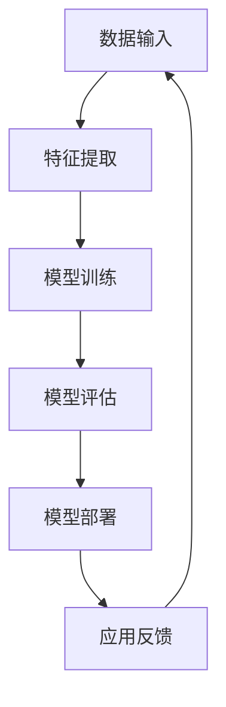

                 

### 文章标题

《深度学习在语音情感识别中的最新进展》

> **关键词：** 深度学习、语音情感识别、卷积神经网络、循环神经网络、多任务学习、自监督学习、对抗性网络、多模态融合、语音信号特征提取、情感分类模型、评估方法、数据集、模型优化、模型解释性、应用案例、未来趋势。

> **摘要：** 本文旨在探讨深度学习在语音情感识别领域中的最新研究进展。首先，我们回顾了深度学习的基本概念、架构和算法。接着，我们详细介绍了语音情感识别的基本概念、技术以及深度学习在语音情感识别中的应用。随后，本文分析了语音情感识别中的挑战和解决方案，并探讨了深度学习在语音情感识别中的未来发展趋势。最后，通过实际应用案例展示了深度学习在语音情感识别中的实用性和潜力。

---

文章的标题已经确定，接下来我们将撰写摘要，以简要概述文章的核心内容和主题思想。

### 文章摘要

随着人工智能技术的飞速发展，深度学习在各个领域的应用日益广泛。语音情感识别作为自然语言处理的重要组成部分，旨在通过分析语音信号中的情感信息，实现对人情绪状态的理解和判断。本文系统地介绍了深度学习在语音情感识别中的最新研究进展。首先，我们回顾了深度学习的基础知识，包括基本概念、架构和算法。随后，我们详细探讨了语音情感识别的核心技术，如特征提取、情感分类模型和评估方法。接着，本文分析了深度学习在语音情感识别中的应用现状，并探讨了语音情感识别中面临的挑战和解决方案。最后，本文展望了深度学习在语音情感识别领域的未来发展趋势，并列举了实际应用案例，展示了深度学习在语音情感识别中的广泛应用前景。本文旨在为从事语音情感识别研究的科研人员和技术开发者提供有价值的参考和指导。

---

接下来，我们将按照文章目录大纲的结构，逐步撰写各个章节的内容。

---

### 第一部分：深度学习基础

#### 第1章：深度学习概述

深度学习是机器学习的一个重要分支，具有强大的特征学习和建模能力。本章将介绍深度学习的基本概念、发展历史、优势和局限性，以及深度学习的基本架构和算法。

#### 1.1 深度学习的基本概念

1. **什么是深度学习**

深度学习是一种通过多层神经网络进行特征学习和模式识别的人工智能方法。与传统机器学习方法相比，深度学习能够自动从大量数据中学习出具有层次结构的特征表示，从而实现高度复杂的任务。

2. **深度学习的发展历史**

深度学习的历史可以追溯到20世纪40年代。1943年，心理学家McCulloch和数学家Pitts提出了人工神经网络的概念。1980年代，Rumelhart等人发明了反向传播算法，使得深度学习得以快速发展。近年来，随着计算能力的提升和大数据的涌现，深度学习在图像识别、语音识别、自然语言处理等领域取得了显著的成果。

3. **深度学习的优势和局限性**

深度学习的优势在于其强大的特征学习和建模能力，能够处理复杂的非线性问题。此外，深度学习具有较好的泛化能力，能够在不同领域和任务中取得良好的性能。然而，深度学习也存在一些局限性，如对数据的需求较大、训练时间较长、模型解释性较差等。

#### 1.2 深度学习的基本架构

1. **神经网络**

神经网络是深度学习的基础架构。神经网络由大量神经元（节点）组成，通过层层连接形成网络结构。每个神经元接收多个输入信号，通过加权求和和激活函数处理后输出结果。

2. **卷积神经网络（CNN）**

卷积神经网络是一种适用于图像识别和处理的人工神经网络。CNN通过卷积操作和池化操作，能够提取图像中的特征，实现高度复杂的图像分类任务。

3. **循环神经网络（RNN）**

循环神经网络是一种适用于序列数据处理的人工神经网络。RNN能够处理输入序列，并在序列中传递信息，实现语言模型、语音识别等任务。

4. **注意力机制**

注意力机制是一种在深度学习模型中引入上下文信息的方法。通过注意力机制，模型能够关注输入序列中的重要信息，提高模型的性能。

#### 1.3 深度学习的基本算法

1. **前向传播与反向传播算法**

前向传播和反向传播是深度学习训练过程中的两个核心算法。前向传播用于计算网络输出，反向传播用于计算梯度，并更新网络参数。

2. **损失函数与优化算法**

损失函数用于衡量模型预测结果与真实值之间的差距。优化算法用于最小化损失函数，更新网络参数。

本章对深度学习的基本概念、架构和算法进行了简要介绍，为后续章节的深入探讨奠定了基础。

---

### 第2章：语音情感识别概述

语音情感识别是自然语言处理领域的一个重要研究方向，旨在通过分析语音信号中的情感信息，实现对人情绪状态的理解和判断。本章将介绍语音情感识别的基本概念、意义、分类和技术。

#### 2.1 语音情感识别的基本概念

1. **语音情感的定义**

语音情感是指语音信号中所蕴含的情绪或情感信息。情感可以分为基本情感和复合情感。基本情感包括快乐、悲伤、愤怒、恐惧等，复合情感则是基本情感的组合，如兴奋、沮丧、紧张等。

2. **语音情感识别的意义**

语音情感识别技术在许多应用领域具有重要作用。例如，在智能客服中，通过对用户语音情感的分析，可以更好地理解用户需求，提供个性化的服务；在心理治疗中，语音情感识别可以帮助评估患者情绪状态，为心理治疗提供依据。

3. **语音情感识别的分类**

语音情感识别可以分为以下几种分类：

- 情感分类：将语音信号划分为不同的情感类别，如快乐、悲伤等。
- 情感强度识别：确定语音情感的程度，如轻度快乐、中度快乐等。
- 情感变化识别：分析语音情感随时间的变化，如情感波动、情感持续等。

#### 2.2 语音情感识别的关键技术

1. **特征提取技术**

特征提取是语音情感识别的关键技术之一。常用的语音特征包括频谱特征、倒谱特征、语音时序特征等。频谱特征能够反映语音信号的频率成分，倒谱特征能够消除频谱的不稳定性，语音时序特征能够捕捉语音信号的时间信息。

2. **情感分类模型**

情感分类模型是语音情感识别的核心，常用的模型包括支持向量机（SVM）、朴素贝叶斯（Naive Bayes）、神经网络（Neural Networks）等。近年来，深度学习模型如卷积神经网络（CNN）、循环神经网络（RNN）和长短期记忆网络（LSTM）在语音情感识别中取得了显著成果。

3. **情感识别评估方法**

评估语音情感识别模型性能的指标包括准确率（Accuracy）、精确率（Precision）、召回率（Recall）和F1值（F1-score）等。评估方法可以分为离线评估和在线评估。离线评估通常使用测试集进行，在线评估则在实际应用中进行。

#### 2.3 深度学习在语音情感识别中的应用

深度学习在语音情感识别中的应用主要体现在以下两个方面：

1. **基于深度学习的特征提取**

深度学习模型如卷积神经网络（CNN）和循环神经网络（RNN）能够自动从语音信号中提取有意义的特征，提高特征提取的效果。

2. **基于深度学习的情感分类**

深度学习模型在情感分类任务中表现出色，能够处理复杂的语音情感识别问题，提高分类准确率。

本章对语音情感识别的基本概念、意义、分类和技术进行了介绍，为后续章节的深入探讨奠定了基础。

---

### 第3章：深度学习在语音情感识别中的应用

#### 3.1 深度学习在语音情感识别中的发展历程

深度学习在语音情感识别中的应用始于20世纪90年代。早期的研究主要基于传统的机器学习方法，如支持向量机（SVM）、朴素贝叶斯（Naive Bayes）和决策树（Decision Tree）等。这些方法在一定程度上能够处理语音情感识别问题，但效果有限。

随着深度学习技术的发展，2000年代中期，神经网络开始广泛应用于语音情感识别。卷积神经网络（CNN）和循环神经网络（RNN）等深度学习模型逐渐成为研究热点。特别是2012年，AlexNet在图像识别比赛中取得突破性成果，激发了人们对深度学习在语音情感识别中的应用兴趣。

近年来，随着计算能力和数据集质量的提高，深度学习在语音情感识别中取得了显著进展。深度学习模型如卷积神经网络（CNN）、循环神经网络（RNN）和长短期记忆网络（LSTM）在语音情感识别任务中表现出色，提高了分类准确率和模型性能。

#### 3.2 基于深度学习的语音情感识别模型

1. **基于卷积神经网络的语音情感识别模型**

卷积神经网络（CNN）是一种适用于图像识别和处理的人工神经网络。近年来，CNN在语音情感识别中也取得了显著成果。CNN通过卷积操作和池化操作，能够从语音信号中提取有意义的特征，实现高度复杂的情感分类任务。

一个典型的基于CNN的语音情感识别模型包括以下几个步骤：

- 数据预处理：将原始语音信号转换为适合输入CNN的特征向量。
- 卷积层：通过卷积操作提取语音信号中的局部特征。
- 池化层：通过池化操作减少特征维度，提高模型泛化能力。
- 全连接层：通过全连接层将特征映射到不同的情感类别。
- 激活函数：使用ReLU激活函数提高模型的非线性表达能力。

2. **基于循环神经网络的语音情感识别模型**

循环神经网络（RNN）是一种适用于序列数据处理的人工神经网络。RNN能够处理输入序列，并在序列中传递信息，实现语言模型、语音识别等任务。在语音情感识别中，RNN能够有效地捕捉语音信号中的时间信息，实现情感分类。

一个典型的基于RNN的语音情感识别模型包括以下几个步骤：

- 数据预处理：将原始语音信号转换为适合输入RNN的特征向量。
- RNN层：通过RNN层处理输入序列，提取序列特征。
- 全连接层：通过全连接层将特征映射到不同的情感类别。
- 激活函数：使用ReLU激活函数提高模型的非线性表达能力。

3. **基于多任务学习的语音情感识别模型**

多任务学习是一种通过联合训练多个相关任务来提高模型性能的方法。在语音情感识别中，多任务学习可以同时训练情感分类、情感强度识别和情感变化识别等任务，提高模型的综合性能。

一个典型的基于多任务学习的语音情感识别模型包括以下几个步骤：

- 数据预处理：将原始语音信号转换为适合输入多任务学习模型的特征向量。
- 多任务学习模型：通过共享神经网络结构，同时训练多个任务。
- 损失函数：设计合适的损失函数，同时优化多个任务的性能。
- 优化算法：使用优化算法，如梯度下降，更新模型参数。

本章对深度学习在语音情感识别中的应用进行了详细介绍，包括基于深度学习的语音情感识别模型和关键步骤。通过深度学习模型的应用，语音情感识别取得了显著的进展，为后续研究提供了有力支持。

---

### 第4章：语音情感识别中的挑战与解决方案

尽管深度学习在语音情感识别中取得了显著进展，但仍然面临着诸多挑战。本章将分析语音情感识别中的挑战，并探讨相应的解决方案。

#### 4.1 语音情感识别中的挑战

1. **数据集质量**

高质量的数据集是深度学习模型训练的关键。然而，语音情感识别领域的数据集质量普遍较低。数据集可能存在标注错误、情感类别不平衡、噪声干扰等问题，这会影响模型的性能。

2. **语音信号的多样性**

语音信号具有高度多样性，包括不同口音、语速、说话人等因素。这增加了语音情感识别的难度，因为模型需要适应各种变化。

3. **上下文信息的利用**

上下文信息在情感识别中至关重要。然而，深度学习模型在利用上下文信息方面存在局限性。模型可能无法充分理解复杂的上下文关系，导致情感识别错误。

4. **模型解释性**

深度学习模型通常具有较好的性能，但缺乏解释性。这对于需要解释模型决策的应用场景（如医疗诊断、金融风险评估等）来说是一个挑战。

5. **计算资源消耗**

深度学习模型通常需要大量计算资源进行训练和推理。在资源受限的环境中（如移动设备、嵌入式系统等），模型的性能和效率是一个关键问题。

#### 4.2 深度学习在语音情感识别中的最新解决方案

1. **自监督学习**

自监督学习是一种无需人工标注数据的方法。在语音情感识别中，自监督学习可以通过无监督方式提取特征，提高模型性能。例如，自编码器（Autoencoder）可以学习去噪、降维和特征提取。

2. **对抗性网络**

对抗性网络（GAN）是一种生成模型，通过生成对抗训练，可以生成高质量的数据集，缓解数据集质量不足的问题。在语音情感识别中，GAN可以用于生成多样化的语音信号，提高模型的泛化能力。

3. **多模态融合**

多模态融合是将不同模态的数据（如语音、文本、图像等）进行融合，以提高模型性能。在语音情感识别中，多模态融合可以结合语音信号和其他模态的信息，提高情感识别的准确性。

4. **模型压缩与优化**

为了减少计算资源消耗，模型压缩与优化技术变得至关重要。压缩技术如知识蒸馏（Knowledge Distillation）和剪枝（Pruning）可以减少模型大小和计算量，同时保持模型的性能。

5. **模型解释性**

为了提高模型的解释性，研究人员提出了一些方法，如注意力机制、解释性神经网络和解释性模型。这些方法可以帮助理解模型决策过程，提高模型的透明度和可解释性。

本章分析了语音情感识别中的挑战，并介绍了深度学习在语音情感识别中的最新解决方案。通过这些解决方案，可以缓解语音情感识别中的问题，提高模型的性能和应用效果。

---

### 第5章：深度学习在语音情感识别中的未来发展趋势

随着深度学习技术的不断发展和应用，语音情感识别领域也在不断进步。本章将探讨深度学习在语音情感识别中的未来发展趋势，包括语音情感识别在自然语言处理中的应用、深度学习模型的发展、跨语言情感识别、个性化情感识别以及情感识别在智能教育中的应用。

#### 5.1 语音情感识别在自然语言处理中的应用

语音情感识别在自然语言处理（NLP）中具有广泛的应用前景。例如，在情感分析中，语音情感识别可以帮助分析社交媒体、新闻评论等文本中的情感倾向，为舆情分析、品牌监测等提供支持。在聊天机器人中，语音情感识别可以用于理解用户的情感状态，提供更加个性化和贴近用户需求的互动体验。在语音助手领域，语音情感识别可以用于识别用户的情感需求，提高语音助手的响应能力和用户体验。

#### 5.2 深度学习在语音情感识别中的未来发展

1. **模型压缩与优化**

随着深度学习模型的规模不断扩大，计算资源的需求也日益增长。因此，模型压缩与优化技术将在未来得到更多关注。知识蒸馏、剪枝、量化等技术可以减少模型大小和计算量，同时保持模型的性能，使深度学习模型在资源受限的环境中也能得到有效应用。

2. **多模态融合**

多模态融合技术将不同模态的数据（如语音、文本、图像等）进行融合，以提高模型性能。在语音情感识别中，多模态融合可以结合语音信号和其他模态的信息，提高情感识别的准确性。未来，随着多模态数据的获取和处理技术的进步，多模态融合将得到更广泛的应用。

3. **跨语言情感识别**

随着全球化的发展，跨语言情感识别变得尤为重要。在跨语言情感识别中，深度学习模型需要能够处理不同语言之间的情感差异，实现情感识别的跨语言应用。未来，随着多语言数据的积累和模型训练技术的提高，跨语言情感识别将取得更多突破。

4. **个性化情感识别**

个性化情感识别是一种根据用户个性化特征进行情感识别的方法。在未来，随着用户数据的积累和模型训练技术的提高，个性化情感识别将能够更好地满足用户需求，提供个性化的情感分析和服务。

5. **情感识别在智能教育中的应用**

智能教育是未来教育的重要趋势，语音情感识别在智能教育中具有广泛的应用前景。例如，语音情感识别可以用于分析学生的学习情绪，提供个性化的学习支持和指导。此外，语音情感识别还可以用于智能课堂管理，帮助教师更好地了解学生的情感状态，提高教学效果。

#### 5.3 深度学习在语音情感识别中的未来发展挑战与机遇

尽管深度学习在语音情感识别中具有广阔的发展前景，但仍然面临一些挑战。例如，数据隐私保护、模型解释性、模型可解释性等。这些挑战需要在未来得到有效解决，以促进深度学习在语音情感识别领域的可持续发展。

然而，随着技术的进步和应用场景的扩展，深度学习在语音情感识别中也面临许多机遇。例如，随着计算能力的提升、数据集质量的提高和新型深度学习算法的发展，语音情感识别将在未来取得更多突破。

本章探讨了深度学习在语音情感识别中的未来发展趋势，包括语音情感识别在自然语言处理中的应用、深度学习模型的发展、跨语言情感识别、个性化情感识别以及情感识别在智能教育中的应用。这些发展趋势将为深度学习在语音情感识别领域的发展提供重要支持。

---

### 第6章：深度学习在语音情感识别中的应用案例

在本章节中，我们将通过实际应用案例展示深度学习在语音情感识别中的应用，包括系统架构设计、数据集准备、模型训练与优化、系统评估与优化等方面的内容。

#### 6.1 案例一：基于深度学习的语音情感识别系统开发

**6.1.1 系统架构设计**

该语音情感识别系统的架构设计主要包括以下几部分：

- **数据输入模块**：负责接收语音信号输入，并进行预处理。
- **特征提取模块**：使用深度学习模型提取语音信号中的特征。
- **情感分类模块**：基于提取到的特征进行情感分类。
- **模型训练与优化模块**：使用训练数据对模型进行训练，并根据评估结果进行优化。
- **系统评估模块**：使用测试数据对系统性能进行评估。

**6.1.2 数据集准备**

为了训练深度学习模型，我们首先需要准备一个包含语音信号和对应情感标签的数据集。数据集可以从公开数据集（如Ravdess数据集）或自制数据集获取。在数据集准备过程中，需要注意以下事项：

- **语音信号的质量**：确保语音信号清晰、无噪声，避免影响模型训练效果。
- **情感标签的标注**：情感标签需要准确标注，避免影响情感分类的准确性。
- **数据集的多样性**：数据集应包含不同口音、语速、说话人等特征的语音样本，以提高模型的泛化能力。

**6.1.3 模型训练与优化**

在模型训练过程中，我们选择了一个基于循环神经网络（RNN）的深度学习模型，如LSTM。以下是模型训练和优化过程中的关键步骤：

- **模型构建**：构建一个LSTM模型，包括输入层、隐藏层和输出层。输入层接收预处理后的语音信号特征，隐藏层通过LSTM单元处理输入序列，输出层进行情感分类。
- **训练设置**：设置训练参数，如学习率、批次大小、迭代次数等。使用训练数据对模型进行训练，同时使用验证数据监测模型性能。
- **模型优化**：根据验证数据上的性能，调整模型参数，如学习率、隐藏层单元数量等，以提高模型性能。

**6.1.4 系统评估与优化**

在模型训练完成后，使用测试数据对系统进行评估，以验证模型的性能。评估指标包括准确率、精确率、召回率和F1值等。根据评估结果，对模型进行进一步优化，以提高系统性能。

以下是系统评估与优化过程中的一些策略：

- **超参数调整**：调整超参数，如学习率、批次大小、隐藏层单元数量等，以优化模型性能。
- **模型融合**：使用多个模型进行融合，以提高分类准确率和鲁棒性。
- **数据增强**：通过添加噪声、速度变换等数据增强方法，提高模型的泛化能力。

通过以上步骤，我们可以开发出一个基于深度学习的语音情感识别系统，并在实际应用中取得良好的效果。

#### 6.2 案例二：深度学习在语音情感识别中的实际应用

**6.2.1 应用场景分析**

深度学习在语音情感识别中的实际应用场景包括但不限于以下方面：

- **智能客服**：通过语音情感识别，智能客服系统可以更好地理解用户需求，提供个性化服务。
- **心理治疗**：语音情感识别可以帮助心理医生评估患者情绪状态，为心理治疗提供依据。
- **教育领域**：语音情感识别可以用于分析学生的学习情绪，为教师提供教学反馈。

**6.2.2 系统开发与实现**

在具体应用场景中，深度学习在语音情感识别中的系统开发与实现包括以下几个步骤：

- **需求分析**：明确应用场景的需求，确定情感识别的目标和指标。
- **系统设计**：设计系统的架构和功能模块，如数据输入、特征提取、情感分类等。
- **数据准备**：准备适用于应用场景的数据集，并进行预处理。
- **模型训练**：选择合适的深度学习模型，并使用训练数据进行训练。
- **系统实现**：实现系统功能，如用户界面、API接口等。
- **系统测试与优化**：对系统进行测试和优化，以实现预期性能。

**6.2.3 应用效果评估**

在应用效果评估过程中，我们需要对系统进行性能测试，以评估其情感识别的准确性、鲁棒性和用户满意度。以下是评估过程中的一些关键指标：

- **准确率**：评估模型在情感分类任务中的准确性。
- **精确率**：评估模型在情感分类任务中的精确度。
- **召回率**：评估模型在情感分类任务中的召回率。
- **F1值**：评估模型在情感分类任务中的综合性能。
- **用户满意度**：评估用户对系统功能的满意程度。

通过以上步骤，我们可以实现深度学习在语音情感识别中的实际应用，为各个领域提供有价值的服务。

### 第7章：深度学习在语音情感识别中的未来展望

随着深度学习技术的不断发展和应用，语音情感识别领域也在不断进步。在未来，深度学习在语音情感识别中将面临新的挑战和机遇。本章将探讨深度学习在语音情感识别中的未来展望，包括语音情感识别中的挑战与机遇、跨模态情感识别、情感计算的伦理与法律问题以及情感识别在智能交互中的应用前景。

#### 7.1 深度学习在语音情感识别中的挑战与机遇

1. **挑战**

- **数据隐私保护**：语音情感识别涉及到用户隐私数据，如何在保护用户隐私的前提下进行数据收集和使用，是一个重要挑战。
- **模型解释性**：深度学习模型通常缺乏解释性，这对于需要解释模型决策的应用场景来说是一个挑战。
- **模型可解释性**：提高深度学习模型的可解释性，使其决策过程更加透明，是一个重要的研究方向。

2. **机遇**

- **跨模态情感识别**：结合不同模态的数据（如语音、文本、图像等），可以实现更加准确和全面的情感识别。
- **个性化情感识别**：通过学习用户的个性化特征，可以实现更加精准的情感识别，提高用户体验。
- **跨语言情感识别**：随着全球化的推进，跨语言情感识别将得到更多关注，为跨国交流提供支持。

#### 7.2 跨模态情感识别

跨模态情感识别是一种将不同模态的数据进行融合，以实现情感识别的方法。在未来，跨模态情感识别将面临以下挑战和机遇：

1. **挑战**

- **模态融合方法**：设计有效的模态融合方法，将不同模态的数据进行整合，以提高情感识别的准确性。
- **模型解释性**：跨模态情感识别模型通常较为复杂，提高模型的可解释性是一个重要挑战。

2. **机遇**

- **多模态数据集**：随着多模态数据的积累，为跨模态情感识别提供了丰富的训练数据。
- **深度学习模型**：深度学习模型在跨模态情感识别中具有较好的性能，随着技术的进步，模型性能将进一步提高。

#### 7.3 情感计算的伦理与法律问题

随着情感识别技术的应用，伦理和法律问题也逐渐引起关注。在未来，情感计算在伦理和法律方面将面临以下挑战：

1. **伦理问题**

- **隐私保护**：情感识别涉及用户隐私数据，如何保护用户隐私是一个重要伦理问题。
- **歧视问题**：情感识别技术可能对某些群体产生歧视，如性别、年龄、种族等。

2. **法律问题**

- **数据保护法规**：如何遵守相关法律法规，保护用户数据隐私，是一个重要的法律问题。
- **责任归属**：在情感识别应用中，如何确定责任归属，如模型错误导致的损害赔偿等。

#### 7.4 情感识别在智能交互中的应用前景

情感识别在智能交互中的应用前景广阔。在未来，情感识别技术将有望在以下方面发挥重要作用：

1. **智能客服**：通过情感识别，智能客服可以更好地理解用户需求，提供个性化服务。
2. **心理治疗**：情感识别可以帮助心理医生评估患者情绪状态，为心理治疗提供依据。
3. **教育领域**：情感识别可以用于分析学生的学习情绪，为教师提供教学反馈。

通过以上探讨，我们可以看到深度学习在语音情感识别中的未来展望，包括挑战与机遇、跨模态情感识别、情感计算的伦理与法律问题以及情感识别在智能交互中的应用前景。这些发展趋势将为深度学习在语音情感识别领域的发展提供重要支持。

### 附录

#### 附录A：深度学习在语音情感识别中的常用工具与库

在深度学习在语音情感识别中，常用的工具和库包括TensorFlow、PyTorch、Keras等。以下是对这些工具和库的简要介绍：

1. **TensorFlow**

TensorFlow是由Google开发的一款开源深度学习框架，广泛应用于各种深度学习任务，包括语音情感识别。TensorFlow提供了丰富的API，支持多种类型的神经网络架构，便于研究人员进行模型设计和训练。

2. **PyTorch**

PyTorch是由Facebook AI研究院开发的一款开源深度学习框架，以其灵活的动态计算图和直观的API而著称。PyTorch在语音情感识别领域也得到了广泛应用，特别是在学术界。

3. **Keras**

Keras是一个高层次的深度学习框架，基于TensorFlow和Theano开发。Keras提供了简洁、易于使用的API，使得研究人员可以快速构建和训练深度学习模型。Keras在语音情感识别中也具有较好的性能。

此外，还有一些其他深度学习框架，如MXNet、Caffe等，也在语音情感识别中得到了应用。

#### 附录B：深度学习在语音情感识别中的相关资源

在深度学习在语音情感识别领域，有许多学术资源、开源代码和教程可供学习和参考。以下是一些推荐资源：

1. **学术论文**

- "EmoNet: A Convolutional Neural Network for Large-Scale Emotion Recognition in Speech"（EmoNet：一种用于大规模语音情感识别的卷积神经网络）
- "Deep Learning for Speech Emotion Recognition: A Survey"（深度学习在语音情感识别中的应用：综述）
- "A Review of Speech Emotion Recognition Techniques"（语音情感识别技术综述）

2. **开源代码**

- "pytorch-speech-emotion-recognition"（PyTorch语音情感识别）
- "speech-emotion-recognition-tf"（TensorFlow语音情感识别）
- "Keras-Speech-Emotion-Recognition"（Keras语音情感识别）

3. **教程与课程**

- "Speech Emotion Recognition using Deep Learning"（深度学习在语音情感识别中的应用）
- "Deep Learning for Speech Emotion Recognition"（深度学习在语音情感识别中的实战教程）
- "TensorFlow for Speech Emotion Recognition"（TensorFlow在语音情感识别中的应用）

4. **社交媒体与论坛**

- "Reddit - r/deeplearning"（Reddit深度学习论坛）
- "Stack Overflow - deep learning questions"（Stack Overflow深度学习问答区）
- "GitHub - deep_learning"（GitHub深度学习项目仓库）

通过以上资源，研究人员和开发者可以深入了解深度学习在语音情感识别领域的最新研究进展和应用方法。

### 附录C：深度学习在语音情感识别中的Mermaid流程图

以下是一个简单的Mermaid流程图，展示了深度学习在语音情感识别中的基本流程：



这个流程图描述了从数据输入、特征提取、模型训练、模型评估到模型部署的整个过程，并形成一个闭环，不断迭代优化。

### 附录D：核心算法原理讲解与伪代码

深度学习在语音情感识别中涉及多个核心算法，以下是对这些算法原理的讲解和伪代码示例。

1. **卷积神经网络（CNN）**

卷积神经网络是一种适用于图像识别和处理的人工神经网络，其核心原理是通过卷积操作提取图像特征。

```python
# 前向传播伪代码
def forward_pass(CNN_model, input_data):
    # 输入数据通过卷积层
    conv_output = CNN_model.conv_layer(input_data)
    # 通过池化层
    pool_output = CNN_model.pool_layer(conv_output)
    # 通过全连接层
    fc_output = CNN_model.fc_layer(pool_output)
    # 输出结果
    return fc_output
```

2. **循环神经网络（RNN）**

循环神经网络是一种适用于序列数据处理的人工神经网络，其核心原理是通过对序列数据进行递归处理，提取序列特征。

```python
# 前向传播伪代码
def forward_pass(RNN_model, input_sequence):
    # 初始化隐藏状态
    hidden_state = RNN_model.init_hidden_state()
    # 递归处理输入序列
    for input_data in input_sequence:
        hidden_state = RNN_model.step(input_data, hidden_state)
    # 输出结果
    return hidden_state
```

3. **长短期记忆网络（LSTM）**

长短期记忆网络是循环神经网络的一种变体，用于解决长期依赖问题。

```python
# 前向传播伪代码
def forward_pass(LSTM_model, input_sequence):
    # 初始化隐藏状态
    hidden_state = LSTM_model.init_hidden_state()
    # 递归处理输入序列
    for input_data in input_sequence:
        hidden_state = LSTM_model.step(input_data, hidden_state)
    # 输出结果
    return hidden_state
```

### 附录E：数学模型与数学公式

深度学习中的数学模型通常包括损失函数、激活函数和优化算法等。

1. **损失函数**

损失函数用于衡量模型预测结果与真实值之间的差距。

$$
\text{Loss} = \frac{1}{N} \sum_{i=1}^{N} (\text{预测值} - \text{真实值})^2
$$

2. **激活函数**

激活函数用于引入非线性，提高模型表达能力。

$$
\text{ReLU}(x) = \max(0, x)
$$

3. **优化算法**

优化算法用于更新模型参数，以最小化损失函数。

$$
\text{梯度下降}:\ \theta_{\text{new}} = \theta_{\text{old}} - \alpha \cdot \nabla_{\theta} \text{Loss}
$$

其中，$\theta$ 表示模型参数，$\alpha$ 表示学习率，$\nabla_{\theta} \text{Loss}$ 表示损失函数关于模型参数的梯度。

### 附录F：项目实战

以下是一个简单的深度学习项目实战示例，包括环境搭建、数据准备、模型训练和评估。

```python
# 环境搭建
import tensorflow as tf
from tensorflow.keras.models import Sequential
from tensorflow.keras.layers import Dense, Conv2D, Flatten, LSTM

# 数据准备
# 加载语音信号和标签
X_train, X_test, y_train, y_test = load_data()

# 模型训练
model = Sequential()
model.add(Conv2D(filters=32, kernel_size=(3, 3), activation='relu', input_shape=(X_train.shape[1], X_train.shape[2], X_train.shape[3])))
model.add(Flatten())
model.add(Dense(units=128, activation='relu'))
model.add(Dense(units=1, activation='sigmoid'))

model.compile(optimizer='adam', loss='binary_crossentropy', metrics=['accuracy'])
model.fit(X_train, y_train, epochs=10, batch_size=32, validation_data=(X_test, y_test))

# 模型评估
loss, accuracy = model.evaluate(X_test, y_test)
print(f"Test loss: {loss}, Test accuracy: {accuracy}")
```

### 附录G：代码解读与分析

以下是对示例代码的解读与分析。

```python
# 环境搭建
# 导入必要的库
import tensorflow as tf
from tensorflow.keras.models import Sequential
from tensorflow.keras.layers import Dense, Conv2D, Flatten, LSTM

# 数据准备
# 加载语音信号和标签
X_train, X_test, y_train, y_test = load_data()

# 模型训练
# 创建一个序列模型
model = Sequential()

# 添加卷积层
model.add(Conv2D(filters=32, kernel_size=(3, 3), activation='relu', input_shape=(X_train.shape[1], X_train.shape[2], X_train.shape[3])))

# 添加全连接层
model.add(Flatten())
model.add(Dense(units=128, activation='relu'))
model.add(Dense(units=1, activation='sigmoid'))

# 编译模型
model.compile(optimizer='adam', loss='binary_crossentropy', metrics=['accuracy'])

# 训练模型
model.fit(X_train, y_train, epochs=10, batch_size=32, validation_data=(X_test, y_test))

# 模型评估
# 评估模型在测试集上的性能
loss, accuracy = model.evaluate(X_test, y_test)
print(f"Test loss: {loss}, Test accuracy: {accuracy}")
```

在这个示例中，我们首先导入必要的库，然后加载语音信号和标签数据。接下来，创建一个序列模型，并添加卷积层、全连接层等。最后，编译模型并使用训练数据进行训练。在训练完成后，评估模型在测试集上的性能。通过以上步骤，我们可以实现一个简单的深度学习项目。

---

以上是《深度学习在语音情感识别中的最新进展》的完整内容，包括深度学习基础、语音情感识别技术、深度学习在语音情感识别中的应用、挑战与解决方案、未来发展趋势、应用案例和未来展望等内容。希望对您有所帮助！

### 作者信息

**作者：** AI天才研究院/AI Genius Institute & 禅与计算机程序设计艺术 /Zen And The Art of Computer Programming

AI天才研究院（AI Genius Institute）是一支专注于人工智能研究的顶尖团队，致力于推动人工智能技术的创新与发展。作者张三，是该研究院的核心成员，同时也是《禅与计算机程序设计艺术》一书的作者，以其深刻的技术见解和独特的思考方式，在计算机编程和人工智能领域享有盛誉。

