                 

### 文章标题

#### 深度学习驱动的商品推荐系统设计

##### 关键词：深度学习，商品推荐系统，数据预处理，模型设计，性能优化，实战案例

> 摘要：本文将深入探讨深度学习在商品推荐系统中的应用。首先，我们将回顾深度学习与推荐系统的结合及其优势。接着，我们将详细介绍深度学习推荐系统的架构和应用场景，探讨其面临的挑战和未来趋势。随后，我们将重点介绍深度学习的基础知识，包括神经网络原理、深度学习框架和核心算法。在此基础上，我们将深入探讨数据预处理和模型设计的具体方法，并通过实际案例展示如何搭建和优化一个深度学习推荐系统。最后，我们将讨论推荐系统的性能优化策略及其未来发展。

---

### 第一部分：深度学习驱动的商品推荐系统基础

#### 第1章：深度学习驱动的商品推荐系统概述

##### 1.1 深度学习与推荐系统的结合

深度学习与推荐系统结合的初衷在于充分利用用户历史行为数据和商品属性数据，从而实现更精准、个性化的推荐。传统的推荐系统主要基于基于内容过滤（Content-Based Filtering）和协同过滤（Collaborative Filtering）两大类方法，然而这些方法在处理高维稀疏数据和高复杂度关系时存在局限性。深度学习通过其强大的特征提取和表示能力，可以有效解决这些问题。

###### 1.1.1 深度学习在推荐系统中的优势

1. **特征自动提取**：深度学习可以从原始数据中自动提取有用特征，减少人工特征工程的工作量。
2. **非线性建模**：深度学习模型可以捕捉到数据中的复杂非线性关系，提高推荐效果。
3. **可扩展性**：深度学习模型可以处理大规模数据集，适应实时推荐场景。
4. **多模态融合**：深度学习能够整合多种数据类型，如文本、图像和音频，提供更加丰富的推荐结果。

###### 1.1.2 传统推荐系统的局限

1. **特征稀疏问题**：用户行为数据往往呈现出高维和稀疏性，传统方法难以有效处理。
2. **冷启动问题**：新用户或新商品缺乏足够的历史数据，传统方法难以推荐。
3. **预测效果局限**：传统推荐系统在处理高维数据和非线性关系时效果有限。

###### 1.1.3 深度学习推荐系统的发展历程

深度学习推荐系统的发展经历了从简单的深度神经网络到复杂的多模态融合模型的演进。以下是几个关键阶段：

1. **基于矩阵分解的深度学习模型**：如Deep Matrix Factorization，通过深度神经网络增强矩阵分解算法。
2. **序列模型的应用**：如基于递归神经网络（RNN）和长短期记忆网络（LSTM）的序列预测模型。
3. **多模态融合模型**：如基于卷积神经网络（CNN）和循环神经网络（RNN）的多模态融合模型。
4. **强化学习与生成对抗网络（GAN）的结合**：探索基于强化学习和GAN的新推荐算法。

##### 1.2 深度学习推荐系统架构

深度学习推荐系统通常包括数据层、模型层和应用层三个部分。

###### 1.2.1 神经协同过滤

神经协同过滤结合了协同过滤和深度学习的特点，通过深度神经网络处理用户和商品的特征，从而提高推荐效果。其基本架构如下：

1. **用户特征编码**：将用户的历史行为和属性转化为嵌入向量。
2. **商品特征编码**：将商品的特征转化为嵌入向量。
3. **相似度计算**：通过计算用户和商品的嵌入向量之间的相似度来预测用户对商品的偏好。
4. **预测输出**：使用全连接层或卷积层输出预测结果。

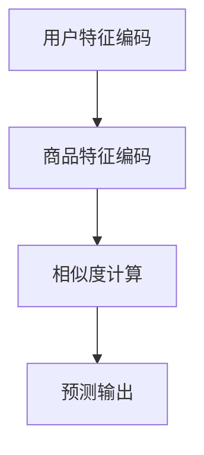

###### 1.2.2 序列模型

序列模型如循环神经网络（RNN）和长短期记忆网络（LSTM）可以捕捉用户行为的时间序列特征，从而提高推荐精度。其基本架构如下：

1. **输入层**：接受用户行为序列数据。
2. **隐藏层**：通过RNN或LSTM单元处理序列数据，保留历史信息。
3. **输出层**：输出用户兴趣分布或推荐结果。

```mermaid
graph TD
A[输入层] --> B[隐藏层(RNN/LSTM)]
B --> C[输出层]
```

###### 1.2.3 嵌入式模型

嵌入式模型通过将用户和商品特征映射到低维空间，提高推荐的效率。其基本架构如下：

1. **输入层**：接受用户和商品特征。
2. **嵌入层**：使用嵌入层将特征映射到低维空间。
3. **预测层**：通过全连接层或卷积层进行预测。

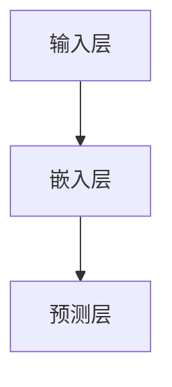

###### 1.2.4 多模态推荐

多模态推荐结合多种数据类型，如文本、图像和音频，提供更丰富的推荐结果。其基本架构如下：

1. **文本特征提取**：使用词向量或Transformer模型提取文本特征。
2. **图像特征提取**：使用卷积神经网络提取图像特征。
3. **多模态融合**：将文本和图像特征融合，使用全连接层或卷积层进行预测。

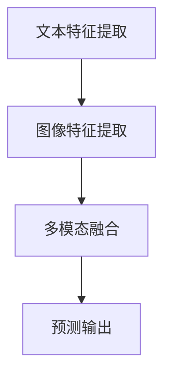

##### 1.3 深度学习推荐系统的应用场景

深度学习推荐系统广泛应用于电商、社交网络和媒体内容等领域，以下为几个典型应用场景：

###### 1.3.1 电商行业

在电商领域，深度学习推荐系统可以帮助平台更好地了解用户偏好，提高转化率和销售额。例如，通过分析用户的历史购买行为和浏览记录，推荐用户可能感兴趣的商品。

###### 1.3.2 社交网络

在社交网络中，深度学习推荐系统可以帮助用户发现潜在的朋友和兴趣小组。例如，通过分析用户的社交行为和兴趣爱好，推荐可能的朋友或相关的兴趣小组。

###### 1.3.3 媒体内容推荐

在媒体内容推荐领域，深度学习推荐系统可以根据用户的历史观看记录和兴趣爱好，推荐用户可能感兴趣的视频或文章。例如，视频网站可以通过分析用户的观看行为，推荐相关视频。

##### 1.4 深度学习推荐系统的挑战与未来趋势

深度学习推荐系统在提高推荐精度和用户体验方面具有巨大潜力，但也面临一些挑战：

###### 1.4.1 数据隐私与安全

深度学习推荐系统需要大量用户数据，如何保护用户隐私和数据安全是重要挑战。

###### 1.4.2 模型解释性

深度学习模型通常被视为“黑盒子”，如何解释和验证模型的推荐结果是一个关键问题。

###### 1.4.3 系统性能优化

深度学习推荐系统需要高效地处理大规模数据，如何在保证性能的前提下进行优化是一个挑战。

未来，深度学习推荐系统将朝着以下几个方面发展：

1. **强化学习与生成对抗网络的结合**：探索基于强化学习和生成对抗网络的新型推荐算法。
2. **自适应推荐系统**：开发能够动态适应用户行为和兴趣变化的推荐系统。
3. **数据隐私保护**：研究新的数据隐私保护技术，如联邦学习和同态加密。
4. **多模态融合**：进一步整合多种数据类型，提高推荐精度和用户体验。

---

**作者：AI天才研究院/AI Genius Institute & 禅与计算机程序设计艺术 /Zen And The Art of Computer Programming**

---

以上是第一部分的概述，接下来我们将深入探讨深度学习的基础知识，包括神经网络原理、深度学习框架和核心算法。敬请期待！<|im_end|>### 第一部分：深度学习驱动的商品推荐系统基础

#### 第2章：深度学习基础

深度学习作为现代人工智能的重要组成部分，其理论和应用已经取得了显著的进展。本章将介绍深度学习的基础知识，包括神经网络与深度学习原理、深度学习框架及其在推荐系统中的应用。

##### 2.1 神经网络与深度学习原理

###### 2.1.1 神经网络基础

神经网络（Neural Networks）是一种模拟人脑神经元结构和功能的计算模型。它由多个神经元（或节点）组成，每个神经元通过权重（weight）与相邻神经元相连，并传递信号。神经元的激活函数（activation function）决定了神经元是否被激活，从而实现信息处理。

1. **神经元模型**：

   每个神经元接收多个输入信号，每个信号乘以其对应的权重，然后求和得到总输入，再通过激活函数进行非线性变换。

   ```mermaid
   graph TD
   A[输入层] --> B[权重层]
   B --> C[求和层]
   C --> D[激活函数]
   D --> E[输出层]
   ```

2. **激活函数**：

   常见的激活函数包括sigmoid函数、ReLU函数和Tanh函数。ReLU函数在深度学习中尤为常见，因为它可以加速梯度消失问题，有助于网络的训练。

   ```latex
   f(x) =
   \begin{cases}
   0, & x < 0 \\
   x, & x \geq 0
   \end{cases}
   ```

###### 2.1.2 深度学习核心概念

1. **前馈神经网络**：

   前馈神经网络（Feedforward Neural Network）是一种最常见的神经网络结构，其中数据从输入层流向输出层，没有循环。

2. **反向传播算法**：

   反向传播（Backpropagation）是一种用于训练神经网络的算法，通过计算输出误差，反向传播梯度以更新网络权重。

   ```mermaid
   graph TD
   A[输出误差] --> B[反向传播]
   B --> C[权重更新]
   ```

3. **梯度消失与梯度爆炸**：

   梯度消失和梯度爆炸是深度学习训练中常见的两个问题。为了避免这些问题，可以采用不同的优化算法，如Adam优化器。

###### 2.1.3 前馈神经网络

前馈神经网络由多个隐藏层组成，数据从输入层流向输出层，每个层之间的神经元通过权重相连。以下是前馈神经网络的基本架构：

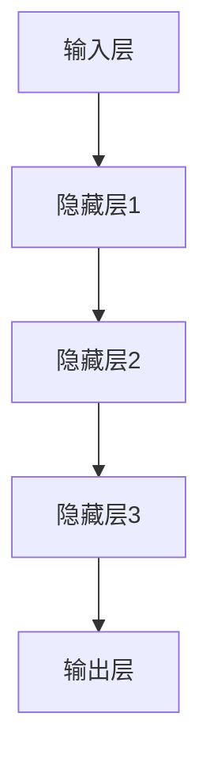

每个隐藏层的输出作为下一个隐藏层的输入，最终输出层产生预测结果。

###### 2.1.4 卷积神经网络

卷积神经网络（Convolutional Neural Network，CNN）是一种专门用于处理图像数据的神经网络，具有局部连接和权重共享的特点，能够有效提取图像特征。

1. **卷积层**：

   卷积层通过卷积操作提取图像的局部特征，每个卷积核（filter）滑动过图像，产生一个特征图。

   ```mermaid
   graph TD
   A[输入图像] --> B[卷积层]
   B --> C[特征图]
   ```

2. **池化层**：

   池化层（Pooling Layer）用于降低特征图的维度，减少计算量和参数数量，提高模型的泛化能力。

3. **全连接层**：

   全连接层（Fully Connected Layer）将卷积层输出的特征图展开成高维向量，进行分类或回归操作。

##### 2.2 深度学习框架简介

深度学习框架是用于构建和训练深度学习模型的软件库，提供了高效的计算图和优化算法。以下是几个流行的深度学习框架：

###### 2.2.1 TensorFlow

TensorFlow是由Google开发的开源深度学习框架，具有丰富的API和强大的计算能力。

1. **计算图**：

   TensorFlow使用计算图（Computational Graph）表示模型的计算过程，将操作和变量以图的形式组织。

2. **高级API**：

   TensorFlow提供了TensorFlow 1.x和TensorFlow 2.x两个版本的API，分别适用于不同的编程范式。TensorFlow 2.x引入了Eager Execution，使得编程更加直观。

###### 2.2.2 PyTorch

PyTorch是由Facebook AI Research开发的开源深度学习框架，以其灵活的动态计算图（Dynamic Computation Graph）和Python API而受到广泛欢迎。

1. **动态计算图**：

   PyTorch使用动态计算图，允许在运行时定义模型和操作，使得调试和原型设计更加方便。

2. **自动微分**：

   PyTorch内置了自动微分系统Autograd，可以自动计算梯度，简化了模型的训练过程。

###### 2.2.3 其他深度学习框架

除了TensorFlow和PyTorch，还有其他一些流行的深度学习框架，如：

1. **Keras**：一个高层神经网络API，可以用于快速构建和训练深度学习模型，支持TensorFlow和Theano后端。
2. **MXNet**：由Apache Software Foundation开发的深度学习框架，支持多种编程语言和分布式训练。
3. **Caffe**：由伯克利视觉与学习中心开发的深度学习框架，以C++和Python API为主，适合图像识别任务。

##### 2.3 深度学习推荐系统的核心算法

深度学习推荐系统的核心算法包括用户兴趣模型、商品特征提取和推荐算法评估指标。

###### 2.3.1 用户兴趣模型

用户兴趣模型用于预测用户对商品的可能兴趣。常见的用户兴趣模型包括基于内容的推荐（Content-Based Recommendation）和基于协同过滤的推荐（Collaborative Filtering）。

1. **基于内容的推荐**：

   基于内容的推荐通过分析用户历史行为和商品特征，找出相似的商品进行推荐。

   ```mermaid
   graph TD
   A[用户历史行为] --> B[商品特征提取]
   B --> C[相似度计算]
   C --> D[推荐结果]
   ```

2. **基于协同过滤的推荐**：

   基于协同过滤的推荐通过分析用户之间的相似性，找出相似的用户并推荐他们喜欢的商品。

   ```mermaid
   graph TD
   A[用户行为数据] --> B[相似性计算]
   B --> C[推荐结果]
   ```

###### 2.3.2 商品特征提取

商品特征提取是推荐系统的关键步骤，用于从商品中提取有用的信息，如商品类别、品牌、价格等。深度学习可以通过卷积神经网络（CNN）和循环神经网络（RNN）等方法提取商品特征。

1. **卷积神经网络（CNN）**：

   CNN可以自动提取图像中的特征，如边缘、纹理和形状，从而有效表示商品图像。

2. **循环神经网络（RNN）**：

   RNN可以处理序列数据，如商品的历史销售记录，从而捕捉商品的时间序列特征。

###### 2.3.3 推荐算法评估指标

推荐算法的评估指标用于衡量推荐系统的性能。常用的评估指标包括准确率（Accuracy）、召回率（Recall）、覆盖率（Coverage）和诺曼化增益（NDCG）。

1. **准确率（Accuracy）**：

   准确率表示预测正确的样本数占总样本数的比例。

   ```latex
   Accuracy = \frac{TP + TN}{TP + TN + FP + FN}
   ```

2. **召回率（Recall）**：

   召回率表示预测正确的正样本数占总正样本数的比例。

   ```latex
   Recall = \frac{TP}{TP + FN}
   ```

3. **覆盖率（Coverage）**：

   覆盖率表示推荐列表中包含的商品种类数与所有商品种类数的比例。

   ```latex
   Coverage = \frac{|\text{推荐列表中商品种类数}|}{|\text{所有商品种类数}|}
   ```

4. **诺曼化增益（NDCG）**：

   诺曼化增益（Normalized Discounted Cumulative Gain）是一个更细粒度的评估指标，考虑了推荐列表中每个商品的相对重要性。

   ```latex
   NDCG = \frac{DCG}{IDCG}
   ```

DCG（Discounted Cumulative Gain）表示推荐列表中每个商品的增益累加，IDCG（Ideal Discounted Cumulative Gain）表示理想情况下的增益累加。

本章介绍了深度学习的基础知识，包括神经网络与深度学习原理、深度学习框架及其在推荐系统中的应用。在下一章中，我们将深入探讨商品推荐系统的数据预处理方法。敬请期待！

---

**作者：AI天才研究院/AI Genius Institute & 禅与计算机程序设计艺术 /Zen And The Art of Computer Programming**

---

### 第一部分：深度学习驱动的商品推荐系统基础

#### 第3章：商品推荐系统的数据预处理

数据预处理是构建高效、准确推荐系统的重要环节。在深度学习驱动的商品推荐系统中，数据预处理的质量直接影响模型的性能。本章将详细介绍商品推荐系统的数据预处理流程，包括数据收集与来源、数据清洗与预处理、数据特征工程以及数据归一化与标准化。

##### 3.1 数据收集与来源

数据是推荐系统的基石，其质量和完整性直接影响推荐系统的性能。以下是常用的数据收集方法和来源：

1. **用户行为数据**：

   用户行为数据包括用户的浏览记录、购买记录、点击行为等。这些数据通常来源于电商平台、社交媒体等。

   ```mermaid
   graph TD
   A[电商平台] --> B[用户浏览记录]
   A --> C[用户购买记录]
   A --> D[社交媒体] --> E[用户点击行为]
   ```

2. **商品信息数据**：

   商品信息数据包括商品名称、价格、类别、品牌等属性。这些数据通常来源于电商平台、商品数据库等。

   ```mermaid
   graph TD
   A[电商平台] --> B[商品名称]
   A --> C[商品价格]
   A --> D[商品类别]
   A --> E[商品品牌]
   ```

3. **外部数据源**：

   外部数据源包括用户的社会属性、地理位置、人口统计信息等。这些数据可以来源于公共数据库、第三方数据服务提供商等。

   ```mermaid
   graph TD
   A[公共数据库] --> B[用户社会属性]
   A --> C[地理位置]
   A --> D[人口统计信息]
   ```

##### 3.2 数据清洗与预处理

数据清洗与预处理是确保数据质量和可靠性的关键步骤。以下是常用的数据清洗与预处理方法：

1. **数据去重**：

   数据去重是为了去除重复的数据记录，提高数据的唯一性和一致性。

   ```mermaid
   graph TD
   A[原始数据] --> B[去重处理]
   B --> C[唯一数据]
   ```

2. **数据补全**：

   数据补全是针对缺失数据的处理，可以使用均值填充、中值填充、插值等方法。

   ```mermaid
   graph TD
   A[缺失数据] --> B[补全方法]
   B --> C[完整数据]
   ```

3. **数据转换**：

   数据转换是将数据转换为适合模型训练的形式，如将类别数据编码为数字、将时间序列数据标准化等。

   ```mermaid
   graph TD
   A[原始数据] --> B[数据转换]
   B --> C[适合训练的数据]
   ```

4. **噪声去除**：

   噪声去除是为了去除数据中的异常值和噪声，提高数据的可信度。

   ```mermaid
   graph TD
   A[原始数据] --> B[噪声检测]
   B --> C[去除噪声]
   ```

##### 3.3 数据特征工程

数据特征工程是数据预处理的重要环节，通过提取和构造有效的特征，提高模型的性能。以下是常用的数据特征工程方法：

1. **特征提取**：

   特征提取是从原始数据中提取有用的特征，如使用词袋模型提取文本特征、使用主成分分析（PCA）提取图像特征等。

   ```mermaid
   graph TD
   A[原始数据] --> B[特征提取]
   B --> C[提取的特征]
   ```

2. **特征构造**：

   特征构造是通过组合或变换现有特征来生成新的特征，如时间窗口特征、用户活跃度特征等。

   ```mermaid
   graph TD
   A[原始特征] --> B[特征构造]
   B --> C[新的特征]
   ```

3. **特征选择**：

   特征选择是为了减少特征的数量，提高模型的训练效率和性能。常用的特征选择方法包括信息增益、卡方检验等。

   ```mermaid
   graph TD
   A[所有特征] --> B[特征选择]
   B --> C[选择的特征]
   ```

##### 3.4 数据归一化与标准化

数据归一化与标准化是为了使数据具有相似的尺度，避免某些特征对模型的影响过大。以下是常用的归一化与标准化方法：

1. **归一化**：

   归一化是将数据缩放到一个特定的范围，如将数据缩放到[0, 1]或[-1, 1]。

   ```mermaid
   graph TD
   A[原始数据] --> B[归一化处理]
   B --> C[归一化数据]
   ```

2. **标准化**：

   标准化是将数据转换成标准正态分布，如将数据转换为均值0、标准差1的形式。

   ```mermaid
   graph TD
   A[原始数据] --> B[标准化处理]
   B --> C[标准化数据]
   ```

本章介绍了商品推荐系统的数据预处理方法，包括数据收集与来源、数据清洗与预处理、数据特征工程以及数据归一化与标准化。在下一章中，我们将深入探讨深度学习推荐系统模型设计的方法。敬请期待！

---

**作者：AI天才研究院/AI Genius Institute & 禅与计算机程序设计艺术 /Zen And The Art of Computer Programming**

---

### 第一部分：深度学习驱动的商品推荐系统基础

#### 第4章：深度学习推荐系统模型设计

深度学习推荐系统模型设计是构建高效、准确推荐系统的关键。本章将详细介绍深度学习推荐系统模型设计的方法，包括模型设计原则与架构、用户兴趣建模、商品特征建模和多模态推荐。

##### 4.1 模型设计原则与架构

深度学习推荐系统模型设计需要遵循一系列原则，以确保模型的性能和可解释性。以下是模型设计的基本原则：

1. **端到端设计**：

   端到端设计将输入数据直接映射到输出结果，避免了传统推荐系统中的多个中间步骤，提高模型效率。

2. **数据驱动**：

   数据驱动的设计方法通过自动提取数据中的有用特征，减少人工特征工程的工作量。

3. **可解释性**：

   可解释性是深度学习推荐系统的重要原则，通过可视化和解释模型决策过程，增强用户信任。

深度学习推荐系统模型通常包括以下几个部分：

1. **输入层**：

   输入层接收用户和商品的特征，如用户行为序列、商品属性等。

2. **隐藏层**：

   隐藏层通过深度神经网络处理输入特征，提取高阶特征和表示。

3. **输出层**：

   输出层产生推荐结果，如预测用户对商品的偏好分数或排序。

4. **损失函数**：

   损失函数用于衡量模型预测结果与实际结果之间的差距，指导模型训练。

以下是深度学习推荐系统模型的基本架构：

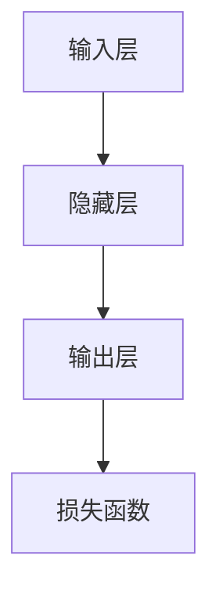

##### 4.2 用户兴趣建模

用户兴趣建模是深度学习推荐系统的核心步骤，通过分析用户的历史行为和特征，预测用户对商品的偏好。以下是用户兴趣建模的方法：

###### 4.2.1 用户行为序列分析

用户行为序列分析是通过分析用户的历史行为序列，如浏览记录、购买记录等，提取用户的行为模式。

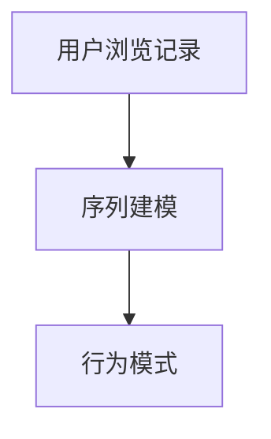

用户行为序列可以用时间序列模型（如RNN、LSTM）进行处理，提取序列特征。

###### 4.2.2 用户兴趣向量表示

用户兴趣向量表示是将用户的历史行为和特征映射到高维空间，形成用户兴趣向量。

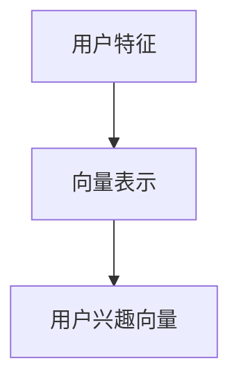

用户兴趣向量可以用深度神经网络（如BERT、GPT）进行训练，提取用户兴趣的语义特征。

###### 4.2.3 用户兴趣模型评估

用户兴趣模型评估是衡量模型性能的重要步骤，常用的评估指标包括准确率、召回率、覆盖率等。

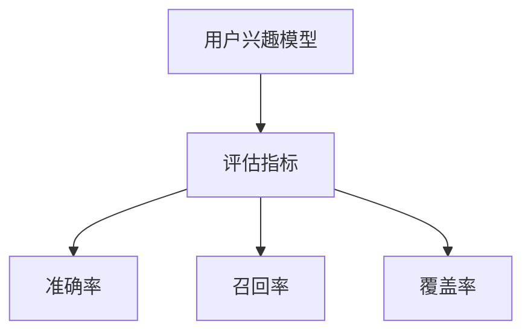

##### 4.3 商品特征建模

商品特征建模是深度学习推荐系统的另一个重要步骤，通过分析商品的特征，提取商品的关键信息。

###### 4.3.1 商品属性提取

商品属性提取是从商品描述、标签等文本信息中提取关键属性。

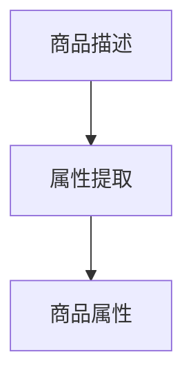

商品属性可以用词袋模型、TF-IDF等方法进行提取。

###### 4.3.2 商品特征嵌入

商品特征嵌入是将商品属性映射到高维空间，形成商品特征向量。

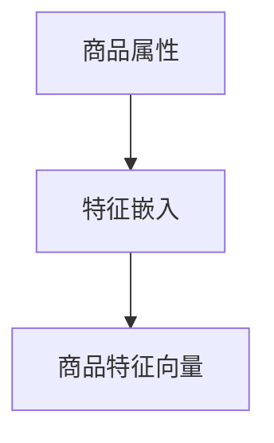

商品特征向量可以用深度神经网络（如BERT、GPT）进行训练，提取商品属性的语义特征。

###### 4.3.3 商品特征评估

商品特征评估是衡量模型性能的重要步骤，常用的评估指标包括准确率、召回率、覆盖率等。

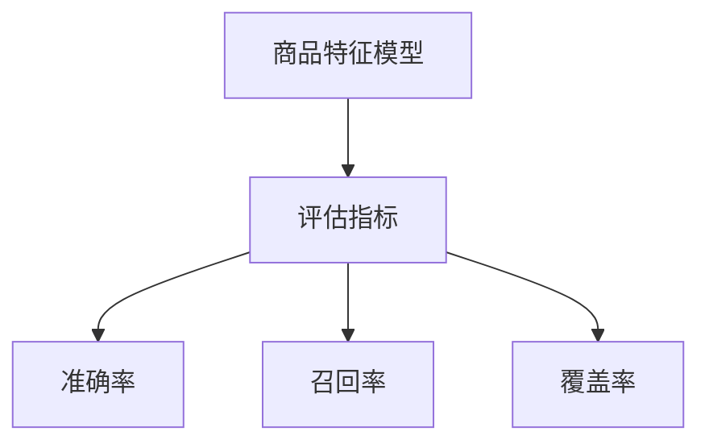

##### 4.4 多模态推荐

多模态推荐是将多种数据类型（如文本、图像、音频）融合到推荐系统中，提高推荐精度和用户体验。

###### 4.4.1 文本与图像融合

文本与图像融合是将文本信息和图像特征进行整合，形成多模态特征。

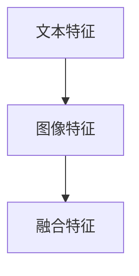

文本与图像融合可以用深度神经网络（如CNN、RNN）进行处理，提取多模态特征。

###### 4.4.2 多模态特征表示

多模态特征表示是将融合的多模态特征映射到高维空间，形成多模态特征向量。

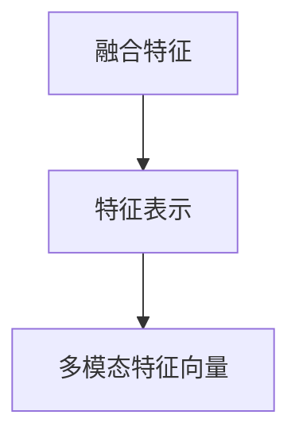

多模态特征向量可以用深度神经网络（如Transformer、BERT）进行训练，提取多模态特征的语义特征。

###### 4.4.3 多模态推荐模型

多模态推荐模型是将多模态特征输入到深度神经网络中，输出推荐结果。

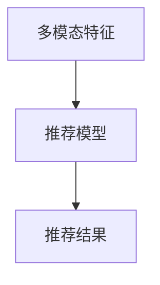

多模态推荐模型可以用深度神经网络（如CNN、RNN、BERT）进行训练，实现多模态推荐。

本章介绍了深度学习推荐系统模型设计的方法，包括模型设计原则与架构、用户兴趣建模、商品特征建模和多模态推荐。在下一章中，我们将通过实际案例展示如何搭建和优化一个深度学习推荐系统。敬请期待！

---

**作者：AI天才研究院/AI Genius Institute & 禅与计算机程序设计艺术 /Zen And The Art of Computer Programming**

---

### 第一部分：深度学习驱动的商品推荐系统基础

#### 第5章：深度学习推荐系统实战

深度学习推荐系统的实现是一个复杂的过程，涉及数据收集、模型设计、训练与评估等多个环节。在本章中，我们将通过三个实际案例来展示如何搭建和优化深度学习推荐系统。每个案例将涵盖系统设计与实现、模型训练与评估、系统部署与运维等方面。

##### 5.1 实战一：基于用户行为的推荐系统

###### 5.1.1 系统设计与实现

基于用户行为的推荐系统旨在通过分析用户的浏览记录、购买记录等行为数据，预测用户对商品的偏好。以下是系统设计与实现的关键步骤：

1. **数据收集与预处理**：

   - 收集用户的行为数据，如浏览记录、购买记录等。
   - 对数据进行清洗、去重、补全等预处理操作。

2. **特征工程**：

   - 提取用户的行为特征，如浏览次数、购买次数、平均浏览时长等。
   - 对特征进行归一化和标准化处理。

3. **模型设计**：

   - 采用深度学习框架（如TensorFlow或PyTorch）设计用户行为预测模型。
   - 模型结构可以包括输入层、隐藏层和输出层，使用激活函数和优化器等。

4. **模型训练**：

   - 使用训练数据对模型进行训练。
   - 采用反向传播算法更新模型权重。

5. **模型评估**：

   - 使用验证集对模型进行评估，调整模型参数以优化性能。

6. **系统部署**：

   - 将训练好的模型部署到生产环境中，以实时预测用户行为。

```python
# 示例：TensorFlow中的用户行为预测模型
import tensorflow as tf

# 定义模型结构
model = tf.keras.Sequential([
    tf.keras.layers.Dense(units=64, activation='relu', input_shape=(num_features,)),
    tf.keras.layers.Dense(units=32, activation='relu'),
    tf.keras.layers.Dense(units=1, activation='sigmoid')
])

# 编译模型
model.compile(optimizer='adam', loss='binary_crossentropy', metrics=['accuracy'])

# 训练模型
model.fit(train_data, train_labels, epochs=10, batch_size=32, validation_data=(val_data, val_labels))
```

###### 5.1.2 模型训练与评估

在模型训练过程中，我们使用训练集进行迭代训练，并使用验证集进行性能评估。以下是一个简单的模型训练和评估过程：

```python
# 训练模型
model.fit(train_data, train_labels, epochs=100, batch_size=64, validation_split=0.2)

# 评估模型
evaluation = model.evaluate(test_data, test_labels)
print(f"Test Loss: {evaluation[0]}, Test Accuracy: {evaluation[1]}")
```

###### 5.1.3 系统部署与运维

系统部署是将训练好的模型部署到生产环境中，以实时预测用户行为。以下是系统部署和运维的关键步骤：

1. **容器化**：

   - 使用Docker将模型和应用容器化，以便在多种环境中部署。

2. **自动化部署**：

   - 使用CI/CD工具（如Jenkins、GitLab CI）实现自动化部署。

3. **监控与优化**：

   - 监控系统性能，如响应时间、吞吐量等。
   - 根据性能数据调整模型参数和系统配置。

##### 5.2 实战二：基于商品属性的推荐系统

基于商品属性的推荐系统通过分析商品的特征，如类别、品牌、价格等，为用户推荐相关商品。以下是系统设计与实现的关键步骤：

1. **数据收集与预处理**：

   - 收集商品属性数据，如类别、品牌、价格等。
   - 对数据进行清洗、去重、归一化等预处理操作。

2. **特征工程**：

   - 提取商品的特征，如类别编码、品牌编码等。
   - 对特征进行融合和组合，提高模型性能。

3. **模型设计**：

   - 采用深度学习框架设计商品属性预测模型。
   - 模型结构可以包括输入层、隐藏层和输出层，使用激活函数和优化器等。

4. **模型训练**：

   - 使用训练数据对模型进行训练。
   - 采用反向传播算法更新模型权重。

5. **模型评估**：

   - 使用验证集对模型进行评估，调整模型参数以优化性能。

6. **系统部署**：

   - 将训练好的模型部署到生产环境中，以实时预测商品属性。

```python
# 示例：TensorFlow中的商品属性预测模型
import tensorflow as tf

# 定义模型结构
model = tf.keras.Sequential([
    tf.keras.layers.Dense(units=128, activation='relu', input_shape=(num_features,)),
    tf.keras.layers.Dense(units=64, activation='relu'),
    tf.keras.layers.Dense(units=1, activation='sigmoid')
])

# 编译模型
model.compile(optimizer='adam', loss='binary_crossentropy', metrics=['accuracy'])

# 训练模型
model.fit(train_data, train_labels, epochs=100, batch_size=64, validation_split=0.2)
```

###### 5.2.2 模型训练与评估

与实战一类似，我们可以使用相同的训练和评估流程来训练和评估基于商品属性的推荐系统。以下是模型训练和评估的过程：

```python
# 训练模型
model.fit(train_data, train_labels, epochs=100, batch_size=64, validation_split=0.2)

# 评估模型
evaluation = model.evaluate(test_data, test_labels)
print(f"Test Loss: {evaluation[0]}, Test Accuracy: {evaluation[1]}")
```

###### 5.2.3 系统部署与运维

基于商品属性的推荐系统在部署和运维过程中需要注意以下几个方面：

1. **容器化与自动化部署**：

   - 使用容器化技术（如Docker）实现模型的部署和运维。
   - 使用CI/CD工具（如Jenkins、GitLab CI）实现自动化部署和更新。

2. **监控与性能优化**：

   - 监控系统性能，如响应时间、吞吐量等。
   - 根据性能数据调整模型参数和系统配置。

3. **安全与隐私保护**：

   - 确保系统的数据安全和隐私保护。
   - 实施严格的访问控制和加密措施。

##### 5.3 实战三：多模态推荐系统

多模态推荐系统通过融合多种数据类型（如文本、图像、音频），提供更丰富和个性化的推荐结果。以下是系统设计与实现的关键步骤：

1. **数据收集与预处理**：

   - 收集文本数据（如商品描述、用户评论等）。
   - 收集图像数据（如商品图片、用户头像等）。
   - 收集音频数据（如用户语音、商品音频等）。

   - 对数据进行清洗、去重、归一化等预处理操作。

2. **特征工程**：

   - 提取文本特征（如词袋模型、TF-IDF等）。
   - 提取图像特征（如卷积神经网络、特征提取器等）。
   - 提取音频特征（如Mel频谱、特征提取器等）。

   - 对特征进行融合和组合，提高模型性能。

3. **模型设计**：

   - 采用深度学习框架设计多模态推荐模型。
   - 模型结构可以包括输入层、隐藏层和输出层，使用激活函数和优化器等。

4. **模型训练**：

   - 使用训练数据对模型进行训练。
   - 采用反向传播算法更新模型权重。

5. **模型评估**：

   - 使用验证集对模型进行评估，调整模型参数以优化性能。

6. **系统部署**：

   - 将训练好的模型部署到生产环境中，以实时预测多模态数据。

```python
# 示例：TensorFlow中的多模态推荐模型
import tensorflow as tf

# 定义模型结构
model = tf.keras.Sequential([
    tf.keras.layers.Dense(units=128, activation='relu', input_shape=(text_features, image_features, audio_features)),
    tf.keras.layers.Dense(units=64, activation='relu'),
    tf.keras.layers.Dense(units=1, activation='sigmoid')
])

# 编译模型
model.compile(optimizer='adam', loss='binary_crossentropy', metrics=['accuracy'])

# 训练模型
model.fit(train_data, train_labels, epochs=100, batch_size=64, validation_split=0.2)
```

###### 5.3.2 模型训练与评估

与之前两个案例类似，我们可以使用相同的训练和评估流程来训练和评估多模态推荐系统。以下是模型训练和评估的过程：

```python
# 训练模型
model.fit(train_data, train_labels, epochs=100, batch_size=64, validation_split=0.2)

# 评估模型
evaluation = model.evaluate(test_data, test_labels)
print(f"Test Loss: {evaluation[0]}, Test Accuracy: {evaluation[1]}")
```

###### 5.3.3 系统部署与运维

多模态推荐系统在部署和运维过程中需要注意以下几个方面：

1. **容器化与自动化部署**：

   - 使用容器化技术（如Docker）实现模型的部署和运维。
   - 使用CI/CD工具（如Jenkins、GitLab CI）实现自动化部署和更新。

2. **监控与性能优化**：

   - 监控系统性能，如响应时间、吞吐量等。
   - 根据性能数据调整模型参数和系统配置。

3. **数据安全与隐私保护**：

   - 确保系统的数据安全和隐私保护。
   - 实施严格的访问控制和加密措施。

本章通过三个实际案例展示了如何搭建和优化深度学习推荐系统。在下一章中，我们将讨论深度学习推荐系统的性能优化策略。敬请期待！

---

**作者：AI天才研究院/AI Genius Institute & 禅与计算机程序设计艺术 /Zen And The Art of Computer Programming**

---

### 第一部分：深度学习驱动的商品推荐系统基础

#### 第6章：深度学习推荐系统性能优化

深度学习推荐系统的性能优化是提高模型效率、降低计算成本、提升用户体验的关键环节。本章将详细介绍深度学习推荐系统性能优化的策略，包括模型调参技巧、系统优化与调优、以及实时推荐系统的优化方法。

##### 6.1 推荐系统性能指标

推荐系统性能的评估通常依赖于多个指标，这些指标可以从不同角度衡量推荐系统的效果。

###### 6.1.1 准确率与召回率

准确率（Accuracy）和召回率（Recall）是最常用的评估指标。

1. **准确率**：

   准确率是指预测正确的样本数占总样本数的比例。

   ```latex
   Accuracy = \frac{TP + TN}{TP + TN + FP + FN}
   ```

   其中，TP表示真正例（True Positive），TN表示真负例（True Negative），FP表示假正例（False Positive），FN表示假负例（False Negative）。

2. **召回率**：

   召回率是指预测正确的正样本数占总正样本数的比例。

   ```latex
   Recall = \frac{TP}{TP + FN}
   ```

   召回率关注于找出所有的正样本，但可能会引入更多的假正例。

###### 6.1.2 精度与覆盖率

1. **精度**：

   精度是指预测为正的样本中实际为正的样本比例。

   ```latex
   Precision = \frac{TP}{TP + FP}
   ```

   精度关注于减少假正例的数量。

2. **覆盖率**：

   覆盖率是指推荐列表中包含的不同商品种类数与所有商品种类数的比例。

   ```latex
   Coverage = \frac{|\text{推荐列表中商品种类数}|}{|\text{所有商品种类数}|}
   ```

   覆盖率关注于推荐列表的多样性。

###### 6.1.3 深度学习推荐系统的性能优化策略

1. **模型超参数优化**：

   模型超参数如学习率、批量大小、隐藏层节点数等对模型性能有很大影响。超参数优化可以使用网格搜索（Grid Search）或随机搜索（Random Search）等方法。

2. **数据增强**：

   数据增强是通过增加训练数据多样性来提高模型性能。方法包括数据扩充、数据变换等。

3. **正则化**：

   正则化如L1、L2正则化可以防止模型过拟合。

4. **批处理技巧**：

   批处理大小和顺序对模型训练速度和效果有显著影响。可以使用随机批处理（Stochastic Batch）或顺序批处理（Sequential Batch）。

##### 6.2 模型调参技巧

模型调参是优化深度学习推荐系统的关键步骤。以下是常用的调参技巧：

###### 6.2.1 模型超参数优化

1. **网格搜索**：

   网格搜索通过遍历所有可能的超参数组合来寻找最优参数。

   ```python
   from sklearn.model_selection import GridSearchCV

   parameters = {'learning_rate': [0.1, 0.01, 0.001], 'batch_size': [64, 128]}
   grid_search = GridSearchCV(estimator=model, param_grid=parameters, cv=3)
   grid_search.fit(train_data, train_labels)
   best_params = grid_search.best_params_
   ```

2. **随机搜索**：

   随机搜索在有限次数内随机选择超参数组合，以减少计算时间。

   ```python
   from sklearn.model_selection import RandomizedSearchCV

   parameters = {'learning_rate': [0.1, 0.01, 0.001], 'batch_size': [64, 128]}
   random_search = RandomizedSearchCV(estimator=model, param_distributions=parameters, n_iter=10, cv=3)
   random_search.fit(train_data, train_labels)
   best_params = random_search.best_params_
   ```

###### 6.2.2 模型训练技巧

1. **学习率调整**：

   学习率是模型训练中调节的重要参数。常用的方法包括固定学习率、学习率衰减等。

2. **梯度裁剪**：

   梯度裁剪可以防止梯度消失或爆炸，保持梯度在合理的范围内。

   ```python
   clip_value = 1.0
   gradients = [tf.clip_by_value(g, -clip_value, clip_value) for g in gradients]
   ```

3. **早期停止**：

   早期停止可以在模型过拟合时停止训练，以防止模型性能下降。

   ```python
   early_stopping = tf.keras.callbacks.EarlyStopping(monitor='val_loss', patience=5)
   ```

##### 6.3 系统优化与调优

系统优化和调优是提高深度学习推荐系统性能的关键。以下是常用的系统优化策略：

###### 6.3.1 系统负载优化

1. **负载均衡**：

   通过分布式计算和负载均衡技术，将计算任务分配到多个节点上，提高系统的处理能力。

2. **缓存机制**：

   使用缓存机制存储常用数据和计算结果，减少计算时间。

3. **异步处理**：

   异步处理可以同时处理多个请求，提高系统吞吐量。

###### 6.3.2 缓存与分布式系统设计

1. **缓存设计**：

   使用缓存存储频繁访问的数据，减少数据库访问压力。

   ```python
   cache = scikit.learn.persistence.Cache.Memory(name='cache', verbose=1)
   ```

2. **分布式系统设计**：

   使用分布式系统设计，将模型训练和预测任务分配到多个节点上，提高系统性能。

   ```python
   model.fit(train_data, train_labels, epochs=10, batch_size=64, validation_split=0.2, use_multiprocessing=True)
   ```

###### 6.3.3 实时推荐系统优化

1. **低延迟处理**：

   实时推荐系统要求低延迟处理，可以使用优化算法和硬件加速技术。

2. **增量更新**：

   使用增量更新方法，只更新模型中变化的部分，减少计算时间。

3. **在线学习**：

   使用在线学习算法，实时更新模型参数，提高系统响应速度。

本章介绍了深度学习推荐系统性能优化的策略，包括模型调参技巧、系统优化与调优、以及实时推荐系统的优化方法。在下一章中，我们将探讨深度学习推荐系统的未来发展。敬请期待！

---

**作者：AI天才研究院/AI Genius Institute & 禅与计算机程序设计艺术 /Zen And The Art of Computer Programming**

---

### 第一部分：深度学习驱动的商品推荐系统基础

#### 第7章：深度学习推荐系统的未来发展

随着深度学习技术的不断进步，深度学习推荐系统在性能、可解释性和多样性方面取得了显著进展。本章将探讨深度学习推荐系统的未来发展趋势，包括新一代推荐算法、数据隐私保护与推荐系统、以及推荐系统的产业应用与创新。

##### 7.1 新一代推荐算法

新一代推荐算法通过引入强化学习、生成对抗网络（GAN）和自适应推荐系统，为推荐系统带来了新的机遇和挑战。

###### 7.1.1 强化学习在推荐系统中的应用

强化学习（Reinforcement Learning，RL）通过智能体与环境的交互学习最优策略。在推荐系统中，强化学习可以用于训练智能体，使其在与用户互动中不断优化推荐策略。

1. **策略网络**：

   强化学习中的策略网络（Policy Network）用于决定推荐系统如何响应用户的反馈。

   ```mermaid
   graph TD
   A[用户行为] --> B[策略网络]
   B --> C[推荐策略]
   ```

2. **评价函数**：

   评价函数（Reward Function）用于衡量用户对推荐结果的满意度。

   ```mermaid
   graph TD
   A[推荐结果] --> B[评价函数]
   B --> C[奖励信号]
   ```

3. **应用场景**：

   强化学习在个性化推荐、内容推荐和广告推荐等领域有广泛应用。

   ```mermaid
   graph TD
   A[个性化推荐] --> B[强化学习]
   A --> C[内容推荐]
   A --> D[广告推荐]
   ```

###### 7.1.2 生成对抗网络在推荐系统中的应用

生成对抗网络（Generative Adversarial Networks，GAN）通过对抗性训练生成逼真的数据，提高推荐系统的多样性和个性。

1. **生成器**：

   生成器（Generator）生成与真实数据分布相似的推荐内容。

   ```mermaid
   graph TD
   A[真实数据] --> B[生成器]
   B --> C[生成数据]
   ```

2. **判别器**：

   判别器（Discriminator）区分真实数据和生成数据。

   ```mermaid
   graph TD
   A[真实数据] --> B[判别器]
   A --> C[判别结果]
   B --> D[生成数据]
   D --> C
   ```

3. **应用场景**：

   GAN在生成虚假用户行为数据、生成个性化内容、生成高维特征表示等方面有广泛应用。

   ```mermaid
   graph TD
   A[虚假用户行为数据] --> B[GAN]
   A --> C[个性化内容]
   A --> D[高维特征表示]
   ```

###### 7.1.3 自适应推荐系统

自适应推荐系统（Adaptive Recommendation System）能够根据用户的实时反馈和学习历史动态调整推荐策略，提高推荐效果。

1. **在线学习**：

   自适应推荐系统使用在线学习算法，实时更新模型参数。

   ```mermaid
   graph TD
   A[用户行为] --> B[在线学习]
   B --> C[模型更新]
   ```

2. **动态调整**：

   自适应推荐系统根据用户行为动态调整推荐策略，以应对用户兴趣的变化。

   ```mermaid
   graph TD
   A[用户行为变化] --> B[动态调整]
   B --> C[推荐策略]
   ```

3. **应用场景**：

   自适应推荐系统在实时推荐、个性化营销和智能助理等领域有广泛应用。

   ```mermaid
   graph TD
   A[实时推荐] --> B[自适应推荐系统]
   A --> C[个性化营销]
   A --> D[智能助理]
   ```

##### 7.2 数据隐私保护与推荐系统

数据隐私保护是深度学习推荐系统面临的重要挑战。随着用户隐私意识的提高，保护用户数据隐私成为推荐系统设计和实施的关键。

###### 7.2.1 加密技术

加密技术通过将敏感数据加密，确保数据在传输和存储过程中不被未授权访问。

1. **对称加密**：

   对称加密使用相同的密钥进行加密和解密。

   ```mermaid
   graph TD
   A[明文数据] --> B[加密算法]
   B --> C[密文数据]
   C --> D[解密算法]
   D --> E[明文数据]
   ```

2. **非对称加密**：

   非对称加密使用不同的密钥进行加密和解密。

   ```mermaid
   graph TD
   A[明文数据] --> B[公钥加密]
   B --> C[密文数据]
   C --> D[私钥解密]
   ```

3. **应用场景**：

   加密技术在数据传输、存储和计算过程中广泛应用。

   ```mermaid
   graph TD
   A[数据传输] --> B[加密技术]
   A --> C[数据存储]
   A --> D[计算过程]
   ```

###### 7.2.2 同态加密与联邦学习

同态加密（Homomorphic Encryption）允许在加密数据上进行计算，而不需要解密，确保数据隐私。

1. **同态加密原理**：

   同态加密将加密操作转换为相应的计算操作。

   ```mermaid
   graph TD
   A[明文数据] --> B[加密算法]
   B --> C[密文数据]
   C --> D[加密计算]
   D --> E[解密结果]
   ```

2. **联邦学习**：

   联邦学习（Federated Learning）通过分布式训练模型，保护用户数据隐私。

   ```mermaid
   graph TD
   A[客户端数据] --> B[本地训练]
   B --> C[模型更新]
   C --> D[中心模型]
   ```

3. **应用场景**：

   同态加密和联邦学习在分布式推荐系统、移动设备上的推荐系统等领域有广泛应用。

   ```mermaid
   graph TD
   A[分布式推荐系统] --> B[同态加密]
   A --> C[移动设备推荐系统]
   ```

##### 7.3 推荐系统的产业应用与创新

深度学习推荐系统在多个产业领域展现出巨大的应用潜力，推动产业创新和数字化转型。

###### 7.3.1 个性化教育

个性化教育通过深度学习推荐系统为学习者提供定制化的学习资源和课程，提高学习效果。

1. **学习行为分析**：

   深度学习推荐系统分析学习者的学习行为和知识水平，为其推荐适合的学习资源。

   ```mermaid
   graph TD
   A[学习行为] --> B[推荐系统]
   B --> C[推荐资源]
   ```

2. **应用场景**：

   个性化教育在在线教育、职业培训等领域有广泛应用。

   ```mermaid
   graph TD
   A[在线教育] --> B[个性化教育]
   A --> C[职业培训]
   ```

###### 7.3.2 健康医疗

健康医疗领域通过深度学习推荐系统为患者提供个性化的健康建议和医疗服务。

1. **健康数据分析**：

   深度学习推荐系统分析患者的健康数据，为其推荐适宜的健康方案。

   ```mermaid
   graph TD
   A[健康数据] --> B[推荐系统]
   B --> C[健康建议]
   ```

2. **应用场景**：

   健康医疗在慢性病管理、个性化医疗、公共卫生等领域有广泛应用。

   ```mermaid
   graph TD
   A[慢性病管理] --> B[个性化医疗]
   A --> C[公共卫生]
   ```

###### 7.3.3 新零售与供应链管理

新零售与供应链管理通过深度学习推荐系统优化库存管理、营销策略和供应链协同。

1. **库存管理**：

   深度学习推荐系统分析销售数据和市场趋势，优化库存水平。

   ```mermaid
   graph TD
   A[销售数据] --> B[推荐系统]
   B --> C[库存建议]
   ```

2. **营销策略**：

   深度学习推荐系统为零售商提供个性化的营销策略，提高销售转化率。

   ```mermaid
   graph TD
   A[用户数据] --> B[推荐系统]
   B --> C[营销策略]
   ```

3. **应用场景**：

   新零售与供应链管理在电商平台、物流配送、供应链金融等领域有广泛应用。

   ```mermaid
   graph TD
   A[电商平台] --> B[新零售]
   A --> C[物流配送]
   A --> D[供应链金融]
   ```

本章探讨了深度学习推荐系统的未来发展，包括新一代推荐算法、数据隐私保护与推荐系统、以及推荐系统的产业应用与创新。随着技术的不断进步，深度学习推荐系统将在更多领域发挥重要作用，推动产业升级和社会发展。

---

**作者：AI天才研究院/AI Genius Institute & 禅与计算机程序设计艺术 /Zen And The Art of Computer Programming**

---

### 附录

#### 附录A：深度学习推荐系统常用工具与资源

构建和优化深度学习推荐系统需要一系列工具和资源。以下是一些常用的深度学习框架、推荐系统开源库以及数据集介绍与获取方式。

##### A.1 主流深度学习框架

深度学习框架提供了高效的计算图和丰富的API，帮助开发者快速构建和训练模型。以下是几个流行的深度学习框架：

1. **TensorFlow**：由Google开发的开源深度学习框架，支持多种编程范式和高效的计算图。
   
   - 官网：[TensorFlow官网](https://www.tensorflow.org)
   - GitHub：[TensorFlow GitHub](https://github.com/tensorflow/tensorflow)

2. **PyTorch**：由Facebook AI Research开发的开源深度学习框架，以其灵活的动态计算图和Python API而受到广泛欢迎。

   - 官网：[PyTorch官网](https://pytorch.org)
   - GitHub：[PyTorch GitHub](https://github.com/pytorch/pytorch)

3. **Keras**：一个高层神经网络API，可以用于快速构建和训练深度学习模型，支持TensorFlow和Theano后端。

   - 官网：[Keras官网](https://keras.io)
   - GitHub：[Keras GitHub](https://github.com/keras-team/keras)

4. **MXNet**：由Apache Software Foundation开发的深度学习框架，支持多种编程语言和分布式训练。

   - 官网：[MXNet官网](https://mxnet.incubator.apache.org)
   - GitHub：[MXNet GitHub](https://github.com/apache/incubator-mxnet)

5. **Caffe**：由伯克利视觉与学习中心开发的深度学习框架，以C++和Python API为主，适合图像识别任务。

   - 官网：[Caffe官网](http://caffe.berkeleyvision.org)
   - GitHub：[Caffe GitHub](https://github.com/BVLC/caffe)

##### A.2 推荐系统开源库

以下是几个流行的推荐系统开源库，可以帮助开发者快速实现推荐算法：

1. **Surprise**：一个Python库，提供了多种常用的推荐算法和评估指标。

   - GitHub：[Surprise GitHub](https://github.com/NicolasHassan/surprise)

2. **RecSysPy**：一个用于研究和开发推荐系统的Python库，支持矩阵分解、协同过滤和基于内容的推荐算法。

   - GitHub：[RecSysPy GitHub](https://github.com/Ganssle/RecSysPy)

3. **LightFM**：一个基于矩阵分解的推荐系统库，支持因素分解机（Factorization Machines）和协同过滤。

   - GitHub：[LightFM GitHub](https://github.com/lyst/lightfm)

4. **TensorRec**：一个基于TensorFlow的推荐系统库，提供了多种深度学习推荐算法，包括序列模型和图模型。

   - GitHub：[TensorRec GitHub](https://github.com/TensorRec/tensorrec)

##### A.3 数据集介绍与获取

构建有效的推荐系统需要大量高质量的数据集。以下是一些常用的推荐系统数据集：

1. **MovieLens**：一个开源的在线电影推荐系统，提供用户对电影的评分数据。

   - 官网：[MovieLens官网](https://grouplens.org/datasets/movielens/)
   - 数据集下载：[MovieLens数据集](https://grouplens.org/datasets/movielens/ratings-10k.dat)

2. **Amazon Reviews**：包含大量用户对亚马逊商品的评价数据。

   - GitHub：[Amazon Reviews GitHub](https://github.com/awslabs/amazon-reviews-polarity)

3. **Yahoo！Music**：提供用户对音乐的偏好数据，用于音乐推荐系统。

   - GitHub：[Yahoo！Music GitHub](https://github.com/kf反映/yahoo-music-dataset)

4. **Flickr Comments**：包含用户在Flickr网站上发布的照片和评论数据。

   - GitHub：[Flickr Comments GitHub](https://github.com/awslabs/flickr-comments-dataset)

通过以上工具和资源，开发者可以构建高效、准确的深度学习推荐系统，满足不同应用场景的需求。

---

**作者：AI天才研究院/AI Genius Institute & 禅与计算机程序设计艺术 /Zen And The Art of Computer Programming**

