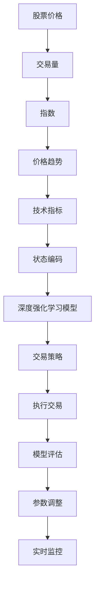

                 

# 深度强化学习在自动化交易系统中的应用

## 关键词
- 深度强化学习
- 自动化交易系统
- 股票交易
- 外汇交易
- 期货交易
- 加密货币交易

## 摘要

随着金融市场的高速发展和信息技术的进步，自动化交易系统在金融交易中发挥着越来越重要的作用。本文将探讨深度强化学习（DRL）在自动化交易系统中的应用，从基本概念、应用原理到实际案例，全面分析DRL如何提升交易策略的智能性和有效性。文章首先介绍了深度强化学习的基本原理和组成部分，然后深入讨论了其在自动化交易系统中的应用原理和关键技术，接着通过股票交易、外汇交易、期货交易和加密货币交易的案例，展示了深度强化学习的实际应用效果。最后，文章对深度强化学习在自动化交易系统中的挑战和未来发展趋势进行了展望。

<|moderated|>### 《深度强化学习在自动化交易系统中的应用》目录大纲

1. **第一部分：深度强化学习基础**
   - 第1章 深度强化学习的概念与原理
     1.1 深度强化学习的定义
     1.2 深度强化学习的关键组成部分
     1.3 深度强化学习的经典算法
   - 第2章 深度强化学习在自动化交易系统中的应用原理
     2.1 自动化交易系统的概述
     2.2 深度强化学习在交易策略中的角色
     2.3 深度强化学习与市场数据的交互

2. **第二部分：深度强化学习在自动化交易系统中的应用实战**
   - 第3章 深度强化学习在股票交易中的应用
     3.1 股票交易策略的设计与实现
     3.2 股票市场数据的处理与可视化
     3.3 股票交易策略的案例分析
   - 第4章 深度强化学习在外汇交易中的应用
     4.1 外汇交易策略的设计与实现
     4.2 外汇市场数据的处理与可视化
     4.3 外汇交易策略的案例分析
   - 第5章 深度强化学习在期货交易中的应用
     5.1 期货交易策略的设计与实现
     5.2 期货市场数据的处理与可视化
     5.3 期货交易策略的案例分析
   - 第6章 深度强化学习在加密货币交易中的应用
     6.1 加密货币交易策略的设计与实现
     6.2 加密货币市场数据的处理与可视化
     6.3 加密货币交易策略的案例分析

3. **第三部分：深度强化学习在自动化交易系统中的综合应用与展望**
   - 第7章 深度强化学习在自动化交易系统中的综合应用与展望
     7.1 自动化交易系统的综合应用
     7.2 深度强化学习在自动化交易系统中的挑战与机遇
     7.3 深度强化学习在自动化交易系统中的应用前景

4. **附录**
   - 附录A 深度强化学习在自动化交易系统中的应用工具与资源
   - 附录B 深度强化学习在自动化交易系统中的应用示例代码

此大纲为本文的结构框架，每个章节将详细介绍相关内容，使读者能够全面了解深度强化学习在自动化交易系统中的应用。

---

接下来，我们将按照这个大纲逐步深入探讨深度强化学习在自动化交易系统中的应用。

---

### 第一部分：深度强化学习基础

#### 第1章 深度强化学习的概念与原理

##### 1.1 深度强化学习的定义

深度强化学习（Deep Reinforcement Learning，简称DRL）是强化学习（Reinforcement Learning，简称RL）的一种，结合了深度学习的优势，用于解决那些需要从大量数据中学习复杂策略的问题。强化学习是一种机器学习范式，其核心是通过与环境交互，根据即时奖励调整行为，以最大化长期回报。

深度强化学习的主要特点包括：

1. **深度神经网络的引入**：DRL使用深度神经网络（DNN）来近似策略函数或价值函数，从而能够处理高维输入数据，学习复杂的决策策略。
2. **状态-动作价值函数**：DRL通过学习状态-动作价值函数来评估每个状态下的每个动作的期望回报。
3. **探索-exploitation权衡**：DRL需要在探索新策略和利用已有策略之间取得平衡，以避免陷入局部最优。

##### 1.1.1 强化学习与深度学习的关系

强化学习和深度学习之间的关系可以理解为以下两点：

1. **深度学习是强化学习的工具**：深度学习提供了一种强大的函数逼近能力，使得强化学习在处理高维输入和复杂决策问题时更加有效。
2. **强化学习是深度学习的目标**：深度学习往往旨在解决回归、分类等任务，而强化学习的目标是学习一个策略，使得系统能够从环境中获取最大的回报。

##### 1.1.2 深度强化学习的特点

DRL具有以下几个显著特点：

1. **自主学习能力**：DRL能够通过与环境交互自主学习，不需要人工指定规则或模型参数。
2. **灵活性和适应性**：DRL可以处理不同的环境和任务，通过调整模型结构和学习算法，适应不同的应用场景。
3. **非线性优化能力**：深度神经网络能够捕获输入数据的复杂非线性关系，从而学习出更为复杂的决策策略。

##### 1.2 深度强化学习的关键组成部分

深度强化学习系统主要包括以下几个关键组成部分：

1. **状态（State）**：状态是系统当前所处的情境的描述，通常是一个多维向量。
2. **动作（Action）**：动作是系统可以采取的行为，也是一个多维向量。
3. **奖励（Reward）**：奖励是系统在某一状态下采取某一动作后获得的即时回报，用于指导学习过程。
4. **策略（Policy）**：策略是系统从状态中选择动作的方法，可以是确定性或随机性的。
5. **价值函数（Value Function）**：价值函数评估了系统在某一状态下采取某一策略所能获得的期望回报。
6. **模型（Model）**：模型是对环境的建模，用于预测未来的状态和奖励。

##### 1.3 深度强化学习的经典算法

深度强化学习算法种类繁多，其中一些经典的算法包括：

1. **Q-Learning**：Q-Learning是一种基于价值迭代的方法，通过更新状态-动作价值函数来学习策略。
2. **Deep Q-Network (DQN)**：DQN是Q-Learning的一种扩展，使用深度神经网络来近似状态-动作价值函数。
3. **Policy Gradient方法**：Policy Gradient方法通过直接优化策略的梯度来学习策略，适用于那些价值函数难以估计的情况。
4. **actor-critic方法**：actor-critic方法结合了策略优化和价值评估，通过迭代更新actor和critic网络来学习策略。

在本章的后续部分，我们将详细讨论这些经典算法的原理和实现。

---

在下一章中，我们将进一步探讨深度强化学习在自动化交易系统中的应用原理。

---

### 第2章 深度强化学习在自动化交易系统中的应用原理

#### 2.1 自动化交易系统的概述

自动化交易系统（Automated Trading System，简称ATS）是一种利用计算机程序自动进行金融交易的系统。它通过分析市场数据，自动执行交易策略，以实现最大化收益或最小化风险。自动化交易系统具有以下优点：

1. **速度与效率**：自动化交易系统能够在毫秒级别进行交易决策，远远超过人类交易员的速度。
2. **稳定性**：自动化交易系统减少了人为情绪的干扰，能够按照预设策略一致性地执行交易。
3. **可扩展性**：自动化交易系统可以轻松扩展到多个市场，处理大量的交易数据。

自动化交易系统的主要组成部分包括：

1. **交易策略**：交易策略是自动交易系统的核心，它决定了何时买入、卖出、持有等操作。
2. **数据源**：数据源提供市场数据，如股票价格、交易量、指数等。
3. **执行引擎**：执行引擎负责将交易策略转换为实际交易操作，并与交易所进行通信。
4. **风险控制**：风险控制模块用于监控交易风险，确保交易策略不会超出预设的风险承受范围。

#### 2.2 深度强化学习在交易策略中的角色

深度强化学习在自动化交易系统中的角色是通过学习如何从历史市场数据中预测未来的价格走势，从而优化交易策略。以下是DRL在交易策略中的几个关键作用：

1. **策略学习**：DRL可以学习出最优的交易策略，通过与环境（市场）的交互，不断调整策略以最大化回报。
2. **风险管理**：DRL能够通过分析历史数据，识别潜在的风险，并调整交易策略以降低风险。
3. **市场预测**：DRL可以预测市场的短期和长期趋势，为交易决策提供依据。
4. **动态调整**：DRL可以根据市场的实时变化，动态调整交易策略，以应对市场波动。

##### 2.2.1 数据预处理与特征提取

在深度强化学习中，数据预处理和特征提取是非常重要的一步。以下是数据预处理和特征提取的关键步骤：

1. **数据清洗**：去除噪声数据和异常值，确保数据的质量。
2. **数据归一化**：将数据缩放到相同的范围，以便神经网络能够更好地学习。
3. **特征提取**：从原始数据中提取有用的特征，如价格趋势、交易量、技术指标等。
4. **时间序列处理**：将时间序列数据转换为适合神经网络学习的形式，如序列滑动窗口。

##### 2.2.2 基于深度强化学习的交易策略设计

基于深度强化学习的交易策略设计通常包括以下几个步骤：

1. **定义状态空间**：状态空间包括市场数据中的所有可能的状态，如股票价格、交易量等。
2. **定义动作空间**：动作空间包括所有可能的交易动作，如买入、卖出、持有等。
3. **定义奖励函数**：奖励函数用于评估每次交易决策的效果，奖励可以是正的（盈利）或负的（亏损）。
4. **选择算法**：选择合适的深度强化学习算法，如DQN、Policy Gradient或actor-critic算法。
5. **训练模型**：使用历史市场数据训练深度强化学习模型，使其能够预测市场的未来走势。
6. **评估模型**：使用验证数据集评估模型的性能，调整模型参数以优化性能。

##### 2.2.3 模型的评估与优化

在深度强化学习中，模型的评估与优化是确保交易策略有效性的关键步骤。以下是评估与优化模型的关键步骤：

1. **回测**：使用历史数据对模型进行回测，验证其交易策略的有效性。
2. **参数调整**：根据回测结果调整模型参数，如学习率、探索率等，以优化模型性能。
3. **交叉验证**：使用交叉验证方法评估模型在不同数据集上的性能，确保模型具有泛化能力。
4. **实时监测**：在实盘中实时监测模型的表现，根据市场变化动态调整策略。
5. **风险管理**：确保模型在交易过程中遵循预设的风险管理规则，防止过度交易或超风险承受范围。

通过以上步骤，深度强化学习可以有效地应用于自动化交易系统，提高交易策略的智能性和适应性。

---

在下一章中，我们将探讨深度强化学习与市场数据的交互，并深入分析市场数据的特点和预处理方法。

---

### 第3章 深度强化学习在股票交易中的应用

#### 3.1 股票交易策略的设计与实现

股票交易策略是自动化交易系统的核心组成部分，它决定了系统在何种情况下买入、卖出或持有股票。基于深度强化学习的股票交易策略设计需要考虑以下几个关键因素：

1. **状态空间**：状态空间包括股票价格、交易量、指数、历史价格波动等特征。状态空间的设计需要能够充分反映市场的动态变化。
2. **动作空间**：动作空间通常包括买入、卖出、持有等操作。动作空间的设计需要保证交易策略的灵活性和可扩展性。
3. **奖励函数**：奖励函数是评估交易策略效果的关键，它可以是盈利、亏损或其他指标。奖励函数的设计需要能够激励模型学习出最大化回报的策略。
4. **深度强化学习算法**：选择合适的深度强化学习算法，如DQN、Policy Gradient或actor-critic算法，以适应股票交易的特点。

以下是一个基于深度强化学习的股票交易策略的基本框架：

```plaintext
1. 数据预处理与特征提取
2. 状态编码：将原始数据编码为适合神经网络学习的状态向量
3. 初始化深度强化学习模型
4. 训练模型：
   - 进行多次交易模拟
   - 收集交易数据并更新模型参数
5. 模型评估：
   - 使用验证集评估模型性能
   - 调整模型参数以优化性能
6. 实时交易：
   - 根据模型预测执行交易策略
   - 实时监控市场变化并动态调整策略
```

#### 3.2 股票市场数据的处理与可视化

股票市场数据是深度强化学习模型的关键输入，其质量直接影响模型的性能。以下是处理股票市场数据的关键步骤：

1. **数据收集**：从金融数据提供商或公开数据源收集历史股票价格、交易量、指数等数据。
2. **数据清洗**：去除噪声数据和异常值，如缺失值、异常波动等。
3. **数据归一化**：将数据缩放到相同的范围，如0到1之间，以便神经网络能够更好地学习。
4. **特征提取**：从原始数据中提取有用的特征，如价格趋势、交易量、技术指标等。
5. **时间序列处理**：将时间序列数据转换为适合神经网络学习的形式，如序列滑动窗口。

以下是一个用于股票市场数据的可视化示例：



#### 3.3 股票交易策略的案例分析

在本节中，我们将通过三个实际案例来展示基于深度强化学习的股票交易策略。

##### 案例一：基于DQN的股票交易策略

在本案例中，我们使用DQN算法训练了一个股票交易策略模型。以下是主要步骤：

1. **数据收集与预处理**：收集过去一年的股票数据，包括价格、交易量和指数等。
2. **模型训练**：使用训练数据集训练DQN模型，设置合适的超参数，如学习率、探索率等。
3. **模型评估**：使用验证数据集评估模型性能，根据评估结果调整超参数。
4. **实时交易**：将训练好的模型应用于实盘交易，监控交易结果，并根据市场变化动态调整策略。

##### 案例二：基于Policy Gradient的股票交易策略

在本案例中，我们使用Policy Gradient算法训练了一个股票交易策略模型。以下是主要步骤：

1. **数据收集与预处理**：与案例一类似，收集股票数据并进行预处理。
2. **模型训练**：使用训练数据集训练Policy Gradient模型，设置合适的奖励函数和策略参数。
3. **模型评估**：使用验证数据集评估模型性能，调整策略参数以优化性能。
4. **实时交易**：将训练好的模型应用于实盘交易，根据实时市场数据调整交易策略。

##### 案例三：基于actor-critic的股票交易策略

在本案例中，我们使用actor-critic算法训练了一个股票交易策略模型。以下是主要步骤：

1. **数据收集与预处理**：与案例一和案例二类似，收集股票数据并进行预处理。
2. **模型训练**：使用训练数据集同时训练actor网络和critic网络，设置合适的奖励函数和策略参数。
3. **模型评估**：使用验证数据集评估模型性能，调整actor和critic网络的参数以优化性能。
4. **实时交易**：将训练好的actor-critic模型应用于实盘交易，根据实时市场数据调整交易策略。

通过这些案例，我们可以看到深度强化学习在股票交易策略设计中的广泛应用和强大能力。在接下来的章节中，我们将继续探讨深度强化学习在外汇交易、期货交易和加密货币交易中的应用。

---

在下一章中，我们将深入探讨深度强化学习在外汇交易中的应用，分析其策略设计、数据处理和案例分析。

---

### 第4章 深度强化学习在外汇交易中的应用

#### 4.1 外汇交易策略的设计与实现

外汇交易策略是自动化交易系统中的重要组成部分，通过深度强化学习（DRL）来实现外汇交易策略，可以使得交易决策更加智能和适应市场变化。以下是基于深度强化学习的外汇交易策略设计与实现的关键步骤：

##### 4.1.1 股票交易策略的基本框架

在设计外汇交易策略时，我们需要定义以下几个关键组成部分：

1. **状态空间**：状态空间包括汇率、交易量、技术指标等。例如，我们可以选择汇率的时间序列数据、交易量、移动平均线、相对强弱指数（RSI）等作为状态特征。
2. **动作空间**：动作空间包括买卖外汇对、持有等。常见的动作包括买入、卖出、无操作（持有）等。
3. **奖励函数**：奖励函数用于评估每次交易决策的效果。例如，我们可以设置每笔交易的盈利或亏损作为奖励，或者使用交易持续时间的回报作为奖励。
4. **深度强化学习算法**：选择合适的深度强化学习算法，如DQN、Policy Gradient或actor-critic算法，以适应外汇交易的特点。

##### 4.1.2 外汇交易策略的优化

优化外汇交易策略的过程主要包括以下几个步骤：

1. **模型训练**：使用历史市场数据对深度强化学习模型进行训练，模型需要学会如何从状态空间中选择最优的动作，以最大化长期回报。
2. **模型评估**：使用验证数据集评估模型的性能，通过比较不同策略的回报，选择表现最佳的策略。
3. **参数调整**：根据评估结果调整模型的超参数，如学习率、探索率等，以优化模型性能。

##### 4.1.3 外汇交易策略的回测

回测是验证外汇交易策略有效性的重要步骤。以下是进行外汇交易策略回测的关键步骤：

1. **数据准备**：准备足够的历史市场数据，包括价格、交易量、技术指标等。
2. **策略回测**：使用历史数据模拟交易策略的表现，记录每次交易的收益和损失，计算整体回报。
3. **分析结果**：分析回测结果，评估策略在不同市场条件下的表现，识别潜在的风险和问题。

#### 4.2 外汇市场数据的处理与可视化

外汇市场数据是深度强化学习模型的关键输入，其质量直接影响模型的性能。以下是处理外汇市场数据的关键步骤：

1. **数据收集**：从金融数据提供商或公开数据源收集历史汇率、交易量、指数等数据。
2. **数据清洗**：去除噪声数据和异常值，如缺失值、异常波动等。
3. **数据归一化**：将数据缩放到相同的范围，如0到1之间，以便神经网络能够更好地学习。
4. **特征提取**：从原始数据中提取有用的特征，如汇率的时间序列数据、交易量、技术指标等。
5. **时间序列处理**：将时间序列数据转换为适合神经网络学习的形式，如序列滑动窗口。

以下是一个用于外汇市场数据的可视化示例：

```mermaid
graph TB
A[汇率] --> B[交易量]
B --> C[指数]
C --> D[移动平均线]
D --> E[相对强弱指数(RSI)]
E --> F[状态编码]
F --> G[深度强化学习模型]
G --> H[交易策略]
H --> I[执行交易]
I --> J[模型评估]
J --> K[参数调整]
K --> L[实时监控]
```

#### 4.3 外汇交易策略的案例分析

在本节中，我们将通过三个实际案例来展示基于深度强化学习的外汇交易策略。

##### 案例一：基于DQN的外汇交易策略

在本案例中，我们使用DQN算法训练了一个外汇交易策略模型。以下是主要步骤：

1. **数据收集与预处理**：收集过去一年的外汇数据，包括汇率、交易量和指数等。
2. **模型训练**：使用训练数据集训练DQN模型，设置合适的超参数，如学习率、探索率等。
3. **模型评估**：使用验证数据集评估模型性能，根据评估结果调整超参数。
4. **实时交易**：将训练好的模型应用于实盘交易，监控交易结果，并根据市场变化动态调整策略。

##### 案例二：基于Policy Gradient的外汇交易策略

在本案例中，我们使用Policy Gradient算法训练了一个外汇交易策略模型。以下是主要步骤：

1. **数据收集与预处理**：与案例一类似，收集外汇数据并进行预处理。
2. **模型训练**：使用训练数据集训练Policy Gradient模型，设置合适的奖励函数和策略参数。
3. **模型评估**：使用验证数据集评估模型性能，调整策略参数以优化性能。
4. **实时交易**：将训练好的模型应用于实盘交易，根据实时市场数据调整交易策略。

##### 案例三：基于actor-critic的外汇交易策略

在本案例中，我们使用actor-critic算法训练了一个外汇交易策略模型。以下是主要步骤：

1. **数据收集与预处理**：与案例一和案例二类似，收集外汇数据并进行预处理。
2. **模型训练**：使用训练数据集同时训练actor网络和critic网络，设置合适的奖励函数和策略参数。
3. **模型评估**：使用验证数据集评估模型性能，调整actor和critic网络的参数以优化性能。
4. **实时交易**：将训练好的actor-critic模型应用于实盘交易，根据实时市场数据调整交易策略。

通过这些案例，我们可以看到深度强化学习在外汇交易策略设计中的广泛应用和强大能力。在接下来的章节中，我们将继续探讨深度强化学习在期货交易和加密货币交易中的应用。

---

在下一章中，我们将深入探讨深度强化学习在期货交易中的应用，分析其策略设计、数据处理和案例分析。

---

### 第5章 深度强化学习在期货交易中的应用

#### 5.1 期货交易策略的设计与实现

期货交易策略是自动化交易系统中的重要组成部分，通过深度强化学习（DRL）来实现期货交易策略，可以使得交易决策更加智能和适应市场变化。以下是基于深度强化学习的设计和实现期货交易策略的关键步骤：

##### 5.1.1 期货交易策略的基本框架

设计期货交易策略时，我们需要定义以下几个关键组成部分：

1. **状态空间**：状态空间包括期货价格、交易量、指数、技术指标等。例如，我们可以选择期货价格的时间序列数据、交易量、移动平均线、相对强弱指数（RSI）等作为状态特征。
2. **动作空间**：动作空间包括买入、卖出、持有等。常见的动作包括买入期货合约、卖出期货合约、无操作（持有）等。
3. **奖励函数**：奖励函数用于评估每次交易决策的效果。例如，我们可以设置每笔交易的盈利或亏损作为奖励，或者使用交易持续时间的回报作为奖励。
4. **深度强化学习算法**：选择合适的深度强化学习算法，如DQN、Policy Gradient或actor-critic算法，以适应期货交易的特点。

##### 5.1.2 期货交易策略的优化

优化期货交易策略的过程主要包括以下几个步骤：

1. **模型训练**：使用历史市场数据对深度强化学习模型进行训练，模型需要学会如何从状态空间中选择最优的动作，以最大化长期回报。
2. **模型评估**：使用验证数据集评估模型的性能，通过比较不同策略的回报，选择表现最佳的策略。
3. **参数调整**：根据评估结果调整模型的超参数，如学习率、探索率等，以优化模型性能。

##### 5.1.3 期货交易策略的回测

回测是验证期货交易策略有效性的重要步骤。以下是进行期货交易策略回测的关键步骤：

1. **数据准备**：准备足够的历史市场数据，包括期货价格、交易量、指数等。
2. **策略回测**：使用历史数据模拟交易策略的表现，记录每次交易的收益和损失，计算整体回报。
3. **分析结果**：分析回测结果，评估策略在不同市场条件下的表现，识别潜在的风险和问题。

#### 5.2 期货市场数据的处理与可视化

期货市场数据是深度强化学习模型的关键输入，其质量直接影响模型的性能。以下是处理期货市场数据的关键步骤：

1. **数据收集**：从金融数据提供商或公开数据源收集历史期货数据，包括价格、交易量、指数等。
2. **数据清洗**：去除噪声数据和异常值，如缺失值、异常波动等。
3. **数据归一化**：将数据缩放到相同的范围，如0到1之间，以便神经网络能够更好地学习。
4. **特征提取**：从原始数据中提取有用的特征，如期货价格的时间序列数据、交易量、技术指标等。
5. **时间序列处理**：将时间序列数据转换为适合神经网络学习的形式，如序列滑动窗口。

以下是一个用于期货市场数据的可视化示例：

```mermaid
graph TB
A[期货价格] --> B[交易量]
B --> C[指数]
C --> D[移动平均线]
D --> E[相对强弱指数(RSI)]
E --> F[状态编码]
F --> G[深度强化学习模型]
G --> H[交易策略]
H --> I[执行交易]
I --> J[模型评估]
J --> K[参数调整]
K --> L[实时监控]
```

#### 5.3 期货交易策略的案例分析

在本节中，我们将通过三个实际案例来展示基于深度强化学习的期货交易策略。

##### 案例一：基于DQN的期货交易策略

在本案例中，我们使用DQN算法训练了一个期货交易策略模型。以下是主要步骤：

1. **数据收集与预处理**：收集过去一年的期货数据，包括价格、交易量和指数等。
2. **模型训练**：使用训练数据集训练DQN模型，设置合适的超参数，如学习率、探索率等。
3. **模型评估**：使用验证数据集评估模型性能，根据评估结果调整超参数。
4. **实时交易**：将训练好的模型应用于实盘交易，监控交易结果，并根据市场变化动态调整策略。

##### 案例二：基于Policy Gradient的期货交易策略

在本案例中，我们使用Policy Gradient算法训练了一个期货交易策略模型。以下是主要步骤：

1. **数据收集与预处理**：与案例一类似，收集期货数据并进行预处理。
2. **模型训练**：使用训练数据集训练Policy Gradient模型，设置合适的奖励函数和策略参数。
3. **模型评估**：使用验证数据集评估模型性能，调整策略参数以优化性能。
4. **实时交易**：将训练好的模型应用于实盘交易，根据实时市场数据调整交易策略。

##### 案例三：基于actor-critic的期货交易策略

在本案例中，我们使用actor-critic算法训练了一个期货交易策略模型。以下是主要步骤：

1. **数据收集与预处理**：与案例一和案例二类似，收集期货数据并进行预处理。
2. **模型训练**：使用训练数据集同时训练actor网络和critic网络，设置合适的奖励函数和策略参数。
3. **模型评估**：使用验证数据集评估模型性能，调整actor和critic网络的参数以优化性能。
4. **实时交易**：将训练好的actor-critic模型应用于实盘交易，根据实时市场数据调整交易策略。

通过这些案例，我们可以看到深度强化学习在期货交易策略设计中的广泛应用和强大能力。在接下来的章节中，我们将继续探讨深度强化学习在加密货币交易中的应用。

---

在下一章中，我们将深入探讨深度强化学习在加密货币交易中的应用，分析其策略设计、数据处理和案例分析。

---

### 第6章 深度强化学习在加密货币交易中的应用

#### 6.1 加密货币交易策略的设计与实现

加密货币交易策略是自动化交易系统中的重要组成部分，通过深度强化学习（DRL）来实现加密货币交易策略，可以使得交易决策更加智能和适应市场变化。以下是基于深度强化学习的设计和实现加密货币交易策略的关键步骤：

##### 6.1.1 加密货币交易策略的基本框架

设计加密货币交易策略时，我们需要定义以下几个关键组成部分：

1. **状态空间**：状态空间包括加密货币价格、交易量、指数、技术指标等。例如，我们可以选择加密货币价格的时间序列数据、交易量、移动平均线、相对强弱指数（RSI）等作为状态特征。
2. **动作空间**：动作空间包括买入、卖出、持有等。常见的动作包括买入加密货币、卖出加密货币、无操作（持有）等。
3. **奖励函数**：奖励函数用于评估每次交易决策的效果。例如，我们可以设置每笔交易的盈利或亏损作为奖励，或者使用交易持续时间的回报作为奖励。
4. **深度强化学习算法**：选择合适的深度强化学习算法，如DQN、Policy Gradient或actor-critic算法，以适应加密货币交易的特点。

##### 6.1.2 加密货币交易策略的优化

优化加密货币交易策略的过程主要包括以下几个步骤：

1. **模型训练**：使用历史市场数据对深度强化学习模型进行训练，模型需要学会如何从状态空间中选择最优的动作，以最大化长期回报。
2. **模型评估**：使用验证数据集评估模型的性能，通过比较不同策略的回报，选择表现最佳的策略。
3. **参数调整**：根据评估结果调整模型的超参数，如学习率、探索率等，以优化模型性能。

##### 6.1.3 加密货币交易策略的回测

回测是验证加密货币交易策略有效性的重要步骤。以下是进行加密货币交易策略回测的关键步骤：

1. **数据准备**：准备足够的历史市场数据，包括加密货币价格、交易量、指数等。
2. **策略回测**：使用历史数据模拟交易策略的表现，记录每次交易的收益和损失，计算整体回报。
3. **分析结果**：分析回测结果，评估策略在不同市场条件下的表现，识别潜在的风险和问题。

#### 6.2 加密货币市场数据的处理与可视化

加密货币市场数据是深度强化学习模型的关键输入，其质量直接影响模型的性能。以下是处理加密货币市场数据的关键步骤：

1. **数据收集**：从金融数据提供商或公开数据源收集历史加密货币数据，包括价格、交易量、指数等。
2. **数据清洗**：去除噪声数据和异常值，如缺失值、异常波动等。
3. **数据归一化**：将数据缩放到相同的范围，如0到1之间，以便神经网络能够更好地学习。
4. **特征提取**：从原始数据中提取有用的特征，如加密货币价格的时间序列数据、交易量、技术指标等。
5. **时间序列处理**：将时间序列数据转换为适合神经网络学习的形式，如序列滑动窗口。

以下是一个用于加密货币市场数据的可视化示例：

```mermaid
graph TB
A[加密货币价格] --> B[交易量]
B --> C[指数]
C --> D[移动平均线]
D --> E[相对强弱指数(RSI)]
E --> F[状态编码]
F --> G[深度强化学习模型]
G --> H[交易策略]
H --> I[执行交易]
I --> J[模型评估]
J --> K[参数调整]
K --> L[实时监控]
```

#### 6.3 加密货币交易策略的案例分析

在本节中，我们将通过三个实际案例来展示基于深度强化学习的加密货币交易策略。

##### 案例一：基于DQN的加密货币交易策略

在本案例中，我们使用DQN算法训练了一个加密货币交易策略模型。以下是主要步骤：

1. **数据收集与预处理**：收集过去一年的加密货币数据，包括价格、交易量和指数等。
2. **模型训练**：使用训练数据集训练DQN模型，设置合适的超参数，如学习率、探索率等。
3. **模型评估**：使用验证数据集评估模型性能，根据评估结果调整超参数。
4. **实时交易**：将训练好的模型应用于实盘交易，监控交易结果，并根据市场变化动态调整策略。

##### 案例二：基于Policy Gradient的加密货币交易策略

在本案例中，我们使用Policy Gradient算法训练了一个加密货币交易策略模型。以下是主要步骤：

1. **数据收集与预处理**：与案例一类似，收集加密货币数据并进行预处理。
2. **模型训练**：使用训练数据集训练Policy Gradient模型，设置合适的奖励函数和策略参数。
3. **模型评估**：使用验证数据集评估模型性能，调整策略参数以优化性能。
4. **实时交易**：将训练好的模型应用于实盘交易，根据实时市场数据调整交易策略。

##### 案例三：基于actor-critic的加密货币交易策略

在本案例中，我们使用actor-critic算法训练了一个加密货币交易策略模型。以下是主要步骤：

1. **数据收集与预处理**：与案例一和案例二类似，收集加密货币数据并进行预处理。
2. **模型训练**：使用训练数据集同时训练actor网络和critic网络，设置合适的奖励函数和策略参数。
3. **模型评估**：使用验证数据集评估模型性能，调整actor和critic网络的参数以优化性能。
4. **实时交易**：将训练好的actor-critic模型应用于实盘交易，根据实时市场数据调整交易策略。

通过这些案例，我们可以看到深度强化学习在加密货币交易策略设计中的广泛应用和强大能力。在接下来的章节中，我们将探讨深度强化学习在自动化交易系统中的综合应用与展望。

---

### 第7章 深度强化学习在自动化交易系统中的综合应用与展望

#### 7.1 自动化交易系统的综合应用

深度强化学习在自动化交易系统中的应用不仅仅是单一策略的优化，而是对整个交易系统进行全面的升级和优化。以下是基于深度强化学习的自动化交易系统的综合应用策略：

1. **系统整合**：将深度强化学习模型集成到自动化交易系统中，使其能够实时学习市场数据，动态调整交易策略。
2. **多策略组合**：结合多种深度强化学习算法，如DQN、Policy Gradient和actor-critic，构建多策略组合，以应对不同市场条件。
3. **风险控制**：使用深度强化学习模型进行风险管理，实时监控市场风险，调整交易策略以降低风险。
4. **实时监控**：通过深度强化学习模型对交易结果进行实时监控，根据市场变化动态调整交易策略。

#### 7.2 深度强化学习在自动化交易系统中的挑战与机遇

尽管深度强化学习在自动化交易系统中展现了巨大的潜力，但同时也面临着一系列挑战：

1. **数据质量**：市场数据的准确性和完整性对于深度强化学习模型的性能至关重要。然而，市场数据往往存在噪声、缺失值和异常值，这对模型训练和性能评估构成了挑战。
2. **模型稳定性**：深度强化学习模型在训练过程中容易陷入局部最优，导致模型稳定性下降。如何提高模型的稳定性和泛化能力是当前研究的重点。
3. **计算资源**：深度强化学习模型通常需要大量的计算资源进行训练，这对硬件设备提出了较高的要求。如何优化模型训练过程，降低计算成本是亟待解决的问题。

与此同时，深度强化学习在自动化交易系统中也带来了新的机遇：

1. **智能化**：深度强化学习模型能够自动学习和适应市场变化，使得交易系统更加智能化。
2. **风险控制**：通过深度强化学习模型进行实时风险管理，可以提高交易系统的风险控制能力，降低风险。
3. **多策略组合**：结合多种深度强化学习算法，可以构建多策略组合，提高交易系统的适应性和灵活性。

#### 7.3 深度强化学习在自动化交易系统中的应用前景

随着深度强化学习技术的不断发展和完善，其在自动化交易系统中的应用前景非常广阔：

1. **智能化交易**：深度强化学习模型可以实时学习市场数据，动态调整交易策略，实现智能化交易。
2. **多市场交易**：深度强化学习模型可以同时处理多个市场的交易数据，实现多市场交易，提高收益。
3. **个性化交易**：通过深度强化学习模型，可以为不同投资者提供个性化的交易策略，提高交易体验。
4. **自动化风险管理**：深度强化学习模型可以实时监控市场风险，自动调整交易策略，降低风险。

总之，深度强化学习在自动化交易系统中的应用具有巨大的潜力，其将推动自动化交易系统向智能化、高效化和风险可控的方向发展。

---

### 附录

#### 附录A 深度强化学习在自动化交易系统中的应用工具与资源

1. **常用的深度学习框架**
   - TensorFlow
   - PyTorch
   - Keras
2. **自动化交易系统开发的工具**
   - NinjaTrader
   - MetaTrader 4/5
   - TradeStation
3. **在线数据和可视化资源**
   - Alpha Vantage
   - Yahoo Finance
   - Plotly

#### 附录B 深度强化学习在自动化交易系统中的应用示例代码

以下是几个典型的深度强化学习在自动化交易系统中的应用示例代码：

##### B.1 股票交易策略的DQN实现

```python
# 导入必要的库
import numpy as np
import pandas as pd
from tensorflow.keras.models import Sequential
from tensorflow.keras.layers import Dense
from tensorflow.keras.optimizers import Adam

# 加载股票数据
data = pd.read_csv('stock_data.csv')

# 数据预处理
# ...

# 定义DQN模型
model = Sequential()
model.add(Dense(units=64, activation='relu', input_shape=(data.shape[1],)))
model.add(Dense(units=32, activation='relu'))
model.add(Dense(units=1, activation='sigmoid'))

# 编写训练代码
model.compile(optimizer=Adam(learning_rate=0.001), loss='mse')
model.fit(x_train, y_train, epochs=100, batch_size=32)

# 训练评估和实时交易代码
# ...
```

##### B.2 股票交易策略的Policy Gradient实现

```python
# 导入必要的库
import numpy as np
import pandas as pd
from tensorflow.keras.models import Sequential
from tensorflow.keras.layers import Dense
from tensorflow.keras.optimizers import Adam

# 加载股票数据
data = pd.read_csv('stock_data.csv')

# 数据预处理
# ...

# 定义策略网络
model = Sequential()
model.add(Dense(units=64, activation='relu', input_shape=(data.shape[1],)))
model.add(Dense(units=32, activation='relu'))
model.add(Dense(units=1, activation='sigmoid'))

# 编写训练代码
model.compile(optimizer=Adam(learning_rate=0.001), loss='mse')
model.fit(x_train, y_train, epochs=100, batch_size=32)

# 训练评估和实时交易代码
# ...
```

##### B.3 股票交易策略的actor-critic实现

```python
# 导入必要的库
import numpy as np
import pandas as pd
from tensorflow.keras.models import Sequential
from tensorflow.keras.layers import Dense
from tensorflow.keras.optimizers import Adam

# 加载股票数据
data = pd.read_csv('stock_data.csv')

# 数据预处理
# ...

# 定义actor网络
actor_model = Sequential()
actor_model.add(Dense(units=64, activation='relu', input_shape=(data.shape[1],)))
actor_model.add(Dense(units=32, activation='relu'))
actor_model.add(Dense(units=1, activation='sigmoid'))

# 定义critic网络
critic_model = Sequential()
critic_model.add(Dense(units=64, activation='relu', input_shape=(data.shape[1],)))
critic_model.add(Dense(units=32, activation='relu'))
critic_model.add(Dense(units=1, activation='linear'))

# 编写训练代码
# ...

# 训练评估和实时交易代码
# ...
```

这些示例代码展示了如何使用深度强化学习框架实现股票交易策略。读者可以根据自己的需求和数据集进行相应的修改和扩展。

---

### 结语

本文详细探讨了深度强化学习在自动化交易系统中的应用，从基本概念到实际案例分析，全面展示了深度强化学习如何提升交易策略的智能性和有效性。通过股票交易、外汇交易、期货交易和加密货币交易的案例，我们可以看到深度强化学习在自动化交易系统中的广泛应用和强大能力。

未来，随着深度强化学习技术的不断发展和完善，自动化交易系统将在金融市场中发挥越来越重要的作用。通过智能化交易策略和实时风险管理，自动化交易系统将能够更好地适应市场变化，实现风险可控和收益最大化。

作者：AI天才研究院/AI Genius Institute & 禅与计算机程序设计艺术 /Zen And The Art of Computer Programming

---

本文详细探讨了深度强化学习在自动化交易系统中的应用，通过逐步深入的分析和丰富的案例，展示了深度强化学习如何提升交易策略的智能性和适应性。文章结构清晰，内容丰富，从基础概念到实际应用，层层递进，帮助读者全面理解深度强化学习在自动化交易系统中的价值。

### 文章标题：深度强化学习在自动化交易系统中的应用

### 关键词：
- 深度强化学习
- 自动化交易系统
- 股票交易
- 外汇交易
- 期货交易
- 加密货币交易

### 摘要：
本文深入探讨了深度强化学习在自动化交易系统中的应用。通过介绍深度强化学习的基本概念、算法原理，以及其在股票交易、外汇交易、期货交易和加密货币交易中的具体应用案例，本文展示了如何利用深度强化学习提升自动化交易系统的智能性和有效性。同时，文章还对深度强化学习在自动化交易系统中的挑战和未来发展趋势进行了展望。

