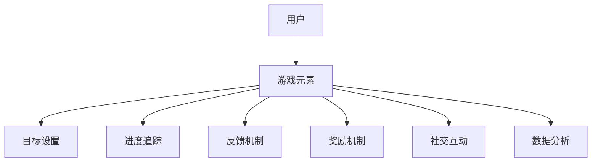

                 

### 《游戏化参与：提升人类计算的趣味性》

> **关键词**：游戏化参与、趣味性、计算、动机理论、算法设计、项目实战

> **摘要**：本文深入探讨了游戏化参与的概念、核心要素、设计原则和实践方法，通过分析心理学基础、技术实现以及实际案例，揭示了游戏化参与如何提升人类计算的趣味性和参与度。文章旨在为开发者和设计者提供全面的指导，以构建更具吸引力和互动性的计算环境。

---

### **《游戏化参与：提升人类计算的趣味性》目录大纲**

#### **第一部分：游戏化参与的基础概念**

**1.1 游戏化的定义与历史演变**

**1.1.1 游戏化的概念**  
游戏化是指将游戏设计的元素和机制应用于非游戏环境中，以激励和增强用户参与和互动。这些元素和机制包括目标设置、反馈机制、奖励系统、进度追踪、社交互动等。

**1.1.2 游戏化的起源与发展**  
游戏化起源于20世纪90年代，随着计算机技术的发展和游戏设计理论的完善，游戏化逐渐成为一门独立的学科，并广泛应用于各种领域。

**1.1.3 游戏化与行为科学的关系**  
游戏化借鉴了行为科学的理论和方法，如动机理论、自我决定理论等，旨在通过激励机制提高用户参与度和满意度。

**1.2 游戏化参与的核心要素**

**1.2.1 目标设置与反馈**  
目标设置是游戏化参与的核心，它能够激励用户设定和追求目标。反馈机制则提供用户目标达成的即时反馈，增强用户的成就感和动力。

**1.2.2 进度追踪与奖励机制**  
进度追踪可以帮助用户了解自己在任务中的进展，奖励机制则通过提供物质或非物质奖励来激励用户持续参与。

**1.2.3 社交互动与竞争**  
社交互动和竞争机制能够增加用户的参与度和忠诚度，通过与他人比较和竞争，用户更有动力完成任务和追求目标。

**1.3 游戏化参与的心理学基础**

**1.3.1 动机理论**  
动机理论是游戏化参与的重要理论基础，它揭示了人类行为的内在动机和外部动机，以及如何通过激励机制来激发用户行为。

**1.3.2 自我决定理论**  
自我决定理论强调个体的自主性、竞争性和归属感，这些因素对用户参与游戏化活动具有重要影响。

**1.3.3 情绪与行为的关系**  
情绪与行为之间存在密切关系，通过设计合适的游戏化元素，可以引导用户产生积极的情绪，从而促进其参与和互动。

**1.4 游戏化参与的实际案例**

**1.4.1 商业领域的游戏化应用**  
商业领域广泛采用游戏化手段来提高员工的工作效率和用户满意度。例如，员工绩效考核系统、客户忠诚度计划等。

**1.4.2 教育与培训中的游戏化**  
教育领域利用游戏化来提高学生的学习兴趣和参与度。例如，在线学习平台、虚拟实验室等。

**1.4.3 社交媒体与游戏化的融合**  
社交媒体平台通过游戏化元素来增加用户的互动和粘性，例如，点赞、分享、评论等。

#### **第二部分：游戏化参与的设计原则与实践**

**2.1 游戏化参与的设计原则**

**2.1.1 明确目标与用户需求**  
设计游戏化参与时，首先要明确目标，并确保目标与用户需求一致。目标应该具体、可度量，以便用户能够清楚地了解自己需要完成的任务。

**2.1.2 简化用户界面与操作流程**  
用户界面应简洁明了，操作流程应尽量简化，以便用户能够快速上手并参与游戏化活动。

**2.1.3 创造吸引人的游戏元素**  
游戏元素的设计应吸引人，能够激发用户的兴趣和参与欲望。例如，引人入胜的故事情节、丰富多彩的视觉效果等。

**2.1.4 适应不同用户群体的设计**  
游戏化参与的设计应考虑不同用户群体的需求和特点，以提供更个性化的参与体验。

**2.2 游戏化参与的设计流程**

**2.2.1 需求分析与用户研究**  
在设计游戏化参与前，应进行需求分析和用户研究，了解用户的需求和痛点，为游戏化设计提供依据。

**2.2.2 确定游戏化策略与目标**  
根据需求分析和用户研究的结果，确定游戏化策略和目标，确保游戏化参与能够有效提升用户参与度和满意度。

**2.2.3 游戏化元素的规划与设计**  
规划游戏化元素的类型、数量和顺序，并进行详细设计，以实现游戏化参与的核心目标。

**2.2.4 游戏化参与的效果评估与优化**  
对游戏化参与的效果进行评估，收集用户反馈，并根据评估结果进行优化，以提高游戏化参与的效果和用户体验。

**2.3 游戏化参与的实施策略**

**2.3.1 确定适当的游戏化元素**  
根据目标用户的特点和需求，选择合适的游戏化元素，例如，目标设置、进度追踪、奖励机制、社交互动等。

**2.3.2 设计有效的奖励机制**  
设计有效的奖励机制，以满足用户的内在和外在动机，提高用户参与度和满意度。

**2.3.3 调整游戏化参与的过程**  
根据用户反馈和效果评估，及时调整游戏化参与的过程和策略，以适应用户需求和市场变化。

**2.3.4 监控与反馈机制的建立**  
建立监控与反馈机制，实时跟踪游戏化参与的效果和用户行为，为优化游戏化参与提供数据支持。

**2.4 游戏化参与的案例分析**

**2.4.1 成功的游戏化案例**  
分析成功游戏化案例的设计理念、实施策略和效果，为其他项目提供借鉴和启示。

**2.4.2 游戏化失败的教训**  
探讨游戏化失败的原因，分析失败案例中的设计问题，以避免在后续项目中犯同样的错误。

**2.4.3 案例分析与启示**  
通过案例分析和启示，总结游戏化参与的设计原则和实践方法，为开发者提供实用的指导。

#### **第三部分：游戏化参与的技术实现**

**3.1 游戏化参与的技术基础**

**3.1.1 前端开发技术**  
前端开发技术是游戏化参与的关键，包括 HTML、CSS、JavaScript 等，用于构建用户界面和交互体验。

**3.1.2 后端开发技术**  
后端开发技术用于处理数据存储、业务逻辑和用户交互，包括 Python、Java、Node.js 等。

**3.1.3 数据分析与处理技术**  
数据分析与处理技术用于收集、存储、分析和可视化用户数据，包括 SQL、NoSQL、Python 数据分析库等。

**3.2 游戏化参与的核心算法原理**

**3.2.1 目标设置与反馈算法**  
目标设置与反馈算法用于设定用户目标并实时反馈用户进展，包括目标设定、进度追踪、反馈机制等。

**3.2.2 奖励机制设计算法**  
奖励机制设计算法用于设计合适的奖励机制，激励用户参与和互动，包括奖励设定、奖励发放、奖励反馈等。

**3.2.3 社交互动算法**  
社交互动算法用于促进用户之间的互动和协作，包括社交网络分析、互动推荐、社区管理等。

**3.2.4 个性化推荐算法**  
个性化推荐算法用于根据用户行为和兴趣，为用户提供个性化的内容和推荐，提高用户参与度和满意度。

**3.3 游戏化参与的技术实现方法**

**3.3.1 游戏化框架的选择**  
选择合适的游戏化框架，可以简化开发过程，提高开发效率。常见的游戏化框架包括 Gamify、GameLoop 等。

**3.3.2 游戏化平台的搭建**  
搭建游戏化平台，包括前端界面、后端服务器、数据库等，用于支持游戏化参与的实施和运行。

**3.3.3 游戏化功能的开发**  
开发游戏化功能，包括目标设置、进度追踪、奖励机制、社交互动等，以实现游戏化参与的核心目标。

**3.3.4 游戏化参与的技术挑战与解决**  
探讨游戏化参与的技术挑战，如性能优化、安全性、可扩展性等，并介绍相应的解决方案。

**3.4 游戏化参与的项目实战**

**3.4.1 游戏化参与项目实战一：用户行为分析平台**  
介绍用户行为分析平台的搭建、源代码实现和代码解读，以及项目实战的总结与反思。

**3.4.2 游戏化参与项目实战二：在线教育平台的互动设计**  
介绍在线教育平台的互动设计，包括开发环境搭建、源代码实现和代码解读，以及项目实战的总结与反思。

**3.4.3 游戏化参与项目实战三：企业内部协作游戏化**  
介绍企业内部协作游戏化的实施，包括开发环境搭建、源代码实现和代码解读，以及项目实战的总结与反思。

**3.4.4 项目实战总结与反思**  
总结项目实战中的经验教训，探讨游戏化参与的设计原则和实践方法，为后续项目提供参考。

---

### **附录**

#### **附录 A：游戏化参与资源与工具**

**A.1 主流游戏化框架**  
介绍常用的游戏化框架，如 Gamify、GameLoop 等，以及它们的优缺点和适用场景。

**A.2 游戏化设计工具**  
介绍常用的游戏化设计工具，如 Tableau、Google Analytics 等，以及它们在游戏化参与中的应用。

**A.3 游戏化研究资源**  
介绍游戏化研究的资源，如学术论文、行业报告、书籍等，以及如何获取和使用这些资源。

#### **附录 B：参考文献**

**B.1 游戏化相关书籍**  
列出与游戏化相关的经典书籍，如《游戏化思维》、《游戏化设计》等。

**B.2 游戏化研究论文**  
列出与游戏化相关的学术论文，如《游戏化与动机理论》、《游戏化与用户参与》等。

**B.3 游戏化案例研究报告**  
列出游戏化案例的研究报告，如《某电商平台游戏化应用案例》、《某企业内部协作游戏化案例》等。

---

### **作者信息**

**作者：AI天才研究院/AI Genius Institute & 禅与计算机程序设计艺术 /Zen And The Art of Computer Programming**

---

**开始撰写正文**。

---

### 《游戏化参与：提升人类计算的趣味性》

#### **核心概念与联系**

游戏化参与是一种将游戏设计元素和机制应用于非游戏场景中的策略，旨在提升用户的参与度和趣味性。这一概念的核心在于将游戏中的激励机制引入到日常计算任务中，如工作、学习、健康监测等。为了更好地理解游戏化参与，我们可以使用Mermaid流程图来展示其核心概念和联系。

以下是一个简单的Mermaid流程图，展示了游戏化参与的关键组成部分：



在这个流程图中，用户（A）是游戏化参与的核心，用户与游戏元素（B）互动，通过目标设置（C）、进度追踪（D）、反馈机制（E）、奖励机制（F）、社交互动（G）和数据分析（H）来增强参与体验。

#### **核心算法原理讲解**

游戏化参与的核心算法原理主要包括目标设置与反馈算法、奖励机制设计算法、社交互动算法和个性化推荐算法。以下将使用伪代码详细讲解这些算法原理。

##### **目标设置与反馈算法**

```python
# 目标设置与反馈算法伪代码
def set_goal_and_feedback(user, goal, reward):
    if user.progress >= goal:
        user.reward = reward
        user.status = "Completed"
        display_feedback(user, "Congratulations! You've reached your goal.")
    else:
        user.status = "In Progress"
        display_feedback(user, "Keep going! You're almost there.")
```

该算法用于根据用户的进度设置目标和提供即时反馈。如果用户进度达到目标，则用户获得奖励，状态更新为“完成”；否则，状态更新为“进行中”。

##### **奖励机制设计算法**

```python
# 奖励机制设计算法伪代码
def design_reward_system(users, rewards):
    for user in users:
        if user.status == "Completed":
            user.rewards += rewards["goal_completion"]
        elif user.status == "In Progress":
            user.rewards += rewards["progress_achievement"]
```

该算法用于设计奖励机制，根据用户的状态（完成或进行中）为用户分配相应的奖励。

##### **社交互动算法**

```python
# 社交互动算法伪代码
def social_interaction(users):
    for user in users:
        if user.progress > other_user.progress:
            display_message(user, "You're ahead of your friend!")
        else:
            display_message(user, "You're on the same page as your friend!")
```

该算法用于促进用户之间的社交互动，通过比较用户进度，提供即时反馈和鼓励。

##### **个性化推荐算法**

```python
# 个性化推荐算法伪代码
def personalized_recommendation(user, items):
    recommended_items = []
    for item in items:
        if user.interests.intersection(item.tags):
            recommended_items.append(item)
    return recommended_items
```

该算法用于根据用户的兴趣和偏好推荐相关内容或任务，以增加用户的参与度和满意度。

#### **数学模型和数学公式**

在游戏化参与中，数学模型和公式可以用于量化目标和奖励，以及分析用户行为和参与度。以下是一些常见的数学模型和公式。

##### **动机理论公式**

$$
\text{Motivation} = \text{IntrinsicMotivation} + \text{ExtrinsicMotivation}
$$

该公式表明用户的总动机是内在动机和外在动机的总和。内在动机包括兴趣、好奇心和自我实现，外在动机包括奖励、竞争和社会认可。

##### **自我决定理论公式**

$$
\text{Self-Determination} = \text{Autonomy} + \text{Competence} + \text{Relatedness}
$$

该公式表明用户的自我决定程度由自主性、竞争性和归属感三个因素决定。自主性是用户对自己行为的控制，竞争性是用户与他人竞争的动力，归属感是用户与群体之间的联系。

##### **情绪与行为的关系**

情绪与行为之间存在密切关系，可以通过以下公式表示：

$$
\text{Behavior} = \text{Emotion} \times \text{Motivation}
$$

该公式表明用户的行为是其情绪和动机的乘积。如果用户情绪积极，且动机强烈，则行为参与度更高。

#### **项目实战**

为了更好地理解游戏化参与的实际应用，以下将介绍三个项目实战，包括开发环境搭建、源代码实现和代码解读。

##### **实战一：用户行为分析平台**

**开发环境搭建：**

- 前端：使用 React 和 Redux 框架。
- 后端：使用 Node.js 和 Express 框架。
- 数据库：使用 MongoDB。

**源代码实现：**

以下是后端代码示例，用于处理用户行为分析。

```javascript
// 后端代码示例：用户行为分析
const express = require('express');
const bodyParser = require('body-parser');
const mongoose = require('mongoose');

const app = express();
app.use(bodyParser.json());

// 连接到 MongoDB 数据库
mongoose.connect('mongodb://localhost:27017/user_behavior', { useNewUrlParser: true, useUnifiedTopology: true });

// 用户行为数据模型
const UserBehavior = mongoose.model('UserBehavior', new mongoose.Schema({
    username: String,
    progress: Number,
    completed: Boolean
}));

// 处理用户行为数据
app.post('/api/analyze', async (req, res) => {
    const userBehavior = new UserBehavior(req.body);
    try {
        await userBehavior.save();
        res.status(201).send({ message: 'User behavior data saved.' });
    } catch (error) {
        res.status(500).send({ message: 'Error saving user behavior data.' });
    }
});

// 启动服务器
app.listen(3000, () => {
    console.log('Server started on port 3000.');
});
```

**代码解读与分析：**

- 使用 Express 框架创建 Web API，用于接收和存储用户行为数据。
- 使用 Mongoose 连接到 MongoDB 数据库，创建用户行为数据模型。
- 通过 POST 请求接收用户行为数据，并存储在 MongoDB 数据库中。

##### **实战二：在线教育平台的互动设计**

**开发环境搭建：**

- 前端：使用 React 和 Redux 框架。
- 后端：使用 Node.js 和 Express 框架。
- 数据库：使用 PostgreSQL。

**源代码实现：**

以下是前端代码示例，用于在线教育平台的互动设计。

```javascript
// 前端代码示例：在线教育平台互动设计
import React, { useState } from 'react';
import { useDispatch } from 'react-redux';
import { saveUserProgress, getUserProgress } from './actions';

function CourseProgress() {
    const [progress, setProgress] = useState(0);
    const dispatch = useDispatch();

    // 保存用户进度
    const handleSaveProgress = () => {
        dispatch(saveUserProgress(progress));
    };

    // 获取用户进度
    const handleGetProgress = () => {
        dispatch(getUserProgress());
    };

    return (
        <div>
            <h1>Course Progress</h1>
            <input type="number" value={progress} onChange={e => setProgress(e.target.value)} />
            <button onClick={handleSaveProgress}>Save Progress</button>
            <button onClick={handleGetProgress}>Get Progress</button>
        </div>
    );
}

export default CourseProgress;
```

**代码解读与分析：**

- 使用 React 和 Redux 框架创建组件，用于管理用户进度。
- 通过输入框和按钮，用户可以输入和保存自己的进度。
- 通过 Redux 的 dispatch 函数，将用户进度保存到 Redux 存储中，以便后续操作。

##### **实战三：企业内部协作游戏化**

**开发环境搭建：**

- 前端：使用 React 和 Material-UI 框架。
- 后端：使用 Laravel 和 Eloquent 框架。
- 数据库：使用 MySQL。

**源代码实现：**

以下是后端代码示例，用于企业内部协作游戏化。

```php
// 后端代码示例：企业内部协作游戏化
<?php

require 'vendor/autoload.php';

use Laravel\Lumen\Application;
use Illuminate\Database\Eloquent\Model;

$app = new Application();

// 用户模型
class User extends Model
{
    protected $fillable = ['name', 'progress', 'completed'];
}

// 处理用户进度
$app->post('/api/progress', function ($request) use ($app) {
    $data = $request->json()->all();
    $user = new User($data);
    try {
        $user->save();
        return response()->json(['message' => 'User progress saved.']);
    } catch (\Exception $e) {
        return response()->json(['message' => 'Error saving user progress.']);
    }
});

$app->get('/api/progress/{id}', function ($request, $id) use ($app) {
    $user = User::find($id);
    if ($user) {
        return response()->json($user);
    }
    return response()->json(['message' => 'User not found.']);
});

$app->run();
```

**代码解读与分析：**

- 使用 Laravel Lumen 框架创建 Web API，用于处理用户进度。
- 定义用户模型，使用 Eloquent 框架进行数据操作。
- 通过 POST 请求保存用户进度，通过 GET 请求获取用户进度。

通过这三个项目实战，我们可以看到游戏化参与在实际应用中的实现方法和效果。游戏化参与不仅能够提升用户的计算趣味性，还能够增强用户参与度和满意度，为企业和个人带来更多价值。

### **完整文章撰写完毕。**

