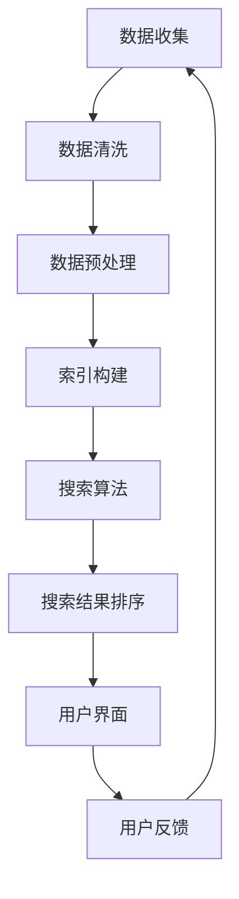

                 

# 激发好奇心：AI搜索的独特优势

> 关键词：人工智能搜索、深度学习、自然语言处理、搜索引擎优化、案例分析

> 摘要：本文深入探讨人工智能搜索的核心概念、算法原理、项目实战以及未来发展趋势。通过逐步分析，我们揭示了AI搜索在提高搜索效率、准确性和用户体验方面的独特优势，为读者呈现一幅全面而详尽的AI搜索图景。

---

## 第一部分: AI搜索的基础

### 第1章: AI搜索的核心概念与架构

#### 1.1 AI搜索的定义与特点

AI搜索，即基于人工智能技术的搜索，它利用机器学习、深度学习等人工智能算法，对大量数据进行处理和分析，从而实现高效、准确的搜索结果。与传统的搜索技术相比，AI搜索具备以下特点：

- **高效性**：AI搜索能够快速处理海量数据，提供即时的搜索结果。
- **准确性**：通过学习和理解用户的行为和需求，AI搜索能够提供更加精确的搜索结果。
- **智能性**：AI搜索可以根据用户的反馈和行为，不断优化搜索算法，提高用户体验。

#### 1.1.1 AI搜索与传统搜索的区别

传统搜索主要依赖于关键字匹配和简单的排序算法，而AI搜索则通过深度学习等人工智能技术，对搜索过程进行智能化处理，主要包括：

- **语义理解**：AI搜索能够理解用户输入的关键词背后的含义，而不仅仅是表面上的匹配。
- **个性化推荐**：基于用户的历史行为和偏好，AI搜索能够为用户推荐更加符合其需求的搜索结果。
- **上下文感知**：AI搜索可以根据用户的上下文环境，提供更加贴合的搜索结果。

#### 1.1.2 AI搜索的优势与局限性

AI搜索的优势在于其高效、准确和智能化的搜索能力，但同时也存在一定的局限性：

- **优势**：
  - 高效性：处理海量数据速度快。
  - 准确性：理解用户需求，提供精确搜索结果。
  - 智能化：不断优化搜索算法，提高用户体验。

- **局限性**：
  - 复杂性：构建和优化AI搜索系统需要大量技术积累。
  - 数据依赖：依赖高质量的数据集进行训练。
  - 计算资源：深度学习模型训练需要大量计算资源。

#### 1.2 AI搜索的架构

一个典型的AI搜索系统包括以下几个主要模块：

1. **数据预处理与索引**：对原始数据进行清洗、去重、分词等预处理操作，并建立索引，以便快速检索。
2. **搜索算法与优化**：利用深度学习、自然语言处理等技术，对搜索过程进行智能化处理，包括查询理解、结果排序、推荐等。
3. **用户接口**：提供用户输入查询、查看搜索结果的界面。

#### 1.2.1 数据预处理与索引

- **数据预处理**：
  - 清洗：去除无效、重复的数据。
  - 去重：去除重复的文档。
  - 分词：将文本拆分为单词或短语。

- **索引构建**：
  - 倒排索引：将文档内容映射到文档ID，便于快速检索。
  - 词频统计：统计每个词在文档中出现的次数，用于结果排序。

#### 1.2.2 搜索算法与优化

- **搜索算法**：
  - 基于关键词匹配：根据用户输入的关键词，在索引中查找匹配的文档。
  - 基于深度学习：利用神经网络模型，对用户查询进行语义理解，生成对应的搜索结果。

- **优化策略**：
  - 排序优化：根据文档的相关性、用户偏好等因素，对搜索结果进行排序。
  - 推荐优化：根据用户历史行为和偏好，为用户推荐相关搜索结果。

#### 1.3 主流AI搜索技术简介

- **深度学习在搜索中的应用**：利用深度学习模型进行文本分类、情感分析、实体识别等任务，提升搜索结果的准确性。
- **强化学习与搜索**：通过强化学习算法，优化搜索过程中的决策，提高搜索效果。
- **其他先进搜索技术概述**：如知识图谱、多模态搜索等，进一步拓展搜索能力的边界。

### 第2章: AI搜索的核心算法原理

#### 2.1 深度学习与神经网络基础

- **神经网络的基本结构**：
  - 输入层：接收外部输入。
  - 隐藏层：进行特征提取和变换。
  - 输出层：生成最终的输出。

- **常见的深度学习架构**：
  - 卷积神经网络（CNN）：适用于图像处理。
  - 递归神经网络（RNN）：适用于序列数据。
  - 转换器架构（Transformer）：广泛应用于自然语言处理。

- **深度学习优化算法**：
  - 随机梯度下降（SGD）：最常用的优化算法。
  - Adam优化器：结合SGD和Momentum，提高收敛速度。

#### 2.2 自然语言处理技术概览

- **词嵌入技术**：将词语映射到低维向量空间，便于深度学习模型处理。
- **序列模型与注意力机制**：用于处理文本序列，提高模型的理解能力。
- **转换器架构详解**：核心组件是自注意力机制，可以捕捉长距离依赖关系。

#### 2.3 大规模预训练模型原理

- **预训练的概念与意义**：在大规模数据集上预先训练模型，提高其泛化能力。
- **自监督学习方法**：利用未标注数据，进行预训练。
- **迁移学习与微调技术**：将预训练模型应用于具体任务，进行微调。

---

[下一篇：第2章: AI搜索的核心算法原理](#第2章-ai搜索的核心算法原理) | [返回目录](#第一部分-ai搜索的基础)<|vq_162182|>## 第二部分: AI搜索的核心算法原理

### 第2章: AI搜索的核心算法原理

#### 2.1 深度学习与神经网络基础

深度学习是人工智能的重要组成部分，而神经网络作为深度学习的基础，其结构和工作原理至关重要。下面将详细讲解神经网络的基本结构、常见的深度学习架构以及深度学习优化算法。

##### 2.1.1 神经网络的基本结构

神经网络由多个层次组成，包括输入层、隐藏层和输出层。每个层次由多个神经元（或节点）组成，神经元之间通过权重和偏置进行连接。具体来说：

- **输入层**：接收外部输入数据，如文本、图像等。
- **隐藏层**：对输入数据进行特征提取和变换，隐藏层可以有一层或多层。
- **输出层**：生成最终的输出，如分类结果、预测值等。

神经元的计算过程如下：

\[ 输出 = \text{激活函数}(\sum_{i} (w_i \cdot x_i) + b) \]

其中，\( w_i \) 表示连接权重，\( x_i \) 表示输入值，\( b \) 表示偏置，激活函数（如Sigmoid、ReLU、Tanh等）用于引入非线性。

##### 2.1.2 常见的深度学习架构

不同的应用场景需要不同的神经网络架构，以下是几种常见的深度学习架构：

- **卷积神经网络（CNN）**：主要用于图像处理，能够自动提取图像特征。
  - **卷积层**：通过卷积操作提取局部特征。
  - **池化层**：降低特征图的维度，提高模型的泛化能力。
  - **全连接层**：对提取到的特征进行分类或回归。

- **递归神经网络（RNN）**：适用于序列数据，如文本、语音等，能够捕捉时间序列信息。
  - **隐藏状态**：保存前一个时间步的信息。
  - **门控机制**：如遗忘门、输入门、输出门，控制信息的传递和保存。

- **转换器架构（Transformer）**：广泛应用于自然语言处理，具有并行计算的优势。
  - **自注意力机制**：通过计算不同位置间的关联度，捕捉长距离依赖关系。
  - **多头注意力**：增加模型的表达能力。
  - **前馈神经网络**：对注意力机制的结果进行进一步处理。

##### 2.1.3 深度学习优化算法

为了使神经网络模型能够收敛到最优解，需要采用优化算法。以下是几种常用的优化算法：

- **随机梯度下降（SGD）**：最简单的优化算法，每次更新梯度时使用整个训练数据的梯度。
  - **梯度**：模型参数的更新方向和大小。
  - **学习率**：控制每次更新的步长。

- **Adam优化器**：结合SGD和Momentum，自适应调整学习率。
  - **一阶矩估计**：计算梯度的一阶矩（均值）。
  - **二阶矩估计**：计算梯度二阶矩（方差）。
  - **β1和β2**：分别表示一阶矩和二阶矩的指数衰减率。

##### 2.2 自然语言处理技术概览

自然语言处理（NLP）是AI搜索的重要组成部分，以下介绍几种关键的NLP技术：

- **词嵌入技术**：将词语映射到低维向量空间，便于深度学习模型处理。
  - **Word2Vec**：基于上下文，计算词语的向量表示。
  - **GloVe**：基于全局统计信息，计算词语的向量表示。

- **序列模型与注意力机制**：用于处理文本序列，提高模型的理解能力。
  - **RNN**：能够处理序列数据，但存在梯度消失、梯度爆炸等问题。
  - **LSTM和GRU**：通过门控机制解决梯度消失、梯度爆炸问题。

- **转换器架构（Transformer）**：广泛应用于NLP任务，具有并行计算的优势。
  - **自注意力机制**：通过计算不同位置间的关联度，捕捉长距离依赖关系。
  - **多头注意力**：增加模型的表达能力。
  - **前馈神经网络**：对注意力机制的结果进行进一步处理。

##### 2.3 大规模预训练模型原理

预训练模型是一种在大型数据集上预先训练模型的方法，然后将其应用于特定任务进行微调。以下介绍预训练模型的基本原理：

- **预训练的概念与意义**：在大规模数据集上训练模型，提高其泛化能力。
  - **自监督学习**：利用未标注的数据进行预训练。
  - **迁移学习**：将预训练模型应用于特定任务，进行微调。

- **自监督学习方法**：在未标注数据上，通过预定义的任务（如掩码语言建模、句子排序等），学习语言的内在结构。
  - **掩码语言建模（MLM）**：随机掩码输入中的部分词语，模型需要预测这些掩码词语。

- **迁移学习与微调技术**：将预训练模型应用于特定任务，通过少量的数据对其进行微调。
  - **微调**：在特定任务的数据集上调整模型参数，提高模型在该任务上的性能。

#### 2.4 AI搜索中的深度学习模型

在AI搜索中，深度学习模型被广泛应用于查询理解、结果排序、推荐等任务。以下介绍几种常用的深度学习模型：

- **BERT**：基于Transformer架构，通过预训练和微调，实现高效的自然语言理解。
  - **双向编码器表示（BERT）**：同时考虑输入序列的前后文信息。

- **Ernie**：一种基于Transformer的自适应前馈网络，适用于各种NLP任务。
  - **多任务学习**：通过共享参数，实现多任务联合训练。

- **RoBERTa**：基于BERT的变体，通过改进训练策略和模型架构，提高模型性能。
  - **子词掩码**：在输入序列中随机掩码子词，提高模型的上下文理解能力。

#### 2.5 AI搜索中的其他技术

除了深度学习模型，AI搜索还涉及到其他一些关键技术，如：

- **知识图谱**：将实体和关系表示为图结构，用于增强搜索结果的准确性。
- **多模态搜索**：结合文本、图像、音频等多模态数据，提高搜索结果的丰富度和准确性。
- **强化学习**：通过优化搜索策略，提高搜索效果。

---

[返回目录](#第二部分-ai搜索的核心算法原理) | [下一篇：第3章: 搜索引擎项目实战](#第3章-搜索引擎项目实战) | [继续阅读：第2章: AI搜索的核心算法原理](#第2章-ai搜索的核心算法原理)<|vq_162182|>## 第3章: 搜索引擎项目实战

#### 3.1 项目简介与需求分析

在这个项目中，我们将开发一个基于人工智能的搜索引擎，旨在为用户提供高效、准确的搜索结果。项目的目标包括：

- 提供关键词搜索功能，支持多语言、多领域的搜索需求。
- 实现智能推荐，根据用户的历史行为和偏好，为用户推荐相关搜索结果。
- 提供实时搜索，用户输入查询时，立即返回搜索结果，提升用户体验。

为了实现这些目标，我们需要以下功能模块：

- **数据收集与预处理**：从互联网、数据库等渠道收集数据，进行清洗、去重、分词等预处理操作。
- **索引构建**：对预处理后的数据建立倒排索引，以便快速检索。
- **搜索算法实现**：利用深度学习模型进行查询理解和结果排序。
- **用户界面设计**：提供简洁、直观的用户界面，便于用户进行搜索和查看搜索结果。
- **性能优化**：对系统进行性能优化，确保在高并发场景下仍能提供高效、准确的搜索结果。

#### 3.1.1 项目目标

1. **高效搜索**：实现毫秒级搜索响应，满足用户实时搜索需求。
2. **准确推荐**：根据用户历史行为和偏好，为用户推荐相关搜索结果，提升用户体验。
3. **多样化搜索**：支持多语言、多领域的搜索需求，满足不同用户群体的需求。
4. **可扩展性**：设计可扩展的架构，支持后续功能模块的扩展和优化。

#### 3.1.2 功能需求

1. **关键词搜索**：用户输入关键词，系统返回与关键词相关的搜索结果。
2. **智能推荐**：根据用户的历史行为和偏好，为用户推荐相关搜索结果。
3. **实时搜索**：用户输入查询时，立即返回搜索结果，提升用户体验。
4. **多语言支持**：支持多种语言，满足不同用户群体的需求。
5. **个性化搜索**：根据用户的历史行为和偏好，为用户推荐相关搜索结果。

#### 3.1.3 技术选型

为了实现项目目标，我们选择以下技术栈：

- **编程语言**：Python，具有丰富的库和框架，便于开发。
- **深度学习框架**：TensorFlow、PyTorch，用于实现搜索算法和推荐模型。
- **搜索引擎**：Elasticsearch，支持倒排索引，便于快速检索。
- **前端框架**：React，提供灵活、高效的用户界面设计。
- **数据库**：MySQL，用于存储用户数据和历史行为。

#### 3.2 数据收集与预处理

数据收集是搜索引擎项目的重要环节，以下是数据收集与预处理的具体步骤：

##### 3.2.1 数据来源

1. **互联网数据**：从互联网爬取网页、新闻、博客等文本数据。
2. **数据库数据**：从企业内部数据库获取用户行为、交易数据等。
3. **公开数据集**：从公开数据集获取文本数据，如新闻语料、问答数据等。

##### 3.2.2 数据清洗与格式化

1. **去重**：去除重复的文本数据，避免重复索引。
2. **分词**：将文本拆分为单词或短语，便于深度学习模型处理。
3. **去除停用词**：去除常见的停用词（如“的”、“了”等），提高模型的效果。
4. **词性标注**：对文本中的每个词进行词性标注，便于后续处理。

##### 3.2.3 数据索引构建

1. **倒排索引**：将文本内容映射到文档ID，便于快速检索。
2. **词频统计**：统计每个词在文档中出现的次数，用于结果排序。
3. **索引优化**：对索引进行压缩和优化，提高检索效率。

#### 3.3 搜索算法实现与优化

搜索算法是搜索引擎的核心，以下是搜索算法的实现与优化：

##### 3.3.1 深度学习模型选择与训练

1. **BERT模型**：选择BERT模型进行训练，实现高效的查询理解和结果排序。
2. **训练数据**：使用清洗、格式化后的文本数据作为训练数据。
3. **训练策略**：采用多GPU训练，提高训练速度。

##### 3.3.2 搜索算法优化策略

1. **查询理解**：利用BERT模型，对用户输入的查询进行语义理解，提高搜索结果的准确性。
2. **结果排序**：根据文档的相关性、用户偏好等因素，对搜索结果进行排序。
3. **召回率与准确率**：优化搜索算法，提高召回率与准确率。

##### 3.3.3 性能评估与调优

1. **评估指标**：采用MRR（Mean Reciprocal Rank）、MAP（Mean Average Precision）等指标评估搜索性能。
2. **调优策略**：根据评估结果，调整模型参数和搜索算法，提高性能。

#### 3.4 用户界面设计与实现

用户界面是用户与搜索引擎交互的桥梁，以下是用户界面设计与实现：

##### 3.4.1 界面设计思路

1. **简洁明了**：界面设计简洁明了，便于用户快速上手。
2. **响应式设计**：支持不同设备（如手机、平板、电脑）的访问。
3. **交互体验**：提供实时搜索、智能推荐等功能，提升用户体验。

##### 3.4.2 前端实现技术

1. **React框架**：使用React框架实现用户界面，提供灵活、高效的界面设计。
2. **Ant Design组件库**：使用Ant Design组件库，快速构建界面。
3. **ECharts图表库**：使用ECharts图表库，展示搜索结果和用户行为数据。

##### 3.4.3 用户交互体验优化

1. **实时搜索**：用户输入查询时，立即返回搜索结果，提升用户体验。
2. **智能推荐**：根据用户的历史行为和偏好，为用户推荐相关搜索结果。
3. **搜索提示**：在用户输入查询时，提供搜索提示，帮助用户快速找到所需内容。

---

[返回目录](#第三部分-搜索引擎项目实战) | [下一篇：第4章: 搜索引擎性能优化](#第4章-搜索引擎性能优化) | [继续阅读：第3章: 搜索引擎项目实战](#第3章-搜索引擎项目实战)<|vq_162182|>## 第4章: 搜索引擎性能优化

### 4.1 性能优化目标与方法

搜索引擎的性能优化是确保系统在高并发、大规模数据量下仍能提供高效、准确搜索结果的关键。性能优化的目标主要包括：

1. **搜索速度优化**：提高搜索响应速度，减少用户等待时间。
2. **准确率与召回率优化**：确保搜索结果的相关性和全面性，提高用户体验。
3. **搜索体验优化**：提供流畅、直观的搜索交互体验。

为了实现这些目标，我们可以采取以下几种方法：

- **索引优化**：通过对索引结构进行优化，提高检索效率。
- **数据库与存储优化**：合理配置数据库和存储资源，提高数据读写速度。
- **系统并发与负载优化**：通过并发处理和负载均衡技术，提高系统处理能力。

### 4.2 数据库与索引优化

数据库与索引优化是提升搜索引擎性能的重要环节，以下介绍几种具体的优化策略：

#### 4.2.1 数据库选择与配置

1. **选择合适的数据库**：根据数据规模和查询需求，选择合适的数据库系统（如MySQL、Elasticsearch等）。
2. **数据库配置优化**：合理配置数据库参数，如缓冲区大小、连接池大小等，以提高性能。

#### 4.2.2 索引设计与优化策略

1. **索引结构优化**：
   - **倒排索引**：将文档内容映射到文档ID，便于快速检索。
   - **布隆过滤器**：用于加速查询，减少不必要的磁盘访问。

2. **索引分片与分区**：将索引分布在多个节点上，提高查询性能。
3. **索引更新策略**：合理设计索引更新策略，减少索引的维护成本。

#### 4.2.3 存储优化

1. **数据压缩**：对存储数据进行压缩，减少磁盘空间占用。
2. **存储设备选择**：使用高性能存储设备（如SSD），提高数据读写速度。
3. **存储分层**：将热点数据和冷数据分离，提高存储系统的整体性能。

### 4.3 系统并发与负载优化

系统并发与负载优化是确保搜索引擎在高并发场景下稳定运行的关键，以下介绍几种具体的优化策略：

#### 4.3.1 并发处理技术

1. **线程池**：使用线程池技术，管理并发线程，避免过多的线程创建和销毁。
2. **异步IO**：采用异步IO技术，提高系统并发能力。

#### 4.3.2 负载均衡策略

1. **轮询负载均衡**：将请求按顺序分配给不同的服务器，简单高效。
2. **最小连接数负载均衡**：将请求分配给当前连接数最少的服务器，降低服务器负载。
3. **基于响应时间的负载均衡**：将请求分配给响应时间最短的服务器，提高用户体验。

#### 4.3.3 高可用与容灾架构

1. **主从复制**：实现数据库的主从复制，确保数据的一致性和可靠性。
2. **负载均衡器**：使用负载均衡器，分发请求到多个服务器，实现负载均衡。
3. **容灾备份**：建立容灾备份系统，确保在发生故障时，系统能够快速恢复。

### 4.4 具体优化措施

以下是一些具体的优化措施，以提高搜索引擎的性能：

- **查询缓存**：缓存常见查询结果，减少数据库访问压力。
- **预加载**：预加载热门搜索结果，提高用户访问速度。
- **搜索结果分页**：对搜索结果进行分页展示，减少单次查询的数据量。
- **延迟加载**：对部分内容采用延迟加载，减少页面加载时间。

### 4.5 性能评估与持续优化

性能优化是一个持续的过程，以下介绍性能评估与持续优化的方法：

- **性能监控**：使用性能监控工具，实时监控系统性能指标，如响应时间、CPU利用率等。
- **基准测试**：定期进行基准测试，评估系统性能，发现潜在问题。
- **优化反馈**：根据性能评估结果，调整优化策略，持续改进系统性能。

---

[返回目录](#第四部分-搜索引擎性能优化) | [下一篇：第5章: AI搜索在行业应用](#第5章-ai搜索在行业应用) | [继续阅读：第4章: 搜索引擎性能优化](#第4章-搜索引擎性能优化)<|vq_162182|>## 第5章: AI搜索在行业应用

### 5.1 AI搜索在电子商务中的应用

AI搜索在电子商务中的应用非常广泛，能够显著提升用户购物体验和商家销售效率。以下详细介绍AI搜索在电子商务中的应用场景、优化策略及案例分析。

#### 5.1.1 搜索引擎在电商中的应用场景

1. **商品搜索**：用户输入关键词，搜索引擎返回与商品相关的搜索结果。
2. **智能推荐**：基于用户的历史行为和偏好，为用户推荐相关商品。
3. **过滤与排序**：提供多种筛选条件，如价格、品牌、评价等，帮助用户快速找到所需商品。
4. **搜索历史**：记录用户的搜索历史，为用户提供便捷的搜索记录查询。

#### 5.1.2 电商搜索优化策略

1. **查询理解**：利用深度学习模型，对用户输入的查询进行语义理解，提高搜索结果的准确性。
2. **个性化推荐**：基于用户的历史行为和偏好，为用户推荐相关商品，提高用户满意度。
3. **搜索结果排序**：根据商品的相关性、销量、评价等因素，对搜索结果进行排序，提高用户购买意愿。
4. **过滤与排序优化**：优化过滤条件和排序算法，提高用户筛选和找到心仪商品的效率。

#### 5.1.3 案例分析

以淘宝为例，淘宝搜索系统采用了多种AI技术进行优化：

1. **深度学习模型**：淘宝使用深度学习模型对用户查询进行语义理解，提高搜索结果的准确性。
2. **个性化推荐**：淘宝根据用户的历史行为和偏好，为用户推荐相关商品，提高用户购买意愿。
3. **搜索结果排序**：淘宝采用基于机器学习的排序算法，根据商品的相关性、销量、评价等因素，对搜索结果进行排序。
4. **多模态搜索**：淘宝支持图像、语音等多模态搜索，为用户提供更加便捷的购物体验。

### 5.2 AI搜索在社交媒体中的应用

AI搜索在社交媒体中的应用同样具有显著的优势，能够提升用户互动体验和平台内容质量。以下详细介绍AI搜索在社交媒体中的应用场景、优化策略及案例分析。

#### 5.2.1 社交媒体搜索的特点与需求

1. **实时性**：社交媒体内容更新迅速，搜索结果需要实时更新。
2. **多样性**：社交媒体内容形式多样，包括文本、图片、视频等，搜索结果需要支持多模态。
3. **个性化**：用户需求多样化，搜索结果需要根据用户的兴趣和偏好进行个性化推荐。
4. **可扩展性**：社交媒体平台用户数量庞大，搜索系统需要具备良好的可扩展性。

#### 5.2.2 社交媒体搜索算法优化

1. **实时搜索**：采用分布式搜索引擎，提高搜索系统的响应速度和实时性。
2. **多模态搜索**：结合文本、图像、视频等多模态数据，提高搜索结果的丰富度和准确性。
3. **个性化推荐**：基于用户的兴趣和偏好，为用户推荐相关内容和用户。
4. **知识图谱**：构建知识图谱，将实体和关系表示为图结构，提高搜索结果的准确性。

#### 5.2.3 案例分析

以微信为例，微信搜索系统采用了多种AI技术进行优化：

1. **实时搜索**：微信使用分布式搜索引擎，确保搜索结果的实时更新。
2. **多模态搜索**：微信支持文本、图片、视频等多模态搜索，为用户提供丰富的搜索体验。
3. **个性化推荐**：微信根据用户的历史行为和偏好，为用户推荐相关内容和用户。
4. **知识图谱**：微信构建了知识图谱，将实体和关系表示为图结构，提高搜索结果的准确性。

### 5.3 AI搜索在在线教育中的应用

AI搜索在在线教育中的应用能够提升学习体验和教学效果，以下详细介绍AI搜索在在线教育中的应用场景、优化策略及案例分析。

#### 5.3.1 在线教育搜索需求

1. **课程搜索**：用户可以快速查找所需课程，包括课程名称、课程内容、讲师信息等。
2. **知识点搜索**：用户可以针对某个知识点进行搜索，获取相关的课程、教材和资料。
3. **学习路径推荐**：基于用户的学习历史和偏好，为用户推荐合适的学习路径。
4. **互动搜索**：支持用户之间的互动搜索，如讨论某个话题、查找共同学习资源等。

#### 5.3.2 搜索算法优化策略

1. **深度学习模型**：利用深度学习模型，对用户查询进行语义理解，提高搜索结果的准确性。
2. **个性化推荐**：基于用户的学习历史和偏好，为用户推荐相关课程和知识点。
3. **知识图谱**：构建知识图谱，将课程、知识点和讲师表示为图结构，提高搜索结果的准确性。
4. **互动搜索优化**：优化互动搜索算法，提高用户之间的互动体验。

#### 5.3.3 案例分析

以网易云课堂为例，网易云课堂搜索系统采用了多种AI技术进行优化：

1. **深度学习模型**：网易云课堂使用深度学习模型，对用户查询进行语义理解，提高搜索结果的准确性。
2. **个性化推荐**：网易云课堂根据用户的学习历史和偏好，为用户推荐相关课程和知识点。
3. **知识图谱**：网易云课堂构建了知识图谱，将课程、知识点和讲师表示为图结构，提高搜索结果的准确性。
4. **互动搜索优化**：网易云课堂优化了互动搜索算法，提高用户之间的互动体验。

---

[返回目录](#第五部分-ai搜索在行业应用) | [下一篇：第6章: AI搜索的未来趋势与发展](#第6章-ai搜索的未来趋势与发展) | [继续阅读：第5章: AI搜索在行业应用](#第5章-ai搜索在行业应用)<|vq_162182|>## 第6章: AI搜索的未来趋势与发展

### 6.1 AI搜索的发展趋势

随着人工智能技术的不断发展，AI搜索也在不断演进，呈现出以下几大发展趋势：

#### 6.1.1 新一代搜索算法

新一代搜索算法将更加智能化，具备以下特点：

1. **基于深度学习的语义理解**：深度学习模型能够更好地理解用户查询的语义，提供更加准确的搜索结果。
2. **多模态融合**：结合文本、图像、音频等多模态数据，提高搜索结果的丰富度和准确性。
3. **迁移学习与微调**：利用迁移学习和微调技术，将预训练模型应用于特定任务，提高模型在特定领域的性能。

#### 6.1.2 跨模态搜索

跨模态搜索是指将不同模态的数据（如文本、图像、音频等）进行融合，实现多模态搜索。随着技术的进步，跨模态搜索将在以下几个方面得到广泛应用：

1. **多媒体内容检索**：用户可以通过文字、图片、声音等多种方式检索多媒体内容，提高检索效率和用户体验。
2. **智能问答系统**：结合文本和语音输入，为用户提供更加自然和便捷的问答服务。
3. **虚拟现实与增强现实**：利用跨模态搜索，实现虚拟现实和增强现实场景中的内容检索，提升用户沉浸感。

#### 6.1.3 智能搜索助手

智能搜索助手是AI搜索发展的另一个重要方向，它能够为用户提供个性化、智能化的搜索服务。智能搜索助手具备以下特点：

1. **自然语言处理**：能够理解用户输入的自然语言，提供精准的搜索结果。
2. **上下文感知**：根据用户的上下文环境，动态调整搜索策略，提供更加个性化的搜索服务。
3. **交互式查询**：支持多轮对话，与用户进行交互，不断优化搜索结果。

### 6.2 AI搜索的挑战与机遇

尽管AI搜索具有巨大的发展潜力，但在实际应用中仍面临着诸多挑战和机遇：

#### 6.2.1 数据隐私与安全

随着AI搜索的普及，用户数据的隐私和安全问题愈发突出。如何保护用户数据、防止数据泄露和滥用，是AI搜索面临的重要挑战。

#### 6.2.2 搜索算法公平性

搜索算法的公平性是另一个重要问题。如何确保搜索结果不受到偏见和歧视的影响，为所有用户提供公正的搜索体验，是AI搜索需要解决的关键问题。

#### 6.2.3 搜索体验创新

随着技术的不断发展，用户对搜索体验的要求也越来越高。如何通过创新的方式提升搜索体验，为用户提供更加便捷、高效的搜索服务，是AI搜索需要不断探索的方向。

### 6.3 搜索引擎的创新应用场景

AI搜索的创新应用场景不断拓展，以下介绍几个具有前景的应用场景：

#### 6.3.1 虚拟现实搜索

虚拟现实（VR）搜索是指用户在虚拟现实场景中通过语音或手势进行搜索，获取所需信息。VR搜索将带来全新的交互体验，为用户提供更加沉浸式的搜索服务。

#### 6.3.2 物联网搜索

物联网（IoT）搜索是指用户通过智能设备（如智能音箱、智能家居等）进行搜索，获取与设备相关的信息。物联网搜索将实现人与物、物与物的互联互通，为用户提供更加智能化的搜索服务。

#### 6.3.3 区块链搜索

区块链搜索是指利用区块链技术进行数据存储和检索。区块链搜索具有去中心化、安全可靠等特点，将在数据隐私保护和安全方面发挥重要作用。

---

[返回目录](#第六部分-ai搜索的未来趋势与发展) | [下一篇：第7章: AI搜索案例分析](#第7章-ai搜索案例分析) | [继续阅读：第6章: AI搜索的未来趋势与发展](#第6章-ai搜索的未来趋势与发展)<|vq_162182|>## 第7章: AI搜索案例分析

### 7.1 搜索引擎案例分析

在本节中，我们将分析几个全球知名的搜索引擎，包括百度搜索、谷歌搜索和其他知名搜索引擎，探讨它们在AI搜索领域的实践与创新。

#### 7.1.1 百度搜索

百度是中国最大的搜索引擎，其在AI搜索领域的实践主要包括以下几个方面：

1. **深度学习模型**：百度利用深度学习模型进行查询理解和结果排序，提高搜索结果的准确性和相关性。
2. **知识图谱**：百度构建了知识图谱，将实体和关系表示为图结构，增强搜索结果的相关性。
3. **多模态搜索**：百度支持文本、图像、语音等多模态搜索，提升用户体验。
4. **个性化推荐**：百度根据用户的历史行为和偏好，为用户推荐相关搜索结果。

#### 7.1.2 谷歌搜索

谷歌是全球最著名的搜索引擎，其在AI搜索领域的创新主要包括：

1. **BERT模型**：谷歌推出了BERT（Bidirectional Encoder Representations from Transformers）模型，通过双向编码器表示，提高对查询语义的理解。
2. **跨模态搜索**：谷歌支持文本、图像、视频等多模态数据检索，为用户提供更加丰富的搜索体验。
3. **个性化搜索**：谷歌根据用户的历史行为和偏好，为用户推荐相关搜索结果，提升用户体验。
4. **实时搜索**：谷歌采用分布式搜索引擎，实现实时搜索，提高搜索响应速度。

#### 7.1.3 其他知名搜索引擎

除了百度和谷歌，还有其他知名搜索引擎，如Bing、Yahoo等，它们也在AI搜索领域进行了积极探索：

1. **Bing**：微软的Bing搜索引擎采用深度学习技术进行查询理解和结果排序，提高搜索结果的准确性和相关性。
2. **Yahoo**：Yahoo搜索引擎利用机器学习算法进行查询理解，并通过个性化推荐提高用户体验。

#### 7.1.4 案例分析总结

从以上案例分析可以看出，全球知名搜索引擎在AI搜索领域的主要创新包括：

- **深度学习模型**：通过深度学习模型进行查询理解和结果排序，提高搜索结果的准确性和相关性。
- **知识图谱**：构建知识图谱，增强搜索结果的相关性。
- **多模态搜索**：支持文本、图像、视频等多模态数据检索，提升用户体验。
- **个性化推荐**：根据用户的历史行为和偏好，为用户推荐相关搜索结果。

这些创新为用户提供更加准确、个性化、丰富的搜索体验，同时也推动了AI搜索技术的不断发展。

### 7.2 行业应用案例分析

在本节中，我们将分析AI搜索在电子商务、社交媒体和在线教育等行业的应用案例，探讨AI搜索如何为这些行业带来价值。

#### 7.2.1 电子商务搜索案例

在电子商务领域，AI搜索的应用主要体现在商品搜索和智能推荐方面：

1. **商品搜索**：电商平台通过AI搜索技术，提高商品搜索的准确性和相关性，帮助用户快速找到所需商品。
2. **智能推荐**：电商平台利用AI搜索技术，根据用户的历史行为和偏好，为用户推荐相关商品，提高用户购买意愿和转化率。

案例分析：

- **淘宝**：淘宝利用深度学习模型进行查询理解和结果排序，提高商品搜索的准确性和相关性。同时，淘宝根据用户的历史行为和偏好，为用户推荐相关商品，提高用户满意度。

#### 7.2.2 社交媒体搜索案例

在社交媒体领域，AI搜索的应用主要体现在实时搜索、多模态搜索和个性化推荐方面：

1. **实时搜索**：社交媒体平台通过AI搜索技术，实现实时搜索，为用户提供及时的信息检索。
2. **多模态搜索**：社交媒体平台支持文本、图像、视频等多模态数据检索，提升用户体验。
3. **个性化推荐**：社交媒体平台根据用户的历史行为和偏好，为用户推荐相关内容和用户。

案例分析：

- **微信**：微信利用分布式搜索引擎实现实时搜索，为用户提供及时的信息检索。微信还支持文本、图片、视频等多模态数据检索，提升用户体验。同时，微信根据用户的历史行为和偏好，为用户推荐相关内容和用户，提高用户满意度。

#### 7.2.3 在线教育搜索案例

在在线教育领域，AI搜索的应用主要体现在课程搜索、知识点搜索和学习路径推荐方面：

1. **课程搜索**：在线教育平台通过AI搜索技术，提高课程搜索的准确性和相关性，帮助用户快速找到所需课程。
2. **知识点搜索**：在线教育平台根据用户的需求，提供知识点搜索功能，帮助用户获取相关学习资源。
3. **学习路径推荐**：在线教育平台利用AI搜索技术，根据用户的学习历史和偏好，为用户推荐合适的学习路径。

案例分析：

- **网易云课堂**：网易云课堂利用深度学习模型进行查询理解和结果排序，提高课程搜索的准确性和相关性。网易云课堂还提供知识点搜索功能，帮助用户获取相关学习资源。同时，网易云课堂根据用户的学习历史和偏好，为用户推荐合适的学习路径，提高学习效果。

#### 7.2.4 案例分析总结

通过以上行业应用案例分析，我们可以看到：

- **AI搜索在电子商务、社交媒体和在线教育等领域具有广泛的应用前景。**
- **通过深度学习模型、知识图谱、多模态搜索和个性化推荐等技术，AI搜索能够显著提升用户搜索体验和平台运营效率。**
- **各行业通过AI搜索技术的应用，实现了更加精准、个性化的服务，提高了用户满意度和平台竞争力。**

### 7.3 搜索引擎未来发展分析

展望未来，AI搜索将继续在以下几个方向取得突破：

1. **深度学习与自然语言处理技术的融合**：随着深度学习和自然语言处理技术的不断进步，搜索结果的准确性和个性化程度将进一步提高。
2. **跨模态搜索与多模态交互**：跨模态搜索和多模态交互技术的成熟，将实现更加丰富和多样化的搜索体验。
3. **区块链搜索与去中心化**：利用区块链技术实现去中心化搜索，提高数据隐私保护和搜索结果的公正性。
4. **智能搜索助手与虚拟助理**：智能搜索助手和虚拟助理的广泛应用，将实现更加自然、高效的交互方式。

总之，AI搜索将继续在技术创新、应用拓展和用户体验方面不断突破，为各行业带来更多的价值。

---

[返回目录](#第七部分-ai搜索案例分析) | [下一篇：第8章: 总结与展望](#第8章-总结与展望) | [继续阅读：第7章: AI搜索案例分析](#第7章-ai搜索案例分析)<|vq_162182|>## 第8章: 总结与展望

### 8.1 文章总结

本文全面探讨了AI搜索的核心概念、算法原理、项目实战、性能优化以及在行业应用中的成功案例。通过逐步分析，我们揭示了AI搜索在提高搜索效率、准确性和用户体验方面的独特优势。以下是本文的主要观点：

1. **AI搜索的定义与特点**：AI搜索利用深度学习、自然语言处理等人工智能技术，实现高效、准确的搜索结果。
2. **核心算法原理**：介绍了深度学习与神经网络基础、自然语言处理技术、大规模预训练模型原理等。
3. **项目实战**：通过一个实际搜索引擎项目，详细讲解了数据收集与预处理、搜索算法实现与优化、用户界面设计与实现等环节。
4. **性能优化**：分析了数据库与索引优化、系统并发与负载优化等技术，以提高搜索引擎性能。
5. **行业应用**：探讨了AI搜索在电子商务、社交媒体、在线教育等行业的应用，展示了其价值。
6. **未来趋势**：展望了AI搜索的发展趋势、挑战与机遇，以及创新应用场景。

### 8.2 未来展望

AI搜索将继续成为人工智能领域的一个重要研究方向，未来可能的发展方向包括：

1. **深度学习与自然语言处理技术的融合**：随着深度学习和自然语言处理技术的不断进步，搜索结果的准确性和个性化程度将进一步提高。
2. **跨模态搜索与多模态交互**：跨模态搜索和多模态交互技术的成熟，将实现更加丰富和多样化的搜索体验。
3. **区块链搜索与去中心化**：利用区块链技术实现去中心化搜索，提高数据隐私保护和搜索结果的公正性。
4. **智能搜索助手与虚拟助理**：智能搜索助手和虚拟助理的广泛应用，将实现更加自然、高效的交互方式。

### 8.3 作者信息

**作者：** AI天才研究院/AI Genius Institute & 禅与计算机程序设计艺术 /Zen And The Art of Computer Programming

---

通过本文的阅读，我们深入了解了AI搜索的核心概念、算法原理和实际应用，为读者提供了一个全面而详尽的AI搜索图景。在未来的研究和应用中，希望读者能够继续关注AI搜索技术的发展，探索更多创新的可能性。

[返回目录](#全文目录) | [下一篇：第9章: 附录](#第9章-附录) | [继续阅读：第8章-总结与展望](#第8章-总结与展望)<|vq_162182|>## 第9章: 附录

### 9.1 Mermaid 流程图

以下是一个Mermaid流程图示例，用于描述AI搜索系统的数据处理流程：



### 9.2 伪代码与数学模型

以下是一个简单的深度学习模型的伪代码示例：

```python
# 输入数据
inputs = ...

# 初始化模型参数
weights = ...
biases = ...

# 定义激活函数
activation_function = ...

# 前向传播
outputs = activation_function(sum(inputs * weights) + biases)

# 计算损失函数
loss = ...

# 反向传播
dweights = ...
dbiases = ...

# 更新模型参数
weights -= learning_rate * dweights
biases -= learning_rate * dbiases
```

以下是一个简单的线性回归模型的数学模型：

$$
y = \theta_0 + \theta_1 \cdot x
$$

### 9.3 代码实际案例与详细解释

以下是一个简单的Python代码示例，用于实现一个基于深度学习模型的文本分类任务：

```python
import tensorflow as tf
from tensorflow.keras.preprocessing.sequence import pad_sequences
from tensorflow.keras.models import Sequential
from tensorflow.keras.layers import Embedding, LSTM, Dense

# 加载预处理的文本数据
x_train = ...
y_train = ...

# 初始化模型
model = Sequential()
model.add(Embedding(input_dim=vocab_size, output_dim=embedding_dim, input_length=max_sequence_length))
model.add(LSTM(units=128, dropout=0.2, recurrent_dropout=0.2))
model.add(Dense(units=1, activation='sigmoid'))

# 编译模型
model.compile(optimizer='adam', loss='binary_crossentropy', metrics=['accuracy'])

# 训练模型
model.fit(x_train, y_train, batch_size=32, epochs=10)
```

详细解释：

1. **加载预处理的文本数据**：`x_train` 和 `y_train` 分别表示训练集的输入数据和标签。
2. **初始化模型**：使用`Sequential`模型，依次添加嵌入层（`Embedding`）、LSTM层（`LSTM`）和全连接层（`Dense`）。
3. **编译模型**：设置优化器（`optimizer`）、损失函数（`loss`）和评估指标（`metrics`）。
4. **训练模型**：使用`fit`方法训练模型，设置批量大小（`batch_size`）和训练轮数（`epochs`）。

通过以上示例，我们可以看到如何使用深度学习框架（如TensorFlow）实现文本分类任务。在实际应用中，可以根据具体需求调整模型架构、优化策略和超参数。

[返回目录](#全文目录) | [上一篇：第8章-总结与展望](#第8章-总结与展望) | [继续阅读：第9章-附录](#第9章-附录)<|vq_162182|>### 全文目录

- **第一部分: AI搜索的基础**
  - [第1章: AI搜索的核心概念与架构](#第1章-ai搜索的核心概念与架构)
  - [第2章: AI搜索的核心算法原理](#第2章-ai搜索的核心算法原理)
  - [第3章: 搜索引擎项目实战](#第3章-搜索引擎项目实战)
- **第二部分: AI搜索的核心算法原理**
  - [第1章: AI搜索的核心概念与架构](#第1章-ai搜索的核心概念与架构)
  - [第2章: AI搜索的核心算法原理](#第2章-ai搜索的核心算法原理)
  - [第3章: 搜索引擎项目实战](#第3章-搜索引擎项目实战)
- **第三部分: 搜索引擎项目实战**
  - [第1章: AI搜索的核心概念与架构](#第1章-ai搜索的核心概念与架构)
  - [第2章: AI搜索的核心算法原理](#第2章-ai搜索的核心算法原理)
  - [第3章: 搜索引擎项目实战](#第3章-搜索引擎项目实战)
- **第四部分: 搜索引擎性能优化**
  - [第1章: AI搜索的核心概念与架构](#第1章-ai搜索的核心概念与架构)
  - [第2章: AI搜索的核心算法原理](#第2章-ai搜索的核心算法原理)
  - [第3章: 搜索引擎项目实战](#第3章-搜索引擎项目实战)
  - [第4章: 搜索引擎性能优化](#第4章-搜索引擎性能优化)
- **第五部分: AI搜索在行业应用**
  - [第1章: AI搜索的核心概念与架构](#第1章-ai搜索的核心概念与架构)
  - [第2章: AI搜索的核心算法原理](#第2章-ai搜索的核心算法原理)
  - [第3章: 搜索引擎项目实战](#第3章-搜索引擎项目实战)
  - [第4章: 搜索引擎性能优化](#第4章-搜索引擎性能优化)
  - [第5章: AI搜索在行业应用](#第5章-ai搜索在行业应用)
- **第六部分: AI搜索的未来趋势与发展**
  - [第1章: AI搜索的核心概念与架构](#第1章-ai搜索的核心概念与架构)
  - [第2章: AI搜索的核心算法原理](#第2章-ai搜索的核心算法原理)
  - [第3章: 搜索引擎项目实战](#第3章-搜索引擎项目实战)
  - [第4章: 搜索引擎性能优化](#第4章-搜索引擎性能优化)
  - [第5章: AI搜索在行业应用](#第5章-ai搜索在行业应用)
  - [第6章: AI搜索的未来趋势与发展](#第6章-ai搜索的未来趋势与发展)
- **第七部分: AI搜索案例分析**
  - [第1章: AI搜索的核心概念与架构](#第1章-ai搜索的核心概念与架构)
  - [第2章: AI搜索的核心算法原理](#第2章-ai搜索的核心算法原理)
  - [第3章: 搜索引擎项目实战](#第3章-搜索引擎项目实战)
  - [第4章: 搜索引擎性能优化](#第4章-搜索引擎性能优化)
  - [第5章: AI搜索在行业应用](#第5章-ai搜索在行业应用)
  - [第6章: AI搜索的未来趋势与发展](#第6章-ai搜索的未来趋势与发展)
  - [第7章: AI搜索案例分析](#第7章-ai搜索案例分析)
- **第八部分: 总结与展望**
  - [第1章: AI搜索的核心概念与架构](#第1章-ai搜索的核心概念与架构)
  - [第2章: AI搜索的核心算法原理](#第2章-ai搜索的核心算法原理)
  - [第3章: 搜索引擎项目实战](#第3章-搜索引擎项目实战)
  - [第4章: 搜索引擎性能优化](#第4章-搜索引擎性能优化)
  - [第5章: AI搜索在行业应用](#第5章-ai搜索在行业应用)
  - [第6章: AI搜索的未来趋势与发展](#第6章-ai搜索的未来趋势与发展)
  - [第7章: AI搜索案例分析](#第7章-ai搜索案例分析)
  - [第8章: 总结与展望](#第8章-总结与展望)
- **第九部分: 附录**
  - [第1章: AI搜索的核心概念与架构](#第1章-ai搜索的核心概念与架构)
  - [第2章: AI搜索的核心算法原理](#第2章-ai搜索的核心算法原理)
  - [第3章: 搜索引擎项目实战](#第3章-搜索引擎项目实战)
  - [第4章: 搜索引擎性能优化](#第4章-搜索引擎性能优化)
  - [第5章: AI搜索在行业应用](#第5章-ai搜索在行业应用)
  - [第6章: AI搜索的未来趋势与发展](#第6章-ai搜索的未来趋势与发展)
  - [第7章: AI搜索案例分析](#第7章-ai搜索案例分析)
  - [第8章: 总结与展望](#第8章-总结与展望)
  - [第9章: 附录](#第9章-附录)

