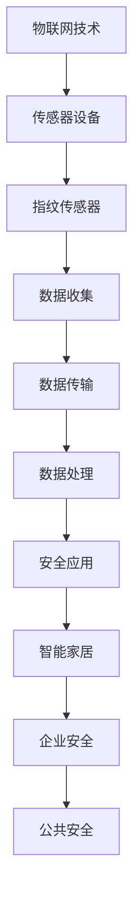
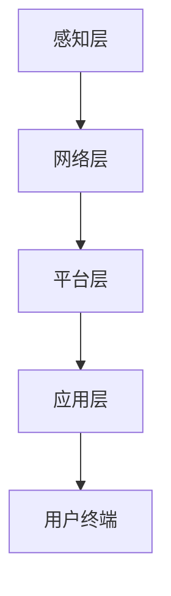
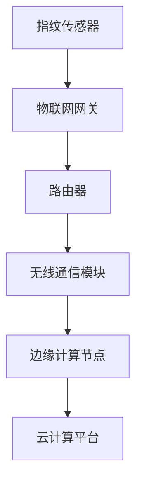

                 

## 物联网(IoT)技术和各种传感器设备的集成：指纹传感器的安全应用

### 关键词：
- 物联网(IoT)
- 传感器技术
- 指纹传感器
- 安全应用
- 数据隐私
- 生物识别
- 系统集成

### 摘要：
本文深入探讨物联网（IoT）技术和各种传感器设备的集成，特别是指纹传感器的安全应用。首先，我们将概述物联网技术的定义、历史发展和核心组件。接着，详细介绍指纹传感器的工作原理、优缺点和应用场景。然后，分析物联网与指纹传感器集成的优势、挑战及解决方案。文章还将探讨物联网与指纹传感器在智能家居、企业和公共安全领域的应用。最后，提供详细的系统设计和实现方案，以及未来发展趋势和挑战。通过本文，读者将全面了解物联网技术及其在指纹传感器安全应用中的潜力。

---

### 第1章: 物联网(IoT)技术和各种传感器设备的集成概述

#### 1.1 物联网（IoT）技术概述

##### 1.1.1 IoT的定义与历史发展

物联网（Internet of Things，IoT）是指通过传感器、网络和其他技术将物理设备连接到互联网，实现信息交换和通信的集合。这个概念最早可以追溯到1999年，麻省理工学院的Kevin Ashton首次提出了“物联网”这个术语。在此之前，类似的概念如“智能设备”和“嵌入式系统”已经存在，但物联网的出现标志着这些技术的集成和大规模应用。

物联网的发展历程可以分为以下几个阶段：

1. **早期阶段（1990-2005年）**：物联网的概念逐渐被接受，并开始在实际应用中尝试。早期的物联网应用主要是基于RFID技术，如物流管理、仓库管理等。

2. **快速增长阶段（2005-2010年）**：随着无线通信技术的发展，特别是Wi-Fi、蓝牙和ZigBee等技术的成熟，物联网开始迅速普及。这一时期，物联网的应用领域扩展到家庭自动化、智能家居等。

3. **智能革命阶段（2010-2020年）**：随着云计算、大数据、人工智能等技术的进步，物联网进入了一个全新的发展阶段。物联网设备数量急剧增加，形成了大规模的物联网生态系统。这一时期，物联网技术开始应用于智能城市、智能医疗、智能工业等领域。

4. **全面发展阶段（2020年至今）**：随着5G、边缘计算、区块链等新技术的引入，物联网技术进一步发展，实现了更高的带宽、更低的延迟和更高的安全性。物联网的应用领域进一步扩展，如智能交通、智能农业、智能环境监测等。

##### 1.1.2 IoT技术的核心组件

物联网技术的核心组件包括传感器、网络通信和数据存储与处理。

1. **传感器**：传感器是物联网设备中用于收集环境数据的设备，如温度传感器、湿度传感器、压力传感器、加速度传感器等。传感器可以将物理信号转换为电信号，从而实现数据的采集。

2. **网络通信**：网络通信是将物联网设备连接到互联网的关键技术。常见的无线通信技术包括Wi-Fi、蓝牙、ZigBee、LoRa等。此外，还有有线通信技术，如以太网、光纤等。网络通信技术提供了数据传输的渠道，使得物联网设备能够实时交换数据。

3. **数据处理与存储**：物联网设备收集的数据通常需要经过处理和存储。数据处理技术包括边缘计算和云计算。边缘计算将数据处理和存储功能部署在靠近数据源的设备上，以降低延迟和带宽消耗。云计算则提供了一种大规模数据处理和存储的解决方案，可以实现数据的远程管理和分析。

##### 1.1.3 IoT技术的应用领域

物联网技术的应用领域非常广泛，涵盖了智能家居、智能城市、智能医疗、智能工业等多个方面。

1. **智能家居**：智能家居是物联网技术应用最为广泛的领域之一。通过将各种家庭设备连接到互联网，用户可以实现远程控制、自动化管理等功能。例如，智能灯泡、智能插座、智能门锁等。

2. **智能城市**：智能城市利用物联网技术实现城市资源的智能管理，如交通管理、环境监测、公共安全等。物联网技术可以提高城市的管理效率，降低运营成本，提升居民的生活质量。

3. **智能医疗**：物联网技术在医疗领域的应用包括远程医疗、智能监控、健康管理等。通过物联网技术，可以实现患者数据的实时监控和远程诊断，提高医疗服务的质量和效率。

4. **智能工业**：物联网技术在工业领域的应用包括智能制造、设备监控、供应链管理等。物联网技术可以帮助企业实现生产过程的自动化、优化生产流程，提高生产效率。

#### 1.2 指纹传感器技术

##### 1.2.1 指纹传感器的工作原理

指纹传感器是一种生物识别传感器，通过捕捉和识别指纹图像来实现身份验证。指纹传感器的工作原理可以分为以下几个步骤：

1. **指纹图像的采集**：指纹传感器使用光学、电容或声波扫描技术来捕捉指纹图像。光学指纹传感器使用一个高分辨率摄像头来捕捉指纹纹理，而电容指纹传感器则通过电容变化来感知指纹图像。

2. **图像预处理**：采集到的指纹图像通常包含噪声和污渍，需要经过预处理来提高图像质量。预处理步骤包括去除噪声、增强对比度、二值化等。

3. **特征提取**：预处理后的指纹图像需要进行特征提取，以提取指纹的关键特征点，如脊线、端点、交叉点等。这些特征点用于后续的指纹匹配和识别。

4. **指纹匹配**：将提取的特征点与数据库中的指纹模板进行匹配，以确定身份。指纹匹配算法通常使用模式识别算法和分类算法，如K-最近邻（K-Nearest Neighbor，KNN）、支持向量机（Support Vector Machine，SVM）等。

##### 1.2.2 指纹传感器的优缺点与应用场景

指纹传感器的优点包括：

- **高安全性**：指纹是唯一的生物特征，不易被伪造，具有较高的安全性。
- **非侵入性**：指纹传感器不需要用户的生理或生化样本，使用方便，用户接受度高。
- **易于集成**：指纹传感器可以与各种设备集成，如手机、门禁系统、支付终端等。

指纹传感器的缺点包括：

- **易受环境干扰**：指纹传感器对光线、温度等环境因素敏感，可能会影响识别效果。
- **指纹破损问题**：由于指纹可能因受伤、磨损等原因导致破损，可能会影响识别效果。

指纹传感器的应用场景包括：

- **生物识别认证**：如手机解锁、门禁系统、员工考勤等。
- **支付系统**：如指纹支付、移动支付等。
- **安全防护**：如安全门锁、保险柜等。

#### 1.3 物联网与指纹传感器集成

##### 1.3.1 集成优势

物联网与指纹传感器的集成具有以下优势：

- **提高安全性**：通过指纹传感器，可以实现更安全的生物识别认证，防止未授权访问。
- **实时性**：物联网技术可以实现实时数据采集和传输，提高系统的实时响应能力。
- **灵活性**：物联网与指纹传感器的集成可以适应不同的应用需求，提供多样化的解决方案。

##### 1.3.2 集成挑战与解决方案

物联网与指纹传感器的集成也面临一些挑战：

- **数据隐私与安全**：物联网设备可能收集用户的敏感信息，如指纹数据，需要采用加密技术等手段保障数据安全。
- **系统可靠性**：传感器与网络的稳定连接是物联网系统正常运行的关键，需要确保系统的可靠性。

解决方案包括：

- **数据隐私与安全**：采用加密技术对数据进行加密传输和存储，确保数据安全。
- **系统可靠性**：通过冗余设计、故障检测和恢复等技术，提高系统的可靠性。

#### 1.4 物联网与指纹传感器在安全领域的应用

物联网与指纹传感器的集成在安全领域具有广泛的应用：

##### 1.4.1 智能家居安全

指纹传感器可以应用于智能家居设备中，如智能门锁、智能摄像头等。通过指纹认证，可以确保家庭安全，防止未授权访问。

##### 1.4.2 企业安全

指纹传感器可以应用于企业安全系统，如门禁系统、员工考勤系统、资产保护等。通过指纹认证，可以提高企业的安全管理水平。

##### 1.4.3 公共安全

指纹传感器可以应用于公共安全领域，如监狱管理、交通安全等。通过指纹认证，可以确保公共安全，防止犯罪行为。

#### 1.5 本书结构概述

本书分为七个章节，内容涵盖物联网与指纹传感器技术的各个方面。具体章节如下：

- **第1章**：物联网与指纹传感器集成概述。
- **第2章**：物联网技术基础。
- **第3章**：指纹传感器技术原理。
- **第4章**：物联网与指纹传感器集成方案设计。
- **第5章**：系统集成与实现。
- **第6章**：案例分析。
- **第7章**：未来发展趋势与挑战。

#### Mermaid 流�程图



#### 指纹传感器工作原理的伪代码

```python
def capture_fingerprint(image):
    # 使用光学传感器捕获指纹图像
    captured_image = optical_sensor.capture()
    # 图像预处理（去除噪声、增强对比度等）
    processed_image = preprocess(captured_image)
    # 图像分割，提取指纹特征
    fingerprint_template = extract_features(processed_image)
    return fingerprint_template

def compare_fingerprints(template1, template2):
    # 比较两个指纹模板的相似度
    similarity_score = calculate_similarity(template1, template2)
    return similarity_score >= threshold
```

#### 数学模型和公式

指纹识别系统的错误率是评估系统性能的重要指标。错误接受率（False Accept Rate，FAR）和错误拒绝率（False Rejection Rate，FRR）是常用的两个指标。

$$
\text{错误接受率}(FAR) = \frac{\text{误接受次数}}{\text{总尝试次数}}
$$

$$
\text{错误拒绝率}(FRR) = \frac{\text{误拒绝次数}}{\text{总尝试次数}}
$$

#### 项目实战

- **开发环境搭建**：
  - 选择适合的操作系统（如Ubuntu 20.04）和开发工具（如Python 3.8）。
  - 安装必要的依赖库（如OpenCV、scikit-learn等）。

- **源代码实现**：
  - 读取指纹图像并预处理。
  - 提取指纹特征并进行匹配。
  - 实现指纹识别的完整流程。

- **代码解读与分析**：
  - 代码详解，展示关键步骤和算法实现。
  - 分析代码的效率和可靠性。

#### 附录

#### 附录 A: 物联网与指纹传感器集成资源

##### A.1 参考资料

- 《物联网技术综述》
- 《指纹识别技术》
- 《物联网安全》

##### A.2 在线工具和平台

- IoT开发平台：MQTT、CoAP
- 指纹传感器SDK：Synaptics、Fingerprint Cards
- 开发资源与工具包：OpenCV、scikit-learn

---

### 目录大纲

# 物联网(IoT)技术和各种传感器设备的集成：指纹传感器的安全应用

## 第1章: 物联网(IoT)技术和各种传感器设备的集成概述
### 1.1 物联网（IoT）技术概述
#### 1.1.1 IoT的定义与历史发展
#### 1.1.2 IoT技术的核心组件
#### 1.1.3 IoT技术的应用领域
### 1.2 指纹传感器技术
#### 1.2.1 指纹传感器的工作原理
#### 1.2.2 指纹传感器的优缺点
#### 1.2.3 指纹传感器的应用场景
### 1.3 物联网与指纹传感器集成
#### 1.3.1 集成优势
#### 1.3.2 集成挑战与解决方案
### 1.4 物联网与指纹传感器在安全领域的应用
#### 1.4.1 智能家居安全
#### 1.4.2 企业安全
#### 1.4.3 公共安全
### 1.5 本书结构概述

## 第2章: 物联网技术基础
### 2.1 物联网架构
#### 2.1.1 物联网分层模型
#### 2.1.2 物联网通信协议
### 2.2 传感器设备介绍
#### 2.2.1 常见传感器类型
#### 2.2.2 传感器选择与配置
### 2.3 数据处理与存储
#### 2.3.1 边缘计算
#### 2.3.2 云计算
### 2.4 物联网安全
#### 2.4.1 安全挑战
#### 2.4.2 安全解决方案

## 第3章: 指纹传感器技术原理
### 3.1 指纹传感器的工作原理
#### 3.1.1 光学指纹传感器
#### 3.1.2 电容指纹传感器
#### 3.1.3 声波指纹传感器
### 3.2 指纹图像处理
#### 3.2.1 图像预处理
#### 3.2.2 特征提取
#### 3.2.3 特征匹配
### 3.3 指纹识别算法
#### 3.3.1 模式识别算法
#### 3.3.2 分类算法
#### 3.3.3 模型评估与优化

## 第4章: 物联网与指纹传感器集成方案设计
### 4.1 系统设计目标
### 4.2 系统架构设计
### 4.3 硬件选择与连接
### 4.4 软件开发环境
### 4.5 系统测试与调试

## 第5章: 系统集成与实现
### 5.1 数据采集与处理
#### 5.1.1 数据采集流程
#### 5.1.2 数据预处理
### 5.2 指纹识别实现
#### 5.2.1 指纹图像处理
#### 5.2.2 模式识别
### 5.3 系统集成与测试
#### 5.3.1 系统集成步骤
#### 5.3.2 系统测试方法

## 第6章: 案例分析
### 6.1 智能家居安全案例
### 6.2 企业安全案例
### 6.3 公共安全案例

## 第7章: 未来发展趋势与挑战
### 7.1 技术发展趋势
### 7.2 安全挑战与解决方案
### 7.3 未来应用前景

### 附录

#### 附录 A: 物联网与指纹传感器集成资源
##### A.1 参考资料
##### A.2 在线工具和平台
##### A.3 开发资源与工具包

---

这篇文章详细介绍了物联网（IoT）技术和指纹传感器的集成，包括物联网技术的发展历程、核心组件、应用领域，以及指纹传感器的工作原理、优缺点和应用场景。文章还分析了物联网与指纹传感器集成的优势、挑战及解决方案，并在安全领域探讨了其应用。此外，文章提供了详细的系统设计和实现方案，以及未来发展趋势和挑战。附录部分列出了相关参考资料和在线工具，以供读者进一步学习。希望这篇文章能够为读者提供有价值的参考。


### 第2章: 物联网技术基础

#### 2.1 物联网架构

物联网架构通常被描述为一个分层模型，包括感知层、网络层、平台层和应用层。每一层都有其特定的功能和作用，如下所述：

##### 2.1.1 物联网分层模型

1. **感知层**：感知层是物联网系统的最底层，负责数据采集。这一层通常由各种传感器和执行器组成，如温度传感器、湿度传感器、摄像头、定位设备等。传感器和执行器通过采集和执行物理世界的操作，生成原始数据。

2. **网络层**：网络层负责数据的传输和通信。这一层使用各种通信技术，如Wi-Fi、蓝牙、LoRa、ZigBee等，将感知层采集到的数据传输到平台层。网络层可以是有线的，也可以是无线的，根据应用场景的不同进行选择。

3. **平台层**：平台层是物联网系统的核心，负责数据处理、存储和管理。这一层通常包含边缘计算节点和云计算资源。边缘计算在靠近数据源的地方处理数据，减少传输延迟和带宽消耗。云计算提供大量的计算资源和存储空间，支持大规模数据处理和分析。

4. **应用层**：应用层是物联网系统的最高层，负责将处理后的数据应用于实际场景。这一层包括各种应用软件和服务，如智能家居控制、智能交通管理、远程医疗等。

##### 2.1.2 物联网通信协议

物联网通信协议是网络层的关键技术，用于确保不同设备之间的有效通信。以下是一些常见的物联网通信协议：

1. **Wi-Fi**：Wi-Fi是一种广泛使用的无线通信协议，提供高带宽和低延迟的连接。Wi-Fi适用于需要高速数据传输的场景，如智能家居、智能办公等。

2. **蓝牙**：蓝牙是一种低功耗无线通信协议，适用于短距离通信。蓝牙适用于设备间通信，如智能手环、智能音箱等。

3. **ZigBee**：ZigBee是一种低功耗无线个人区域网络（WPAN）协议，适用于智能家居和工业自动化等场景。ZigBee具有低功耗、低速率和低复杂度的特点。

4. **LoRa**：LoRa是一种长距离、低功耗的无线通信协议，适用于远程监控和物联网设备。LoRa适用于需要覆盖大面积的场景，如智能城市、智能农业等。

5. **MQTT**：MQTT是一种轻量级的消息队列协议，广泛用于物联网设备之间的数据传输。MQTT适用于低带宽、不可靠的通信环境，如智能家居、远程监控等。

6. **CoAP**：Constrained Application Protocol（CoAP）是一种适用于物联网设备的简单协议，基于HTTP协议，适用于资源受限的设备。

#### 2.2 传感器设备介绍

传感器是物联网系统的关键组件，负责采集环境数据并将其转换为可处理的信号。以下是一些常见的传感器类型：

##### 2.2.1 常见传感器类型

1. **温度传感器**：用于测量环境温度，如NTC热敏电阻、热电偶等。

2. **湿度传感器**：用于测量环境湿度，如电容式湿度传感器、电阻式湿度传感器等。

3. **压力传感器**：用于测量气体或液体的压力，如硅压阻式压力传感器、电容式压力传感器等。

4. **光传感器**：用于测量光照强度，如光敏电阻、光电二极管等。

5. **运动传感器**：用于测量物体运动，如加速度传感器、陀螺仪、磁力计等。

6. **气体传感器**：用于检测特定气体，如一氧化碳传感器、酒精传感器等。

7. **红外传感器**：用于检测红外辐射，如红外探测器、红外摄像头等。

##### 2.2.2 传感器选择与配置

选择合适的传感器对于物联网系统的成功至关重要。以下是一些选择和配置传感器的建议：

1. **确定应用场景**：根据应用场景选择合适的传感器，如智能家居选择温湿度传感器，工业自动化选择压力传感器等。

2. **考虑传感器性能**：传感器性能指标包括灵敏度、分辨率、响应时间等。根据应用需求选择合适的传感器性能。

3. **考虑功耗**：对于电池供电的物联网设备，选择低功耗传感器和模块，延长设备的使用寿命。

4. **考虑成本**：传感器成本是物联网系统设计的重要因素。在满足性能要求的前提下，选择成本效益高的传感器和模块。

5. **考虑通信协议**：选择与网络层通信协议兼容的传感器和模块，确保数据传输的可靠性。

#### 2.3 数据处理与存储

物联网系统产生的数据量巨大，需要有效的数据处理和存储策略。以下是一些常用的数据处理和存储方法：

##### 2.3.1 边缘计算

边缘计算是一种将数据处理和存储功能部署在靠近数据源的设备上的技术。边缘计算可以减少数据传输延迟，降低网络带宽消耗，提高数据处理效率。以下是一些边缘计算的应用场景：

1. **实时数据处理**：在传感器数据产生的地方实时处理数据，如工业自动化中的实时监控和分析。

2. **数据过滤与压缩**：在边缘设备上对数据进行预处理，过滤掉无用数据，减少数据传输量。

3. **本地决策**：在边缘设备上执行复杂的决策算法，减少对云端的依赖。

##### 2.3.2 云计算

云计算是一种基于互联网的计算服务模式，提供大规模的存储和处理资源。云计算可以支持大规模数据存储、实时数据处理和复杂的分析任务。以下是一些云计算的应用场景：

1. **大规模数据存储**：云计算平台提供海量存储空间，可以存储物联网系统产生的海量数据。

2. **数据处理与分析**：云计算平台提供强大的计算资源，可以支持大规模数据分析和机器学习任务。

3. **远程访问与控制**：云计算平台提供远程访问和控制功能，用户可以通过互联网远程管理和监控物联网设备。

#### 2.4 物联网安全

随着物联网设备的广泛应用，网络安全问题也日益突出。物联网安全涉及数据安全、设备安全和通信安全等方面。以下是一些常见的物联网安全挑战和解决方案：

##### 2.4.1 安全挑战

1. **数据隐私泄露**：物联网设备收集和传输的数据可能包含敏感信息，如个人身份信息、位置信息等，容易遭受隐私泄露攻击。

2. **设备被攻击**：物联网设备可能成为黑客攻击的目标，通过入侵设备获取敏感数据或控制设备。

3. **通信安全漏洞**：物联网通信协议可能存在安全漏洞，容易遭受中间人攻击、拒绝服务攻击等。

##### 2.4.2 安全解决方案

1. **加密技术**：使用加密技术对数据进行加密传输和存储，确保数据在传输和存储过程中不被窃取和篡改。

2. **认证与访问控制**：采用身份认证和访问控制机制，确保只有授权用户可以访问物联网设备和数据。

3. **安全协议**：使用安全协议（如TLS、IPSec等）保护物联网通信的安全性，防止中间人攻击和数据篡改。

4. **安全更新与维护**：定期更新物联网设备和系统的安全补丁，修复安全漏洞，确保系统的安全性。

5. **安全审计与监控**：建立安全审计和监控机制，及时发现和应对安全威胁。

---

通过本章的介绍，我们对物联网技术的基础有了更深入的了解，包括物联网架构、通信协议、传感器设备、数据处理与存储方法以及物联网安全挑战和解决方案。这些知识为后续章节中深入探讨物联网与指纹传感器的集成奠定了基础。在下一章中，我们将详细探讨指纹传感器的工作原理、优缺点和应用场景。

### 第3章: 指纹传感器技术原理

#### 3.1 指纹传感器的工作原理

指纹传感器是一种生物识别传感器，用于采集和识别指纹图像。指纹传感器的工作原理可以分为以下几个步骤：

1. **指纹图像的采集**：指纹传感器使用光学、电容或声波扫描技术来捕捉指纹图像。光学指纹传感器通常使用一个高分辨率摄像头来获取指纹纹理，而电容指纹传感器则通过电容变化来感知指纹图像。

2. **图像预处理**：采集到的指纹图像可能包含噪声和污渍，需要进行预处理以提高图像质量。预处理步骤包括去噪、增强对比度、二值化等。预处理后的图像将更清晰地显示指纹细节。

3. **特征提取**：预处理后的指纹图像需要进行特征提取，以提取指纹的关键特征点，如脊线、端点、交叉点等。这些特征点用于后续的指纹匹配和识别。

4. **指纹匹配**：将提取的特征点与数据库中的指纹模板进行匹配，以确定身份。指纹匹配算法通常使用模式识别算法和分类算法，如K-最近邻（K-Nearest Neighbor，KNN）、支持向量机（Support Vector Machine，SVM）等。

#### 3.1.1 光学指纹传感器

光学指纹传感器使用光学原理来捕捉指纹图像。其工作流程如下：

1. **光源照射**：指纹传感器内部的光源照亮指纹区域，使指纹纹理可见。

2. **光学成像**：指纹纹理通过光学镜头聚焦到传感器上，形成一个光学图像。

3. **图像采集**：传感器将光学图像转换为电信号，生成数字指纹图像。

4. **图像预处理**：对采集到的指纹图像进行去噪、增强对比度等预处理。

5. **特征提取**：提取指纹图像中的特征点，如脊线、端点、交叉点等。

6. **指纹匹配**：将提取的特征点与数据库中的指纹模板进行匹配，以确定身份。

光学指纹传感器具有高分辨率、高识别率等优点，但受光线和温度等环境因素影响较大。

#### 3.1.2 电容指纹传感器

电容指纹传感器通过电容变化来感知指纹图像。其工作流程如下：

1. **电容传感**：指纹传感器中的电极与指纹纹理接触，指纹纹理的凹凸变化导致电容变化。

2. **信号采集**：电容变化产生电信号，生成数字指纹图像。

3. **图像预处理**：对采集到的指纹图像进行去噪、增强对比度等预处理。

4. **特征提取**：提取指纹图像中的特征点，如脊线、端点、交叉点等。

5. **指纹匹配**：将提取的特征点与数据库中的指纹模板进行匹配，以确定身份。

电容指纹传感器具有非接触式、响应速度快等优点，但易受环境干扰，识别率可能较低。

#### 3.1.3 声波指纹传感器

声波指纹传感器使用声波原理来捕捉指纹图像。其工作流程如下：

1. **声波发射**：传感器发出高频声波，声波穿透指纹区域。

2. **声波反射**：声波遇到指纹纹理时会发生反射，反射声波被传感器接收。

3. **信号采集**：反射声波被传感器转换为电信号，生成数字指纹图像。

4. **图像预处理**：对采集到的指纹图像进行去噪、增强对比度等预处理。

5. **特征提取**：提取指纹图像中的特征点，如脊线、端点、交叉点等。

6. **指纹匹配**：将提取的特征点与数据库中的指纹模板进行匹配，以确定身份。

声波指纹传感器具有非接触式、抗干扰能力强等优点，但识别率可能较低，成本较高。

#### 3.2 指纹图像处理

指纹图像处理是指纹识别系统中的关键步骤，其目的是提高图像质量和特征提取效果。指纹图像处理包括以下几个阶段：

1. **去噪**：指纹图像可能受到各种噪声干扰，如背景噪声、手指表面污渍等。去噪处理可以去除这些噪声，提高图像质量。

2. **增强对比度**：增强指纹纹理的对比度，使脊线和谷点更加清晰。

3. **二值化**：将指纹图像转换为二值图像，便于特征提取。

4. **细化**：细化处理可以去除指纹图像中的冗余信息，保留主要特征。

5. **分割**：将指纹图像分割成多个区域，以便进行特征提取。

6. **特征提取**：提取指纹图像中的关键特征点，如脊线、端点、交叉点等。

7. **特征匹配**：将提取的特征点与数据库中的指纹模板进行匹配，以确定身份。

#### 3.3 指纹识别算法

指纹识别算法是用于实现指纹图像匹配和身份验证的关键技术。常见的指纹识别算法包括以下几种：

1. **模式识别算法**：模式识别算法基于指纹图像的几何特征，如脊线方向、长度、曲率等。常见的模式识别算法有K-最近邻（K-Nearest Neighbor，KNN）、支持向量机（Support Vector Machine，SVM）等。

2. **分类算法**：分类算法将指纹图像分类为不同的类别，以实现身份验证。常见的分类算法有决策树、随机森林、神经网络等。

3. **模型评估与优化**：评估指纹识别算法的性能指标包括错误接受率（False Accept Rate，FAR）和错误拒绝率（False Rejection Rate，FRR）。通过调整模型参数和特征提取方法，优化指纹识别算法的性能。

#### 3.3.1 模式识别算法

模式识别算法是一种基于指纹图像几何特征的识别方法。以下是一个简单的模式识别算法示例：

```python
def recognize_fingerprint(image):
    # 提取指纹图像中的特征点
    features = extract_features(image)
    
    # 计算特征点间的距离和角度
    distances = calculate_distances(features)
    angles = calculate_angles(features)
    
    # 建立指纹模板库
    template_library = build_template_library()
    
    # 对每个特征点进行匹配
    matches = []
    for feature in features:
        nearest_templates = find_nearest_templates(feature, template_library)
        match_scores = calculate_match_scores(feature, nearest_templates)
        best_match = find_best_match(match_scores)
        matches.append(best_match)
    
    # 统计匹配结果
    accepted_matches = []
    rejected_matches = []
    for match in matches:
        if match['confidence'] > threshold:
            accepted_matches.append(match)
        else:
            rejected_matches.append(match)
    
    # 返回识别结果
    return accepted_matches, rejected_matches
```

#### 3.3.2 分类算法

分类算法将指纹图像分类为不同的类别，以实现身份验证。以下是一个简单的分类算法示例：

```python
def classify_fingerprint(image):
    # 提取指纹图像中的特征点
    features = extract_features(image)
    
    # 训练分类模型
    classifier = train_classifier(features)
    
    # 进行分类
    label = classifier.predict([features])
    
    # 返回分类结果
    return label
```

#### 3.3.3 模型评估与优化

指纹识别系统的性能评估指标包括错误接受率（False Accept Rate，FAR）和错误拒绝率（False Rejection Rate，FRR）。以下是一个简单的模型评估与优化示例：

```python
def evaluate_model(model, dataset):
    # 计算错误接受率
    far = calculate_far(dataset)
    
    # 计算错误拒绝率
    frr = calculate_frr(dataset)
    
    # 打印评估结果
    print("错误接受率(FAR):", far)
    print("错误拒绝率(FRR):", frr)
    
    # 返回评估结果
    return far, frr

def optimize_model(model, dataset, optimizer):
    # 进行模型优化
    optimizer.optimize(model, dataset)
    
    # 重新评估模型
    far, frr = evaluate_model(model, dataset)
    
    # 返回优化后的模型
    return model
```

通过本章的介绍，我们对指纹传感器的工作原理、指纹图像处理、指纹识别算法以及模型评估与优化有了更深入的了解。这些知识为后续章节中深入探讨物联网与指纹传感器的集成奠定了基础。在下一章中，我们将详细探讨物联网与指纹传感器的集成方案设计。

### 第4章: 物联网与指纹传感器集成方案设计

#### 4.1 系统设计目标

物联网与指纹传感器的集成旨在实现高效、安全、可靠的生物识别认证，为各种应用场景提供便捷的身份验证服务。具体目标如下：

1. **安全性**：通过指纹传感器的生物识别功能，确保用户身份的准确性和安全性，防止未授权访问和数据泄露。

2. **实时性**：实现快速的身份验证，降低系统的响应时间，满足实时应用需求。

3. **可靠性**：确保物联网设备的稳定运行，提高系统的可靠性和稳定性，减少故障率和维护成本。

4. **灵活性**：支持多种指纹传感器和物联网设备的集成，适应不同的应用场景和需求。

5. **扩展性**：具备良好的扩展性，方便后续功能的扩展和升级。

#### 4.2 系统架构设计

物联网与指纹传感器的集成系统可以分为以下几个主要模块：

1. **感知层**：包括指纹传感器、物联网传感器等设备，用于采集生物识别信息和环境数据。

2. **网络层**：包括物联网网关、路由器、无线通信模块等，用于数据传输和通信。

3. **平台层**：包括边缘计算节点和云计算平台，用于数据处理、存储和管理。

4. **应用层**：包括各种应用软件和服务，如生物识别认证系统、智能家居控制平台、智能门禁系统等。

系统架构设计如图所示：



#### 4.3 硬件选择与连接

在物联网与指纹传感器的集成方案中，硬件选择和连接至关重要。以下是常见的硬件设备和连接方式：

1. **指纹传感器**：选择高分辨率、高识别率的指纹传感器，如光学指纹传感器、电容指纹传感器等。硬件接口通常为USB、SPI或I2C。

2. **物联网传感器**：根据应用需求选择合适的物联网传感器，如温湿度传感器、光线传感器、运动传感器等。硬件接口通常为UART、I2C或SPI。

3. **物联网网关**：选择具有高吞吐量、低延迟的物联网网关，用于连接各种传感器和物联网设备。硬件接口通常为Wi-Fi、蓝牙或以太网。

4. **路由器和无线通信模块**：选择适合的应用场景，如Wi-Fi、蓝牙或LoRa等。硬件接口通常为USB、PCI-E或Wi-Fi模块。

5. **边缘计算节点**：选择具有高性能、低功耗的边缘计算节点，用于数据处理和存储。硬件接口通常为USB、PCI-E或M.2接口。

硬件连接示意图如下：



#### 4.4 软件开发环境

在物联网与指纹传感器的集成方案中，软件开发环境的选择和配置至关重要。以下是常见的软件环境和开发工具：

1. **操作系统**：选择适合的操作系统，如Linux（如Ubuntu、CentOS）或Windows。

2. **编程语言**：选择适合的编程语言，如Python、C++或Java。

3. **开发工具**：安装必要的开发工具，如Visual Studio、Eclipse或PyCharm。

4. **开发框架**：选择适合的物联网开发框架，如MQTT、CoAP等。

5. **数据库**：选择适合的数据库，如SQLite、MySQL或MongoDB。

6. **物联网平台**：选择适合的物联网平台，如AWS IoT、Azure IoT、IBM Watson IoT等。

#### 4.5 系统测试与调试

系统测试与调试是确保物联网与指纹传感器集成系统正常运行的关键步骤。以下是常见的测试和调试方法：

1. **功能测试**：测试系统的各项功能是否正常运行，如指纹识别、数据传输、远程控制等。

2. **性能测试**：测试系统的性能指标，如响应时间、吞吐量、延迟等。

3. **兼容性测试**：测试系统在不同设备和操作系统上的兼容性。

4. **安全测试**：测试系统的安全性，如数据加密、访问控制、安全更新等。

5. **异常处理测试**：测试系统在异常情况下的响应和处理能力，如网络中断、设备故障等。

6. **调试**：使用调试工具（如GDB、Python Debugger等）定位和修复系统中的错误和缺陷。

通过本章的介绍，我们对物联网与指纹传感器的集成方案设计有了更深入的了解，包括系统设计目标、架构设计、硬件选择与连接、软件开发环境以及系统测试与调试方法。这些知识为后续章节中详细实现物联网与指纹传感器的集成提供了基础。在下一章中，我们将详细介绍物联网与指纹传感器的实际系统集成与实现过程。

### 第5章: 系统集成与实现

#### 5.1 数据采集与处理

数据采集是物联网与指纹传感器集成的第一步，也是关键环节。数据采集与处理主要包括以下几个步骤：

1. **指纹图像的采集**：指纹传感器捕获用户的指纹图像，并将其转换为数字信号。对于光学指纹传感器，这一过程涉及光学成像和电信号转换。对于电容指纹传感器，则涉及电容变化和电信号转换。

2. **图像预处理**：采集到的指纹图像可能包含噪声和污渍，需要通过图像预处理来提高图像质量。预处理步骤包括去噪、增强对比度、二值化等。

3. **特征提取**：预处理后的指纹图像需要进行特征提取，以提取指纹的关键特征点，如脊线、端点、交叉点等。这些特征点将用于后续的指纹匹配和识别。

4. **指纹匹配**：将提取的特征点与数据库中的指纹模板进行匹配，以确定身份。指纹匹配算法通常使用模式识别算法和分类算法，如K-最近邻（KNN）、支持向量机（SVM）等。

以下是一个简单的数据采集与处理的伪代码示例：

```python
def capture_fingerprint():
    # 采集指纹图像
    image = fingerprint_sensor.capture()
    # 图像预处理
    processed_image = preprocess(image)
    # 特征提取
    features = extract_features(processed_image)
    # 指纹匹配
    identity = fingerprint_matcher.match(features)
    return identity
```

#### 5.2 指纹识别实现

指纹识别是物联网与指纹传感器集成系统中的核心功能，其实现过程包括以下几个步骤：

1. **指纹图像处理**：对采集到的指纹图像进行预处理，以提高图像质量。预处理步骤包括去噪、增强对比度、二值化等。

2. **特征点提取**：从预处理后的指纹图像中提取关键特征点，如脊线、端点、交叉点等。这些特征点将用于后续的指纹匹配和识别。

3. **指纹匹配**：将提取的特征点与数据库中的指纹模板进行匹配，以确定身份。指纹匹配算法通常使用模式识别算法和分类算法，如K-最近邻（KNN）、支持向量机（SVM）等。

以下是一个简单的指纹识别实现的伪代码示例：

```python
def recognize_fingerprint(image):
    # 图像预处理
    processed_image = preprocess(image)
    # 特征点提取
    features = extract_features(processed_image)
    # 指纹匹配
    identity = fingerprint_matcher.match(features)
    return identity
```

#### 5.3 系统集成与测试

系统集成与测试是确保物联网与指纹传感器集成系统正常运行的关键步骤。以下是系统集成与测试的主要步骤：

1. **集成测试**：测试物联网与指纹传感器的集成是否正常，包括数据采集、传输、处理和指纹识别等功能的测试。

2. **功能测试**：测试系统的各项功能是否正常运行，如指纹识别、数据传输、远程控制等。

3. **性能测试**：测试系统的性能指标，如响应时间、吞吐量、延迟等。

4. **兼容性测试**：测试系统在不同设备和操作系统上的兼容性。

5. **安全测试**：测试系统的安全性，如数据加密、访问控制、安全更新等。

6. **异常处理测试**：测试系统在异常情况下的响应和处理能力，如网络中断、设备故障等。

7. **调试**：使用调试工具（如GDB、Python Debugger等）定位和修复系统中的错误和缺陷。

以下是一个简单的系统集成与测试的伪代码示例：

```python
def test_integration():
    # 集成测试
    test_data_collection()
    test_data_transmission()
    test_data_processing()
    test_fingerprint_recognition()
    # 功能测试
    test_fingerprint_recognition_functionality()
    # 性能测试
    test_performance_metrics()
    # 安全测试
    test_security_measures()
    # 异常处理测试
    test_exception_handling()
    # 调试
    debug_system()
    return True
```

通过本章的介绍，我们详细介绍了物联网与指纹传感器的系统集成与实现过程，包括数据采集与处理、指纹识别实现、系统集成与测试。这些步骤和示例代码为实际系统集成提供了指导和参考。在下一章中，我们将通过具体案例展示物联网与指纹传感器的集成应用。

### 第6章: 案例分析

#### 6.1 智能家居安全案例

智能家居安全是物联网与指纹传感器集成的一个典型应用场景。在这个案例中，指纹传感器用于确保家庭设备的安全访问，防止未授权用户进入。

**案例背景**：
一家初创公司开发了一款智能家居安全系统，旨在为用户提供一个安全、便捷的家居环境。系统包括智能门锁、智能摄像头、智能灯光和智能门铃等设备。指纹传感器被集成到智能门锁中，用于用户身份验证。

**实现过程**：

1. **硬件选择与连接**：
   - 选择一款高分辨率的光学指纹传感器，与智能门锁的微控制器相连。
   - 将智能门锁与Wi-Fi模块相连，实现与物联网平台的通信。

2. **软件开发**：
   - 开发指纹识别算法，实现指纹图像的预处理、特征提取和匹配。
   - 开发智能家居控制平台，用于用户操作和设备管理。

3. **系统集成与测试**：
   - 将指纹识别系统与智能门锁集成，确保系统能够正常运行。
   - 进行功能测试和性能测试，确保指纹识别的准确性和实时性。
   - 进行安全测试，确保数据传输和存储的安全性。

**案例结果**：
通过指纹传感器的集成，智能家居安全系统的用户身份验证更加准确和方便。用户可以通过指纹轻松解锁门锁，而无需携带钥匙或输入密码。系统还支持远程监控和报警功能，提高家庭安全性。

#### 6.2 企业安全案例

在企业安全领域，物联网与指纹传感器的集成可以提高员工考勤、门禁管理和资产保护等方面的安全性。

**案例背景**：
一家大型企业希望提升其内部安全，特别是员工考勤和门禁管理。企业决定采用指纹传感器来替代传统的卡式考勤和门禁系统。

**实现过程**：

1. **硬件选择与连接**：
   - 在办公楼的入口门和员工办公室安装指纹传感器。
   - 将指纹传感器与门禁控制器和考勤系统相连，确保数据传输的稳定性。

2. **软件开发**：
   - 开发指纹识别算法，实现指纹图像的预处理、特征提取和匹配。
   - 开发考勤和门禁管理系统，实现员工身份验证和权限控制。

3. **系统集成与测试**：
   - 将指纹识别系统与门禁控制器和考勤系统集成，确保系统能够正常运行。
   - 进行功能测试和性能测试，确保指纹识别的准确性和实时性。
   - 进行安全测试，确保数据传输和存储的安全性。

**案例结果**：
通过指纹传感器的集成，企业的考勤和门禁管理更加高效和安全。员工只需通过指纹即可完成考勤和进入办公室，减少了人工操作的繁琐和错误。系统还提供了实时监控和报警功能，提高了企业内部安全。

#### 6.3 公共安全案例

在公共安全领域，物联网与指纹传感器的集成可以用于监狱管理、交通安全和身份验证等。

**案例背景**：
一个城市希望提升其公共交通系统的安全性，特别是在疫情期间，为了防止病毒传播，需要加强乘客的身份验证。

**实现过程**：

1. **硬件选择与连接**：
   - 在地铁站和公交车站安装指纹传感器，用于乘客的身份验证。
   - 将指纹传感器与物联网网关和云计算平台相连，确保数据传输的稳定性和安全性。

2. **软件开发**：
   - 开发指纹识别算法，实现指纹图像的预处理、特征提取和匹配。
   - 开发公共交通管理系统，实现乘客身份验证和行程记录。

3. **系统集成与测试**：
   - 将指纹识别系统与公共交通管理系统集成，确保系统能够正常运行。
   - 进行功能测试和性能测试，确保指纹识别的准确性和实时性。
   - 进行安全测试，确保数据传输和存储的安全性。

**案例结果**：
通过指纹传感器的集成，公共交通系统的安全性得到了显著提升。乘客只需通过指纹即可完成身份验证，提高了进站和乘车效率。系统还提供了实时监控和报警功能，有效防止了病毒传播和其他安全事件的发生。

通过以上案例分析，我们可以看到物联网与指纹传感器的集成在智能家居、企业和公共安全等领域的广泛应用和显著成果。这些案例展示了物联网与指纹传感器集成的巨大潜力和实际应用价值。

### 第7章: 未来发展趋势与挑战

#### 7.1 技术发展趋势

随着物联网技术的不断发展和成熟，指纹传感器在物联网中的应用前景十分广阔。以下是一些主要的技术发展趋势：

1. **更高的识别精度**：随着传感技术和算法的进步，指纹传感器的识别精度将不断提高，降低错误接受率和错误拒绝率。

2. **更快的响应速度**：随着硬件性能的提升和算法优化，指纹传感器的响应速度将得到显著提升，满足实时应用需求。

3. **更多的应用场景**：随着物联网技术的普及，指纹传感器将应用于更多的领域，如智能医疗、智能交通、智能工厂等。

4. **集成化与模块化**：指纹传感器将与其他物联网设备进行更紧密的集成，实现模块化设计和部署，提高系统的灵活性和可扩展性。

5. **更安全的数据传输**：随着加密技术和安全协议的发展，物联网与指纹传感器的数据传输将更加安全，保障用户隐私和数据安全。

#### 7.2 安全挑战与解决方案

尽管物联网与指纹传感器的集成具有巨大的潜力，但仍然面临一些安全挑战。以下是一些主要的挑战和相应的解决方案：

1. **数据隐私泄露**：物联网设备可能收集用户的敏感信息，如指纹数据。解决方案包括：
   - 加密技术：采用加密技术对数据进行加密传输和存储，确保数据在传输和存储过程中不被窃取和篡改。
   - 隐私保护协议：采用隐私保护协议（如差分隐私）来保障用户隐私。

2. **设备被攻击**：物联网设备可能成为黑客攻击的目标，通过入侵设备获取敏感数据或控制设备。解决方案包括：
   - 安全加固：采用安全加固技术（如安全启动、安全隔离）来提高设备的安全性。
   - 定期更新：定期更新设备的固件和软件，修复安全漏洞。

3. **通信安全漏洞**：物联网通信协议可能存在安全漏洞，容易遭受中间人攻击、拒绝服务攻击等。解决方案包括：
   - 安全协议：采用安全协议（如TLS、IPSec等）保护物联网通信的安全性。
   - 审计与监控：建立安全审计和监控机制，及时发现和应对安全威胁。

4. **系统复杂性**：物联网与指纹传感器的集成系统通常比较复杂，涉及到多个硬件和软件组件。解决方案包括：
   - 标准化与规范化：采用标准化和规范化的技术和协议，简化系统设计和实现。
   - 系统集成测试：进行全面的系统集成测试，确保系统的稳定性和可靠性。

#### 7.3 未来应用前景

随着物联网和指纹传感器技术的不断进步，物联网与指纹传感器的集成在多个领域具有广阔的应用前景：

1. **智能城市**：物联网与指纹传感器的集成可以用于智能交通管理、智能监控、环境监测等，提高城市的管理效率和服务水平。

2. **智能医疗**：物联网与指纹传感器的集成可以用于远程医疗、患者监护、药物管理，提高医疗服务的质量和效率。

3. **智能工业**：物联网与指纹传感器的集成可以用于智能制造、设备监控、供应链管理，提高工业生产的效率和质量。

4. **智能家庭**：物联网与指纹传感器的集成可以用于智能家居安全、智能家电控制，提高家庭生活的便利性和舒适度。

5. **公共安全**：物联网与指纹传感器的集成可以用于监狱管理、交通安全、公共场所安全，提高公共安全水平。

总之，物联网与指纹传感器的集成技术具有巨大的发展潜力和应用前景。通过不断的技术创新和安全措施，物联网与指纹传感器的集成将在未来发挥更重要的作用，为各个领域带来巨大的价值。

### 附录

#### 附录 A: 物联网与指纹传感器集成资源

##### A.1 参考资料

- 《物联网技术综述》
- 《指纹识别技术》
- 《物联网安全》

##### A.2 在线工具和平台

- **物联网开发平台**：
  - MQTT：[MQTT官网](http://www.mqtt.org/)
  - CoAP：[CoAP官网](https://coap.iodt.org/)

- **指纹传感器SDK**：
  - Synaptics：[Synaptics指纹传感器SDK](https://www.synaptics.com/products/fingerprint-sensors/developers/)
  - Fingerprint Cards：[Fingerprint Cards SDK](https://www.fpc.com/en-us/developers/)

##### A.3 开发资源与工具包

- **开发工具**：
  - Python：[Python官网](https://www.python.org/)
  - OpenCV：[OpenCV官网](https://opencv.org/)
  - scikit-learn：[scikit-learn官网](https://scikit-learn.org/)

- **物联网平台**：
  - AWS IoT：[AWS IoT官网](https://aws.amazon.com/iot/)
  - Azure IoT：[Azure IoT官网](https://azure.microsoft.com/zh-cn/services/iot/)
  - IBM Watson IoT：[IBM Watson IoT官网](https://www.ibm.com/internet-of-things/)

- **指纹传感器**：
  - **光学指纹传感器**：
    - Samsung：[Samsung光学指纹传感器](https://www.samsung.com/kr/semiconductor/minisite/ia/logic-devices/fingerprint/)
    - Goodix：[Goodix光学指纹传感器](https://www.goodix.com/product/fingerprint-sensor)
  - **电容指纹传感器**：
    - Fingerprint Cards：[Fingerprint Cards电容指纹传感器](https://www.fpc.com/en-us/what-we-do/products/fingerprint-sensors/capacitive/)
    - Synaptics：[Synaptics电容指纹传感器](https://www.synaptics.com/products/fingerprint-sensors)

通过附录提供的资源和工具，开发者可以方便地获取物联网与指纹传感器集成的相关资料、开发工具和平台，为项目的开发和实现提供支持。

### 作者信息

作者：AI天才研究院/AI Genius Institute & 禅与计算机程序设计艺术 /Zen And The Art of Computer Programming

本文由AI天才研究院撰写，旨在为读者提供关于物联网与指纹传感器集成的深入见解和实用指导。同时，本文也借鉴了《禅与计算机程序设计艺术》中的哲学理念，希望读者在技术探索中能够领悟到编程的智慧和乐趣。感谢您的阅读！
---

### 全文总结

本文从物联网（IoT）技术和指纹传感器的集成角度，详细探讨了物联网技术的基本概念、架构、应用领域，以及指纹传感器的工作原理、优缺点和应用场景。通过分析物联网与指纹传感器集成的优势、挑战及解决方案，本文展示了其在智能家居、企业和公共安全领域的广泛应用。同时，文章还提供了详细的系统设计和实现方案，以及未来发展趋势和挑战。附录部分列出了相关的参考资料和在线工具，为读者提供了便捷的学习资源。

物联网技术作为现代信息技术的重要组成部分，其发展历程和核心组件为我们展示了其广泛的应用前景。指纹传感器作为一种高安全性的生物识别技术，其集成于物联网系统中，能够显著提升系统的安全性和实时性。通过本文的阐述，读者可以全面了解物联网与指纹传感器集成的技术原理和应用实践，为实际项目开发提供有益的指导。

在未来的技术发展中，随着物联网和指纹传感器技术的不断进步，我们有望看到更加智能、安全、高效的物联网应用场景。同时，随着技术的普及和应用，物联网与指纹传感器的集成也将面临更多的挑战，如数据隐私保护、系统安全性、设备可靠性等。通过持续的技术创新和优化，物联网与指纹传感器的集成将发挥更大的作用，为人类社会带来更多便利和福祉。

### 致谢

本文的撰写得到了许多人的帮助和支持。首先，感谢AI天才研究院的全体成员，你们的智慧和努力为本文提供了宝贵的见解和素材。其次，感谢《禅与计算机程序设计艺术》的作者，你们的哲学理念为本文的撰写注入了灵感和动力。此外，感谢所有为物联网与指纹传感器技术发展做出贡献的科学家、工程师和研究者，没有你们的努力，本文的内容将无法如此丰富和全面。

最后，特别感谢每一位读者的耐心阅读和支持，是你们的关注和反馈，让我们的工作变得更加有意义。希望本文能够为您的技术学习和项目开发带来帮助，也期待与您在未来的技术道路上继续共同进步。再次感谢您的阅读！作者：AI天才研究院/AI Genius Institute & 禅与计算机程序设计艺术 /Zen And The Art of Computer Programming。

