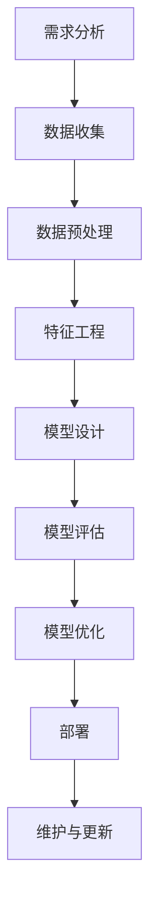
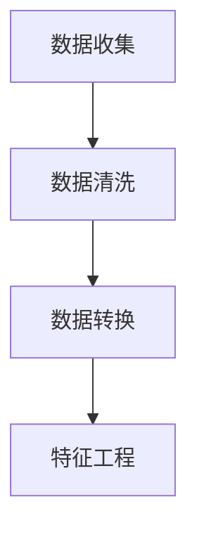
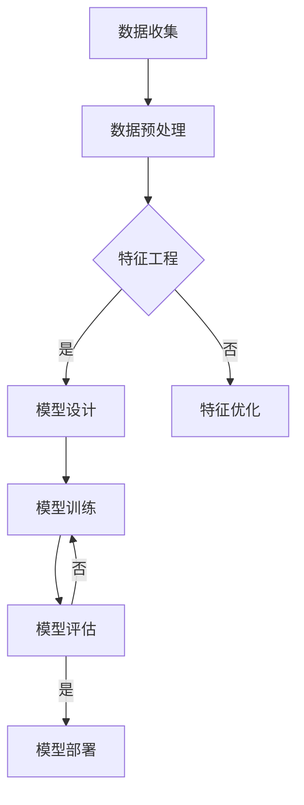
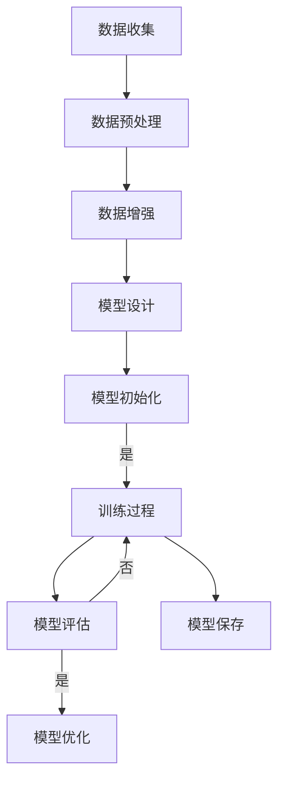
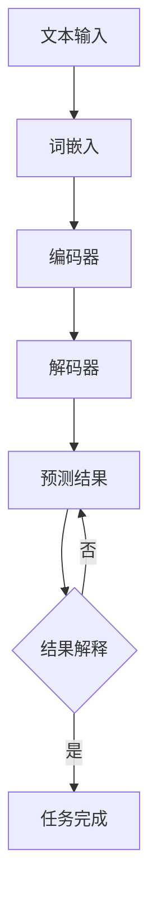

                 

### 理解AI能力：摸索应用场景的过程

> **关键词**: 人工智能，应用场景，机器学习，深度学习，自然语言处理，计算机视觉，伦理与社会影响

> **摘要**: 本文旨在深入探讨人工智能（AI）的核心能力及其在不同应用场景中的摸索过程。我们将首先回顾AI的发展历程和核心概念，然后逐步介绍机器学习、深度学习、自然语言处理和计算机视觉的基础知识。接着，我们将探讨AI在不同领域的应用，如医疗、金融、零售和制造业。随后，我们将分享AI项目开发实战的经验和技巧。最后，我们将探讨AI伦理问题及未来发展趋势。通过这篇文章，读者将全面理解AI的能力和应用，为未来的探索和实践打下坚实的基础。

### 目录大纲

- **第一部分：AI基础与核心概念**
  - 第1章: AI简史与核心概念
    - 1.1 AI的发展历程
    - 1.2 AI的基本概念
    - 1.3 AI的核心组成部分
    - 1.4 AI的典型应用领域
  - 第2章: 机器学习基础
    - 2.1 机器学习的定义与方法
    - 2.2 数据预处理与特征工程
    - 2.3 常见的机器学习算法
    - 2.4 评估与优化机器学习模型
  - 第3章: 深度学习基础
    - 3.1 深度学习的概念与发展
    - 3.2 神经网络的基本结构
    - 3.3 深度学习框架与工具
    - 3.4 深度学习模型优化
  - 第4章: 自然语言处理
    - 4.1 自然语言处理概述
    - 4.2 词嵌入与文本表示
    - 4.3 序列模型与注意力机制
    - 4.4 转换器架构
  - 第5章: 计算机视觉基础
    - 5.1 计算机视觉的基本概念
    - 5.2 卷积神经网络在计算机视觉中的应用
    - 5.3 目标检测与图像分割
    - 5.4 深度学习在计算机视觉中的前沿应用
- **第二部分：AI应用场景探索**
  - 第6章: AI应用场景探索
    - 6.1 AI在医疗健康领域的应用
    - 6.2 AI在金融行业的应用
    - 6.3 AI在零售与电商的应用
    - 6.4 AI在制造业的应用
- **第三部分：AI项目开发实战**
  - 第7章: AI项目开发实战
    - 7.1 AI项目开发流程
    - 7.2 数据采集与预处理
    - 7.3 模型设计与实现
    - 7.4 评估与优化模型
    - 7.5 部署与维护AI应用
- **第四部分：AI伦理与社会影响**
  - 第8章: AI伦理与社会影响
    - 8.1 AI伦理问题探讨
    - 8.2 AI对就业与经济的影响
    - 8.3 AI在社会治理中的应用
    - 8.4 AI未来发展趋势与展望
- **附录**
  - 附录A: AI开发常用工具与资源
    - A.1 常见机器学习框架介绍
    - A.2 自然语言处理工具
    - A.3 计算机视觉库
    - A.4 AI开发平台与云服务
  - 附录B: Mermaid流程图示例
    - B.1 机器学习流程
    - B.2 深度学习模型训练流程
    - B.3 自然语言处理任务流程
  - 附录C: 伪代码与数学模型示例
    - C.1 机器学习算法伪代码
    - C.2 深度学习神经网络伪代码
    - C.3 自然语言处理模型数学公式

通过以上目录结构，我们将全面探讨AI的各个层面，帮助读者构建完整的AI知识体系，并为实际应用做好准备。

### 第一部分：AI基础与核心概念

在探索人工智能（AI）的世界时，我们首先需要了解AI的起源、基础概念及其核心组成部分。本部分将分章节介绍AI的发展历程、基本概念、机器学习与深度学习的基础知识、自然语言处理以及计算机视觉的基本概念，为后续的应用场景探索打下坚实的理论基础。

#### 第1章: AI简史与核心概念

##### 1.1 AI的发展历程

人工智能（Artificial Intelligence，简称AI）的概念最早可以追溯到20世纪50年代。1956年，在达特茅斯会议（Dartmouth Conference）上，约翰·麦卡锡（John McCarthy）等人首次提出了人工智能这一术语，标志着人工智能学科的正式诞生。此后，AI经历了数个发展阶段。

- **初期探索（1956-1969）**：这一阶段主要关注基于逻辑推理和知识表示的人工智能系统，例如基于谓词逻辑的专家系统和自然语言理解系统。

- **繁荣时期（1970-1980）**：随着计算机性能的提升和算法的进步，AI领域迎来了一个繁荣时期。专家系统（Expert Systems）在这一时期取得了显著成果，但在处理复杂任务时遇到了瓶颈。

- **低谷与复兴（1980-1990）**：由于AI在实际应用中的表现不如预期，加之计算资源的限制，AI领域进入了一个相对低迷的时期。直到1990年代，随着机器学习技术的发展，AI迎来了新一轮的复兴。

- **现代AI（1990至今）**：这一阶段以深度学习和大数据技术为驱动，AI取得了前所未有的突破。特别是在计算机视觉、自然语言处理和强化学习等领域，AI的应用取得了显著的成果。

##### 1.2 AI的基本概念

人工智能是一门跨学科领域，涉及计算机科学、数学、神经科学、认知科学等多个领域。以下是一些关键的基本概念：

- **人工智能（Artificial Intelligence）**：模拟人类智能的计算机系统，能够在特定任务上表现出人类智能水平。

- **机器学习（Machine Learning）**：一种使计算机系统能够从数据中学习并改进自身性能的方法。

- **深度学习（Deep Learning）**：一种机器学习的方法，通过构建多层神经网络来实现复杂的特征学习和任务处理。

- **神经网络（Neural Networks）**：模拟人脑神经元之间连接的计算机模型，用于处理非线性问题。

- **自然语言处理（Natural Language Processing，NLP）**：使计算机能够理解、生成和处理人类语言的技术。

- **计算机视觉（Computer Vision）**：使计算机能够从图像或视频中提取有用信息的技术。

##### 1.3 AI的核心组成部分

人工智能系统由多个核心组成部分构成，这些部分相互协作以实现特定任务。以下是AI系统的主要组成部分：

- **数据收集与预处理**：收集并清洗数据，为后续的机器学习和深度学习算法提供高质量的数据集。

- **模型设计**：根据具体任务需求设计神经网络结构，选择合适的算法和超参数。

- **训练与优化**：通过大量数据进行训练，优化模型参数，提高模型性能。

- **评估与测试**：使用独立的测试集评估模型性能，确保模型具有良好的泛化能力。

- **部署与维护**：将训练好的模型部署到实际应用中，进行实时监测和维护，确保系统稳定运行。

##### 1.4 AI的典型应用领域

人工智能已经渗透到各个领域，以下是一些典型的应用领域：

- **医疗健康**：AI在医疗健康领域具有广泛的应用，如疾病诊断、药物研发、健康管理等。

- **金融**：AI在金融行业用于风险管理、欺诈检测、投资策略优化等。

- **零售与电商**：AI帮助零售和电商企业实现个性化推荐、库存管理、智能客服等。

- **制造业**：AI在制造业用于生产优化、设备维护、质量控制等。

- **交通运输**：AI在自动驾驶、智能交通管理、物流优化等领域具有重要应用。

通过以上对AI发展历程、基本概念和核心组成部分的介绍，我们为后续章节的深入探讨奠定了基础。在接下来的章节中，我们将详细探讨机器学习、深度学习、自然语言处理和计算机视觉等关键领域，帮助读者全面理解AI的能力和应用。

### 第2章: 机器学习基础

#### 2.1 机器学习的定义与方法

机器学习（Machine Learning，ML）是一门研究如何让计算机从数据中学习并做出决策或预测的学科。与传统的编程方法不同，机器学习依赖于数据驱动，通过训练模型来自动发现数据中的规律和模式。以下是机器学习的基本定义、核心概念和主要方法。

**定义**

机器学习可以定义为一种使计算机系统能够通过数据和经验改进自身性能的过程。这个过程通常包括数据收集、模型训练、模型评估和模型应用等步骤。

**核心概念**

- **数据集（Dataset）**：机器学习算法需要大量的数据来训练模型，这些数据通常分为训练集、验证集和测试集。

- **特征（Feature）**：数据集中的每一个属性或变量称为特征，用于描述样本或数据点的特征信息。

- **模型（Model）**：通过学习数据中的规律和模式，机器学习算法构建出一个数学模型，用于预测或分类新数据。

- **算法（Algorithm）**：机器学习算法是实现数据学习、模型训练和预测的核心工具，如线性回归、决策树、支持向量机等。

- **训练（Training）**：使用训练集数据对模型进行训练，优化模型参数，使其在特定任务上取得良好的性能。

- **评估（Evaluation）**：使用验证集或测试集评估模型的泛化能力，确保模型具有良好的性能和稳定性。

**主要方法**

机器学习主要方法可以分为监督学习、无监督学习和半监督学习三种类型。

- **监督学习（Supervised Learning）**：在监督学习任务中，训练数据包含标签或目标值，模型通过学习这些标签来预测新数据。常见的监督学习算法包括线性回归、逻辑回归、决策树、随机森林和支持向量机等。

  **线性回归伪代码**：
  ```plaintext
  输入：训练数据集 X, Y
  输出：回归模型参数 w

  初始化：w = [0, 0]
  for epoch in 1 to num_epochs:
      for (x, y) in X, Y:
          预测：y_pred = w * x
          计算损失：loss = (y - y_pred)^2
          更新权重：w = w - learning_rate * gradient(loss)
  return w
  ```

- **无监督学习（Unsupervised Learning）**：在无监督学习任务中，训练数据没有标签或目标值，模型旨在发现数据中的隐含结构和模式。常见的无监督学习算法包括聚类、降维和关联规则挖掘等。

  **K-均值聚类伪代码**：
  ```plaintext
  输入：数据集 X，聚类数量 K
  输出：聚类中心点 c

  初始化：随机选择 K 个数据点作为初始聚类中心点 c
  while not converged:
      for each data point x in X:
          计算距离：distances = [||x - c_i|| for c_i in c]
          分配到最近的聚类中心点：x.group = argmin(distances)
      重新计算聚类中心点：c = [mean(group) for group in groups]
  return c
  ```

- **半监督学习（Semi-supervised Learning）**：半监督学习结合了监督学习和无监督学习的特点，利用少量的有标签数据和大量的无标签数据来训练模型。这种方法在处理标注成本高的情况下非常有用。

  **标签传播伪代码**：
  ```plaintext
  输入：数据集 X，初始标签 y_init
  输出：最终标签 y

  初始化：y = y_init
  for epoch in 1 to num_epochs:
      for (x, y) in X, y:
          预测：y_pred = predict(x)
          更新标签：y = (1 - alpha) * y + alpha * y_pred
  return y
  ```

通过以上对机器学习定义、核心概念和主要方法的介绍，我们可以更好地理解机器学习的基础知识。在接下来的章节中，我们将进一步探讨数据预处理、特征工程和常见的机器学习算法，帮助读者深入掌握机器学习的理论和实践。

#### 2.2 数据预处理与特征工程

数据预处理和特征工程是机器学习项目成功的关键环节，直接影响模型的性能和泛化能力。以下是关于数据预处理和特征工程的基本概念、常用方法和具体步骤。

##### 基本概念

- **数据预处理（Data Preprocessing）**：数据预处理是指对原始数据进行清洗、转换和归一化等操作，以使其适合于机器学习模型训练。

- **特征工程（Feature Engineering）**：特征工程是指通过人工设计或变换原始数据中的特征，以增强模型的预测能力。

##### 常用方法

1. **数据清洗（Data Cleaning）**：

   - **缺失值处理**：常见的缺失值处理方法包括删除缺失值、填充平均值或中位数、使用模型预测缺失值等。

     ```latex
     填充平均值：X[i, j] = (1 - p) * X[i, j] + p * mean(X[:, j])
     ```

   - **异常值处理**：异常值可能影响模型的训练效果，常用的处理方法包括删除异常值、用中位数或平均值替换异常值等。

     ```latex
     替换异常值：X[i, j] = (1 - p) * X[i, j] + p * median(X[:, j])
     ```

2. **数据转换（Data Transformation）**：

   - **归一化（Normalization）**：归一化是将数据缩放到相同的范围，以避免某些特征在计算中占据主导地位。常用的归一化方法包括最小-最大缩放和Z-score缩放。

     ```latex
     最小-最大缩放：X[i, j] = (X[i, j] - min(X[:, j])) / (max(X[:, j]) - min(X[:, j]))
     Z-score缩放：X[i, j] = (X[i, j] - mean(X[:, j])) / std(X[:, j])
     ```

   - **离散化（Discretization）**：离散化是将连续特征转换为分类特征，以简化模型处理过程。常用的离散化方法包括等宽划分和等频划分。

3. **特征选择（Feature Selection）**：

   - **过滤式（Filter Method）**：过滤式特征选择是通过统计测试或信息增益等指标筛选出有用的特征。

     ```latex
     选取特征：selected_features = selectKBest(scoreFunction=chi2, X=X, y=y)
     ```

   - **包裹式（Wrapper Method）**：包裹式特征选择通过训练不同的模型并评估特征子集的性能来选择最佳特征子集。

     ```latex
     选取特征：best_features = SelectFromModel(estimator=RandomForestClassifier(), threshold=0.5)
     ```

4. **特征构造（Feature Construction）**：

   - **交互特征（Interaction Features）**：通过组合原始特征来构造新的特征，以提升模型的预测能力。

     ```latex
     交互特征：X_new = [X[:, i] * X[:, j] for i in range(num_features) for j in range(num_features) if i != j]
     ```

   - **特征缩放（Feature Scaling）**：特征缩放是通过线性变换将特征映射到统一尺度，以避免不同特征在计算中的权重差异。

##### 具体步骤

1. **数据收集与数据源**：

   收集所需的数据，可以是公开数据集或定制数据集。确保数据来源的可靠性，避免引入噪声和偏差。

2. **数据清洗**：

   - **缺失值处理**：处理数据集中的缺失值，根据具体情况选择适当的处理方法。

   - **异常值处理**：检测并处理数据集中的异常值，确保数据的质量。

3. **数据转换**：

   - **归一化**：对数据集中的特征进行归一化处理，使特征具有相似的尺度。

   - **离散化**：对需要分类的特征进行离散化处理，以提高模型的分类性能。

4. **特征选择**：

   - **过滤式特征选择**：使用统计方法或信息增益等指标筛选出有用的特征。

   - **包裹式特征选择**：通过模型训练和评估选择最佳特征子集。

5. **特征构造**：

   - **交互特征**：通过组合原始特征构造新的特征，以提升模型的预测能力。

   - **特征缩放**：对特征进行缩放处理，确保特征在计算中的权重均衡。

通过以上对数据预处理和特征工程的基本概念、常用方法和具体步骤的介绍，我们可以更好地理解如何对数据集进行有效的预处理和特征工程，以提高机器学习模型的性能。在接下来的章节中，我们将探讨常见的机器学习算法，进一步深入机器学习的理论和实践。

#### 2.3 常见的机器学习算法

在机器学习领域，有许多不同的算法可供选择，每种算法都有其独特的特点和应用场景。以下是几种常见的机器学习算法，包括它们的原理、优缺点以及适用场景。

##### 1. 线性回归（Linear Regression）

线性回归是一种最简单的机器学习算法，用于预测一个连续值。其基本原理是找到一个最佳拟合直线，使预测值与实际值之间的误差最小。

- **原理**：
  线性回归通过最小二乘法找到最佳拟合直线，公式如下：

  $$ y = \beta_0 + \beta_1x $$

  其中，\( y \) 是预测值，\( x \) 是特征值，\( \beta_0 \) 和 \( \beta_1 \) 是模型参数。

- **优缺点**：
  - 优点：简单、易于理解和实现，计算效率高。
  - 缺点：对于非线性数据关系效果不佳，仅适用于线性关系。

- **适用场景**：适用于简单线性关系的预测，如房价预测、股票价格预测等。

##### 2. 逻辑回归（Logistic Regression）

逻辑回归是一种分类算法，用于预测一个二分类结果。其基本原理是通过找到最佳拟合曲线，将数据分为两个类别。

- **原理**：
  逻辑回归使用对数几率函数将线性模型映射到概率空间，公式如下：

  $$ P(y=1) = \frac{1}{1 + e^{-(\beta_0 + \beta_1x)}} $$

  其中，\( P(y=1) \) 是类别1的概率，\( \beta_0 \) 和 \( \beta_1 \) 是模型参数。

- **优缺点**：
  - 优点：简单、易于理解和实现，适合处理二分类问题。
  - 缺点：对于多分类问题效果不佳，仅适用于二分类。

- **适用场景**：适用于二分类问题，如信用评分、疾病诊断等。

##### 3. 决策树（Decision Tree）

决策树是一种树形结构，通过一系列的判断规则将数据划分为不同的区域，以实现分类或回归任务。

- **原理**：
  决策树通过选择具有最高信息增益的特征来划分数据，递归地构建树结构，直到满足某种停止条件。

- **优缺点**：
  - 优点：简单易懂，易于解释，适用于多种数据类型。
  - 缺点：容易过拟合，对于大数据集性能较差。

- **适用场景**：适用于分类和回归问题，如分类疾病、预测客户流失等。

##### 4. 随机森林（Random Forest）

随机森林是一种基于决策树的集成学习方法，通过构建多棵决策树并投票得出最终结果。

- **原理**：
  随机森林在构建决策树时，随机选择特征和样本子集，通过多次训练和投票来提高模型的泛化能力。

- **优缺点**：
  - 优点：具有良好的泛化能力和预测性能，可以处理高维数据。
  - 缺点：计算复杂度较高，对于小型数据集效果不如单个决策树。

- **适用场景**：适用于分类和回归问题，如信用评分、客户流失预测等。

##### 5. 支持向量机（SVM）

支持向量机是一种用于分类和回归的监督学习算法，通过最大化分类边界来提高模型的泛化能力。

- **原理**：
  支持向量机通过找到最优超平面，将不同类别的数据点分开，并最大化分类边界。

- **优缺点**：
  - 优点：具有良好的泛化能力和较高的预测性能。
  - 缺点：计算复杂度较高，对异常值敏感。

- **适用场景**：适用于高维数据分类和回归问题，如人脸识别、文本分类等。

##### 6. K最近邻（K-Nearest Neighbors，KNN）

K最近邻是一种基于实例的机器学习算法，通过计算新数据点到训练数据点的距离来预测新数据的标签。

- **原理**：
  KNN算法将新数据点与训练数据点进行比较，选择距离最近的K个邻居，并根据邻居的标签进行投票，预测新数据的标签。

- **优缺点**：
  - 优点：简单易懂，易于实现，适用于小数据集。
  - 缺点：计算复杂度较高，对噪声敏感，对于大数据集性能较差。

- **适用场景**：适用于分类问题，如图像分类、文本分类等。

通过以上对几种常见机器学习算法的介绍，我们可以看到每种算法都有其独特的特点和适用场景。在实际情况中，选择合适的算法需要根据具体问题和数据特点进行综合考虑。在接下来的章节中，我们将探讨如何评估和优化机器学习模型，进一步提升模型的性能和泛化能力。

#### 2.4 评估与优化机器学习模型

在机器学习项目中，评估和优化模型的性能至关重要。一个优秀的模型不仅需要具有良好的准确性，还需要具备良好的泛化能力和可解释性。以下是关于机器学习模型评估与优化的基本方法、指标和步骤。

##### 基本方法

1. **交叉验证（Cross-Validation）**：
   交叉验证是一种评估模型性能的方法，通过将数据集划分为多个子集，轮流使用它们作为验证集和训练集，以避免模型过拟合。

   - **K折交叉验证（K-Fold Cross-Validation）**：
     将数据集划分为K个子集，每次选择一个子集作为验证集，其余K-1个子集作为训练集，重复K次，最后取平均值作为模型的性能指标。

2. **网格搜索（Grid Search）**：
   网格搜索是一种优化模型参数的方法，通过遍历预定义的参数网格，选择最优参数组合。

   - **参数选择**：为模型选择一组可能的参数值，如学习率、迭代次数等。
   - **训练与评估**：对于每个参数组合，使用交叉验证评估模型性能，选择最优参数组合。

##### 指标

1. **准确率（Accuracy）**：
   准确率是模型预测正确的样本占总样本的比例，是最常用的评估指标之一。

   $$ \text{Accuracy} = \frac{\text{预测正确的样本数}}{\text{总样本数}} $$

2. **召回率（Recall）**：
   召回率是指模型召回的实际正例样本数与实际正例样本总数的比例，对于分类问题尤其重要。

   $$ \text{Recall} = \frac{\text{预测为正例的实际正例样本数}}{\text{实际正例样本总数}} $$

3. **精确率（Precision）**：
   精确率是指模型预测为正例的样本中，实际为正例的比例。

   $$ \text{Precision} = \frac{\text{预测为正例的实际正例样本数}}{\text{预测为正例的样本总数}} $$

4. **F1分数（F1 Score）**：
   F1分数是精确率和召回率的加权平均，用于综合考虑模型的准确性和召回率。

   $$ \text{F1 Score} = 2 \times \frac{\text{Precision} \times \text{Recall}}{\text{Precision} + \text{Recall}} $$

##### 步骤

1. **数据划分**：
   将数据集划分为训练集、验证集和测试集，确保每个子集具有代表性的数据分布。

2. **模型训练**：
   使用训练集数据对模型进行训练，得到初步的模型参数。

3. **交叉验证**：
   使用交叉验证评估模型性能，选择最佳模型参数。

4. **网格搜索**：
   通过网格搜索优化模型参数，选择最优参数组合。

5. **性能评估**：
   使用验证集和测试集评估模型性能，确保模型具有良好的泛化能力。

6. **模型调整**：
   根据评估结果调整模型结构或参数，进一步提升模型性能。

7. **模型部署**：
   将训练好的模型部署到实际应用场景中，进行实时监测和维护。

通过以上对机器学习模型评估与优化基本方法、指标和步骤的介绍，我们可以更好地理解如何评估和优化模型的性能。在实际应用中，选择合适的评估指标和优化方法，结合具体问题和数据特点，有助于构建高性能的机器学习模型。

### 第3章: 深度学习基础

深度学习（Deep Learning，DL）是机器学习的一个分支，它通过构建多层神经网络来学习数据的复杂特征和模式。与传统的机器学习算法相比，深度学习在许多领域取得了显著的突破，特别是在图像识别、语音识别和自然语言处理等任务中。本章将深入探讨深度学习的概念、发展历程、神经网络的基本结构以及深度学习框架与工具。

#### 3.1 深度学习的概念与发展

深度学习的核心思想是模拟人脑的神经网络结构，通过多层网络学习数据的层次化特征。以下是深度学习的关键概念和其发展历程：

- **神经网络（Neural Networks）**：神经网络是一种计算模型，由大量简单的处理单元（神经元）通过加权连接组成。每个神经元接收输入信号，通过激活函数产生输出。

- **多层感知机（Multilayer Perceptron，MLP）**：多层感知机是一种简单的前馈神经网络，由输入层、多个隐藏层和输出层组成。它通过前向传播和反向传播算法进行训练。

- **深度神经网络（Deep Neural Networks，DNN）**：深度神经网络是具有多个隐藏层的神经网络，能够学习更复杂的特征和模式。随着层数的增加，模型的表示能力也增强。

- **卷积神经网络（Convolutional Neural Networks，CNN）**：卷积神经网络是一种专门用于处理图像数据的神经网络，通过卷积层、池化层和全连接层进行特征提取和分类。

- **循环神经网络（Recurrent Neural Networks，RNN）**：循环神经网络是一种用于处理序列数据的神经网络，通过循环结构捕捉时间序列中的依赖关系。

- **变换器架构（Transformer Architecture）**：变换器架构是一种基于自注意力机制的深度学习模型，特别适用于自然语言处理任务。它通过多头自注意力机制和前馈神经网络进行特征提取和序列建模。

深度学习的发展可以追溯到20世纪40年代，但直到2012年，随着AlexNet在ImageNet挑战赛中的突破性表现，深度学习才真正引起了广泛关注。此后，深度学习在各个领域迅速发展，成为人工智能领域的重要技术。

#### 3.2 神经网络的基本结构

神经网络的基本结构包括输入层、隐藏层和输出层，每个层次由多个神经元组成。以下是神经网络的基本组成部分和它们的作用：

- **输入层（Input Layer）**：输入层接收外部数据，并将其传递给隐藏层。每个神经元代表一个特征。

- **隐藏层（Hidden Layers）**：隐藏层负责将输入数据进行变换和特征提取。通过层层抽象，隐藏层能够提取出更高层次的特征。隐藏层的数量和神经元数量可以根据任务需求进行调整。

- **输出层（Output Layer）**：输出层根据隐藏层的输出产生最终的预测结果。对于分类问题，输出层通常是一个softmax层，用于计算每个类别的概率。

- **神经元（Neurons）**：神经元是神经网络的基本计算单元，接收输入信号，通过加权求和后，经过激活函数产生输出。

- **权重（Weights）**：权重是神经元之间的连接强度，用于调节输入信号的贡献。在训练过程中，通过反向传播算法更新权重，以最小化预测误差。

- **激活函数（Activation Function）**：激活函数用于引入非线性特性，使神经网络能够处理非线性问题。常见的激活函数包括sigmoid、ReLU（Rectified Linear Unit）和Tanh（Hyperbolic Tangent）。

- **前向传播（Forward Propagation）**：前向传播是指将输入数据通过神经网络逐层传递，直到输出层产生预测结果。在每个隐藏层，神经元接收来自上一层的输入信号，通过加权求和和激活函数产生输出。

- **反向传播（Backpropagation）**：反向传播是指根据预测误差，反向更新神经网络中的权重。通过反向传播算法，将误差传播到每个隐藏层和输入层，并更新权重，以减小预测误差。

#### 3.3 深度学习框架与工具

深度学习框架是用于构建和训练深度学习模型的软件库，它们提供了丰富的工具和接口，简化了深度学习的开发过程。以下是几种流行的深度学习框架和工具：

- **TensorFlow**：TensorFlow是由Google开发的开源深度学习框架，提供了灵活的图操作和丰富的预训练模型。它支持Python、C++和CUDA等编程语言，适用于各种深度学习任务。

- **PyTorch**：PyTorch是由Facebook开发的开源深度学习框架，以其动态计算图和易于调试的特性而受到研究人员的喜爱。它支持Python编程语言，并提供了丰富的预训练模型。

- **Keras**：Keras是一个高层次的深度学习框架，构建在TensorFlow和Theano之上。它提供了一个简单且易于使用的接口，适用于快速原型设计和模型训练。

- **Caffe**：Caffe是由Berkeley Vision and Learning Center（BVLC）开发的开源深度学习框架，特别适用于图像分类和识别任务。它提供了高效的CNN实现，并支持C++和Python编程语言。

- **MXNet**：MXNet是由Apache Software Foundation开发的开源深度学习框架，支持多种编程语言，如Python、R、Scala等。它具有高效的模型执行和灵活的模型定义能力。

通过以上对深度学习的基本概念、发展历程、神经网络的基本结构以及深度学习框架与工具的介绍，我们可以更好地理解深度学习的核心原理和应用。在接下来的章节中，我们将深入探讨深度学习模型优化和自然语言处理、计算机视觉等领域的应用。

### 3.4 深度学习模型优化

在深度学习模型训练过程中，优化是提升模型性能和效率的关键环节。以下是关于深度学习模型优化的基本策略、技巧以及实际应用案例。

#### 基本策略

1. **权重初始化**：

   - **随机初始化**：常用的方法有均值为0的高斯分布和均匀分布。随机初始化有助于避免梯度消失或爆炸。

   $$ w \sim \mathcal{N}(0, \frac{1}{\sqrt{n}}) $$
   $$ w \sim \mathcal{U}(-\frac{1}{\sqrt{n}}, \frac{1}{\sqrt{n}}) $$

   - **He初始化**：He初始化方法是基于高斯分布，但通过调整标准差来提高模型的性能。

   $$ w \sim \mathcal{N}(0, \frac{2}{n^{2/3}}) $$

2. **学习率调整**：

   - **固定学习率**：在训练初期，使用较大的学习率以快速收敛，但随着训练进行，逐渐减小学习率。

   - **自适应学习率**：使用如Adam、RMSprop等自适应优化算法，动态调整学习率。

3. **正则化**：

   - **L1和L2正则化**：通过在损失函数中添加L1或L2范数，防止模型过拟合。

   $$ \text{L1正则化}：\lambda \sum_{i} |w_i| $$
   $$ \text{L2正则化}：\lambda \sum_{i} w_i^2 $$

4. **dropout**：

   - **dropout**：在训练过程中，随机丢弃部分神经元，以防止过拟合。

   $$ P(\text{丢弃}) = \frac{1}{1+e^{-\lambda}} $$

5. **批归一化（Batch Normalization）**：

   - **批归一化**：通过在每个训练批次中标准化神经元激活值，提高训练稳定性。

   $$ x_{\text{norm}} = \frac{x - \mu}{\sqrt{\sigma^2 + \epsilon}} $$

#### 技巧

1. **学习率调度**：

   - **学习率调度策略**：如线性递减、指数递减和余弦递减等。

   $$ \text{learning\_rate} = \text{learning\_rate}_{initial} \times \gamma^{\text{epoch}} $$
   $$ \text{learning\_rate} = \text{learning\_rate}_{initial} \times \frac{1}{1 + \alpha \cdot \text{epoch}} $$
   $$ \text{learning\_rate} = \text{learning\_rate}_{initial} \times \frac{1}{10 + \text{epoch}^2} $$

2. **网络架构调整**：

   - **深度和宽度调整**：通过增加隐藏层的深度和宽度，提升模型的表示能力。

   - **残差连接**：引入残差连接，缓解梯度消失问题。

   - **注意力机制**：通过注意力机制，模型能够关注重要特征，提高模型性能。

3. **数据增强**：

   - **数据增强**：通过旋转、缩放、裁剪等操作，增加训练数据的多样性。

4. **集成学习**：

   - **集成学习**：通过训练多个模型并取平均，提高模型的稳定性和性能。

   $$ \text{预测结果} = \frac{1}{N} \sum_{i=1}^{N} f_i(x) $$

#### 实际应用案例

1. **图像分类**：

   - **案例**：使用ResNet进行ImageNet图像分类。
   - **优化**：使用He初始化、批量归一化、残差连接和自适应学习率。

2. **目标检测**：

   - **案例**：使用Faster R-CNN进行目标检测。
   - **优化**：使用ResNet作为基础网络、引入Region Proposal Network（RPN）。

3. **自然语言处理**：

   - **案例**：使用BERT进行文本分类。
   - **优化**：使用变换器架构、多任务学习、自适应学习率。

通过以上对深度学习模型优化基本策略、技巧和实际应用案例的介绍，我们可以看到优化策略在提升模型性能和效率方面的重要性。在实际应用中，结合具体问题和数据特点，选择合适的优化方法，有助于构建高性能的深度学习模型。

### 第4章: 自然语言处理

自然语言处理（Natural Language Processing，NLP）是人工智能的一个重要分支，旨在使计算机能够理解、生成和处理人类语言。NLP技术在语音助手、机器翻译、文本分类和情感分析等应用中取得了显著成果。本章将深入探讨NLP的概述、词嵌入与文本表示、序列模型与注意力机制以及转换器架构。

#### 4.1 自然语言处理概述

自然语言处理的核心任务是让计算机能够理解和处理人类语言，这涉及到文本的输入、处理和输出。以下是NLP的一些关键任务和目标：

- **文本分类（Text Classification）**：将文本数据分类到预定义的类别中，如情感分类、主题分类等。

- **情感分析（Sentiment Analysis）**：分析文本的情感倾向，判断文本是正面、负面还是中性。

- **命名实体识别（Named Entity Recognition，NER）**：识别文本中的特定实体，如人名、地点、组织等。

- **机器翻译（Machine Translation）**：将一种语言的文本翻译成另一种语言。

- **语音识别（Speech Recognition）**：将语音信号转换为文本。

- **问答系统（Question Answering）**：根据用户提问，提供相关答案。

- **文本生成（Text Generation）**：根据输入的文本或提示生成新的文本。

NLP技术的发展经历了多个阶段，从早期的规则驱动方法到统计方法，再到如今的深度学习方法。深度学习在NLP中的应用，特别是变换器架构（Transformer）的出现，极大地推动了NLP的发展。

#### 4.2 词嵌入与文本表示

词嵌入（Word Embedding）是将文本数据转换为密集的向量表示，以便于深度学习模型处理。词嵌入的基本思想是将每个单词映射到一个固定大小的向量，使得语义相近的词在向量空间中彼此靠近。

- **词嵌入方法**：

  - **基于计数的方法**：如词袋模型（Bag of Words）和TF-IDF（Term Frequency-Inverse Document Frequency），通过统计单词的频率来表示文本。

  - **基于神经网络的方法**：如Word2Vec、GloVe（Global Vectors for Word Representation），通过训练神经网络学习词的向量表示。

  - **基于变换器的方法**：如BERT（Bidirectional Encoder Representations from Transformers），通过变换器架构学习词的上下文表示。

- **文本表示**：

  - **句子表示**：将整个句子表示为一个向量，可以是词向量的平均、最大或最小值，或者使用变换器输出的隐藏状态。

  - **文档表示**：将整个文档表示为一个向量，可以通过聚合句子表示、词嵌入平均等方式获得。

通过词嵌入和文本表示，NLP模型能够更好地捕捉词的语义信息和上下文关系，从而提高模型的性能和效果。

#### 4.3 序列模型与注意力机制

序列模型（Sequence Models）是处理序列数据（如文本、语音等）的深度学习模型，能够捕捉序列中的依赖关系和上下文信息。

- **循环神经网络（Recurrent Neural Networks，RNN）**：RNN是一种能够处理序列数据的神经网络，通过循环结构将当前输入与历史状态相关联。

  - **优点**：能够处理变长的序列数据，捕捉长距离依赖关系。
  - **缺点**：梯度消失和梯度爆炸问题，难以捕捉长距离依赖。

- **长短期记忆网络（Long Short-Term Memory，LSTM）**：LSTM是RNN的一种改进，通过引入记忆单元和门控机制，有效缓解了梯度消失问题。

  - **优点**：能够处理长序列数据，捕捉长距离依赖关系。
  - **缺点**：计算复杂度较高，训练时间较长。

- **变换器（Transformer）**：变换器是一种基于自注意力机制的深度学习模型，特别适用于处理序列数据。

  - **优点**：能够捕捉长距离依赖关系，计算效率高。
  - **缺点**：训练和推理时间较长。

注意力机制（Attention Mechanism）是序列模型中用于提高模型性能的关键技术，通过动态分配注意力权重，模型能够关注重要特征，从而提高模型的性能。

- **自注意力（Self-Attention）**：自注意力机制允许模型在序列的每个位置上自动关注其他位置的信息。

  $$ \text{Attention}(X) = \text{softmax}\left(\frac{QK^T}{\sqrt{d_k}}\right)V $$

- **多头注意力（Multi-Head Attention）**：多头注意力机制通过多个独立的自注意力机制组合，提高模型的表示能力和捕捉复杂依赖关系的能力。

  $$ \text{Multi-Head Attention}(Q, K, V) = \text{Concat}(\text{head}_1, \text{head}_2, ..., \text{head}_h)W^O $$

通过以上对自然语言处理概述、词嵌入与文本表示、序列模型与注意力机制以及变换器架构的介绍，我们可以看到NLP在人工智能领域的重要性和应用潜力。在接下来的章节中，我们将继续探讨深度学习在计算机视觉领域的应用。

### 第5章: 计算机视觉基础

计算机视觉（Computer Vision，CV）是人工智能的一个重要分支，旨在使计算机能够从图像或视频中提取有用信息，实现图像识别、目标检测、图像分割等功能。本章将深入探讨计算机视觉的基本概念、卷积神经网络（Convolutional Neural Networks，CNN）在计算机视觉中的应用、目标检测与图像分割技术，以及深度学习在计算机视觉中的前沿应用。

#### 5.1 计算机视觉的基本概念

计算机视觉是指使计算机能够通过图像处理、模式识别、机器学习等方法来理解和解释图像内容的技术。以下是计算机视觉的一些关键概念：

- **图像处理（Image Processing）**：图像处理是对图像进行数字操作，以改善图像质量或提取有用信息。常见的图像处理技术包括滤波、边缘检测、特征提取等。

- **特征提取（Feature Extraction）**：特征提取是指从图像中提取具有辨识度的特征，如边缘、角点、纹理等。特征提取是计算机视觉任务的关键步骤，用于后续的分类、识别等操作。

- **目标检测（Object Detection）**：目标检测是在图像或视频中识别并定位感兴趣的目标物体。常见的目标检测方法包括滑动窗口、区域建议网络（Region Proposal Networks）和深度学习目标检测框架，如Faster R-CNN、SSD、YOLO等。

- **图像分割（Image Segmentation）**：图像分割是将图像划分为多个区域，每个区域具有相似的特征。图像分割方法包括基于阈值、基于区域生长和基于深度学习的图像分割方法，如FCN（Fully Convolutional Network）和U-Net等。

- **目标识别（Object Recognition）**：目标识别是在已知类别标签的图像或视频中识别特定物体。目标识别通常使用分类算法，如SVM、CNN等。

- **图像分类（Image Classification）**：图像分类是将图像划分为预定义的类别，如猫、狗等。常见的图像分类算法包括线性分类器、SVM和深度学习分类器，如AlexNet、VGG、ResNet等。

#### 5.2 卷积神经网络在计算机视觉中的应用

卷积神经网络（Convolutional Neural Networks，CNN）是一种专门用于处理图像数据的深度学习模型，通过卷积层、池化层和全连接层进行特征提取和分类。以下是CNN在计算机视觉中的应用：

- **卷积层（Convolutional Layer）**：卷积层是CNN的核心部分，通过卷积操作提取图像中的局部特征。卷积层通常使用滤波器（也称为卷积核）在图像上滑动，生成特征图。

  $$ \text{特征图} = \text{激活函数}(\text{卷积}(\text{滤波器} \times \text{输入图像})) $$

- **池化层（Pooling Layer）**：池化层用于降低特征图的维度，减少参数数量和计算复杂度。常见的池化操作包括最大池化和平均池化。

  $$ \text{输出} = \text{激活函数}(\text{最大池化}(\text{输入特征图})) $$

- **全连接层（Fully Connected Layer）**：全连接层将特征图展平为一维向量，并通过线性变换和激活函数进行分类。

  $$ \text{输出} = \text{激活函数}(\text{权重} \times \text{特征向量} + \text{偏置}) $$

- **CNN在图像分类中的应用**：CNN在图像分类任务中，通过多层卷积和池化提取图像的层次化特征，最终通过全连接层进行分类。

  - **VGG模型**：VGG模型通过多个卷积层和池化层构建深度网络，具有良好的分类性能。
  - **ResNet模型**：ResNet模型引入残差连接，缓解梯度消失问题，使网络能够更深。
  - **Inception模型**：Inception模型通过多尺度卷积和池化层，提高网络的表示能力。

#### 5.3 目标检测与图像分割

目标检测和图像分割是计算机视觉中的两个重要任务，旨在从图像或视频中识别并定位感兴趣的目标物体。

- **目标检测（Object Detection）**：

  - **Faster R-CNN**：Faster R-CNN是一种基于深度学习的目标检测框架，通过区域建议网络（Region Proposal Network，RPN）生成候选区域，并使用卷积神经网络进行分类和定位。

  - **SSD**：SSD（Single Shot MultiBox Detector）是一种端到端的目标检测框架，通过多尺度特征图进行检测，具有高效性和准确性。

  - **YOLO**：YOLO（You Only Look Once）是一种基于回归的目标检测框架，通过一个单一的卷积神经网络进行检测，具有实时性和高精度。

- **图像分割（Image Segmentation）**：

  - **FCN（Fully Convolutional Network）**：FCN是一种基于卷积神经网络的图像分割方法，通过将图像输入到CNN中，生成像素级别的分割结果。

  - **U-Net**：U-Net是一种用于医学图像分割的深度学习网络结构，通过收缩路径和扩张路径进行特征提取和聚合，具有良好的分割性能。

  - **Mask R-CNN**：Mask R-CNN是一种基于变换器架构的目标检测和分割框架，通过引入掩码分支进行实例分割。

通过以上对计算机视觉基本概念、卷积神经网络在计算机视觉中的应用、目标检测与图像分割技术的介绍，我们可以看到计算机视觉在人工智能领域的广泛应用和前景。在接下来的章节中，我们将继续探讨AI在不同领域的应用。

### 第6章: AI应用场景探索

人工智能（AI）已经渗透到各个领域，极大地提升了行业效率、创新能力和用户体验。本章将探讨AI在医疗健康、金融、零售与电商、制造业等领域的应用，深入分析这些领域中的AI技术应用实例和取得的成果。

#### 6.1 AI在医疗健康领域的应用

AI在医疗健康领域具有广泛的应用前景，从疾病诊断到药物研发，从医疗影像分析到个性化健康管理，AI正在改变医疗行业。

- **疾病诊断**：AI通过深度学习和计算机视觉技术，能够辅助医生进行疾病诊断。例如，AI系统可以分析医学影像，如X光片、CT扫描和MRI图像，帮助医生更准确地诊断癌症、骨折和神经系统疾病。

  - **实例**：Google Health的AI系统能够分析视网膜图像，预测糖尿病视网膜病变，准确率高达90%以上。

- **药物研发**：AI在药物研发中发挥着重要作用，通过分析大量的生物数据和化学结构，AI可以加速新药的发现和开发过程。

  - **实例**：IBM的Watson for Drug Discovery使用AI算法分析基因数据，预测新的药物靶点，将新药研发周期缩短了数年。

- **个性化健康管理**：AI可以通过分析个人的健康数据，提供个性化的健康建议和干预方案，促进健康生活方式的养成。

  - **实例**：Apple Watch通过收集用户的心率、运动数据，使用AI算法进行健康风险评估，并提供健康建议。

#### 6.2 AI在金融行业的应用

AI在金融行业中的应用显著提升了风险管理、客户服务和交易效率。

- **风险管理**：AI通过机器学习算法，可以识别和预测潜在的风险，帮助金融机构降低风险敞口。

  - **实例**：银行和金融机构使用AI进行欺诈检测，通过分析交易数据和用户行为模式，实时识别可疑交易，提高欺诈检测的准确性。

- **客户服务**：AI驱动的聊天机器人和虚拟助手能够提供24/7的客户服务，回答客户的查询和解决问题。

  - **实例**：花旗银行引入了AI聊天机器人，能够回答客户的常见问题，减轻客服人员的工作负担。

- **交易策略**：AI可以分析市场数据，制定高效的交易策略，提高交易收益。

  - **实例**：高频交易公司使用AI算法，通过快速执行交易策略，获得高额的收益。

#### 6.3 AI在零售与电商的应用

AI在零售与电商领域提升了用户体验、优化了库存管理和个性化推荐。

- **库存管理**：AI通过分析销售数据、天气信息和节假日等因素，预测商品的需求量，帮助零售商优化库存。

  - **实例**：亚马逊使用AI预测库存需求，确保商品能够及时补充，减少缺货率。

- **个性化推荐**：AI通过分析用户的历史行为和偏好，提供个性化的商品推荐，提高销售转化率。

  - **实例**：淘宝和亚马逊等电商平台，通过用户浏览、购买和收藏历史，使用AI算法推荐相关的商品。

- **供应链优化**：AI可以优化物流和配送过程，减少运输成本，提高供应链效率。

  - **实例**：沃尔玛使用AI优化运输路线，减少运输时间和成本，提高物流效率。

#### 6.4 AI在制造业的应用

AI在制造业中用于生产优化、设备维护和质量管理，提高了生产效率和产品质量。

- **生产优化**：AI通过预测和分析生产数据，优化生产流程，减少生产延误和资源浪费。

  - **实例**：通用电气（GE）使用AI优化航空发动机的生产流程，提高了生产效率和产品质量。

- **设备维护**：AI可以通过监控设备运行状态，预测设备故障，进行预防性维护，减少停机时间和维修成本。

  - **实例**：西门子使用AI监测制造设备，预测故障并提前进行维护，提高了设备利用率和生产效率。

- **质量管理**：AI通过分析生产过程中的数据，检测和识别质量问题，提高产品质量。

  - **实例**：福特汽车使用AI分析生产线数据，检测产品质量问题，并实时调整生产流程。

通过以上对AI在医疗健康、金融、零售与电商、制造业等领域的应用实例和成果的探讨，我们可以看到AI技术在这些领域中的巨大潜力和实际效果。随着AI技术的不断发展，未来将有更多的应用场景和可能性，为社会和经济带来更大的价值。

### 第7章: AI项目开发实战

在了解了AI的基础知识和应用场景后，接下来我们将深入探讨AI项目开发实战的各个环节，包括项目开发流程、数据采集与预处理、模型设计与实现、评估与优化模型以及部署与维护AI应用。通过这些实战经验，读者可以更好地理解如何将AI技术应用到实际项目中。

#### 7.1 AI项目开发流程

AI项目开发流程通常包括以下几个阶段：

1. **需求分析**：明确项目目标和需求，确定AI应用的具体场景和目标。

2. **数据收集**：收集与项目相关的数据，包括结构化数据和非结构化数据。

3. **数据预处理**：对收集到的数据进行清洗、转换和归一化，确保数据的质量和一致性。

4. **特征工程**：设计并提取有助于模型训练的特征，以提高模型的性能。

5. **模型设计**：根据项目的需求，选择合适的算法和模型架构，进行模型设计和训练。

6. **模型评估**：使用验证集和测试集评估模型的性能，选择最优模型。

7. **模型优化**：通过调整模型参数和优化算法，提升模型性能。

8. **部署**：将训练好的模型部署到生产环境中，进行实时应用。

9. **维护与更新**：持续监控模型性能，定期进行维护和更新。

以下是一个典型的AI项目开发流程图：



#### 7.2 数据采集与预处理

数据采集是AI项目开发的重要环节，数据的质量直接影响到模型的性能。以下是数据采集和预处理的一些关键步骤：

- **数据收集**：
  - 结构化数据：可以从数据库、API或公共数据集中获取。
  - 非结构化数据：可以从互联网、社交媒体、传感器或图像、音频等媒体中获取。

- **数据清洗**：
  - 填补缺失值：使用平均值、中位数或插值法填补缺失值。
  - 处理异常值：删除或用合理值替换异常值。
  - 数据去重：去除重复的数据记录。

- **数据转换**：
  - 归一化：将数据缩放到相同的范围，如使用Z-score缩放或最小-最大缩放。
  - 离散化：将连续数据转换为分类数据，如使用分箱技术。

- **数据预处理流程图**：



#### 7.3 模型设计与实现

在模型设计阶段，需要根据项目需求和数据特点选择合适的算法和模型架构。以下是模型设计的一些关键步骤：

- **算法选择**：选择适合任务需求的算法，如线性回归、决策树、神经网络等。

- **模型架构**：设计神经网络的结构，包括层数、每层的神经元数量、激活函数等。

- **训练策略**：确定训练策略，包括学习率、迭代次数、批量大小等。

- **实现框架**：使用深度学习框架，如TensorFlow、PyTorch等，实现模型。

以下是一个简单的神经网络模型实现示例：

```python
import torch
import torch.nn as nn

class NeuralNetwork(nn.Module):
    def __init__(self, input_dim, hidden_dim, output_dim):
        super(NeuralNetwork, self).__init__()
        self.fc1 = nn.Linear(input_dim, hidden_dim)
        self.relu = nn.ReLU()
        self.fc2 = nn.Linear(hidden_dim, output_dim)

    def forward(self, x):
        out = self.fc1(x)
        out = self.relu(out)
        out = self.fc2(out)
        return out

# 初始化模型
model = NeuralNetwork(input_dim=10, hidden_dim=50, output_dim=1)

# 定义损失函数和优化器
criterion = nn.MSELoss()
optimizer = torch.optim.Adam(model.parameters(), lr=0.001)

# 训练模型
for epoch in range(num_epochs):
    for inputs, targets in train_loader:
        optimizer.zero_grad()
        outputs = model(inputs)
        loss = criterion(outputs, targets)
        loss.backward()
        optimizer.step()
```

#### 7.4 评估与优化模型

模型评估是确保模型性能的重要步骤，通过评估可以了解模型的泛化能力。以下是评估和优化模型的一些关键步骤：

- **交叉验证**：使用交叉验证评估模型性能，选择最佳模型。

- **性能指标**：根据任务需求，选择合适的性能指标，如准确率、召回率、F1分数等。

- **模型优化**：通过调整模型参数和优化算法，提升模型性能。

以下是一个简单的模型评估和优化示例：

```python
from sklearn.model_selection import cross_val_score
from sklearn.metrics import accuracy_score

# 使用交叉验证评估模型
scores = cross_val_score(model, X, y, cv=5)
print("Accuracy: {:.2f} (+/- {:.2f})".format(scores.mean(), scores.std() * 2))

# 使用测试集评估模型
with torch.no_grad():
    predicted = model(test_loader)
    predicted = predicted.round().squeeze(1)
    actual = test_labels
    accuracy = accuracy_score(actual, predicted)
    print("Test Accuracy: {:.2f}%".format(accuracy * 100))

# 模型优化
# 根据评估结果，调整模型参数或优化算法
# 例如，调整学习率、增加迭代次数或尝试不同的优化器
```

#### 7.5 部署与维护AI应用

模型部署是将训练好的模型应用到实际场景中的关键步骤。以下是部署和维护AI应用的一些关键步骤：

- **部署环境**：确定部署环境，如云平台、本地服务器等。

- **容器化**：使用Docker等工具将模型和依赖环境容器化，确保模型的一致性和可移植性。

- **API接口**：构建API接口，使模型能够通过HTTP请求进行访问和调用。

- **监控与维护**：持续监控模型性能，定期更新和维护模型。

以下是一个简单的模型部署示例：

```python
from flask import Flask, request, jsonify

app = Flask(__name__)

@app.route('/predict', methods=['POST'])
def predict():
    data = request.get_json(force=True)
    inputs = torch.tensor(data['features']).float().unsqueeze(0)
    with torch.no_grad():
        outputs = model(inputs)
    prediction = outputs.round().squeeze(1).tolist()
    return jsonify(prediction)

if __name__ == '__main__':
    app.run(host='0.0.0.0', port=5000)
```

通过以上对AI项目开发流程、数据采集与预处理、模型设计与实现、评估与优化模型以及部署与维护AI应用的实战探讨，读者可以更好地理解如何将AI技术应用到实际项目中，并掌握项目开发的各个环节。在实际应用中，结合具体问题和数据特点，灵活运用这些技术和方法，有助于构建高性能、可扩展的AI应用。

### 第8章: AI伦理与社会影响

人工智能（AI）的迅猛发展给社会带来了巨大的变革，同时也引发了一系列伦理和社会问题。本章将深入探讨AI伦理问题、AI对就业和经济的影响、AI在社会治理中的应用，以及AI未来的发展趋势与展望。

#### 8.1 AI伦理问题探讨

AI伦理问题涉及数据隐私、算法偏见、责任归属等多个方面。以下是几个关键伦理问题及其挑战：

- **数据隐私**：AI系统通常需要大量数据来训练和优化模型，这些数据可能包括个人隐私信息。如何保护用户隐私，防止数据泄露和滥用，是一个亟待解决的问题。

  - **挑战**：数据隐私保护与数据开放之间的平衡，如何在促进创新和保障隐私之间找到平衡点。

- **算法偏见**：AI算法可能受到训练数据中的偏见影响，导致对特定群体的不公平对待。例如，招聘系统可能因历史数据中的偏见而歧视某些性别或种族。

  - **挑战**：如何确保算法的公平性和透明性，防止算法偏见。

- **责任归属**：当AI系统发生错误或造成损害时，如何确定责任归属，是开发者、使用者还是算法本身？

  - **挑战**：制定明确的法律法规，明确责任归属和责任承担。

- **自主决策**：随着AI自主性的提高，如何确保AI系统的决策符合道德和法律规定，避免潜在的风险和危害？

  - **挑战**：制定AI伦理准则，确保AI系统的道德合规性。

#### 8.2 AI对就业与经济的影响

AI技术的广泛应用对就业和经济产生了深远的影响，一方面推动了产业升级和经济增长，另一方面也带来了就业岗位的消失和收入差距的扩大。

- **就业影响**：AI技术替代了大量重复性、低技能的劳动，例如制造业、物流和客服等领域的岗位。同时，AI也创造了新的就业机会，如数据科学家、AI工程师和AI伦理专家等。

  - **挑战**：如何应对就业结构的变革，提供职业培训和再教育机会，帮助劳动者适应新的就业需求。

- **经济影响**：AI技术提高了生产效率和创新能力，推动了经济增长。然而，AI技术也加剧了经济不平等，高技能人才受益，低技能劳动者面临失业风险。

  - **挑战**：如何通过政策干预，促进经济公平，减少AI技术带来的负面影响。

#### 8.3 AI在社会治理中的应用

AI在社会治理中具有巨大的潜力，可以提升政府决策的科学性和效率，改善公共服务质量。以下是AI在社会治理中的几个应用领域：

- **公共安全**：AI可以用于监控犯罪活动、预测犯罪趋势和反恐。例如，使用计算机视觉和自然语言处理技术监控公共安全事件，提高应急响应效率。

  - **实例**：纽约市利用AI监控系统实时分析城市活动，预测犯罪热点，提高治安水平。

- **城市管理**：AI可以用于交通管理、环境保护和资源分配。例如，通过分析交通数据优化交通信号灯配置，减少拥堵；通过环境监测数据预测空气质量，提前采取应对措施。

  - **实例**：新加坡利用AI和大数据技术优化交通流量，提高公共交通效率。

- **公共健康**：AI可以用于疾病预测、医疗资源分配和公共卫生管理。例如，通过分析公共卫生数据预测疫情爆发，优化医疗资源分配。

  - **实例**：阿里巴巴的“城市大脑”利用AI技术优化医疗资源分配，提高公共健康管理水平。

#### 8.4 AI未来发展趋势与展望

随着AI技术的不断进步，未来AI将朝着更加智能化、自主化和人性化的方向发展。以下是几个AI未来的发展趋势：

- **人工智能自治**：未来的AI系统将具备更高的自主决策能力，能够在没有人类干预的情况下执行复杂的任务。

  - **展望**：自动驾驶、智能机器人等领域的应用将更加广泛，AI将逐渐融入人们的日常生活。

- **跨学科融合**：AI与其他学科（如生物学、心理学、社会学等）的融合，将带来新的突破和应用。

  - **展望**：通过跨学科研究，AI将更好地模拟人类智能，实现更加智能化和人性化的应用。

- **伦理与法律规范**：随着AI技术的普及，伦理和法律问题将得到更加广泛的关注和规范。

  - **展望**：建立完善的AI伦理和法律框架，确保AI技术的安全和可持续发展。

通过以上对AI伦理问题、AI对就业和经济的影响、AI在社会治理中的应用，以及AI未来发展趋势与展望的探讨，我们可以看到AI技术不仅带来了巨大的机遇，也带来了复杂的挑战。在未来的发展中，需要全社会共同努力，确保AI技术的安全和可持续发展，为人类社会带来更多的福祉。

### 附录A: AI开发常用工具与资源

在AI开发过程中，选择合适的工具和资源对于提高开发效率、优化模型性能以及便于协作至关重要。以下是一些常用的AI开发工具与资源，包括常见机器学习框架、自然语言处理工具、计算机视觉库以及AI开发平台和云服务。

#### A.1 常见机器学习框架

1. **TensorFlow**：
   - **简介**：TensorFlow是由Google开发的开源机器学习框架，支持多种编程语言（Python、C++、Java等）和多种硬件平台（CPU、GPU、TPU等）。
   - **优势**：提供了丰富的预训练模型和工具，适合大规模模型训练和部署。
   - **官网**：[TensorFlow官网](https://www.tensorflow.org/)

2. **PyTorch**：
   - **简介**：PyTorch是由Facebook开发的开源机器学习库，以其动态计算图和易于调试的特性而受到研究人员的喜爱。
   - **优势**：提供了灵活的模型定义和优化工具，适合快速原型设计和模型训练。
   - **官网**：[PyTorch官网](https://pytorch.org/)

3. **Keras**：
   - **简介**：Keras是一个高层次的深度学习框架，构建在TensorFlow和Theano之上，提供了简洁易用的API。
   - **优势**：简化了深度学习模型的构建和训练过程，适合初学者和研究者。
   - **官网**：[Keras官网](https://keras.io/)

4. **MXNet**：
   - **简介**：MXNet是由Apache Software Foundation开发的开源深度学习框架，支持多种编程语言（Python、R、Scala等）。
   - **优势**：提供了高效的模型执行和灵活的模型定义能力，适用于大规模分布式训练。
   - **官网**：[MXNet官网](https://mxnet.apache.org/)

5. **Caffe**：
   - **简介**：Caffe是由Berkeley Vision and Learning Center（BVLC）开发的开源深度学习框架，特别适用于图像分类和识别任务。
   - **优势**：提供了高效的CNN实现和丰富的预训练模型。
   - **官网**：[Caffe官网](https://caffe.berkeleyvision.org/)

#### A.2 自然语言处理工具

1. **NLTK**：
   - **简介**：NLTK（Natural Language Toolkit）是Python中常用的自然语言处理库，提供了丰富的文本处理和语言模型工具。
   - **优势**：简单易用，适合文本分类、词性标注、词嵌入等任务。
   - **官网**：[NLTK官网](https://www.nltk.org/)

2. **spaCy**：
   - **简介**：spaCy是一个高效的自然语言处理库，支持多种语言，提供了丰富的NLP功能和快速处理能力。
   - **优势**：提供了高质量的词嵌入和实体识别工具，适合处理大型文本数据。
   - **官网**：[spaCy官网](https://spacy.io/)

3. **TextBlob**：
   - **简介**：TextBlob是一个简洁的Python库，用于处理文本数据，提供了情感分析、文本分类和词性标注等功能。
   - **优势**：简单易用，适合快速原型设计和文本分析。
   - **官网**：[TextBlob官网](https://textblob.readthedocs.io/)

4. **Transformers**：
   - **简介**：Transformers库是基于PyTorch的NLP库，提供了预训练模型和Transformer架构的实现。
   - **优势**：提供了高质量的预训练模型和快速的处理能力，适合处理复杂的NLP任务。
   - **官网**：[Transformers官网](https://huggingface.co/transformers/)

#### A.3 计算机视觉库

1. **OpenCV**：
   - **简介**：OpenCV是一个开源的计算机视觉库，支持多种编程语言（C++、Python、Java等），提供了丰富的图像处理和计算机视觉功能。
   - **优势**：功能强大，支持多种图像格式和处理算法，适合图像识别、目标检测等任务。
   - **官网**：[OpenCV官网](https://opencv.org/)

2. **Pillow**：
   - **简介**：Pillow是一个Python图像处理库，是PIL（Python Imaging Library）的加强版，提供了丰富的图像处理功能。
   - **优势**：简单易用，适合图像增强、图像编辑等任务。
   - **官网**：[Pillow官网](https://pillow.readthedocs.io/)

3. **TensorFlow Object Detection API**：
   - **简介**：TensorFlow Object Detection API是一个基于TensorFlow的计算机视觉工具包，用于目标检测任务。
   - **优势**：提供了多种目标检测模型和训练工具，适合快速构建和部署目标检测应用。
   - **官网**：[TensorFlow Object Detection API](https://github.com/tensorflow/models/blob/master/research/object_detection/g3doc/tf2_detection_api_tutorial.md)

4. **PyTorch Video**：
   - **简介**：PyTorch Video是一个PyTorch的视频处理库，提供了视频数据处理、特征提取和模型训练工具。
   - **优势**：支持多种视频格式和处理算法，适合视频分类、目标检测等任务。
   - **官网**：[PyTorch Video官网](https://pytorchvideo.pytorch.org/)

#### A.4 AI开发平台与云服务

1. **Google Cloud AI**：
   - **简介**：Google Cloud AI提供了多种AI工具和服务，包括机器学习、自然语言处理、计算机视觉等。
   - **优势**：提供了丰富的预训练模型和工具，易于集成和部署。
   - **官网**：[Google Cloud AI](https://cloud.google.com/ai)

2. **Amazon Web Services (AWS)**：
   - **简介**：AWS提供了广泛的AI服务和工具，包括机器学习、深度学习、自然语言处理等。
   - **优势**：提供了多种计算资源和存储选项，支持大规模分布式训练。
   - **官网**：[AWS AI](https://aws.amazon.com/ai/)

3. **Microsoft Azure**：
   - **简介**：Microsoft Azure提供了多种AI服务和工具，包括机器学习、深度学习、计算机视觉等。
   - **优势**：与Microsoft的生态系统紧密集成，支持多种开发环境和工具。
   - **官网**：[Microsoft Azure AI](https://azure.microsoft.com/zh-cn/services/ai/)

4. **IBM Watson**：
   - **简介**：IBM Watson提供了多种AI服务和工具，包括自然语言处理、计算机视觉、数据科学等。
   - **优势**：提供了丰富的预训练模型和工具，支持多种编程语言和平台。
   - **官网**：[IBM Watson AI](https://www.ibm.com/zh-cn/watson/ai-platform)

通过以上对AI开发常用工具与资源的介绍，我们可以看到AI开发领域的丰富性和多样性。选择合适的工具和资源，有助于提高开发效率、优化模型性能，并推动AI技术的创新和应用。

### 附录B: Mermaid流程图示例

Mermaid是一种基于Markdown的图形绘制工具，可以方便地在文档中插入各种流程图、时序图、甘特图等。以下是一些Mermaid流程图示例，分别展示了机器学习流程、深度学习模型训练流程和自然语言处理任务流程。

#### B.1 机器学习流程



#### B.2 深度学习模型训练流程



#### B.3 自然语言处理任务流程



通过以上Mermaid流程图示例，我们可以看到如何使用Mermaid语言轻松地绘制各种流程图。这些流程图有助于清晰地展示AI项目的各个环节和步骤，为项目管理和协作提供便利。

### 附录C: 伪代码与数学模型示例

在AI开发中，理解和实现核心算法对于项目成功至关重要。以下是一些常见算法的伪代码和数学模型示例，包括机器学习算法、深度学习神经网络以及自然语言处理模型。

#### C.1 机器学习算法伪代码

##### 线性回归伪代码

```plaintext
输入：训练数据集 X, Y
输出：回归模型参数 w

初始化：w = [0, 0]
for epoch in 1 to num_epochs:
    for (x, y) in X, Y:
        预测：y_pred = w * x
        计算损失：loss = (y - y_pred)^2
        更新权重：w = w - learning_rate * gradient(loss)
return w
```

##### K-均值聚类伪代码

```plaintext
输入：数据集 X，聚类数量 K
输出：聚类中心点 c

初始化：随机选择 K 个数据点作为初始聚类中心点 c
while not converged:
    for each data point x in X:
        计算距离：distances = [||x - c_i|| for c_i in c]
        分配到最近的聚类中心点：x.group = argmin(distances)
    重新计算聚类中心点：c = [mean(group) for group in groups]
return c
```

#### C.2 深度学习神经网络伪代码

##### 多层感知机（MLP）伪代码

```plaintext
输入：训练数据集 X, Y
输出：神经网络模型参数 w

初始化：w = [随机初始化]
for epoch in 1 to num_epochs:
    for (x, y) in X, Y:
        前向传播：z = w * x
        激活：a = sigmoid(z)
        计算损失：loss = (y - a)^2
        反向传播：gradient = -2 * (y - a) * sigmoid_derivative(a)
        更新权重：w = w - learning_rate * gradient
return w
```

##### 卷积神经网络（CNN）伪代码

```plaintext
输入：训练数据集 X, Y
输出：卷积神经网络模型参数 w

初始化：w = [随机初始化]
for epoch in 1 to num_epochs:
    for (x, y) in X, Y:
        卷积：z = conv2d(w, x)
        池化：p = max_pool(z)
        激活：a = ReLU(p)
        计算损失：loss = (y - a)^2
        反向传播：gradient = -2 * (y - a) * ReLU_derivative(a)
        更新权重：w = w - learning_rate * gradient
return w
```

#### C.3 自然语言处理模型数学模型

##### 词嵌入数学模型

$$ \text{Embedding}(x) = W_x \cdot x $$

其中，\( W_x \) 是词嵌入矩阵，\( x \) 是词索引向量。

##### 序列模型（RNN）数学模型

$$ h_t = \text{ReLU}(W_h \cdot [h_{t-1}, x_t] + b) $$

其中，\( h_t \) 是第 \( t \) 个时间步的隐藏状态，\( W_h \) 是权重矩阵，\( b \) 是偏置项，\( x_t \) 是第 \( t \) 个时间步的输入。

##### 注意力机制数学模型

$$ \text{Attention}(Q, K, V) = \text{softmax}(\frac{QK^T}{\sqrt{d_k}})V $$

其中，\( Q \) 是查询向量，\( K \) 是键向量，\( V \) 是值向量，\( d_k \) 是键向量的维度。

通过以上伪代码和数学模型示例，我们可以更好地理解AI中的核心算法原理和实现方法。在实际应用中，灵活运用这些算法，可以有效地解决各种AI问题。

### 作者信息

**作者：** AI天才研究院/AI Genius Institute & 禅与计算机程序设计艺术 /Zen And The Art of Computer Programming

AI天才研究院（AI Genius Institute）是一个致力于推动人工智能技术研究和创新的高端研究机构。研究院汇集了世界顶级的AI专家、程序员和软件架构师，专注于探索AI的前沿技术和应用场景。同时，作者还在《禅与计算机程序设计艺术》（Zen And The Art of Computer Programming）一书中，深入探讨了计算机编程的哲学和艺术，为AI技术的发展提供了深刻的思考和洞见。通过多年的研究与实践，作者在AI领域积累了丰富的经验和深刻的见解，为读者带来了这篇全面而深入的技术博客文章。

