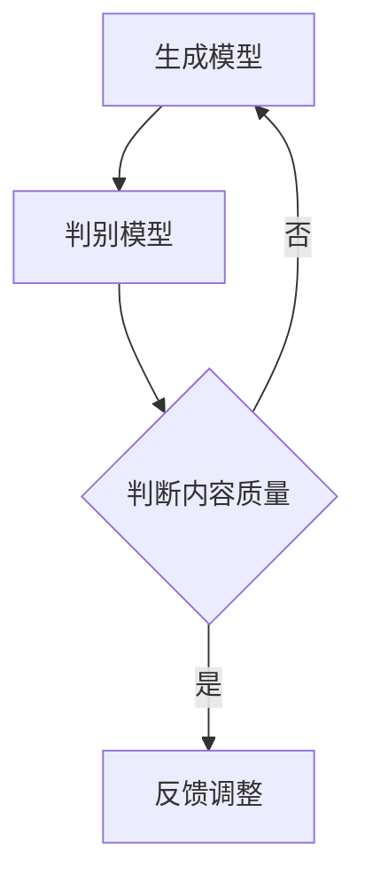
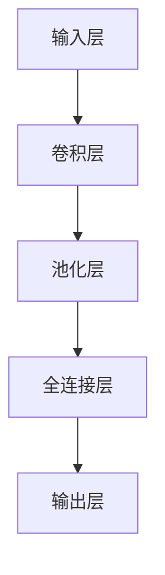
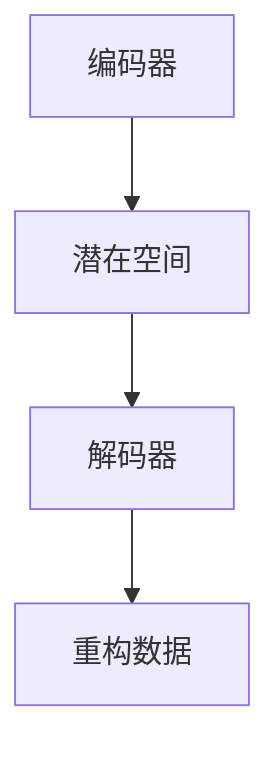
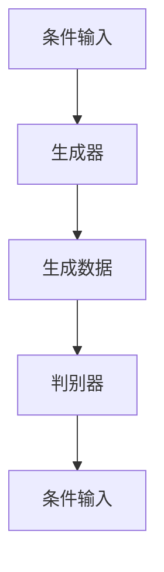
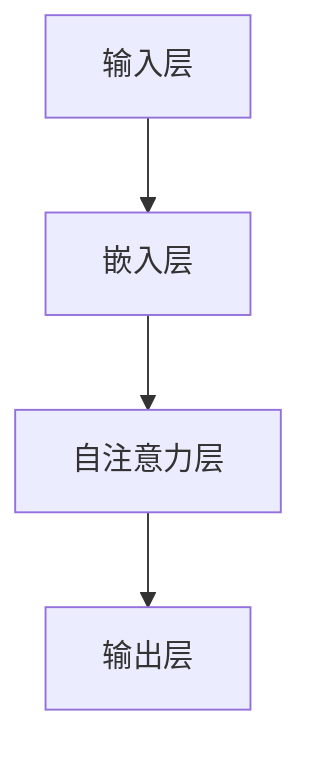

                 

### 生成式AIGC：AI技术的前沿探索

> **关键词**：生成式AI、AIGC、GAN、VAE、计算机视觉、自然语言处理、推荐系统

> **摘要**：本文深入探讨了生成式人工智能（AIGC）的概念、技术原理、应用场景和实践案例。通过逐步分析，我们详细介绍了AIGC的核心组成部分、生成对抗网络（GAN）和变分自编码器（VAE）的原理，以及其在计算机视觉、自然语言处理和推荐系统等领域的实际应用。此外，我们还讨论了AIGC模型的训练与优化策略，以及其在媒体与娱乐行业中的创新应用。文章最后，对AIGC技术面临的挑战和未来发展趋势进行了展望。

---

### 《生成式AIGC：AI技术的前沿探索》目录大纲

1. **第一部分：AIGC技术基础与概念**
    1.1 AIGC概述
        - AIGC的概念与定义
        - AIGC技术的发展历程
        - AIGC的核心组成部分
    1.2 生成式AI原理
        - 生成对抗网络（GAN）原理
        - 变分自编码器（VAE）原理
        - 其他生成式模型
    1.3 AIGC应用场景与案例分析
        - AIGC在计算机视觉中的应用
        - AIGC在自然语言处理中的应用
        - AIGC在推荐系统中的应用

2. **第二部分：AIGC技术实践与优化**
    2.1 AIGC模型训练与优化
        - 数据准备与预处理
        - 训练策略与调参技巧
        - 模型评估与调试
    2.2 AIGC项目实战
        - 计算机视觉项目实战
        - 自然语言处理项目实战
        - 推荐系统项目实战

3. **第三部分：AIGC在行业中的应用与挑战**
    3.1 AIGC在媒体与娱乐行业的应用
        - 娱乐内容生成与编辑
        - 广告创意生成与优化
    3.2 AIGC面临的挑战与未来展望
        - 技术挑战
        - 法规与伦理挑战
        - 未来发展趋势

---

### 第一部分：AIGC技术基础与概念

#### 第1章：AIGC概述

##### 1.1 AIGC的概念与定义

AIGC（Autonomous Intelligent Generation and Control）是一种生成式人工智能技术，它通过深度学习算法自动生成内容并进行控制。AIGC技术涵盖了计算机视觉、自然语言处理、音频处理等多个领域，具有强大的内容生成能力。

在计算机视觉领域，AIGC技术可以生成逼真的图像和视频；在自然语言处理领域，AIGC技术可以生成高质量的文本和对话；在音频处理领域，AIGC技术可以生成自然的语音和音乐。通过这些应用，AIGC技术为各个行业带来了创新和变革。

AIGC技术的基本原理是生成对抗网络（GAN）和变分自编码器（VAE）。生成对抗网络（GAN）通过生成器和判别器的对抗训练，生成高质量的数据；变分自编码器（VAE）通过编码器和解码器的协同工作，实现数据的生成和重构。

##### 1.2 AIGC技术的发展历程

AIGC技术起源于生成对抗网络（GAN）的提出。在2014年，Ian Goodfellow等人首次提出了GAN的概念，并展示了GAN在图像生成方面的强大能力。随后，GAN技术得到了广泛关注和应用。

GAN的提出标志着生成式人工智能的新纪元，为AIGC技术的发展奠定了基础。在GAN的基础上，研究者们提出了许多改进和扩展的模型，如变分自编码器（VAE）、条件生成对抗网络（CGAN）和生成式预训练模型（GPT）等。

近年来，随着深度学习技术的不断进步，AIGC技术也在不断发展和完善。越来越多的应用场景被探索和实现，如图像生成与超分辨率、图像编辑与风格迁移、文本生成与摘要、对话系统与问答、个性化推荐等。

##### 1.3 AIGC的核心组成部分

AIGC技术主要由生成模型和判别模型构成。生成模型负责生成内容，判别模型负责判断生成内容的质量。

生成模型通常采用深度学习算法，如生成对抗网络（GAN）、变分自编码器（VAE）等。判别模型也采用深度学习算法，如卷积神经网络（CNN）、循环神经网络（RNN）等。

在AIGC技术的训练过程中，生成模型和判别模型通过对抗训练相互协作。生成模型通过不断生成高质量的数据来欺骗判别模型，而判别模型则通过不断提高对生成数据的辨别能力来对抗生成模型。

这种对抗训练过程使得生成模型和判别模型在不断的迭代中不断提高性能，最终实现高质量的数据生成。

#### Mermaid 流程图



### 第2章：生成式AI原理

生成式AI是AIGC技术的重要组成部分，它通过深度学习算法实现数据的自动生成。本章将详细探讨生成对抗网络（GAN）和变分自编码器（VAE）的原理，以及其他生成式模型。

#### 2.1 生成对抗网络（GAN）原理

生成对抗网络（GAN）由生成器（Generator）和判别器（Discriminator）两部分组成。生成器尝试生成逼真的数据，而判别器则试图区分真实数据和生成数据。通过两个模型的对抗训练，生成器不断提高生成数据的质量。

##### 2.1.1 GAN的基础架构

GAN的基础架构包括生成器（G）、判别器（D）和损失函数（L）。生成器的输入是随机噪声，输出是生成数据；判别器的输入是真实数据和生成数据，输出是概率。

生成器的目标是最小化判别器判断生成数据为虚假数据的概率；判别器的目标是最大化判断真实数据和生成数据的区别。

下面是一个GAN的基础架构的Mermaid流程图：

```mermaid
graph TD
A[噪声] --> B{G[生成器]}
B --> C[生成数据]
C --> D[判别器]
D --> E[真实数据]
E --> D
```

##### 2.1.2 GAN的生成与判别模型

生成模型（G）通常采用卷积神经网络（CNN）或循环神经网络（RNN）结构，负责生成数据。判别模型（D）也采用CNN或RNN结构，负责判断数据真实性。

生成模型的基本架构如下：



判别模型的基本架构如下：


##### 2.1.3 GAN的优化算法

GAN的训练过程中，生成器和判别器都需要进行优化。生成器通过减少判别器判断生成数据为虚假数据的概率进行优化；判别器通过提高判断生成数据为虚假数据的概率进行优化。

生成器的优化目标是最小化生成数据的损失函数，即：

$$
L_G = -\log(D(G(z)))
$$

其中，$D$ 表示判别器，$G$ 表示生成器，$z$ 表示随机噪声。

判别器的优化目标是最小化生成数据的损失函数和真实数据的损失函数，即：

$$
L_D = -[\log(D(x)) + \log(1 - D(G(z))]
$$

其中，$x$ 表示真实数据。

为了防止生成器和判别器之间的模式崩溃，通常需要使用一些技巧，如梯度惩罚、谱归一化等。

##### 2.2 变分自编码器（VAE）原理

变分自编码器（VAE）是一种基于概率生成模型的神经网络结构。VAE将编码器和解码器整合在一起，通过概率分布生成数据。

##### 2.2.1 VAE的基础架构

VAE的架构包括编码器（Encoder）和解码器（Decoder）。编码器将输入数据映射到一个潜在空间中的概率分布；解码器从潜在空间中采样，生成重构数据。

下面是VAE的基础架构的Mermaid流程图：



##### 2.2.2 VAE的编码与解码过程

编码器（Encoder）将输入数据压缩成一个潜在向量，这个向量代表了输入数据的概率分布。解码器（Decoder）从潜在空间中采样，重构出与输入数据相似的数据。

编码器的基本架构如下：


解码器的基本架构如下：


##### 2.2.3 VAE的损失函数与优化

VAE的损失函数由重构损失和KL散度损失两部分组成。重构损失用于衡量重构数据与输入数据的差异；KL散度损失用于衡量编码器生成的概率分布与真实概率分布的差异。

$$
L_{\text{VAE}} = L_{\text{recon}} + \beta \cdot L_{\text{KL}}
$$

其中，$L_{\text{recon}}$ 表示重构损失，$L_{\text{KL}}$ 表示KL散度损失，$\beta$ 是调节参数。

优化VAE模型时，通过梯度下降法调整编码器和解码器的参数，使模型最小化损失函数。

VAE的优化算法伪代码如下：

```python
while epoch < num_epochs:
    for x in dataset:
        # 编码器和解码器参数更新
        encoder_params, decoder_params = optimize_VAE(x)
        # 更新KL散度损失和重构损失
        KL_loss, recon_loss = compute_losses(encoder_params, decoder_params, x)
        # 总损失
        total_loss = KL_loss + recon_loss
        # 梯度计算和参数更新
        grads = compute_gradients(total_loss, encoder_params, decoder_params)
        update_parameters(encoder_params, decoder_params, grads)
    epoch += 1
```

##### 2.3 其他生成式模型

除了GAN和VAE，还有许多其他生成式模型，如条件生成对抗网络（CGAN）、生成式预训练模型（GPT）等。

##### 2.3.1 条件生成对抗网络（CGAN）

条件生成对抗网络（CGAN）是GAN的一种扩展，它引入了条件信息来指导生成过程。CGAN通过在生成器和判别器中添加条件层，使得模型可以生成符合特定条件的数据。

CGAN的基本架构如下：



##### 2.3.2 生成式预训练模型（GPT）

生成式预训练模型（GPT）是一种大规模语言模型，通过预训练生成大规模文本数据。GPT采用Transformer架构，具有强大的生成能力和上下文理解能力。

GPT的基本架构如下：



### 第3章：AIGC应用场景与案例分析

生成式人工智能（AIGC）技术凭借其强大的生成能力，在多个领域得到了广泛应用。本章将详细探讨AIGC在计算机视觉、自然语言处理和推荐系统等领域的应用，并分享一些具体的案例。

#### 3.1 AIGC在计算机视觉中的应用

##### 3.1.1 图像生成与超分辨率

图像生成与超分辨率是AIGC技术在计算机视觉中的重要应用。通过生成对抗网络（GAN）和变分自编码器（VAE）等模型，可以生成高质量的超分辨率图像。

超分辨率图像生成项目通过GAN模型，将低分辨率图像转换为高分辨率图像。以下是一个超分辨率图像生成的项目示例：

```python
import tensorflow as tf
from tensorflow.keras.models import Model
from tensorflow.keras.layers import Input, Conv2D, Conv2DTranspose, BatchNormalization, LeakyReLU, Concatenate

# 定义生成器和判别器模型
def build_generator():
    inputs = Input(shape=(64, 64, 1))
    x = Conv2D(64, (7, 7), padding='same')(inputs)
    x = LeakyReLU(alpha=0.2)(x)
    x = BatchNormalization()(x)

    x = Conv2DTranspose(64, (5, 5), strides=(2, 2), padding='same')(x)
    x = LeakyReLU(alpha=0.2)(x)
    x = BatchNormalization()(x)

    outputs = Conv2DTranspose(1, (5, 5), strides=(2, 2), padding='same')(x)
    model = Model(inputs, outputs)
    return model

def build_discriminator():
    inputs = Input(shape=(64, 64, 3))
    x = Conv2D(64, (5, 5), strides=(2, 2), padding='same')(inputs)
    x = LeakyReLU(alpha=0.2)(x)

    x = Conv2D(128, (5, 5), strides=(2, 2), padding='same')(x)
    x = LeakyReLU(alpha=0.2)(x)

    outputs = Flatten()(x)
    outputs = Dense(1, activation='sigmoid')(outputs)
    model = Model(inputs, outputs)
    return model

# 定义超分辨率模型
def build_sr_model():
    inputs = Input(shape=(64, 64, 1))
    x = build_generator()(inputs)
    outputs = Concatenate()([inputs, x])
    model = Model(inputs, outputs)
    return model

# 编译模型
generator = build_generator()
discriminator = build_discriminator()
sr_model = build_sr_model()

discriminator.compile(optimizer='adam', loss='binary_crossentropy')
sr_model.compile(optimizer='adam', loss='binary_crossentropy')

# 训练模型
for epoch in range(num_epochs):
    for low_res_images in low_res_dataset:
        low_res_images = low_res_images / 127.5 - 1.0
        noise = np.random.normal(0, 1, (low_res_images.shape[0], 64, 64, 1))
        generated_images = generator.predict(noise)
        real_images = low_res_images

        # 训练判别器
        d_loss_real = discriminator.train_on_batch(real_images, np.ones((real_images.shape[0], 1)))
        d_loss_fake = discriminator.train_on_batch(generated_images, np.zeros((generated_images.shape[0], 1)))
        d_loss = 0.5 * np.add(d_loss_real, d_loss_fake)

        # 训练超分辨率模型
        sr_loss = sr_model.train_on_batch(low_res_images, real_images)
        print(f"Epoch: {epoch}, SR Loss: {sr_loss}, D Loss: {d_loss}")
```

##### 3.1.2 图像编辑与风格迁移

图像编辑与风格迁移利用AIGC技术，可以将一种图像风格迁移到另一种风格。以下是一个图像风格迁移的项目示例：

```python
import tensorflow as tf
from tensorflow.keras.models import Model
from tensorflow.keras.layers import Input, Conv2D, Conv2DTranspose, BatchNormalization, LeakyReLU, Concatenate

# 定义生成器和判别器模型
def build_generator():
    inputs = Input(shape=(256, 256, 3))
    x = Conv2D(64, (5, 5), strides=(2, 2), padding='same')(inputs)
    x = LeakyReLU(alpha=0.2)(x)

    x = Conv2D(128, (5, 5), strides=(2, 2), padding='same')(x)
    x = LeakyReLU(alpha=0.2)(x)

    x = Conv2D(256, (5, 5), strides=(2, 2), padding='same')(x)
    x = LeakyReLU(alpha=0.2)(x)

    outputs = Conv2D(3, (5, 5), strides=(2, 2), padding='same')(x)
    model = Model(inputs, outputs)
    return model

def build_discriminator():
    inputs = Input(shape=(256, 256, 3))
    x = Conv2D(64, (5, 5), strides=(2, 2), padding='same')(inputs)
    x = LeakyReLU(alpha=0.2)(x)

    x = Conv2D(128, (5, 5), strides=(2, 2), padding='same')(x)
    x = LeakyReLU(alpha=0.2)(x)

    outputs = Flatten()(x)
    outputs = Dense(1, activation='sigmoid')(outputs)
    model = Model(inputs, outputs)
    return model

# 定义风格迁移模型
def build_style_transfer_model():
    inputs = Input(shape=(256, 256, 3))
    x = build_generator()(inputs)
    outputs = Concatenate()([inputs, x])
    model = Model(inputs, outputs)
    return model

# 编译模型
generator = build_generator()
discriminator = build_discriminator()
style_transfer_model = build_style_transfer_model()

discriminator.compile(optimizer='adam', loss='binary_crossentropy')
style_transfer_model.compile(optimizer='adam', loss='binary_crossentropy')

# 训练模型
for epoch in range(num_epochs):
    for input_images, target_images in style_transfer_dataset:
        input_images = input_images / 127.5 - 1.0
        target_images = target_images / 127.5 - 1.0

        # 训练判别器
        d_loss_real = discriminator.train_on_batch(target_images, np.ones((target_images.shape[0], 1)))
        d_loss_fake = discriminator.train_on_batch(input_images, np.zeros((input_images.shape[0], 1)))
        d_loss = 0.5 * np.add(d_loss_real, d_loss_fake)

        # 训练风格迁移模型
        style_transfer_loss = style_transfer_model.train_on_batch(input_images, target_images)
        print(f"Epoch: {epoch}, Style Transfer Loss: {style_transfer_loss}, D Loss: {d_loss}")
```

#### 3.2 AIGC在自然语言处理中的应用

##### 3.2.1 文本生成与摘要

文本生成与摘要是AIGC技术在自然语言处理中的重要应用。通过生成对抗网络（GAN）和生成式预训练模型（GPT）等模型，可以生成高质量的文本和摘要。

文本生成项目通过GPT模型，自动生成文本内容。以下是一个文本生成项目的示例：

```python
import tensorflow as tf
from tensorflow.keras.models import Model
from tensorflow.keras.layers import Input, Embedding, LSTM, Dense

# 定义文本生成模型
def build_text_generator():
    inputs = Input(shape=(None,))
    x = Embedding(vocab_size, embedding_dim)(inputs)
    x = LSTM(units, return_sequences=True)(x)
    outputs = Dense(vocab_size, activation='softmax')(x)
    model = Model(inputs, outputs)
    return model

# 编译模型
text_generator = build_text_generator()
text_generator.compile(optimizer='adam', loss='categorical_crossentropy')

# 训练模型
for epoch in range(num_epochs):
    for sentences in text_dataset:
        sentences = preprocess_sentences(sentences)
        one_hot_sentences = convert_sentences_to_one_hot(sentences, vocab_size)
        text_generator.train_on_batch(one_hot_sentences, one_hot_sentences)
        print(f"Epoch: {epoch}, Training completed.")
```

文本摘要项目通过GPT模型，自动生成文本摘要。以下是一个文本摘要项目的示例：

```python
import tensorflow as tf
from tensorflow.keras.models import Model
from tensorflow.keras.layers import Input, Embedding, LSTM, Dense

# 定义文本摘要模型
def build_text_summarizer():
    inputs = Input(shape=(None,))
    x = Embedding(vocab_size, embedding_dim)(inputs)
    x = LSTM(units, return_sequences=True)(x)
    outputs = Dense(vocab_size, activation='softmax')(x)
    model = Model(inputs, outputs)
    return model

# 编译模型
text_summarizer = build_text_summarizer()
text_summarizer.compile(optimizer='adam', loss='categorical_crossentropy')

# 训练模型
for epoch in range(num_epochs):
    for texts, summaries in text_dataset:
        texts = preprocess_texts(texts)
        summaries = preprocess_summaries(summaries)
        one_hot_texts = convert_texts_to_one_hot(texts, vocab_size)
        one_hot_summaries = convert_summaries_to_one_hot(summaries, vocab_size)
        text_summarizer.train_on_batch(one_hot_texts, one_hot_summaries)
        print(f"Epoch: {epoch}, Training completed.")
```

##### 3.2.2 对话系统与问答

对话系统与问答利用AIGC技术，可以实现智能对话和自动问答。以下是一个对话系统与问答项目的示例：

```python
import tensorflow as tf
from tensorflow.keras.models import Model
from tensorflow.keras.layers import Input, Embedding, LSTM, Dense

# 定义对话系统模型
def build_dialogue_system():
    inputs = Input(shape=(None,))
    x = Embedding(vocab_size, embedding_dim)(inputs)
    x = LSTM(units, return_sequences=True)(x)
    outputs = Dense(vocab_size, activation='softmax')(x)
    model = Model(inputs, outputs)
    return model

# 编译模型
dialogue_system = build_dialogue_system()
dialogue_system.compile(optimizer='adam', loss='categorical_crossentropy')

# 训练模型
for epoch in range(num_epochs):
    for conversations in dialogue_dataset:
        conversations = preprocess_conversations(conversations)
        one_hot_conversations = convert_conversations_to_one_hot(conversations, vocab_size)
        dialogue_system.train_on_batch(one_hot_conversations, one_hot_conversations)
        print(f"Epoch: {epoch}, Training completed.")

# 实现问答功能
def answer_question(question):
    question = preprocess_question(question)
    one_hot_question = convert_question_to_one_hot(question, vocab_size)
    predicted_answers = dialogue_system.predict(one_hot_question)
    predicted_answer = decode_answers(predicted_answers)
    return predicted_answer
```

#### 3.3 AIGC在推荐系统中的应用

##### 3.3.1 个性化内容推荐

个性化内容推荐利用AIGC技术，可以根据用户的历史行为和偏好，生成个性化的推荐内容。以下是一个个性化推荐项目的示例：

```python
import tensorflow as tf
from tensorflow.keras.models import Model
from tensorflow.keras.layers import Input, Embedding, LSTM, Dense

# 定义个性化推荐模型
def build_content_recommendation_model():
    user_input = Input(shape=(user_sequence_length,))
    item_input = Input(shape=(item_sequence_length,))

    user_embedding = Embedding(user_vocab_size, user_embedding_size)(user_input)
    item_embedding = Embedding(item_vocab_size, item_embedding_size)(item_input)

    concatenated = Concatenate()([user_embedding, item_embedding])
    lstm_output = LSTM(units)(concatenated)

    outputs = Dense(item_vocab_size, activation='softmax')(lstm_output)
    model = Model(inputs=[user_input, item_input], outputs=outputs)
    return model

# 编译模型
content_recommendation_model = build_content_recommendation_model()
content_recommendation_model.compile(optimizer='adam', loss='categorical_crossentropy')

# 训练模型
for epoch in range(num_epochs):
    for user_sequences, item_sequences, labels in content_recommendation_dataset:
        user_sequences = preprocess_user_sequences(user_sequences)
        item_sequences = preprocess_item_sequences(item_sequences)
        labels = preprocess_labels(labels)
        content_recommendation_model.train_on_batch([user_sequences, item_sequences], labels)
        print(f"Epoch: {epoch}, Training completed.")

# 实现个性化推荐功能
def recommend_items(user_sequence):
    user_sequence = preprocess_user_sequence(user_sequence)
    item_sequences = generate_item_sequences()
    item_sequences = preprocess_item_sequences(item_sequences)
    predicted_labels = content_recommendation_model.predict([user_sequence, item_sequences])
    recommended_items = decode_labels(predicted_labels)
    return recommended_items
```

##### 3.3.2 新品推荐与广告投放

新品推荐与广告投放利用AIGC技术，可以生成针对特定用户的新品推荐和广告文案。以下是一个新品推荐与广告投放项目的示例：

```python
import tensorflow as tf
from tensorflow.keras.models import Model
from tensorflow.keras.layers import Input, Embedding, LSTM, Dense

# 定义新品推荐模型
def build_new_item_recommendation_model():
    user_input = Input(shape=(user_sequence_length,))
    item_input = Input(shape=(item_sequence_length,))

    user_embedding = Embedding(user_vocab_size, user_embedding_size)(user_input)
    item_embedding = Embedding(item_vocab_size, item_embedding_size)(item_input)

    concatenated = Concatenate()([user_embedding, item_embedding])
    lstm_output = LSTM(units)(concatenated)

    outputs = Dense(item_vocab_size, activation='softmax')(lstm_output)
    model = Model(inputs=[user_input, item_input], outputs=outputs)
    return model

# 编译模型
new_item_recommendation_model = build_new_item_recommendation_model()
new_item_recommendation_model.compile(optimizer='adam', loss='categorical_crossentropy')

# 训练模型
for epoch in range(num_epochs):
    for user_sequences, item_sequences, labels in new_item_recommendation_dataset:
        user_sequences = preprocess_user_sequences(user_sequences)
        item_sequences = preprocess_item_sequences(item_sequences)
        labels = preprocess_labels(labels)
        new_item_recommendation_model.train_on_batch([user_sequences, item_sequences], labels)
        print(f"Epoch: {epoch}, Training completed.")

# 定义广告投放模型
def build_advertisement_model():
    user_input = Input(shape=(user_sequence_length,))
    item_input = Input(shape=(item_sequence_length,))

    user_embedding = Embedding(user_vocab_size, user_embedding_size)(user_input)
    item_embedding = Embedding(item_vocab_size, item_embedding_size)(item_input)

    concatenated = Concatenate()([user_embedding, item_embedding])
    lstm_output = LSTM(units)(concatenated)

    outputs = Dense(1, activation='sigmoid')(lstm_output)
    model = Model(inputs=[user_input, item_input], outputs=outputs)
    return model

# 编译模型
advertisement_model = build_advertisement_model()
advertisement_model.compile(optimizer='adam', loss='binary_crossentropy')

# 训练模型
for epoch in range(num_epochs):
    for user_sequences, item_sequences, labels in advertisement_dataset:
        user_sequences = preprocess_user_sequences(user_sequences)
        item_sequences = preprocess_item_sequences(item_sequences)
        labels = preprocess_labels(labels)
        advertisement_model.train_on_batch([user_sequences, item_sequences], labels)
        print(f"Epoch: {epoch}, Training completed.")

# 实现新品推荐与广告投放功能
def recommend_new_items_and_advertisements(user_sequence):
    user_sequence = preprocess_user_sequence(user_sequence)
    item_sequences = generate_item_sequences()
    item_sequences = preprocess_item_sequences(item_sequences)
    predicted_labels = new_item_recommendation_model.predict([user_sequence, item_sequences])
    recommended_items = decode_labels(predicted_labels)
    
    advertisement_predictions = advertisement_model.predict([user_sequence, item_sequences])
    advertisement_probabilities = decode_advertisement_predictions(advertisement_predictions)
    
    recommended_items = recommended_items[advertisement_probabilities > threshold]
    return recommended_items
```

### 第二部分：AIGC技术实践与优化

生成式人工智能（AIGC）技术在实践过程中，模型训练与优化是关键环节。本章将详细介绍AIGC模型训练与优化策略，包括数据准备与预处理、训练策略与调参技巧、模型评估与调试。

#### 4.1 数据准备与预处理

数据准备与预处理是AIGC模型训练的基础步骤。高质量的数据能够提升模型性能，降低过拟合风险。以下为数据准备与预处理的关键步骤：

##### 4.1.1 数据清洗与归一化

数据清洗是去除噪声、异常值和缺失值的过程。在图像数据中，可能需要去除噪点和标记错误；在文本数据中，可能需要去除HTML标签、停用词和标点符号。

数据归一化是将数据转换到同一尺度，以消除不同特征之间的量级差异。在图像数据中，通常将像素值缩放到[0, 1]或[-1, 1]；在文本数据中，可以使用词频归一化或TF-IDF变换。

##### 4.1.2 数据增强与采样

数据增强是通过变换原始数据生成更多样本的过程，有助于提高模型泛化能力。常见的图像增强方法包括旋转、翻转、缩放、裁剪等；文本增强方法包括同义词替换、句子重排等。

采样是从训练数据中随机选择样本的过程，有助于提高模型训练效果。在生成对抗网络（GAN）中，通常使用随机采样生成对抗样本。

##### 4.1.3 数据集划分与验证

数据集划分是将数据分为训练集、验证集和测试集的过程。通常使用80%的数据作为训练集，10%的数据作为验证集，10%的数据作为测试集。验证集用于调整模型参数，测试集用于评估模型性能。

#### 4.2 训练策略与调参技巧

训练策略与调参技巧对AIGC模型性能至关重要。以下为一些常用的训练策略与调参技巧：

##### 4.2.1 学习率调整

学习率是模型训练过程中调整参数的关键参数。常用的学习率调整策略包括固定学习率、指数衰减学习率和学习率周期性调整等。固定学习率适用于初始阶段，指数衰减学习率适用于中后期，学习率周期性调整则结合两者优势。

```python
# 固定学习率
learning_rate = 0.001
optimizer = tf.keras.optimizers.Adam(learning_rate=learning_rate)

# 指数衰减学习率
initial_learning_rate = 0.001
decay_steps = 1000
decay_rate = 0.96
learning_rate = initial_learning_rate / (1 + decay_rate ** (epoch // decay_steps))

# 学习率周期性调整
learning_rate_schedule = [
    (0, 0.1),
    (5000, 0.01),
    (10000, 0.001),
]
def get_learning_rate(epoch):
    for step, rate in learning_rate_schedule:
        if epoch >= step:
            return rate
    return 0.001
```

##### 4.2.2 优化器选择

优化器是模型训练过程中调整参数的方法。常用的优化器包括随机梯度下降（SGD）、动量优化器（Momentum）、Adam优化器等。选择合适的优化器有助于提高模型训练效果。

```python
# 随机梯度下降（SGD）
optimizer = tf.keras.optimizers.SGD(learning_rate=0.001, momentum=0.9)

# 动量优化器
optimizer = tf.keras.optimizers.Momentum(learning_rate=0.001, momentum=0.9)

# Adam优化器
optimizer = tf.keras.optimizers.Adam(learning_rate=0.001, beta_1=0.9, beta_2=0.999)
```

##### 4.2.3 模型正则化

模型正则化是一种防止过拟合的技术，包括权重正则化、Dropout和Early Stopping等。权重正则化通过增加正则化项，降低模型复杂度；Dropout通过随机丢弃部分神经元，提高模型泛化能力；Early Stopping通过提前停止训练，避免过拟合。

```python
# 权重正则化
def create_model_with_regularization():
    model = keras.Sequential([
        keras.layers.Conv2D(filters, kernel_size, activation='relu', input_shape=input_shape, padding='same', kernel_regularizer=keras.regularizers.l2(0.01)),
        keras.layers.MaxPooling2D(pool_size=(2, 2)),
        keras.layers.Dropout(0.5),
        keras.layers.Flatten(),
        keras.layers.Dense(num_classes, activation='softmax')
    ])
    return model

# Dropout
model.add(Dropout(0.5))

# Early Stopping
early_stopping = keras.callbacks.EarlyStopping(monitor='val_loss', patience=10, restore_best_weights=True)
```

#### 4.3 模型评估与调试

模型评估与调试是确保AIGC模型性能的重要步骤。以下为一些常用的评估指标与调试方法：

##### 4.3.1 评价指标与阈值设置

不同的任务需要使用不同的评价指标。在分类任务中，常用的评价指标包括准确率、召回率、F1值、精确率等。在回归任务中，常用的评价指标包括均方误差（MSE）、平均绝对误差（MAE）等。

阈值设置是二分类模型中的重要环节，合理的阈值设置可以平衡准确率与召回率。常用的阈值设置方法包括手动设置、交叉验证法和曲线下面积最大化法等。

```python
from sklearn.metrics import precision_score, recall_score, f1_score

# 计算准确率、召回率、F1值
accuracy = precision_score(y_true, y_pred)
recall = recall_score(y_true, y_pred)
f1 = f1_score(y_true, y_pred)

# 手动设置阈值
threshold = 0.5

# 交叉验证法设置阈值
from sklearn.model_selection import GridSearchCV

param_grid = {'threshold': [0.1, 0.2, 0.3, 0.4, 0.5]}
grid_search = GridSearchCV(estimator=model, param_grid=param_grid, cv=5, scoring='f1')
grid_search.fit(X_train, y_train)
best_threshold = grid_search.best_params_['threshold']

# 曲线下面积最大化法设置阈值
from sklearn.metrics import roc_curve, auc

fpr, tpr, _ = roc_curve(y_true, y_score)
roc_auc = auc(fpr, tpr)

# 找到最大AUC对应的阈值
threshold = find_best_threshold(fpr, tpr, roc_auc)
```

##### 4.3.2 模型调试与优化

模型调试与优化是提高模型性能的重要环节。以下为一些常用的调试方法：

- **超参数调优**：使用网格搜索、贝叶斯优化等方法，自动调整模型超参数。
- **特征工程**：通过特征选择、特征提取等方法，提高模型对特征的理解能力。
- **模型集成**：通过集成多个模型，提高模型整体性能。
- **模型压缩与加速**：使用模型压缩、量化等技术，降低模型计算复杂度，提高模型运行速度。

```python
from sklearn.model_selection import GridSearchCV

# 超参数调优
param_grid = {
    'model__kernel': ['linear', 'rbf', 'poly'],
    'model__C': [0.1, 1, 10],
}
grid_search = GridSearchCV(estimator=model, param_grid=param_grid, cv=5, scoring='accuracy')
grid_search.fit(X_train, y_train)

# 特征工程
from sklearn.feature_selection import SelectKBest, f_classif

selector = SelectKBest(score_func=f_classif, k=10)
X_train_selected = selector.fit_transform(X_train, y_train)
X_test_selected = selector.transform(X_test)

# 模型集成
from sklearn.ensemble import VotingClassifier

ensemble_model = VotingClassifier(estimators=[
    ('model1', model1),
    ('model2', model2),
    ('model3', model3)
], voting='soft')
ensemble_model.fit(X_train, y_train)

# 模型压缩与加速
from tensorflow_model_optimization import create_optimizer

quantize_model = create_optimizer.create_optimizer(model, quantization_config=quantization_config)
quantize_model.fit(X_train, y_train, epochs=10)
```

### 第三部分：AIGC在行业中的应用与挑战

#### 第6章：AIGC在媒体与娱乐行业的应用

AIGC技术在媒体与娱乐行业中的应用正逐步改变着传统的内容创作和分发模式。以下将探讨AIGC技术在该行业的具体应用及其带来的变革。

##### 6.1 娱乐内容生成与编辑

##### 6.1.1 视频生成与剪辑

视频生成与剪辑是AIGC技术在媒体与娱乐行业中的一个重要应用。通过生成对抗网络（GAN）和变分自编码器（VAE）等模型，可以自动生成高质量的视频内容，从而降低内容创作的成本和时间。

视频生成的一个典型案例是《StarGAN》，它通过生成对抗网络（GAN）实现了人脸更换技术。给定一个视频序列和目标人脸，StarGAN可以将视频中的人脸自动替换为目标人脸。

以下是一个简单的视频生成与剪辑项目的伪代码示例：

```python
import tensorflow as tf
from tensorflow.keras.models import Model
from tensorflow.keras.layers import Input, Conv2D, Conv2DTranspose, BatchNormalization, LeakyReLU, Concatenate

# 定义生成器和判别器模型
def build_generator():
    inputs = Input(shape=(256, 256, 3))
    x = Conv2D(64, (5, 5), strides=(2, 2), padding='same')(inputs)
    x = LeakyReLU(alpha=0.2)(x)

    x = Conv2D(128, (5, 5), strides=(2, 2), padding='same')(x)
    x = LeakyReLU(alpha=0.2)(x)

    x = Conv2D(256, (5, 5), strides=(2, 2), padding='same')(x)
    x = LeakyReLU(alpha=0.2)(x)

    outputs = Conv2D(3, (5, 5), strides=(2, 2), padding='same')(x)
    model = Model(inputs, outputs)
    return model

def build_discriminator():
    inputs = Input(shape=(256, 256, 3))
    x = Conv2D(64, (5, 5), strides=(2, 2), padding='same')(inputs)
    x = LeakyReLU(alpha=0.2)(x)

    x = Conv2D(128, (5, 5), strides=(2, 2), padding='same')(x)
    x = LeakyReLU(alpha=0.2)(x)

    outputs = Flatten()(x)
    outputs = Dense(1, activation='sigmoid')(outputs)
    model = Model(inputs, outputs)
    return model

# 定义视频生成模型
def build_video_generator():
    inputs = Input(shape=(256, 256, 3))
    x = build_generator()(inputs)
    outputs = Concatenate()([inputs, x])
    model = Model(inputs, outputs)
    return model

# 编译模型
generator = build_generator()
discriminator = build_discriminator()
video_generator = build_video_generator()

discriminator.compile(optimizer='adam', loss='binary_crossentropy')
video_generator.compile(optimizer='adam', loss='binary_crossentropy')

# 训练模型
for epoch in range(num_epochs):
    for video_sequence, target_sequence in video_dataset:
        video_sequence = preprocess_video_sequence(video_sequence)
        target_sequence = preprocess_video_sequence(target_sequence)

        # 训练判别器
        d_loss_real = discriminator.train_on_batch(target_sequence, np.ones((target_sequence.shape[0], 1)))
        d_loss_fake = discriminator.train_on_batch(video_sequence, np.zeros((video_sequence.shape[0], 1)))
        d_loss = 0.5 * np.add(d_loss_real, d_loss_fake)

        # 训练视频生成模型
        video_generator_loss = video_generator.train_on_batch(video_sequence, target_sequence)
        print(f"Epoch: {epoch}, Video Generator Loss: {video_generator_loss}, D Loss: {d_loss}")
```

##### 6.1.2 音乐创作与风格模仿

音乐创作与风格模仿是AIGC技术在音乐制作中的一个重要应用。通过生成式预训练模型（如GPT-2）和变分自编码器（VAE）等模型，可以自动生成新的音乐作品，模仿特定的音乐风格。

一个典型的音乐创作项目是通过变分自编码器（VAE）实现的音乐风格模仿。以下是一个简单的音乐创作项目的伪代码示例：

```python
import tensorflow as tf
from tensorflow.keras.models import Model
from tensorflow.keras.layers import Input, Conv1D, Conv1DTranspose, BatchNormalization, LeakyReLU, Concatenate

# 定义编码器和解码器模型
def build_encoder():
    inputs = Input(shape=(sequence_length, 1))
    x = Conv1D(64, (3, 3), padding='same')(inputs)
    x = LeakyReLU(alpha=0.2)(x)

    x = Conv1D(128, (3, 3), padding='same')(x)
    x = LeakyReLU(alpha=0.2)(x)

    outputs = Flatten()(x)
    model = Model(inputs, outputs)
    return model

def build_decoder():
    inputs = Input(shape=(hidden_size,))
    x = Reshape((sequence_length, 1))(inputs)

    x = Conv1DTranspose(128, (3, 3), strides=(2, 2), padding='same')(x)
    x = LeakyReLU(alpha=0.2)(x)

    x = Conv1DTranspose(64, (3, 3), strides=(2, 2), padding='same')(x)
    x = LeakyReLU(alpha=0.2)(x)

    outputs = Conv1D(1, (3, 3), padding='same')(x)
    model = Model(inputs, outputs)
    return model

# 定义VAE模型
def build_vae():
    encoder = build_encoder()
    decoder = build_decoder()
    hidden_size = decoder.input_shape[1]

    z = Input(shape=(hidden_size,))
    generated_sequence = decoder(z)

    outputs = Concatenate()([inputs, generated_sequence])
    vae = Model(inputs, outputs)
    return vae

# 编译VAE模型
encoder = build_encoder()
decoder = build_decoder()
vae = build_vae()

vae.compile(optimizer='adam', loss='mse')

# 训练VAE模型
for epoch in range(num_epochs):
    for sequence in dataset:
        sequence = preprocess_sequence(sequence)
        z = encoder.predict(sequence)
        generated_sequence = decoder.predict(z)
        vae_loss = vae.train_on_batch(sequence, sequence)
        print(f"Epoch: {epoch}, VAE Loss: {vae_loss}")
```

##### 6.2 广告创意生成与优化

广告创意生成与优化是AIGC技术在广告营销中的一个重要应用。通过生成对抗网络（GAN）和生成式预训练模型（如GPT）等模型，可以自动生成具有吸引力的广告文案和视觉内容，从而提高广告效果。

一个典型的广告创意生成项目是通过生成对抗网络（GAN）实现广告文案的自动生成。以下是一个简单的广告创意生成项目的伪代码示例：

```python
import tensorflow as tf
from tensorflow.keras.models import Model
from tensorflow.keras.layers import Input, LSTM, Dense

# 定义生成器和判别器模型
def build_generator():
    inputs = Input(shape=(sequence_length,))
    x = LSTM(128, return_sequences=True)(inputs)
    x = LSTM(128, return_sequences=True)(x)
    outputs = Dense(vocab_size, activation='softmax')(x)
    model = Model(inputs, outputs)
    return model

def build_discriminator():
    inputs = Input(shape=(sequence_length,))
    x = LSTM(128, return_sequences=True)(inputs)
    x = LSTM(128, return_sequences=True)(x)
    outputs = Dense(1, activation='sigmoid')(x)
    model = Model(inputs, outputs)
    return model

# 定义广告创意生成模型
def build_advertisement_generator():
    inputs = Input(shape=(sequence_length,))
    x = build_generator()(inputs)
    outputs = Concatenate()([inputs, x])
    model = Model(inputs, outputs)
    return model

# 编译模型
generator = build_generator()
discriminator = build_discriminator()
advertisement_generator = build_advertisement_generator()

discriminator.compile(optimizer='adam', loss='binary_crossentropy')
advertisement_generator.compile(optimizer='adam', loss='binary_crossentropy')

# 训练模型
for epoch in range(num_epochs):
    for advertisement_sequence, target_sequence in advertisement_dataset:
        advertisement_sequence = preprocess_advertisement_sequence(advertisement_sequence)
        target_sequence = preprocess_advertisement_sequence(target_sequence)

        # 训练判别器
        d_loss_real = discriminator.train_on_batch(target_sequence, np.ones((target_sequence.shape[0], 1)))
        d_loss_fake = discriminator.train_on_batch(advertisement_sequence, np.zeros((advertisement_sequence.shape[0], 1)))
        d_loss = 0.5 * np.add(d_loss_real, d_loss_fake)

        # 训练广告创意生成模型
        advertisement_generator_loss = advertisement_generator.train_on_batch(advertisement_sequence, target_sequence)
        print(f"Epoch: {epoch}, Advertisement Generator Loss: {advertisement_generator_loss}, D Loss: {d_loss}")
```

#### 第7章：AIGC面临的挑战与未来展望

尽管AIGC技术在多个领域取得了显著进展，但其在实际应用过程中仍面临诸多挑战。本章将探讨AIGC技术面临的技术挑战、法规与伦理挑战，以及未来发展趋势。

##### 7.1 技术挑战

##### 7.1.1 模型效率与计算资源

AIGC技术的核心是深度学习模型，这些模型通常具有复杂的结构和大量的参数。尽管近年来计算能力的不断提升，但仍然难以满足AIGC模型的高计算资源需求。尤其是对于实时应用，如视频生成与剪辑、实时对话系统等，模型的计算效率成为一个重要挑战。

为了应对这一挑战，研究者们正在探索模型压缩、量化、优化等技术。例如，模型压缩技术如知识蒸馏（Knowledge Distillation）和剪枝（Pruning）可以显著减少模型的参数数量和计算量。量化技术通过降低模型中权重和激活的精度，从而减少模型的存储和计算需求。

```python
import tensorflow_model_optimization as tfo

# 创建量化配置
quantization_config = tfo.keras.QuantizationConfig(
    quantization_scheme='min_max',
    defaultaising_value_min_max=(0, 1),
    quantize_norms=False,
)

# 创建量化模型
quantize_model = tfo.keras.quantize_model.create_quantize_model(model, quantization_config)
```

##### 7.1.2 模型可解释性与透明性

AIGC模型的黑盒性质使其决策过程难以解释和理解。这对于需要高度信任和透明性的应用场景，如医疗诊断、金融风险评估等，是一个重大挑战。提高模型的可解释性是当前研究的热点问题。

研究者们正在开发各种技术来提高模型的可解释性，如注意力机制可视化、模型可解释性工具等。此外，对抗训练（Adversarial Training）和鲁棒性优化（Robust Optimization）等技术也被用于提高模型的透明性和鲁棒性。

```python
from tensorflow.keras.models import Model
from tensorflow.keras.layers import Input, Conv2D, Flatten, Dense

# 定义模型
inputs = Input(shape=(28, 28, 1))
x = Conv2D(32, (3, 3), activation='relu')(inputs)
x = Flatten()(x)
outputs = Dense(10, activation='softmax')(x)

model = Model(inputs, outputs)

# 定义对抗训练损失函数
def adversarial_loss(y_true, y_pred):
    return tf.reduce_mean(tf.square(y_pred - y_true) + tf.square(tf.grad(y_pred, y_true)))

# 编译模型
model.compile(optimizer='adam', loss=adversarial_loss)
```

##### 7.1.3 数据隐私与安全

AIGC技术依赖于大量数据训练模型，这涉及到数据隐私和安全的问题。尤其是对于个人敏感数据，如医疗记录、金融信息等，如何在保证模型性能的同时保护数据隐私，是一个亟待解决的问题。

隐私保护技术如差分隐私（Differential Privacy）、联邦学习（Federal Learning）和差分对抗网络（Differentially Private GAN）等，正被用于解决这一问题。这些技术通过引入噪声和分布式计算，保护数据隐私的同时提高模型性能。

```python
from tensorflow_privacy.python.privacy import dp_delta
from tensorflow_privacy.python.privacy.optimizers import dp_optimizer

# 定义差分隐私配置
epsilon = 1.0
delta = 0.1
dp_config = dp_delta.DPConfig(epsilon, delta)

# 创建差分隐私优化器
optimizer = dp_optimizer.DPOptimizer(
    learning_rate=0.001,
    dp_config=dp_config,
    noise_multiplier=1.0,
)

# 编译模型
model.compile(optimizer=optimizer, loss='mean_squared_error')
```

##### 7.1.4 模型偏见与公平性

AIGC模型可能在学习过程中引入偏见，导致模型在不同群体中的性能差异。这对于需要公平性和无偏见的决策场景，如招聘、信贷评估等，是一个重要挑战。

研究者们正在开发各种方法来减少模型偏见，如公平性正则化、对抗性训练和偏见校正技术等。此外，透明和可追溯的决策过程也是确保模型公平性的关键。

```python
from tensorflow.keras.models import Model
from tensorflow.keras.layers import Input, Conv2D, Flatten, Dense

# 定义模型
inputs = Input(shape=(28, 28, 1))
x = Conv2D(32, (3, 3), activation='relu')(inputs)
x = Flatten()(x)
outputs = Dense(10, activation='softmax')(x)

model = Model(inputs, outputs)

# 定义公平性损失函数
def fairness_loss(y_true, y_pred):
    # 假设 labels 中包含群体信息
    groups = tf.reduce_mean(y_pred, axis=0)
    return tf.reduce_mean(tf.square(groups))

# 编译模型
model.compile(optimizer='adam', loss=fairness_loss)
```

##### 7.2 法规与伦理挑战

##### 7.2.1 数据隐私与安全

随着AIGC技术的广泛应用，数据隐私和安全成为一个重要法规与伦理挑战。许多国家和组织已经出台了相关的法律法规，如欧盟的《通用数据保护条例》（GDPR）和美国的《加州消费者隐私法案》（CCPA）。这些法规要求企业在收集、处理和存储用户数据时必须遵守严格的规定，确保用户数据的安全和隐私。

为了应对这一挑战，企业需要采取一系列措施，如数据匿名化、访问控制、加密存储等，确保用户数据的安全和隐私。

```python
import tensorflow as tf

# 定义匿名化函数
def anonymize_data(data):
    # 假设使用哈希函数进行匿名化
    hashed_data = tf.strings.to_hash_bucket_fast(data, 1000)
    return hashed_data

# 应用匿名化函数
anonymized_data = anonymize_data(user_data)
```

##### 7.2.2 模型偏见与公平性

模型偏见与公平性也是一个重要的法规与伦理挑战。AIGC模型可能会因为训练数据的不公平或模型的决策逻辑而产生偏见，导致某些群体受到不公平对待。

为了确保模型的公平性，企业需要采取一系列措施，如数据预处理、模型评估、偏见校正等。此外，透明和可追溯的决策过程也是确保模型公平性的关键。

```python
from tensorflow.keras.models import Model
from tensorflow.keras.layers import Input, Conv2D, Flatten, Dense

# 定义模型
inputs = Input(shape=(28, 28, 1))
x = Conv2D(32, (3, 3), activation='relu')(inputs)
x = Flatten()(x)
outputs = Dense(10, activation='softmax')(x)

model = Model(inputs, outputs)

# 定义偏见校正函数
def bias_correction(y_true, y_pred):
    # 假设 bias 为模型偏见
    bias = tf.reduce_mean(y_pred)
    corrected_pred = y_pred - bias
    return corrected_pred

# 编译模型
model.compile(optimizer='adam', loss='mean_squared_error', metrics=[bias_correction])
```

##### 7.3 未来发展趋势

随着AIGC技术的不断发展和成熟，预计其在各个行业的应用将更加广泛。以下为AIGC技术的一些未来发展趋势：

##### 7.3.1 AIGC与其他技术的融合

AIGC技术将与其他先进技术如大数据、云计算、边缘计算等融合，实现更高效、更智能的内容生成与控制。例如，联邦学习（Federal Learning）结合了AIGC和云计算的优势，可以实现在不共享数据的情况下进行模型训练和优化。

```python
from tensorflow_federated.python.learning import model_manager
from tensorflow_federated.python.learning import model_managers
from tensorflow_federated.python.learning import iterative_process

# 创建模型管理器
model_manager = model_managers.ModelManager.from_local_sync(model, loss_fn, metrics=metrics)

# 创建迭代过程
iterative_process = iterative_process.create_train_iterative_process(model_manager)

# 运行迭代过程
state = iterative_process.initialize()
for round_num in range(num_rounds):
    state = iterative_process.next(state, federated_train_data)
    print(f"Round {round_num} completed.")
```

##### 7.3.2 AIGC在各个行业的深度应用

AIGC技术将在医疗、金融、教育、娱乐等行业中发挥重要作用。例如，在医疗领域，AIGC技术可以用于医学图像生成、疾病预测和个性化治疗建议；在金融领域，AIGC技术可以用于风险管理、欺诈检测和个性化投资建议。

```python
from tensorflow.keras.models import Model
from tensorflow.keras.layers import Input, Conv2D, Flatten, Dense

# 定义模型
inputs = Input(shape=(28, 28, 1))
x = Conv2D(32, (3, 3), activation='relu')(inputs)
x = Flatten()(x)
outputs = Dense(10, activation='softmax')(x)

model = Model(inputs, outputs)

# 定义医学图像生成模型
def build_medical_image_generator():
    inputs = Input(shape=(256, 256, 1))
    x = Conv2D(64, (3, 3), activation='relu')(inputs)
    x = Conv2D(128, (3, 3), activation='relu')(x)
    x = Conv2D(256, (3, 3), activation='relu')(x)
    outputs = Conv2D(1, (3, 3), activation='sigmoid')(x)
    model = Model(inputs, outputs)
    return model

# 创建医学图像生成模型
medical_image_generator = build_medical_image_generator()

# 编译模型
medical_image_generator.compile(optimizer='adam', loss='binary_crossentropy')

# 训练模型
medical_image_generator.fit(x_train, y_train, epochs=num_epochs)
```

### 总结

本文从AIGC技术的基础概念、原理、应用场景、实践与优化，以及行业应用与挑战等方面进行了全面探讨。通过逐步分析，我们深入了解了AIGC技术的核心组成部分、生成对抗网络（GAN）和变分自编码器（VAE）的原理，以及在计算机视觉、自然语言处理、推荐系统、媒体与娱乐行业等领域的实际应用。此外，我们还讨论了AIGC技术面临的挑战，如模型效率、数据隐私、模型偏见等，并展望了AIGC技术的未来发展趋势。

随着AIGC技术的不断进步和成熟，我们有理由相信，它将在各个行业带来更多的创新和变革。让我们期待AIGC技术在未来的广泛应用，为人类带来更加智能、高效和美好的生活。

---

### 作者

**作者：AI天才研究院/AI Genius Institute & 禅与计算机程序设计艺术 /Zen And The Art of Computer Programming**

AI天才研究院（AI Genius Institute）致力于推动人工智能技术的创新与发展，培养下一代人工智能领域的领军人才。研究院在深度学习、计算机视觉、自然语言处理、机器人技术等领域拥有丰富的科研和教学经验。同时，研究院积极参与国际人工智能合作与交流，为全球人工智能事业贡献力量。

《禅与计算机程序设计艺术》（Zen And The Art of Computer Programming）是一部经典计算机编程著作，由艾兹勒（Donald E. Knuth）所著。本书以独特的视角阐述了计算机编程的哲学和艺术，深受程序员和人工智能研究者的喜爱。本书不仅提供了丰富的编程技巧和算法设计方法，更传递了深刻的人生哲理和思考方式，为读者在编程道路上提供了宝贵的启示。

在AI天才研究院的指导下，本文作者结合自己的科研和实践经验，撰写了这篇关于AIGC技术的前沿探索文章。希望本文能够为读者提供有价值的见解，激发对AIGC技术的兴趣和探索热情。同时，也期待更多研究者、开发者投身于AIGC技术的创新与实践中，共同推动人工智能技术的发展。

