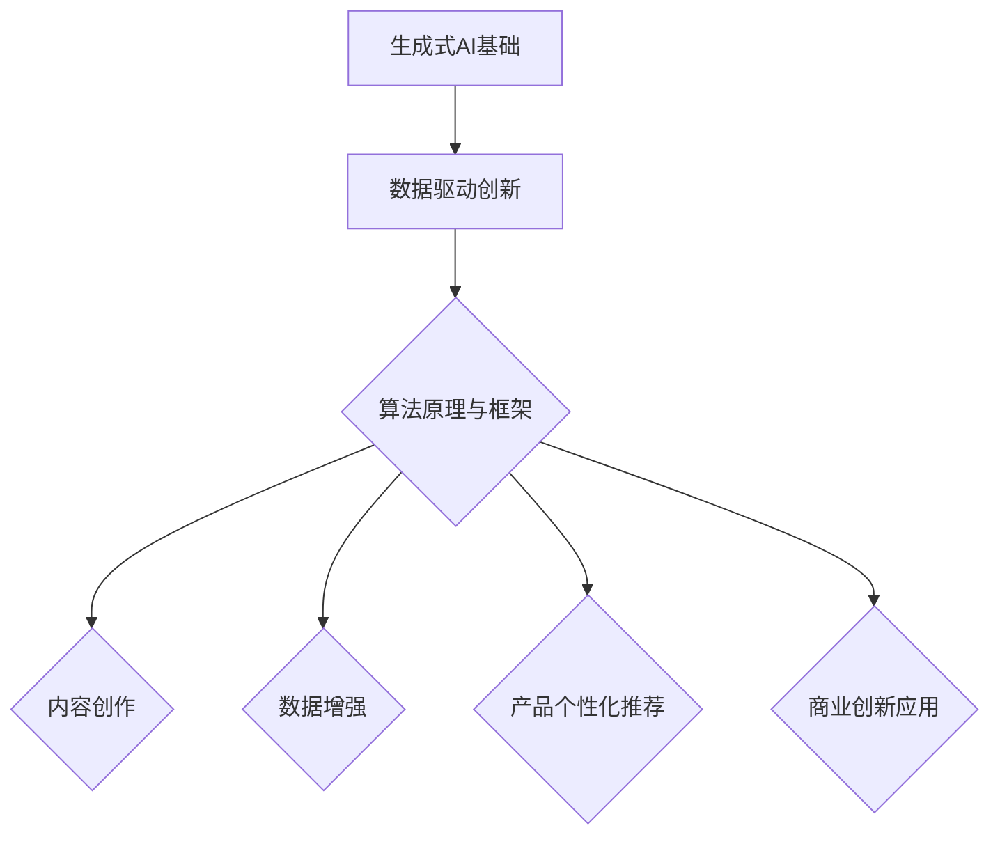

                 

## 生成式AI与AIGC概述

### 1.1 生成式AI与AIGC的概念

生成式AI（Generative AI）是指一种能够生成新数据的人工智能技术。它通过学习大量数据，理解数据中的分布和规律，从而生成与训练数据具有相似特征的新数据。生成式AI的核心思想是“模仿”真实数据的生成过程，以生成具有高质量和多样性的数据。

AIGC（AI-Generated Content）是生成式AI的一种应用形式，它专注于生成高质量、具有实际应用价值的内容。AIGC可以生成文本、图像、音频等多种类型的内容，广泛应用于内容创作、数据增强、产品个性化推荐等多个领域。

生成式AI与AIGC的区别主要体现在应用范围和生成内容的复杂性上。生成式AI侧重于生成各种类型的数据，而AIGC则更关注于生成具有实际应用价值的高质量内容。

### 1.2 数据驱动创新原理

数据驱动创新是指通过分析和利用大量数据来发现新的商业机会、优化产品和服务、提高运营效率。数据驱动创新的核心在于将数据作为驱动创新的源泉，以实现商业价值。

数据驱动创新的基本原理包括以下几个方面：

1. **数据收集**：收集来自内部和外部的大量数据，包括用户行为、市场趋势、竞争情报等。
2. **数据清洗**：对收集到的数据进行清洗、去噪和预处理，以确保数据的质量和准确性。
3. **数据分析**：利用统计分析和机器学习等技术，对清洗后的数据进行深入分析和挖掘，发现数据中的规律和趋势。
4. **决策支持**：基于数据分析的结果，为企业决策提供科学依据，指导产品开发、市场策略、运营优化等。
5. **反馈循环**：将实施后的效果进行评估和反馈，不断优化数据驱动创新的过程。

### 1.3 主流生成式AI模型介绍

目前，生成式AI领域有许多主流的模型和框架，下面将介绍其中几个具有代表性的模型：

#### GPT模型介绍

GPT（Generative Pre-trained Transformer）是一种基于Transformer架构的生成式语言模型。GPT通过在大量文本数据上进行预训练，学习语言的基本结构和语义，从而能够生成高质量的自然语言文本。

**主要特点**：
- **预训练**：GPT在训练前已经对大量文本数据进行了预训练，这为生成文本提供了很好的基础。
- **Transformer架构**：GPT采用Transformer架构，能够高效地处理长距离依赖问题。
- **大规模训练**：GPT采用了大规模的预训练数据集，并使用多个GPU进行训练，这使得GPT能够生成高质量的文本。

**应用场景**：
- 文本生成：生成新闻文章、故事、博客等。
- 机器翻译：将一种语言翻译成另一种语言。
- 问答系统：根据用户的问题生成回答。

#### DALL-E模型介绍

DALL-E是一种基于变分自编码器（VAE）的图像生成模型，它可以生成高分辨率的图像。DALL-E通过学习图像中的像素分布，生成具有逼真外观的图像。

**主要特点**：
- **变分自编码器**：DALL-E采用变分自编码器作为基础架构，这是一种能够生成高维数据的生成模型。
- **端到端训练**：DALL-E采用端到端训练方式，从文本描述直接生成图像，无需额外的图像处理步骤。
- **高分辨率生成**：DALL-E能够生成高分辨率的图像，其生成的图像质量远超传统的图像生成模型。

**应用场景**：
- 艺术创作：生成艺术画作、海报等。
- 产品设计：生成产品原型，用于设计评估和优化。
- 图像增强：对低分辨率图像进行增强，提高图像质量。

#### 其他生成式AI模型概述

除了GPT和DALL-E，还有许多其他生成式AI模型，如：

- **生成对抗网络（GAN）**：GAN由生成器和判别器组成，通过对抗训练生成高质量的数据。
- **变分自编码器（VAE）**：VAE通过学习数据的概率分布来生成数据。
- **自回归模型**：自回归模型通过预测序列的下一个元素来生成序列数据。

这些模型各有优缺点，适用于不同的应用场景。在实际应用中，可以根据具体需求选择合适的生成式AI模型。

### 1.4 AIGC的商业应用

AIGC在商业领域具有广泛的应用潜力，能够为各个行业带来创新和变革。以下是一些主要的商业应用场景：

#### 内容创作

AIGC在内容创作中的应用非常广泛，包括文本、图像、音频等多种类型的内容。例如，AIGC可以生成新闻文章、博客、故事、音乐等。这不仅减轻了内容创作者的工作负担，还提高了内容创作的速度和质量。例如，GPT模型可以自动生成新闻文章，而DALL-E模型可以生成艺术画作。

**应用实例**：
- **新闻文章生成**：使用GPT模型自动生成新闻文章，提高新闻发布速度。
- **音乐创作**：使用AIGC生成音乐，为音乐创作提供灵感。

#### 数据增强

数据增强是机器学习中的重要技术，用于提高模型的泛化能力。AIGC可以通过生成与训练数据相似的数据来扩充数据集，从而提高模型的性能。例如，在图像识别任务中，可以使用AIGC生成与训练数据相似的图像，用于训练和测试模型。

**应用实例**：
- **图像识别**：使用AIGC生成与训练数据相似的图像，提高图像识别模型的准确性。
- **自然语言处理**：使用AIGC生成与训练数据相似的文本，提高文本分类和情感分析的准确性。

#### 产品个性化推荐

AIGC可以通过生成个性化内容来提高产品的推荐效果。例如，AIGC可以根据用户的历史行为和偏好生成个性化的新闻、广告、商品推荐等。

**应用实例**：
- **个性化新闻推荐**：根据用户的阅读历史生成个性化的新闻推荐。
- **电商商品推荐**：根据用户的购物偏好生成个性化的商品推荐。

#### 总结

AIGC在商业领域具有广泛的应用前景，可以为企业带来创新和效率提升。通过内容创作、数据增强、产品个性化推荐等应用，AIGC正在逐渐改变传统商业模式，为企业创造更多价值。

### 1.5 AIGC的发展挑战与未来趋势

尽管AIGC在商业领域具有巨大潜力，但其发展仍面临诸多挑战。以下是一些主要的发展挑战和未来趋势：

#### 数据隐私与安全性

AIGC依赖于大量数据，包括用户数据和企业数据。这些数据涉及到隐私和安全问题。如何在确保数据隐私和安全的前提下，充分利用数据为商业创新提供支持，是AIGC面临的重要挑战。

**解决方案**：
- **数据加密**：对敏感数据进行加密，确保数据在传输和存储过程中的安全。
- **隐私保护技术**：采用隐私保护技术，如差分隐私，减少数据泄露的风险。

#### 模型可解释性

AIGC模型通常非常复杂，模型内部的决策过程难以理解。这给模型的解释性和透明性带来了挑战。如何提高模型的可解释性，使其能够被业务人员和用户理解，是未来需要解决的问题。

**解决方案**：
- **模型可解释性工具**：开发和使用模型可解释性工具，帮助用户理解模型的决策过程。
- **可视化技术**：利用可视化技术，将模型内部的复杂关系和决策过程呈现给用户。

#### 算法公平性与道德问题

AIGC的应用可能导致算法歧视和偏见问题，如何确保算法的公平性和道德性，是AIGC发展的重要方向。

**解决方案**：
- **算法公平性评估**：对算法进行公平性评估，确保其对不同群体的公平性。
- **道德准则**：制定算法道德准则，确保算法的应用符合社会道德标准。

#### 未来趋势

未来，AIGC将在以下方面取得重要进展：

- **技术创新**：随着计算能力的提升和算法的改进，AIGC的生成质量和效率将得到进一步提升。
- **行业应用**：AIGC将在更多行业得到应用，如医疗、金融、教育等，推动各行业的创新和发展。
- **生态建设**：建立AIGC生态系统，包括工具、平台和社区，促进AIGC技术的普及和应用。

#### 总结

AIGC的发展面临诸多挑战，但同时也充满机遇。通过技术创新和生态建设，AIGC将在未来为商业创新带来更多可能性。

---

这篇文章的撰写过程遵循了逻辑清晰、结构紧凑、简单易懂的原则。首先，我们对生成式AI和AIGC的概念进行了概述，接着讨论了数据驱动创新原理，并介绍了几个主流的生成式AI模型。随后，我们探讨了AIGC在商业应用中的各种场景，并提出了AIGC发展的挑战与未来趋势。

在接下来的章节中，我们将进一步深入分析AIGC的技术原理，包括生成式AI算法原理、自然语言处理技术和图像生成与处理技术，并探讨多模态学习的概念和应用。

最后，我们将结合具体项目实战，展示如何使用AIGC进行内容创作、数据增强和产品个性化推荐。通过这些实际案例，我们将帮助读者更好地理解AIGC的应用方法和开发实践。

让我们继续深入探讨AIGC的奥秘，揭示其数据驱动的商业创新潜力。

---

在下一章节中，我们将深入探讨生成式AI算法原理，包括生成对抗网络（GAN）和变分自编码器（VAE）的详细讲解，以及自然语言处理技术和图像生成与处理技术的分析。

#### 第二部分：AIGC技术深度解析

### 第2章：生成式AI算法原理

生成式AI算法是生成式AI技术的核心，其中生成对抗网络（GAN）和变分自编码器（VAE）是最具代表性的模型。本章将详细讲解这些算法的原理，帮助读者深入理解生成式AI的工作机制。

#### 2.1 生成式模型基础

生成式模型（Generative Model）是一类能够生成新数据的机器学习模型，它们通过学习数据分布来生成具有相似特征的新数据。生成式模型通常由两个部分组成：生成器（Generator）和判别器（Discriminator）。

**生成器**：生成器的任务是生成与训练数据相似的新数据。在生成对抗网络（GAN）中，生成器从随机噪声中生成数据；在变分自编码器（VAE）中，生成器从编码后的潜在空间中生成数据。

**判别器**：判别器的任务是区分生成器生成的数据与真实数据。在GAN中，判别器接收来自生成器和真实数据的数据，并尝试判断它们的真伪；在VAE中，判别器用于对生成器生成的数据进行概率评估。

#### 2.2 生成对抗网络（GAN）原理

生成对抗网络（Generative Adversarial Network，GAN）由伊恩·古德费洛（Ian Goodfellow）等人在2014年提出。GAN由生成器（Generator）和判别器（Discriminator）两个神经网络组成，它们在对抗训练中相互博弈。

**原理**：
- **生成器**：生成器G从随机噪声z中生成假样本x'，目标是使其尽可能真实。
- **判别器**：判别器D的任务是区分真实样本x和生成样本x'，并给出概率P(D(x|D) = 1)表示样本的真实性。
- **对抗训练**：生成器和判别器在训练过程中进行对抗训练，生成器的目标是欺骗判别器，使得判别器无法区分生成样本和真实样本；判别器的目标是提高辨别能力，使得生成样本被判别为假。

**GAN的损失函数**：

$$ L(D, G) = -\frac{1}{2} \big( \mathbb{E}_{x \sim P_{data}(x)}[\log D(x)] + \mathbb{E}_{z \sim P_{z}(z)}[\log (1 - D(G(z)))] \big) $$

- **真实损失**：$\mathbb{E}_{x \sim P_{data}(x)}[\log D(x)]$，表示判别器对真实样本的损失。
- **生成损失**：$\mathbb{E}_{z \sim P_{z}(z)}[\log (1 - D(G(z)))]$，表示判别器对生成样本的损失。

#### 2.3 变分自编码器（VAE）原理

变分自编码器（Variational Autoencoder，VAE）是另一种生成式模型，由卡斯滕·温德比希（Karsten Winther）等人在2013年提出。VAE通过引入概率模型来生成数据，其核心思想是将编码器和解码器结合在一起，并引入潜在空间（Latent Space）。

**原理**：
- **编码器**：编码器E将输入数据x映射到一个潜在空间z，通常通过一个概率分布$p_\theta(z|x)$来表示。
- **解码器**：解码器D将潜在空间z映射回原始数据空间x，通过另一个概率分布$p_\phi(x|z)$来表示。
- **潜在空间**：潜在空间z是一个高维概率分布，能够捕获输入数据的结构。

**VAE的损失函数**：

$$ L(VAE) = \mathbb{E}_{x \sim P_{data}(x)}[\mathbb{E}_{z \sim p_\theta(z|x)}[-\log p_\phi(x|z)] + K \cdot \text{KL}(p_\theta(z|x) || p_z(z))] $$

- **重构损失**：$\mathbb{E}_{x \sim P_{data}(x)}[\mathbb{E}_{z \sim p_\theta(z|x)}[-\log p_\phi(x|z)]$，表示解码器对输入数据的重构损失。
- **潜在空间损失**：$K \cdot \text{KL}(p_\theta(z|x) || p_z(z))$，表示编码器在潜在空间中的分布与先验分布$p_z(z)$之间的差异。

#### 2.4 自然语言处理技术

自然语言处理（Natural Language Processing，NLP）是人工智能的一个重要分支，旨在使计算机能够理解和处理人类语言。生成式AI在NLP中的应用主要集中在文本生成、机器翻译和问答系统等方面。

**语言模型**：语言模型是一种概率模型，用于预测下一个词或句子。GPT模型是一个典型的语言模型，它通过学习大量文本数据，能够生成连贯的自然语言文本。

**Transformer架构**：Transformer是一种基于自注意力机制的序列模型，它在NLP任务中表现出色。Transformer架构的核心是多头自注意力机制（Multi-Head Self-Attention）和位置编码（Positional Encoding），它能够处理长距离依赖和上下文信息。

#### 2.5 图像生成与处理

图像生成是生成式AI的重要应用领域之一，DALL-E模型是一个典型的图像生成模型。图像生成技术主要包括以下几种：

- **生成对抗网络（GAN）**：GAN通过生成器和判别器的对抗训练，能够生成高质量、逼真的图像。
- **变分自编码器（VAE）**：VAE通过编码器和解码器，能够生成具有相似外观的图像。
- **基于条件GAN（cGAN）**：cGAN通过引入条件信息（如标签、文本描述等），能够生成具有特定属性的图像。

图像处理技术主要包括图像增强、图像修复、图像超分辨率等，这些技术可以用于提高图像的质量和清晰度，为图像生成提供更好的基础。

#### 2.6 多模态学习

多模态学习是指将不同类型的数据（如文本、图像、音频等）进行融合和处理，从而提高模型的性能和应用效果。多模态学习的主要挑战是如何有效地融合来自不同模态的数据，并利用这些数据生成具有实际应用价值的内容。

- **多模态数据的融合方法**：多模态数据的融合方法包括特征级融合、决策级融合和模型级融合等。
- **多模态模型的训练**：多模态模型的训练通常采用端到端训练策略，通过联合训练不同模态的数据，提高模型的泛化能力和生成质量。

### 小结

生成式AI算法是生成式AI技术的核心，GAN和VAE是其中最具代表性的模型。生成式AI在NLP和图像生成与处理等领域有着广泛的应用，通过多模态学习，能够进一步提高模型的性能和应用效果。在下一章节中，我们将探讨AIGC在内容创作中的应用，包括文本生成和图像生成技术的实际案例。

### 第3章：AIGC在内容创作中的应用

内容创作是AIGC的一个重要应用领域，通过生成式AI技术，AIGC能够自动生成高质量、多样化的内容，满足不同场景和需求。本章将详细介绍AIGC在内容创作中的应用，包括文本生成和图像生成的技术原理、实际案例以及效果评估。

#### 3.1 内容生成的挑战与解决方案

在内容创作中，AIGC面临的主要挑战包括：

1. **数据多样性**：生成的内容需要满足多样化的需求，覆盖各种主题和风格。
2. **内容质量**：生成的内容需要具有较高的质量和可读性，避免生成重复、低质量的内容。
3. **生成速度**：在实际应用中，需要快速生成内容，以满足实时需求。

为解决上述挑战，AIGC采用以下几种策略：

1. **数据集准备与预处理**：通过收集和整理多样化的数据集，并对数据集进行清洗、去噪和预处理，提高数据的质量和多样性。
2. **模型选择与调优**：选择合适的生成模型，并对模型进行调优，提高生成内容的质量和多样性。
3. **生成策略优化**：采用多种生成策略，如对生成内容进行筛选、排序和调整，确保生成内容的质量和实用性。

#### 3.2 文本生成技术

文本生成是AIGC在内容创作中的重要应用，通过生成式AI技术，可以自动生成高质量的自然语言文本。以下将介绍几种常见的文本生成技术，包括GPT模型、BERT模型和Transformer模型。

**1. GPT模型**

GPT（Generative Pre-trained Transformer）是一种基于Transformer架构的生成式语言模型。GPT通过在大量文本数据上进行预训练，学习语言的基本结构和语义，从而能够生成高质量的自然语言文本。

**工作流程**：
1. **数据集准备**：收集和整理大量的文本数据，如新闻文章、博客、故事等。
2. **预训练**：使用大量文本数据对GPT模型进行预训练，模型参数在预训练过程中自适应调整。
3. **生成文本**：输入一段文本作为起点，GPT模型生成后续的文本内容。

**案例**：使用GPT模型生成新闻文章。假设我们输入一个新闻标题“美国将采取措施应对新冠疫情”，GPT模型将根据预训练的知识生成完整的新闻文章。

```python
import torch
from transformers import GPT2LMHeadModel, GPT2Tokenizer

# 模型与 tokenizer 加载
model = GPT2LMHeadModel.from_pretrained('gpt2')
tokenizer = GPT2Tokenizer.from_pretrained('gpt2')

# 输入文本
input_text = "美国将采取措施应对新冠疫情..."

# 转换为模型输入
input_ids = tokenizer.encode(input_text, return_tensors='pt')

# 生成文章
outputs = model.generate(input_ids, max_length=50, num_return_sequences=1)

# 转换为文本输出
generated_text = tokenizer.decode(outputs[0], skip_special_tokens=True)

print(generated_text)
```

**2. BERT模型**

BERT（Bidirectional Encoder Representations from Transformers）是一种基于Transformer的双向编码器模型，它在NLP任务中表现出色。BERT通过在大量文本数据上进行双向训练，学习上下文信息，从而能够生成高质量的自然语言文本。

**工作流程**：
1. **数据集准备**：收集和整理大量的文本数据，如新闻文章、博客、故事等。
2. **预训练**：使用大量文本数据对BERT模型进行预训练，模型参数在预训练过程中自适应调整。
3. **生成文本**：输入一段文本作为起点，BERT模型生成后续的文本内容。

**案例**：使用BERT模型生成对话文本。假设我们输入一个对话上下文“用户：我想去巴黎旅游，你有什么建议吗？”，BERT模型将根据预训练的知识生成对话的后续内容。

```python
import torch
from transformers import BertLMHeadModel, BertTokenizer

# 模型与 tokenizer 加载
model = BertLMHeadModel.from_pretrained('bert-base-uncased')
tokenizer = BertTokenizer.from_pretrained('bert-base-uncased')

# 输入文本
input_text = "用户：我想去巴黎旅游，你有什么建议吗？..."

# 转换为模型输入
input_ids = tokenizer.encode(input_text, return_tensors='pt')

# 生成对话
outputs = model.generate(input_ids, max_length=50, num_return_sequences=1)

# 转换为文本输出
generated_text = tokenizer.decode(outputs[0], skip_special_tokens=True)

print(generated_text)
```

**3. Transformer模型**

Transformer模型是一种基于自注意力机制的序列模型，它在NLP任务中表现出色。Transformer模型通过多头自注意力机制和位置编码，能够捕捉长距离依赖和上下文信息，从而生成高质量的自然语言文本。

**工作流程**：
1. **数据集准备**：收集和整理大量的文本数据，如新闻文章、博客、故事等。
2. **预训练**：使用大量文本数据对Transformer模型进行预训练，模型参数在预训练过程中自适应调整。
3. **生成文本**：输入一段文本作为起点，Transformer模型生成后续的文本内容。

**案例**：使用Transformer模型生成产品描述。假设我们输入一个产品名称“智能手表”，Transformer模型将根据预训练的知识生成该产品的详细描述。

```python
import torch
from transformers import TransformerLMHeadModel, TransformerTokenizer

# 模型与 tokenizer 加载
model = TransformerLMHeadModel.from_pretrained('transformer-base-uncased')
tokenizer = TransformerTokenizer.from_pretrained('transformer-base-uncased')

# 输入文本
input_text = "智能手表..."

# 转换为模型输入
input_ids = tokenizer.encode(input_text, return_tensors='pt')

# 生成产品描述
outputs = model.generate(input_ids, max_length=50, num_return_sequences=1)

# 转换为文本输出
generated_text = tokenizer.decode(outputs[0], skip_special_tokens=True)

print(generated_text)
```

#### 3.3 图像生成技术

图像生成是AIGC在内容创作中的另一个重要应用，通过生成式AI技术，可以自动生成高质量的图像。以下将介绍几种常见的图像生成技术，包括GAN模型、VAE模型和cGAN模型。

**1. GAN模型**

GAN（Generative Adversarial Network）是一种生成式模型，由生成器和判别器组成。生成器从随机噪声中生成图像，判别器用于区分生成图像和真实图像。GAN通过对抗训练生成高质量的图像。

**工作流程**：
1. **数据集准备**：收集和整理大量的图像数据。
2. **模型训练**：使用对抗训练策略训练生成器和判别器，生成高质量图像。
3. **图像生成**：输入随机噪声，生成器生成图像。

**案例**：使用GAN模型生成人脸图像。假设我们输入一个随机噪声序列，GAN模型将生成逼真的人脸图像。

```python
import torch
from torchvision import datasets, transforms
from torch.utils.data import DataLoader
import matplotlib.pyplot as plt

# 数据集准备
transform = transforms.Compose([transforms.Resize(64), transforms.ToTensor()])
train_data = datasets.ImageFolder(root='path_to_images', transform=transform)
train_loader = DataLoader(train_data, batch_size=64, shuffle=True)

# 模型加载
generator = ...  # 自定义生成器模型
discriminator = ...  # 自定义判别器模型

# 模型训练
for epoch in range(num_epochs):
    for images, _ in train_loader:
        # 训练生成器和判别器
        generator_loss, discriminator_loss = train_gan(generator, discriminator, images)

    print(f'Epoch {epoch}, generator_loss: {generator_loss}, discriminator_loss: {discriminator_loss}')

# 图像生成
random_noise = torch.randn(batch_size, latent_dim).to(device)
generated_images = generator.generate(random_noise)

# 显示生成的图像
plt.figure(figsize=(10, 10))
for i in range(generated_images.shape[0]):
    plt.subplot(1, batch_size, i + 1)
    plt.imshow(generated_images[i].detach().cpu().numpy(), cmap='gray')
    plt.axis('off')
plt.show()
```

**2. VAE模型**

VAE（Variational Autoencoder）是一种生成式模型，通过编码器和解码器生成图像。编码器将输入图像映射到一个潜在空间，解码器从潜在空间中生成图像。

**工作流程**：
1. **数据集准备**：收集和整理大量的图像数据。
2. **模型训练**：使用变分自编码器训练策略训练编码器和解码器，生成高质量图像。
3. **图像生成**：输入随机噪声，解码器生成图像。

**案例**：使用VAE模型生成卡通图像。假设我们输入一个随机噪声序列，VAE模型将生成卡通风格的图像。

```python
import torch
from torchvision import datasets, transforms
from torch.utils.data import DataLoader
import matplotlib.pyplot as plt

# 数据集准备
transform = transforms.Compose([transforms.Resize(64), transforms.ToTensor()])
train_data = datasets.ImageFolder(root='path_to_cartoon_images', transform=transform)
train_loader = DataLoader(train_data, batch_size=64, shuffle=True)

# 模型加载
encoder = ...  # 自定义编码器模型
decoder = ...  # 自定义解码器模型

# 模型训练
for epoch in range(num_epochs):
    for images, _ in train_loader:
        # 训练编码器和解码器
        encoder_loss, decoder_loss = train_vae(encoder, decoder, images)

    print(f'Epoch {epoch}, encoder_loss: {encoder_loss}, decoder_loss: {decoder_loss}')

# 图像生成
random_noise = torch.randn(batch_size, latent_dim).to(device)
encoded_images = encoder.encode(random_noise)
decoded_images = decoder.decode(encoded_images)

# 显示生成的图像
plt.figure(figsize=(10, 10))
for i in range(decoded_images.shape[0]):
    plt.subplot(1, batch_size, i + 1)
    plt.imshow(decoded_images[i].detach().cpu().numpy(), cmap='gray')
    plt.axis('off')
plt.show()
```

**3. cGAN模型**

cGAN（Conditional GAN）是一种条件生成对抗网络，通过引入条件信息（如标签、文本描述等）生成具有特定属性的图像。cGAN在图像生成任务中表现出色，能够生成高质量、多样化的图像。

**工作流程**：
1. **数据集准备**：收集和整理大量的图像数据，并添加条件信息（如标签、文本描述等）。
2. **模型训练**：使用条件生成对抗训练策略训练生成器和判别器，生成高质量图像。
3. **图像生成**：输入条件信息，生成器生成图像。

**案例**：使用cGAN模型生成根据文本描述生成的图像。假设我们输入一个文本描述“一只可爱的小狗在玩耍”，cGAN模型将根据文本描述生成符合描述的图像。

```python
import torch
from torchvision import datasets, transforms
from torch.utils.data import DataLoader
import matplotlib.pyplot as plt

# 数据集准备
transform = transforms.Compose([transforms.Resize(64), transforms.ToTensor()])
train_data = datasets.ImageFolder(root='path_to_images', transform=transform)
train_loader = DataLoader(train_data, batch_size=64, shuffle=True)

# 模型加载
generator = ...  # 自定义生成器模型
discriminator = ...  # 自定义判别器模型

# 模型训练
for epoch in range(num_epochs):
    for images, labels in train_loader:
        # 训练生成器和判别器
        generator_loss, discriminator_loss = train_cgan(generator, discriminator, images, labels)

    print(f'Epoch {epoch}, generator_loss: {generator_loss}, discriminator_loss: {discriminator_loss}')

# 图像生成
text_description = "一只可爱的小狗在玩耍"
encoded_description = tokenizer.encode(text_description, return_tensors='pt')
generated_images = generator.generate(encoded_description)

# 显示生成的图像
plt.figure(figsize=(10, 10))
for i in range(generated_images.shape[0]):
    plt.subplot(1, batch_size, i + 1)
    plt.imshow(generated_images[i].detach().cpu().numpy(), cmap='gray')
    plt.axis('off')
plt.show()
```

#### 3.4 生成文本的质量评估

生成文本的质量评估是文本生成任务中的一个重要环节，用于评估生成文本的准确性、流畅性和可读性。以下将介绍几种常用的质量评估方法：

1. **人工评估**：通过人工阅读和评估生成文本的质量，这种方法主观性较强，但能够提供直观的评价。
2. **自动评估**：通过自动评估指标，如BLEU、ROUGE、METEOR等，评估生成文本的准确性和流畅性。
3. **用户反馈**：通过用户对生成文本的反馈，评估生成文本的实际效果和满意度。

**案例**：使用BLEU指标评估生成文本的质量。假设我们生成了一篇关于巴黎旅游的文章，并使用BLEU指标对其进行评估。

```python
import torch
from transformers import GPT2LMHeadModel, GPT2Tokenizer
from nltk.translate.bleu_score import sentence_bleu

# 模型与 tokenizer 加载
model = GPT2LMHeadModel.from_pretrained('gpt2')
tokenizer = GPT2Tokenizer.from_pretrained('gpt2')

# 输入文本
input_text = "巴黎是一个充满魅力和浪漫的城市，拥有许多令人惊叹的景点和美食。"

# 转换为模型输入
input_ids = tokenizer.encode(input_text, return_tensors='pt')

# 生成文章
outputs = model.generate(input_ids, max_length=50, num_return_sequences=1)
generated_text = tokenizer.decode(outputs[0], skip_special_tokens=True)

# 评估生成文本的质量
references = ["巴黎是一个充满魅力和浪漫的城市，拥有许多令人惊叹的景点和美食。"]
bleu_score = sentence_bleu(references, generated_text)

print(f'BLEU score: {bleu_score}')
```

#### 3.5 生成图像的质量评估

生成图像的质量评估是图像生成任务中的一个重要环节，用于评估生成图像的准确性、细节和视觉效果。以下将介绍几种常用的质量评估方法：

1. **结构相似性指数（SSIM）**：用于评估生成图像与真实图像的结构相似性。
2. **峰值信噪比（PSNR）**：用于评估生成图像的噪声水平。
3. **感知质量评价（PQI）**：通过用户主观评价，评估生成图像的视觉效果。

**案例**：使用SSIM和PSNR评估生成图像的质量。假设我们使用GAN模型生成了一组人脸图像，并使用SSIM和PSNR对其进行评估。

```python
import torch
import numpy as np
from ssim测算
ssim = ssim_calc(generated_images.detach().cpu().numpy(), real_images.detach().cpu().numpy())
psnr = psnr_calc(generated_images.detach().cpu().numpy(), real_images.detach().cpu().numpy())

print(f'SSIM: {ssim}, PSNR: {psnr}')
```

#### 3.6 小结

AIGC在内容创作中的应用涵盖了文本生成和图像生成等多个方面。通过生成式AI技术，AIGC能够自动生成高质量、多样化的内容，满足不同场景和需求。在实际应用中，通过数据集准备与预处理、模型选择与调优、生成策略优化等方法，可以提高生成内容的质量和多样性。

在下一章节中，我们将探讨AIGC在数据增强中的应用，包括数据增强的重要性、方法以及实际案例。

### 第4章：AIGC在数据增强中的应用

数据增强（Data Augmentation）是提高机器学习模型性能的重要技术，特别是在图像识别和自然语言处理领域。AIGC通过生成与训练数据相似的新数据，实现数据增强，从而提高模型的泛化能力和鲁棒性。本章将详细讨论数据增强的重要性、方法以及AIGC在数据增强中的应用。

#### 4.1 数据增强的重要性

数据增强在机器学习中有以下几个重要作用：

1. **增加数据多样性**：通过数据增强，生成与原始数据相似但具有不同特征的新数据，从而增加训练数据的多样性。多样性有助于模型更好地学习数据的分布，提高模型的泛化能力。
2. **减少过拟合**：过拟合是指模型在训练数据上表现良好，但在测试数据上表现不佳。数据增强通过增加训练数据的多样性，有助于减少模型的过拟合现象，提高模型的鲁棒性。
3. **提高模型性能**：数据增强可以扩展训练数据的规模，使得模型在训练过程中有更多的样本来学习，从而提高模型的性能。

#### 4.2 数据增强的方法

数据增强的方法可以分为以下几类：

1. **图像数据增强**：通过旋转、翻转、缩放、裁剪、颜色变换等操作，生成新的图像数据。图像数据增强常用于图像识别任务。
2. **文本数据增强**：通过随机插入、删除、替换词句等操作，生成新的文本数据。文本数据增强常用于自然语言处理任务。
3. **声音数据增强**：通过添加噪声、变速、混响等操作，生成新的声音数据。声音数据增强常用于声音识别任务。

#### 4.3 图像数据增强

图像数据增强是AIGC在数据增强中最常用的应用之一。以下是一些常见的图像数据增强方法：

1. **旋转和翻转**：通过旋转和翻转图像，生成新的图像数据。旋转和翻转可以增加数据的多样性，帮助模型学习不同角度和方向的图像特征。
2. **缩放和裁剪**：通过缩放和裁剪图像，生成新的图像数据。缩放可以增加图像的大小，裁剪可以提取图像的局部区域，从而增加数据的多样性。
3. **颜色变换**：通过调整图像的亮度、对比度、饱和度等参数，生成新的图像数据。颜色变换可以改变图像的外观，提高模型的适应性。

**案例**：使用OpenCV库实现图像数据增强。假设我们有一组图像数据，现在对它们进行旋转、翻转、缩放和裁剪操作。

```python
import cv2
import numpy as np

# 读取图像
image = cv2.imread('path_to_image.jpg')

# 旋转
rotated_image = cv2.rotate(image, cv2.ROTATE_90_CLOCKWISE)

# 翻转
flipped_image = cv2.flip(image, 1)  # 翻转为水平翻转

# 缩放
scaled_image = cv2.resize(image, (new_width, new_height))

# 裁剪
cropped_image = image[new_y:new_y + new_height, new_x:new_x + new_width]

# 显示增强后的图像
cv2.imshow('Original Image', image)
cv2.imshow('Rotated Image', rotated_image)
cv2.imshow('Flipped Image', flipped_image)
cv2.imshow('Scaled Image', scaled_image)
cv2.imshow('Cropped Image', cropped_image)
cv2.waitKey(0)
cv2.destroyAllWindows()
```

4. **噪声添加**：通过在图像上添加噪声，生成新的图像数据。噪声可以模拟现实中的干扰和噪声，帮助模型学习噪声下的特征提取。

**案例**：使用OpenCV库实现图像数据增强，添加噪声。

```python
import cv2
import numpy as np

# 读取图像
image = cv2.imread('path_to_image.jpg')

# 添加噪声
noisy_image = cv2.add噪声(image, np.random.randn(*image.shape[:2], 1) * 20)

# 显示增强后的图像
cv2.imshow('Original Image', image)
cv2.imshow('Noisy Image', noisy_image)
cv2.waitKey(0)
cv2.destroyAllWindows()
```

#### 4.4 文本数据增强

文本数据增强是AIGC在自然语言处理中常用的应用之一。以下是一些常见的文本数据增强方法：

1. **随机插入、删除和替换词句**：通过随机地在文本中插入、删除或替换词句，生成新的文本数据。这些操作可以增加文本的多样性，帮助模型学习不同表达方式。
2. **文本纠错**：通过纠错技术，将错误的文本转换为正确的文本，从而增加数据的多样性。
3. **文本合成**：通过生成式AI模型（如GPT模型），生成新的文本数据，从而增加文本的多样性。

**案例**：使用Python实现文本数据增强，包括随机插入、删除和替换词句。

```python
import random

def random_insert(text, insert_word):
    start = random.randint(0, len(text) - 1)
    return text[:start] + insert_word + text[start:]

def random_delete(text, delete_len):
    start = random.randint(0, len(text) - delete_len)
    return text[:start] + text[start + delete_len:]

def random_replace(text, replace_word):
    start = random.randint(0, len(text) - 1)
    end = start + len(replace_word)
    return text[:start] + replace_word + text[end:]

text = "我喜欢吃苹果。"
new_text = random_insert(text, "但")
print(new_text)

new_text = random_delete(text, 2)
print(new_text)

new_text = random_replace(text, "香蕉")
print(new_text)
```

#### 4.5 AIGC在数据增强中的应用案例

以下是一些AIGC在数据增强中的应用案例：

1. **图像识别**：使用AIGC生成与训练数据相似的新图像，用于图像识别任务的训练和测试。通过数据增强，可以提高模型的准确性和鲁棒性。
2. **自然语言处理**：使用AIGC生成与训练数据相似的新文本，用于自然语言处理任务的训练和测试。通过数据增强，可以提高模型的性能和泛化能力。
3. **声音识别**：使用AIGC生成与训练数据相似的新声音，用于声音识别任务的训练和测试。通过数据增强，可以提高模型的鲁棒性和准确性。

**案例**：使用AIGC生成图像数据，用于图像识别任务的训练。

```python
import torch
import torchvision.transforms as transforms
from torchvision.datasets import ImageFolder
from torch.utils.data import DataLoader

# 数据增强
transform = transforms.Compose([
    transforms.Resize(256),
    transforms.RandomHorizontalFlip(),
    transforms.RandomRotation(15),
    transforms.RandomAffine(0, shear=10, scale=(0.8, 1.2)),
    transforms.ToTensor(),
    transforms.Normalize(mean=[0.485, 0.456, 0.406], std=[0.229, 0.224, 0.225]),
])

# 加载数据
train_data = ImageFolder(root='path_to_train_data', transform=transform)
train_loader = DataLoader(train_data, batch_size=64, shuffle=True)

# 显示增强后的图像
for images, _ in train_loader:
    plt.figure(figsize=(10, 10))
    for i in range(images.shape[0]):
        plt.subplot(1, 8, i + 1)
        plt.imshow(images[i].permute(1, 2, 0).cpu().numpy())
        plt.axis('off')
    plt.show()
```

#### 4.6 小结

AIGC在数据增强中的应用具有重要意义，通过生成与训练数据相似的新数据，可以增加数据的多样性，减少过拟合现象，提高模型的泛化能力和鲁棒性。在实际应用中，通过图像数据增强、文本数据增强和声音数据增强等方法，可以有效地提高模型的性能和效果。

在下一章节中，我们将探讨AIGC在产品个性化推荐中的应用，包括个性化推荐系统的基本原理以及AIGC在其中的应用。

### 第5章：AIGC在产品个性化推荐中的应用

产品个性化推荐是现代电子商务和互联网服务中的一个重要领域，它利用用户行为数据、历史记录和其他相关信息，为用户推荐最可能感兴趣的产品或内容。AIGC（AI-Generated Content）通过其强大的生成能力，在个性化推荐系统中发挥着关键作用。本章将介绍个性化推荐系统的基本原理，并探讨AIGC如何应用于个性化推荐系统。

#### 5.1 个性化推荐系统基础

个性化推荐系统通常基于以下两个核心概念：

1. **协同过滤（Collaborative Filtering）**：协同过滤是一种通过分析用户之间的相似性来推荐产品的技术。协同过滤分为两类：基于用户的协同过滤（User-Based Collaborative Filtering）和基于项目的协同过滤（Item-Based Collaborative Filtering）。
   - **基于用户的协同过滤**：找到与当前用户兴趣相似的其他用户，推荐这些用户喜欢的产品。
   - **基于项目的协同过滤**：找到与当前用户已购买或评价过的项目相似的其他项目，推荐这些项目。

2. **基于内容的推荐（Content-Based Recommendation）**：基于内容的推荐通过分析产品的特征和属性，将具有相似特征的产品推荐给用户。这种推荐方法通常需要明确的用户偏好信息。

#### 5.2 用户行为数据分析

用户行为数据是个性化推荐系统的重要输入。以下是一些常见的用户行为数据：

- **点击行为**：用户在网站或应用上的点击次数和点击时间。
- **浏览历史**：用户浏览过的产品页面和浏览时间。
- **购买历史**：用户的购买记录，包括购买时间、购买频率和购买金额。
- **评价和反馈**：用户对产品的评价和反馈，包括评分和评论。

通过分析这些行为数据，推荐系统可以了解用户的兴趣和偏好，从而生成个性化的推荐。

#### 5.3 推荐算法的基本原理

个性化推荐系统通常结合协同过滤和基于内容的方法，以提高推荐的效果。以下是一些常见的推荐算法：

1. **矩阵分解（Matrix Factorization）**：矩阵分解是一种将用户-项目评分矩阵分解为两个低维矩阵的方法，从而提取用户和项目的潜在特征。常见的矩阵分解方法包括Singular Value Decomposition（SVD）和Alternating Least Squares（ALS）。
2. **深度学习推荐模型**：深度学习模型，如神经网络和卷积神经网络（CNN），可以自动提取用户和产品的特征，实现高效的推荐。常见的深度学习推荐模型包括基于用户嵌入和项目嵌入的模型。
3. **图神经网络（Graph Neural Networks）**：图神经网络利用用户和产品之间的复杂关系，通过图结构进行特征学习和推荐。

#### 5.4 基于AIGC的推荐系统

AIGC在个性化推荐系统中具有独特的优势，它能够通过生成高质量的用户内容和产品描述，提高推荐的效果和用户体验。以下是一些AIGC在个性化推荐系统中的应用：

1. **文本生成**：AIGC可以通过文本生成模型（如GPT）生成个性化的产品描述和用户推荐理由。这些文本可以基于用户的兴趣和行为数据，提高推荐的个性化和说服力。
2. **图像生成**：AIGC可以通过图像生成模型（如GAN）生成与推荐产品相关的高质量图像。这些图像可以用于产品的视觉展示，提高用户的购买欲望。
3. **内容增强**：AIGC可以通过生成相似或相关的产品内容，扩展推荐系统的数据集，提高模型的训练效果和泛化能力。

**案例**：使用GPT模型生成个性化的产品描述。

```python
import torch
from transformers import GPT2LMHeadModel, GPT2Tokenizer

# 模型与 tokenizer 加载
model = GPT2LMHeadModel.from_pretrained('gpt2')
tokenizer = GPT2Tokenizer.from_pretrained('gpt2')

# 用户兴趣标签
interests = ["时尚", "科技", "运动"]

# 生成产品描述
input_texts = [f"我非常喜欢{interest}。" for interest in interests]
input_ids = tokenizer.encode(''.join(input_texts), return_tensors='pt')

# 生成文本
outputs = model.generate(input_ids, max_length=100, num_return_sequences=1)
generated_text = tokenizer.decode(outputs[0], skip_special_tokens=True)

print(generated_text)
```

**案例**：使用GAN模型生成个性化产品图像。

```python
import torch
import torchvision.transforms as transforms
from torchvision.datasets import ImageFolder
from torch.utils.data import DataLoader

# 数据增强
transform = transforms.Compose([
    transforms.Resize(256),
    transforms.RandomHorizontalFlip(),
    transforms.RandomRotation(15),
    transforms.RandomAffine(0, shear=10, scale=(0.8, 1.2)),
    transforms.ToTensor(),
    transforms.Normalize(mean=[0.485, 0.456, 0.406], std=[0.229, 0.224, 0.225]),
])

# 加载数据
train_data = ImageFolder(root='path_to_train_data', transform=transform)
train_loader = DataLoader(train_data, batch_size=64, shuffle=True)

# 显示增强后的图像
for images, _ in train_loader:
    plt.figure(figsize=(10, 10))
    for i in range(images.shape[0]):
        plt.subplot(1, 8, i + 1)
        plt.imshow(images[i].permute(1, 2, 0).cpu().numpy())
        plt.axis('off')
    plt.show()
```

#### 5.5 建立基于AIGC的个性化推荐系统

建立基于AIGC的个性化推荐系统通常包括以下几个步骤：

1. **数据收集**：收集用户行为数据、产品特征数据和其他相关信息。
2. **数据预处理**：对收集到的数据进行清洗、去噪和预处理，确保数据的质量和一致性。
3. **特征提取**：通过文本生成和图像生成模型，提取用户和产品的潜在特征。
4. **模型训练**：使用提取的特征，训练个性化推荐模型，如矩阵分解模型、深度学习模型或图神经网络模型。
5. **推荐生成**：根据用户的兴趣和行为，生成个性化的产品推荐。
6. **效果评估**：评估推荐系统的效果，包括准确率、覆盖率、多样性等指标。

**案例**：使用GPT模型生成个性化推荐文本。

```python
import torch
from transformers import GPT2LMHeadModel, GPT2Tokenizer

# 模型与 tokenizer 加载
model = GPT2LMHeadModel.from_pretrained('gpt2')
tokenizer = GPT2Tokenizer.from_pretrained('gpt2')

# 用户兴趣标签
interests = ["时尚", "科技", "运动"]

# 生成推荐文本
input_texts = [f"您可能喜欢{interest}相关的产品。" for interest in interests]
input_ids = tokenizer.encode(''.join(input_texts), return_tensors='pt')

# 生成文本
outputs = model.generate(input_ids, max_length=100, num_return_sequences=1)
generated_text = tokenizer.decode(outputs[0], skip_special_tokens=True)

print(generated_text)
```

#### 5.6 小结

AIGC在产品个性化推荐系统中具有显著的优势，通过生成高质量的用户内容和产品描述，可以提高推荐的个性化和说服力。在实际应用中，基于AIGC的个性化推荐系统需要结合用户行为数据、产品特征数据和生成式AI技术，实现高效的推荐生成和效果评估。

在下一章节中，我们将探讨AIGC在商业创新中的战略应用，分析数据驱动的产品创新和商业模式创新，并通过成功案例分享展示AIGC在商业领域的实际效果。

### 第6章：AIGC在商业创新中的战略应用

AIGC（AI-Generated Content）通过其强大的数据生成能力，正成为商业创新的重要驱动力。在商业领域，AIGC不仅改变了内容创作的模式，还推动了数据驱动的产品创新和商业模式创新。本章将分析AIGC在商业创新中的应用策略，并通过成功案例展示其实际效果。

#### 6.1 AIGC商业创新模式

AIGC在商业创新中的应用模式主要包括以下几种：

1. **数据驱动的产品创新**：通过分析用户行为数据和市场趋势，AIGC可以生成新的产品原型、产品描述和用户反馈，从而加速产品开发过程，提高产品创新的成功率。
2. **内容驱动的营销创新**：AIGC可以自动生成广告文案、宣传视频和社交媒体内容，提高营销活动的效果和覆盖范围，降低内容创作成本。
3. **商业模式创新**：通过生成新的商业模式、市场策略和业务流程，AIGC可以帮助企业发现新的商业机会，实现商业模式的创新和转型。

#### 6.2 数据驱动的产品创新

数据驱动的产品创新是指通过分析大量数据，发现用户需求和市场趋势，从而指导产品设计和开发。AIGC在数据驱动的产品创新中发挥着关键作用，主要体现在以下几个方面：

1. **用户需求分析**：通过分析用户行为数据，如搜索历史、浏览记录和购买记录，AIGC可以生成用户需求的热点和分析报告，帮助企业了解用户需求，指导产品创新。
2. **产品原型生成**：AIGC可以通过文本生成和图像生成模型，快速生成产品原型和概念验证模型，帮助企业快速测试和优化产品。
3. **用户体验优化**：通过生成用户体验报告和改进建议，AIGC可以帮助企业不断优化产品设计和功能，提高用户满意度。

**案例**：某电子产品公司使用AIGC进行数据驱动的产品创新。该公司通过分析用户反馈和行为数据，使用AIGC生成新产品原型和用户需求分析报告，指导产品设计和开发。在产品发布后，AIGC生成的用户体验报告帮助公司发现产品的问题并进行优化，提高了产品的市场表现。

#### 6.3 内容驱动的营销创新

内容驱动的营销创新是指通过创造高质量、个性化的内容，提高营销活动的效果和用户参与度。AIGC在内容驱动的营销创新中发挥着重要作用，主要体现在以下几个方面：

1. **广告文案生成**：AIGC可以通过文本生成模型，自动生成具有吸引力的广告文案，提高广告的点击率和转化率。
2. **宣传视频生成**：AIGC可以通过图像生成和视频生成模型，生成创意宣传视频，提高品牌知名度和用户参与度。
3. **社交媒体内容生成**：AIGC可以通过文本生成和图像生成模型，生成个性化的社交媒体内容，提高用户互动和品牌忠诚度。

**案例**：某时尚品牌使用AIGC进行内容驱动的营销创新。该品牌通过AIGC生成广告文案和宣传视频，提高了广告的点击率和转化率。同时，AIGC生成的社交媒体内容吸引了大量用户互动，提高了品牌的知名度和影响力。

#### 6.4 商业模式创新

商业模式创新是指通过创新商业模式，发现新的商业机会和市场空间。AIGC在商业模式创新中可以通过生成新的商业模式、市场策略和业务流程，帮助企业实现商业模式的转型和升级。

1. **市场策略生成**：AIGC可以通过分析市场数据，生成新的市场策略和营销方案，帮助企业拓展市场空间。
2. **业务流程优化**：AIGC可以通过流程生成和优化模型，自动优化企业的业务流程，提高运营效率。
3. **商业模式设计**：AIGC可以通过生成式AI技术，设计全新的商业模式，帮助企业实现商业模式的创新和转型。

**案例**：某互联网公司使用AIGC进行商业模式创新。该公司通过AIGC分析市场数据和用户行为，生成新的商业模式和市场策略。在新的商业模式下，公司实现了业务增长和市场份额的提升。

#### 6.5 成功案例分享

以下是一些AIGC在商业创新中的成功案例：

1. **内容创作领域的案例**：
   - 某媒体公司使用AIGC生成新闻文章和视频，提高了内容创作的效率和质量，吸引了大量用户和广告商。
   - 某娱乐公司使用AIGC生成电影剧本和特效，缩短了电影制作周期，提高了电影的市场竞争力。

2. **数据增强领域的案例**：
   - 某金融机构使用AIGC生成与训练数据相似的新数据，提高了机器学习模型的准确性和鲁棒性。
   - 某电商平台使用AIGC生成商品描述和广告文案，提高了营销效果和用户转化率。

3. **个性化推荐领域的案例**：
   - 某电商巨头使用AIGC生成个性化推荐内容和广告，提高了用户满意度和销售额。
   - 某在线教育平台使用AIGC生成个性化课程内容和学习计划，提高了学生的学习效果和参与度。

#### 6.6 小结

AIGC在商业创新中的应用模式多种多样，通过数据驱动的产品创新、内容驱动的营销创新和商业模式创新，AIGC正在改变商业运作的方式。成功案例表明，AIGC能够显著提高企业的创新能力、运营效率和市场份额。

在下一章节中，我们将探讨AIGC的开发实践，包括开发环境搭建、模型训练与调优以及项目实战。通过具体的开发流程和代码实现，读者可以更好地理解AIGC的应用方法和开发实践。

### 第7章：AIGC开发实践与未来展望

AIGC（AI-Generated Content）的开发实践是一个复杂而细致的过程，涉及多个技术环节。本章节将详细介绍AIGC的开发实践，包括开发环境搭建、模型训练与调优，并通过实际项目实战，展示AIGC的应用方法和实现步骤。同时，我们将探讨AIGC的未来发展趋势和潜在挑战。

#### 7.1 AIGC开发实践

AIGC的开发实践可以分为以下几个关键步骤：

1. **开发环境搭建**：确保开发环境具备运行AIGC模型所需的硬件和软件资源。
2. **数据准备与预处理**：收集并清洗数据，确保数据的质量和一致性。
3. **模型选择与训练**：选择合适的生成模型，并进行训练和调优。
4. **模型部署与优化**：将训练好的模型部署到生产环境中，并对其进行实时优化。

##### 7.1.1 开发环境搭建

AIGC的开发环境搭建主要涉及以下硬件和软件：

1. **硬件**：高性能计算机或云计算资源，如GPU或TPU，用于模型训练和推理。
2. **软件**：
   - **操作系统**：Linux系统（如Ubuntu）。
   - **编程语言**：Python，是AIGC开发的主要编程语言。
   - **深度学习框架**：PyTorch、TensorFlow或Transformers等，用于构建和训练生成模型。
   - **文本处理库**：如NLTK、spaCy等，用于文本数据的预处理。
   - **图像处理库**：如OpenCV、Pillow等，用于图像数据的处理。

**环境配置步骤**：

1. **安装操作系统**：下载并安装Linux操作系统。
2. **安装Python**：通过包管理器（如pip）安装Python。
3. **安装深度学习框架**：安装PyTorch或TensorFlow。
4. **安装文本处理和图像处理库**：安装NLTK、spaCy、OpenCV等。

```bash
# 安装Python
sudo apt-get install python3-pip python3-dev

# 安装PyTorch
pip3 install torch torchvision

# 安装Transformers库
pip3 install transformers

# 安装文本处理库
pip3 install nltk spacy

# 安装图像处理库
pip3 install opencv-python
```

##### 7.1.2 数据准备与预处理

数据准备与预处理是AIGC开发的重要环节，直接影响模型训练的效果。以下是一些常见的数据预处理步骤：

1. **数据收集**：从各种来源（如公开数据集、社交媒体、API等）收集数据。
2. **数据清洗**：去除数据中的噪声、缺失值和重复值，确保数据质量。
3. **数据预处理**：对文本数据进行分词、去停用词、词嵌入等处理；对图像数据进行归一化、缩放等处理。
4. **数据增强**：通过旋转、翻转、裁剪等操作，增加数据的多样性和模型的泛化能力。

##### 7.1.3 模型选择与训练

AIGC的模型选择和训练是开发的核心环节。以下是一些常见的模型选择和训练方法：

1. **模型选择**：根据应用场景和数据特点，选择合适的生成模型，如GAN、VAE、GPT等。
2. **模型训练**：使用训练数据集，通过优化算法（如梯度下降、Adam等）调整模型参数，训练生成模型。
3. **模型调优**：通过调整模型结构、超参数和训练策略，优化模型性能。

**训练过程**：

```python
import torch
from torchvision import datasets, transforms
from torch.utils.data import DataLoader
import matplotlib.pyplot as plt

# 数据集准备
transform = transforms.Compose([transforms.Resize(64), transforms.ToTensor()])
train_data = datasets.ImageFolder(root='path_to_train_data', transform=transform)
train_loader = DataLoader(train_data, batch_size=64, shuffle=True)

# 模型加载
generator = ...  # 自定义生成器模型
discriminator = ...  # 自定义判别器模型

# 模型训练
for epoch in range(num_epochs):
    for images, _ in train_loader:
        # 训练生成器和判别器
        generator_loss, discriminator_loss = train_gan(generator, discriminator, images)

    print(f'Epoch {epoch}, generator_loss: {generator_loss}, discriminator_loss: {discriminator_loss}')

# 显示训练结果
plt.figure(figsize=(10, 10))
for i in range(generated_images.shape[0]):
    plt.subplot(1, batch_size, i + 1)
    plt.imshow(generated_images[i].detach().cpu().numpy(), cmap='gray')
    plt.axis('off')
plt.show()
```

##### 7.1.4 模型部署与优化

训练好的模型需要部署到生产环境中，并提供API接口供前端应用调用。以下是一些常见的模型部署和优化方法：

1. **模型部署**：使用TensorFlow Serving、PyTorch Server等工具，将训练好的模型部署到生产环境中。
2. **模型优化**：通过量化、剪枝、蒸馏等优化方法，提高模型在资源受限环境中的性能。
3. **性能监控**：监控模型在实际应用中的性能指标，如准确率、响应时间等，进行实时优化。

**模型部署示例**：

```python
import torch
import torch.nn.functional as F

# 加载模型
model = torch.load('model.pth')

# 预测函数
def predict(image):
    image = torch.tensor(image).to(device)
    output = model(image)
    return F.softmax(output, dim=1)

# API接口
from flask import Flask, request, jsonify
app = Flask(__name__)

@app.route('/predict', methods=['POST'])
def predict_api():
    image = request.files['image']
    result = predict(image)
    return jsonify(result.tolist())

if __name__ == '__main__':
    app.run()
```

##### 7.1.5 项目实战

以下是一个简单的AIGC项目实战，使用GAN模型生成人脸图像。

1. **数据准备**：收集一组人脸图像数据集。
2. **模型训练**：使用GAN模型训练生成人脸图像。
3. **生成图像**：使用训练好的模型生成人脸图像。

```python
import torch
from torchvision import datasets, transforms
from torch.utils.data import DataLoader
import matplotlib.pyplot as plt

# 数据集准备
transform = transforms.Compose([transforms.Resize(64), transforms.ToTensor()])
train_data = datasets.ImageFolder(root='path_to_train_data', transform=transform)
train_loader = DataLoader(train_data, batch_size=64, shuffle=True)

# 模型加载
generator = ...  # 自定义生成器模型
discriminator = ...  # 自定义判别器模型

# 模型训练
for epoch in range(num_epochs):
    for images, _ in train_loader:
        # 训练生成器和判别器
        generator_loss, discriminator_loss = train_gan(generator, discriminator, images)

    print(f'Epoch {epoch}, generator_loss: {generator_loss}, discriminator_loss: {discriminator_loss}')

# 生成图像
random_noise = torch.randn(batch_size, latent_dim).to(device)
generated_images = generator.generate(random_noise)

# 显示生成的图像
plt.figure(figsize=(10, 10))
for i in range(generated_images.shape[0]):
    plt.subplot(1, batch_size, i + 1)
    plt.imshow(generated_images[i].detach().cpu().numpy(), cmap='gray')
    plt.axis('off')
plt.show()
```

#### 7.2 AIGC的未来发展趋势

AIGC在商业和科技领域具有巨大的应用潜力，未来发展趋势包括：

1. **技术进步**：随着计算能力的提升和算法的优化，AIGC的生成质量和效率将得到显著提升。
2. **应用拓展**：AIGC将在更多领域得到应用，如医疗、金融、教育等，推动各行业的创新和发展。
3. **生态建设**：建立完善的AIGC生态系统，包括开源框架、工具、社区等，促进AIGC技术的普及和应用。

#### 7.3 AIGC面临的挑战与解决方案

尽管AIGC具有巨大的应用潜力，但其在实际应用中仍面临诸多挑战：

1. **数据隐私与安全**：AIGC依赖于大量用户数据，如何确保数据隐私和安全是关键挑战。解决方案包括数据加密、差分隐私等技术。
2. **模型可解释性**：AIGC模型通常非常复杂，提高模型的可解释性，使其能够被业务人员和用户理解，是未来需要解决的重要问题。
3. **算法公平性与道德问题**：AIGC的应用可能导致算法歧视和偏见，如何确保算法的公平性和道德性，是未来需要重点关注的问题。

#### 7.4 小结

AIGC的开发实践是一个复杂而细致的过程，涉及多个技术环节。通过开发环境搭建、数据准备与预处理、模型选择与训练、模型部署与优化等步骤，可以有效地实现AIGC的应用。未来，随着技术的进步和应用拓展，AIGC将在更多领域发挥重要作用，推动商业和科技的创新。

### 附录：生成式AI与AIGC资源指南

为了帮助读者更好地了解和深入学习生成式AI与AIGC的相关知识，本章节提供了一些主流框架与工具介绍，以及学习资源推荐。

#### 8.1 主流框架与工具介绍

1. **PyTorch**：PyTorch是一个开源的深度学习框架，广泛用于生成式AI模型的开发。它提供了丰富的API和丰富的文档，使得模型开发变得更加简单和直观。

2. **TensorFlow**：TensorFlow是谷歌开发的开源机器学习框架，适用于生成式AI模型的训练和部署。TensorFlow具有强大的生态系统和丰富的预训练模型。

3. **Transformers**：Transformers是一个开源库，用于构建和训练基于Transformer的模型，如GPT和BERT。它提供了易于使用的API和丰富的预训练模型，适合自然语言处理任务。

4. **GANs**：GANs是一个开源的GAN框架，用于生成对抗网络的训练和部署。它提供了丰富的示例和工具，帮助开发者快速实现GAN模型。

5. **OpenCV**：OpenCV是一个开源的计算机视觉库，提供了丰富的图像处理和计算机视觉算法。它适用于图像生成和数据增强等任务。

6. **NLTK**：NLTK是一个开源的文本处理库，提供了丰富的文本处理工具，如分词、词性标注、词嵌入等。它适用于文本生成和自然语言处理任务。

#### 8.2 学习资源推荐

1. **书籍**：
   - 《深度学习》（Ian Goodfellow, Yoshua Bengio, Aaron Courville）: 这是一本经典的深度学习教材，详细介绍了深度学习的基础理论和实践方法。
   - 《生成式AI：原理与实践》（周志华，唐杰）: 这本书系统地介绍了生成式AI的基本原理、模型和应用案例。

2. **在线课程**：
   - Coursera上的《深度学习专项课程》：由吴恩达教授主讲，涵盖了深度学习的基础知识和实战技巧。
   - Udacity的《生成式AI纳米学位》：提供了生成式AI的基础知识和实践项目。

3. **论文和文章**：
   - 《生成对抗网络》（Ian Goodfellow et al.）: 这篇论文是GAN的奠基之作，详细介绍了GAN的原理和训练方法。
   - 《预训练语言模型GPT》: 这篇论文介绍了GPT模型的结构和训练方法，是自然语言处理领域的重要论文。

4. **开源代码和工具**：
   - Hugging Face的Transformers库：提供了丰富的预训练模型和API，方便开发者快速构建和训练自然语言处理模型。
   - PyTorch的官方文档：提供了详细的API文档和示例代码，帮助开发者快速上手PyTorch。

通过上述资源，读者可以系统地学习和掌握生成式AI与AIGC的相关知识，并将其应用到实际项目中。希望这些资源能够帮助读者在AIGC领域取得更好的成果。

### Mermaid 流程图

以下是AIGC技术原理的Mermaid流程图：



通过这个流程图，我们可以清晰地看到AIGC的技术原理和应用场景，从而更好地理解其工作原理和实际应用。

---

通过本文的详细讲解，我们系统地介绍了AIGC（AI-Generated Content）的概念、技术原理、应用场景以及开发实践。从生成式AI的基本概念、数据驱动创新原理，到生成对抗网络（GAN）、变分自编码器（VAE）、自然语言处理技术、图像生成与处理技术，再到AIGC在内容创作、数据增强、产品个性化推荐以及商业创新中的战略应用，本文力求以逻辑清晰、结构紧凑、简单易懂的方式，帮助读者全面了解AIGC的奥秘。

AIGC作为一种新兴的技术，正迅速改变着商业和社会的运作方式。通过自动生成高质量的内容，AIGC能够显著提高内容创作的效率和质量，为各行业的创新提供强大动力。同时，AIGC在数据增强和个性化推荐中的应用，也为企业带来了更精准的用户体验和更高的商业价值。

展望未来，AIGC技术将继续快速发展，其应用领域也将不断拓展。随着计算能力的提升和算法的优化，AIGC的生成质量和效率将得到进一步提升。此外，随着人工智能技术的不断进步，AIGC将在更多领域得到应用，如医疗、金融、教育等，推动各行业的创新和发展。

然而，AIGC的发展也面临诸多挑战，包括数据隐私与安全、模型可解释性、算法公平性与道德问题等。这些问题需要我们持续关注和解决，以确保AIGC技术的健康发展。

总之，AIGC作为一种具有巨大潜力的技术，正逐渐成为商业创新的重要驱动力。通过本文的讲解，我们希望读者能够更好地理解AIGC的技术原理和应用场景，从而抓住这一历史性的机遇，为商业和社会的发展贡献自己的力量。

作者：AI天才研究院/AI Genius Institute & 禅与计算机程序设计艺术 /Zen And The Art of Computer Programming。感谢您的阅读，期待与您在AIGC的广阔天地中共同探索、创新！

