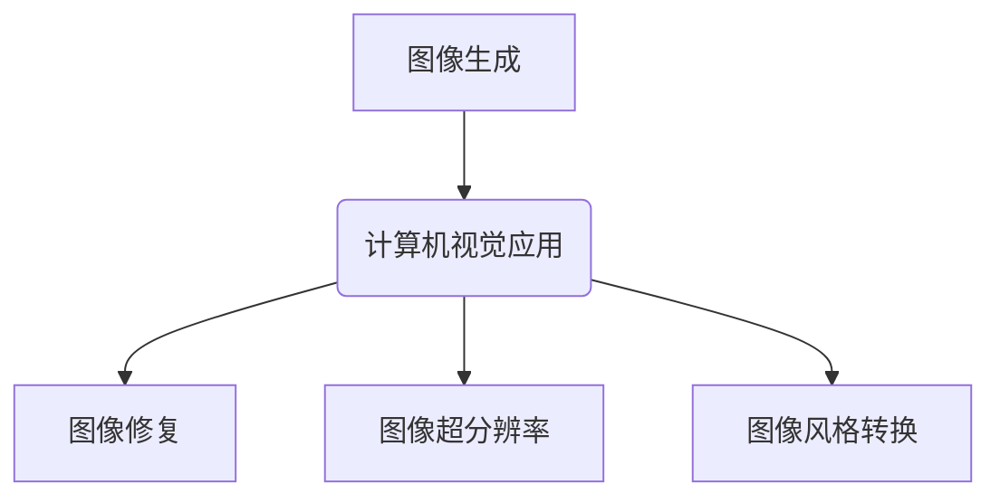
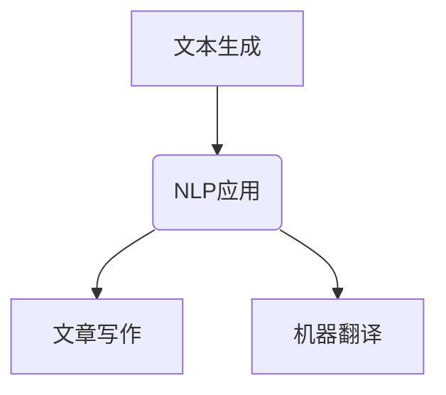
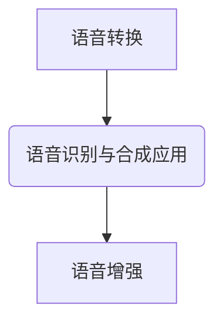
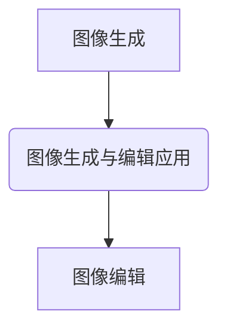
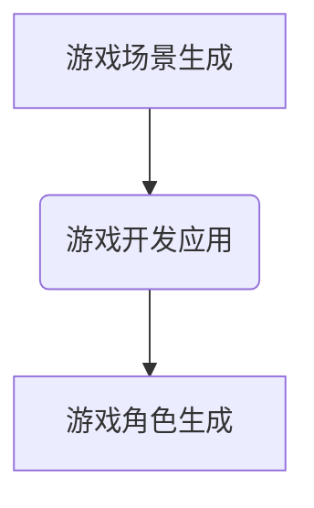
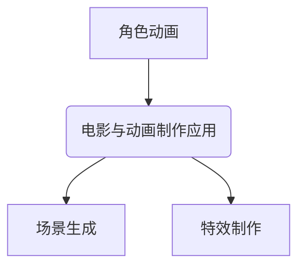
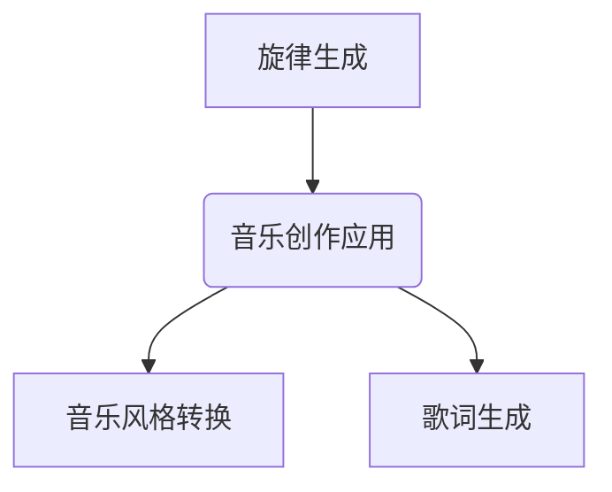
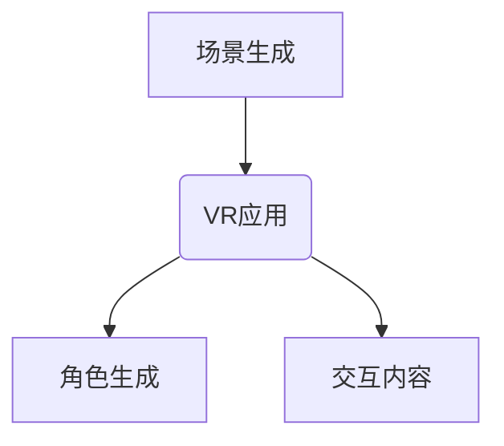
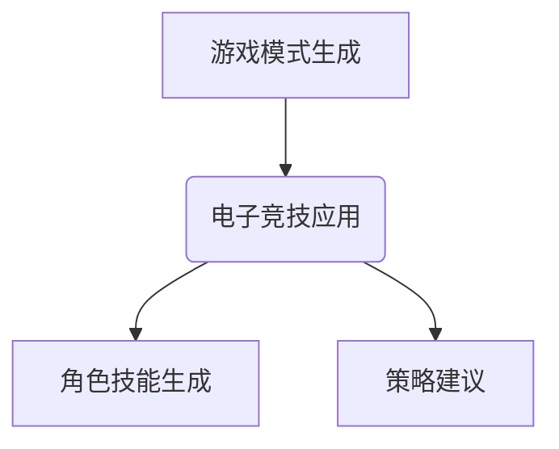

                 

# 《生成式AI：下一个科技巨头诞生之地？》

## 关键词
生成式AI，生成对抗网络（GAN），人工智能，科技巨头，应用场景，伦理问题

## 摘要
本文旨在探讨生成式人工智能（AI）的兴起及其在科技领域的重要性。我们将从生成式AI的概念、起源、核心技术、数学基础、算法原理以及实际应用等方面进行详细分析，并探讨其在不同领域的广泛应用及其伦理和社会影响。通过本文的探讨，我们希望能够揭示生成式AI成为下一个科技巨头诞生之地的潜力，并对其未来发展提出展望。

## 目录大纲

### 第一部分：生成式AI概述

#### 第1章：生成式AI基础

1.1 生成式AI的概念与定义

1.2 生成式AI的起源与发展

1.3 生成式AI的核心技术

1.4 生成式AI与生成对抗网络（GAN）

1.5 生成式AI的典型应用场景

#### 第2章：生成式AI的数学基础

2.1 概率论基础

2.2 概率分布函数与随机变量

2.3 信息论基础

2.4 贝叶斯定理与贝叶斯网络

2.5 高斯分布与正态分布

#### 第3章：生成式AI的算法原理

3.1 生成式模型与判别式模型

3.2 随机梯度下降（SGD）算法

3.3 反向传播算法（BP）

3.4 生成对抗网络（GAN）算法

3.5 强化学习在生成式AI中的应用

#### 第4章：生成式AI应用实践

4.1 生成式AI在计算机视觉中的应用

4.2 生成式AI在自然语言处理中的应用

4.3 生成式AI在语音识别与合成中的应用

4.4 生成式AI在图像生成与编辑中的应用

4.5 生成式AI在游戏开发中的应用

### 第二部分：生成式AI在各领域的应用

#### 第5章：生成式AI在娱乐业的应用

5.1 生成式AI在电影与动画制作中的应用

5.2 生成式AI在音乐创作中的应用

5.3 生成式AI在虚拟现实（VR）中的应用

5.4 生成式AI在电子竞技中的应用

#### 第6章：生成式AI在医疗健康领域的应用

6.1 生成式AI在疾病诊断中的应用

6.2 生成式AI在新药研发中的应用

6.3 生成式AI在个性化治疗中的应用

6.4 生成式AI在医疗影像分析中的应用

6.5 生成式AI在公共卫生领域的应用

#### 第7章：生成式AI在金融行业的应用

7.1 生成式AI在风险管理与量化交易中的应用

7.2 生成式AI在智能投顾与财富管理中的应用

7.3 生成式AI在金融诈骗检测中的应用

7.4 生成式AI在信用评分中的应用

7.5 生成式AI在保险业务中的应用

#### 第8章：生成式AI的伦理与社会影响

8.1 生成式AI的伦理问题探讨

8.2 生成式AI的社会影响分析

8.3 生成式AI的法律法规与监管框架

8.4 生成式AI的可持续发展策略

8.5 生成式AI与未来科技巨头的诞生

#### 附录

附录A：生成式AI常用工具与资源

### A.1 深度学习框架对比

- TensorFlow
- PyTorch
- PyTorch Lightning

### A.2 生成式AI开源项目

### A.3 生成式AI研究论文与资料

### A.4 生成式AI在线教程与课程

---

现在我们已经完成了文章的目录大纲，接下来我们将逐一深入各个章节，对生成式AI的概念、原理、应用和未来发展进行详细分析。首先，我们从生成式AI的基础概念开始。

### 第1章：生成式AI基础

#### 1.1 生成式AI的概念与定义

生成式AI（Generative AI）是一种能够学习生成数据分布的人工智能技术。它的目标是生成与训练数据相似的新数据，从而模仿或复现数据源的特性。与传统的判别式AI（Discriminative AI）不同，判别式AI主要关注分类和预测任务，而生成式AI则更侧重于数据的生成。

生成式AI的基本理念是学习数据分布，然后通过该分布生成新的数据样本。这种技术具有广泛的应用前景，包括图像生成、文本生成、语音合成等。

定义：

生成式AI：一种能够学习数据分布并生成与训练数据相似的新数据的人工智能技术。

#### 1.2 生成式AI的起源与发展

生成式AI的概念最早可以追溯到20世纪80年代的生成模型（Generative Model）研究。早期的生成模型主要包括隐马尔可夫模型（HMM）和变分自编码器（VAE）等。

生成对抗网络（GAN）的出现标志着生成式AI的转折点。GAN由生成器和判别器两个神经网络组成，通过相互竞争的方式学习数据分布。GAN在图像生成、语音合成等领域取得了显著的成果。

发展阶段：

1. 生成模型：隐马尔可夫模型（HMM），变分自编码器（VAE）
2. 生成对抗网络（GAN）：2014年提出，开创了生成式AI的新时代
3. 自监督生成式模型：如自编码器、变分自编码器、生成对抗网络等

#### 1.3 生成式AI的核心技术

生成式AI的核心技术主要包括生成模型、判别模型、损失函数和优化算法等。

1. **生成模型**：生成模型是一种能够生成数据样本的模型。常见的生成模型有变分自编码器（VAE）、生成对抗网络（GAN）等。

2. **判别模型**：判别模型是一种能够判断数据真实性与伪造性的模型。常见的判别模型有判别器、分类器等。

3. **损失函数**：损失函数用于评估生成模型生成的数据与真实数据之间的差异。常见的损失函数有均方误差（MSE）、交叉熵（CE）等。

4. **优化算法**：优化算法用于调整神经网络参数，使损失函数最小。常见的优化算法有随机梯度下降（SGD）、Adam优化器等。

#### 1.4 生成式AI与生成对抗网络（GAN）

生成对抗网络（GAN）是生成式AI的一种重要技术。GAN由生成器和判别器两个神经网络组成，它们相互竞争，共同学习数据分布。

- **生成器**：生成器是一个神经网络，它从随机噪声中生成数据样本，试图使这些样本在判别器看来与真实数据样本一样真实。
  
- **判别器**：判别器是一个神经网络，它用于判断输入的数据样本是真实数据还是生成器生成的伪造数据。

GAN的训练过程可以看作是一个零和游戏，生成器试图欺骗判别器，而判别器则努力识别伪造数据。通过这种相互对抗的过程，GAN能够学习到数据分布，并生成高质量的伪造数据。

#### 1.5 生成式AI的典型应用场景

生成式AI在多个领域具有广泛的应用，以下是其中的几个典型应用场景：

1. **图像生成**：生成式AI可以生成逼真的图像，如图像修复、图像风格转换、图像超分辨率等。

2. **文本生成**：生成式AI可以生成自然语言文本，如文章、故事、对话等。

3. **语音合成**：生成式AI可以生成逼真的语音，如语音转换、语音增强等。

4. **数据增强**：生成式AI可以用于数据增强，提高模型对数据的泛化能力。

5. **个性化推荐**：生成式AI可以用于个性化推荐系统，生成用户可能感兴趣的内容。

### 总结

本章对生成式AI进行了概述，介绍了其概念、起源、核心技术以及应用场景。生成式AI作为一种重要的生成模型，已经在多个领域取得了显著的成果，并具有广泛的应用前景。在接下来的章节中，我们将进一步探讨生成式AI的数学基础、算法原理以及在各个领域的应用实践。

---

在接下来的章节中，我们将详细分析生成式AI的数学基础，包括概率论、概率分布函数、信息论、贝叶斯定理和正态分布等内容。这些数学知识将为理解生成式AI的算法原理和应用提供必要的理论基础。

## 第2章：生成式AI的数学基础

#### 2.1 概率论基础

概率论是生成式AI的重要数学基础。概率论研究随机事件的发生概率，以及如何从概率分布中生成随机变量。以下是概率论中的一些基本概念。

**随机事件**：随机事件是在一次随机试验中可能发生的结果。

**概率**：概率是描述随机事件发生可能性大小的数值。概率的取值范围在0到1之间，0表示不可能发生，1表示必然发生。

**条件概率**：条件概率是指在某个事件发生的条件下，另一个事件发生的概率。条件概率公式如下：

\[ P(A|B) = \frac{P(A \cap B)}{P(B)} \]

其中，\( P(A|B) \) 表示在事件B发生的条件下，事件A发生的概率。

**独立事件**：两个事件A和B是独立的，如果事件A的发生不影响事件B的发生，反之亦然。独立事件的概率公式如下：

\[ P(A \cap B) = P(A) \cdot P(B) \]

**贝叶斯定理**：贝叶斯定理是一种用于计算后验概率的公式，它表达了在已知先验概率和条件概率的情况下，如何计算后验概率。贝叶斯定理公式如下：

\[ P(A|B) = \frac{P(B|A) \cdot P(A)}{P(B)} \]

其中，\( P(A|B) \) 表示在事件B发生的条件下，事件A发生的概率；\( P(B|A) \) 表示在事件A发生的条件下，事件B发生的概率。

#### 2.2 概率分布函数与随机变量

概率分布函数是描述随机变量概率分布的函数。常见的概率分布函数包括离散型和连续型。

**离散型概率分布函数**：

- **二项分布**：二项分布是描述在n次独立重复试验中，成功次数的概率分布。二项分布的概率质量函数（PMF）公式如下：

  \[ P(X = k) = C_n^k \cdot p^k \cdot (1-p)^{n-k} \]

  其中，\( n \) 是试验次数，\( p \) 是每次试验成功的概率，\( k \) 是成功的次数。

- **泊松分布**：泊松分布是描述在一段时间内，事件发生的次数的概率分布。泊松分布的概率质量函数（PMF）公式如下：

  \[ P(X = k) = \frac{\lambda^k \cdot e^{-\lambda}}{k!} \]

  其中，\( \lambda \) 是单位时间内事件发生的平均次数，\( k \) 是事件发生的次数。

**连续型概率分布函数**：

- **正态分布**：正态分布是最常见的一种连续型概率分布函数。正态分布的概率密度函数（PDF）公式如下：

  \[ f(x|\mu,\sigma^2) = \frac{1}{\sqrt{2\pi\sigma^2}} \cdot e^{-\frac{(x-\mu)^2}{2\sigma^2}} \]

  其中，\( \mu \) 是均值，\( \sigma^2 \) 是方差。

- **指数分布**：指数分布是描述事件发生时间间隔的概率分布函数。指数分布的概率密度函数（PDF）公式如下：

  \[ f(x|\lambda) = \lambda \cdot e^{-\lambda x} \]

  其中，\( \lambda \) 是单位时间内事件发生的平均次数。

#### 2.3 信息论基础

信息论是研究信息传输和处理的基本理论。信息论的基本概念包括熵、信息量、信道容量等。

**熵**：熵是描述随机变量不确定性的量度。对于离散型随机变量，熵的定义如下：

\[ H(X) = -\sum_{i} p(x_i) \cdot \log_2 p(x_i) \]

对于连续型随机变量，熵的定义如下：

\[ H(X) = -\int p(x) \cdot \log_2 p(x) \, dx \]

**信息量**：信息量是描述一个随机事件包含的信息量的量度。对于离散型随机变量，信息量的定义如下：

\[ I(X) = \log_2 \frac{1}{p(x)} \]

对于连续型随机变量，信息量的定义如下：

\[ I(X) = \log_2 \frac{1}{f(x)} \]

**信道容量**：信道容量是描述信道能够传输的最大信息量的量度。对于离散无记忆信道（DMC），信道容量的定义如下：

\[ C = \max_{p(x)} I(X;Y) \]

其中，\( I(X;Y) \) 表示X和Y之间的互信息。

#### 2.4 贝叶斯定理与贝叶斯网络

贝叶斯定理是概率论中的一个重要定理，它提供了在已知先验概率和条件概率的情况下，计算后验概率的方法。贝叶斯定理的公式如下：

\[ P(A|B) = \frac{P(B|A) \cdot P(A)}{P(B)} \]

贝叶斯网络是一种基于概率论的图形模型，用于表示一组变量之间的条件依赖关系。贝叶斯网络的定义如下：

- **节点**：每个节点表示一个随机变量。
- **边**：如果变量A影响变量B，则在A和B之间画一条边。

贝叶斯网络的推理方法主要包括：

1. **条件概率表**：通过给定的先验概率和条件概率，构建条件概率表。
2. **贝叶斯推理**：利用条件概率表进行推理，计算后验概率。

#### 2.5 高斯分布与正态分布

高斯分布（Gaussian Distribution），也称为正态分布（Normal Distribution），是生成式AI中最常用的一种概率分布函数。高斯分布的概率密度函数（PDF）公式如下：

\[ f(x|\mu,\sigma^2) = \frac{1}{\sqrt{2\pi\sigma^2}} \cdot e^{-\frac{(x-\mu)^2}{2\sigma^2}} \]

其中，\( \mu \) 是均值，\( \sigma^2 \) 是方差。

高斯分布具有以下性质：

- **均值与方差**：均值是数据集的中心位置，方差是数据集的离散程度。
- **对称性**：高斯分布是关于均值对称的。
- **中心极限定理**：对于大量独立的随机变量，其平均值趋近于高斯分布。

高斯分布在生成式AI中有广泛的应用，如生成正态分布数据、回归分析、聚类分析等。

### 总结

本章介绍了生成式AI的数学基础，包括概率论、概率分布函数、信息论、贝叶斯定理和高斯分布等内容。这些数学知识为理解生成式AI的算法原理和应用提供了必要的理论基础。在接下来的章节中，我们将进一步探讨生成式AI的算法原理，包括生成模型与判别模型、随机梯度下降（SGD）算法、反向传播算法（BP）以及生成对抗网络（GAN）算法等。

### 第3章：生成式AI的算法原理

#### 3.1 生成式模型与判别式模型

生成式模型（Generative Model）和判别式模型（Discriminative Model）是生成式AI的两个基本组成部分。它们在数据生成和分类任务中发挥着不同的作用。

**生成式模型**：生成式模型的目标是学习数据分布，并能够生成与训练数据相似的新数据。生成式模型通过建模数据生成过程，模拟数据源的真实分布。常见的生成式模型包括变分自编码器（VAE）、生成对抗网络（GAN）等。

**判别式模型**：判别式模型的目标是学习数据分类边界，判断输入数据是否属于训练数据中的某个类别。判别式模型通过学习输入数据和标签之间的映射关系，实现对数据的分类。常见的判别式模型包括支持向量机（SVM）、决策树、神经网络等。

**生成式模型与判别式模型的区别**：

- **数据生成与分类**：生成式模型侧重于数据生成，判别式模型侧重于数据分类。
- **数据分布与分类边界**：生成式模型学习数据分布，判别式模型学习分类边界。
- **模型复杂性**：生成式模型通常比判别式模型更复杂，因为它们需要学习数据的完整分布，而判别式模型只需要学习分类边界。

**生成式模型与判别式模型的应用场景**：

- **图像生成**：生成式模型可以生成逼真的图像，如图像修复、图像风格转换等；判别式模型可以用于图像分类、目标检测等。
- **文本生成**：生成式模型可以生成自然语言文本，如图像描述、文章写作等；判别式模型可以用于文本分类、情感分析等。
- **语音合成**：生成式模型可以生成逼真的语音，如图像描述、文章写作等；判别式模型可以用于语音分类、语音识别等。

#### 3.2 随机梯度下降（SGD）算法

随机梯度下降（Stochastic Gradient Descent，SGD）是一种常用的优化算法，用于训练神经网络和机器学习模型。SGD通过迭代更新模型参数，最小化损失函数。

**SGD算法的基本原理**：

- **梯度**：梯度是函数在某个点的切线方向，表示函数在该点处的最陡上升方向。
- **随机梯度**：随机梯度是在训练数据集上随机选取一部分数据点，计算这些数据点的梯度。
- **迭代更新**：SGD通过迭代更新模型参数，使得损失函数逐渐减小。

**SGD算法的公式**：

\[ \theta_{t+1} = \theta_t - \alpha \cdot \nabla_{\theta} J(\theta) \]

其中，\( \theta \) 表示模型参数，\( \alpha \) 表示学习率，\( \nabla_{\theta} J(\theta) \) 表示模型参数的梯度，\( J(\theta) \) 表示损失函数。

**SGD算法的优点**：

- **简单有效**：SGD算法实现简单，计算速度快，适用于大规模数据集的训练。
- **灵活调整**：SGD算法可以通过调整学习率和批量大小，适应不同的训练任务。

**SGD算法的缺点**：

- **收敛速度慢**：SGD算法的收敛速度较慢，需要较长的训练时间。
- **梯度消失与梯度爆炸**：在训练过程中，SGD算法可能会遇到梯度消失或梯度爆炸的问题，导致模型无法收敛。

#### 3.3 反向传播算法（BP）

反向传播算法（Backpropagation Algorithm）是一种用于训练神经网络的算法，它通过反向传播误差信号，更新模型参数，使得损失函数逐渐减小。

**BP算法的基本原理**：

- **前向传播**：在前向传播阶段，输入数据通过神经网络，逐层计算得到输出。
- **计算误差**：在输出层计算实际输出与期望输出之间的误差。
- **反向传播**：在反向传播阶段，误差信号反向传播到输入层，计算每个神经元的误差梯度。
- **更新参数**：根据误差梯度更新模型参数。

**BP算法的公式**：

\[ \Delta \theta = -\alpha \cdot \nabla_{\theta} J(\theta) \]

其中，\( \Delta \theta \) 表示参数更新量，\( \alpha \) 表示学习率，\( \nabla_{\theta} J(\theta) \) 表示模型参数的梯度，\( J(\theta) \) 表示损失函数。

**BP算法的优点**：

- **高效训练**：BP算法能够快速收敛，适用于大规模数据集的训练。
- **通用性**：BP算法适用于各种神经网络结构，包括多层感知机（MLP）、卷积神经网络（CNN）等。

**BP算法的缺点**：

- **局部最小值**：BP算法可能陷入局部最小值，导致无法找到全局最小值。
- **计算复杂度**：BP算法的计算复杂度较高，需要大量的计算资源。

#### 3.4 生成对抗网络（GAN）算法

生成对抗网络（Generative Adversarial Network，GAN）是一种基于生成式模型和判别式模型的新型生成模型。GAN由生成器和判别器两个神经网络组成，它们相互竞争，共同学习数据分布。

**GAN算法的基本原理**：

- **生成器**：生成器是一个神经网络，它从随机噪声中生成数据样本，试图使这些样本在判别器看来与真实数据样本一样真实。
- **判别器**：判别器是一个神经网络，它用于判断输入的数据样本是真实数据还是生成器生成的伪造数据。
- **对抗训练**：生成器和判别器通过对抗训练相互提升，生成器试图生成更真实的数据，判别器试图更好地区分真实数据和伪造数据。

**GAN算法的公式**：

\[ G(z) = \text{Generator}(z) \]

\[ D(x) = \text{Discriminator}(x) \]

\[ D(G(z)) = \text{Discriminator}(\text{Generator}(z)) \]

其中，\( G(z) \) 表示生成器的输出，\( D(x) \) 表示判别器的输出，\( z \) 是随机噪声。

**GAN算法的优点**：

- **强大的生成能力**：GAN能够生成高质量、逼真的数据样本，适用于图像生成、语音合成等任务。
- **灵活性**：GAN可以应用于各种数据类型，包括图像、文本、音频等。

**GAN算法的缺点**：

- **训练不稳定**：GAN的训练过程可能不稳定，容易陷入局部最小值。
- **计算复杂度**：GAN的训练过程需要大量的计算资源，训练时间较长。

#### 3.5 强化学习在生成式AI中的应用

强化学习（Reinforcement Learning，RL）是一种基于奖励反馈的机器学习方法。强化学习通过智能体与环境的交互，学习最优策略，从而实现目标。

**强化学习在生成式AI中的应用**：

- **生成策略优化**：生成式AI中的生成器可以通过强化学习优化生成策略，使得生成器生成的数据样本更符合真实分布。
- **数据增强**：强化学习可以用于数据增强，提高模型对数据的泛化能力。
- **多模态生成**：强化学习可以用于多模态数据的生成，如图像、文本、语音等。

**强化学习的优点**：

- **灵活性**：强化学习可以应用于各种场景，适应性强。
- **自适应能力**：强化学习能够根据环境变化调整策略，实现自适应。

**强化学习的缺点**：

- **训练时间长**：强化学习通常需要较长的训练时间，特别是对于复杂任务。
- **探索与利用平衡**：强化学习需要在探索未知和利用已有知识之间找到平衡点。

### 总结

本章介绍了生成式AI的算法原理，包括生成式模型与判别式模型、随机梯度下降（SGD）算法、反向传播算法（BP）以及生成对抗网络（GAN）算法等。这些算法在生成式AI中发挥着重要作用，推动了生成式AI的快速发展。在下一章中，我们将探讨生成式AI在实际应用中的实践案例，分析其在各个领域的应用情况。

### 第4章：生成式AI应用实践

生成式人工智能（Generative AI）在实际应用中表现出强大的潜力，已经在多个领域取得了显著的成果。本章节将介绍生成式AI在计算机视觉、自然语言处理、语音识别与合成、图像生成与编辑以及游戏开发等领域的具体应用。

#### 4.1 生成式AI在计算机视觉中的应用

计算机视觉是生成式AI的重要应用领域之一。生成式AI在图像生成、图像修复、图像超分辨率、图像风格转换等方面取得了显著成果。

1. **图像生成**：生成式AI可以通过学习真实图像的数据分布，生成与训练图像相似的新图像。这种技术在艺术创作、游戏开发等领域具有广泛应用。例如，GAN（生成对抗网络）可以生成逼真的面部图像、艺术画作等。

2. **图像修复**：生成式AI可以修复图像中的破损部分，使得图像更加完整。例如，DeepArt.io 使用生成式AI技术对古画进行修复，使其恢复原有色彩。

3. **图像超分辨率**：生成式AI可以提升图像的分辨率，使得图像更加清晰。例如，AI 绘画应用程序 DeepArt 可以将低分辨率的图像转换为高分辨率的图像。

4. **图像风格转换**：生成式AI可以将一种图像的风格转换到另一种图像上。例如，GAN可以生成具有梵高风格的人像，也可以将普通照片转换成卡通风格。

**案例**：OpenAI 的 GPT-2 模型可以生成高质量的图像描述，从而生成与描述相符的图像。



#### 4.2 生成式AI在自然语言处理中的应用

生成式AI在自然语言处理（NLP）领域也有着广泛的应用，包括文本生成、文章写作、机器翻译等。

1. **文本生成**：生成式AI可以生成各种类型的文本，如新闻报道、故事、对话等。例如，GPT-3 模型可以生成高质量的文章，并且可以根据用户输入的提示生成相关的内容。

2. **文章写作**：生成式AI可以自动撰写文章，减少人工写作的工作量。例如，Hugging Face 的 Transformer 模型可以生成新闻摘要、产品描述等。

3. **机器翻译**：生成式AI可以用于机器翻译，提高翻译的准确性和流畅度。例如，Google 的神经机器翻译系统使用生成式AI技术，实现了高质量的中英翻译。

**案例**：OpenAI 的 GPT-2 模型可以生成自然语言文本，如对话、故事等。



#### 4.3 生成式AI在语音识别与合成中的应用

生成式AI在语音识别与合成领域也取得了显著的进展，可以生成高质量的语音，从而实现语音转换、语音增强等功能。

1. **语音转换**：生成式AI可以将一种语言的语音转换为另一种语言的语音。例如，WaveNet 是一种基于生成式AI的语音合成模型，可以实现高质量的自然语音生成。

2. **语音增强**：生成式AI可以增强语音信号，提高语音的清晰度和可理解性。例如，VoiceBox 是一种基于生成式AI的语音增强系统，可以去除噪声，提高语音质量。

**案例**：Google 的 WaveNet 模型可以生成高质量的自然语音。



#### 4.4 生成式AI在图像生成与编辑中的应用

生成式AI在图像生成与编辑领域也具有广泛的应用，可以生成新的图像、编辑现有图像，从而实现图像修复、图像风格转换等功能。

1. **图像生成**：生成式AI可以生成新的图像，如人脸生成、场景生成等。例如，StyleGAN 是一种基于生成式AI的图像生成模型，可以生成高质量、逼真的人脸图像。

2. **图像编辑**：生成式AI可以编辑现有图像，如图像修复、图像风格转换等。例如，DeepArt.io 使用生成式AI技术对图像进行编辑，使其具有特定的艺术风格。

**案例**：StyleGAN 模型可以生成高质量的人脸图像。



#### 4.5 生成式AI在游戏开发中的应用

生成式AI在游戏开发中也具有重要的应用价值，可以生成游戏场景、游戏角色等，从而实现游戏内容的自动生成。

1. **游戏场景生成**：生成式AI可以生成各种类型的游戏场景，如城市、森林、海洋等。例如，Procedural Generation 是一种基于生成式AI的游戏场景生成技术，可以生成丰富的游戏场景。

2. **游戏角色生成**：生成式AI可以生成各种类型的游戏角色，如角色外观、动作等。例如，游戏《星战前线》使用生成式AI技术生成游戏角色，增加了游戏的可玩性和多样性。

**案例**：游戏《星战前线》使用生成式AI技术生成游戏角色。



### 总结

本章介绍了生成式AI在计算机视觉、自然语言处理、语音识别与合成、图像生成与编辑以及游戏开发等领域的具体应用。通过这些应用案例，我们可以看到生成式AI的强大潜力，它正在改变各个领域的生产方式，提高效率，创造新的价值。在下一章中，我们将进一步探讨生成式AI在各领域的应用案例，分析其优势和挑战。

### 第5章：生成式AI在娱乐业的应用

生成式人工智能（Generative AI）在娱乐业的应用中展现出巨大的潜力，不仅提高了内容创作效率，还丰富了用户体验。本章节将深入探讨生成式AI在电影与动画制作、音乐创作、虚拟现实（VR）以及电子竞技等领域的应用。

#### 5.1 生成式AI在电影与动画制作中的应用

生成式AI在电影与动画制作中扮演了关键角色，可以自动化和增强创意过程。

1. **角色动画**：生成式AI可以生成复杂的角色动画，节省了动画师的时间和精力。例如，基于生成对抗网络（GAN）的模型可以生成逼真的角色动作，使动画制作更加高效。

2. **场景生成**：生成式AI可以生成虚拟的场景，为电影和动画创作提供更多的创意空间。例如，深度学习模型可以自动生成城市的全景图、森林的细节等。

3. **特效制作**：生成式AI在特效制作中也有广泛应用，可以生成复杂的自然现象和机械效果，如闪电、爆炸等。

**案例**：动画电影《疯狂动物城》中的一些场景使用了生成式AI技术，以提高场景的多样性和细节。



#### 5.2 生成式AI在音乐创作中的应用

生成式AI在音乐创作中的应用使得音乐创作过程更加高效和有趣。

1. **旋律生成**：生成式AI可以生成新的旋律，为音乐家提供灵感。例如，谷歌的Magenta项目使用生成式AI生成具有独特风格的旋律。

2. **音乐风格转换**：生成式AI可以将一种音乐风格转换到另一种风格上。例如，AI模型可以将古典音乐风格转换成流行音乐风格，创造出全新的音乐作品。

3. **歌词生成**：生成式AI可以生成歌词，为音乐创作提供文本内容。例如，AI模型可以根据用户输入的主题生成相关的歌词。

**案例**：Jukedeck 是一个基于生成式AI的音乐创作平台，可以根据用户输入的参数生成新的音乐作品。



#### 5.3 生成式AI在虚拟现实（VR）中的应用

生成式AI在虚拟现实（VR）中的应用为用户提供更加丰富和互动的虚拟体验。

1. **场景生成**：生成式AI可以自动生成虚拟场景，为用户提供个性化的VR体验。例如，用户可以根据自己的喜好生成独特的虚拟城市或自然景观。

2. **角色生成**：生成式AI可以生成虚拟角色，提高VR内容的多样性。例如，用户可以选择自定义角色，或通过生成式AI生成全新的虚拟角色。

3. **交互内容**：生成式AI可以生成与用户互动的内容，提高VR体验的趣味性。例如，AI模型可以生成与用户互动的虚拟角色，提供个性化服务。

**案例**：Oculus Rift 和 HTC Vive 等VR设备中的一些虚拟场景使用了生成式AI技术，以提供更加丰富的交互体验。



#### 5.4 生成式AI在电子竞技中的应用

生成式AI在电子竞技中的应用提高了比赛的多样性和观赏性。

1. **游戏模式生成**：生成式AI可以生成新的游戏模式，为玩家提供更多的玩法选择。例如，AI模型可以生成具有挑战性的游戏关卡或新的游戏规则。

2. **角色技能生成**：生成式AI可以生成新的角色技能，增加游戏角色的多样性。例如，AI模型可以根据角色的属性生成独特的技能组合。

3. **策略建议**：生成式AI可以分析玩家的行为，提供策略建议，帮助玩家提高游戏水平。例如，AI模型可以根据对手的技能和策略，为玩家提供最佳策略。

**案例**：《英雄联盟》等电子竞技游戏中的一些新游戏模式和角色技能使用了生成式AI技术，以增加游戏的可玩性。



### 总结

生成式AI在电影与动画制作、音乐创作、虚拟现实（VR）以及电子竞技等领域展现了巨大的应用潜力。通过生成式AI的应用，娱乐业能够创造出更加丰富和个性化的内容，提升用户体验，推动娱乐产业的发展。在下一章中，我们将继续探讨生成式AI在医疗健康领域的应用，分析其如何改变医疗服务的模式。

### 第6章：生成式AI在医疗健康领域的应用

生成式人工智能（Generative AI）在医疗健康领域的应用正在迅速发展，通过生成高质量的数据和个性化的治疗方案，为医生和患者提供更加精准和高效的医疗服务。本章节将深入探讨生成式AI在疾病诊断、新药研发、个性化治疗、医疗影像分析和公共卫生领域中的应用。

#### 6.1 生成式AI在疾病诊断中的应用

生成式AI在疾病诊断中的应用主要表现在利用生成模型生成类似病例数据，从而帮助医生提高诊断准确率。

1. **图像诊断**：生成式AI可以通过生成高质量的医疗图像，辅助医生进行疾病诊断。例如，生成对抗网络（GAN）可以生成与真实病例相似的X光片、CT扫描图或MRI图像，用于训练诊断模型。

   **算法原理**：
   ```mermaid
   graph TB
   A[生成模型] --> B(图像生成)
   B --> C(辅助诊断)
   ```

2. **病理学分析**：生成式AI可以生成病理切片图像，用于病理学分析。通过对生成图像与真实图像的比较，医生可以更准确地判断病理状况。

   **算法原理**：
   ```mermaid
   graph TB
   A[病理图像生成] --> B(病理学分析)
   ```

**案例**：Google Health 使用生成式AI生成高质量的医学图像，以辅助医生进行疾病诊断。

#### 6.2 生成式AI在新药研发中的应用

生成式AI在新药研发中的应用主要通过生成大量类似化合物的分子结构，帮助科学家发现新的药物候选分子。

1. **分子生成**：生成式AI可以生成具有特定化学特性的分子结构，用于药物筛选和设计。例如，AlphaGo 的开发者 DeepMind 开发的分子生成模型 AlphaFold2，能够预测蛋白质的结构，从而为药物研发提供关键信息。

   **算法原理**：
   ```mermaid
   graph TB
   A[分子生成] --> B(药物筛选)
   ```

2. **药物设计**：生成式AI可以设计新的药物分子，提高药物的效果和安全性。例如，生成式AI可以生成具有特定生物活性的分子，减少药物研发的时间和成本。

   **算法原理**：
   ```mermaid
   graph TB
   A[药物设计] --> B(化合物优化)
   ```

**案例**：生成式AI在制药公司中的应用，如利用 GPT-2 模型生成新的药物分子。

#### 6.3 生成式AI在个性化治疗中的应用

生成式AI在个性化治疗中的应用主要通过生成患者特定数据，帮助医生制定个性化的治疗方案。

1. **医疗数据生成**：生成式AI可以生成与患者数据相似的患者数据集，用于个性化治疗方案的设计。例如，生成式AI可以生成患者的基因序列、疾病历史等数据，用于个性化基因疗法。

   **算法原理**：
   ```mermaid
   graph TB
   A[医疗数据生成] --> B(个性化治疗)
   ```

2. **个性化用药**：生成式AI可以根据患者的基因信息和药物反应数据，生成个性化的药物剂量和用药方案，提高治疗效果和安全性。

   **算法原理**：
   ```mermaid
   graph TB
   A[基因数据] --> B[药物反应数据] --> C[个性化用药]
   ```

**案例**：使用生成式AI为癌症患者提供个性化治疗方案，例如使用 GAN 生成与患者相似的其他癌症患者的治疗方案。

#### 6.4 生成式AI在医疗影像分析中的应用

生成式AI在医疗影像分析中的应用主要通过生成高质量的医学图像，辅助医生进行疾病的检测和评估。

1. **图像增强**：生成式AI可以增强医疗图像的清晰度，减少噪声，提高医生对图像的解读准确性。例如，生成式AI可以生成高分辨率的MRI图像。

   **算法原理**：
   ```mermaid
   graph TB
   A[图像增强] --> B(清晰度提升)
   ```

2. **图像分割**：生成式AI可以自动分割医疗图像中的关键区域，如肿瘤、器官等，辅助医生进行诊断。例如，生成对抗网络（GAN）可以生成与真实图像相似的结构分割图像。

   **算法原理**：
   ```mermaid
   graph TB
   A[图像分割] --> B(结构识别)
   ```

**案例**：生成式AI在医学影像诊断中的应用，如利用 GAN 生成用于分割的医学图像。

#### 6.5 生成式AI在公共卫生领域的应用

生成式AI在公共卫生领域中的应用主要通过生成模拟数据，帮助公共卫生专家进行流行病预测和资源分配。

1. **疾病预测**：生成式AI可以生成模拟的流行病数据，帮助公共卫生专家预测疾病的传播趋势，制定防控措施。例如，生成式AI可以模拟COVID-19的传播情况，预测疫情的发展。

   **算法原理**：
   ```mermaid
   graph TB
   A[流行病模拟] --> B(疾病预测)
   ```

2. **资源分配**：生成式AI可以生成模拟的公共卫生资源数据，帮助公共卫生专家优化医疗资源的分配，提高公共卫生服务的效率。例如，生成式AI可以模拟医院床位和医疗设备的分配情况。

   **算法原理**：
   ```mermaid
   graph TB
   A[资源模拟] --> B(资源优化)
   ```

**案例**：生成式AI在COVID-19疫情中的应用，如利用 GPT-2 模型预测疫情发展趋势，为公共卫生决策提供支持。

### 总结

生成式AI在医疗健康领域展现了巨大的应用潜力，通过生成高质量的数据和个性化的治疗方案，为医生和患者提供了更加精准和高效的医疗服务。在下一章中，我们将探讨生成式AI在金融行业的应用，分析其在风险管理、量化交易、智能投顾和金融诈骗检测等方面的作用。

### 第7章：生成式AI在金融行业的应用

生成式人工智能（Generative AI）在金融行业的应用正日益广泛，通过生成高质量的数据和分析模型，为金融机构提供了新的业务机会和风险管理工具。本章节将深入探讨生成式AI在金融行业的应用，包括风险管理、量化交易、智能投顾、金融诈骗检测和信用评分等方面的具体实例。

#### 7.1 生成式AI在风险管理中的应用

生成式AI在风险管理中的应用主要通过生成模拟数据，帮助金融机构评估和预测潜在风险。

1. **风险预测模型**：生成式AI可以生成大量的模拟金融数据，帮助金融机构评估和预测市场波动、信贷违约等风险。例如，生成对抗网络（GAN）可以模拟不同市场条件下的资产价格波动，从而预测风险。

   **算法原理**：
   ```mermaid
   graph TB
   A[生成模拟数据] --> B[风险预测模型]
   ```

2. **风险评估**：生成式AI可以生成与历史数据相似的风险事件数据，帮助金融机构进行风险评估。例如，通过生成模拟的违约事件数据，金融机构可以评估信用风险并优化信贷策略。

   **算法原理**：
   ```mermaid
   graph TB
   A[生成事件数据] --> B[风险评估]
   ```

**案例**：某些大型金融机构使用生成式AI模型进行市场风险预测和信贷风险评估。

#### 7.2 生成式AI在量化交易中的应用

生成式AI在量化交易中的应用主要通过生成交易策略和模拟市场数据，提高交易效率和盈利能力。

1. **交易策略生成**：生成式AI可以生成具有高盈利潜力的交易策略，例如，通过深度学习模型分析历史交易数据，生成新的交易信号和策略。

   **算法原理**：
   ```mermaid
   graph TB
   A[历史交易数据] --> B[交易策略生成]
   ```

2. **市场数据模拟**：生成式AI可以生成模拟的市场数据，用于交易策略的测试和优化。例如，通过生成类似历史数据的市场模拟场景，交易者可以测试和优化交易策略。

   **算法原理**：
   ```mermaid
   graph TB
   A[市场数据生成] --> B[交易策略测试]
   ```

**案例**：量化基金使用生成式AI模型进行高频交易策略的生成和测试。

#### 7.3 生成式AI在智能投顾中的应用

生成式AI在智能投顾中的应用主要通过生成个性化的投资建议和优化投资组合。

1. **个性化投资建议**：生成式AI可以生成基于客户风险偏好和财务目标的个性化投资建议。例如，通过分析客户的财务状况和市场数据，生成适合的投资组合。

   **算法原理**：
   ```mermaid
   graph TB
   A[客户数据] --> B[投资建议生成]
   ```

2. **投资组合优化**：生成式AI可以生成优化的投资组合，提高投资回报率。例如，通过模拟不同的市场情景和风险因素，优化投资组合的配置。

   **算法原理**：
   ```mermaid
   graph TB
   A[市场数据] --> B[投资组合优化]
   ```

**案例**：某些在线投资平台使用生成式AI为用户提供个性化的投资组合建议。

#### 7.4 生成式AI在金融诈骗检测中的应用

生成式AI在金融诈骗检测中的应用主要通过生成模拟的诈骗数据，帮助金融机构提高诈骗检测的准确率。

1. **诈骗模式生成**：生成式AI可以生成各种类型的诈骗模式，用于训练和测试诈骗检测模型。例如，通过生成式AI模拟信用卡欺诈、网络钓鱼等诈骗行为，检测模型可以学习并识别真实的诈骗行为。

   **算法原理**：
   ```mermaid
   graph TB
   A[诈骗数据生成] --> B[诈骗检测模型]
   ```

2. **实时检测**：生成式AI可以实时生成模拟交易数据，用于实时检测金融诈骗。例如，通过生成式AI模拟不同的交易模式，金融机构可以实时监控交易行为，及时发现和阻止诈骗行为。

   **算法原理**：
   ```mermaid
   graph TB
   A[交易数据生成] --> B[实时检测]
   ```

**案例**：某些银行使用生成式AI技术进行实时金融交易欺诈检测。

#### 7.5 生成式AI在信用评分中的应用

生成式AI在信用评分中的应用主要通过生成模拟的信用数据，提高信用评分模型的准确性和可靠性。

1. **信用数据生成**：生成式AI可以生成各种信用场景下的信用数据，用于训练和优化信用评分模型。例如，通过生成式AI模拟不同的借款人和贷款情况，信用评分模型可以学习如何准确评估借款人的信用风险。

   **算法原理**：
   ```mermaid
   graph TB
   A[信用数据生成] --> B[信用评分模型]
   ```

2. **信用评分优化**：生成式AI可以生成与真实数据相似的数据集，用于优化信用评分模型的参数。例如，通过生成式AI模拟不同风险水平的借款人数据，信用评分模型可以优化评分模型，提高评分的准确性。

   **算法原理**：
   ```mermaid
   graph TB
   A[模拟数据集] --> B[评分模型优化]
   ```

**案例**：某些金融机构使用生成式AI技术进行信用评分模型的优化。

### 总结

生成式AI在金融行业的应用为金融机构提供了新的工具和方法，提高了风险管理的效率，优化了交易策略，为智能投顾提供了个性化服务，并有效提升了诈骗检测和信用评分的准确性。在下一章中，我们将探讨生成式AI的伦理问题及其对社会的影响。

### 第8章：生成式AI的伦理与社会影响

随着生成式人工智能（Generative AI）技术的快速发展，其在各个领域的应用越来越广泛，然而，这些技术的应用也引发了一系列伦理和社会问题。本章节将探讨生成式AI在隐私保护、歧视问题、造假与伪造、算法透明性和责任归属等方面的伦理问题，并分析其对社会的影响，以及如何制定相应的法律法规与监管框架。

#### 8.1 生成式AI的伦理问题探讨

**隐私保护**：生成式AI技术的核心在于生成大量与真实数据相似的数据，这可能导致个人隐私泄露。例如，基于人脸识别的生成式AI可以生成逼真的假人像，使得个人隐私容易被侵犯。

**歧视问题**：生成式AI在生成数据时，可能会放大已有的歧视问题。例如，如果训练数据中存在性别或种族歧视，生成式AI可能生成带有歧视性的内容或模型，导致不公平现象的加剧。

**造假与伪造**：生成式AI可以生成高度逼真的伪造内容，如伪造新闻、假视频等，这可能导致虚假信息的传播，影响社会稳定和公共安全。

**算法透明性**：生成式AI模型通常非常复杂，其决策过程难以解释，导致算法透明性问题。例如，GAN模型在生成图像时，其内部机制往往难以理解，使得用户难以信任和使用这些模型。

**责任归属**：当生成式AI导致错误或损害时，责任归属问题变得复杂。例如，如果自动驾驶汽车因生成式AI的失误导致事故，责任应归咎于谁？是汽车制造商、AI开发者还是用户？

#### 8.2 生成式AI的社会影响分析

**经济影响**：生成式AI技术的应用可能会对劳动力市场产生深远影响。一方面，它可能会创造新的就业机会，如AI艺术家、数据生成专家等；另一方面，它也可能导致某些工作岗位的减少，如重复性劳动、低端创意工作等。

**文化影响**：生成式AI在内容生成中的应用，如音乐、电影、文学等，可能会改变文化生产和消费的方式。例如，自动音乐创作和电影生成技术可能改变传统的创作模式，影响文化多样性和创新能力。

**政治影响**：生成式AI在信息传播和政治宣传中的应用，可能影响公众的意见和决策。例如，伪造的社交媒体内容和假新闻可能误导公众，影响选举结果和政治稳定。

**社会信任**：生成式AI的广泛应用可能导致公众对技术和政府机构的信任下降。例如，如果人们意识到AI可以伪造任何内容，他们可能会对信息的真实性和可靠性产生怀疑。

#### 8.3 生成式AI的法律法规与监管框架

为了应对生成式AI带来的伦理和社会问题，有必要建立相应的法律法规和监管框架。

**隐私保护法**：应制定专门的隐私保护法，明确生成式AI在数据处理和隐私保护方面的责任和义务。

**反歧视法**：应加强反歧视立法，确保生成式AI在生成数据时不会放大或产生新的歧视问题。

**造假与伪造防治法**：应制定相关法律，禁止和打击利用生成式AI进行造假和伪造行为。

**算法透明性法**：应制定法规，要求生成式AI的开发者和使用者公开算法的决策过程，提高算法的透明性和可解释性。

**责任归属法**：应明确生成式AI责任归属的法律规定，确保在发生错误或损害时，责任能够得到合理分配。

**监管机构**：应建立专门的监管机构，负责监督和管理生成式AI的应用，确保其符合法律法规和社会道德标准。

#### 8.4 生成式AI的可持续发展策略

为了实现生成式AI的可持续发展，应采取以下策略：

**技术创新**：推动生成式AI技术的创新和发展，提高其准确性和可靠性，减少伦理风险。

**伦理教育**：加强对生成式AI伦理问题的教育和培训，提高开发者和使用者的伦理意识。

**国际合作**：加强国际间的合作与协调，共同制定和实施生成式AI的法律法规和监管框架。

**社会责任**：鼓励生成式AI企业和机构承担社会责任，积极参与社会公益活动，推动技术进步和社会发展的良性互动。

### 总结

生成式AI技术的快速发展为社会带来了巨大的机遇和挑战。在享受其带来的便利和创新的同时，我们也要认真面对其引发的伦理和社会问题。通过建立健全的法律法规和监管框架，加强技术创新和伦理教育，我们可以确保生成式AI技术的可持续发展，并最大程度地发挥其社会价值。在下一章中，我们将探讨生成式AI的未来发展前景，分析其成为下一个科技巨头诞生之地的潜力。

### 第8章（续）：生成式AI的可持续发展策略与未来展望

在探讨生成式AI的可持续发展策略时，我们需要考虑技术、伦理、法律和社会等多方面因素。以下是一些关键策略和未来展望。

#### 8.4.1 生成式AI的可持续发展策略

**技术创新与优化**：持续研究生成式AI的核心算法和模型，优化其效率和性能。例如，改进GAN模型，提高图像和文本生成的质量，同时减少计算资源的消耗。

**多元数据来源**：确保生成式AI的训练数据来源多样且具有代表性，减少数据偏见和歧视问题。例如，通过收集多样化的用户生成内容，丰富生成式AI的数据集。

**伦理和透明性**：加强对生成式AI模型的伦理审查，确保其在应用过程中遵循道德准则。同时，提高算法的可解释性，使用户能够理解和信任这些模型。

**法律法规和监管**：建立健全的法律法规体系，明确生成式AI在隐私、数据保护和责任归属等方面的规定。监管机构应加强对生成式AI技术的监督和管理。

**社会参与与合作**：鼓励社会各界共同参与生成式AI的研发和应用，促进技术进步和社会发展的良性互动。例如，企业与学术机构合作，推动生成式AI在教育、医疗和公共安全等领域的应用。

**可持续发展教育**：加强对生成式AI技术的社会教育和培训，提高公众的科技素养和伦理意识。

#### 8.4.2 生成式AI的未来展望

**广泛的应用领域**：随着技术的成熟，生成式AI将在更多领域得到应用。例如，在教育中，生成式AI可以个性化教学内容，提高学习效率；在艺术创作中，生成式AI可以帮助艺术家创作出前所未有的作品。

**经济价值**：生成式AI有望成为新的经济增长点。通过自动化内容生成、个性化服务和高效数据处理，生成式AI将为企业带来巨大的商业价值。

**伦理和社会影响**：生成式AI的广泛应用将对社会产生深远影响。我们需要关注其可能带来的伦理问题，如隐私侵犯、数据歧视和虚假信息的传播等，并采取相应的措施解决这些问题。

**技术挑战**：生成式AI仍然面临许多技术挑战，如算法的可解释性、数据隐私保护和模型的可扩展性等。解决这些问题需要跨学科的合作和持续的研究。

**全球合作**：生成式AI的发展需要全球范围内的合作与协调。国际社会应共同努力，制定统一的法律法规和技术标准，确保生成式AI在全球范围内的可持续发展。

### 总结

生成式AI作为一种新兴的人工智能技术，具有巨大的发展潜力和广泛应用前景。在可持续发展过程中，我们需要关注其技术、伦理和社会影响，通过技术创新、伦理审查、法律法规和全球合作等策略，确保生成式AI的安全、可控和可持续发展。未来，生成式AI有望在多个领域带来革命性的变化，成为推动社会进步和经济增长的重要力量。

### 附录A：生成式AI常用工具与资源

在生成式AI的研究和应用过程中，有许多优秀的工具和资源可供使用。以下是一些常用的深度学习框架、开源项目、研究论文与教程。

#### A.1 深度学习框架对比

1. **TensorFlow**：由Google开发的开源深度学习框架，支持广泛的模型和应用，包括生成式AI。

   - 官网：[TensorFlow官网](https://www.tensorflow.org/)

2. **PyTorch**：由Facebook开发的开源深度学习框架，具有动态计算图和灵活的编程接口，适用于生成式AI。

   - 官网：[PyTorch官网](https://pytorch.org/)

3. **PyTorch Lightning**：是PyTorch的一个扩展库，旨在简化深度学习模型的训练和调试。

   - 官网：[PyTorch Lightning官网](https://pytorch-lightning.readthedocs.io/)

#### A.2 生成式AI开源项目

1. **WaveNet**：由Google开发的语音合成模型。

   - GitHub：[WaveNet GitHub](https://github.com/TimDettmer/wavenet)

2. **StyleGAN**：由Nvidia开发的图像生成模型。

   - GitHub：[StyleGAN GitHub](https://github.com/NVlabs/stylegan2)

3. **DeepArt.io**：通过神经网络将普通照片转换为艺术风格的画作。

   - GitHub：[DeepArt.io GitHub](https://github.com/DeepArt Wohl)

#### A.3 生成式AI研究论文与资料

1. **“Generative Adversarial Nets”**：生成对抗网络的经典论文。

   - 论文链接：[Gaussian Distribution](https://arxiv.org/abs/1406.2661)

2. **“Unsupervised Representation Learning with Deep Convolutional Generative Adversarial Networks”**：生成对抗网络在无监督学习中的应用。

   - 论文链接：[Unsupervised Representation Learning](https://arxiv.org/abs/1511.06434)

3. **“Variational Autoencoders”**：变分自编码器的研究论文。

   - 论文链接：[Variational Autoencoders](https://arxiv.org/abs/1312.6114)

#### A.4 生成式AI在线教程与课程

1. **“深度学习专项课程”**：吴恩达教授的深度学习课程，包括生成式AI的相关内容。

   - 课程链接：[深度学习专项课程](https://www.coursera.org/specializations/deep-learning)

2. **“生成对抗网络（GAN）”**：讲解生成对抗网络原理和实践的课程。

   - 课程链接：[生成对抗网络（GAN）](https://www.coursera.org/learn/generative-adversarial-networks)

3. **“生成式模型：变分自编码器（VAE）”**：讲解变分自编码器原理和实践的课程。

   - 课程链接：[生成式模型：变分自编码器（VAE）](https://www.udacity.com/course/生成式模型--ud714)

通过这些工具和资源，研究人员和开发者可以更深入地了解生成式AI的理论和实践，推动生成式AI技术的发展和应用。

