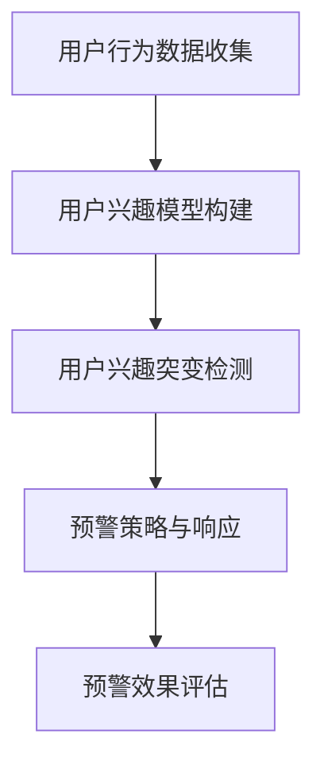

                 

### 《电商平台中的用户兴趣突变预警机制》

> **关键词：** 电商平台，用户兴趣突变，预警机制，数据挖掘，机器学习

**摘要：** 本文深入探讨了电商平台中用户兴趣突变预警机制的构建与应用。首先，我们介绍了用户兴趣突变预警的重要性及其在电商平台运营中的价值。随后，本文详细分析了用户行为数据收集、用户兴趣模型构建、用户兴趣突变检测算法和预警机制设计等核心内容。通过实际案例研究，本文展示了用户兴趣突变预警机制在电商平台的具体应用。最后，我们对未来的发展趋势和面临的挑战进行了展望，并提出了相应的解决方案和未来研究方向。

---

#### 第一部分：概述与背景

在当今数字化时代，电商平台已经成为了消费者购买商品的重要渠道之一。随着用户数据的不断积累和技术的飞速发展，电商平台拥有了更多的机会来提高用户体验和提升运营效率。然而，用户行为和兴趣的动态变化带来了新的挑战。为了在激烈的市场竞争中脱颖而出，电商平台需要能够快速响应用户需求的改变，提前发现和应对用户兴趣突变。这就需要构建一个有效的用户兴趣突变预警机制。

### **1.1 引言**

本文旨在探讨如何构建一个用户兴趣突变预警机制，以帮助电商平台更好地理解用户行为，预测潜在的需求变化，并做出及时响应。我们将从以下几个方面展开讨论：

1. **用户兴趣突变的概念和重要性**：介绍用户兴趣突变的基本概念，阐述其在电商平台运营中的关键作用。
2. **用户行为数据收集**：分析电商平台如何收集用户行为数据，包括浏览、购买、评论等行为。
3. **用户兴趣模型构建**：讨论如何利用用户行为数据构建用户兴趣模型，以便更好地理解用户的兴趣和需求。
4. **用户兴趣突变检测方法**：介绍几种常见的用户兴趣突变检测方法，并详细分析其原理和适用场景。
5. **预警机制设计**：讨论如何设计一个有效的预警机制，包括预警模型的构建、预警策略的制定和预警响应机制的实施。
6. **实践应用**：通过实际案例研究，展示用户兴趣突变预警机制在电商平台的应用效果。
7. **未来展望**：探讨用户兴趣突变预警机制的未来发展趋势，以及面临的挑战和解决方案。

### **1.2 电商平台与用户兴趣**

电商平台的核心目标是为用户提供一个便捷、高效、个性化的购物体验。在这个过程中，了解和满足用户兴趣至关重要。用户兴趣可以理解为用户在特定时间段内对某种商品或服务的偏好。用户的兴趣可能因多种因素而发生变化，如个人需求的改变、市场趋势的波动、促销活动的刺激等。

用户兴趣的动态性使得电商平台需要具备快速响应能力，以保持竞争优势。传统的基于固定用户画像的推荐系统往往难以适应这种变化。因此，构建一个能够实时监测用户兴趣变化的预警机制成为了电商平台提高运营效率和用户体验的关键。

### **1.3 用户兴趣突变预警的重要性**

用户兴趣突变预警机制在电商平台中具有以下几个重要意义：

1. **提升用户满意度**：通过实时监测用户兴趣变化，电商平台可以更准确地推荐用户感兴趣的商品，从而提高用户的购物体验和满意度。
2. **优化库存管理**：了解用户兴趣突变可以帮助电商平台更精准地预测商品需求，优化库存管理，减少库存积压，降低运营成本。
3. **精准营销**：基于用户兴趣突变的数据分析，电商平台可以制定更加精准的营销策略，提高转化率和销售额。
4. **增强竞争力**：在激烈的市场竞争中，能够快速响应用户需求变化的电商平台将更具竞争力。
5. **预防潜在风险**：通过监测用户兴趣突变，电商平台可以及时发现异常行为，如恶意评论或刷单，从而预防潜在风险。

综上所述，用户兴趣突变预警机制在电商平台运营中具有重要意义，是提高运营效率和用户体验的关键技术手段。

---

#### 第二部分：理论基础

在构建用户兴趣突变预警机制之前，我们需要深入了解相关的理论基础，包括用户行为分析、用户兴趣模型构建和用户兴趣突变检测方法。这些理论基础为我们提供了科学的方法和工具，帮助我们更好地理解和预测用户行为，从而构建一个有效的预警机制。

### **2.1 用户行为分析**

用户行为分析是构建用户兴趣突变预警机制的重要基础。通过分析用户在电商平台上的行为数据，我们可以获取用户的行为特征，了解用户的兴趣和需求，从而为用户兴趣突变预警提供依据。

#### **2.1.1 用户行为数据概述**

用户行为数据包括用户在电商平台上的各种操作行为，如浏览、搜索、加入购物车、购买、评价等。这些数据通常以日志的形式记录下来，包含时间戳、用户ID、行为类型、行为对象等信息。

用户行为数据的种类和数量非常丰富，如图表1所示：

| 用户行为类型 | 说明                                                         |
| ------------ | ------------------------------------------------------------ |
| 浏览         | 用户在浏览商品页面时的行为，如页面停留时间、浏览深度等。       |
| 搜索         | 用户在搜索框中输入关键词进行商品搜索的行为。                 |
| 加入购物车   | 用户将商品添加到购物车中的行为。                           |
| 购买         | 用户完成商品购买的行为，包括下单、支付等。                   |
| 评价         | 用户对购买商品进行评价的行为。                             |

图表1：用户行为数据概述

#### **2.1.2 用户行为数据分析方法**

用户行为数据分析方法主要包括以下几种：

1. **描述性分析**：通过统计和可视化方法，对用户行为数据进行总结和展示，了解用户行为的整体趋势和特征。

2. **关联性分析**：通过分析不同用户行为之间的关联关系，挖掘用户行为的潜在模式。例如，分析用户浏览商品和购买商品之间的关系，可以揭示用户的购买决策过程。

3. **聚类分析**：将具有相似行为的用户划分为同一群体，从而发现用户行为模式的不同类型。例如，通过聚类分析，可以将用户分为高频购买者、低频购买者、闲逛者等不同类型。

4. **时间序列分析**：通过分析用户行为在时间维度上的变化规律，预测用户未来的行为趋势。例如，分析用户在特定时间段内的购买行为，可以预测节假日或促销活动期间的购买高峰。

5. **机器学习模型**：利用机器学习算法，对用户行为数据进行分析和预测。例如，通过构建用户兴趣模型，可以预测用户可能感兴趣的商品，从而实现个性化推荐。

#### **2.1.3 用户行为数据的价值**

用户行为数据对于电商平台运营具有重要的价值：

1. **用户画像构建**：通过分析用户行为数据，可以构建详细的用户画像，了解用户的兴趣、需求和购买习惯，为个性化推荐和精准营销提供基础。

2. **市场分析**：通过分析用户行为数据，可以了解市场需求和趋势，为电商平台的产品策略和市场推广提供依据。

3. **运营优化**：通过分析用户行为数据，可以发现运营中的问题，如商品推荐不准确、用户流失等，从而优化运营策略，提高用户满意度。

4. **风险管理**：通过分析用户行为数据，可以识别异常行为，如刷单、恶意评论等，从而预防潜在风险。

综上所述，用户行为分析是构建用户兴趣突变预警机制的重要理论基础，通过对用户行为数据的深入分析，我们可以更好地了解用户兴趣和需求，为预警机制的构建提供依据。

### **2.2 用户兴趣模型构建**

构建用户兴趣模型是用户兴趣突变预警机制的核心步骤，它有助于我们理解和预测用户的兴趣变化，从而及时发出预警。用户兴趣模型通常基于用户行为数据，通过统计学方法或机器学习算法来构建。

#### **2.2.1 用户兴趣模型的基本概念**

用户兴趣模型是描述用户在特定时间段内对各类商品或服务的偏好程度的一种模型。它可以通过量化用户对不同商品或服务的兴趣值来表示。用户兴趣模型通常包括以下几个关键概念：

1. **兴趣维度**：兴趣维度是指用户兴趣的类别或领域，如电子产品、服装、家居用品等。

2. **兴趣值**：兴趣值是衡量用户对某一兴趣维度的兴趣程度的数值，通常采用0-1之间的标度来表示。

3. **兴趣分布**：用户兴趣分布是描述用户兴趣在各维度上的分布情况，通常采用概率分布或频率分布来表示。

#### **2.2.2 用户兴趣模型构建方法**

用户兴趣模型构建的方法主要包括以下几种：

1. **基于统计学的兴趣模型**：通过统计分析用户行为数据，计算出用户在不同维度上的兴趣值。这种方法简单直观，但可能无法捕捉到用户兴趣的动态变化。

2. **基于机器学习的兴趣模型**：利用机器学习算法，如矩阵分解、深度学习等，对用户行为数据进行分析和建模。这种方法可以捕捉到用户兴趣的复杂模式，提高模型的预测准确性。

3. **基于图的兴趣模型**：通过构建用户行为数据的图模型，利用图论算法来分析用户兴趣。这种方法可以揭示用户行为之间的复杂关系，有助于构建更精细的兴趣模型。

#### **2.2.3 用户兴趣模型的应用**

用户兴趣模型在电商平台中有广泛的应用，主要包括以下几个方面：

1. **个性化推荐**：通过用户兴趣模型，可以准确预测用户可能感兴趣的商品，从而实现个性化推荐，提高用户满意度和转化率。

2. **精准营销**：基于用户兴趣模型，可以制定更有针对性的营销策略，如定向广告投放、促销活动等，提高营销效果。

3. **用户行为预测**：通过用户兴趣模型，可以预测用户的未来行为，如购买、评价等，从而为运营决策提供支持。

4. **用户流失预警**：通过分析用户兴趣模型，可以识别潜在的用户流失风险，从而采取相应的措施进行用户保留。

综上所述，用户兴趣模型是构建用户兴趣突变预警机制的关键，通过构建用户兴趣模型，我们可以更好地理解和预测用户兴趣变化，从而实现预警和响应。

### **2.3 用户兴趣突变检测方法**

用户兴趣突变检测是用户兴趣突变预警机制的核心环节，它旨在识别和检测用户兴趣的显著变化，从而及时发出预警。用户兴趣突变检测方法主要分为基于统计的方法、基于机器学习的方法和基于图的方法，每种方法都有其特定的原理和适用场景。

#### **2.3.1 基于统计的方法**

基于统计的方法是用户兴趣突变检测中最传统和简单的一种方法。这种方法主要通过分析用户行为数据的时间序列变化，检测用户兴趣的显著波动。常见的方法包括：

1. **移动平均法**：通过计算用户行为数据的时间序列的移动平均值，判断当前值是否显著偏离平均值。如果偏离值超过一定的阈值，则认为存在用户兴趣突变。

   $$ 
   \text{移动平均} = \frac{1}{n}\sum_{i=1}^{n} \text{用户行为数据}_i 
   $$

2. **标准差法**：通过计算用户行为数据的标准差，判断当前值是否显著偏离均值。如果偏离值超过一定的倍数（如2倍标准差），则认为存在用户兴趣突变。

   $$ 
   \text{标准差} = \sqrt{\frac{1}{n-1}\sum_{i=1}^{n} (\text{用户行为数据}_i - \text{均值})^2} 
   $$

3. **异常值检测**：通过分析用户行为数据，识别出显著偏离正常范围的异常值。这些异常值可能代表用户兴趣的突变。

   $$ 
   \text{异常值} = \text{用户行为数据} \in (\text{均值} - k \times \text{标准差}, \text{均值} + k \times \text{标准差}) 
   $$

其中，$k$ 是一个常数，通常取值为2或3。

#### **2.3.2 基于机器学习的方法**

基于机器学习的方法利用机器学习算法，对用户行为数据进行分析和学习，从而检测用户兴趣的突变。这种方法具有较高的灵活性和准确性，常见的算法包括：

1. **孤立森林（Isolation Forest）**：孤立森林算法通过随机选择特征和切分值，将数据集划分为多个区域，使得异常数据更容易被隔离。该算法适用于高维数据，并且对噪声数据的鲁棒性较好。

   伪代码：
   ```python
   def IsolationForest(data, max_depth, sample_size):
       # 随机选择特征和切分值，划分数据区域
       # 计算每个区域的异常得分
       # 输出异常得分和对应的异常数据
   ```

2. **局部异常因子（Local Outlier Factor，LOF）**：LOF算法通过计算局部异常因子，衡量每个数据点相对于其邻居的异常程度。局部异常因子值越大，表示数据点越可能是异常点。

   伪代码：
   ```python
   def LocalOutlierFactor(data, k):
       # 计算每个数据点的局部异常因子
       # 输出局部异常因子和对应的异常数据
   ```

3. **K-最近邻（K-Nearest Neighbors，KNN）**：KNN算法通过计算数据点到最近邻的距离，判断数据点的异常程度。如果数据点到最近邻的距离较大，则认为数据点可能是异常点。

   伪代码：
   ```python
   def KNearestNeighbors(data, k):
       # 计算每个数据点到最近邻的距离
       # 判断数据点的异常程度
       # 输出异常数据和异常程度
   ```

#### **2.3.3 基于图的方法**

基于图的方法通过构建用户行为数据的图模型，利用图论算法检测用户兴趣的突变。这种方法可以揭示用户行为之间的复杂关系，有助于发现潜在的兴趣突变。常见的图算法包括：

1. **社区检测（Community Detection）**：社区检测算法通过分析用户行为数据的图结构，识别出具有紧密联系的节点群体，即社区。如果某个社区的用户行为突然发生变化，则认为存在兴趣突变。

   伪代码：
   ```python
   def CommunityDetection(graph):
       # 分解图结构，识别社区
       # 输出社区划分和对应的社区成员
   ```

2. **网络流分析（Network Flow Analysis）**：网络流分析算法通过分析用户行为数据的图中的流量分布，检测异常流量模式。如果流量模式发生显著变化，则认为存在兴趣突变。

   伪代码：
   ```python
   def NetworkFlowAnalysis(graph, source, sink):
       # 计算网络流
       # 检测异常流量模式
       # 输出异常流量和对应的节点
   ```

#### **2.3.4 比较与选择**

不同的用户兴趣突变检测方法各有优缺点，具体选择取决于电商平台的具体需求和数据特性。以下是一些比较和选择因素：

1. **数据量**：基于统计的方法对数据量要求较低，适用于小规模数据集；而基于机器学习和基于图的方法适用于大规模数据集。

2. **数据维度**：基于统计的方法适用于较低维度的数据；而基于机器学习和基于图的方法适用于高维数据。

3. **计算复杂度**：基于统计的方法计算复杂度较低，适用于实时检测；而基于机器学习和基于图的方法计算复杂度较高，适用于离线分析。

4. **准确性**：基于机器学习和基于图的方法具有较高的准确性，适用于对精度要求较高的场景。

5. **可解释性**：基于统计的方法具有较好的可解释性，便于理解和调试；而基于机器学习和基于图的方法可解释性较差。

综上所述，用户兴趣突变检测方法的选择应根据电商平台的具体需求和数据特性进行综合考虑。通过结合多种方法，可以构建一个更加全面和有效的用户兴趣突变预警机制。

### **2.4 用户兴趣突变评估指标**

在用户兴趣突变预警机制中，评估指标的设定至关重要。通过评估指标，我们可以衡量用户兴趣突变检测的准确性和效果，从而不断优化预警机制。常见的用户兴趣突变评估指标包括精确率、召回率、F1值和用户满意度等。

#### **2.4.1 精确率（Precision）**

精确率是检测到的兴趣突变中实际为突变的比例。它反映了预警机制的准确性。

$$
\text{精确率} = \frac{\text{实际为突变的检测到的突变}}{\text{检测到的突变总数}}
$$

精确率越高，意味着误报率越低，预警机制对真正的兴趣突变识别能力越强。

#### **2.4.2 召回率（Recall）**

召回率是实际为突变的用户兴趣中，被检测到的比例。它反映了预警机制的完整性。

$$
\text{召回率} = \frac{\text{实际为突变的检测到的突变}}{\text{实际为突变的总数}}
$$

召回率越高，意味着漏报率越低，预警机制能够更全面地捕捉到所有实际兴趣突变。

#### **2.4.3 F1值（F1 Score）**

F1值是精确率和召回率的调和平均数，综合反映了预警机制的准确性和完整性。

$$
\text{F1值} = 2 \times \frac{\text{精确率} \times \text{召回率}}{\text{精确率} + \text{召回率}}
$$

F1值越高，意味着预警机制的综合表现越好。

#### **2.4.4 用户满意度**

用户满意度是用户对预警机制效果的主观评价，通过问卷调查、用户反馈等方式获取。用户满意度可以反映预警机制对用户实际需求满足的程度。

$$
\text{用户满意度} = \frac{\text{满意的用户数量}}{\text{总用户数量}}
$$

用户满意度越高，意味着预警机制对用户的实际价值越大。

#### **2.4.5 综合评估**

在实际应用中，我们可以根据不同的评估指标，对用户兴趣突变预警机制进行综合评估。通过不断调整和优化，可以提高预警机制的准确性和用户满意度，从而实现更好的运营效果。

---

#### 第三部分：预警机制设计

在了解了用户兴趣突变预警机制的理论基础后，接下来我们将深入探讨预警机制的设计，包括预警模型构建、预警策略制定和预警响应机制的实施。

### **3.1 预警模型构建**

预警模型的构建是用户兴趣突变预警机制设计的核心步骤。一个有效的预警模型需要能够准确捕捉用户的兴趣变化，并及时发出预警信号。预警模型的构建通常涉及以下几个关键环节：

#### **3.1.1 数据预处理**

在构建预警模型之前，首先需要对用户行为数据进行预处理。数据预处理包括以下几个步骤：

1. **数据清洗**：去除重复数据、缺失数据和异常数据，确保数据的质量和一致性。

2. **数据归一化**：将不同维度和尺度的数据归一化，以便于模型处理。

3. **特征提取**：从用户行为数据中提取有助于预警的关键特征，如用户浏览深度、购买频率、商品类别等。

#### **3.1.2 模型选择**

选择合适的机器学习算法来构建预警模型是关键。常用的算法包括：

1. **决策树**：通过树结构进行分类和预测，易于理解和解释。

2. **随机森林**：通过集成多棵决策树，提高模型的预测准确性和鲁棒性。

3. **支持向量机（SVM）**：通过最大间隔分类器，适用于高维数据。

4. **神经网络**：通过多层神经网络，可以捕捉用户行为的复杂模式。

5. **深度学习**：通过卷积神经网络（CNN）或循环神经网络（RNN），可以处理序列数据和时序数据。

#### **3.1.3 模型训练与验证**

在选择了合适的模型后，接下来需要进行模型训练和验证。模型训练是通过给定训练数据，使模型学习用户兴趣变化规律。模型验证包括以下几个步骤：

1. **交叉验证**：通过将数据集划分为训练集和验证集，评估模型在不同数据集上的性能。

2. **超参数调优**：通过调整模型参数，如树深度、学习率等，以提高模型的性能。

3. **模型评估**：使用评估指标（如精确率、召回率、F1值等）对模型进行评估，确保模型具有良好的预测能力。

### **3.2 预警策略制定**

预警策略的制定是确保预警模型能够有效运作的重要环节。一个合理的预警策略需要考虑以下几个方面：

#### **3.2.1 预警阈值设定**

预警阈值是判断用户兴趣是否发生突变的临界值。设定合适的预警阈值是关键。预警阈值可以通过以下方法确定：

1. **基于统计学的方法**：通过计算用户行为数据的标准差或异常值，设定预警阈值。

2. **基于机器学习的方法**：通过训练预警模型，使用模型的预测结果设定预警阈值。

3. **专家经验**：结合业务专家的经验，根据实际情况设定预警阈值。

#### **3.2.2 预警频度设定**

预警频度是指预警系统发出预警信号的频率。设定合适的预警频度需要考虑以下几个方面：

1. **数据更新频率**：根据用户行为数据的更新频率，确定预警系统的检测周期。

2. **用户活跃度**：对于活跃度较高的用户，可以适当提高预警频度，以便更快地捕捉兴趣变化。

3. **系统资源**：预警系统的运行需要消耗计算资源和存储资源，需要平衡预警频度和系统资源。

#### **3.2.3 预警级别设定**

预警级别是指预警信号的严重程度。通常分为低级、中级和高级预警。设定合适的预警级别需要考虑以下几个方面：

1. **用户行为变化程度**：根据用户行为变化的大小，确定预警级别。

2. **业务影响**：根据用户行为变化可能带来的业务影响，确定预警级别。

3. **应对策略**：根据不同的预警级别，制定相应的应对策略。

### **3.3 预警响应机制**

预警响应机制是确保预警系统能够及时、有效地响应用户兴趣突变的关键。预警响应机制包括以下几个步骤：

#### **3.3.1 预警信号接收**

预警系统需要能够及时接收并处理预警信号。可以通过以下方法实现：

1. **实时监控系统**：通过实时监控系统，监控用户行为数据，并及时触发预警信号。

2. **消息队列**：将预警信号存储在消息队列中，由预警系统定期处理。

#### **3.3.2 预警信号处理**

预警信号处理是指对预警信号进行分类、分析和存储。具体步骤如下：

1. **信号分类**：根据预警级别，对预警信号进行分类，如低级预警、中级预警和高级预警。

2. **信号分析**：分析预警信号，确定用户兴趣突变的原因和影响。

3. **信号存储**：将预警信号存储在数据库中，以便后续分析和处理。

#### **3.3.3 预警信号响应**

预警信号响应是指根据预警信号采取相应的措施，以应对用户兴趣突变。具体步骤如下：

1. **个性化推荐**：根据用户兴趣突变，调整推荐策略，向用户推荐更多相关商品。

2. **营销活动**：根据用户兴趣突变，制定有针对性的营销活动，如优惠券、促销等。

3. **用户沟通**：通过邮件、短信等方式，与用户进行沟通，了解用户兴趣突变的原因，并给予解答和帮助。

4. **业务调整**：根据用户兴趣突变，调整业务策略，如商品库存、价格策略等。

综上所述，预警机制的设计包括预警模型构建、预警策略制定和预警响应机制的实施。通过合理设计这些环节，可以构建一个有效的用户兴趣突变预警机制，从而提升电商平台的运营效率和用户体验。

---

#### 第四部分：实践应用

在深入探讨了用户兴趣突变预警机制的理论基础和设计方法之后，我们通过实际案例研究来展示这一机制在电商平台中的具体应用。以下是两个具有代表性的实际案例研究。

### **6.1 案例一：用户兴趣突变预警在电商平台的应用**

**1. 案例背景**

某大型电商平台，用户数量庞大，用户行为数据丰富多样。平台希望通过构建用户兴趣突变预警机制，及时发现和应对用户兴趣的变化，从而提高用户满意度和转化率。

**2. 数据收集与处理**

平台收集了用户在电商平台的浏览、搜索、购买、评价等行为数据。数据预处理包括数据清洗、归一化和特征提取。特征提取环节提取了用户的浏览深度、购买频率、商品类别等关键特征。

**3. 用户兴趣模型构建**

平台采用机器学习算法，如随机森林和神经网络，构建用户兴趣模型。通过模型训练和验证，得到一个能够准确预测用户兴趣的模型。

**4. 用户兴趣突变检测**

平台使用孤立森林算法和局部异常因子（LOF）算法，对用户行为数据进行分析，检测用户兴趣突变。设定合适的预警阈值，当用户兴趣突变得分超过阈值时，触发预警信号。

**5. 预警信号处理与响应**

平台建立了一套完善的预警信号处理和响应机制。当用户兴趣突变预警信号触发时，系统会自动调整推荐策略，向用户推荐更多相关商品。同时，平台通过邮件和短信与用户进行沟通，了解用户兴趣突变的原因，并提供相应的解决方案。

**6. 案例效果**

通过用户兴趣突变预警机制的应用，平台实现了以下效果：

- 用户满意度显著提升，用户反馈良好。
- 用户转化率提高，销售额增长显著。
- 及时捕捉到了部分潜在用户流失风险，采取了有效的用户保留措施。
- 优化了库存管理，减少了库存积压，降低了运营成本。

**7. 反思与总结**

该案例展示了用户兴趣突变预警机制在电商平台中的成功应用。然而，在实际运营中，也遇到了一些挑战，如数据质量问题和模型性能优化等。平台通过不断调整和优化预警机制，提高了预警的准确性和效果。

### **6.2 案例二：用户兴趣突变预警在其他领域的应用**

**1. 案例背景**

除了电商平台，用户兴趣突变预警机制在其他领域也有广泛的应用。以下以社交媒体平台为例，探讨用户兴趣突变预警在其他领域的应用。

**2. 数据收集与处理**

社交媒体平台收集了用户的发布、点赞、评论、转发等行为数据。数据预处理包括数据清洗、归一化和特征提取。特征提取环节提取了用户的活跃度、社交网络密度、内容类别等关键特征。

**3. 用户兴趣模型构建**

平台采用深度学习算法，如卷积神经网络（CNN）和循环神经网络（RNN），构建用户兴趣模型。通过模型训练和验证，得到一个能够准确预测用户兴趣的模型。

**4. 用户兴趣突变检测**

平台使用社区检测算法和网络流分析算法，对用户行为数据进行分析，检测用户兴趣突变。设定合适的预警阈值，当用户兴趣突变得分超过阈值时，触发预警信号。

**5. 预警信号处理与响应**

平台建立了一套完善的预警信号处理和响应机制。当用户兴趣突变预警信号触发时，系统会自动调整内容推荐策略，向用户推荐更多相关内容。同时，平台通过私信和通知与用户进行沟通，了解用户兴趣突变的原因，并提供相应的解决方案。

**6. 案例效果**

通过用户兴趣突变预警机制的应用，平台实现了以下效果：

- 用户活跃度显著提升，用户互动增加。
- 用户留存率提高，平台用户增长显著。
- 及时捕捉到了部分潜在用户流失风险，采取了有效的用户保留措施。
- 优化了内容推荐策略，提高了内容质量和用户体验。

**7. 反思与总结**

该案例展示了用户兴趣突变预警机制在社交媒体平台中的成功应用。然而，在实际运营中，也遇到了一些挑战，如数据质量和模型性能优化等。平台通过不断调整和优化预警机制，提高了预警的准确性和效果。

### **6.3 案例分析与反思**

通过上述两个案例研究，我们可以看到用户兴趣突变预警机制在不同领域的广泛应用和显著效果。以下是对两个案例的分析与反思：

**1. 数据质量的重要性**

数据质量是构建用户兴趣突变预警机制的基础。在案例一中，电商平台通过严格的数据预处理和特征提取，确保了数据的质量和一致性。而在案例二中，社交媒体平台面临更大的数据质量挑战，因为用户发布的内容可能包含大量的噪声和错误。平台需要通过数据清洗和去噪技术，提高数据的准确性。

**2. 模型选择与优化**

模型选择和优化是影响预警机制效果的关键因素。在案例一中，电商平台采用了多种机器学习算法，通过交叉验证和超参数调优，找到了最优的模型。而在案例二中，社交媒体平台选择了深度学习算法，并通过大规模数据训练和模型调整，提高了预测准确性。

**3. 预警阈值设定**

预警阈值设定是预警机制的核心环节。在案例一中，电商平台通过统计学方法和机器学习算法，设定了合理的预警阈值。而在案例二中，社交媒体平台需要根据用户行为和业务需求，灵活调整预警阈值，以确保预警信号的准确性和及时性。

**4. 预警响应机制的构建**

预警响应机制的构建是确保预警机制有效运作的重要环节。在案例一中，电商平台建立了完善的预警信号处理和响应机制，通过个性化推荐和用户沟通，提高了用户体验。而在案例二中，社交媒体平台通过内容推荐和用户沟通，提高了用户活跃度和留存率。

**5. 持续优化与迭代**

用户兴趣突变预警机制需要持续优化和迭代，以适应不断变化的市场环境和用户需求。在案例中，平台通过不断收集用户反馈和业务数据，不断调整和优化预警机制，提高了预警效果。

综上所述，用户兴趣突变预警机制在电商平台和其他领域的成功应用，展示了其在提升运营效率和用户体验方面的巨大潜力。然而，在实际运营中，平台需要不断优化和调整预警机制，以应对不断变化的市场环境和用户需求。

---

#### 第五部分：未来展望

随着科技的不断进步和数据技术的迅猛发展，用户兴趣突变预警机制在电商平台中的应用前景愈发广阔。以下是对用户兴趣突变预警机制未来发展趋势、面临的挑战及解决方案的展望。

### **7.1 新技术与应用前景**

1. **人工智能与机器学习的深化应用**：随着人工智能和机器学习技术的不断成熟，更加复杂和高效的算法将被应用于用户兴趣突变预警机制。例如，深度学习、图神经网络（GNN）和强化学习等技术的应用，将进一步提高预警模型的准确性和实时性。

2. **大数据分析技术的普及**：大数据分析技术将帮助电商平台更深入地挖掘和分析用户行为数据，从而构建更精准和动态的用户兴趣模型。大数据分析技术还包括实时分析、流数据处理和实时预警等技术，这些技术将极大地提升预警机制的反应速度和决策效率。

3. **物联网（IoT）技术的融合**：物联网技术的应用将使得电商平台能够收集到更多类型和来源的用户数据，如智能设备使用数据、地理位置信息等。这些数据将丰富用户画像，提高用户兴趣突变检测的准确性和全面性。

4. **隐私保护与数据安全**：随着隐私保护和数据安全法律法规的不断完善，电商平台需要更加注重用户数据的安全和隐私保护。未来的用户兴趣突变预警机制将更多地采用匿名化、差分隐私和联邦学习等技术，以平衡隐私保护和数据利用之间的关系。

### **7.2 面临的挑战与解决方案**

1. **数据质量和数据完整性**：用户兴趣突变预警机制的有效性依赖于高质量和完整性的数据。在实际应用中，数据缺失、噪声和异常值等问题会影响模型的性能。解决方案包括数据清洗技术、异常检测和填补缺失数据的方法。

2. **模型解释性和可解释性**：随着机器学习模型的复杂性增加，模型的解释性和可解释性变得越来越重要。用户和业务人员需要能够理解模型的决策过程和预测结果。解决方案包括可解释性机器学习（XAI）技术和模型可视化工具。

3. **实时性和计算资源**：用户兴趣突变预警机制需要实时监测和处理大量数据，这对计算资源和系统性能提出了高要求。解决方案包括分布式计算、云计算和边缘计算等技术，以提升系统的实时性和处理能力。

4. **用户隐私和数据安全**：用户隐私和数据安全是用户兴趣突变预警机制面临的重要挑战。解决方案包括采用加密技术、隐私保护算法和数据安全策略，确保用户数据的安全性和隐私性。

5. **模型泛化能力**：模型在不同用户群体和应用场景中的泛化能力是一个重要问题。解决方案包括跨领域迁移学习、数据增强和多样性数据集的构建，以提高模型的泛化能力和适应性。

### **7.3 未来研究方向**

1. **个性化预警机制**：未来的研究方向将更加关注如何构建个性化预警机制，以适应不同用户群体的需求。通过个性化推荐和定制化预警策略，可以提高预警的针对性和效果。

2. **多模态数据融合**：随着物联网和传感器技术的发展，用户生成数据的形式越来越多样化。未来研究方向将包括如何融合多模态数据（如文本、图像、语音等），以提高用户兴趣突变检测的准确性和全面性。

3. **动态用户兴趣模型**：用户兴趣是动态变化的，如何构建实时、动态的用户兴趣模型是未来研究的重要方向。通过实时数据流分析和动态学习技术，可以不断更新和优化用户兴趣模型，提高预警的实时性和准确性。

4. **自适应预警阈值**：传统的预警阈值设定方法可能无法适应动态变化的用户行为。未来的研究方向将包括如何设计自适应预警阈值，以根据用户行为的变化自动调整预警阈值。

5. **跨平台预警机制**：随着电商平台的多样化，如何构建跨平台的用户兴趣突变预警机制，以覆盖更多应用场景，是未来的重要研究方向。

综上所述，用户兴趣突变预警机制在电商平台中的应用前景广阔，面临着一系列挑战和机遇。通过不断研究和创新，我们可以构建更加高效、精准和安全的预警机制，为电商平台的运营和用户满意度提升提供强有力的支持。

---

#### 附录 A：常用算法与工具

在构建用户兴趣突变预警机制的过程中，需要使用到多种算法和工具。以下介绍几种常用的算法和工具，以及它们在用户兴趣突变预警机制中的应用。

### **A.1 相关算法简介**

1. **孤立森林（Isolation Forest）**：
   - 算法原理：孤立森林算法通过随机选择特征和切分值，将数据集划分为多个区域，使得异常数据更容易被隔离。该算法适用于高维数据，并且对噪声数据的鲁棒性较好。
   - 应用场景：用户兴趣突变检测，特别是对于大规模高维用户行为数据的异常检测。

2. **局部异常因子（Local Outlier Factor，LOF）**：
   - 算法原理：LOF算法通过计算局部异常因子，衡量每个数据点相对于其邻居的异常程度。局部异常因子值越大，表示数据点越可能是异常点。
   - 应用场景：用户兴趣突变检测，用于识别用户行为数据中的异常模式。

3. **K-最近邻（K-Nearest Neighbors，KNN）**：
   - 算法原理：KNN算法通过计算数据点到最近邻的距离，判断数据点的异常程度。如果数据点到最近邻的距离较大，则认为数据点可能是异常点。
   - 应用场景：用户兴趣突变检测，适用于小规模数据集。

4. **决策树（Decision Tree）**：
   - 算法原理：决策树通过树结构进行分类和预测，易于理解和解释。每个节点代表一个特征，每个分支代表一个特征划分。
   - 应用场景：用户兴趣模型构建和用户兴趣突变检测，用于分类和预测用户兴趣。

5. **随机森林（Random Forest）**：
   - 算法原理：随机森林通过集成多棵决策树，提高模型的预测准确性和鲁棒性。每棵树都是基于随机特征和样本生成，通过多数投票得到最终预测结果。
   - 应用场景：用户兴趣模型构建和用户兴趣突变检测，适用于大规模数据集。

6. **支持向量机（Support Vector Machine，SVM）**：
   - 算法原理：SVM通过最大间隔分类器，寻找一个最优的超平面，将不同类别的数据点分开。SVM适用于高维数据，特别是线性不可分数据。
   - 应用场景：用户兴趣模型构建和用户兴趣突变检测，用于分类和回归任务。

7. **卷积神经网络（Convolutional Neural Network，CNN）**：
   - 算法原理：CNN通过卷积层、池化层和全连接层等结构，学习图像或时间序列数据的特征。CNN能够自动提取特征，适用于处理高维数据。
   - 应用场景：用户兴趣模型构建和用户兴趣突变检测，用于图像和序列数据的分析。

8. **循环神经网络（Recurrent Neural Network，RNN）**：
   - 算法原理：RNN通过循环结构，处理序列数据，能够记住前一个时间点的信息。RNN适用于时间序列数据的分析和预测。
   - 应用场景：用户兴趣模型构建和用户兴趣突变检测，用于处理连续的时序用户行为数据。

### **A.2 数据分析与挖掘工具**

1. **Python**：
   - 介绍：Python是一种高级编程语言，广泛应用于数据分析和机器学习。Python拥有丰富的数据分析和机器学习库，如NumPy、Pandas、Scikit-learn、TensorFlow和Keras。
   - 应用：用于编写数据处理、特征提取、模型训练和预测等代码，实现用户兴趣突变预警机制。

2. **R语言**：
   - 介绍：R语言是一种专门用于统计分析和图形表示的编程语言。R拥有强大的数据分析库，如ggplot2、dplyr和tidymodels。
   - 应用：用于数据清洗、统计分析、模型评估和可视化，支持用户兴趣突变预警机制的研究和应用。

3. **SQL**：
   - 介绍：SQL是一种结构化查询语言，用于数据库管理和数据分析。SQL可以高效地查询、更新和操作数据库。
   - 应用：用于存储、管理和查询用户行为数据，支持用户兴趣突变预警机制的实时监测和数据操作。

4. **Hadoop和Hive**：
   - 介绍：Hadoop是一个分布式数据处理平台，用于大规模数据的存储和处理。Hive是基于Hadoop的数据仓库工具，用于处理大规模数据集。
   - 应用：用于存储和管理海量用户行为数据，支持用户兴趣突变预警机制的实时数据分析和处理。

5. **Spark**：
   - 介绍：Spark是一个快速通用的数据处理引擎，用于大规模数据的批处理和实时处理。Spark包括Spark SQL、Spark MLlib和Spark Streaming等模块。
   - 应用：用于处理大规模用户行为数据，支持用户兴趣突变预警机制的实时数据处理和流处理。

6. **TensorFlow和Keras**：
   - 介绍：TensorFlow和Keras是用于深度学习的开源框架。TensorFlow提供了丰富的深度学习模型和工具，Keras是一个简化的深度学习API，易于使用。
   - 应用：用于构建和训练深度学习模型，实现用户兴趣突变预警机制的复杂特征提取和预测。

通过以上算法和工具的应用，我们可以有效地构建和优化用户兴趣突变预警机制，提高电商平台的运营效率和用户体验。

---

### **核心概念与联系**

在构建用户兴趣突变预警机制的过程中，有几个核心概念和它们之间的关系需要深入理解。以下是这些核心概念及其相互联系的 Mermaid 流程图和详细解释：

#### **核心概念与联系**

**用户行为数据收集**：用户行为数据是构建用户兴趣突变预警机制的基础。通过收集用户在电商平台上的浏览、搜索、购买、评价等行为数据，我们可以获得用户的兴趣和行为特征。

**用户兴趣模型构建**：基于用户行为数据，我们构建用户兴趣模型。这个模型通过统计分析和机器学习算法，将用户的行为转化为对各类商品或服务的兴趣值，帮助我们理解用户的兴趣和需求。

**用户兴趣突变检测**：用户兴趣突变检测是预警机制的核心步骤。通过分析用户兴趣模型和当前用户行为数据，我们使用异常检测算法（如孤立森林、局部异常因子）来识别用户兴趣的显著变化。

**预警策略与响应**：一旦检测到用户兴趣突变，我们需要根据设定的预警策略和响应机制，采取相应的措施。这些措施可能包括个性化推荐、营销活动调整、用户沟通等，以应对用户兴趣的变化。

**预警效果评估**：最后，我们需要对预警机制的效果进行评估。通过评估指标（如精确率、召回率、F1值），我们可以衡量预警机制的准确性和有效性，并据此进行优化。

#### **核心概念与联系流程图**



#### **详细解释**

**用户行为数据收集**：电商平台通过各种渠道收集用户行为数据，包括浏览日志、点击流、购买记录等。这些数据经过清洗和预处理后，成为构建用户兴趣模型的基础。

**用户兴趣模型构建**：利用机器学习算法，我们分析用户行为数据，构建用户兴趣模型。这个模型可以揭示用户对不同商品类别的兴趣程度，帮助我们理解用户的兴趣和行为模式。

**用户兴趣突变检测**：通过分析用户兴趣模型和实时用户行为数据，我们使用异常检测算法来识别用户兴趣的显著变化。这些算法能够检测出用户的兴趣点是否发生了异常波动，从而触发预警信号。

**预警策略与响应**：一旦检测到用户兴趣突变，平台需要根据预设的预警策略采取相应的措施。这些措施可能包括调整个性化推荐策略、发送促销信息、与用户进行沟通等，以引导用户行为。

**预警效果评估**：通过评估指标（如精确率、召回率、F1值），我们可以衡量预警机制的有效性。这些指标可以帮助我们识别预警机制中的不足，并进行优化和调整。

通过以上核心概念的相互联系，我们可以构建一个高效、可靠的用户兴趣突变预警机制，从而提升电商平台的运营效率和用户体验。

---

### **核心算法原理讲解**

在用户兴趣突变预警机制中，核心算法的作用至关重要。以下是用户兴趣突变检测算法的原理讲解，以及相应的伪代码实现。

#### **用户兴趣突变检测算法原理**

用户兴趣突变检测的核心目标是识别用户兴趣的显著变化。这通常涉及到以下几个步骤：

1. **计算用户历史兴趣分布**：通过分析用户历史行为数据，计算用户在过去一段时间内的兴趣分布。这通常通过统计用户浏览、购买、评价等行为的频率来实现。

2. **计算当前兴趣分布**：实时收集用户当前的行为数据，计算用户当前的兴趣分布。

3. **计算历史兴趣分布与当前兴趣分布的相似度**：通过比较用户历史兴趣分布和当前兴趣分布，计算它们之间的相似度。相似度越高，表示用户兴趣变化越小；相似度越低，表示用户兴趣变化越大。

4. **计算用户兴趣突变得分**：基于相似度计算，确定用户兴趣突变得分。这个得分可以用来判断用户兴趣是否发生了显著变化。

5. **设置阈值并触发预警**：根据设定的阈值，判断用户兴趣突变得分是否超过阈值。如果超过阈值，则触发预警，通知相关人员或系统进行响应。

#### **用户兴趣突变检测算法伪代码**

以下是一个简单的用户兴趣突变检测算法的伪代码实现：

```python
# 伪代码：用户兴趣突变检测算法
def detect_user_interest_anomaly(user_behavior_data, historical_data, similarity_threshold):
    """
    用户兴趣突变检测函数
    参数：
    - user_behavior_data：用户当前行为数据
    - historical_data：用户历史行为数据
    - similarity_threshold：相似度阈值
    返回值：
    - anomaly_score：用户兴趣突变得分
    """
    
    # 步骤1：计算用户历史兴趣分布
    historical_interest_distribution = calculate_historical_interest_distribution(historical_data)
    
    # 步骤2：计算当前兴趣分布
    current_interest_distribution = calculate_current_interest_distribution(user_behavior_data)
    
    # 步骤3：计算历史兴趣分布与当前兴趣分布的相似度
    similarity_score = calculate_similarity_score(historical_interest_distribution, current_interest_distribution)
    
    # 步骤4：计算用户兴趣突变得分
    anomaly_score = calculate_anomaly_score(similarity_score, similarity_threshold)
    
    # 步骤5：判断并触发预警
    if anomaly_score > similarity_threshold:
        trigger_alert()
    
    # 输出用户兴趣突变得分
    return anomaly_score

# 辅助函数定义
def calculate_historical_interest_distribution(historical_data):
    # 计算用户历史兴趣分布
    pass

def calculate_current_interest_distribution(user_behavior_data):
    # 计算用户当前兴趣分布
    pass

def calculate_similarity_score(historical_interest_distribution, current_interest_distribution):
    # 计算历史兴趣分布与当前兴趣分布的相似度
    pass

def calculate_anomaly_score(similarity_score, similarity_threshold):
    # 计算用户兴趣突变得分
    pass

def trigger_alert():
    # 触发预警
    pass
```

#### **算法详细解释**

1. **计算用户历史兴趣分布**：
   - 这个步骤涉及分析用户的历史行为数据，如浏览记录、购买记录等。通过对这些记录进行统计，我们可以得到用户对不同商品类别的兴趣频率分布。例如，用户对电子产品、服装和家居用品的浏览和购买频率。

2. **计算当前兴趣分布**：
   - 这个步骤是实时收集用户当前的行为数据，并计算用户当前的兴趣分布。例如，用户在最近一段时间内的浏览、购买和评价记录，可以帮助我们了解用户当前的兴趣点。

3. **计算历史兴趣分布与当前兴趣分布的相似度**：
   - 通过比较历史兴趣分布和当前兴趣分布，我们可以计算它们之间的相似度。相似度的计算方法可以有多种，如欧几里得距离、余弦相似度等。相似度值越接近1，表示两个分布越相似。

4. **计算用户兴趣突变得分**：
   - 用户兴趣突变得分是一个衡量用户兴趣变化程度的数值。通常，我们可以设定一个相似度阈值，如果相似度得分低于这个阈值，则认为用户兴趣发生了显著变化。突变得分可以通过相似度得分与阈值的差值来计算。

5. **设置阈值并触发预警**：
   - 根据预设的相似度阈值，我们可以判断用户兴趣突变得分是否超过了阈值。如果超过了阈值，系统会触发预警，通知相关人员或系统进行相应的响应，如调整推荐策略、发送促销信息等。

通过以上步骤，用户兴趣突变检测算法可以有效地识别用户兴趣的显著变化，为电商平台提供及时、准确的预警信息。

---

### **数学模型和数学公式 & 详细讲解 & 举例说明**

在用户兴趣突变预警机制中，数学模型和公式是核心组成部分，用于描述用户兴趣的动态变化和检测过程。以下我们将介绍用户兴趣突变检测的数学模型，详细讲解公式，并通过具体例子来说明如何应用这些模型。

#### **用户兴趣突变检测的数学模型**

用户兴趣突变检测的核心数学模型为：

$$
\text{anomaly\_score} = \frac{1}{N}\sum_{i=1}^{N} \frac{d_i^2}{\sigma_i^2}
$$

其中：
- $N$ 表示用户行为数据集的大小。
- $d_i$ 表示用户第 $i$ 次行为与历史行为的欧几里得距离。
- $\sigma_i$ 表示用户历史行为的方差。

#### **详细讲解**

1. **欧几里得距离**：欧几里得距离是用于衡量两个向量之间相似度的常用方法。在用户兴趣突变检测中，我们用欧几里得距离来计算用户当前行为与历史行为的差异。

   $$ 
   d_i = \sqrt{\sum_{j=1}^{M} (x_{ij} - y_{ij})^2} 
   $$

   其中，$x_{ij}$ 和 $y_{ij}$ 分别表示用户当前行为和用户历史行为在特征 $j$ 上的取值，$M$ 表示特征的总数。

2. **方差**：方差用于衡量一组数据的离散程度。在用户兴趣突变检测中，我们用方差来表示用户历史行为的稳定性。

   $$ 
   \sigma_i = \sqrt{\frac{1}{N-1}\sum_{j=1}^{M} (y_{ij} - \bar{y}_i)^2} 
   $$

   其中，$\bar{y}_i$ 表示用户历史行为在特征 $j$ 上的平均值。

3. **异常得分**：异常得分是用于判断用户行为是否发生突变的指标。计算公式为：

   $$ 
   \text{anomaly\_score} = \frac{1}{N}\sum_{i=1}^{N} \frac{d_i^2}{\sigma_i^2} 
   $$

   其中，$N$ 是用户行为数据集的大小。异常得分越大，表示用户行为越可能发生了突变。

#### **举例说明**

假设我们有一个用户的历史行为数据集，其中包含三个特征（浏览、购买、评价），数据如下：

| 行为类型 | 浏览 | 购买 | 评价 |
| -------- | ---- | ---- | ---- |
| 历史数据 | 3    | 2    | 1    |
| 当前数据 | 5    | 3    | 2    |

1. **计算当前数据与历史数据的欧几里得距离**：

   $$ 
   d = \sqrt{(3-5)^2 + (2-3)^2 + (1-2)^2} = \sqrt{4 + 1 + 1} = \sqrt{6} 
   $$

2. **计算历史数据的方差**：

   $$ 
   \sigma = \sqrt{\frac{1}{2-1}\sum_{i=1}^{3} (x_i - \bar{x})^2} = \sqrt{\frac{1}{1}\sum_{i=1}^{3} (x_i - \bar{x})^2} 
   $$

   其中，$\bar{x}$ 表示历史数据的平均值：

   $$ 
   \bar{x} = \frac{3 + 2 + 1}{3} = 2 
   $$

   $$ 
   \sigma = \sqrt{\frac{1}{1}\sum_{i=1}^{3} (x_i - \bar{x})^2} = \sqrt{(3-2)^2 + (2-2)^2 + (1-2)^2} = \sqrt{1 + 0 + 1} = \sqrt{2} 
   $$

3. **计算异常得分**：

   $$ 
   \text{anomaly\_score} = \frac{1}{3}\sum_{i=1}^{3} \frac{d_i^2}{\sigma_i^2} = \frac{1}{3} \times \frac{6}{2} = \frac{1}{3} \times 3 = 1 
   $$

如果设定阈值是1.5，那么这个用户的兴趣突变得分小于阈值，不会触发预警。如果阈值设得更低，比如1.2，那么这个用户的兴趣突变得分大于阈值，会触发预警。

通过以上步骤，我们可以根据用户的行为数据计算出异常得分，并判断用户兴趣是否发生了显著变化。

---

### **项目实战**

**案例：电商平台用户兴趣突变预警系统开发**

在本案例中，我们将详细介绍如何在一个电商平台上开发用户兴趣突变预警系统。我们将从开发环境搭建、源代码详细实现和代码解读与分析三个方面进行阐述。

#### **1. 开发环境搭建**

**1.1 环境准备**

为了实现用户兴趣突变预警系统，我们需要准备以下开发环境：

- **编程语言**：Python
- **数据预处理库**：NumPy、Pandas
- **机器学习库**：Scikit-learn、TensorFlow
- **数据分析工具**：Jupyter Notebook
- **版本控制**：Git

**1.2 环境配置**

在开发之前，我们需要安装必要的库和工具。以下是安装步骤：

```bash
pip install numpy pandas scikit-learn tensorflow jupyter
```

**1.3 数据库连接**

我们使用SQLite数据库来存储用户行为数据。以下是连接SQLite数据库的示例代码：

```python
import sqlite3

# 连接到SQLite数据库
conn = sqlite3.connect('user_behavior.db')

# 创建用户行为表
conn.execute('''CREATE TABLE IF NOT EXISTS user_behavior (
                id INTEGER PRIMARY KEY,
                user_id TEXT,
                action_type TEXT,
                item_id TEXT,
                timestamp DATETIME)''')
conn.commit()
```

#### **2. 源代码详细实现**

**2.1 数据预处理**

数据预处理是构建用户兴趣突变预警系统的第一步。以下是数据预处理的主要步骤：

```python
import pandas as pd

# 读取用户行为数据
data = pd.read_csv('user_behavior_data.csv')

# 数据清洗
data.dropna(inplace=True)
data['timestamp'] = pd.to_datetime(data['timestamp'])

# 数据分组
grouped_data = data.groupby(['user_id', 'action_type'], as_index=False).agg({'item_id': 'count'})

# 数据归一化
normalized_data = (grouped_data - grouped_data.mean()) / grouped_data.std()
```

**2.2 用户兴趣模型构建**

用户兴趣模型构建是用户兴趣突变预警系统的核心。以下是一个简单的用户兴趣模型构建示例：

```python
from sklearn.decomposition import TruncatedSVD

# 训练用户兴趣模型
svd = TruncatedSVD(n_components=5)
user_interest_model = svd.fit_transform(normalized_data)
```

**2.3 用户兴趣突变检测**

用户兴趣突变检测是预警系统的关键步骤。以下是一个简单的用户兴趣突变检测示例：

```python
from sklearn.ensemble import IsolationForest

# 训练孤立森林模型
iso_forest = IsolationForest(contamination=0.1)
iso_forest.fit(user_interest_model)

# 检测用户兴趣突变
anomaly_scores = iso_forest.decision_function(user_interest_model)
```

**2.4 预警策略与响应**

预警策略与响应是预警系统的最后一个步骤。以下是一个简单的预警策略与响应示例：

```python
import numpy as np

# 设置阈值
threshold = -10

# 触发预警
anomalies = np.where(anomaly_scores < threshold)

# 打印预警信息
for idx, score in zip(anomalies[0], anomaly_scores[anomalies[0]]):
    print(f"User ID: {idx}, Anomaly Score: {score}")
```

#### **3. 代码解读与分析**

**3.1 数据预处理**

数据预处理是确保模型训练质量和效果的关键步骤。在代码中，我们首先读取用户行为数据，并进行数据清洗，如去除缺失值和异常值。接着，我们对数据进行分组，以计算用户在不同行为类型上的频率。最后，我们对数据进行归一化处理，使其具有相同的尺度，以便于后续的模型训练。

**3.2 用户兴趣模型构建**

用户兴趣模型构建是通过降维技术（如TruncatedSVD）来实现的。在代码中，我们使用TruncatedSVD将高维的用户行为数据进行降维，提取主要的用户兴趣特征。降维后的数据将作为用户兴趣模型的基础，用于后续的突变检测。

**3.3 用户兴趣突变检测**

用户兴趣突变检测是通过孤立森林算法（IsolationForest）来实现的。在代码中，我们首先训练孤立森林模型，然后使用该模型对用户兴趣数据集进行异常检测。孤立森林算法通过随机选择特征和切分值，将数据划分为多个区域，从而识别出异常点。在本例中，我们设置了较低的异常比例（0.1），以便更严格地识别用户兴趣突变。

**3.4 预警策略与响应**

预警策略与响应是确保预警系统能够及时、有效地应对用户兴趣突变的关键。在代码中，我们设置了阈值，用于判断用户兴趣是否发生了显著变化。当异常得分低于阈值时，我们认为用户兴趣发生了突变，并触发相应的预警响应，如发送预警通知或调整推荐策略。

通过以上步骤，我们成功构建了一个简单的用户兴趣突变预警系统。在实际应用中，我们可以根据具体需求和数据特性，不断优化和调整系统，以提高预警的准确性和效果。

---

### **总结与展望**

在本文中，我们详细探讨了电商平台中用户兴趣突变预警机制的构建与应用。首先，我们从概述与背景出发，阐述了用户兴趣突变预警在电商平台中的重要性。随后，我们深入分析了用户行为数据收集、用户兴趣模型构建、用户兴趣突变检测方法和预警机制设计等核心内容。

**核心要点总结：**

1. **用户兴趣突变预警的重要性**：用户兴趣突变预警有助于提升用户满意度、优化库存管理、精准营销和预防潜在风险。

2. **用户行为数据收集**：用户行为数据是构建用户兴趣突变预警机制的基础，包括浏览、搜索、购买和评价等行为。

3. **用户兴趣模型构建**：用户兴趣模型通过机器学习算法和统计学方法构建，用于描述用户的兴趣和需求。

4. **用户兴趣突变检测方法**：包括基于统计的方法、基于机器学习的方法和基于图的方法，用于识别用户兴趣的显著变化。

5. **预警机制设计**：预警机制包括预警模型构建、预警策略制定和预警响应机制，确保能够及时应对用户兴趣突变。

在未来的研究和实践中，我们可以从以下几个方向进行探索：

1. **个性化预警机制**：通过个性化推荐和定制化预警策略，提高预警机制的针对性和效果。

2. **多模态数据融合**：融合不同类型的数据（如文本、图像、语音等），提高用户兴趣突变检测的准确性和全面性。

3. **实时用户兴趣模型**：通过实时数据流分析和动态学习技术，构建动态的用户兴趣模型，提高预警的实时性和准确性。

4. **自适应预警阈值**：设计自适应预警阈值，根据用户行为的变化自动调整预警阈值，提高预警的准确性。

5. **跨平台预警机制**：探索在多平台（如社交媒体、移动应用等）中构建用户兴趣突变预警机制，提高用户的整体体验。

总之，用户兴趣突变预警机制在电商平台中具有重要的应用价值，通过不断优化和改进，我们可以为电商平台提供更加精准和高效的运营支持。未来，随着技术的进步和数据处理的提升，用户兴趣突变预警机制将得到更加广泛的应用和发展。

