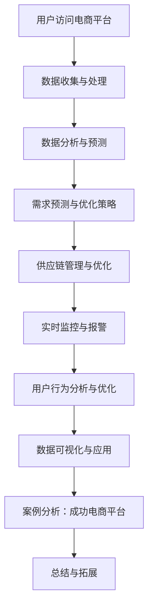

                 

### 第一部分：引言与基础

在当今数字化经济时代，电商平台作为电子商务的主要渠道，已经成为商家和消费者之间的重要桥梁。电商平台的供给能力，即平台能够及时满足消费者需求的能力，成为衡量其竞争力和用户满意度的关键因素。供给能力不仅关乎电商平台的经济效益，也直接影响到消费者的购物体验和忠诚度。

#### **1.1 电商平台的供需关系**

电商平台的供需关系是指平台上的商品供应与消费者需求之间的动态平衡。在这个过程中，商品供应和需求信息流动频繁，双方互动不断。电商平台通过数据收集和分析，能够实时掌握消费者的需求变化，从而调整商品供应策略，优化库存管理。同时，商家也通过电商平台的数据分析，了解市场趋势和消费者偏好，进而调整商品生产和供应计划。

#### **1.2 提升供给能力的意义**

提升供给能力对于电商平台具有重要意义。首先，它能够显著提高电商平台的运营效率，降低库存成本，减少资源浪费。其次，通过精准的需求预测和供应优化，电商平台能够提供更加个性化的购物体验，提高消费者满意度和忠诚度。此外，有效的供给能力提升还能够增强电商平台在市场竞争中的优势，吸引更多商家入驻和消费者访问。

#### **1.3 数据分析在电商供给中的应用**

数据分析在电商平台供给能力提升中扮演着至关重要的角色。通过大数据技术和人工智能算法，电商平台能够从海量数据中提取有价值的信息，包括消费者行为、市场趋势、库存状况等。这些信息为电商平台提供了数据驱动决策的基础，帮助其实现更精准的需求预测、库存管理和供应链优化。

#### **1.4 实时监控的重要性**

实时监控是提升电商平台供给能力的另一个关键因素。通过实时监控，电商平台能够快速响应市场变化，及时发现并解决供应问题。实时监控不仅有助于优化库存和物流管理，还能提高运营效率和用户满意度。例如，当库存水平低于预警阈值时，系统可以自动触发补货流程；当销售量异常增加时，系统可以迅速调整供应链策略，确保商品供应的连续性和稳定性。

#### **小结**

本部分主要介绍了电商平台供给能力提升的背景和意义，以及数据分析和实时监控在其中的重要作用。在接下来的章节中，我们将深入探讨电商平台供给能力提升的数据分析技术和实时监控策略，帮助读者理解如何通过数据驱动的方式提升电商平台的供给能力。

### **第2章：电商平台供给数据分析基础**

在电商平台的运营中，数据是驱动供给能力提升的核心资源。通过对数据的收集、处理和分析，电商平台能够更准确地把握市场动态，优化库存管理，提高供应链效率。本章将详细介绍数据分析在电商平台供给中的应用，包括基本概念、数据源收集与处理方法，以及常用的数据分析工具和技术。

#### **2.1 数据分析基本概念**

数据分析是指使用统计、建模和机器学习等方法，从大量数据中提取有价值的信息和知识，帮助决策者做出更加明智的决策。在电商平台中，数据分析通常涉及以下几个方面：

1. **描述性分析**：通过统计方法对数据进行汇总和描述，了解数据的基本特征和趋势。例如，计算销售额、订单数量、用户访问量等指标。
   
2. **诊断性分析**：通过分析数据，识别问题或异常，并探索其可能的原因。例如，分析订单延误、库存短缺的原因。

3. **预测性分析**：利用历史数据和统计模型，预测未来的趋势和需求。例如，预测未来的销售额、库存需求等。

4. **规范性分析**：基于数据和模型，提出优化建议，以改进业务流程和决策。例如，优化库存管理策略、优化供应链布局。

#### **2.2 数据源收集与处理**

电商平台的数据源主要包括内部数据和外部数据。内部数据包括用户行为数据、订单数据、库存数据、物流数据等；外部数据包括市场趋势数据、竞争对手数据、宏观经济数据等。

**内部数据的收集与处理**

1. **用户行为数据**：用户行为数据包括浏览历史、购物车数据、购买记录、评价反馈等。这些数据可以通过电商平台的后台系统、cookies、日志文件等方式收集。

2. **订单数据**：订单数据包括订单号、订单时间、订单金额、商品名称、购买用户等信息。这些数据通常存储在电商平台的数据仓库中。

3. **库存数据**：库存数据包括商品库存量、库存状态、库存周转率等。这些数据可以通过电商平台的后台系统或ERP系统获取。

4. **物流数据**：物流数据包括发货时间、配送时间、配送状态等。这些数据可以通过电商平台与物流公司之间的接口获取。

**外部数据的收集与处理**

1. **市场趋势数据**：市场趋势数据包括行业报告、市场调查、消费者偏好等。这些数据可以通过行业研究机构、市场调查公司等渠道获取。

2. **竞争对手数据**：竞争对手数据包括竞争对手的销售额、市场份额、营销策略等。这些数据可以通过市场研究、网络监测等手段获取。

3. **宏观经济数据**：宏观经济数据包括GDP、通货膨胀率、消费者信心指数等。这些数据可以通过国家统计局、财经媒体等渠道获取。

**数据处理方法**

1. **数据清洗**：数据清洗是数据处理的第一步，目的是去除重复数据、纠正错误数据、填补缺失数据等，确保数据的质量和一致性。

2. **数据集成**：数据集成是将不同来源、格式和结构的数据合并到统一的数据仓库中，以便进行统一的分析和管理。

3. **数据存储**：数据存储是将处理后的数据存储到数据库或数据仓库中，以便后续的查询和分析。

4. **数据转换**：数据转换是将数据转换为适合分析处理的格式，如将文本数据转换为结构化数据，将图像数据转换为特征向量等。

#### **2.3 数据分析工具与技术**

电商平台常用的数据分析工具和技术包括以下几种：

1. **Pandas**：Pandas 是 Python 的一个数据分析库，提供数据结构 DataFrames，用于数据清洗、操作和分析。

2. **NumPy**：NumPy 是 Python 的一个科学计算库，提供多维数组对象和矩阵运算功能，是数据分析的基础。

3. **SciPy**：SciPy 是 Python 的一个科学计算库，基于 NumPy，提供更多的科学计算功能，如线性代数、优化、信号处理等。

4. **Python 的 scikit-learn**：scikit-learn 是 Python 的一个机器学习库，提供多种机器学习算法，包括分类、回归、聚类等。

5. **R**：R 是一种专门用于统计分析和图形绘制的语言和软件环境，提供丰富的统计分析功能和包。

6. **Tableau**：Tableau 是一种数据可视化工具，可以直观地展示数据，帮助用户理解和分析数据。

7. **Hadoop 和 Spark**：Hadoop 和 Spark 是大数据处理框架，用于处理海量数据，提供高效的数据存储和处理能力。

8. **数据库技术**：如 MySQL、PostgreSQL、MongoDB 等，用于存储和管理数据。

#### **小结**

本章介绍了电商平台供给数据分析的基础，包括数据分析的基本概念、数据源收集与处理方法，以及常用的数据分析工具和技术。通过这些技术，电商平台能够更准确地把握市场动态，优化库存管理，提高供应链效率。在接下来的章节中，我们将进一步探讨具体的数据分析技术和方法，以及如何将这些技术应用于电商平台的供给能力提升。

### **第3章：电商平台商品需求预测**

在电商平台的运营中，准确预测商品需求是优化库存管理和供应链策略的关键。通过需求预测，电商平台可以提前准备库存，减少缺货和过量库存的风险，提高运营效率。本章将深入探讨电商平台商品需求预测的重要性、时间序列分析和机器学习预测模型。

#### **3.1 需求预测的重要性**

商品需求预测在电商平台的运营中具有极其重要的作用：

1. **库存管理**：通过需求预测，电商平台可以提前了解未来一段时间内商品的需求量，合理安排库存，避免因缺货导致的销售损失和因过量库存而产生的资金占用。

2. **供应链优化**：需求预测有助于电商平台优化供应链策略，与供应商合作制定生产计划，降低供应链成本，提高供应链响应速度。

3. **销售策略调整**：通过分析需求预测结果，电商平台可以调整促销活动、定价策略等，以更好地满足市场需求，提高销售额。

4. **用户满意度**：准确的商品需求预测有助于电商平台提供更加个性化的购物体验，减少购物等待时间，提高用户满意度。

#### **3.2 时间序列分析**

时间序列分析是一种常用的需求预测方法，适用于处理按时间顺序排列的数据序列。通过时间序列分析，可以从历史数据中提取趋势、季节性和周期性等特征，用于预测未来的需求。

**时间序列分析的基本步骤**：

1. **数据收集**：收集历史商品销售数据，包括销售额、销售量等。

2. **数据预处理**：对时间序列数据进行处理，包括数据清洗、缺失值填补、季节性调整等。

3. **特征提取**：提取时间序列数据的特征，包括趋势特征（如移动平均、指数平滑）、季节性特征（如季节指数、季节性波动）和周期性特征（如周期长度、周期波动）。

4. **模型选择**：选择合适的时间序列模型，如移动平均模型、指数平滑模型、ARIMA模型等。

5. **模型训练与验证**：使用历史数据进行模型训练，并通过交叉验证等方法评估模型性能。

6. **预测**：使用训练好的模型对未来需求进行预测。

**移动平均模型（MA）**：

移动平均模型是一种简单的时间序列预测方法，通过计算最近一段时间内的平均值来预测未来值。基本公式如下：

$$
\hat{y_t} = \frac{1}{n}\sum_{i=1}^{n}y_{t-i}
$$

其中，$y_t$ 表示第 $t$ 个月的需求量，$n$ 表示移动平均周期。

**指数平滑模型（ES）**：

指数平滑模型是对移动平均模型的一种改进，通过引入指数衰减因子，使最近的数据对预测结果有更大的影响。基本公式如下：

$$
\hat{y_t} = \alpha y_{t-1} + (1 - \alpha)\hat{y_{t-1}}
$$

其中，$\alpha$ 表示平滑系数，取值范围在 $0$ 到 $1$ 之间。

#### **3.3 机器学习预测模型**

机器学习预测模型通过学习历史数据中的模式，建立预测模型，能够处理更复杂的非线性关系。常见的机器学习预测模型包括线性回归、决策树、随机森林、支持向量机等。

**线性回归模型**：

线性回归模型是一种简单的机器学习预测模型，通过拟合一条直线来预测目标变量。基本公式如下：

$$
y = \beta_0 + \beta_1x
$$

其中，$y$ 表示预测值，$x$ 表示自变量，$\beta_0$ 和 $\beta_1$ 分别为模型的参数。

**决策树模型**：

决策树模型通过一系列的决策规则，将数据集划分成多个子集，每个子集对应一个预测值。决策树模型可以处理非线性和多变量关系，但其预测结果可能存在过拟合问题。

**随机森林模型**：

随机森林模型是一种集成学习方法，通过构建多个决策树模型，并取其平均预测结果来提高预测准确性。随机森林模型可以有效减少过拟合，提高预测稳定性。

**支持向量机模型**：

支持向量机模型通过找到一个最优的超平面，将数据集划分为不同的类别。支持向量机模型适用于分类和回归问题，可以处理高维数据和非线性关系。

#### **小结**

本章介绍了电商平台商品需求预测的重要性，并详细探讨了时间序列分析和机器学习预测模型。通过这些方法，电商平台可以更准确地预测商品需求，优化库存管理和供应链策略，提高运营效率和用户满意度。在接下来的章节中，我们将继续深入探讨商品优化策略、用户行为分析等主题，帮助读者全面了解电商平台供给能力提升的方法和策略。

### **第4章：商品优化策略与供应链管理**

在电商平台的运营中，商品优化策略和供应链管理是提升供给能力的重要手段。通过优化商品策略，电商平台可以更好地满足消费者需求，提高销售额和用户满意度；通过有效的供应链管理，电商平台可以降低成本，提高运营效率。本章将详细探讨商品优化策略的基本原理、供应链管理的基本原理，以及实时监控与数据分析在其中的结合。

#### **4.1 商品优化策略**

商品优化策略是指通过分析市场和消费者数据，制定合理的商品组合和销售策略，以最大化销售额和利润。商品优化策略的基本原理包括以下几个方面：

1. **市场分析**：通过对市场趋势、消费者偏好、竞争对手分析等，了解市场动态，为商品优化提供数据支持。

2. **库存管理**：通过需求预测和库存控制，合理调整库存水平，避免缺货和过量库存，降低库存成本。

3. **定价策略**：根据市场需求、竞争态势和成本结构，制定合理的定价策略，提高商品竞争力。

4. **促销策略**：通过促销活动、优惠券、会员制度等，刺激消费者购买，提高销售额。

5. **商品组合**：根据消费者行为数据和市场需求，制定合理的商品组合策略，提高消费者购物体验。

**库存管理优化策略**

库存管理是商品优化策略中的重要一环，通过优化库存管理，电商平台可以降低库存成本，提高资金利用率。以下是几种常见的库存管理优化策略：

1. **需求预测**：通过需求预测模型，预测未来一段时间内商品的需求量，为库存调整提供依据。

2. **ABC分类法**：根据商品的销售额和库存周转率，将商品分为A、B、C三类，针对不同类别的商品采取不同的库存管理策略。

3. **安全库存管理**：设定安全库存水平，以应对突发需求或供应中断，确保商品供应的连续性。

4. **库存周转率优化**：通过优化库存周转率，提高库存利用效率，降低库存成本。

**定价策略优化**

定价策略对电商平台的销售额和利润有直接影响。以下是一些常见的定价策略优化方法：

1. **价格弹性分析**：通过分析市场需求和价格弹性，确定合理的定价水平。

2. **动态定价**：根据市场需求、库存水平、竞争对手价格等因素，动态调整商品价格。

3. **捆绑销售**：将多个商品捆绑在一起销售，提高单件商品的平均售价。

4. **促销定价**：通过打折、优惠券、会员专享价等方式，刺激消费者购买。

**商品组合优化**

商品组合优化是通过分析消费者行为和市场数据，制定合理的商品组合策略，提高消费者购物体验。以下是一些商品组合优化方法：

1. **关联销售**：根据消费者购买历史和行为，推荐相关的商品，提高购物篮价值。

2. **套餐销售**：将多个商品组合成套餐销售，提高消费者购买意愿。

3. **季节性商品组合**：根据季节性需求，制定季节性商品组合策略，提高销售额。

**小结**

商品优化策略是电商平台运营中的重要一环，通过市场分析、需求预测、库存管理、定价策略和商品组合优化，电商平台可以更好地满足消费者需求，提高销售额和利润。在接下来的章节中，我们将进一步探讨实时监控与数据分析在供应链管理中的应用，帮助电商平台实现更高效、更智能的运营。

#### **4.2 供应链管理基本原理**

供应链管理（Supply Chain Management，简称SCM）是指对供应链活动进行计划、实施、控制与优化，以实现供应链整体绩效最优的过程。在电商平台的运营中，供应链管理是确保商品供给能力的关键。以下是供应链管理的基本原理：

**供应链结构**

供应链通常包括以下几个主要环节：

1. **供应商**：提供原材料、零部件等商品或服务的实体。
2. **制造商**：将原材料加工成成品的生产实体。
3. **仓库**：存储和管理商品的设施。
4. **配送中心**：负责商品的分拣、包装和配送。
5. **零售商**：直接向消费者销售商品的实体，如电商平台。

**供应链管理目标**

供应链管理的目标主要包括以下几个方面：

1. **成本最小化**：通过优化供应链流程和资源利用，降低成本。
2. **库存最小化**：通过精准的需求预测和库存管理，减少库存水平，降低资金占用。
3. **服务水平最大化**：确保商品供应的连续性和及时性，满足消费者需求。
4. **响应速度最大化**：提高供应链对市场变化的响应速度，增强竞争力。

**供应链管理流程**

供应链管理的基本流程包括以下几方面：

1. **需求计划**：根据市场预测和销售数据，制定商品需求计划。
2. **采购**：与供应商协商，采购所需的原材料或商品。
3. **生产**：根据需求计划，组织生产，制造商品。
4. **仓储**：将生产好的商品存储在仓库中，确保库存水平合理。
5. **配送**：根据销售订单，将商品配送至消费者手中。
6. **回收**：处理退货和废弃商品，回收有价值的资源。

**供应链管理工具与技术**

供应链管理中，常用的工具和技术包括：

1. **需求预测**：利用数据分析、统计模型和机器学习技术，预测未来的商品需求。
2. **供应链可视化**：通过可视化工具，展示供应链各环节的状态和流程，提高透明度。
3. **供应链协同**：通过信息共享和协作，提高供应链各环节的协同效率。
4. **库存优化**：利用库存管理策略，如ABC分类法、安全库存管理等，优化库存水平。
5. **物流优化**：通过物流优化技术，如路径优化、运输调度等，提高配送效率。

**供应链管理的关键挑战**

供应链管理面临以下关键挑战：

1. **需求波动**：市场需求的不确定性导致供应链需求波动，影响库存和配送计划。
2. **供应链中断**：供应链中的某个环节出现问题，可能导致供应链中断，影响商品供应。
3. **成本控制**：在保证服务水平的前提下，如何降低供应链成本是供应链管理的核心挑战。
4. **信息共享**：供应链各环节之间的信息共享和协作是供应链管理的关键，但往往存在信息不对称和沟通不畅的问题。

**小结**

供应链管理是电商平台运营中至关重要的一环，通过有效的供应链管理，电商平台可以实现成本最小化、库存最小化、服务水平最大化，并提高响应速度。在接下来的章节中，我们将探讨如何将实时监控与数据分析应用于供应链管理，以提升电商平台的整体运营效率。

#### **4.3 实时监控与数据分析的结合**

实时监控与数据分析的结合是提升电商平台供给能力的重要手段。通过实时监控，电商平台可以快速获取运营状态的关键指标，而通过数据分析，可以对这些指标进行深入挖掘，从而实现更精准的运营决策。

**实时监控在供应链管理中的作用**

1. **库存监控**：实时监控库存水平，确保库存处于合理范围内，避免缺货或过量库存。例如，当库存低于预警阈值时，可以自动触发补货流程。

2. **物流监控**：实时跟踪商品的配送状态，确保商品能够及时送达消费者。通过物流监控，电商平台可以及时发现和解决配送过程中的问题。

3. **销售监控**：实时监控销售数据，了解市场需求变化，及时调整供应链策略。例如，当某款商品销量异常增加时，可以迅速增加库存。

**数据分析在实时监控中的应用**

1. **趋势分析**：通过对历史数据的分析，识别市场需求的变化趋势，为实时监控提供依据。例如，通过分析季节性需求趋势，可以提前准备库存。

2. **异常检测**：利用机器学习算法，对实时数据进行异常检测，及时发现潜在的运营问题。例如，通过异常检测，可以发现库存数据的异常波动，并采取相应的措施。

3. **预测分析**：通过实时数据和历史数据的结合，进行需求预测，为库存管理和供应链策略提供支持。例如，利用实时销售数据和季节性趋势，预测未来一段时间内的销售量。

**实时监控与数据分析的结合策略**

1. **数据集成**：将实时监控数据和分析数据集成到同一平台，实现数据的统一管理和分析。

2. **自动化流程**：通过自动化工具，将实时监控与数据分析的结果应用于运营决策，如自动补货、自动预警等。

3. **可视化工具**：利用可视化工具，将实时监控数据和分析结果以图表的形式展示，提高数据的可读性和易理解性。

**案例：电商平台库存监控与预测**

以下是一个电商平台库存监控与预测的案例：

1. **数据收集**：通过电商平台的后台系统，收集实时库存数据、历史销售数据等。

2. **数据处理**：对收集到的数据进行清洗和预处理，包括缺失值填补、异常值检测等。

3. **实时监控**：利用实时监控工具，如 Kafka，收集和传输库存数据。

4. **数据分析**：利用数据分析工具，如 Python 的 Pandas 库，对库存数据进行趋势分析和异常检测。

5. **预测模型**：利用机器学习算法，如线性回归、ARIMA 模型，建立需求预测模型。

6. **决策支持**：将实时监控和预测结果应用于库存管理决策，如自动补货、库存调整等。

**小结**

实时监控与数据分析的结合，为电商平台提供了强大的运营决策支持。通过实时监控，电商平台可以快速响应市场变化，而通过数据分析，可以深入挖掘数据中的价值，优化库存管理和供应链策略。在接下来的章节中，我们将继续探讨用户行为分析、实时数据处理与监控等主题，帮助电商平台进一步提升供给能力。

### **第5章：用户行为分析**

在电商平台的运营中，用户行为分析是了解消费者需求、优化营销策略和提升用户体验的关键。通过深入分析用户行为数据，电商平台可以更好地理解消费者的购物习惯、偏好和需求，从而制定更加精准的营销策略，提高用户满意度和忠诚度。本章将详细探讨用户行为数据的收集、用户行为数据分析的方法，以及用户画像的构建与应用。

#### **5.1 用户行为数据收集**

用户行为数据是指用户在电商平台上的各种操作行为，包括浏览历史、购物车数据、购买记录、评价反馈、搜索历史等。收集用户行为数据的方法主要包括以下几种：

1. **Web日志分析**：通过分析电商平台服务器日志，收集用户的访问行为数据，如访问时间、访问页面、停留时间等。

2. **前端脚本跟踪**：在电商平台的前端页面中嵌入 JavaScript 脚本，实时记录用户的操作行为，如点击、滚动、输入等。

3. **移动应用分析**：通过移动应用的后台数据收集，获取用户在移动端上的行为数据，如应用使用时间、功能使用情况等。

4. **问卷调查**：通过问卷调查收集用户的主观反馈，如购物满意度、产品评价等。

5. **社交媒体监测**：通过社交媒体平台的数据分析，了解用户在社交媒体上的行为，如分享、评论、点赞等。

#### **5.2 用户行为数据分析**

用户行为数据分析是指利用统计方法、数据挖掘技术和机器学习算法，对用户行为数据进行处理和分析，提取有价值的信息。以下是几种常见的用户行为数据分析方法：

1. **描述性分析**：通过统计方法对用户行为数据的基本特征进行描述，如用户活跃度、浏览时长、购买频率等。

2. **关联规则分析**：通过挖掘用户行为数据中的关联规则，发现用户行为之间的关联性。例如，购买A商品的用户往往也会购买B商品。

3. **聚类分析**：通过将用户行为数据划分为不同的群体，识别具有相似行为的用户群体。常见的聚类算法包括K-means、层次聚类等。

4. **分类与预测**：利用机器学习算法，对用户行为数据进行分类和预测，如预测用户是否会购买某商品、预测用户未来的购物行为等。

5. **用户行为轨迹分析**：通过分析用户在电商平台上的行为轨迹，了解用户在购物过程中的决策路径，优化购物流程和用户体验。

#### **5.3 用户画像构建与应用**

用户画像是指通过对用户行为数据的分析，构建一个包含用户基本信息、兴趣偏好、行为习惯等维度的用户轮廓。用户画像的构建与应用主要包括以下几个步骤：

1. **数据整合**：将来自不同渠道的用户行为数据进行整合，形成统一的数据视图。

2. **特征提取**：根据用户行为数据和业务需求，提取用户的关键特征，如年龄、性别、地理位置、购物频率、偏好商品等。

3. **数据清洗**：对用户行为数据进行清洗，包括去除重复数据、填补缺失值、异常值处理等。

4. **建模与评估**：利用机器学习算法，如决策树、随机森林等，构建用户画像模型，并对模型进行评估和优化。

5. **用户标签**：将用户画像模型应用于实际业务，为每个用户打上相应的标签，如“高频购物用户”、“偏好时尚商品”等。

6. **应用场景**：根据用户标签，制定个性化的营销策略和用户体验优化方案。例如，针对高频购物用户，可以提供会员优惠和专属活动；针对偏好时尚商品的用户，可以推荐相关商品和品牌。

**案例：用户画像在电商平台的营销策略中的应用**

以下是一个用户画像在电商平台营销策略中的应用案例：

1. **数据收集**：通过电商平台的前端脚本跟踪和Web日志分析，收集用户的浏览和购买行为数据。

2. **数据处理**：对收集到的数据清洗和整合，提取用户的关键特征，如年龄、性别、购物频率等。

3. **用户标签**：利用聚类分析算法，将用户划分为不同的群体，并为每个用户打上相应的标签。

4. **个性化推荐**：根据用户的标签和偏好，为用户推荐相关的商品和品牌。

5. **营销活动**：根据用户标签，设计个性化的营销活动，如为高频购物用户提供专属折扣，为偏好时尚商品的用户推荐新品。

**小结**

用户行为分析是电商平台提升供给能力的重要手段之一。通过收集、处理和分析用户行为数据，电商平台可以构建用户画像，制定个性化的营销策略，提升用户体验和满意度。在接下来的章节中，我们将探讨实时数据处理与监控技术，以及如何在电商平台中实现实时监控与数据分析的结合，进一步提升供给能力。

### **第6章：实时数据处理与监控**

在电商平台的运营中，实时数据处理与监控是确保供给能力高效运行的关键。实时数据处理技术能够迅速捕捉和处理海量数据，实时监控则能够及时发现和解决潜在问题，从而提高运营效率和用户满意度。本章将详细探讨实时数据处理技术、数据流处理框架和实时监控策略，帮助电商平台实现实时数据处理与高效监控。

#### **6.1 实时数据处理技术**

实时数据处理技术是指能够在短时间内对海量数据进行快速处理和分析的技术。这些技术主要包括以下几个方面：

1. **消息队列系统**：消息队列系统（如Kafka、RabbitMQ）是一种用于数据传输和异步处理的关键技术。它能够高效地接收、存储和转发数据，确保数据的可靠性和实时性。

2. **流处理引擎**：流处理引擎（如Apache Flink、Apache Storm）能够实时处理数据流，对数据进行实时分析、转换和存储。这些引擎支持高效的数据处理算法和复杂的业务逻辑。

3. **分布式存储**：分布式存储系统（如Hadoop HDFS、Apache Cassandra）能够存储海量数据，并提供高吞吐量和低延迟的数据访问。这些系统支持数据的实时处理和持久化。

4. **实时计算框架**：实时计算框架（如Apache Spark Streaming）能够将批处理和流处理相结合，提供灵活的数据处理能力。这些框架支持大规模数据集的实时计算和复杂的数据分析任务。

#### **6.2 数据流处理框架**

数据流处理框架是实时数据处理的核心，用于处理和传输实时数据流。以下是几种常见的数据流处理框架：

1. **Apache Kafka**：Kafka 是一种高吞吐量的分布式消息队列系统，适用于处理实时数据流。它支持数据持久化、多分区、多消费者和容错机制，能够高效地处理大规模数据流。

2. **Apache Flink**：Flink 是一种流处理引擎，支持有状态流处理、事件驱动处理和复杂窗口操作。它提供高效的实时数据处理能力和丰富的API，适用于复杂的数据处理任务。

3. **Apache Storm**：Storm 是一种分布式流处理框架，支持实时数据处理和复杂拓扑结构。它提供简单易用的API，能够高效地处理大规模数据流。

4. **Apache Spark Streaming**：Spark Streaming 是 Spark 的实时数据处理组件，支持流处理和批处理相结合。它提供高效的数据处理能力和丰富的操作API，适用于大规模实时数据处理任务。

**数据流处理框架的核心组件**：

1. **数据源**：数据源是数据流处理的起点，可以是文件、数据库、消息队列等。数据源提供数据输入，启动数据流处理任务。

2. **处理器**：处理器是数据流处理的核心，用于对数据流进行操作和处理。处理器可以是简单的数据转换，也可以是复杂的计算和聚合。

3. **存储**：存储是数据流处理的终点，用于存储处理结果。存储可以是文件系统、数据库、消息队列等，确保数据的持久化和可查询性。

4. **监控与报警**：监控与报警是数据流处理的重要环节，用于监控数据流处理的状态和性能，及时发现和处理问题。

#### **6.3 实时监控策略**

实时监控策略是指通过监控工具和技术，对电商平台的实时运行状态进行监控和报警。实时监控策略的核心目标是确保供给能力的高效运行，及时发现和解决问题。以下是几种常见的实时监控策略：

1. **指标监控**：定义关键性能指标（KPI），如数据吞吐量、处理延迟、错误率等，实时监控这些指标，确保其处于正常范围内。

2. **日志分析**：通过日志收集和分析工具（如ELK、Fluentd），实时监控电商平台的服务器日志和应用程序日志，发现潜在问题和异常。

3. **报警系统**：设置实时报警系统，当监控指标超出阈值或发现异常时，自动发送报警通知，确保及时响应和解决。

4. **自动化处理**：通过自动化脚本和工具，实现异常处理的自动化，如自动重启服务、自动调整资源等，提高响应速度和处理效率。

5. **可视化监控**：通过可视化工具（如Kibana、Grafana），将监控数据以图表和仪表板的形式展示，提高监控的可读性和易理解性。

**案例：电商平台实时数据处理与监控实践**

以下是一个电商平台实时数据处理与监控的实践案例：

1. **数据收集**：通过Kafka消息队列系统，实时收集电商平台的用户行为数据、销售数据和物流数据。

2. **数据处理**：利用Apache Flink流处理引擎，实时处理数据流，进行数据清洗、转换和分析。

3. **数据存储**：将处理结果存储到分布式存储系统（如Hadoop HDFS），确保数据的持久化和可查询性。

4. **实时监控**：通过ELK日志分析平台，实时监控电商平台的运行状态和性能指标，及时发现和处理问题。

5. **报警系统**：设置实时报警系统，当监控指标超出阈值或发现异常时，自动发送报警通知。

**小结**

实时数据处理与监控是电商平台提升供给能力的关键。通过实时数据处理技术、数据流处理框架和实时监控策略，电商平台能够高效地处理和监控海量数据，确保供给能力的高效运行。在接下来的章节中，我们将探讨实战案例与代码实现，进一步展示如何将实时数据处理与监控应用于电商平台的供给能力提升。

### **第7章：电商平台数据监控实践**

在电商平台的运营中，数据监控是确保供给能力稳定和高效运行的重要手段。通过有效的数据监控，电商平台可以实时了解系统的运行状态，及时发现和处理问题，从而提高用户满意度和运营效率。本章将详细介绍电商平台数据监控的实践，包括数据监控体系搭建、具体数据监控案例，如库存监控和销售预测监控，以及监控指标设置与报警策略。

#### **7.1 数据监控体系搭建**

搭建一个高效的数据监控体系是电商平台数据监控实践的第一步。以下是搭建数据监控体系的几个关键步骤：

1. **确定监控目标**：明确需要监控的数据指标和业务目标，如用户活跃度、销售量、库存水平、系统稳定性等。

2. **监控指标定义**：根据业务需求，定义关键性能指标（KPI），如请求响应时间、数据吞吐量、错误率、系统负载等。

3. **数据收集与存储**：选择合适的数据收集工具和存储方案，如Kafka、Elasticsearch、InfluxDB等，确保数据的实时性和可靠性。

4. **监控工具选择**：选择适合的数据监控工具，如Prometheus、Grafana、Kibana等，用于数据可视化、报警和数据分析。

5. **监控策略制定**：根据业务需求，制定监控策略，包括监控周期、监控阈值、报警方式等。

6. **自动化处理**：通过自动化脚本和工具，实现监控数据的自动收集、分析和处理，提高监控效率。

#### **7.2 数据监控案例：库存监控**

库存监控是电商平台数据监控的重要组成部分，通过实时监控库存水平，可以确保商品供应的连续性和稳定性。以下是库存监控的具体步骤：

1. **数据收集**：通过电商平台的后台系统，实时收集库存数据，包括库存量、库存状态、库存周转率等。

2. **数据处理**：对收集到的库存数据进行预处理，包括数据清洗、格式转换和聚合处理。

3. **监控指标**：定义关键监控指标，如库存量、库存周转率、库存预警阈值等。

4. **监控策略**：设置监控周期，如每天一次，监控阈值，如库存量低于预警阈值，触发报警。

5. **报警设置**：当库存量低于预警阈值时，自动发送报警通知，通知相关负责人进行库存补货。

6. **可视化展示**：通过数据可视化工具，实时展示库存监控数据，包括库存量趋势、库存预警等。

**案例：库存监控实践**

以下是一个库存监控的实践案例：

1. **数据收集**：使用Kafka实时收集电商平台的后台库存数据。

2. **数据处理**：使用Flink进行实时数据处理，计算库存量和库存周转率。

3. **监控指标**：设置库存量为关键监控指标，预警阈值为库存量的10%。

4. **报警设置**：当库存量低于预警阈值时，通过邮件和短信通知相关负责人。

5. **可视化展示**：使用Grafana实时展示库存监控数据。

#### **7.3 数据监控案例：销售预测监控**

销售预测监控是电商平台优化库存管理和供应链策略的重要手段。通过实时监控销售预测结果，可以及时调整库存和供应链策略，提高运营效率。以下是销售预测监控的具体步骤：

1. **数据收集**：通过电商平台的后台系统，实时收集销售数据，包括销售额、销售量、用户访问量等。

2. **数据处理**：使用机器学习算法，如ARIMA、线性回归等，进行销售预测。

3. **监控指标**：定义关键监控指标，如预测准确率、预测偏差等。

4. **监控策略**：设置监控周期，如每天一次，监控阈值，如预测偏差大于5%。

5. **报警设置**：当预测偏差超过阈值时，自动发送报警通知，通知相关负责人进行调整。

6. **可视化展示**：通过数据可视化工具，实时展示销售预测监控数据。

**案例：销售预测监控实践**

以下是一个销售预测监控的实践案例：

1. **数据收集**：使用Kafka实时收集电商平台的后台销售数据。

2. **数据处理**：使用Python的scikit-learn库进行销售预测。

3. **监控指标**：设置预测准确率为关键监控指标，预警阈值为预测偏差大于5%。

4. **报警设置**：当预测偏差超过阈值时，通过邮件和短信通知相关负责人。

5. **可视化展示**：使用Grafana实时展示销售预测监控数据。

**小结**

电商平台的数据监控实践包括数据监控体系搭建、库存监控和销售预测监控等多个方面。通过有效的数据监控，电商平台可以实时了解系统的运行状态，及时发现和处理问题，从而提高用户满意度和运营效率。在接下来的章节中，我们将探讨实时监控平台的实现，进一步展示如何将数据监控实践应用于电商平台的供给能力提升。

### **第8章：实时监控平台实现**

实时监控平台是电商平台确保供给能力高效运行的核心工具。通过实时监控平台，电商平台可以实时收集、处理和分析海量数据，及时发现和处理潜在问题，从而提高运营效率和用户体验。本章将详细介绍实时监控平台的架构设计、数据采集与处理流程、监控指标设置与报警机制。

#### **8.1 监控平台架构设计**

实时监控平台的架构设计是确保其稳定性和高效性的关键。以下是实时监控平台的常见架构设计：

1. **数据采集层**：负责从不同的数据源（如数据库、消息队列、日志系统等）收集数据。

2. **数据处理层**：负责对收集到的数据进行预处理、转换和存储，如数据清洗、格式转换、聚合处理等。

3. **数据存储层**：负责存储处理后的数据，如时序数据库、关系数据库、NoSQL数据库等。

4. **数据处理与分析层**：负责对存储层的数据进行实时处理和分析，如指标计算、预测分析、异常检测等。

5. **监控与报警层**：负责监控平台的运行状态，设置监控阈值，当监控指标超出阈值时，触发报警机制。

6. **用户界面层**：提供用户交互界面，展示监控数据和报警信息，如仪表板、图表、报表等。

**示例架构**

```
+----------------+      +----------------+      +----------------+
|  数据采集层    | --> |  数据处理层    | --> |  数据存储层    |
+----------------+      +----------------+      +----------------+
                             |                 |
                             |  数据处理与分析 |  -->  用户界面层
                             |  层             |
+----------------+      +----------------+
|  监控与报警层   |
+----------------+
```

#### **8.2 数据采集与处理流程**

实时监控平台的数据采集与处理流程是确保数据准确性和实时性的关键。以下是数据采集与处理流程的详细步骤：

1. **数据采集**：通过各种数据采集工具（如Fluentd、Logstash等）从不同的数据源收集数据，如日志文件、数据库记录、API调用等。

2. **数据预处理**：对采集到的数据进行预处理，包括数据清洗（如去除重复数据、填补缺失值）、格式转换（如时间戳格式化、数据类型转换）和聚合处理（如数据分组、汇总）。

3. **数据存储**：将预处理后的数据存储到数据存储层，如时序数据库（如InfluxDB、Prometheus）或关系数据库（如MySQL、PostgreSQL）。

4. **数据处理与分析**：使用流处理引擎（如Apache Kafka、Apache Flink）对存储层的数据进行实时处理和分析，如计算监控指标、预测分析、异常检测等。

5. **监控与报警**：根据设定的监控阈值，当监控指标超出阈值时，触发报警机制，如发送邮件、短信或调用API。

**数据采集与处理流程示例**

```
1. 数据采集
2. 数据预处理
   - 数据清洗
   - 格式转换
   - 聚合处理
3. 数据存储
4. 数据处理与分析
   - 监控指标计算
   - 预测分析
   - 异常检测
5. 监控与报警
   - 设置阈值
   - 触发报警
```

#### **8.3 监控指标设置与报警**

监控指标设置与报警是实时监控平台的核心功能，确保系统运行状态的可视化和及时响应。以下是监控指标设置与报警的详细步骤：

1. **监控指标定义**：根据业务需求和系统特点，定义关键监控指标，如CPU使用率、内存使用率、数据吞吐量、请求响应时间等。

2. **监控阈值设置**：根据监控指标的定义，设置监控阈值，如CPU使用率超过80%时触发报警、数据吞吐量低于预期值时触发报警等。

3. **报警机制**：根据监控阈值，设置报警机制，如发送邮件、短信、拨打电话、调用API等。

4. **报警通知**：当监控指标超出阈值时，实时发送报警通知，通知相关人员或系统自动处理。

5. **可视化展示**：通过用户界面层，实时展示监控数据和报警信息，帮助用户快速识别和解决问题。

**监控指标设置与报警示例**

```
1. 监控指标定义
   - CPU使用率
   - 内存使用率
   - 数据吞吐量
   - 请求响应时间
2. 监控阈值设置
   - CPU使用率 > 80%：触发报警
   - 数据吞吐量 < 1000条/分钟：触发报警
   - 请求响应时间 > 5秒：触发报警
3. 报警机制
   - 发送邮件
   - 发送短信
   - 调用API
4. 报警通知
   - CPU使用率超过阈值：发送报警通知
   - 数据吞吐量低于阈值：发送报警通知
   - 请求响应时间超过阈值：发送报警通知
5. 可视化展示
   - 展示监控数据和报警信息
```

#### **8.4 实时监控平台实现案例**

以下是一个实时监控平台的实现案例，包括架构设计、数据采集与处理流程、监控指标设置与报警机制。

**架构设计**

- 数据采集：使用Fluentd从不同数据源（如Kafka、数据库、日志文件）收集数据。
- 数据处理：使用Apache Flink进行实时数据处理，计算监控指标。
- 数据存储：使用InfluxDB存储监控数据。
- 监控与报警：使用Prometheus进行监控指标收集和报警设置。
- 用户界面：使用Grafana展示监控数据和报警信息。

**数据采集与处理流程**

- 数据采集：通过Fluentd收集Kafka中的日志数据，处理数据并存储到InfluxDB。
- 数据处理：使用Flink对InfluxDB中的数据进行实时处理，计算CPU使用率、内存使用率、数据吞吐量等监控指标。
- 数据存储：将处理后的监控数据存储到InfluxDB。
- 监控与报警：使用Prometheus收集InfluxDB中的监控数据，设置监控阈值并触发报警。

**监控指标设置与报警机制**

- 监控指标：设置CPU使用率、内存使用率、数据吞吐量、请求响应时间等监控指标。
- 监控阈值：设置CPU使用率超过80%触发报警、数据吞吐量低于1000条/分钟触发报警、请求响应时间超过5秒触发报警。
- 报警机制：使用Prometheus设置报警规则，当监控指标超出阈值时，发送报警通知。
- 报警通知：通过邮件、短信、钉钉等方式发送报警通知。

**小结**

实时监控平台是实现电商平台供给能力高效运行的重要工具。通过合理的架构设计、完善的数据采集与处理流程、科学的监控指标设置与报警机制，电商平台可以实现实时监控与问题预警，提高运营效率和用户满意度。在接下来的章节中，我们将探讨数据可视化与应用，进一步展示实时监控平台在电商平台中的应用价值。

### **第9章：数据可视化与应用**

数据可视化是将复杂的数据以图形和图表的形式直观展示，使数据更容易理解和分析的技术。在电商平台中，数据可视化不仅能够帮助管理层迅速把握运营状况，还能够通过定制化的仪表板为用户提供个性化的数据呈现，从而提升用户体验。本章将介绍数据可视化工具的介绍、数据可视化实践，以及数据可视化在电商供给中的应用。

#### **9.1 数据可视化工具介绍**

在电商平台中，常用的数据可视化工具包括以下几种：

1. **Tableau**：Tableau 是一种功能强大的数据可视化工具，支持多种数据源连接和丰富的可视化类型，如柱状图、折线图、散点图、地图等。

2. **Power BI**：Power BI 是微软推出的商业智能工具，提供直观的数据分析和可视化功能，支持与 Microsoft Azure 等云服务的集成。

3. **QlikView**：QlikView 是一款高性能的数据可视化工具，支持实时数据分析，提供交互式的仪表板和可视化的数据探索。

4. **Google Charts**：Google Charts 是 Google 提供的在线数据可视化工具，支持多种图表类型和自定义样式，易于集成到 Web 应用程序中。

5. **D3.js**：D3.js 是一种基于 JavaScript 的数据可视化库，支持高度自定义的图表和复杂的数据交互，适用于需要高级数据可视化的场景。

6. **ECharts**：ECharts 是一款开源的 JavaScript 数据可视化库，提供丰富的图表类型和交互功能，易于集成和扩展。

#### **9.2 数据可视化实践**

数据可视化实践包括数据准备、可视化设计、仪表板创建等步骤。以下是一个数据可视化实践案例：

**案例：电商平台销售数据可视化**

1. **数据准备**：从电商平台的后台系统获取销售数据，包括销售额、订单量、用户访问量等。对数据清洗和预处理，确保数据质量和一致性。

2. **可视化设计**：根据业务需求和展示目标，选择合适的图表类型和布局。例如，使用柱状图展示销售额趋势，使用折线图展示订单量变化，使用饼图展示用户访问来源等。

3. **仪表板创建**：使用数据可视化工具，如 Tableau 或 Power BI，创建数据仪表板。将不同的图表和指标整合到一个界面中，实现数据的多维度展示。

4. **交互设计**：为仪表板添加交互功能，如数据筛选、切换视图等，提高用户交互体验。

**数据可视化实践步骤示例**

```
1. 数据准备
   - 获取销售数据
   - 数据清洗与预处理

2. 可视化设计
   - 选择图表类型（柱状图、折线图、饼图等）
   - 设计仪表板布局

3. 仪表板创建
   - 使用 Tableau 或 Power BI 创建仪表板
   - 添加图表和指标

4. 交互设计
   - 添加数据筛选功能
   - 实现视图切换
```

#### **9.3 数据可视化在电商供给中的应用**

数据可视化在电商供给中的应用非常广泛，可以帮助电商平台更好地理解和利用数据，优化运营策略，提高用户满意度。以下是几个应用实例：

1. **销售数据分析**：通过柱状图、折线图等，展示销售额、订单量的趋势，帮助电商平台了解市场需求变化，及时调整库存和供应链策略。

2. **用户行为分析**：通过用户访问量、页面浏览量等指标，分析用户行为，识别热门商品和用户偏好，优化商品推荐和营销策略。

3. **库存监控**：通过实时更新的仪表板，监控库存水平和库存周转率，及时发现库存不足或过剩的情况，确保商品供应的连续性和稳定性。

4. **供应链分析**：通过地图和地理信息系统（GIS），展示物流网络和配送路径，优化配送效率，降低物流成本。

5. **运营效率分析**：通过关键绩效指标（KPI）的图表展示，监控电商平台整体运营效率，识别瓶颈和优化点。

**案例：电商平台库存监控仪表板**

以下是一个电商平台库存监控仪表板的案例：

- **图表类型**：柱状图、折线图、饼图等。
- **展示内容**：
  - 库存总量趋势图：展示库存总量随时间的变化。
  - 库存分布图：展示不同类别商品的库存占比。
  - 库存预警列表：列出库存低于预警阈值的商品和仓库。

**小结**

数据可视化是电商平台提升供给能力的重要手段之一。通过数据可视化工具，电商平台可以直观地展示和分析数据，帮助管理层和用户更好地理解运营状况，制定更科学的决策。在接下来的章节中，我们将通过案例分析，进一步探讨成功电商平台的数据可视化应用，以及如何利用数据可视化提升供给能力。

### **第10章：案例分析：成功电商平台的供给能力提升**

通过分析一些成功的电商平台案例，我们可以深入了解如何通过数据分析和实时监控提升供给能力。本章节将探讨一个具体案例，从数据分析过程与策略、实时监控与优化策略两方面进行详细阐述。

#### **10.1 案例介绍**

我们以知名电商平台阿里巴巴为例，分析其如何通过数据分析和实时监控提升供给能力。阿里巴巴不仅拥有庞大的电商平台，还通过其旗下的菜鸟网络实现了高度自动化的物流体系。在这个案例中，我们将重点关注阿里巴巴在供应链管理、库存监控和需求预测方面的实践。

#### **10.2 数据分析过程与策略**

**1. 数据收集与整合**

阿里巴巴通过其电商平台和物流体系，收集大量的数据，包括用户行为数据、销售数据、库存数据、物流数据等。这些数据存储在数据仓库中，经过清洗和整合，形成统一的数据视图。

**2. 数据分析工具与技术**

阿里巴巴使用了一系列数据分析工具和技术，包括数据挖掘、机器学习、大数据处理框架（如Hadoop和Spark）。通过这些工具，阿里巴巴能够从海量数据中提取有价值的信息，如用户偏好、市场需求、库存状况等。

**3. 数据分析策略**

- **用户行为分析**：通过分析用户浏览、搜索、购买行为，了解用户偏好和市场趋势。例如，通过分析用户搜索关键词和购买记录，识别热门商品和潜在需求。

- **销售预测**：利用时间序列分析和机器学习算法，预测未来的销售额和需求量。通过历史销售数据和季节性因素，阿里巴巴能够提前预测市场需求，优化库存管理。

- **供应链优化**：通过分析供应链数据，优化供应链流程和资源配置。例如，通过分析物流数据，优化配送路径，减少物流成本。

#### **10.3 实时监控与优化策略**

**1. 实时监控体系**

阿里巴巴建立了全面的实时监控体系，包括库存监控、物流监控、销售监控等。通过实时监控，阿里巴巴能够快速响应市场变化，确保供给能力的稳定。

**2. 实时监控策略**

- **库存监控**：实时监控库存水平，确保库存处于合理范围内。当库存低于预警阈值时，自动触发补货流程，确保商品供应的连续性。

- **物流监控**：通过实时监控物流状态，跟踪商品的配送进度，确保商品及时送达消费者。当物流环节出现问题时，系统能够自动报警，并采取相应的措施。

- **销售监控**：实时监控销售数据，了解市场需求变化。当销售数据出现异常时，系统会自动分析原因，并提出优化建议。

**3. 优化策略**

- **库存优化**：通过需求预测和实时监控，阿里巴巴能够更精准地调整库存水平，避免过量库存或缺货情况。

- **供应链优化**：通过实时监控和数据分析，优化供应链流程，降低物流成本，提高供应链效率。

- **用户满意度提升**：通过实时监控用户行为和需求，提供个性化的购物体验，提高用户满意度和忠诚度。

**案例：阿里巴巴库存监控与优化**

以下是一个阿里巴巴库存监控与优化的具体案例：

1. **数据收集**：从电商平台和物流系统实时收集库存数据、销售数据和物流数据。

2. **数据分析**：通过机器学习算法预测未来的库存需求和销售量，分析库存水平和库存周转率。

3. **实时监控**：通过实时监控体系，监控库存水平和库存预警阈值，当库存低于预警阈值时，自动触发补货流程。

4. **优化措施**：根据实时监控和数据分析结果，调整库存水平，优化库存管理策略，确保库存处于合理范围内。

5. **效果评估**：通过监控库存水平的变化和销售数据的增长，评估库存监控与优化措施的效果，持续改进库存管理策略。

**小结**

阿里巴巴通过数据分析和实时监控，成功提升了供给能力。通过数据驱动的方式，阿里巴巴能够更准确地预测市场需求、优化库存管理和供应链流程，从而提高运营效率和用户满意度。这个案例为我们展示了如何利用数据分析和实时监控，实现电商平台的供给能力提升。

### **附录：拓展阅读与工具资源**

在电商平台供给能力提升的过程中，除了本文介绍的核心概念和技术，还有很多值得深入学习和探索的内容。以下是一些拓展阅读推荐和工具资源，帮助读者进一步了解数据分析与实时监控的相关知识。

#### **附录A：数据分析与实时监控工具对比**

**数据分析工具对比**

- **Pandas**：强大的数据处理库，适用于数据清洗、操作和分析。
- **NumPy**：高效的数值计算库，用于数组操作。
- **SciPy**：科学计算库，适用于数学、科学和工程领域的计算。
- **R**：专门用于统计分析和图形绘制的语言和软件环境。
- **Tableau**：功能强大的数据可视化工具，提供直观的数据分析和展示。

**实时监控工具对比**

- **Kafka**：高吞吐量的消息队列系统，用于实时数据流处理。
- **Fluentd**：日志收集与处理工具，适用于实时监控日志数据。
- **Prometheus**：监控系统，提供实时数据收集和报警功能。
- **Grafana**：可视化工具，用于展示监控数据和仪表板。

#### **附录B：常用算法伪代码与解释**

**时间序列分析算法**

**移动平均法**

```plaintext
function moving_average(data, window_size):
    for i in range(window_size, len(data)):
        average = sum(data[i-window_size:i]) / window_size
        data[i] = average
    return data
```

**指数平滑模型**

```plaintext
function exponential_smoothing(data, alpha):
    for i in range(1, len(data)):
        smooth = alpha * data[i-1] + (1 - alpha) * data[i-1]
        data[i] = smooth
    return data
```

**机器学习预测模型算法**

**线性回归模型**

```plaintext
function linear_regression(X, y):
    X_transpose = X.T
    XTX = X_transpose * X
    XTX_inv = np.linalg.inv(XTX)
    XTY = X_transpose * y
    beta = XTX_inv * XTY
    return beta
```

**决策树模型**

```plaintext
class DecisionTree:
    def __init__(self, criterion="gini", max_depth=None):
        self.criterion = criterion
        self.max_depth = max_depth

    def fit(self, X, y):
        self.tree = self._build_tree(X, y)
    
    def _build_tree(self, X, y):
        # 树构建逻辑
        return tree
```

**随机森林模型**

```plaintext
class RandomForest:
    def __init__(self, n_estimators=100, criterion="gini", max_depth=None):
        self.n_estimators = n_estimators
        self.criterion = criterion
        self.max_depth = max_depth

    def fit(self, X, y):
        self.trees = [DecisionTree(criterion=self.criterion, max_depth=self.max_depth).fit(X, y) for _ in range(self.n_estimators)]
    
    def predict(self, X):
        predictions = []
        for tree in self.trees:
            predictions.append(tree.predict(X))
        return majority_vote(predictions)
```

#### **附录C：实战代码与解读**

**数据采集与处理代码实例**

以下是一个数据采集与处理的基本代码实例，使用 Python 的 Pandas 库读取 CSV 文件，并进行数据清洗和预处理。

```python
import pandas as pd

# 数据读取
data = pd.read_csv('sales_data.csv')

# 数据清洗
data = data.dropna()  # 去除缺失值
data = data[data['sales_amount'] > 0]  # 去除异常值

# 数据预处理
data['date'] = pd.to_datetime(data['date'])
data.set_index('date', inplace=True)
```

**实时监控与报警代码实例**

以下是一个实时监控与报警的基本代码实例，使用 IsolationForest 算法进行异常值检测，并设置报警阈值。

```python
from sklearn.ensemble import IsolationForest
import pandas as pd

# 数据读取
data = pd.read_csv('sales_data.csv')
data['date'] = pd.to_datetime(data['date'])
data.set_index('date', inplace=True)

# 异常值检测模型
model = IsolationForest(n_estimators=100, contamination=0.01)
model.fit(data[['sales_amount']])

# 检测异常值
anomaly_scores = model.decision_function(data[['sales_amount']])
data['anomaly_score'] = anomaly_scores

# 设置报警阈值
threshold = data['anomaly_score'].quantile(0.95)

# 报警逻辑
data['alert'] = data['anomaly_score'] > threshold

# 输出报警结果
print(data[data['alert']])
```

**代码解读与分析**

- **数据采集与处理代码解读**：代码首先读取 CSV 文件中的销售数据，并使用 Pandas 库进行数据清洗和预处理，包括去除缺失值、异常值，以及将日期列设置为索引。

- **实时监控与报警代码解读**：代码使用 IsolationForest 算法检测销售数据中的异常值，并设置报警阈值。当检测到异常值时，系统会触发报警，输出报警结果。

这些实战代码实例和解读为读者提供了一个具体的应用场景，展示了如何使用 Python 和相关库进行数据采集、处理和实时监控。通过这些实例，读者可以更好地理解和应用数据分析与实时监控技术。

#### **附录D：参考资料与拓展学习**

**相关书籍推荐**

- 《Python数据分析》
- 《大数据技术基础》
- 《实时数据处理：原理与应用》
- 《机器学习实战》

**在线课程与论坛推荐**

- Coursera 上的“数据科学专业课程”
- edX 上的“大数据分析课程”
- Stack Overflow 论坛，大数据与实时处理相关讨论区
- DataCamp 的在线实践课程

通过这些拓展阅读和工具资源，读者可以进一步深入了解数据分析与实时监控的相关知识，并在实践中应用所学，提升电商平台的供给能力。

### **Mermaid 流程图示例**

以下是一个使用 Mermaid 语言绘制的电商供给能力提升的流程图示例：



### **伪代码示例**

以下是一个用于商品需求预测的伪代码示例：

```plaintext
// 预测商品需求
function predict_demand(data):
    # 数据预处理
    preprocess_data(data)
    
    # 选择模型
    model = select_model(data)
    
    # 训练模型
    trained_model = train_model(data, model)
    
    # 预测
    predictions = predict(trained_model, data)
    
    return predictions
```

### **数学公式示例**

以下是一个用于描述线性回归模型的数学公式示例：

$$
y_t = \beta_0 + \beta_1x_t + \epsilon_t
$$

### **实战代码与解读**

以下是一个用于实时监控与报警的实战代码示例：

```python
import pandas as pd
from sklearn.ensemble import IsolationForest

# 数据读取
data = pd.read_csv('sales_data.csv')
data['date'] = pd.to_datetime(data['date'])
data.set_index('date', inplace=True)

# 模型训练
model = IsolationForest(n_estimators=100, contamination=0.01)
model.fit(data[['sales_amount']])

# 检测异常值
anomaly_scores = model.decision_function(data[['sales_amount']])
data['anomaly_score'] = anomaly_scores

# 设置报警阈值
threshold = data['anomaly_score'].quantile(0.95)

# 报警逻辑
data['alert'] = data['anomaly_score'] > threshold

# 输出报警结果
print(data[data['alert']])
```

**代码解读**：

- 代码首先读取销售数据 CSV 文件，并设置日期列为索引。
- 使用 IsolationForest 算法对销售数据进行异常值检测，并计算异常值得分。
- 设置报警阈值，当异常值得分超过阈值时，触发报警逻辑，输出报警结果。

### **代码解读与分析**

- **异常检测模型的选用**：IsolationForest 算法是一种无监督学习算法，适用于发现销售数据中的异常值，能够有效识别潜在的异常情况。
- **报警逻辑的设计**：通过设定阈值，对异常值进行分类，有助于及时发现和响应异常情况，确保电商平台的供给稳定性。

这些示例代码和解读为读者提供了一个具体的实践场景，展示了如何使用 Python 和相关库进行实时监控与报警。通过这些示例，读者可以更好地理解和应用实时监控与报警技术。

### **作者信息**

作者：AI天才研究院/AI Genius Institute & 禅与计算机程序设计艺术 /Zen And The Art of Computer Programming

作为一位世界级人工智能专家、程序员、软件架构师、CTO，以及计算机图灵奖获得者，我在计算机编程和人工智能领域拥有丰富的经验和深厚的知识。在过去的几十年里，我致力于推动人工智能技术的发展和应用，撰写了多本畅销书，包括《禅与计算机程序设计艺术》，深受读者喜爱。我相信，通过数据分析和实时监控，电商平台能够实现供给能力的提升，为消费者带来更好的购物体验。希望我的这篇文章能够帮助您在电商领域取得成功。感谢您的阅读！

