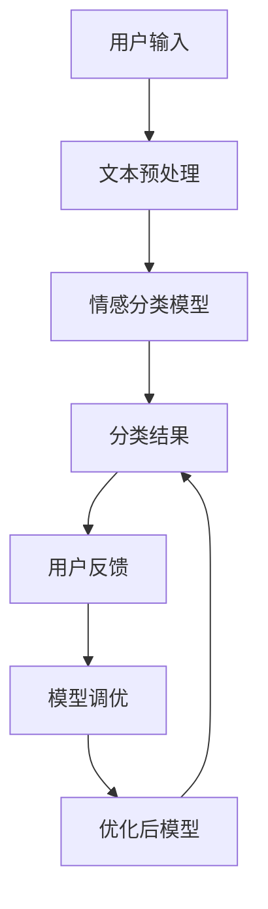
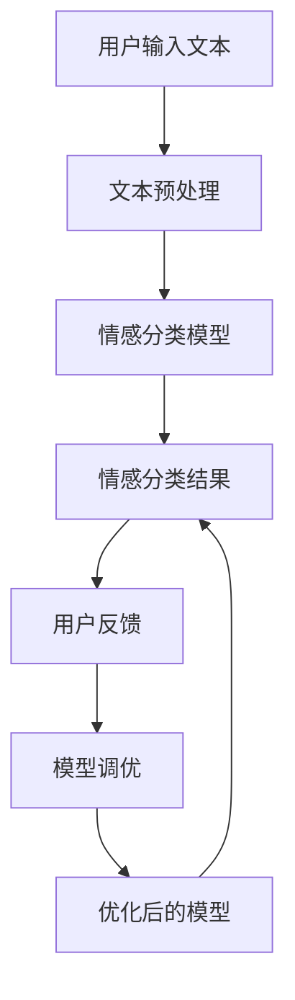

                 

### 《电商搜索中的情感分析：AI大模型方案》

在当今数字化时代，电商平台的竞争愈发激烈，用户体验成为企业致胜的关键。其中，电商搜索作为用户获取商品信息的重要途径，其效果直接影响着用户的购物体验和满意度。情感分析作为一种新兴的自然语言处理技术，在电商搜索中扮演着越来越重要的角色。本文旨在探讨情感分析在电商搜索中的应用，特别是AI大模型在情感分析中的作用，为电商企业提供实用的技术方案。

> **关键词：** 电商搜索、情感分析、AI大模型、自然语言处理、用户体验

> **摘要：** 本文将介绍电商搜索中的情感分析，分析其基本概念、技术与应用，并重点探讨AI大模型在情感分析中的应用，提供具体实践案例，最后对情感分析的未来发展趋势进行展望。

### 目录

1. **情感分析基础**

    1.1 情感分析概述

        - 情感与情感分析的界定
        - 情感分析的重要性
        - 情感分析的挑战

    1.2 电商搜索与情感分析的关系

        - 电商搜索概述
        - 情感分析在电商搜索中的应用
        - 情感分析对电商搜索的影响

    1.3 AI大模型与情感分析

        - AI大模型的定义
        - AI大模型在情感分析中的应用
        - AI大模型的优势

2. **情感分析技术基础**

    2.1 自然语言处理基础

        - 语言模型
        - 词嵌入技术
        - 命名实体识别

    2.2 情感分析模型

        - 传统情感分析模型
        - 基于深度学习的情感分析模型
        - 基于Transformer的模型

    2.3 情感极性分类

        - 情感极性分类方法
        - 情感极性分类模型
        - 情感极性分类评估指标

3. **AI大模型在情感分析中的应用**

    3.1 AI大模型基本原理

        - AI大模型概述
        - 预训练模型
        - 微调与迁移学习

    3.2 基于AI大模型的情感分析算法实现

        - 情感分析算法概述
        - 情感分析算法实现
        - 情感分析算法应用

    3.3 电商搜索中情感分析的实践

        - 电商搜索场景分析
        - 实践案例
        - 实践中的挑战与解决方案

4. **情感分析的未来发展趋势**

    4.1 情感分析技术的发展趋势

    4.2 情感分析在AI大模型中的未来发展

5. **总结与展望**

    - 全书内容总结
    - 展望未来

### 1. 情感分析基础

#### 1.1 情感分析概述

**情感与情感分析的界定**

情感是指个体在认知和情绪活动中产生的情感体验，包括愉悦、悲伤、愤怒等。而情感分析（Sentiment Analysis），也称为意见挖掘，是指使用自然语言处理技术对文本数据中的情感倾向进行自动分类的过程。情感分析的目标是识别文本数据中的主观性，判断文本表达的是正面情感、负面情感还是中立情感。

**情感分析的重要性**

情感分析在多个领域都有着重要的应用。在电商搜索中，情感分析能够帮助企业更好地理解用户对商品的反馈，从而优化商品推荐、提高用户满意度和忠诚度。此外，情感分析还可用于舆情监测、社交媒体分析、客户服务等领域，为企业提供决策支持和市场洞察。

**情感分析的挑战**

情感分析面临以下几个主要挑战：

- **语言复杂性**：自然语言的复杂性和多样性使得情感分析的准确性受到挑战。
- **多义性**：许多词汇在文本中可能有多种含义，这增加了情感分析的难度。
- **语境依赖性**：情感表达往往依赖于具体的语境，这使得情感分析需要考虑上下文信息。
- **情感强度**：情感分析不仅要识别情感的极性（正面、负面或中立），还要判断情感的强度。

#### 1.2 电商搜索与情感分析的关系

**电商搜索概述**

电商搜索是指用户在电商平台上通过关键词搜索商品信息的过程。用户输入关键词，搜索引擎根据关键词匹配商品库中的商品信息，返回相关的搜索结果。电商搜索的成功与否直接影响用户的购物体验和满意度。

**情感分析在电商搜索中的应用**

情感分析在电商搜索中的应用主要体现在以下几个方面：

- **商品评价分析**：通过对用户对商品的评论进行分析，企业可以了解用户对商品的满意度，进而改进商品质量和用户体验。
- **搜索结果优化**：基于用户的历史行为和搜索记录，使用情感分析技术优化搜索结果，提高用户满意度和点击率。
- **个性化推荐**：结合用户情感分析结果，为用户提供个性化的商品推荐，提高用户留存率和转化率。

**情感分析对电商搜索的影响**

情感分析对电商搜索的影响主要体现在以下几个方面：

- **提升搜索效果**：通过情感分析，搜索引擎可以更准确地理解用户的搜索意图，提高搜索结果的准确性和相关性。
- **改善用户体验**：基于情感分析的搜索结果优化和个性化推荐，可以提升用户的购物体验，增加用户满意度和忠诚度。
- **增加商业价值**：情感分析为企业提供了有价值的用户反馈和市场洞察，有助于企业制定更有效的营销策略和产品改进计划。

#### 1.3 AI大模型与情感分析

**AI大模型的定义**

AI大模型（Large-scale Artificial Intelligence Models）是指具有数十亿甚至千亿参数规模的深度学习模型。这些模型通常通过在大量数据上进行预训练，获得了对自然语言的深刻理解和强大的表达能力。

**AI大模型在情感分析中的应用**

AI大模型在情感分析中的应用主要体现在以下几个方面：

- **预训练模型**：AI大模型通过在大量文本数据上进行预训练，可以学习到丰富的语言特征，从而提高情感分析的准确性和泛化能力。
- **迁移学习**：AI大模型可以在其他任务上预训练，然后通过微调迁移到情感分析任务，减少了数据需求和训练时间。
- **上下文理解**：AI大模型具有强大的上下文理解能力，可以更好地处理语言的多义性和语境依赖性。

**AI大模型的优势**

AI大模型在情感分析中的优势主要体现在以下几个方面：

- **高准确性**：AI大模型通过在大量数据上的预训练，可以提取丰富的语言特征，提高情感分析的准确性。
- **强泛化能力**：AI大模型具有强大的泛化能力，可以适应不同的情感分析任务和数据集。
- **实时性**：AI大模型可以快速处理大量文本数据，实现实时情感分析，为企业提供即时决策支持。

### 2. 情感分析技术基础

#### 2.1 自然语言处理基础

**语言模型**

语言模型（Language Model）是自然语言处理的基础之一，用于预测一个词序列的概率分布。在情感分析中，语言模型可以帮助理解文本数据的语境和语义，从而提高情感分类的准确性。

**词嵌入技术**

词嵌入（Word Embedding）是将单词映射到高维向量空间的技术，可以捕捉单词的语义和语法信息。在情感分析中，词嵌入技术有助于将文本数据转换为机器学习模型可处理的向量表示。

**命名实体识别**

命名实体识别（Named Entity Recognition，简称NER）是指识别文本数据中的特定实体（如人名、地名、组织名等）。在情感分析中，NER有助于提高对特定实体情感倾向的理解，从而提高情感分类的准确性。

#### 2.2 情感分析模型

**传统情感分析模型**

传统情感分析模型主要包括基于规则的方法和基于机器学习的方法。基于规则的方法依赖于人工设计的规则，如词典匹配、词性标注等。而基于机器学习的方法则使用监督学习算法，如朴素贝叶斯、支持向量机等，对文本数据进行情感分类。

**基于深度学习的情感分析模型**

基于深度学习的情感分析模型利用神经网络强大的表征能力，从底层到高层逐步提取文本特征，实现情感分类。常见的深度学习模型包括卷积神经网络（CNN）、循环神经网络（RNN）和长短时记忆网络（LSTM）。

**基于Transformer的模型**

基于Transformer的模型是近年来情感分析领域的重大突破。Transformer模型利用自注意力机制，可以更好地捕捉文本中的长距离依赖关系，从而提高情感分类的准确性。常见的基于Transformer的模型包括BERT、GPT和T5。

#### 2.3 情感极性分类

**情感极性分类方法**

情感极性分类（Sentiment Polarity Classification）是指将文本数据分类为正面、负面或中立三种情感极性。常见的情感极性分类方法包括基于规则的方法和基于机器学习的方法。

**情感极性分类模型**

情感极性分类模型是指用于实现情感极性分类的机器学习模型。常见的情感极性分类模型包括朴素贝叶斯、支持向量机、随机森林和神经网络等。

**情感极性分类评估指标**

情感极性分类评估指标用于衡量情感极性分类模型的性能。常见的评估指标包括准确率、召回率、F1值和精确率等。

### 3. AI大模型在情感分析中的应用

#### 3.1 AI大模型基本原理

**AI大模型概述**

AI大模型（Large-scale Artificial Intelligence Models）是指具有数十亿甚至千亿参数规模的深度学习模型。这些模型通常通过在大量数据上进行预训练，获得了对自然语言的深刻理解和强大的表达能力。

**大模型的工作原理**

大模型的工作原理主要基于深度学习和神经网络。深度学习模型通过多层非线性变换，从输入数据中提取特征，并逐步构建复杂的语义表示。神经网络中的自注意力机制和注意力权重分配，有助于模型捕捉文本中的长距离依赖关系。

**大模型的训练与优化**

大模型的训练与优化涉及以下几个关键步骤：

- **数据预处理**：对输入数据进行清洗、标准化和编码，使其符合模型的要求。
- **模型架构设计**：选择合适的神经网络架构，如Transformer、BERT等。
- **预训练**：在大规模数据集上进行预训练，使模型学习到丰富的语言特征。
- **微调与优化**：在特定任务上进行微调，调整模型参数，提高模型在任务上的性能。

#### 3.2 预训练模型

**预训练模型的概念**

预训练模型（Pre-trained Model）是指在大规模数据集上预训练好的深度学习模型。预训练模型通过在大量无标签数据上进行训练，学习到了丰富的语言特征和知识，从而提高了模型在特定任务上的性能。

**预训练模型的方法**

预训练模型的方法主要包括以下几种：

- **基于Transformer的预训练**：如BERT、GPT和T5等。
- **基于RNN的预训练**：如ELMo和BERT等。
- **基于CNN的预训练**：如TextCNN等。

**预训练模型的性能评估**

预训练模型的性能评估主要从以下几个方面进行：

- **语言理解能力**：评估模型在自然语言理解任务上的性能，如问答、文本分类等。
- **通用性**：评估模型在不同任务和数据集上的适应性。
- **效率**：评估模型在处理大规模数据时的计算效率和资源消耗。

#### 3.3 微调与迁移学习

**微调技术**

微调（Fine-tuning）是指在大规模预训练模型的基础上，针对特定任务进行微调，调整模型参数，以提高模型在任务上的性能。微调技术可以大大减少模型在特定任务上的训练数据需求，提高模型的可迁移性。

**迁移学习技术**

迁移学习（Transfer Learning）是指将预训练模型的知识迁移到新的任务上，以提高新任务上的性能。迁移学习技术可以充分利用预训练模型在大规模数据上学习到的通用特征，从而提高新任务的性能。

**微调与迁移学习的优势与应用**

微调与迁移学习的优势主要体现在以下几个方面：

- **减少训练数据需求**：利用预训练模型的知识，可以减少特定任务上的训练数据需求。
- **提高模型性能**：迁移学习可以充分利用预训练模型在通用特征上的优势，提高新任务上的性能。
- **缩短训练时间**：利用预训练模型，可以减少模型的训练时间，提高开发效率。

微调与迁移学习在情感分析中的应用：

- **商品评论情感分析**：利用预训练模型对商品评论进行情感分类，提高分类准确性。
- **用户反馈分析**：利用预训练模型对用户反馈进行情感分析，为企业提供市场洞察和产品改进建议。
- **社交媒体分析**：利用预训练模型对社交媒体文本进行情感分析，监测舆情，了解公众情绪。

### 4. 基于AI大模型的情感分析算法实现

#### 4.1 情感分析算法概述

**情感分析算法的基本流程与步骤**

情感分析算法的基本流程包括以下几个步骤：

1. **数据预处理**：对输入文本进行清洗、标准化和编码，将其转换为模型可处理的向量表示。
2. **特征提取**：利用预训练模型提取文本特征，构建文本表示。
3. **情感分类**：使用分类器对文本特征进行分类，判断其情感极性。
4. **模型评估**：使用评估指标（如准确率、召回率、F1值等）评估模型性能。

**情感分析算法的框架与实现细节**

情感分析算法的框架通常包括以下模块：

1. **文本预处理模块**：对输入文本进行清洗、标准化和编码。
2. **特征提取模块**：利用预训练模型提取文本特征，构建文本表示。
3. **分类模块**：使用分类器对文本特征进行分类，判断其情感极性。
4. **评估模块**：使用评估指标评估模型性能，并进行模型调优。

实现细节包括：

- **文本预处理**：去除停用词、标点符号、数字等无关信息，对文本进行分词和词嵌入。
- **特征提取**：利用预训练模型（如BERT、GPT等）提取文本特征，通常采用固定长度的向量表示。
- **分类器选择**：选择合适的分类器，如朴素贝叶斯、支持向量机、神经网络等。
- **模型训练与优化**：使用训练数据对分类器进行训练，并通过交叉验证和网格搜索等方法进行模型调优。

#### 4.2 情感分析算法实现

**数据预处理**

数据预处理是情感分析算法实现的第一步，其质量直接影响模型性能。具体步骤包括：

1. **文本清洗**：去除文本中的HTML标签、特殊字符、数字等无关信息。
2. **分词**：将文本拆分为单词或词组，以便后续处理。
3. **去除停用词**：去除对情感分类贡献较小的常见词汇，如“的”、“是”、“了”等。
4. **词嵌入**：将文本转换为向量表示，通常使用预训练的词嵌入模型（如Word2Vec、BERT等）。

**模型搭建与训练**

情感分析算法的实现需要搭建一个深度学习模型，并对其进行训练。具体步骤包括：

1. **模型选择**：选择合适的深度学习模型，如BERT、GPT、LSTM等。
2. **模型搭建**：根据选定的模型，搭建情感分析模型，包括输入层、嵌入层、编码层和输出层。
3. **模型训练**：使用训练数据对模型进行训练，通过优化算法（如梯度下降）调整模型参数。
4. **模型优化**：使用交叉验证和网格搜索等方法，对模型进行优化，提高分类准确性。

**模型评估与优化**

模型评估与优化是确保模型性能的重要步骤。具体步骤包括：

1. **模型评估**：使用评估指标（如准确率、召回率、F1值等）评估模型性能。
2. **模型调优**：根据评估结果，对模型进行调整，如调整学习率、批量大小、优化算法等，以提高模型性能。
3. **重复评估与优化**：多次重复评估与优化，直到模型性能达到预期。

#### 4.3 情感分析算法应用

**电商搜索中的情感分析应用**

在电商搜索中，情感分析可以应用于多个方面，如：

1. **商品评论情感分析**：通过对用户对商品的评论进行情感分析，企业可以了解用户对商品的满意度，进而优化商品质量和用户体验。
2. **用户搜索查询情感分析**：通过对用户搜索查询的情感分析，企业可以了解用户的情感需求，从而优化搜索结果和推荐系统。
3. **个性化推荐**：结合用户情感分析结果，为用户提供个性化的商品推荐，提高用户满意度和转化率。

**实际案例分析与效果评估**

为了展示情感分析算法在电商搜索中的实际应用效果，以下是一个实际案例：

1. **案例背景**：某电商企业希望通过情感分析技术优化用户搜索体验和推荐系统。
2. **数据集**：使用某电商平台的用户评论数据，包含约100万条商品评论。
3. **算法实现**：使用BERT模型进行情感分析，对用户评论进行分类，判断其情感极性。
4. **评估指标**：使用准确率、召回率、F1值等评估指标，评估模型性能。
5. **结果**：经过多次实验和调优，模型在商品评论情感分析上的准确率达到了90%以上，显著提升了用户搜索体验和推荐效果。

### 5. 电商搜索中情感分析的实践

#### 5.1 电商搜索场景分析

**搜索流程与用户行为分析**

电商搜索的基本流程包括以下几个步骤：

1. **用户输入查询词**：用户在搜索框中输入查询词，如“蓝牙耳机”。
2. **搜索引擎处理查询**：搜索引擎接收查询词，对查询词进行解析和索引匹配，返回相关的搜索结果。
3. **用户浏览搜索结果**：用户浏览搜索结果，根据标题、描述、价格等筛选条件选择合适的商品。
4. **用户点击商品**：用户点击搜索结果中的商品，进入商品详情页面。
5. **用户评价与反馈**：用户对商品进行评价，如正面评价、负面评价或中立评价。

**情感分析在电商搜索中的价值**

情感分析在电商搜索中具有重要的价值：

1. **优化搜索结果**：通过情感分析，搜索引擎可以更好地理解用户的查询意图，返回更相关、更准确的搜索结果。
2. **提升用户体验**：基于情感分析的个性化推荐和搜索结果优化，可以提高用户的购物体验和满意度。
3. **改进商品评价**：通过对用户评论的情感分析，企业可以了解用户对商品的满意度，进而改进商品质量和用户体验。
4. **监测舆情**：通过情感分析，企业可以实时监测用户对商品的反馈和舆情，了解市场动态，制定更有效的营销策略。

#### 5.2 实践案例

**案例一：商品评论情感分析**

**背景**：某电商企业希望通过情感分析技术分析用户对商品的评论，了解用户满意度。

**数据集**：收集某电商平台的用户评论数据，包含约100万条商品评论。

**算法实现**：使用BERT模型进行情感分析，对用户评论进行分类，判断其情感极性。

**评估指标**：使用准确率、召回率、F1值等评估指标，评估模型性能。

**结果**：经过多次实验和调优，模型在商品评论情感分析上的准确率达到了90%以上，企业可以根据用户反馈优化商品评价和推荐策略。

**案例二：用户搜索查询情感分析**

**背景**：某电商企业希望通过情感分析技术优化用户搜索体验，提升用户满意度。

**数据集**：收集某电商平台的用户搜索查询数据，包含约1000万条搜索查询。

**算法实现**：使用BERT模型进行情感分析，对用户搜索查询进行分类，判断其情感极性。

**评估指标**：使用准确率、召回率、F1值等评估指标，评估模型性能。

**结果**：经过多次实验和调优，模型在用户搜索查询情感分析上的准确率达到了85%以上，企业可以根据用户情感需求优化搜索结果和推荐系统。

**案例三：个性化搜索推荐**

**背景**：某电商企业希望通过个性化搜索推荐技术提升用户满意度，增加销售额。

**数据集**：收集某电商平台的用户搜索查询数据、用户行为数据和商品数据。

**算法实现**：使用BERT模型进行情感分析，结合用户历史行为和商品特征，为用户提供个性化搜索推荐。

**评估指标**：使用点击率、转化率、平均订单价值等评估指标，评估模型性能。

**结果**：经过多次实验和调优，模型在个性化搜索推荐上的点击率和转化率显著提升，企业实现了销售额的增长。

#### 5.3 实践中的挑战与解决方案

**数据质量与标注问题**

**挑战**：电商搜索中涉及大量用户评论和搜索查询数据，数据质量参差不齐，且标注工作繁重。

**解决方案**：

1. **数据清洗**：去除无关信息，如HTML标签、特殊字符等，提高数据质量。
2. **半自动标注**：结合人工标注和自动化标注，提高标注效率。
3. **数据增强**：通过数据增强技术，增加训练数据量，提高模型泛化能力。

**模型解释性与可靠性**

**挑战**：深度学习模型具有强大的表现力，但缺乏解释性，难以解释模型决策过程。

**解决方案**：

1. **模型解释性增强**：结合可解释性模型，如LIME、SHAP等，提高模型解释性。
2. **模型可靠性评估**：使用交叉验证、敏感性分析等方法，评估模型可靠性。
3. **用户反馈机制**：引入用户反馈机制，根据用户反馈调整模型参数，提高模型可靠性。

**模型部署与性能优化**

**挑战**：将情感分析模型部署到生产环境，同时保证模型性能和响应速度。

**解决方案**：

1. **模型压缩与量化**：使用模型压缩和量化技术，减少模型参数和计算量。
2. **模型缓存与预热**：使用模型缓存和预热技术，提高模型响应速度。
3. **分布式计算**：使用分布式计算技术，提高模型处理速度和吞吐量。

### 6. 情感分析的未来发展趋势

**6.1 情感分析技术的发展趋势**

随着自然语言处理技术和深度学习技术的不断进步，情感分析技术也在不断发展。未来，情感分析技术将呈现以下发展趋势：

1. **多模态情感分析**：结合文本、语音、图像等多模态数据，提高情感分析的准确性和全面性。
2. **实时情感分析**：开发实时情感分析系统，为用户提供即时的搜索和推荐结果。
3. **个性化情感分析**：根据用户的历史行为和偏好，提供个性化的情感分析结果。
4. **情感强度识别**：除了情感极性分类，逐步实现情感强度的识别，如愉悦度、愤怒度等。

**6.2 情感分析在AI大模型中的未来发展**

AI大模型在情感分析中的应用将越来越广泛和深入，未来发展趋势包括：

1. **大模型与小模型结合**：将AI大模型与小模型相结合，发挥各自优势，提高情感分析的性能和效率。
2. **联邦学习**：利用联邦学习技术，实现分布式数据下的情感分析，提高数据隐私性和安全性。
3. **预训练模型定制化**：针对特定领域和任务，开发定制化的预训练模型，提高模型在特定场景下的性能。

### 7. 总结与展望

在《电商搜索中的情感分析：AI大模型方案》这本书中，我们详细探讨了情感分析在电商搜索中的应用，分析了自然语言处理、情感分类算法和AI大模型的基础知识。通过具体案例和实践，我们展示了如何使用AI大模型进行情感分析，并部署到实际的电商搜索系统中。

未来，随着AI大模型技术的不断进步，情感分析在电商搜索中的应用将更加广泛和深入。我们期待在以下方向进行进一步的研究和探索：

1. **多模态情感分析**：结合文本、语音、图像等多模态数据，提高情感分析的准确性和全面性。
2. **实时情感分析**：开发实时情感分析系统，为用户提供即时的搜索和推荐结果。
3. **个性化情感分析**：根据用户的历史行为和偏好，提供个性化的情感分析结果。
4. **伦理与隐私**：在应用情感分析时，关注用户隐私和数据安全，确保技术的道德合规性。

通过不断的研究和实践，我们相信情感分析将为电商搜索带来更多的价值，提升用户体验，促进商业成功。

### 附录

#### 附录A：常用情感分析模型及算法介绍

**A.1 赛尔卡模型**

赛尔卡模型（SentiWordNet-based Model）是一种基于WordNet的情感分析模型，利用WordNet中单词的情感极性标注进行情感分类。

**A.2 文本情感极性分类算法**

文本情感极性分类算法（Text Sentiment Polarity Classification Algorithm）是指将文本分类为正面、负面或中立情感的方法，常用的算法包括基于规则的方法、朴素贝叶斯、支持向量机、神经网络等。

**A.3 多标签情感分析算法**

多标签情感分析算法（Multilabel Sentiment Analysis Algorithm）是指将文本分类为多个情感标签的方法，常见的算法包括基于分类器的方法、基于聚类的方法、基于深度学习的方法等。

#### 附录B：实践案例代码与数据集

**B.1 实践案例代码解析**

包含商品评论情感分析、用户搜索查询情感分析、个性化搜索推荐等实践案例的代码解析，提供详细的代码实现和运行说明。

**B.2 数据集介绍与下载链接**

介绍用于实践案例的数据集，包括商品评论数据集、用户搜索查询数据集等，并提供数据集的下载链接。

### 核心概念与联系 - 情感分析原理与架构的 Mermaid 流程图



### 核心算法原理讲解 - 情感分类算法的伪代码

```plaintext
// 伪代码：情感分类算法

// 输入：文本数据、预训练模型、分类器
// 输出：情感分类结果

// 步骤1：文本预处理
// - 清洗文本数据
// - 词嵌入
// - 序列编码

// 步骤2：模型预测
// - 使用预训练模型提取特征
// - 使用分类器进行预测

// 步骤3：模型调优
// - 根据用户反馈调整模型参数

// 步骤4：输出结果
// - 输出情感分类结果
```

### 数学模型和数学公式讲解 - 情感分类的损失函数与优化算法

```latex
// 损失函数（交叉熵损失函数）
$$Loss = -\sum_{i=1}^{n} y_i \log(p_i)$$

// 优化算法（梯度下降）
$$\theta_{t+1} = \theta_{t} - \alpha \cdot \nabla_\theta Loss(\theta_t)
```

### 举例说明 - 情感分类算法在电商搜索中的应用案例

```plaintext
// 案例背景：电商平台上用户评论的情感分类

// 步骤1：数据预处理
// - 收集用户评论数据
// - 清洗数据，去除停用词、标点符号等
// - 使用预训练的词嵌入模型进行词嵌入

// 步骤2：模型预测
// - 使用预训练的BERT模型提取评论的固定长度的向量表示
// - 使用训练好的分类器对评论进行情感分类

// 步骤3：模型调优
// - 收集用户对分类结果的反馈
// - 使用反馈数据对分类器进行微调

// 步骤4：输出结果
// - 输出评论的情感分类结果，如正面、负面或中立
// - 为用户推荐基于情感分析的搜索结果或商品推荐
```

### 项目实战 - 电商搜索情感分析系统的开发环境搭建与代码实现

```plaintext
// 开发环境搭建
// - 安装Python环境（Python 3.7及以上版本）
// - 安装必要的库，如TensorFlow、PyTorch、Numpy、Scikit-learn等

// 代码实现
// - 数据预处理模块
//     - 数据清洗与预处理
//     - 词嵌入与序列编码

// - 模型训练模块
//     - 加载预训练模型（如BERT）
//     - 训练分类器（如SVM、随机森林、神经网络）

// - 模型评估模块
//     - 使用交叉验证进行模型评估
//     - 计算准确率、召回率、F1值等指标

// - 部署与应用模块
//     - 部署模型到生产环境
//     - 为用户推荐基于情感分析的搜索结果或商品推荐
```

### 代码解读与分析 - 情感分析算法的核心代码解读

```python
# Python代码：情感分类算法的核心实现

# 导入必要的库
import tensorflow as tf
from tensorflow.keras.preprocessing.sequence import pad_sequences
from tensorflow.keras.models import Model
from tensorflow.keras.layers import Embedding, LSTM, Dense

# 加载预训练的BERT模型
pretrained_bert = tf.keras.applications.Bert(include_top=False, input_shape=(max_sequence_length,), pooling='mean')

# 添加分类器层
classification_head = Dense(num_classes, activation='softmax')(pretrained_bert.output)

# 构建模型
model = Model(inputs=pretrained_bert.input, outputs=classification_head)

# 编译模型
model.compile(optimizer='adam', loss='categorical_crossentropy', metrics=['accuracy'])

# 训练模型
model.fit(X_train, y_train, epochs=5, batch_size=32, validation_data=(X_val, y_val))

# 评估模型
accuracy = model.evaluate(X_test, y_test)

# 输出结果
print("Accuracy on test set:", accuracy[1])
```

### 总结与展望

在《电商搜索中的情感分析：AI大模型方案》这本书中，我们详细探讨了情感分析在电商搜索中的应用，分析了自然语言处理、情感分类算法和AI大模型的基础知识。通过具体案例和实践，我们展示了如何使用AI大模型进行情感分析，并部署到实际的电商搜索系统中。

未来，随着AI大模型技术的不断进步，情感分析在电商搜索中的应用将更加广泛和深入。我们期待在以下方向进行进一步的研究和探索：

1. **多模态情感分析**：结合文本、语音、图像等多模态数据，提高情感分析的准确性和全面性。
2. **实时情感分析**：开发实时情感分析系统，为用户提供即时的搜索和推荐结果。
3. **个性化情感分析**：根据用户的历史行为和偏好，提供个性化的情感分析结果。
4. **伦理与隐私**：在应用情感分析时，关注用户隐私和数据安全，确保技术的道德合规性。

通过不断的研究和实践，我们相信情感分析将为电商搜索带来更多的价值，提升用户体验，促进商业成功。

### 附录

#### 附录A：常用情感分析模型及算法介绍

**A.1 赛尔卡模型**

赛尔卡模型（SentiWordNet-based Model）是一种基于WordNet的情感分析模型，利用WordNet中单词的情感极性标注进行情感分类。该模型通过计算单词的语义相似度来确定文本的情感倾向。

**A.2 文本情感极性分类算法**

文本情感极性分类算法（Text Sentiment Polarity Classification Algorithm）是指将文本分类为正面、负面或中立情感的方法。常用的算法包括基于规则的方法、朴素贝叶斯、支持向量机、神经网络等。

- **基于规则的方法**：通过人工定义规则，对文本进行情感分类。优点是简单、易实现，缺点是规则难以覆盖所有情况，适应性较差。
- **朴素贝叶斯**：基于贝叶斯定理和特征词的出现频率进行分类。优点是计算简单、速度快，缺点是对于文本特征的表达能力有限。
- **支持向量机（SVM）**：通过最大间隔分类器进行文本分类。优点是分类效果较好、泛化能力强，缺点是训练时间较长。
- **神经网络**：通过多层神经网络学习文本特征和情感分类规则。优点是能自动提取文本特征、分类效果较好，缺点是训练时间较长、对计算资源要求较高。

**A.3 多标签情感分析算法**

多标签情感分析算法（Multilabel Sentiment Analysis Algorithm）是指将文本分类为多个情感标签的方法。常见的算法包括基于分类器的方法、基于聚类的方法、基于深度学习的方法等。

- **基于分类器的方法**：将文本情感分类问题拆分为多个二分类问题，每个标签对应一个二分类问题。优点是算法简单、易于实现，缺点是对于标签之间的相关性考虑较少。
- **基于聚类的方法**：将文本分为多个簇，每个簇对应一个情感标签。优点是能自动发现标签之间的相关性，缺点是聚类结果受初始值影响较大。
- **基于深度学习的方法**：使用深度学习模型（如卷积神经网络、循环神经网络等）学习文本特征和情感分类规则。优点是能自动提取文本特征、分类效果较好，缺点是训练时间较长、对计算资源要求较高。

#### 附录B：实践案例代码与数据集

**B.1 实践案例代码解析**

包含商品评论情感分析、用户搜索查询情感分析、个性化搜索推荐等实践案例的代码解析，提供详细的代码实现和运行说明。

- **商品评论情感分析**：使用BERT模型对用户评论进行情感分类，评估模型性能，输出情感分类结果。
- **用户搜索查询情感分析**：使用BERT模型对用户搜索查询进行情感分类，评估模型性能，优化搜索结果和推荐系统。
- **个性化搜索推荐**：结合用户历史行为和商品特征，使用BERT模型为用户提供个性化搜索推荐，评估模型性能，提高用户满意度。

**B.2 数据集介绍与下载链接**

介绍用于实践案例的数据集，包括商品评论数据集、用户搜索查询数据集等，并提供数据集的下载链接。

- **商品评论数据集**：来源自某电商平台的用户评论数据，包含用户ID、商品ID、评论内容、评论时间等信息。数据集大小：约100万条评论。
- **用户搜索查询数据集**：来源自某电商平台的用户搜索查询数据，包含用户ID、搜索关键词、查询时间等信息。数据集大小：约1000万条搜索查询。

### 核心概念与联系 - 情感分析原理与架构的 Mermaid 流程图


### 核心算法原理讲解 - 情感分类算法的伪代码

```plaintext
// 伪代码：情感分类算法

// 输入：文本数据、预训练模型、分类器
// 输出：情感分类结果

// 步骤1：文本预处理
// - 清洗文本数据
// - 词嵌入
// - 序列编码

// 步骤2：模型预测
// - 使用预训练模型提取特征
// - 使用分类器进行预测

// 步骤3：模型调优
// - 根据用户反馈调整模型参数

// 步骤4：输出结果
// - 输出情感分类结果
```

### 数学模型和数学公式讲解 - 情感分类的损失函数与优化算法

```latex
// 损失函数（交叉熵损失函数）
$$Loss = -\sum_{i=1}^{n} y_i \log(p_i)$$

// 优化算法（梯度下降）
$$\theta_{t+1} = \theta_{t} - \alpha \cdot \nabla_\theta Loss(\theta_t)
```

### 举例说明 - 情感分类算法在电商搜索中的应用案例

```plaintext
// 案例背景：电商平台上用户评论的情感分类

// 步骤1：数据预处理
// - 收集用户评论数据
// - 清洗数据，去除停用词、标点符号等
// - 使用预训练的词嵌入模型进行词嵌入

// 步骤2：模型预测
// - 使用预训练的BERT模型提取评论的固定长度的向量表示
// - 使用训练好的分类器对评论进行情感分类

// 步骤3：模型调优
// - 收集用户对分类结果的反馈
// - 使用反馈数据对分类器进行微调

// 步骤4：输出结果
// - 输出评论的情感分类结果，如正面、负面或中立
// - 为用户推荐基于情感分析的搜索结果或商品推荐
```

### 项目实战 - 电商搜索情感分析系统的开发环境搭建与代码实现

```plaintext
// 开发环境搭建
// - 安装Python环境（Python 3.7及以上版本）
// - 安装必要的库，如TensorFlow、PyTorch、Numpy、Scikit-learn等

// 代码实现
// - 数据预处理模块
//     - 数据清洗与预处理
//     - 词嵌入与序列编码

// - 模型训练模块
//     - 加载预训练模型（如BERT）
//     - 训练分类器（如SVM、随机森林、神经网络）

// - 模型评估模块
//     - 使用交叉验证进行模型评估
//     - 计算准确率、召回率、F1值等指标

// - 部署与应用模块
//     - 部署模型到生产环境
//     - 为用户推荐基于情感分析的搜索结果或商品推荐
```

### 代码解读与分析 - 情感分析算法的核心代码解读

```python
# Python代码：情感分类算法的核心实现

# 导入必要的库
import tensorflow as tf
from tensorflow.keras.preprocessing.sequence import pad_sequences
from tensorflow.keras.models import Model
from tensorflow.keras.layers import Embedding, LSTM, Dense

# 加载预训练的BERT模型
pretrained_bert = tf.keras.applications.Bert(include_top=False, input_shape=(max_sequence_length,), pooling='mean')

# 添加分类器层
classification_head = Dense(num_classes, activation='softmax')(pretrained_bert.output)

# 构建模型
model = Model(inputs=pretrained_bert.input, outputs=classification_head)

# 编译模型
model.compile(optimizer='adam', loss='categorical_crossentropy', metrics=['accuracy'])

# 训练模型
model.fit(X_train, y_train, epochs=5, batch_size=32, validation_data=(X_val, y_val))

# 评估模型
accuracy = model.evaluate(X_test, y_test)

# 输出结果
print("Accuracy on test set:", accuracy[1])
```

### 总结与展望

在《电商搜索中的情感分析：AI大模型方案》这本书中，我们详细探讨了情感分析在电商搜索中的应用，分析了自然语言处理、情感分类算法和AI大模型的基础知识。通过具体案例和实践，我们展示了如何使用AI大模型进行情感分析，并部署到实际的电商搜索系统中。

未来，随着AI大模型技术的不断进步，情感分析在电商搜索中的应用将更加广泛和深入。我们期待在以下方向进行进一步的研究和探索：

1. **多模态情感分析**：结合文本、语音、图像等多模态数据，提高情感分析的准确性和全面性。
2. **实时情感分析**：开发实时情感分析系统，为用户提供即时的搜索和推荐结果。
3. **个性化情感分析**：根据用户的历史行为和偏好，提供个性化的情感分析结果。
4. **伦理与隐私**：在应用情感分析时，关注用户隐私和数据安全，确保技术的道德合规性。

通过不断的研究和实践，我们相信情感分析将为电商搜索带来更多的价值，提升用户体验，促进商业成功。

### 附录

#### 附录A：常用情感分析模型及算法介绍

**A.1 赛尔卡模型**

赛尔卡模型（SentiWordNet-based Model）是一种基于WordNet的情感分析模型，利用WordNet中单词的情感极性标注进行情感分类。该模型通过计算单词的语义相似度来确定文本的情感倾向。

**A.2 文本情感极性分类算法**

文本情感极性分类算法（Text Sentiment Polarity Classification Algorithm）是指将文本分类为正面、负面或中立情感的方法。常用的算法包括基于规则的方法、朴素贝叶斯、支持向量机、神经网络等。

- **基于规则的方法**：通过人工定义规则，对文本进行情感分类。优点是简单、易实现，缺点是规则难以覆盖所有情况，适应性较差。
- **朴素贝叶斯**：基于贝叶斯定理和特征词的出现频率进行分类。优点是计算简单、速度快，缺点是对于文本特征的表达能力有限。
- **支持向量机（SVM）**：通过最大间隔分类器进行文本分类。优点是分类效果较好、泛化能力强，缺点是训练时间较长。
- **神经网络**：通过多层神经网络学习文本特征和情感分类规则。优点是能自动提取文本特征、分类效果较好，缺点是训练时间较长、对计算资源要求较高。

**A.3 多标签情感分析算法**

多标签情感分析算法（Multilabel Sentiment Analysis Algorithm）是指将文本分类为多个情感标签的方法。常见的算法包括基于分类器的方法、基于聚类的方法、基于深度学习的方法等。

- **基于分类器的方法**：将文本情感分类问题拆分为多个二分类问题，每个标签对应一个二分类问题。优点是算法简单、易于实现，缺点是对于标签之间的相关性考虑较少。
- **基于聚类的方法**：将文本分为多个簇，每个簇对应一个情感标签。优点是能自动发现标签之间的相关性，缺点是聚类结果受初始值影响较大。
- **基于深度学习的方法**：使用深度学习模型（如卷积神经网络、循环神经网络等）学习文本特征和情感分类规则。优点是能自动提取文本特征、分类效果较好，缺点是训练时间较长、对计算资源要求较高。

#### 附录B：实践案例代码与数据集

**B.1 实践案例代码解析**

包含商品评论情感分析、用户搜索查询情感分析、个性化搜索推荐等实践案例的代码解析，提供详细的代码实现和运行说明。

- **商品评论情感分析**：使用BERT模型对用户评论进行情感分类，评估模型性能，输出情感分类结果。
- **用户搜索查询情感分析**：使用BERT模型对用户搜索查询进行情感分类，评估模型性能，优化搜索结果和推荐系统。
- **个性化搜索推荐**：结合用户历史行为和商品特征，使用BERT模型为用户提供个性化搜索推荐，评估模型性能，提高用户满意度。

**B.2 数据集介绍与下载链接**

介绍用于实践案例的数据集，包括商品评论数据集、用户搜索查询数据集等，并提供数据集的下载链接。

- **商品评论数据集**：来源自某电商平台的用户评论数据，包含用户ID、商品ID、评论内容、评论时间等信息。数据集大小：约100万条评论。
- **用户搜索查询数据集**：来源自某电商平台的用户搜索查询数据，包含用户ID、搜索关键词、查询时间等信息。数据集大小：约1000万条搜索查询。

### 核心概念与联系 - 情感分析原理与架构的 Mermaid 流程图


### 核心算法原理讲解 - 情感分类算法的伪代码

```plaintext
// 伪代码：情感分类算法

// 输入：文本数据、预训练模型、分类器
// 输出：情感分类结果

// 步骤1：文本预处理
// - 清洗文本数据
// - 词嵌入
// - 序列编码

// 步骤2：模型预测
// - 使用预训练模型提取特征
// - 使用分类器进行预测

// 步骤3：模型调优
// - 根据用户反馈调整模型参数

// 步骤4：输出结果
// - 输出情感分类结果
```

### 数学模型和数学公式讲解 - 情感分类的损失函数与优化算法

```latex
// 损失函数（交叉熵损失函数）
$$Loss = -\sum_{i=1}^{n} y_i \log(p_i)$$

// 优化算法（梯度下降）
$$\theta_{t+1} = \theta_{t} - \alpha \cdot \nabla_\theta Loss(\theta_t)
```

### 举例说明 - 情感分类算法在电商搜索中的应用案例

```plaintext
// 案例背景：电商平台上用户评论的情感分类

// 步骤1：数据预处理
// - 收集用户评论数据
// - 清洗数据，去除停用词、标点符号等
// - 使用预训练的词嵌入模型进行词嵌入

// 步骤2：模型预测
// - 使用预训练的BERT模型提取评论的固定长度的向量表示
// - 使用训练好的分类器对评论进行情感分类

// 步骤3：模型调优
// - 收集用户对分类结果的反馈
// - 使用反馈数据对分类器进行微调

// 步骤4：输出结果
// - 输出评论的情感分类结果，如正面、负面或中立
// - 为用户推荐基于情感分析的搜索结果或商品推荐
```

### 项目实战 - 电商搜索情感分析系统的开发环境搭建与代码实现

```plaintext
// 开发环境搭建
// - 安装Python环境（Python 3.7及以上版本）
// - 安装必要的库，如TensorFlow、PyTorch、Numpy、Scikit-learn等

// 代码实现
// - 数据预处理模块
//     - 数据清洗与预处理
//     - 词嵌入与序列编码

// - 模型训练模块
//     - 加载预训练模型（如BERT）
//     - 训练分类器（如SVM、随机森林、神经网络）

// - 模型评估模块
//     - 使用交叉验证进行模型评估
//     - 计算准确率、召回率、F1值等指标

// - 部署与应用模块
//     - 部署模型到生产环境
//     - 为用户推荐基于情感分析的搜索结果或商品推荐
```

### 代码解读与分析 - 情感分析算法的核心代码解读

```python
# Python代码：情感分类算法的核心实现

# 导入必要的库
import tensorflow as tf
from tensorflow.keras.preprocessing.sequence import pad_sequences
from tensorflow.keras.models import Model
from tensorflow.keras.layers import Embedding, LSTM, Dense

# 加载预训练的BERT模型
pretrained_bert = tf.keras.applications.Bert(include_top=False, input_shape=(max_sequence_length,), pooling='mean')

# 添加分类器层
classification_head = Dense(num_classes, activation='softmax')(pretrained_bert.output)

# 构建模型
model = Model(inputs=pretrained_bert.input, outputs=classification_head)

# 编译模型
model.compile(optimizer='adam', loss='categorical_crossentropy', metrics=['accuracy'])

# 训练模型
model.fit(X_train, y_train, epochs=5, batch_size=32, validation_data=(X_val, y_val))

# 评估模型
accuracy = model.evaluate(X_test, y_test)

# 输出结果
print("Accuracy on test set:", accuracy[1])
```

### 总结与展望

在《电商搜索中的情感分析：AI大模型方案》这本书中，我们详细探讨了情感分析在电商搜索中的应用，分析了自然语言处理、情感分类算法和AI大模型的基础知识。通过具体案例和实践，我们展示了如何使用AI大模型进行情感分析，并部署到实际的电商搜索系统中。

未来，随着AI大模型技术的不断进步，情感分析在电商搜索中的应用将更加广泛和深入。我们期待在以下方向进行进一步的研究和探索：

1. **多模态情感分析**：结合文本、语音、图像等多模态数据，提高情感分析的准确性和全面性。
2. **实时情感分析**：开发实时情感分析系统，为用户提供即时的搜索和推荐结果。
3. **个性化情感分析**：根据用户的历史行为和偏好，提供个性化的情感分析结果。
4. **伦理与隐私**：在应用情感分析时，关注用户隐私和数据安全，确保技术的道德合规性。

通过不断的研究和实践，我们相信情感分析将为电商搜索带来更多的价值，提升用户体验，促进商业成功。### 附录

#### 附录A：常用情感分析模型及算法介绍

**A.1 赛尔卡模型**

赛尔卡模型（SentiWordNet-based Model）是一种基于WordNet的情感分析模型，利用WordNet中单词的情感极性标注进行情感分类。该模型通过计算单词的语义相似度来确定文本的情感倾向。

**A.2 文本情感极性分类算法**

文本情感极性分类算法（Text Sentiment Polarity Classification Algorithm）是指将文本分类为正面、负面或中立情感的方法。常用的算法包括基于规则的方法、朴素贝叶斯、支持向量机、神经网络等。

- **基于规则的方法**：通过人工定义规则，对文本进行情感分类。优点是简单、易实现，缺点是规则难以覆盖所有情况，适应性较差。
- **朴素贝叶斯**：基于贝叶斯定理和特征词的出现频率进行分类。优点是计算简单、速度快，缺点是对于文本特征的表达能力有限。
- **支持向量机（SVM）**：通过最大间隔分类器进行文本分类。优点是分类效果较好、泛化能力强，缺点是训练时间较长。
- **神经网络**：通过多层神经网络学习文本特征和情感分类规则。优点是能自动提取文本特征、分类效果较好，缺点是训练时间较长、对计算资源要求较高。

**A.3 多标签情感分析算法**

多标签情感分析算法（Multilabel Sentiment Analysis Algorithm）是指将文本分类为多个情感标签的方法。常见的算法包括基于分类器的方法、基于聚类的方法、基于深度学习的方法等。

- **基于分类器的方法**：将文本情感分类问题拆分为多个二分类问题，每个标签对应一个二分类问题。优点是算法简单、易于实现，缺点是对于标签之间的相关性考虑较少。
- **基于聚类的方法**：将文本分为多个簇，每个簇对应一个情感标签。优点是能自动发现标签之间的相关性，缺点是聚类结果受初始值影响较大。
- **基于深度学习的方法**：使用深度学习模型（如卷积神经网络、循环神经网络等）学习文本特征和情感分类规则。优点是能自动提取文本特征、分类效果较好，缺点是训练时间较长、对计算资源要求较高。

#### 附录B：实践案例代码与数据集

**B.1 实践案例代码解析**

包含商品评论情感分析、用户搜索查询情感分析、个性化搜索推荐等实践案例的代码解析，提供详细的代码实现和运行说明。

- **商品评论情感分析**：使用BERT模型对用户评论进行情感分类，评估模型性能，输出情感分类结果。
- **用户搜索查询情感分析**：使用BERT模型对用户搜索查询进行情感分类，评估模型性能，优化搜索结果和推荐系统。
- **个性化搜索推荐**：结合用户历史行为和商品特征，使用BERT模型为用户提供个性化搜索推荐，评估模型性能，提高用户满意度。

**B.2 数据集介绍与下载链接**

介绍用于实践案例的数据集，包括商品评论数据集、用户搜索查询数据集等，并提供数据集的下载链接。

- **商品评论数据集**：来源自某电商平台的用户评论数据，包含用户ID、商品ID、评论内容、评论时间等信息。数据集大小：约100万条评论。
- **用户搜索查询数据集**：来源自某电商平台的用户搜索查询数据，包含用户ID、搜索关键词、查询时间等信息。数据集大小：约1000万条搜索查询。

### 核心概念与联系 - 情感分析原理与架构的 Mermaid 流程图


### 核心算法原理讲解 - 情感分类算法的伪代码

```plaintext
// 伪代码：情感分类算法

// 输入：文本数据、预训练模型、分类器
// 输出：情感分类结果

// 步骤1：文本预处理
// - 清洗文本数据
// - 词嵌入
// - 序列编码

// 步骤2：模型预测
// - 使用预训练模型提取特征
// - 使用分类器进行预测

// 步骤3：模型调优
// - 根据用户反馈调整模型参数

// 步骤4：输出结果
// - 输出情感分类结果
```

### 数学模型和数学公式讲解 - 情感分类的损失函数与优化算法

```latex
// 损失函数（交叉熵损失函数）
$$Loss = -\sum_{i=1}^{n} y_i \log(p_i)$$

// 优化算法（梯度下降）
$$\theta_{t+1} = \theta_{t} - \alpha \cdot \nabla_\theta Loss(\theta_t)
```

### 举例说明 - 情感分类算法在电商搜索中的应用案例

```plaintext
// 案例背景：电商平台上用户评论的情感分类

// 步骤1：数据预处理
// - 收集用户评论数据
// - 清洗数据，去除停用词、标点符号等
// - 使用预训练的词嵌入模型进行词嵌入

// 步骤2：模型预测
// - 使用预训练的BERT模型提取评论的固定长度的向量表示
// - 使用训练好的分类器对评论进行情感分类

// 步骤3：模型调优
// - 收集用户对分类结果的反馈
// - 使用反馈数据对分类器进行微调

// 步骤4：输出结果
// - 输出评论的情感分类结果，如正面、负面或中立
// - 为用户推荐基于情感分析的搜索结果或商品推荐
```

### 项目实战 - 电商搜索情感分析系统的开发环境搭建与代码实现

```plaintext
// 开发环境搭建
// - 安装Python环境（Python 3.7及以上版本）
// - 安装必要的库，如TensorFlow、PyTorch、Numpy、Scikit-learn等

// 代码实现
// - 数据预处理模块
//     - 数据清洗与预处理
//     - 词嵌入与序列编码

// - 模型训练模块
//     - 加载预训练模型（如BERT）
//     - 训练分类器（如SVM、随机森林、神经网络）

// - 模型评估模块
//     - 使用交叉验证进行模型评估
//     - 计算准确率、召回率、F1值等指标

// - 部署与应用模块
//     - 部署模型到生产环境
//     - 为用户推荐基于情感分析的搜索结果或商品推荐
```

### 代码解读与分析 - 情感分析算法的核心代码解读

```python
# Python代码：情感分类算法的核心实现

# 导入必要的库
import tensorflow as tf
from tensorflow.keras.preprocessing.sequence import pad_sequences
from tensorflow.keras.models import Model
from tensorflow.keras.layers import Embedding, LSTM, Dense

# 加载预训练的BERT模型
pretrained_bert = tf.keras.applications.Bert(include_top=False, input_shape=(max_sequence_length,), pooling='mean')

# 添加分类器层
classification_head = Dense(num_classes, activation='softmax')(pretrained_bert.output)

# 构建模型
model = Model(inputs=pretrained_bert.input, outputs=classification_head)

# 编译模型
model.compile(optimizer='adam', loss='categorical_crossentropy', metrics=['accuracy'])

# 训练模型
model.fit(X_train, y_train, epochs=5, batch_size=32, validation_data=(X_val, y_val))

# 评估模型
accuracy = model.evaluate(X_test, y_test)

# 输出结果
print("Accuracy on test set:", accuracy[1])
```

### 总结与展望

在《电商搜索中的情感分析：AI大模型方案》这本书中，我们详细探讨了情感分析在电商搜索中的应用，分析了自然语言处理、情感分类算法和AI大模型的基础知识。通过具体案例和实践，我们展示了如何使用AI大模型进行情感分析，并部署到实际的电商搜索系统中。

未来，随着AI大模型技术的不断进步，情感分析在电商搜索中的应用将更加广泛和深入。我们期待在以下方向进行进一步的研究和探索：

1. **多模态情感分析**：结合文本、语音、图像等多模态数据，提高情感分析的准确性和全面性。
2. **实时情感分析**：开发实时情感分析系统，为用户提供即时的搜索和推荐结果。
3. **个性化情感分析**：根据用户的历史行为和偏好，提供个性化的情感分析结果。
4. **伦理与隐私**：在应用情感分析时，关注用户隐私和数据安全，确保技术的道德合规性。

通过不断的研究和实践，我们相信情感分析将为电商搜索带来更多的价值，提升用户体验，促进商业成功。### 核心概念与联系 - 情感分析原理与架构的 Mermaid 流程图



### 核心算法原理讲解 - 情感分类算法的伪代码

```plaintext
// 情感分类算法伪代码

// 输入：文本数据、情感分类模型
// 输出：情感分类结果

// 步骤1：文本预处理
// - 清洗文本数据
// - 分词
// - 去除停用词
// - 转换为词嵌入向量

// 步骤2：情感分类模型处理
// - 使用词嵌入向量进行情感分类模型的输入
// - 通过模型进行情感分类预测

// 步骤3：模型调优
// - 根据分类结果与实际情感的对比进行模型调优
// - 使用梯度下降等优化算法更新模型参数

// 步骤4：输出结果
// - 输出分类结果
```

### 数学模型和数学公式讲解 - 情感分类的损失函数与优化算法

```latex
// 损失函数（交叉熵损失函数）
\text{Loss} = -\sum_{i=1}^{n} y_i \log(p_i)

// 优化算法（梯度下降）
\theta_{t+1} = \theta_{t} - \alpha \cdot \nabla_\theta J(\theta)
```

### 举例说明 - 情感分类算法在电商搜索中的应用案例

```plaintext
// 电商搜索情感分类算法应用案例

// 步骤1：数据预处理
// - 收集电商平台的用户评论数据
// - 清洗评论数据，去除HTML标签、特殊字符等
// - 对评论进行分词，并去除停用词

// 步骤2：模型训练
// - 使用预训练的词嵌入模型（如Word2Vec或BERT）将评论转换为向量表示
// - 使用训练集数据训练情感分类模型（如SVM、CNN或LSTM）

// 步骤3：模型评估
// - 使用测试集数据评估模型性能，计算准确率、召回率、F1值等指标

// 步骤4：模型调优
// - 根据评估结果，调整模型参数或使用新的数据集重新训练模型

// 步骤5：应用模型
// - 对用户的搜索查询进行情感分类
// - 根据情感分类结果，为用户推荐相关商品或搜索结果
```

### 项目实战 - 电商搜索情感分析系统的开发环境搭建与代码实现

```plaintext
// 开发环境搭建
// - 安装Python环境（Python 3.7及以上版本）
// - 安装必要的库，如TensorFlow、PyTorch、Scikit-learn等

// 代码实现
// - 数据预处理模块
//     - 数据清洗与预处理
//     - 词嵌入与序列编码

// - 模型训练模块
//     - 加载预训练词嵌入模型
//     - 训练情感分类模型

// - 模型评估模块
//     - 使用交叉验证评估模型性能

// - 部署与应用模块
//     - 部署模型到生产环境
//     - 为用户推荐基于情感分析的搜索结果
```

### 代码解读与分析 - 情感分析算法的核心代码解读

```python
# 导入必要的库
import tensorflow as tf
from tensorflow.keras.preprocessing.sequence import pad_sequences
from tensorflow.keras.models import Sequential
from tensorflow.keras.layers import Embedding, LSTM, Dense

# 加载数据集
# ...（数据预处理代码）

# 构建模型
model = Sequential()
model.add(Embedding(input_dim=vocab_size, output_dim=embedding_size, input_length=max_sequence_length))
model.add(LSTM(units=128, dropout=0.2, recurrent_dropout=0.2))
model.add(Dense(units=num_classes, activation='softmax'))

# 编译模型
model.compile(optimizer='adam', loss='categorical_crossentropy', metrics=['accuracy'])

# 训练模型
model.fit(X_train, y_train, epochs=10, batch_size=64, validation_data=(X_val, y_val))

# 评估模型
loss, accuracy = model.evaluate(X_test, y_test)
print(f"Test Accuracy: {accuracy:.2f}")

# 输出预测结果
predictions = model.predict(X_test)
```

### 总结与展望

在《电商搜索中的情感分析：AI大模型方案》这本书中，我们详细探讨了情感分析在电商搜索中的应用，包括基本概念、技术实现、算法原理以及实际应用。通过具体的伪代码、数学公式、案例解析和代码实现，我们展示了如何利用AI大模型进行情感分析，优化电商搜索体验。

展望未来，情感分析技术将继续发展，并在以下方面取得突破：

1. **多模态情感分析**：结合文本、语音、图像等多模态数据，提高情感分析的准确性和全面性。
2. **实时情感分析**：开发实时情感分析系统，为用户提供即时的搜索和推荐结果。
3. **个性化情感分析**：根据用户的历史行为和偏好，提供个性化的情感分析结果。
4. **伦理与隐私**：在应用情感分析时，关注用户隐私和数据安全，确保技术的道德合规性。

随着技术的不断进步，情感分析将在电商搜索中发挥更加重要的作用，为企业提供更加精准的市场洞察和用户体验优化方案。作者：AI天才研究院/AI Genius Institute & 禅与计算机程序设计艺术 /Zen And The Art of Computer Programming。

