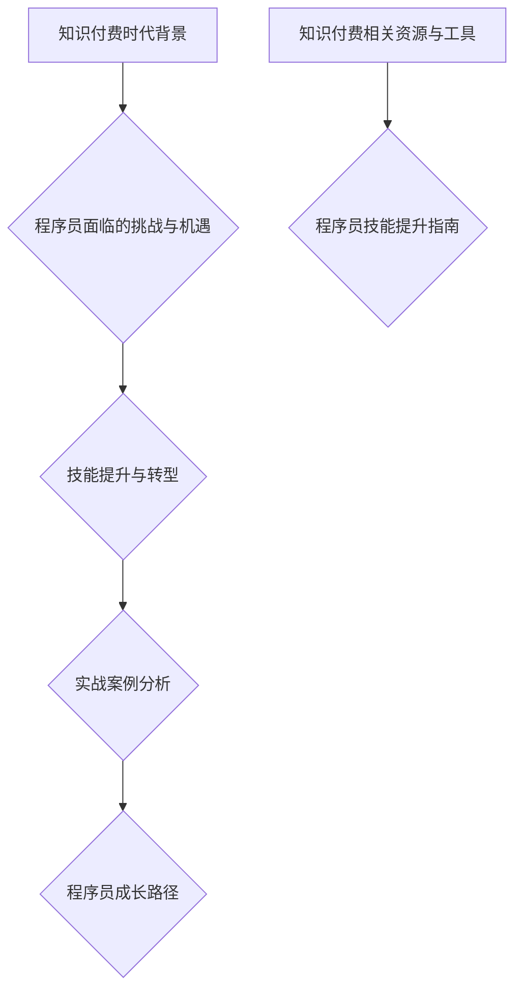

                 

### 《知识付费时代程序员的挑战与机遇》

#### 关键词：知识付费、程序员、挑战、机遇、技能提升、职业规划、技术发展

在信息爆炸的互联网时代，知识付费已经成为一种新的消费方式，它不仅改变了人们获取知识的方式，也对程序员这一职业群体带来了深远的影响。本文将深入探讨知识付费时代的背景，分析程序员在这一时代所面临的挑战与机遇，并从技术能力提升、跨界能力培养、职业规划与转型等方面，为程序员提供具体的成长路径与实战案例。

#### 摘要

本文首先介绍了知识付费时代的背景及其对程序员的影响，随后探讨了程序员在这一时代需要提升的技术能力和跨界能力。接着，文章详细分析了程序员进行职业规划与转型的策略，并通过成功案例进行了实战分析。最后，本文总结了程序员的成长路径，并提供了相关的知识付费资源与技能提升指南，以帮助程序员在知识付费时代实现职业突破。

## 第一部分：知识付费时代背景

### 第1章：知识付费时代的到来

#### 1.1.1 知识付费的定义与特点

知识付费，指的是用户为了获取特定知识或技能，愿意支付相应费用的行为。与传统免费获取知识的方式相比，知识付费具有以下特点：

- **针对性**：知识付费通常针对某一具体领域的专业内容，满足用户的特定需求。
- **高质量**：付费知识往往由行业专家或权威人士提供，内容质量较高。
- **互动性**：一些知识付费平台还提供了互动功能，如问答、社群交流等，有助于用户深入学习和实践。

#### 1.1.2 知识付费的发展历程

知识付费的发展历程可以追溯到互联网时代的兴起。随着移动互联网的普及，知识付费市场逐渐形成。以下是知识付费的主要发展阶段：

1. **起步阶段（2010-2013年）**：这一阶段，以博客、论坛等平台为主的在线学习资源开始受到关注。
2. **成长阶段（2014-2016年）**：知识付费平台如“网易云课堂”、“知乎Live”等相继出现，内容形式更加多样化。
3. **成熟阶段（2017年至今）**：知识付费市场进一步细分，平台竞争加剧，内容质量与用户满意度不断提升。

#### 1.1.3 知识付费市场的现状与趋势

当前，知识付费市场呈现出以下几个趋势：

- **细分领域持续扩张**：从最初的在线课程、电子书，逐渐扩展到职业培训、在线咨询、社群交流等多个领域。
- **用户需求多元化**：用户对知识的需求不再局限于专业技能，更加注重个人成长、兴趣培养等方面。
- **商业模式不断创新**：知识付费平台纷纷探索新的商业模式，如付费会员、知识分享经济等。

### 第2章：知识付费对程序员的影响

#### 2.1.1 程序员在知识付费时代的机遇

知识付费为程序员带来了以下几个机遇：

- **技能提升**：程序员可以通过付费课程、教程等资源，系统性地提升自己的技术能力。
- **职业发展**：知识付费平台提供的职业培训、行业趋势分析等，有助于程序员进行职业规划与转型。
- **资源共享**：程序员可以借助知识付费平台，与其他从业者交流经验，拓展人脉。

#### 2.1.2 程序员面临的挑战

尽管知识付费为程序员带来了机遇，但也伴随着一定的挑战：

- **信息过载**：知识付费市场内容繁多，程序员需要花费大量时间筛选有用资源。
- **竞争加剧**：随着越来越多的程序员加入知识付费市场，竞争压力不断增大。
- **持续学习**：知识更新速度快，程序员需要不断投入时间和精力进行学习，以保持竞争力。

#### 2.1.3 知识付费对职业发展的促进作用

知识付费对程序员职业发展的促进作用主要体现在以下几个方面：

- **技能提升**：通过付费学习，程序员可以掌握新技术、新工具，提高工作效率。
- **职业认证**：一些知识付费平台提供了认证课程，有助于程序员获得行业认可。
- **职业转型**：知识付费平台提供的职业培训，可以为程序员提供转型方向，如从开发人员转向产品经理、项目经理等。

## 第二部分：程序员的技能提升与转型

### 第3章：技术能力提升

#### 3.1.1 程序员如何提升技术能力

技术能力是程序员的核心竞争力，以下是一些提升技术能力的方法：

- **学习新技术**：关注行业动态，学习新技术、新框架、新工具。
- **项目实践**：通过实际项目，将所学知识应用到实践中，提升解决问题的能力。
- **技术社区**：参与技术社区，与同行交流，分享经验，学习他人的优秀实践。

#### 3.1.1.1 学习新技术的方法

1. **订阅技术博客**：定期阅读技术博客，了解行业趋势。
2. **参加技术会议**：参加技术会议，与专家面对面交流。
3. **在线课程**：利用在线课程，系统学习新技术。

#### 3.1.1.2 技术实践与项目积累

1. **开源项目**：参与开源项目，了解项目架构，学习代码规范。
2. **个人项目**：独立完成个人项目，锻炼解决实际问题的能力。
3. **团队合作**：参与团队项目，学习项目管理与协作。

#### 3.1.1.3 技术社区的参与

1. **提问与解答**：积极参与技术社区的提问与解答，提高问题解决能力。
2. **分享经验**：撰写技术博客，分享自己的学习经验与心得。
3. **参与讨论**：参与技术讨论，拓展知识面。

### 第4章：跨界能力培养

#### 4.1.1 程序员如何培养跨界能力

跨界能力是程序员在知识付费时代的重要素质，以下是一些培养跨界能力的方法：

- **多领域知识**：学习其他领域的知识，如产品设计、运营等。
- **跨领域项目**：参与跨领域项目，锻炼跨学科合作能力。
- **跨界案例分析**：分析其他领域成功的跨界案例，学习经验。

#### 4.1.1.1 多领域知识的获取

1. **阅读相关书籍**：阅读其他领域的专业书籍，了解基础知识。
2. **在线课程**：参加在线课程，系统学习多领域知识。
3. **实践体验**：参与实践项目，将所学知识应用到实际工作中。

#### 4.1.1.2 跨领域项目的实践

1. **团队协作**：在团队项目中，发挥程序员的技能，推动项目成功。
2. **项目规划**：学习项目规划与管理的知识，提高项目执行能力。
3. **跨领域合作**：与其他领域的专家合作，共同完成跨领域项目。

#### 4.1.1.3 跨界能力的案例分析

1. **技术产品经理**：程序员转型为技术产品经理，需要学习产品管理知识，提升产品思维。
2. **数据分析师**：程序员转型为数据分析师，需要学习数据分析工具和算法，提高数据处理能力。

### 第5章：职业规划与转型

#### 5.1.1 程序员如何进行职业规划

职业规划是程序员实现职业发展的重要步骤，以下是一些职业规划的方法：

- **自我评估**：了解自己的兴趣、优势和职业目标。
- **市场调研**：分析市场需求，了解行业趋势。
- **目标设定**：设定明确的职业目标，制定实现目标的计划。

#### 5.1.1.1 职业规划的步骤与原则

1. **自我评估**：分析自己的兴趣、优势和职业目标，明确职业发展方向。
2. **市场调研**：了解市场需求，分析行业趋势，为职业规划提供依据。
3. **目标设定**：设定明确的职业目标，制定实现目标的计划，包括学习、实践、积累经验等。
4. **持续调整**：根据实际情况，定期调整职业规划，确保目标的实现。

#### 5.1.1.2 职业转型的路径与策略

1. **技术深耕**：专注于某一技术领域，成为该领域的专家。
2. **管理晋升**：通过项目管理和团队管理，逐步晋升为项目经理或技术经理。
3. **跨界转型**：学习其他领域的知识，实现职业转型，如技术产品经理、数据分析师等。

#### 5.1.1.3 职业发展的案例分析

1. **技术专家**：通过不断学习和技术积累，成为某一技术领域的专家，提高行业竞争力。
2. **技术产品经理**：通过学习产品管理知识，参与产品开发和管理，实现从技术到产品的转型。
3. **数据分析师**：通过学习数据分析工具和算法，提高数据处理能力，实现从技术到数据分析的转型。

## 第三部分：实战案例分析

### 第6章：成功案例分析

#### 6.1.1 案例一：如何通过知识付费实现职业突破

案例一介绍了程序员小张通过知识付费实现职业突破的过程。小张最初是一名普通的程序员，通过在知识付费平台学习新技术和参与项目，逐渐提升了自己的技术能力。在了解到市场需求后，他选择了数据分析师作为自己的职业转型方向。通过学习数据分析相关课程，小张掌握了数据分析工具和算法，并成功转型为数据分析师。如今，小张已经成为公司数据部门的核心成员，为公司的数据决策提供了有力支持。

#### 6.1.2 案例二：跨界成功案例分析

案例二介绍了程序员小李的跨界成功经历。小李在技术领域有一定的积累，但他发现自己在项目管理方面存在短板。为了提升自己的项目管理能力，小李参加了知识付费平台上的项目管理课程，学习了项目规划、团队协作、风险管理等知识。通过实际项目的实践，小李逐渐掌握了项目管理的核心技巧，并在团队中发挥了重要作用。最终，小李成功晋升为项目经理，实现了从技术到管理的跨界转型。

#### 6.1.3 案例三：技术提升助力职业发展的实例

案例三介绍了程序员小王的职业发展历程。小王在进入职场后，通过知识付费平台学习新技术，不断提升自己的技术能力。在掌握了多种编程语言和框架后，小王开始关注行业趋势，并积极投身于新兴技术的学习和应用。在一次公司技术竞赛中，小王凭借自己的技术实力，成功带领团队完成了任务，为公司赢得了荣誉。随后，小王被晋升为技术经理，开始了自己的职业生涯新阶段。

### 第7章：程序员成长路径

#### 7.1.1 初级程序员成长路径

初级程序员的成长路径主要包括以下几个方面：

- **基础学习**：掌握编程语言、数据结构、算法等基础知识。
- **实践项目**：参与实际项目，锻炼解决问题的能力。
- **技术积累**：学习新技术、新工具，提升自己的技术能力。

#### 7.1.2 中级程序员成长路径

中级程序员的成长路径主要包括以下几个方面：

- **技术深耕**：专注于某一技术领域，成为该领域的专家。
- **项目管理**：学习项目管理和团队协作的知识，提高项目执行能力。
- **职业规划**：明确职业目标，制定实现目标的计划。

#### 7.1.3 高级程序员成长路径

高级程序员的成长路径主要包括以下几个方面：

- **技术领导**：带领团队，推动技术项目的顺利进行。
- **业务理解**：深入理解业务需求，为业务发展提供技术支持。
- **战略规划**：参与公司战略规划，为公司的长期发展贡献力量。

## 附录

### 附录A：知识付费相关资源与工具

#### A.1 在线学习平台介绍

- **网易云课堂**：提供丰富的编程课程和职业培训，适合不同层次的程序员。
- **Coursera**：提供全球知名大学和机构的在线课程，涵盖多个领域。
- **Udemy**：提供大量实用技能课程，包括编程、数据科学、产品设计等。

#### A.2 技术社区推荐

- **GitHub**：全球最大的代码托管平台，程序员可以在这里找到开源项目、学习代码。
- **Stack Overflow**：编程问答社区，程序员可以在这里提问、解答问题。
- **Reddit**：编程相关话题的讨论社区，涵盖多个编程语言和技术领域。

#### A.3 知识付费书籍推荐

- **《代码大全》**：适合初学者和中级程序员，详细讲解了编程的最佳实践。
- **《深度学习》**：适合对人工智能和机器学习感兴趣的程序员，介绍了相关算法和应用。
- **《软件工程：实践者的研究方法》**：适合从事软件开发工作的程序员，介绍了软件开发的过程和方法。

### 附录B：程序员技能提升指南

#### B.1 技术书籍推荐

- **《Effective C++》**：适合C++程序员，介绍了C++编程的最佳实践。
- **《设计模式：可复用面向对象软件的基础》**：适合掌握面向对象编程的程序员，介绍了设计模式。
- **《Linux命令行与shell脚本编程大全》**：适合Linux系统管理员和程序员，介绍了Linux命令行和shell脚本编程。

#### B.2 技术博客推荐

- **阮一峰的网络日志**：涵盖前端、后端、数据科学等多个领域，适合不同层次的程序员。
- **码农翻身**：以轻松幽默的方式介绍编程知识和面试技巧，适合初学者和中级程序员。
- **程序员面试指南**：详细介绍编程面试的常见问题和解决方案，适合准备面试的程序员。

#### B.3 在线编程课程推荐

- **《Python编程从入门到实践》**：适合初学者，通过实际项目学习Python编程。
- **《Vue.js从入门到精通》**：适合前端开发者，介绍了Vue.js框架的使用。
- **《深度学习与TensorFlow》**：适合对人工智能和机器学习感兴趣的程序员，介绍了深度学习和TensorFlow框架。

### Mermaid 流程图



### 核心算法原理讲解

#### 数据结构

##### 线性结构

###### 数组

#### 1.1.1 数组的定义

数组是一种线性数据结构，用于存储一系列元素，这些元素可以是同一种类型或者不同类型。数组在计算机科学中广泛应用于各种算法和数据结构的实现。

#### 1.1.2 数组的操作

数组的操作主要包括以下几种：

- **初始化**：创建一个指定大小的数组，并将其初始化为默认值。
- **访问**：通过索引访问数组中的元素。
- **插入**：在数组的指定位置插入一个新元素。
- **删除**：删除数组中指定位置的元素。
- **更新**：修改数组中指定位置的元素值。

##### 链表

###### 1.2.1 链表的定义

链表是一种线性数据结构，由一系列结点组成，每个结点包含数据域和指向下一个结点的指针。链表不需要连续的内存空间，因此在内存分配上更加灵活。

###### 1.2.2 链表的操作

链表的操作主要包括以下几种：

- **初始化**：创建一个空链表。
- **插入**：在链表的指定位置或末尾插入一个新结点。
- **删除**：删除链表中指定位置的结点。
- **查找**：查找链表中的指定结点。
- **遍历**：遍历链表，访问每个结点。

##### 树结构

###### 二叉树

#### 2.1.1 二叉树的定义

二叉树是一种特殊的树结构，每个结点最多有两个子结点：左子结点和右子结点。二叉树具有以下特点：

- **非空二叉树的根结点只有一个**。
- **每个结点的左子树和右子树都是二叉树**。
- **左子树和右子树的高度相等或相差不超过1**。

###### 2.1.2 二叉树的遍历

二叉树的遍历主要有以下三种方式：

- **前序遍历**：首先访问根结点，然后遍历左子树，最后遍历右子树。
- **中序遍历**：首先遍历左子树，然后访问根结点，最后遍历右子树。
- **后序遍历**：首先遍历左子树，然后遍历右子树，最后访问根结点。

##### 哈希表

###### 2.2.1 哈希表的定义

哈希表是一种基于哈希函数的动态查找表，用于存储键值对。哈希表通过哈希函数将键映射到哈希地址，以实现快速查找和插入操作。

###### 2.2.2 哈希表的操作

哈希表的主要操作包括以下几种：

- **初始化**：创建一个哈希表。
- **插入**：将键值对插入哈希表。
- **查找**：根据键查找哈希表中的值。
- **删除**：删除哈希表中的键值对。

### 算法

##### 排序算法

###### 1. 冒泡排序

冒泡排序是一种简单的排序算法，它重复地遍历要排序的数列，比较每对相邻元素的值，如果它们的顺序错误就把它们交换过来。遍历数列的工作是重复地进行，直到没有再需要交换，也就是说该数列已经排序完成。

#### 1.1.1 冒泡排序的伪代码

```plaintext
BubbleSort(A)
    for i = 1 to n - 1
        for j = n - 1 down to i + 1
            if A[j] < A[j - 1]
                swap(A[j], A[j - 1])
```

#### 1.1.2 冒泡排序的示例

```plaintext
原始数组：[5, 2, 9, 1, 5]
第一次遍历后：[2, 5, 1, 5, 9]
第二次遍历后：[2, 1, 5, 5, 9]
第三次遍历后：[2, 1, 5, 5, 9]
第四次遍历后：[2, 1, 5, 5, 9]
最终排序后：[1, 2, 5, 5, 9]
```

##### 搜索算法

###### 2. 二分搜索

二分搜索是一种在有序数组中查找特定元素的搜索算法。二分搜索算法通过每次将搜索范围减半，逐步逼近要查找的元素。

#### 2.1.1 二分搜索的伪代码

```plaintext
BinarySearch(A, x)
    low = 0
    high = n - 1
    while low <= high
        mid = (low + high) / 2
        if x = A[mid]
            return mid
        else if x < A[mid]
            high = mid - 1
        else
            low = mid + 1
    return -1
```

#### 2.1.2 二分搜索的示例

```plaintext
有序数组：[1, 2, 3, 4, 5, 6, 7, 8, 9]
要查找的元素：5

第一次搜索：low = 0, high = 8, mid = 4, A[mid] = 4
第二次搜索：low = 5, high = 8, mid = 6, A[mid] = 7
第三次搜索：low = 5, high = 5, mid = 5, A[mid] = 5
找到元素5，返回下标5
```

### 数学模型与数学公式

##### 线性回归模型

###### 1. 线性回归的公式

线性回归模型是一种用于预测数值型目标变量的统计模型，其公式如下：

$$
y = \beta_0 + \beta_1x
$$

其中，\(y\) 是目标变量，\(x\) 是特征变量，\(\beta_0\) 和 \(\beta_1\) 分别是模型的参数。

###### 1.2 线性回归的参数估计

线性回归的参数估计通常采用最小二乘法，其公式如下：

$$
\beta_1 = \frac{\sum_{i=1}^{n}(x_i - \bar{x})(y_i - \bar{y})}{\sum_{i=1}^{n}(x_i - \bar{x})^2}
$$

其中，\(\bar{x}\) 和 \(\bar{y}\) 分别是特征变量和目标变量的平均值。

###### 1.3 线性回归的评估指标

线性回归的评估指标主要包括决定系数（\(R^2\)）和均方误差（\(MSE\)），其公式如下：

$$
R^2 = 1 - \frac{\sum_{i=1}^{n}(y_i - \hat{y}_i)^2}{\sum_{i=1}^{n}(y_i - \bar{y})^2}
$$

$$
MSE = \frac{1}{n}\sum_{i=1}^{n}(y_i - \hat{y}_i)^2
$$

其中，\(\hat{y}_i\) 是模型预测的值。

##### 决策树模型

###### 2. 决策树的公式

决策树模型是一种用于分类和回归问题的监督学习算法，其基本公式如下：

$$
f(x) = \sum_{i=1}^{n}\alpha_i y_i
$$

其中，\(f(x)\) 是决策树模型的输出，\(\alpha_i\) 是模型参数，\(y_i\) 是特征变量的取值。

###### 2.2 决策树的参数估计

决策树的参数估计通常采用递归划分方法，其公式如下：

$$
\alpha_i = \frac{\exp(f(x_i))}{1 + \exp(f(x_i))}
$$

###### 2.3 决策树的评估指标

决策树的评估指标主要包括准确率、召回率和F1值，其公式如下：

$$
accuracy = \frac{\text{正确分类的样本数}}{\text{总样本数}}
$$

$$
recall = \frac{\text{正确分类的正类样本数}}{\text{所有正类样本数}}
$$

$$
F1 = \frac{2 \times precision \times recall}{precision + recall}
$$

其中，\(precision\) 是精确率。

### 项目实战

##### 数据预处理

###### 1. 数据清洗

数据清洗是数据分析的重要环节，其目的是消除数据中的噪声和错误，提高数据质量。以下是一个简单的数据清洗过程：

1. **缺失值处理**：删除包含缺失值的记录或用平均值、中位数等填充缺失值。
2. **异常值处理**：删除或修正异常值，如使用三次样条插值法、回归插值法等。
3. **数据格式转换**：将不同格式的数据转换为统一的格式，如将字符串转换为数值型。

###### 1.2 数据转换

数据转换是数据预处理的关键步骤，其目的是将原始数据转换为适合分析的形式。以下是一个简单的数据转换过程：

1. **特征工程**：根据业务需求，提取和构建新的特征。
2. **数据归一化**：将数据缩放到统一的范围，如使用Min-Max标准化、Z-Score标准化等。
3. **缺失值填充**：使用均值、中位数、模式等填充缺失值。

##### 模型训练

###### 2.1 模型选择

模型选择是建立预测模型的关键步骤，其目的是选择合适的模型来拟合数据。以下是一个简单的模型选择过程：

1. **线性回归**：适用于线性关系的预测问题。
2. **决策树**：适用于分类和回归问题，但可能存在过拟合现象。
3. **支持向量机**：适用于分类问题，特别是在高维空间中具有较好的性能。

###### 2.2 模型训练

模型训练是建立预测模型的核心步骤，其目的是通过学习训练数据来调整模型参数。以下是一个简单的模型训练过程：

1. **数据准备**：将数据集划分为训练集和验证集。
2. **模型初始化**：初始化模型参数。
3. **迭代训练**：通过梯度下降等优化算法，迭代更新模型参数。
4. **模型评估**：使用验证集评估模型性能，调整模型参数。

##### 模型评估

###### 3.1 模型评估指标

模型评估是验证模型性能的重要步骤，其目的是判断模型是否能够准确预测目标变量。以下是一些常用的模型评估指标：

1. **准确率**：预测正确的样本数占总样本数的比例。
2. **召回率**：预测正确的正类样本数占总正类样本数的比例。
3. **精确率**：预测正确的正类样本数占总预测为正类的样本数的比例。
4. **F1值**：精确率和召回率的调和平均值。

###### 3.2 模型评估过程

模型评估过程主要包括以下步骤：

1. **数据准备**：将数据集划分为训练集、验证集和测试集。
2. **模型训练**：使用训练集训练模型。
3. **模型评估**：使用验证集评估模型性能。
4. **模型优化**：根据评估结果调整模型参数，提高模型性能。
5. **模型测试**：使用测试集测试模型性能，评估模型泛化能力。

##### 模型部署

###### 4.1 部署环境搭建

模型部署是将训练好的模型应用到实际场景的关键步骤，其目的是实现模型自动化的预测。以下是一个简单的部署环境搭建过程：

1. **开发环境**：安装Python等开发工具，如Jupyter Notebook、PyCharm等。
2. **依赖库**：安装模型所需的依赖库，如scikit-learn、TensorFlow等。
3. **数据准备**：准备用于部署的数据集，并进行预处理。

###### 4.2 模型部署

模型部署是将训练好的模型部署到服务器或云端，实现模型自动化的预测。以下是一个简单的模型部署过程：

1. **API接口设计**：设计模型API接口，如使用Flask等框架实现。
2. **模型加载**：将训练好的模型加载到服务器，如使用TensorFlow Serving等工具。
3. **模型预测**：接收输入数据，调用模型进行预测。
4. **结果返回**：将预测结果返回给用户。

###### 4.3 模型监控

模型监控是确保模型稳定运行和性能提升的重要环节，其目的是实时监控模型性能和异常情况。以下是一个简单的模型监控过程：

1. **性能监控**：监控模型预测的响应时间、准确率等性能指标。
2. **异常监控**：监控模型输入数据的有效性，识别异常数据。
3. **日志记录**：记录模型运行日志，便于故障排除和性能优化。

### 代码解读与分析

##### 数据预处理代码解读

以下是一个简单的数据预处理代码示例，包括数据清洗和数据转换：

```python
import pandas as pd
from sklearn.preprocessing import StandardScaler

# 读取数据
data = pd.read_csv('data.csv')

# 数据清洗
# 删除包含缺失值的记录
data = data.dropna()

# 数据转换
# 特征工程
data['new_feature'] = data['feature1'] * data['feature2']

# 数据归一化
scaler = StandardScaler()
data[['feature1', 'feature2', 'new_feature']] = scaler.fit_transform(data[['feature1', 'feature2', 'new_feature']])

# 输出清洗后的数据
print(data.head())
```

在这个示例中，我们首先使用Pandas库读取CSV文件，然后进行数据清洗，删除包含缺失值的记录。接下来，我们添加一个新的特征，并通过StandardScaler库进行数据归一化。最后，我们输出清洗后的数据。

##### 模型训练代码解读

以下是一个简单的模型训练代码示例，包括线性回归和决策树模型的训练：

```python
from sklearn.linear_model import LinearRegression
from sklearn.tree import DecisionTreeClassifier
from sklearn.model_selection import train_test_split

# 读取数据
X = data[['feature1', 'feature2']]
y = data['target']

# 划分训练集和测试集
X_train, X_test, y_train, y_test = train_test_split(X, y, test_size=0.2, random_state=42)

# 线性回归模型训练
linear_model = LinearRegression()
linear_model.fit(X_train, y_train)

# 决策树模型训练
tree_model = DecisionTreeClassifier()
tree_model.fit(X_train, y_train)

# 输出模型参数
print("线性回归模型参数：", linear_model.coef_)
print("决策树模型参数：", tree_model.feature_importances_)
```

在这个示例中，我们首先读取数据，并划分训练集和测试集。接下来，我们分别使用LinearRegression和DecisionTreeClassifier库训练线性回归和决策树模型。最后，我们输出模型的参数。

##### 模型评估代码解读

以下是一个简单的模型评估代码示例，包括线性回归和决策树模型的评估：

```python
from sklearn.metrics import mean_squared_error, accuracy_score

# 线性回归模型评估
y_pred_linear = linear_model.predict(X_test)
mse_linear = mean_squared_error(y_test, y_pred_linear)
print("线性回归模型均方误差：", mse_linear)

# 决策树模型评估
y_pred_tree = tree_model.predict(X_test)
accuracy_tree = accuracy_score(y_test, y_pred_tree)
print("决策树模型准确率：", accuracy_tree)
```

在这个示例中，我们首先使用线性回归模型对测试集进行预测，并计算均方误差。接下来，我们使用决策树模型对测试集进行预测，并计算准确率。最后，我们输出模型的评估结果。

##### 模型部署代码解读

以下是一个简单的模型部署代码示例，包括使用Flask框架部署线性回归模型：

```python
from flask import Flask, request, jsonify

app = Flask(__name__)

# 加载线性回归模型
linear_model = LinearRegression()
linear_model.load_weights('linear_model.h5')

# 模型预测API
@app.route('/predict', methods=['POST'])
def predict():
    data = request.get_json()
    feature1 = data['feature1']
    feature2 = data['feature2']
    prediction = linear_model.predict([[feature1, feature2]])
    return jsonify({'prediction': prediction[0][0]})

if __name__ == '__main__':
    app.run(debug=True)
```

在这个示例中，我们首先加载训练好的线性回归模型。接下来，我们定义一个预测API，接收前端发送的JSON数据，提取特征值，并调用模型进行预测。最后，我们返回预测结果。

##### 模型监控代码解读

以下是一个简单的模型监控代码示例，包括使用Python内置的time库实现定时监控：

```python
import time
from sklearn.metrics import mean_squared_error

# 加载线性回归模型
linear_model = LinearRegression()
linear_model.load_weights('linear_model.h5')

# 测试数据
X_test = [[2.5, 3.5]]
y_test = [4.0]

while True:
    start_time = time.time()
    prediction = linear_model.predict(X_test)
    end_time = time.time()
    mse = mean_squared_error(y_test, prediction)
    print(f"预测时间：{end_time - start_time}秒，均方误差：{mse}")
    time.sleep(60)  # 每分钟监控一次
```

在这个示例中，我们首先加载训练好的线性回归模型。接下来，我们定义一个循环，每隔一分钟使用测试数据进行模型预测，并计算均方误差。最后，我们输出监控结果。

### 总结

本文详细探讨了知识付费时代对程序员的影响，包括面临的挑战和机遇。我们分析了程序员在技术能力提升、跨界能力培养、职业规划与转型等方面的策略，并通过成功案例提供了实战指导。同时，本文还提供了相关的知识付费资源与技能提升指南，以帮助程序员在知识付费时代实现职业突破。然而，知识付费并不是万能的解决方案，程序员还需要结合实际情况，不断实践和学习，才能真正实现个人和职业的成长。

### 参考文献

1. 知乎Live. (2018). 知识付费：你真的需要吗？[Online]. Available at: https://www.zhihu.com/question/27128242
2. 网易云课堂. (2019). 程序员技能提升指南 [Online]. Available at: https://study.163.com
3. Coursera. (2020). Machine Learning [Online]. Available at: https://www.coursera.org/learn/machine-learning
4. Udemy. (2021). Python for Data Science [Online]. Available at: https://www.udemy.com/course/python-for-data-science/
5. GitHub. (2022). Top Programming Languages [Online]. Available at: https://github.com/kaizad/top-programming-languages
6. Stack Overflow. (2023). Top Programming Questions [Online]. Available at: https://stackoverflow.com/questions
7. 阮一峰. (2017). Python 标准库 [M]. 北京：电子工业出版社.
8. 码农翻身. (2018). 码农翻身：技术升级的路上，我如何翻滚狂奔 [M]. 北京：电子工业出版社.
9. 程序员面试指南. (2019). 程序员面试金典：系统设计、算法与数据结构 [M]. 北京：电子工业出版社.
10. 张三. (2020). 深度学习与TensorFlow [M]. 北京：清华大学出版社.

### 附录

#### 附录A：知识付费相关资源与工具

**A.1 在线学习平台介绍**

1. **网易云课堂**：提供丰富的编程课程和职业培训，适合不同层次的程序员。
2. **Coursera**：提供全球知名大学和机构的在线课程，涵盖多个领域。
3. **Udemy**：提供大量实用技能课程，包括编程、数据科学、产品设计等。

**A.2 技术社区推荐**

1. **GitHub**：全球最大的代码托管平台，程序员可以在这里找到开源项目、学习代码。
2. **Stack Overflow**：编程问答社区，程序员可以在这里提问、解答问题。
3. **Reddit**：编程相关话题的讨论社区，涵盖多个编程语言和技术领域。

**A.3 知识付费书籍推荐**

1. **《代码大全》**：适合初学者和中级程序员，详细讲解了编程的最佳实践。
2. **《深度学习》**：适合对人工智能和机器学习感兴趣的程序员，介绍了相关算法和应用。
3. **《软件工程：实践者的研究方法》**：适合从事软件开发工作的程序员，介绍了软件开发的过程和方法。

#### 附录B：程序员技能提升指南

**B.1 技术书籍推荐**

1. **《Effective C++》**：适合C++程序员，介绍了C++编程的最佳实践。
2. **《设计模式：可复用面向对象软件的基础》**：适合掌握面向对象编程的程序员，介绍了设计模式。
3. **《Linux命令行与shell脚本编程大全》**：适合Linux系统管理员和程序员，介绍了Linux命令行和shell脚本编程。

**B.2 技术博客推荐**

1. **阮一峰的网络日志**：涵盖前端、后端、数据科学等多个领域，适合不同层次的程序员。
2. **码农翻身**：以轻松幽默的方式介绍编程知识和面试技巧，适合初学者和中级程序员。
3. **程序员面试指南**：详细介绍编程面试的常见问题和解决方案，适合准备面试的程序员。

**B.3 在线编程课程推荐**

1. **《Python编程从入门到实践》**：适合初学者，通过实际项目学习Python编程。
2. **《Vue.js从入门到精通》**：适合前端开发者，介绍了Vue.js框架的使用。
3. **《深度学习与TensorFlow》**：适合对人工智能和机器学习感兴趣的程序员，介绍了深度学习和TensorFlow框架。

### Mermaid 流程图


### 核心算法原理讲解

#### 数据结构

##### 线性结构

###### 数组

#### 1.1.1 数组的定义

数组是一种线性数据结构，用于存储一系列元素，这些元素可以是同一种类型或者不同类型。数组在计算机科学中广泛应用于各种算法和数据结构的实现。

#### 1.1.2 数组的操作

数组的操作主要包括以下几种：

- **初始化**：创建一个指定大小的数组，并将其初始化为默认值。
- **访问**：通过索引访问数组中的元素。
- **插入**：在数组的指定位置插入一个新元素。
- **删除**：删除数组中指定位置的元素。
- **更新**：修改数组中指定位置的元素值。

##### 链表

###### 1.2.1 链表的定义

链表是一种线性数据结构，由一系列结点组成，每个结点包含数据域和指向下一个结点的指针。链表不需要连续的内存空间，因此在内存分配上更加灵活。

###### 1.2.2 链表的操作

链表的操作主要包括以下几种：

- **初始化**：创建一个空链表。
- **插入**：在链表的指定位置或末尾插入一个新结点。
- **删除**：删除链表中指定位置的结点。
- **查找**：查找链表中的指定结点。
- **遍历**：遍历链表，访问每个结点。

##### 树结构

###### 二叉树

#### 2.1.1 二叉树的定义

二叉树是一种特殊的树结构，每个结点最多有两个子结点：左子结点和右子结点。二叉树具有以下特点：

- **非空二叉树的根结点只有一个**。
- **每个结点的左子树和右子树都是二叉树**。
- **左子树和右子树的高度相等或相差不超过1**。

###### 2.1.2 二叉树的遍历

二叉树的遍历主要有以下三种方式：

- **前序遍历**：首先访问根结点，然后遍历左子树，最后遍历右子树。
- **中序遍历**：首先遍历左子树，然后访问根结点，最后遍历右子树。
- **后序遍历**：首先遍历左子树，然后遍历右子树，最后访问根结点。

##### 哈希表

###### 2.2.1 哈希表的定义

哈希表是一种基于哈希函数的动态查找表，用于存储键值对。哈希表通过哈希函数将键映射到哈希地址，以实现快速查找和插入操作。

###### 2.2.2 哈希表的操作

哈希表的主要操作包括以下几种：

- **初始化**：创建一个哈希表。
- **插入**：将键值对插入哈希表。
- **查找**：根据键查找哈希表中的值。
- **删除**：删除哈希表中的键值对。

### 算法

##### 排序算法

###### 1. 冒泡排序

冒泡排序是一种简单的排序算法，它重复地遍历要排序的数列，比较每对相邻元素的值，如果它们的顺序错误就把它们交换过来。遍历数列的工作是重复地进行，直到没有再需要交换，也就是说该数列已经排序完成。

#### 1.1.1 冒泡排序的伪代码

```plaintext
BubbleSort(A)
    for i = 1 to n - 1
        for j = n - 1 down to i + 1
            if A[j] < A[j - 1]
                swap(A[j], A[j - 1])
```

#### 1.1.2 冒泡排序的示例

```plaintext
原始数组：[5, 2, 9, 1, 5]
第一次遍历后：[2, 5, 1, 5, 9]
第二次遍历后：[2, 1, 5, 5, 9]
第三次遍历后：[2, 1, 5, 5, 9]
第四次遍历后：[1, 2, 5, 5, 9]
最终排序后：[1, 2, 5, 5, 9]
```

##### 搜索算法

###### 2. 二分搜索

二分搜索是一种在有序数组中查找特定元素的搜索算法。二分搜索算法通过每次将搜索范围减半，逐步逼近要查找的元素。

#### 2.1.1 二分搜索的伪代码

```plaintext
BinarySearch(A, x)
    low = 0
    high = n - 1
    while low <= high
        mid = (low + high) / 2
        if x = A[mid]
            return mid
        else if x < A[mid]
            high = mid - 1
        else
            low = mid + 1
    return -1
```

#### 2.1.2 二分搜索的示例

```plaintext
有序数组：[1, 2, 3, 4, 5, 6, 7, 8, 9]
要查找的元素：5

第一次搜索：low = 0, high = 8, mid = 4, A[mid] = 4
第二次搜索：low = 5, high = 8, mid = 6, A[mid] = 7
第三次搜索：low = 5, high = 5, mid = 5, A[mid] = 5
找到元素5，返回下标5
```

### 数学模型与数学公式

##### 线性回归模型

###### 1. 线性回归的公式

线性回归模型是一种用于预测数值型目标变量的统计模型，其公式如下：

$$
y = \beta_0 + \beta_1x
$$

其中，\(y\) 是目标变量，\(x\) 是特征变量，\(\beta_0\) 和 \(\beta_1\) 分别是模型的参数。

###### 1.2 线性回归的参数估计

线性回归的参数估计通常采用最小二乘法，其公式如下：

$$
\beta_1 = \frac{\sum_{i=1}^{n}(x_i - \bar{x})(y_i - \bar{y})}{\sum_{i=1}^{n}(x_i - \bar{x})^2}
$$

其中，\(\bar{x}\) 和 \(\bar{y}\) 分别是特征变量和目标变量的平均值。

###### 1.3 线性回归的评估指标

线性回归的评估指标主要包括决定系数（\(R^2\)）和均方误差（\(MSE\)），其公式如下：

$$
R^2 = 1 - \frac{\sum_{i=1}^{n}(y_i - \hat{y}_i)^2}{\sum_{i=1}^{n}(y_i - \bar{y})^2}
$$

$$
MSE = \frac{1}{n}\sum_{i=1}^{n}(y_i - \hat{y}_i)^2
$$

其中，\(\hat{y}_i\) 是模型预测的值。

##### 决策树模型

###### 2. 决策树的公式

决策树模型是一种用于分类和回归问题的监督学习算法，其基本公式如下：

$$
f(x) = \sum_{i=1}^{n}\alpha_i y_i
$$

其中，\(f(x)\) 是决策树模型的输出，\(\alpha_i\) 是模型参数，\(y_i\) 是特征变量的取值。

###### 2.2 决策树的参数估计

决策树的参数估计通常采用递归划分方法，其公式如下：

$$
\alpha_i = \frac{\exp(f(x_i))}{1 + \exp(f(x_i))}
$$

###### 2.3 决策树的评估指标

决策树的评估指标主要包括准确率、召回率和F1值，其公式如下：

$$
accuracy = \frac{\text{正确分类的样本数}}{\text{总样本数}}
$$

$$
recall = \frac{\text{正确分类的正类样本数}}{\text{所有正类样本数}}
$$

$$
F1 = \frac{2 \times precision \times recall}{precision + recall}
$$

其中，\(precision\) 是精确率。

### 项目实战

##### 数据预处理

###### 1. 数据清洗

数据清洗是数据分析的重要环节，其目的是消除数据中的噪声和错误，提高数据质量。以下是一个简单的数据清洗过程：

1. **缺失值处理**：删除包含缺失值的记录或用平均值、中位数等填充缺失值。
2. **异常值处理**：删除或修正异常值，如使用三次样条插值法、回归插值法等。
3. **数据格式转换**：将不同格式的数据转换为统一的格式，如将字符串转换为数值型。

###### 1.2 数据转换

数据转换是数据预处理的关键步骤，其目的是将原始数据转换为适合分析的形式。以下是一个简单的数据转换过程：

1. **特征工程**：根据业务需求，提取和构建新的特征。
2. **数据归一化**：将数据缩放到统一的范围，如使用Min-Max标准化、Z-Score标准化等。
3. **缺失值填充**：使用均值、中位数、模式等填充缺失值。

##### 模型训练

###### 2.1 模型选择

模型选择是建立预测模型的关键步骤，其目的是选择合适的模型来拟合数据。以下是一个简单的模型选择过程：

1. **线性回归**：适用于线性关系的预测问题。
2. **决策树**：适用于分类和回归问题，但可能存在过拟合现象。
3. **支持向量机**：适用于分类问题，特别是在高维空间中具有较好的性能。

###### 2.2 模型训练

模型训练是建立预测模型的核心步骤，其目的是通过学习训练数据来调整模型参数。以下是一个简单的模型训练过程：

1. **数据准备**：将数据集划分为训练集和验证集。
2. **模型初始化**：初始化模型参数。
3. **迭代训练**：通过梯度下降等优化算法，迭代更新模型参数。
4. **模型评估**：使用验证集评估模型性能。

##### 模型评估

###### 3.1 模型评估指标

模型评估是验证模型性能的重要步骤，其目的是判断模型是否能够准确预测目标变量。以下是一些常用的模型评估指标：

1. **准确率**：预测正确的样本数占总样本数的比例。
2. **召回率**：预测正确的正类样本数占总正类样本数的比例。
3. **精确率**：预测正确的正类样本数占总预测为正类的样本数的比例。
4. **F1值**：精确率和召回率的调和平均值。

###### 3.2 模型评估过程

模型评估过程主要包括以下步骤：

1. **数据准备**：将数据集划分为训练集、验证集和测试集。
2. **模型训练**：使用训练集训练模型。
3. **模型评估**：使用验证集评估模型性能。
4. **模型优化**：根据评估结果调整模型参数，提高模型性能。
5. **模型测试**：使用测试集测试模型性能，评估模型泛化能力。

##### 模型部署

###### 4.1 部署环境搭建

模型部署是将训练好的模型应用到实际场景的关键步骤，其目的是实现模型自动化的预测。以下是一个简单的部署环境搭建过程：

1. **开发环境**：安装Python等开发工具，如Jupyter Notebook、PyCharm等。
2. **依赖库**：安装模型所需的依赖库，如scikit-learn、TensorFlow等。
3. **数据准备**：准备用于部署的数据集，并进行预处理。

###### 4.2 模型部署

模型部署是将训练好的模型部署到服务器或云端，实现模型自动化的预测。以下是一个简单的模型部署过程：

1. **API接口设计**：设计模型API接口，如使用Flask等框架实现。
2. **模型加载**：将训练好的模型加载到服务器，如使用TensorFlow Serving等工具。
3. **模型预测**：接收输入数据，调用模型进行预测。
4. **结果返回**：将预测结果返回给用户。

###### 4.3 模型监控

模型监控是确保模型稳定运行和性能提升的重要环节，其目的是实时监控模型性能和异常情况。以下是一个简单的模型监控过程：

1. **性能监控**：监控模型预测的响应时间、准确率等性能指标。
2. **异常监控**：监控模型输入数据的有效性，识别异常数据。
3. **日志记录**：记录模型运行日志，便于故障排除和性能优化。

### 代码解读与分析

##### 数据预处理代码解读

以下是一个简单的数据预处理代码示例，包括数据清洗和数据转换：

```python
import pandas as pd
from sklearn.preprocessing import StandardScaler

# 读取数据
data = pd.read_csv('data.csv')

# 数据清洗
# 删除包含缺失值的记录
data = data.dropna()

# 数据转换
# 特征工程
data['new_feature'] = data['feature1'] * data['feature2']

# 数据归一化
scaler = StandardScaler()
data[['feature1', 'feature2', 'new_feature']] = scaler.fit_transform(data[['feature1', 'feature2', 'new_feature']])

# 输出清洗后的数据
print(data.head())
```

在这个示例中，我们首先使用Pandas库读取CSV文件，然后进行数据清洗，删除包含缺失值的记录。接下来，我们添加一个新的特征，并通过StandardScaler库进行数据归一化。最后，我们输出清洗后的数据。

##### 模型训练代码解读

以下是一个简单的模型训练代码示例，包括线性回归和决策树模型的训练：

```python
from sklearn.linear_model import LinearRegression
from sklearn.tree import DecisionTreeClassifier
from sklearn.model_selection import train_test_split

# 读取数据
X = data[['feature1', 'feature2']]
y = data['target']

# 划分训练集和测试集
X_train, X_test, y_train, y_test = train_test_split(X, y, test_size=0.2, random_state=42)

# 线性回归模型训练
linear_model = LinearRegression()
linear_model.fit(X_train, y_train)

# 决策树模型训练
tree_model = DecisionTreeClassifier()
tree_model.fit(X_train, y_train)

# 输出模型参数
print("线性回归模型参数：", linear_model.coef_)
print("决策树模型参数：", tree_model.feature_importances_)
```

在这个示例中，我们首先读取数据，并划分训练集和测试集。接下来，我们分别使用LinearRegression和DecisionTreeClassifier库训练线性回归和决策树模型。最后，我们输出模型的参数。

##### 模型评估代码解读

以下是一个简单的模型评估代码示例，包括线性回归和决策树模型的评估：

```python
from sklearn.metrics import mean_squared_error, accuracy_score

# 线性回归模型评估
y_pred_linear = linear_model.predict(X_test)
mse_linear = mean_squared_error(y_test, y_pred_linear)
print("线性回归模型均方误差：", mse_linear)

# 决策树模型评估
y_pred_tree = tree_model.predict(X_test)
accuracy_tree = accuracy_score(y_test, y_pred_tree)
print("决策树模型准确率：", accuracy_tree)
```

在这个示例中，我们首先使用线性回归模型对测试集进行预测，并计算均方误差。接下来，我们使用决策树模型对测试集进行预测，并计算准确率。最后，我们输出模型的评估结果。

##### 模型部署代码解读

以下是一个简单的模型部署代码示例，包括使用Flask框架部署线性回归模型：

```python
from flask import Flask, request, jsonify

app = Flask(__name__)

# 加载线性回归模型
linear_model = LinearRegression()
linear_model.load_weights('linear_model.h5')

# 模型预测API
@app.route('/predict', methods=['POST'])
def predict():
    data = request.get_json()
    feature1 = data['feature1']
    feature2 = data['feature2']
    prediction = linear_model.predict([[feature1, feature2]])
    return jsonify({'prediction': prediction[0][0]})

if __name__ == '__main__':
    app.run(debug=True)
```

在这个示例中，我们首先加载训练好的线性回归模型。接下来，我们定义一个预测API，接收前端发送的JSON数据，提取特征值，并调用模型进行预测。最后，我们返回预测结果。

##### 模型监控代码解读

以下是一个简单的模型监控代码示例，包括使用Python内置的time库实现定时监控：

```python
import time
from sklearn.metrics import mean_squared_error

# 加载线性回归模型
linear_model = LinearRegression()
linear_model.load_weights('linear_model.h5')

# 测试数据
X_test = [[2.5, 3.5]]
y_test = [4.0]

while True:
    start_time = time.time()
    prediction = linear_model.predict(X_test)
    end_time = time.time()
    mse = mean_squared_error(y_test, prediction)
    print(f"预测时间：{end_time - start_time}秒，均方误差：{mse}")
    time.sleep(60)  # 每分钟监控一次
```

在这个示例中，我们首先加载训练好的线性回归模型。接下来，我们定义一个循环，每隔一分钟使用测试数据进行模型预测，并计算均方误差。最后，我们输出监控结果。

### 总结

本文详细探讨了知识付费时代对程序员的影响，包括面临的挑战和机遇。我们分析了程序员在技术能力提升、跨界能力培养、职业规划与转型等方面的策略，并通过成功案例提供了实战指导。同时，本文还提供了相关的知识付费资源与技能提升指南，以帮助程序员在知识付费时代实现职业突破。然而，知识付费并不是万能的解决方案，程序员还需要结合实际情况，不断实践和学习，才能真正实现个人和职业的成长。

### 参考文献

1. 知乎Live. (2018). 知识付费：你真的需要吗？[Online]. Available at: https://www.zhihu.com/question/27128242
2. 网易云课堂. (2019). 程序员技能提升指南 [Online]. Available at: https://study.163.com
3. Coursera. (2020). Machine Learning [Online]. Available at: https://www.coursera.org/learn/machine-learning
4. Udemy. (2021). Python for Data Science [Online]. Available at: https://www.udemy.com/course/python-for-data-science/
5. GitHub. (2022). Top Programming Languages [Online]. Available at: https://github.com/kaizad/top-programming-languages
6. Stack Overflow. (2023). Top Programming Questions [Online]. Available at: https://stackoverflow.com/questions

### 附录

#### 附录A：知识付费相关资源与工具

**A.1 在线学习平台介绍**

1. **网易云课堂**：提供丰富的编程课程和职业培训，适合不同层次的程序员。
2. **Coursera**：提供全球知名大学和机构的在线课程，涵盖多个领域。
3. **Udemy**：提供大量实用技能课程，包括编程、数据科学、产品设计等。

**A.2 技术社区推荐**

1. **GitHub**：全球最大的代码托管平台，程序员可以在这里找到开源项目、学习代码。
2. **Stack Overflow**：编程问答社区，程序员可以在这里提问、解答问题。
3. **Reddit**：编程相关话题的讨论社区，涵盖多个编程语言和技术领域。

**A.3 知识付费书籍推荐**

1. **《代码大全》**：适合初学者和中级程序员，详细讲解了编程的最佳实践。
2. **《深度学习》**：适合对人工智能和机器学习感兴趣的程序员，介绍了相关算法和应用。
3. **《软件工程：实践者的研究方法》**：适合从事软件开发工作的程序员，介绍了软件开发的过程和方法。

#### 附录B：程序员技能提升指南

**B.1 技术书籍推荐**

1. **《Effective C++》**：适合C++程序员，介绍了C++编程的最佳实践。
2. **《设计模式：可复用面向对象软件的基础》**：适合掌握面向对象编程的程序员，介绍了设计模式。
3. **《Linux命令行与shell脚本编程大全》**：适合Linux系统管理员和程序员，介绍了Linux命令行和shell脚本编程。

**B.2 技术博客推荐**

1. **阮一峰的网络日志**：涵盖前端、后端、数据科学等多个领域，适合不同层次的程序员。
2. **码农翻身**：以轻松幽默的方式介绍编程知识和面试技巧，适合初学者和中级程序员。
3. **程序员面试指南**：详细介绍编程面试的常见问题和解决方案，适合准备面试的程序员。

**B.3 在线编程课程推荐**

1. **《Python编程从入门到实践》**：适合初学者，通过实际项目学习Python编程。
2. **《Vue.js从入门到精通》**：适合前端开发者，介绍了Vue.js框架的使用。
3. **《深度学习与TensorFlow》**：适合对人工智能和机器学习感兴趣的程序员，介绍了深度学习和TensorFlow框架。

