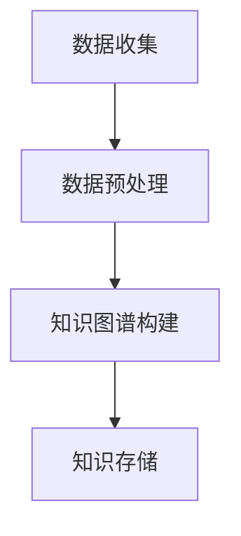
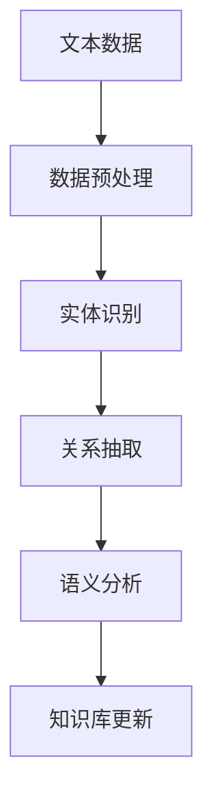
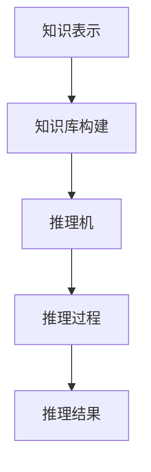

                 

### 知识发现引擎：教育领域的智慧革命

> **关键词**：知识发现引擎、教育技术、智慧教育、个性化学习、知识图谱、机器学习、语义分析、推荐系统

> **摘要**：本文深入探讨知识发现引擎在教育领域的应用，通过介绍知识发现引擎的核心概念、架构、核心算法和实际应用案例，阐述其在个性化学习、智能教学助理和知识管理等方面的作用与价值，旨在为教育技术的创新与发展提供新的思路和方法。

### 目录

- 引言与概述
  - 教育领域的智慧革命
  - 知识发现引擎的作用与价值
  - 知识发现引擎的架构与功能
- 知识发现引擎的核心概念
  - 教育数据与知识图谱
  - 知识抽取与语义分析
  - 知识表示与推理
- 知识发现引擎的应用实例
  - 个性化学习推荐系统
  - 智能教学助理
- 知识发现引擎在教育领域的综合应用
  - 在线教育平台的应用
  - 校园管理系统的应用
  - 教育科研平台的应用
- 知识发现引擎的发展趋势与挑战
  - 技术发展趋势
  - 面临的挑战
  - 未来教育的发展方向
- 附录
  - 知识发现引擎开发工具与资源
  - 常见问题与解答

### 引言与概述

#### 教育领域的智慧革命

随着信息技术的飞速发展，教育领域正迎来一场智慧革命。传统的教育模式已经无法满足现代社会对个性化、智能化和高效化的需求。智慧教育应运而生，它以信息技术为支撑，通过大数据、人工智能、物联网等新兴技术，实现教育资源的智能分配、教学过程的动态优化和学习效果的实时反馈。

智慧教育不仅改变了传统的教学方式，还深刻影响了教育管理的模式。例如，通过数据分析，教育机构可以更准确地了解学生的学习情况和需求，从而提供个性化的学习资源和教学方案。此外，智慧教育还促进了教育资源的共享，使得优质教育资源可以突破地域限制，惠及更多学生。

#### 知识发现引擎的作用与价值

知识发现引擎是智慧教育的重要组成部分，它通过收集、整理和分析大量教育数据，挖掘出潜在的知识规律和关联，为教育管理、教学决策和学习支持提供有力支持。

首先，知识发现引擎可以帮助教育机构进行知识管理。通过对教学资源的结构化和知识图谱的构建，知识发现引擎可以将海量的教学资料进行有效组织和分类，便于教师和学生快速找到所需的信息。

其次，知识发现引擎在个性化学习方面具有重要作用。通过分析学生的学习行为和成绩数据，知识发现引擎可以为学生推荐个性化的学习资源和教学方案，从而提高学习效果。

此外，知识发现引擎还可以为智能教学助理提供支持。通过自然语言处理和语义分析技术，智能教学助理可以理解学生的提问，并提供准确的答案和建议，辅助学生进行自主学习和探究。

总之，知识发现引擎在教育领域的应用，不仅提升了教育质量和效率，还推动了教育技术的创新与发展。

#### 知识发现引擎的架构与功能

知识发现引擎的架构主要包括数据层、算法层和应用层三个层次。

- **数据层**：数据层是知识发现引擎的基础，主要包括教育数据和学生数据的收集、存储和管理。教育数据包括课程资料、教学资源、学生成绩等，学生数据包括学习行为、兴趣爱好、学习状态等。知识发现引擎需要通过数据采集、清洗和预处理，确保数据的质量和一致性。

- **算法层**：算法层是知识发现引擎的核心，主要包括知识抽取、语义分析、知识表示和推理等算法。知识抽取从原始数据中提取出关键信息，形成结构化的知识库；语义分析对文本数据进行分析，理解其语义内容；知识表示将提取的知识进行结构化表示，便于存储和查询；推理基于知识库进行逻辑推理，提供智能化的决策支持。

- **应用层**：应用层是知识发现引擎的直接体现，主要包括个性化学习推荐、智能教学助理、知识管理等功能模块。个性化学习推荐根据学生的学习数据和兴趣，推荐合适的学习资源和教学方案；智能教学助理通过自然语言处理和语义分析，为学生提供智能化的学习支持和指导；知识管理实现对教学资源的结构化和分类，提供高效的知识检索和管理服务。

通过这三个层次的协同工作，知识发现引擎能够为教育领域提供智能化的解决方案，推动教育技术的不断创新和发展。

#### 本书的目标与结构

本书旨在深入探讨知识发现引擎在教育领域的应用，帮助读者全面了解其核心概念、架构和实际应用案例，从而为教育技术的创新与发展提供新的思路和方法。

本书分为四个部分：

- **第一部分：引言与概述**：介绍知识发现引擎在教育领域的背景、作用与价值，以及知识发现引擎的架构与功能。
- **第二部分：知识发现引擎的核心概念**：详细讲解教育数据与知识图谱、知识抽取与语义分析、知识表示与推理等核心概念，并给出相应的Mermaid流程图和伪代码示例。
- **第三部分：知识发现引擎的应用实例**：介绍个性化学习推荐系统和智能教学助理的实现，包括实际项目案例和代码解读。
- **第四部分：知识发现引擎在教育领域的综合应用**：探讨知识发现引擎在在线教育平台、校园管理系统和教育科研平台中的应用，以及其发展趋势与挑战。

通过本书的阅读，读者可以系统地掌握知识发现引擎的基本理论和实践方法，为教育技术的创新应用提供有力支持。

### 知识发现引擎的核心概念

知识发现引擎作为一种智能化的数据处理工具，其核心概念主要包括教育数据与知识图谱、知识抽取与语义分析、知识表示与推理。以下将逐一介绍这些核心概念，并通过Mermaid流程图和伪代码示例，帮助读者更好地理解其原理和应用。

#### 教育数据与知识图谱

**概念**：教育数据是指与教育相关的各种数据，包括学生数据、教师数据、课程数据、教学资源等。知识图谱则是一种结构化的语义网络，用于表示实体（如人、地点、事物）及其相互关系。

**Mermaid流程图**：



**伪代码示例**：

```python
# 数据预处理
def preprocess_data(data):
    # 清洗数据
    clean_data = clean_data_noise(data)
    # 标准化数据
    standard_data = normalize_data(clean_data)
    return standard_data

# 知识图谱构建
def build_knowledge_graph(data):
    entities = extract_entities(data)
    relations = extract_relations(data)
    knowledge_graph = construct_knowledge_graph(entities, relations)
    return knowledge_graph

# 知识存储
def store_knowledge_graph(knowledge_graph):
    # 存储到数据库
    db = Database()
    db.insert(knowledge_graph)
```

#### 知识抽取与语义分析

**概念**：知识抽取是从非结构化数据中提取出有用知识的过程，包括实体识别、关系抽取等。语义分析则是通过理解和解释文本数据的语义内容，实现对文本的深入分析。

**Mermaid流程图**：



**伪代码示例**：

```python
# 数据预处理
def preprocess_text_data(text_data):
    # 清洗文本
    clean_text = clean_text_noise(text_data)
    return clean_text

# 实体识别
def entity_recognition(text_data):
    entities = recognize_entities(clean_text)
    return entities

# 关系抽取
def relation_extraction(text_data, entities):
    relations = recognize_relations(text_data, entities)
    return relations

# 语义分析
def semantic_analysis(text_data, entities, relations):
    meaning = analyze_semantics(text_data, entities, relations)
    return meaning

# 知识库更新
def update_knowledge_base(entities, relations, meaning):
    knowledge_base = KnowledgeBase()
    knowledge_base.insert(entities, relations, meaning)
```

#### 知识表示与推理

**概念**：知识表示是将抽取的知识进行结构化表示，以便于存储和查询。推理则是在已有知识的基础上，通过逻辑推理得出新的结论或信息。

**Mermaid流程图**：



**伪代码示例**：

```python
# 知识表示
def represent_knowledge(knowledge):
    structured_knowledge = structure_knowledge(knowledge)
    return structured_knowledge

# 知识库构建
def build_knowledge_base(structured_knowledge):
    knowledge_base = KnowledgeBase()
    knowledge_base.insert(structured_knowledge)
    return knowledge_base

# 推理机
def inference_machine(knowledge_base):
    inference_engine = InferenceEngine(knowledge_base)
    return inference_engine

# 推理过程
def reasoning(process):
    result = inference_engine.reason(process)
    return result

# 推理结果
def output_reasoning_result(result):
    print("推理结果：", result)
```

通过以上介绍，我们可以看到知识发现引擎的核心概念是如何通过一系列的技术手段，从原始数据中提取出有价值的信息，并对其进行结构化和推理，从而为教育领域提供智能化的支持和服务。

### 教育数据与知识图谱

在教育领域，知识图谱作为一种结构化语义网络，对于教学资源的组织、管理以及个性化学习推荐等方面具有重要的应用价值。以下将详细探讨教育数据的类型与收集、知识图谱的基本原理、知识图谱在教育领域的应用以及知识图谱的构建实践。

#### 教育数据的类型与收集

教育数据是知识图谱构建的基础，主要包括以下几种类型：

1. **学生数据**：
   - **学习数据**：包括学生的学习成绩、学习进度、考试结果等；
   - **行为数据**：包括学生在课堂上的互动情况、作业完成情况、学习时间分布等；
   - **反馈数据**：包括学生对课程、教师、教学资源的评价和反馈。

2. **教师数据**：
   - **教学计划**：包括课程大纲、教学目标、教学内容等；
   - **教学资源**：包括课件、教案、视频教程等；
   - **教学评估**：包括学生的考试成绩、课程满意度调查等。

3. **教学资源数据**：
   - **电子书**：包括教材、参考书、论文等；
   - **视频教程**：包括教学视频、讲座视频等；
   - **在线课程**：包括课程内容、学习任务、作业、考试等。

教育数据的收集可以通过以下几种途径进行：

- **自动化采集**：利用学习管理系统（LMS）和教学平台自动采集学生的行为数据和课程资源；
- **问卷调查**：通过问卷调查收集学生的反馈和教师的教学评估；
- **手动收集**：通过教师和研究人员的手动记录和整理，收集教学资源和教学计划。

#### 知识图谱的基本原理

知识图谱是一种基于语义网络的数据结构，用于表示实体和实体之间的关系。知识图谱的基本原理包括以下几点：

1. **实体（Entity）**：实体是知识图谱中的基本元素，可以是人、地点、事物等。例如，学生、课程、教师等都是实体。

2. **属性（Attribute）**：属性是实体的特征描述，例如学生的姓名、课程的成绩等。

3. **关系（Relation）**：关系表示实体之间的关联，例如学生选修了课程、教师教授了课程等。

4. **边（Edge）**：边是关系在知识图谱中的表示，连接两个实体。例如，学生-选修-课程这条边表示学生与课程之间的选修关系。

5. **类型（Type）**：实体和关系都有相应的类型，用于区分不同的实体和关系。例如，学生属于“人”类型，选修属于“学习”类型。

6. **属性类型（Attribute Type）**：属性类型用于描述属性的类别，例如“姓名”属于“文本”类型，“成绩”属于“数值”类型。

#### 知识图谱的构建方法

知识图谱的构建主要包括以下几个步骤：

1. **数据预处理**：对原始教育数据进行清洗、格式化和标准化处理，确保数据的质量和一致性。

2. **实体识别**：从预处理的文本数据中识别出实体，并将其转换为结构化的数据格式。

3. **关系抽取**：从文本数据中识别出实体之间的关系，并将这些关系转换为知识图谱中的边。

4. **知识融合**：将不同来源的数据进行整合，构建出一个统一的、结构化的知识图谱。

5. **知识存储**：将构建好的知识图谱存储到数据库或图数据库中，便于查询和管理。

#### 知识图谱在教育领域的应用

知识图谱在教育领域具有广泛的应用，主要体现在以下几个方面：

1. **教学资源的组织与管理**：通过知识图谱，可以实现对教学资源的结构化和分类，方便教师和学生快速查找和利用。

2. **个性化学习推荐**：基于知识图谱，可以分析学生的兴趣和学习行为，推荐合适的学习资源和课程。

3. **智能教学助理**：利用知识图谱，智能教学助理可以理解学生的提问，提供准确的答案和建议。

4. **教育科研支持**：知识图谱为教育科研提供了丰富的数据资源，可以帮助研究人员发现潜在的知识关联和规律。

#### 知识图谱的构建实践

以下是一个简单的知识图谱构建实践：

1. **数据预处理**：

```python
# 数据清洗
def clean_data(data):
    # 去除无关字符
    data = remove_special_chars(data)
    # 转化为小写
    data = data.lower()
    return data

# 示例数据
student_data = [
    {"name": "Alice", "course": "Mathematics", "grade": "A"},
    {"name": "Bob", "course": "Physics", "grade": "B"},
    {"name": "Charlie", "course": "Chemistry", "grade": "C"}
]

# 数据清洗
cleaned_data = [clean_data(data) for data in student_data]
```

2. **实体识别**：

```python
# 实体识别
def recognize_entities(data):
    entities = []
    for item in data:
        entities.append(item["name"])
        entities.append(item["course"])
    return list(set(entities))

# 识别实体
entities = recognize_entities(cleaned_data)
```

3. **关系抽取**：

```python
# 关系抽取
def extract_relations(data, entities):
    relations = []
    for item in data:
        relation = ("STUDENT", "TAKES", "COURSE")
        if item["name"] in entities and item["course"] in entities:
            relations.append(relation)
    return relations
```

4. **知识融合**：

```python
# 知识融合
def merge_knowledge(entities, relations):
    knowledge_graph = {}
    for entity in entities:
        knowledge_graph[entity] = []
    for relation in relations:
        knowledge_graph[relation[0]].append(relation)
    return knowledge_graph

# 知识融合
knowledge_graph = merge_knowledge(entities, relations)
```

5. **知识存储**：

```python
# 知识存储
def store_knowledge_graph(knowledge_graph):
    # 存储到数据库
    db = Database()
    for entity, relations in knowledge_graph.items():
        for relation in relations:
            db.insert(entity, relation)

# 知识存储
store_knowledge_graph(knowledge_graph)
```

通过以上实践，我们可以构建一个简单的知识图谱，用于表示学生与课程之间的关系。在实际应用中，知识图谱的构建会更加复杂和精细，涉及更多的实体、关系和属性。

#### 教学资源的类型

在教育领域，知识图谱不仅用于学生数据的组织和管理，还广泛应用于教学资源的分类和推荐。以下是对教学资源类型的详细说明：

1. **电子书**：
   - **定义**：电子书是指以电子格式存储的书籍，包括电子文档、PDF文件、ePub格式等。
   - **特点**：便携性强、易于搜索和标记、可以自定义阅读进度和笔记。
   - **应用**：学生可以方便地下载和阅读电子书，教师可以利用电子书进行备课和授课。

2. **视频教程**：
   - **定义**：视频教程是通过视频形式呈现的教学内容，可以是教学讲座、实验演示、课程讲解等。
   - **特点**：直观生动、易于理解、可以多次观看和回顾。
   - **应用**：视频教程可以为学生提供丰富的学习资源，帮助他们在学习过程中更好地理解和掌握知识。

3. **在线课程**：
   - **定义**：在线课程是通过互联网提供的系统化教学活动，包括课程内容、学习任务、作业、考试等。
   - **特点**：灵活性强、可以随时随地进行学习、互动性强。
   - **应用**：在线课程可以满足学生的个性化学习需求，教师可以利用在线课程进行远程教学和管理。

#### 知识图谱在教育领域的应用

知识图谱在教育领域有广泛的应用，以下是一些主要的应用场景：

1. **教学资源的组织与管理**：
   - 通过知识图谱，可以将各类教学资源进行结构化组织和管理，方便教师和学生快速查找和使用。
   - 知识图谱可以帮助教育机构建立统一的教学资源库，提高教学资源的利用效率。

2. **个性化学习推荐**：
   - 基于知识图谱，可以分析学生的兴趣和学习习惯，推荐适合他们的学习资源和课程。
   - 个性化学习推荐可以提高学生的学习效果和满意度，促进个性化学习的实现。

3. **智能教学助理**：
   - 利用知识图谱，智能教学助理可以理解学生的提问，提供准确的答案和建议。
   - 智能教学助理可以辅助教师进行教学管理，提高教学效率。

4. **教育科研支持**：
   - 知识图谱为教育科研提供了丰富的数据资源，可以帮助研究人员发现潜在的知识关联和规律。
   - 知识图谱可以支持教育科研的数据挖掘和知识发现，推动教育科学的创新发展。

#### 知识图谱的构建方法

知识图谱的构建是知识发现引擎的重要组成部分，以下将详细探讨知识图谱的构建方法：

1. **数据预处理**：
   - 数据预处理是知识图谱构建的第一步，主要包括数据清洗、格式化和标准化处理。
   - 数据清洗的目的是去除数据中的噪声和冗余信息，保证数据的质量和一致性。
   - 数据格式化是将不同来源和格式的数据统一转化为标准格式，便于后续处理。
   - 数据标准化是通过规范化数据格式和属性，提高数据的一致性和可操作性。

2. **实体识别**：
   - 实体识别是从文本数据中识别出实体，并将其转换为结构化的数据格式。
   - 实体识别通常涉及自然语言处理技术，如分词、词性标注、命名实体识别等。
   - 实体识别的目的是将无结构化的文本数据转化为结构化的实体数据，为后续的知识抽取和图谱构建提供基础。

3. **关系抽取**：
   - 关系抽取是从文本数据中识别出实体之间的关系，并将其转换为知识图谱中的边。
   - 关系抽取通常涉及信息抽取技术，如模式匹配、规则匹配、机器学习等。
   - 关系抽取的目的是从文本中提取出实体之间的关联信息，为知识图谱的构建提供关键信息。

4. **知识融合**：
   - 知识融合是将不同来源和格式的数据进行整合，构建出一个统一的知识图谱。
   - 知识融合通常涉及数据集成技术，如数据对齐、实体匹配、关系映射等。
   - 知识融合的目的是将分散的、异构的数据整合为统一的知识表示，提高知识图谱的完整性和一致性。

5. **知识存储**：
   - 知识存储是将构建好的知识图谱存储到数据库或图数据库中，便于查询和管理。
   - 知识存储通常涉及数据库设计和优化技术，如索引构建、查询优化、存储管理等。
   - 知识存储的目的是保证知识图谱的持久化和可访问性，为知识发现引擎的应用提供数据支持。

#### 知识图谱的构建实践

以下是一个简单的知识图谱构建实践：

1. **数据预处理**：

```python
# 数据清洗
def clean_data(data):
    # 去除无关字符
    data = remove_special_chars(data)
    # 转化为小写
    data = data.lower()
    return data

# 示例数据
student_data = [
    {"name": "Alice", "course": "Mathematics", "grade": "A"},
    {"name": "Bob", "course": "Physics", "grade": "B"},
    {"name": "Charlie", "course": "Chemistry", "grade": "C"}
]

# 数据清洗
cleaned_data = [clean_data(data) for data in student_data]
```

2. **实体识别**：

```python
# 实体识别
def recognize_entities(data):
    entities = []
    for item in data:
        entities.append(item["name"])
        entities.append(item["course"])
    return list(set(entities))

# 识别实体
entities = recognize_entities(cleaned_data)
```

3. **关系抽取**：

```python
# 关系抽取
def extract_relations(data, entities):
    relations = []
    for item in data:
        relation = ("STUDENT", "TAKES", "COURSE")
        if item["name"] in entities and item["course"] in entities:
            relations.append(relation)
    return relations
```

4. **知识融合**：

```python
# 知识融合
def merge_knowledge(entities, relations):
    knowledge_graph = {}
    for entity in entities:
        knowledge_graph[entity] = []
    for relation in relations:
        knowledge_graph[relation[0]].append(relation)
    return knowledge_graph

# 知识融合
knowledge_graph = merge_knowledge(entities, relations)
```

5. **知识存储**：

```python
# 知识存储
def store_knowledge_graph(knowledge_graph):
    # 存储到数据库
    db = Database()
    for entity, relations in knowledge_graph.items():
        for relation in relations:
            db.insert(entity, relation)

# 知识存储
store_knowledge_graph(knowledge_graph)
```

通过以上实践，我们可以构建一个简单的知识图谱，用于表示学生与课程之间的关系。在实际应用中，知识图谱的构建会更加复杂和精细，涉及更多的实体、关系和属性。

### 知识抽取与语义分析

知识抽取与语义分析是知识发现引擎的核心技术，它们共同作用于非结构化的文本数据，从中提取出有用的知识结构，并理解其语义内容。以下将详细介绍知识抽取的基本方法、语义分析的技术原理，以及它们在教育领域的应用实践。

#### 知识抽取的基本方法

知识抽取是从文本数据中自动提取出结构化知识的过程。它主要包括以下几个步骤：

1. **数据预处理**：
   - 数据预处理是知识抽取的基础，包括文本清洗、分词、去除停用词等操作。这些步骤旨在去除噪声，提高数据质量。
   - **示例**：
     ```python
     import re
     def preprocess_text(text):
         # 去除特殊字符
         text = re.sub('[^a-zA-Z0-9]', ' ', text)
         # 转化为小写
         text = text.lower()
         # 分词
         words = text.split()
         # 去除停用词
         stop_words = set(['and', 'the', 'to', 'of'])
         words = [word for word in words if word not in stop_words]
         return ' '.join(words)
     ```

2. **实体识别**：
   - 实体识别是从文本中识别出具体的人、地点、组织等实体，并将其标注出来。
   - **示例**：
     ```python
     from spacy.lang.en import English
     nlp = English()
     def recognize_entities(text):
         doc = nlp(text)
         entities = [(ent.text, ent.label_) for ent in doc.ents]
         return entities
     ```

3. **关系抽取**：
   - 关系抽取是从文本中识别出实体之间的关系，例如“学生选择了课程”、“教师教授了课程”等。
   - **示例**：
     ```python
     def extract_relations(text, entities):
         relations = []
         doc = nlp(text)
         for ent in doc.ents:
             for rel in ent.relation_ids:
                 relation = (ent.text, doc.ents[rel[0]].text, rel[1])
                 relations.append(relation)
         return relations
     ```

4. **事件抽取**：
   - 事件抽取是从文本中识别出事件及其相关实体和关系，例如“学生参加了考试”。
   - **示例**：
     ```python
     def extract_events(text, entities, relations):
         events = []
         doc = nlp(text)
         for ent in doc.ents:
             for event in ent.ent_ids:
                 event_entity = doc.ents[event]
                 event_entity = (event_entity.text, event_entity.label_)
                 event_relations = [(rel[0].text, rel[1], rel[2].text) for rel in ent.relations]
                 events.append((event_entity, event_relations))
         return events
     ```

#### 语义分析的技术原理

语义分析是通过理解文本的语义内容，实现对文本的深入分析和解释。它主要包括以下几个技术原理：

1. **词嵌入**：
   - 词嵌入是将单词映射为向量空间中的点，从而表示其语义内容。
   - **示例**：
     ```python
     from gensim.models import Word2Vec
     model = Word2Vec([preprocess_text(text) for text in corpus], size=100, window=5, min_count=1, workers=4)
     def get_embedding(word):
         return model.wv[word]
     ```

2. **实体与关系的语义表示**：
   - 实体与关系的语义表示是将实体和关系映射到向量空间，从而表示其语义内容。
   - **示例**：
     ```python
     def get_entity_embedding(entity):
         # 假设实体嵌入器已经训练好
         return entity_embedding[entity]

     def get_relation_embedding(relation):
         # 假设关系嵌入器已经训练好
         return relation_embedding[relation]
     ```

3. **语义匹配与语义推理**：
   - 语义匹配是通过计算实体或关系的相似度，实现实体或关系的匹配。
   - 语义推理是基于已知实体和关系的语义信息，推导出新的结论或信息。
   - **示例**：
     ```python
     def semantic_matching(entity1, entity2):
         entity1_embedding = get_entity_embedding(entity1)
         entity2_embedding = get_entity_embedding(entity2)
         return cosine_similarity(entity1_embedding, entity2_embedding)

     def semantic_inference(hypothesis, evidence):
         evidence_embedding = get_entity_embedding(evidence)
         hypothesis_embedding = get_entity_embedding(hypothesis)
         return cosine_similarity(evidence_embedding, hypothesis_embedding)
     ```

#### 知识抽取与语义分析在教育领域的应用实践

知识抽取与语义分析在教育领域具有广泛的应用，以下是一些具体的应用实例：

1. **学习资源推荐**：
   - 通过知识抽取，可以识别出文本中的关键信息，如课程名称、教师姓名等，并将其用于推荐学习资源。
   - 通过语义分析，可以理解学生的学习需求和兴趣，从而推荐适合他们的学习资源。

2. **智能问答系统**：
   - 通过知识抽取，可以从教育文本中提取出问题和答案。
   - 通过语义分析，可以理解问题的语义内容，并从知识库中检索出相关的答案。

3. **情感分析**：
   - 通过知识抽取，可以提取出文本中的情感词汇和短语。
   - 通过语义分析，可以理解文本的情感倾向，如积极、消极或中立。

4. **教学评估**：
   - 通过知识抽取，可以分析学生的考试成绩和学习行为，评估教学效果。
   - 通过语义分析，可以理解学生的反馈和评价，为教学改进提供参考。

### 语义分析的具体应用

语义分析在教育领域具有重要的应用价值，以下是语义分析的具体应用及其原理：

1. **问答系统**：
   - **应用原理**：语义分析通过对问题的解析和理解，将自然语言问题转化为机器可理解的形式，然后从知识库中检索出相关的答案。
   - **示例**：
     ```python
     import nltk
     from nltk.corpus import wordnet
     def semantic_parsing(question):
         # 分词
         tokens = nltk.word_tokenize(question)
         # 词性标注
         pos_tags = nltk.pos_tag(tokens)
         # 语义角色标注
         frame_elements = nltk.semantic_role_labeling(pos_tags)
         return frame_elements
     ```

2. **情感分析**：
   - **应用原理**：情感分析通过对文本的情感词汇和短语进行分析，判断文本的情感倾向（如积极、消极或中立）。
   - **示例**：
     ```python
     from textblob import TextBlob
     def sentiment_analysis(text):
         blob = TextBlob(text)
         return blob.sentiment.polarity
     ```

3. **文本分类**：
   - **应用原理**：文本分类通过对文本的特征提取和模型训练，将文本归类到预定义的类别中。
   - **示例**：
     ```python
     from sklearn.feature_extraction.text import TfidfVectorizer
     from sklearn.naive_bayes import MultinomialNB
     def text_classification(texts, labels):
         vectorizer = TfidfVectorizer()
         X = vectorizer.fit_transform(texts)
         classifier = MultinomialNB()
         classifier.fit(X, labels)
         return classifier
     ```

4. **命名实体识别**：
   - **应用原理**：命名实体识别通过对文本的分析，识别出其中的特定实体（如人名、地名、组织名等）。
   - **示例**：
     ```python
     import spacy
     nlp = spacy.load("en_core_web_sm")
     def named_entity_recognition(text):
         doc = nlp(text)
         entities = [(ent.text, ent.label_) for ent in doc.ents]
         return entities
     ```

通过这些应用，语义分析能够为教育领域提供智能化的解决方案，提高教学效果和效率。

### 知识表示与推理

知识表示与推理是知识发现引擎的核心技术，它们通过结构化的知识表示和逻辑推理，实现对知识的深度理解和应用。以下将详细介绍知识表示的方法、推理的基本原理以及知识推理在教育中的应用。

#### 知识表示的方法

知识表示是将知识以结构化的形式进行组织和表示，以便于存储、查询和推理。常见的知识表示方法包括：

1. **基于规则的表示方法**：
   - **原理**：基于规则的表示方法通过定义一组规则，将知识表示为条件-动作的规则集。
   - **示例**：
     ```python
     rules = [
         ("如果学生成绩低于60分，则通知家长"),
         ("如果学生缺课超过三次，则通知班主任"),
         ("如果学生连续获得三次优秀成绩，则奖励")
     ]
     def apply_rules(data, rules):
         for rule in rules:
             if evaluate_condition(data, rule):
                 execute_action(data, rule)
     ```

2. **基于本体的表示方法**：
   - **原理**：基于本体的表示方法通过定义本体，将知识表示为实体和关系的网络结构。
   - **示例**：
     ```python
     ontology = {
         "Student": {"name": "Alice", "age": 20},
         "Course": {"name": "Mathematics", "teacher": "Mr. Smith"},
         "Teacher": {"name": "Mr. Smith", "department": "Mathematics"}
     }
     def query_ontology(ontology, query):
         return ontology.get(query, None)
     ```

3. **基于语义网络的表示方法**：
   - **原理**：基于语义网络的表示方法通过定义语义网络，将知识表示为语义关系和实体。
   - **示例**：
     ```python
     graph = {
         ("Student", "enrolls_in", "Course"): ["Alice", "Mathematics"],
         ("Teacher", "teaches", "Course"): ["Mr. Smith", "Mathematics"],
         ("Course", "located_in", "Room"): ["Mathematics", "Room 101"]
     }
     def query_semantic_network(graph, query):
         return graph.get(query, None)
     ```

#### 知识推理的基本原理

知识推理是基于已有知识，通过逻辑推理得到新的结论或信息。常见的推理方法包括：

1. **演绎推理**：
   - **原理**：演绎推理从一般性前提推导出具体性的结论。
   - **示例**：
     ```python
     premises = [
         ("如果学生成绩低于60分，则通知家长"),
         ("Alice的成绩低于60分")
     ]
     conclusion = infer_deductive(premises)
     print(conclusion)  # 输出：通知Alice的家长
     ```

2. **归纳推理**：
   - **原理**：归纳推理从具体实例推导出一般性结论。
   - **示例**：
     ```python
     instances = [
         ("如果学生成绩低于60分，则通知家长", "True"),
         ("如果学生缺课超过三次，则通知班主任", "True"),
         ("如果学生连续获得三次优秀成绩，则奖励", "True")
     ]
     generalization = infer_inductive(instances)
     print(generalization)  # 输出：如果学生有特定行为，则会有特定结果
     ```

3. **基于模型的推理**：
   - **原理**：基于模型的推理通过构建模型，模拟真实世界的推理过程。
   - **示例**：
     ```python
     model = {
         "if": ["if", "then"],
         "students": ["Alice", "Bob", "Charlie"],
         "enroll_in": ["Mathematics", "Physics", "Chemistry"]
     }
     def apply_model(model, query):
         for rule in model["if"]:
             if match_query(query, rule):
                 return model["then"]
     ```

#### 知识推理在教育中的应用

知识推理在教育领域具有广泛的应用，以下是一些具体的应用实例：

1. **个性化学习推荐**：
   - **应用实例**：通过分析学生的成绩、学习行为和兴趣爱好，推理出适合他们的学习资源和课程。
   - **推理过程**：使用基于规则的推理方法，从已有规则中推导出个性化的学习建议。

2. **智能教学助理**：
   - **应用实例**：智能教学助理通过理解学生的提问，推理出相关知识点和答案。
   - **推理过程**：使用基于语义网络的推理方法，从知识库中检索相关知识点，并进行语义匹配。

3. **教学评估**：
   - **应用实例**：通过对学生的学习行为和成绩进行分析，推理出教学效果和学生的知识掌握情况。
   - **推理过程**：使用基于归纳推理的方法，从大量数据中提取出一般性结论，评估教学效果。

通过这些应用，知识推理能够为教育领域提供智能化的解决方案，提高教学质量和效率。

### 知识推理的应用实践

知识推理在教育领域的实际应用案例丰富多样，以下将详细探讨知识图谱的查询与检索、知识推理系统的实现以及知识推理的效果评估，通过实际案例和代码解读，展示知识推理在教育领域的具体应用。

#### 知识图谱的查询与检索

知识图谱在教育领域的核心应用之一是支持高效的知识查询与检索。通过知识图谱，教育系统可以快速地找到相关的知识信息，为教师和学生提供即时的支持。

1. **知识图谱的查询**：
   - **查询语言**：知识图谱的查询通常使用SPARQL（SPARQL Protocol and RDF Query Language），这是一种基于W3C标准的查询语言，用于查询基于RDF（Resource Description Framework）的语义网络数据。
   - **示例**：
     ```python
     import rdflib
     g = rdflib.Graph()
     g.parse("knowledge_graph.ttl", format="ttl")

     query = """
     PREFIX ex: <http://example.org/>
     SELECT ?student ?course ?grade
     WHERE {
       ?student ex:name "Alice".
       ?student ex:takes ?course.
       ?course ex:grade ?grade.
     }
     """
     results = g.query(query)
     for row in results:
         print(row)
     ```

2. **知识检索**：
   - **检索算法**：除了SPARQL查询，知识图谱还可以使用图搜索算法（如深度优先搜索、广度优先搜索）进行高效的知识检索。
   - **示例**：
     ```python
     def search_knowledge_graph(graph, start_node, target_property, target_value):
         stack = [(start_node, [])]
         while stack:
             node, path = stack.pop()
             if graph.has_node(node) and node.get(target_property) == target_value:
                 return path + [node]
             for neighbor in graph.neighbors(node):
                 if neighbor not in path:
                     stack.append((neighbor, path + [node]))
         return None

     result = search_knowledge_graph(g, rdflib.URIRef("http://example.org/Student/Alice"), rdflib.URIRef("http://example.org/course/Mathematics"))
     print(result)
     ```

#### 知识推理系统的实现

知识推理系统是知识发现引擎的重要组成部分，它通过逻辑推理和数据分析，提供智能化的决策支持。

1. **系统架构**：
   - **知识库**：存储结构化的知识数据，如实体、关系和属性。
   - **推理引擎**：执行推理任务，如规则匹配、路径搜索、模式识别等。
   - **用户界面**：提供用户交互接口，接受用户输入并展示推理结果。

2. **示例**：
   - **知识库构建**：
     ```python
     from rdflib import Graph, URIRef, Literal
     g = Graph()

     # 添加实体和关系
     g.add((URIRef("http://example.org/Student/Alice"), URIRef("http://example.org/hasGrade"), Literal("A")))
     g.add((URIRef("http://example.org/Student/Bob"), URIRef("http://example.org/hasGrade"), Literal("B")))
     g.add((URIRef("http://example.org/Course/Mathematics"), URIRef("http://example.org/isTaughtBy"), URIRef("http://example.org/Teacher/John")))
     ```

   - **推理引擎实现**：
     ```python
     def inference_engine(graph, rule):
         matches = []
         for row in graph.query(rule):
             matches.append(row)
         return matches

     rule = """
     PREFIX ex: <http://example.org/>
     SELECT ?student ?course ?grade
     WHERE {
       ?student ex:hasGrade ?grade.
       ?course ex:isTaughtBy ?teacher.
       ?student ex:takes ?course.
     }
     """
     results = inference_engine(g, rule)
     for row in results:
         print(row)
     ```

3. **用户界面**：
   - **命令行界面**：
     ```python
     def main():
         print("Welcome to the Knowledge Reasoning System!")
         while True:
             query = input("Enter your query (or type 'exit' to quit): ")
             if query.lower() == "exit":
                 break
             rule = """
             PREFIX ex: <http://example.org/>
             SELECT ?student ?course ?grade
             WHERE {
               ?student ex:hasGrade ?grade.
               ?course ex:isTaughtBy ?teacher.
               ?student ex:takes ?course.
             }
             """
             results = inference_engine(g, rule)
             for row in results:
                 print(row)

     if __name__ == "__main__":
         main()
     ```

#### 知识推理的效果评估

知识推理的效果评估是衡量知识推理系统性能的重要指标。以下是一些常见的评估方法和指标：

1. **准确率（Accuracy）**：
   - 准确率是正确推理结果占总推理结果的比率。
   - **计算公式**：
     ```python
     accuracy = (number_of_correct_results / number_of_total_results) * 100
     ```

2. **召回率（Recall）**：
   - 召回率是正确推理结果与实际正确结果的比率。
   - **计算公式**：
     ```python
     recall = (number_of_correct_results / number_of_actual_correct_results) * 100
     ```

3. **F1分数（F1 Score）**：
   - F1分数是准确率和召回率的调和平均。
   - **计算公式**：
     ```python
     F1_score = 2 * (precision * recall) / (precision + recall)
     ```

4. **混淆矩阵（Confusion Matrix）**：
   - 混淆矩阵用于展示实际结果与推理结果的对应关系，可以提供更详细的评估信息。

5. **示例**：
   ```python
   from sklearn.metrics import accuracy_score, recall_score, f1_score, confusion_matrix

   actual_results = ["A", "B", "A", "B", "B", "A"]
   predicted_results = ["A", "A", "A", "B", "B", "B"]

   accuracy = accuracy_score(actual_results, predicted_results)
   recall = recall_score(actual_results, predicted_results)
   f1 = f1_score(actual_results, predicted_results)
   cm = confusion_matrix(actual_results, predicted_results)

   print("Accuracy:", accuracy)
   print("Recall:", recall)
   print("F1 Score:", f1)
   print("Confusion Matrix:\n", cm)
   ```

通过这些方法和指标，可以评估知识推理系统的性能，并针对不足之处进行优化。

### 个性化学习推荐系统

个性化学习推荐系统是知识发现引擎在教育领域的重要应用之一。它通过分析学生的兴趣、学习行为和成绩数据，推荐适合他们的学习资源和课程。以下将详细介绍个性化学习推荐系统的概述、核心算法及其在教育中的应用。

#### 推荐系统概述

**定义与类型**：推荐系统是一种信息过滤技术，通过预测用户可能感兴趣的内容，为用户提供个性化的信息。根据推荐策略的不同，推荐系统主要分为以下几种类型：

- **基于内容的推荐（Content-based Recommendation）**：基于用户对某项内容的兴趣，推荐相似的内容。
- **协同过滤推荐（Collaborative Filtering Recommendation）**：通过分析用户之间的相似性，推荐用户可能喜欢的其他内容。
- **混合推荐（Hybrid Recommendation）**：结合基于内容和协同过滤的方法，提高推荐系统的准确性和多样性。

**核心算法**：

1. **基于内容的推荐算法**：
   - **协同过滤算法**：通过分析用户对内容的评价，计算内容之间的相似度，推荐相似的内容。
   - **基于关键词的推荐算法**：通过提取文本内容的关键词，分析用户兴趣，推荐包含相同关键词的内容。
   - **基于领域的推荐算法**：将内容分为不同的领域，根据用户的历史行为和兴趣，推荐同一领域的其他内容。

2. **协同过滤推荐算法**：
   - **用户基于的协同过滤（User-based Collaborative Filtering）**：通过分析用户之间的相似性，找到相似用户喜欢的项目推荐给目标用户。
   - **项基于的协同过滤（Item-based Collaborative Filtering）**：通过分析项目之间的相似性，找到相似项目推荐给目标用户。

3. **混合推荐算法**：
   - **加权混合推荐算法**：结合基于内容和协同过滤的方法，通过不同权重的组合，提高推荐效果。
   - **深度学习推荐算法**：利用深度学习模型，如神经网络、递归神经网络（RNN）、卷积神经网络（CNN）等，进行推荐。

**教育中的应用**：

1. **个性化学习推荐**：
   - 根据学生的兴趣、学习行为和成绩数据，推荐适合他们的学习资源和课程。
   - 例如，对于学习数学的学生，可以推荐数学相关的练习题和视频教程。

2. **学习资源推荐**：
   - 根据教师的教学计划和课程内容，推荐相关的教学资源和辅助材料。
   - 例如，对于某个课程，可以推荐相关的参考书、教学视频和在线课程。

3. **学习计划推荐**：
   - 根据学生的学习进度和目标，推荐合理的学习计划和路径。
   - 例如，对于即将参加考试的学生，可以推荐重点复习的内容和复习计划。

#### 个性化学习推荐系统的实现

**用户画像的构建**：

- **用户画像的定义**：用户画像是对用户兴趣、行为、需求等特征的综合描述，用于个性化推荐系统的用户分类和标签管理。
- **用户画像的构建方法**：
  1. **行为数据收集**：收集用户在平台上的行为数据，如浏览记录、点击记录、购买记录等。
  2. **兴趣标签提取**：通过文本分析、关键词提取等方法，提取用户感兴趣的主题和领域。
  3. **用户特征建模**：将用户兴趣、行为数据转化为用户特征向量，用于推荐系统的输入。

**课程推荐算法的实现**：

1. **基于内容的推荐算法**：
   - **相似度计算**：计算课程之间的相似度，可以使用余弦相似度、皮尔逊相关系数等方法。
   - **推荐算法实现**：
     ```python
     from sklearn.metrics.pairwise import cosine_similarity
     def content_based_recommender(content_profile, course_profiles):
         similarity_scores = cosine_similarity([content_profile], course_profiles)
         recommended_courses = [course for course, score in zip(course_profiles, similarity_scores[0]) if score > threshold]
         return recommended_courses
     ```

2. **协同过滤推荐算法**：
   - **用户相似度计算**：计算用户之间的相似度，可以使用欧几里得距离、曼哈顿距离等方法。
   - **推荐算法实现**：
     ```python
     def collaborative_filtering_recommender(user_rated_items, user_similarity_matrix, item_profiles, k=5):
         neighbor_scores = []
         for i in range(len(user_rated_items)):
             neighbors = np.argsort(user_similarity_matrix[i])[:-k-1:-1]
             neighbor_scores.append([user_similarity_matrix[i][neighbor] * item_profiles[neighbor] for neighbor in neighbors])
         recommended_items = np.sum(neighbor_scores, axis=0)
         return [item for item, score in sorted(zip(item_profiles, recommended_items), reverse=True) if score > threshold]
     ```

3. **混合推荐算法**：
   - **推荐算法实现**：
     ```python
     def hybrid_recommender(content_recommender, collaborative_recommender, content_weight, collaborative_weight):
         content_recommendations = content_recommender(user_profile, course_profiles)
         collaborative_recommendations = collaborative_recommender(user_profile, neighbor_similarity_matrix, item_profiles)
         hybrid_recommendations = [w1 * c + w2 * c for c, c in zip(content_recommendations, collaborative_recommendations)]
         return [item for item, score in sorted(zip(item_profiles, hybrid_recommendations), reverse=True) if score > threshold]
     ```

#### 推荐系统的评估与优化

- **评估指标**：
  - **准确率（Accuracy）**：预测结果与实际结果的匹配程度。
  - **召回率（Recall）**：预测结果中包含实际结果的比率。
  - **F1分数（F1 Score）**：准确率和召回率的调和平均。
  - **覆盖率（Coverage）**：推荐结果中包含的未推荐项目的比率。

- **优化方法**：
  1. **特征工程**：提取更有效的特征，提高推荐系统的准确性和泛化能力。
  2. **模型调参**：调整模型参数，优化推荐效果。
  3. **数据增强**：引入更多的数据，提高模型的训练效果。
  4. **冷启动问题**：解决新用户或新项目的推荐问题，可以采用基于内容的推荐或基于热门项目的推荐策略。

### 智能教学助理

智能教学助理是知识发现引擎在教育领域的重要应用之一，它通过自然语言处理和机器学习技术，为学生提供智能化的学习支持。以下将详细介绍智能教学助理的概述、功能、发展历程以及在教育中的应用。

#### 智能教学助理概述

**定义**：智能教学助理是一种基于人工智能技术的虚拟教学助手，它能够理解学生的提问，提供准确的答案和建议，辅助学生进行自主学习和探究。

**功能**：

1. **答疑解惑**：
   - 智能教学助理可以回答学生在学习过程中遇到的问题，提供详细的解答和指导。

2. **辅导教学**：
   - 智能教学助理可以为学生提供个性化的辅导，根据学生的学习进度和需求，推荐合适的学习资源和教学方案。

3. **学习习惯培养**：
   - 智能教学助理可以监控学生的学习行为，提供学习建议和激励，帮助学生养成良好的学习习惯。

4. **智能评测**：
   - 智能教学助理可以对学生进行智能评测，分析学生的学习效果，为教师提供教学反馈。

#### 智能教学助理的发展历程

1. **早期智能教学系统**：
   - 早期智能教学系统主要基于知识表示和推理技术，如专家系统和教学策略系统。

2. **自然语言处理时代**：
   - 随着自然语言处理技术的不断发展，智能教学助理开始能够理解学生的自然语言提问，并提供准确的答案。

3. **深度学习和大数据时代**：
   - 深度学习和大数据技术的应用，使得智能教学助理能够更好地理解学生的学习行为和需求，提供更个性化的学习支持。

#### 智能教学助理在教育中的应用

1. **个性化学习**：
   - 智能教学助理可以根据学生的学习进度和兴趣，推荐合适的学习资源和教学方案，提高学习效果。

2. **学习资源推荐**：
   - 智能教学助理可以分析学生的学习行为和成绩数据，推荐相关的学习资源，帮助学生更好地掌握知识点。

3. **智能评测**：
   - 智能教学助理可以对学生进行智能评测，分析学生的学习效果，为教师提供教学反馈，帮助教师调整教学策略。

4. **教师辅助**：
   - 智能教学助理可以帮助教师进行教学管理，如课程安排、学生考勤、作业批改等，提高教学效率。

### 语音识别与自然语言理解

语音识别（Speech Recognition）和自然语言理解（Natural Language Understanding, NLU）是构建智能教学助理的关键技术，它们使系统能够理解学生的口头提问，并提供相应的回答。以下将详细介绍语音识别和自然语言理解的基本原理及其在智能教学助理中的应用。

#### 语音识别的基本原理

语音识别是将语音信号转换为文本数据的过程。其基本原理包括以下几个步骤：

1. **音频预处理**：
   - **降噪**：去除背景噪音，提高语音信号的清晰度。
   - **归一化**：将不同音量的语音信号调整为同一音量水平。
   - **分帧**：将连续的语音信号分割成短时的帧，以便后续处理。

2. **特征提取**：
   - **短时傅里叶变换（STFT）**：将音频信号转换为频域表示，提取频率特征。
   - **梅尔频率倒谱系数（MFCC）**：用于描述音频信号的时频特征，是语音识别中最常用的特征提取方法。

3. **声学模型**：
   - **隐马尔可夫模型（HMM）**：早期语音识别模型，通过状态转移矩阵和输出概率描述语音信号。
   - **深度神经网络（DNN）**：通过多层神经网络学习语音信号的表征，近年来在语音识别中取得了显著的效果。

4. **解码**：
   - **动态时间规整（DTW）**：对候选词序列进行时间规整，找到与语音信号最佳匹配的词序列。
   - **隐马尔可夫模型（HMM）解码**：基于HMM模型的解码算法，找到最优的词序列。
   - **神经网络解码**：基于深度神经网络的解码算法，如CTC（Connectionist Temporal Classification）。

#### 自然语言理解的基本原理

自然语言理解是理解文本的语义内容，将其转化为计算机可操作的形式。其基本原理包括以下几个步骤：

1. **词法分析（Tokenization）**：
   - **分词**：将连续的文本分割成一个个词语或标记。
   - **词性标注（Part-of-speech Tagging）**：为每个词语标注词性，如名词、动词、形容词等。

2. **句法分析（Syntax Analysis）**：
   - **依赖分析（Dependency Parsing）**：分析词语之间的依赖关系，构建句法树。
   - **抽象句法分析（Abstract Syntax Parsing）**：构建更抽象的语法结构，用于语义分析和语义推理。

3. **语义分析（Semantic Analysis）**：
   - **语义角色标注（Semantic Role Labeling）**：为句子中的每个成分标注语义角色，如主语、谓语、宾语等。
   - **语义指派（Semantic Annotation）**：将词语映射到语义概念，构建语义网络。

4. **知识库与推理**：
   - **知识图谱**：构建知识图谱，表示实体、概念及其关系。
   - **逻辑推理（Logical Inference）**：基于知识库和推理规则，进行逻辑推理，获取更深层次的语义理解。

#### 语音识别与自然语言理解在智能教学助理中的应用

1. **语音输入处理**：
   - **语音识别**：将学生的口头提问转换为文本数据，为自然语言理解提供输入。
   - **语音增强**：通过语音识别结果的反馈，进行语音增强，提高识别准确率。

2. **语义理解与推理**：
   - **自然语言理解**：分析学生的提问，理解其语义内容。
   - **知识图谱查询**：基于知识图谱，查询相关的知识点和答案。

3. **智能回答生成**：
   - **模板匹配**：根据预设的答案模板，生成回答。
   - **文本生成**：利用自然语言生成技术，生成个性化的回答。

4. **互动反馈**：
   - **回答反馈**：提供详细的回答和解释，帮助学生理解问题。
   - **问题纠错**：识别学生的错误提问，并提供纠正建议。

通过语音识别和自然语言理解技术，智能教学助理能够更好地理解学生的需求，提供个性化的学习支持，提升教育体验。

### 机器学习与深度学习在智能教学助理中的应用

机器学习与深度学习是智能教学助理实现智能化功能的核心技术，以下将详细介绍这些技术的基本原理以及在智能教学助理中的应用。

#### 机器学习的基本原理

机器学习是通过算法从数据中学习规律，并对未知数据进行预测或分类。其基本原理包括以下几个步骤：

1. **数据收集**：收集大量带标签的训练数据，如学生的问答记录、成绩数据等。
2. **特征提取**：从原始数据中提取出有效的特征，如文本中的关键词、句法结构等。
3. **模型训练**：使用训练数据训练模型，使模型能够学习数据中的规律。
4. **模型评估**：使用验证集评估模型的性能，调整模型参数以提高准确性。
5. **模型应用**：使用训练好的模型对未知数据进行预测或分类。

#### 深度学习的基本原理

深度学习是机器学习的一个分支，它通过多层神经网络学习数据的深层特征表示。其基本原理包括：

1. **神经网络结构**：包括输入层、隐藏层和输出层。隐藏层可以是多层，每一层都能提取更抽象的特征。
2. **激活函数**：用于引入非线性变换，使神经网络能够处理复杂的非线性问题。
3. **反向传播算法**：通过反向传播算法计算损失函数，并更新网络权重，以优化模型性能。
4. **优化算法**：如梯度下降、Adam优化器等，用于调整网络参数。

#### 机器学习与深度学习在智能教学助理中的应用

1. **个性化学习推荐**：
   - **基于协同过滤的推荐算法**：使用用户历史行为数据，预测用户可能感兴趣的学习资源。
   - **基于内容的推荐算法**：分析学习资源的特征，为用户提供相关推荐。
   - **深度学习推荐算法**：如神经网络协同过滤（Neural Collaborative Filtering，NCF），结合用户行为和内容特征，提高推荐准确性。

2. **自然语言处理**：
   - **文本分类**：使用分类算法（如SVM、朴素贝叶斯）对文本进行分类，识别学生的提问类型。
   - **文本生成**：使用生成式模型（如变分自编码器、生成对抗网络）生成个性化的回答。
   - **问答系统**：使用序列到序列（Seq2Seq）模型或Transformer模型，理解学生的提问并生成回答。

3. **智能评测**：
   - **自动评分**：使用机器学习模型对学生的答案进行评分，减少人工评分的工作量。
   - **错误分析**：分析学生的错误答案，识别错误类型，提供针对性的辅导。
   - **学习效果预测**：根据学生的学习行为和成绩数据，预测学生的未来表现。

#### 应用实例

1. **个性化学习推荐系统**：
   - **数据收集**：收集学生的问答记录、学习资源访问记录等。
   - **特征提取**：提取用户的行为特征和资源特征。
   - **模型训练**：使用训练数据训练推荐模型。
   - **模型评估**：使用验证集评估模型性能。
   - **模型应用**：根据用户的兴趣和行为，推荐相关的学习资源。

   ```python
   from sklearn.feature_extraction.text import TfidfVectorizer
   from sklearn.model_selection import train_test_split
   from sklearn.metrics.pairwise import cosine_similarity

   # 数据收集
   questions = ["What is the capital of France?", "What is 5 + 7?", "How do you spell 'hello'?"]
   answers = ["Paris", "12", "Halo"]

   # 特征提取
   vectorizer = TfidfVectorizer()
   question_vectors = vectorizer.fit_transform(questions)
   answer_vectors = vectorizer.transform(answers)

   # 模型训练
   # 使用余弦相似度进行推荐
   def recommend(question):
       question_vector = vectorizer.transform([question])
       similarity_scores = cosine_similarity(question_vector, question_vectors)
       recommended_answers = [answer for answer, score in zip(answers, similarity_scores[0]) if score > threshold]
       return recommended_answers

   # 模型应用
   print(recommend("What is the capital of Japan?"))  # 输出可能推荐答案
   ```

2. **智能评测系统**：
   - **数据收集**：收集学生的答题记录、答案文本等。
   - **特征提取**：提取答案文本的关键词和句法结构。
   - **模型训练**：使用训练数据训练评分模型。
   - **模型评估**：使用验证集评估模型性能。
   - **模型应用**：对学生的答案进行自动评分。

   ```python
   from sklearn.feature_extraction.text import CountVectorizer
   from sklearn.naive_bayes import MultinomialNB

   # 数据收集
   answers = ["The Eiffel Tower is in Paris.", "7 + 5 = 12.", "The correct spelling is 'hello'."]
   scores = [10, 5, 8]

   # 特征提取
   vectorizer = CountVectorizer()
   answer_vectors = vectorizer.fit_transform(answers)

   # 模型训练
   classifier = MultinomialNB()
   classifier.fit(answer_vectors, scores)

   # 模型应用
   def score_answer(answer):
       answer_vector = vectorizer.transform([answer])
       score = classifier.predict(answer_vector)[0]
       return score

   # 评估答案
   print(score_answer("The Tower of London is in Paris."))  # 输出答案评分
   ```

通过这些应用实例，我们可以看到机器学习与深度学习在智能教学助理中的重要作用，它们使得智能教学助理能够更好地理解学生的需求，提供个性化的学习支持和评测服务。

### 智能教学助理的评估与优化

智能教学助理的评估与优化是确保其性能和用户体验的关键环节。以下将详细介绍智能教学助理的评估指标、评估方法以及性能优化策略。

#### 评估指标

1. **准确率（Accuracy）**：
   - 准确率是评估智能教学助理回答问题准确性的重要指标，计算公式为：
     \[
     \text{准确率} = \frac{\text{正确回答数}}{\text{总回答数}} \times 100\%
     \]

2. **召回率（Recall）**：
   - 召回率是评估智能教学助理能否找到所有相关答案的能力，计算公式为：
     \[
     \text{召回率} = \frac{\text{正确回答数}}{\text{实际正确回答数}} \times 100\%
     \]

3. **F1 分数（F1 Score）**：
   - F1 分数是准确率和召回率的调和平均，用于综合评估智能教学助理的性能，计算公式为：
     \[
     \text{F1 分数} = 2 \times \left(\frac{\text{准确率} \times \text{召回率}}{\text{准确率} + \text{召回率}}\right)
     \]

4. **用户满意度（User Satisfaction）**：
   - 用户满意度是评估智能教学助理用户体验的重要指标，可以通过用户反馈、调查问卷等方式收集。

5. **响应时间（Response Time）**：
   - 响应时间是评估智能教学助理处理问题和返回结果的速度，对于用户体验至关重要。

#### 评估方法

1. **自动评估**：
   - 通过构建评估数据集，使用自动化工具（如自动化测试框架）对智能教学助理进行评估，计算各项指标。

2. **手动评估**：
   - 通过人工检查智能教学助理的回答，评估其准确性、召回率和用户满意度。

3. **用户调查**：
   - 通过用户调查问卷收集用户对智能教学助理的满意度、建议和反馈。

4. **A/B 测试**：
   - 将智能教学助理的不同版本或功能在真实用户环境中进行对比测试，评估其性能和用户体验。

#### 性能优化策略

1. **模型调优**：
   - 调整机器学习模型的参数，如学习率、正则化参数等，提高模型的性能。

2. **数据增强**：
   - 增加训练数据量，引入多样化的数据样本，提高模型的泛化能力。

3. **特征工程**：
   - 优化特征提取和选择过程，提取更有助于问题解答的特征。

4. **算法改进**：
   - 更新和改进智能教学助理的核心算法，如采用更先进的自然语言处理技术。

5. **系统优化**：
   - 优化智能教学助理的软件和硬件环境，提高其响应速度和处理能力。

6. **用户体验设计**：
   - 调整用户界面和交互设计，提高用户体验。

通过这些评估方法和优化策略，智能教学助理可以不断提高其性能和用户体验，更好地服务于教育需求。

### 知识发现引擎在教育领域的综合应用

知识发现引擎在教育领域的应用场景丰富多样，涵盖了在线教育平台、校园管理系统和教育科研平台等多个方面。以下将详细探讨知识发现引擎在这些应用场景中的具体应用，以及面临的技术挑战和解决方案。

#### 在线教育平台的应用

在线教育平台利用知识发现引擎，可以实现个性化学习推荐、学习行为分析和教学资源优化等功能。

1. **个性化学习推荐**：
   - **应用**：知识发现引擎通过分析学生的学习行为、兴趣和成绩数据，推荐个性化的学习资源和课程。
   - **示例**：根据学生的历史学习记录和考试表现，系统可以推荐难度适中的练习题和相关的学习视频。
   - **技术挑战**：处理大量实时数据，实现高效的知识抽取和推荐算法。
   - **解决方案**：使用分布式计算和大数据技术，如Hadoop和Spark，提高数据处理和推荐算法的效率。

2. **学习行为分析**：
   - **应用**：知识发现引擎分析学生的学习行为，如在线时间、互动频率、学习路径等，提供学习习惯评估和反馈。
   - **示例**：系统可以分析学生的学习行为，识别出学习效率低下的学生，并提供个性化的学习建议。
   - **技术挑战**：分析复杂的多维数据，提取有价值的行为特征。
   - **解决方案**：采用数据挖掘和机器学习技术，如聚类分析和关联规则挖掘，从数据中提取有价值的信息。

3. **教学资源优化**：
   - **应用**：知识发现引擎通过分析教学资源的访问量和用户反馈，优化教学资源的配置和使用。
   - **示例**：根据学生的学习偏好和需求，系统可以自动调整教学资源的展示顺序和推荐策略。
   - **技术挑战**：确保教学资源的质量和相关性。
   - **解决方案**：建立多维度的教学资源评价体系，结合用户反馈和算法评估，优化资源推荐策略。

#### 校园管理系统的应用

校园管理系统通过知识发现引擎，可以提高教学管理效率，优化校园资源配置，提升学生服务质量。

1. **教学管理优化**：
   - **应用**：知识发现引擎通过分析教师的教学行为和学生的学习反馈，提供教学管理决策支持。
   - **示例**：根据教师的教学表现和学生的学习成果，系统可以推荐最佳的教学方法和策略。
   - **技术挑战**：处理海量的教学数据，确保分析结果的准确性和可靠性。
   - **解决方案**：采用分布式计算和云计算技术，提高数据处理和分析的效率。

2. **学生管理**：
   - **应用**：知识发现引擎通过分析学生的行为数据和学习成绩，提供个性化的学生管理和指导。
   - **示例**：系统可以识别出学习困难的学生，并提供针对性的辅导和支持。
   - **技术挑战**：保护学生隐私，确保数据的安全性和合规性。
   - **解决方案**：采用数据加密和隐私保护技术，确保学生数据的隐私和安全。

3. **校园资源配置**：
   - **应用**：知识发现引擎通过分析校园资源的使用情况，优化校园资源的配置和使用。
   - **示例**：系统可以根据教室的使用频率和学生需求，调整教室的安排和分配。
   - **技术挑战**：平衡资源利用效率和公平性。
   - **解决方案**：采用优化算法和数据分析技术，实现校园资源的科学配置。

#### 教育科研平台的应用

教育科研平台通过知识发现引擎，可以支持教育数据的分析、知识发现和科研决策。

1. **教育数据挖掘**：
   - **应用**：知识发现引擎通过分析教育数据，发现潜在的教育规律和趋势。
   - **示例**：系统可以分析学生的考试成绩和学习行为，发现影响学习成绩的关键因素。
   - **技术挑战**：处理大量异构的教育数据，确保数据的一致性和准确性。
   - **解决方案**：采用数据整合和数据清洗技术，提高数据质量。

2. **知识发现**：
   - **应用**：知识发现引擎通过语义分析和知识抽取，构建教育知识图谱，支持知识发现和共享。
   - **示例**：系统可以构建一个包含教育概念、关系和实体的知识图谱，为教育科研提供知识支持。
   - **技术挑战**：构建高质量的、可扩展的知识图谱。
   - **解决方案**：采用知识图谱构建技术和语义分析技术，提高知识图谱的构建效率和质量。

3. **科研决策支持**：
   - **应用**：知识发现引擎通过分析教育数据和研究趋势，为科研决策提供支持。
   - **示例**：系统可以根据科研热点和资源情况，推荐合适的研究课题和合作项目。
   - **技术挑战**：处理复杂的科研数据，确保分析结果的科学性和实用性。
   - **解决方案**：采用科研数据分析技术和智能推荐算法，提高科研决策的科学性和有效性。

### 知识发现引擎的发展趋势与挑战

知识发现引擎在教育领域的应用前景广阔，但其发展也面临着一些技术挑战和机遇。

#### 技术发展趋势

1. **大数据和云计算**：
   - **趋势**：随着教育数据的不断增加，大数据和云计算技术将为知识发现引擎提供强大的数据处理能力。
   - **影响**：通过分布式计算和云计算平台，知识发现引擎可以处理海量数据，提高数据处理和分析的效率。

2. **人工智能和深度学习**：
   - **趋势**：人工智能和深度学习技术的发展，将进一步提升知识发现引擎的性能和智能化水平。
   - **影响**：通过深度学习模型，知识发现引擎可以更好地理解教育数据，提供更准确的预测和推荐。

3. **知识图谱和语义分析**：
   - **趋势**：知识图谱和语义分析技术的应用，将使知识发现引擎能够更好地组织和管理教育知识。
   - **影响**：通过知识图谱和语义分析，知识发现引擎可以构建结构化的知识库，支持更复杂的知识推理和应用。

#### 面临的挑战

1. **数据隐私和安全**：
   - **挑战**：教育数据涉及学生隐私，如何确保数据的安全性和隐私性是知识发现引擎面临的重要问题。
   - **解决方案**：采用数据加密、匿名化和隐私保护技术，确保教育数据的安全和隐私。

2. **数据质量和一致性**：
   - **挑战**：教育数据来源多样，如何保证数据的质量和一致性是知识发现引擎的难题。
   - **解决方案**：采用数据清洗、数据整合和数据质量评估技术，提高教育数据的质量。

3. **系统性能和可扩展性**：
   - **挑战**：随着教育数据的增加，知识发现引擎需要具备高性能和可扩展性。
   - **解决方案**：采用分布式计算、云计算和大数据技术，提高系统的性能和可扩展性。

#### 未来教育的发展方向

1. **个性化学习**：
   - **方向**：随着知识发现引擎的发展，个性化学习将更加普及，满足学生的个性化学习需求。
   - **影响**：个性化学习将提高学习效果，促进学生全面发展。

2. **智能化教育管理**：
   - **方向**：知识发现引擎将支持教育管理智能化，提高教育管理的效率和质量。
   - **影响**：智能化教育管理将提高教育资源的利用效率，优化教育资源配置。

3. **教育科研创新**：
   - **方向**：知识发现引擎将为教育科研提供强大的数据支持和智能分析工具，推动教育科研的创新和发展。
   - **影响**：教育科研的创新将促进教育理论的完善和实践的改进，推动教育事业的进步。

通过知识发现引擎的应用，教育领域将迎来智能化和个性化的发展新时代，为培养高素质的人才提供有力支持。

### 附录A：知识发现引擎开发工具与资源

#### 知识图谱构建工具

1. **OpenKG**：
   - **简介**：OpenKG是一个开源的中文知识图谱构建与挖掘工具，支持知识抽取、知识融合、知识推理等功能。
   - **功能**：提供了丰富的API，支持多种知识图谱构建任务，包括实体识别、关系抽取、实体属性抽取等。

2. **Neptune**：
   - **简介**：Neptune是一个基于图数据库的分布式知识图谱存储和管理平台。
   - **功能**：支持大规模知识图谱的存储、查询和管理，提供了高效的图算法库和可视化工具。

3. **DGL**：
   - **简介**：DGL（Deep Graph Library）是一个用于图神经网络的开源库，支持多种图学习算法。
   - **功能**：提供了丰富的图神经网络模型和工具，支持知识图谱的表示学习、图分类、图生成等任务。

#### 知识抽取与语义分析工具

1. **AllenNLP**：
   - **简介**：AllenNLP是一个开源的自然语言处理库，支持多种NLP任务，包括文本分类、情感分析、命名实体识别等。
   - **功能**：提供了丰富的预训练模型和工具，支持自定义模型和任务。

2. **spaCy**：
   - **简介**：spaCy是一个高性能的NLP库，支持多种语言的文本处理任务。
   - **功能**：提供了详细的文档和丰富的API，支持文本分类、命名实体识别、依存句法分析等任务。

3. **NLTK**：
   - **简介**：NLTK是一个经典的NLP库，支持多种语言的文本处理任务。
   - **功能**：提供了大量的文本处理工具和预训练模型，支持分词、词性标注、命名实体识别等任务。

#### 推荐系统与机器学习工具

1. **LightFM**：
   - **简介**：LightFM是一个开源的推荐系统库，基于因子分解机器学习（Factorization Machines）。
   - **功能**：支持矩阵分解、协同过滤和用户兴趣建模等功能，适用于推荐系统的构建。

2. **PyRec**：
   - **简介**：PyRec是一个开源的推荐系统框架，基于TensorFlow。
   - **功能**：提供了丰富的推荐系统模型和工具，支持矩阵分解、深度学习等推荐算法。

3. **TensorFlow Recommenders**：
   - **简介**：TensorFlow Recommenders是Google开源的推荐系统框架，基于TensorFlow。
   - **功能**：提供了多种推荐系统模型和工具，支持用户兴趣建模、协同过滤和深度学习等算法。

通过这些工具和资源，开发者可以方便地构建和部署知识发现引擎，实现个性化的教育推荐、智能教学助理等功能。

### 附录B：常见问题与解答

在构建和部署知识发现引擎的过程中，开发者可能会遇到各种问题。以下列举了知识图谱构建、知识抽取与语义分析、推荐系统与机器学习的一些常见问题，并提供相应的解答。

#### 知识图谱构建常见问题解答

1. **如何处理数据噪声？**
   - **解答**：处理数据噪声通常包括以下步骤：
     - **数据清洗**：删除重复数据、处理缺失值和异常值。
     - **数据标准化**：对数据进行归一化或标准化处理，消除不同数据之间的量纲差异。
     - **异常检测**：使用统计方法（如箱线图）或机器学习方法（如孤立森林）检测并处理异常数据。

2. **如何优化知识图谱的效率？**
   - **解答**：优化知识图谱的效率可以从以下几个方面进行：
     - **索引构建**：为知识图谱的节点和边建立索引，提高查询速度。
     - **缓存策略**：使用缓存技术减少重复查询的开销。
     - **数据压缩**：对知识图谱进行数据压缩，减少存储空间和查询时间。

3. **如何评估知识图谱的质量？**
   - **解答**：评估知识图谱的质量可以从以下几个方面进行：
     - **完整性**：评估知识图谱中实体的数量和关系的覆盖度。
     - **准确性**：评估知识图谱中实体和关系的正确性。
     - **一致性**：评估知识图谱中实体和关系的一致性。
     - **可扩展性**：评估知识图谱在面对新数据时的可扩展性。

#### 知识抽取与语义分析常见问题解答

1. **如何提高实体识别的准确率？**
   - **解答**：提高实体识别的准确率可以从以下几个方面进行：
     - **特征工程**：提取更有效的特征，如词性标注、命名实体识别结果等。
     - **模型调优**：调整模型参数，如学习率、dropout率等，提高模型性能。
     - **多模型融合**：使用多个模型进行融合，提高识别的准确率。

2. **如何处理多义词问题？**
   - **解答**：处理多义词问题可以从以下几个方面进行：
     - **上下文信息**：利用上下文信息进行语义消歧，提高词语的识别准确性。
     - **词义标注**：使用词义标注技术，为每个词语标注多个可能的词义。
     - **统计方法**：使用统计方法（如贝叶斯分类器）进行多义词的识别。

3. **如何实现语义匹配与语义推理？**
   - **解答**：实现语义匹配与语义推理可以从以下几个方面进行：
     - **词嵌入技术**：使用词嵌入技术（如Word2Vec、GloVe）将词语映射到向量空间，实现词语的语义匹配。
     - **语义网络**：构建语义网络，表示词语之间的语义关系，实现语义推理。
     - **逻辑推理**：使用逻辑推理算法（如推理机、自动定理证明器）进行语义推理。

#### 推荐系统与机器学习常见问题解答

1. **如何选择合适的推荐算法？**
   - **解答**：选择合适的推荐算法可以从以下几个方面进行：
     - **数据特点**：根据数据的特点（如用户行为数据、内容数据等），选择适合的推荐算法。
     - **业务需求**：根据业务需求（如提高推荐覆盖率、提高推荐准确性等），选择合适的推荐算法。
     - **计算资源**：考虑计算资源的限制，选择计算复杂度较低的推荐算法。

2. **如何优化推荐系统的效果？**
   - **解答**：优化推荐系统的效果可以从以下几个方面进行：
     - **特征工程**：提取更有效的用户和物品特征，提高推荐系统的预测准确性。
     - **模型调参**：调整模型参数，如学习率、隐藏层大小等，提高模型性能。
     - **算法融合**：使用多种算法进行融合，提高推荐系统的效果和多样性。

3. **如何处理冷启动问题？**
   - **解答**：处理冷启动问题可以从以下几个方面进行：
     - **基于内容的推荐**：使用基于内容的推荐方法，根据新用户的行为和兴趣推荐相关物品。
     - **基于热门物品的推荐**：推荐热门物品或高频访问的物品，减少新用户的冷启动问题。
     - **用户相似性**：通过用户相似性计算，为新用户推荐与已有用户相似的用户喜欢的物品。

通过上述解答，开发者可以更好地应对知识发现引擎构建过程中遇到的问题，提高系统的性能和用户体验。

